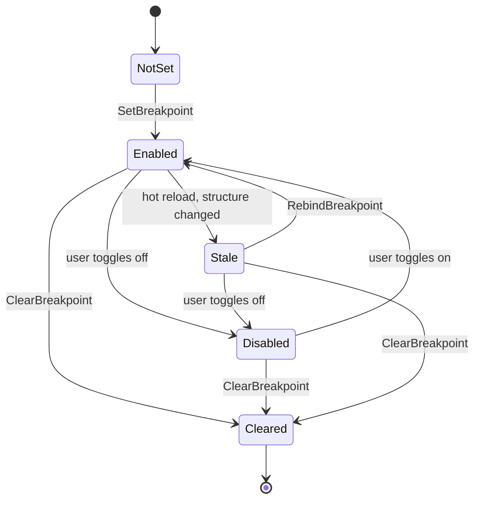

# Blueprint Subsystem — Debug Protocol Detailed Design

> **Status:** Detailed design, derived from `Blueprint_Subsystem_Architecture_v1.2.md` + Final Resolutions + Inline Patches + Implementation Roadmap v1.1 + Compiler DD (+ Inline Patches v1, v2) + Runtime DD (+ Inline Patches) + Test Harness DD (+ Inline Patches) + Hot Reload DD (+ Inline Patches). All Debug Protocol DD inline patches integrated.
> **Audience:** Implementation agent and human reviewer.
> **Drives:** Milestone M12 (debug protocol implementation; editor UI is M13).
> **Doesn't cover:** Editor window UX (Editor DD), compile-time debug probe insertion (Compiler DD §9.11), tick-system probe routing (Runtime DD §6.x mention only).
> **Companion code lives in:** `Hrot/Subsystems/Blueprints/Hrot.Blueprints.Core/Debug/` for the interface + types, `Hrot/Subsystems/Blueprints/Hrot.Blueprints.Editor/Debug/` for the production session impl.

---

## Table of Contents

1. Overview and design goals
2. `IBlueprintDebugSession` interface
3. `DebugProbe` static dispatcher
4. Debug map format
5. Node-id resolution and structure-hash safety
6. Breakpoints
7. Step semantics for visual scripts
8. Watch expressions and pin-value snapshotting
9. Multi-entity debugging
10. PDB integration for source-line breakpoints
11. Hot reload interaction
12. Test strategy
13. Open questions

---

## 1. Overview and design goals

### 1.1 What the debug protocol owns

The debug protocol is the layer between generated Blueprint code (which emits `DebugProbe.NodeEnter` / `PinValueChanged` calls) and the editor's UI windows (which render execution state, accept breakpoint placements, etc.).

It owns:

- The `IBlueprintDebugSession` interface — contract for what the editor can ask and what the runtime emits.
- The `DebugProbe` static dispatcher — single global routing point so generated code has zero per-call decision logic.
- The `BlueprintDebugMap` format — JSON sidecar produced by the compiler (per Compiler DD §13) and consumed by the session to resolve node-ids ↔ (graph, asset) coordinates.
- Breakpoint matching logic, including the StructureHash safety check.
- Step-over / step-into / step-out semantics adapted for visual scripts.
- Watch-expression evaluation against live state.

### 1.2 What it does NOT own

- **The editor's UI windows** (graph view, watch panel, breakpoint list, callstack panel) — these are Editor DD.
- **PDB symbol loading** — that's the Hot Reload DD's responsibility; the debug protocol consumes already-loaded symbols.
- **Compile-time probe insertion** — Compiler DD §9.11 owns where probes go in the IR.
- **The runtime tick path's probe-handoff** — the generated code calls `DebugProbe.NodeEnter(self, nodeId)` directly; the runtime tick systems don't touch the protocol.

### 1.3 Slice 1 scope

For Slice 1 the debug protocol is **observational and gentle-control**, not full step-debugger:

- **In scope:** node-entry tracing, breakpoints (unconditional, by node-id), watch expressions over Instance dispatch state, hit-count tracking, simulation-pause-on-hit.
- **Out of scope for Slice 1:** conditional breakpoints, data breakpoints on pin-value changes, time-reversal, multi-line step-into of called peer Blueprints, source-level mixed stepping with hand-written C# in `Hrot.AI.Behaviors.dll`.

Slice 2 may expand into conditional breakpoints and full step-into across peer calls. The Slice 1 contract is designed to extend cleanly into that surface.

### 1.4 Modes the protocol supports

Compiler DD §9.11 introduced three probe levels. The protocol uses them:

| Mode | Probes emitted | Editor sees |
|---|---|---|
| `Release` | None | No live tracing. Breakpoints inactive (no probes to hit). |
| `Debug` | NodeEnter at every block-start that maps to a source node | Live execution highlighting, breakpoints work. |
| `Trace` | NodeEnter + PinValueChanged for every data pin | Live execution + watch panel updates without explicit watches set. |

In practice, the editor toggles **Debug** mode for assets the author is actively editing, **Release** for everything else. **Trace** is opt-in per-asset for deep dives.

The decision per-asset is made at compile time. Re-compiling with a different mode requires a Quick Reload or Full Rebuild.

### 1.5 Performance budget

The probe path is the per-frame cost ceiling for debugging. Targets:

- **Release mode:** zero overhead. No `DebugProbe.NodeEnter` calls in generated code; the field on `DebugProbe.Sink` is read by nobody.
- **Debug mode, no breakpoints, no watches:** ≤50 ns per node-enter probe call. Roughly one dictionary lookup + one virtual call.
- **Debug mode, with breakpoints set:** ≤200 ns per node-enter probe call (extra hash lookup against the breakpoint set).
- **Trace mode:** ≤300 ns per pin-value-changed probe call (includes boxing the value into an `object` for the event arg — yes, this allocates; Trace mode is opt-in).

These are guidelines, not hard contracts. The test harness includes a "probe overhead" benchmark per Compiler DD §17.10 that catches regressions.

### 1.6 Threading model

The debug protocol is **single-threaded, main-thread-only** for Slice 1:

- All probe calls (`NodeEnter`, `PinValueChanged`) happen during the simulation tick, which runs on the main thread.
- All editor UI calls into the session happen on the main thread (from the editor's frame callback).
- No cross-thread queues, no locks.
- **Probes never block the calling thread.** Probes are observation points that capture state and optionally request a frame-boundary pause. Simulation always returns from the probe call within nanoseconds, regardless of breakpoint state.

FDP's `SubsystemOrchestrator` runs `Update()` (ECS simulation) and `DrawUI()` (ImGui rendering) sequentially on the same main thread. Blocking inside `BlueprintTickSystem.Execute` would mean `DrawUI()` never runs. Breakpoint hits therefore do not block the thread; they capture state, request a time-controller pause, and return immediately. The engine halts time advancement on the next frame, so the user inspects state in the editor UI. Step operations advance the engine by exactly one tick.

If the engine later moves simulation to a worker thread, the protocol needs threading rework. Slice 1's main-thread assumption is documented and tested.

---

## 2. `IBlueprintDebugSession` interface

### 2.1 The full surface

```csharp
namespace Hrot.Blueprints.Core.Debug;

public interface IBlueprintDebugSession : IBlueprintProbeSink
{
    // -- Lifecycle --
    bool IsAttached { get; }
    void Detach();

    // -- Breakpoint management --
    BreakpointId SetBreakpoint(Guid assetId, Guid graphId, Guid nodeId);
    void ClearBreakpoint(BreakpointId id);
    void ClearAllBreakpoints();
    IReadOnlyList<Breakpoint> GetBreakpoints();
    bool IsAnyBreakpointActive { get; }

    // -- Watches --
    WatchId AddWatch(Guid assetId, Guid graphId, Guid pinId);
    void RemoveWatch(WatchId id);
    void ClearAllWatches();
    IReadOnlyList<Watch> GetWatches();
    bool IsAnyWatchActive { get; }

    // -- Hit response and pause control --
    bool IsPaused { get; }
    Breakpoint? PausedAt { get; }
    Entity? PausedOnEntity { get; }

    void Continue();
    void StepOver();
    void StepInto();
    void StepOut();
    void Pause();   // explicit user pause

    // -- Inspection (snapshot at pause time) --
    BlueprintStateSnapshot? GetCurrentStateSnapshot();
    IReadOnlyList<NodeExecuted> GetRecentNodeHistory(int maxCount = 100);

    // -- Events for editor UI --
    event Action<BreakpointHit>? OnBreakpointHit;
    event Action<NodeExecuted>? OnNodeExecuted;
    event Action<PinValueChanged>? OnPinValueChanged;
    event Action? OnSessionStateChanged;
}
```

### 2.2 The data records

```csharp
public readonly record struct BreakpointId(int Value);
public readonly record struct WatchId(int Value);

public sealed record Breakpoint(
    BreakpointId Id,
    Guid AssetId,
    Guid GraphId,
    Guid NodeId,
    int HitCount,
    bool Enabled,
    string DisplayName);            // resolved from debug map

public sealed class Watch
{
    public WatchId Id { get; init; }
    public Guid AssetId { get; init; }
    public Guid GraphId { get; init; }
    public Guid PinId { get; init; }
    public string PinIdString { get; private set; } = "";
    public string DisplayName { get; init; } = "";
    public Type ExpectedType { get; init; } = typeof(int);
    public int ExpectedSizeBytes { get; init; }

    // 64 bytes of inline storage. Sufficient for any unmanaged scalar or small struct
    // the compiler emits (Vector3 = 12 bytes; Entity = 8 bytes; Matrix4x4 = 64 bytes).
    // Allocated once at watch construction, reused for all updates -- zero per-update alloc.
    private readonly byte[] _valueBuffer = new byte[64];
    public ReadOnlySpan<byte> LastValueBytes => _valueBuffer.AsSpan(0, ExpectedSizeBytes);

    public Entity LastUpdateEntity { get; private set; }
    public uint LastUpdateTick { get; private set; }
    public int UpdateCount { get; private set; }
    public bool HasEverBeenWritten { get; private set; }
    public bool IsStale { get; private set; }

    internal void WriteValue<T>(T value, Entity self, uint tick) where T : unmanaged
    {
        if (Unsafe.SizeOf<T>() > _valueBuffer.Length)
            throw new InvalidOperationException(
                $"Watch buffer too small for type {typeof(T).Name} " +
                $"({Unsafe.SizeOf<T>()} bytes > {_valueBuffer.Length}).");
        Unsafe.WriteUnaligned(ref _valueBuffer[0], value);
        LastUpdateEntity = self;
        LastUpdateTick = tick;
        UpdateCount++;
        HasEverBeenWritten = true;
    }

    internal void UpdatePinIdString(string s) => PinIdString = s;
    internal void MarkStale(bool b) => IsStale = b;
}

public sealed record BreakpointHit(
    Breakpoint Breakpoint,
    Entity Self,
    float SimulationTime,
    uint Tick);

public sealed record NodeExecuted(
    Entity Self,
    Guid AssetId,
    Guid NodeId,
    string NodeIdString,            // the string form used in DebugProbe.NodeEnter
    float SimulationTime,
    uint Tick);

public sealed record PinValueChanged(
    Entity Self,
    Guid AssetId,
    Guid PinId,
    byte[] ValueBytes,           // copied from watch's buffer at firing time
    Type ValueType,
    float SimulationTime);

public sealed record BlueprintStateSnapshot(
    Entity Self,
    Guid AssetId,
    string AssetName,
    BlueprintDispatchKind Dispatch,
    IReadOnlyDictionary<string, object> FieldValues,    // by field name
    BlueprintLatentCursor? Cursor);                      // null for non-Instance
```

The record-based design makes everything immutable; editor UI can snapshot any of these into its own state without race risk. All identifier types (`BreakpointId`, `WatchId`) are value structs to enable cheap equality and dictionary key use.

### 2.3 Two implementations

Two concrete classes implement the interface:

- **`BlueprintDebugSession`** (production) — lives in `Hrot.Blueprints.Editor.Debug`; owned by the editor; routes events to UI windows.
- **`CapturingDebugSession`** (test) — lives in `Hrot.Blueprints.Tests`; records all calls into in-memory lists for assertion (per Test Harness DD §10).

Both implement `IBlueprintDebugSession` and `IBlueprintProbeSink`. Tests can substitute one for the other without touching the rest of the system.

### 2.4 `IBlueprintProbeSink` (compile-time entry point)

Generated code calls `DebugProbe.NodeEnter(...)` which routes to whatever `Sink` is set. The `IBlueprintProbeSink` interface is the thin contract between generated code and the session:

```csharp
public interface IBlueprintProbeSink
{
    void OnNodeEnter(Entity self, string nodeId);
    void OnPinValueChanged<T>(Entity self, string pinId, T value) where T : unmanaged;
    void OnPeerCallEnter(Entity self, string peerAssetIdString, string methodName);
    void OnPeerCallExit(Entity self, string peerAssetIdString, string methodName);
}
```

Four methods. The `nodeId` parameter is a string (a Guid in canonical "00000000-0000-0000-0000-000000000000" form) so the compiler can emit it as a const string literal — no per-call Guid parse, no allocation.

The session implementations convert string → Guid lazily when needed (e.g., during breakpoint matching against the breakpoint set).

### 2.5 Why string node-ids on the hot path

Two design considerations push toward strings:

- **Compiler emission cost.** Generated code emits `DebugProbe.NodeEnter(self, "12345678-1234-1234-1234-123456789012");`. The string is a constant interned at compile time; no allocation per call.
- **Breakpoint set lookup cost.** The session's breakpoint set is keyed by string. Lookup is a hash + compare; faster than Guid parse → Guid equality.

For the editor's UI work (rendering breakpoints, watches), the Guid form is cleaner. The session converts at the boundary, not on the hot path.

### 2.6 `Sink` field and routing

```csharp
namespace Hrot.Blueprints.Core.Debug;

public static class DebugProbe
{
    public static IBlueprintProbeSink Sink { get; set; } = NullProbeSink.Instance;

    public static void NodeEnter(Entity self, string nodeId)
        => Sink.OnNodeEnter(self, nodeId);

    public static void PinValueChanged<T>(Entity self, string pinId, T value)
        where T : unmanaged
        => Sink.OnPinValueChanged(self, pinId, value);
}

public sealed class NullProbeSink : IBlueprintProbeSink
{
    public static NullProbeSink Instance { get; } = new NullProbeSink();
    private NullProbeSink() { }
    public void OnNodeEnter(Entity self, string nodeId) { }
    public void OnPinValueChanged<T>(Entity self, string pinId, T value) where T : unmanaged { }
    public void OnPeerCallEnter(Entity self, string peerAssetIdString, string methodName) { }
    public void OnPeerCallExit(Entity self, string peerAssetIdString, string methodName) { }
}
```

When no session is attached (production builds), `Sink` is `NullProbeSink.Instance`. Both interface methods are empty; the JIT can typically inline them away after a few warmup invocations, making the probe calls effectively free.

Setting `Sink` is a single field write on the main thread. No locks. The session implementation is responsible for thread safety internally (Slice 1: it isn't — single-threaded).

---

## 3. `DebugProbe` static dispatcher — deeper look

### 3.1 What the compiler emits

Per Compiler DD §10 / §15, generated code in Debug or Trace mode includes calls like:

```csharp
__block_phase0_initial:
{
    DebugProbe.NodeEnter(self, "11111111-2222-3333-4444-555555555555");
    Vector3 __t0 = p.TargetPosition;
    // ...
}
```

The string literal is the compile-time resolution of the source node's Guid. The compiler does this resolution during Stage 7 emit (per Compiler DD §10.10).

For pin-value tracing in Trace mode:

```csharp
__block_phase0_initial:
{
    DebugProbe.NodeEnter(self, "11111111-2222-3333-4444-555555555555");
    Vector3 __t0 = p.TargetPosition;
    DebugProbe.PinValueChanged(self, "aaaaaaaa-bbbb-cccc-dddd-eeeeeeeeeeee", __t0);
    // ...
}
```

The pin-value variant uses the generic `<T>` overload so the value isn't boxed at the call site. Boxing happens inside the sink, where it's already on the slow path (we're handling an event for the editor).

### 3.2 Zero-overhead in Release mode

Compiler DD §10.10 specifies that Release mode emits *no* DebugProbe calls. The branch never runs; the static field `DebugProbe.Sink` is never read. JIT can optimize away references entirely after class init.

This is the most important performance property of the design: Release builds pay nothing for debug capability, not even a null check.

### 3.3 Per-mode emission table

| Probe site | Release | Debug | Trace |
|---|---|---|---|
| Node entry (any source node) | — | NodeEnter | NodeEnter |
| Data pin value (any data pin read) | — | — | PinValueChanged |
| Control-flow boundary (block edge with no source node) | — | — | — |
| AiPrimitive phase advance | — | NodeEnter at phase-block entry | NodeEnter at phase-block entry |
| Wait suspend point | — | NodeEnter at the wait node | NodeEnter at the wait node |
| Wait resume point | — | NodeEnter at the next node | NodeEnter at the next node |

The pattern: a probe fires once at each *source-node boundary* (the start of executing code that represents a single visual node in the graph). This maps editor-visible nodes to runtime execution.

### 3.4 Why a static dispatcher and not DI

The probe is called from inside generated code on the simulation hot path. We need:

1. **Zero allocation** — no virtual call indirection that JIT can't inline.
2. **Zero per-call lookup** — no `IServiceProvider.GetService<IBlueprintProbeSink>()`.
3. **Hot-swappable** — the editor can attach/detach a session without recompiling generated code.

A static field assignment hits all three. The JIT inlines the field read; the virtual call through the interface is one indirect jump; the field is replaced atomically by a single CPU-level pointer write.

DI / parameter injection would force the session reference into every generated method signature, balloon the surface area, and create awkward lifetimes (what if the session is null mid-tick because we just detached?). The static dispatcher's null-object pattern (`NullProbeSink`) is cleaner.

### 3.5 What about thread safety on the static field

The `DebugProbe.Sink` setter is a single reference assignment, which is atomic on all platforms .NET supports. For Slice 1's single-threaded model, no further synchronization is needed.

If a future Slice 2 worker thread runs simulation, we'd need `Volatile.Read` on the read side or a `MemoryBarrier` around the swap. Out of scope.

### 3.6 What gets passed in `Entity self`

For Instance dispatch: the entity whose `Tick` is being invoked. Generated code already has `self` in scope; pass it through.

For AiPrimitive in BTree: the `ctx.Self` from `BTreeContext`. Generated thunk wraps this:

```csharp
public static NodeStatus BTreeTick(
    ref BrainBlackboard bb,
    ref BehaviorTreeState state,
    ref BTreeContext ctx,
    int paramIndex)
{
    // ...
    return TickCore(ref p, ref ws, ctx.Self, ctx.World, ctx.World.Time);
}

// Inside TickCore:
__block_phase0_initial:
{
    DebugProbe.NodeEnter(self, "...");  // self came in from ctx.Self
    // ...
}
```

For AiPrimitive in HSM: the `bridge->Self` from `HsmKernelBridge*`. Generated thunk does the same projection.

For world-singleton Blueprints: `Entity.Null`. The session understands this as "world-singleton" and renders it accordingly in UI (asset name shown, no entity reference).

### 3.7 String literal interning concern

Compiler-emitted string literals like `"11111111-2222-3333-4444-555555555555"` are interned by the .NET runtime — multiple call sites with the same literal share one `string` instance. The probe call passes this reference.

The session's breakpoint matching uses `Dictionary<string, Breakpoint>` keyed by these strings. Hash is computed once on lookup; equality is reference-equality first (intern hit), fall through to ordinal compare if needed. Microsecond-fast for thousands of breakpoints.

The lifetime of these strings is tied to the loaded assembly. After hot reload, the old assembly's strings can be reclaimed. The session must clear stale breakpoint entries on reload; covered in §11.

---

*Continued in Part 2 — §4 debug map format, §5 node-id resolution + structure-hash safety, §6 breakpoints.*

## 4. Debug map format

### 4.1 Purpose

The debug map is the JSON sidecar produced by the compiler per asset (per Compiler DD §13). It maps runtime identifiers (the string node-ids passed to `DebugProbe.NodeEnter`) to source coordinates (asset, graph, node) and back. Both directions are needed:

- **Forward (runtime → editor):** "node entry just happened with id `12345678-...`" → "that's the Subtract node in the OnHit graph of HealthRegen, at line 73 of the generated source."
- **Backward (editor → runtime):** "user clicked the Subtract node in the OnHit graph to set a breakpoint" → "register a breakpoint string-keyed by `12345678-...`."

### 4.2 The on-disk format

One file per asset, sibling to the generated `.g.cs`. Filename pattern: `{SanitizedName}_{BlueprintId:X8}_Bp.dbgmap.json`.

```json
{
  "schemaVersion": "1.0",
  "assetId": "11111111-2222-3333-4444-555555555555",
  "assetName": "MoveToAndFire",
  "blueprintId": -1582119980,
  "blueprintIdHex": "0xA1B2C3D4",
  "structureHash": "0x0123456789ABCDEF",
  "generatedSourcePath": "MoveToAndFire_A1B2C3D4_Bp.g.cs",
  "graphs": [
    {
      "graphId": "graph-main-guid-here",
      "graphName": "Main",
      "graphKind": "Function"
    }
  ],
  "nodes": [
    {
      "nodeId": "n-cmd-move-guid-here",
      "graphId": "graph-main-guid-here",
      "nodeKind": "ChannelCommand",
      "displayName": "Locomotion / MoveTo",
      "sourceStartLine": 50,
      "sourceEndLine": 71,
      "phaseIndex": 0
    },
    {
      "nodeId": "n-wait-move-guid-here",
      "graphId": "graph-main-guid-here",
      "nodeKind": "WaitForChannel",
      "displayName": "Wait for Locomotion",
      "sourceStartLine": 73,
      "sourceEndLine": 86,
      "phaseIndex": 1
    }
  ],
  "pins": [
    {
      "pinId": "in-dest-guid-here",
      "nodeId": "n-cmd-move-guid-here",
      "pinName": "Destination",
      "pinDirection": "Input",
      "pinKind": "Data",
      "typeFullName": "System.Numerics.Vector3",
      "valueAccessExpression": "__t0"
    }
  ],
  "stateLayout": {
    "fields": [
      { "name": "Cursor", "type": "BlueprintLatentCursor", "offsetBytes": 0, "sizeBytes": 16 },
      { "name": "CurrentHealth", "type": "System.Int32", "offsetBytes": 16, "sizeBytes": 4 }
    ]
  }
}
```

### 4.3 Field semantics

**Top-level:**
- `schemaVersion`: starts at "1.0"; bump on breaking changes.
- `assetId`, `assetName`, `blueprintId`, `blueprintIdHex`: identity carried from the asset.
- `structureHash`: the value at compile time; the session uses this to detect stale breakpoints (see §5).
- `generatedSourcePath`: the virtual filename of the generated C#; matches what's in PDBs.

**Graphs array:**
- Lists every graph in the asset by id. Helps the editor build the graph-view's table of contents.
- `graphKind`: "Function" / "Event" — drives editor UI grouping.

**Nodes array:**
- One entry per visual node in any graph.
- `nodeKind`: the visual node type (e.g., "ChannelCommand", "WaitForChannel", "Return", "Branch"). Editor uses this for icon rendering and validation.
- `displayName`: human-friendly label for editor lists.
- `sourceStartLine`, `sourceEndLine`: inclusive range in the generated source. Used for PDB cross-reference (see §10).
- `phaseIndex`: present only for AiPrimitive Wait nodes; indicates which phase byte value this Wait corresponds to. Helps the editor render "currently waiting" state with the right marker. Absent for other node kinds.

**Pins array:**
- Every data pin and exec pin in the graph. Editor uses for watch-expression UI.
- `valueAccessExpression`: the generated-code expression for reading this pin's value at runtime. The session uses this to evaluate watches (see §8).

**stateLayout:** (Instance and AiPrimitive only)
- The field-by-field layout of the State / WorkingState struct.
- Used for in-place memory inspection in the editor: the editor reads the slot's payload bytes and uses `offsetBytes` / `sizeBytes` to project each field.

### 4.4 Why JSON and not binary

Three reasons:
1. **Human-readable for debugging the compiler.** When a node's `displayName` looks wrong, the dev opens the JSON and sees what got emitted.
2. **Editor reads it once per asset.** Parsing cost is amortized over the editing session; allocations don't matter.
3. **Roundtrips through source control cleanly.** JSON diffs are reviewable in PRs.

The session indexes the JSON into hash tables on load; the on-disk format isn't the runtime lookup path.

### 4.5 What the session does on load

```csharp
public sealed class DebugMapIndex
{
    private readonly Dictionary<string, NodeMapEntry> _nodesByString;    // string-keyed for hot-path lookup
    private readonly Dictionary<Guid, NodeMapEntry> _nodesByGuid;
    private readonly Dictionary<Guid, PinMapEntry> _pinsByGuid;
    private readonly Dictionary<Guid, GraphMapEntry> _graphsByGuid;

    public Guid AssetId { get; }
    public string AssetName { get; }
    public int BlueprintId { get; }
    public ulong StructureHash { get; }
    public string GeneratedSourcePath { get; }

    public DebugMapIndex(BlueprintDebugMap raw)
    {
        AssetId = raw.AssetId;
        AssetName = raw.AssetName;
        BlueprintId = raw.BlueprintId;
        StructureHash = raw.StructureHash;
        GeneratedSourcePath = raw.GeneratedSourcePath;

        _nodesByString = new Dictionary<string, NodeMapEntry>(StringComparer.Ordinal);
        _nodesByGuid = new Dictionary<Guid, NodeMapEntry>();
        _pinsByGuid = new Dictionary<Guid, PinMapEntry>();
        _graphsByGuid = new Dictionary<Guid, GraphMapEntry>();

        foreach (var g in raw.Graphs)
            _graphsByGuid[g.GraphId] = new GraphMapEntry(g.GraphId, g.GraphName, g.GraphKind);

        foreach (var n in raw.Nodes)
        {
            var entry = new NodeMapEntry(
                NodeId: n.NodeId,
                NodeIdString: n.NodeId.ToString("D"),       // canonical lowercase hyphenated
                GraphId: n.GraphId,
                NodeKind: n.NodeKind,
                DisplayName: n.DisplayName,
                SourceStartLine: n.SourceStartLine,
                SourceEndLine: n.SourceEndLine,
                PhaseIndex: n.PhaseIndex);
            _nodesByString[entry.NodeIdString] = entry;
            _nodesByGuid[n.NodeId] = entry;
        }

        foreach (var p in raw.Pins)
            _pinsByGuid[p.PinId] = new PinMapEntry(/* ... */);
    }

    public NodeMapEntry? TryResolveNodeFromString(string nodeIdString)
        => _nodesByString.TryGetValue(nodeIdString, out var entry) ? entry : null;

    public NodeMapEntry? TryResolveNodeFromGuid(Guid nodeId)
        => _nodesByGuid.TryGetValue(nodeId, out var entry) ? entry : null;

    public PinMapEntry? TryResolvePinFromGuid(Guid pinId)
        => _pinsByGuid.TryGetValue(pinId, out var entry) ? entry : null;
}

public sealed record NodeMapEntry(
    Guid NodeId, string NodeIdString, Guid GraphId,
    string NodeKind, string DisplayName,
    int SourceStartLine, int SourceEndLine, int? PhaseIndex);
```

The double-keying (string + Guid) is the trade-off: hot-path runtime lookups (probe callbacks) use the string key; editor UI uses the Guid key. Memory overhead is one extra dictionary entry per node — for ~50 Blueprints with ~20 nodes each, that's ~1000 entries, negligible.

### 4.6 Lifecycle: when the session loads / unloads maps

The session maintains a per-asset map: `Dictionary<Guid, DebugMapIndex> _mapsByAsset`. The lifecycle:

- **On registry commit** (per Hot Reload DD §5.5 `OnRegistryChanged`): the session walks the new registry, locates the `.dbgmap.json` sidecar for each registered Blueprint (in MSBuild output dir for full rebuild; in-memory blob for Quick Reload), parses, indexes. Replaces any existing map for the same `AssetId`.
- **On asset removal from registry**: the session drops the map.
- **On editor session detach** (e.g., closing all editor windows): the session clears all maps.

For Quick Reload, the in-memory compiler returns the debug map JSON alongside the compiled assembly bytes. The editor passes it to the session at the same time it calls `coordinator.ApplyQuickReload(...)`.

For Full Rebuild via MSBuild, the debug map is written to disk by the source generator (per Compiler DD §13.6). The session finds it next to the DLL using the generated source filename + `.dbgmap.json`.

### 4.7 What if the map is missing or unparseable

The session must be defensive. If a probe fires with a `nodeId` string that doesn't resolve in any map:

- The breakpoint-match path returns "no match" silently (probe is a no-op).
- The node-execution-history path records the raw string with `null` resolution.
- The editor displays "(unmapped node)" in any UI that would have shown the node name.

The probe itself never throws. Worst case, the editor's UI shows degraded labeling.

If a debug map file fails to parse (e.g., JSON corruption from a partial write), the session logs the error and skips that asset's map. Breakpoints already set for that asset's nodes go inert until a clean map arrives via reload.

---

## 5. Node-id resolution and structure-hash safety

### 5.1 The stale-breakpoint problem

A user sets a breakpoint on the Subtract node in `HealthRegen` (asset version v1). The session records the breakpoint keyed by node-id string `"12345678-1234-1234-1234-123456789012"`.

Then:
- The user edits the asset — deletes the Subtract node, adds a different node in its place.
- The new node happens to get an *unrelated* Guid (the compiler generates fresh Guids for added nodes, but this is just an example of identity drift).
- Hot reload commits the new `BlueprintDefinition` with the same `BlueprintId` (same `AssetId`).

The old node-id `"12345678..."` is no longer in any debug map. The old breakpoint is effectively dead — it should be cleared, or surfaced to the user as "this breakpoint is no longer valid."

But consider the safer case:
- The user sets a breakpoint on Subtract node.
- The user edits the asset — changes a literal value somewhere unrelated.
- The structure hash *doesn't change* (it's a literal-value change, not a layout change).
- The Subtract node is unchanged; its Guid is unchanged.
- Hot reload commits. The old breakpoint should *still work*.

The session needs to distinguish these cases.

### 5.2 The structure-hash safety check

Each breakpoint stores the `StructureHash` of the asset that was current when the breakpoint was set. On every probe call, the session compares against the current asset's `StructureHash`:

| Stored hash | Current hash | Action |
|---|---|---|
| Match | Match | Breakpoint fires if node-id matches. |
| Don't match | (irrelevant) | Breakpoint is in "stale" state; doesn't fire; surfaces in UI as warning. |
| (no stored hash) | (any) | This is the case at session start before any commit; treat as wildcard match. |

The compare is cheap — one 64-bit equality.

Implementation:

```csharp
public sealed class Breakpoint
{
    public BreakpointId Id { get; }
    public Guid AssetId { get; }
    public Guid GraphId { get; }
    public Guid NodeId { get; }
    public string NodeIdString { get; }
    public ulong AssetStructureHashAtSetTime { get; }   // captured at SetBreakpoint
    public int HitCount { get; private set; }
    public bool Enabled { get; set; }
    public string DisplayName { get; }
    public bool IsStale { get; private set; }

    internal void IncrementHit() => HitCount++;
    internal void MarkStale(bool isStale) => IsStale = isStale;
}
```

On `SetBreakpoint(assetId, graphId, nodeId)`, the session looks up the current `BlueprintDefinition` (via `BlueprintRegistry.TryGetById(BlueprintIdHash.Compute(assetId), out var def)`) and stores `def.StructureHash` into the breakpoint record.

On every probe call:

```csharp
public void OnNodeEnter(Entity self, string nodeId)
{
    if (!_breakpointsByNodeIdString.TryGetValue(nodeId, out var bp)) return;
    if (!bp.Enabled || bp.IsStale) return;

    // The structure-hash check
    var asset = FindAssetForNodeId(nodeId);   // looks up which asset's map contains nodeId
    if (asset is null) return;                // unmapped node
    if (!_registry.TryGetById(BlueprintIdHash.Compute(asset.AssetId), out var def)) return;
    if (def.StructureHash != bp.AssetStructureHashAtSetTime) return;

    // Safe to fire
    bp.IncrementHit();
    var hit = new BreakpointHit(bp.ToImmutableSnapshot(), self, _view.Time, _view.Tick);
    HandleBreakpointHit(hit);
}
```

### 5.3 Reconciliation after hot reload

After `OnRegistryChanged` fires, the session walks all breakpoints and updates their `IsStale` flag:

```csharp
private void ReconcileBreakpointsAgainstRegistry()
{
    foreach (var bp in _breakpoints.Values)
    {
        // Locate the asset for this breakpoint's node
        if (!_mapsByAsset.TryGetValue(bp.AssetId, out var map))
        {
            bp.MarkStale(true);
            continue;
        }

        if (map.TryResolveNodeFromGuid(bp.NodeId) is null)
        {
            // Node deleted from asset
            bp.MarkStale(true);
            continue;
        }

        if (map.StructureHash != bp.AssetStructureHashAtSetTime)
        {
            // Structure changed — semantics may have shifted
            bp.MarkStale(true);
            continue;
        }

        bp.MarkStale(false);
    }
    OnSessionStateChanged?.Invoke();   // editor refreshes UI to show stale markers
}
```

A stale breakpoint is *not* deleted automatically; the user sees a yellow warning marker in the editor and decides:
- "Yes, re-bind this breakpoint to the same-named node in the new structure" → editor calls `RebindBreakpoint(bp.Id, newAssetHash)`.
- "Discard" → editor calls `ClearBreakpoint(bp.Id)`.

For Slice 1 this is manual. Slice 2 may add "auto-rebind if node-id and asset-id still match" as a quality-of-life feature.

### 5.4 Why we trust the node-id Guid

A subtle question: if the user adds a node in the same logical position as a deleted node, but the new node has a different Guid, isn't that "the same node from the user's perspective"?

The compiler treats node-ids as durable identifiers — when an author creates a node in the editor, the editor assigns it a Guid that survives across saves and across structural edits. Deleting a node *and re-adding* a similar one produces a new Guid (it's a new node, even if it looks the same).

This is the same convention as Unreal Blueprint and most visual editors. The user accepts that "delete + add" loses any in-place metadata (breakpoints, watches).

The user *renaming* or *editing a property* of a node preserves its Guid — those don't break breakpoints.

### 5.5 Stale-node edge case

What if a node is deleted entirely but a probe call somehow still references it? This shouldn't happen in correctly-generated code (the compiler regenerates from the new asset, no probe call survives for a deleted node), but defensive handling:

```csharp
public void OnNodeEnter(Entity self, string nodeId)
{
    // ... breakpoint lookup ...
    var resolvedNode = FindNodeAcrossAllMaps(nodeId);
    if (resolvedNode is null)
    {
        // Probe call references a node we don't know about.
        // Possibly stale code in the ALC that's still ticking briefly post-reload.
        // Log once, silently ignore subsequent.
        if (!_warnedAboutUnmappedNodes.Contains(nodeId))
        {
            _warnedAboutUnmappedNodes.Add(nodeId);
            _logger.LogDebug($"DebugProbe.NodeEnter with unmapped nodeId {nodeId}; ignoring.");
        }
        return;
    }
    // ... structure-hash check ...
}
```

Defensive logging only — never throw, never crash.

---

## 6. Breakpoints

### 6.1 Breakpoint lifecycle



Five states: NotSet, Enabled, Disabled, Stale, Cleared. The session's `Breakpoint` record carries `Enabled : bool` and `IsStale : bool` flags; both must be `(Enabled=true, IsStale=false)` for the breakpoint to fire.

### 6.2 Setting a breakpoint

```csharp
public sealed class BlueprintDebugSession : IBlueprintDebugSession
{
    private readonly BlueprintRegistry _registry;
    private readonly ISimulationView _view;
    private readonly Dictionary<BreakpointId, Breakpoint> _breakpoints = new();
    private readonly Dictionary<string, List<Breakpoint>> _breakpointsByNodeIdString = new(StringComparer.Ordinal);
    private readonly Dictionary<Guid, DebugMapIndex> _mapsByAsset = new();
    private int _nextBreakpointId = 1;

    public BreakpointId SetBreakpoint(Guid assetId, Guid graphId, Guid nodeId)
    {
        if (!_mapsByAsset.TryGetValue(assetId, out var map))
            throw new InvalidOperationException(
                $"No debug map loaded for asset {assetId}. Asset may not be in the registry.");

        var node = map.TryResolveNodeFromGuid(nodeId)
            ?? throw new InvalidOperationException(
                $"Node {nodeId} not found in asset {assetId}.");

        if (!_registry.TryGetById(BlueprintIdHash.Compute(assetId), out var def))
            throw new InvalidOperationException(
                $"Asset {assetId} has a debug map but is not in the live registry.");

        var bp = new Breakpoint
        {
            Id = new BreakpointId(_nextBreakpointId++),
            AssetId = assetId,
            GraphId = graphId,
            NodeId = nodeId,
            NodeIdString = node.NodeIdString,
            AssetStructureHashAtSetTime = def.StructureHash,
            HitCount = 0,
            Enabled = true,
            DisplayName = node.DisplayName,
            IsStale = false,
        };

        _breakpoints[bp.Id] = bp;
        AddToStringIndex(bp);

        OnSessionStateChanged?.Invoke();
        return bp.Id;
    }

    private void AddToStringIndex(Breakpoint bp)
    {
        if (!_breakpointsByNodeIdString.TryGetValue(bp.NodeIdString, out var list))
            _breakpointsByNodeIdString[bp.NodeIdString] = list = new List<Breakpoint>();
        list.Add(bp);
    }
}
```

### 6.3 Multiple breakpoints per node

The session's design supports multiple breakpoints on the same node (different breakpoint IDs, possibly across different sessions in Slice 2 multi-debugger scenarios). Slice 1 typically has one per node, but the `List<Breakpoint>` indexing accommodates more without special-casing.

On a probe call hitting the index, the session walks the list and fires every matching active breakpoint. Order is set-time order.

### 6.4 Hit response: the pause flow

When a breakpoint fires:

```csharp
private void HandleBreakpointHit(BreakpointHit hit)
{
    _pausedAt = hit.Breakpoint;
    _pausedOnEntity = hit.Self;
    _isPaused = true;

    // Capture state snapshot before returning -- the slot bytes are stable
    // until the next tick, so we can read them after the probe returns,
    // but capturing now ensures the snapshot reflects the exact moment of hit.
    _pauseSnapshot = CaptureStateSnapshot(hit.Self, hit.Breakpoint.AssetId);

    // Request the engine pause at the next frame boundary.
    // The current tick continues to completion -- probes for other entities
    // hitting the same breakpoint accumulate hit counts but don't request
    // additional pauses (already paused).
    _timeController.RequestPause();

    // Fire event for editor UI. The handler runs after the tick completes,
    // during the same frame's DrawUI phase. UI shows breakpoint hit.
    OnBreakpointHit?.Invoke(hit);
    OnSessionStateChanged?.Invoke();

    // Return immediately -- no thread block.
}
```

The probe call (on the simulation thread, which is the main thread for Slice 1) returns immediately after requesting a frame-boundary pause. The engine completes the current tick naturally, then halts time advancement. While halted, the editor UI is responsive (the editor's `DrawUI()` phase runs on the same thread in subsequent frames).

### 6.5 Resume operations

```csharp
public void Continue()
{
    _stepMode = StepMode.None;
    ClearPauseState();
    _timeController.RequestResume();
}

public void StepOver()
{
    // Capture step-from context BEFORE clearing pause
    _stepMode = StepMode.Over;
    _stepFromNodeIdString = _pausedAt!.NodeIdString;
    _stepFromEntity = _pausedOnEntity!.Value;
    SignalResume();
}

// StepInto, StepOut analogous -- see §7

private void ClearPauseState()
{
    _isPaused = false;
    _pausedAt = null;
    _pausedOnEntity = null;
    _pauseSnapshot = null;
    OnSessionStateChanged?.Invoke();
}
```

After `ClearPauseState`, the engine receives a `RequestResume()` or `RequestStepOneTick()`. The probe call (which already returned non-blocking) has no signal to wait for. Stepping advances the engine by exactly one tick; the next probe call checks `_stepMode` and re-pauses if the step condition matched.

### 6.6 Hit count

`HitCount` is incremented on every breakpoint hit, regardless of pause behavior. Useful for users to see "this node has executed 142 times" without setting pauses.

For Slice 2: conditional breakpoints could use HitCount as a predicate (e.g., "pause every 10th hit"). Slice 1 doesn't expose this.

### 6.7 Disabling without removing

```csharp
public void SetBreakpointEnabled(BreakpointId id, bool enabled)
{
    if (_breakpoints.TryGetValue(id, out var bp))
    {
        bp.Enabled = enabled;
        OnSessionStateChanged?.Invoke();
    }
}
```

Disabled breakpoints stay in the index but don't fire. Useful for "I'll come back to this" cases without losing the placement.

### 6.8 Clearing

```csharp
public void ClearBreakpoint(BreakpointId id)
{
    if (!_breakpoints.TryGetValue(id, out var bp)) return;
    _breakpoints.Remove(id);
    if (_breakpointsByNodeIdString.TryGetValue(bp.NodeIdString, out var list))
    {
        list.RemoveAll(b => b.Id == id);
        if (list.Count == 0)
            _breakpointsByNodeIdString.Remove(bp.NodeIdString);
    }
    OnSessionStateChanged?.Invoke();
}

public void ClearAllBreakpoints()
{
    _breakpoints.Clear();
    _breakpointsByNodeIdString.Clear();
    OnSessionStateChanged?.Invoke();
}
```

### 6.9 Persistence

For Slice 1, breakpoints are in-memory only. Closing the editor clears them. Re-opening starts fresh.

Slice 2 may persist breakpoints to a per-project `breakpoints.json` next to the `.bp.json` files. The serialization is straightforward — `AssetId`, `NodeId`, `Enabled`. On editor reopen, walk the saved list and call `SetBreakpoint` for each.

---

*Continued in Part 3 — §7 step semantics, §8 watch expressions, §9 multi-entity debugging, §10 PDB integration, §11 hot reload interaction, §12 test strategy, §13 open questions.*

## 7. Step semantics for visual scripts

### 7.1 What "step" means in a visual graph

Traditional step debugging is line-oriented. Visual scripts are node-oriented. The three step operations adapt:

| Operation | Source-level meaning | Visual-script meaning |
|---|---|---|
| StepOver | Run the next statement; pause after, regardless of method calls inside | Advance to the next *node* in the current graph; don't pause inside peer-called Blueprints |
| StepInto | If the next statement is a method call, pause at its first statement | If the next node calls a peer Blueprint, pause at the first node of that peer's graph |
| StepOut | Run to the end of the current method; pause at the call site's next statement | Run to the Return of the current graph; pause at the caller's next node |

Slice 1 implements all three for Library and Instance dispatch. For AiPrimitive dispatch, StepOver works; StepInto is essentially equivalent (no peer calls in AiPrimitive bodies); StepOut is dispatch-aware (see §7.5).

### 7.2 Step state on the session

```csharp
public sealed class BlueprintDebugSession : IBlueprintDebugSession
{
    // Step state — set when user clicks Step{Over,Into,Out}, cleared after one hit
    private enum StepMode { None, Over, Into, Out }
    private StepMode _stepMode = StepMode.None;
    private string? _stepFromNodeIdString;
    private Guid _stepFromAssetId;
    private Entity? _stepFromEntity;
    private int _stepFromCallDepth;     // for StepOut tracking
}
```

When `StepOver` / `StepInto` / `StepOut` is called, the session sets `_stepMode` and the relevant context, then requests a one-tick advance. The next probe call checks `_stepMode` and decides whether to re-pause.

### 7.3 StepOver

The user wants: "from this node, advance one node and pause again, but don't pause inside any peer Blueprints called along the way."

```csharp
public void StepOver()
{
    // Capture step-from context BEFORE clearing pause
    _stepMode = StepMode.Over;
    _stepFromNodeIdString = _pausedAt!.NodeIdString;
    _stepFromAssetId = _pausedAt.AssetId;
    _stepFromEntity = _pausedOnEntity!.Value;
    _stepFromCallDepth = _currentCallDepth;
    _stepFromTick = _view.Tick;

    ClearPauseState();
    _timeController.RequestStepOneTick();
}

public void OnNodeEnter(Entity self, string nodeId)
{
    // Always update execution history (subject to history-buffer cap)
    RecordNodeHistory(self, nodeId);

    // Check breakpoints -- increment hit count, possibly fire event + request pause
    HandleBreakpointMatchingForNode(self, nodeId);

    // Check step mode
    if (_stepMode != StepMode.None)
        HandleStepMatchingForNode(self, nodeId);
}

private void HandleStepMatchingForNode(Entity self, string nodeId)
{
    bool shouldPause = _stepMode switch
    {
        StepMode.Over => MatchesStepOver(self, nodeId),
        StepMode.Into => MatchesStepInto(self, nodeId),
        StepMode.Out  => MatchesStepOut(self, nodeId),
        _ => false,
    };

    if (shouldPause)
    {
        var node = FindNodeAcrossAllMaps(nodeId);
        var pseudoBp = MakePseudoBreakpoint(self, nodeId, node);
        var hit = new BreakpointHit(pseudoBp, self, _view.Time, _view.Tick);

        _stepMode = StepMode.None;
        HandleBreakpointHit(hit);   // captures state, fires event, RequestPause
    }
}

private void HandleStepOver(Entity self, string nodeId) => MatchesStepOver(self, nodeId);

private bool MatchesStepOver(Entity self, string nodeId)
{
    // Pause when:
    //   1) Same entity (Slice 1: a step follows one entity; see §9)
    //   2) Same call depth or shallower (didn't recurse deeper or returned out)
    //   3) Different node-id than where we stepped from
    return _stepFromEntity == self
        && _currentCallDepth <= _stepFromCallDepth
        && nodeId != _stepFromNodeIdString;
}
```

The "shallower" condition (`_currentCallDepth <= _stepFromCallDepth`) is what makes StepOver skip peer Blueprints: while inside a peer call, `_currentCallDepth > _stepFromCallDepth`, so no pause. After the peer returns, depth restores, the next node in the original graph satisfies the condition, and we pause.

### 7.4 Tracking call depth

The session needs to know the current call depth — i.e., how many peer-Blueprint frames are stacked. Peer calls happen in two places in generated code:

- **Instance dispatch** — `IrOp_CallPeerBlueprint` lowers to a direct call into the peer's `Tick` or a peer-callable function method.
- **AiPrimitive doesn't call peers** in Slice 1 (per Architecture §6.5, callable peers are only on Instance dispatch).

The compiler can emit "enter peer frame" and "exit peer frame" probes around generated peer calls in Debug mode:

```csharp
// Generated code for an Instance Blueprint that calls a peer:
__block_after_check:
{
    DebugProbe.NodeEnter(self, "n-decision-node");
    if (s.NeedsHelp)
    {
        DebugProbe.PeerCallEnter(self, "11111111-...", "RequestSupport");
        DoorSensor_Bp.Function_RequestSupport(ref otherState, view, ecb, self, time, deltaTime);
        DebugProbe.PeerCallExit(self, "11111111-...", "RequestSupport");
    }
    // ...
}
```

Add to the probe interface:

```csharp
public interface IBlueprintProbeSink
{
    void OnNodeEnter(Entity self, string nodeId);
    void OnPinValueChanged<T>(Entity self, string pinId, T value);
    void OnPeerCallEnter(Entity self, string peerAssetIdString, string methodName);
    void OnPeerCallExit(Entity self, string peerAssetIdString, string methodName);
}
```

And to `DebugProbe`:

```csharp
public static void PeerCallEnter(Entity self, string peerAssetIdString, string methodName)
    => Sink.OnPeerCallEnter(self, peerAssetIdString, methodName);

public static void PeerCallExit(Entity self, string peerAssetIdString, string methodName)
    => Sink.OnPeerCallExit(self, peerAssetIdString, methodName);
```

Session implementation:

```csharp
private int _currentCallDepth = 0;

public void OnPeerCallEnter(Entity self, string peerAssetIdString, string methodName)
{
    _currentCallDepth++;
    // Optionally record call-stack frames for UI display
    _callStack.Push(new CallFrame(self, peerAssetIdString, methodName, _view.Tick));
}

public void OnPeerCallExit(Entity self, string peerAssetIdString, string methodName)
{
    if (_callStack.Count > 0) _callStack.Pop();
    _currentCallDepth--;
}
```

`NullProbeSink` implements both as no-ops, so Release mode pays nothing.

### 7.5 StepInto

The user wants: "from this node, follow execution into the next call frame; pause at the first node of any peer Blueprint called from here."

```csharp
public void StepInto()
{
    _stepMode = StepMode.Into;
    _stepFromCallDepth = _currentCallDepth;
    SignalResume();
}

private void HandleStepInto(Entity self, string nodeId)
{
    // Pause on the FIRST node after a peer call enter — i.e., when depth increased
    if (_currentCallDepth > _stepFromCallDepth)
    {
        ForceStepPause(self, nodeId);
    }
    else if (_stepFromEntity == self && nodeId != _stepFromNodeIdString)
    {
        // No peer call happened; pause at next node like StepOver
        ForceStepPause(self, nodeId);
    }
}
```

If the current node doesn't call a peer, StepInto behaves like StepOver. If it does call a peer, the first probe call after the call has `_currentCallDepth > _stepFromCallDepth`, and we pause there.

For AiPrimitive in Slice 1: no peer calls allowed, so StepInto always behaves like StepOver.

### 7.6 StepOut

The user wants: "run until we exit the current call frame; pause at the next node after the call site."

```csharp
public void StepOut()
{
    _stepMode = StepMode.Out;
    _stepFromCallDepth = _currentCallDepth;
    SignalResume();
}

private void HandleStepOut(Entity self, string nodeId)
{
    // Pause when we're back at a shallower depth than we started
    if (_currentCallDepth < _stepFromCallDepth)
    {
        ForceStepPause(self, nodeId);
    }
}
```

For top-level Blueprint code (depth 0 at start), StepOut waits for... what? Two interpretations:

1. **Tick-boundary out**: pause at the next tick's first node. Useful for "let this tick finish."
2. **Graph-end**: pause when we hit a `Return` node in the current graph.

Slice 1 uses interpretation **1**. The session tracks `_view.Tick` at step-out start; pauses when tick increments AND a node enters in the same entity:

```csharp
private uint _stepFromTick;

public void StepOut()
{
    _stepMode = StepMode.Out;
    _stepFromCallDepth = _currentCallDepth;
    _stepFromTick = _view.Tick;
    _stepFromEntity = _pausedOnEntity!.Value;
    SignalResume();
}

private void HandleStepOut(Entity self, string nodeId)
{
    // Inside a peer call — wait until we exit
    if (_currentCallDepth < _stepFromCallDepth)
    {
        ForceStepPause(self, nodeId);
        return;
    }

    // At depth 0 — wait for next tick boundary on same entity
    if (_currentCallDepth == 0 && _view.Tick > _stepFromTick && _stepFromEntity == self)
    {
        ForceStepPause(self, nodeId);
    }
}
```

For AiPrimitive dispatch hosted in BTree/HSM: StepOut means "let this BTree/HSM tick complete; pause at the next AiPrimitive node-enter." Same code path works because the AiPrimitive's `BTreeTick` thunk returns control to the BTree kernel, the BTree kernel continues running, and the next BTree tick re-invokes the thunk. The probe fires on that re-entry; the StepOut condition triggers.

### 7.7 Step across hot reload

If a step is in flight when hot reload commits:
- `_stepMode` is preserved.
- `_stepFromNodeIdString` may now be stale (the node was deleted from the asset).
- On the next probe call, the step handler runs against the new code's probes.

If the step's "from" node no longer exists in any map, the step is silently abandoned (mode cleared on next probe). The user sees no pause; they can re-issue Step from a new starting point.

For Slice 1 this is acceptable. Slice 2 could surface "step abandoned due to reload" as a notification.

---

## 8. Watch expressions and pin-value snapshotting

### 8.1 What watches do

A watch tells the session: "I want to be notified whenever this pin's value changes (in Trace mode) or get its current value on demand (in any mode)."

The user typically uses watches to monitor specific variables or pin values during a long-running simulation without setting breakpoints.

### 8.2 Setting a watch

```csharp
public WatchId AddWatch(Guid assetId, Guid graphId, Guid pinId)
{
    if (!_mapsByAsset.TryGetValue(assetId, out var map))
        throw new InvalidOperationException(/* ... */);

    var pin = map.TryResolvePinFromGuid(pinId)
        ?? throw new InvalidOperationException(/* ... */);

    var watch = new Watch
    {
        Id = new WatchId(_nextWatchId++),
        AssetId = assetId,
        GraphId = graphId,
        PinId = pinId,
        DisplayName = pin.PinName,
        ExpectedType = ResolveType(pin.TypeFullName),
        LastValue = null,
        UpdateCount = 0,
    };

    _watches[watch.Id] = watch;
    _watchesByPinIdString[pin.PinIdString] = watch;

    OnSessionStateChanged?.Invoke();
    return watch.Id;
}
```

The watch is indexed by pin-id string for hot-path `OnPinValueChanged` lookup.

### 8.3 Receiving pin-value updates (Trace mode)

When `DebugProbe.PinValueChanged(self, pinId, value)` fires:

```csharp
public void OnPinValueChanged<T>(Entity self, string pinId, T value)
{
    if (!_watchesByPinIdString.TryGetValue(pinId, out var watch)) return;

    watch.LastValue = value;     // boxes for non-primitive types; expected for Trace mode
    watch.UpdateCount++;
    watch.LastUpdateEntity = self;
    watch.LastUpdateTick = _view.Tick;

    var evt = new PinValueChanged(self, watch.AssetId, watch.PinId, value!, _view.Time);
    OnPinValueChanged?.Invoke(evt);
}
```

The generic `<T>` keeps the call site box-free. The session's `object`-boxed storage absorbs the cost — Trace mode is opt-in and accepts the allocation.

### 8.4 Polling state values without watches

The editor can ask "what's the current value of field X on entity Y?" at any time, regardless of mode:

```csharp
public BlueprintStateSnapshot? GetCurrentStateSnapshot()
{
    if (!_isPaused || _pausedOnEntity is null || _pausedAt is null) return _pauseSnapshot;
    return CaptureStateSnapshot(_pausedOnEntity.Value, _pausedAt.AssetId);
}

public BlueprintStateSnapshot? CaptureStateSnapshot(Entity self, Guid assetId)
{
    if (!_registry.TryGetById(BlueprintIdHash.Compute(assetId), out var def)) return null;
    if (!_mapsByAsset.TryGetValue(assetId, out var map)) return null;

    var fields = new Dictionary<string, object>();
    BlueprintLatentCursor? cursor = null;

    switch (def.Kind)
    {
        case BlueprintDispatchKind.Instance:
            CaptureInstanceState(self, def, map, fields, out cursor);
            break;
        case BlueprintDispatchKind.AiPrimitive:
            CaptureAiPrimitiveState(self, def, map, fields);
            break;
        case BlueprintDispatchKind.Library:
            // Library has no state — return empty snapshot
            break;
    }

    return new BlueprintStateSnapshot(
        Self: self,
        AssetId: assetId,
        AssetName: def.Name,
        Dispatch: def.Kind,
        FieldValues: fields,
        Cursor: cursor);
}
```

### 8.5 Reading Instance state

The state lives in a `BlueprintBlackboard*` slot. The session uses the partition allocator's lookup, walks the slot's payload bytes, and uses the debug map's `stateLayout.fields` to project each field by offset+size into a typed value:

```csharp
private void CaptureInstanceState(
    Entity self, BlueprintDefinition def, DebugMapIndex map,
    Dictionary<string, object> outFields, out BlueprintLatentCursor? outCursor)
{
    outCursor = null;

    // Find which tier the entity uses for this Blueprint
    var (tier, slotIndex, payloadOffset, payloadSize) =
        ResolveSlotLocation(self, def.BlueprintId);
    if (tier is null) return;

    // Read the payload bytes
    var payloadBytes = ReadSlotPayload(self, tier.Value, payloadOffset, payloadSize);

    // First 16 bytes = BlueprintLatentCursor
    outCursor = MemoryMarshal.Read<BlueprintLatentCursor>(payloadBytes.AsSpan(0));

    // Subsequent bytes = user-defined fields, layout per stateLayout
    foreach (var field in map.StateLayout.Fields)
    {
        var fieldType = ResolveType(field.Type);
        var fieldBytes = payloadBytes.AsSpan(field.OffsetBytes, field.SizeBytes);
        var fieldValue = MarshalFromBytes(fieldBytes, fieldType);
        outFields[field.Name] = fieldValue;
    }
}

private object MarshalFromBytes(ReadOnlySpan<byte> bytes, Type t)
{
    if (t == typeof(int)) return MemoryMarshal.Read<int>(bytes);
    if (t == typeof(float)) return MemoryMarshal.Read<float>(bytes);
    if (t == typeof(bool)) return MemoryMarshal.Read<byte>(bytes) != 0;
    if (t == typeof(Vector3)) return MemoryMarshal.Read<Vector3>(bytes);
    if (t == typeof(Entity)) return MemoryMarshal.Read<Entity>(bytes);
    // ... extend as needed for engine types ...
    throw new NotSupportedException($"Cannot marshal type {t.FullName} from bytes");
}
```

`MarshalFromBytes` is a switch on type. For Slice 1, only the primitive + small-struct types are supported (matching what the compiler accepts as variable types). Adding new types means extending this switch.

### 8.6 Reading AiPrimitive working state

Identical pattern, with the layout starting at offset 8 (first 8 bytes are the structure hash header, per Compiler DD §10.4):

```csharp
private void CaptureAiPrimitiveState(
    Entity self, BlueprintDefinition def, DebugMapIndex map,
    Dictionary<string, object> outFields)
{
    if (!_view.HasComponent<Blackboard1024>(self)) return;
    ref readonly var bb = ref _view.GetComponentRO<Blackboard1024>(self);

    Span<byte> bytes;
    unsafe { fixed (byte* p = bb.Memory) bytes = new Span<byte>(p, Blackboard1024.TotalSize); }

    ulong storedHash = MemoryMarshal.Read<ulong>(bytes);
    if (storedHash != def.StructureHash) return;   // stale; thunk hasn't initialized yet

    // Working-state fields start at offset 8
    foreach (var field in map.StateLayout.Fields)
    {
        var fieldType = ResolveType(field.Type);
        var fieldBytes = bytes.Slice(8 + field.OffsetBytes, field.SizeBytes);
        outFields[field.Name] = MarshalFromBytes(fieldBytes, fieldType);
    }
}
```

The session never writes — read-only inspection. Editor-side editing of live values is a Slice 2 feature.

### 8.7 What about pin values (data-pin reads/writes)?

Pin values aren't persisted in slot bytes (they're temporaries during a tick). Watches on pins only work in Trace mode, when the compiler emits `DebugProbe.PinValueChanged` after every pin write. The session records the last value.

If a pin hasn't been written since the last reset, `watch.LastValue` is `null`.

### 8.8 No live pin value at pause

When a breakpoint hits, the simulation pauses *just after* the probe call. The pin values for the *next* node aren't yet written. The user sees state of variables (slot bytes), not pin values for the current node's next outputs.

For Slice 1 this is acceptable; the most useful inspection at pause is variable state. Slice 2 may add "evaluate the next pin without committing" via a mini-interpreter, but that's deep work.

---

## 9. Multi-entity debugging

### 9.1 The conceptual question

A Blueprint runs against many entities simultaneously. If a breakpoint is set on a node, multiple entities will hit it across a single frame. Which one does the debugger pause on?

### 9.2 Slice 1 rule: first hit wins

The first probe call on the breakpoint in the current frame wins. Other entities' executions of the same node *also* complete in that frame (because the probe call was inline in generated code), but they don't trigger a second pause — only one pause per frame per breakpoint.

Implementation:

```csharp
private readonly HashSet<string> _firedThisFrameNodeIdStrings = new();

public void OnNodeEnter(Entity self, string nodeId)
{
    if (!_breakpointsByNodeIdString.TryGetValue(nodeId, out var list)) return;

    foreach (var bp in list)
    {
        if (!bp.Enabled || bp.IsStale) continue;
        // Hash check etc. ...

        bp.IncrementHit();      // Always increment, even if we don't pause

        // Pause only if this breakpoint hasn't already paused this frame
        var pauseKey = $"{bp.NodeIdString}|{bp.Id.Value}";
        if (_firedThisFrameNodeIdStrings.Add(pauseKey))
        {
            var hit = new BreakpointHit(bp.ToImmutableSnapshot(), self, _view.Time, _view.Tick);
            HandleBreakpointHit(hit);
        }
        else
        {
            // Subsequent same-frame hits — emit event but don't pause
            var hit = new BreakpointHit(bp.ToImmutableSnapshot(), self, _view.Time, _view.Tick);
            OnBreakpointHit?.Invoke(hit);
        }
    }
}

// Called by the fixture or coordinator at start of each tick
internal void OnNewTick()
{
    _firedThisFrameNodeIdStrings.Clear();
}
```

The user gets paused once per frame; the breakpoint's hit count accumulates correctly across all entities.

### 9.3 Filter to a specific entity

If the user is debugging a specific entity, they can pin the breakpoint to it:

```csharp
public sealed class Breakpoint
{
    // ... existing fields ...
    public Entity? FilterEntity { get; set; }   // null = any entity
}

private void OnNodeEnter(Entity self, string nodeId)
{
    // ...
    if (bp.FilterEntity is not null && bp.FilterEntity != self) continue;
    // ...
}
```

When set, only that entity's hit triggers the pause; other entities' hits are silent.

For Slice 1 this is a basic per-breakpoint property exposed via:

```csharp
public void SetBreakpointEntityFilter(BreakpointId id, Entity? entity)
{
    if (_breakpoints.TryGetValue(id, out var bp))
    {
        bp.FilterEntity = entity;
        OnSessionStateChanged?.Invoke();
    }
}
```

### 9.4 Step follows one entity

Stepping is single-entity by design: the session captures `_stepFromEntity` at step-start and only re-pauses for the same entity. Other entities' executions are not stepped through.

This matches the user's mental model: when stepping, you're following *this* entity's behavior. Other entities continue running.

### 9.5 What if the stepped entity dies mid-step

If `_stepFromEntity` is destroyed between probe calls, the step never re-pauses. The session detects this defensively:

```csharp
private void HandleStepOver(Entity self, string nodeId)
{
    // Defensive: if the step-from entity no longer exists, abandon the step
    if (_stepFromEntity is not null && !_view.IsAlive(_stepFromEntity.Value))
    {
        _stepMode = StepMode.None;
        _logger.LogDebug("Step abandoned: entity no longer alive.");
        return;
    }

    if (_stepFromEntity == self && /* ... */) { ForceStepPause(/* ... */); }
}
```

User sees "step abandoned" notification; can restart from a fresh pause.

---

## 10. PDB integration for source-line breakpoints

### 10.1 Two breakpoint kinds, one debugger

The debug protocol supports breakpoints on *Blueprint nodes* (the primary case, §6). External debuggers (Visual Studio, Rider) attached to the engine can also set breakpoints on *source lines* of generated C# code.

Both work concurrently. The protocol doesn't manage VS/Rider breakpoints — those go through the standard .NET debugger interface, which the PDB enables. But the protocol must not conflict.

### 10.2 What PDBs provide

When `LoadPdbs = true` in the hot-reload coordinator (per Hot Reload DD §8), the patch ALC is loaded with PDB symbols. The PDBs:

- Map IL offsets to source `(file, line)` pairs.
- Embed the generated source text (for Quick Reload, source-on-disk doesn't exist).
- Make the assembly debuggable by attached debuggers.

### 10.3 Node-id ↔ source-line via debug map

The debug map's `sourceStartLine` / `sourceEndLine` fields (per §4.2) are what links node-ids to source lines. The editor's graph view can:

- Click a node → "Open in C# source" → open the generated `.g.cs` file at the node's lines.
- Set a Blueprint breakpoint → the debug-protocol breakpoint is matched against the same lines if a CLR debugger is also attached.

For Slice 1 the editor doesn't auto-sync between Blueprint and CLR debuggers. The user gets two independent breakpoint systems with overlapping but separately-managed lists. Slice 2 may add sync.

### 10.4 What the protocol does NOT do

- The protocol doesn't expose IL-level breakpoints. That's the CLR debugger's domain.
- The protocol doesn't intercept exceptions thrown in generated code. Those go to the CLR debugger if attached, or propagate normally otherwise (per Runtime DD §6.10).
- The protocol doesn't manage VS/Rider's view of the project. Those tools read the project as a normal C# project with generated source.

### 10.5 Attached-debugger awareness

The session detects if a CLR debugger is attached via `System.Diagnostics.Debugger.IsAttached`. Useful for the editor UI:

```csharp
public bool IsClrDebuggerAttached => System.Diagnostics.Debugger.IsAttached;
```

The editor surfaces this as a notification ("CLR debugger attached — exceptions will break in your IDE"). The protocol's own pause behavior is unchanged.

### 10.6 When the user breaks on a generated source line

If the user sets a Visual Studio breakpoint on line 73 of `MoveToAndFire_A1B2C3D4_Bp.g.cs`, VS halts simulation at that line. The protocol sees nothing — no probe is involved.

The user can step in VS line-by-line. The probe path keeps running (no pauses, since no Blueprint breakpoints are triggered, but `OnNodeEnter` calls still fire when the simulation thread reaches them — those events are recorded in the editor's history regardless).

When the user resumes VS, simulation continues. The protocol's "paused" state is `false` throughout — only `Debugger.IsAttached` reports the CLR situation.

This separation means the two debugging surfaces coexist without conflict. The Blueprint editor's pause-on-breakpoint and VS's pause-on-source-line are independent mechanisms, both safe to use simultaneously.

---

## 11. Hot reload interaction

### 11.1 Recap from §5

After hot reload commits, the session's `OnRegistryChanged` handler runs:

1. Walks all loaded debug maps; drops maps for assets no longer in the registry.
2. Loads new debug maps for newly-registered assets.
3. Reconciles all breakpoints against the new structure hashes (per §5.3).
4. Fires `OnSessionStateChanged` so editor refreshes its display.

### 11.2 Probe-string-interning concern

A debug-mode-compiled assembly has interned string literals like `"11111111-..."` for node-ids. The session's breakpoint-by-string dictionary uses these as keys.

After hot reload, the old ALC's strings are eligible for reclamation. New ALC's strings (with the same hex content) are *different* `string` instances (interning is per-AssemblyLoadContext for module-level strings).

This means: the session's breakpoint dictionary keyed by *old* string instances won't hit on probe calls from the *new* ALC, even though the Guid content matches.

The fix: after reconciliation, the session rebuilds the breakpoint-by-string index using current string instances. Since the session stores both the `Guid NodeId` and the `string NodeIdString` on every breakpoint, the rebuild is straightforward:

```csharp
private void RebuildBreakpointStringIndex()
{
    _breakpointsByNodeIdString.Clear();

    foreach (var bp in _breakpoints.Values)
    {
        // Look up the canonical string from the (re-loaded) debug map
        if (!_mapsByAsset.TryGetValue(bp.AssetId, out var map)) continue;
        var node = map.TryResolveNodeFromGuid(bp.NodeId);
        if (node is null) continue;

        // Re-key using the new debug map's NodeIdString (which is the interned
        // string in the loaded ALC, matching what probes will emit)
        bp.UpdateNodeIdString(node.NodeIdString);
        if (!_breakpointsByNodeIdString.TryGetValue(node.NodeIdString, out var list))
            _breakpointsByNodeIdString[node.NodeIdString] = list = new List<Breakpoint>();
        list.Add(bp);
    }
}

internal void OnRegistryChanged_FromHotReloadOrTestHarness()
{
    ReconcileBreakpointsAgainstRegistry();
    RebuildBreakpointStringIndex();
    OnSessionStateChanged?.Invoke();
}
```

Wait — `bp.NodeIdString` was `string`; we said `Breakpoint` was a `record`. Setters need to be `init`-only or we need a custom mutator. For Slice 1, make the breakpoint a class with controlled mutators:

```csharp
public sealed class Breakpoint
{
    // ... existing properties with private setters ...
    internal void UpdateNodeIdString(string newString) => NodeIdString = newString;
}
```

Editor consumers receive immutable snapshots via `bp.ToImmutableSnapshot()` — they never see the mutable instance.

### 11.3 Watch reconciliation

Same pattern for watches. The watches-by-pin-id-string dictionary is rebuilt after reload:

```csharp
private void RebuildWatchStringIndex()
{
    _watchesByPinIdString.Clear();
    foreach (var w in _watches.Values)
    {
        if (!_mapsByAsset.TryGetValue(w.AssetId, out var map)) continue;
        var pin = map.TryResolvePinFromGuid(w.PinId);
        if (pin is null)
        {
            w.MarkStale(true);
            continue;
        }
        w.UpdatePinIdString(pin.PinIdString);
        _watchesByPinIdString[pin.PinIdString] = w;
    }
}
```

Stale watches (pin no longer exists) are kept in the list but flagged; user explicitly clears them.

### 11.4 Active pause state across reload

If hot reload happens *while the simulation is paused at a breakpoint*:
- The simulation thread is blocked in `_resumeSignal.WaitOne()` inside `HandleBreakpointHit`.
- The hot reload coordinator's `DrainPendingCallbacks` runs on the same thread (main thread).

**Conflict.** The same thread can't be both blocked in `WaitOne()` and running `DrainPendingCallbacks`.

For Slice 1, the design rule is: hot reload is disabled while simulation is paused. The editor's "Hot Reload" command is greyed out when `session.IsPaused == true`. The user must Continue or detach the session before reloading.

This is documented in the Editor DD; the protocol itself doesn't enforce it (no way to enforce from inside the probe call), but the editor's UI does.

### 11.5 Detaching the session

```csharp
public void Detach()
{
    if (_isPaused) SignalResume();   // unblock any waiting probe

    DebugProbe.Sink = NullProbeSink.Instance;
    _breakpoints.Clear();
    _breakpointsByNodeIdString.Clear();
    _watches.Clear();
    _watchesByPinIdString.Clear();
    _mapsByAsset.Clear();
    _isAttached = false;
    OnSessionStateChanged?.Invoke();
}
```

After detach, generated code's probes route to `NullProbeSink` — zero-overhead. The session's state is fully released; ALC unload is no longer impeded by session-held references.

---

## 12. Test strategy

### 12.1 Test categories

```
Hrot.Blueprints.Tests/Debug/
├── DebugMap/
│   ├── ParseTests.cs                          # JSON round-trip
│   ├── DebugMapIndexTests.cs                  # double-keyed lookups
│   └── StaleMapHandlingTests.cs               # missing/corrupt maps
├── Breakpoints/
│   ├── SetAndClearTests.cs                    # basic lifecycle
│   ├── HitOnNodeEntryTests.cs                 # probe → match → fire
│   ├── StructureHashSafetyTests.cs            # stale detection
│   ├── ReconciliationAfterReloadTests.cs      # post-reload re-binding
│   ├── EnabledDisabledTests.cs
│   ├── MultipleBreakpointsPerNodeTests.cs
│   └── EntityFilterTests.cs
├── Steps/
│   ├── StepOverTests.cs
│   ├── StepIntoTests.cs                       # with peer calls
│   ├── StepOutTests.cs
│   ├── StepFollowsOneEntityTests.cs
│   └── StepAbandonedOnEntityDeathTests.cs
├── Watches/
│   ├── PinValueWatchTests.cs                  # Trace mode capture
│   ├── StateInspectionTests.cs                # field-by-name reads
│   ├── ReconciliationAfterReloadTests.cs
│   └── StaleWatchTests.cs
├── MultiEntity/
│   ├── FirstHitWinsTests.cs                   # one pause per frame per breakpoint
│   └── HitCountAcrossEntitiesTests.cs
├── HotReload/
│   ├── StringInterningRebuildTests.cs
│   ├── BreakpointStaleAfterStructureChangeTests.cs
│   └── PauseBlocksReloadTests.cs              # editor-level test
└── ProbeOverhead/
    ├── ReleaseMode_ZeroOverheadTests.cs
    ├── DebugMode_NodeEnterOverheadTests.cs
    └── TraceMode_PinValueOverheadTests.cs
```

### 12.2 Hit-on-node-entry test (the core scenario)

```csharp
[Fact]
public void Breakpoint_FiresOnNodeEntry_OncePerFrame()
{
    using var fixture = new BlueprintTestFixture();
    var timeController = fixture.TimeController;
    var session = new BlueprintDebugSession(fixture.Registry, fixture.View, timeController);
    DebugProbe.Sink = session;

    var asset = TestData.LoadAsset("HealthRegen");
    fixture.CompileAndLoad(asset, CompilerMode.Debug);

    // Load debug map into session
    var debugMap = LoadDebugMapFor(asset);
    session.RegisterDebugMap(asset.AssetId, debugMap);

    var entity = fixture.World.CreateEntity();
    fixture.World.AddComponent(entity, new BlueprintBlackboard1024());
    fixture.AttachBlueprint(asset, entity);

    // Set breakpoint on the "BeginPlay" node
    var beginPlayNode = debugMap.Nodes.First(n => n.NodeKind == "EventEntry");
    var bpId = session.SetBreakpoint(asset.AssetId, beginPlayNode.GraphId, beginPlayNode.NodeId);

    BreakpointHit? lastHit = null;
    session.OnBreakpointHit += hit => lastHit = hit;

    // Tick -- generated code's probe call fires and requests pause (non-blocking)
    fixture.TickFrame(0.016f);

    Assert.NotNull(lastHit);
    Assert.Equal(entity, lastHit.Self);
    Assert.Equal(bpId, lastHit.Breakpoint.Id);
    Assert.True(timeController.PauseWasRequested);   // session asked engine to pause
    Assert.Equal(1, timeController.PauseRequestCount);   // only one request even if multiple entities
}
```

No `SetTestModeNoBlock` escape hatch needed -- probes already don't block.

### 12.3 Structure-hash safety test

```csharp
[Fact]
public void Breakpoint_AfterStructureChange_MarkedStaleAndDoesNotFire()
{
    using var fixture = new BlueprintTestFixture();
    var session = new BlueprintDebugSession(fixture.Registry, fixture.View, fixture.TimeController);
    DebugProbe.Sink = session;
    // (no SetTestModeNoBlock needed -- probes don't block)

    var v1 = BlueprintAssetBuilder
        .Instance("X")
        .WithAssetId(Guid.Parse("11111111-1111-1111-1111-111111111111"))
        .WithVariable("A", typeof(int))
        .WithGraph("Tick", GraphKind.Function, g => g.Entry().Return(NodeStatus.Success))
        .Build();
    fixture.CompileAndLoad(v1, CompilerMode.Debug);
    session.RegisterDebugMap(v1.AssetId, LoadDebugMapFor(v1));

    var entity = fixture.World.CreateEntity();
    fixture.World.AddComponent(entity, new BlueprintBlackboard1024());
    fixture.AttachBlueprint(v1, entity);

    var nodeId = LoadDebugMapFor(v1).Nodes.First(n => n.NodeKind == "EventEntry").NodeId;
    var bpId = session.SetBreakpoint(v1.AssetId, /* graphId */ Guid.Empty, nodeId);

    // Reload with structure change
    var v2 = BlueprintAssetBuilder
        .Instance("X")
        .WithAssetId(v1.AssetId)
        .WithVariable("A", typeof(int))
        .WithVariable("B", typeof(float))   // added
        .WithGraph("Tick", GraphKind.Function, g => g.Entry().Return(NodeStatus.Success))
        .Build();
    fixture.SimulateReload(new[] { v2 });
    session.RegisterDebugMap(v2.AssetId, LoadDebugMapFor(v2));
    session.OnRegistryChanged_FromHotReloadOrTestHarness();

    // Breakpoint should be marked stale
    var bp = session.GetBreakpoints().Single(b => b.Id == bpId);
    Assert.True(bp.IsStale);

    BreakpointHit? hit = null;
    session.OnBreakpointHit += h => hit = h;
    fixture.TickFrame(0.016f);

    Assert.Null(hit);   // stale breakpoint doesn't fire
}
```

### 12.4 Step-over with peer call test

```csharp
[Fact]
public void StepOver_PastPeerCall_PausesAtNextNodeNotInsidePeer()
{
    using var fixture = new BlueprintTestFixture();
    var session = new BlueprintDebugSession(fixture.Registry, fixture.View, fixture.TimeController);
    DebugProbe.Sink = session;
    // (no SetTestModeNoBlock needed -- probes don't block)

    var sensor = TestData.LoadAsset("DoorSensor");
    var actor = TestData.LoadAsset("DoorActor");
    fixture.CompileAndLoadMany(new[] { sensor, actor }, CompilerMode.Debug);
    session.RegisterDebugMap(sensor.AssetId, LoadDebugMapFor(sensor));
    session.RegisterDebugMap(actor.AssetId, LoadDebugMapFor(actor));

    var entity = fixture.World.CreateEntity();
    fixture.World.AddComponent(entity, new BlueprintBlackboard1024());
    fixture.AttachBlueprint(sensor, entity);
    fixture.AttachBlueprint(actor, entity);

    // Set breakpoint on the node in DoorSensor that calls DoorActor
    var callNodeId = FindCallPeerNode(sensor);
    var bpId = session.SetBreakpoint(sensor.AssetId, /* graphId */, callNodeId);

    BreakpointHit? firstHit = null, secondHit = null;
    int hitOrdinal = 0;
    session.OnBreakpointHit += hit =>
    {
        hitOrdinal++;
        if (hitOrdinal == 1) firstHit = hit;
        if (hitOrdinal == 2) secondHit = hit;
    };

    fixture.TickFrame(0.016f);
    Assert.NotNull(firstHit);

    // StepOver: should resume, skip into-peer, pause at next node in DoorSensor's graph
    session.StepOver();
    fixture.TickFrame(0.016f);

    Assert.NotNull(secondHit);
    // The second hit's node should be in DoorSensor, not DoorActor
    var sensorMap = LoadDebugMapFor(sensor);
    Assert.True(sensorMap.Nodes.Any(n => n.NodeId.ToString("D") == secondHit.Breakpoint.NodeIdString));
}
```

### 12.5 Probe overhead test

```csharp
[Fact]
public void DebugMode_ProbeCall_UnderTwoHundredNanoseconds_WithBreakpointSet()
{
    using var fixture = new BlueprintTestFixture();
    var session = new BlueprintDebugSession(fixture.Registry, fixture.View, fixture.TimeController);
    DebugProbe.Sink = session;
    // (no SetTestModeNoBlock needed -- probes don't block)

    var asset = TestData.LoadAsset("InstanceCounter");
    fixture.CompileAndLoad(asset, CompilerMode.Debug);
    session.RegisterDebugMap(asset.AssetId, LoadDebugMapFor(asset));

    var entity = fixture.World.CreateEntity();
    fixture.World.AddComponent(entity, new BlueprintBlackboard1024());
    fixture.AttachBlueprint(asset, entity);

    // Set a breakpoint (but on a different node than the one we'll measure)
    var nodes = LoadDebugMapFor(asset).Nodes;
    session.SetBreakpoint(asset.AssetId, nodes[0].GraphId, nodes[nodes.Count - 1].NodeId);

    // Warm up
    for (int i = 0; i < 1000; i++) fixture.TickFrame(0.016f);

    // Measure
    var sw = Stopwatch.StartNew();
    int iterations = 100_000;
    for (int i = 0; i < iterations; i++) fixture.TickFrame(0.016f);
    sw.Stop();

    // Per tick, we have multiple probe calls; divide accordingly
    double perTickNs = sw.Elapsed.TotalNanoseconds / iterations;
    int probesPerTick = nodes.Count;
    double perProbeNs = perTickNs / probesPerTick;

    Assert.True(perProbeNs < 200,
        $"Probe call took {perProbeNs:F0}ns with breakpoint set; budget is 200ns");
}
```

These tests guard against regressions in the probe path's performance.

---

## 13. Open questions — RESOLVED

All six Slice 1 decisions are locked.

### 13.1 Slice 1 single-debugger limitation — LOCKED

One `DebugProbe.Sink` at a time. A `MultiplexingProbeSink` for multiple simultaneous debuggers is deferred to Slice 2.

### 13.2 SimulationTime vs WallClockTime in BreakpointHit — LOCKED

`SimulationTime` only on `BreakpointHit` records. The editor can stamp its own wall-clock in the `OnBreakpointHit` handler when needed. Less data on the protocol.

### 13.3 Pause-on-error vs pause-on-breakpoint — LOCKED

Protocol does not intercept exceptions for Slice 1. They propagate to the engine crash handler or attached IDE. Slice 2 may add a "pause on Blueprint exception" mode.

### 13.4 Watch persistence across editor sessions — LOCKED

In-memory only for Slice 1. A `watches.json` next to the project file is deferred to Slice 2.

### 13.5 Performance budget CI gate — LOCKED

Probe-overhead benchmarks are part of M12 acceptance gate; budget breach fails CI. Targets from §1.5: ≤50 ns (no breakpoints/watches), ≤200 ns (breakpoint hit), ≤300 ns (trace pin-value).

### 13.6 Debug map storage in production — LOCKED

Debug maps ship alongside production DLLs as `.dbgmap.json` files. Release-mode generated code emits no probes, but the layout metadata is needed for Live ExCon diagnostics and editor inspection (`GetCurrentStateSnapshot` works without probes).

---

*End of Debug Protocol Detailed Design. Next document: Editor Detailed Design.*
