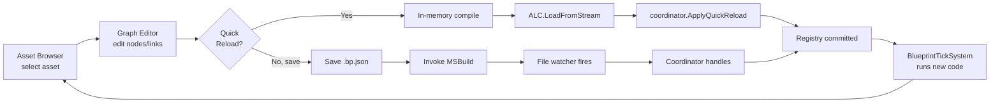
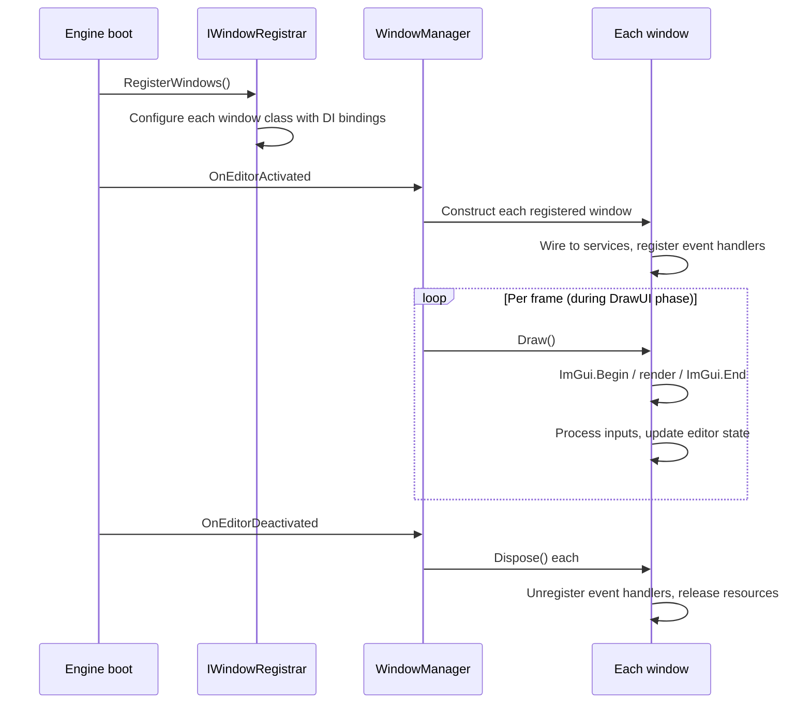
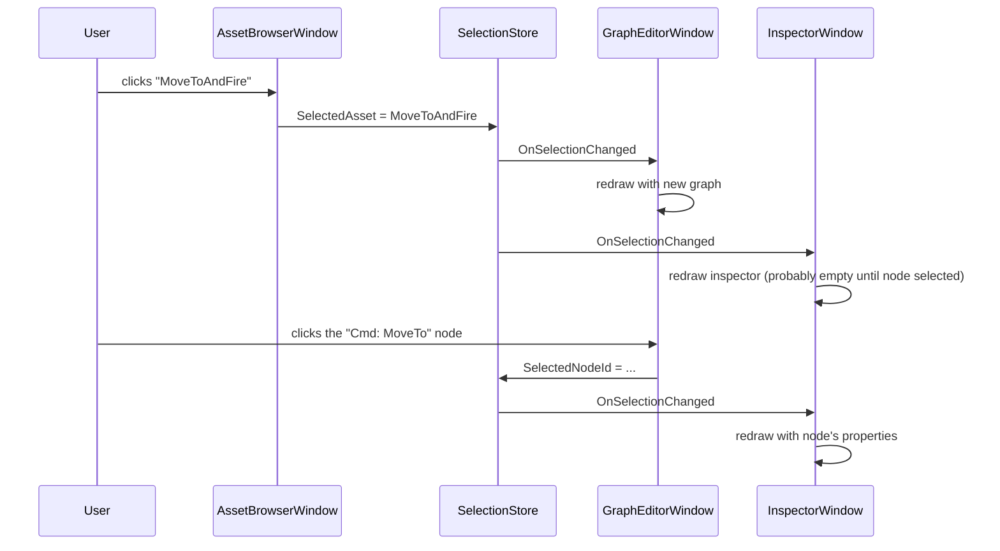
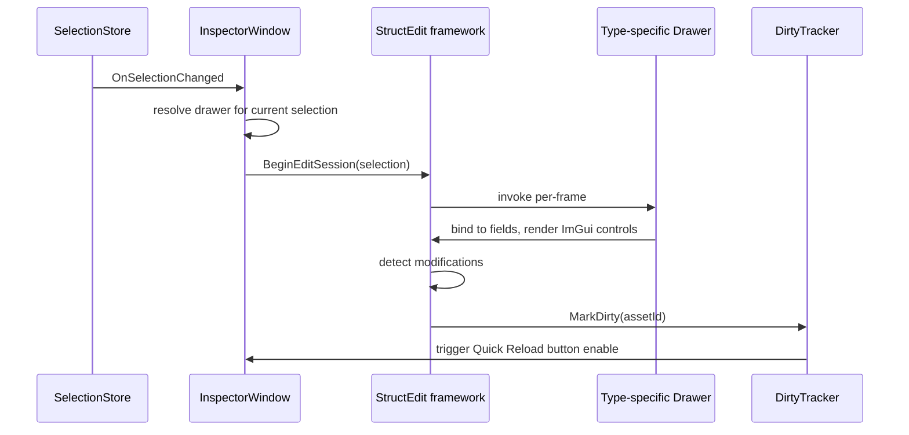
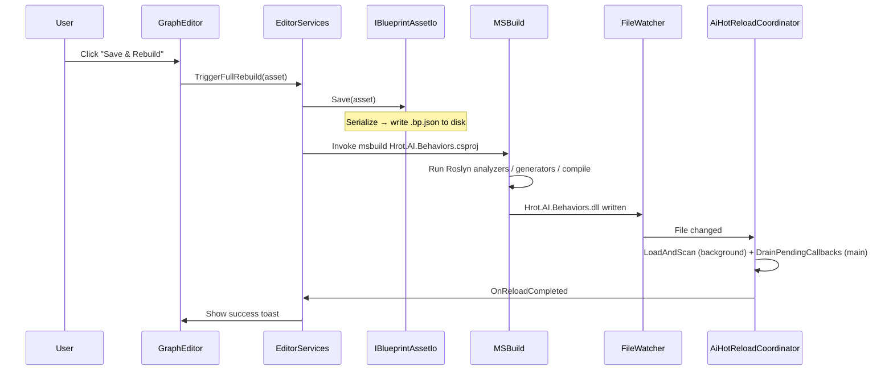

# Blueprint Subsystem — Editor Detailed Design

> **Status:** Detailed design, derived from `Blueprint_Subsystem_Architecture_v1.2.md` + Final Resolutions + Inline Patches + Implementation Roadmap v1.1 + Compiler DD (+ Inline Patches v1, v2) + Runtime DD (+ Inline Patches) + Test Harness DD (+ Inline Patches) + Hot Reload DD (+ Inline Patches) + Debug Protocol DD (+ Inline Patches). All Editor DD inline patches integrated.
> **Audience:** Implementation agent and human reviewer.
> **Drives:** Milestone M13 (editor windows + Quick Reload pipeline + StructEdit drawers).
> **Doesn't cover:** Compiler internals, runtime systems, test harness, hot reload coordinator, debug protocol — all owned by their respective DDs. This DD wires their public surfaces to user-facing UI.
> **Companion code lives in:** `Hrot/Subsystems/Blueprints/Hrot.Blueprints.Editor/` — windows, drawers, services.

---

## Table of Contents

1. Overview and design goals
2. Window architecture and lifecycle
3. `IWindowRegistrar` wiring
4. Asset Browser window
5. Graph Editor window
6. Inspector window (StructEdit-driven)
7. StructEdit drawer infrastructure
8. Debug Panel + Watch Panel + Callstack windows
9. Hot Reload Log window
10. Quick Reload pipeline
11. Full Rebuild pipeline
12. Editor's debug session lifecycle
13. Time-controller adapter
14. Editor preferences and configuration
15. Editor test strategy
16. Open questions

---

## 1. Overview and design goals

### 1.1 What the editor owns

The editor is the user-facing surface for authoring Blueprints. It owns:

- **Window classes** for asset browsing, graph editing, inspector forms, debug panels, log views.
- **StructEdit drawers** — type-specific UI generators for editing `BlueprintAsset` content (parameters, variables, graph nodes, pin literals).
- **Quick Reload pipeline** — in-memory compile + ALC load + handoff to `coordinator.ApplyQuickReload`.
- **Full Rebuild pipeline** — save asset to disk + invoke MSBuild + let the file-watcher path take over.
- **Debug session lifecycle** — construct on editor open, attach to `DebugProbe.Sink`, wire to engine's time controller.
- **Editor preferences** — per-user settings (window layouts, recent assets, default compile mode).

### 1.2 What the editor does NOT own

- **Compiler internals** — the editor calls `IBlueprintCompiler.Compile(asset, options)` and consumes the result; it doesn't know about IR or stages.
- **Runtime systems** — the editor reads `BlueprintRegistry` for asset listings and slot inspection; it doesn't tick anything.
- **Hot reload coordination** — the editor reflects the patch ALC for `[BlueprintRegistrar]` classes, invokes them into staging registries, registers the debug map, then calls `coordinator.ApplyQuickReload(alc, behaviorStaging, blueprintStaging)`; the coordinator owns the atomic commit and ALC swap.
- **Debug session implementation** — the editor consumes `IBlueprintDebugSession`; the session knows about probes and breakpoints.

The editor is the integrator. Every other DD's public surface is consumed here.

### 1.3 The asset-authoring loop



The user clicks "Quick Reload" to test changes in seconds, or "Save & Rebuild" to commit changes that propagate to other devs via source control.

### 1.4 Performance target: Quick Reload turnaround

The architect's goal for Quick Reload is **~100ms author-perceived latency** from clicking the button to seeing new behavior live in the running simulation. Breaking that budget:

| Phase | Budget | Notes |
|---|---|---|
| Serialize asset → JSON | ≤2ms | Single asset; reuse `BlueprintJsonServices` |
| Compile pipeline (Stages 1-7) | ≤20ms | Per Compiler DD §17.10 perf budget |
| Roslyn finalize (Stage 8) | ≤50ms | Single-asset in-memory compile |
| New ALC.LoadFromStream | ≤5ms | Small PE + PDB |
| Coordinator scan + apply | ≤10ms | Per Hot Reload DD §11.7 |
| UI repaint after `OnReloadCompleted` | ≤10ms | One frame |
| **Total** | **≤100ms** | |

The editor implementation must not gratuitously add latency (e.g., serializing to disk and back, redundant validation passes). Slice 1 hits the budget if every step stays in its lane.

### 1.5 What the editor looks like

```
┌─────────────────────────────────────────────────────────────────────┐
│  Hrot Editor — Blueprint Subsystem                            [_□×] │
├──────────────────────┬──────────────────────────────────────────────┤
│  Asset Browser       │  Graph: MoveToAndFire / Main                 │
│  ┌────────────────┐  │  ┌────────────────────────────────────────┐ │
│  │ ▼ Combat       │  │  │                                        │ │
│  │   MoveToAndFire│  │  │     [Entry] → [Cmd: MoveTo] → [Wait]→  │ │
│  │   HasTarget    │  │  │              ↑              ↓        ↓ │ │
│  │ ▼ Doors        │  │  │              (TargetPos)  Success Fail │ │
│  │   DoorActor    │  │  │                            ↓        ↓ │ │
│  │   DoorSensor   │  │  │                         [Cmd:Fire]  [Ret│ │
│  │ ▼ Health       │  │  │                                        │ │
│  │   HealthRegen  │  │  └────────────────────────────────────────┘ │
│  └────────────────┘  │  [Quick Reload] [Save & Rebuild] [Compile]  │
├──────────────────────┼──────────────────────────────────────────────┤
│  Inspector           │  Debug Panel                                  │
│  ┌────────────────┐  │  ┌────────────────────────────────────────┐ │
│  │ Selected:      │  │  │ Breakpoints (2)                        │ │
│  │   Cmd: MoveTo  │  │  │   ✓ MoveToAndFire/n-cmd-fire    [Edit] │ │
│  │ ─────────────  │  │  │   ✓ HealthRegen/n-on-hit-damage [Edit] │ │
│  │ Destination:   │  │  │                                        │ │
│  │   [pin connected]│ │  │ Watches (3)                            │ │
│  │ Speed:         │  │  │   HealthRegen.CurrentHealth   = 87     │ │
│  │   [5.0]        │  │  │   HealthRegen.MaxHealth       = 100    │ │
│  │ Mode:          │  │  │   MoveToAndFire.TargetPosition = (0,0,0)│ │
│  │   [Continuous▼]│  │  │                                        │ │
│  └────────────────┘  │  │ Callstack                              │ │
│                      │  │   (idle)                               │ │
│                      │  └────────────────────────────────────────┘ │
└──────────────────────┴──────────────────────────────────────────────┘
```

Eight primary windows: Asset Browser, Graph Editor, Inspector, Debug Panel, Watch Panel, Callstack, Hot Reload Log, Output Console. Each is a `ManagedWindow` subclass; each registers via `IWindowRegistrar`.

### 1.6 Slice 1 scope

- **In scope:** Asset Browser + Graph Editor + Inspector + Debug Panel + Watch Panel + Callstack + Hot Reload Log + Quick Reload + Full Rebuild.
- **Out of scope for Slice 1:** Search/filter UX across all assets, "find references" navigation, refactoring tools (rename a variable across graphs), live multi-author collaboration, dock layout serialization (Slice 2).

The Slice 1 surface is enough to author the five Roadmap §5 demos end-to-end.

### 1.7 ImGui conventions

The Hrot editor uses ImGui via the existing engine wrappers. The Blueprint editor follows these conventions:

- **Window construction:** `IWindowRegistrar` pattern, one constructor invocation per window per session.
- **Per-frame rendering:** `ManagedWindow.Draw()` called once per frame inside the engine's `DrawUI()` phase.
- **Dirty tracking:** every editable form uses `IEditSession` from the existing StructEdit infrastructure; dirty flag drives the Quick Reload button state.
- **Selection state:** managed by a per-window `SelectionStore` injected at construction.
- **Style:** match the engine's existing color palette and font; no Blueprint-specific theming.

The reuse of existing ImGui patterns means the Blueprint editor "looks like" the rest of the Hrot editor. Authors don't need to learn a separate visual language.

---

## 2. Window architecture and lifecycle

### 2.1 The `ManagedWindow` base class

Per the project's existing convention (referenced in WindowManagement.md), all editor windows derive from `ManagedWindow`:

```csharp
namespace Hrot.Editor.WindowManagement;   // existing

public abstract class ManagedWindow : IDisposable
{
    public string Title { get; protected set; }
    public bool IsOpen { get; set; }
    public bool IsFocused { get; private set; }

    protected ManagedWindow(string title)
    {
        Title = title;
        IsOpen = true;
    }

    /// <summary>Called once per frame during the editor's DrawUI phase.</summary>
    public abstract void Draw();

    /// <summary>Called when the user closes the window (X button or menu).</summary>
    public virtual void OnClose() { }

    public virtual void Dispose() { }
}
```

The Blueprint-specific windows derive from this:

```
ManagedWindow (engine)
├── AssetBrowserWindow
├── GraphEditorWindow
├── InspectorWindow
├── DebugPanelWindow
├── WatchPanelWindow
├── CallstackWindow
├── HotReloadLogWindow
└── OutputConsoleWindow
```

### 2.2 Window construction and dependencies

Each window declares its dependencies via constructor injection. The `IWindowRegistrar` provides them. Example:

```csharp
namespace Hrot.Blueprints.Editor.Windows;

public sealed class AssetBrowserWindow : ManagedWindow
{
    private readonly IAssetCatalog _catalog;             // file-system asset discovery
    private readonly EditorSelectionStore _selection;
    private readonly EditorServices _services;          // umbrella for compiler, hot-reload coordinator, etc.

    public AssetBrowserWindow(
        IAssetCatalog catalog,
        EditorSelectionStore selection,
        EditorServices services) : base("Asset Browser")
    {
        _catalog = catalog;
        _selection = selection;
        _services = services;
    }

    public override void Draw()
    {
        if (!ImGui.Begin(Title, ref IsOpenRef)) { ImGui.End(); return; }
        // ... draw the asset tree ...
        ImGui.End();
    }
}
```

Most windows depend on:
- `EditorSelectionStore` — shared selection state (which asset is active, which node is selected).
- `EditorServices` — façade carrying references to the compiler, hot-reload coordinator, registry, debug session, time controller. Single dependency for "everything the editor needs from outside."

### 2.3 `EditorServices` façade

```csharp
namespace Hrot.Blueprints.Editor;

public sealed class EditorServices
{
    // Compile pipeline
    public IBlueprintCompiler Compiler { get; }
    public InMemoryRoslynCompiler RoslynCompiler { get; }

    // Hot reload coordination
    public AiHotReloadCoordinator HotReloadCoordinator { get; }

    // Registry (read-only)
    public BlueprintRegistry Registry { get; }

    // Debug session (per-editor-instance lifecycle)
    public BlueprintDebugSession DebugSession { get; }

    // Time control adapter
    public IBlueprintTimeController TimeController { get; }

    // Asset I/O
    public IBlueprintAssetIo AssetIo { get; }

    // Editor preferences
    public BlueprintEditorPreferences Preferences { get; }

    public EditorServices(/* injected from engine DI */) { /* ... */ }
}
```

The façade pattern means windows take one dependency (`EditorServices`) rather than five. Easier to evolve — adding a service is a single edit, not a cascade through every window's constructor.

### 2.4 Window lifecycle



The "OnEditorActivated" hook fires when the user opens the Blueprint editor surface. The "OnEditorDeactivated" fires when the editor closes (or the engine shuts down). Window state between activations is preserved via preferences (Slice 2 for dock layouts; Slice 1 just remembers which assets were open).

### 2.5 Single-editor-instance constraint

Slice 1 assumes one instance of each window at a time. The user can have one Asset Browser, one Graph Editor (showing one graph at a time), one Inspector, etc. Multiple Graph Editors showing different graphs simultaneously is a Slice 2 feature.

This simplification means:
- The Graph Editor's "currently displayed graph" is a single field on `EditorSelectionStore`, not a per-window field.
- Window communication via `EditorSelectionStore` is implicit: change the selection in Asset Browser, the Graph Editor sees the change next frame and renders the new graph.
- No tab management UX.

### 2.6 Window-to-window communication via shared selection

```csharp
namespace Hrot.Blueprints.Editor;

public sealed class EditorSelectionStore
{
    private BlueprintAsset? _selectedAsset;
    private Guid? _selectedGraphId;
    private Guid? _selectedNodeId;
    private Entity? _selectedEntity;       // for debug-panel-driven inspection

    public event Action? OnSelectionChanged;

    public BlueprintAsset? SelectedAsset
    {
        get => _selectedAsset;
        set { _selectedAsset = value; OnSelectionChanged?.Invoke(); }
    }

    public Guid? SelectedGraphId { /* with event */ }
    public Guid? SelectedNodeId { /* with event */ }
    public Entity? SelectedEntity { /* with event */ }
}
```

The `OnSelectionChanged` event fires on any selection mutation. Every window subscribes in its constructor and unsubscribes in `Dispose`. The window's `Draw` reads current selection from the store; the event prompts the window to re-render with the new state.

For Slice 1's "one window per kind" rule, this is sufficient. Slice 2's multi-graph-editor mode would need per-window selection, but defer.

### 2.7 The `SelectionChanged` propagation



Simple, predictable, no per-window state coupling beyond the shared store.

---

## 3. `IWindowRegistrar` wiring

### 3.1 The registration pattern

The engine's existing `IWindowRegistrar` lets subsystems contribute windows to the editor's menu and lifecycle. The Blueprint subsystem implements one:

```csharp
namespace Hrot.Blueprints.Editor;

public sealed class BlueprintWindowRegistrar : IWindowRegistrar
{
    public string Category => "Blueprints";
    public int DisplayOrder => 1000;   // alphabetical-ish slot

    public void RegisterWindows(IWindowRegistry registry, IServiceProvider services)
    {
        var editorServices = services.GetRequiredService<EditorServices>();
        var selection = services.GetRequiredService<EditorSelectionStore>();
        var assetCatalog = services.GetRequiredService<IAssetCatalog>();

        registry.Register("Asset Browser", () =>
            new AssetBrowserWindow(assetCatalog, selection, editorServices));

        registry.Register("Graph Editor", () =>
            new GraphEditorWindow(selection, editorServices));

        registry.Register("Inspector", () =>
            new InspectorWindow(selection, editorServices));

        registry.Register("Debug Panel", () =>
            new DebugPanelWindow(selection, editorServices));

        registry.Register("Watch Panel", () =>
            new WatchPanelWindow(selection, editorServices));

        registry.Register("Callstack", () =>
            new CallstackWindow(editorServices));

        registry.Register("Hot Reload Log", () =>
            new HotReloadLogWindow(editorServices));

        registry.Register("Output Console", () =>
            new OutputConsoleWindow(editorServices));
    }
}
```

The registrar runs once at engine boot. Each `registry.Register(name, factory)` adds a menu entry under the "Blueprints" category. When the user clicks the menu item, the factory is invoked to construct the window.

### 3.2 Service registration

The `IServiceProvider` is the engine's DI container. The Blueprint subsystem contributes its services:

```csharp
namespace Hrot.Blueprints.Editor;

public static class BlueprintEditorModuleRegistration
{
    public static void Register(IServiceCollection services)
    {
        // Compiler — already known to compile in-process per Compiler DD
        services.AddSingleton<IBlueprintCompiler, BlueprintCompiler>();
        services.AddSingleton<InMemoryRoslynCompiler>();

        // Hot reload coordinator (engine-wide singleton; constructed elsewhere
        // but registered here for completeness)
        // services.AddSingleton<AiHotReloadCoordinator>(...);

        // Asset I/O
        services.AddSingleton<IBlueprintAssetIo, FileSystemBlueprintAssetIo>();
        services.AddSingleton<IAssetCatalog, AssetCatalog>();

        // Editor-specific services
        services.AddSingleton<EditorSelectionStore>();
        services.AddSingleton<EditorServices>();

        // Debug session — lazily constructed when first window opens
        services.AddSingleton<BlueprintDebugSession>();
        services.AddSingleton<IBlueprintDebugSession>(sp =>
            sp.GetRequiredService<BlueprintDebugSession>());

        // Time controller adapter — see §13
        // Quick reload service (depends on catalog + signature parser per Editor DD Inline Patches)
        services.AddSingleton<BlueprintSignatureParser>();   // from Hrot.Blueprints.Generators

        services.AddSingleton<QuickReloadService>(sp => new QuickReloadService(
            compiler: sp.GetRequiredService<IBlueprintCompiler>(),
            roslyn: sp.GetRequiredService<InMemoryRoslynCompiler>(),
            coordinator: sp.GetRequiredService<AiHotReloadCoordinator>(),
            debugSession: sp.GetRequiredService<IBlueprintDebugSession>(),
            dirtyTracker: sp.GetRequiredService<DirtyTracker>(),
            output: sp.GetRequiredService<IOutputConsole>(),
            catalog: sp.GetRequiredService<IAssetCatalog>(),                       // added
            signatureParser: sp.GetRequiredService<BlueprintSignatureParser>()));   // added

        services.AddSingleton<IBlueprintTimeController, EngineTimeControllerAdapter>();

        // Preferences
        services.AddSingleton<BlueprintEditorPreferences>();

        // The registrar itself
        services.AddSingleton<IWindowRegistrar, BlueprintWindowRegistrar>();
    }
}
```

The pattern matches the existing engine modules. The Blueprint editor is a normal engine module; it doesn't need special bootstrap treatment.

### 3.3 Lifetime of `EditorServices`

`EditorServices` is a singleton. It's safe because:
- The compiler is stateless across requests (per Compiler DD §1.4).
- The hot-reload coordinator is engine-wide singleton (per Hot Reload DD §3).
- The registry is engine-wide singleton (per Runtime DD §2).
- The debug session is per-editor-process singleton (one editor = one debugger).
- The time controller is engine-wide singleton.
- Asset I/O is stateless.
- Preferences are loaded once at startup and saved on changes.

None of these have per-window state. Sharing across windows is correct.

### 3.4 Lazy initialization of expensive services

Some services are expensive to construct (the in-memory Roslyn compiler builds its `CSharpCompilationOptions`, metadata reference list, etc.). The `EditorServices` façade lazy-initializes them on first access:

```csharp
public sealed class EditorServices
{
    private InMemoryRoslynCompiler? _roslynCompiler;
    private readonly IServiceProvider _services;

    public InMemoryRoslynCompiler RoslynCompiler
    {
        get
        {
            if (_roslynCompiler is null)
            {
                _roslynCompiler = new InMemoryRoslynCompiler(
                    MetadataReferenceResolver.ForRuntimeAssemblies(
                        AppDomain.CurrentDomain.GetAssemblies()));
            }
            return _roslynCompiler;
        }
    }
}
```

This means the Roslyn compiler is built only when the user actually clicks "Quick Reload" — not at editor boot. Reduces boot time from ~500ms to ~50ms.

### 3.5 Tearing down on editor close

Most services have no teardown cost (stateless). The debug session detaches itself:

```csharp
public sealed class BlueprintEditorModule : IEditorModule
{
    private readonly EditorServices _services;

    public void OnEditorDeactivated()
    {
        _services.DebugSession.Detach();   // restores NullProbeSink; clears breakpoints
    }
}
```

After detach, generated code's probes route to the null sink — zero overhead. The session can be re-attached on next editor open.

---

*Continued in Part 2 — §4 Asset Browser, §5 Graph Editor, §6 Inspector, §7 StructEdit drawers.*

## 4. Asset Browser window

### 4.1 Purpose

The Asset Browser is the entry point. It shows a tree of all Blueprint assets discovered under `Hrot/Subsystems/Hrot.AI.Behaviors/Blueprints/`. The user clicks an asset to load it for editing; right-clicks to invoke commands (rename, delete, regenerate Guid, duplicate).

### 4.2 What it displays

```
┌──────────────────────────┐
│  Asset Browser           │
│  [+ New ▾]  [↻ Refresh]  │
├──────────────────────────┤
│  ▼ Combat                │
│      MoveToAndFire     ★ │
│      HasVisibleTarget    │
│  ▼ Doors                 │
│      DoorActor           │
│      DoorSensor          │
│  ▼ Health                │
│      HealthRegen      ●  │
│  ▶ Library               │
│  ▶ Sensors               │
└──────────────────────────┘
```

- **★** indicates the asset has unsaved edits (dirty).
- **●** indicates the asset is currently selected.
- **▼** / **▶** collapse state per folder.

Folders are derived from the on-disk directory structure under `Blueprints/`. No metadata-driven categorization in Slice 1.

### 4.3 `IAssetCatalog` — file discovery

```csharp
namespace Hrot.Blueprints.Editor;

public interface IAssetCatalog
{
    /// <summary>Walks the assets directory and returns all .bp.json files,
    /// each parsed into a BlueprintAsset header (just identity + name + dispatch).</summary>
    IReadOnlyList<AssetCatalogEntry> EnumerateAll();

    /// <summary>Loads the full asset (with graphs, links, etc.) for editing.</summary>
    BlueprintAsset LoadFull(Guid assetId);

    /// <summary>Saves the asset to disk as .bp.json (used for Save & Rebuild path).</summary>
    void Save(BlueprintAsset asset);

    /// <summary>File-watcher event for external changes (git pulls, other tools writing files).</summary>
    event Action<AssetCatalogEntry>? OnAssetChangedExternally;
}

public sealed record AssetCatalogEntry(
    Guid AssetId,
    string Name,
    string Path,
    string Category,
    BlueprintDispatchKind Dispatch,
    DateTime LastWriteTime);
```

### 4.4 Implementation strategy

The catalog walks the assets directory at editor open and on `Refresh` button click. It uses `BlueprintJsonServices.DeserializeHeader` (a lightweight variant that only reads the header section) for fast enumeration — full graph data is loaded only when the user selects an asset for editing.

```csharp
public sealed class FileSystemAssetCatalog : IAssetCatalog
{
    private readonly string _rootDir;

    public FileSystemAssetCatalog(string rootDir)
    {
        _rootDir = rootDir;
    }

    public IReadOnlyList<AssetCatalogEntry> EnumerateAll()
    {
        if (!Directory.Exists(_rootDir)) return Array.Empty<AssetCatalogEntry>();

        var results = new List<AssetCatalogEntry>();
        foreach (var path in Directory.EnumerateFiles(_rootDir, "*.bp.json", SearchOption.AllDirectories))
        {
            try
            {
                var json = File.ReadAllText(path);
                var header = BlueprintJsonServices.DeserializeHeader(json);
                if (header is null) continue;

                var category = Path.GetRelativePath(_rootDir, Path.GetDirectoryName(path)!);
                results.Add(new AssetCatalogEntry(
                    AssetId: header.AssetId,
                    Name: header.Name,
                    Path: path,
                    Category: category,
                    Dispatch: header.Dispatch,
                    LastWriteTime: File.GetLastWriteTime(path)));
            }
            catch (Exception ex)
            {
                // Log and continue — a broken .bp.json doesn't poison the browser
                _logger.LogWarning($"Skipping {path}: {ex.Message}");
            }
        }
        return results;
    }

    public BlueprintAsset LoadFull(Guid assetId)
    {
        var entry = EnumerateAll().FirstOrDefault(e => e.AssetId == assetId);
        if (entry is null) throw new FileNotFoundException($"Asset {assetId} not found.");
        var json = File.ReadAllText(entry.Path);
        return BlueprintJsonServices.Deserialize(json) ?? throw new InvalidDataException($"Failed to parse {entry.Path}");
    }

    public void Save(BlueprintAsset asset)
    {
        var entry = EnumerateAll().FirstOrDefault(e => e.AssetId == asset.AssetId);
        var path = entry?.Path ?? throw new InvalidOperationException(
            $"Asset {asset.AssetId} has no on-disk location. Use SaveAsNew for new assets.");
        var json = BlueprintJsonServices.Serialize(asset);
        File.WriteAllText(path, json);
    }
}
```

### 4.5 Asset Browser window class

```csharp
public sealed class AssetBrowserWindow : ManagedWindow
{
    private readonly IAssetCatalog _catalog;
    private readonly EditorSelectionStore _selection;
    private readonly EditorServices _services;
    private readonly DirtyTracker _dirtyTracker;

    private IReadOnlyList<AssetCatalogEntry> _entries = Array.Empty<AssetCatalogEntry>();
    private Dictionary<string, bool> _folderExpansion = new();

    public AssetBrowserWindow(
        IAssetCatalog catalog,
        EditorSelectionStore selection,
        EditorServices services) : base("Asset Browser")
    {
        _catalog = catalog;
        _selection = selection;
        _services = services;
        _dirtyTracker = services.DirtyTracker;
        Refresh();
    }

    public override void Draw()
    {
        if (!ImGui.Begin(Title, ref IsOpenRef)) { ImGui.End(); return; }

        DrawToolbar();
        ImGui.Separator();
        DrawAssetTree();

        ImGui.End();
    }

    private void DrawToolbar()
    {
        if (ImGui.Button("+ New")) ShowNewAssetMenu();
        ImGui.SameLine();
        if (ImGui.Button("Refresh")) Refresh();
    }

    private void Refresh() => _entries = _catalog.EnumerateAll();

    private void DrawAssetTree()
    {
        foreach (var group in _entries.GroupBy(e => e.Category).OrderBy(g => g.Key))
        {
            var expanded = _folderExpansion.GetValueOrDefault(group.Key, true);
            if (ImGui.TreeNodeEx(group.Key, expanded ? ImGuiTreeNodeFlags.DefaultOpen : 0))
            {
                _folderExpansion[group.Key] = true;
                foreach (var entry in group.OrderBy(e => e.Name))
                    DrawAssetItem(entry);
                ImGui.TreePop();
            }
            else
            {
                _folderExpansion[group.Key] = false;
            }
        }
    }

    private void DrawAssetItem(AssetCatalogEntry entry)
    {
        var isSelected = _selection.SelectedAsset?.AssetId == entry.AssetId;
        var isDirty = _dirtyTracker.IsDirty(entry.AssetId);

        var label = entry.Name;
        if (isDirty) label = "* " + label;

        if (ImGui.Selectable(label, isSelected))
            OnAssetClicked(entry);

        if (ImGui.BeginPopupContextItem($"##ctx_{entry.AssetId}"))
        {
            if (ImGui.MenuItem("Rename")) ShowRenameDialog(entry);
            if (ImGui.MenuItem("Duplicate")) DuplicateAsset(entry);
            if (ImGui.MenuItem("Regenerate Guid")) RegenerateGuid(entry);
            ImGui.Separator();
            if (ImGui.MenuItem("Delete", null, false, !isDirty))
                ConfirmAndDelete(entry);
            ImGui.EndPopup();
        }
    }

    private void OnAssetClicked(AssetCatalogEntry entry)
    {
        // Check if user has unsaved changes on the current asset
        if (_selection.SelectedAsset is not null
            && _dirtyTracker.IsDirty(_selection.SelectedAsset.AssetId)
            && _selection.SelectedAsset.AssetId != entry.AssetId)
        {
            // Show "save / discard / cancel" prompt
            if (!PromptDiscardOrSave(_selection.SelectedAsset)) return;
        }

        var fullAsset = _catalog.LoadFull(entry.AssetId);
        _selection.SelectedAsset = fullAsset;
        _selection.SelectedGraphId = fullAsset.Graphs.FirstOrDefault()?.Id;
        _selection.SelectedNodeId = null;
    }
}
```

### 4.6 "New Asset" workflow

```csharp
private void ShowNewAssetMenu()
{
    ImGui.OpenPopup("NewAssetMenu");
}

private void DrawNewAssetPopup()
{
    if (!ImGui.BeginPopup("NewAssetMenu")) return;

    if (ImGui.MenuItem("Library...")) ShowNewLibraryDialog();
    if (ImGui.MenuItem("AI Primitive...")) ShowNewAiPrimitiveDialog();
    if (ImGui.MenuItem("Instance...")) ShowNewInstanceDialog();

    ImGui.EndPopup();
}

private void CreateNewAsset(BlueprintDispatchKind kind, string name, string category)
{
    var assetId = Guid.NewGuid();
    var asset = new BlueprintAsset
    {
        Header = new Header { SubsystemType = "Hrot.Blueprints", SchemaVersion = "1.0" },
        AssetId = assetId,
        Name = name,
        Dispatch = kind,
        // ... default empty graphs based on kind ...
    };

    var path = Path.Combine(_services.Preferences.AssetsRootDir, category, $"{name}.bp.json");
    var json = BlueprintJsonServices.Serialize(asset);
    File.WriteAllText(path, json);

    Refresh();
    _selection.SelectedAsset = asset;
}
```

### 4.7 Renaming and Guid regeneration

Renaming an asset is a file rename + a name-field update inside the `.bp.json`. The `AssetId` (Guid) does **not** change; references from other assets via `CallablePeers` remain valid.

Regenerating a Guid is a deliberate action — the user explicitly wants to break references. The Asset Browser surfaces a confirmation dialog: "This will invalidate any callable-peer references from other assets. Continue?" If yes, generate a new Guid, save, refresh. Other assets that referenced the old Guid will fail validation at next compile until updated.

### 4.8 Delete workflow

Deletion is a file delete + a refresh. Dirty assets cannot be deleted (the right-click menu greys out the Delete item). For Slice 1 there's no undo; deletion is permanent (the user's git history is the backup).

### 4.9 External-file-change handling

If a `.bp.json` is modified outside the editor (git pull, manual edit, another tool), the file watcher fires `OnAssetChangedExternally`. The browser refreshes the affected entry:

```csharp
public AssetBrowserWindow(/* ... */)
{
    _catalog.OnAssetChangedExternally += OnExternalChange;
}

private void OnExternalChange(AssetCatalogEntry entry)
{
    // If the user has unsaved edits to this asset, surface a conflict warning
    if (_dirtyTracker.IsDirty(entry.AssetId))
    {
        _services.OutputConsole.LogWarning(
            $"Asset {entry.Name} was modified externally; you have unsaved edits. " +
            "Save your changes or refresh to discard them.");
    }
    else
    {
        Refresh();
        // If the asset is currently selected, reload it
        if (_selection.SelectedAsset?.AssetId == entry.AssetId)
            _selection.SelectedAsset = _catalog.LoadFull(entry.AssetId);
    }
}
```

---

## 5. Graph Editor window

### 5.1 Purpose

The Graph Editor is the visual node-and-link editor. Users see nodes as boxes, links as connections between pins, and edit by dragging.

This is the most UI-intensive piece of the editor. Slice 1 ships with a functional minimum:

- Display nodes with their input/output pins.
- Draw links between pins.
- Click a node to select it (Inspector shows its properties).
- Drag a node to reposition (stores position in `EditorMetadata`).
- Right-click empty space to create a new node from a palette.
- Right-click a node to delete, duplicate.
- Drag from an output pin to an input pin to create a link.
- Click an existing link to delete it.

Things explicitly NOT in Slice 1:
- Multi-select + box-select.
- Group/comment nodes for visual organization.
- Re-routing visuals (links draw as bezier; no waypoints).
- Minimap.
- Search box for "find this node by name."

### 5.2 What it displays

```
┌──────────────────────────────────────────────────────────────────┐
│  Graph: MoveToAndFire / Main                                     │
├──────────────────────────────────────────────────────────────────┤
│  Graph: [Main ▾]   Mode: [Debug ▾]                               │
├──────────────────────────────────────────────────────────────────┤
│                                                                  │
│   ┌─[Entry]                                                      │
│   │                                                              │
│   └──> [▶ Cmd: Locomotion/MoveTo ◀]   ←── (TargetPosition)       │
│                                       ←── (Speed)                │
│                       │                                          │
│                       v                                          │
│        [▶ Wait for Locomotion ◀] ──Success──→ [▶ Cmd: Fire ◀]    │
│                       │                              │           │
│                       └─Failure─→ [Return Failure]   v           │
│                                                  [Wait Weapon]   │
│                                                      │           │
│                                                  Success Failure │
│                                                      ↓     ↓     │
│                                              [Return Success]    │
│                                                       [Return Failure] │
│                                                                  │
└──────────────────────────────────────────────────────────────────┘
```

### 5.3 Implementation backbone

The graph view uses ImGui's `ImDrawList` directly for custom rendering (nodes as rectangles, links as bezier curves). Node positions live in `Graph.EditorMetadata.NodePositions: Dictionary<Guid, Vector2>`.

```csharp
public sealed class GraphEditorWindow : ManagedWindow
{
    private readonly EditorSelectionStore _selection;
    private readonly EditorServices _services;
    private readonly NodeKindRegistry _nodeKinds;     // catalog of available node types
    private readonly LinkValidator _linkValidator;    // checks if a proposed link is valid

    private Vector2 _viewportOffset;       // panning
    private float _viewportZoom = 1.0f;    // zooming
    private Guid? _draggingNodeId;
    private Vector2 _draggingStartPos;
    private PinRef? _draggingLinkSource;   // if non-null, user is dragging a new link

    public GraphEditorWindow(EditorSelectionStore selection, EditorServices services)
        : base("Graph Editor")
    {
        _selection = selection;
        _services = services;
        _nodeKinds = services.NodeKindRegistry;
        _linkValidator = new LinkValidator(_services.TypeRegistry);
    }

    public override void Draw()
    {
        if (!ImGui.Begin(Title, ref IsOpenRef, ImGuiWindowFlags.MenuBar)) { ImGui.End(); return; }

        DrawMenuBar();
        DrawGraphSelector();
        DrawCanvas();

        ImGui.End();
    }

    private void DrawCanvas()
    {
        var asset = _selection.SelectedAsset;
        if (asset is null || _selection.SelectedGraphId is null)
        {
            ImGui.TextDisabled("(no graph selected)");
            return;
        }

        var graph = asset.Graphs.FirstOrDefault(g => g.Id == _selection.SelectedGraphId);
        if (graph is null) { ImGui.TextDisabled("(graph not found)"); return; }

        var canvasPos = ImGui.GetCursorScreenPos();
        var canvasSize = ImGui.GetContentRegionAvail();

        var drawList = ImGui.GetWindowDrawList();
        drawList.AddRectFilled(canvasPos, canvasPos + canvasSize,
            ImGui.GetColorU32(ImGuiCol.ChildBg));

        HandleCanvasInputs(canvasPos, canvasSize);

        // Render links first so they appear behind nodes
        foreach (var link in graph.Links)
            DrawLink(graph, link, drawList);

        // Render nodes
        foreach (var node in graph.Nodes)
            DrawNode(graph, node, drawList);

        // Render in-progress link drag
        if (_draggingLinkSource is not null)
            DrawDraggingLink(drawList);
    }
}
```

### 5.4 Node rendering

Each node draws as a rectangle with a header (node kind) and a body (pins).

```csharp
private void DrawNode(Graph graph, Node node, ImDrawListPtr drawList)
{
    var pos = GetNodeScreenPos(graph, node);
    var size = ComputeNodeSize(node);

    // Background
    var isSelected = _selection.SelectedNodeId == node.Id;
    var bgColor = isSelected ? Colors.NodeSelectedBg : Colors.NodeBg;
    drawList.AddRectFilled(pos, pos + size, bgColor, 4f);
    drawList.AddRect(pos, pos + size, Colors.NodeBorder, 4f);

    // Header
    var headerHeight = 24f;
    drawList.AddRectFilled(pos, new Vector2(pos.X + size.X, pos.Y + headerHeight),
        GetHeaderColorForKind(node.Kind), 4f);
    drawList.AddText(pos + new Vector2(8, 4), Colors.NodeTitle, GetDisplayLabel(node));

    // Pins
    DrawNodePins(node, pos, size, drawList);

    // Handle click + drag on the node
    if (ImGui.IsMouseHoveringRect(pos, pos + size))
    {
        if (ImGui.IsMouseClicked(ImGuiMouseButton.Left))
            _selection.SelectedNodeId = node.Id;
        if (ImGui.IsMouseDragging(ImGuiMouseButton.Left) && _selection.SelectedNodeId == node.Id)
        {
            BeginNodeDrag(node);
        }
    }
}

private void DrawNodePins(Node node, Vector2 pos, Vector2 size, ImDrawListPtr drawList)
{
    var inputPins = node.Pins.Where(p => p.Direction == PinDirection.Input).ToList();
    var outputPins = node.Pins.Where(p => p.Direction == PinDirection.Output).ToList();

    var pinY = pos.Y + 28f;
    foreach (var pin in inputPins)
    {
        var pinPos = new Vector2(pos.X, pinY);
        DrawPin(pin, pinPos, isOutput: false, drawList);
        pinY += 20f;
    }

    pinY = pos.Y + 28f;
    foreach (var pin in outputPins)
    {
        var pinPos = new Vector2(pos.X + size.X, pinY);
        DrawPin(pin, pinPos, isOutput: true, drawList);
        pinY += 20f;
    }
}

private void DrawPin(Pin pin, Vector2 pinPos, bool isOutput, ImDrawListPtr drawList)
{
    var color = GetPinColorForKind(pin.Kind, pin.Type);
    drawList.AddCircleFilled(pinPos, 6f, color);

    var label = pin.Name ?? "";
    var labelOffset = isOutput ? new Vector2(-ImGui.CalcTextSize(label).X - 10, -7) : new Vector2(10, -7);
    drawList.AddText(pinPos + labelOffset, Colors.PinLabel, label);

    // Hit-test for link dragging
    if (Vector2.DistanceSquared(ImGui.GetMousePos(), pinPos) < 36f)
    {
        if (ImGui.IsMouseClicked(ImGuiMouseButton.Left))
            BeginLinkDrag(new PinRef { NodeId = pin.NodeId, PinId = pin.Id });
        if (ImGui.IsMouseReleased(ImGuiMouseButton.Left) && _draggingLinkSource is not null)
            CompleteLinkDrag(new PinRef { NodeId = pin.NodeId, PinId = pin.Id });
    }
}
```

### 5.5 Link creation flow

```csharp
private void BeginLinkDrag(PinRef source)
{
    _draggingLinkSource = source;
}

private void CompleteLinkDrag(PinRef target)
{
    if (_draggingLinkSource is null) return;

    var graph = GetCurrentGraph();
    if (graph is null) { _draggingLinkSource = null; return; }

    // Validate the link
    var validation = _linkValidator.Validate(graph, _draggingLinkSource.Value, target);
    if (!validation.IsValid)
    {
        _services.OutputConsole.LogWarning($"Cannot create link: {validation.Reason}");
        _draggingLinkSource = null;
        return;
    }

    // Create the link, mark graph dirty
    graph.Links.Add(new Link { From = _draggingLinkSource.Value, To = target });
    _services.DirtyTracker.MarkDirty(_selection.SelectedAsset!.AssetId);

    _draggingLinkSource = null;
}
```

`LinkValidator` checks:
- Pin directions match (output → input).
- Pin kinds match (exec → exec, data → data).
- Data types are compatible (exact match for Slice 1; implicit casts only for numeric widening).
- Target input pin doesn't already have an incoming link (multiple outputs OK, multiple inputs not).
- No cycles in the exec graph (full cycle detection is M5 compile-time work; the editor catches simple direct cycles).

### 5.6 Right-click "Create Node" palette

```csharp
private void DrawNewNodePopup()
{
    if (!ImGui.BeginPopup("NewNodePopup")) return;

    ImGui.InputText("Filter", ref _newNodeFilter, 64);
    ImGui.Separator();

    foreach (var category in _nodeKinds.Categories)
    {
        if (ImGui.TreeNode(category.Name))
        {
            foreach (var kind in category.Kinds.Where(k => MatchesFilter(k, _newNodeFilter)))
            {
                if (ImGui.MenuItem(kind.DisplayName))
                    CreateNodeAt(_newNodePopupCanvasPos, kind);
            }
            ImGui.TreePop();
        }
    }

    ImGui.EndPopup();
}

private void CreateNodeAt(Vector2 canvasPos, NodeKindDescriptor kind)
{
    var graph = GetCurrentGraph();
    if (graph is null) return;

    var node = kind.CreateInstance();
    graph.Nodes.Add(node);
    graph.EditorMetadata.NodePositions[node.Id] = canvasPos;
    _services.DirtyTracker.MarkDirty(_selection.SelectedAsset!.AssetId);
    _selection.SelectedNodeId = node.Id;
}
```

`NodeKindRegistry` is populated from the same catalogs the compiler uses (`ChannelCommandCatalog`, `EngineEventCatalog`, etc.) plus the built-in node kinds (`EventEntry`, `Return`, `Branch`, etc.).

### 5.7 Compile + Reload buttons

The toolbar at the top of the Graph Editor has three buttons:

- **Compile**: runs the compiler in validate-only mode against the current asset. Diagnostics shown in Output Console. No reload happens.
- **Quick Reload**: compile + ALC load + `coordinator.ApplyQuickReload`. See §10.
- **Save & Rebuild**: serialize asset to disk + invoke MSBuild. See §11.

The Quick Reload button is enabled only when the asset is dirty and free of validation errors. Hovering shows the latency estimate.

### 5.8 Mode toggle (Release / Debug / Trace)

A per-asset compiler mode selector lives at the top of the graph editor. Default is Debug. The user can switch to Release for performance testing, or Trace for deep watch-driven debugging.

Mode is stored in `asset.EditorMetadata.CompilerMode`. Quick Reload uses it; Save & Rebuild uses it. MSBuild builds always use the asset's recorded mode.

---

*Continued in Part 3 — §6 Inspector, §7 StructEdit drawers, §8 Debug panels.*

## 6. Inspector window (StructEdit-driven)

### 6.1 Purpose

The Inspector shows editable properties for the currently selected element — either an asset (top-level metadata + variables + parameters) or a node (per-node properties like channel/action, target peer, default literal values).

### 6.2 What it displays per selection

| Selection | Inspector content |
|---|---|
| Asset, no node | Asset metadata (name, dispatch kind, tier hint), parameters list (AiPrimitive), variables list (Instance), callable peers, event subscriptions |
| Single node | Node-kind-specific form (e.g., ChannelCommand selector for ChannelCommand node; literal-value editor for SetVariable node) |
| Pin selected (Slice 2) | Pin metadata, default literal value, type override controls |

### 6.3 The flow



### 6.4 Window class

```csharp
public sealed class InspectorWindow : ManagedWindow
{
    private readonly EditorSelectionStore _selection;
    private readonly EditorServices _services;
    private readonly DrawerRegistry _drawers;

    private IEditSession? _currentSession;

    public InspectorWindow(EditorSelectionStore selection, EditorServices services)
        : base("Inspector")
    {
        _selection = selection;
        _services = services;
        _drawers = services.DrawerRegistry;
        _selection.OnSelectionChanged += OnSelectionChanged;
    }

    public override void Draw()
    {
        if (!ImGui.Begin(Title, ref IsOpenRef)) { ImGui.End(); return; }

        if (_currentSession is null)
        {
            ImGui.TextDisabled("(no selection)");
        }
        else
        {
            _currentSession.Draw();
            if (_currentSession.IsDirty)
            {
                _services.DirtyTracker.MarkDirty(_selection.SelectedAsset!.AssetId);
                _currentSession.ResetDirty();
            }
        }

        ImGui.End();
    }

    private void OnSelectionChanged()
    {
        _currentSession?.Dispose();
        _currentSession = ResolveSession();
    }

    private IEditSession? ResolveSession()
    {
        var asset = _selection.SelectedAsset;
        if (asset is null) return null;

        // Node selected → node drawer
        if (_selection.SelectedNodeId is { } nodeId)
        {
            var graph = asset.Graphs.FirstOrDefault(g => g.Id == _selection.SelectedGraphId);
            var node = graph?.Nodes.FirstOrDefault(n => n.Id == nodeId);
            if (node is null) return null;

            var drawer = _drawers.ResolveForNode(node);
            return drawer.CreateSession(node, asset);
        }

        // No node selected → asset-level drawer
        var assetDrawer = _drawers.ResolveForAsset(asset);
        return assetDrawer.CreateSession(asset);
    }

    public override void Dispose()
    {
        _selection.OnSelectionChanged -= OnSelectionChanged;
        _currentSession?.Dispose();
    }
}
```

The Inspector itself is thin. All actual editing logic lives in drawers — per node-kind classes that know how to render their specific node's properties.

### 6.5 Asset-level inspector

When no node is selected, the asset-level drawer shows:

```
┌──────────────────────────────────────┐
│  MoveToAndFire                       │
├──────────────────────────────────────┤
│  Name:        [MoveToAndFire      ]  │
│  Dispatch:    AiPrimitive (locked)   │
│  Tier Hint:   N/A (AiPrimitive)      │
├──────────────────────────────────────┤
│  ▼ Parameters                        │
│    TargetPosition: Vector3      [×]  │
│    ApproachSpeed:  Single       [×]  │
│    [ + Add Parameter ]               │
├──────────────────────────────────────┤
│  ▼ Working State                     │
│    (none)                            │
│    [ + Add Field ]                   │
├──────────────────────────────────────┤
│  ▼ Primitive Hostings                │
│    [✓] BTreeAction                   │
│    [ ] BTreeCondition                │
│    [✓] HsmAction                     │
│    [ ] HsmGuard                      │
│    Intent: Action                    │
├──────────────────────────────────────┤
│  ▼ Callable Peers                    │
│    (none)                            │
│    [ + Add Peer ]                    │
└──────────────────────────────────────┘
```

For an Instance asset, parameters become variables, tier hint becomes an Auto / Tier1024 / Tier4096 / Tier16384 selector, primitive hostings section is absent.

### 6.6 Dirty tracking integration

The `DirtyTracker` is a shared service tracking which assets have unsaved changes:

```csharp
public sealed class DirtyTracker
{
    private readonly HashSet<Guid> _dirty = new();

    public event Action<Guid>? OnDirtyChanged;

    public void MarkDirty(Guid assetId)
    {
        if (_dirty.Add(assetId)) OnDirtyChanged?.Invoke(assetId);
    }

    public void MarkClean(Guid assetId)
    {
        if (_dirty.Remove(assetId)) OnDirtyChanged?.Invoke(assetId);
    }

    public bool IsDirty(Guid assetId) => _dirty.Contains(assetId);

    public IReadOnlyCollection<Guid> DirtyAssets => _dirty;
}
```

Cleared when:
- User clicks Save → file written → mark clean.
- User clicks Quick Reload → compilation succeeded → in-memory state matches authored state → mark clean. (Or stay dirty if the user wants the disk file to reflect the changes too; that's a Save-After-Reload prompt.)
- Asset reloaded from disk (external change handling).

---

## 7. StructEdit drawer infrastructure

### 7.1 What StructEdit provides (existing)

StructEdit is the engine's existing ImGui form-generation library. It handles:
- ImGui property grids: label-and-control rows.
- Polymorphic editing via `JsonPolymorphic` discriminators.
- `IEditSession` interface with `IsDirty` flag and `Draw()` method.
- Change detection: any control modification → `IsDirty = true`.

The Blueprint editor's drawers are written against this existing API. We add Blueprint-specific drawer classes; we don't extend StructEdit itself.

### 7.2 Drawer registry

```csharp
public interface IBlueprintNodeDrawer
{
    /// <summary>True if this drawer handles the given node kind.</summary>
    bool Handles(Node node);

    /// <summary>Creates an IEditSession for the node + parent asset context.</summary>
    IEditSession CreateSession(Node node, BlueprintAsset parentAsset);
}

public sealed class DrawerRegistry
{
    private readonly List<IBlueprintNodeDrawer> _nodeDrawers;
    private readonly Dictionary<BlueprintDispatchKind, IAssetDrawer> _assetDrawers;
    private readonly IBlueprintNodeDrawer _fallbackDrawer;

    public DrawerRegistry(IEnumerable<IBlueprintNodeDrawer> nodeDrawers, IEnumerable<IAssetDrawer> assetDrawers)
    {
        _nodeDrawers = nodeDrawers.ToList();
        _assetDrawers = assetDrawers.ToDictionary(d => d.Kind);
        _fallbackDrawer = new FallbackNodeDrawer();
    }

    public IBlueprintNodeDrawer ResolveForNode(Node node)
    {
        foreach (var drawer in _nodeDrawers)
            if (drawer.Handles(node)) return drawer;
        return _fallbackDrawer;
    }

    public IAssetDrawer ResolveForAsset(BlueprintAsset asset)
    {
        if (_assetDrawers.TryGetValue(asset.Dispatch, out var drawer)) return drawer;
        throw new InvalidOperationException($"No drawer registered for dispatch {asset.Dispatch}");
    }
}
```

Drawers are registered via DI:

```csharp
services.AddSingleton<IBlueprintNodeDrawer, ChannelCommandNodeDrawer>();
services.AddSingleton<IBlueprintNodeDrawer, WaitForChannelNodeDrawer>();
services.AddSingleton<IBlueprintNodeDrawer, SetVariableNodeDrawer>();
services.AddSingleton<IBlueprintNodeDrawer, CallPeerBlueprintNodeDrawer>();
services.AddSingleton<IBlueprintNodeDrawer, BranchNodeDrawer>();
services.AddSingleton<IBlueprintNodeDrawer, ReturnNodeDrawer>();
services.AddSingleton<IBlueprintNodeDrawer, EventEntryNodeDrawer>();
// ... and so on for every supported node kind

services.AddSingleton<IAssetDrawer, LibraryAssetDrawer>();
services.AddSingleton<IAssetDrawer, AiPrimitiveAssetDrawer>();
services.AddSingleton<IAssetDrawer, InstanceAssetDrawer>();
```

### 7.3 Example: `ChannelCommandNodeDrawer`

```csharp
public sealed class ChannelCommandNodeDrawer : IBlueprintNodeDrawer
{
    private readonly ChannelCommandCatalog _catalog;

    public ChannelCommandNodeDrawer(ChannelCommandCatalog catalog) => _catalog = catalog;

    public bool Handles(Node node) => node is ChannelCommandNode;

    public IEditSession CreateSession(Node node, BlueprintAsset parentAsset)
        => new ChannelCommandNodeSession((ChannelCommandNode)node, parentAsset, _catalog);
}

internal sealed class ChannelCommandNodeSession : IEditSession
{
    private readonly ChannelCommandNode _node;
    private readonly BlueprintAsset _parentAsset;
    private readonly ChannelCommandCatalog _catalog;

    public bool IsDirty { get; private set; }

    public ChannelCommandNodeSession(
        ChannelCommandNode node, BlueprintAsset parentAsset, ChannelCommandCatalog catalog)
    {
        _node = node;
        _parentAsset = parentAsset;
        _catalog = catalog;
    }

    public void Draw()
    {
        ImGui.Text($"Channel Command — {_node.Id}");
        ImGui.Separator();

        // Channel selector — combo over all channel types in catalog
        var channelTypes = _catalog.GetChannelTypes();
        var currentIdx = Array.IndexOf(channelTypes, _node.ChannelType);
        if (ImGui.Combo("Channel", ref currentIdx, channelTypes, channelTypes.Length))
        {
            _node.ChannelType = channelTypes[currentIdx];
            _node.ActionId = "";   // reset; old action may not exist on new channel
            RebuildPins();
            IsDirty = true;
        }

        // Action selector — combo over actions valid for selected channel
        var actions = _catalog.GetActionsForChannel(_node.ChannelType);
        var actionIdx = Array.IndexOf(actions, _node.ActionId);
        if (ImGui.Combo("Action", ref actionIdx, actions, actions.Length))
        {
            _node.ActionId = actions[actionIdx];
            RebuildPins();   // action params determine data pins
            IsDirty = true;
        }
    }

    private void RebuildPins()
    {
        // Look up the action's Params type, build pins for each field
        var actionDecl = _catalog.GetAction(_node.ChannelType, _node.ActionId);
        if (actionDecl is null) return;

        _node.Pins.Clear();
        _node.Pins.Add(new Pin { Id = Guid.NewGuid(), Name = "Exec In", Direction = PinDirection.Input, Kind = PinKind.Exec });
        _node.Pins.Add(new Pin { Id = Guid.NewGuid(), Name = "Exec Out", Direction = PinDirection.Output, Kind = PinKind.Exec });

        foreach (var field in actionDecl.Params)
        {
            _node.Pins.Add(new Pin
            {
                Id = Guid.NewGuid(),
                Name = field.Name,
                Direction = PinDirection.Input,
                Kind = PinKind.Data,
                Type = new BlueprintTypeRef { TypeId = field.Type.FullName },
            });
        }
    }

    public void ResetDirty() => IsDirty = false;
    public void Dispose() { }
}
```

The pattern: each drawer is small, focused, owns its node's editing surface. Adding a new node kind = adding a new drawer + registering it.

### 7.4 Example: `SetVariableNodeDrawer`

```csharp
internal sealed class SetVariableNodeSession : IEditSession
{
    private readonly SetVariableNode _node;
    private readonly BlueprintAsset _parentAsset;
    public bool IsDirty { get; private set; }

    public SetVariableNodeSession(SetVariableNode node, BlueprintAsset parentAsset)
    {
        _node = node;
        _parentAsset = parentAsset;
    }

    public void Draw()
    {
        ImGui.Text("Set Variable");
        ImGui.Separator();

        // Variable selector — combo over asset variables
        var variables = _parentAsset.Variables.ToArray();
        var varIdx = Array.FindIndex(variables, v => v.Id == _node.VariableId);
        if (ImGui.Combo("Variable", ref varIdx,
            variables.Select(v => v.Name).ToArray(), variables.Length))
        {
            _node.VariableId = variables[varIdx].Id;
            RebuildPinsForVariable(variables[varIdx]);
            IsDirty = true;
        }

        // Value-source pins are rebuilt when variable changes; user wires them visually
        // in the Graph Editor.
    }

    public void ResetDirty() => IsDirty = false;
    public void Dispose() { }
}
```

### 7.5 Polymorphic literal editor

Some pins need an editable default literal value (e.g., the `Speed` data pin on a ChannelCommand might have a default value of `5.0` if no input link connects). The Inspector shows this default via a polymorphic editor: the type's full name is in `Pin.Type.TypeId`, and the editor renders a control appropriate for that type.

```csharp
public sealed class PinDefaultLiteralEditor
{
    public void Draw(Pin pin, ref bool dirty)
    {
        if (pin.Type is null) return;

        switch (pin.Type.TypeId)
        {
            case "System.Int32":
                int intVal = int.Parse(pin.DefaultLiteralJson ?? "0");
                if (ImGui.InputInt(pin.Name, ref intVal))
                {
                    pin.DefaultLiteralJson = intVal.ToString();
                    dirty = true;
                }
                break;

            case "System.Single":
                float floatVal = float.Parse(pin.DefaultLiteralJson ?? "0");
                if (ImGui.InputFloat(pin.Name, ref floatVal))
                {
                    pin.DefaultLiteralJson = floatVal.ToString("R") + "f";
                    dirty = true;
                }
                break;

            case "System.Boolean":
                bool boolVal = bool.Parse(pin.DefaultLiteralJson ?? "false");
                if (ImGui.Checkbox(pin.Name, ref boolVal))
                {
                    pin.DefaultLiteralJson = boolVal ? "true" : "false";
                    dirty = true;
                }
                break;

            case "System.Numerics.Vector3":
                var vec = ParseVector3(pin.DefaultLiteralJson) ?? Vector3.Zero;
                if (ImGui.InputFloat3(pin.Name, ref vec))
                {
                    pin.DefaultLiteralJson = FormatVector3(vec);
                    dirty = true;
                }
                break;

            default:
                ImGui.TextDisabled($"({pin.Type.TypeId}: no editor)");
                break;
        }
    }
}
```

The supported types match what the compiler can emit (per Compiler DD §4.4 type registry). Unsupported types render as a "no editor" placeholder; users can manually edit `DefaultLiteralJson` via a raw-JSON dialog if needed.

### 7.6 Fallback drawer

For node kinds not yet implemented (or experimental ones), a fallback drawer shows raw fields:

```csharp
internal sealed class FallbackNodeDrawer : IBlueprintNodeDrawer
{
    public bool Handles(Node node) => true;   // last resort

    public IEditSession CreateSession(Node node, BlueprintAsset parentAsset)
        => new FallbackNodeSession(node);
}

internal sealed class FallbackNodeSession : IEditSession
{
    private readonly Node _node;
    public bool IsDirty { get; private set; }

    public FallbackNodeSession(Node node) => _node = node;

    public void Draw()
    {
        ImGui.TextColored(Colors.Warning, $"No drawer for {_node.GetType().Name}");
        ImGui.Text($"Node ID: {_node.Id}");
        ImGui.Text($"Pins: {_node.Pins.Count}");
        // Render via reflection / JSON dump for debugging
        var json = JsonSerializer.Serialize(_node, _services.JsonOptions);
        ImGui.InputTextMultiline("##fallback_json", ref json, 4096, new Vector2(-1, 200));
    }

    public void ResetDirty() => IsDirty = false;
    public void Dispose() { }
}
```

A useful safety net during development: a node kind not yet in the drawer registry is still editable (manually) instead of being uneditable.

### 7.7 Asset-level drawers

`LibraryAssetDrawer`, `AiPrimitiveAssetDrawer`, `InstanceAssetDrawer` each handle their dispatch-kind-specific UI:

```csharp
internal sealed class AiPrimitiveAssetSession : IEditSession
{
    private readonly BlueprintAsset _asset;
    public bool IsDirty { get; private set; }

    public AiPrimitiveAssetSession(BlueprintAsset asset) => _asset = asset;

    public void Draw()
    {
        // Asset metadata
        DrawNameField();
        ImGui.Text($"Dispatch: AiPrimitive");

        // Parameters list
        DrawParametersSection();

        // Working state list
        DrawWorkingStateSection();

        // Hostings checkboxes
        DrawHostingsSection();

        // Intent radio (Action / Condition) — affects which hostings are valid
        DrawIntentSection();
    }

    private void DrawHostingsSection()
    {
        if (!ImGui.CollapsingHeader("Hostings", ImGuiTreeNodeFlags.DefaultOpen)) return;

        bool btAction = _asset.Primitive!.Hostings.Contains(AiPrimitiveHosting.BTreeAction);
        if (ImGui.Checkbox("BTreeAction", ref btAction))
        {
            ToggleHosting(AiPrimitiveHosting.BTreeAction, btAction);
            IsDirty = true;
        }

        bool btCond = _asset.Primitive!.Hostings.Contains(AiPrimitiveHosting.BTreeCondition);
        if (ImGui.Checkbox("BTreeCondition", ref btCond))
        {
            ToggleHosting(AiPrimitiveHosting.BTreeCondition, btCond);
            IsDirty = true;
        }

        // HsmAction, HsmGuard — analogous
    }
}
```

### 7.8 Variable / parameter list drawers

Adding/removing variables is a small inline UI per slot:

```csharp
private void DrawVariablesSection()
{
    if (!ImGui.CollapsingHeader("Variables", ImGuiTreeNodeFlags.DefaultOpen)) return;

    int toRemove = -1;
    for (int i = 0; i < _asset.Variables.Count; i++)
    {
        var v = _asset.Variables[i];
        ImGui.PushID(i);

        string name = v.Name;
        if (ImGui.InputText("##name", ref name, 64)) { v.Name = name; IsDirty = true; }

        ImGui.SameLine();
        int typeIdx = ResolveTypeIndex(v.Type.TypeId);
        if (ImGui.Combo("##type", ref typeIdx, _supportedTypes, _supportedTypes.Length))
        {
            v.Type = new BlueprintTypeRef { TypeId = _supportedTypes[typeIdx] };
            IsDirty = true;
        }

        ImGui.SameLine();
        if (ImGui.Button("×")) toRemove = i;

        ImGui.PopID();
    }

    if (toRemove >= 0)
    {
        _asset.Variables.RemoveAt(toRemove);
        IsDirty = true;
    }

    if (ImGui.Button("+ Add Variable"))
    {
        _asset.Variables.Add(new VariableDecl
        {
            Id = Guid.NewGuid(),
            Name = $"var{_asset.Variables.Count + 1}",
            Type = new BlueprintTypeRef { TypeId = "System.Int32" },
        });
        IsDirty = true;
    }
}
```

### 7.9 Validation feedback in the Inspector

The Inspector can run cheap validators inline (no compile, just structural checks) and surface results next to fields:

```csharp
private void DrawNameField()
{
    string name = _asset.Name;
    if (ImGui.InputText("Name", ref name, 64))
    {
        _asset.Name = name;
        IsDirty = true;
    }

    if (string.IsNullOrWhiteSpace(name))
        ImGui.TextColored(Colors.Error, "Name is required");
    else if (!IsValidCSharpIdentifier(name))
        ImGui.TextColored(Colors.Error, "Name must be a valid C# identifier");
}
```

Inline validation gives feedback before the user clicks Compile/Quick Reload. Catches typos early.

---

## 8. Debug Panel + Watch Panel + Callstack windows

### 8.1 Debug Panel — purpose

Shows the current debug session state: list of breakpoints, pause state, step controls. The user's primary surface for active debugging.

```
┌──────────────────────────────────────┐
│  Debug Panel                         │
├──────────────────────────────────────┤
│  Session: ● Attached                 │
│  Time:    127.456s (tick 7647)       │
│  State:   Paused at MoveToAndFire/   │
│           n-cmd-fire on entity 42    │
├──────────────────────────────────────┤
│  [Continue] [Step Over] [Step Into]  │
│  [Step Out] [Pause]                  │
├──────────────────────────────────────┤
│  Breakpoints (3)                     │
│  ┌────────────────────────────────┐  │
│  │ ✓ HealthRegen / n-on-hit       │  │
│  │     hits: 47    Enabled        │  │
│  │ ✓ MoveToAndFire / n-cmd-fire   │  │
│  │     hits: 12    Enabled  ●     │  │
│  │ ⚠ HasTarget / n-decision       │  │
│  │     STALE — asset restructured │  │
│  └────────────────────────────────┘  │
└──────────────────────────────────────┘
```

### 8.2 Debug Panel implementation

```csharp
public sealed class DebugPanelWindow : ManagedWindow
{
    private readonly EditorSelectionStore _selection;
    private readonly EditorServices _services;
    private readonly IBlueprintDebugSession _session;

    public DebugPanelWindow(EditorSelectionStore selection, EditorServices services)
        : base("Debug Panel")
    {
        _selection = selection;
        _services = services;
        _session = services.DebugSession;
        _session.OnSessionStateChanged += () => { /* trigger redraw */ };
    }

    public override void Draw()
    {
        if (!ImGui.Begin(Title, ref IsOpenRef)) { ImGui.End(); return; }

        DrawSessionState();
        ImGui.Separator();
        DrawStepControls();
        ImGui.Separator();
        DrawBreakpointsList();

        ImGui.End();
    }

    private void DrawSessionState()
    {
        ImGui.Text($"Session: {(_session.IsAttached ? "● Attached" : "○ Detached")}");
        ImGui.Text($"Time: {_services.View.Time:F3}s (tick {_services.View.Tick})");

        if (_session.IsPaused && _session.PausedAt is { } bp)
        {
            ImGui.TextColored(Colors.Warning,
                $"Paused at {bp.DisplayName} on entity {_session.PausedOnEntity}");
        }
        else
        {
            ImGui.Text("State: Running");
        }
    }

    private void DrawStepControls()
    {
        bool pausable = !_session.IsPaused;
        bool resumable = _session.IsPaused;

        ImGui.BeginDisabled(!resumable);
        if (ImGui.Button("Continue")) _session.Continue();
        ImGui.SameLine();
        if (ImGui.Button("Step Over")) _session.StepOver();
        ImGui.SameLine();
        if (ImGui.Button("Step Into")) _session.StepInto();
        ImGui.SameLine();
        if (ImGui.Button("Step Out")) _session.StepOut();
        ImGui.EndDisabled();

        ImGui.SameLine();
        ImGui.BeginDisabled(!pausable);
        if (ImGui.Button("Pause")) _session.Pause();
        ImGui.EndDisabled();
    }

    private void DrawBreakpointsList()
    {
        var breakpoints = _session.GetBreakpoints();
        ImGui.Text($"Breakpoints ({breakpoints.Count})");

        foreach (var bp in breakpoints)
        {
            DrawBreakpointRow(bp);
        }
    }

    private void DrawBreakpointRow(Breakpoint bp)
    {
        var pausedHere = _session.IsPaused && _session.PausedAt?.Id == bp.Id;

        var icon = bp.IsStale ? "⚠" : (bp.Enabled ? "✓" : "○");
        var color = bp.IsStale ? Colors.Warning : (bp.Enabled ? Colors.Success : Colors.Disabled);

        ImGui.PushID(bp.Id.Value);
        ImGui.TextColored(color, icon);
        ImGui.SameLine();
        if (ImGui.Selectable($"{ResolveAssetName(bp.AssetId)} / {bp.DisplayName}", pausedHere))
        {
            JumpToNode(bp.AssetId, bp.GraphId, bp.NodeId);
        }
        ImGui.Text($"   hits: {bp.HitCount}  {(bp.Enabled ? "Enabled" : "Disabled")}");

        if (ImGui.BeginPopupContextItem())
        {
            if (ImGui.MenuItem(bp.Enabled ? "Disable" : "Enable"))
                _session.SetBreakpointEnabled(bp.Id, !bp.Enabled);
            if (ImGui.MenuItem("Remove"))
                _session.ClearBreakpoint(bp.Id);
            if (bp.IsStale && ImGui.MenuItem("Rebind"))
                _session.RebindBreakpoint(bp.Id);
            ImGui.EndPopup();
        }

        ImGui.PopID();
    }

    private void JumpToNode(Guid assetId, Guid graphId, Guid nodeId)
    {
        // Tell the asset browser to select this asset, then the graph editor to
        // focus this node. Uses the EditorSelectionStore for cross-window comm.
        var asset = _services.AssetIo.LoadFull(assetId);
        _selection.SelectedAsset = asset;
        _selection.SelectedGraphId = graphId;
        _selection.SelectedNodeId = nodeId;
    }
}
```

### 8.3 Setting a breakpoint from the Graph Editor

The Graph Editor handles a right-click on a node with a "Set Breakpoint" menu item:

```csharp
// In GraphEditorWindow.DrawNode (where node context menu is opened):
if (ImGui.BeginPopupContextItem($"##node_ctx_{node.Id}"))
{
    var hasBreakpoint = HasActiveBreakpoint(node.Id);
    if (hasBreakpoint)
    {
        if (ImGui.MenuItem("Remove Breakpoint"))
            RemoveBreakpointForNode(node.Id);
    }
    else
    {
        if (ImGui.MenuItem("Set Breakpoint"))
            AddBreakpointForNode(node.Id);
    }
    // ... other context menu items ...
    ImGui.EndPopup();
}

private void AddBreakpointForNode(Guid nodeId)
{
    var asset = _selection.SelectedAsset;
    if (asset is null) return;
    _services.DebugSession.SetBreakpoint(asset.AssetId, _selection.SelectedGraphId!.Value, nodeId);
}
```

The Graph Editor also visually decorates nodes with breakpoints — a red dot in the node's top-left corner.

### 8.4 Watch Panel

Lists current watches and their live values:

```
┌──────────────────────────────────────┐
│  Watch Panel                         │
├──────────────────────────────────────┤
│  HealthRegen.CurrentHealth     = 87  │
│  HealthRegen.MaxHealth         = 100 │
│  MoveToAndFire.TargetPosition = (1.0, 0.0, 5.0)│
│  MoveToAndFire.__phase         = 2   │
├──────────────────────────────────────┤
│  [ + Add Watch ]                     │
└──────────────────────────────────────┘
```

### 8.5 Watch Panel implementation

```csharp
public sealed class WatchPanelWindow : ManagedWindow
{
    private readonly EditorServices _services;
    private readonly IBlueprintDebugSession _session;

    public WatchPanelWindow(EditorSelectionStore selection, EditorServices services)
        : base("Watch Panel")
    {
        _services = services;
        _session = services.DebugSession;
    }

    public override void Draw()
    {
        if (!ImGui.Begin(Title, ref IsOpenRef)) { ImGui.End(); return; }

        foreach (var watch in _session.GetWatches())
            DrawWatchRow(watch);

        if (ImGui.Button("+ Add Watch")) ShowAddWatchDialog();

        ImGui.End();
    }

    private void DrawWatchRow(Watch watch)
    {
        if (!watch.HasEverBeenWritten)
        {
            ImGui.TextDisabled($"{watch.DisplayName} = (pending)");
            return;
        }

        // Decode the watch's value bytes per its expected type
        var decoded = MarshalFromBytes(watch.LastValueBytes, watch.ExpectedType);
        ImGui.Text($"{watch.DisplayName} = {FormatValue(decoded, watch.ExpectedType)}");

        ImGui.SameLine();
        if (ImGui.SmallButton($"×##{watch.Id.Value}"))
            _session.RemoveWatch(watch.Id);
    }
}
```

The `MarshalFromBytes` here is the same logic from Debug Protocol DD §8.5. The watch buffer holds raw bytes; the panel decodes for display.

### 8.6 Adding a watch from the Graph Editor

Right-click an output data pin → "Add Watch" → `session.AddWatch(assetId, graphId, pinId)`. The watch appears in the Watch Panel immediately; values populate next frame (or next time the pin is written, in Trace mode).

### 8.7 Callstack window

Shows the current call stack during a pause:

```
┌──────────────────────────────────────┐
│  Callstack                           │
├──────────────────────────────────────┤
│  → MoveToAndFire / n-cmd-fire        │
│      entity: 42, tick: 7647          │
│    DoorActor / RequestSupport        │
│      called from: DoorSensor /       │
│                   n-decision-node    │
│    DoorSensor / Tick                 │
│      entity: 42, tick: 7647          │
└──────────────────────────────────────┘
```

Slice 1: the callstack shows peer-call frames captured via `OnPeerCallEnter`/`OnPeerCallExit` (per Debug Protocol DD §7.4). The session's internal `_callStack: Stack<CallFrame>` is exposed via:

```csharp
public IReadOnlyList<CallFrame> GetCurrentCallStack();
```

When paused, the callstack snapshot is taken from this stack. The Callstack window renders top-to-bottom: top = currently-paused frame, below = caller frames.

```csharp
public sealed class CallstackWindow : ManagedWindow
{
    private readonly EditorServices _services;
    private readonly IBlueprintDebugSession _session;

    public CallstackWindow(EditorServices services) : base("Callstack")
    {
        _services = services;
        _session = services.DebugSession;
    }

    public override void Draw()
    {
        if (!ImGui.Begin(Title, ref IsOpenRef)) { ImGui.End(); return; }

        if (!_session.IsPaused)
        {
            ImGui.TextDisabled("(idle)");
            ImGui.End();
            return;
        }

        var frames = _session.GetCurrentCallStack();
        foreach (var frame in frames)
            DrawFrameRow(frame);

        ImGui.End();
    }

    private void DrawFrameRow(CallFrame frame)
    {
        var assetName = ResolveAssetName(frame.AssetId);
        if (ImGui.Selectable($"{assetName} / {frame.NodeDisplayName}"))
        {
            // Jump to that frame's location in the graph editor
            JumpToFrame(frame);
        }
        ImGui.Text($"    entity: {frame.Entity}, tick: {frame.Tick}");
    }
}
```

For Slice 1, clicking a frame jumps to its node in the Graph Editor but doesn't change the "currently paused" state (which is still the top frame). Slice 2 may add stack-frame inspection that lets the user see state from any frame's perspective.

---

*Continued in Part 4 — §9 Hot Reload Log, §10 Quick Reload, §11 Full Rebuild, §12 debug session lifecycle, §13 time-controller adapter, §14 preferences, §15 test strategy, §16 open questions.*

## 9. Hot Reload Log window

### 9.1 Purpose

A rolling log of reload events: successful commits, compile failures, reconciliation hits per asset per entity. The user opens this when something feels off ("why didn't my change take effect?", "did my Blueprint reload fail?").

### 9.2 What it displays

```
┌────────────────────────────────────────────────────────────────────┐
│  Hot Reload Log                                          [Clear]   │
├────────────────────────────────────────────────────────────────────┤
│  18:42:17  ● HealthRegen  Quick Reload  (84ms)                     │
│  18:42:17    47 entities reconciled  (44 soft, 3 hard reset)       │
│  18:43:01  ● MoveToAndFire  Quick Reload  (112ms)                  │
│  18:43:14  ⚠ DoorActor  Compile failed:                            │
│              BP1101: Condition with latent Delay node              │
│  18:44:02  ● MoveToAndFire  Full Rebuild  (3.2s)                   │
│  18:44:02    Coordinator drained PendingReload                     │
│  18:44:02    47 entities reconciled  (47 soft)                     │
└────────────────────────────────────────────────────────────────────┘
```

Color-coded: green for success, yellow for stale/soft, red for failures.

### 9.3 Implementation

The window subscribes to three event sources:
1. `coordinator.OnReloadCompleted` / `OnReloadFailed` (per Hot Reload DD §4)
2. `registry.OnRegistryChanged` (per Runtime DD §2.6)
3. `IReloadLogSink` writes from `BlueprintTickSystem` (per Runtime DD §9.7) — covering hard-reset events per entity per slot

```csharp
public sealed class HotReloadLogWindow : ManagedWindow
{
    private readonly EditorServices _services;
    private readonly RingBuffer<LogEntry> _entries = new(capacity: 256);

    public HotReloadLogWindow(EditorServices services) : base("Hot Reload Log")
    {
        _services = services;
        _services.HotReloadCoordinator.OnReloadCompleted += OnReloadCompleted;
        _services.HotReloadCoordinator.OnReloadFailed += OnReloadFailed;
        // The runtime's IReloadLogSink will be wired in §12 to forward events here
    }

    public override void Draw()
    {
        if (!ImGui.Begin(Title, ref IsOpenRef)) { ImGui.End(); return; }

        if (ImGui.Button("Clear")) _entries.Clear();

        ImGui.Separator();
        ImGui.BeginChild("log_scroll", new Vector2(-1, -1));

        foreach (var entry in _entries)
            DrawEntry(entry);

        if (entries.AddedThisFrame) ImGui.SetScrollHereY(1.0f);   // auto-scroll

        ImGui.EndChild();
        ImGui.End();
    }

    private void DrawEntry(LogEntry e)
    {
        var color = e.Level switch
        {
            LogLevel.Success => Colors.Success,
            LogLevel.Warning => Colors.Warning,
            LogLevel.Error => Colors.Error,
            _ => Colors.Default,
        };
        var icon = e.Level switch
        {
            LogLevel.Success => "●",
            LogLevel.Warning => "⚠",
            LogLevel.Error => "✗",
            _ => " ",
        };
        ImGui.TextColored(color,
            $"{e.Timestamp:HH:mm:ss}  {icon} {e.Message}");
    }

    private void OnReloadCompleted()
    {
        AddEntry(LogLevel.Success,
            $"Reload applied successfully ({_services.HotReloadCoordinator.LastReloadDurationMs}ms)");
    }

    private void OnReloadFailed(Exception ex)
    {
        AddEntry(LogLevel.Error, $"Reload failed: {ex.Message}");
    }
}
```

### 9.4 Per-entity reconciliation log

When `BlueprintTickSystem` resets a slot (hard reload reconciliation, per Runtime DD §9), it calls `IReloadLogSink.OnHardReset`. The editor wires this sink to forward into the Hot Reload Log window:

```csharp
public sealed class HotReloadLogReloadSink : IReloadLogSink
{
    private readonly HotReloadLogWindow _window;

    public HotReloadLogReloadSink(HotReloadLogWindow window) => _window = window;

    public void OnSoftReload(int blueprintId, Entity entity, ulong hash)
    {
        // Slice 1: don't log soft reloads (too noisy at 47 entities × N blueprints)
    }

    public void OnHardReset(int blueprintId, Entity entity, ulong oldHash, ulong newHash)
    {
        _window.AddEntry(LogLevel.Warning,
            $"Entity {entity} slot reset: blueprint 0x{blueprintId:X8} hash {oldHash:X16} → {newHash:X16}");
    }
}
```

Aggregation: if 30 entities reset for the same blueprint in one frame, log a single summary entry rather than 30 lines:

```csharp
public void OnHardReset(int blueprintId, Entity entity, ulong oldHash, ulong newHash)
{
    var key = blueprintId;
    if (_aggregationByFrame.TryGetValue(key, out var existing))
    {
        existing.Count++;
        existing.Entities.Add(entity);
    }
    else
    {
        _aggregationByFrame[key] = new ResetAggregate(blueprintId, entity, oldHash, newHash, 1);
    }
}

internal void FlushAggregatesEachFrame()
{
    foreach (var agg in _aggregationByFrame.Values)
    {
        var msg = agg.Count == 1
            ? $"Entity {agg.Entities[0]} slot reset for blueprint 0x{agg.BlueprintId:X8}"
            : $"{agg.Count} entities reset for blueprint 0x{agg.BlueprintId:X8}";
        _window.AddEntry(LogLevel.Warning, msg);
    }
    _aggregationByFrame.Clear();
}
```

The `FlushAggregatesEachFrame` runs at end-of-frame.

---

## 10. Quick Reload pipeline

### 10.1 Goal

Take a dirty asset, compile in memory, load into a patch ALC, hand off to `coordinator.ApplyQuickReload`. Total budget: 100ms.

### 10.2 The end-to-end flow

```mermaid
sequenceDiagram
    participant U as User
    participant GE as GraphEditor
    participant ED as EditorServices
    participant CO as IBlueprintCompiler
    participant RC as InMemoryRoslynCompiler
    participant ALC as new AssemblyLoadContext
    participant HRC as AiHotReloadCoordinator
    participant DM as DebugMap (in memory)

    U->>GE: Click "Quick Reload"
    GE->>ED: TriggerQuickReload(asset)
    ED->>CO: Compile(asset, options)
    Note over CO: Stages 1-7 produce generated source
    CO->>ED: CompileResult { source, debugMap, diagnostics }
    alt Diagnostics has errors
        ED->>GE: Surface errors in Output Console
    else
        ED->>RC: Compile(source, virtualPath, assemblyName)
        Note over RC: Stage 8 — produces PE + PDB bytes
        RC->>ED: (peBytes, pdbBytes)
        ED->>ALC: new + LoadFromStream(pe, pdb)
        ED->>ED: HsmActionDispatcher.ClearAll()
        ED->>ED: InvokeAllRegistrars(assembly, blueprintStaging, behaviorStaging)
        ED->>DM: RegisterDebugMap(assetId, debugMap)  -- BEFORE handoff
        ED->>HRC: ApplyQuickReload(alc, behaviorStaging, blueprintStaging)
        Note over HRC: CommitStaging + BehaviorRegistry merge<br/>+ ALC swap + OnReloadCompleted<br/>(per Hot Reload DD Patch 3)
        HRC->>ED: OnReloadCompleted (QuickReloadViaApi)
        ED->>GE: Mark asset clean; show success toast
    end
```

### 10.3 The `QuickReloadService`

```csharp
namespace Hrot.Blueprints.Editor;

public sealed class QuickReloadService
{
    private readonly IBlueprintCompiler _compiler;
    private readonly InMemoryRoslynCompiler _roslyn;
    private readonly AiHotReloadCoordinator _coordinator;
    private readonly IBlueprintDebugSession _debugSession;
    private readonly DirtyTracker _dirtyTracker;
    private readonly IOutputConsole _output;

    public QuickReloadService(/* DI */) { /* ... */ }

    public async Task<QuickReloadResult> TriggerAsync(BlueprintAsset asset, CompilerMode mode)
    {
        var sw = Stopwatch.StartNew();

        // Stage 1-7: generate source
        var siblingSignatures = BuildSiblingSignatures(asset);   // §10.5
        var compileOptions = new CompileOptions(
            Mode: mode,
            NodeRegistry: BuiltInNodeRegistry.Instance,
            TypeRegistry: BuiltInTypeRegistry.Instance,
            EngineEvents: EngineEventCatalog.Instance,
            ChannelCommands: ChannelCommandCatalog.Instance,
            WaitPrimitives: WaitPrimitiveCatalog.Instance,
            SiblingSignatures: siblingSignatures,
            EmitPdbWithEmbeddedSource: true);

        CompileResult result;
        try
        {
            result = _compiler.Compile(asset, compileOptions);
        }
        catch (Exception ex)
        {
            _output.LogError($"Compile threw: {ex.Message}");
            return QuickReloadResult.CompileFailed(ex);
        }

        if (!result.Succeeded)
        {
            foreach (var diag in result.Diagnostics)
                _output.LogDiagnostic(diag);
            return QuickReloadResult.CompileFailed(result.Diagnostics);
        }

        // Stage 8: Roslyn finalize
        byte[] peBytes, pdbBytes;
        try
        {
            (peBytes, pdbBytes) = _roslyn.Compile(
                source: result.GeneratedSource!,
                virtualSourcePath: result.GeneratedFileName,
                assemblyName: $"QuickReload_{Guid.NewGuid():N}",
                sink: new EditorDiagnosticSink(_output));
        }
        catch (Exception ex)
        {
            _output.LogError($"Roslyn compile threw: {ex.Message}");
            return QuickReloadResult.RoslynFailed(ex);
        }

        // Load into a patch ALC
        var alc = new AssemblyLoadContext(
            name: $"QuickReload_{Guid.NewGuid():N}",
            isCollectible: true);
        Assembly assembly;
        try
        {
            using var peStream = new MemoryStream(peBytes);
            using var pdbStream = new MemoryStream(pdbBytes);
            assembly = alc.LoadFromStream(peStream, pdbStream);
        }
        catch (Exception ex)
        {
            _output.LogError($"ALC load threw: {ex.Message}");
            try { alc.Unload(); } catch { /* swallow */ }
            return QuickReloadResult.LoadFailed(ex);
        }

        // Hand off to the coordinator (per Hot Reload DD Patch 3 and Editor DD Patches 2+3)
        // Step A: invoke registrars into staging buffers
        var behaviorStaging = new BehaviorRegistry();   // fresh empty staging
        var blueprintStaging = _coordinator.Registry.BeginStaging();
        try
        {
            // CRITICAL: clear HSM dispatcher before registrars do their static RegisterAction calls
            HsmActionDispatcher.ClearAll();
            InvokeAllRegistrars(assembly, blueprintStaging, behaviorStaging);
        }
        catch (Exception ex)
        {
            _output.LogError($"Registrar invocation failed: {ex.Message}");
            try { alc.Unload(); } catch { /* swallow */ }
            return QuickReloadResult.ApplyFailed(ex);
        }

        // Step B: register the debug map BEFORE coordinator handoff (per Editor DD Patch 2)
        if (result.DebugMap is not null)
            _debugSession.RegisterDebugMap(asset.AssetId, result.DebugMap);

        // Step C: hand off to coordinator for atomic commit + ALC swap
        try
        {
            _coordinator.ApplyQuickReload(alc, behaviorStaging, blueprintStaging);
        }
        catch (Exception ex)
        {
            // Roll back debug map registration
            _debugSession.UnregisterDebugMap(asset.AssetId);
            _output.LogError($"Coordinator apply failed: {ex.Message}");
            return QuickReloadResult.ApplyFailed(ex);
        }

        // Mark asset clean in dirty tracker
        _dirtyTracker.MarkClean(asset.AssetId);

        sw.Stop();
        return QuickReloadResult.Succeeded(sw.ElapsedMilliseconds);
    }

    public sealed record QuickReloadResult
    {
        public bool Succeeded { get; init; }
        public long DurationMs { get; init; }
        public Exception? Error { get; init; }
        public IReadOnlyList<Diagnostic>? Diagnostics { get; init; }

        public static QuickReloadResult Succeeded(long ms) => new() { Succeeded = true, DurationMs = ms };
        public static QuickReloadResult CompileFailed(IReadOnlyList<Diagnostic> diags)
            => new() { Diagnostics = diags };
        public static QuickReloadResult CompileFailed(Exception ex) => new() { Error = ex };
        // ...
    }
}
```

### 10.4 Threading model

Slice 1: Quick Reload runs entirely on the main thread. Yes, the user sees a brief frame-rate dip (100ms ≈ 6 frames at 60Hz), but it's bounded, predictable, and avoids the complexity of mid-frame compile completion.

Slice 2 may move the Stage 1-7 compile to a background task and dispatch the result back to main thread for `coordinator.ApplyQuickReload`. The coordinator already supports main-thread-only application; just the compile parallelizes.

### 10.5 Sibling signatures

Per Compiler DD Inline Patches v1 Patch 1, `SiblingSignatures` must be built from `.bp.json` file-system parsing via `BlueprintSignatureParser`, not from the runtime registry. The registry holds compiled runtime metadata; it lacks the authoring-time fields the compiler needs (callable peers, exported function names, hostings list, original asset Guid).

```csharp
private IReadOnlyList<BlueprintSignature> BuildSiblingSignatures(BlueprintAsset editedAsset)
{
    var signatures = new List<BlueprintSignature>();
    var addedAssetIds = new HashSet<Guid> { editedAsset.AssetId };

    // First pass: for dirty assets use in-memory signature (stale on-disk version ignored)
    foreach (var dirtyId in _dirtyTracker.DirtyAssets)
    {
        if (dirtyId == editedAsset.AssetId) continue;
        var dirty = _editorState.GetInMemoryAsset(dirtyId);
        if (dirty is not null)
        {
            signatures.Add(BlueprintSignatureBuilder.FromInMemoryAsset(dirty));
            addedAssetIds.Add(dirtyId);
        }
    }

    // Second pass: non-dirty assets -- parse from on-disk .bp.json
    foreach (var entry in _catalog.EnumerateAll())
    {
        if (addedAssetIds.Contains(entry.AssetId)) continue;
        try
        {
            var json = File.ReadAllText(entry.Path);
            signatures.Add(_signatureParser.Parse(entry.Path, json));
        }
        catch (Exception ex)
        {
            _output.LogWarning(
                $"Failed to parse signature from {entry.Path}: {ex.Message}. " +
                "Callable-peer references to this asset may fail to resolve.");
        }
    }

    // Always add the edited asset's current in-memory signature
    signatures.Add(BlueprintSignatureBuilder.FromInMemoryAsset(editedAsset));

    return signatures;
}
```

`_catalog.EnumerateAll()` reads the file system on every call. For Slice 1 this is fine (typical projects have <=50 `.bp.json` files; header-only parse is fast). Slice 2 may add caching with file-modification-time checks.

### 10.6 Multi-asset Quick Reload

What if the user has multiple dirty assets and wants to reload all at once? Slice 1 ships with **per-asset Quick Reload only**. Each asset is its own compile + ALC + commit cycle.

This is simpler and matches the typical workflow (edit one Blueprint, test it). For Slice 2, "Quick Reload All Dirty" would compile the dirty set into one combined assembly and apply it atomically.

### 10.7 Toast notifications

Successful Quick Reload shows a toast in the editor's status bar: `✓ MoveToAndFire reloaded (84ms)`. Failed Quick Reload shows a red toast: `✗ MoveToAndFire reload failed — see Output Console`.

```csharp
public void TriggerFromUi(BlueprintAsset asset)
{
    var result = _quickReloadService.TriggerAsync(asset, asset.EditorMetadata.CompilerMode).Result;
    if (result.Succeeded)
    {
        _statusBar.ShowToast(
            $"✓ {asset.Name} reloaded ({result.DurationMs}ms)",
            color: Colors.Success, durationSec: 3);
    }
    else
    {
        _statusBar.ShowToast(
            $"✗ {asset.Name} reload failed — see Output Console",
            color: Colors.Error, durationSec: 5);
        _outputConsole.Focus();
    }
}
```

---

## 11. Full Rebuild pipeline

### 11.1 Goal

For changes the user wants permanent — committed to source control, picked up by other devs, archived as the canonical state — the asset is serialized to disk and MSBuild rebuilds `Hrot.AI.Behaviors.dll`. The file watcher then handles the rest.

### 11.2 The flow



### 11.3 The `FullRebuildService`

```csharp
public sealed class FullRebuildService
{
    private readonly IBlueprintAssetIo _io;
    private readonly IMsBuildInvoker _msbuild;
    private readonly DirtyTracker _dirtyTracker;
    private readonly IOutputConsole _output;
    private readonly AiHotReloadCoordinator _coordinator;

    public async Task<FullRebuildResult> TriggerAsync(BlueprintAsset asset)
    {
        // Save to disk
        try
        {
            _io.Save(asset);
        }
        catch (Exception ex)
        {
            _output.LogError($"Save failed: {ex.Message}");
            return FullRebuildResult.SaveFailed(ex);
        }
        _dirtyTracker.MarkClean(asset.AssetId);

        // Invoke MSBuild
        var sw = Stopwatch.StartNew();
        var msBuildResult = await _msbuild.BuildAsync(
            projectPath: "Hrot/Subsystems/Hrot.AI.Behaviors/Hrot.AI.Behaviors.csproj",
            configuration: "Debug");
        sw.Stop();

        if (!msBuildResult.Succeeded)
        {
            foreach (var msg in msBuildResult.Diagnostics)
                _output.LogMsBuildDiagnostic(msg);
            return FullRebuildResult.MsBuildFailed(msBuildResult.Diagnostics);
        }

        // File watcher will fire OnReloadCompleted asynchronously when coordinator drains
        _output.LogInfo($"MSBuild succeeded in {sw.ElapsedMilliseconds}ms; waiting for file watcher...");

        // Wait for coordinator's next OnReloadCompleted event (with timeout)
        var tcs = new TaskCompletionSource<bool>();
        Action handler = () => tcs.TrySetResult(true);
        _coordinator.OnReloadCompleted += handler;
        try
        {
            await Task.WhenAny(tcs.Task, Task.Delay(TimeSpan.FromSeconds(10)));
        }
        finally
        {
            _coordinator.OnReloadCompleted -= handler;
        }

        if (!tcs.Task.IsCompleted)
            return FullRebuildResult.ReloadTimeout();

        return FullRebuildResult.Succeeded(sw.ElapsedMilliseconds);
    }
}
```

### 11.4 `IMsBuildInvoker`

Wraps the MSBuild API. For Slice 1 we use the engine's existing `dotnet build` invocation (most engines have one already; if Hrot doesn't, this is one of the few Slice 1 things to add):

```csharp
public interface IMsBuildInvoker
{
    Task<MsBuildResult> BuildAsync(string projectPath, string configuration);
}

public sealed record MsBuildResult(
    bool Succeeded,
    long DurationMs,
    IReadOnlyList<MsBuildDiagnostic> Diagnostics);

public sealed record MsBuildDiagnostic(
    MsBuildSeverity Severity,
    string Message,
    string? File,
    int? Line);
```

A simple `Process.Start("dotnet", "build ...")` implementation is sufficient for Slice 1. Output parsing extracts errors and warnings via regex on the standard MSBuild output format.

### 11.5 Why not Quick Reload for everything?

Two reasons Full Rebuild stays:

1. **Source control persistence.** Quick Reload changes don't write to disk; closing the editor loses them. Save & Rebuild ensures `git status` shows the change.
2. **Cross-asset validation.** MSBuild runs the source generator over all assets, which catches cross-references that Quick Reload (single-asset) can miss. Useful as a final validation before committing.

Quick Reload is for tight iteration; Full Rebuild is for "I'm done with this iteration."

### 11.6 What about multi-asset commits?

The user may have several dirty assets and want to save them all + rebuild once. The editor supports this via a top-level "Save All & Rebuild" command:

```csharp
public async Task<FullRebuildResult> SaveAllAndRebuildAsync()
{
    foreach (var assetId in _dirtyTracker.DirtyAssets)
    {
        var asset = _catalog.LoadFull(assetId);   // load current in-memory version
        _io.Save(asset);
        _dirtyTracker.MarkClean(assetId);
    }

    var result = await _msbuild.BuildAsync(/* ... */);
    // ... wait for coordinator ...
}
```

This is the workflow for "I've been iterating with Quick Reload, now commit everything."

---

## 12. Editor's debug session lifecycle

### 12.1 Construction

`BlueprintDebugSession` is registered as a singleton (per §3.2). It's lazily constructed on first request — typically when the first debug-related window opens or the user clicks any "Set Breakpoint" / "Add Watch" UI.

```csharp
public sealed class BlueprintDebugSession : IBlueprintDebugSession
{
    public BlueprintDebugSession(
        BlueprintRegistry registry,
        ISimulationView view,
        IBlueprintTimeController timeController)
    {
        _registry = registry;
        _view = view;
        _timeController = timeController;

        // Hook registry change events to reconcile breakpoints + reload debug maps
        registry.OnRegistryChanged += OnRegistryChanged;
    }
}
```

### 12.2 Attach to `DebugProbe.Sink`

The session must be the `DebugProbe.Sink` for probes to route to it. When the first window using the session opens:

```csharp
public void Attach()
{
    if (_isAttached) return;
    DebugProbe.Sink = this;
    _isAttached = true;
    OnSessionStateChanged?.Invoke();
}

public void Detach()
{
    if (!_isAttached) return;
    if (_isPaused) Continue();   // resume before detaching
    DebugProbe.Sink = NullProbeSink.Instance;
    _breakpoints.Clear();
    _watches.Clear();
    _mapsByAsset.Clear();
    _isAttached = false;
    OnSessionStateChanged?.Invoke();
}
```

The editor calls `session.Attach()` at editor open, `session.Detach()` at editor close.

### 12.3 Registering debug maps from Quick Reload

Per Editor DD Inline Patches Patch 2, the debug map is registered **before** `coordinator.ApplyQuickReload` is called. This ensures that when `OnReloadCompleted` fires (synchronously inside `ApplyQuickReload`), the in-memory map is already live in the session:

```csharp
public void RegisterDebugMap(Guid assetId, BlueprintDebugMap rawMap)
{
    var indexed = new DebugMapIndex(rawMap);
    _mapsByAsset[assetId] = indexed;
    OnSessionStateChanged?.Invoke();
}
```

If the coordinator's `ApplyQuickReload` throws, the service calls `_debugSession.UnregisterDebugMap(assetId)` to roll back (see §10.3).

### 12.4 Registering debug maps from MSBuild builds

When the coordinator's `OnReloadCompleted` fires, the editor must discriminate the reload source (per Editor DD Inline Patches Patch 2). Quick Reload debug maps are already registered (see §12.3). Full Rebuild debug maps come from on-disk `.dbgmap.json` files sibling to the installed DLL:

```csharp
private void OnReloadCompleted(ReloadCompletedInfo info)
{
    switch (info.Source)
    {
        case ReloadSource.FullRebuildViaFileWatcher:
            HandleFullRebuildReload(info);
            break;

        case ReloadSource.QuickReloadViaApi:
            // Debug map already registered before ApplyQuickReload was called.
            // Do NOT read disk -- there is no .dbgmap.json for in-memory assemblies.
            _output.LogDebug("Reload completed (Quick Reload); in-memory debug map already registered.");
            break;
    }
}

private void HandleFullRebuildReload(ReloadCompletedInfo info)
{
    if (info.DllPath is null) return;
    var dllDir = Path.GetDirectoryName(info.DllPath);
    if (dllDir is null || !Directory.Exists(dllDir)) return;

    foreach (var dbgmapPath in Directory.EnumerateFiles(dllDir, "*.dbgmap.json"))
    {
        try
        {
            var json = File.ReadAllText(dbgmapPath);
            var raw = JsonSerializer.Deserialize<BlueprintDebugMap>(json, _jsonOptions);
            if (raw is not null)
                _debugSession.RegisterDebugMap(raw.AssetId, raw);
        }
        catch (Exception ex)
        {
            _output.LogWarning($"Failed to load debug map {dbgmapPath}: {ex.Message}");
        }
    }
}
```

This subscription is wired by `EditorServices` at construction.

### 12.5 OnRegistryChanged handling

After any reload (Quick or Full), the registry's `OnRegistryChanged` fires. The session reconciles breakpoints (per Debug Protocol DD §11):

```csharp
private void OnRegistryChanged()
{
    ReconcileBreakpointsAgainstRegistry();
    RebuildBreakpointStringIndex();
    RebuildWatchStringIndex();
    OnSessionStateChanged?.Invoke();
}
```

Stale breakpoints are flagged; UI shows them with yellow warning markers.

### 12.6 Pause-blocks-reload rule

Per Hot Reload DD §11.4, hot reload is disabled while simulation is paused. The editor enforces this in the `QuickReloadService` and `FullRebuildService`:

```csharp
public async Task<QuickReloadResult> TriggerAsync(BlueprintAsset asset, CompilerMode mode)
{
    if (_debugSession.IsPaused)
    {
        _output.LogWarning("Cannot reload while debugger is paused. Continue or detach first.");
        return QuickReloadResult.BlockedByDebugger();
    }
    // ... rest of pipeline ...
}
```

The "Quick Reload" button in the Graph Editor toolbar is greyed out when `session.IsPaused == true`, with a tooltip explaining why.

---

## 13. Time-controller adapter

### 13.1 Why we need an adapter

Per Debug Protocol DD Inline Patches Patch 1, the session takes an `IBlueprintTimeController` for `RequestPause` / `RequestResume` / `RequestStepOneTick`. The interface is decoupled from the engine's actual time-control class; the editor provides an adapter wrapping whatever the engine offers.

### 13.2 The engine's time-control surface

The Hrot engine has a time-control mechanism for pausing/resuming the simulation. Names vary; for this DD we'll assume `EngineSimulationDriver` with methods like `Pause()`, `Resume()`, `Step()`.

**Decision needed during M13 implementation:** identify the actual class name. The adapter is otherwise trivial.

### 13.3 The adapter

```csharp
public sealed class EngineTimeControllerAdapter : IBlueprintTimeController
{
    private readonly EngineSimulationDriver _driver;

    public EngineTimeControllerAdapter(EngineSimulationDriver driver) => _driver = driver;

    public void RequestPause() => _driver.Pause();
    public void RequestResume() => _driver.Resume();
    public void RequestStepOneTick() => _driver.Step();

    public bool IsPausedByDebugger => _driver.IsPaused;
}
```

Registered in `BlueprintEditorModuleRegistration`:

```csharp
services.AddSingleton<IBlueprintTimeController, EngineTimeControllerAdapter>();
```

### 13.4 What if the engine has no time-control surface

If Hrot doesn't already have pause/resume control, this is the one engine-side feature the Blueprint editor needs added. It's a thin layer:

```csharp
public sealed class EngineSimulationDriver
{
    private bool _paused;
    private bool _stepOnce;

    public bool IsPaused => _paused;

    public void Pause() => _paused = true;
    public void Resume() { _paused = false; _stepOnce = false; }
    public void Step() { _paused = false; _stepOnce = true; }

    // Called from engine's main loop:
    public bool ShouldAdvanceSimulationThisFrame()
    {
        if (_paused && !_stepOnce) return false;
        if (_stepOnce)
        {
            _stepOnce = false;
            _paused = true;   // re-pause after stepping
            return true;
        }
        return true;
    }
}
```

The engine's main loop checks `ShouldAdvanceSimulationThisFrame` before calling `simulationKernel.Tick(dt)`. When `false`, the frame still renders (UI runs), but the ECS doesn't advance.

This is ~30 lines of code engine-side; minimally invasive.

### 13.5 Test-side mock

The Test Harness DD inline patches mentioned `MockTimeController`. It's a small in-process implementation:

```csharp
public sealed class MockTimeController : IBlueprintTimeController
{
    public int PauseRequestCount { get; private set; }
    public int ResumeRequestCount { get; private set; }
    public int StepRequestCount { get; private set; }
    public bool PauseWasRequested => PauseRequestCount > 0;

    public bool IsPausedByDebugger { get; private set; }

    public void RequestPause() { PauseRequestCount++; IsPausedByDebugger = true; }
    public void RequestResume() { ResumeRequestCount++; IsPausedByDebugger = false; }
    public void RequestStepOneTick() { StepRequestCount++; IsPausedByDebugger = true; }

    public void Reset()
    {
        PauseRequestCount = ResumeRequestCount = StepRequestCount = 0;
        IsPausedByDebugger = false;
    }
}
```

Tests assert `mock.PauseRequestCount > 0` to verify the session asked for a pause. The mock doesn't actually halt ticking — the test fixture controls ticking directly via `TickFrame(dt)`.

---

## 14. Editor preferences and configuration

### 14.1 What gets persisted

```csharp
public sealed class BlueprintEditorPreferences
{
    public string AssetsRootDir { get; set; } = "Hrot/Subsystems/Hrot.AI.Behaviors/Blueprints";
    public string MsBuildProjectPath { get; set; } = "Hrot/Subsystems/Hrot.AI.Behaviors/Hrot.AI.Behaviors.csproj";

    public CompilerMode DefaultCompilerMode { get; set; } = CompilerMode.Debug;
    public bool AutoSaveOnQuickReload { get; set; } = false;

    public bool ShowSoftReloadInLog { get; set; } = false;
    public int HotReloadLogCapacity { get; set; } = 256;

    public IReadOnlyList<Guid> RecentAssets { get; set; } = Array.Empty<Guid>();

    public WindowVisibility AssetBrowserVisible { get; set; } = WindowVisibility.Visible;
    public WindowVisibility GraphEditorVisible { get; set; } = WindowVisibility.Visible;
    public WindowVisibility InspectorVisible { get; set; } = WindowVisibility.Visible;
    public WindowVisibility DebugPanelVisible { get; set; } = WindowVisibility.Hidden;
    public WindowVisibility WatchPanelVisible { get; set; } = WindowVisibility.Hidden;
    public WindowVisibility CallstackVisible { get; set; } = WindowVisibility.Hidden;
    public WindowVisibility HotReloadLogVisible { get; set; } = WindowVisibility.Hidden;
    public WindowVisibility OutputConsoleVisible { get; set; } = WindowVisibility.Visible;
}

public enum WindowVisibility { Visible, Hidden }
```

Persisted to `%LOCALAPPDATA%/Hrot/blueprint-editor-prefs.json` (Windows) / equivalent on other OSes.

### 14.2 Loading and saving

```csharp
public sealed class BlueprintEditorPreferencesService
{
    private readonly string _filePath;
    private BlueprintEditorPreferences _prefs;

    public BlueprintEditorPreferences Preferences => _prefs;

    public BlueprintEditorPreferencesService()
    {
        _filePath = Path.Combine(
            Environment.GetFolderPath(Environment.SpecialFolder.LocalApplicationData),
            "Hrot", "blueprint-editor-prefs.json");
        _prefs = Load();
    }

    public BlueprintEditorPreferences Load()
    {
        if (!File.Exists(_filePath)) return new BlueprintEditorPreferences();

        try
        {
            var json = File.ReadAllText(_filePath);
            return JsonSerializer.Deserialize<BlueprintEditorPreferences>(json)
                ?? new BlueprintEditorPreferences();
        }
        catch
        {
            return new BlueprintEditorPreferences();   // corrupt prefs → reset to defaults
        }
    }

    public void Save()
    {
        try
        {
            Directory.CreateDirectory(Path.GetDirectoryName(_filePath)!);
            var json = JsonSerializer.Serialize(_prefs, new JsonSerializerOptions { WriteIndented = true });
            File.WriteAllText(_filePath, json);
        }
        catch (Exception ex)
        {
            // Log warning but don't crash; preferences are best-effort
        }
    }
}
```

### 14.3 Preferences UI

A simple settings window:

```
┌──────────────────────────────────────┐
│  Blueprint Editor — Preferences      │
├──────────────────────────────────────┤
│  Default Compiler Mode:  [Debug ▾]   │
│  Auto-save on Quick Reload:  [ ]     │
│  Show soft reloads in log:   [ ]     │
│  Hot Reload Log capacity:    [256]   │
├──────────────────────────────────────┤
│  Assets root:                        │
│    [Hrot/.../Blueprints      ] [...] │
│  MSBuild project:                    │
│    [Hrot/.../Hrot.AI.Behaviors.csproj]│
├──────────────────────────────────────┤
│  [Save] [Cancel] [Reset to defaults] │
└──────────────────────────────────────┘
```

Save persists to disk + notifies subscribers (some prefs are read every frame, others only at startup).

### 14.4 What's NOT in Slice 1 prefs

- Dock layout serialization (Slice 2; engine's docking system would need integration).
- Custom keybindings (Slice 2; engine's input mapping system would need integration).
- Per-asset preferences (use `asset.EditorMetadata` instead).
- Theme / color scheme (uses engine defaults; no Blueprint-specific theming for Slice 1).

---

## 15. Editor test strategy

### 15.1 What's testable

The editor's logic-heavy parts are testable without spinning up ImGui:

- **`QuickReloadService` end-to-end** — supply an asset, verify compile + ALC load + coordinator integration.
- **`FullRebuildService` end-to-end** — supply an asset, verify file save + MSBuild invocation + reload wait.
- **`AssetBrowser` catalog logic** — supply a fake `IAssetCatalog`, verify selection and dirty propagation.
- **`DrawerRegistry` resolution** — given a node, verify the correct drawer is picked.
- **`DirtyTracker`** — invariant tests.
- **`HotReloadLogReloadSink` aggregation** — multiple `OnHardReset` calls produce one summary entry.

What's NOT directly testable (only via manual exploratory testing):
- ImGui pixel rendering.
- Multi-window selection propagation under specific user actions.
- Drag-and-drop in the Graph Editor.

### 15.2 Test categories

```
Hrot.Blueprints.Tests/Editor/
├── QuickReloadServiceTests.cs
├── FullRebuildServiceTests.cs
├── AssetCatalogTests.cs
├── DirtyTrackerTests.cs
├── DrawerRegistryTests.cs
├── HotReloadLogAggregationTests.cs
└── PreferencesServiceTests.cs
```

### 15.3 QuickReloadService test pattern

```csharp
[Fact]
public async Task QuickReload_ValidAsset_RegistersDefAndMarksClean()
{
    using var fixture = new BlueprintTestFixture();
    var coordinator = fixture.HotReloadCoordinatorForTesting;
    var debugSession = fixture.DebugSession;
    var dirtyTracker = new DirtyTracker();
    var output = new TestOutputConsole();

    var service = new QuickReloadService(
        fixture.Compiler, fixture.RoslynCompiler, coordinator,
        debugSession, dirtyTracker, output);

    var asset = TestData.LoadAsset("LibraryMath");
    dirtyTracker.MarkDirty(asset.AssetId);

    var result = await service.TriggerAsync(asset, CompilerMode.Debug);

    Assert.True(result.Succeeded);
    Assert.True(fixture.Registry.TryGetByName("LibraryMath", out _));
    Assert.False(dirtyTracker.IsDirty(asset.AssetId));
}

[Fact]
public async Task QuickReload_AssetWithErrors_PreservesPreviousRegistry()
{
    using var fixture = new BlueprintTestFixture();
    var coordinator = fixture.HotReloadCoordinatorForTesting;
    var service = MakeService(fixture);

    var v1 = TestData.LoadAsset("LibraryMath");
    await service.TriggerAsync(v1, CompilerMode.Debug);

    // Now reload with a broken version
    var broken = BlueprintAssetBuilder
        .AiPrimitive("Broken")
        .WithIntent(AiPrimitiveIntent.Condition)
        .WithHostings(AiPrimitiveHosting.BTreeCondition)
        .WithGraph("Main", g => g.Entry().Delay(1.0f).Return(NodeStatus.Success))   // BP1101
        .Build();

    var result = await service.TriggerAsync(broken, CompilerMode.Debug);

    Assert.False(result.Succeeded);
    Assert.Contains(result.Diagnostics!, d => d.Code == "BP1101");
    Assert.True(fixture.Registry.TryGetByName("LibraryMath", out _));   // unchanged
}

[Fact]
public async Task QuickReload_WhileDebuggerPaused_Blocks()
{
    using var fixture = new BlueprintTestFixture();
    var service = MakeService(fixture);

    var v1 = TestData.LoadAsset("LibraryMath");
    await service.TriggerAsync(v1, CompilerMode.Debug);

    // Set up the session in paused state
    fixture.MockTimeController.RequestPause();

    var result = await service.TriggerAsync(v1, CompilerMode.Debug);

    Assert.False(result.Succeeded);
    Assert.Equal(QuickReloadResult.ReasonBlockedByDebugger, result.Reason);
}
```

### 15.4 DirtyTracker tests

```csharp
public class DirtyTrackerTests
{
    [Fact]
    public void MarkDirty_FiresEvent()
    {
        var tracker = new DirtyTracker();
        Guid? lastChanged = null;
        tracker.OnDirtyChanged += g => lastChanged = g;

        var id = Guid.NewGuid();
        tracker.MarkDirty(id);

        Assert.Equal(id, lastChanged);
        Assert.True(tracker.IsDirty(id));
    }

    [Fact]
    public void MarkDirty_Idempotent()
    {
        var tracker = new DirtyTracker();
        int callCount = 0;
        tracker.OnDirtyChanged += _ => callCount++;

        var id = Guid.NewGuid();
        tracker.MarkDirty(id);
        tracker.MarkDirty(id);

        Assert.Equal(1, callCount);   // second call is no-op
    }

    [Fact]
    public void MarkClean_RemovesEntry()
    {
        var tracker = new DirtyTracker();
        var id = Guid.NewGuid();
        tracker.MarkDirty(id);
        tracker.MarkClean(id);

        Assert.False(tracker.IsDirty(id));
        Assert.Empty(tracker.DirtyAssets);
    }
}
```

### 15.5 DrawerRegistry test

```csharp
[Fact]
public void DrawerRegistry_ResolvesChannelCommandDrawer()
{
    var registry = new DrawerRegistry(
        nodeDrawers: new IBlueprintNodeDrawer[]
        {
            new ChannelCommandNodeDrawer(ChannelCommandCatalog.Instance),
            new ReturnNodeDrawer(),
            // ... etc ...
        },
        assetDrawers: Array.Empty<IAssetDrawer>());

    var node = new ChannelCommandNode { Id = Guid.NewGuid() };

    var drawer = registry.ResolveForNode(node);
    Assert.IsType<ChannelCommandNodeDrawer>(drawer);
}

[Fact]
public void DrawerRegistry_FallsBackToGenericForUnknown()
{
    var registry = new DrawerRegistry(
        nodeDrawers: new IBlueprintNodeDrawer[] { new ReturnNodeDrawer() },
        assetDrawers: Array.Empty<IAssetDrawer>());

    var node = new ChannelCommandNode { Id = Guid.NewGuid() };
    var drawer = registry.ResolveForNode(node);

    Assert.IsType<FallbackNodeDrawer>(drawer);   // no ChannelCommandNodeDrawer registered
}
```

### 15.6 What stays manual

UI-pixel tests (does the breakpoint marker appear at the right position?) and drag-and-drop tests are out of scope. The editor team will manually walk through the Roadmap §5 demos before each Slice 1 release.

---

## 16. Open questions for implementation

### 16.1 Engine time-controller class name

§13.2 asked for the actual engine class. **Decision needed during M13:** identify it. The adapter is ~10 lines either way.

### 16.2 MSBuild invocation style

§11.4 used `Process.Start("dotnet build ...")` as the Slice 1 approach. Alternatives:
- **MSBuild API** via `Microsoft.Build.Locator` — programmatic, fast, no process overhead.
- **`dotnet build` subprocess** — simple, robust to MSBuild API churn.

Slice 1 ships with `Process.Start`. Slice 2 may switch to the programmatic API for sub-second rebuild times.

### 16.3 Asset catalog change-watching

§4.9 mentioned `OnAssetChangedExternally`. The watcher uses `FileSystemWatcher` with the same settle-delay pattern as `AiHotReloadCoordinator`. For Slice 1 the implementation is local to the asset catalog; if the engine has an existing file-watcher service, the catalog plugs into that.

**No architectural decision** — implementation detail of `FileSystemAssetCatalog`.

### 16.4 Concurrent edits across windows

What if the user has the Graph Editor open for asset A, then opens a second Graph Editor view via Slice 2's multi-window mode and edits asset A there too? Slice 1 says: only one Graph Editor; no conflict.

For Slice 2, the `EditSession`-based dirty tracking already handles change-from-anywhere semantics — multi-view would just need to invalidate stale views on detect of cross-view writes.

**Slice 1 decision:** out of scope.

### 16.5 Performance gate for editor frame time

The editor itself runs every frame inside `DrawUI()`. The Slice 1 budget for editor rendering is ≤4ms per frame at idle (no panel actively re-laying-out), measured on the dev box.

Tests in `15.x` are logic-only; pixel-rendering tests are manual. CI doesn't gate on editor rendering perf.

**Slice 1 decision:** rely on manual testing of Roadmap demos.

### 16.6 Save dialog vs auto-save

Section 4.5 implies the editor prompts the user on asset-switch if there are unsaved changes. The exact dialog content is a UX call (Slice 1 keeps it simple: "Save changes to MoveToAndFire? [Save] [Discard] [Cancel]"). Slice 2 may add auto-save-on-blur.

**Slice 1 decision:** manual confirmation only.

### 16.7 IDE handoff for `.cs` editing

Some authors will want to edit the generated `.cs` files in Visual Studio or Rider (e.g., to debug a generated thunk). The editor doesn't need to do anything special — the `.cs` files are real on-disk artifacts that exist after MSBuild. The author opens them in their IDE separately.

Quick Reload's in-memory source is *not* IDE-editable; if the author wants to step through it in VS, they Full Rebuild first to get the source on disk.

**No editor work** — informational only.

---

*End of Editor Detailed Design. All Slice 1 detailed designs are now complete.*
