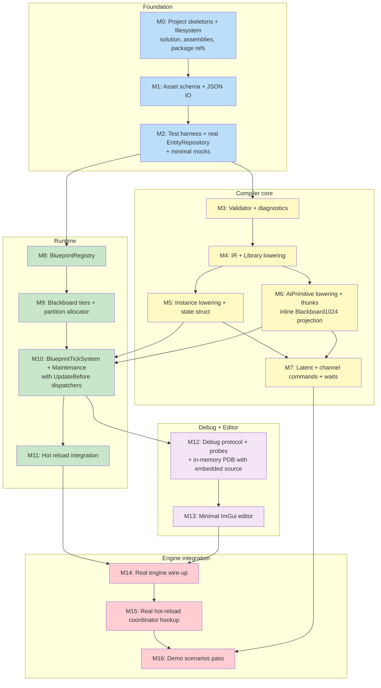

# Blueprint Subsystem — Slice 1 Implementation Roadmap — v1.1

> **Status:** Roadmap-review-approved (architect feedback on v1.0 incorporated).
> **Supersedes:** `Blueprint_Subsystem_Implementation_Roadmap.md` v1.0.
> **Companion docs:** `Blueprint_Subsystem_Architecture_v1.2.md`, `..._FinalResolutions.md`, `..._InlinePatches.md`.

---

## Changelog vs Roadmap v1.0

1. **M0** — Per-project target frameworks explicitly specified. Generators must be `netstandard2.0`; everything else is `net8.0`. (Loose wording in v1.0 risked targeting generators at `net8.0`, which would fail to load in VS host.)
2. **M0, NEW** — Filesystem layout in the engine repo explicitly captured.
3. **M2** — Test fixture instantiates **real `Fdp.Core.EntityRepository`** instead of `MockEntityRepository`. Mock surface reduces to `MockSimulationView` (read-only enforcement) and `MockEntityCommandBuffer` (ECB queue + playback). Effort drops from 4-5 days to 2-3 days.
4. **M6** — `BlueprintAiWorkingStateAccess.GetOrAttach` helper class removed. Compiler emits `Blackboard1024` projection inline in each thunk, with StructureHash header check directly in generated code. (See v1.2 Inline Patch 1.)
5. **M10** — `BlueprintTickSystem` phase declaration includes `[UpdateBefore]` for `LocomotionDispatcherSystem`, `WeaponDispatcherSystem`, `InteractionDispatcherSystem` to avoid one-frame CQRS jitter. (See v1.2 Inline Patch 2.)
6. **M12** — Quick Reload path explicitly requires `InMemoryRoslynCompiler` with `EmitOptions(debugInformationFormat: DebugInformationFormat.PortablePdb)` and `EmbeddedText.FromSource(...)` for embedded source. PDB+EmbeddedSource is separate from MSBuild's `<EmitCompilerGeneratedFiles>`. (See v1.2 Inline Patch 3.)

No structural changes. Total nominal effort decreases by ~3 days due to dropped wrapper class and simpler M2.

---

## 1. Building Philosophy

(Unchanged from v1.0.)

Three rules govern sequencing:

**Rule 1 — Vertical slices over horizontal layers.** Every milestone runs end-to-end through the pipeline, however narrow.

**Rule 2 — Test harness first.** Mocks of `Fdp.Core` interfaces come before generated-code shape decisions; tests drive the design.

**Rule 3 — Engine integration is the *last* vertical, not the first.** Build against `Fdp.Core` + real `EntityRepository` until contracts hold; drop in the rest of the engine afterward.

### Refinement (architect-clarified)

"Decoupled" means **decoupled compilation surface**, not decoupled deployment. We target the engine's lightweight bottom layer (`Fdp.Core`) directly. We do not invent wrapper interfaces. We use a real `EntityRepository` in-memory for tests. Mocks are limited to enforcing engine phase/threading rules around the real ECS, not replacing the ECS.

---

## 2. Filesystem layout in the engine repository

Per architect direction, exact placement of the new code:

```
<engine repo root>/
├── FDP/
│   ├── Engine/
│   │   ├── Fdp.Core/                          # existing; schema + interfaces
│   │   └── Fdp.Presentation/                  # existing; ImGui, StructEdit, WindowManager
│   └── Toolkits/
│       ├── Fdp.Toolkits/                      # existing
│       │   └── Blueprints/                    # NEW — runtime layer (engine team owns)
│       │       ├── BlueprintRegistry.cs
│       │       ├── BlueprintDefinition.cs
│       │       ├── Components/
│       │       │   ├── BlueprintBlackboard1024.cs
│       │       │   ├── BlueprintBlackboard4096.cs
│       │       │   └── BlueprintBlackboard16384.cs
│       │       ├── Partitioning/
│       │       │   ├── BlueprintBlackboardHeader.cs
│       │       │   ├── BlueprintSlotEntry.cs
│       │       │   └── BlueprintBlackboardPartitions.cs
│       │       ├── Systems/
│       │       │   ├── BlueprintTickSystem.cs
│       │       │   └── BlueprintMaintenanceSystem.cs
│       │       ├── Attributes/
│       │       │   ├── BlueprintRegistrarAttribute.cs
│       │       │   ├── BlueprintExposedEventAttribute.cs
│       │       │   └── BlueprintExposedChannelCommandAttribute.cs
│       │       └── Catalogs/
│       │           ├── EngineEventCatalog.cs
│       │           ├── ChannelCommandCatalog.cs
│       │           └── WaitPrimitiveCatalog.cs
│       └── Fdp.Toolkits.Analyzers/            # existing; FdpToolkit's Roslyn analyzers
└── Hrot/
    ├── Subsystems/
    │   ├── Hrot.AI.Behaviors/                 # existing — reloadable DLL
    │   │   ├── (hand-written BTree/HSM/SharedAi C# files)
    │   │   ├── Blueprints/                    # NEW — .bp.json asset files
    │   │   │   ├── Combat/
    │   │   │   ├── Locomotion/
    │   │   │   └── ...
    │   │   └── Hrot.AI.Behaviors.csproj       # modified per M0
    │   └── Blueprints/                        # NEW — Blueprint tooling
    │       ├── Hrot.Blueprints.Core/
    │       │   ├── Assets/                    # BlueprintAsset, Node, Pin, etc.
    │       │   ├── Compiler/                  # IBlueprintCompiler, IR, pipelines
    │       │   ├── Debug/                     # IBlueprintDebugSession, DebugMap
    │       │   ├── Validation/
    │       │   └── Hrot.Blueprints.Core.csproj
    │       ├── Hrot.Blueprints.Generators/
    │       │   ├── BlueprintIncrementalGenerator.cs
    │       │   └── Hrot.Blueprints.Generators.csproj
    │       ├── Hrot.Blueprints.Editor/
    │       │   ├── Windows/                   # ManagedWindow subclasses
    │       │   ├── Drawers/                   # StructEdit IImGuiFieldDrawer impls
    │       │   ├── BlueprintEditorSubsystem.cs
    │       │   └── Hrot.Blueprints.Editor.csproj
    │       └── Hrot.Blueprints.Tests/
    │           ├── Mocks/
    │           ├── Compiler/
    │           ├── Runtime/
    │           ├── HotReload/
    │           └── Hrot.Blueprints.Tests.csproj
    └── (rest of Hrot game source)
```

**Three placement principles:**

1. **`FDP/Toolkits/Fdp.Toolkits/Blueprints/`** — engine-team-owned. Runtime layer: components, systems, registry, partition allocator, attributes. Sits alongside other engine toolkits.

2. **`Hrot/Subsystems/Blueprints/`** — Blueprint tooling team's working surface. Compiler core, generator, editor, test harness. Most edits happen here.

3. **`Hrot/Subsystems/Hrot.AI.Behaviors/Blueprints/`** — `.bp.json` source files live alongside hand-written AI code, in the same assembly that hosts them. Folder structure inside `Blueprints/` is for human organization (e.g., `Combat/`, `Locomotion/`); the `<AdditionalFiles Include="Blueprints\**\*.bp.json" />` pattern picks them up recursively.

---

## 3. The dependency picture



Sixteen milestones across five phases. Sequencing unchanged from v1.0.

---

## 4. Detailed milestone definitions

Each milestone has: Goal, Entry criteria, Acceptance criteria, Estimated effort, Risk flags. Changes from v1.0 are marked **[v1.1 update]**.

### M0 — Project skeletons + filesystem placement

**Goal:** All five new assemblies created, building (empty), referencing each other correctly, sitting in the right places in the engine repo. Solution compiles. CI runs.

**[v1.1 update]** — Filesystem layout per §2 is non-negotiable for M0 completion. Target frameworks explicitly stated.

**Acceptance:**

Filesystem:
- `FDP/Toolkits/Fdp.Toolkits/Blueprints/` directory exists with placeholder files.
- `Hrot/Subsystems/Blueprints/` directory exists with the four project subdirectories.
- `Hrot/Subsystems/Hrot.AI.Behaviors/Blueprints/` directory exists (initially empty; will receive `.bp.json` files starting in M4).

Per-project target frameworks **[v1.1 update]**:
- `Hrot.Blueprints.Core.csproj` → `net8.0`
- `Hrot.Blueprints.Generators.csproj` → **`netstandard2.0`** (required for Roslyn analyzer loading)
- `Fdp.Toolkits.Blueprints` (no separate csproj; part of `Fdp.Toolkits.csproj`) → `net8.0`
- `Hrot.Blueprints.Editor.csproj` → `net8.0`
- `Hrot.Blueprints.Tests.csproj` → `net8.0`

Building:
- All projects build (with empty placeholder content).
- One passing smoke test in `Hrot.Blueprints.Tests`.

Package references:
- `Hrot.Blueprints.Generators`:
  - `Microsoft.CodeAnalysis.CSharp 4.8.0` with `PrivateAssets="all"`
  - `Microsoft.CodeAnalysis.Analyzers 3.3.4` with `PrivateAssets="all"`
- `Hrot.Blueprints.Core` references `Fdp.Core` only.
- `Hrot.Blueprints.Generators` references `Hrot.Blueprints.Core` with `PrivateAssets="all"`.

`Hrot.AI.Behaviors.csproj` modifications:
- `<EmitCompilerGeneratedFiles>true</EmitCompilerGeneratedFiles>`
- `<CompilerGeneratedFilesOutputPath>$(BaseIntermediateOutputPath)\GeneratedFiles</CompilerGeneratedFilesOutputPath>`
- `<DebugType>portable</DebugType>` + `<DebugSymbols>true</DebugSymbols>`
- `<ProjectReference Include="...Hrot.Blueprints.Generators.csproj" OutputItemType="Analyzer" ReferenceOutputAssembly="false" />`
- `<ProjectReference Include="...Fdp.Toolkits.csproj" />` (already present; Blueprints code lives inside Fdp.Toolkits per architect direction)
- `<AdditionalFiles Include="Blueprints\**\*.bp.json" />`

**Effort:** 1-2 days.

**Risk:** Generator project packaging is finicky. **[v1.1 update]** Targeting generator at `net8.0` instead of `netstandard2.0` is a silent failure mode — the generator builds, the analyzer is referenced, but the host VS process can't load it. Verify by checking that adding a deliberately-malformed AdditionalFile triggers a generator error during `dotnet build`.

---

### M1 — Asset schema + JSON IO

(Unchanged from v1.0.)

**Goal:** `BlueprintAsset` and all child types defined. JSON round-trip works for all three dispatch kinds.

**Entry:** M0 complete.

**Acceptance:**
- All asset-schema types from v1.2 §5 implemented in `Hrot.Blueprints.Core.Assets`.
- `[JsonPolymorphic]` + `[JsonDerivedType]` declared for `Node` hierarchy (including v1.2's `ChannelCommandNode`, `WaitForChannelNode`, `WaitForEventNode`, `CallPeerBlueprintNode`).
- `BlueprintJsonServices` static helper class using `FdpJsonOptionsRegistry.DefaultRelaxed` + `JsonAestheticFormatter.FlattenNumericArrays`.
- xUnit tests:
  - Sample assets for each dispatch kind round-trip JSON → object → JSON byte-identical (after prettifier).
  - Polymorphic Node serialization works for all kinds.
  - Unknown fields silently ignored on read; missing fields default-initialize.

**Effort:** 2-3 days.

**Risk:** `[JsonPolymorphic]` ergonomics with engine's `FdpJsonOptionsRegistry`. Plan a `CreateExtended` workaround if conflict.

---

### M2 — Test harness + real EntityRepository **[v1.1 update]**

**Goal:** xUnit test fixture infrastructure with **real** `Fdp.Core.EntityRepository` backing storage. Lightweight mocks for `ISimulationView` and `IEntityCommandBuffer` that enforce engine phase/threading rules. Fixture verifies ALC unload on dispose.

**[v1.1 update]** No `MockEntityRepository`. Tests use real engine ECS in-memory.

**Entry:** M0 complete.

**Acceptance:**

Real backing:
- `BlueprintTestFixture` instantiates a `Fdp.Core.EntityRepository` instance directly. No subclassing, no replacement. Tests use the same component storage, query mechanics, and entity-lifecycle code that production uses.

Mock surface (limited to enforcing semantics, not replacing storage):
- `MockSimulationView : ISimulationView` — read-only projection over the repository:
  - Read-only methods delegate to the repository.
  - Internal-only "advance time" hook for tests to drive `Time` and `Tick`.
  - `ReadEvents<T>` returns a stable `IReadOnlyList<T>` for the duration of one tick.
- `MockEntityCommandBuffer : IEntityCommandBuffer`:
  - Queues all ops; `Playback()` applies to the repository.
  - `CreateEntity` returns real `Entity` immediately (matches QCB-1 ruling).
  - `AddEmptyComponent<T>` supported.
  - Throws on phase violations (e.g., direct singleton mutation outside `Playback()`).

`BlueprintTestFixture` infrastructure:
- `EntityRepository World { get; }` — the real one.
- `MockSimulationView View { get; }`.
- `MockEntityCommandBuffer Ecb { get; }`.
- `IBlueprintCompiler Compiler { get; }`.
- `BlueprintRegistry Registry { get; }`.
- `CapturingDebugSession DebugSession { get; }`.
- `Dispose()` performs collectible ALC unload + `GC.Collect` + `WeakReference.TryGetTarget` verify.

Contract-enforcement tests:
- The mock contract enforcement table from v1.2 §11.5 is verified by dedicated tests in `Hrot.Blueprints.Tests/Mocks/MockContractTests.cs`.

**Effort:** 2-3 days **[v1.1 update — reduced from 4-5 days]**.

**Risk:** Subtle wrapper-vs-engine semantic differences in `MockSimulationView`. Verify that `ref readonly` returns truly point into the real repository's chunk memory (no intermediate copy). Test pattern: get ref, mutate via repository write, verify ref reads the new value.

---

### M3 — Validator + diagnostics

(Unchanged from v1.0.)

**Goal:** `IBlueprintCompiler.Validate(asset)` works for all asset kinds. Catches every diagnostic in v1.2 validator rules.

**Entry:** M1, M2 complete.

**Acceptance:**
- `IBlueprintCompiler` interface + `BlueprintCompiler` skeleton implementation.
- `Validate(asset)` walks the asset and reports:
  - Library: no events / no state / no Self / no impure nodes.
  - AiPrimitive intent Condition: no Running return; no latent nodes.
  - AiPrimitive: parameter size ≤ 100 bytes; intent + hostings compatibility.
  - Instance: variable total size fits declared tier.
  - Cross-checks: peer references resolve; type references resolve.
- `Diagnostic` records carry `(Severity, Code, Message, AssetId?, GraphId?, NodeId?, PinId?)`.
- `DiagnosticsTests.cs` confirms each documented diagnostic fires correctly.

**Effort:** 4-5 days.

**Risk:** None major.

---

### M4 — IR + Library lowering

(Unchanged from v1.0.)

**Goal:** `BlueprintCompiler.Compile` works for Library-dispatch assets end-to-end. Byte-deterministic output. In-memory Roslyn compile loads.

**Entry:** M3 complete.

**Acceptance:**
- IR data model defined per Compiler Detailed Design.
- Library lowering pass emits `public static class` with `BlueprintId` constant + public static method per function graph.
- Tests:
  - `GoldenOutputTests` snapshot-checks generated source.
  - `DeterminismTests` byte-identical across re-runs.
  - `BlueprintIdHashTests` FNV-1a stable.
  - `LibraryDispatchTests` compile in-memory, load into collectible ALC, reflect, call, assert.
  - `AlcUnloadTests` reclaim verified.
- File-naming convention `{SanitizedName}_{BlueprintId:X8}_Bp.g.cs` implemented.
- One `[BlueprintRegistrar]` class per asset.

**Effort:** 7-10 days.

**Risk:** Roslyn determinism. Confirm `deterministic: true` is set in `CSharpCompilation.Create`; sort everything; verify byte-identical output achievable.

---

### M5 — Instance lowering + state struct

(Unchanged from v1.0.)

**Goal:** Compile Instance dispatch assets end-to-end. Emit `State` struct with `StructLayout(Sequential)`, init-default, event handler methods, registrar.

**Entry:** M4 complete.

**Acceptance:**
- Instance lowering pass implemented.
- Generated `State` struct includes all asset variables, deterministic offsets.
- `StructureHash` computed deterministically.
- `Tick` method + `Event_<Name>` methods + `RegisterAll(BlueprintRegistry)`.
- `InstanceDispatchTests` compile, load, invoke against `MockSimulationView` + `MockEntityCommandBuffer`, assert state mutation.
- `StructureHashTests` verify hash stability and that variable changes change the hash.

**Effort:** 7-10 days.

**Risk:** Getting `Unsafe.As<byte, T>` + `MemoryMarshal.GetReference` patterns right in emitted code.

---

### M6 — AiPrimitive lowering + thunks **[v1.1 update]**

**Goal:** AiPrimitive assets compile end-to-end. Generated code includes `TickCore` + one thunk per declared hosting. Inline `Blackboard1024` projection with StructureHash header check. Thunk signatures match engine's existing BTree/HSM contracts.

**[v1.1 update]** No `BlueprintAiWorkingStateAccess` class. Inline projection per v1.2 Inline Patch 1.

**Entry:** M4 complete (parallel with M5).

**Acceptance:**

Lowering:
- AiPrimitive lowering pass implemented.
- Per declared hosting, emit corresponding thunk:
  - BTreeAction/Condition: `NodeLogicDelegate<BrainBlackboard, BTreeContext>`-shaped.
  - HsmAction: `unsafe void M(void* instance, void* context, HsmCommandWriter* writer)`.
  - HsmGuard: `unsafe bool M(void* instance, void* context, ushort eventId)`.
  - BlueprintCall: direct typed `Call` method.

Inline projection in each thunk:
```csharp
ref var bb1024 = ref ctx.World.GetComponentRW<Blackboard1024>(ctx.Self);
unsafe {
    fixed (byte* memory = bb1024.Memory) {
        ulong storedHash = *(ulong*)memory;
        if (storedHash != StructureHash) {
            Unsafe.InitBlock(memory, 0, (uint)sizeof(Blackboard1024));
            *(ulong*)memory = StructureHash;
            InitDefaultWorkingState((WorkingState*)(memory + 8));
        }
        ref var ws = ref Unsafe.AsRef<WorkingState>(memory + 8);
        // ... call TickCore ...
    }
}
```

Layout convention: first 8 bytes of `Blackboard1024.Memory` = `ulong StructureHash` header; rest = `WorkingState` struct.

Tests:
- `AiPrimitiveDispatchTests`:
  - Asset with `hostings: ["BTreeAction", "HsmAction"]` produces both thunks.
  - Invoke BTree thunk via mock BTree-context shim, assert correct NodeStatus and side effects.
  - Invoke HSM thunk via mock HSM-bridge shim, assert side effects on world.
  - Same authored graph produces identical behavior under both hostings.
  - StructureHash header correctly written and detected.
- `ConditionValidatorTests` confirm Condition-intent assets with Running or latent nodes fail validation.

**Effort:** 10-14 days (unchanged; removing the wrapper class saved ~1 day, but inline emission complexity gained ~1 day).

**Risk:** HSM thunk shape uses unmanaged function pointers and `GCHandle` recovery — careful unsafe-code review needed. Verify behavior against a hand-written `[SharedAi*]` example.

---

### M7 — Latent execution + channel commands + waits

(Unchanged from v1.0.)

**Goal:** All latent infrastructure works. Channel command nodes compile correctly. Wait nodes lower correctly per dispatch.

**Entry:** M5, M6 complete.

**Acceptance:**
- `BlueprintLatentCursor` struct defined.
- Instance Wait lowering: switch on `Cursor.ResumeAt` + `goto` labels.
- AiPrimitive Wait lowering: phase-byte advance + `return NodeStatus.Running`.
- `ChannelCommandNode` lowering: correct `ref var ch = ...; ch.ActiveAction = ...; ch.ActionInstanceId++;` pattern.
- `WaitForChannelNode` lowering: polls `chStatus.Status`, dispatch-aware suspension.
- Three catalogs implemented (hand-curated entries) in `Fdp.Toolkits.Blueprints/Catalogs/`.
- Tests pass.
- **MoveToAndFire AiPrimitive demo** (per Q-OPEN-E) runs end-to-end through a mock BTree tick loop.

**Effort:** 10-14 days.

**Risk:** Dispatch-aware Wait lowering means two code paths in the emitter. Test both extensively. MoveToAndFire is the acceptance gate.

---

### M8 — BlueprintRegistry + BlueprintDefinition

(Unchanged from v1.0.)

**Goal:** Runtime registry working in `Fdp.Toolkits.Blueprints`. Hand-loaded BlueprintDefinitions tickable via test harness.

**Entry:** M2 complete.

**Acceptance:**
- `BlueprintRegistry` concrete class.
- `BlueprintDefinition` record with all fields per v1.2 §6.6.
- `Register*` methods for Library / AiPrimitive / Instance.
- `TryGetById` + `TryGetByName` lookups.
- `CommitStaging` for atomic swap.
- `BlueprintRegistryTests` pass.

**Effort:** 3-4 days.

**Risk:** None major.

---

### M9 — Blackboard tiers + partition allocator

(Unchanged from v1.0.)

**Goal:** All three blackboard tiers exist as components. Partition allocator helpers correct. Test harness attaches/detaches slots.

**Entry:** M2, M8 complete.

**Acceptance:**
- `BlueprintBlackboard{1024,4096,16384}` defined, `ComponentId` attributes, `GlobalComponentIds` updated.
- Headers and slot entries with correct layout.
- `BlueprintBlackboardPartitions` static helpers correct: Initialize, TryGetSlotOffset, TryAttach, TryDetach, ResetSlot, CopyToLargerTier.
- `PartitionAllocatorTests`, `MultiBlueprintTests` pass.

**Effort:** 5-7 days.

**Risk:** Pointer arithmetic, layout invariants. Triple-check `sizeof` and offsets.

---

### M10 — BlueprintTickSystem + BlueprintMaintenanceSystem **[v1.1 update]**

**Goal:** Both systems implemented as `IEcsModuleSystem`. **`BlueprintTickSystem` declares `[UpdateBefore]` for all channel dispatchers** to avoid CQRS jitter.

**[v1.1 update]** Phase ordering per v1.2 Inline Patch 2.

**Entry:** M8, M9 complete.

**Acceptance:**

`BlueprintTickSystem`:
```csharp
[UpdateInPhase(SystemPhase.Simulation)]
[UpdateBefore(typeof(LocomotionDispatcherSystem))]
[UpdateBefore(typeof(WeaponDispatcherSystem))]
[UpdateBefore(typeof(InteractionDispatcherSystem))]
public sealed class BlueprintTickSystem : IEcsModuleSystem, IProfiledSystem
```

`BlueprintMaintenanceSystem`:
```csharp
[UpdateInPhase(SystemPhase.BeforeSync)]
public sealed class BlueprintMaintenanceSystem : IEcsModuleSystem, IProfiledSystem
```

Tick behavior:
- `BlueprintTickSystem.Execute(ISimulationView)` iterates all three blackboard tiers; per tier iterates entities; per entity iterates slot table; per slot performs reload reconciliation + invokes `def.Tick`. World-singleton tier ticking included.
- `BlueprintMaintenanceSystem.Execute(ISimulationView)` finds entities with both old- and new-tier blackboards, byte-copies, removes old tier synchronously.

Tests:
- `InstanceDispatchTests` extended for end-to-end tick.
- Multi-slot tick: two Blueprints, both tick in slot order.
- Per-slot reload reconciliation: hash change triggers slot hard-reset; others untouched.
- `TierUpgradeTests` 1024→4096 with state preserved.
- **Phase ordering test:** Instance Blueprint that writes to `LocomotionChannel` via channel command; channel dispatcher in same frame sees the command (proving `BlueprintTickSystem` ran first).

**Effort:** 6-8 days.

**Risk:** Phase ordering — verify by running through the full phase sequence. **[v1.1 update]** Also verify the `UpdateBefore` attribute names match the engine's actual dispatcher class names during M10 implementation; correct if needed.

---

### M11 — Hot-reload integration

(Unchanged from v1.0.)

**Goal:** Reload-on-recompile works. Per-slot reconciliation correct. Old ALC unloads cleanly.

**Entry:** M8, M9, M10 complete.

**Acceptance:**
- Phase A (mock): `BlueprintTestFixture.SimulateReload(newAssets)` works end-to-end (in-memory compile, patch ALC, attribute-driven registrar discovery, registry swap, per-slot reconciliation on next tick, old ALC GC-reclaimed).
- Phase B (engine): `AiHotReloadCoordinator` modified per v1.2 §8.
- Tests: `SoftReloadTests`, `HardResetTests`, `AlcUnloadTests`, `PerSlotIsolationTests` pass.

**Effort:** 8-10 days (Phase A: 5-6; Phase B: 3-4).

**Risk:** ALC unload leaks from retained refs.

---

### M12 — Debug protocol + probes **[v1.1 update]**

**Goal:** Breakpoint, step, watch, trace all work. **PDB-based debugger integration works for both Full Rebuild and Quick Reload paths** with in-memory compilation explicitly emitting embedded source.

**[v1.1 update]** Quick Reload compilation pattern per v1.2 Inline Patch 3.

**Entry:** M5, M6, M7 complete.

**Acceptance:**

Debug protocol (unchanged from v1.0):
- `IBlueprintDebugSession` interface in `Hrot.Blueprints.Core.Debug`.
- `DebugProbe` static class with `NodeEnter` and `PinValueChanged`.
- Compiler emits probe calls in Debug + Trace modes; elides in Release.
- Debug map sidecar JSON generated per asset.
- `CapturingDebugSession` test implementation captures probe events.
- `BreakpointTests`, `TraceTests`, `WatchTests` pass.

PDB emission **[v1.1 update]**:

Full Rebuild path:
- `<EmitCompilerGeneratedFiles>` + `<DebugType>portable</DebugType>` (already in M0).
- Manual verification: attach Rider to running engine with Full-Rebuilt code; set breakpoint in `.g.cs` file; hit; inspect locals; step.

Quick Reload path:
- `InMemoryRoslynCompiler` class in `Hrot.Blueprints.Core` calls `CSharpCompilation.Emit` with:
  - `EmitOptions(debugInformationFormat: DebugInformationFormat.PortablePdb)`
  - `embeddedTexts: new[] { EmbeddedText.FromSource(virtualPath, sourceText) }`
- Patch ALC loaded via `LoadFromStream(peStream, pdbStream)` (two-arg overload).
- Manual verification: attach debugger to test process running Quick-Reloaded code; set breakpoint in generated source via embedded text; hit; inspect locals; step.

Compile-mode test:
- Both paths produce equivalent debug behavior in Debug and Trace modes.

**Effort:** 6-8 days (unchanged; the extra emission code is small).

**Risk:** `EmbeddedText.FromSource` requires the same `SourcePath` used in `CSharpSyntaxTree.ParseText`. Mismatch silently breaks debugger source lookup. Document and test the path-equivalence rule.

---

### M13 — Minimal ImGui editor

(Unchanged from v1.0.)

**Goal:** All editor windows integrated with engine `WindowManager`. Quick Reload and Full Rebuild both work.

**Entry:** M11, M12 complete. Requires real engine integration since `WindowManager` is engine-side.

**Acceptance:**
- `BlueprintEditorSubsystem : ISubsystem, IWindowRegistrar` registers all windows.
- All windows from v1.2 §12 implemented.
- Custom StructEdit field drawers.
- Instance Inspector with live read-write state.
- Force Hard Reset button gated behind developer-mode toggle.
- Quick Reload + Full Rebuild buttons both work end-to-end.
- Manual demo: open asset → edit variable → Quick Reload → observe runtime updates without game pause.

**Effort:** 12-15 days.

**Risk:** StructEdit polymorphic combo-box UX for Node hierarchy.

---

### M14 — Real engine wire-up

(Unchanged from v1.0.)

**Goal:** All code runs against the production engine kernel, not just the lightweight `Fdp.Core` slice.

**Entry:** M11 + M13.

**[v1.1 update note]** Because M2 uses real `EntityRepository` already, M14 is mostly about ensuring the rest of the engine kernel (BTreeTickSystem running real BTrees, HsmTickSystem running real HSMs, hot-reload coordinator running real reloads) plays nicely with Blueprint code. Less surface than v1.0 implied.

**Acceptance:**
- An integration test project wires a real (small) Hrot scenario.
- Instance Blueprints from unit tests now tick against full engine. Behavior identical.
- AiPrimitive Blueprints invoked from real BTrees and HSMs.
- All v1.2 §11.5 mock contracts hold under real engine.

**Effort:** 4-6 days.

**Risk:** Subtle mock-vs-engine drift. Each drift is one fix-up.

---

### M15 — Real hot-reload coordinator hookup

(Unchanged from v1.0.)

**Goal:** Edit `.bp.json`, save, MSBuild rebuild, hot reload, live instances reconcile.

**Entry:** M11 Phase B, M14.

**Acceptance:**
- End-to-end flow works.
- AI + Blueprints reload simultaneously.
- PDB loading: dev on, production off.
- Editor's "Full Rebuild" button drives this end-to-end.

**Effort:** 3-5 days.

---

### M16 — Demo scenarios pass

(Unchanged from v1.0.)

**Goal:** All five Slice 1 demos run successfully — automated tests AND human-driven editor walkthroughs.

**Entry:** M13, M14, M15.

**Acceptance:**
- All five demos in §5 pass.
- All `Hrot.Blueprints.Tests` xUnit suite passes.
- Slice 1 release notes published.

**Effort:** 5-7 days.

---

## 5. Slice 1 demo scenarios

(Unchanged from v1.0.)

1. **Library function used from C#** — `MathUtilsLib.bp.json`. Proves Library dispatch.
2. **Instance Blueprint with engine event subscription** — `HealthRegen.bp.json`. Proves Instance dispatch, engine event polling, latent execution via cursor, debug protocol, editor live state view.
3. **Multi-Blueprint composition with peer calls** — `DoorActor.bp.json` + `DoorSensor.bp.json`. Proves multi-Blueprint per entity, partition allocator, peer calls, `callablePeers` validation.
4. **AiPrimitive shared between BTree and HSM** — `HasVisibleTarget.bp.json` (Condition, hostings: BTreeCondition + HsmGuard). Proves multi-hosting, BTree + HSM thunks, `Blackboard1024` integration, Condition validator.
5. **MoveToAndFire** — `MoveToAndFire.bp.json` (Action, hostings: BTreeAction + HsmAction). Proves channel commands, dispatch-aware Wait, full CQRS pattern, dual hosting. **The headline demo.**

---

## 6. Detailed-design documents to produce

(Unchanged from v1.0.)

| Doc | Drives milestones | ~pages |
|---|---|---|
| **Compiler Detailed Design** | M3, M4, M5, M6, M7 | 40-50 |
| **Runtime Detailed Design** | M8, M9, M10 | 25-30 |
| **Test Harness Detailed Design** | M2 | 20-25 |
| **Debug Protocol Detailed Design** | M12 | 15-20 |
| **Editor Detailed Design** | M13 | 20-25 |
| **Hot Reload Detailed Design** | M11 | 15-20 |

Recommended write order: **Compiler → Runtime → Test Harness → Hot Reload → Debug Protocol → Editor**.

---

## 7. Quality gates and definition-of-done

(Unchanged from v1.0.)

1. All listed acceptance tests pass in CI.
2. No ALC leaks (GC reclaim verified per test).
3. Byte-identical determinism per compile.
4. Zero allocations in hot paths (allocation-counter test).
5. Faithful mock semantics (engine-rule conformance tests).
6. Detailed design docs updated for any meaningful design choice not in v1.2.

---

## 8. Known technical risks

| Risk | Impact | Mitigation |
|---|---|---|
| Roslyn determinism gaps | Medium | Strict sorted-iteration; per-change determinism tests |
| ALC unload leaks | High | GC-verify per test |
| `ISimulationView` mock-engine semantic drift | **Lower [v1.1 — mostly resolved]** by using real EntityRepository | Only the wrappers around it differ; small surface to audit |
| HSM function-pointer lifetime across reload | High | `HsmActionDispatcher.ClearAll` before reload; managed-delegates-only in Blueprint |
| StructEdit polymorphic combo-box UX | Low | Iterate during M13 |
| Engine team unable to add `AddEmptyComponent` opcode | Medium | Already confirmed by engine team |
| MSBuild + Roslyn analyzer packaging | Low | Verified during M0; `netstandard2.0` target framework non-negotiable |
| **[v1.1] In-memory PDB emission missing EmbeddedText** | **Medium** | Documented in v1.2 Inline Patch 3; tests during M12 verify |
| **[v1.1] Phase order — BlueprintTickSystem after dispatchers** | **Medium** | `[UpdateBefore]` declarations in M10; dispatcher names verified during impl |

---

## 9. Non-technical risks

(Unchanged from v1.0.)

| Risk | Mitigation |
|---|---|
| Scope creep into Slice 2 | Strict adherence to v1.2 §1.2 Non-Goals |
| Detailed-design doc bottleneck | Write in parallel with M0-M2 foundation work |
| Engine-team availability | Engine changes pre-approved; small workload per change |
| Manual demo validation | Demos exercise mostly-automated paths |

---

## 10. Definition of Slice 1 Complete

(Unchanged from v1.0.)

1. All 16 milestones (M0-M16) acceptance criteria met.
2. All five demos pass — automated + human-driven walkthroughs.
3. Full xUnit suite passes in CI.
4. All documentation complete: architecture v1.2 + Final Resolutions + Inline Patches, this Roadmap, all six detailed designs, Slice 1 release notes.
5. Architect signs off on final walkthrough.
6. MoveToAndFire demo lives in Hrot game, hot-reloadable via `.bp.json` edit.

---

## 11. After Slice 1

(Unchanged from v1.0.)

Slice 2 highest priorities:

1. `Blackboard1024` partition allocator (lifts one-AiPrimitive-per-entity constraint).
2. Cross-entity dispatcher calls (deferred events).
3. Latent in AiPrimitive graphs hosted as BTree action.
4. Visual node canvas (the real editor).
5. `[BlueprintExposedEvent]` / `[BlueprintExposedChannelCommand]` attribute-driven catalogs.
6. Map/Set containers; more Cast nodes; Timeline nodes.

Slice 2 gets its own architecture pass after Slice 1 ships.

---

*End of Implementation Roadmap v1.1. Detailed-design documents follow, starting with Compiler Detailed Design.*
