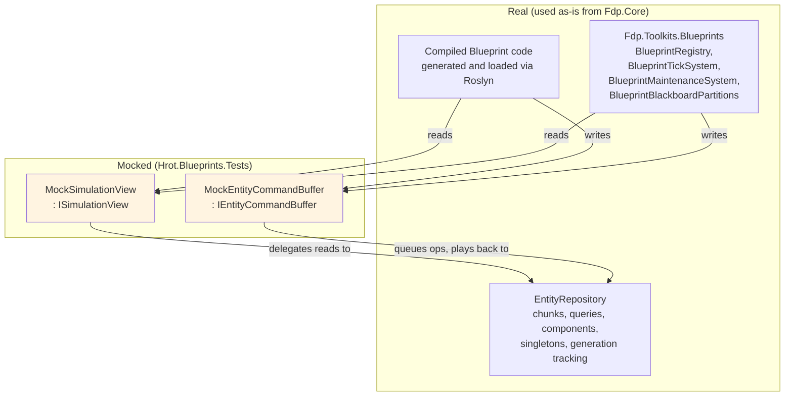
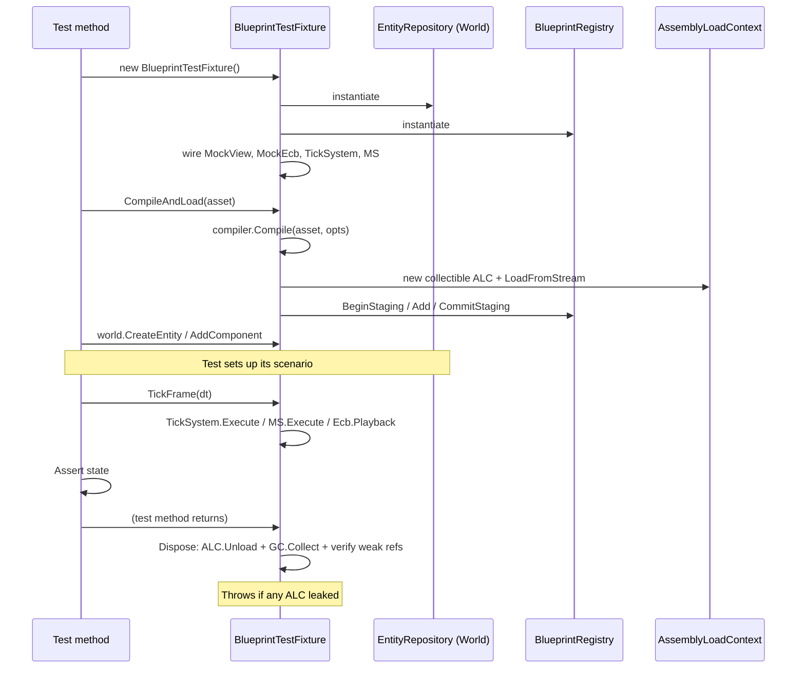

# Blueprint Subsystem — Test Harness Detailed Design

> **Status:** Detailed design, derived from `Blueprint_Subsystem_Architecture_v1.2.md` + Final Resolutions + Inline Patches + Implementation Roadmap v1.1 + Compiler DD + Compiler DD Inline Patches + Runtime DD + Runtime DD Inline Patches. All Test Harness DD inline patches integrated.
> **Audience:** Implementation agent and human reviewer.
> **Drives:** Milestone M2 (test harness skeleton + Fdp.Core mocks).
> **Doesn't cover:** the test *cases* themselves (those are owned by the respective DDs — Compiler tests in Compiler DD §17, Runtime tests in Runtime DD §11, etc.). This DD owns the *infrastructure* those tests run on.
> **Companion code lives in:** `Hrot/Subsystems/Blueprints/Hrot.Blueprints.Tests/` (per Roadmap §2).

---

## Table of Contents

1. Design philosophy
2. Fixture architecture
3. `MockSimulationView` — read-only projection
4. `MockEntityCommandBuffer` — deferred-write ECB
5. `BlueprintTestFixture` — the per-test umbrella
6. `BlueprintAssetBuilder` — fluent test-asset construction
7. ALC lifecycle and unload verification
8. The mock contract enforcement matrix
9. Compile-load-run-reload cycle
10. Capturing debug session
11. Test-data infrastructure
12. Open questions

---

## 1. Design philosophy

### 1.1 The core insight (revisited from the architect's M2 correction)

The original v1.0 Roadmap planned a `MockEntityRepository` that re-implemented the ECS from scratch — chunk storage, queries, generation tracking. The architect's correction (Roadmap v1.1, M2) was: **the engine's real `Fdp.Core.EntityRepository` is already lightweight and instantiable in-process. Use it directly. Mock only the thin interfaces (`ISimulationView`, `IEntityCommandBuffer`) that simulation systems consume.**

This gives Slice 1 the best of both worlds:
- **Real ECS semantics** — chunks, generation counters, `ref readonly` returns, query iteration order. No drift between mock-tested behavior and production behavior.
- **Lightweight, isolated tests** — no engine kernel, no renderer, no physics. Tests run in milliseconds.
- **Mock contract = engine contract.** The mocks implement the *real* `ISimulationView` and `IEntityCommandBuffer` interfaces. Generated Blueprint code that compiles against the engine-direct interfaces (per v1.2) runs identically in tests and production.

### 1.2 What the test harness actually is

A small library (`Hrot.Blueprints.Tests`) containing:

- **Mock implementations** of `ISimulationView` and `IEntityCommandBuffer` that wrap a real `EntityRepository`.
- **`BlueprintTestFixture`** — an xUnit `IClassFixture`-compatible class encapsulating a single test's environment: world, registry, fixture-owned ALCs, time advancement, scenario-end disposal.
- **`BlueprintAssetBuilder`** — a fluent builder for constructing `BlueprintAsset` instances in code (cleaner than loading JSON files for trivial test cases).
- **Helpers** for compile-load-run-reload cycles, slot inspection, debug-session capture, GC reclaim verification.

The test harness does *not* contain any test cases. Those live in their respective directories per the DD that owns them (`Compiler/`, `Runtime/`, `HotReload/`, `Debug/`, etc.).

### 1.3 What gets mocked and why



**Mocked: only the two thin interfaces.** Everything else is real.

### 1.4 Why mock at all? Why not use the real `EntityRepository` for everything?

`EntityRepository` is a concrete class implementing `ISimulationView` (per the architect's confirmation). Tests *could* pass the repo directly anywhere `ISimulationView` is required. The reason to wrap with a mock is *contract enforcement*:

The real engine's `ISimulationView` view is enforced *by convention*: simulation-phase code is expected to not write directly to the world, but the compiler doesn't prevent it. Buggy code can break the convention and only surface as race conditions or replay desyncs in production.

`MockSimulationView` wraps the real repo, forwarding reads but **rejecting writes** explicitly. If generated Blueprint code accidentally calls `view.GetComponentRW` or otherwise tries to mutate, the mock throws an `InvalidOperationException` with a clear test failure. Bug caught at unit-test time, not at integration.

Same logic for `MockEntityCommandBuffer`: enforces playback timing, catches code that tries to immediately observe the effect of an ECB write.

### 1.5 What the mocks DON'T do

The mocks are not full re-implementations. They don't:

- Reorder ECB operations for "deterministic playback" — they preserve insertion order, same as the real ECB.
- Implement parallel/job-scheduled execution variants.
- Provide test-only "magic" behaviors (e.g., "advance to next event"). All test-driven advancement happens via the fixture's explicit `TickFrame(dt)` calls.
- Add their own validation beyond the engine's (no schema checks, no "I think you meant X").

The mocks are thin, predictable, and correct-by-construction wrappers — nothing more.

---

## 2. Fixture architecture

### 2.1 Goals

The `BlueprintTestFixture` is the integration point for a test. It must:

1. **Be cheap to construct** — under 50 ms per test, so a test class with 100 tests runs in under 5 seconds.
2. **Be fully isolated** — no shared state between tests. Each test gets a fresh repo, registry, and ALC.
3. **Mirror production wiring** — the fixture uses the real `BlueprintRegistry`, real `BlueprintTickSystem`, real `BlueprintMaintenanceSystem`. Only the world view is mocked.
4. **Detect resource leaks** — every fixture verifies ALC unload + GC reclaim on `Dispose`. A test that leaks shows up as a failed assertion at teardown, not as flaky behavior later.
5. **Have a small, focused API** — the test author should write `fixture.CompileAndLoad(asset)` and `fixture.TickFrame(0.016f)` and have everything work. Internal complexity is not exposed.

### 2.2 Component breakdown

```
BlueprintTestFixture (one per test)
├── EntityRepository World          ← real Fdp.Core
├── MockSimulationView View          ← wraps World, read-only
├── MockEntityCommandBuffer Ecb      ← wraps World, deferred writes
├── BlueprintRegistry Registry       ← real Fdp.Toolkits.Blueprints
├── BlueprintTickSystem TickSystem   ← real
├── BlueprintMaintenanceSystem MS    ← real
├── BlueprintCompiler Compiler       ← real
├── CapturingDebugSession Debug      ← test-only capture impl
├── List<AssemblyLoadContext> Alcs   ← all ALCs the fixture created
└── Disposal: unload + GC verify
```

The fixture owns and manages all of these. The test interacts with the fixture and (rarely) reaches in for direct world/registry queries.

### 2.3 Lifecycle



### 2.4 The fixture class shape

```csharp
namespace Hrot.Blueprints.Tests;

public sealed class BlueprintTestFixture : IDisposable
{
    public EntityRepository World { get; }
    public MockSimulationView View { get; }
    public MockEntityCommandBuffer Ecb { get; }
    public BlueprintRegistry Registry { get; }
    public BlueprintTickSystem TickSystem { get; }
    public BlueprintMaintenanceSystem MaintenanceSystem { get; }
    public IBlueprintCompiler Compiler { get; }
    public CapturingDebugSession DebugSession { get; }

    private readonly List<WeakReference<AssemblyLoadContext>> _alcWeakRefs = new();
    private readonly List<AssemblyLoadContext> _activeAlcs = new();

    public BlueprintTestFixture(BlueprintTestFixtureOptions? options = null)
    {
        options ??= BlueprintTestFixtureOptions.Default;
        World = new EntityRepository();
        View = new MockSimulationView(World);
        Ecb = new MockEntityCommandBuffer(World);
        Registry = new BlueprintRegistry();
        DebugSession = new CapturingDebugSession();
        TickSystem = new BlueprintTickSystem(Registry);
        MaintenanceSystem = new BlueprintMaintenanceSystem();
        Compiler = new BlueprintCompiler();

        DebugProbe.Sink = DebugSession;     // route generated probe calls here
    }

    // -- Compile and load --
    public Assembly CompileAndLoad(BlueprintAsset asset, CompilerMode mode = CompilerMode.Debug);
    public Assembly CompileAndLoadMany(IReadOnlyList<BlueprintAsset> assets, CompilerMode mode = CompilerMode.Debug);
    public void SimulateReload(IReadOnlyList<BlueprintAsset> newVersions);

    // -- Tick --
    public void TickFrame(float deltaTime);

    // -- Slot inspection helpers --
    public bool HasSlot(BlueprintAsset asset, Entity entity);
    public BlueprintSlotEntry GetSlotEntry(BlueprintAsset asset, Entity entity);
    public BlueprintStateView GetBlueprintState(BlueprintAsset asset, Entity entity);
    public ImmutableArray<byte> SnapshotAllBlackboards();

    // -- Attach helpers --
    public void AttachBlueprint(BlueprintAsset asset, Entity entity);

    // -- Disposal --
    public void Dispose();
}

public sealed record BlueprintTestFixtureOptions(
    bool VerifyAlcUnloadOnDispose = true,
    int GcReclaimRetries = 3,
    int GcReclaimDelayMs = 50)
{
    public static BlueprintTestFixtureOptions Default { get; } = new();
}
```

### 2.5 Why xUnit `IClassFixture` vs per-test fixture

xUnit offers two patterns:
- **`IClassFixture<T>`** — fixture instance shared across all tests in a class.
- **Per-test fixture** — new instance per `[Fact]` method (declare `IDisposable` on the test class, or use `using var fixture = new BlueprintTestFixture()` inside each test).

**The test harness uses per-test fixture.** Reasons:

- ALC isolation: tests that hot-reload have different ALC states; sharing would couple tests.
- GC determinism: unload + reclaim is verified per test, not at class teardown.
- Failure isolation: a leaking test doesn't affect subsequent tests.

The cost is fixture construction overhead — but the fixture is designed to be cheap (no engine kernel, no rendering, no physics). Construction is ~5 ms; teardown with GC verify is ~50 ms. Tests still run hundreds per second.

### 2.6 Disposal contract

```csharp
public void Dispose()
{
    // 1. Unload all collectible ALCs we created
    foreach (var alc in _activeAlcs)
    {
        alc.Unload();
    }
    _activeAlcs.Clear();

    // 2. Force GC to reclaim ALC backing memory
    if (Options.VerifyAlcUnloadOnDispose)
    {
        for (int retry = 0; retry < Options.GcReclaimRetries; retry++)
        {
            GC.Collect();
            GC.WaitForPendingFinalizers();
            GC.Collect();

            bool allReclaimed = true;
            foreach (var weak in _alcWeakRefs)
                if (weak.TryGetTarget(out _)) { allReclaimed = false; break; }

            if (allReclaimed) return;
            Thread.Sleep(Options.GcReclaimDelayMs);
        }

        // After retries, any surviving ALCs are leaks — fail loud
        var leaked = _alcWeakRefs.Where(w => w.TryGetTarget(out _)).ToList();
        if (leaked.Count > 0)
            throw new InvalidOperationException(
                $"BlueprintTestFixture.Dispose: {leaked.Count} ALC(s) not GC-reclaimed " +
                "after unload + collect. Check for retained references into the patch assembly. " +
                "Common causes: cached delegates outside BlueprintRegistry, captured lambdas " +
                "holding generic type instances, debugger keeping refs alive.");
    }
}
```

The "retries with delay" pattern accommodates the .NET GC's lazy nature — sometimes a single `GC.Collect()` doesn't immediately reclaim a freshly-unloaded ALC. Three retries with 50 ms between is generous.

### 2.7 What "ALC reclaimed" actually means

When `AssemblyLoadContext.Unload()` is called on a collectible ALC, the runtime marks it for unloading. Actual unload happens when:
1. All references into the ALC are dropped (no static fields point in, no method tokens are live, no `Type` objects are held).
2. A GC cycle runs.

`WeakReference<AssemblyLoadContext>` is the test-friendly way to detect "did this ALC actually unload?". If `TryGetTarget` returns true after `GC.Collect()` + retries, *something* still holds a strong reference into the ALC.

This is the test's value: it surfaces hot-reload leaks at unit-test time, before they accumulate in production hot-reload cycles and bloat memory.

---

*Continued in Part 2 — §3 MockSimulationView, §4 MockEntityCommandBuffer.*

## 3. `MockSimulationView` — read-only projection

### 3.1 Purpose

`MockSimulationView` is the test-side implementation of `Fdp.Core.ISimulationView`. It wraps a real `EntityRepository` and:

1. **Forwards all read methods** unchanged. The underlying ECS semantics (`ref readonly` chunk access, generation tracking, query iteration order) are preserved exactly.
2. **Rejects write access** explicitly. Any code path that uses the view to mutate the world throws with a clear diagnostic.
3. **Provides time and tick controls** that the fixture drives manually. Real simulation systems read `Time` and `DeltaTime` from `ISimulationView`; the mock exposes them as test-controllable properties.
4. **Returns stable event streams** for the duration of a tick. Per architect's QV-3 ruling: `ReadEvents<T>()` returns an `IReadOnlyList<T>` that is safe to hold throughout the tick.

### 3.2 What `ISimulationView` provides (per architect's confirmation in earlier rounds)

The interface — implemented by both the real `EntityRepository` and our mock:

```csharp
namespace Fdp.Core;

public interface ISimulationView
{
    // Time
    float Time { get; }
    float DeltaTime { get; }
    uint Tick { get; }

    // Entity queries
    bool IsAlive(Entity entity);

    // Component reads — ref readonly into chunk memory (QV-1)
    ref readonly T GetComponentRO<T>(Entity entity) where T : unmanaged;
    T GetManagedComponentRO<T>(Entity entity) where T : class;
    bool HasComponent<T>(Entity entity) where T : unmanaged;
    bool HasManagedComponent<T>(Entity entity) where T : class;

    // Singletons
    bool HasSingleton<T>() where T : unmanaged;
    ref readonly T GetSingletonRO<T>() where T : unmanaged;

    // Events — stable list for the tick (QV-3)
    IReadOnlyList<T> ReadEvents<T>() where T : unmanaged;

    // Queries
    IEntityQuery Query();

    // ECB access
    IEntityCommandBuffer GetCommandBuffer();
}
```

(Slice 1 may use a narrower subset of this surface, depending on what generated code emits. The mock implements the full interface for forward compatibility.)

### 3.3 Concrete implementation

```csharp
namespace Hrot.Blueprints.Tests.Mocks;

public sealed class MockSimulationView : ISimulationView
{
    private readonly EntityRepository _repo;
    private readonly MockEntityCommandBuffer _ecb;

    private float _time;
    private float _deltaTime;
    private uint _tick;

    public MockSimulationView(EntityRepository repo)
    {
        _repo = repo;
        _ecb = new MockEntityCommandBuffer(repo);
    }

    // -- Time (driven by fixture) --
    public float Time => _time;
    public float DeltaTime => _deltaTime;
    public uint Tick => _tick;

    internal void AdvanceTime(float dt)
    {
        _time += dt;
        _deltaTime = dt;
        _tick++;
    }

    // -- Entity lifecycle reads --
    public bool IsAlive(Entity entity) => _repo.IsAlive(entity);

    // -- Component reads — forward unchanged --
    public ref readonly T GetComponentRO<T>(Entity entity) where T : unmanaged
        => ref _repo.GetComponentRO<T>(entity);

    public T GetManagedComponentRO<T>(Entity entity) where T : class
        => _repo.GetManagedComponentRO<T>(entity);

    public bool HasComponent<T>(Entity entity) where T : unmanaged
        => _repo.HasComponent<T>(entity);

    public bool HasManagedComponent<T>(Entity entity) where T : class
        => _repo.HasManagedComponent<T>(entity);

    public bool HasSingleton<T>() where T : unmanaged
        => _repo.HasSingleton<T>();

    public ref readonly T GetSingletonRO<T>() where T : unmanaged
        => ref _repo.GetSingletonRO<T>();

    // -- Events -- delegate directly to FdpEventBus; stability guaranteed by bus double-buffering
    public IReadOnlyList<T> ReadEvents<T>() where T : unmanaged
        => _repo.Bus.Read<T>();

    // -- Queries --
    public IEntityQuery Query() => _repo.Query();

    // -- ECB --
    public IEntityCommandBuffer GetCommandBuffer() => _ecb;
}
```

### 3.4 Why the mock holds the ECB

`ISimulationView.GetCommandBuffer()` returns the frame's command buffer. In production, the engine maintains one ECB per frame and exposes it via the view. The mock follows the same pattern: it constructs one `MockEntityCommandBuffer` at fixture creation, returns the same instance from every `GetCommandBuffer()` call within a frame.

The fixture's `TickFrame` plays back the ECB at the end of each tick (Sync phase), after which both structural mutations and queued events are settled.

### 3.5 What about write access?

The architect's QV-1 and QV-2 rulings confirm: `ISimulationView` exposes `ref readonly T GetComponentRO<T>` (read-only by type system). The mock's forwarding implementation preserves this — generated code that wants to write must go through the ECB.

**There is no `GetComponentRW` on the mock view.** If generated Blueprint code calls `ctx.World.GetComponentRW<T>(entity)` somewhere in a thunk, that's not calling the mock — it's calling the real `EntityRepository.GetComponentRW` directly via the cast `var repo = (EntityRepository)view` that runtime systems do (per Runtime DD §6.3). For tests running the real `BlueprintTickSystem` against a real `EntityRepository`, this works fine: the cast returns the real repo (since the mock view is just a wrapper).

The mock's value is **at the boundary**: anywhere a system accepts an `ISimulationView`, that interface presents only read access. The mock makes this guarantee explicit and testable.

### 3.6 Event publication for tests

Tests need to publish events that Blueprint code can poll via `view.ReadEvents<T>()`. Events are published via ECB and become readable in the *next* `TickFrame` after `SwapBuffers()`:

```csharp
// In test
fixture.Ecb.PublishEvent(new HitEvent { Target = entity, Damage = 30, ... });
fixture.TickFrame(0.016f);   // SwapBuffers at tick start makes the event readable
var hits = fixture.View.ReadEvents<HitEvent>();  // stable for entire tick
```

This mirrors production code exactly. The `FdpEventBus` double-buffer ensures events published during a tick are not visible until the next `SwapBuffers()`.

```csharp
// Inside BlueprintTestFixture:
public void TickFrame(float dt)
{
    // 1. Advance event bus so events published last frame become readable this frame
    _repo.Bus.SwapBuffers();

    // 2. Advance time
    View.AdvanceTime(dt);

    // 3. Simulation phase
    TickSystem.Execute(View);
    foreach (var auxSystem in _auxSimulationSystems)
        auxSystem.Execute(View);

    // 4. BeforeSync phase
    MaintenanceSystem.Execute(View);

    // 5. Sync phase: ECB playback (structural mutations + queued events apply)
    Ecb.Playback(_repo);

    // 6. Mid-tick inspection hook (after everything settled)
    _tickActions?.Invoke(View, Ecb);
}
```

### 3.7 Per-tick event stream stability (QV-3 enforcement)

Generated Instance Tick code may do:

```csharp
var hits = view.ReadEvents<HitEvent>();
for (int i = 0; i < hits.Count; i++)
{
    if (hits[i].Target == self)
        Event_OnHit(ref s, view, ecb, self, time, deltaTime, ...);
}
```

The architect's QV-3 ruling: `hits` must remain valid for the duration of this loop, even if other code in the same tick publishes more events. This stability is provided natively by the `FdpEventBus` double-buffering: `Read<T>()` returns the *read* buffer which stays immutable until the next `SwapBuffers()`. Events published via ECB during a tick land in the write buffer and become readable only on the next `SwapBuffers()` (next `TickFrame`). No mock-side snapshot logic needed.

### 3.8 `IsAlive` mid-frame semantics (QV-4)

Architect's QV-4: `IsAlive(e)` returns `true` until ECB playback applies a destroy. The mock honors this by delegating to `_repo.IsAlive(entity)` — the real `EntityRepository` already implements this semantics (`IsAlive` checks generation, generation doesn't change until destroy actually runs).

So a tick that issues `ecb.DestroyEntity(e)` and then immediately reads `view.IsAlive(e)` will see `true`. Next tick (after playback), `IsAlive(e)` returns `false`. Mock-side this works without any extra logic — we get it for free from the underlying repo.

### 3.9 What the mock contract enforcement tests look like

```csharp
public class MockSimulationViewContractTests
{
    [Fact]
    public void GetComponentRO_ReturnsRefIntoChunkMemory()
    {
        using var fixture = new BlueprintTestFixture();
        var e = fixture.World.CreateEntity();
        fixture.World.AddComponent(e, new TestComponent { Value = 42 });

        ref readonly var view1 = ref fixture.View.GetComponentRO<TestComponent>(e);
        Assert.Equal(42, view1.Value);

        // Mutate via the repo's write path (simulating a generated thunk)
        ref var write = ref fixture.World.GetComponentRW<TestComponent>(e);
        write.Value = 99;

        // The earlier ref should see the new value — it's a ref into the same memory
        Assert.Equal(99, view1.Value);
    }

    [Fact]
    public void ReadEvents_SameListThroughoutTick()
    {
        using var fixture = new BlueprintTestFixture();
        fixture.PublishEventForNextTick(new TestEvent { Value = 1 });
        fixture.PublishEventForNextTick(new TestEvent { Value = 2 });

        // Inside a tick:
        fixture.RegisterTickAction((view, ecb) =>
        {
            var first = view.ReadEvents<TestEvent>();
            var second = view.ReadEvents<TestEvent>();
            Assert.Same(first, second);             // same instance
            Assert.Equal(2, first.Count);

            // Publishing during tick doesn't affect this tick's stream
            ecb.PublishEvent(new TestEvent { Value = 3 });
            Assert.Equal(2, view.ReadEvents<TestEvent>().Count);
        });
        fixture.TickFrame(0.016f);
    }

    [Fact]
    public void IsAlive_AfterEcbDestroy_ReturnsTrueUntilPlayback()
    {
        using var fixture = new BlueprintTestFixture();
        var e = fixture.World.CreateEntity();

        fixture.Ecb.DestroyEntity(e);

        // Before playback: still alive
        Assert.True(fixture.View.IsAlive(e));

        fixture.TickFrame(0.016f);                  // playback happens
        Assert.False(fixture.View.IsAlive(e));
    }
}
```

These three tests pin the mock-view contract. Any future refactor to the mock that breaks them fails fast.

---

## 4. `MockEntityCommandBuffer` — deferred-write ECB

### 4.1 Purpose

`MockEntityCommandBuffer` implements `Fdp.Core.IEntityCommandBuffer`. It:

1. **Queues writes** instead of applying them immediately.
2. **Plays back the queue** on the fixture's command (typically at start of next `TickFrame`).
3. **Supports `AddEmptyComponent<T>`** per v1.2 §13.5 (engine extension already confirmed).
4. **Returns real `Entity` handles from `CreateEntity`** per architect's QCB-1 ruling — the entity exists in the repo immediately, but its components don't until playback.

### 4.2 What `IEntityCommandBuffer` provides (per architect's earlier confirmation)

```csharp
namespace Fdp.Core;

public interface IEntityCommandBuffer
{
    // Structural mutations
    Entity CreateEntity();
    void DestroyEntity(Entity entity);

    // Component lifecycle
    void AddComponent<T>(Entity entity, T value) where T : unmanaged;
    void AddEmptyComponent<T>(Entity entity) where T : unmanaged;       // per v1.2 §13.5
    void RemoveComponent<T>(Entity entity) where T : unmanaged;

    void AddManagedComponent<T>(Entity entity, T value) where T : class;
    void RemoveManagedComponent<T>(Entity entity) where T : class;

    // Component writes (mutating existing component on entity)
    void SetComponent<T>(Entity entity, T value) where T : unmanaged;

    // Singletons
    void SetSingleton<T>(T value) where T : unmanaged;

    // Events
    void PublishEvent<T>(T evt) where T : unmanaged;
}
```

### 4.3 Implementation strategy: discriminated union of operations

```csharp
namespace Hrot.Blueprints.Tests.Mocks;

public sealed class MockEntityCommandBuffer : IEntityCommandBuffer
{
    private readonly EntityRepository _repo;
    private readonly List<EcbOp> _ops = new();

    public MockEntityCommandBuffer(EntityRepository repo) => _repo = repo;

    // -- Structural mutations --
    public Entity CreateEntity()
    {
        // Per QCB-1: real Entity handle issued immediately
        var entity = _repo.CreateEntity();
        // Recorded as no-op (entity already exists) — but track for diagnostics
        _ops.Add(new EcbOp_CreateEntityRecord { Entity = entity });
        return entity;
    }

    public void DestroyEntity(Entity entity)
        => _ops.Add(new EcbOp_DestroyEntity { Entity = entity });

    // -- Component lifecycle (unmanaged) --
    public void AddComponent<T>(Entity entity, T value) where T : unmanaged
        => _ops.Add(new EcbOp_AddComponentUnmanaged<T> { Entity = entity, Value = value });

    public void AddEmptyComponent<T>(Entity entity) where T : unmanaged
        => _ops.Add(new EcbOp_AddEmptyComponentUnmanaged<T> { Entity = entity });

    public void RemoveComponent<T>(Entity entity) where T : unmanaged
        => _ops.Add(new EcbOp_RemoveComponentUnmanaged<T> { Entity = entity });

    public void SetComponent<T>(Entity entity, T value) where T : unmanaged
        => _ops.Add(new EcbOp_SetComponentUnmanaged<T> { Entity = entity, Value = value });

    // -- Component lifecycle (managed) --
    public void AddManagedComponent<T>(Entity entity, T value) where T : class
        => _ops.Add(new EcbOp_AddComponentManaged<T> { Entity = entity, Value = value });

    public void RemoveManagedComponent<T>(Entity entity) where T : class
        => _ops.Add(new EcbOp_RemoveComponentManaged<T> { Entity = entity });

    // -- Singletons --
    public void SetSingleton<T>(T value) where T : unmanaged
        => _ops.Add(new EcbOp_SetSingletonUnmanaged<T> { Value = value });

    // -- Events --
    public void PublishEvent<T>(T evt) where T : unmanaged
        => _ops.Add(new EcbOp_PublishEventUnmanaged<T> { Event = evt });

    // -- Playback (fixture-controlled) --
    internal void Playback()
    {
        foreach (var op in _ops)
            op.Apply(_repo);
        _ops.Clear();
    }

    internal IReadOnlyList<EcbOp> OpsForInspection => _ops;
    internal int OpCount => _ops.Count;
}
```

### 4.4 The `EcbOp` discriminated union

Implemented as a small class hierarchy. Each op carries enough data to apply itself:

```csharp
internal abstract class EcbOp
{
    public abstract void Apply(EntityRepository repo);
}

// Structural
internal sealed class EcbOp_CreateEntityRecord : EcbOp
{
    public Entity Entity;
    public override void Apply(EntityRepository repo)
    {
        // No-op at playback — entity already created in CreateEntity()
        // Recorded for diagnostics / debugging only.
    }
}

internal sealed class EcbOp_DestroyEntity : EcbOp
{
    public Entity Entity;
    public override void Apply(EntityRepository repo)
    {
        if (repo.IsAlive(Entity)) repo.DestroyEntity(Entity);
    }
}

// Component lifecycle (unmanaged)
internal sealed class EcbOp_AddComponentUnmanaged<T> : EcbOp where T : unmanaged
{
    public Entity Entity;
    public T Value;
    public override void Apply(EntityRepository repo)
    {
        if (repo.IsAlive(Entity)) repo.AddComponent(Entity, Value);
    }
}

internal sealed class EcbOp_AddEmptyComponentUnmanaged<T> : EcbOp where T : unmanaged
{
    public Entity Entity;
    public override void Apply(EntityRepository repo)
    {
        // Default-init the component on add — matches engine extension semantics
        if (repo.IsAlive(Entity)) repo.AddComponent(Entity, default(T));
    }
}

internal sealed class EcbOp_RemoveComponentUnmanaged<T> : EcbOp where T : unmanaged
{
    public Entity Entity;
    public override void Apply(EntityRepository repo)
    {
        if (repo.IsAlive(Entity) && repo.HasComponent<T>(Entity))
            repo.RemoveComponent<T>(Entity);
    }
}

internal sealed class EcbOp_SetComponentUnmanaged<T> : EcbOp where T : unmanaged
{
    public Entity Entity;
    public T Value;
    public override void Apply(EntityRepository repo)
    {
        if (repo.IsAlive(Entity) && repo.HasComponent<T>(Entity))
        {
            ref var c = ref repo.GetComponentRW<T>(Entity);
            c = Value;
        }
    }
}

// Singletons
internal sealed class EcbOp_SetSingletonUnmanaged<T> : EcbOp where T : unmanaged
{
    public T Value;
    public override void Apply(EntityRepository repo)
        => repo.SetSingletonUnmanaged(Value);
}

// Events
internal sealed class EcbOp_PublishEventUnmanaged<T> : EcbOp where T : unmanaged
{
    public T Event;
    public override void Apply(EntityRepository repo)
        => repo.PublishEvent(Event);
}

// Managed component lifecycle — analogous; sketched only:
internal sealed class EcbOp_AddComponentManaged<T> : EcbOp where T : class { /* ... */ }
internal sealed class EcbOp_RemoveComponentManaged<T> : EcbOp where T : class { /* ... */ }
```

### 4.5 Playback ordering (QCB-3 / QCB-4)

The architect's QCB-3/QCB-4: ECB playback is deterministic based on issue order; writes are deferred for safety in multithreaded simulation; playback is main-thread-only.

The mock preserves this:
- Operations stored in an ordered `List<EcbOp>`.
- `Playback` iterates in insertion order.
- The fixture calls `Playback` from a single thread (the test thread).

Determinism: same sequence of method calls → same sequence of operations → same final state. This is essential for replay tests.

### 4.6 `CreateEntity` semantics (QCB-1)

Per architect's QCB-1: `CreateEntity` returns a real `Entity` handle *immediately*. The mock does this by delegating to `_repo.CreateEntity()` synchronously — so the returned entity exists in the world right away.

This is the part of ECB semantics that's often confusing: the entity exists, but its components don't until subsequent `AddComponent` operations play back. So:

```csharp
var e = ecb.CreateEntity();           // entity exists
ecb.AddComponent(e, new Foo());        // queued, but Foo not on e yet
Assert.True(view.IsAlive(e));          // TRUE (entity exists)
Assert.False(view.HasComponent<Foo>(e));   // FALSE (component not yet attached)

fixture.TickFrame(...);                // ECB plays back
Assert.True(view.HasComponent<Foo>(e));    // NOW TRUE
```

Generated Blueprint code that uses this pattern (e.g., a Blueprint that spawns a child entity and attaches components to it) gets correct semantics from the mock.

### 4.7 `AddEmptyComponent<T>` (per v1.2 §13.5)

The engine team confirmed they'll add `AddEmptyComponent<T>(Entity)` to bypass the 1024-byte ECB payload limit. The mock supports it as documented in §4.4:

```csharp
public void AddEmptyComponent<T>(Entity entity) where T : unmanaged
    => _ops.Add(new EcbOp_AddEmptyComponentUnmanaged<T> { Entity = entity });
```

Playback adds a default-initialized component to the entity. This matches the engine extension's semantics: large component types (e.g., `BlueprintBlackboard16384` at 16 KB) can be attached without copying the payload through the ECB itself — the entity gets a zeroed component, and subsequent system runs populate it.

This is essential for tier upgrade (Runtime DD §7): `AddEmptyComponent<BlueprintBlackboard4096>(entity)` adds the tier without dragging 4 KB through the ECB.

### 4.8 Playback timing within `TickFrame`

ECB playback happens at the **end** of `TickFrame`, after `MaintenanceSystem.Execute`, mirroring the engine's Sync phase order. Assertions written immediately after `TickFrame(dt)` see the fully finalised state.

```csharp
public void TickFrame(float deltaTime)
{
    // 1. Advance event bus so events published last frame become readable this frame
    _repo.Bus.SwapBuffers();

    // 2. Advance time
    View.AdvanceTime(deltaTime);

    // 3. Simulation phase
    TickSystem.Execute(View);
    foreach (var auxSystem in _auxSimulationSystems)
        auxSystem.Execute(View);

    // 4. BeforeSync phase
    MaintenanceSystem.Execute(View);

    // 5. Sync phase: ECB playback
    Ecb.Playback(_repo);

    // 6. Mid-tick inspection hook (after everything settled)
    _tickActions?.Invoke(View, Ecb);
}
```

This matches production: the engine plays ECB at Sync phase (end of frame). Tests that need to verify "did the ECB op apply correctly?" simply call `TickFrame(dt)` and then assert.

### 4.9 Phase-rule violations the mock catches

Per Roadmap M2 acceptance: "Direct singleton mutation outside Playback throws."

The mock's `SetSingleton` queues; there's no direct setter on `MockEntityCommandBuffer`. But what about a system that bypasses ECB and tries to set a singleton directly on the repo?

That's `EntityRepository.SetSingletonUnmanaged` — which the repo allows in *any* phase. The mock can't intercept it because it's on the repo, not the view.

The mock-contract enforcement test makes the constraint explicit:

```csharp
[Fact]
public void DirectSingletonWrite_DuringSimulation_NotEnforcedByMock()
{
    // The mock cannot prevent direct repo.SetSingleton calls from
    // systems that have escalated to repo write access. This is by design
    // — the engine itself doesn't prevent this.
    //
    // What the mock DOES enforce: any generated Blueprint code that goes
    // through the view + ECB path will be correct. Hand-written systems
    // that bypass the ECB are out of scope.
}
```

For Slice 1, the policy is: generated code goes through ECB; hand-written code is the system author's responsibility. The mock enforces what it can.

### 4.10 Contract enforcement tests

```csharp
public class MockEntityCommandBufferContractTests
{
    [Fact]
    public void CreateEntity_ReturnsRealHandleImmediately()
    {
        using var fixture = new BlueprintTestFixture();
        var e = fixture.Ecb.CreateEntity();

        Assert.True(fixture.View.IsAlive(e));               // QCB-1
        Assert.False(fixture.View.HasComponent<TestComponent>(e));   // not yet
    }

    [Fact]
    public void AddComponent_DefersUntilPlayback()
    {
        using var fixture = new BlueprintTestFixture();
        var e = fixture.Ecb.CreateEntity();
        fixture.Ecb.AddComponent(e, new TestComponent { Value = 7 });

        Assert.False(fixture.View.HasComponent<TestComponent>(e));   // queued, not applied

        fixture.TickFrame(0.016f);                          // play back

        Assert.True(fixture.View.HasComponent<TestComponent>(e));
        Assert.Equal(7, fixture.View.GetComponentRO<TestComponent>(e).Value);
    }

    [Fact]
    public void AddEmptyComponent_DefaultInitsAfterPlayback()
    {
        using var fixture = new BlueprintTestFixture();
        var e = fixture.Ecb.CreateEntity();
        fixture.Ecb.AddEmptyComponent<BlueprintBlackboard1024>(e);

        fixture.TickFrame(0.016f);

        Assert.True(fixture.View.HasComponent<BlueprintBlackboard1024>(e));
        // All bytes zero
        var bb = fixture.View.GetComponentRO<BlueprintBlackboard1024>(e);
        unsafe
        {
            for (int i = 0; i < BlueprintBlackboard1024.TotalSize; i++)
                Assert.Equal(0, bb.Memory[i]);
        }
    }

    [Fact]
    public void DestroyEntity_DefersUntilPlayback()
    {
        using var fixture = new BlueprintTestFixture();
        var e = fixture.World.CreateEntity();
        Assert.True(fixture.View.IsAlive(e));

        fixture.Ecb.DestroyEntity(e);
        Assert.True(fixture.View.IsAlive(e));               // QCB-1 + QV-4

        fixture.TickFrame(0.016f);
        Assert.False(fixture.View.IsAlive(e));
    }

    [Fact]
    public void Playback_PreservesInsertionOrder()
    {
        using var fixture = new BlueprintTestFixture();
        var e = fixture.World.CreateEntity();
        var order = new List<int>();

        // Queue three ops; their playback order is recorded via a custom hook.
        // (Mocked via test-only EcbOp subclass that records on Apply.)
        fixture.Ecb.AddComponent(e, new TestComponent { Value = 1 });
        fixture.Ecb.AddComponent(e, new TestComponent { Value = 2 });
        fixture.Ecb.AddComponent(e, new TestComponent { Value = 3 });
        // AddComponent of same type overwrites in real ECB; final value should be 3.

        fixture.TickFrame(0.016f);

        Assert.Equal(3, fixture.View.GetComponentRO<TestComponent>(e).Value);
    }
}
```

These four tests pin the mock-ECB contract. They constitute the Roadmap M2 acceptance gate for the ECB mock.

---

*Continued in Part 3 — §5 BlueprintTestFixture lifecycle methods, §6 BlueprintAssetBuilder, §7 ALC lifecycle.*

## 5. `BlueprintTestFixture` — the per-test umbrella

### 5.1 Compile and load

```csharp
public Assembly CompileAndLoad(BlueprintAsset asset, CompilerMode mode = CompilerMode.Debug)
    => CompileAndLoadMany(new[] { asset }, mode);

public Assembly CompileAndLoadMany(
    IReadOnlyList<BlueprintAsset> assets,
    CompilerMode mode = CompilerMode.Debug)
{
    // 1. Compile each asset to source, accumulate into one combined source string
    var combinedSource = new StringBuilder();
    var siblings = assets.Select(BlueprintSignatureBuilder.From).ToImmutableArray();

    foreach (var asset in assets)
    {
        var options = new CompileOptions(
            Mode: mode,
            NodeRegistry: BuiltInNodeRegistry.Instance,
            TypeRegistry: BuiltInTypeRegistry.Instance,
            EngineEvents: EngineEventCatalog.Instance,
            ChannelCommands: ChannelCommandCatalog.Instance,
            WaitPrimitives: WaitPrimitiveCatalog.Instance,
            SiblingSignatures: siblings,
            EmitPdbWithEmbeddedSource: false);              // we'll emit via Stage 8 separately

        var result = Compiler.Compile(asset, options);
        if (!result.Succeeded)
            throw new BlueprintCompileException(
                $"Compile failed for asset '{asset.Name}':\n" +
                string.Join("\n", result.Diagnostics.Select(d => $"  {d.Code}: {d.Message}")));

        combinedSource.AppendLine(result.GeneratedSource);
        combinedSource.AppendLine();
    }

    // 2. Run Stage 8 (Roslyn in-memory compile) over the combined source
    var roslynCompiler = new InMemoryRoslynCompiler(
        MetadataReferenceResolver.ForRuntimeAssemblies(
            AppDomain.CurrentDomain.GetAssemblies()));   // filters dynamic + locationless per Compiler DD Patch 2

    var assemblyName = $"BlueprintTestFixture_{Guid.NewGuid():N}";
    var (peBytes, pdbBytes) = roslynCompiler.Compile(
        combinedSource.ToString(),
        virtualSourcePath: $"{assemblyName}.g.cs",
        assemblyName: assemblyName,
        sink: new DiagnosticSink());

    // 3. Load into a collectible ALC owned by this fixture
    var alc = new AssemblyLoadContext(assemblyName, isCollectible: true);
    _activeAlcs.Add(alc);
    _alcWeakRefs.Add(new WeakReference<AssemblyLoadContext>(alc));

    using var peStream = new MemoryStream(peBytes);
    using var pdbStream = new MemoryStream(pdbBytes);
    Assembly assembly = alc.LoadFromStream(peStream, pdbStream);

    // 4. Discover all [BlueprintRegistrar] classes and invoke them via the staging protocol
    var staging = Registry.BeginStaging();
    InvokeAllRegistrars(assembly, staging);
    Registry.CommitStaging(staging);

    return assembly;
}

private void InvokeAllRegistrars(Assembly assembly, BlueprintRegistryStaging staging)
{
    foreach (var type in assembly.GetTypes())
    {
        if (type.GetCustomAttribute<BlueprintRegistrarAttribute>() == null) continue;

        var registerMethod = type.GetMethod("Register",
            BindingFlags.Public | BindingFlags.Static);
        if (registerMethod == null)
            throw new InvalidOperationException(
                $"Type {type.FullName} marked [BlueprintRegistrar] but has no Register method.");

        // The Register method's parameters tell us what to inject. We pass the
        // staging buffer (which the generated code wraps as a registry-like adapter
        // via the runtime's BlueprintRegistryStagingAdapter).
        InvokeRegistrarMethod(registerMethod, staging);
    }
}
```

`InvokeRegistrarMethod` matches the architect-mandated injection pattern from v1.2 §8.1 — the coordinator inspects the registrar's parameter list and supplies `BlueprintRegistry`, `BehaviorRegistry`, or `HsmActionDispatcher` as needed. The test fixture follows the same pattern.

For Slice 1 the fixture only needs to supply `BlueprintRegistry` (since tests don't usually exercise the BTree/HSM kernel ticking AiPrimitives end-to-end — those happen in dedicated runtime tests where the fixture also constructs lightweight `BehaviorRegistry` and `HsmActionDispatcher` mocks).

### 5.2 Simulating reload

```csharp
public void SimulateReload(IReadOnlyList<BlueprintAsset> newVersions)
{
    // Compile + load just like normal, but the staging-commit replaces existing entries.
    // The old ALC is unloaded *after* the new one is committed.

    var oldAlcs = _activeAlcs.ToList();
    _activeAlcs.Clear();

    CompileAndLoadMany(newVersions);   // populates _activeAlcs with the new ALC

    // Now unload the old ALCs. The registry already points at new delegates;
    // no live code references the old delegates. The unload triggers cleanup.
    foreach (var oldAlc in oldAlcs)
        oldAlc.Unload();

    // Note: GC reclaim is not forced here — the next TickFrame can still run
    // safely even if the old ALC's memory isn't reclaimed yet. The fixture's
    // Dispose will do the final reclaim verification.
}
```

This is the mock equivalent of `AiHotReloadCoordinator.LoadAndReload` followed by `DrainPendingCallbacks`. The behavior should match: new ALC loaded, registrars invoked, commit, old ALC unloaded.

A reload-specific subtlety: if the test wants to verify "old ALC was actually reclaimed after this reload" (not just at dispose time), it can call `fixture.ForceGcReclaim()`:

```csharp
public void ForceGcReclaim()
{
    for (int i = 0; i < 3; i++)
    {
        GC.Collect();
        GC.WaitForPendingFinalizers();
        GC.Collect();
        Thread.Sleep(20);
    }
}
```

`AlcUnloadTests` use this between reload and the WeakReference check.

### 5.3 TickFrame — the central simulation tick

```csharp
public void TickFrame(float deltaTime)
{
    // 1. Playback ECB ops queued during previous TickFrame (or test-driven seed ops)
    Ecb.Playback();

    // 2. Advance time
    View.AdvanceTime(deltaTime);

    // 3. Snapshot pending events into the view's per-tick stable stream
    View.BeginTick(SnapshotPendingEvents());
    _pendingEvents.Clear();

    // 4. Execute systems (Simulation phase: BlueprintTickSystem, then channel dispatchers
    //    if the fixture is configured to run them; then BeforeSync: BlueprintMaintenanceSystem)
    TickSystem.Execute(View);
    foreach (var auxSystem in _auxSimulationSystems)
        auxSystem.Execute(View);
    MaintenanceSystem.Execute(View);

    // 5. Any registered tick-action runs at the end (test-only hook for inspection mid-frame)
    _tickActions?.Invoke(View, Ecb);
}

private Action<ISimulationView, IEntityCommandBuffer>? _tickActions;
private readonly List<IEcsModuleSystem> _auxSimulationSystems = new();

public void RegisterTickAction(Action<ISimulationView, IEntityCommandBuffer> action)
    => _tickActions += action;

public void AddSimulationSystem(IEcsModuleSystem system)
    => _auxSimulationSystems.Add(system);
```

The fixture can host *additional* systems in the Simulation phase via `AddSimulationSystem`. Tests that exercise channel-command dispatch (e.g., the MoveToAndFire end-to-end) construct a small `MockLocomotionDispatcherSystem` that reads `LocomotionChannel.ActiveAction` and writes `LocomotionChannel.Status` based on test-controlled mock state. Add it with `AddSimulationSystem`; it runs after `BlueprintTickSystem` in the same frame (matching production phase order).

### 5.4 Slot inspection helpers

For test assertions about Blueprint state:

```csharp
public bool HasSlot(BlueprintAsset asset, Entity entity)
{
    int blueprintId = BlueprintIdHash.Compute(asset.AssetId);
    return TryGetSlotAcrossTiers(entity, blueprintId, out _, out _, out _);
}

public BlueprintSlotEntry GetSlotEntry(BlueprintAsset asset, Entity entity)
{
    int blueprintId = BlueprintIdHash.Compute(asset.AssetId);
    if (!TryGetSlotAcrossTiers(entity, blueprintId, out var tier, out int slotIndex, out int payloadOffset))
        throw new InvalidOperationException(
            $"Entity {entity} has no slot for Blueprint '{asset.Name}' " +
            $"(BlueprintId 0x{blueprintId:X8}) in any tier.");

    unsafe
    {
        byte* memory = GetTierMemoryPointer(entity, tier);
        byte* slotTable = memory + sizeof(BlueprintBlackboardHeader);
        return Unsafe.AsRef<BlueprintSlotEntry>(
            slotTable + slotIndex * BlueprintBlackboardPartitions.SlotEntrySize);
    }
}

public BlueprintStateView GetBlueprintState(BlueprintAsset asset, Entity entity)
{
    var slot = GetSlotEntry(asset, entity);
    int blueprintId = BlueprintIdHash.Compute(asset.AssetId);
    if (!Registry.TryGetById(blueprintId, out var def))
        throw new InvalidOperationException(
            $"Blueprint '{asset.Name}' not registered.");

    var memoryRef = GetTierMemoryRef(entity, GetTierForEntity(entity));
    var stateSpan = MemoryMarshal.CreateSpan(
        ref Unsafe.Add(ref memoryRef, slot.PayloadOffset),
        slot.PayloadSize);

    return new BlueprintStateView(def, stateSpan.ToArray());   // copy so caller can't mutate by accident
}

private bool TryGetSlotAcrossTiers(
    Entity entity, int blueprintId,
    out BlackboardTier tier, out int slotIndex, out int payloadOffset)
{
    if (TryGetSlot<BlueprintBlackboard1024>(entity, blueprintId, out slotIndex, out payloadOffset))
    {
        tier = BlackboardTier.B1024; return true;
    }
    if (TryGetSlot<BlueprintBlackboard4096>(entity, blueprintId, out slotIndex, out payloadOffset))
    {
        tier = BlackboardTier.B4096; return true;
    }
    if (TryGetSlot<BlueprintBlackboard16384>(entity, blueprintId, out slotIndex, out payloadOffset))
    {
        tier = BlackboardTier.B16384; return true;
    }
    tier = default; return false;
}
```

`BlueprintStateView` is a small helper for field-by-name access in tests:

```csharp
public sealed class BlueprintStateView
{
    private readonly BlueprintDefinition _def;
    private readonly byte[] _bytes;

    internal BlueprintStateView(BlueprintDefinition def, byte[] bytes)
    {
        _def = def; _bytes = bytes;
    }

    public T GetField<T>(string fieldName) where T : unmanaged
    {
        var field = _def.StateFields.First(f => f.Name == fieldName);
        if (typeof(T) != field.ClrType)
            throw new InvalidCastException(
                $"Field '{fieldName}' is of type {field.ClrType.Name}, " +
                $"requested as {typeof(T).Name}.");
        return MemoryMarshal.Read<T>(_bytes.AsSpan(field.OffsetBytes));
    }

    public BlueprintLatentCursor GetCursor() => GetField<BlueprintLatentCursor>("Cursor");

    public int StateSize => _bytes.Length;
}
```

Tests then write:

```csharp
var state = fixture.GetBlueprintState(asset, entity);
Assert.Equal(2, state.GetField<int>("CurrentCount"));
Assert.Equal(1u, state.GetCursor().ResumeAt);
```

The `def.StateFields` lookup uses the descriptor metadata that the compiler emits per Runtime DD §3.2 (`BlueprintFieldDescriptor`). Slice 1 generates these descriptors as part of `BlueprintDefinition`, populated by the compiler.

### 5.5 Attach helpers

```csharp
public void AttachBlueprint(BlueprintAsset asset, Entity entity)
{
    int blueprintId = BlueprintIdHash.Compute(asset.AssetId);
    if (!Registry.TryGetById(blueprintId, out var def))
        throw new InvalidOperationException(
            $"Blueprint '{asset.Name}' not loaded into registry. Call CompileAndLoad first.");

    if (def.Kind != BlueprintDispatchKind.Instance)
        throw new InvalidOperationException(
            $"AttachBlueprint only supports Instance dispatch; '{asset.Name}' is {def.Kind}.");

    // Ensure entity has the right tier component
    var tier = ChooseTier(def.StateSize);
    EnsureTierComponent(entity, tier);

    unsafe
    {
        byte* memory = GetTierMemoryPointer(entity, tier);
        if (!BlueprintBlackboardPartitions.TryAttach(
                memory, blueprintId, def.StateSize, def.StructureHash, out int payloadOffset))
            throw new InvalidOperationException(
                $"Failed to attach Blueprint '{asset.Name}' to entity {entity}: " +
                "tier full or fragmented.");

        // Run InitDefault on the new slot
        if (def.InitDefault is not null)
        {
            var initSpan = MemoryMarshal.CreateSpan(
                ref Unsafe.AddByteOffset(ref Unsafe.AsRef<byte>(memory), payloadOffset),
                def.StateSize);
            def.InitDefault(initSpan);
        }
    }
}

private void EnsureTierComponent(Entity entity, BlackboardTier tier)
{
    switch (tier)
    {
        case BlackboardTier.B1024:
            if (!World.HasComponent<BlueprintBlackboard1024>(entity))
                World.AddComponent(entity, new BlueprintBlackboard1024());
            break;
        case BlackboardTier.B4096:
            if (!World.HasComponent<BlueprintBlackboard4096>(entity))
                World.AddComponent(entity, new BlueprintBlackboard4096());
            break;
        case BlackboardTier.B16384:
            if (!World.HasComponent<BlueprintBlackboard16384>(entity))
                World.AddComponent(entity, new BlueprintBlackboard16384());
            break;
    }
    // Initialize header if not already done
    unsafe
    {
        byte* memory = GetTierMemoryPointer(entity, tier);
        ref var header = ref Unsafe.AsRef<BlueprintBlackboardHeader>(memory);
        if (header.MagicAndVersion != 0x42504257)
        {
            BlueprintBlackboardPartitions.Initialize(
                memory,
                GetTierTotalSize(tier),
                (byte)GetTierMaxSlots(tier));
        }
    }
}

private static BlackboardTier ChooseTier(int stateSize)
    => stateSize switch
    {
        <= 928 => BlackboardTier.B1024,
        <= 3936 => BlackboardTier.B4096,
        _ => BlackboardTier.B16384,
    };
```

`AttachBlueprint` is the test-side mirror of what production code does to attach a Blueprint to an entity (the production wiring lives in scenario-load code). The fixture exposes it as a convenience so test setup reads naturally:

```csharp
var e = fixture.World.CreateEntity();
fixture.AttachBlueprint(myAsset, e);
fixture.TickFrame(0.016f);
```

### 5.6 Channel-status helpers

Many tests need to simulate a dispatcher completing or failing a channel command. The fixture provides helpers:

```csharp
public void SetChannelStatus<TChannel>(Entity entity, NodeStatus status)
    where TChannel : unmanaged
{
    // Cast through the repo (mock view is read-only)
    ref var channel = ref World.GetComponentRW<TChannel>(entity);

    // Channel components share a layout convention: first field is Status
    // (per Hrot's channel design). Use a runtime check or rely on the
    // ChannelStatus property if available.
    ref var statusField = ref Unsafe.As<TChannel, NodeStatus>(ref channel);
    statusField = status;
}
```

This is used in the MoveToAndFire end-to-end test (Compiler DD §15.11) and similar scenarios:

```csharp
// Tick 1: Blueprint issues MoveTo
fixture.TickFrame(1f / 60f);

// Test simulates dispatcher completing the move
fixture.SetChannelStatus<LocomotionChannel>(entity, NodeStatus.Success);

// Tick 2: Blueprint sees Success, advances to next phase
fixture.TickFrame(1f / 60f);
```

### 5.7 Snapshot helpers for replay tests

```csharp
public ImmutableArray<byte> SnapshotAllBlackboards()
{
    var ms = new MemoryStream();
    using var writer = new BinaryWriter(ms);

    foreach (var entity in World.Query().Build())
    {
        if (World.HasComponent<BlueprintBlackboard1024>(entity))
            WriteComponent<BlueprintBlackboard1024>(writer, entity);
        if (World.HasComponent<BlueprintBlackboard4096>(entity))
            WriteComponent<BlueprintBlackboard4096>(writer, entity);
        if (World.HasComponent<BlueprintBlackboard16384>(entity))
            WriteComponent<BlueprintBlackboard16384>(writer, entity);
    }

    return ms.ToArray().ToImmutableArray();
}

private void WriteComponent<T>(BinaryWriter writer, Entity entity) where T : unmanaged
{
    writer.Write(entity.Index);
    writer.Write(entity.Generation);
    writer.Write(typeof(T).Name);
    ref readonly var comp = ref World.GetComponentRO<T>(entity);
    var span = MemoryMarshal.CreateReadOnlySpan(ref Unsafe.As<T, byte>(ref Unsafe.AsRef(in comp)), Unsafe.SizeOf<T>());
    writer.Write(span.ToArray());
}
```

Replay determinism tests compare snapshots from two parallel simulations:

```csharp
var snapA = fixtureA.SnapshotAllBlackboards();
var snapB = fixtureB.SnapshotAllBlackboards();
Assert.Equal(snapA, snapB);
```

---

## 6. `BlueprintAssetBuilder` — fluent test-asset construction

### 6.1 Purpose

Many tests need to construct a `BlueprintAsset` programmatically — small, focused, just enough to exercise one validator rule or one IR transform. Loading JSON files for these is overkill; the fluent builder makes the test self-contained and readable.

```csharp
var asset = BlueprintAssetBuilder
    .AiPrimitive("MyCondition")
    .WithIntent(AiPrimitiveIntent.Condition)
    .WithHostings(AiPrimitiveHosting.BTreeCondition)
    .WithParameter("Threshold", typeof(float), defaultValue: "0.5f")
    .WithGraph("Main", g => g
        .Entry()
        .Return(NodeStatus.Success))
    .Build();
```

vs

```csharp
var asset = TestData.LoadAsset("Snapshots/MyCondition.bp.json");
```

The first is self-documenting; the second hides the structure behind a filename.

### 6.2 Top-level builder shape

```csharp
namespace Hrot.Blueprints.Tests.Builders;

public sealed class BlueprintAssetBuilder
{
    private BlueprintDispatchKind _dispatch;
    private string _name = "";
    private Guid _assetId = Guid.NewGuid();
    private AiPrimitiveDecl? _primitive;
    private BlackboardTierHint _tierHint = BlackboardTierHint.Auto;
    private bool _isWorldSingleton;
    private readonly List<ParameterDecl> _parameters = new();
    private readonly List<VariableDecl> _workingState = new();
    private readonly List<VariableDecl> _variables = new();
    private readonly List<EventDispatcherDecl> _eventDispatchers = new();
    private readonly List<CustomEventDecl> _customEvents = new();
    private readonly List<Guid> _callablePeers = new();
    private readonly List<Graph> _graphs = new();

    // Static factory methods — start a builder of a specific dispatch
    public static BlueprintAssetBuilder Library(string name)
        => new BlueprintAssetBuilder
        {
            _dispatch = BlueprintDispatchKind.Library,
            _name = name,
        };

    public static BlueprintAssetBuilder AiPrimitive(string name)
        => new BlueprintAssetBuilder
        {
            _dispatch = BlueprintDispatchKind.AiPrimitive,
            _name = name,
            _primitive = new AiPrimitiveDecl
            {
                Intent = AiPrimitiveIntent.Action,
                Hostings = new List<AiPrimitiveHosting>(),
            },
        };

    public static BlueprintAssetBuilder Instance(string name)
        => new BlueprintAssetBuilder
        {
            _dispatch = BlueprintDispatchKind.Instance,
            _name = name,
        };

    // -- Fluent configuration --
    public BlueprintAssetBuilder WithAssetId(Guid id) { _assetId = id; return this; }
    public BlueprintAssetBuilder WithTierHint(BlackboardTierHint hint) { _tierHint = hint; return this; }
    public BlueprintAssetBuilder WithWorldSingleton() { _isWorldSingleton = true; return this; }

    // AiPrimitive-specific
    public BlueprintAssetBuilder WithIntent(AiPrimitiveIntent intent)
    {
        if (_primitive is null) throw new InvalidOperationException("Not an AiPrimitive builder");
        _primitive = _primitive with { Intent = intent };
        return this;
    }
    public BlueprintAssetBuilder WithHostings(params AiPrimitiveHosting[] hostings)
    {
        if (_primitive is null) throw new InvalidOperationException("Not an AiPrimitive builder");
        _primitive = _primitive with { Hostings = hostings.ToList() };
        return this;
    }
    public BlueprintAssetBuilder WithParameter(string name, Type type, string? defaultValue = null)
    {
        _parameters.Add(new ParameterDecl
        {
            Id = NewSyntheticGuid("param", name),
            Name = name,
            Type = TypeRefForClrType(type),
            DefaultValueJson = defaultValue,
        });
        return this;
    }
    public BlueprintAssetBuilder WithWorkingStateField(string name, Type type, string? defaultValue = null)
    {
        _workingState.Add(new VariableDecl
        {
            Id = NewSyntheticGuid("ws", name),
            Name = name,
            Type = TypeRefForClrType(type),
            DefaultValueJson = defaultValue,
        });
        return this;
    }

    // Instance-specific
    public BlueprintAssetBuilder WithVariable(string name, Type type, string? defaultValue = null)
    {
        _variables.Add(new VariableDecl
        {
            Id = NewSyntheticGuid("var", name),
            Name = name,
            Type = TypeRefForClrType(type),
            DefaultValueJson = defaultValue,
        });
        return this;
    }
    public BlueprintAssetBuilder WithCallablePeer(BlueprintAssetBuilder peer)
    {
        _callablePeers.Add(peer._assetId);
        return this;
    }
    public BlueprintAssetBuilder WithCustomEvent(string name, params (string ParamName, Type ParamType)[] parameters)
    {
        _customEvents.Add(new CustomEventDecl
        {
            Id = NewSyntheticGuid("custom-event", name),
            Name = name,
            Parameters = parameters.Select(p => new ParameterDecl
            {
                Id = NewSyntheticGuid("custom-event-param", name, p.ParamName),
                Name = p.ParamName,
                Type = TypeRefForClrType(p.ParamType),
            }).ToList(),
        });
        return this;
    }

    // -- Graph construction --
    public BlueprintAssetBuilder WithGraph(string name, Action<GraphBuilder> configure)
        => WithGraph(name, GraphKind.Function, configure);

    public BlueprintAssetBuilder WithGraph(string name, GraphKind kind, Action<GraphBuilder> configure)
    {
        var graphBuilder = new GraphBuilder(name, kind, _assetId);
        configure(graphBuilder);
        _graphs.Add(graphBuilder.Build());
        return this;
    }

    public BlueprintAssetBuilder WithEventGraph(string name, Action<GraphBuilder> configure)
        => WithGraph(name, GraphKind.Event, configure);

    // -- Build --
    public BlueprintAsset Build()
    {
        return new BlueprintAsset
        {
            Header = new Header { SubsystemType = "Hrot.Blueprints", SchemaVersion = "1.0" },
            AssetId = _assetId,
            Name = _name,
            Dispatch = _dispatch,
            TierHint = _tierHint,
            IsWorldSingleton = _isWorldSingleton,
            Primitive = _primitive,
            Parameters = _parameters,
            WorkingState = _workingState,
            Variables = _variables,
            EventDispatchers = _eventDispatchers,
            CustomEvents = _customEvents,
            CallablePeers = _callablePeers,
            Graphs = _graphs,
            EditorMetadata = new AssetMetadata(),
        };
    }

    private Guid NewSyntheticGuid(params object[] parts)
    {
        // Deterministic SHA256-based; same input → same Guid
        using var hasher = System.Security.Cryptography.SHA256.Create();
        using var ms = new MemoryStream();
        using var w = new BinaryWriter(ms);
        w.Write(_assetId.ToByteArray());
        foreach (var p in parts) w.Write(p.ToString() ?? "");
        var hash = hasher.ComputeHash(ms.ToArray());
        return new Guid(hash.Take(16).ToArray());
    }
}
```

### 6.3 `GraphBuilder` — node-by-node construction

```csharp
public sealed class GraphBuilder
{
    private readonly Guid _graphId;
    private readonly string _name;
    private readonly GraphKind _kind;
    private readonly Guid _assetId;
    private readonly List<Node> _nodes = new();
    private readonly List<Link> _links = new();
    private Guid _lastNodeId = Guid.Empty;
    private Guid _lastExecPinId = Guid.Empty;

    public GraphBuilder(string name, GraphKind kind, Guid assetId)
    {
        _name = name;
        _kind = kind;
        _assetId = assetId;
        _graphId = NewSyntheticGuid("graph", name);
    }

    // -- Helpers that add a node + wire its exec input to the previous node's exec output --

    public GraphBuilder Entry()
    {
        var node = new EventEntryNode
        {
            Id = NewSyntheticGuid("entry"),
            Pins = new List<Pin>
            {
                new Pin { Id = NewSyntheticGuid("entry-out"), Direction = PinDirection.Output, Kind = PinKind.Exec },
            },
        };
        _nodes.Add(node);
        _lastNodeId = node.Id;
        _lastExecPinId = node.Pins[0].Id;
        return this;
    }

    public GraphBuilder Return(NodeStatus status)
    {
        var node = new ReturnNode
        {
            Id = NewSyntheticGuid("return", status.ToString()),
            Status = status,
            Pins = new List<Pin>
            {
                new Pin { Id = NewSyntheticGuid("return-in", status.ToString()), Direction = PinDirection.Input, Kind = PinKind.Exec },
            },
        };
        _nodes.Add(node);
        LinkExec(_lastNodeId, _lastExecPinId, node.Id, node.Pins[0].Id);
        _lastNodeId = node.Id;
        _lastExecPinId = Guid.Empty;
        return this;
    }

    public GraphBuilder Delay(float seconds)
    {
        var node = new LatentDelayNode
        {
            Id = NewSyntheticGuid("delay"),
            Pins = new List<Pin>
            {
                new Pin { Id = NewSyntheticGuid("delay-in"), Direction = PinDirection.Input, Kind = PinKind.Exec },
                new Pin { Id = NewSyntheticGuid("delay-secs"), Direction = PinDirection.Input, Kind = PinKind.Data,
                         Type = new BlueprintTypeRef { TypeId = "System.Single" },
                         DefaultLiteralJson = seconds.ToString("R") + "f" },
                new Pin { Id = NewSyntheticGuid("delay-out"), Direction = PinDirection.Output, Kind = PinKind.Exec },
            },
        };
        _nodes.Add(node);
        LinkExec(_lastNodeId, _lastExecPinId, node.Id, node.Pins[0].Id);
        _lastNodeId = node.Id;
        _lastExecPinId = node.Pins[2].Id;
        return this;
    }

    public GraphBuilder ChannelCommand(string channelType, string actionId, Action<NodeBuilder> configurePins)
    {
        var nodeId = NewSyntheticGuid("channel-cmd", channelType, actionId);
        var node = new ChannelCommandNode
        {
            Id = nodeId,
            ChannelType = channelType,
            ActionId = actionId,
            Pins = new List<Pin>
            {
                new Pin { Id = NewSyntheticGuid("ch-in", channelType), Direction = PinDirection.Input, Kind = PinKind.Exec },
                new Pin { Id = NewSyntheticGuid("ch-out", channelType), Direction = PinDirection.Output, Kind = PinKind.Exec },
            },
        };
        configurePins(new NodeBuilder(node));
        _nodes.Add(node);
        LinkExec(_lastNodeId, _lastExecPinId, node.Id, node.Pins[0].Id);
        _lastNodeId = node.Id;
        _lastExecPinId = node.Pins[1].Id;
        return this;
    }

    public GraphBuilder WaitForChannel(string channelType)
    {
        // ... analogous; outputs Success + Failure exec pins
    }

    public GraphBuilder SetVariable(string variableName, string valueExpression)
    {
        // ... emits SetVariableNode with a literal value source
    }

    public GraphBuilder Branch(string conditionExpression, Action<GraphBuilder> trueBranch, Action<GraphBuilder> falseBranch)
    {
        // ... emits BranchNode + two sub-paths
    }

    // -- Build --
    public Graph Build() => new Graph
    {
        Id = _graphId,
        Name = _name,
        Kind = _kind,
        Nodes = _nodes,
        Links = _links,
        EditorMetadata = new GraphMetadata(),
    };

    private void LinkExec(Guid fromNode, Guid fromPin, Guid toNode, Guid toPin)
    {
        if (fromNode == Guid.Empty || fromPin == Guid.Empty) return;
        _links.Add(new Link
        {
            From = new PinRef { NodeId = fromNode, PinId = fromPin },
            To = new PinRef { NodeId = toNode, PinId = toPin },
        });
    }

    private Guid NewSyntheticGuid(params object[] parts)
        => SyntheticGuidHelper.Compute(_assetId, _graphId, parts);
}
```

### 6.4 Builder use cases

The builder shines for validator tests (one rule per test):

```csharp
[Fact]
public void Condition_WithLatentDelayNode_EmitsBP1101()
{
    var asset = BlueprintAssetBuilder
        .AiPrimitive("MyCondition")
        .WithIntent(AiPrimitiveIntent.Condition)
        .WithHostings(AiPrimitiveHosting.BTreeCondition)
        .WithGraph("Main", g => g
            .Entry()
            .Delay(1.0f)               // forbidden in Condition
            .Return(NodeStatus.Success))
        .Build();

    var result = _compiler.Validate(asset);
    Assert.Contains(result.Diagnostics, d => d.Code == "BP1101");
}
```

For larger end-to-end tests (multiple coordinated nodes), JSON fixtures are still preferred — the builder gets verbose past ~10 nodes. The two approaches coexist.

---

## 7. ALC lifecycle and unload verification

### 7.1 Why this gets its own section

Hot reload is one of the most error-prone parts of the Slice 1 design. The fixture's ALC verification is the daily quality gate that catches "I retained a delegate I shouldn't have" bugs.

### 7.2 Why ALCs leak

Common causes of an ALC failing to unload after `Unload()` + `GC.Collect()`:

1. **Static field in stable code pointing into reloadable code.** Most common form: a `static Dictionary<int, Action<...>> _cache` somewhere in `Fdp.Toolkits` retaining delegates that target methods in `Hrot.AI.Behaviors.dll`. After unload, the static field still holds the delegate, the delegate holds the `MethodInfo`, the `MethodInfo` holds the `Type`, the `Type` holds the assembly, the assembly holds the ALC. Leak.

2. **`Type` objects held in test code.** `var t = typeof(MoveToAndFire_Bp);` in a test caches the `Type`. If the test variable isn't out of scope before reload, the type holds the assembly → ALC won't unload.

3. **Captured lambdas in event handlers.** `someEvent += () => { /* refs reloadable type */ };` — the lambda's closure has a strong ref to the reloadable type.

4. **Debugger attachment in dev mode.** When a debugger is attached, it caches type info aggressively. ALCs may not unload until debugger detaches.

5. **`MetadataReference` from the patch ALC.** If the Quick Reload path's reference resolver picks up the patch ALC's assembly and references it, the next compile's `MetadataReference` chains the old ALC's lifetime to the new compile. **This is fixed by Compiler DD Patch 2** (filter `!IsDynamic && !string.IsNullOrEmpty(Location)`), but worth catching defensively.

### 7.3 The fixture's verification loop

```csharp
private bool TryReclaimAllAlcs(int maxRetries, int delayMs)
{
    for (int retry = 0; retry < maxRetries; retry++)
    {
        // Multiple GC.Collects: first one finds unreachable objects, second
        // one finalizes them, third one collects finalized
        GC.Collect();
        GC.WaitForPendingFinalizers();
        GC.Collect();

        if (AllAlcsReclaimed()) return true;

        if (retry < maxRetries - 1)
            Thread.Sleep(delayMs);
    }
    return false;
}

private bool AllAlcsReclaimed()
{
    foreach (var weak in _alcWeakRefs)
        if (weak.TryGetTarget(out _))
            return false;
    return true;
}
```

After max retries, if any ALC still has a target reachable from the weak reference, the test fails at `Dispose` with a diagnostic listing the leaked ALCs by name.

### 7.4 Diagnostic surface for leak debugging

When the leak detector fires, the test author needs to know *what* held the reference. The fixture provides a `Diagnostics` mode that uses `WeakReference<object>` tracking on intermediate objects:

```csharp
public sealed class BlueprintTestFixtureOptions
{
    public bool VerifyAlcUnloadOnDispose { get; init; } = true;
    public int GcReclaimRetries { get; init; } = 3;
    public int GcReclaimDelayMs { get; init; } = 50;
    public bool VerboseLeakDiagnostics { get; init; } = false;   // off by default
}
```

When `VerboseLeakDiagnostics = true`, the disposal path attempts (best-effort) to enumerate static fields in known framework assemblies for references that might be holding the ALC. Useful for one-off "I'm debugging a leak" runs; off in CI to avoid the cost.

### 7.5 The `AlcUnloadTests` cohort

```csharp
public class AlcUnloadTests
{
    [Fact]
    public void Fixture_DisposeAfterCompileAndLoad_ReclaimsAlc()
    {
        BlueprintTestFixture fixture;
        WeakReference<AssemblyLoadContext> alcRef;

        {
            fixture = new BlueprintTestFixture();
            var asset = BlueprintAssetBuilder
                .Library("TestLib")
                .WithGraph("Identity", g => g.Entry().Return(NodeStatus.Success))
                .Build();
            fixture.CompileAndLoad(asset);
            alcRef = fixture.GetAlcWeakReferences().Single();
        }

        fixture.Dispose();   // Should reclaim cleanly

        // Verify
        for (int i = 0; i < 3; i++)
        {
            GC.Collect();
            GC.WaitForPendingFinalizers();
            GC.Collect();
            if (!alcRef.TryGetTarget(out _)) return;
        }

        Assert.False(alcRef.TryGetTarget(out _),
            "ALC should be reclaimed after fixture disposal");
    }

    [Fact]
    public void Fixture_AfterMultipleReloads_AllOldAlcsReclaimed()
    {
        using var fixture = new BlueprintTestFixture();
        var v1 = BlueprintAssetBuilder.Library("V1").Build();
        var v2 = BlueprintAssetBuilder.Library("V2").WithAssetId(v1._assetId).Build();
        var v3 = BlueprintAssetBuilder.Library("V3").WithAssetId(v1._assetId).Build();

        fixture.CompileAndLoad(v1);
        fixture.SimulateReload(new[] { v2 });
        fixture.SimulateReload(new[] { v3 });

        fixture.ForceGcReclaim();

        var stillAlive = fixture.GetAlcWeakReferences()
            .Take(2)  // first two should be unloaded
            .Where(w => w.TryGetTarget(out _))
            .ToList();
        Assert.Empty(stillAlive);
    }

    [Fact]
    public void Fixture_LeakedDelegate_DetectsAndThrows()
    {
        // Synthesize a leak: capture a delegate that points into the reloadable ALC
        Delegate? leakedDelegate = null;
        var fixture = new BlueprintTestFixture();
        try
        {
            var asset = BlueprintAssetBuilder.Library("LeakyLib").Build();
            var assembly = fixture.CompileAndLoad(asset);
            var type = assembly.GetType("Hrot.AI.Behaviors.Generated.LeakyLib_Bp")!;
            var method = type.GetMethod("Identity", BindingFlags.Public | BindingFlags.Static)!;
            leakedDelegate = method.CreateDelegate<Func<NodeStatus, NodeStatus>>();

            Assert.Throws<InvalidOperationException>(() => fixture.Dispose());
        }
        finally
        {
            leakedDelegate = null;
            fixture.Dispose();   // cleanup so test runner doesn't hold the ALC
        }
    }
}
```

The third test is interesting — it deliberately creates a leak to verify the detector fires. The cleanup at the end ensures the leak doesn't escape into the test runner's process.

---

*Continued in Part 4 — §8 Mock contract enforcement matrix, §9 Compile-load-run-reload cycle, §10 Capturing debug session, §11 Test-data infrastructure, §12 Open questions.*

## 8. The mock contract enforcement matrix

### 8.1 What this section locks down

v1.2 §11.5 listed the mock-vs-engine semantic guarantees in a table. This section converts each row into an explicit test that lives in `Hrot.Blueprints.Tests/Mocks/MockContractTests.cs`. The tests serve two purposes:

1. **Acceptance gate for M2** — if any contract test fails, the mock is not yet correct enough to use.
2. **Regression guard** — any future refactor to `MockSimulationView` or `MockEntityCommandBuffer` that breaks engine semantic parity fails fast.

### 8.2 The contract row by row

| Rule | Engine behavior | Mock obligation | Test |
|---|---|---|---|
| `IsAlive` mid-frame after ECB destroy | True until Playback | Mock defers entity removal | `IsAlive_AfterEcbDestroy_RemainsTrueUntilPlayback` |
| `GetComponentRO<T>` storage identity | `ref readonly` into chunk memory | Mock returns ref to same chunk memory | `GetComponentRO_ReturnsRefIntoChunkMemory` |
| `ReadEvents<T>` validity | Stable for full tick | Mock returns same `IReadOnlyList<T>` for tick | `ReadEvents_SameListThroughoutTick` |
| Direct singleton write during Simulation forbidden | Engine convention; not type-enforced | Mock can't prevent direct repo access; mock view exposes no direct setter | `MockView_DoesNotExposeDirectSingletonSetter` |
| ECB writes deterministic playback order | Queue order = playback order | Mock List<EcbOp> preserves insertion order | `Playback_PreservesInsertionOrder` |
| Tier upgrade only via BeforeSync system | True | Test fixture runs BlueprintMaintenanceSystem in BeforeSync phase | `TierUpgrade_HappensInBeforeSync_NotInSimulation` |
| `AddEmptyComponent<T>` works for >1024-byte types | Will work after engine extension | Mock implements AddEmptyComponent for any unmanaged T | `AddEmptyComponent_LargeUnmanaged_DefaultInitsAfterPlayback` |
| `CreateEntity` returns real handle immediately | True (QCB-1) | Mock delegates to repo.CreateEntity synchronously | `CreateEntity_ReturnsRealHandleImmediately` |

### 8.3 Each test, in full

```csharp
namespace Hrot.Blueprints.Tests.Mocks;

public class MockContractTests
{
    [Fact]
    public void IsAlive_AfterEcbDestroy_RemainsTrueUntilPlayback()
    {
        using var fixture = new BlueprintTestFixture();
        var e = fixture.World.CreateEntity();

        // Issue destroy via ECB — entity should still be alive
        fixture.Ecb.DestroyEntity(e);
        Assert.True(fixture.View.IsAlive(e),
            "After ECB DestroyEntity but before playback, IsAlive must return true");

        // Playback applies the destroy
        fixture.TickFrame(0.016f);
        Assert.False(fixture.View.IsAlive(e),
            "After playback, IsAlive must return false");
    }

    [Fact]
    public void GetComponentRO_ReturnsRefIntoChunkMemory()
    {
        using var fixture = new BlueprintTestFixture();
        var e = fixture.World.CreateEntity();
        fixture.World.AddComponent(e, new TestComponent { Value = 42 });

        // First read
        ref readonly var view1 = ref fixture.View.GetComponentRO<TestComponent>(e);
        Assert.Equal(42, view1.Value);

        // Write via the repo's writable path (simulating a system that escalated)
        ref var writable = ref fixture.World.GetComponentRW<TestComponent>(e);
        writable.Value = 99;

        // The earlier ref should reflect the new value — same backing memory
        Assert.Equal(99, view1.Value);
    }

    [Fact]
    public void ReadEvents_SameListThroughoutTick()
    {
        using var fixture = new BlueprintTestFixture();
        fixture.PublishEventForNextTick(new TestEvent { Value = 1 });
        fixture.PublishEventForNextTick(new TestEvent { Value = 2 });

        IReadOnlyList<TestEvent>? firstRead = null;
        IReadOnlyList<TestEvent>? secondRead = null;
        int sizeAfterEcbPublish = -1;

        fixture.RegisterTickAction((view, ecb) =>
        {
            firstRead = view.ReadEvents<TestEvent>();
            secondRead = view.ReadEvents<TestEvent>();

            // Publishing during the tick should NOT appear in this tick's stream
            ecb.PublishEvent(new TestEvent { Value = 3 });
            sizeAfterEcbPublish = view.ReadEvents<TestEvent>().Count;
        });

        fixture.TickFrame(0.016f);

        Assert.NotNull(firstRead);
        Assert.NotNull(secondRead);
        Assert.Same(firstRead, secondRead);
        Assert.Equal(2, firstRead.Count);
        Assert.Equal(2, sizeAfterEcbPublish);   // mid-tick publish doesn't appear
    }

    [Fact]
    public void MockView_DoesNotExposeDirectSingletonSetter()
    {
        // The mock view interface (ISimulationView) doesn't have a SetSingleton method.
        // Generated code must go through ECB.SetSingleton, which queues and plays back.
        // This is a compile-time guarantee, not a runtime one.
        var viewType = typeof(MockSimulationView);
        var directSetters = viewType.GetMethods()
            .Where(m => m.Name.StartsWith("SetSingleton"))
            .ToList();
        Assert.Empty(directSetters);
    }

    [Fact]
    public void Playback_PreservesInsertionOrder()
    {
        using var fixture = new BlueprintTestFixture();
        var e = fixture.World.CreateEntity();
        fixture.World.AddComponent(e, new TestComponent { Value = 0 });

        // Three sequential writes; final value should reflect the LAST one
        fixture.Ecb.SetComponent(e, new TestComponent { Value = 1 });
        fixture.Ecb.SetComponent(e, new TestComponent { Value = 2 });
        fixture.Ecb.SetComponent(e, new TestComponent { Value = 3 });

        fixture.TickFrame(0.016f);

        Assert.Equal(3, fixture.View.GetComponentRO<TestComponent>(e).Value);
    }

    [Fact]
    public void TierUpgrade_HappensInBeforeSync_NotInSimulation()
    {
        using var fixture = new BlueprintTestFixture();
        var e = fixture.World.CreateEntity();
        fixture.World.AddComponent(e, new BlueprintBlackboard1024());

        // ECB adds the new tier component during simulation; old tier still present
        fixture.Ecb.AddEmptyComponent<BlueprintBlackboard4096>(e);

        // After this TickFrame, BOTH components should exist (playback at start),
        // then BlueprintMaintenanceSystem migrates in BeforeSync, removing the old.
        fixture.TickFrame(0.016f);

        Assert.False(fixture.World.HasComponent<BlueprintBlackboard1024>(e),
            "After one frame, BlueprintMaintenanceSystem should have removed the old tier");
        Assert.True(fixture.World.HasComponent<BlueprintBlackboard4096>(e));
    }

    [Fact]
    public void AddEmptyComponent_LargeUnmanaged_DefaultInitsAfterPlayback()
    {
        using var fixture = new BlueprintTestFixture();
        var e = fixture.World.CreateEntity();

        // 16384 bytes — exceeds the 1024-byte ECB payload limit if we used AddComponent
        fixture.Ecb.AddEmptyComponent<BlueprintBlackboard16384>(e);
        fixture.TickFrame(0.016f);

        Assert.True(fixture.World.HasComponent<BlueprintBlackboard16384>(e));

        // All bytes zero
        ref readonly var bb = ref fixture.View.GetComponentRO<BlueprintBlackboard16384>(e);
        unsafe
        {
            fixed (byte* p = bb.Memory)
            {
                for (int i = 0; i < BlueprintBlackboard16384.TotalSize; i++)
                    Assert.Equal((byte)0, p[i]);
            }
        }
    }

    [Fact]
    public void CreateEntity_ReturnsRealHandleImmediately()
    {
        using var fixture = new BlueprintTestFixture();
        var e = fixture.Ecb.CreateEntity();

        Assert.True(fixture.View.IsAlive(e),
            "QCB-1: CreateEntity must return a real handle whose IsAlive is immediately true");
        Assert.False(fixture.View.HasComponent<TestComponent>(e),
            "Component additions queued separately must not appear before playback");

        fixture.Ecb.AddComponent(e, new TestComponent { Value = 1 });
        Assert.False(fixture.View.HasComponent<TestComponent>(e),
            "AddComponent is queued, not immediate");

        fixture.TickFrame(0.016f);
        Assert.True(fixture.View.HasComponent<TestComponent>(e));
    }
}

// Test-only component for these tests
[StructLayout(LayoutKind.Sequential)]
internal struct TestComponent { public int Value; }

[StructLayout(LayoutKind.Sequential)]
internal struct TestEvent { public int Value; }
```

### 8.4 What's not in the matrix

A few patterns the mock does NOT enforce, by design:

- **Component type registration.** The real engine's `EntityRepository` is configured with component IDs at construction. The mock uses the same `EntityRepository`, so registration is real — not a mock concern.

- **Chunk allocation strategy.** The real `EntityRepository` has its own chunk allocator. The mock doesn't intercept; tests that care about chunk packing inspect the real repo directly.

- **Threading safety.** Production simulation may run multi-threaded; the mock is single-threaded by design. Tests that need to verify thread safety would need a different harness (Slice 2 or later).

- **Performance.** The mock prioritizes correctness over speed. Bench tests should run against the real engine, not the mock.

---

## 9. Compile-load-run-reload cycle

### 9.1 Why this gets its own section

The fundamental loop that the test harness enables — "given an asset, compile it, load it into an ALC, register it, tick it, then optionally simulate a reload" — is exercised by every meaningful Slice 1 test. Documenting the canonical pattern here gives test authors a clear template.

### 9.2 The canonical pattern

```csharp
[Fact]
public void HealthRegen_OnHit_StartsRegenAfterDelay()
{
    using var fixture = new BlueprintTestFixture();

    // 1. Load the asset
    var asset = TestData.LoadAsset("HealthRegen");
    fixture.CompileAndLoad(asset);

    // 2. Set up the scenario
    var entity = fixture.World.CreateEntity();
    fixture.World.AddComponent(entity, new BlueprintBlackboard1024());
    fixture.AttachBlueprint(asset, entity);

    // BeginPlay should have initialized health to MaxHealth (100)
    fixture.TickFrame(0.016f);
    var s = fixture.GetBlueprintState(asset, entity);
    Assert.Equal(100, s.GetField<int>("CurrentHealth"));

    // 3. Inject a hit event
    fixture.PublishEventForNextTick(new HitEvent
    {
        Target = entity,
        Attacker = entity,    // doesn't matter for this test
        Damage = 30,
        Direction = Vector3.UnitX,
    });
    fixture.TickFrame(0.016f);

    s = fixture.GetBlueprintState(asset, entity);
    Assert.Equal(70, s.GetField<int>("CurrentHealth"));

    // Cursor should be set to "wait 5 seconds before regen"
    var cursor = s.GetCursor();
    Assert.Equal(1u, cursor.ResumeAt);
    Assert.True(cursor.WaitUntilTime > fixture.View.Time);

    // 4. Advance time; regen should not start yet
    for (int i = 0; i < 100; i++)            // ~1.6 seconds
        fixture.TickFrame(0.016f);
    s = fixture.GetBlueprintState(asset, entity);
    Assert.Equal(70, s.GetField<int>("CurrentHealth"));   // no regen yet

    // 5. Advance past the 5-second mark; regen should run
    for (int i = 0; i < 400; i++)            // ~6.4 seconds total
        fixture.TickFrame(0.016f);
    s = fixture.GetBlueprintState(asset, entity);
    Assert.True(s.GetField<int>("CurrentHealth") > 70,
        "Regen should have ticked at least once after the delay");
}
```

This pattern — load → set up entity → tick → inspect → advance time → inspect again — covers ~80% of the Slice 1 tests.

### 9.3 The reload variant

For tests that exercise hot reload:

```csharp
[Fact]
public void Reload_StructureHashChanged_PreservesEntityButResetsPayload()
{
    using var fixture = new BlueprintTestFixture();

    // V1: just one variable, CurrentCount
    var v1 = BlueprintAssetBuilder
        .Instance("Counter")
        .WithAssetId(Guid.Parse("11111111-1111-1111-1111-111111111111"))
        .WithVariable("CurrentCount", typeof(int))
        .WithGraph("Tick", GraphKind.Function, g =>
            g.Entry().SetVariable("CurrentCount", "+1"))
        .Build();

    fixture.CompileAndLoad(v1);

    var entity = fixture.World.CreateEntity();
    fixture.World.AddComponent(entity, new BlueprintBlackboard1024());
    fixture.AttachBlueprint(v1, entity);

    // Tick twice
    fixture.TickFrame(0.016f);
    fixture.TickFrame(0.016f);

    var stateBefore = fixture.GetBlueprintState(v1, entity);
    Assert.Equal(2, stateBefore.GetField<int>("CurrentCount"));

    var versionBefore = fixture.GetSlotEntry(v1, entity).InstanceVersion;

    // Reload with a structure change (new variable added)
    var v2 = BlueprintAssetBuilder
        .Instance("Counter")
        .WithAssetId(v1.AssetId)
        .WithVariable("CurrentCount", typeof(int))
        .WithVariable("BonusMultiplier", typeof(float), defaultValue: "2.0f")   // NEW
        .WithGraph("Tick", GraphKind.Function, g =>
            g.Entry().SetVariable("CurrentCount", "+1"))
        .Build();

    fixture.SimulateReload(new[] { v2 });

    // Next tick should:
    //   - detect StructureHash mismatch
    //   - zero the payload
    //   - run InitDefault (BonusMultiplier = 2.0f, CurrentCount = 0)
    //   - bump InstanceVersion
    //   - run the new Tick body (CurrentCount goes 0 → 1)
    fixture.TickFrame(0.016f);

    var stateAfter = fixture.GetBlueprintState(v2, entity);
    Assert.Equal(1, stateAfter.GetField<int>("CurrentCount"));     // reset, then +1
    Assert.Equal(2.0f, stateAfter.GetField<float>("BonusMultiplier"));

    var versionAfter = fixture.GetSlotEntry(v2, entity).InstanceVersion;
    Assert.Equal(versionBefore + 1, versionAfter);    // bumped
}
```

The pattern: `SimulateReload(newVersions)`, then assert that:
1. The entity is still attached.
2. The slot's `InstanceVersion` bumped (proves hard-reset path ran).
3. The state matches the new asset's `InitDefault` plus whatever happened in the post-reload tick.

### 9.4 Cycle through registered systems

Tests that exercise channel-command flow:

```csharp
[Fact]
public void MoveToAndFire_BTreeHosted_CompletesInFiveTicks()
{
    using var fixture = new BlueprintTestFixture();

    // Mock dispatcher: reads ActiveAction, updates Status after 1 frame
    fixture.AddSimulationSystem(new MockLocomotionDispatcherSystem(/* test config */));
    fixture.AddSimulationSystem(new MockWeaponDispatcherSystem(/* test config */));

    var asset = TestData.LoadAsset("MoveToAndFire");
    fixture.CompileAndLoad(asset);

    var entity = fixture.World.CreateEntity();
    fixture.World.AddComponent(entity, new BrainBlackboard());
    fixture.World.AddComponent(entity, new Blackboard1024());
    fixture.World.AddComponent(entity, new LocomotionChannel());
    fixture.World.AddComponent(entity, new WeaponChannel());

    // ... configure BTree such that MoveToAndFire is the active node ...

    // Tick 1: Blueprint issues MoveTo command
    fixture.InvokeBTreeAction(asset, entity);
    var loco = fixture.View.GetComponentRO<LocomotionChannel>(entity);
    Assert.Equal(NavigationConstants.ActionIdMoveTo, loco.ActiveAction);

    // Tick 2: MockLocomotionDispatcher sets Status to Success
    fixture.TickFrame(0.016f);

    // Tick 3: Blueprint observes Success, issues Fire command
    var status = fixture.InvokeBTreeAction(asset, entity);
    Assert.Equal(NodeStatus.Running, status);
    var weapon = fixture.View.GetComponentRO<WeaponChannel>(entity);
    Assert.Equal(CombatConstants.ActionIdFire, weapon.ActiveAction);

    // Tick 4: MockWeaponDispatcher sets Status to Success
    fixture.TickFrame(0.016f);

    // Tick 5: Blueprint completes
    status = fixture.InvokeBTreeAction(asset, entity);
    Assert.Equal(NodeStatus.Success, status);
}
```

This is the headline test for M16 (per Roadmap §5 demo 5). It exercises the full pipeline including channel dispatchers running in the same frame as `BlueprintTickSystem`.

The `InvokeBTreeAction(asset, entity)` helper invokes the registered `BTreeTick` thunk directly — simulating what the BTree kernel would do without spinning up the actual BTree.

### 9.5 Disposal between tests

The pattern `using var fixture = new BlueprintTestFixture()` ensures disposal. xUnit treats each `[Fact]` as an independent run, so the fixture is constructed, used, and disposed within one test. ALC reclaim verification fires at end of every test.

For test classes with shared state (rare, but valid), implement `IClassFixture<MyFixture>` instead — but then your fixture must explicitly NOT reset between tests, which makes assertions order-dependent. Not recommended for Slice 1.

---

## 10. Capturing debug session

### 10.1 Purpose

Generated Blueprint code in Debug or Trace mode emits `DebugProbe.NodeEnter(self, nodeId)` and `DebugProbe.PinValueChanged(self, pinId, value)` calls at node boundaries (per Compiler DD §9.11). The runtime route the test harness uses is `DebugProbe.Sink : IBlueprintProbeSink` — a static field that production wires to the editor's session, and tests wire to a capturing impl.

### 10.2 The interface (specified in Debug Protocol DD; recapped here)

```csharp
public interface IBlueprintProbeSink
{
    void OnNodeEnter(Entity self, string nodeId);
    void OnPinValueChanged<T>(Entity self, string pinId, T value);
}

public static class DebugProbe
{
    public static IBlueprintProbeSink Sink { get; set; } = NullProbeSink.Instance;

    public static void NodeEnter(Entity self, string nodeId)
        => Sink.OnNodeEnter(self, nodeId);

    public static void PinValueChanged<T>(Entity self, string pinId, T value)
        => Sink.OnPinValueChanged(self, pinId, value);
}
```

### 10.3 `CapturingDebugSession` implementation

```csharp
namespace Hrot.Blueprints.Tests;

public sealed class CapturingDebugSession : IBlueprintProbeSink, IBlueprintDebugSession
{
    private readonly List<NodeEnterRecord> _nodeEnters = new();
    private readonly List<PinValueRecord> _pinValues = new();
    private readonly HashSet<BreakpointKey> _breakpoints = new();
    private readonly Queue<BreakpointHit> _hitQueue = new();

    public IReadOnlyList<NodeEnterRecord> NodeEnters => _nodeEnters;
    public IReadOnlyList<PinValueRecord> PinValues => _pinValues;

    public void OnNodeEnter(Entity self, string nodeId)
    {
        _nodeEnters.Add(new NodeEnterRecord(self, nodeId, /* time */ 0f));

        // If a breakpoint matches, record the hit
        var key = new BreakpointKey(nodeId);
        if (_breakpoints.Contains(key))
        {
            var hit = new BreakpointHit(/* details */);
            _hitQueue.Enqueue(hit);
            OnBreakpointHit?.Invoke(hit);
        }
    }

    public void OnPinValueChanged<T>(Entity self, string pinId, T value)
    {
        _pinValues.Add(new PinValueRecord(self, pinId, value));
    }

    // IBlueprintDebugSession surface — used by tests that want to verify
    // breakpoint / step behavior (Debug Protocol DD owns the full impl)
    public void SetBreakpoint(Guid assetId, Guid graphId, Guid nodeId)
        => _breakpoints.Add(new BreakpointKey(nodeId.ToString()));

    public void ClearBreakpoint(Guid assetId, Guid graphId, Guid nodeId)
        => _breakpoints.Remove(new BreakpointKey(nodeId.ToString()));

    public bool IsAnyBreakpointActive => _breakpoints.Count > 0;
    public bool IsAnyWatchActive => false;

    public event Action<BreakpointHit>? OnBreakpointHit;
    public event Action<NodeExecuted>? OnNodeExecuted;
    public event Action<PinValueChanged>? OnPinValueChanged;

    public void Continue() { /* ... */ }
    public void StepOver() { /* ... */ }
    public void StepInto() { /* ... */ }
    public void StepOut() { /* ... */ }

    // -- Test inspection --
    public bool Hit(string nodeId) => _nodeEnters.Any(r => r.NodeId == nodeId);
    public int HitCount(string nodeId) => _nodeEnters.Count(r => r.NodeId == nodeId);
    public IReadOnlyList<NodeEnterRecord> HitsFor(Entity self)
        => _nodeEnters.Where(r => r.Self == self).ToList();
}

public sealed record NodeEnterRecord(Entity Self, string NodeId, float Time);
public sealed record PinValueRecord(Entity Self, string PinId, object Value);
public readonly record struct BreakpointKey(string NodeId);
```

### 10.4 Usage in tests

```csharp
[Fact]
public void Debug_TraceMode_RecordsAllNodeEntries()
{
    using var fixture = new BlueprintTestFixture();
    var asset = TestData.LoadAsset("HealthRegen");
    fixture.CompileAndLoad(asset, CompilerMode.Trace);

    var entity = fixture.World.CreateEntity();
    fixture.World.AddComponent(entity, new BlueprintBlackboard1024());
    fixture.AttachBlueprint(asset, entity);

    fixture.TickFrame(0.016f);

    // BeginPlay should have run, recording its node entries
    Assert.True(fixture.DebugSession.Hit("n-begin-play-set-health"));
    Assert.Equal(1, fixture.DebugSession.HitCount("n-begin-play-set-health"));

    fixture.PublishEventForNextTick(new HitEvent { Target = entity, Damage = 30 });
    fixture.TickFrame(0.016f);

    Assert.True(fixture.DebugSession.Hit("n-on-hit-subtract-damage"));
}

[Fact]
public void Debug_Breakpoint_FiresWhenNodeEntered()
{
    using var fixture = new BlueprintTestFixture();
    var asset = TestData.LoadAsset("HealthRegen");
    fixture.CompileAndLoad(asset, CompilerMode.Debug);

    var entity = fixture.World.CreateEntity();
    fixture.World.AddComponent(entity, new BlueprintBlackboard1024());
    fixture.AttachBlueprint(asset, entity);

    // Set breakpoint on the "subtract damage" node
    BreakpointHit? lastHit = null;
    fixture.DebugSession.OnBreakpointHit += hit => lastHit = hit;
    fixture.DebugSession.SetBreakpoint(asset.AssetId,
        Guid.Parse("..."), Guid.Parse("n-on-hit-subtract-damage..."));

    fixture.PublishEventForNextTick(new HitEvent { Target = entity, Damage = 30 });
    fixture.TickFrame(0.016f);

    Assert.NotNull(lastHit);
    Assert.Equal(entity, lastHit.Self);
}
```

### 10.5 What CapturingDebugSession does NOT do

- **Pause simulation.** The capturing session records hits but doesn't suspend ticking. Tests verify behavior by inspecting recorded calls after the tick completes. For Slice 1, that's enough — Editor DD's actual debug session implementation handles real suspension.

- **Resolve source locations.** The capturing session records nodeIds as strings; resolving to `(file, line)` via DebugMap is the editor's job.

- **Conditional breakpoints.** Slice 1 has unconditional breakpoints only.

---

## 11. Test-data infrastructure

### 11.1 Asset fixtures

`Hrot.Blueprints.Tests/TestAssets/` holds checked-in `.bp.json` files used by tests:

```
TestAssets/
├── LibraryMath.bp.json
├── InstanceCounter.bp.json
├── InstanceCounterV1ModifiedBody.bp.json    # same structure, body changed
├── InstanceCounterV2WithBonus.bp.json        # added variable → different structure
├── HealthRegen.bp.json
├── HasVisibleTarget.bp.json
├── MoveToAndFire.bp.json
├── DoorActor.bp.json
├── DoorSensor.bp.json
└── Invalid/                                  # for validator negative tests
    ├── ConditionWithRunning.bp.json
    ├── ConditionWithDelay.bp.json
    ├── AiPrimitiveParamsTooLarge.bp.json
    └── InstanceStateExceedsLargestTier.bp.json
```

### 11.2 `TestData` helper

```csharp
namespace Hrot.Blueprints.Tests;

internal static class TestData
{
    private static readonly string TestAssetsDir = ResolveTestAssetsDir();

    public static BlueprintAsset LoadAsset(string sampleName)
    {
        var path = Path.Combine(TestAssetsDir, $"{sampleName}.bp.json");
        if (!File.Exists(path))
            throw new FileNotFoundException(
                $"Test asset '{sampleName}' not found at {path}");
        var json = File.ReadAllText(path);
        var asset = BlueprintJsonServices.Deserialize(json);
        if (asset is null)
            throw new InvalidDataException($"Test asset '{sampleName}' failed to deserialize");
        return asset;
    }

    public static string LoadSnapshot(string snapshotPath)
    {
        var path = Path.Combine(TestAssetsDir, "..", "Snapshots", snapshotPath);
        if (!File.Exists(path))
            throw new FileNotFoundException(
                $"Snapshot '{snapshotPath}' not found at {path}");
        return File.ReadAllText(path);
    }

    public static class SampleAssets
    {
        public const string LibraryMath           = "LibraryMath";
        public const string InstanceCounter       = "InstanceCounter";
        public const string MoveToAndFire         = "MoveToAndFire";
        public const string HealthRegen           = "HealthRegen";
        public const string HasVisibleTarget      = "HasVisibleTarget";
        public const string DoorActor             = "DoorActor";
        public const string DoorSensor            = "DoorSensor";
    }

    private static string ResolveTestAssetsDir()
    {
        // Walk up from the test assembly's location to find the TestAssets directory.
        // The csproj sets up Content/CopyToOutputDirectory so this works in CI too.
        var asmPath = typeof(TestData).Assembly.Location;
        var dir = Path.GetDirectoryName(asmPath);
        while (dir != null)
        {
            var candidate = Path.Combine(dir, "TestAssets");
            if (Directory.Exists(candidate)) return candidate;
            dir = Path.GetDirectoryName(dir);
        }
        throw new InvalidOperationException("Could not find TestAssets directory");
    }
}
```

### 11.3 Snapshot conventions

For golden-output tests (compiler IR snapshots, generated source snapshots), files live in `Hrot.Blueprints.Tests/Snapshots/`:

```
Snapshots/
├── Schedule/
│   ├── LibraryMath.ir.txt
│   ├── InstanceCounter.ir.txt
│   └── MoveToAndFire.ir.txt
├── Emit/
│   ├── LibraryMath.cs.txt
│   ├── InstanceCounter.cs.txt
│   └── MoveToAndFire.cs.txt
└── DebugMap/
    ├── HealthRegen.dbgmap.json
    └── MoveToAndFire.dbgmap.json
```

Snapshots are checked in. When the compiler's behavior changes intentionally, the snapshot is regenerated and code-reviewed in the PR. Drift detection then guards against unintended output changes.

### 11.4 Snapshot regeneration mode

Tests have an opt-in regeneration mode triggered by an env var:

```csharp
public class GoldenIrTests
{
    [Theory]
    [InlineData(SampleAssets.LibraryMath)]
    [InlineData(SampleAssets.InstanceCounter)]
    public void Schedule_ProducesExpectedIr(string sampleName)
    {
        var asset = TestData.LoadAsset(sampleName);
        var ir = RunStagesUntilSchedule(asset);
        var actual = IrPrinter.PrettyPrint(ir);

        var snapshotPath = $"Schedule/{sampleName}.ir.txt";
        if (Environment.GetEnvironmentVariable("BLUEPRINT_REGENERATE_SNAPSHOTS") == "1")
        {
            File.WriteAllText(
                Path.Combine(/* writeable test-output dir */, snapshotPath),
                actual);
            return;   // skip comparison; we just wrote the new snapshot
        }

        var expected = TestData.LoadSnapshot(snapshotPath);
        Assert.Equal(expected, actual);
    }
}
```

Workflow: run with `BLUEPRINT_REGENERATE_SNAPSHOTS=1` after an intentional compiler change, review the snapshot diff in git, commit.

### 11.5 Engine event types for tests

Tests need to publish realistic engine events. The fixture's `PublishEventForNextTick<T>` accepts any unmanaged event type, but tests typically use ones from the engine event catalog (`HitEvent`, `BehaviorFinishedEvent`, etc.) so that the path matches production code.

For Slice 1, these are defined in the test assembly's `TestEventDefinitions.cs`:

```csharp
namespace Hrot.Blueprints.Tests;

[StructLayout(LayoutKind.Sequential)]
public struct HitEvent
{
    public Entity Target;
    public Entity Attacker;
    public float Damage;
    public Vector3 Direction;
}

// ... other catalog events the tests need ...
```

If the engine team later moves these into a shared assembly that tests can reference, the duplicates here go away.

---

## 12. Open questions for implementation

### 12.1 InvokeBTreeAction / InvokeHsmAction helpers

**RESOLVED (Test Harness DD Inline Patches Q-12.1):** The real `BehaviorRegistry` is lightweight and used directly. `HsmActionDispatcher` is a static class. The fixture's `Dispose` calls `HsmActionDispatcher.ClearAll()` to remove the test's registered function pointers:

```csharp
public void Dispose()
{
    HsmActionDispatcher.ClearAll();   // clear stale function pointers from this test's ALC
    // ... ALC unload, GC reclaim verify ...
}
```

`InvokeRegistrarMethod` supports only `BlueprintRegistryStaging` and `BehaviorRegistry` parameter types (matching the coordinator's `ResolveRegistrarArgument`; `HsmActionDispatcher` is static, not injected).

### 12.2 BTreeContext construction in tests

**RESOLVED (Test Harness DD Inline Patches Q-12.2):** `BTreeContext` is a simple value struct. Tests construct it directly on the stack:

```csharp
public NodeStatus InvokeBTreeAction(BlueprintAsset asset, Entity entity, int paramIndex = 0)
{
    var ctx = new BTreeContext { World = _repo, Self = entity, Time = View.Time };
    ref var bb = ref _repo.GetComponentRW<BrainBlackboard>(entity);
    ref var state = ref _repo.GetComponentRW<BehaviorTreeState>(entity);
    var thunk = ResolveBTreeTickMethod(asset);
    return thunk(ref bb, ref state, ref ctx, paramIndex);
}
```

### 12.3 HsmKernelBridge construction

**RESOLVED (Test Harness DD Inline Patches Q-12.3):** `EntityRepository.UnmanagedHandle` is a permanent `nint` allocated at repo construction. Test helpers use it directly; no `GCHandle.Alloc/Free` needed:

```csharp
var bridge = new HsmKernelBridge { Self = entity, WorldHandle = _repo.UnmanagedHandle };
```

### 12.4 MockDispatcherSystem base class

**RESOLVED (Test Harness DD Inline Patches Q-12.4):** `MockDispatcherSystem<TChannel>` is added to `Hrot.Blueprints.Tests/MockSystems/` with `??=` lazy query caching. Concrete subclasses cover all Slice 1 channel-command demos.

```csharp
public abstract class MockDispatcherSystem<TChannel> : IEcsModuleSystem, IProfiledSystem
    where TChannel : unmanaged
{
    public string ProfileName => $"Mock{typeof(TChannel).Name}Dispatcher";

    private IEntityQuery? _query;

    public void Execute(ISimulationView view)
    {
        var repo = (EntityRepository)view;
        _query ??= repo.Query().With<TChannel>().Build();
        foreach (var entity in _query)
        {
            ref var channel = ref repo.GetComponentRW<TChannel>(entity);
            HandleChannel(ref channel, entity, view);
        }
    }

    protected abstract void HandleChannel(ref TChannel channel, Entity entity, ISimulationView view);
}
```

### 12.5 Cross-test scenario reuse

Some tests share setup (e.g., "create a world with 100 entities, attach Blueprint X to each"). Slice 1 default is per-test duplication; if patterns emerge that justify a helper, add `BlueprintTestScenarioBuilder` in a future revision.

**Not a Slice 1 decision.**

---

*End of Test Harness Detailed Design. Next document: Hot Reload Detailed Design.*
