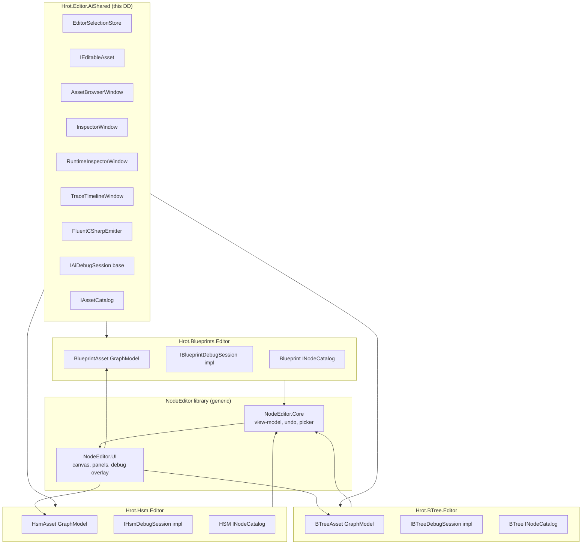
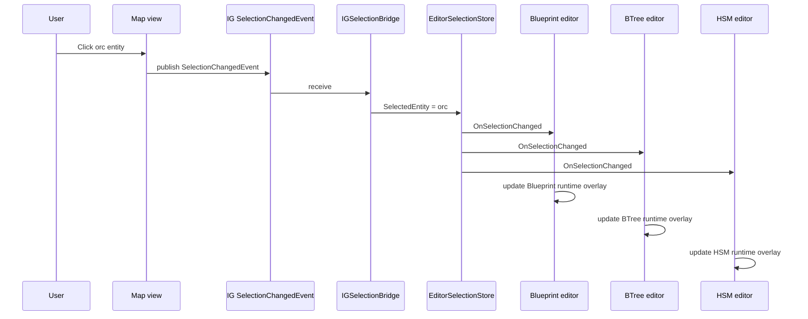
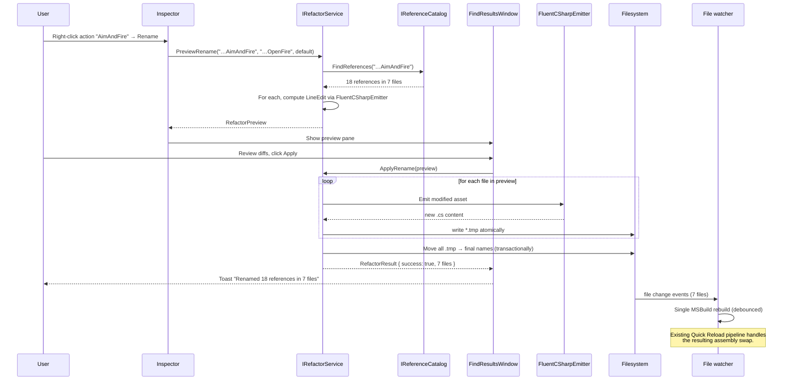

# AI Editor — Shared Infrastructure Detailed Design

> **Status:** Detailed design, derived from `Blueprint_Subsystem_Editor_Detailed_Design.md` + Inline Patches + `Blueprint_Subsystem_Debug_Protocol_Detailed_Design.md` (+ Inline Patches) + `Blueprint_Subsystem_Architecture_v1_2.md` + FDP-ECS-AI-API research report + NodeEdit-docs + FastBTree + FastHSM source.
> **Audience:** Implementation agent and human reviewer.
> **Drives:** The shared editor layer that the BTree, HSM, and Blueprint editors all sit on top of.
> **Doesn't cover:** Per-editor specifics (BTree decorator pills, HSM nested composites, etc.) — those live in `BTree_Editor_NodeEditor_Host_Design.md` and `HSM_Editor_NodeEditor_Host_Design.md`. NodeEditor extensions live in their own specs. Compiler / runtime / hot-reload kernels are owned by their respective subsystem DDs.
> **Companion code lives in:** `Hrot/Editor/Hrot.Editor.AiShared/` — interfaces, selection store, emitter, asset catalog, debug session base. Subsystem editors (`Hrot.Blueprints.Editor`, `Hrot.BTree.Editor`, `Hrot.Hsm.Editor`) reference this assembly.

---

## Table of Contents

1. Scope and design goals
2. Editor topology — three hosts, one substrate
3. Asset identity model (Guid + FNV-1a-32)
4. Action and event identity — FQN string keys
5. `EditorSelectionStore` — per-asset selection bus
6. Fluent-C# emitter — strict ownership, deterministic regeneration
7. `[…Layout]` method — editor-only data inside the hot-reloadable assembly
8. NodeEditor host pattern — what each subsystem editor implements
9. Asset Browser window — shared across all three editors
10. Inspector window — StructEdit-driven dispatch by asset type
11. Trace observers vs. debug sessions — interface hierarchy
12. `IAiDebugSession` — shared debug interface hierarchy
13. Observer mode — per-asset tracer enable via `TraceBufferLifecycleSystem`
14. Runtime Inspector window — shared overlay control
15. Trace Timeline window — shared, swim-lane extensible
16. Refactor and Find References — cross-asset operations
17. Hot-Reload classification — Cosmetic / Soft / Hard
18. Stale-entity detection — `IsAlive` polling policy
19. Window registration and DI wiring
20. Test strategy
21. Open questions

---

## 1. Scope and design goals

### 1.1 What this layer owns

`Hrot.Editor.AiShared` is the layer between NodeEditor (the generic node-graph library) and the three subsystem editors (Blueprint, BTree, HSM). It owns the contracts and the windows that are conceptually identical across the three editors and would otherwise be re-implemented three times.

Concretely it owns:

- **`EditorSelectionStore`** — the single selection bus all three editors subscribe to. Carries `IEditableAsset? ActiveAsset`, `Entity? SelectedEntity`, and per-asset sub-selection state.
- **`IEditableAsset`** — the marker interface assets implement so the selection store can be polymorphic.
- **`IAiDebugSession`** — the base interface for runtime debug sessions, with `IBlueprintDebugSession`, `IBTreeDebugSession`, `IHsmDebugSession` deriving.
- **`IAssetCatalog` (shared extension)** — already a Blueprint editor concept; lifted into shared infrastructure so all three editors enumerate assets through one surface.
- **`FluentCSharpEmitter`** — the deterministic-regeneration emitter used by all three editors to write authored assets back to `.cs` files.
- **`AssetBrowserWindow`** — the shared asset browser, displaying all three asset types with type-filter chips.
- **`InspectorWindow`** — the shared Inspector, routing to the right StructEdit drawer based on `ActiveAsset.GetType()`.
- **`RuntimeInspectorWindow`** — the shared runtime-state overlay control; the actual overlay rendering happens on the editor canvas (via `IDebugSession` on the NodeEditor host), but the inspector window owns mode toggles, scrubbing, and the entity-lifecycle indicator.
- **`TraceTimelineWindow`** — the shared trace timeline, with subsystem-registered swim-lane categories.
- **`HotReloadStatusIndicator`** — the pill/banner that says "Cosmetic / Soft / Hard" near the toolbar.
- **`RefactorService` + `FindResultsWindow`** — the cross-asset rename, find-references, and dangling-reference report workflow. Operates over `IAssetSubElement` references so it sees BTree action bindings, HSM action/event references, and Blueprint Call nodes uniformly.
- **`IAssetSubElement` and the reference catalog** — the unit of cross-asset referenceable thing (action FQN, event name, asset reference, blackboard field).

### 1.2 What this layer does NOT own

- **NodeEditor itself.** `NodeEditor.Primitives` / `Core` / `UI` is its own library; we depend on it.
- **The subsystem editors.** Each editor has its own assembly (`Hrot.Blueprints.Editor`, `Hrot.BTree.Editor`, `Hrot.Hsm.Editor`) and implements the NodeEditor host interfaces. They reference shared infrastructure; shared infrastructure does not reference them.
- **Runtime kernels.** `BehaviorRegistry`, `HsmActionDispatcher`, `BlueprintRegistry`, `EntityRepository`, `ISimulationView`, the tracer buffers — all owned by their existing subsystems.
- **Window manager.** `Fdp.Presentation.WindowManager` and `ManagedWindow` are engine infrastructure; we register against them.

### 1.3 Design goals

- **Three editors, one selection.** Picking an entity in the world or selecting an asset in the browser updates all open inspector and editor windows in lockstep, regardless of which subsystem owns the asset.
- **One inspector, three asset types.** The Inspector window draws Blueprint nodes, BTree nodes, HSM states, and HSM transitions through the same StructEdit dispatch path; per-asset-type code is limited to facet structs.
- **One runtime overlay vocabulary.** Breakpoints, step controls, attach/detach, and active-entity highlighting work identically for the user across the three editors; only the semantics of "step into" / "step over" differ per subsystem.
- **Asset identity isomorphic to Blueprint.** Guid in the authoring layer, FNV-1a-32 hash in the runtime. The editor stamps the Guid; the source generator emits the hash; the registries key on the hash.
- **No editor-only files on disk.** Layout, comments, expression-target lambdas, and editor-side metadata all live inside the hot-reloadable assembly as opt-in `[…Layout]` methods. No `.layout.json` sidecars.
- **NodeEditor is the canvas.** All three editors are NodeEditor hosts. They implement `IGraphModel` / `IGraphCommandSink` / `INodeCatalog` / `IDetailsViewProvider` / `IDebugSession` and let NodeEditor render, hit-test, search, undo, indicate, and overlay.
- **Cross-asset refactor is first-class.** Renaming an action, renaming an event, or renaming/deleting an asset surfaces every reference across BTree, HSM, and Blueprint assets in a unified find-results panel and applies updates atomically. This is required for v1 — the editor is unified or it isn't.
- **Tracer is multi-subscriber.** Multiple tools (editor, profiler, replay recorder) can passively observe trace records simultaneously; only one tool at a time holds the control session (pause / step / breakpoints). The interface split is `IAiTraceObserver` (many) vs. `IAiDebugSession` (one).

---

## 2. Editor topology — three hosts, one substrate



The substrate is NodeEditor. The shared layer adds AI-editor concerns (selection store, inspector dispatch, debug session base, fluent emitter, runtime inspector, asset browser). Each subsystem editor implements its own NodeEditor host interfaces and references shared infrastructure for everything cross-cutting.

A consequence: **the three subsystem editor projects are small.** Blueprint is the largest (existing); BTree and HSM should each end up around 5–8 KLOC of editor-specific code total, with the rest coming from shared infrastructure and NodeEditor.

---

## 3. Asset identity model (Guid + FNV-1a-32)

### 3.1 The pattern

Mirrors Blueprint's identity model exactly. Each asset carries two identifiers:

- **`Guid AssetId`** — stable, human-meaningful (in source control diffs), 16 bytes. Stamped once by the editor on asset creation; persisted as a literal in the emitted C#. Used everywhere in the editor layer: selection store, debug session API, asset browser, find-references, breakpoints.
- **`int BehaviorId` / `HsmId` / `BlueprintId`** — FNV-1a-32 hash of the Guid. 4 bytes. Stamped into the blob header by the source generator. Used in runtime registries and on hot paths.

The Guid never reaches the hot path. The int never appears in editor-facing APIs. Conversion is one-way: `int hash = Fnv1a32(guid.ToByteArray())`. The source generator emits the hash; runtime code uses it.

### 3.2 Attribute shape

```csharp
// BTree
[BTreeDefinition("Ambush_BT", AssetId = "f7c0a1b2-1188-4c5d-9e3a-7b6c5d4e3f21")]
public static BehaviorTreeBlob Build() => CreateBuilder().Compile("Ambush_BT");

// HSM
[HsmDefinition("EnemyBrain", AssetId = "a3f2c5d8-9c01-4b2e-8d7a-1f6e5c4b3a29")]
public static HsmDefinitionBlob Compile() => Build().Compile();

// Blueprint already uses this shape — see Architecture v1.2 §4.4.
```

The `AssetId` argument is a string literal (the Guid in 8-4-4-4-12 form) on the attribute. Strings on attributes are valid; the source generator parses it once at compile time and emits the int hash into the blob header. Editor-side code parses it once on asset open and uses the Guid directly.

### 3.3 FNV-1a-32 algorithm

```csharp
internal static int Fnv1a32(ReadOnlySpan<byte> bytes)
{
    const uint OffsetBasis = 2166136261u;
    const uint Prime = 16777619u;
    uint hash = OffsetBasis;
    for (int i = 0; i < bytes.Length; i++)
    {
        hash ^= bytes[i];
        hash *= Prime;
    }
    return unchecked((int)hash);
}
```

Identical to Blueprint's hashing rule. Defined once in `Hrot.Editor.AiShared.Identity.AssetIdHash` and consumed by all three subsystem source generators via a code reference (not a runtime dependency — source generators don't take runtime deps).

### 3.4 Mint-on-first-edit for legacy assets

Handwritten assets that pre-date the editor (e.g., the existing `AmbushTree` sample) do not carry an `AssetId` argument. When the editor first opens such an asset:

1. The editor's asset projection layer reflects over the type; finds `[BTreeDefinition]` with no `AssetId`.
2. The editor mints a new `Guid` and writes it to the in-memory model.
3. The editor logs an informational diagnostic to the output console: "Minted AssetId for OrcGuard_BT: f7c0…1188 (will be persisted on next save)".
4. On the first save, the emitter writes the `AssetId` argument into the attribute.
5. The user sees one extra line in the diff on the first save; subsequent saves are stable.

Until that first save, the in-memory mint is not stable across editor restarts — closing and reopening the editor before saving will mint a different Guid. The editor warns explicitly if the user attaches a debug session to such a transient Guid: "Asset has not been saved yet; debug-session breakpoints will not survive a restart."

### 3.5 Why not derive from the name

Naming-based Guids (e.g., `Guid` from `MD5("Ambush_BT")`) would avoid the mint step but make renames silently break breakpoints, debug history, and references. The architect's guidance is unambiguous: the Guid is stable across renames. Stamp once, never recompute.

### 3.6 Asset Guid resolution

The editor maintains a `Dictionary<Guid, IEditableAsset>` keyed by `AssetId`. The `IAssetCatalog` exposes:

```csharp
public interface IAssetCatalog
{
    IReadOnlyList<IEditableAsset> All { get; }
    IEditableAsset? FindByAssetId(Guid assetId);
    IEditableAsset? FindByName(string name);          // best-effort
    IReadOnlyList<IEditableAsset> WhereDependsOn(Guid assetId);  // reverse-dep
    event Action? Changed;
}
```

`Changed` fires after each hot reload completes. Subsystems contribute their assets through `IAssetCatalogContributor`:

```csharp
public interface IAssetCatalogContributor
{
    AssetKind Kind { get; }   // Blueprint | BTree | Hsm
    IReadOnlyList<IEditableAsset> Enumerate();   // reflects the loaded assembly
}
```

The contributors are registered with the catalog at editor startup; the catalog merges their outputs.

---

## 4. Action and event identity — FQN string keys

### 4.1 Why this is its own section

The previous section solved *asset* identity (Guid + FNV-1a-32 hash). But assets reference *actions* (`CombatActions.AimAndFire`), *conditions* (`CombatActions.HasThreat`), *guards* (`CombatGuards.AmmoOk`), and HSM *events* (`OnSight`, `OnLostSight`). These references are the units the refactor service operates on. They need a stable identity model too — and the right one isn't Guid.

### 4.2 The decision: fully-qualified name strings

Actions, conditions, and guards are identified across the editor by their **fully-qualified C# name**: `{DeclaringTypeNamespace}.{DeclaringType}.{Method}`. Examples:

- `Hrot.Game.Combat.CombatActions.AimAndFire`
- `Hrot.Game.Combat.CombatActions.HasThreat`
- `Hrot.Game.AI.SightGuards.IsTargetVisible`
- `Hrot.AI.Behaviors.Trees.HasVisibleTarget_Bp` (a Blueprint-hosted AiPrimitive — its FQN is the class name, which the source generator emits)

HSM events are identified by the **event name string** as registered with `HsmBuilder.Event("OnSight", id: 1)`. The event ID (ushort) is a registry-side detail; the editor and refactor service key on the name.

This is the v1 choice, with explicit rationale:

- **Zero source-generator change.** Existing `[BTreeAction(Name = "AimAndFire")]` and `[HsmAction(Name = "...")]` continue to work. The editor walks the loaded assembly's registered methods, reflects the declaring type, builds the FQN at editor open. No assembly bytes change.
- **No runtime overhead.** Registries still key on short names + FNV hashes. The editor only sees FQNs in its own model; nothing crosses into the kernel.
- **Disambiguation is implicit.** Two methods named `AimAndFire` in different declaring types are different FQNs. Today's registry would collide on short name — surfaced as a validation error at editor open (see §4.5).
- **Human-readable in source diffs.** When the editor emits a node referencing `CombatActions.AimAndFire`, the FQN-or-short-name is what the diff reader sees.

The alternative — minting a Guid per action via source-gen — was considered and rejected for v1. It's cleaner long-term, but adds source-gen complexity, requires editor-side mint policies for handwritten actions, and provides no v1 benefit because FQNs already disambiguate. Revisit if FQN becomes painful (e.g., if a heavy refactor breaks references in a way Guid wouldn't have).

### 4.3 The reference catalog

The shared layer maintains a **reference catalog**: a multi-index from `IAssetSubElement` (the *referenceable thing*) to `IAssetReference` (the *places that reference it*).

```csharp
namespace Hrot.Editor.AiShared.References;

/// <summary>A thing that can be referenced from inside an asset. Identity is by Key.</summary>
public interface IAssetSubElement
{
    string Key { get; }              // canonical string identity
    SubElementKind Kind { get; }     // ActionFqn | ConditionFqn | GuardFqn | EventName | AssetGuid | BlackboardField | …
    string DisplayName { get; }      // human-readable
    Guid? SourceAssetId { get; }     // null for actions in source assemblies; set for Blueprint-hosted AiPrimitives
}

public enum SubElementKind
{
    ActionFqn,         // "Hrot.Game.Combat.CombatActions.AimAndFire"
    ConditionFqn,
    GuardFqn,
    EventName,         // "OnSight" — HSM events; key is the name
    AssetReference,    // Guid asset reference (subtree call, composite-actor reference, BlueprintCall)
    BlackboardField,   // FQN-ish for typed blackboard field
}

/// <summary>A place in an asset that references a sub-element.</summary>
public sealed record AssetReference(
    Guid HostAssetId,           // which asset contains the reference
    AssetKind HostKind,
    Guid HostElementId,         // VisualId / StableId / NodeId of the referencing element
    string HostDisplayPath,     // e.g., "OrcGuard_BT › Sequence#3 › Action#7"
    string TargetKey,           // the IAssetSubElement.Key this reference points at
    SubElementKind TargetKind);

public interface IReferenceCatalog
{
    IReadOnlyList<IAssetSubElement> AllElements { get; }
    IAssetSubElement? FindElement(string key);
    IReadOnlyList<AssetReference> FindReferences(string targetKey);
    IReadOnlyList<AssetReference> AllReferencesIn(Guid hostAssetId);
    event Action? Changed;
}
```

The catalog rebuilds on `IAssetCatalog.Changed` (i.e., after every hot reload). Rebuild walks all assets via reflection and recomputes the multi-index. Cost: roughly O(N_assets × avg_nodes_per_asset); a few milliseconds for a thousand-asset project, run off the hot path.

### 4.4 What the editor stores per reference

Each subsystem's editor model carries references in its natural shape:

- **BTree:** `BTreeEditorNode` already has `MethodName` (short name, from the kernel). The editor *additionally* tracks the FQN — derived at asset open by walking `BehaviorRegistry` and `[BTreeAction]` reflections. On save, the FQN drives the emitted code (`CombatActions.AimAndFire` with the appropriate `using`); the short name is what the registry resolves at runtime.
- **HSM:** `StateNode` carries `OnEntry` / `OnExit` / `Activity` as short names today; the editor tracks the FQN alongside, same way.
- **Blueprint:** existing system already references action assets by Guid.

The reference catalog stores FQNs (and EventName strings, and AssetGuids) — the canonical key the refactor service operates on.

### 4.5 Disambiguation and validation

When two `[BTreeAction]` methods register with the same short name but live in different declaring types, the runtime registry sees a collision and (today) the last registration wins. The editor catches this at open time:

- During reference-catalog rebuild, the editor enumerates all `[BTreeAction]` / `[BTreeCondition]` / `[HsmAction]` / `[HsmGuard]` declarations across loaded assemblies.
- Short names with multiple FQN claimants raise a `SubElementCollision` diagnostic.
- The Inspector renders each collision in its diagnostic strip; the user resolves by renaming one of the colliding methods.

This is editor-only validation; the runtime collision behavior is untouched.

### 4.6 EventName scoping for HSM

HSM event names are scoped to the *machine* that registers them — two HSMs can both define `"OnSight"` without colliding. So `IAssetSubElement.Key` for events is `"{MachineAssetId}::{EventName}"` rather than the bare name. This makes the catalog correctly partition references; "rename `OnSight` in `EnemyBrain`" doesn't touch the `OnSight` in `SoldierAI`.

### 4.7 Blueprint AiPrimitive bridges to action identity

A Blueprint declared with `hostings: ["BTreeAction"]` registers into `BehaviorRegistry` under its asset name (e.g., `"HasVisibleTarget_Bp"`). The editor treats this as an FQN-equivalent — the canonical key for a Blueprint-hosted action is its Blueprint asset name string. Renaming a Blueprint asset is therefore *also* a cross-asset refactor (every BTree node referencing the old name must be updated). The reference catalog handles both kinds uniformly because they share the same `SubElementKind.ActionFqn` (or `.ConditionFqn`) key shape.

---

## 5. `EditorSelectionStore` — per-asset selection bus

### 5.1 Promotion from Blueprint editor to shared layer

The existing `EditorSelectionStore` (Blueprint Editor DD §2.6) is lifted from `Hrot.Blueprints.Editor` into `Hrot.Editor.AiShared`. It becomes the single source of selection truth for all three editors plus the engine's selection-sync (map, outliner, game viewport).

The model differs from the original Blueprint sketch in one important way: **selection is per-asset, not singleton.** Two windows showing the same asset share selection; two windows showing different assets have independent selections. The "active asset" follows window focus.

```csharp
namespace Hrot.Editor.AiShared.Selection;

public sealed class EditorSelectionStore
{
    // Currently-active asset — the asset whose canvas window has focus. The Inspector
    // and Runtime Inspector follow this. Null when no editor canvas is focused.
    private IEditableAsset? _activeAsset;

    // Per-asset sub-selection. Keyed by AssetId. Multiple windows on the same asset
    // share the entry. Closing all windows on an asset removes the entry.
    private readonly Dictionary<Guid, IAssetSubSelection?> _subSelectionsByAsset = new();

    // Set of assets with at least one window currently open. The selection store
    // owns this so it can know when to evict stale sub-selections.
    private readonly HashSet<Guid> _openAssets = new();

    // Global entity selection — independent of which asset is active. Tracks the
    // "which entity to overlay debug state for" across all editors.
    private Entity? _selectedEntity;

    public event Action? OnSelectionChanged;

    /// <summary>The asset whose editor canvas has focus. Set by window-focus handlers.</summary>
    public IEditableAsset? ActiveAsset
    {
        get => _activeAsset;
        set
        {
            if (_activeAsset == value) return;
            _activeAsset = value;
            OnSelectionChanged?.Invoke();
        }
    }

    /// <summary>Sub-selection within the active asset. Read- and write-routed through this property.</summary>
    public IAssetSubSelection? ActiveSubSelection
    {
        get => _activeAsset is null ? null : _subSelectionsByAsset.GetValueOrDefault(_activeAsset.AssetId);
        set
        {
            if (_activeAsset is null) return;     // can't set sub-selection with no active asset
            var current = _subSelectionsByAsset.GetValueOrDefault(_activeAsset.AssetId);
            if (Equals(current, value)) return;
            _subSelectionsByAsset[_activeAsset.AssetId] = value;
            OnSelectionChanged?.Invoke();
        }
    }

    /// <summary>Read sub-selection for any asset (active or not). Used by the per-asset windows on draw.</summary>
    public IAssetSubSelection? GetSubSelection(Guid assetId) =>
        _subSelectionsByAsset.GetValueOrDefault(assetId);

    /// <summary>Write sub-selection for any asset. Used by windows that are not currently focused.</summary>
    public void SetSubSelection(Guid assetId, IAssetSubSelection? selection)
    {
        var current = _subSelectionsByAsset.GetValueOrDefault(assetId);
        if (Equals(current, selection)) return;
        _subSelectionsByAsset[assetId] = selection;
        OnSelectionChanged?.Invoke();
    }

    /// <summary>Globally-selected entity for runtime debug overlay. Cross-asset.</summary>
    public Entity? SelectedEntity
    {
        get => _selectedEntity;
        set
        {
            if (_selectedEntity == value) return;
            _selectedEntity = value;
            OnSelectionChanged?.Invoke();
        }
    }

    /// <summary>Register that a window for this asset is now open. Lifecycle bookkeeping.</summary>
    public void RegisterOpenAsset(Guid assetId) => _openAssets.Add(assetId);

    /// <summary>Unregister; evict the sub-selection if no windows remain on this asset.</summary>
    public void UnregisterOpenAsset(Guid assetId)
    {
        _openAssets.Remove(assetId);
        // Note: we don't immediately drop the sub-selection — reopening the same
        // asset within the same session restores the last selection. The store
        // does evict when the asset is unloaded entirely (e.g., file deleted),
        // signaled via a separate Forget(assetId) call.
    }

    public void Forget(Guid assetId)
    {
        _subSelectionsByAsset.Remove(assetId);
        OnSelectionChanged?.Invoke();
    }
}

public interface IAssetSubSelection { }

public sealed record BlueprintNodeSelection(Guid GraphId, Guid NodeId) : IAssetSubSelection;
public sealed record BTreeNodeSelection(Guid VisualId) : IAssetSubSelection;
public sealed record HsmStateSelection(Guid StableId) : IAssetSubSelection;
public sealed record HsmTransitionSelection(Guid VisualId) : IAssetSubSelection;
public sealed record HsmRegionSelection(Guid StableId, int RegionIndex) : IAssetSubSelection;
```

The single `OnSelectionChanged` event fires for any mutation. Consumers read the current snapshot inside their next `Draw` pass; the event is the "you should refresh" signal, not a delta delivery.

### 5.1.1 Why per-asset

Two windows showing the *same* asset (e.g., one zoomed on a subtree, one showing the whole tree) need to share selection — clicking a node in one highlights it in the other; otherwise the user is confused about which view is canonical. Selection is a property of the *asset being edited*, not of any individual window.

Two windows showing *different* assets need independent selections — selecting a state in `EnemyBrain.hsm` shouldn't affect a node selection in `OrcGuard.bt`. They are different graphs, with different element identifiers, and different inspector content.

The `ActiveAsset` pointer disambiguates: when the Inspector window draws, it reads `ActiveAsset` and the corresponding sub-selection. Focus switches between windows update `ActiveAsset`; the Inspector follows. This matches Visual Studio / Rider / Unity multi-document behavior.

`SelectedEntity` stays global because entities exist independently of which asset is being edited — the same entity is selectable while looking at any of its associated assets.

### 5.2 `IEditableAsset`

```csharp
namespace Hrot.Editor.AiShared;

public interface IEditableAsset
{
    Guid AssetId { get; }
    string Name { get; }                  // human-readable
    AssetKind Kind { get; }               // Blueprint | BTree | Hsm
    string SourceFilePath { get; }        // path to the .cs file
    bool IsDirty { get; }
    bool IsEditorOwned { get; }           // true if the file carries the HROT_EDITOR_GENERATED marker
    event Action? Changed;                // fires on any model mutation
}
```

Each subsystem provides a concrete type: `BlueprintAsset`, `BehaviorTreeAsset`, `HsmAsset`. The Inspector window dispatches on `ActiveAsset.GetType()` (or `Kind`) to choose the StructEdit drawer.

### 5.3 Sources of selection mutations

The selection bus accepts mutations from multiple sources, all going through the same property setters. The `OnSelectionChanged` event is the single notification channel; the source of the change is intentionally opaque to consumers.

| Source | When it writes | What it writes |
|---|---|---|
| Asset Browser window | User clicks an asset row | `ActiveAsset` (assumes the user wants to focus the asset's editor) |
| Subsystem canvas (NodeEditor host) — focused window | User clicks a node/state/transition | `ActiveSubSelection` |
| Subsystem canvas (NodeEditor host) — unfocused window | User clicks a node/state/transition | `SetSubSelection(assetId, …)` (no `ActiveAsset` change unless focus moves) |
| Map / world view (existing engine) | User clicks an entity in 3D | `SelectedEntity` |
| `IG SelectionChangedEvent` (DDS bus) | External tool publishes | `SelectedEntity` |
| Runtime Inspector window | User picks via `[MapPickableEntity]` button | `SelectedEntity` |
| Debug session | Pause-on-breakpoint hits | `SelectedEntity` (the entity that hit) + `ActiveAsset` (the asset that has the breakpoint) |
| Find / Find-references panel | User clicks a reference | `ActiveAsset` + `SetSubSelection(targetAssetId, …)` |
| Window focus change | User clicks a different editor window | `ActiveAsset` (the focused window's asset) |

The DDS-published `SelectionChangedEvent` is consumed by an `IGSelectionBridge` service registered at editor startup. It maps DDS payloads to `EditorSelectionStore.SelectedEntity = ...`. The reverse (editor writes propagate back to the DDS bus) is gated by the per-window `ChainToMap` toggle (§5.4).

### 5.4 Per-window `ChainToMap` toggle

Each window that consumes the selection store carries its own `ChainToMap` boolean preference (default: on for the runtime inspector windows, off for asset-authoring windows). When on, selections initiated in this window propagate outward (asset browser write → DDS publish so the map highlights the entity); when off, the window receives selections but does not broadcast them.

This matches the existing inspector-panel pattern the architect referenced; it gives power users a way to pin one editor instance to a specific entity while leaving others to follow global selection.

### 5.5 Selection-mutation sequence



One click in the map; three editors update; no per-editor selection plumbing.

### 5.6 Selection during NodeEditor canvas operations

NodeEditor manages its own canvas selection (`SelectionState` on `GraphView`) for the per-canvas active selection. When the user clicks a node on the canvas, the NodeEditor host (the subsystem editor) translates the canvas selection event into a write to `EditorSelectionStore.ActiveSubSelection` (if the window has focus) or `SetSubSelection(assetId, …)` (if it doesn't). The Inspector then re-renders.

In the reverse direction, when the selection store changes externally (e.g., the user clicks a node reference in Find Results), the host writes the corresponding NodeEditor canvas selection so the canvas highlights match. Each window listens to the store for *its own asset's* sub-selection changes only — `OnSelectionChanged` fires globally but each window filters to entries for the asset it shows.

### 5.7 Multi-window-same-asset behavior

When two windows show the same asset, both subscribe to the store for that asset's sub-selection. The store has one entry per asset, so:

- Click a node in window A → store writes `_subSelectionsByAsset[assetId] = …` → both windows re-render with the new selection highlighted.
- Click in window B with different selection → store updates the same entry → both windows re-render again with B's selection.

The Inspector follows `ActiveAsset`, so it always shows the selection of whichever window most recently received focus. The Runtime Inspector window similarly follows `ActiveAsset` for its target asset.

For multi-window-different-asset: each window's sub-selection is independent (different `assetId` keys), and the Inspector follows whichever asset is active. The user gets exactly one Inspector showing exactly one selection at a time — never ambiguous, never confused about which window the Inspector "belongs to."

---

## 6. Fluent-C# emitter — strict ownership, deterministic regeneration

### 6.1 The emitter contract

`FluentCSharpEmitter` produces a deterministic `.cs` file from an in-memory editor model. "Deterministic" means: given the same in-memory model, the output is byte-identical across runs, machines, and dotnet versions. This is the property that makes source-control diffs predictable.

```csharp
namespace Hrot.Editor.AiShared.Emit;

public interface IFluentCSharpEmitter<TAsset>
{
    string Emit(TAsset asset);
}

// Three concrete implementations live in their respective subsystem editors:
//   BlueprintFluentEmitter : IFluentCSharpEmitter<BlueprintAsset>
//   BTreeFluentEmitter     : IFluentCSharpEmitter<BehaviorTreeAsset>
//   HsmFluentEmitter       : IFluentCSharpEmitter<HsmAsset>
```

The shared layer owns the emitter *contract*, the deterministic-output rules (§5.2), the file marker (§5.3), the `using` ordering policy (§5.4), and the regeneration-and-save orchestration (§5.5). Per-asset emitter implementations live in their subsystem editors because the C# they emit is syntactically distinct.

### 6.2 Deterministic-output rules

The emitter MUST guarantee:

1. **Stable identifier ordering.** Nodes/states/transitions are emitted in the order of their `VisualId`/`StableId` in a sorted traversal (depth-first, children sorted by canonical ordering — for ordered children like BTree composites, the authored order; for unordered like HSM transitions in a state, by event ID then by `VisualId`).
2. **Sorted `using` directives.** Alphabetical ascending, with `System.*` first (a single block), then everything else (a single block), separated by one blank line.
3. **Fixed indentation.** 4 spaces per level, no tabs.
4. **Fixed line endings.** `\r\n` on Windows, `\n` on Unix — controlled by `Environment.NewLine` so the file matches whatever the user's other source files use.
5. **Fixed blank-line policy.** One blank line between top-level members (methods, fields); two blank lines between classes; no trailing whitespace on any line; exactly one trailing newline at end-of-file.
6. **Stable Guid formatting.** Always 8-4-4-4-12 lowercase hex (the `D` format).
7. **No timestamps or machine-specific tokens in output.** No "Generated on …" comments; the marker is content-only.
8. **Fully qualified type names by default, simplified only via tracked `using`s.** The emitter maintains a deterministic `using` set per file; types not covered are emitted fully qualified.

The emitter has a self-test mode that round-trips an in-memory model: emit → parse-via-Roslyn → reflect → compare against the original model. CI runs this on a fixed corpus to catch regressions.

### 6.3 File marker — `HROT_EDITOR_GENERATED`

Editor-owned files carry a marker as the first non-blank line:

```csharp
// HROT_EDITOR_GENERATED — manual edits to this file will be overwritten by the AI editor on next save.
// AssetId: f7c0a1b2-1188-4c5d-9e3a-7b6c5d4e3f21
namespace Hrot.AI.Behaviors.Trees;

public static class OrcGuard
{
    // ...
}
```

Two semantically meaningful comments at the top: the marker (so humans and tooling can see this file is editor-owned) and the AssetId (so a quick `grep -r AssetId` can find an asset's file).

The editor enforces strict ownership in v1:

- **Marker present** → editor opens the file in full edit mode, regenerates on save.
- **Marker absent** → editor opens the file in read-only mode (palette grays out save/edit actions). User can copy the asset to a new editor-owned file via "Duplicate as Editable Copy."
- **First save promotes a handwritten file** → if the user clicks "Make Editable" on a read-only asset, the editor adds the marker on the next save and the file becomes editor-owned thereafter.

This is conservative; future versions may allow mixed authoring with best-effort preservation, but v1 favors predictability over flexibility.

### 6.4 `using` ordering policy

Each emitter tracks the set of types it needs to reference in its output and produces the corresponding `using` directives. The set is computed deterministically:

1. Start with the kernel base set: `System`, `System.Numerics`, `Fbt` / `Fhsm` / `Hrot.Blueprints` (one per subsystem), `Hrot.Editor.AiShared.Layout`.
2. For every action/condition/guard/state referenced in the model, add the declaring type's namespace.
3. Sort: `System.*` first (alphabetical), then a blank line, then everything else (alphabetical).
4. Emit each on its own line with semicolon and Unix newline.

### 6.5 Regeneration-and-save orchestration

When the user clicks Save (or autosave fires), the orchestration is:

1. Emitter produces the full `.cs` content string.
2. Compare against the on-disk content (byte comparison). If identical, no-op (no file write).
3. If different, write atomically (write to `*.tmp` in the same directory, then `File.Move` over the target). This avoids partial-write states that would confuse the file watcher.
4. Mark the in-memory model as clean.
5. Fire `IEditableAsset.Changed` to notify other windows (the asset browser may show a "modified" indicator, etc.).
6. The engine's existing C#-file watcher picks up the change and triggers a build (per the existing hot-reload pipeline; see §14 for classification).

### 6.6 What the emitter does NOT do

- It does not invoke the compiler. The file watcher and the existing build pipeline handle that.
- It does not parse incoming C#. The editor reads compiled assemblies via reflection; it never re-parses `.cs` files to load assets.
- It does not preserve user comments inside handwritten files. Strict ownership means user comments inside editor-owned files don't survive a save (the editor regenerates the whole file). The `comment` field on the `[…Layout]` method captures per-node comments which DO survive.

---

## 7. `[…Layout]` method — editor-only data inside the hot-reloadable assembly

### 6.1 The Option-B pattern, recapped

Editor-only data (canvas positions, comments, breakpoint flags, expression-target field names for lambdas, collapse states, region colors) lives in a sibling layout method in the same `.cs` file, marked with `[BlueprintLayout(...)]`, `[BTreeLayout(...)]`, or `[HsmLayout(...)]`. The runtime never invokes these methods. The editor reflects over them at file open.

A typical structure:

```csharp
public static class OrcGuard
{
    public static BTreeBuilder<...> CreateBuilder() => /* fluent builder */;

    [BTreeDefinition("OrcGuard_BT", AssetId = "f7c0a1b2-1188-4c5d-9e3a-7b6c5d4e3f21")]
    public static BehaviorTreeBlob Build() => CreateBuilder().Compile("OrcGuard_BT");

    [BTreeLayout("f7c0a1b2-1188-4c5d-9e3a-7b6c5d4e3f21")]
    public static BTreeEditorLayout Layout() => new BTreeEditorLayoutBuilder()
        .Canvas(panOffset: new Vector2(12, -34), zoomLevel: 1.0f)
        .Node("a3f2c5d8-9c01-4b2e-8d7a-1f6e5c4b3a29", position: new Vector2(120, 340), ...)
        // more entries
        .Build();
}
```

### 6.2 Identity convention

Layout attributes key by `Guid AssetId`, not by name. This is deliberate: name renames don't break the editor↔layout binding. The argument is a string-literal Guid, parsed once at editor open.

### 6.3 Discovery — reflection at editor open

The shared layer provides a discovery helper that the asset projection uses:

```csharp
namespace Hrot.Editor.AiShared.Layout;

public static class LayoutDiscovery
{
    /// <summary>
    /// Finds and invokes the [TLayoutAttr]-decorated method matching this assetId in the
    /// given assembly. Returns null if no layout method exists for this asset.
    /// </summary>
    public static TLayout? TryGetLayout<TLayoutAttr, TLayout>(
        Assembly assembly,
        Guid assetId)
        where TLayoutAttr : Attribute
        where TLayout : class
    {
        foreach (var type in assembly.GetTypes())
        {
            foreach (var method in type.GetMethods(BindingFlags.Public | BindingFlags.Static))
            {
                var attr = method.GetCustomAttribute<TLayoutAttr>();
                if (attr is null) continue;
                if (GetAssetId(attr) != assetId) continue;
                return (TLayout?)method.Invoke(null, null);
            }
        }
        return null;
    }

    private static Guid GetAssetId(Attribute attr) =>
        // attr has a string AssetId property by convention
        Guid.Parse((string)attr.GetType().GetProperty("AssetId")!.GetValue(attr)!);
}
```

Reflection scan happens once per asset open. The cost is invisible at human timescales (sub-millisecond for a 100-asset project on warm IL).

### 6.4 Reconciliation rules

Authoritative side: the builder method. The layout method is hints.

| Situation | Behavior |
|---|---|
| Node in builder + layout entry → renders with stored position | normal |
| Node in builder + no layout entry → auto-layout, save on next interaction | normal |
| No node in builder + stale layout entry → drop silently on next save | normal |
| Layout method missing entirely → auto-layout all, create on first save | normal |
| Layout method has duplicate entries for same id → keep first, log warning | edge case |

Auto-layout is per-asset-type: tidy-tree for BTree, statechart auto-layout for HSM, force-directed for Blueprint.

### 6.5 What layout entries store

Per-element fields (per node / per state / per transition / per region):
- **Position** (`Vector2`)
- **Size override** (`Vector2?`) — null for auto-size
- **Comment** (`string?`)
- **Collapsed** (`bool`) — composite states / Blueprint variable groups
- **Color override** (`string?`) — explicit color name, optional
- **Expression target** (`string?`) — BTree lambdas like `dto => dto.AmmoCount`; for HSM and Blueprint usually null
- **Editor-only metadata** (`Dictionary<string, string>?`) — escape hatch for per-subsystem custom hints; defaults to empty

Canvas-level fields:
- **PanOffset** (`Vector2`)
- **ZoomLevel** (`float`)

Breakpoints are NOT in the layout method — they are per-user session-local (§5 of the per-editor docs). The layout method is committed to source control; breakpoints are not.

### 6.6 Per-editor layout builder shape

Each subsystem provides its own builder type to keep the fluent API natural:

```csharp
public sealed class BTreeEditorLayoutBuilder
{
    public BTreeEditorLayoutBuilder Canvas(Vector2 panOffset, float zoomLevel);
    public BTreeEditorLayoutBuilder Node(string visualId,
                                          Vector2 position,
                                          Vector2? size = null,
                                          string? comment = null,
                                          bool collapsed = false,
                                          string? color = null,
                                          string? expressionTarget = null);
    public BTreeEditorLayout Build();
}

public sealed class HsmEditorLayoutBuilder
{
    public HsmEditorLayoutBuilder Canvas(Vector2 panOffset, float zoomLevel);
    public HsmEditorLayoutBuilder State(string stableId, Vector2 position, ...);
    public HsmEditorLayoutBuilder Transition(string visualId, Vector2[] waypoints, ...);
    public HsmEditorLayoutBuilder Region(string stableId, int regionIndex, ...);
    public HsmEditorLayout Build();
}

// Similar for Blueprint.
```

The three builders live in `Hrot.Editor.AiShared.Layout` (they're tiny — fluent wrappers around dictionaries) so subsystem assemblies depending only on `Hrot.Editor.AiShared` can host them.

---

## 8. NodeEditor host pattern — what each subsystem editor implements

### 7.1 The host contract recap

NodeEditor's `IEditorHostServices` (NodeEdit-docs §3) bundles everything the editor needs from the host:

```csharp
public interface IEditorHostServices
{
    INodeCatalog       NodeCatalog       { get; }
    ITypeSystem        TypeSystem        { get; }
    ILinkValidator     LinkValidator     { get; }
    IGraphCommandSink  CommandSink       { get; }
    IPickerRegistry    Pickers           { get; }
    IClipboard         Clipboard         { get; }
    IIconProvider      Icons             { get; }
    IDiagnosticsSink?  Diagnostics       { get; }
    IDebugSession?     Debug             { get; }
    IInputSource       Input             { get; }
    IEditorTheme       Theme             { get; }
}
```

Each subsystem editor provides its own concrete `IEditorHostServices` instance. The shared layer provides default implementations or factories for those services that are common across the three editors:

| Service | Source |
|---|---|
| `INodeCatalog` | Subsystem-specific (BTree palette, HSM palette, Blueprint palette + node library) |
| `ITypeSystem` | Mostly subsystem-specific, but Blueprint already has one — BTree and HSM have a tiny one (Exec-only for BTree, none for HSM) |
| `ILinkValidator` | Subsystem-specific (BTree: parent→child only; HSM: source-target with kind checks; Blueprint: full pin-type matching) |
| `IGraphCommandSink` | Subsystem-specific (translates NodeEditor commands into edits on the subsystem's editor model + scheduled C# regeneration) |
| `IPickerRegistry` | Shared default with subsystem-registered picker sources |
| `IClipboard` | Shared default (the engine's clipboard wrapper) |
| `IIconProvider` | Shared default (loads from `Hrot.Editor.AiShared/Icons/`) |
| `IDiagnosticsSink` | Shared default (writes to the engine's diagnostics channel) |
| `IDebugSession` | Subsystem-specific (`BlueprintDebugSession`, `BTreeDebugSession`, `HsmDebugSession`, all deriving from `AiDebugSessionBase`) |
| `IInputSource` | Shared default (the engine's ImGui input adapter) |
| `IEditorTheme` | Shared default (one theme, all three editors look like one product) |

### 7.2 Per-subsystem graph model

Each subsystem implements `IGraphModel` over its in-memory editor model. The implementation is a thin projection:

```csharp
public sealed class BTreeGraphModel : IGraphModel
{
    private readonly BehaviorTreeAsset _asset;
    private readonly BTreeNodeMapper _mapper;  // visualId ↔ NodeId

    public GraphId Id => new GraphId(_asset.AssetId);
    public string DisplayName => _asset.Name;
    public GraphKindDescriptor Kind => BTreeGraphKinds.Tree;
    public IReadOnlyCollection<INodeModel> Nodes => _mapper.AllNodeModels;
    public IReadOnlyCollection<ILinkModel> Links => _mapper.AllLinkModels;
    public IReadOnlyCollection<ICommentModel> Comments => _asset.Comments;
    public INodeModel? FindNode(NodeId id) => _mapper.FindNode(id);
    public IPinModel? FindPin(PinId id) => _mapper.FindPin(id);
    public ILinkModel? FindLink(LinkId id) => _mapper.FindLink(id);
    public event Action<GraphChangeNotification>? Changed;
    // raises Changed when _asset.Changed fires
}
```

The `BTreeNodeMapper` translates between the subsystem's domain identifiers (`Guid VisualId` for BTree nodes; `Guid StableId` for HSM states) and NodeEditor's identity types (`NodeId(Guid)`). Same Guid value, different wrapper type — the mapper is trivial.

### 7.3 Command sink translation

NodeEditor mutations arrive as `GraphCommand` records (see `kernel/Commands.cs` in NodeEdit-docs). The host translates these into edits-of-the-editor-model plus a regeneration trigger:

```csharp
public sealed class BTreeCommandSink : IGraphCommandSink
{
    private readonly BehaviorTreeAsset _asset;
    private readonly RegenerationScheduler _scheduler;

    public GraphCommandResult Apply(GraphCommand command)
    {
        switch (command)
        {
            case AddNode add:
                _asset.AddNode(add.NodeKind, add.Position, add.NewNodeId.Value);
                break;
            case RemoveNode rem:
                _asset.RemoveNode(rem.NodeId.Value);
                break;
            case MoveNode mov:
                _asset.MoveNode(mov.NodeId.Value, mov.NewPosition);
                break;
            // … etc.
        }
        _scheduler.ScheduleSave(_asset);    // debounced regenerate + write
        return GraphCommandResult.Ok;
    }
}
```

The `RegenerationScheduler` debounces multiple commands within a short window (default 500 ms) into a single file write. Drag operations fire many `MoveNode` commands; coalesced, the editor writes the file once at end-of-drag.

### 7.4 Per-subsystem catalog

`INodeCatalog` is the source for the search popup and picker. Each subsystem populates it differently:

- **BTree:** static composite/decorator/leaf types + dynamic actions/conditions from `BehaviorRegistry`
- **HSM:** static state/transition/region types + dynamic actions/guards from `HsmActionDispatcher`
- **Blueprint:** static node library + dynamic from `BlueprintRegistry` (existing)

The catalog re-queries on `IAssetCatalog.Changed` (hot reload completed) so the picker shows newly-added registrations on the next open.

### 7.5 NodeEditor extensions

Two BTree- and HSM-specific extensions are needed beyond what NodeEditor ships with today:

- **Node attachments** — small visual chips rendered on a host node (BTree decorator pills, HSM state-flag badges). Spec: `NodeEditor_Extension_NodeAttachments.md`.
- **Container nodes** — `INodeModel` extension where a node contains child nodes laid out inside its bounds. Used by HSM composite states. Spec: `NodeEditor_Extension_ContainerNodes.md`.

Both specs are authored by us (we own NodeEditor). They are NodeEditor-team-owned, not subsystem-editor-owned. They go through NodeEditor's normal change process (spec → review → implementation → test).

---

## 9. Asset Browser window — shared across all three editors

### 8.1 Window layout

A single `AssetBrowserWindow` (`ManagedWindow` subclass), registered with `IWindowRegistrar` as `ai_asset_browser`. Hosts a tree view organized by folder, with type-filter chips at the top:

```
┌──────────────────────────────────────────┐
│ ASSET BROWSER                            │
├──────────────────────────────────────────┤
│ Filter: [✓BP] [✓BT] [✓HSM]  🔍 search…  │
├──────────────────────────────────────────┤
│ ▼ Combat                                 │
│  ⚙ OrcGuard_BT          (BT)             │
│  ⚙ OrcAmbush_BT         (BT)             │
│  ◐ EnemyBrain          (HSM)             │
│  ƒ HasVisibleTarget_Bp  (BP, AiPrim)     │
│ ▼ UI                                     │
│  ƒ MainMenu_Bp          (BP, Instance)   │
│ ▼ Patrol                                 │
│  ⚙ Simple_BT            (BT)             │
│ ▼ Subtrees                               │
│  ⚙ Search_BT            (BT)             │
│                                          │
│  + New Asset…                            │
└──────────────────────────────────────────┘
```

Icons distinguish asset type (⚙ tree, ◐ HSM, ƒ blueprint); a small badge after the name shows asset kind detail (BP+AiPrim, BP+Instance, BP+Library). Folders come from the file-system layout of `.cs` files (the asset's `SourceFilePath` directory) under the project's `Behaviors/` root.

### 8.2 Interaction

- **Single-click row** → `EditorSelectionStore.ActiveAsset = row`. Doesn't open anything; just updates the inspector.
- **Double-click row** → opens the asset in the right editor canvas (BTree assets → `bt_graph_canvas`, etc.). The canvas window is the appropriate subsystem editor's window; the asset browser doesn't know about canvas semantics, only window IDs.
- **Right-click row** → context menu (Open, Open in Code, Rename, Duplicate, Delete, Show in Explorer).
- **`+ New Asset…`** → wizard: choose type (BTree / HSM / Blueprint), choose folder, choose name. Mints a Guid, creates a minimal `.cs` file with the marker and a stub `[…Definition]` method, opens it in the appropriate editor.

### 8.3 Filter chips

`[BP] [BT] [HSM]` toggle which kinds are visible. Defaults: all on. Search box is fuzzy (uses NodeEditor's fuzzy matcher, available via `IEditorHostServices.NodeCatalog` infrastructure). Filter state is per-user editor preference (persisted).

### 8.4 Dependencies sidebar

The asset browser optionally renders a dependency sidebar showing reverse-dependencies for the selected asset: "X assets depend on this." For a BTree, dependencies are subtree calls. For an HSM, dependencies are composite-actor references. For a Blueprint, dependencies are AiPrimitive hostings. Computed by `IAssetCatalog.WhereDependsOn(assetId)`.

### 8.5 Live-instance count

When connected to a running game and the inspector is observing the selected asset, the asset browser shows a small "🟢 1,247 live" indicator next to the asset row. Count comes from `IAiDebugSession.GetActiveEntities(assetId).Count`. Refresh rate: every 500 ms while the row is visible.

---

## 10. Inspector window — StructEdit-driven dispatch by asset type

### 10.1 Single window, three modes

One `InspectorWindow` for all three editors; registered as `ai_inspector`. Layout:

```
┌──────────────────────────────────────────┐
│ INSPECTOR                                │
├──────────────────────────────────────────┤
│ Breadcrumb: Combat › OrcGuard › n#7      │
├──────────────────────────────────────────┤
│ <StructEdit drawer for selected facet>   │
│                                          │
│  Property A:  [editor]                   │
│  Property B:  [editor]                   │
│  ▾ Section                               │
│    Property C:                           │
│                                          │
├──────────────────────────────────────────┤
│ [Apply]  [Revert]                        │
└──────────────────────────────────────────┘
```

The window owns a `IEditSession` from StructEdit, opened on a *facet struct* selected by the current `ActiveSubSelection`. When `ActiveAsset` or `ActiveSubSelection` changes, the session is committed (if applicable), disposed, and a new session opens on the new facet.

### 10.2 Facet structs

Each subsystem defines small structs (one per selectable element kind) that describe the editable surface:

```csharp
// BTree
public struct RepeaterFacet { public int Count; [EditDisplayName("Custom comment")] public string? Comment; public bool Breakpoint; }
public struct WaitFacet { public float Duration; public string? Comment; public bool Breakpoint; }
public struct ActionFacet { /* method reference, expression target, etc. */ }

// HSM
public struct StateFacet { public string? OnEntry; public string? OnExit; public string? Activity; public HsmStateFlags Flags; }
public struct TransitionFacet { public string EventName; public string? Guard; public string? Action; public byte Priority; public TransitionKind Kind; }
public struct RegionFacet { public byte Priority; }

// Blueprint
public struct BlueprintNodeFacet { /* per Blueprint editor DD */ }
```

The Inspector window dispatches:

```csharp
private IEditSession OpenSessionFor(IAssetSubSelection sub) => sub switch
{
    BTreeNodeSelection bt   => _editService.Open(_btreeAsset.GetFacet(bt.VisualId)),
    HsmStateSelection hsm   => _editService.Open(_hsmAsset.GetStateFacet(hsm.StableId)),
    HsmTransitionSelection ht => _editService.Open(_hsmAsset.GetTransitionFacet(ht.VisualId)),
    BlueprintNodeSelection bp => _editService.Open(_bpAsset.GetNodeFacet(bp.GraphId, bp.NodeId)),
    _ => throw new NotSupportedException()
};
```

StructEdit handles the rest. `[Flags]` enums render as checkbox columns; primitives as appropriate editors; complex types via registered `IImGuiFieldDrawer`s.

### 10.3 Commit flow

The session's `IsDirty` is polled at end of frame. On transition true→false (commit), the inspector calls the subsystem's setter. The Inspector holds local snapshots of `ActiveAsset` and `ActiveSubSelection` (refreshed each frame from the store) so the commit reads consistent values:

```csharp
private IEditableAsset?      _currentAsset;       // local cache of store.ActiveAsset
private IAssetSubSelection?  _currentSelection;   // local cache of store.ActiveSubSelection

private void OnApply()
{
    var modifiedFacet = _session.Commit();   // throws on validation failure
    switch (_currentSelection)
    {
        case BTreeNodeSelection bt:
            _btreeAsset.UpdateFacet(bt.VisualId, (BTreeNodeFacetUnion)modifiedFacet);
            break;
        // … etc
    }
    _scheduler.ScheduleSave(_currentAsset);
}
```

This routes through the regeneration scheduler the same way canvas commands do. From the Inspector window's perspective, mutating a facet is conceptually a `GraphCommand` even though it doesn't enter via NodeEditor's command sink.

### 10.4 Multi-select

Inspector supports the same multi-select target pattern as NodeEditor's Details panel (NodeEdit-docs §19): intersection of properties, `[ — ]` placeholder for mixed values, set-applies-to-all. Implementation: StructEdit's `EditScope` accepts multiple targets via `IBufferViewProvider` (StructEdit doc §3).

### 10.5 No selection / asset-level selection

When `ActiveSubSelection` is null but `ActiveAsset` is set, the inspector shows asset-level properties: the asset's name, type, AssetId, dependencies, hot-reload status. When `ActiveAsset` is also null, the inspector shows an empty state with "Select an asset to begin."

### 10.6 Right-click context — Find References and Rename

Any inspector field whose value is a reference (action FQN, event name, asset reference) carries a right-click context menu:

- **Find References** — opens the Find Results window (§16) scoped to this reference's `IAssetSubElement.Key`.
- **Rename…** — opens the inline rename flow (§16.4), pre-filled with the current key.
- **Go to Definition** — for action FQNs that resolve to a Blueprint-hosted AiPrimitive, switches `ActiveAsset` to the source asset. For handwritten methods, opens the user's C# IDE at the declaring file (best-effort; falls back to copying the FQN to clipboard).

Subsystem-specific inspector fields that *carry* references (BTree's `MethodName`, HSM's `OnEntry`, etc.) report their reference target to the inspector via a small `IReferencedField` marker on the facet struct. The inspector picks up the menu automatically.

---

## 11. Trace observers vs. debug sessions — interface hierarchy

### 11.1 Two interfaces, two cardinalities

The tracer infrastructure is consumed by two distinct kinds of tool:

- **Passive observers** — profilers, replay recorders, networked taps, telemetry collectors. They read trace records and never affect kernel execution. Multiple can run simultaneously. They don't pause, don't step, don't set breakpoints.
- **Control sessions** — the editor debugger. Exactly one active at a time per subsystem. Pauses, steps, sets breakpoints, halts entities at breakpoint hits.

These split into two interfaces:

```csharp
namespace Hrot.Editor.AiShared.Debug;

/// <summary>
/// Passive subscriber to tracer output. Multiple observers may be attached
/// per subsystem simultaneously. Does not control execution.
/// </summary>
public interface IAiTraceObserver
{
    /// <summary>
    /// Begins emitting trace records for all entities running this asset.
    /// Implemented via TraceBufferLifecycleSystem + DebugState.Flags.
    /// Idempotent — multiple calls with the same assetId are safe.
    /// Reference-counted internally so multiple observers can request overlapping assets.
    /// </summary>
    void BeginObservingAsset(Guid assetId, TraceLevel level);
    void EndObservingAsset(Guid assetId);

    /// <summary>
    /// Returns all entities currently running this asset.
    /// O(N) over matching component archetypes; cheap, allocation-free at call site.
    /// </summary>
    IReadOnlyList<Entity> GetActiveEntities(Guid assetId);
}

/// <summary>
/// Exclusive control session. Only one active per subsystem at a time.
/// Acquired via IDebugSessionRegistry.TryAcquireSession(...).
/// </summary>
public interface IAiDebugSession : IAiTraceObserver
{
    // (full member list in §12)
}
```

`IAiDebugSession` inherits `IAiTraceObserver` because every debug session also observes — they're not mutually exclusive *categories*, they're nested capabilities.

### 11.2 The session registry

A small shared service mediates session ownership:

```csharp
public interface IDebugSessionRegistry
{
    /// <summary>
    /// Tries to acquire the exclusive control session for a subsystem.
    /// Fails if another session is already active.
    /// </summary>
    bool TryAcquireSession<TSession>(out TSession? session) where TSession : class, IAiDebugSession;

    /// <summary>Releases a previously-acquired session.</summary>
    void ReleaseSession(IAiDebugSession session);

    /// <summary>
    /// Registers a passive observer. Always succeeds. The returned token releases
    /// the observer when disposed.
    /// </summary>
    IDisposable RegisterObserver<TObserver>(TObserver observer) where TObserver : IAiTraceObserver;

    IReadOnlyList<IAiTraceObserver> ActiveObservers { get; }
    IAiDebugSession? ActiveSession { get; }
    event Action? Changed;
}
```

The editor calls `TryAcquireSession<IBTreeDebugSession>` (or HSM, or Blueprint) on attach. If acquisition fails — i.e., another tool already holds the session — the editor falls back to observer mode (read-only overlay, no breakpoints) and surfaces a clear "Another tool is debugging; pause-and-step controls unavailable" status banner.

Profilers and replay tools always call `RegisterObserver` and never compete.

### 11.3 Why the split matters

Without the split:
- Profiling while debugging would force the user to disconnect the debugger first; awkward.
- External telemetry tools couldn't subscribe to tracer output while the editor is open.
- Multiple replay recorders couldn't capture concurrently for, e.g., A/B-comparing strategies.

With the split:
- Profilers, recorders, and remote-debug taps coexist freely.
- The editor's exclusive ownership of *control* is preserved (only one stepping at a time).
- Reference-counted asset observation means turning off the editor's observation doesn't disable a profiler's observation of the same asset.

### 11.4 Reference-counted asset observation

`BeginObservingAsset(assetId, level)` is reference-counted across all attached observers and the active session:

- First call for an asset: sets `DebugState.Flags |= EnableTraceBuffer` on matching entities via the lifecycle system. Records the requested `TraceLevel`.
- Subsequent calls: increment the refcount; if any observer requests a stricter `TraceLevel`, the effective level becomes the union of all observers' levels (most-permissive wins).
- `EndObservingAsset`: decrement; on zero refcount, clear the flag.

The implementation lives in shared code (an `AiTracerCoordinator` class wrapped by each subsystem's session/observer implementation). Subsystems implement only the `BeginObservingAssetImpl` / `EndObservingAssetImpl` hooks that talk to their kernel's specific component types.

---

## 12. `IAiDebugSession` — shared debug interface hierarchy

### 12.1 The base interface (control members)

```csharp
namespace Hrot.Editor.AiShared.Debug;

public interface IAiDebugSession : IAiTraceObserver
{
    // ----- Lifecycle -----
    bool IsAttached { get; }
    void Detach();

    // ----- Asset observation: inherited from IAiTraceObserver
    //   void BeginObservingAsset(Guid assetId, TraceLevel level);
    //   void EndObservingAsset(Guid assetId);
    //   IReadOnlyList<Entity> GetActiveEntities(Guid assetId);

    // ----- Breakpoint management -----
    BreakpointId SetBreakpoint(Guid assetId, Guid elementId);
    void ClearBreakpoint(BreakpointId id);
    void ClearAllBreakpoints();
    IReadOnlyList<Breakpoint> GetBreakpoints();
    bool IsAnyBreakpointActive { get; }

    // ----- Pause control -----
    bool IsPaused { get; }
    Breakpoint? PausedAt { get; }
    Entity? PausedOnEntity { get; }
    void Continue();
    void StepOver();
    void StepInto();
    void StepOut();
    void Pause();

    // ----- Generic state-changed channel -----
    event Action? OnSessionStateChanged;
}

[Flags]
public enum TraceLevel
{
    None       = 0,
    Lifecycle  = 1 << 0,   // enter/exit
    Decisions  = 1 << 1,   // node-evaluated / transition-fired / guard-evaluated
    Values     = 1 << 2,   // pin/param values
    Async      = 1 << 3,   // async token issued / resolved / aborted
    Errors     = 1 << 4,   // tracer errors, overflow, conflicts
    All        = Lifecycle | Decisions | Values | Async | Errors,
}

public readonly record struct BreakpointId(int Value);

public sealed record Breakpoint(
    BreakpointId Id,
    Guid AssetId,
    Guid ElementId,         // VisualId / StableId / NodeId, per subsystem
    int HitCount,
    bool Enabled,
    string DisplayName);
```

### 12.2 Per-subsystem extensions

Each subsystem extends with its own event surface and snapshot type:

```csharp
public interface IBTreeDebugSession : IAiDebugSession
{
    BehaviorTreeStateSnapshot? GetCurrentStateSnapshot();
    IReadOnlyList<BTreeNodeExecuted> GetRecentNodeHistory(int max = 100);

    event Action<BTreeBreakpointHit>? OnBreakpointHit;
    event Action<BTreeNodeExecuted>? OnNodeExecuted;
    event Action<BTreeAsyncTokenIssued>? OnAsyncIssued;
    event Action<BTreeAsyncTokenResolved>? OnAsyncResolved;
}

public interface IHsmDebugSession : IAiDebugSession
{
    HsmInstanceSnapshot? GetCurrentStateSnapshot();
    IReadOnlyList<HsmTraceRecord> GetRecentTraceHistory(int max = 100);

    event Action<HsmBreakpointHit>? OnBreakpointHit;
    event Action<HsmStateEntered>? OnStateEntered;
    event Action<HsmStateExited>? OnStateExited;
    event Action<HsmTransitionFired>? OnTransitionFired;
    event Action<HsmEventQueued>? OnEventQueued;
    event Action<HsmRegionConflict>? OnRegionConflict;
}

public interface IBlueprintDebugSession : IAiDebugSession
{
    // existing surface from Blueprint Debug Protocol DD §2.1 — pin-value
    // events, latent-cursor snapshots, etc.
}
```

The subsystem-specific events carry kernel-natural payloads. `BTreeNodeExecuted` carries `NodeStatus` (Success/Failure/Running); `HsmTransitionFired` carries `SyncGroupId` and `Cost`. Sharing one `OnNodeExecuted` across subsystems would require lowest-common-denominator payloads and lose the kernel detail; per-subsystem events preserve it.

### 12.3 Step-control semantics per subsystem

Step controls are present in the base interface but semantically specialized per subsystem:

| Operation | BTree | HSM | Blueprint |
|---|---|---|---|
| `Continue` | Resume normal ticking | Resume normal RTC processing | Resume execution |
| `Pause` | Halt at next node entry | Halt at next microstep boundary | Halt at next probe |
| `StepInto` | Enter child of current composite | Process next event from queue | Step into call |
| `StepOver` | Re-tick current node, observe result | Advance one microstep at current state | Step over call |
| `StepOut` | Bubble result to parent composite | Run to RTC quiescence | Step out of call |

The subsystem's debug session implements these against its kernel's tick / RTC machinery. The editor surface is uniform; the implementations are not.

### 12.4 Snapshots

```csharp
public sealed record BehaviorTreeStateSnapshot(
    Entity Self,
    Guid AssetId,
    int RunningNodeIndex,                 // raw blob index
    Guid? RunningElementId,               // symbolicated VisualId, or null if no debug map
    int StackPointer,
    IReadOnlyList<int> NodeIndexStack,
    IReadOnlyList<Guid?> StackElementIds, // symbolicated
    IReadOnlyList<int> LocalRegisters,
    IReadOnlyList<ulong> AsyncHandles,
    uint TreeVersion);

public sealed record HsmInstanceSnapshot(
    Entity Self,
    Guid AssetId,
    IReadOnlyList<Guid> ActiveLeafIds,
    IReadOnlyList<HsmEventQueueEntry> EventQueue,
    IReadOnlyList<HsmTimerSlot> TimerSlots,
    IReadOnlyList<HsmHistorySlot> HistorySlots,
    HsmInstancePhase Phase,
    int MicroStep,
    int ConsecutiveClamps,
    HsmInstanceFlags Flags,
    ulong RngState,
    uint Generation);
```

Snapshots are read-only; the editor never writes back into them. Mutating live runtime state (e.g., editing a live blackboard) goes through a separate explicit-write path on the subsystem's debug session, not through snapshots.

### 12.5 Implementation classes

Each subsystem provides two implementations, mirroring Blueprint's pattern:

- **Production** — `BlueprintDebugSession`, `BTreeDebugSession`, `HsmDebugSession`. Wired to the actual tracer infrastructure (probes for Blueprint; `ITreeTracer` for BTree; ring buffer for HSM).
- **Test / Capturing** — `CapturingBlueprintDebugSession`, etc. Records calls into in-memory lists; used by editor unit tests.

All four pairs derive from an abstract `AiDebugSessionBase` in shared infrastructure that implements the common breakpoint registry, pause-state machine, and `BeginObservingAsset` / `EndObservingAsset` wiring. Subsystems override only the kernel-specific bits.

---

## 13. Observer mode — per-asset tracer enable via `TraceBufferLifecycleSystem`

### 13.1 The existing infrastructure

The engine already has `TraceBufferLifecycleSystem`, an ECS system that attaches or removes unmanaged trace-buffer components (`BTreeTraceWorkingMemory1024`, `HsmTraceWorkingMemory1024`) on entities based on `DebugState.Flags`. Specifically: when `DebugState.Flags & EnableTraceBuffer` is set on an entity that lacks the buffer component, the lifecycle system attaches it; when the flag is cleared, the lifecycle system removes the buffer.

This is the granularity the editor wants: per-entity, but driven by a single flag that the editor can set/clear in bulk.

### 13.2 `BeginObservingAsset` implementation

```csharp
protected void BeginObservingAssetImpl(Guid assetId, TraceLevel level)
{
    int hashId = AssetIdHash.Fnv1a32(assetId.ToByteArray());

    // Set flag on all currently-matching entities
    var query = _view.Query()
        .With<BehaviorState>()     // or HsmInstance, per subsystem
        .Build();

    foreach (var entity in query)
    {
        ref readonly var state = ref _view.GetComponentRO<BehaviorState>(entity);
        if (state.ActiveBehaviorHash != hashId) continue;

        var cmd = _world.GetCommandBuffer();
        var debugState = _view.HasComponent<DebugState>(entity)
            ? _view.GetComponentRO<DebugState>(entity)
            : new DebugState();
        debugState.Flags |= BehaviorDebugFlags.EnableTraceBuffer;
        debugState.TraceLevel = (byte)level;
        cmd.SetComponent(entity, debugState);
    }

    // Track this asset for future-spawning entities
    _observedAssets[assetId] = level;
}
```

Subscribing to spawn events for future matches is subsystem-specific: BTree and HSM both have hot-reload generations and component-lifecycle hooks; we tap into the same path.

### 13.3 `EndObservingAsset` implementation

Symmetric: clear `DebugState.Flags & EnableTraceBuffer` on matching entities, remove the asset from `_observedAssets`. The lifecycle system then removes the trace-buffer components on the next tick.

### 13.4 Trace-buffer reads

When observing, the trace buffer fills as the kernel runs. The editor reads it via the subsystem's snapshot API:

```csharp
public IReadOnlyList<HsmTraceRecord> GetRecentTraceHistory(int max = 100)
{
    if (!_lastObserved.HasValue) return Array.Empty<HsmTraceRecord>();
    if (!_view.HasComponent<HsmTraceWorkingMemory1024>(_lastObserved.Value))
        return Array.Empty<HsmTraceRecord>();

    ref readonly var buffer = ref _view.GetComponentRO<HsmTraceWorkingMemory1024>(_lastObserved.Value);
    // Symbolicate and return last `max` records
    return _symbolicator.ReadRecent(in buffer, max);
}
```

The "currently observed entity" is whichever entity the runtime inspector window has focused (from `EditorSelectionStore.SelectedEntity` provided that entity is in the `GetActiveEntities(assetId)` set).

### 13.5 Cost model

When no inspector is observing any asset: zero overhead. `TraceBufferLifecycleSystem` finds no entities with the flag and does nothing. Kernels skip tracer-emit branches via the `DebugState.Flags` check (a single load + bit test per tick).

When one inspector is observing one asset with N live entities: N entities incur a small per-tick cost for tracer-emit (write to ring buffer). The 1024-byte trace buffer holds the last ~50 records depending on opcode size; older records overwrite. Reading the buffer from the editor is allocation-free per record (`ReadOnlySpan` over the buffer).

When multiple inspectors observe multiple assets: union of observed-flag sets. The flag is binary per entity, so no double counting.

### 13.6 Stale observation cleanup

When the editor closes or a subsystem editor's debug-session detaches, all observed assets the session held are released. `Detach()` walks `_observedAssets` and calls `EndObservingAsset` for each. The runtime returns to zero-overhead state.

---

## 14. Runtime Inspector window — shared overlay control

### 14.1 Window role

Registered as `ai_runtime_inspector`. This is **not** the canvas overlay (the overlay rendering happens on each editor's canvas via NodeEditor's `IDebugSession` integration). The runtime inspector window is the *control surface* for runtime inspection: mode toggles, scrub bar, entity-lifecycle status, and the kernel-state panels (BTree's `BehaviorTreeState` fields; HSM's `InstanceHeader` fields).

```
┌──────────────────────────────────────────┐
│ RUNTIME INSPECTOR                        │
├──────────────────────────────────────────┤
│ Target: (orc_842)  ⛓ ChainToMap ☑        │
│ Status: 🟢 Alive (gen 3)                 │
├──────────────────────────────────────────┤
│ Mode: ( ) Live  (●) Replay  ( ) Heatmap  │
│ ┌──────────────────────────────────────┐ │
│ │ Scrub:  [|====●========]  T=412/1024 │ │
│ └──────────────────────────────────────┘ │
├──────────────────────────────────────────┤
│ BTree state:                             │
│   RunningNode:  AimAndFire #7            │
│   StackDepth:   2                        │
│   Stack:        [Sel, Seq]               │
│   LocalRegs:    [0=2, 1=0, 2=0, 3=0]     │
│   AsyncHandles: [#1: req=42, v=3]        │
└──────────────────────────────────────────┘
```

Or, when the asset is an HSM:

```
│ HSM instance:                            │
│   ActiveLeaves: [Aim, Strafe]            │
│   Phase:        RTC (microstep 2)        │
│   EventQueue:   [OnLostSight] (1/8)      │
│   Timers:       [#3: 0.4s remaining]     │
│   History:      [Alert → Aim]            │
│   Flags:        (none)                   │
```

The kernel-state-panel content is rendered by a subsystem-provided `IRuntimeInspectorPane` plugged into the shared window:

```csharp
public interface IRuntimeInspectorPane
{
    AssetKind TargetKind { get; }
    void Draw(IRuntimeInspectorContext ctx);
}

// Subsystem implementations:
//   BTreeRuntimeInspectorPane  : IRuntimeInspectorPane (TargetKind = BTree)
//   HsmRuntimeInspectorPane    : IRuntimeInspectorPane (TargetKind = Hsm)
//   BlueprintRuntimeInspectorPane : IRuntimeInspectorPane (TargetKind = Blueprint)
```

The shared `RuntimeInspectorWindow` looks up the pane registered for `_selection.ActiveAsset.Kind` and calls `Draw` inside its content area.

### 14.2 Entity-lifecycle status

A one-line strip near the top showing the selected entity's status:

- 🟢 Alive — overlay active
- 🟡 No selection — empty state
- 🔴 Destroyed — last-known kernel state shown for reference, but stale; user can clear the selection

Polled every frame via `_view.IsAlive(_selection.SelectedEntity)`. O(1) per frame; cheap enough to never skip.

### 14.3 Modes

Three modes selectable in the window:

- **Live** — overlay updates every frame from the entity's current kernel state.
- **Replay** — overlay reads from the trace ring buffer at a scrub cursor. The kernel keeps running, but the inspector shows a past state.
- **Heatmap** — overlay shows aggregated per-element activity across *all* entities running the current asset (not just the selected one). Uses `IAiDebugSession.GetActiveEntities(assetId)` to enumerate, then aggregates trace counters.

The mode toggle is a `RadioButton` row at the top. Mode change does not pause the kernel.

### 14.4 Scrub bar

Visible in Replay mode. Shows the trace ring buffer's time range; click-drag the cursor to a past tick. The editor canvas overlay reflects the cursor position (the running-node highlight, the active state glow). Replay scrubs are bounded by buffer size (~50–200 ticks depending on opcode density).

### 14.5 Pause / step controls

Five buttons in the toolbar:

```
[▶ Continue]  [⏸ Pause]  [⏯ Step Into]  [⏭ Step Over]  [⏶ Step Out]
```

Each maps to the corresponding `IAiDebugSession` method on the active session. Disabled state when the session is detached or the kernel is not paused.

### 14.6 Wiring to the canvas

The Runtime Inspector window writes nothing to the canvas directly. It writes mode/cursor state into a shared `RuntimeInspectorState` singleton; the editor canvas (NodeEditor host) reads from it during draw to choose what to overlay. This keeps NodeEditor's debug-session interface clean — NodeEditor never knows about scrub cursors or modes; it just asks the host "what's the current debug state for node X?" and the host computes the answer from `RuntimeInspectorState` + the active session.

---

## 15. Trace Timeline window — shared, swim-lane extensible

### 15.1 Window role

Registered as `ai_trace_timeline`. Docked at the bottom by default. Visualizes the trace ring buffer for the selected entity as horizontal swim lanes:

```
┌────────────────────────────────────────────────────────────┐
│ TRACE TIMELINE — orc_842 (OrcGuard_BT)                     │
├────────────────────────────────────────────────────────────┤
│ Filter: [✓Life] [✓Dec] [ Val] [✓Async] [✓Err]    🔍 search │
├────────────────────────────────────────────────────────────┤
│ States    │ ░░░░░░▓▓▓▓▓▓▓▓▓▓░░░░░░░░░░░░░░▓▓▓▓░░░  Alert │
│ Events    │ ┄┄┄┄┄┄┄┄│OnSight┄┄┄┄┄┄┄┄│OnLost┄┄┄┄┄┄┄│Fire │
│ Actions   │ ┄┄┄┄┄┄┄┄┄┄┄┄┄┄┄└Aim┄┄┄┄┄┄┄┄┄┄┄┄└Reload┄┄┄┄ │
│ Errors    │                                              │
├────────────────────────────────────────────────────────────┤
│ ◄ scrub ►   T=412/1024   (click record to jump)            │
└────────────────────────────────────────────────────────────┘
```

### 15.2 Swim-lane category registration

The window does not know what swim lanes mean per subsystem. Subsystems register their categories:

```csharp
public interface ITraceLaneProvider
{
    AssetKind Kind { get; }
    IReadOnlyList<TraceLaneDescriptor> Lanes { get; }
}

public sealed record TraceLaneDescriptor(
    string Id,                    // "states", "events", "actions", …
    string DisplayName,
    TraceLevel SupportedLevels,   // matches the flag enum from §10.1
    Func<HsmTraceRecord, bool> Filter);   // per-subsystem record filter
```

Wired at editor startup; the window queries the provider matching the selected asset's kind. BTree provides `Nodes`, `Status`, `Async`, `Stack`, `Errors`; HSM provides `States`, `Events`, `Actions`, `Guards`, `Timers`, `Conflicts`, `Errors`; Blueprint provides `Nodes`, `Pins`, `Latent`, `Errors`.

### 15.3 Filter chips

Top-of-window chips toggle which `TraceLevel` bits are active. Lane visibility follows: a lane with `SupportedLevels & ActiveLevels == 0` is hidden.

### 15.4 Interaction

- **Click a record** → in Replay mode, sets the scrub cursor to that tick; canvas overlay updates.
- **Hover a record** → tooltip with full payload (state name, transition source/target, action name, status, etc.).
- **Right-click a record** → context menu: "Set Breakpoint Here," "Copy Record," "Show in Editor" (jumps to the corresponding canvas element).
- **Wheel scroll** → horizontal scroll along time axis.
- **Search box** → filter records by symbol name; non-matching records render dimmer.

### 15.5 Symbolication

Raw records hold ushort/int IDs; the timeline uses the subsystem's symbolicator (`TraceSymbolicator` for HSM exists; BTree needs an equivalent over `NodeDebugMetadata`) to render names. Symbolication is lazy per-record.

---

## 16. Refactor and Find References — cross-asset operations

### 16.1 Scope for Slice 1

Cross-asset refactor is a first-class requirement for a unified editor (per Design Goal §1.3). Five operations land in Slice 1:

1. **Find References** (read-only) — given an `IAssetSubElement.Key`, enumerate every `AssetReference` from the reference catalog. Used by the right-click menu, the Find Results window, and indirectly by the rename preview.
2. **Rename action / condition / guard** — change the registered name string (and, for AiPrimitive-hosted actions, the source Blueprint asset name) and update every reference across BTree, HSM, and Blueprint assets.
3. **Rename event** (HSM-scoped) — change an event's name; update references within the owning machine only (events are machine-scoped per §4.6).
4. **Rename asset** — change the asset's class name, file name, and `Name`/`AssetId` attribute argument; update every reference (subtree calls, composite-actor references, BlueprintCall nodes, AiPrimitive name lookups).
5. **Delete asset with dangling-reference report** — list every reference to the deleted asset; user resolves by editing, redirecting, or accepting dangling state.

Out of scope for Slice 1, explicitly deferred:

- Moving an action between declaring types (the user does this in their IDE; the editor surfaces "FQN changed" diagnostics on next reload and offers a one-click "Update all references" repair flow — repair is Slice 1, but no proactive cross-IDE refactor)
- Batch-rename of multiple unrelated keys
- Search/replace inside asset bodies (e.g., "find every Wait node with Duration > 5s and lower it")
- Cross-project refactor (assets across multiple `.csproj`)

### 16.2 `IRefactorService`

The shared layer's single entry point for refactor operations:

```csharp
namespace Hrot.Editor.AiShared.Refactor;

public interface IRefactorService
{
    // ---- Read-only queries (always available) ----
    IReadOnlyList<AssetReference> FindReferences(string targetKey);
    IReadOnlyList<AssetReference> FindReferencesInAsset(Guid hostAssetId);

    // ---- Mutation: previewed, then applied ----

    /// <summary>
    /// Computes the edits a rename would produce, without applying them.
    /// The preview lists every file that would be modified and the line-level
    /// changes within. The user reviews and either applies or cancels.
    /// </summary>
    RefactorPreview PreviewRename(
        string fromKey, string toKey, RefactorOptions options);

    /// <summary>
    /// Applies a previously-previewed rename atomically. All affected files
    /// are written via temp-file + rename; if any file write fails, the entire
    /// batch is rolled back.
    /// </summary>
    RefactorResult ApplyRename(RefactorPreview preview);

    /// <summary>
    /// Computes the edits a delete would produce, plus the set of references
    /// that would become dangling.
    /// </summary>
    DeletePreview PreviewDelete(Guid assetId, DeleteOptions options);

    RefactorResult ApplyDelete(DeletePreview preview);

    // ---- Optional async variants for very large reference sets ----
    Task<RefactorPreview> PreviewRenameAsync(
        string fromKey, string toKey, RefactorOptions options, CancellationToken ct);
    Task<RefactorResult> ApplyRenameAsync(RefactorPreview preview, CancellationToken ct);
}

public sealed record RefactorOptions(
    bool IncludeBlueprint = true,
    bool IncludeBTree = true,
    bool IncludeHsm = true,
    bool DryRunOnly = false);

public sealed record DeleteOptions(
    bool AllowDanglingReferences = false);

public sealed record RefactorPreview(
    string FromKey,
    string ToKey,
    IReadOnlyList<RefactorFileEdit> Edits,    // one per file touched
    IReadOnlyList<RefactorIssue> Issues);     // warnings: name collisions, deprecated paths

public sealed record RefactorFileEdit(
    string FilePath,
    Guid HostAssetId,
    IReadOnlyList<RefactorLineEdit> LineEdits);

public sealed record RefactorLineEdit(
    int LineNumber,
    string OriginalText,
    string ReplacementText,
    string ContextDescription);   // e.g. "Action method binding on node a3f2…9c01"

public sealed record RefactorIssue(
    RefactorIssueSeverity Severity,
    string Description,
    Guid? RelatedAssetId);

public enum RefactorIssueSeverity { Info, Warning, Error }

public sealed record RefactorResult(
    bool Success,
    IReadOnlyList<string> WrittenFiles,
    string? FailureReason);
```

The service composes the reference catalog (`IReferenceCatalog`, §4.3) with the fluent emitter (`FluentCSharpEmitter`, §6) and a small atomic-multi-file writer.

### 16.3 The rename flow, end-to-end

A typical rename of `CombatActions.AimAndFire → CombatActions.OpenFire`:



Key properties:

- **One review step.** The user sees all 18 references in one pane before any file is touched.
- **Atomic.** Either all 7 files are written or none. Failure mid-batch rolls back via the temp-file pattern.
- **One reload.** The 7 file changes coalesce into one MSBuild rebuild via the existing file-watcher debounce. The hot-reload classification (§17) treats this as Soft (action binding change, no topology change).
- **No editor-side compilation.** The editor writes files; MSBuild and the hot-reload pipeline do the rest. The refactor service never knows about IL.

### 16.4 The Find Results window

A new shared window, `FindResultsWindow`, registered as `ai_find_results`. Docked at the bottom by default (or wherever the user pins it). Shows the results of a `FindReferences` query or the preview of a rename:

```
┌──────────────────────────────────────────────────────────────────┐
│ FIND RESULTS — "CombatActions.AimAndFire"  (18 references)       │
├──────────────────────────────────────────────────────────────────┤
│ Filter: [✓BP] [✓BT] [✓HSM]                                       │
├──────────────────────────────────────────────────────────────────┤
│ ▼ Combat/OrcGuard.cs (BT, 3 refs)                                │
│   • Action node #7  "AimAndFire"                                 │
│   • Action node #14 "AimAndFire"                                 │
│   • Action node #21 "AimAndFire"                                 │
│ ▼ Combat/EnemyBrain.cs (HSM, 5 refs)                             │
│   • State 'Aim'    OnEntry = "AimAndFire"                        │
│   • State 'Aim'    Activity = "AimAndFire"                       │
│   • Transition T#3 Action = "AimAndFire"                         │
│   • State 'Shoot'  Activity = "AimAndFire"                       │
│   • State 'Shoot'  OnExit = "AimAndFire"                         │
│ ▼ Combat/HasVisibleTarget.cs (BP, 10 refs) …                     │
│                                                                  │
│ [Refactor: Rename…]  [Refactor: Delete (preview)…]               │
└──────────────────────────────────────────────────────────────────┘
```

- **Single-click result** → writes `ActiveAsset` + `SetSubSelection` for the target.
- **Double-click result** → also opens the asset's canvas if not already open.
- **Right-click result** → "Go to definition," "Exclude this file from rename," "Copy reference path."

When entered via **Preview** (rename or delete), the window adds a diff-style strip showing original-vs-replacement text for each line edit, plus Apply / Cancel buttons. The user can selectively exclude individual files or individual references from the apply set; the resulting preview is recomputed.

### 16.5 Atomic multi-file write

The atomic writer is a small utility in shared infrastructure:

```csharp
public sealed class AtomicMultiFileWriter
{
    public AtomicWriteResult Write(IReadOnlyDictionary<string, string> filePathToContent);
}

public sealed record AtomicWriteResult(
    bool Success,
    IReadOnlyList<string> SuccessfullyWritten,
    string? FailureReason);
```

Algorithm:

1. For each file, write the new content to `{path}.{guid}.tmp` in the same directory (same-directory ensures atomic-rename works on all filesystems).
2. If any temp write fails, delete all temp files written so far, return failure.
3. Once all temp files exist, `File.Move(tmp, original, overwrite: true)` for each in deterministic order (sorted by path).
4. If a move fails partway, log the failure but do not attempt to roll back already-moved files — at this point the changes are observable to the file watcher anyway. Return partial-success with the failure reason.

In practice, mid-batch move failure is extraordinarily rare on local disks (file lock from an external tool is the realistic cause). The editor surfaces it as an error toast: "Refactor partially applied; reload your project to verify."

### 16.6 Delete with dangling-reference report

`PreviewDelete(assetId)`:

1. Find all references to `assetId` via the catalog.
2. For each reference, classify:
   - **Auto-resolvable**: the reference can be redirected to a sentinel "missing asset" placeholder, which the runtime would still tolerate but the inspector would flag. (Example: BTree subtree call to a deleted tree — runtime fails the subtree node; tree authoring still works.)
   - **Critical**: removing the asset breaks compilation. (Example: a Blueprint that exports a type referenced by another asset's typed field.)
3. Return `DeletePreview` listing both categories.

If any Critical issues exist and `AllowDanglingReferences: false`, `ApplyDelete` refuses with a clear error message. The user must either redirect the references first (separate rename flow) or set `AllowDanglingReferences: true` and accept the broken-build state.

### 16.7 Hot-reload coupling

A refactor batch produces N file changes. The existing file watcher debounces them into one MSBuild rebuild (the debounce window is typically 200–500 ms; refactor writes complete much faster than that). The resulting assembly swap is classified per §17.2:

- **Action/condition/guard rename** (cross-asset) → Soft (parameter-only change at the registry level; topology unchanged)
- **Event rename** (within an HSM) → Soft (same)
- **Asset rename** (file rename + class rename + attribute argument) → Soft if no subtree-call structure change; the AssetId is invariant
- **Asset delete** → depends; if the asset's blob is removed and references became dangling sentinels, runtime sees this as Hard for the referencing assets (their structure changed because a subtree-asset-id slot is now invalid)

The status indicator shows the consolidated tier for the batch.

### 16.8 Reference-catalog rebuild after refactor

After a successful refactor, the reference catalog must rebuild because:
- The renamed key no longer exists; the new key has the references.
- New asset Guids (for asset-rename) need to be re-indexed.

The catalog subscribes to `IAssetCatalog.Changed` (which fires after every hot reload completes). The refactor service explicitly does not pre-compute the new catalog state; it lets the natural reload cycle do the work. The user sees one moment of "refactor applied; rebuilding…" before the new catalog is queryable.

### 16.9 Undo

Refactor operations are committed at the source level (.cs files are written). The editor's per-asset undo stack doesn't extend across files. **Refactor is not undoable through the editor's Ctrl+Z** — the standard recovery is the user's source-control system. The Find Results window's Apply button shows an "Undo (via git)" hint that copies a `git checkout HEAD -- <list-of-files>` command to the clipboard.

A future enhancement is a cross-file refactor history (Slice 2+) that records pre-refactor file content snapshots and offers in-editor revert. Out of scope for Slice 1 because git is the canonical truth.

---

## 17. Hot-Reload classification — Cosmetic / Soft / Hard

### 17.1 Three tiers

Every save triggers one of three reload tiers, communicated to the user via the `HotReloadStatusIndicator` pill near the editor's toolbar:

| Tier | Trigger | Effect on live entities |
|---|---|---|
| **Cosmetic** | Layout-only change (canvas positions, comments, breakpoint flags, region colors) | None. Runtime never observes. |
| **Soft** | Parameter-only change (Wait duration, Repeater count, method-binding swap, state action name change, transition priority change) | Hot-patch lookup tables; instances retain runtime state. |
| **Hard** | Topology change (node added/removed, child reordered, decorator added, state added/removed, region structure change) | Bump asset Generation; instances reset to initial state. |

Latency target: ≤ 100 ms author-perceived, matching the Blueprint editor.

### 17.2 Classification algorithm

After regeneration:

1. Compute the *new* asset's StructureHash (subsystem-specific algorithm; e.g., FastBTree's `ComputeStructureHash` over the `NodeDefinition[]`).
2. Compute the *new* asset's ParamHash (likewise).
3. Compare against the *currently-loaded* asset's hashes (held in the in-memory subsystem state).
4. Decision:
   - `StructureHash` changed → Hard
   - else `ParamHash` changed → Soft
   - else → Cosmetic

For Cosmetic, the runtime is not notified at all — the file watcher rebuilds (because the file changed) but the kernel sees no functional change. The editor refreshes its own layout cache from the rebuilt assembly.

For Soft, the existing subsystem hot-reload pipelines (`BTreeHotReloadManager`, `HsmHotReloadManager`) apply lookup-table patches without resetting `BehaviorTreeState` or `InstanceHeader`.

For Hard, the subsystem bumps the asset's Generation and every running instance is reset on the next tick.

### 17.3 The status indicator

A small pill in the editor's status area:

```
[●  Cosmetic]    [●  Soft]    [▲  Hard — 1,247 instances will reset]
```

Cosmetic and Soft are green/blue and require no confirmation. Hard turns yellow and, when N live instances are present, opens a confirmation dialog: "Reload will reset N live instances. Continue?" The dialog has Continue and Cancel buttons; Cancel reverts the in-memory model to the last committed state (the file is not yet written when the dialog opens — write happens only after Continue).

### 17.4 Cosmetic-classification debounce

Layout changes (dragging nodes) trigger many in-memory model updates per second. The regeneration scheduler debounces these into a single file write at end-of-drag (default 500 ms idle) or on explicit Save. Multiple consecutive layout edits coalesce into one Cosmetic reload.

If a user makes a Cosmetic change followed by a Soft change inside the debounce window, the result is classified as Soft (the more impactful tier wins). Same logic for Soft + Hard → Hard.

### 17.5 Build-pipeline coupling

The actual file write triggers the engine's existing `.cs` file watcher, which in turn triggers MSBuild + ALC reload. The editor doesn't manage builds; it triggers them by writing files. The classification ensures only meaningful builds happen — Cosmetic changes that don't affect runtime semantics still trigger a build (the file changed) but the build is short (incremental compile of one file) and the runtime sees no perturbation because the kernel never reads the `[…Layout]` method.

A future optimization: a `[CosmeticOnly]` annotation on the layout method tells the build system "this method has no runtime callers" and the rebuild can be even smaller (single-method compile). Out of scope for v1.

---

## 18. Stale-entity detection — `IsAlive` polling policy

### 18.1 Polling, not events

Per the architect's guidance, the editor polls `ISimulationView.IsAlive(Entity)` rather than subscribing to invalidation events. The poll is O(1) (generation-counter check against chunk memory) and safe to call every frame.

### 18.2 Where polling happens

- **Runtime Inspector window** — once per frame in `Draw`. If the selected entity is dead, render the 🔴 destroyed state strip and disable kernel-state panels.
- **Trace Timeline window** — once per frame. If the selected entity is dead, the timeline freezes at the last received record and shows "Entity destroyed at T=…".
- **Canvas overlay (per editor)** — once per frame inside the editor's draw loop. If the entity is dead, the running-node highlight or active-state glow is rendered in a faded "stale" color (~50% alpha) for a few seconds, then cleared.
- **Asset Browser live-instance count** — refreshed every 500 ms (not per-frame); the count comes from `GetActiveEntities`, which itself filters dead entities, so no separate poll needed.

### 18.3 The "Clear Selection" affordance

When the selected entity is dead, the runtime inspector strip shows a "Clear" button that nulls `EditorSelectionStore.SelectedEntity`. The user can also pick a new entity via the `[MapPickableEntity]` button or by clicking another entity in the world.

### 18.4 Multi-instance stale handling

For heatmap mode (`GetActiveEntities(assetId)`), the query naturally excludes dead entities — the ECS archetype query filters by alive-generation. No additional handling needed.

---

## 19. Window registration and DI wiring

### 19.1 Registrar pattern

The shared layer's windows register through the existing `IWindowRegistrar` (Blueprint Editor DD §3). Each window provides a stable ID, a perspective scope, and a factory:

```csharp
namespace Hrot.Editor.AiShared.Windows;

public sealed class SharedAiWindowRegistrar : IWindowRegistrar
{
    public void Register(IWindowRegistry registry)
    {
        registry.Register(WindowDescriptor.Create(
            id: "ai_asset_browser",
            perspective: "Authoring",
            factory: services => new AssetBrowserWindow(services)));

        registry.Register(WindowDescriptor.Create(
            id: "ai_inspector",
            perspective: "Authoring",
            factory: services => new InspectorWindow(services)));

        registry.Register(WindowDescriptor.Create(
            id: "ai_runtime_inspector",
            perspective: "Authoring",
            factory: services => new RuntimeInspectorWindow(services)));

        registry.Register(WindowDescriptor.Create(
            id: "ai_trace_timeline",
            perspective: "Authoring",
            factory: services => new TraceTimelineWindow(services)));

        registry.Register(WindowDescriptor.Create(
            id: "ai_find_results",
            perspective: "Authoring",
            factory: services => new FindResultsWindow(services)));
    }
}
```

All five windows share the `Authoring` perspective with the subsystem editor canvases. The user toggles between "Blueprint canvas" and "BTree canvas" by switching the active asset in the browser; windows don't disappear, they refresh.

### 19.2 DI registrations

Shared services registered at editor startup:

```csharp
// Selection and asset catalog
services.AddSingleton<EditorSelectionStore>();
services.AddSingleton<IAssetCatalog, AssetCatalog>();
services.AddSingleton<IGSelectionBridge, IGSelectionBridge>();
services.AddSingleton<RegenerationScheduler>();
services.AddSingleton<HotReloadStatusIndicator>();
services.AddSingleton<RuntimeInspectorState>();

// References, refactor
services.AddSingleton<IReferenceCatalog, ReferenceCatalog>();
services.AddSingleton<IRefactorService, RefactorService>();
services.AddSingleton<AtomicMultiFileWriter>();

// Debug session registry (mediates session-acquisition; tracks observers)
services.AddSingleton<IDebugSessionRegistry, DebugSessionRegistry>();
services.AddSingleton<AiTracerCoordinator>();

// Window registrar
services.AddSingleton<SharedAiWindowRegistrar>();

// Per-subsystem (registered by each subsystem's editor module)
services.AddSingleton<IAssetCatalogContributor, BlueprintAssetContributor>();
services.AddSingleton<IAssetCatalogContributor, BTreeAssetContributor>();
services.AddSingleton<IAssetCatalogContributor, HsmAssetContributor>();

services.AddSingleton<IRuntimeInspectorPane, BlueprintRuntimeInspectorPane>();
services.AddSingleton<IRuntimeInspectorPane, BTreeRuntimeInspectorPane>();
services.AddSingleton<IRuntimeInspectorPane, HsmRuntimeInspectorPane>();

services.AddSingleton<ITraceLaneProvider, BlueprintTraceLaneProvider>();
services.AddSingleton<ITraceLaneProvider, BTreeTraceLaneProvider>();
services.AddSingleton<ITraceLaneProvider, HsmTraceLaneProvider>();

// Per-subsystem debug sessions — registered as both their specialized interface
// and as IAiDebugSession (so the registry can return any of them generically).
services.AddSingleton<IBlueprintDebugSession, BlueprintDebugSession>();
services.AddSingleton<IBTreeDebugSession, BTreeDebugSession>();
services.AddSingleton<IHsmDebugSession, HsmDebugSession>();
```

Each subsystem editor module is responsible for adding its own contributors and sessions. The shared `IDebugSessionRegistry` discovers all registered `IAiDebugSession`s via DI and exposes them through `TryAcquireSession<T>`.

### 19.3 Lifetime

- `EditorSelectionStore` — application lifetime (singleton). One instance per editor process.
- `IAssetCatalog` — application lifetime. Rebuilds on hot reload via `IAssetCatalogContributor` re-enumeration.
- `IReferenceCatalog` — application lifetime; subscribes to `IAssetCatalog.Changed` to rebuild after each reload.
- `IRefactorService` — application lifetime. Stateless aside from the in-flight preview/apply transaction.
- `IDebugSessionRegistry` — application lifetime. Holds the active session and observer list across reloads.
- Debug sessions — application lifetime per subsystem; multiple subsystems' sessions coexist. `IsAttached` reflects whether each is actively tracing.
- Windows — created on first show; cached by `WindowManager`; destroyed on editor close.

---

## 20. Test strategy

### 20.1 Unit tests in shared infrastructure

`Hrot.Editor.AiShared.Tests` (test project):

- **`EditorSelectionStoreTests`** — verifies `OnSelectionChanged` fires exactly once per mutation; null/equal-write deduplication; per-asset sub-selection isolation (two assets' sub-selections don't interfere); `Forget(assetId)` evicts entries cleanly; `ActiveAsset` switch leaves prior sub-selection intact for that asset.
- **`AssetIdHashTests`** — FNV-1a-32 produces stable, known outputs for fixed Guids; sanity vs. a vector of expected values.
- **`FluentCSharpEmitterTests`** — round-trip property: emit a model, parse with Roslyn, reflect, compare; deterministic output across runs; `using` ordering correctness; marker placement.
- **`LayoutDiscoveryTests`** — finds `[…Layout]` methods by AssetId; ignores methods with mismatched IDs; tolerates missing methods.
- **`AiDebugSessionBaseTests`** — uses `CapturingDebugSession` test doubles to verify breakpoint registry, pause-state machine, reference-counted observer-mode lifecycle, session-registry exclusivity (only one acquired session at a time).
- **`ReferenceCatalogTests`** — given a fixture of assets with cross-references, verify `FindReferences(key)` returns the correct set; rebuild on contributor change; collision diagnostics on duplicate short-name actions.
- **`RefactorServiceTests`** — preview-then-apply produces correct edits; atomic-write rolls back on mid-batch failure; delete-with-dangling produces appropriate `RefactorIssue` records; multi-file batch coalesces into one `IAssetCatalog.Changed` event.
- **`AtomicMultiFileWriterTests`** — success path writes all files; failure mid-batch leaves no `.tmp` debris; deterministic move ordering.

### 20.2 Integration tests

`Hrot.Editor.AiShared.IntegrationTests`:

- **Selection propagation** — write to `ActiveAsset`, verify the Inspector mock receives `OnSelectionChanged`; write to `SelectedEntity`, verify runtime overlay mocks update; per-asset sub-selection survives an `ActiveAsset` toggle round-trip.
- **Asset catalog merge** — register three contributors, verify `All` returns the union; one contributor's `Changed` fires, verify catalog's `Changed` propagates and reference catalog rebuilds.
- **Hot-reload classification** — fixture with four model deltas (layout-only, param-only, structure, refactor-batch); verify Cosmetic / Soft / Hard / Soft classification respectively.
- **Refactor end-to-end** — rename an action across a fixture spanning Blueprint, BTree, HSM assets; verify all three files updated, one rebuild event fired, reference catalog reflects new key on next cycle.

### 20.3 What we don't test in shared infrastructure

- Per-subsystem semantics — those belong in subsystem editor test projects (`Hrot.BTree.Editor.Tests`, etc.) with their own fixtures of subsystem assets.
- NodeEditor behavior — owned by NodeEditor's test project.
- Engine integration (real ECS, real DDS) — handled by engine integration tests; shared editor tests use `MockSimulationView` and `MockIGSelectionBridge`.

---

## 21. Open questions

### 21.1 Resolved during design (recorded for traceability)

These were live questions in earlier drafts; they're closed now. Logged here so the rationale isn't lost.

- **Multi-asset-per-file.** *Resolved: one asset per file in v1.* Simpler asset-browser-to-file mapping, simpler save semantics, no compelling counter-use-case. Revisit if file proliferation ever bites.
- **Virtual folders in the asset browser.** *Resolved: not for v1.* Folders come from the `.cs` directory structure. Per-user organizational overlays add complexity for marginal value; the filesystem is the layout.
- **Cross-asset refactor.** *Resolved: in scope for Slice 1* per §16. The "unified editor" promise requires it; deferring it would make the three editors feel like three editors.
- **Debug-session multiplexing.** *Resolved by the `IAiTraceObserver` / `IAiDebugSession` split* (§11). One control session per subsystem at a time, unlimited passive observers. Profilers and replay recorders never compete with the editor for control.
- **Per-asset vs. per-window selection.** *Resolved: per-asset* (§5). Two windows on the same asset share selection; two windows on different assets have independent selections. The Inspector follows `ActiveAsset`.
- **Drag-and-drop between editor canvases.** *Resolved as want-to-have, deferred.* Compelling UX (drag a Blueprint AiPrimitive node into a BTree canvas, get an Action node pre-bound), but it's a NodeEditor extension. Spec later when the editors are running and the use-case patterns are clear.

### 21.2 Still open

1. **When does action identity migrate from FQN strings to source-gen Guids?** §4.2 chose FQN strings for v1 because they need zero source-gen change. The migration trigger is real-world refactor pain: if users routinely move actions between declaring types or rename declaring types, FQN keys break and the editor surfaces "ghost references" until reload. If this happens more than ~once per week per active developer, the FQN-to-Guid migration earns its complexity. Until then, monitor; do nothing.

2. **Refactor scope creep.** §16.1 fixes a precise list for Slice 1: Find References, rename action/condition/guard, rename event, rename asset, delete with dangling-reference report. The temptations are real: "while we're at it, also search/replace inside Wait durations" or "while we're at it, also bulk-toggle breakpoints on every Action node referencing X." Resist. The boundary is *renaming/deleting references the catalog already tracks*; anything else is a different feature. New refactor verbs require their own design pass.

3. **Cross-`.csproj` references.** Today's assumption is that all AI assets live in one hot-reloadable assembly (`Hrot.AI.Behaviors.dll`). If a project ever splits behaviors across multiple `.csproj`s (e.g., a base game assembly + a mod assembly), reference enumeration becomes cross-assembly and the asset catalog needs assembly-set configuration. Defer until the first such split.

4. **Reference-catalog rebuild cost for very large projects.** §4.3 claims "a few milliseconds for a thousand-asset project." Untested at scale; if a project grows past ~10K assets, rebuild on every hot reload may stutter. The mitigation is incremental rebuild (track which assets actually changed in the reload, update only their entries) but that's an implementation refinement, not a v1 concern.

5. **Auto-save policy alignment with Blueprint editor.** §6.5 defers to "match the Blueprint editor's autosave policy." The Blueprint editor DD doesn't yet pin a number. When it does, mirror it.

6. **NodeEditor extensions co-development.** This DD assumes node-attachments (for BTree decorator pills) and container-nodes (for HSM composite states) are both available in NodeEditor by the time Slice 1 ships. Those are tracked as separate specs (`NodeEditor_Extension_NodeAttachments.md`, `NodeEditor_Extension_ContainerNodes.md`). If their delivery slips, the BTree and HSM editor docs need fallback rendering paths — both feasible, both worse UX. Track delivery alongside this DD.

---
