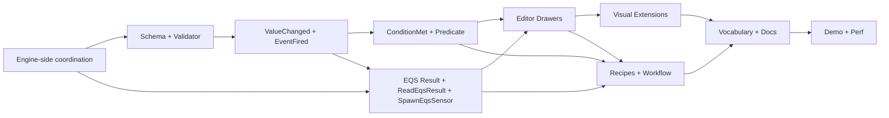

# When-Node Reactivity Iteration — Design (v2.2)

> **Status:** Detailed design for the next development iteration on top of the existing Blueprint subsystem (Architecture v1.2 + all subsequent detailed designs and inline patches), the AI Editor Shared Infrastructure, and the EQS v1.3 design. Architect-approved scope, fully resolved — ready for implementation.
> **Version:** v2.2 supersedes v2.1. Changes from v2.1: `SpawnEqsSensorNode` simplified to use the engine's actual fixed `EqsSensor` struct shape (no dynamic-reflection per-template parameter struct; the parameters are a fixed set of universal `EqsSensor` fields exposed as standard typed input pins). Recipe 1's OnSpawn graph replaced with a first-tick pattern in the Tick graph (no dependency on a lifecycle event with filter syntax). All §17 open questions now resolved. The §17 section becomes "Resolutions Summary." Effort estimates tick down by ~1-2 days each on M4 and M5 (no dynamic-binding scaffolding needed).
> **Version:** v2.1 superseded v2. Key changes were: introduction of **`SpawnEqsSensorNode`** as a third new node kind alongside `WhenNode` and `ReadEqsResultNode`, closing the spawn → observe → read pipeline. The §17 open questions from v2 were resolved via engine-source confirmation: `EqsResult` is a single 24-byte struct with `EntityId` (long) and `PositionX`/`PositionY` (floats); `view.IsAlive(Entity)` is the correct liveness API; `EqsSensorHandle` does not yet exist in the codebase and was declared here; `ReadEqsResultNode` outputs are named `Entity` / `Position` / `Score` (no "Top" prefix); the `EqsResult` field name is `EntityId`.
> **Version:** v2 supersedes v1. Key changes since v1: `WhenNode` is restricted to **Instance dispatch only** (BTree and HSM keep their existing reactive primitives — ObserverSelector and transition guards respectively); the iteration adds companion nodes `ReadEqsResultNode` (data extraction from sensor child entities) and `SpawnEqsSensorNode` (dynamic sensor creation); `EqsSensorHandle` is formally a wrapper struct (`struct EqsSensorHandle { Entity ChildId; }`); EQS staleness is calculated in **simulation seconds** (not ticks) via a new additive engine-side field `EqsCognitiveBuffer.LastUpdateTimeSeconds`; the EQS cognitive buffer lives on a **child entity** per the engine's dynamic-sensor pattern, accessed via `view.GetComponentRO<EqsCognitiveBuffer>(handle.ChildId)` with a `view.IsAlive(handle.ChildId)` liveness guard.
> **Audience:** Implementation agent and human reviewer.
> **Drives:** The introduction of three new nodes to the Blueprint Instance authoring surface — `WhenNode` (reactive observer with four mode-radio variants), `ReadEqsResultNode` (indexed data extraction from EQS sensor child entities), and `SpawnEqsSensorNode` (dynamic sensor instantiation with template + parameter binding) — plus supporting editor polish (cross-Blueprint dependency badges, unified "Reactive Guard" vocabulary at the concept layer across editors) and starter Behavior Recipes.
> **Doesn't cover:** Push-notification reactivity (architect explicitly preferred polling); per-slot version fields on every blackboard slot (deferred); cross-entity reactivity (architecturally deferred beyond the EQS sensor child-entity case); EQS template authoring inside the visual graph (kept in hand-written C# with `[EqsTemplate]`); `WhenNode` hosting in AiPrimitive Condition or Action bodies (out of scope — those subsystems have their own reactive primitives); array-output multi-result reads (`ReadEqsResultNode` ships with an indexed scalar-output shape; array iteration is a future iteration).
> **Reads alongside:** `Blueprint_Subsystem_Architecture_v1_2.md`, `Blueprint_Subsystem_Compiler_Detailed_Design.md` (+ inline patches), `Blueprint_Subsystem_Runtime_Detailed_Design.md` (+ inline patches), `Blueprint_Subsystem_Editor_Detailed_Design.md`, `Blueprint_Subsystem_Hot_Reload_Detailed_Design.md`, `AI_Editor_Shared_Infrastructure.md`, `EQS_Design_v1.3_final.md`, `Predicate-Infrastructure-Capabilities.md`, and the NodeEditor extension specs (NodeAttachments, ContainerNodes, CustomCanvasRenderer).
> **Companion code lives in:** generator additions under `Hrot/Subsystems/Blueprints/Hrot.Blueprints.Core/Compiler/Lowering/`, runtime helpers under `FDP/Toolkits/Fdp.Toolkits/Blueprints/`, editor drawers under `Hrot/Subsystems/Blueprints/Hrot.Blueprints.Editor/Drawers/`, recipes under `Hrot/Subsystems/Hrot.AI.Behaviors/Blueprints/Recipes/`, shared vocabulary under `Hrot/Editor/Hrot.Editor.AiShared/`. The single engine-side change (`EqsCognitiveBuffer.LastUpdateTimeSeconds`) lives under `FDP/Eqs/`. The new `EqsSensorHandle` wrapper struct also lives under `FDP/Eqs/`.

---

## Table of Contents

1. Scope, goals, and relationship to existing designs
2. Schema additions — `WhenNode`, `ReadEqsResultNode`, `SpawnEqsSensorNode`, `EqsSensorHandle`
3. Per-mode authoring forms — UX shape
4. Validator rules
5. Compiler integration overview
6. EQS Result mode — lowering details
7. `WhenNode` Value Changed / Event Fired / Condition Met, `ReadEqsResultNode`, and `SpawnEqsSensorNode` lowerings
8. Editor — `WhenNodeDrawer`, `ReadEqsResultNodeDrawer`, `SpawnEqsSensorNodeDrawer`
9. Visual — NodeAttachment pills and CustomCanvasRenderer overlays
10. Hot-reload integration
11. Engine-side dependency: `EqsCognitiveBuffer.LastUpdateTimeSeconds` and `EqsSensorHandle`
12. Behavior Recipes (including end-to-end spawn → observe → read flow)
13. "New from Recipe…" workflow
14. Unified "Reactive Guard" vocabulary — at the concept layer
15. Test plan
16. Implementation milestones within the iteration
17. Open questions for the implementation agent

---

## 1. Scope, goals, and relationship to existing designs

### 1.1 Why this iteration exists

The engine ships a sophisticated three-subsystem AI authoring stack — FastBTree, FastHSM, and the Blueprint subsystem — with shared editor infrastructure, unified hot-reload, and AAA-quality runtime performance. The runtime is uniformly polling-based: every Wait node, ObserverSelector guard, HSM transition guard, and AiPrimitive Condition re-evaluates its target on each tick using cache-friendly unmanaged reads.

The runtime is correct. The **authoring surface for Instance Blueprints**, however, exposes the polling model directly. A designer who wants to express "*when the player enters cover, abort the patrol and respond*" must today author 5–7 nodes of polling boilerplate to express one sentence of designer intent, with the "previous value" working-state byte as a persistent footgun.

This iteration introduces **`WhenNode`** — restricted to Instance Blueprints — that expresses event-feel semantics at the authoring layer while compiling to the engine's existing polling machinery at runtime. The compiler bridges the gap. The designer gets Unreal-style "react when X happens" expressiveness within their script-like Blueprint graph; the engine keeps its zero-allocation cache-friendly polling.

Two companion nodes complete the EQS authoring story:

- **`SpawnEqsSensorNode`** — creates a sensor instance as a child entity of the AI agent, attaches `PartMetadata` (for automatic cleanup) and `EqsSensor` (with the chosen template and dynamic parameters), and returns the new `EqsSensorHandle`.
- **`ReadEqsResultNode`** — reads results from the cognitive buffer on a sensor's child entity, given an `EqsSensorHandle` and a `ResultIndex`. Exposes `IsReady`, `ResultCount`, `Entity`, `Position`, `Score` as data outputs.

Together they form a **complete spawn → observe → read pipeline** that designers can author entirely in the visual graph without touching C#.

### 1.2 What this iteration ships

A focused, designer-facing reactivity-authoring iteration with five coupled deliverables:

1. **`WhenNode`** (Instance-only) — a single node kind with a mode selector exposing four authoring modes:
   - **Value Changed** — fire when a typed component field changes (with optional epsilon for floats)
   - **Event Fired** — fire when a transient event matches, with optional payload-property filter
   - **Condition Met** — fire when a `SearchPredicateDto` tree's evaluation transitions from false to true (or vice versa)
   - **EQS Result** — fire when the `EqsCognitiveBuffer` on a sensor's child entity reports a new evaluation matching a chosen trigger
2. **`SpawnEqsSensorNode`** (Instance-only) — an imperative action node that spawns a sensor child entity. Picks an EQS template via dropdown, exposes the template's parameters as dynamic input pins, returns the new `EqsSensorHandle` on its output pin. Parent/child cleanup is automatic via `PartMetadata` + `SubEntityCleanupSystem`.
3. **`ReadEqsResultNode`** (Instance-only) — a pure data-read node accepting an `EqsSensorHandle` and a `ResultIndex` (default 0); exposes data outputs `IsReady`, `ResultCount`, `Entity`, `Position`, `Score`.
4. **Visual cross-Blueprint dependency badges** — small NodeAttachment pills rendered on any node whose data input transitively reaches into a peer Blueprint.
5. **Behavior Recipes** — a curated set of five starter `.bp.json` assets, with Recipe 1 demonstrating the complete spawn → observe → read pipeline end-to-end.

Plus a small **vocabulary-unification pass** across the three editor projects (BTree, HSM, Blueprint) — at the **concept layer only**.

Plus one **engine-side dependency**: `EqsCognitiveBuffer` gains a new `float LastUpdateTimeSeconds` field (additive), and `FDP.Eqs.EqsSensorHandle` is formally declared as a wrapper struct.

### 1.3 What this iteration explicitly does NOT do

- **No `WhenNode`, `SpawnEqsSensorNode`, or `ReadEqsResultNode` in BTree or HSM.** BTrees have ObserverSelector for tree-level reactivity with priority-based preemption; HSMs have transition guards. Both are the right primitive for their host. The three new nodes are for Instance Blueprints — the engine's script-like authoring surface.
- **No new runtime mechanism.** Polling stays.
- **No EQS template authoring inside Blueprint.** Templates remain hand-written C# with `[EqsTemplate(AssetId=…)]`. The visual layer consumes them — picks them in the spawn node's dropdown, observes their results, reads their cognitive buffers — but doesn't define them.
- **No cross-entity reactivity** beyond the EQS sensor child-entity case (which is a sensor relationship, not a peer relationship).
- **No level-triggered "while X" mode** in `WhenNode`. Every authoring mode is edge-triggered.
- **No Lifecycle / Spatial / Structural / Behavior-Param / Blueprint-Variable / Trace-Buffer modes** as top-level mode-radio entries in `WhenNode`. These DTO families remain available through Condition Met's predicate tree.
- **No `[BlueprintExposedStateField]` catalog** — architect-endorsed for a future iteration.
- **No array-output multi-result `ReadEqsResultNode`.** The indexed scalar-output shape handles the common multi-soldier case.
- **No general entity-spawning node.** `SpawnEqsSensorNode` is specifically for spawning EQS sensor child entities — it is not a general-purpose `CreateEntity` node, and its identity is firmly within the EQS subsystem.

### 1.4 Relationship to existing designs — what we reuse vs. what we add

This iteration is **predominantly an editor + compiler addition**, with one small additive engine-side change. Concretely:

| Subsystem | What we reuse | What we add |
|---|---|---|
| **Blueprint compiler** | All eight pipeline stages, the existing `IrOperation` taxonomy, structure-hash machinery, generator output topology, `IEntityCommandBuffer ecb` parameter in Tick methods | Three new IR primitives (`WhenIrNode`, `ReadEqsResultIrNode`, `SpawnEqsSensorIrNode`); three new node-discriminator entries; small additions to validator and structure-hash contribution |
| **Blueprint runtime** | `BlueprintTickSystem`, `BlueprintRegistry`, per-slot soft/hard reconciliation, `Blackboard1024` / `BlueprintBlackboard*` projection | Nothing structural — only generated code uses the existing surface |
| **Predicate infrastructure** | `SearchPredicateDto` family, `IPredicateCompiler`, `IEventScannerCompiler`, all five specialized StructEdit drawers, JSON polymorphic round-trip, hot-reload recompile pattern from `DataBreakpointManager` | Nothing — consumed as-is |
| **EQS** | `EqsSensor`, `EqsCognitiveBuffer`, `EqsResultArray` (`[InlineArray(16)]`), `GetSpanRO()` access pattern, sensor `Epoch` field, `LastUpdateTick` field (deterministic), child-entity hosting via `PartMetadata` + `SubEntityCleanupSystem`, `EqsTemplateRegistry`, `EqsTemplate` attribute, the per-template parameter struct convention | One additive field: `EqsCognitiveBuffer.LastUpdateTimeSeconds` (float). One new wrapper struct: `EqsSensorHandle { Entity ChildId; }` |
| **ECS / `IEntityCommandBuffer`** | Existing deferred-component-attach API (`ecb.AddComponent<T>`, `ecb.CreateEntity`), `PartMetadata`, `SubEntityCleanupSystem`, `view.IsAlive(Entity)` | Nothing — consumed as-is |
| **NodeEditor + extensions** | NodeEditor host pattern, NodeAttachments, CustomCanvasRenderer | Three new attachment kinds (`ConditionSummaryAttachment`, `CrossAssetDependencyAttachment`, `EqsTemplateAttachment` for the spawn node); one new CustomCanvasRenderer overlay (`WhenFiringPulseRenderer`) |
| **AI Editor shared infrastructure** | `IAssetCatalog`, `EditorSelectionStore`, `InspectorWindow`, `RefactorService`, `IEditService` (StructEdit hosting), Blueprint's standard pin-default handling for unconnected typed inputs | One new shared static class `ReactiveGuardVocabulary` (string constants used by all three editors). The spawn-node drawer needs no special parameter-pin machinery — `EqsSensor`'s fixed shape means the input pins are standard typed inputs handled by existing per-pin resolution |
| **Hot reload** | `AiHotReloadCoordinator`, `OnReloadCompleted` event, per-slot structure-hash reconciliation, ALC swap discipline | Predicate-delegate recompile registration following the `DataBreakpointManager` pattern; small `DrainPendingCallbacks` extension to pass `IPredicateCompiler` into registrars |

The iteration's structural footprint remains small: three new node kinds, three new IR primitives, four lowering templates for `WhenNode` modes plus one each for the two companion nodes, three new editor drawers that delegate to existing specialized drawers, two new NodeAttachment kinds, one new CustomCanvasRenderer overlay, one shared-vocabulary string class, five starter `.bp.json` recipes, one menu addition, one additive engine-side field on `EqsCognitiveBuffer`, and one new wrapper struct.

### 1.5 Why one `WhenNode` with mode-radio rather than four node kinds

This was the central design question during scoping. The predicate infrastructure already handles the underlying mechanics for all four modes through a single composable system; from the runtime's perspective, "value changed" is just a degenerate one-leaf predicate tree.

The architect explicitly preferred mode-radio dispatch over four distinct node kinds:

- **Catalog hygiene** — adding four node kinds to the discriminator list pollutes the taxonomy with what is conceptually one feature
- **Drawer simplicity** — one `WhenNodeDrawer` that switches inline UI on a `Mode` enum is cleaner than four parallel drawers with shared boilerplate

This iteration follows that guidance: one `WhenNode` kind, one drawer, one IR primitive, mode-aware compilation. The two companion nodes (`ReadEqsResultNode`, `SpawnEqsSensorNode`) are *separate* node kinds because their identity is genuinely different — one reads, one creates — and the mode-radio facade wouldn't make conceptual sense across all three.

### 1.6 The semantic shape of `WhenNode`

A `WhenNode` is **edge-triggered**, **non-blocking**, and **observational**.

- **Edge-triggered** — compares current evaluation against a synthesized "previous" state stored in the asset's `State` struct. Fires its exec output only on transition.
- **Non-blocking** — never returns `Running` or suspends graph execution. The default `Out` exec output always forwards execution downstream.
- **Observational** — for Event Fired mode, the node does not consume the event from the bus. Multiple consumers (including other `WhenNode`s and `WaitForEventNode`s) can independently observe the same event.

The architect's framing of `WhenNode` as a **"side-effecting pass-through node"** is captured precisely in the compiler's Stage 5 (Schedule) treatment.

### 1.7 The semantic shape of `ReadEqsResultNode`

A `ReadEqsResultNode` is **pure**, **non-blocking**, and **per-tick**. No exec pins (data-only). Re-evaluated each tick its outputs are pulled by a downstream node, but the underlying buffer read is cheap (one ECS chunk read + one inline-array span).

Takes an `EqsSensorHandle` (input pin) and a `ResultIndex` (int, default 0, clamped at lowering time). Exposes data outputs `IsReady`, `ResultCount`, `Entity`, `Position`, `Score`.

### 1.8 The semantic shape of `SpawnEqsSensorNode`

A `SpawnEqsSensorNode` is **imperative**, **non-blocking**, and **one-shot per invocation**.

- **Imperative** — has exec `In` and `Out` pins. Fires once when reached. Performs structural ECS operations (entity creation, component attachment) via the existing `IEntityCommandBuffer`.
- **Non-blocking** — does not wait for the spawned sensor to produce results. Returns the handle immediately; the sensor's first evaluation happens asynchronously, observed later via `WhenNode` or `ReadEqsResultNode`.
- **One-shot per invocation** — each execution creates a new sensor child entity. Designers typically place the node in the first-tick branch of a Tick graph (gated by an `Initialized` working-state byte) so the sensor is created once per AI agent lifecycle and lives for the entire agent's lifetime. See Recipe 1 in §12.2 for the canonical first-tick pattern.

The picked template (from the `EqsTemplateRegistry`) determines the sensor's behavior by setting the `BlueprintId` field of the spawned `EqsSensor` component. The other `EqsSensor` fields (SearchRadius, FactionFilter, etc.) are exposed as the node's standard typed input pins — the same set for every template, since `EqsSensor` is a fixed non-generic struct.

The output pin `Handle` carries the newly-created `EqsSensorHandle`. Designers typically wire it into a `SetVariableNode` that stores the handle in an asset variable of type `EqsSensorHandle`, making the handle available to downstream `WhenNode`s and `ReadEqsResultNode`s.

### 1.9 The complete pipeline at a glance

Picturing how all three nodes fit together in a designer's graph:

```
Tick event graph (running every tick, first-tick gating for setup):
  ┌────────┐    ┌────────────────────────────────┐
  │ Tick   ├───>│ Branch: Initialized == false   │
  │        │    └────────────────────────────────┘
  └────────┘                │ true (first tick only)
                            v
                  ┌─────────────────────────────────┐
                  │ SpawnEqsSensorNode              │
                  │ (Template=CoverQuery,           │
                  │  SearchRadius=15, Faction=2)    │
                  └─────────────────────────────────┘
                            │ (exec out)        │ (Handle out)
                            v                   v
                  ┌────────────────────────┐  ┌──────────────────────────────────┐
                  │ SetVariable:           │  │ SetVariable: CoverQuery          │
                  │   Initialized = true   │  │ (stores Handle into the variable)│
                  └────────────────────────┘  └──────────────────────────────────┘
                            │
                            v (rejoin main Tick flow)
                  ┌──────────────────────────────────┐
                  │ WhenNode (EQS Result/TopChanged) │
                  │   targeting CoverQuery variable  │
                  └──────────────────────────────────┘
                                    OnFired ──────┐
                                                  v
                                  ┌──────────────────────────────────┐
                                  │ ReadEqsResultNode                │
                                  │   (Handle from CoverQuery var,   │
                                  │    Index = 0)                    │
                                  └──────────────────────────────────┘
                                          Position ───>
                                                       ┌───────────────────────────┐
                                                       │ ChannelCommand: MoveTo    │
                                                       │   target = Position       │
                                                       └───────────────────────────┘
```

Three nodes, one pipeline, fully visual. The designer never writes C# for sensor lifecycle, observation, or extraction. The EQS team's `[EqsTemplate]` C# class supplies the query semantics; everything else is composed from Blueprint nodes.

The first-tick gating (a working-state byte `Initialized` that defaults to false and is set to true once the spawn block has run) is a Blueprint-idiomatic alternative to dedicated lifecycle events. It works against any Instance Blueprint's Tick graph without depending on the engine's lifecycle-event catalog or filter syntax. See Recipe 1 in §12.2 for the full pattern.

### 1.10 Architect-confirmed alignment notes

Several points from the scoping conversation are baked into v2.1 and worth surfacing:

1. **`WhenNode` is for the Blueprint subsystem's script-like authoring surface — Instance Blueprints with Tick/event graphs.** BTrees keep ObserverSelector; HSMs keep transition guards. The vocabulary unification (§14) operates at the concept layer; implementations stay distinct.
2. **`EqsSensorHandle` is formally a wrapper struct** `{ Entity ChildId; }`. Declared by this iteration; does not yet exist in the engine codebase.
3. **EQS sensor instances are child entities** (per the engine's dynamic-sensor pattern using `PartMetadata`). Parent/child cleanup is automatic via `SubEntityCleanupSystem`; this iteration writes no cleanup code.
4. **EQS staleness uses simulation time in seconds**, not ticks. The new `EqsCognitiveBuffer.LastUpdateTimeSeconds` field is the time basis; existing `LastUpdateTick` is preserved for `IsReady` semantics and Muscle→Brain event determinism.
5. **Child-entity buffer reads use `view.GetComponentRO<EqsCognitiveBuffer>(handle.ChildId)`** with a `view.IsAlive(handle.ChildId)` guard. `view.IsAlive` is the confirmed API (used extensively across engine systems including `DamageSystem` and `FireProcessingSystem`).
6. **`EqsResult` is a uniform 24-byte struct** with `EntityId` (long) + `PositionX`/`PositionY` (floats). Positional queries set `EntityId = 0L`. On-the-fly hashing: `top.EntityId != 0L ? top.EntityId : HashCode.Combine(top.PositionX, top.PositionY)`.
7. **`ReadEqsResultNode` output pins** are `Entity` / `Position` / `Score` (no "Top" prefix), since the `ResultIndex` input pin can address ranks beyond the top.
8. **`SpawnEqsSensorNode` palette category is "EQS"**, alongside `ReadEqsResultNode`. `WhenNode` stays in "Reactive Guards" — its identity is the reactive observer, not its EQS connection (it handles three non-EQS modes too).
9. **`EqsSensor` is a fixed non-generic ECS struct** with a known field set (`BlueprintId`, `Epoch`, `SearchRadius`, `FactionFilter`, `ThreatThreshold`, `PublishPolicy`, `Priority`). `SpawnEqsSensorNode` exposes these as standard typed input pins identical across all templates — no per-template parameter struct, no dynamic pin reflection. Template choice only determines which `BlueprintId` is written to the spawned `EqsSensor`.
10. **`OnSpawn` initialization uses the first-tick pattern** rather than an explicit lifecycle event. A working-state byte (e.g., `Initialized`) gates a one-shot setup branch at the top of the Tick graph. Simpler than depending on `Fdp.Core.EntityLifecycleEvent` filter semantics; works against any Instance Blueprint's natural Tick flow.

---

## 2. Schema additions — `WhenNode`, `ReadEqsResultNode`, `SpawnEqsSensorNode`, `EqsSensorHandle`

### 2.1 The `EqsSensorHandle` wrapper struct

Declared in the EQS namespace as part of this iteration (it does not yet exist in the codebase):

```csharp
namespace FDP.Eqs;

[StructLayout(LayoutKind.Sequential, Pack = 4)]
public readonly struct EqsSensorHandle : IEquatable<EqsSensorHandle>
{
    public readonly Entity ChildId;

    public EqsSensorHandle(Entity childId) => ChildId = childId;

    public bool Equals(EqsSensorHandle other) => ChildId.Equals(other.ChildId);
    public override bool Equals(object? obj) => obj is EqsSensorHandle other && Equals(other);
    public override int GetHashCode() => ChildId.GetHashCode();
    public static bool operator ==(EqsSensorHandle a, EqsSensorHandle b) => a.Equals(b);
    public static bool operator !=(EqsSensorHandle a, EqsSensorHandle b) => !a.Equals(b);

    public bool IsValid => ChildId.Id != 0;
}
```

Zero-cost at runtime (single-field struct, same layout as `Entity`). Its value is at the type system layer: Blueprint editor dropdowns filter the asset's variable list to only those whose declared type is `FDP.Eqs.EqsSensorHandle`, keeping the picker clean and free of unrelated `Entity` variables.

### 2.2 JSON discriminator registrations

The `Node` base class in `Hrot.Blueprints.Core.Assets` gains three new derived-type entries:

```csharp
[JsonPolymorphic(TypeDiscriminatorPropertyName = "kind")]
[JsonDerivedType(typeof(FunctionCallNode),         "FunctionCall")]
[JsonDerivedType(typeof(BranchNode),               "Branch")]
[JsonDerivedType(typeof(SequenceNode),             "Sequence")]
[JsonDerivedType(typeof(GetVariableNode),          "GetVariable")]
[JsonDerivedType(typeof(SetVariableNode),          "SetVariable")]
[JsonDerivedType(typeof(LiteralNode),              "Literal")]
[JsonDerivedType(typeof(EventEntryNode),           "EventEntry")]
[JsonDerivedType(typeof(ReturnNode),               "Return")]
[JsonDerivedType(typeof(CastNode),                 "Cast")]
[JsonDerivedType(typeof(ArrayMakeNode),            "ArrayMake")]
[JsonDerivedType(typeof(ArrayGetNode),             "ArrayGet")]
[JsonDerivedType(typeof(LatentDelayNode),          "Delay")]
[JsonDerivedType(typeof(CallEventDispatcherNode),  "CallDispatcher")]
[JsonDerivedType(typeof(BindEventDispatcherNode),  "BindDispatcher")]
[JsonDerivedType(typeof(CallCustomEventNode),      "CallCustomEvent")]
[JsonDerivedType(typeof(CallPeerBlueprintNode),    "CallPeerBlueprint")]
[JsonDerivedType(typeof(ChannelCommandNode),       "ChannelCommand")]
[JsonDerivedType(typeof(WaitForChannelNode),       "WaitForChannel")]
[JsonDerivedType(typeof(WaitForEventNode),         "WaitForEvent")]
[JsonDerivedType(typeof(WhenNode),                 "When")]              // NEW
[JsonDerivedType(typeof(ReadEqsResultNode),        "ReadEqsResult")]     // NEW
[JsonDerivedType(typeof(SpawnEqsSensorNode),       "SpawnEqsSensor")]    // NEW
public abstract class Node { /* ... */ }
```

### 2.3 The `WhenNode` class

```csharp
namespace Hrot.Blueprints.Core.Assets;

public sealed class WhenNode : Node
{
    public WhenMode Mode { get; set; }
    public WhenEdge Edges { get; set; } = WhenEdge.RisingEdge;

    public ValueChangedPayload? ValueChanged { get; set; }
    public EventFiredPayload? EventFired { get; set; }
    public ConditionMetPayload? ConditionMet { get; set; }
    public EqsResultPayload? EqsResult { get; set; }
}

public enum WhenMode { ValueChanged, EventFired, ConditionMet, EqsResult }

[Flags]
public enum WhenEdge { None = 0, RisingEdge = 1, FallingEdge = 2 }

public sealed class ValueChangedPayload
{
    public string ComponentTypeId { get; set; } = "";
    public string PropertyPath { get; set; } = "";
    public double Epsilon { get; set; }
    public ValueChangedSource Source { get; set; }
    public Guid? PeerBlueprintAssetId { get; set; }
    public string? PeerVariableName { get; set; }
    public string? WorkingStateFieldId { get; set; }
}

public enum ValueChangedSource { SelfComponent, PeerBlueprintVariable, WorkingStateField }

public sealed class EventFiredPayload
{
    public string EventTypeId { get; set; } = "";
    public EventTargetFilter TargetFilter { get; set; } = EventTargetFilter.Self;
    public string? TargetFieldName { get; set; }
    public PayloadCondition? PayloadCheck { get; set; }
}

public enum EventTargetFilter { None, Self }

public sealed class PayloadCondition
{
    public string PropertyPath { get; set; } = "";
    public ComparisonOperator Operator { get; set; }
    public string TargetValueText { get; set; } = "";
}

public sealed class ConditionMetPayload
{
    public SearchPredicateDto? Condition { get; set; }
}

public sealed class EqsResultPayload
{
    public string SensorVariableName { get; set; } = "";
    public EqsTrigger Trigger { get; set; }
    public float ScoreThreshold { get; set; }
    public float MaxAgeSeconds { get; set; }
}

public enum EqsTrigger { FirstReady, TopChanged, ScoreCrossed, BecomesStale }
```

### 2.4 The `ReadEqsResultNode` class

```csharp
public sealed class ReadEqsResultNode : Node
{
    public string SensorVariableName { get; set; } = "";
}
```

Pin layout:

| Pin | Direction | Type | Notes |
|---|---|---|---|
| `Handle` | Input | `EqsSensorHandle` | Optional — falls back to `SensorVariableName` lookup if unconnected |
| `ResultIndex` | Input | `int` | Default 0; clamped at lowering time |
| `IsReady` | Output | `bool` | |
| `ResultCount` | Output | `int` | |
| `Entity` | Output | `Entity` | Zero for positional queries |
| `Position` | Output | `Vector2` | `(PositionX, PositionY)` |
| `Score` | Output | `float` | |

Output names use **no "Top" prefix** since the indexed read makes "top" misleading.

### 2.5 The `SpawnEqsSensorNode` class

```csharp
public sealed class SpawnEqsSensorNode : Node
{
    /// <summary>
    /// The chosen EQS template's stable identifier (the AssetId from the template's
    /// [EqsTemplate(AssetId = "...")] declaration). At lowering time this resolves
    /// to the BlueprintId stored in the spawned EqsSensor component.
    /// </summary>
    public Guid TemplateAssetId { get; set; }
}
```

That's the complete schema. No per-template parameter struct, no `LiteralParameterValues` dictionary — the engine's `EqsSensor` component has a **fixed set of universal fields** (per architect's clarification of the engine reality), and those fields are exposed as standard typed input pins on the node itself (see §2.8 below). The template choice only determines which `BlueprintId` value is written to the spawned component; the parameter pin set is identical across all templates.

Pin layout — fixed and template-independent — see §2.8.

### 2.6 Where new nodes are allowed

| Dispatch | Graph kind | `WhenNode` | `ReadEqsResultNode` | `SpawnEqsSensorNode` |
|---|---|---|---|---|
| Instance | Tick / event graph (Tick scope) | **Yes** | **Yes** | **Yes** |
| Instance | Pure function graph | **No** | **No** | **No** |
| AiPrimitive (any intent) | Function graph | **No** | **No** | **No** |
| Library | Function graph | **No** | **No** | **No** |

Validator rules in §4 enforce these constraints. The architect's framing is consistent across all three nodes: they're for the Instance Blueprint script-like authoring surface; AiPrimitives and Library stay imperative-only and BTree/HSM use their native reactive primitives.

### 2.7 `WhenNode` pin layout examples

```
        ┌──────────────────────────┐
   In ──┤   When (Condition Met)   ├── Out
        │                          ├── OnFired   (rising edge)
        │                          ├── OnEnded   (falling edge)
        └──────────────────────────┘
```

```
        ┌──────────────────────────┐
   In ──┤   When (Event: OnHit)    ├── Out
        │                          ├── OnFired
        └──────────────────────────┘
```

### 2.8 `SpawnEqsSensorNode` pin layout

The pin set is **fixed across all templates** because the engine's `EqsSensor` is a fixed non-generic struct. Every spawn node, regardless of which template is picked, exposes the same input pins matching the `EqsSensor` field set:

| Pin | Direction | Type | Notes |
|---|---|---|---|
| `In` | Input | exec | |
| `Out` | Output | exec | Fires after the spawn completes |
| `SearchRadius` | Input | `float` | Query search radius in meters; unconnected → editor-supplied literal default |
| `FactionFilter` | Input | `uint` | Faction bitmask for query filtering; unconnected → literal default |
| `ThreatThreshold` | Input | `float` | Per-template threat-relevance threshold; unconnected → literal default |
| `PublishPolicy` | Input | `byte` | Solver publish-policy enum byte; unconnected → literal default |
| `Priority` | Input | `byte` | Sensor priority for solver scheduling; unconnected → literal default |
| `Handle` | Output | `EqsSensorHandle` | The newly created sensor's handle |

Each input pin can be either **connected** to an upstream data producer (a `GetVariableNode`, a literal node, an output of another node) or **unconnected** with a default literal supplied via Blueprint's standard inline-literal mechanism for unconnected typed pins. This is exactly how the engine handles unconnected typed pins on existing nodes — no new mechanism needed.

The pin set is template-independent. Switching from one template to another (e.g., from `CoverQuery` to `FlankingQuery`) does not rebuild pins; only the compiled `BlueprintId` constant changes. Any existing pin connections are preserved unchanged across template switches.

If the EQS team adds new universal fields to `EqsSensor` in the future (e.g., the planned `ScoreDeltaThreshold`), the spawn node gains a matching input pin in a corresponding follow-up iteration. This iteration tracks `EqsSensor` as it currently exists.

Example canvas layout (identical regardless of template):

```
                  ┌────────────────────────────────────┐
   In ────────────┤  Spawn EQS Sensor                  ├── Out
                  │   Template: CoverQuery             │── Handle (EqsSensorHandle)
SearchRadius ────┤                                     │
FactionFilter ───┤                                     │
ThreatThreshold ─┤                                     │
PublishPolicy ───┤                                     │
Priority ────────┤                                     │
                  └────────────────────────────────────┘
```

### 2.9 Identity and editor metadata

All three nodes inherit standard `Node` identity (`Guid Id`, `List<Pin> Pins`, `NodeMetadata EditorMetadata`). Canvas positions live in `Graph.EditorMetadata.NodePositions`.

The synthesized previous-state field for `WhenNode` (§5.4) is not part of the asset schema — it is materialized by the compiler from the `WhenNode`'s `Id` and `Mode` deterministically.

`ReadEqsResultNode` and `SpawnEqsSensorNode` synthesize no state. The spawn node *creates* state (a new child entity with components) but doesn't carry state itself.

---

## 3. Per-mode authoring forms — UX shape

### 3.1 `WhenNode` — mode selector

```
┌────────────────────────────────────────┐
│  When                                  │
├────────────────────────────────────────┤
│  Mode:  ⦿ Value Changed                │
│         ◯ Event Fired                  │
│         ◯ Condition Met (advanced)     │
│         ◯ EQS Result                   │
└────────────────────────────────────────┘
```

Mode-specific fields render inline below the radio. Edge selector and live preview pill below those.

### 3.2 Value Changed mode

```
┌────────────────────────────────────────┐
│  Mode:  Value Changed                  │
├────────────────────────────────────────┤
│  Source:    ⦿ Self component           │
│             ◯ Peer Blueprint variable  │
│             ◯ Working-state field      │
│                                        │
│  Component: [Health             ▾]     │
│  Path:      [Current            ▾]     │
│  Epsilon:   [0.000              ]      │
├────────────────────────────────────────┤
│  Edges:  ☑ Rising  ☑ Falling           │
├────────────────────────────────────────┤
│  Preview: Health.Current changed       │
└────────────────────────────────────────┘
```

### 3.3 Event Fired mode

```
┌────────────────────────────────────────┐
│  Mode:  Event Fired                    │
├────────────────────────────────────────┤
│  Event:        [HitEvent        ▾]     │
│  Target filter: ⦿ Self                 │
│                 ◯ All occurrences      │
│  Target field: [Target          ▾]     │
│                                        │
│  Payload check: ☐ No filter            │
│                 ☑ Property condition   │
│                    Property: [Damage   ▾] │
│                    Operator: [ >       ▾] │
│                    Value:    [50      ]   │
├────────────────────────────────────────┤
│  Edges:  ☑ Rising  (Falling hidden)    │
├────────────────────────────────────────┤
│  Preview: OnHit (Target=Self,          │
│           Damage > 50)                 │
└────────────────────────────────────────┘
```

### 3.4 Condition Met mode

```
┌────────────────────────────────────────┐
│  Mode:  Condition Met                  │
├────────────────────────────────────────┤
│  Condition tree:                       │
│  ┌──────────────────────────────────┐  │
│  │ ▼ Compound (AND)                 │  │
│  │   ├ ▼ Property match             │  │
│  │   │   Component: Health          │  │
│  │   │   Path: Current              │  │
│  │   │   Operator: <                │  │
│  │   │   Value: 10                  │  │
│  │   └ ▼ Property match             │  │
│  │       Component: CombatState     │  │
│  │       Path: InCombat             │  │
│  │       Operator: ==               │  │
│  │       Value: true                │  │
│  └──────────────────────────────────┘  │
│  [+ Add child] [Edit JSON] [Clear]     │
├────────────────────────────────────────┤
│  Edges:  ☑ Rising  ☐ Falling           │
├────────────────────────────────────────┤
│  Preview: Health.Current < 10 AND      │
│           CombatState.InCombat         │
└────────────────────────────────────────┘
```

### 3.5 EQS Result mode

```
┌────────────────────────────────────────┐
│  Mode:  EQS Result                     │
├────────────────────────────────────────┤
│  Sensor:    [CoverQuery         ▾]     │
│  Trigger:   ⦿ Top result changed       │
│             ◯ First result ready       │
│             ◯ Score crossed threshold  │
│             ◯ Becomes stale            │
│  Threshold: [0.70  ]                   │
│  Max age:   [2.00  ] s                 │
├────────────────────────────────────────┤
│  Edges:  ☑ Rising  (Falling on stale)  │
├────────────────────────────────────────┤
│  Preview: CoverQuery: top changed      │
└────────────────────────────────────────┘
```

The Sensor dropdown enumerates the asset's `Variables` filtered to those of type `FDP.Eqs.EqsSensorHandle`.

### 3.6 `ReadEqsResultNode` form

```
┌────────────────────────────────────────┐
│  Read EQS Result                       │
├────────────────────────────────────────┤
│  Sensor:    [CoverQuery         ▾]     │
│  Index:     (input pin — default 0)    │
├────────────────────────────────────────┤
│  Output pins:                          │
│    IsReady, ResultCount,               │
│    Entity, Position, Score             │
└────────────────────────────────────────┘
```

### 3.7 `SpawnEqsSensorNode` form

```
┌────────────────────────────────────────┐
│  Spawn EQS Sensor                      │
├────────────────────────────────────────┤
│  Template: [CoverQuery          ▾]     │   ← from EqsTemplateRegistry
│                                        │
│  Inputs (wire via pins, or set         │
│  literal defaults on unconnected pins):│
│    • SearchRadius     (float)          │
│    • FactionFilter    (uint)           │
│    • ThreatThreshold  (float)          │
│    • PublishPolicy    (byte)           │
│    • Priority         (byte)           │
│                                        │
│  Output: Handle → EqsSensorHandle      │
├────────────────────────────────────────┤
│  Preview: Spawn CoverQuery             │
└────────────────────────────────────────┘
```

The template dropdown reads from `EqsTemplateRegistry`, listing every `[EqsTemplate(AssetId=...)]` class registered at editor-load time. Selecting a template changes only the `BlueprintId` written to the spawned `EqsSensor` — the input pin set stays the same.

The five typed input pins (`SearchRadius`, `FactionFilter`, `ThreatThreshold`, `PublishPolicy`, `Priority`) are the same for every template, matching the engine's fixed `EqsSensor` field set. For each pin, the designer either:

- **Wires it** to an upstream data producer (variable read, literal node, etc.)
- **Leaves it unconnected** and sets a literal default via Blueprint's standard inline-literal editor (which fires on unconnected typed pins for all node kinds — not a spawn-node-specific mechanism)

This is dramatically simpler than the v2.1 dynamic-reflection design, because the engine's `EqsSensor` does not vary per template.

### 3.8 Preview pills

Single-line preview text per node, rendered at the bottom of the inspector and as canvas attachments:

| Node | Preview format |
|---|---|
| `WhenNode` Value Changed | `Health.Current changed` |
| `WhenNode` Event Fired | `OnHit (Target=Self, Damage > 50)` |
| `WhenNode` Condition Met | First-line synthesis of predicate tree |
| `WhenNode` EQS Result | `CoverQuery: top changed` |
| `ReadEqsResultNode` | `CoverQuery [idx 0]` (or `[dynamic]` if index pin is connected to a non-constant source) |
| `SpawnEqsSensorNode` | `Spawn CoverQuery (R=15)` (template name + first one or two key parameter values, shortened) |

---

## 4. Validator rules

Diagnostics under the `BP` code series. New codes per node kind:

### 4.1 `WhenNode` diagnostics

| Code | Diagnostic | Trigger |
|---|---|---|
| `BP2001` | `WhenNode` in unsupported dispatch | Library, AiPrimitive (any intent), or Instance pure-function graph |
| `BP2002` | `WhenNode` missing required payload | Mode set but corresponding payload field null |
| `BP2003` | `WhenNode` Value Changed: invalid property path | ComponentTypeId or PropertyPath empty/invalid |
| `BP2004` | `WhenNode` Value Changed: peer Blueprint variable not declared | Source = PeerBlueprintVariable but PeerBlueprintAssetId not in callablePeers |
| `BP2005` | `WhenNode` Event Fired: event type not in catalog | EventTypeId doesn't resolve |
| `BP2006` | `WhenNode` Event Fired: Self filter without Target field | TargetFilter = Self but the event has no TargetFieldName |
| `BP2007` | `WhenNode` Event Fired: payload condition invalid | PropertyPath invalid or TargetValueText unparseable |
| `BP2008` | `WhenNode` Condition Met: predicate tree null or empty | Condition is null or Compound with zero children |
| `BP2009` | `WhenNode` Condition Met: predicate DTO references unknown type | PropertyMatchDto.ComponentType not in registry |
| `BP2010` | `WhenNode` EQS Result: sensor variable not declared | SensorVariableName doesn't match an EqsSensorHandle variable |
| `BP2011` | `WhenNode` EQS Result: trigger requires threshold/max-age | ScoreCrossed without threshold or BecomesStale without maxAge |
| `BP2012` | `WhenNode` Edges set to None | Node would never fire |
| `BP2013` | `WhenNode` Event Fired falling edge meaningless | Edges & FallingEdge with EventFired mode (warning) |
| `BP2014` | `WhenNode` Value Changed epsilon on non-float field | Epsilon non-zero on integer/bool/enum field (warning) |
| `BP2015` | `WhenNode` downstream of a Branch | Stale prev-value risk (warning) |

### 4.2 `ReadEqsResultNode` diagnostics

| Code | Diagnostic | Trigger |
|---|---|---|
| `BP2020` | `ReadEqsResultNode` in unsupported dispatch | Same as BP2001 — Instance only |
| `BP2021` | `ReadEqsResultNode` sensor variable not declared | SensorVariableName not an EqsSensorHandle variable |

### 4.3 `SpawnEqsSensorNode` diagnostics

| Code | Diagnostic | Trigger |
|---|---|---|
| `BP2030` | `SpawnEqsSensorNode` in unsupported dispatch | Library, AiPrimitive (any intent), or Instance pure-function graph |
| `BP2031` | `SpawnEqsSensorNode` template not found | TemplateAssetId doesn't resolve in EqsTemplateRegistry |

(v2.1 also defined BP2032, BP2033, and BP2034 for parameter-binding scenarios. Those diagnostics are no longer needed: the engine's `EqsSensor` has a fixed field set, so there is no per-template parameter type mismatch, no missing literal binding, and no unparseable literal scenario. Standard Blueprint pin-default validation handles unconnected typed pins; standard type-coercion diagnostics handle wired-pin type mismatches. No spawn-node-specific diagnostics are needed for the parameter pins.)

### 4.4 Validator interactions

- All three nodes participate in the existing dispatch-aware validation (Instance-only, no Library, no AiPrimitive)
- `WhenNode` synthesized previous-state fields contribute to the asset's tier-hint auto-selection
- Predicate-DTO validation for Condition Met delegates to `IPredicateCompiler.Validate`, with diagnostics surfaced with BP20xx prefix
- The spawn node's template lookup uses `EqsTemplateRegistry.TryGet(templateAssetId)`; absence emits BP2031. Standard Blueprint pin-default and type-coercion validation handles the spawn node's typed parameter input pins — no spawn-node-specific reflection needed.

---

## 5. Compiler integration overview

### 5.1 Where new nodes enter the pipeline

The compiler pipeline is unchanged from the existing eight stages. The three new nodes participate as follows:

| Stage | Behavior |
|---|---|
| 1. Parse | JSON polymorphic dispatch instantiates all three node kinds via their new discriminators |
| 2. Validate | Per-node and per-mode required-field checks, dispatch context check, predicate-DTO validation, EQS template lookup |
| 3. Normalize | `WhenNode`: default-value materialization; pin list rebuilt from mode + edges. `SpawnEqsSensorNode`: pin list is fixed and template-independent (no dynamic rebuild) |
| 4. Type-resolve | `WhenNode`: each mode's typed references resolve. `ReadEqsResultNode`: SensorVariableName resolves. `SpawnEqsSensorNode`: TemplateAssetId resolves to a registered template (template's `BlueprintId` constant is captured for emit) |
| 5. Schedule | `WhenNode`: side-effect pass-through. `ReadEqsResultNode`: pure data node (no exec scheduling). `SpawnEqsSensorNode`: imperative action (exec In → Out, side effect during execution) |
| 6. Lower | Synthesized previous-state for `WhenNode`; helper-method emission for `ReadEqsResultNode`; entity-creation + component-attach IR for `SpawnEqsSensorNode` |
| 7. Emit | C# generation per node |
| 8. Roslyn finalize | Standard |

### 5.2 New IR primitives

In `Hrot.Blueprints.Core.Compiler.Ir`:

```csharp
public sealed class WhenIrNode : IrStatement { /* per §5.2 of v2 */ }

public sealed class ReadEqsResultIrNode : IrStatement
{
    public required string SensorVariableFieldName { get; init; }
    public required IrExpression ResultIndexExpr { get; init; }
}

public sealed class SpawnEqsSensorIrNode : IrStatement
{
    public required Guid TemplateAssetId { get; init; }
    public required uint TemplateBlueprintId { get; init; }   // captured from template at type-resolve time

    // Pin-source expressions for the fixed EqsSensor input fields:
    public required IrExpression SearchRadiusExpr { get; init; }
    public required IrExpression FactionFilterExpr { get; init; }
    public required IrExpression ThreatThresholdExpr { get; init; }
    public required IrExpression PublishPolicyExpr { get; init; }
    public required IrExpression PriorityExpr { get; init; }

    public required string HandleOutputPinName { get; init; }
}
```

The spawn node's IR captures both the `TemplateAssetId` (for editor round-trip) and the resolved `TemplateBlueprintId` (the actual uint constant used in the emitted `EqsSensor.BlueprintId` assignment). Each of the five parameter input pins resolves to an `IrExpression` representing the wired upstream expression or the literal-default. The emitter consumes these directly without further re-resolution.

### 5.3 Scheduling — three different patterns

The three nodes have distinct scheduling shapes:

- **`WhenNode`** — side-effecting pass-through. `In` → evaluation → `Out` (always); plus optional `OnFired`/`OnEnded` side-paths that converge into the store-and-continue step. Per architect's framing.
- **`ReadEqsResultNode`** — pure. No exec graph participation. Its outputs are evaluated lazily when downstream nodes pull them; the compiler emits a helper method invocation at each pull point (with caching for shared reads — see §6 of v2 and §7 of this doc).
- **`SpawnEqsSensorNode`** — imperative. `In` → side effect → `Out`. The side effect (entity creation, component attachment) happens linearly during exec flow. The `Handle` output is a regular data output that's populated synchronously and made available to downstream nodes in the same Tick.

### 5.4 Synthesized previous-state field — `WhenNode` only

Same as v2: `_when_<first8HexCharsOfNodeId>_prev` in the asset's `State` struct.

Neither `ReadEqsResultNode` nor `SpawnEqsSensorNode` synthesizes state. The spawn node *causes* state to come into existence (a new entity with components) but doesn't itself contribute to the asset's `State` struct layout.

### 5.5 Structure-hash contribution

Per the architect's earlier ruling, `WhenNode` synthesized previous-state fields are included in `StructureHash`. The spawn node's effects (entity creation, component attachment) are not structural changes to the Instance asset's slot layout, so the spawn node does not contribute to `StructureHash`. Adding or removing a `SpawnEqsSensorNode` is a Soft Reload (code-content change without slot-layout change).

This means designers can iterate on spawn-node parameters and template choices freely without invalidating running slots. The spawn node *itself* doesn't re-execute on Soft Reload — but that's correct, because the existing sensor child entity it created is still alive (parent didn't die), still has the right components attached (the components on the child entity are unaffected by the parent asset's hot reload), and continues to be readable by `WhenNode`/`ReadEqsResultNode`. The new ALC's code reads the same sensor.

(If the designer changes the template choice substantially — e.g., switches from `CoverQuery` to `FlankingQuery` — they'll typically want to re-spawn the sensor with the new template. That's a manual workflow: destroy the old sensor child entity, run `SpawnEqsSensorNode` again. Re-spawn semantics are explicitly out of scope for this iteration; for now designers re-spawn by destroying and recreating the entity, or by leaving the old sensor in place if it's still useful.)

### 5.6 Per-mode lowering — high-level shape

The four `WhenNode` modes share a common code shape (per v2 §5.6). The two new companion nodes have their own shapes:

- **`ReadEqsResultNode`** — emits a helper method per node returning a result struct; downstream consumers call it once and cache the struct in a local
- **`SpawnEqsSensorNode`** — emits an inline block performing `ecb.CreateEntity()` + `ecb.AddComponent` sequence; assigns the resulting entity to the `Handle` output's variable

Complete lowering details follow in §6 (EQS Result, the most complex) and §7 (Value Changed, Event Fired, Condition Met, ReadEqsResultNode, SpawnEqsSensorNode).

---

## 6. EQS Result mode — lowering details

This section is thorough because EQS Result is the highest-leverage and most failure-prone of the four `WhenNode` modes. Six correctness rules govern the emitted code:

1. **`[InlineArray]` access via `GetSpanRO()`, never direct.** Avoids `ldobj` defensive-copy bug.
2. **Reads target the sensor's child entity** (`handle.ChildId`), not `Self`.
3. **Liveness guard before buffer read** via `view.IsAlive(handle.ChildId)`.
4. **Epoch-gated re-evaluation.** Skip if the buffer hasn't been refreshed since last check.
5. **Simulation-time-based staleness** using `EqsCognitiveBuffer.LastUpdateTimeSeconds`.
6. **On-the-fly positional hashing** when `EntityId == 0L`.

(These rules are unchanged from v2; this section repeats them for completeness with one additional note on how they interact with `SpawnEqsSensorNode` — see §6.11.)

### 6.1 The `EqsCognitiveBuffer` access pattern — non-negotiable

The `EqsCognitiveBuffer.EqsResultArray` is `[InlineArray(16)]`. Direct value-semantic access triggers `ldobj` — a defensive ~512-byte copy per read. The EQS API's `GetSpanRO()` helper returns `ReadOnlySpan<EqsResult>` over the inline-array memory; all compiler-generated reads must go through it.

### 6.2 The child-entity read pattern

EQS sensors are dynamic child entities (created by `SpawnEqsSensorNode`, cleaned up automatically when the parent dies). Standard component reads target `Self`. EQS Result lowering targets `handle.ChildId`:

```csharp
ref var prev = ref s._when_<id>_prev;
ref readonly var handle = ref s._<sensorVariableName>;

if (!view.IsAlive(handle.ChildId))
    goto whenNode_<id>_end;

ref readonly var sensor = ref view.GetComponentRO<EqsSensor>(handle.ChildId);
ref readonly var buffer = ref view.GetComponentRO<EqsCognitiveBuffer>(handle.ChildId);
// ... evaluation ...
whenNode_<id>_end: ;
```

The `view.IsAlive` API is the engine-confirmed liveness check (used in `DamageSystem`, `FireProcessingSystem`, and other systems).

### 6.3 The epoch-gating rule

The `EqsSensor.Epoch` field increments each time the Muscle solver produces a new evaluation. The synthesized previous-state struct includes `LastEvaluatedEpoch`; the lowered code's first check after the liveness guard is `if (sensor.Epoch != prev.LastEvaluatedEpoch)`. If unchanged, skip the trigger evaluation; if changed, run trigger-specific comparison and store the new epoch.

(`BecomesStale` is the one trigger that does not epoch-gate — see §6.9.)

### 6.4 The four trigger semantics

**FirstReady.** Fires once when `buffer.IsReady` transitions from false to true on this slot. After firing, never fires again until hot-reload Hard Reset or new sensor spawn (which creates a fresh slot with `LastEvaluatedEpoch == 0`).

**TopChanged.** Fires when the new epoch's top result has a different identity (`EntityId` for entity results, on-the-fly position hash for positional results) than the previously-stored top.

**ScoreCrossed.** Fires when the top score crosses the configured threshold (rising or falling, controlled by Edges).

**BecomesStale.** Fires when result age exceeds `MaxAgeSeconds`. Not epoch-gated. Uses `time - buffer.LastUpdateTimeSeconds`.

### 6.5 Lowered code — the canonical TopChanged example

For a `WhenNode` configured `Mode = EqsResult, Trigger = TopChanged, Edges = RisingEdge, SensorVariableName = "CoverQuery"` in an Instance asset:

```csharp
public static void Tick(ref State s, ISimulationView view, IEntityCommandBuffer ecb,
                          Entity self, float time, float deltaTime)
{
    // ... preceding nodes ...

    // BEGIN WhenNode <nodeId>: EQS Result / TopChanged / RisingEdge
    {
        ref var prev = ref s._when_<nodeId8>_prev;
        ref readonly var handle = ref s.CoverQuery;

        if (!view.IsAlive(handle.ChildId))
            goto whenNode_<nodeId8>_end;

        ref readonly var sensor = ref view.GetComponentRO<EqsSensor>(handle.ChildId);
        ref readonly var buffer = ref view.GetComponentRO<EqsCognitiveBuffer>(handle.ChildId);

        if (sensor.Epoch != prev.LastEvaluatedEpoch)
        {
            if (buffer.IsReady)
            {
                var results = buffer.GetSpanRO();
                if (results.Length > 0)
                {
                    var top = results[0];
                    long currentTopId = top.EntityId != 0L
                        ? top.EntityId
                        : HashCode.Combine(top.PositionX, top.PositionY);

                    if (currentTopId != prev.PrevTopId && prev.LastEvaluatedEpoch != 0)
                    {
                        // BEGIN OnFired exec graph
                        // ... user-authored downstream nodes ...
                        // END OnFired exec graph
                    }

                    prev.PrevTopId = currentTopId;
                    prev.PrevTopScore = top.Score;
                }
                else
                {
                    prev.PrevTopId = 0L;
                    prev.PrevTopScore = 0f;
                }
            }
            prev.LastEvaluatedEpoch = sensor.Epoch;
        }

        whenNode_<nodeId8>_end: ;
    }
    // END WhenNode <nodeId>

    // ... following nodes (Out exec) ...
}
```

Key points:

- **`view.IsAlive(handle.ChildId)` first** — defensive, cheap, prevents crashes if the sensor entity is gone
- **Component reads on `handle.ChildId`** — not `self`
- **`buffer.GetSpanRO()`** — inline-array-safe
- **`top.EntityId != 0L ? top.EntityId : HashCode.Combine(top.PositionX, top.PositionY)`** — on-the-fly identity hash
- **`prev.LastEvaluatedEpoch != 0` guard** inside the comparison prevents the initial epoch transition from firing TopChanged
- **`prev.PrevTopId` updated unconditionally on each new epoch** — correct baseline for next detection

### 6.6 Lowered code — FirstReady trigger

Smaller synthesized state (4 bytes — `WhenEqsFirstReady_<id>_PrevState { uint LastEvaluatedEpoch; }`):

```csharp
{
    ref var prev = ref s._when_<nodeId8>_prev;
    ref readonly var handle = ref s.CoverQuery;

    if (!view.IsAlive(handle.ChildId))
        goto whenNode_<nodeId8>_end;

    ref readonly var sensor = ref view.GetComponentRO<EqsSensor>(handle.ChildId);
    ref readonly var buffer = ref view.GetComponentRO<EqsCognitiveBuffer>(handle.ChildId);

    if (sensor.Epoch != prev.LastEvaluatedEpoch)
    {
        if (buffer.IsReady && prev.LastEvaluatedEpoch == 0)
        {
            // First-ever result for this sensor on this slot
            // BEGIN OnFired exec graph
            // END OnFired exec graph
        }
        prev.LastEvaluatedEpoch = sensor.Epoch;
    }

    whenNode_<nodeId8>_end: ;
}
```

### 6.7 Lowered code — ScoreCrossed trigger

Synthesized state: `WhenEqsScoreCrossed_<id>_PrevState { uint LastEvaluatedEpoch; float PrevTopScore; }` (8 bytes):

```csharp
{
    ref var prev = ref s._when_<nodeId8>_prev;
    ref readonly var handle = ref s.CoverQuery;

    if (!view.IsAlive(handle.ChildId))
        goto whenNode_<nodeId8>_end;

    ref readonly var sensor = ref view.GetComponentRO<EqsSensor>(handle.ChildId);
    ref readonly var buffer = ref view.GetComponentRO<EqsCognitiveBuffer>(handle.ChildId);

    if (sensor.Epoch != prev.LastEvaluatedEpoch)
    {
        if (buffer.IsReady)
        {
            var results = buffer.GetSpanRO();
            if (results.Length > 0)
            {
                float currentScore = results[0].Score;
                bool wasAbove = prev.PrevTopScore >= _whenScoreThreshold_<nodeId8>;
                bool isAbove  = currentScore       >= _whenScoreThreshold_<nodeId8>;

                if (!wasAbove && isAbove && prev.LastEvaluatedEpoch != 0)
                {
                    // BEGIN OnFired exec graph (rising crossing)
                    // END OnFired exec graph
                }
                else if (wasAbove && !isAbove && prev.LastEvaluatedEpoch != 0)
                {
                    // BEGIN OnEnded exec graph (falling crossing) — only if Edges & FallingEdge
                    // END OnEnded exec graph
                }

                prev.PrevTopScore = currentScore;
            }
        }
        prev.LastEvaluatedEpoch = sensor.Epoch;
    }

    whenNode_<nodeId8>_end: ;
}
```

`_whenScoreThreshold_<nodeId8>` is emitted as a `const float` at the top of the generated class. Changing the threshold is a Soft Reload (the const lives in code, not struct layout).

### 6.8 Lowered code — BecomesStale trigger (simtime-based)

Smallest synthesized state: `WhenEqsStale_<id>_PrevState { float PrevStaleCheckTime; }` (4 bytes). Not epoch-gated.

```csharp
{
    ref var prev = ref s._when_<nodeId8>_prev;
    ref readonly var handle = ref s.CoverQuery;

    if (!view.IsAlive(handle.ChildId))
        goto whenNode_<nodeId8>_end;

    ref readonly var buffer = ref view.GetComponentRO<EqsCognitiveBuffer>(handle.ChildId);

    if (buffer.IsReady)
    {
        float age = time - buffer.LastUpdateTimeSeconds;
        float prevAge = time - prev.PrevStaleCheckTime;

        bool wasStale = prevAge > _whenMaxAge_<nodeId8>;
        bool isStale  = age      > _whenMaxAge_<nodeId8>;

        if (!wasStale && isStale)
        {
            // BEGIN OnFired exec graph (became stale)
            // END OnFired exec graph
        }
        else if (wasStale && !isStale)
        {
            // BEGIN OnEnded exec graph (became fresh) — only if Edges & FallingEdge
            // END OnEnded exec graph
        }

        prev.PrevStaleCheckTime = buffer.LastUpdateTimeSeconds;
    }

    whenNode_<nodeId8>_end: ;
}
```

`_whenMaxAge_<nodeId8>` is `const float` (seconds), authored directly via `EqsResultPayload.MaxAgeSeconds`. **No tick conversion** — the engine's new `LastUpdateTimeSeconds` field makes seconds the native time basis.

### 6.9 Cumulative synthesized-field budget

A realistic Instance asset with mixed nodes:

- 5 Value Changed nodes (mixed float/Vector3): ~30-50 bytes
- 3 Condition Met nodes (bool): 3 bytes
- 2 EQS Result nodes (TopChanged): 32 bytes
- 4 Event Fired nodes: 0 bytes

Total: ~70 bytes synthesized state. Fits comfortably in `BlueprintBlackboard1024` minus header.

### 6.10 Diagnostic annotations in emitted code

Generated lowerings include explicit begin/end comments:

```csharp
// BEGIN WhenNode <nodeId>: <Mode> / <key params> / <edges>
{ /* lowered body */ }
// END WhenNode <nodeId>
```

The Blueprint Debug Protocol emits `OnNodeEnter` probes at the begin marker when in Debug compile mode and additionally on each exec output.

### 6.11 Interaction with `SpawnEqsSensorNode`

A common Tick-time concern: what happens if the `WhenNode` evaluates against an `EqsSensorHandle` variable whose value is still `default` because `SpawnEqsSensorNode` hasn't yet run?

`default(EqsSensorHandle).ChildId == default(Entity)`. `view.IsAlive(default(Entity))` returns false (no live entity has the zero-handle). The `WhenNode`'s liveness guard short-circuits cleanly: no fire, no crash, no NRE.

This means it's safe for designers to author a Tick graph with `WhenNode` referencing a sensor variable that's only populated later in the entity's lifecycle. The first few ticks will pass through silently; once `SpawnEqsSensorNode` (typically in the first-tick branch of the Tick graph) populates the variable, the `WhenNode` starts evaluating against the real sensor on subsequent ticks.

The same liveness guard pattern protects against the sensor child entity being explicitly destroyed mid-game (rare but possible). The `WhenNode` silently no-ops; downstream graphs see no firings; designer-visible behavior is "this branch just stops triggering" rather than "the simulation crashes."

---

## 7. `WhenNode` Value Changed / Event Fired / Condition Met, `ReadEqsResultNode`, and `SpawnEqsSensorNode` lowerings

### 7.1 Value Changed mode — lowered code

The simplest lowering. For Value Changed reading `Self.Health.Current` (float, epsilon 0.001), both edges:

```csharp
// BEGIN WhenNode <nodeId>: Value Changed / Self / Health.Current / both edges
{
    ref readonly var comp = ref view.GetComponentRO<Health>(self);
    float current = comp.Current;
    ref var prev = ref s._when_<nodeId8>_prev;

    bool changed = MathF.Abs(current - prev) > 0.001f;
    if (changed)
    {
        // BEGIN OnFired exec graph
        // ... user-authored downstream nodes ...
        // END OnFired exec graph
        prev = current;
    }
}
// END WhenNode <nodeId>
```

Type variations:

- **Float / double:** `MathF.Abs(current - prev) > epsilon`; if `Epsilon == 0`, emit `current != prev`
- **Vector2 / Vector3:** element-wise for `Epsilon == 0`; `(current - prev).LengthSquared() > epsilonSquared` for non-zero (precomputed)
- **Bool / enum:** direct `current != prev`. For booleans, RisingEdge fires only on `!prev && current`; FallingEdge only on `prev && !current`
- **Int:** direct comparison; epsilon ignored (validator emits BP2014 warning)

For `Source = PeerBlueprintVariable`, the read uses the existing peer-slot-resolution helper (per Architecture §10.4). For `Source = WorkingStateField`, direct struct field access.

### 7.2 Event Fired mode — lowered code

No synthesized state. Each tick's event scan is fresh:

```csharp
// BEGIN WhenNode <nodeId>: Event Fired / HitEvent / Self / Damage > 50
{
    var hits = view.ReadEvents<HitEvent>();
    bool matched = false;
    for (int i = 0; i < hits.Count; i++)
    {
        var hit = hits[i];
        if (hit.Target != self) continue;
        if (hit.Damage <= 50f) continue;
        matched = true;
        break;
    }

    if (matched)
    {
        // BEGIN OnFired exec graph
        // END OnFired exec graph
    }
}
// END WhenNode <nodeId>
```

For unfiltered cases, fast-path: `((FdpEventBus)view.EventBus).HasEvent(typeof(HitEvent))`.

### 7.3 Condition Met mode — the JIT-compile bridge

```csharp
public static class MyAsset_Bp
{
    public const int   BlueprintId   = unchecked((int)0xA3F7_C218);
    public const ulong StructureHash = 0xC0DE_BEEF_DEAD_0001UL;

    private static SearchPredicateDto? _whenCondDto_a3f7c218;
    private static Func<EntityRepository, Entity, bool>? _whenCondPred_a3f7c218;

    public static void InitializePredicates(
        IPredicateCompiler compiler, ISearchPredicateRegistry dtoRegistry)
    {
        const string dtoJson = "<JSON of the predicate tree, escaped>";
        try
        {
            _whenCondDto_a3f7c218 = JsonSerializer.Deserialize<SearchPredicateDto>(
                dtoJson, BlueprintJsonServices.PredicateOptions);
            _whenCondPred_a3f7c218 = compiler.CompileComponentPredicate(_whenCondDto_a3f7c218);
        }
        catch (Exception ex)
        {
            Diagnostics.LogReloadError(BlueprintId,
                $"WhenNode predicate compile failed: {ex.Message}");
            _whenCondPred_a3f7c218 = null;
        }
    }

    public static void Tick(ref State s, ISimulationView view, IEntityCommandBuffer ecb,
                              Entity self, float time, float deltaTime)
    {
        // ... preceding nodes ...

        // BEGIN WhenNode a3f7c218: Condition Met / RisingEdge
        {
            if (_whenCondPred_a3f7c218 != null)
            {
                var repo = (EntityRepository)view;
                bool current = _whenCondPred_a3f7c218(repo, self);
                bool prev = s._when_a3f7c218_prev;

                if (current && !prev)
                {
                    // BEGIN OnFired exec graph
                    // END OnFired exec graph
                }
                else if (!current && prev)
                {
                    // BEGIN OnEnded exec graph (only if Edges & FallingEdge)
                    // END OnEnded exec graph
                }

                s._when_a3f7c218_prev = current;
            }
            // else: degraded mode, no-op
        }
        // END WhenNode

        // ... following nodes ...
    }
}
```

Registrar wiring per §7.4 of v2.

### 7.4 Registrar wiring for Condition Met

```csharp
[BlueprintRegistrar]
public static unsafe class BlueprintRegistrar_MyAsset_A3F7C218_Bp
{
    public static void Register(BlueprintRegistry registry,
                                  IPredicateCompiler predicateCompiler,
                                  ISearchPredicateRegistry dtoRegistry)
    {
        MyAsset_Bp.InitializePredicates(predicateCompiler, dtoRegistry);
        // ... existing registrar work ...
        registry.RegisterInstance(MyAsset_Bp.BlueprintId, new BlueprintDefinition { /* ... */ });
    }
}
```

The `AiHotReloadCoordinator.DrainPendingCallbacks` extension passes `IPredicateCompiler` + `ISearchPredicateRegistry` per §10.4.

### 7.5 Per-mode synthesized field summary

| Mode / Trigger | Field name | Type | Size |
|---|---|---|---|
| Value Changed (scalar float) | `_when_<id>_prev` | `float` | 4 |
| Value Changed (Vector3) | `_when_<id>_prev` | `Vector3` | 12 |
| Value Changed (bool) | `_when_<id>_prev` | `bool` | 1 |
| Value Changed (int) | `_when_<id>_prev` | `int` | 4 |
| Event Fired | *(none)* | — | 0 |
| Condition Met | `_when_<id>_prev` | `bool` | 1 |
| EQS Result / FirstReady | `_when_<id>_prev` | `WhenEqsFirstReady_<id>_PrevState` | 4 |
| EQS Result / TopChanged | `_when_<id>_prev` | `WhenEqsTopChanged_<id>_PrevState` | 16 |
| EQS Result / ScoreCrossed | `_when_<id>_prev` | `WhenEqsScoreCrossed_<id>_PrevState` | 8 |
| EQS Result / BecomesStale | `_when_<id>_prev` | `WhenEqsStale_<id>_PrevState` | 4 |

Neither `ReadEqsResultNode` nor `SpawnEqsSensorNode` synthesizes state.

### 7.6 `ReadEqsResultNode` lowering

Pure data node, no synthesized state, no exec scheduling. The compiler emits a helper method per node returning a result struct; downstream consumers call once and cache:

```csharp
[MethodImpl(MethodImplOptions.AggressiveInlining)]
private static EqsResultRead_<nodeId8> ReadEqsResult_<nodeId8>(
    ref State s, ISimulationView view, int resultIndex)
{
    var result = default(EqsResultRead_<nodeId8>);

    ref readonly var handle = ref s.CoverQuery;
    if (!view.IsAlive(handle.ChildId))
        return result;  // IsReady = false, all fields default

    ref readonly var buffer = ref view.GetComponentRO<EqsCognitiveBuffer>(handle.ChildId);
    if (!buffer.IsReady)
        return result;

    var results = buffer.GetSpanRO();
    result.IsReady = true;
    result.ResultCount = results.Length;

    if (results.Length == 0)
        return result;

    int idx = Math.Clamp(resultIndex, 0, results.Length - 1);
    var picked = results[idx];
    result.Entity   = new Entity(picked.EntityId);
    result.Position = new Vector2(picked.PositionX, picked.PositionY);
    result.Score    = picked.Score;
    return result;
}

private struct EqsResultRead_<nodeId8>
{
    public bool IsReady;
    public int ResultCount;
    public Entity Entity;
    public Vector2 Position;
    public float Score;
}
```

At each downstream consumer site, the compiler emits:

```csharp
var r_<nodeId8> = ReadEqsResult_<nodeId8>(ref s, view, <resultIndexExpr>);
// ... consumer reads r_<nodeId8>.IsReady / .Entity / .Position / .Score
```

If multiple consumers pull from the same `ReadEqsResultNode` in the same Tick, the compiler emits the helper invocation once at the earliest pull point and reuses the cached struct via local-variable analysis.

`<resultIndexExpr>` is the C# expression compiled from whatever drives the `ResultIndex` input pin. If unconnected, it's `0`. If wired from a `GetVariableNode`, it's `s.<variableName>`.

### 7.7 How `ReadEqsResultNode` and `WhenNode` EQS Result compose

The canonical Tick-time pattern:

```
[Entry] → [WhenNode (EQS Result, TopChanged)] ──Out──> [further graph...]
                            │
                            └─OnFired─> [ReadEqsResultNode]
                                                │
                                                ├─Entity──> [SetVariable: TargetEntity]
                                                └─Position──> [ChannelCommand: MoveTo]
```

Both nodes target the same `EqsSensorHandle` variable. The `WhenNode` detects when the buffer's content changed; the `ReadEqsResultNode` pulls the actual data. They share no state — each does its own buffer read (cheap, cache-friendly).

Squad scenario with multi-soldier cover assignment:

```
SoldierARank=0  ──> [ReadEqsResult (idx=Rank)] ──> [SoldierA: MoveTo]
SoldierBRank=1  ──> [ReadEqsResult (idx=Rank)] ──> [SoldierB: MoveTo]
SoldierCRank=2  ──> [ReadEqsResult (idx=Rank)] ──> [SoldierC: MoveTo]
```

The Muscle solver's already-computed top-K is fully utilized; no second EQS query needed.

### 7.8 `SpawnEqsSensorNode` lowering

The imperative spawn node performs three structural changes via the existing `IEntityCommandBuffer`:

1. Create a new child entity
2. Attach `PartMetadata` with `ParentEntity = self` (so `SubEntityCleanupSystem` automatically destroys this entity when the parent dies)
3. Attach `EqsSensor` configured with the chosen template's `BlueprintId` and the designer-provided parameter values from the node's input pins

The output `Handle` pin is populated synchronously with an `EqsSensorHandle` wrapping the new child entity, allowing downstream nodes in the same Tick (typically a `SetVariableNode`) to store the handle.

The engine's `EqsSensor` is a fixed-shape struct (`BlueprintId`, `Epoch`, `SearchRadius`, `FactionFilter`, `ThreatThreshold`, `PublishPolicy`, `Priority`). The spawn node assigns each field from the corresponding input pin's expression (or its default literal, if unconnected). No per-template parameter struct, no reflection.

For a `SpawnEqsSensorNode` with `TemplateAssetId = CoverQueryTemplate` (BlueprintId `0xA3F7C218`), `SearchRadius` wired from a variable read, `FactionFilter` defaulted to literal `2u`, and `ThreatThreshold` / `PublishPolicy` / `Priority` defaulted to literal zeros:

```csharp
// BEGIN SpawnEqsSensorNode <nodeId>: Template = CoverQueryTemplate (BlueprintId = 0xA3F7C218)
{
    var sensorChild = ecb.CreateEntity();

    ecb.AddComponent(sensorChild, new PartMetadata
    {
        ParentEntity = self,
        // ... other PartMetadata fields per engine convention ...
    });

    ecb.AddComponent(sensorChild, new EqsSensor
    {
        BlueprintId     = 0xA3F7_C218u,           // const, captured from TemplateAssetId at type-resolve
        Epoch           = 0u,
        SearchRadius    = s.SearchRadiusVariable, // wired from a GetVariableNode
        FactionFilter   = 2u,                      // literal default on unconnected pin
        ThreatThreshold = 0f,                      // literal default
        PublishPolicy   = (byte)0,                 // literal default
        Priority        = (byte)0,                 // literal default
    });

    // Initialize the cognitive buffer empty — solver populates on first evaluation
    ecb.AddComponent(sensorChild, new EqsCognitiveBuffer
    {
        // zero-initialized; IsReady stays false until first result event
        // LastUpdateTimeSeconds = 0 (correct sentinel — buffer.IsReady gates evaluation)
    });

    // Set the Handle output pin value
    var <handle_local_name> = new EqsSensorHandle(sensorChild);
}
// END SpawnEqsSensorNode <nodeId>
```

The `<handle_local_name>` is the local variable name the compiler assigns to the node's `Handle` output pin during lowering — typically `_spawn_<nodeId8>_handle`. The downstream `SetVariableNode` reads from this local when emitting its store.

The field-assignment lines map one-to-one with the spawn node's input pins. The compiler's existing pin-source-expression machinery handles the wired-or-default selection for each pin uniformly — no spawn-node-specific code path.

#### 7.8.1 Parameter pin handling

Each of the five typed input pins on `SpawnEqsSensorNode` uses Blueprint's **standard pin-source mechanism** for typed inputs — the same mechanism every other node's typed input pins use:

- **Wired pin** — the compiler emits the upstream expression that feeds the pin (e.g., `s.SearchRadiusVariable` if the pin is connected to a `GetVariableNode` reading that variable)
- **Unconnected pin** — the editor stores a literal default per-pin (the standard inline-literal-on-disconnect mechanism that all typed inputs share); the compiler emits that literal directly

No spawn-node-specific binding scaffolding is needed. The compiler's existing per-pin resolution machinery — which already handles `ChannelCommandNode` parameters, `LiteralNode` outputs, variable reads, and every other typed-input scenario in the engine — handles spawn-node pins identically. The pin set is fixed (per §2.8) so type-checking against the `EqsSensor` field types happens at the node's pin declaration, not at runtime per template.

For numeric fields with editor-supplied literal defaults, standard parsing applies (e.g., `float` parses from text via `float.Parse`, `byte` from clamped int). For unsupported types in literal mode (e.g., if a future iteration adds an `Entity`-typed parameter), the editor surfaces "wire from a pin" guidance — but this concern is absent for the current `EqsSensor` field set, which is entirely numeric.

#### 7.8.2 Order of component attachment

The order of `ecb.AddComponent` calls is significant: `PartMetadata` must be attached **before** the engine considers the child entity "fully created." The deferred-attach order in `IEntityCommandBuffer` is preserved (per engine convention), so the sequence:

1. `CreateEntity`
2. `AddComponent<PartMetadata>`
3. `AddComponent<EqsSensor>`
4. `AddComponent<EqsCognitiveBuffer>`

is processed in order at the end of the current Tick. `SubEntityCleanupSystem` (running in `PostSimulation` per the architect's note) sees the `PartMetadata` and knows to track the parent-child relationship. Even if the parent dies between Tick and PostSimulation, the new child entity is correctly cleaned up at the next PostSimulation pass.

#### 7.8.3 Re-execution semantics

If a Tick graph somehow reaches a `SpawnEqsSensorNode` more than once (e.g., placed inside a loop or after an event-driven branch), each execution creates a **new** child entity. The old handle (if stored in a variable) is overwritten by the `SetVariableNode` downstream of the spawn; the previous child entity continues to exist (unless explicitly destroyed) but becomes orphaned.

This is a designer-error scenario in practice — spawn nodes typically live in a first-tick branch (gated by an `Initialized` boolean) that runs exactly once per agent lifecycle. The validator does not catch repeated-spawn scenarios because they're sometimes intentional (e.g., re-spawning a sensor after a significant configuration change). The `ReactiveGuards.md` documentation flags the pattern with guidance: "If you need to re-configure a sensor with different parameters, destroy the old child entity first via a separate Destroy node (out of scope for this iteration; for now, design around it by spawning sensors per long-lived role rather than per-target)."

A future iteration could add a `DestroyEqsSensorNode` that takes an `EqsSensorHandle` and explicitly destroys the child entity. Not in scope for v2.1.

#### 7.8.4 Hot-reload behavior

`SpawnEqsSensorNode` does not contribute to the asset's `StructureHash` (it synthesizes no `State`-struct fields). Editing the node — changing template, changing parameter values, switching wired vs. literal — is a **Soft Reload**.

Soft Reload preserves all existing slot bytes, including any `EqsSensorHandle` variables previously populated by a prior `SpawnEqsSensorNode` invocation. The new ALC's code reads those handles and continues to observe the same sensor entities. The next time the `SpawnEqsSensorNode` exec actually runs (which, in the first-tick pattern, only happens for newly-spawned entities that haven't yet set `Initialized = true`), it creates a new entity with the new configuration; the old entity continues to exist.

For most editing workflows, this is the right behavior: the designer adjusts spawn parameters, hot-reloads, observes that newly-spawned agents use the new configuration, and existing agents keep their old sensors. To force all agents to re-spawn with the new configuration, designers explicitly destroy old sensors (out of scope) or re-spawn all entities (which is a scenario-level operation).

### 7.9 Compiler de-duplication across nodes

If a Tick body contains multiple `WhenNode`s and `ReadEqsResultNode`s referencing the same `EqsSensorHandle` variable, each currently emits its own `GetComponentRO<EqsCognitiveBuffer>(handle.ChildId)` call. The engine's `GetComponentRO` is cheap (~1-2 cache lines fetched once per chunk per tick due to prefetching), so per-call overhead is small.

The compiler does **not** auto-deduplicate these reads in this iteration's scope. If profiling shows the redundancy as a measurable cost on real squad scenarios, a Stage-5 common-subexpression pass could hoist shared buffer reads to the top of the Tick body. Tracked as a future optimization, not a Slice-1 requirement.

`ReadEqsResultNode`'s own internal caching (single helper invocation per node, reused struct for multiple downstream consumers) is in scope and described in §7.6.

---

## 8. Editor — `WhenNodeDrawer`, `ReadEqsResultNodeDrawer`, `SpawnEqsSensorNodeDrawer`

Three new drawers, all following the existing `IBlueprintNodeDrawer` pattern (Editor DD §7.2). The `WhenNodeDrawer` is the most complex (mode radio with mode-specific forms); the `ReadEqsResultNodeDrawer` is small; the `SpawnEqsSensorNodeDrawer` is a simple template-picker plus dispatch guard (the fixed `EqsSensor` shape means no dynamic pin machinery is needed — standard Blueprint pin-default handling covers the typed input pins uniformly).

### 8.1 Drawer registration

```csharp
services.AddSingleton<IBlueprintNodeDrawer, WhenNodeDrawer>();
services.AddSingleton<IBlueprintNodeDrawer, ReadEqsResultNodeDrawer>();
services.AddSingleton<IBlueprintNodeDrawer, SpawnEqsSensorNodeDrawer>();
```

### 8.2 `WhenNodeDrawer` — skeleton

```csharp
namespace Hrot.Blueprints.Editor.Drawers;

public sealed class WhenNodeDrawer : IBlueprintNodeDrawer
{
    private readonly ChannelCommandCatalog _channelCatalog;
    private readonly EngineEventCatalog _eventCatalog;
    private readonly ComponentTypeRegistry _componentRegistry;
    private readonly IEditService _editService;
    private readonly IPredicateCompiler _predicateCompiler;

    public WhenNodeDrawer(
        ChannelCommandCatalog channelCatalog,
        EngineEventCatalog eventCatalog,
        ComponentTypeRegistry componentRegistry,
        IEditService editService,
        IPredicateCompiler predicateCompiler)
    {
        _channelCatalog = channelCatalog;
        _eventCatalog = eventCatalog;
        _componentRegistry = componentRegistry;
        _editService = editService;
        _predicateCompiler = predicateCompiler;
    }

    public bool Handles(Node node) => node is WhenNode;

    public IEditSession CreateSession(Node node, BlueprintAsset parentAsset)
        => new WhenNodeSession((WhenNode)node, parentAsset,
            _channelCatalog, _eventCatalog, _componentRegistry,
            _editService, _predicateCompiler);
}
```

### 8.3 The `WhenNodeSession`

```csharp
internal sealed class WhenNodeSession : IEditSession
{
    // ... fields per v2 §8.2 ...

    public void Draw()
    {
        ImGui.Text("When");
        ImGui.Separator();

        DrawDispatchGuard();   // shows error if hosted in non-Instance asset
        DrawModeSelector();
        ImGui.Separator();

        switch (_node.Mode)
        {
            case WhenMode.ValueChanged: DrawValueChangedForm(); break;
            case WhenMode.EventFired:   DrawEventFiredForm();   break;
            case WhenMode.ConditionMet: DrawConditionMetForm(); break;
            case WhenMode.EqsResult:    DrawEqsResultForm();    break;
        }

        ImGui.Separator();
        DrawEdgeSelector();

        ImGui.Separator();
        DrawPreviewPill();
    }
}
```

Dispatch guard, mode selector, and per-mode forms unchanged from v2 §8.3-§8.10. (Repeating them verbatim wastes space; the v2 design's drawer logic survives unchanged.) Mode-aware edge selector with EQS trigger vocabulary is per v2 §8.9.

The one substantive note: the dispatch-guard now also triggers if the parent asset is any non-Instance dispatch (Library or AiPrimitive). Earlier v2 wording specified Instance-only; v2.1 matches.

### 8.4 `WhenNode` palette entry

```csharp
nodeKindRegistry.Register(new NodeKindDescriptor
{
    Kind = "When",
    DisplayName = "When",
    Category = ReactiveGuardVocabulary.CategoryName,  // "Reactive Guards"
    Tooltip = ReactiveGuardVocabulary.BlueprintWhenNodeTooltip,
    Icon = "icons/when.svg",
    CreateInstance = () => new WhenNode
    {
        Id = Guid.NewGuid(),
        Mode = WhenMode.ValueChanged,
        Edges = WhenEdge.RisingEdge,
        ValueChanged = new ValueChangedPayload(),
        Pins = new()
        {
            new Pin { Id = Guid.NewGuid(), Name = "In",      Direction = PinDirection.Input,  Kind = PinKind.Exec },
            new Pin { Id = Guid.NewGuid(), Name = "Out",     Direction = PinDirection.Output, Kind = PinKind.Exec },
            new Pin { Id = Guid.NewGuid(), Name = "OnFired", Direction = PinDirection.Output, Kind = PinKind.Exec },
        },
    },
});
```

`WhenNode` stays in "Reactive Guards" — its identity is the reactive observer (handles three non-EQS modes too), per the architect-confirmed categorization.

### 8.5 `ReadEqsResultNodeDrawer`

Small drawer, just the sensor picker:

```csharp
public sealed class ReadEqsResultNodeDrawer : IBlueprintNodeDrawer
{
    public bool Handles(Node node) => node is ReadEqsResultNode;

    public IEditSession CreateSession(Node node, BlueprintAsset parentAsset)
        => new ReadEqsResultNodeSession((ReadEqsResultNode)node, parentAsset);
}

internal sealed class ReadEqsResultNodeSession : IEditSession
{
    private readonly ReadEqsResultNode _node;
    private readonly BlueprintAsset _parent;

    public bool IsDirty { get; private set; }

    public void Draw()
    {
        ImGui.Text("Read EQS Result");
        ImGui.Separator();

        if (_parent.Dispatch != BlueprintDispatchKind.Instance)
        {
            ImGui.TextColored(Colors.Error,
                "⚠ ReadEqsResultNode is only allowed in Instance Blueprints.");
            ImGui.Separator();
        }

        var sensorVars = _parent.Variables
            .Where(v => v.Type.TypeId == "FDP.Eqs.EqsSensorHandle")
            .Select(v => v.Name)
            .ToArray();

        int sensorIdx = Array.IndexOf(sensorVars, _node.SensorVariableName);
        if (ImGui.Combo("Sensor", ref sensorIdx, sensorVars, sensorVars.Length))
        {
            _node.SensorVariableName = sensorVars[sensorIdx];
            IsDirty = true;
        }

        if (sensorVars.Length == 0)
        {
            ImGui.TextColored(Colors.Info,
                "(no EqsSensorHandle variables declared on this asset)");
        }

        ImGui.TextDisabled("Index: drive via input pin (default 0)");
        ImGui.TextDisabled("Outputs: IsReady, ResultCount, Entity, Position, Score");
    }

    public void ResetDirty() => IsDirty = false;
    public void Dispose() { }
}
```

`ResultIndex` is an input pin (not an inspector field) — designers wire it from any int-producing source. Output pin names are `Entity` / `Position` / `Score` (no "Top" prefix) per architect's confirmation.

### 8.6 `ReadEqsResultNode` palette entry

```csharp
nodeKindRegistry.Register(new NodeKindDescriptor
{
    Kind = "ReadEqsResult",
    DisplayName = "Read EQS Result",
    Category = "EQS",
    Tooltip = "Read a ranked result from an EQS sensor's cognitive buffer. " +
              "Pass an index to read top, second-best, etc.",
    Icon = "icons/eqs_read.svg",
    CreateInstance = () => new ReadEqsResultNode
    {
        Id = Guid.NewGuid(),
        SensorVariableName = "",
        Pins = new()
        {
            new Pin { Id = Guid.NewGuid(), Name = "Handle",      Direction = PinDirection.Input,  Kind = PinKind.Data, Type = new TypeRef { TypeId = "FDP.Eqs.EqsSensorHandle" } },
            new Pin { Id = Guid.NewGuid(), Name = "ResultIndex", Direction = PinDirection.Input,  Kind = PinKind.Data, Type = new TypeRef { TypeId = "System.Int32" } },
            new Pin { Id = Guid.NewGuid(), Name = "IsReady",     Direction = PinDirection.Output, Kind = PinKind.Data, Type = new TypeRef { TypeId = "System.Boolean" } },
            new Pin { Id = Guid.NewGuid(), Name = "ResultCount", Direction = PinDirection.Output, Kind = PinKind.Data, Type = new TypeRef { TypeId = "System.Int32" } },
            new Pin { Id = Guid.NewGuid(), Name = "Entity",      Direction = PinDirection.Output, Kind = PinKind.Data, Type = new TypeRef { TypeId = "FDP.Core.Entity" } },
            new Pin { Id = Guid.NewGuid(), Name = "Position",    Direction = PinDirection.Output, Kind = PinKind.Data, Type = new TypeRef { TypeId = "System.Numerics.Vector2" } },
            new Pin { Id = Guid.NewGuid(), Name = "Score",       Direction = PinDirection.Output, Kind = PinKind.Data, Type = new TypeRef { TypeId = "System.Single" } },
        },
    },
});
```

Category "EQS" — alongside `SpawnEqsSensorNode`. Both nodes are subsystem-tied; grouping them by EQS subsystem aids findability.

### 8.7 `SpawnEqsSensorNodeDrawer`

Much simpler than the v2.1 design suggested, because the engine's `EqsSensor` is a fixed-shape struct (per architect's clarification of engine reality). The drawer's job is just:

1. Show the template-picker dropdown
2. Show the fixed-pin layout informationally
3. Show the dispatch guard

No dynamic pin rebuilding, no per-field binding-mode radios, no reflection on parameter structs. Standard Blueprint pin-default handling covers unconnected typed inputs uniformly.

```csharp
public sealed class SpawnEqsSensorNodeDrawer : IBlueprintNodeDrawer
{
    private readonly EqsTemplateRegistry _eqsTemplates;

    public SpawnEqsSensorNodeDrawer(EqsTemplateRegistry eqsTemplates)
    {
        _eqsTemplates = eqsTemplates;
    }

    public bool Handles(Node node) => node is SpawnEqsSensorNode;

    public IEditSession CreateSession(Node node, BlueprintAsset parentAsset)
        => new SpawnEqsSensorNodeSession(
            (SpawnEqsSensorNode)node, parentAsset, _eqsTemplates);
}

internal sealed class SpawnEqsSensorNodeSession : IEditSession
{
    private readonly SpawnEqsSensorNode _node;
    private readonly BlueprintAsset _parent;
    private readonly EqsTemplateRegistry _templates;

    public bool IsDirty { get; private set; }

    public SpawnEqsSensorNodeSession(SpawnEqsSensorNode node, BlueprintAsset parent,
                                        EqsTemplateRegistry templates)
    {
        _node = node;
        _parent = parent;
        _templates = templates;
    }

    public void Draw()
    {
        ImGui.Text("Spawn EQS Sensor");
        ImGui.Separator();

        DrawDispatchGuard();
        DrawTemplatePicker();

        ImGui.Separator();
        ImGui.TextDisabled("Inputs (wire via pins, or use literal defaults):");
        ImGui.TextDisabled("  • SearchRadius     (float)");
        ImGui.TextDisabled("  • FactionFilter    (uint)");
        ImGui.TextDisabled("  • ThreatThreshold  (float)");
        ImGui.TextDisabled("  • PublishPolicy    (byte)");
        ImGui.TextDisabled("  • Priority         (byte)");
        ImGui.TextDisabled("Output: Handle (EqsSensorHandle)");
    }

    private void DrawDispatchGuard()
    {
        if (_parent.Dispatch != BlueprintDispatchKind.Instance)
        {
            ImGui.TextColored(Colors.Error,
                "⚠ SpawnEqsSensorNode is only allowed in Instance Blueprints.");
            ImGui.Separator();
        }
    }

    private void DrawTemplatePicker()
    {
        var templates = _templates.EnumerateAll().ToArray();
        var displayNames = templates.Select(t => t.DisplayName).ToArray();

        int currentIdx = Array.FindIndex(templates, t => t.AssetId == _node.TemplateAssetId);

        if (ImGui.Combo("Template", ref currentIdx, displayNames, displayNames.Length))
        {
            if (currentIdx >= 0 && templates[currentIdx].AssetId != _node.TemplateAssetId)
            {
                _node.TemplateAssetId = templates[currentIdx].AssetId;
                IsDirty = true;
            }
        }

        if (_node.TemplateAssetId == Guid.Empty)
        {
            ImGui.TextColored(Colors.Warning, "(no template selected)");
        }
    }

    public void ResetDirty() => IsDirty = false;
    public void Dispose() { }
}
```

That's the complete drawer — roughly 60 lines of session code. Template-picker on top, dispatch-guard, informational pin layout. No `_bindingModes` dictionary, no `RebuildPinsAndBindings`, no per-field literal editor dispatch, no parameter-struct reflection. The simplicity is a direct consequence of `EqsSensor` being a fixed shape.

Switching templates rewrites `TemplateAssetId` and triggers Quick Reload (via the standard dirty-tracking flow). Pin connections survive unchanged across template switches because the pin set is template-independent.

### 8.8 `SpawnEqsSensorNode` palette entry

```csharp
nodeKindRegistry.Register(new NodeKindDescriptor
{
    Kind = "SpawnEqsSensor",
    DisplayName = "Spawn EQS Sensor",
    Category = "EQS",   // alongside ReadEqsResultNode
    Tooltip = "Spawn an EQS sensor as a child entity of this agent. " +
              "Pick a template, set the universal EqsSensor parameters via input pins, " +
              "get back a handle. Typically placed in the first-tick branch of the Tick graph.",
    Icon = "icons/eqs_spawn.svg",
    CreateInstance = () => new SpawnEqsSensorNode
    {
        Id = Guid.NewGuid(),
        TemplateAssetId = Guid.Empty,
        Pins = new()
        {
            new Pin { Id = Guid.NewGuid(), Name = "In",              Direction = PinDirection.Input,  Kind = PinKind.Exec },
            new Pin { Id = Guid.NewGuid(), Name = "Out",             Direction = PinDirection.Output, Kind = PinKind.Exec },
            new Pin { Id = Guid.NewGuid(), Name = "SearchRadius",    Direction = PinDirection.Input,  Kind = PinKind.Data, Type = new TypeRef { TypeId = "System.Single" } },
            new Pin { Id = Guid.NewGuid(), Name = "FactionFilter",   Direction = PinDirection.Input,  Kind = PinKind.Data, Type = new TypeRef { TypeId = "System.UInt32" } },
            new Pin { Id = Guid.NewGuid(), Name = "ThreatThreshold", Direction = PinDirection.Input,  Kind = PinKind.Data, Type = new TypeRef { TypeId = "System.Single" } },
            new Pin { Id = Guid.NewGuid(), Name = "PublishPolicy",   Direction = PinDirection.Input,  Kind = PinKind.Data, Type = new TypeRef { TypeId = "System.Byte" } },
            new Pin { Id = Guid.NewGuid(), Name = "Priority",        Direction = PinDirection.Input,  Kind = PinKind.Data, Type = new TypeRef { TypeId = "System.Byte" } },
            new Pin { Id = Guid.NewGuid(), Name = "Handle",          Direction = PinDirection.Output, Kind = PinKind.Data, Type = new TypeRef { TypeId = "FDP.Eqs.EqsSensorHandle" } },
        },
    },
});
```

Both EQS-related nodes (`SpawnEqsSensorNode`, `ReadEqsResultNode`) live in the "EQS" palette category — designers grouping their thoughts by subsystem find them together. `WhenNode` lives in "Reactive Guards" since its identity is the reactive observer (handling Value Changed, Event Fired, Condition Met, and EQS Result modes).

### 8.9 Preview pill computation

For each node:

```csharp
// For WhenNode (per v2 §8.14):
string preview = _node.Mode switch
{
    WhenMode.ValueChanged => ComputeValueChangedPreview(),
    WhenMode.EventFired   => ComputeEventFiredPreview(),
    WhenMode.ConditionMet => ComputeConditionMetPreview(),
    WhenMode.EqsResult    => ComputeEqsResultPreview(),
    _ => "(unconfigured)",
};

// For ReadEqsResultNode:
string preview = string.IsNullOrEmpty(_node.SensorVariableName)
    ? "(no sensor selected)"
    : _node.GetResultIndexPin().IsConnected
        ? $"{_node.SensorVariableName} [dynamic]"
        : $"{_node.SensorVariableName} [idx 0]";

// For SpawnEqsSensorNode:
string preview = _node.TemplateAssetId == Guid.Empty
    ? "(no template selected)"
    : ComputeSpawnPreview();  // e.g., "Spawn CoverQuery"

private string ComputeSpawnPreview()
{
    var template = _templates.TryGet(_node.TemplateAssetId);
    if (template == null) return "(template not found)";
    return $"Spawn {template.DisplayName}";
}
```

---

## 9. Visual — NodeAttachment pills and CustomCanvasRenderer overlays

The visual layer adds four small things:

1. **`ConditionSummaryAttachment`** — pill on every `WhenNode` showing its mode + key parameters
2. **`EqsTemplateAttachment`** — pill on every `SpawnEqsSensorNode` showing the chosen template name
3. **`CrossAssetDependencyAttachment`** — pill on any node whose data input reaches into a peer Blueprint
4. **`WhenFiringPulseRenderer`** — CustomCanvasRenderer that pulses the `WhenNode`'s outline when it fires in Debug-mode runtime

(A small `ReadEqsResultNode` summary pill is also rendered — using the same `ConditionSummaryAttachment` infrastructure with `ReadEqsResultNode`-specific text.)

All extensions use the established contracts.

### 9.1 `ConditionSummaryAttachment` for `WhenNode`

```csharp
namespace Hrot.Blueprints.Editor.Visuals;

public sealed class ConditionSummaryAttachment : IAttachmentModel
{
    public AttachmentId Id { get; }
    public NodeId HostNodeId { get; }
    public string DisplayText { get; private set; }
    public string Glyph => "⚡";
    public AttachmentColor Color { get; private set; }

    public ConditionSummaryAttachment(WhenNode node)
    {
        Id = new AttachmentId(Guid.NewGuid());
        HostNodeId = new NodeId(node.Id);
        Refresh(node);
    }

    public void Refresh(WhenNode node)
    {
        DisplayText = PreviewSynthesizer.Synthesize(node, maxLength: 36);
        Color = node.Edges == WhenEdge.None
            ? AttachmentColor.Warning
            : AttachmentColor.Info;
    }
}
```

Canvas visual:

```
                  ┌───────────────────────────────┐
                  │  ⚡  Health.Current < 10        │
                  └───────────────────────────────┘
                  ┌───────────────────────────────┐
              In  ┤  When (Condition Met)         ├  Out
                  │                               ├  OnFired
                  └───────────────────────────────┘
```

### 9.2 `EqsTemplateAttachment` for `SpawnEqsSensorNode`

```csharp
public sealed class EqsTemplateAttachment : IAttachmentModel
{
    public AttachmentId Id { get; }
    public NodeId HostNodeId { get; }
    public string DisplayText { get; private set; }
    public string Glyph => "📡";   // satellite-dish: semantic match for "sensor spawn"
    public AttachmentColor Color => AttachmentColor.Info;

    public EqsTemplateAttachment(SpawnEqsSensorNode node, EqsTemplateRegistry templates)
    {
        Id = new AttachmentId(Guid.NewGuid());
        HostNodeId = new NodeId(node.Id);
        Refresh(node, templates);
    }

    public void Refresh(SpawnEqsSensorNode node, EqsTemplateRegistry templates)
    {
        if (node.TemplateAssetId == Guid.Empty)
        {
            DisplayText = "(no template)";
            return;
        }

        var template = templates.TryGet(node.TemplateAssetId);
        DisplayText = template?.DisplayName ?? "(template not found)";
    }
}
```

Canvas visual:

```
                  ┌─────────────────────────┐
                  │  📡  CoverQuery          │
                  └─────────────────────────┘
                  ┌─────────────────────────┐
              In  ┤  Spawn EQS Sensor       ├  Out
                  │                         ├  Handle
SearchRadius (15)─┤                         │
Faction (Hostile)─┤                         │
TargetEnemy ─────┤                         │
                  └─────────────────────────┘
```

The template name on the canvas helps designers at-a-glance distinguish multiple spawn nodes (e.g., one for cover queries, one for flanking queries, one for waypoint queries).

### 9.3 `CrossAssetDependencyAttachment`

Applied to any node whose data input transitively reaches into a peer Blueprint:

```csharp
public sealed class CrossAssetDependencyAttachment : IAttachmentModel
{
    public AttachmentId Id { get; }
    public NodeId HostNodeId { get; }
    public string DisplayText => _peerAssetName;
    public string Glyph => "🔗";
    public AttachmentColor Color => AttachmentColor.Neutral;

    private readonly string _peerAssetName;

    public CrossAssetDependencyAttachment(NodeId host, string peerAssetName)
    {
        Id = new AttachmentId(Guid.NewGuid());
        HostNodeId = host;
        _peerAssetName = peerAssetName;
    }
}
```

Computed by walking the editor's in-memory graph state. Zero compilation or runtime cost.

### 9.4 Multiple attachments stacking

When a `WhenNode` also depends on a peer Blueprint, both attachments stack:

```
                  ┌──────────────┐  ┌─────────────────────────┐
                  │  🔗 EntityState │  │  ⚡  In cover changed    │
                  └──────────────┘  └─────────────────────────┘
                  ┌───────────────────────────────┐
              In  ┤  When (Value Changed)         ├  Out
                  │                               ├  OnFired
                  └───────────────────────────────┘
```

The NodeAttachments extension handles stacking automatically.

### 9.5 `WhenFiringPulseRenderer` — runtime debug overlay

Pulses the `WhenNode`'s outline when it fires:

```csharp
public sealed class WhenFiringPulseRenderer : ICustomCanvasRenderer
{
    public RenderPass Pass => RenderPass.AfterNodes;

    private readonly Dictionary<NodeId, float> _pulses = new();
    private const float PulseDuration = 0.4f;

    public void OnNodeFired(NodeId nodeId)
    {
        _pulses[nodeId] = PulseDuration;
    }

    public void Render(ICanvasRenderContext ctx, float deltaTime)
    {
        var toRemove = new List<NodeId>();
        foreach (var (nodeId, remaining) in _pulses)
        {
            float t = remaining / PulseDuration;
            float alpha = t;
            float scale = 1.0f + (1.0f - t) * 0.3f;

            if (ctx.TryGetNodeBounds(nodeId, out var bounds))
            {
                var expanded = bounds.Expand(scale);
                ctx.DrawList.AddRect(expanded.Min, expanded.Max,
                    ColorWithAlpha(Colors.WhenFiringPulse, alpha),
                    rounding: 4f, thickness: 3f);
            }

            _pulses[nodeId] = remaining - deltaTime;
            if (_pulses[nodeId] <= 0) toRemove.Add(nodeId);
        }
        foreach (var id in toRemove) _pulses.Remove(id);
    }
}
```

The host calls `OnNodeFired` from its `IDebugSession.OnNodeExecuted` handler. In Release-mode compiles the probes are absent and no pulses fire.

A small extension worth considering for a future iteration: pulse on `SpawnEqsSensorNode` execution too, so designers see when sensors spawn during runtime debug. Not in scope for v2.1 because the spawn typically happens once per agent lifetime — not visually interesting to debug — but the same renderer mechanism could trivially be reused.

### 9.6 Visual extension registration

```csharp
public override void RegisterExtensions(INodeEditorExtensions ext)
{
    base.RegisterExtensions(ext);
    ext.RegisterAttachmentProvider(new WhenNodeAttachmentProvider());
    ext.RegisterAttachmentProvider(new ReadEqsResultAttachmentProvider());
    ext.RegisterAttachmentProvider(new SpawnEqsSensorAttachmentProvider());
    ext.RegisterAttachmentProvider(new CrossAssetDependencyAttachmentProvider());
    ext.RegisterCustomCanvasRenderer(new WhenFiringPulseRenderer());
}
```

### 9.7 Theme contributions

```csharp
public static class BlueprintEditorTheme
{
    public static readonly Color WhenAttachmentBg   = new(0.20f, 0.30f, 0.45f, 1.0f);
    public static readonly Color EqsReadBg          = new(0.20f, 0.40f, 0.30f, 1.0f);
    public static readonly Color EqsSpawnBg         = new(0.30f, 0.40f, 0.30f, 1.0f);
    public static readonly Color CrossAssetBg       = new(0.35f, 0.30f, 0.45f, 1.0f);
    public static readonly Color WhenFiringPulse    = new(0.95f, 0.85f, 0.20f, 1.0f);
}
```

The two EQS-related backgrounds are visually similar (green-tinted) to reinforce their subsystem grouping.

---

## 10. Hot-reload integration

The hot-reload story builds on the existing `AiHotReloadCoordinator` and `BlueprintTickSystem` reconciliation (Architecture §8). Three integration points; none requires new coordinator machinery.

### 10.1 Synthesized fields contribute to `StructureHash` — `WhenNode` only

Per the architect's earlier ruling, every `WhenNode` synthesized previous-state field contributes to the asset's `StructureHash`. Stage 6 emits an IR-level structure layout that includes:

1. User-declared variables in declaration order
2. Synthesized `BlueprintLatentCursor` (if any latent nodes exist)
3. Synthesized `_when_<id>_prev` fields, sorted by node Id for determinism

The hash walks this final layout. Memory-safety invariant: the unmanaged-memory projection model cannot tolerate offset drift between compiled struct layout and on-disk slot payload.

`ReadEqsResultNode` and `SpawnEqsSensorNode` synthesize no state. Adding, removing, or editing either does **not** change `StructureHash`. These edits are always Soft Reloads.

### 10.2 Soft Reload — preserved state

When `StructureHash` is unchanged, Soft Reload preserves the existing slot bytes:

- **`WhenNode`** — `_when_<id>_prev` carries its old value. First post-reload tick may produce a spurious fire if the predicate semantics changed (acceptable trade-off per v2 §10.2)
- **`ReadEqsResultNode`** — pure, no state to preserve. Behavior changes (e.g., index pin source) take effect on next tick
- **`SpawnEqsSensorNode`** — the asset's variables (including any previously-spawned `EqsSensorHandle` values) are preserved. Existing sensors continue to be observed by `WhenNode` / `ReadEqsResultNode` in the post-reload code; the spawn node does not auto-re-execute

### 10.3 Hard Reload — clean slot reset

When `StructureHash` changes (e.g., adding/removing a `WhenNode`, or changing its mode/trigger which changes synthesized field shape), Hard Reload zeros the slot bytes and re-runs `InitDefault`. All synthesized `_when_<id>_prev` fields are zeroed; existing sensor handles in user-declared variables are *also* zeroed (since the entire slot is wiped).

For an entity whose `EntityState` already has a populated `CoverQuery` handle, a Hard Reload of its Blueprint would reset that handle to `default(EqsSensorHandle)` — and the previously-spawned sensor child entity becomes orphaned. The `SubEntityCleanupSystem` won't clean it up until the parent dies (the parent's `Entity` is still alive; only its blackboard payload was zeroed).

**This is a known limitation of Hard Reload semantics and not specific to this iteration.** Designers iterating on Blueprint structure during gameplay should expect that adding/removing nodes resets all state. To re-spawn sensors after Hard Reload, the entity's first-tick gate (the `Initialized` boolean) would need to be reset — which Hard Reload does automatically by zeroing the slot, naturally re-running the first-tick branch on the next post-reload tick. So with the first-tick pattern in Recipe 1, Hard Reload **does** correctly trigger sensor re-spawn on the next tick. Older patterns relying on engine-side lifecycle events (which only fire on entity creation, not on hot-reload) don't have this property.

For practical purposes: designers iterating with hot reload should either (a) accept that sensor child entities may leak across Hard Reloads during development, (b) recreate entities after structural Blueprint changes, or (c) author a `OnReloaded` event handler in the Instance Blueprint that re-spawns sensors on hot-reload-detected events (this would be a future iteration extension — `OnReloaded` event support is not in v2.1 scope).

In shipped builds, hot reload doesn't occur, so this concern is dev-time only.

### 10.4 Predicate-delegate recompile on `OnReloadCompleted`

For Condition Met `WhenNode`s, the JIT-compiled `Func<EntityRepository, Entity, bool>` delegate lives in a static field of the generated class. The new ALC's `[BlueprintRegistrar].Register` call invokes `MyAsset_Bp.InitializePredicates(predicateCompiler, dtoRegistry)` per §7.4.

The coordinator-side change extends `DrainPendingCallbacks` parameter-type dispatch:

```csharp
object[] registryArgs = method.GetParameters().Select(p => p.ParameterType switch
{
    Type t when t == typeof(BehaviorRegistry)         => _behaviorRegistry,
    Type t when t == typeof(BlueprintRegistry)        => _blueprintRegistry,
    Type t when t == typeof(HsmActionDispatcher)      => HsmActionDispatcher.Instance,
    Type t when t == typeof(IPredicateCompiler)       => _predicateCompiler,    // NEW
    Type t when t == typeof(ISearchPredicateRegistry) => _dtoRegistry,          // NEW
    _ => throw new InvalidOperationException("Unknown registrar signature"),
}).ToArray();
method.Invoke(null, registryArgs);
```

The coordinator already has `IPredicateCompiler` available (same instance used by `DataBreakpointManager`). Total delta: well under 20 lines of changed code.

### 10.5 Degraded mode for invalid predicate after reload

Per v2 §10.5: if the predicate compile throws, the delegate is left null; the `WhenNode` silently no-ops; a diagnostic appears in the Hot Reload Log. Preferable to throwing during Tick.

### 10.6 Replay safety

Synthesized previous-state fields and authored variables (including `EqsSensorHandle`) live in unmanaged blackboard memory. Recorded and replayed verbatim. The sensor child entities themselves are normal ECS entities and also participate in replay.

For BecomesStale: replay reconstructs `time` and `buffer.LastUpdateTimeSeconds` per frame; their difference is the correct historical age.

For `SpawnEqsSensorNode`: spawn is an `ecb` operation; replay re-applies it deterministically. Spawned child entities and their components are recreated at the same simulation frames they were in the original session.

No special replay handling required.

---

## 11. Engine-side dependency: `EqsCognitiveBuffer.LastUpdateTimeSeconds` and `EqsSensorHandle`

This iteration depends on two engine-side changes, both small and owned by the EQS team. Coordinated with this iteration.

### 11.1 New `EqsSensorHandle` wrapper struct

Currently no `EqsSensorHandle` exists in the engine codebase. This iteration declares it per §2.1:

```csharp
namespace FDP.Eqs;

[StructLayout(LayoutKind.Sequential, Pack = 4)]
public readonly struct EqsSensorHandle : IEquatable<EqsSensorHandle>
{
    public readonly Entity ChildId;

    public EqsSensorHandle(Entity childId) => ChildId = childId;

    public bool Equals(EqsSensorHandle other) => ChildId.Equals(other.ChildId);
    public override bool Equals(object? obj) => obj is EqsSensorHandle other && Equals(other);
    public override int GetHashCode() => ChildId.GetHashCode();
    public static bool operator ==(EqsSensorHandle a, EqsSensorHandle b) => a.Equals(b);
    public static bool operator !=(EqsSensorHandle a, EqsSensorHandle b) => !a.Equals(b);

    public bool IsValid => ChildId.Id != 0;
}
```

Zero runtime cost (one-field struct, same memory layout as `Entity`). The wrapper enables the Blueprint editor's reflection-based type filtering for sensor-variable dropdowns.

Implementation can land in the EQS namespace alongside other EQS types, or in `FDP.Core` if a more general home seems appropriate. The EQS team picks.

### 11.2 New additive field `EqsCognitiveBuffer.LastUpdateTimeSeconds`

```csharp
public partial struct EqsCognitiveBuffer
{
    // ... existing fields including LastUpdateTick (preserved) ...
    public float LastUpdateTimeSeconds;   // NEW
}
```

**Additive**, not replacing. `LastUpdateTick` stays for:

- `IsReady` semantics: `public bool IsReady => LastUpdateTick > 0;`
- `EqsResultEvent` carrying `RefreshTick` for Muscle→Brain delivery determinism

Producer-side write in `EqsResultUpdateSystem` (or equivalent) when a new result event is consumed:

```csharp
public void OnResultArrived(ref EqsCognitiveBuffer buffer,
                              in EqsResultEvent evt,
                              ISimulationView view)
{
    // ... existing copy of result data into inline array ...
    buffer.LastUpdateTick = evt.RefreshTick;
    buffer.LastUpdateTimeSeconds = view.Time;   // NEW
    // ... existing follow-up ...
}
```

The simulation time is read on the **Brain side** (`view.Time`), not the Muscle side. This guarantees the BecomesStale comparison `time - buffer.LastUpdateTimeSeconds` uses two values from the same clock — important because Brain and Muscle clocks may have small skew across the DDS bridge.

The field default-initializes to `0f`, which is the correct sentinel: BecomesStale gates on `buffer.IsReady` (which uses `LastUpdateTick > 0`), so an unpopulated `LastUpdateTimeSeconds` is never read meaningfully.

Struct size grows by 4 bytes. For an `[InlineArray(16)]`-bearing struct of several hundred bytes, this is negligible.

### 11.3 Backward compatibility

Both changes are strictly additive. Existing consumers of `EqsCognitiveBuffer` (debug tooling, replay browser, diagnostic logs) are unaffected — they continue to read whatever fields they already read.

The new `EqsSensorHandle` doesn't conflict with anything existing (it's new). Code that currently stores child sensor IDs as raw `Entity` will work unchanged; code that wants to leverage the type-safety affordance can opt in by using `EqsSensorHandle`.

### 11.4 Migration

No migration needed for either change. The `LastUpdateTimeSeconds` field default-initializes to `0f`; the `EqsSensorHandle` doesn't replace anything.

For existing entities that already carry `EqsSensor` + `EqsCognitiveBuffer` components (set up by hand-written C# spawn logic), the new `LastUpdateTimeSeconds` field defaults to `0f` and gets populated on the next result event. BecomesStale-mode `WhenNode`s gate on `IsReady`, so unpopulated values are never read.

### 11.5 Implementation milestone alignment

M0 of this iteration coordinates these two engine-side changes:

1. EQS team adds `LastUpdateTimeSeconds` to `EqsCognitiveBuffer` (~1 day)
2. EQS team adds (or this iteration declares) `EqsSensorHandle` struct (~30 minutes)

Both small. Best done before M4 of this iteration starts so the M4 implementation can compile and test against the real types. If the EQS team's timing slips, a temporary stub in this iteration's test infrastructure provides the surface for M4 unit tests; the real types replace the stubs at M9 integration.

### 11.6 Test impact

The `EqsCognitiveBuffer` mock used in `WhenNodeRuntimeTests` (§15) carries both fields. Existing engine tests for EQS continue passing — neither change breaks behavior.

A small additional test on the engine side: `EqsResultUpdateSystem` correctly populates `LastUpdateTimeSeconds` on result events. Owned by the EQS team alongside their change.

---

## 12. Behavior Recipes (including end-to-end spawn → observe → read flow)

Recipes are shipped as curated `.bp.json` starter assets under `Hrot/Subsystems/Hrot.AI.Behaviors/Blueprints/Recipes/`. The Asset Browser discovers them via `IAssetCatalog`. The "+ New" toolbar gains a "**New from Recipe…**" submenu.

This iteration ships **five recipes**. Recipe 1 is the most important — it demonstrates the **complete spawn → observe → read pipeline** using all three new nodes together. Other recipes show simpler patterns and counter-examples.

1. **Cover-aware patrol** — Single Tick graph using the first-tick pattern (an `Initialized` boolean): on the first tick `SpawnEqsSensorNode` creates the cover sensor; on all ticks `WhenNode` (EQS Result/TopChanged) and `ReadEqsResultNode` react and act
2. **Health-threshold reaction** — `WhenNode` Condition Met with a compound predicate
3. **Squad-aware engagement** — peer-Blueprint call into `SquadState` + `WhenNode` Value Changed (peer source)
4. **Channel-driven move-and-fire combo** — AiPrimitive with `ChannelCommandNode` + `WaitForChannelNode` (deliberately no `WhenNode` — the imperative counter-example)
5. **Canonical `EntityState`/`SquadState` shared-state Blueprint** — pure-getter peer

### 12.1 Recipe schema additions

The existing `BlueprintAsset.EditorMetadata` gains an optional `Recipe` sub-block:

```csharp
public sealed class AssetMetadata
{
    public Dictionary<Guid, Vector2> NodePositions { get; set; } = new();
    public CompilerMode CompilerMode { get; set; }
    public RecipeMetadata? Recipe { get; set; }            // NEW
}

public sealed class RecipeMetadata
{
    public string DisplayName { get; set; } = "";
    public string Category { get; set; } = "";
    public string Description { get; set; } = "";
    public string Difficulty { get; set; } = "Beginner";
    public List<string> ConceptsTaught { get; set; } = new();
}
```

### 12.2 Recipe 1 — Cover-aware patrol (the end-to-end pipeline showcase)

**File:** `Blueprints/Recipes/Combat/CoverAwarePatrol.bp.json`

**Purpose:** demonstrates the **complete pipeline**: spawn a sensor on the first tick, observe its results reactively, extract the result data, act on it. All three new nodes participate. Uses the **first-tick pattern** (an `Initialized` working-state byte gating a one-shot setup branch) instead of a dedicated OnSpawn event — simpler, dispatch-clean, no dependency on lifecycle-event filter syntax.

```json
{
  "header": { "subsystemType": "Hrot.Blueprints", "schemaVersion": "1.0" },
  "assetId": "00000000-aaaa-0001-0000-000000000001",
  "name": "CoverAwarePatrol",
  "dispatch": "Instance",
  "tierHint": "Auto",
  "variables": [
    {
      "id": "v-sensor-cover",
      "name": "CoverQuery",
      "type": { "typeId": "FDP.Eqs.EqsSensorHandle" },
      "tooltip": "Handle for the cover-search sensor (child entity)"
    },
    {
      "id": "v-initialized",
      "name": "Initialized",
      "type": { "typeId": "System.Boolean" },
      "tooltip": "First-tick gate: false until the setup branch runs once"
    },
    {
      "id": "v-patrol-target",
      "name": "PatrolTarget",
      "type": { "typeId": "System.Numerics.Vector2" }
    },
    {
      "id": "v-state",
      "name": "CurrentState",
      "type": { "typeId": "System.Byte" },
      "tooltip": "0 = patrolling, 1 = moving to cover, 2 = in cover"
    }
  ],
  "graphs": [
    {
      "id": "g-tick",
      "name": "Tick",
      "kind": "Event",
      "nodes": [
        { "kind": "EventEntry", "id": "n-tick-entry" },

        { "kind": "GetVariable", "id": "n-get-initialized", "variableId": "v-initialized" },
        { "kind": "Branch",      "id": "n-branch-first-tick" },

        { "kind": "SpawnEqsSensor", "id": "n-spawn-cover-sensor",
          "templateAssetId": "00000000-cccc-0001-0000-000000000001" },
        { "kind": "Literal", "id": "n-lit-radius", "value": "15.0", "type": { "typeId": "System.Single" } },
        { "kind": "Literal", "id": "n-lit-faction", "value": "2", "type": { "typeId": "System.UInt32" } },
        { "kind": "SetVariable", "id": "n-store-handle", "variableId": "v-sensor-cover" },
        { "kind": "SetVariable", "id": "n-mark-initialized", "variableId": "v-initialized",
          "literalValue": "true" },

        {
          "kind": "When",
          "id": "n-when-cover-found",
          "mode": "EqsResult",
          "edges": "RisingEdge",
          "eqsResult": {
            "sensorVariableName": "CoverQuery",
            "trigger": "TopChanged",
            "scoreThreshold": 0,
            "maxAgeSeconds": 0
          }
        },
        { "kind": "ReadEqsResult", "id": "n-read-cover", "sensorVariableName": "CoverQuery" },
        { "kind": "SetVariable", "id": "n-set-target", "variableId": "v-patrol-target" },
        { "kind": "SetVariable", "id": "n-set-state-moving", "variableId": "v-state", "literalValue": "1" },
        { "kind": "ChannelCommand", "id": "n-cmd-move-cover",
          "channelType": "LocomotionChannel", "actionId": "ActionIdMoveTo" }
      ],
      "links": [
        { "fromNode": "n-tick-entry",        "fromPin": "exec",    "toNode": "n-branch-first-tick",  "toPin": "exec" },
        { "fromNode": "n-get-initialized",   "fromPin": "value",   "toNode": "n-branch-first-tick",  "toPin": "condition" },

        { "fromNode": "n-branch-first-tick", "fromPin": "false",   "toNode": "n-spawn-cover-sensor", "toPin": "In" },
        { "fromNode": "n-lit-radius",        "fromPin": "value",   "toNode": "n-spawn-cover-sensor", "toPin": "SearchRadius" },
        { "fromNode": "n-lit-faction",       "fromPin": "value",   "toNode": "n-spawn-cover-sensor", "toPin": "FactionFilter" },
        { "fromNode": "n-spawn-cover-sensor","fromPin": "Out",     "toNode": "n-store-handle",       "toPin": "exec" },
        { "fromNode": "n-spawn-cover-sensor","fromPin": "Handle",  "toNode": "n-store-handle",       "toPin": "value" },
        { "fromNode": "n-store-handle",      "fromPin": "exec",    "toNode": "n-mark-initialized",   "toPin": "exec" },
        { "fromNode": "n-mark-initialized",  "fromPin": "exec",    "toNode": "n-when-cover-found",   "toPin": "In" },

        { "fromNode": "n-branch-first-tick", "fromPin": "true",    "toNode": "n-when-cover-found",   "toPin": "In" },

        { "fromNode": "n-when-cover-found",  "fromPin": "OnFired", "toNode": "n-set-target",         "toPin": "exec" },
        { "fromNode": "n-read-cover",        "fromPin": "Position","toNode": "n-set-target",         "toPin": "value" },
        { "fromNode": "n-set-target",        "fromPin": "exec",    "toNode": "n-set-state-moving",   "toPin": "exec" },
        { "fromNode": "n-set-state-moving",  "fromPin": "exec",    "toNode": "n-cmd-move-cover",     "toPin": "exec" }
      ],
      "editorMetadata": {
        "nodePositions": {
          "n-tick-entry":         { "x":  50, "y": 100 },
          "n-get-initialized":    { "x": 180, "y": 100 },
          "n-branch-first-tick":  { "x": 350, "y": 100 },
          "n-spawn-cover-sensor": { "x": 580, "y":  40 },
          "n-lit-radius":         { "x": 580, "y": 240 },
          "n-lit-faction":        { "x": 580, "y": 320 },
          "n-store-handle":       { "x": 840, "y":  40 },
          "n-mark-initialized":   { "x":1060, "y":  40 },
          "n-when-cover-found":   { "x":1280, "y": 100 },
          "n-read-cover":         { "x":1280, "y": 280 },
          "n-set-target":         { "x":1540, "y": 160 },
          "n-set-state-moving":   { "x":1760, "y": 160 },
          "n-cmd-move-cover":     { "x":1980, "y": 160 }
        }
      }
    }
  ],
  "editorMetadata": {
    "recipe": {
      "displayName": "Cover-aware Patrol",
      "category": "Combat",
      "description": "Complete end-to-end EQS pipeline demonstration. First-tick branch (gated by an Initialized boolean): SpawnEqsSensorNode creates a cover-search sensor child entity with SearchRadius=15 and FactionFilter=2; the resulting handle is stored in CoverQuery variable; the Initialized flag is set. Both first-tick and subsequent-tick paths converge into the reactive logic: WhenNode observes the sensor's cognitive buffer for top-result changes; when a new top emerges, ReadEqsResultNode extracts the position; the position is stored and a MoveTo channel command issued. Demonstrates all three new nodes together: spawn → observe → read → act, using the canonical first-tick pattern for initialization.",
      "difficulty": "Beginner",
      "conceptsTaught": [
        "Declaring an EqsSensorHandle variable",
        "First-tick pattern: using an Initialized boolean to gate one-shot setup",
        "SpawnEqsSensorNode with literal parameter pins (SearchRadius, FactionFilter)",
        "WhenNode in EQS Result mode (TopChanged trigger)",
        "ReadEqsResultNode for downstream data extraction",
        "Wiring WhenNode.OnFired into ChannelCommand chains",
        "The complete spawn → observe → read → act pipeline"
      ]
    }
  }
}
```

The recipe uses the **first-tick pattern**: on every tick, the graph reads `Initialized`. On the first tick it's `false`, so the Branch's `false` exec path runs the spawn block (which spawns the sensor, stores its handle in `CoverQuery`, and sets `Initialized = true`). On all subsequent ticks it's `true`, so the Branch's `true` exec path skips the spawn block and goes directly to the reactive logic. Both paths converge into the same downstream nodes (`WhenNode` → `ReadEqsResultNode` → action), so the reactive observation runs every tick regardless of which branch was taken.

This pattern requires no special lifecycle-event support from the engine — it works against any Instance Blueprint's Tick graph using only standard nodes (`GetVariable`, `Branch`, `SetVariable`) plus the three new nodes from this iteration. It is Blueprint-idiomatic and recommended for any per-entity one-shot setup logic.

The recipe references `templateAssetId: 00000000-cccc-0001-0000-000000000001` — this would correspond to a real `[EqsTemplate]`-decorated C# class (`CoverQueryTemplate`) shipped alongside the engine. The recipe is documentation-by-example: opening it in the editor, a designer can see exactly how the three new nodes fit together within a working Instance Blueprint.

### 12.3 Recipe 2 — Health-threshold reaction

**File:** `Blueprints/Recipes/Combat/HealthThresholdReaction.bp.json`

**Purpose:** WhenNode Condition Met with a compound predicate. Fires when health < 30% AND in combat.

```json
{
  "header": { "subsystemType": "Hrot.Blueprints", "schemaVersion": "1.0" },
  "assetId": "00000000-aaaa-0001-0000-000000000002",
  "name": "HealthThresholdReaction",
  "dispatch": "Instance",
  "tierHint": "Auto",
  "graphs": [
    {
      "id": "g-tick", "name": "Tick", "kind": "Event",
      "nodes": [
        { "kind": "EventEntry", "id": "n-entry" },
        {
          "kind": "When",
          "id": "n-when-low-hp-combat",
          "mode": "ConditionMet",
          "edges": "RisingEdge",
          "conditionMet": {
            "condition": {
              "$type": "CompoundPredicateDto",
              "operator": "And",
              "children": [
                {
                  "$type": "PropertyMatchDto",
                  "componentType": "Hrot.Combat.Health",
                  "propertyPath": "CurrentNormalized",
                  "operator": "Lt",
                  "predicate": {
                    "$type": "NumericPredicateDto",
                    "maxValue": 0.30
                  }
                },
                {
                  "$type": "PropertyMatchDto",
                  "componentType": "Hrot.Combat.CombatState",
                  "propertyPath": "InCombat",
                  "operator": "Eq",
                  "predicate": {
                    "$type": "NumericPredicateDto",
                    "minValue": 1, "maxValue": 1
                  }
                }
              ]
            }
          }
        },
        { "kind": "ChannelCommand", "id": "n-cmd-retreat",
          "channelType": "LocomotionChannel", "actionId": "ActionIdFlee" }
      ],
      "links": [
        { "fromNode": "n-entry",              "fromPin": "exec",    "toNode": "n-when-low-hp-combat", "toPin": "In" },
        { "fromNode": "n-when-low-hp-combat", "fromPin": "OnFired", "toNode": "n-cmd-retreat",        "toPin": "exec" }
      ]
    }
  ],
  "editorMetadata": {
    "recipe": {
      "displayName": "Health-threshold Reaction",
      "category": "Combat",
      "description": "Reacts to low health while in combat by issuing a flee command. Demonstrates WhenNode Condition Met mode with a compound (AND) predicate combining two component reads.",
      "difficulty": "Beginner",
      "conceptsTaught": [
        "WhenNode Condition Met mode",
        "Compound predicates with AND",
        "PropertyMatchDto on unmanaged components",
        "Edge-triggered behavior changes"
      ]
    }
  }
}
```

### 12.4 Recipe 3 — Squad-aware engagement

**File:** `Blueprints/Recipes/Combat/SquadAwareEngagement.bp.json`

**Purpose:** WhenNode Value Changed with peer-Blueprint variable source. References SquadState (Recipe 5) as a callable peer.

```json
{
  "header": { "subsystemType": "Hrot.Blueprints", "schemaVersion": "1.0" },
  "assetId": "00000000-aaaa-0001-0000-000000000003",
  "name": "SquadAwareEngagement",
  "dispatch": "Instance",
  "tierHint": "Auto",
  "callablePeers": [
    "00000000-aaaa-0001-0000-000000000005"
  ],
  "graphs": [
    {
      "id": "g-tick", "name": "Tick", "kind": "Event",
      "nodes": [
        { "kind": "EventEntry", "id": "n-entry" },
        {
          "kind": "When",
          "id": "n-when-threat-rose",
          "mode": "ValueChanged",
          "edges": "RisingEdge",
          "valueChanged": {
            "source": "PeerBlueprintVariable",
            "peerBlueprintAssetId": "00000000-aaaa-0001-0000-000000000005",
            "peerVariableName": "ThreatLevel",
            "componentTypeId": "",
            "propertyPath": "",
            "epsilon": 0
          }
        },
        { "kind": "ChannelCommand", "id": "n-cmd-aggression-up",
          "channelType": "BehaviorTuningChannel", "actionId": "ActionIdSetAggression" }
      ],
      "links": [
        { "fromNode": "n-entry",            "fromPin": "exec",    "toNode": "n-when-threat-rose",  "toPin": "In" },
        { "fromNode": "n-when-threat-rose", "fromPin": "OnFired", "toNode": "n-cmd-aggression-up", "toPin": "exec" }
      ]
    }
  ],
  "editorMetadata": {
    "recipe": {
      "displayName": "Squad-aware Engagement",
      "category": "Combat",
      "description": "Reads SquadState (a peer Blueprint) and reacts to changes in the squad's ThreatLevel. Demonstrates callable peers + WhenNode Value Changed with peer-variable source.",
      "difficulty": "Intermediate",
      "conceptsTaught": [
        "callablePeers declaration",
        "Cross-Blueprint variable access",
        "WhenNode Value Changed / peer source",
        "The EntityState/SquadState shared-state pattern"
      ]
    }
  }
}
```

### 12.5 Recipe 4 — Channel-driven move-and-fire combo (the counter-example)

**File:** `Blueprints/Recipes/Combat/MoveAndFireCombo.bp.json`

**Purpose:** **No new nodes.** Deliberately demonstrates the imperative AiPrimitive pattern so designers learn when *not* to reach for `WhenNode`/`ReadEqsResultNode`/`SpawnEqsSensorNode`.

```json
{
  "header": { "subsystemType": "Hrot.Blueprints", "schemaVersion": "1.0" },
  "assetId": "00000000-aaaa-0001-0000-000000000004",
  "name": "MoveAndFireCombo",
  "dispatch": "AiPrimitive",
  "primitive": {
    "intent": "Action",
    "hostings": ["BTreeAction", "HsmAction"]
  },
  "parameters": [
    { "id": "p-target", "name": "Target",        "type": { "typeId": "System.Numerics.Vector2" } },
    { "id": "p-speed",  "name": "ApproachSpeed", "type": { "typeId": "System.Single" } }
  ],
  "workingState": [
    { "id": "ws-phase", "name": "Phase", "type": { "typeId": "System.Byte" } }
  ],
  "graphs": [
    {
      "id": "g-main", "name": "Main", "kind": "Function",
      "nodes": [
        { "kind": "EventEntry",     "id": "n-entry" },
        { "kind": "ChannelCommand", "id": "n-cmd-move",
          "channelType": "LocomotionChannel", "actionId": "ActionIdMoveTo" },
        { "kind": "WaitForChannel", "id": "n-wait-move", "channelType": "LocomotionChannel" },
        { "kind": "ChannelCommand", "id": "n-cmd-fire",
          "channelType": "WeaponChannel", "actionId": "ActionIdFire" },
        { "kind": "WaitForChannel", "id": "n-wait-fire", "channelType": "WeaponChannel" },
        { "kind": "Return",         "id": "n-ret-success", "value": "Success" },
        { "kind": "Return",         "id": "n-ret-fail",    "value": "Failure" }
      ],
      "links": [
        { "fromNode": "n-entry",     "fromPin": "exec",    "toNode": "n-cmd-move",     "toPin": "exec" },
        { "fromNode": "n-cmd-move",  "fromPin": "exec",    "toNode": "n-wait-move",    "toPin": "exec" },
        { "fromNode": "n-wait-move", "fromPin": "Success", "toNode": "n-cmd-fire",     "toPin": "exec" },
        { "fromNode": "n-wait-move", "fromPin": "Failure", "toNode": "n-ret-fail",     "toPin": "exec" },
        { "fromNode": "n-cmd-fire",  "fromPin": "exec",    "toNode": "n-wait-fire",    "toPin": "exec" },
        { "fromNode": "n-wait-fire", "fromPin": "Success", "toNode": "n-ret-success",  "toPin": "exec" },
        { "fromNode": "n-wait-fire", "fromPin": "Failure", "toNode": "n-ret-fail",     "toPin": "exec" }
      ]
    }
  ],
  "editorMetadata": {
    "recipe": {
      "displayName": "Move and Fire Combo",
      "category": "Combat",
      "description": "Sequential channel-driven AiPrimitive action. Demonstrates the imperative pattern: ChannelCommand to issue, WaitForChannel to block until done. Use this pattern (NOT WhenNode/ReadEqsResultNode/SpawnEqsSensorNode) when you need to do A then B then C in sequence. The new reactive nodes are for Instance Blueprints; AiPrimitives stay imperative — consumed by BTree/HSM hosts.",
      "difficulty": "Beginner",
      "conceptsTaught": [
        "AiPrimitive with multi-hosting",
        "ChannelCommand + WaitForChannel",
        "Sequential vs. reactive control flow",
        "When NOT to use the new reactive nodes (AiPrimitives stay imperative)"
      ]
    }
  }
}
```

### 12.6 Recipe 5 — Canonical `SquadState` shared-state Blueprint

**File:** `Blueprints/Recipes/Shared/SquadState.bp.json`

**Purpose:** the canonical "shared state across peers" pattern. Holds cross-cutting variables and exposes pure getters.

```json
{
  "header": { "subsystemType": "Hrot.Blueprints", "schemaVersion": "1.0" },
  "assetId": "00000000-aaaa-0001-0000-000000000005",
  "name": "SquadState",
  "dispatch": "Instance",
  "tierHint": "Force1024",
  "variables": [
    {
      "id": "v-threat-level",
      "name": "ThreatLevel",
      "type": { "typeId": "System.Single" },
      "isExposedOnSpawn": true,
      "tooltip": "Aggregate threat assessment, 0.0 to 1.0"
    },
    {
      "id": "v-squad-size",
      "name": "SquadSize",
      "type": { "typeId": "System.Int32" }
    },
    {
      "id": "v-leader",
      "name": "Leader",
      "type": { "typeId": "FDP.Core.Entity" }
    },
    {
      "id": "v-formation",
      "name": "Formation",
      "type": { "typeId": "System.Byte" },
      "tooltip": "0=Line, 1=Wedge, 2=Column, 3=Scatter"
    }
  ],
  "graphs": [
    {
      "id": "g-get-threat", "name": "GetThreatLevel", "kind": "Function",
      "outputs": [ { "id": "o-threat", "name": "ThreatLevel", "type": { "typeId": "System.Single" } } ],
      "nodes": [
        { "kind": "EventEntry",  "id": "n-entry" },
        { "kind": "GetVariable", "id": "n-get",    "variableId": "v-threat-level" },
        { "kind": "Return",      "id": "n-return" }
      ],
      "links": [
        { "fromNode": "n-entry", "fromPin": "exec",  "toNode": "n-return", "toPin": "exec" },
        { "fromNode": "n-get",   "fromPin": "value", "toNode": "n-return", "toPin": "ThreatLevel" }
      ]
    }
  ],
  "editorMetadata": {
    "recipe": {
      "displayName": "Squad Shared State (template)",
      "category": "Shared",
      "description": "Holds cross-cutting squad state with pure getters. Other Instance Blueprints declare this in callablePeers and read state synchronously via peer calls or WhenNode Value Changed (peer source).",
      "difficulty": "Intermediate",
      "conceptsTaught": [
        "Instance Blueprint as a state container",
        "Pure-function graphs (no Tick)",
        "Variables with tooltips and IsExposedOnSpawn",
        "Designed to be referenced via callablePeers",
        "The EntityState/SquadState pattern"
      ]
    }
  }
}
```

### 12.7 Recipe inventory

```
Blueprints/
  Recipes/
    Combat/
      CoverAwarePatrol.bp.json          ← demonstrates all three new nodes
      HealthThresholdReaction.bp.json
      SquadAwareEngagement.bp.json
      MoveAndFireCombo.bp.json
    Shared/
      SquadState.bp.json
```

---

## 13. "New from Recipe…" workflow

### 13.1 Menu integration

The Asset Browser's `+ New` toolbar gains a submenu:

```
+ New ▾
   ├ Library…
   ├ AI Primitive…
   ├ Instance…
   └ ─────────────
     New from Recipe ▸
        ├ Combat
        │   ├ Cover-aware Patrol      (★ recommended for learning)
        │   ├ Health-threshold Reaction
        │   ├ Squad-aware Engagement
        │   └ Move and Fire Combo
        └ Shared
            └ Squad Shared State (template)
```

The "(★ recommended for learning)" tag on Cover-aware Patrol is a tooltip hint surfacing that it's the iteration's centerpiece end-to-end example. Designers new to the engine should open this recipe first.

Populated from `IAssetCatalog.EnumerateAll()` filtered to entries with `Recipe != null`, grouped by `Recipe.Category`. Tooltips show `Recipe.Description`.

### 13.2 The New-from-Recipe dialog

Selecting a recipe opens a dialog:

```
┌────────────────────────────────────────────┐
│  New from Recipe — Cover-aware Patrol      │
├────────────────────────────────────────────┤
│  Complete end-to-end EQS pipeline           │
│  demonstration. Uses the first-tick        │
│  pattern: an Initialized boolean gates a   │
│  one-shot setup branch that spawns the     │
│  cover sensor. Then WhenNode observes the  │
│  sensor for top-result changes;            │
│  ReadEqsResultNode extracts the position;  │
│  a MoveTo command is issued. Demonstrates  │
│  all three new nodes together.             │
│                                            │
│  Concepts:                                 │
│   • Declaring an EqsSensorHandle variable  │
│   • First-tick pattern for one-shot setup  │
│   • SpawnEqsSensorNode with literal pins   │
│   • WhenNode in EQS Result mode            │
│   • ReadEqsResultNode for data extraction  │
│   • The complete spawn → observe → read    │
│     pipeline                               │
├────────────────────────────────────────────┤
│  Name:    [MyCoverPatrol             ]     │
│  Folder:  [Combat/Custom             ] [.] │
├────────────────────────────────────────────┤
│              [Create] [Cancel]             │
└────────────────────────────────────────────┘
```

On `Create`:

1. Fresh `AssetId` generated
2. Recipe asset cloned via JSON round-trip
3. `AssetId`, `Name`, and `EditorMetadata.Recipe` updated/cleared
4. Written to destination
5. Asset Browser refreshed
6. New asset selected for immediate editing

Cross-recipe references (SquadAwareEngagement → SquadState) are **not** automatically rewritten — the copy still references the original recipe's `AssetId`.

### 13.3 Implementation

```csharp
public sealed class NewFromRecipeService
{
    public bool TryCreateFromRecipe(BlueprintAsset recipe, string newName, string destFolder)
    {
        var json = BlueprintJsonServices.Serialize(recipe);
        var clone = BlueprintJsonServices.Deserialize(json)!;

        clone.AssetId = Guid.NewGuid();
        clone.Name = newName;
        clone.EditorMetadata.Recipe = null;

        var destPath = Path.Combine(_catalog.RootDirectory, destFolder, $"{newName}.bp.json");
        try
        {
            Directory.CreateDirectory(Path.GetDirectoryName(destPath)!);
            _assetIo.Save(clone);
            _console.LogInfo($"Created {newName} from recipe {recipe.Name}");
            _catalog.Refresh();
            _selection.SelectedAsset = clone;
            return true;
        }
        catch (Exception ex)
        {
            _console.LogError($"Failed to create from recipe: {ex.Message}");
            return false;
        }
    }
}
```

---

## 14. Unified "Reactive Guard" vocabulary — at the concept layer

The vocabulary unification operates **purely at the conceptual layer**. The three subsystems keep their own reactive primitives — each is the right tool for its host execution model — but use a shared vocabulary so a designer who learns one transfers the concept to the others.

### 14.1 The vocabulary

```csharp
namespace Hrot.Editor.AiShared;

public static class ReactiveGuardVocabulary
{
    public const string CategoryName = "Reactive Guards";

    public const string GenericTooltip =
        "Reactive guards re-evaluate their condition every tick. " +
        "When the condition transitions from false to true (rising edge), " +
        "the guard fires. Each subsystem has its own reactive guard implementation: " +
        "Observer Selectors in BTree, transition guards in HSM, and When nodes in " +
        "Instance Blueprints.";

    public const string BTreeObserverSelectorTooltip =
        "An Observer Selector re-evaluates its guard children every tick from the root, " +
        "preempting lower-priority running children if a higher-priority guard becomes true. " +
        "This is the BTree's reactive guard mechanism.";

    public const string HsmTransitionGuardTooltip =
        "A transition guard is re-evaluated every tick while its source state is active. " +
        "When the guard becomes true, the transition fires (subject to event matching). " +
        "This is the HSM's reactive guard mechanism.";

    public const string BlueprintWhenNodeTooltip =
        "A When node re-evaluates its condition every tick. When the condition transitions " +
        "from false to true (rising edge), the OnFired exec output triggers. " +
        "This is the Instance Blueprint's reactive guard mechanism. " +
        "(WhenNode is for Instance Blueprints only; use Observer Selectors in BTrees, " +
        "transition guards in HSMs.)";

    public const string CrossSubsystemHintBTree =
        "If you're familiar with HSM transition guards or Instance Blueprint When nodes, " +
        "Observer Selector children play the same role in a BTree.";

    public const string CrossSubsystemHintHsm =
        "If you're familiar with BTree Observer Selectors or Instance Blueprint When nodes, " +
        "transition guards play the same role in an HSM.";

    public const string CrossSubsystemHintBlueprint =
        "If you're familiar with BTree Observer Selectors or HSM transition guards, " +
        "When nodes play the same role in an Instance Blueprint.";
}
```

### 14.2 Palette category alignment

All three editors expose a "Reactive Guards" palette category. The implementations stay distinct:

| Editor | "Reactive Guards" palette entry | Implementation |
|---|---|---|
| BTree | Observer Selector | ObserverSelector composite with guard children |
| HSM | Transition Guard | Transition guard predicates re-evaluated each tick |
| Blueprint (Instance) | When | `WhenNode` with mode-radio for Value Changed / Event Fired / Condition Met / EQS Result |

Each editor's tooltip references the `CrossSubsystemHint*` constants.

The two EQS-related nodes — `SpawnEqsSensorNode` and `ReadEqsResultNode` — live in the **"EQS" palette category**, not "Reactive Guards". They are subsystem-specific tools, not reactive primitives. This separation reinforces the conceptual unification: `WhenNode` is "the Blueprint's reactive guard, applicable in many domains"; the EQS nodes are "EQS-specific helpers, in their own category."

### 14.3 Documentation pass

The shared infrastructure project ships a Markdown reference at `Hrot/Docs/ReactiveGuards.md`:

- What reactive guards are (level-triggered re-evaluation, edge-triggered firing)
- The three implementations and where each is correct to use
- The hosting rules: WhenNode is Instance-only; AiPrimitives stay imperative
- Performance characteristics (all three poll every tick)
- Cross-references to canonical patterns and recipes
- A note on `SpawnEqsSensorNode` and `ReadEqsResultNode` as subsystem-specific (not reactive guards themselves, but commonly paired with WhenNode)

~80 lines of Markdown.

### 14.4 Implementation scope

- One new file: `Hrot/Editor/Hrot.Editor.AiShared/ReactiveGuardVocabulary.cs` (~40 lines)
- BTree editor: one palette label change, two tooltip wiring lines
- HSM editor: one palette label change, two tooltip wiring lines
- Blueprint editor: one palette label change, two tooltip wiring lines (alongside §8.4)
- One new doc: `Hrot/Docs/ReactiveGuards.md`

Total: under a day's work. Zero runtime impact.

---

## 15. Test plan

Tests cover four layers: compiler, runtime, editor, and end-to-end. Compared to v2, this iteration adds spawn-node tests and end-to-end pipeline tests.

### 15.1 Compiler tests

**`Hrot.Blueprints.Tests/Compiler/WhenNodeLoweringTests.cs`** — golden-output tests for `WhenNode`.

| Test | Asserts |
|---|---|
| `Lower_ValueChanged_Scalar_EmitsInlineComparison` | Verifies `GetComponentRO<Health>` + stored-prev comparison |
| `Lower_ValueChanged_Vector2_EmitsLengthSquaredComparison` | Vector2 with epsilon 0.1; verifies `LengthSquared` + epsilon-squared const |
| `Lower_ValueChanged_PeerVariable_EmitsSlotLookup` | Source = PeerBlueprintVariable; verifies slot offset lookup |
| `Lower_EventFired_WithSelf_EmitsTargetCheck` | Self filter on HitEvent; verifies `hit.Target != self` skip |
| `Lower_EventFired_WithPayloadCondition_EmitsValueParse` | Damage > 50; verifies skip if `hit.Damage <= 50f` |
| `Lower_EventFired_NoFilters_EmitsHasEventFastPath` | Verifies `bus.HasEvent<T>()` fast-path |
| `Lower_EventFired_NoSynthesizedField` | State struct has NO `_when_<id>_prev` for Event Fired |
| `Lower_ConditionMet_EmitsStaticDelegateField` | Verifies `_whenCondPred_<id>` static field and `InitializePredicates` method |
| `Lower_ConditionMet_RisingFallingBoth_BothBranchesEmitted` | Both branches present |
| `Lower_EqsResult_UsesChildEntityRead` | Verifies `GetComponentRO<EqsCognitiveBuffer>(handle.ChildId)`, NOT `self` |
| `Lower_EqsResult_LivenessGuardPrecedesReads` | Verifies `view.IsAlive(handle.ChildId)` check first |
| `Lower_EqsResult_TopChanged_UsesGetSpanRO` | Verifies `buffer.GetSpanRO()`, not direct inline-array access |
| `Lower_EqsResult_TopChanged_EpochGated` | Verifies first check is epoch comparison |
| `Lower_EqsResult_PositionalHash_OnTheFly` | Verifies `top.EntityId != 0L ? top.EntityId : HashCode.Combine(top.PositionX, top.PositionY)` |
| `Lower_EqsResult_FirstReady_DistinctStateStruct` | Smaller struct for FirstReady (4 bytes) |
| `Lower_EqsResult_ScoreCrossed_EmitsConstThreshold` | `const float _whenScoreThreshold_<id>` |
| `Lower_EqsResult_BecomesStale_UsesSimTime` | Verifies `time - buffer.LastUpdateTimeSeconds`, NOT ticks |
| `Lower_EqsResult_BecomesStale_NotEpochGated` | Verifies time-based check; no epoch gate |
| `Lower_StructureHashIncludesSynthesizedFields` | Adding/removing WhenNode changes StructureHash |

**`Hrot.Blueprints.Tests/Compiler/ReadEqsResultLoweringTests.cs`** — new file

| Test | Asserts |
|---|---|
| `Lower_EmitsHelperMethod` | Verifies `ReadEqsResult_<id>` static method and `EqsResultRead_<id>` struct |
| `Lower_ClampsIndex` | Verifies `Math.Clamp(resultIndex, 0, results.Length - 1)` |
| `Lower_LivenessGuard` | Verifies `view.IsAlive(handle.ChildId)` precedes buffer read |
| `Lower_SharedReadCaching` | Multiple consumers; verifies single helper invocation, cached struct |
| `Lower_ZeroStateContribution` | Adding/removing ReadEqsResultNode does NOT change StructureHash |

**`Hrot.Blueprints.Tests/Compiler/SpawnEqsSensorLoweringTests.cs`** — **NEW v2.1 file**

| Test | Asserts |
|---|---|
| `Lower_EmitsCreateEntity` | Verifies `ecb.CreateEntity()` call |
| `Lower_EmitsPartMetadataAttach` | Verifies `ecb.AddComponent<PartMetadata>` with `ParentEntity = self` |
| `Lower_EmitsEqsSensorAttach` | Verifies `ecb.AddComponent<EqsSensor>` with BlueprintId set to chosen template's hash and all six universal fields populated |
| `Lower_EmitsCognitiveBufferAttach` | Verifies `ecb.AddComponent<EqsCognitiveBuffer>` with zero-initialized payload |
| `Lower_EmitsHandleOutput` | Verifies `EqsSensorHandle` constructor with the new child entity |
| `Lower_AttachmentOrder` | Verifies PartMetadata attached BEFORE EqsSensor and EqsCognitiveBuffer (per §7.8.2) |
| `Lower_WiredPin_EmitsUpstreamExpression` | Wired `SearchRadius` pin emits the upstream expression (e.g., `s.RadiusVar`) |
| `Lower_UnconnectedPin_EmitsLiteralDefault` | Unconnected `SearchRadius` pin with editor literal "15.0" emits `15f` |
| `Lower_AllFiveFieldsAssigned` | Verifies each of SearchRadius/FactionFilter/ThreatThreshold/PublishPolicy/Priority is assigned in the EqsSensor initializer |
| `Lower_TemplateBlueprintId_FromTemplateAssetId` | Verifies the emitted `BlueprintId = 0x...` matches the template's registered hash |
| `Lower_ZeroStateContribution` | Adding/removing SpawnEqsSensorNode does NOT change StructureHash |

### 15.2 Validator tests

**`Hrot.Blueprints.Tests/Compiler/WhenNodeValidatorTests.cs`**

Same as v2 — all `BP20xx` for WhenNode, plus dispatch tests for AiPrimitive hosting.

**`Hrot.Blueprints.Tests/Compiler/ReadEqsResultValidatorTests.cs`**

- BP2020 (unsupported dispatch)
- BP2021 (missing sensor variable)

**`Hrot.Blueprints.Tests/Compiler/SpawnEqsSensorValidatorTests.cs`** — **NEW v2.1 file**

| Test | Asserts |
|---|---|
| `Validate_UnsupportedDispatch_BP2030` | Library/AiPrimitive/pure-function emits BP2030 |
| `Validate_TemplateNotFound_BP2031` | Unknown TemplateAssetId emits BP2031 |

### 15.3 Runtime tests

**`Hrot.Blueprints.Tests/Runtime/WhenNodeRuntimeTests.cs`** — same coverage as v2 plus child-entity-specific tests:

| Test | Asserts |
|---|---|
| (all v2 tests for Value Changed / Event Fired / Condition Met / EQS Result) | Per v2 §15.3 |
| `EqsResult_FirstReady_FiresOnceOnChildEntity` | Mock sensor on child entity produces first result; OnFired at first ready |
| `EqsResult_TopChanged_PositionalQueries_HashesPosition` | EntityId=0, position changes; fires on position-hash change |
| `EqsResult_BecomesStale_UsesSimTimeNotTicks` | LastUpdateTimeSeconds = 5; time → 8 with MaxAge=2; fire |
| `EqsResult_ChildEntityDestroyed_NoFire_NoCrash` | Child entity destroyed mid-graph; no fire, no NRE |

**`Hrot.Blueprints.Tests/Runtime/ReadEqsResultNodeRuntimeTests.cs`**

Same coverage as v2 §15.4.

**`Hrot.Blueprints.Tests/Runtime/SpawnEqsSensorRuntimeTests.cs`** — **NEW v2.1 file**

| Test | Asserts |
|---|---|
| `Spawn_CreatesChildEntity` | After execution, mock ecb shows a CreateEntity command followed by component attachments |
| `Spawn_AttachesPartMetadata_WithParent` | Attached PartMetadata has ParentEntity = self |
| `Spawn_AttachesEqsSensor_WithCorrectTemplate` | EqsSensor.TemplateId matches the chosen template's hash |
| `Spawn_AttachesCognitiveBuffer_ZeroInit` | Buffer attached, IsReady false, LastUpdateTimeSeconds=0 |
| `Spawn_PopulatesHandleOutput` | Handle pin's value is an EqsSensorHandle wrapping the new child entity |
| `Spawn_LiteralParameters_AppliedCorrectly` | Literal SearchRadius=15 applied to the Params struct |
| `Spawn_WiredParameters_ReadFromExpression` | Wired Target parameter reads the upstream expression's current value |
| `Spawn_MultipleInvocations_CreateDistinctEntities` | Two consecutive spawn invocations create two distinct child entities |
| `Spawn_ZeroAllocation` | 10000 spawn invocations; assert no managed allocations beyond expected ecb work |

### 15.4 EQS safety tests

**`Hrot.Blueprints.Tests/Runtime/WhenNodeEqsInlineArrayTests.cs`** — same coverage as v2 §15.5

### 15.5 Editor tests

**`Hrot.Blueprints.Tests/Editor/WhenNodeDrawerTests.cs`** — same as v2 §15.6

**`Hrot.Blueprints.Tests/Editor/ReadEqsResultNodeDrawerTests.cs`** — same as v2 §15.6

**`Hrot.Blueprints.Tests/Editor/SpawnEqsSensorNodeDrawerTests.cs`** — **NEW v2.1 file**

| Test | Asserts |
|---|---|
| `Drawer_HandlesSpawnEqsSensor` | Handles(SpawnEqsSensorNode) == true |
| `Drawer_TemplatePicker_PopulatesFromRegistry` | Combo shows all registered templates |
| `Drawer_TemplateSwitch_UpdatesAssetIdOnly` | Switching template updates `TemplateAssetId`; pin set stays identical (no rebuild) |
| `Drawer_PreservesPinConnectionsAcrossTemplateSwitch` | Switching template preserves any existing connections on SearchRadius/FactionFilter/etc. (because pin set doesn't change) |
| `Drawer_DispatchGuard_ShowsForNonInstance` | AiPrimitive asset hosting shows red dispatch-error |

### 15.6 Recipe tests

**`Hrot.Blueprints.Tests/Recipes/RecipeIntegrityTests.cs`**

| Test | Asserts |
|---|---|
| `AllRecipes_ParseSuccessfully` | Each `.bp.json` deserializes |
| `AllRecipes_HaveRecipeMetadata` | Each has `EditorMetadata.Recipe != null` |
| `AllRecipes_CompileWithoutErrors` | Validate-only compile; zero errors |
| `AllRecipes_CompileToValidCSharp` | Full compile; Roslyn parses generated source |
| `AllRecipes_CrossReferencesResolve` | SquadAwareEngagement → SquadState resolves |
| `AllRecipes_HaveStableAssetIds` | Run twice; AssetIds unchanged |
| `AllRecipes_HaveDescriptionsAndConcepts` | Each has non-empty Description, ConceptsTaught.Count ≥ 2 |
| `CoverAwarePatrol_UsesAllThreeNewNodes` | **NEW v2.1: Recipe 1 contains SpawnEqsSensorNode (first-tick branch), WhenNode (Tick), AND ReadEqsResultNode (Tick) all wired correctly within a single Tick graph** |

### 15.7 Hot-reload tests

**`Hrot.Blueprints.Tests/HotReload/WhenNodeHotReloadTests.cs`**

| Test | Asserts |
|---|---|
| `AddWhenNode_TriggersHardReload` | StructureHash differs; Hard Reload; `_when_<id>_prev` zero-initialized |
| `RemoveWhenNode_TriggersHardReload` | Reverse direction |
| `EditWhenNodePredicate_SoftReload_DelegateRecompiled` | New delegate on next tick |
| `EditWhenNodeMode_HardReload` | Mode change → synth field shape change → Hard Reload |
| `ValueChangedFieldType_Soft_PreservesPrev` | Same type, different field; Soft Reload; possible spurious fire |
| `BadPredicateAfterReload_DegradedMode_NoCrash` | Invalid predicate; delegate null; WhenNode no-ops |
| `EqsTriggerChange_HardReload` | Synth struct shape changes (4 → 16 bytes); Hard Reload |
| `AddReadEqsResultNode_SoftReload` | **NEW v2.1: pure node; no StructureHash change; Soft Reload** |
| `AddSpawnEqsSensorNode_SoftReload` | **NEW v2.1: pure code change; no StructureHash change; Soft Reload** |
| `EditSpawnTemplate_SoftReload_PreservesHandle` | **NEW v2.1: changing template parameter values is Soft Reload; existing handle variable preserved; previously-spawned sensor child entity remains alive and observed** |

### 15.8 Performance tests

**`Hrot.Blueprints.Tests/Performance/WhenNodePerfTests.cs`**

| Test | Target |
|---|---|
| `WhenNode_ValueChanged_Under100ns_perTick` | < 100ns avg |
| `WhenNode_EventFired_Under500ns_perTick` | < 500ns avg |
| `WhenNode_ConditionMet_Under200ns_perTick` | < 200ns avg |
| `WhenNode_EqsResult_Under150ns_perTick` | < 150ns avg (epoch unchanged common case) |
| `WhenNode_ZeroAllocOnHotPath` | Zero allocations |
| `ReadEqsResultNode_Under80ns_perInvocation` | < 80ns avg |
| `SpawnEqsSensorNode_Under5us_perInvocation` | **NEW v2.1: < 5µs avg (one-time cost; not hot-path)** |

### 15.9 End-to-end integration test

**`Hrot.Blueprints.Tests/Integration/CoverAwarePatrolEndToEndTest.cs`** — **NEW v2.1 file**

| Test | Scenario |
|---|---|
| `CoverAwarePatrol_FullScenario` | Instantiate the Cover-aware Patrol recipe on an entity; run first tick (verify SpawnEqsSensorNode executes via the first-tick branch, creates child entity, populates CoverQuery variable, sets Initialized=true); run subsequent ticks (verify the first-tick branch is skipped and reactive logic runs); mock the EQS solver to publish results to the child entity's cognitive buffer; verify the WhenNode fires on first result and on subsequent top changes; verify the ReadEqsResultNode extracts correct positions at each tick; verify the ChannelCommand fires with expected targets. End-to-end exercise of the complete spawn → observe → read → act pipeline using the first-tick pattern |
| `CoverAwarePatrol_ParentDeath_AutoCleanup` | After full setup, destroy the parent entity; verify SubEntityCleanupSystem destroys the child sensor entity in the same frame |
| `CoverAwarePatrol_HotReload_SoftReload_PreservesSensor` | Edit the recipe (e.g., change MaxAgeSeconds on the WhenNode) without changing structure; verify Soft Reload preserves CoverQuery handle; subsequent ticks continue observing the original child sensor |

---

## 16. Implementation milestones within the iteration

Suggested order, each milestone testable end-to-end:

### M0 — Engine-side dependency planning

- Coordinate with EQS team on `EqsCognitiveBuffer.LastUpdateTimeSeconds` field
- Declare or coordinate `EqsSensorHandle` wrapper struct in `FDP.Eqs`
- Confirm `view.IsAlive(Entity)` API (already verified per architect: yes, exact name)
- Confirm `EqsResult` field naming (`EntityId` — verified)
- Confirm `IEntityCommandBuffer` API for `CreateEntity` + `AddComponent<T>` (existing engine convention)

**Done when:** EQS team has the work scheduled, the API confirmations are in, and `EqsSensorHandle` is declared (or scheduled to be declared) in `FDP.Eqs`.

### M1 — Schema and validator

- Add `WhenNode`, `ReadEqsResultNode`, `SpawnEqsSensorNode` classes + supporting enums and payload classes
- Add three `JsonDerivedType` entries
- Update `BlueprintJsonServices`
- Implement Stage 2 (Validate) rules — all `BP20xx`, `BP21xx`, `BP30xx` diagnostics
- Tests: `WhenNodeValidatorTests`, `ReadEqsResultValidatorTests`, `SpawnEqsSensorValidatorTests`

**Done when:** All three node kinds deserialize cleanly; validator emits expected diagnostics including dispatch restrictions.

### M2 — Value Changed and Event Fired lowering

- Add `WhenIrNode` IR + payloads
- Stage 6 lowering for Value Changed and Event Fired
- Synthesized-field placement in `State`
- StructureHash includes synthesized fields
- Tests: golden-output

**Done when:** Instance Blueprints with Value Changed or Event Fired WhenNodes compile and run.

### M3 — Condition Met + predicate-compiler integration

- Add `ConditionMetIrPayload`
- Stage 6 lowering for Condition Met
- `InitializePredicates` generation
- `AiHotReloadCoordinator.DrainPendingCallbacks` extension for `IPredicateCompiler` + `ISearchPredicateRegistry`
- Tests: golden-output, runtime, predicate-recompile-on-hot-reload

**Done when:** Condition Met WhenNode compiles, runs, hot-reloads.

### M4 — EQS Result lowering + `ReadEqsResultNode` + `SpawnEqsSensorNode` lowering

- **Depends on M0:** engine-side fields available
- Add `EqsResultIrPayload` + `ReadEqsResultIrNode` + `SpawnEqsSensorIrNode`
- Stage 6 lowering for all four EQS triggers (FirstReady, TopChanged, ScoreCrossed, BecomesStale)
- Stage 6 lowering for `ReadEqsResultNode` (helper-method emission, caching)
- Stage 6 lowering for `SpawnEqsSensorNode` (ecb-based entity creation, component attachment, parameter binding)
- Trigger-specific synthesized-field structs
- Liveness guards, child-entity reads, `GetSpanRO()` discipline, simtime-based staleness, on-the-fly position hash, attachment ordering for cleanup compatibility
- Tests: golden-output per node and per trigger; runtime tests with mock EQS on child entities; spawn-node tests with mock `IEntityCommandBuffer`; inline-array safety tests

**Done when:** All three EQS-related lowerings work correctly against mock scenarios with child-entity hosting and zero allocations on hot path.

### M5 — Editor drawers and palette

- Implement `WhenNodeDrawer` + `WhenNodeSession`
- Implement `ReadEqsResultNodeDrawer` + `ReadEqsResultNodeSession`
- Implement `SpawnEqsSensorNodeDrawer` + `SpawnEqsSensorNodeSession` (template picker + dispatch guard; ~60 lines, no dynamic pin machinery needed since `EqsSensor` has a fixed shape)
- Palette entries: WhenNode in "Reactive Guards"; ReadEqsResultNode and SpawnEqsSensorNode in "EQS"
- Mode-aware edge selector
- Inline dispatch guards for non-Instance assets
- Tests: drawer tests for all three

**Done when:** Designers can create, configure, and Quick-Reload all three new node kinds.

### M6 — Visual extensions

- `ConditionSummaryAttachment` + provider (WhenNode)
- `EqsTemplateAttachment` + provider (SpawnEqsSensorNode)
- `ReadEqsResultNode` sensor-name pill
- `CrossAssetDependencyAttachment` + provider
- `WhenFiringPulseRenderer`
- Tests: visual smoke tests

**Done when:** Canvas shows appropriate pills for all three nodes and dependency badges; runtime firing pulses work in Debug mode.

### M7 — Recipes and "New from Recipe…" workflow

- Author five recipe `.bp.json` files (Recipe 1 must include all three new nodes wired end-to-end)
- Implement `NewFromRecipeService`
- Asset Browser "+ New" submenu
- New-from-Recipe dialog with "(★ recommended for learning)" hint on Recipe 1
- Tests: `RecipeIntegrityTests`

**Done when:** All five recipes compile and tick correctly; the dialog produces working copies.

### M8 — Vocabulary unification and documentation

- `ReactiveGuardVocabulary` string constants
- BTree, HSM, Blueprint editor palette tooltips updated
- `Hrot/Docs/ReactiveGuards.md` authored
- Documentation includes a note that `SpawnEqsSensorNode` and `ReadEqsResultNode` are subsystem-specific (not reactive guards), paired with WhenNode for complete EQS workflows

**Done when:** Consistent "Reactive Guards" category across editors; cross-references point at each other.

### M9 — End-to-end demo and performance verification

- Drive the Cover-aware Patrol recipe as demo scenario
- Run end-to-end with hot-reload, runtime debug visualization, replay round-trip
- Run all performance tests
- Surface any tuning issues

**Done when:** The full pipeline (spawn → observe → read → act) runs cleanly in a real scenario; performance budgets met.

### Milestone dependencies



### Estimated effort

| Milestone | Effort |
|---|---|
| M0 | 1 day (coordination) |
| M1 | 2-3 days (one extra schema class for SpawnEqsSensor) |
| M2 | 3-5 days |
| M3 | 3-4 days |
| M4 | 5-7 days (vs v2.1's 6-8: dynamic-binding scaffolding removed; spawn lowering simplifies to fixed-field assignment) |
| M5 | 4-5 days (vs v2.1's 5-6: spawn drawer collapses to ~60 lines without dynamic pin rebuild or per-type literal editors) |
| M6 | 2-3 days |
| M7 | 2-3 days |
| M8 | 1-2 days |
| M9 | 3-5 days |

Total: **5-6 weeks for one experienced engineer**, **3-4 weeks with parallelism**. Roughly back to v2's estimate — the spawn node fits within the original envelope once the dynamic-binding scaffolding is removed. The simplification recovered ~2 days from M4/M5 combined.

---

## 17. Resolutions Summary

All open questions from the v2 and v2.1 design rounds have been resolved through architect feedback grounded in the actual engine sources. This section enumerates each resolution for the implementation agent's reference.

### 17.1 ✅ `EqsCognitiveBuffer` result shape

**Resolution:** uniform 24-byte `EqsResult` struct containing both `EntityId` (long) and `PositionX`/`PositionY` (floats). Positional queries leave `EntityId = 0L`. The lowering uses on-the-fly hashing: `top.EntityId != 0L ? top.EntityId : HashCode.Combine(top.PositionX, top.PositionY)`.

### 17.2 ✅ `view.IsAlive(Entity)` API name

**Resolution:** the method is exactly `view.IsAlive(Entity)`. Used extensively across engine systems (`DamageSystem`, `FireProcessingSystem`, others). The liveness-guard lowering pattern in §6 is correct as written.

### 17.3 ✅ `EqsSensorHandle` wrapper struct

**Resolution:** does not yet exist in the engine codebase. Declared by this iteration per §2.1 and §11.1. Lightweight wrapper around a single `Entity ChildId` field, enabling reflection-based editor filtering.

### 17.4 ✅ `ReadEqsResultNode` output pin naming

**Resolution:** Option A — `Entity` / `Position` / `Score` (no "Top" prefix), since the `ResultIndex` input pin can address ranks beyond the top.

### 17.5 ✅ `EqsResult` field naming

**Resolution:** field is named `EntityId`. The lowering examples using `top.EntityId == 0L` are correct.

### 17.6 ✅ `EqsSensor` shape and SpawnEqsSensorNode parameters

**Resolution:** `EqsSensor` is a fixed non-generic ECS struct with universal fields (`BlueprintId`, `Epoch`, `SearchRadius`, `FactionFilter`, `ThreatThreshold`, `PublishPolicy`, `Priority`). There are no per-template parameter structs. `SpawnEqsSensorNode` exposes these fields as standard typed input pins identical across all templates — no dynamic reflection, no template-specific pin rebuild. v2.2 (this document) reflects this simplification throughout §2.5, §2.8, §3.7, §4.3, §5.2, §7.8, §8.7, §8.8.

The planned `ScoreDeltaThreshold` field that the EQS team will add independently is not part of this iteration's M0 scope — it's a core EQS feature requirement that doesn't block the When-node's compilation, lowering, or runtime evaluation. When `ScoreDeltaThreshold` lands, a small follow-up adds the corresponding input pin to `SpawnEqsSensorNode`.

### 17.7 ✅ Shared sensor-read caching across nodes (deferred)

**Resolution:** correct to defer. `view.GetComponentRO()` is extremely fast (pre-fetched L1 cache lines), so emitting multiple reads in the same tick is completely acceptable for this iteration. Track as future optimization if profiling on real squad scenarios shows the redundancy is measurable.

### 17.8 ✅ `WhenNode` downstream of a Branch (warning, not error)

**Resolution:** correct to keep as `BP2015` warning. Documented in `ReactiveGuards.md`.

### 17.9 ✅ Predicate-DTO embedded as inline JSON string

**Resolution:** inline string literals are the right call. Roslyn handles this well at moderate sizes. Switch to embedded resources only if profiling on real-world assets pushes beyond ~5KB per inline JSON.

### 17.10 ✅ OnSpawn event entry — replaced with first-tick pattern

**Resolution:** the engine does not have a `Hrot.Lifecycle.OnSpawnEvent`. The canonical engine event is `Fdp.Core.EntityLifecycleEvent` (with a `LifecycleEventType.Created` filter). However, this iteration uses an alternative: the **first-tick pattern**, where a working-state byte (`Initialized`) gates a one-shot setup branch at the top of the Tick graph. Simpler, dispatch-clean, no dependency on lifecycle-event filter semantics, works against any Instance Blueprint's natural Tick flow. Recipe 1 (§12.2) is the canonical example.

A side benefit: the first-tick pattern interacts correctly with Hard Reload — when Hard Reload zeros the slot, the `Initialized` boolean resets to false, naturally re-running the spawn block on the next post-reload tick. Lifecycle-event-based patterns don't have this property.

### 17.11 ✅ `SpawnEqsSensorNode` re-execution / destroy patterns

**Resolution:** ship without a `DestroyEqsSensorNode`. The auto-cleanup-on-parent-death story via `SubEntityCleanupSystem` covers the vast majority of cases. Explicit sensor destruction can come in a future iteration if real use cases demand it. Documented in `ReactiveGuards.md` and Recipe 1's notes.

---

**No residual open questions remain.** The design is fully resolved and ready for implementation.

## Conclusion

This iteration introduces three new nodes — `WhenNode` (reactive observer with four mode-radio variants), `ReadEqsResultNode` (indexed data extraction from EQS sensor child entities), and `SpawnEqsSensorNode` (dynamic sensor instantiation with template selection and parameter binding) — that together give Instance Blueprint designers a **complete spawn → observe → read pipeline** for EQS-driven AI behaviors, backed by the engine's existing polling machinery and child-entity sensor pattern.

Per the architect's framing: the three new nodes are for the **Blueprint subsystem's script-like authoring surface — Instance Blueprints with Tick or event graphs**. BTrees keep ObserverSelector reactivity; HSMs keep transition guards. AiPrimitives stay imperative. The vocabulary unification (§14) is conceptual; each subsystem retains its native primitive.

The implementation respects the engine's strict child-entity sensor pattern, uses the architect-approved simulation-time-based staleness mechanism (via the new additive `EqsCognitiveBuffer.LastUpdateTimeSeconds` field), reuses the existing predicate infrastructure for Condition Met mode, exposes the engine's fixed `EqsSensor` field set directly as the spawn node's input pins (no dynamic per-template reflection), uses the **first-tick pattern** for one-shot setup (no dependency on a special lifecycle event), and relies on the existing `SubEntityCleanupSystem` for parent/child lifecycle management.

Supporting deliverables — visual cross-Blueprint dependency badges, five starter Behavior Recipes (with Recipe 1 demonstrating the complete first-tick spawn → observe → read pipeline end-to-end), the "New from Recipe…" workflow, and the unified "Reactive Guard" vocabulary across editor projects — round out the designer-facing improvement without adding runtime mechanism. Two small engine-side dependencies (the additive `LastUpdateTimeSeconds` field and the formal `EqsSensorHandle` declaration) are coordinated with the EQS team.

The implementation footprint is small relative to its impact: three new node kinds, three new IR primitives, four mode-specific lowerings for `WhenNode` plus one each for the two companion nodes, three new editor drawers (one collapsed to ~60 lines after simplification), three new NodeAttachment kinds, one new CustomCanvasRenderer overlay, one shared-vocabulary string class, five `.bp.json` recipes, one menu addition, one additive engine-side field, one new wrapper struct. No new runtime systems, no dynamic-reflection scaffolding, no per-template parameter struct handling. The architect-approved scope holds together as a coherent next iteration: ~5-6 engineer-weeks of work, fully testable end-to-end against mock EQS scenarios and real hot-reload cycles, with the Cover-aware Patrol recipe as the demo target showing all three nodes composed into a complete agent behavior using the canonical first-tick pattern.

The "AAA-quality runtime, AAA-quality authoring" gap closes by one significant step — and the iteration's layering respects the strict separation of concerns the engine's three AI subsystems were designed around. With the spawn node closing the previously-missing creation step of the EQS pipeline, designers can now author the full agent behavior — from sensor creation through reactive observation to data extraction to imperative action — entirely in the visual graph, without writing C# for any part of the runtime loop.

---

*End of When-Node Reactivity Iteration Design (v2.2).*
