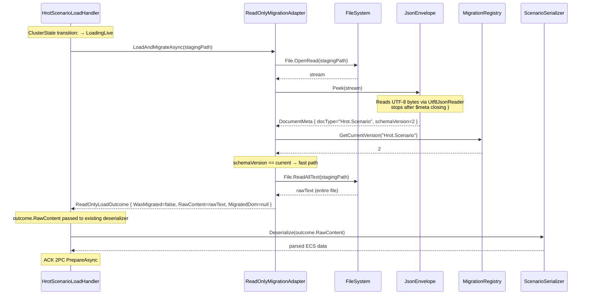
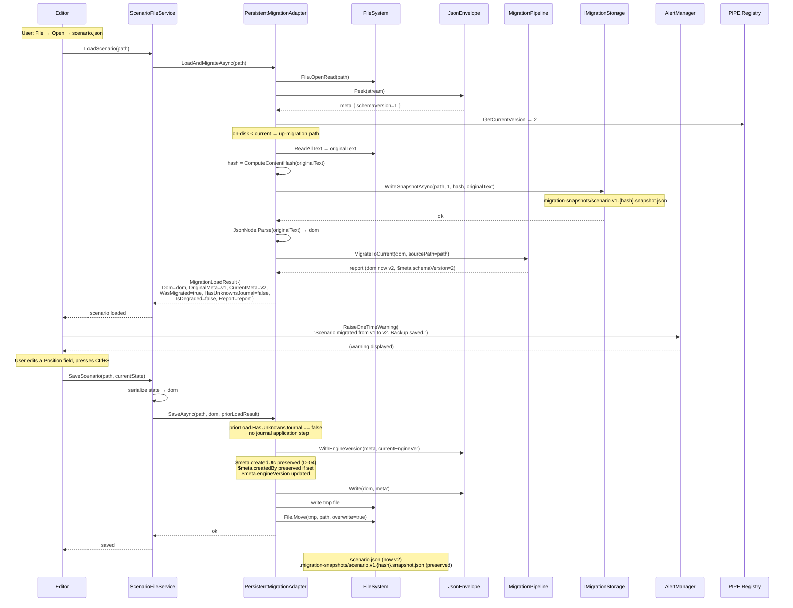
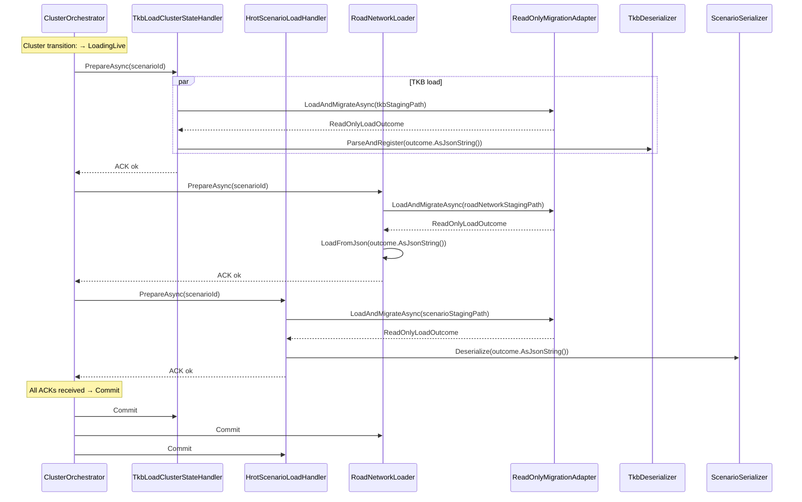

# Migration System — Design Overview

**Status:** Draft for architect approval
**Audience:** Engine architect (review), Coding agent (implementation orientation)
**Document set:** 1 of 7

---

## 1. Purpose

This document set describes the design of a JSON document migration system for the HROT engine. The system enables versioned JSON files authored by customers (scenarios, blueprints, behavior trees, TKB definitions, road networks, replay metadata) to remain readable and editable across binary versions of the engine, including across version downgrades.

The migration system is a generic infrastructure layer in `Fdp.Core`. Application-layer subsystems (`Hrot.Common.Scenario.Migrations`, etc.) supply format-specific migrators that the infrastructure orchestrates.

This document (01-overview) provides the orientation: the problem, the constraints, the architectural decisions, and a guide to the remaining documents in the set.

Other documents in the set:

- **02-wire-formats.md** — exact JSON shapes for `$meta`, snapshots, and journals; sidecar directory layout
- **03-interfaces.md** — public types, methods, contracts, and bootstrap wiring
- **04-behavioral-specs.md** — sequence diagrams, edge cases, and a fully worked example
- **05-integration-patches.md** — per-touchpoint changes to existing engine code
- **06-test-plan.md** — test categories, coverage matrix, fixture layout
- **07-rollout-plan.md** — phased delivery plan

---

## 2. Problem statement

### 2.1 Contractual obligations

The HROT engine is delivered to customers as a versioned binary distribution. Customers author scenarios (and other versioned JSON assets) in the editor, share them across sites via a shared NAS, and run them through the live cluster. Customer scenarios are contractually preserved across engine version changes.

The specific scenarios that must work:

1. **Forward compatibility.** A customer running engine v_n must be able to load and edit scenarios authored by any prior version v_1 through v_{n-1}.
2. **Backward compatibility (revert).** A customer running engine v_{n+1} may revert to engine v_n. Scenarios that were authored or modified under v_{n+1} must remain loadable and editable under v_n, with at-worst graceful degradation of v_{n+1}-only data.
3. **Round-trip preservation.** A scenario opened under v_{n+1}, then under v_n with edits, then under v_{n+1} again, must preserve all edits made under both versions without data loss.
4. **Side-by-side execution.** Two binary versions of the engine may operate against the same shared NAS scenario library concurrently (one running a live cluster, another running editing or CI tooling). Neither must destructively mutate files in a way that breaks the other.

### 2.2 What makes this hard

Several engine characteristics shape the design:

- **No historical DTOs are retained.** The codebase keeps only the latest C# types. Older shapes exist only as JSON-on-disk and as the migrator code that handles them. All migrators must operate on the raw `System.Text.Json.Nodes.JsonObject` DOM, not on typed DTOs.
- **The schema evolves frequently.** Component types are renamed, fields are added and removed, structural transformations (list → dictionary) occur with every engine release cycle. Migration ergonomics matter.
- **Multiple JSON formats follow different envelope conventions today.** Scenarios use `Header.SchemaVersion: "1.0"`; behavior trees use `Version: 1`; replay metadata uses `ProtocolVersion: 1`; TKB definitions and road networks have no version field at all. Unification across all formats is in scope (and feasible — engine is pre-ship).
- **Components are identified in JSON by short class name** (e.g., `"SimTransform"`). Renaming a component class is a breaking schema change that requires a migrator.
- **JSON casing is mixed within entity payloads.** `FdpAutoSerializer` uses PascalCase; some custom translators (e.g., `MissionPlanTranslator`) use camelCase. Migrators must be casing-aware.
- **Some fields contain stringified JSON.** `BehaviorParams` and `ExtensionJson` are escaped JSON strings nested inside the document. Migrators that touch them must unescape, transform, re-escape.
- **The cluster never writes to NAS.** Migration in cluster context is purely transient (in-memory) and must produce no sidecar files. The editor and CLI tooling are the only contexts that persist migration artifacts.
- **The live cluster uses a 2-Phase Commit pattern for state transitions.** Batch migration of related files (scenario + companion TKB + road network) hooks into this existing transactional machinery for atomic all-or-nothing behavior.

### 2.3 Scope

**In scope** — these formats receive migration machinery:

| Format | Authoring | Customer-facing | Migration adapter |
|---|---|---|---|
| Scenario | Editor | Yes | Read-only (cluster) + Persistent (editor, CLI) |
| TKB definition | Editor | Yes | Read-only (cluster) + Persistent (editor, CLI) |
| Road network | Editor | Yes | Read-only (cluster) + Persistent (editor, CLI) |
| Blueprint (`.bp.json`) | Editor | Yes | Persistent (editor, CLI) only — never loaded by cluster |
| Behavior tree (`.json`) | Editor | Yes | Persistent (editor, CLI) only — never loaded by cluster |
| Replay metadata (`.meta.json`) | Auto-generated | Yes (read-only) | Read-only (diagnostic tools) only |

**Out of scope** — these formats receive the unified `$meta` envelope for consistency but no migrator chain (passthrough registration):

| Format | Reason |
|---|---|
| StructEdit (`.json`) | Transient inspector UI sync; not persisted long-term |
| Map Interaction Configs | Transient DDS wire state |
| Orchestrator global context (`Orchestrator.json`) | Engine-internal scenario-tracking, not customer-facing |
| Test scripts | CI/CD artifacts, version in lockstep with binary |
| Node configuration | Deployment configuration, version in lockstep |

Passthrough registration means the format declares its current schema version and uses the envelope, but no migrator chain is registered. Loads pass through unchanged; saves stamp the current version.

---

## 3. Architectural decisions

This section records every load-bearing design decision and its rationale. Decisions are numbered for reference from other documents.

### D-01: Single unified envelope across all versioned formats

All versioned JSON documents in the engine carry a root-level `$meta` block:

```json
{
  "$meta": {
    "docType": "Hrot.Scenario",
    "schemaVersion": 4,
    "engineVersion": "0.7.2",
    "createdBy": "Hrot.Editor",
    "createdUtc": "2026-05-28T14:32:11Z"
  },
  ...
}
```

**Rationale:** Pre-ship status (no production data in the field) gives us a one-time opportunity to unify. Per-format envelopes create per-format peek logic, per-format quarantine paths, and per-format tooling. Unification yields a single migration pipeline that routes by `docType`, one CLI subcommand, one sidecar directory convention, one diagnostic format.

**Confirmation:** Architect, U2/U3/U4/U10 batch.

### D-02: `$` prefix for envelope, matching engine convention

The envelope field is named `$meta`, with index-based dotted document type strings (`Hrot.Scenario`, `Fdp.RoadNetwork`).

**Rationale:** The engine already uses `$guid` as a precedent in TKB files. Dotted document type names match existing `HrotSubsystemTypes` constants and .NET namespace conventions.

**Confirmation:** Architect, U3.1 and U3.3.

### D-03: Monotonic per-format integer schema versions

`schemaVersion` is a monotonic integer. Each document type has its own independent version sequence. There is no engine-wide global version.

**Rationale:** The `"1.0"` strings used today are checked for exact equality only — no semantic versioning logic exists in the codebase. Integers are simpler. Per-format independence matches how schemas actually evolve: a change to scenario components doesn't bump the road network version.

**Confirmation:** Architect, U4.1 and U4.2.

### D-04: Diagnostic-only fields in `$meta`

`engineVersion`, `createdBy`, and `createdUtc` are diagnostic fields. They are never read by migration logic. `engineVersion` is updated on every save to "the engine that last wrote these bytes." `createdUtc` is preserved across all migrations and saves as an immutable historical baseline.

**Rationale:** Support diagnostics: when a customer reports a failure, knowing the binary version that last touched the file is invaluable. Excluding these from migration logic prevents accidental behavioral coupling.

**Confirmation:** Architect, U4.3 and Point 5.

### D-05: DOM-based migration, not typed-DTO

Migrators operate on `System.Text.Json.Nodes.JsonObject` DOMs, mutating in place. They do not deserialize into typed DTOs.

**Rationale:** The codebase retains only the latest C# types (per B4). Typed-DTO migration is impossible without parallel `V1`/`V2`/`V3` namespaces, which the engine team has rejected. DOM operation also handles unknown fields naturally — required for the unknowns-journal mechanism (D-13).

**Confirmation:** Architect, B4.

### D-06: Adjacent-version migrators only

Each migrator transforms exactly one version step: `FromVersion = N`, `ToVersion = N ± 1`. Multi-step migrations (v1 → v4) compose adjacent migrators in sequence.

**Rationale:** Each migrator stays small, focused, individually testable, and reviewable. Multi-step chains are a runtime concern, not an authoring one. The cluster has no latency constraints on migration (per E3), so chain length is acceptable.

### D-07: Up and down migrators required per schema bump

Every schema version bump requires both an up-migrator (v_{n} → v_{n+1}) and a down-migrator (v_{n+1} → v_{n}), landing in the same PR with paired fixtures.

**Rationale:** The customer revert use case (binary downgrade) is contractually required. Without paired down-migrators, reverted-binary scenarios are unreadable.

**Confirmation:** Architect, G1 and revert-use-case discussion.

### D-08: Three load contexts, two adapter shapes

The system provides two adapter implementations:

- **`ReadOnlyMigrationAdapter`** — for cluster `PrepareAsync` loads and read-only diagnostic tooling. Migrates in-memory only. Writes no files. No snapshot, no journal.
- **`PersistentMigrationAdapter`** — for editor and migration CLI. Writes pre-up-migration snapshots and post-down-migration unknowns journals to a sidecar directory.

These map onto three load contexts:

| Context | Adapter | Examples |
|---|---|---|
| Cluster 2PC load | Read-only | `HrotScenarioLoadHandler`, `TkbLoadClusterStateHandler`, `RoadNetworkLoader` |
| Editor / CLI authoring | Persistent | `ScenarioFileService`, `BlueprintJsonServices`, `Hrot.ClusterRunner --mode migrate` |
| Diagnostic read-only | Read-only | `RecordingDumper`, `ReplayBrowserContext` |

**Rationale:** The cluster never writes to NAS, so persistence machinery is unnecessary overhead. The editor and CLI do write, and require the snapshot+journal mechanism for lossless round-trips.

**Confirmation:** Architect, post-matrix discussion.

### D-09: Cluster integration via existing 2PC `PrepareAsync`

Batch migration of related files in a scenario asset directory uses the cluster's existing 2-Phase Commit machinery. Each load handler runs migration during `PrepareAsync`. If any migration fails, the handler returns failure → cluster aborts → no NAS files are touched.

**Rationale:** The 2PC pattern is already established for cluster state transitions. Reusing it gives atomic batch behavior for free. Inventing a separate transaction layer would duplicate existing infrastructure.

**Confirmation:** Architect, U5.2.

### D-10: Lockstep cross-format load order

Cluster load order is fixed: TKB → Blueprints (already C#) → Road Networks → Behavior Trees (already C#) → Scenarios. Migration follows the same order — each format is migrated by its respective load handler, in order.

**Rationale:** This order is already enforced in the existing cluster bootstrap. Migration inherits it implicitly because each handler runs migration before passing to its existing deserializer.

**Confirmation:** Architect, U5.3.

### D-11: `Fdp.Core.Serialization.Migrations` houses the generic core

The migration infrastructure lives in `Fdp.Core` as a new namespace `Fdp.Core.Serialization.Migrations`. Format-specific migrators live in their respective application-layer assemblies (`Hrot.Common.Scenario.Migrations`, etc.).

**Rationale:** Multiple FDP-owned formats (Flight Recorder metadata, Road Networks) need migration. Putting the core in `Fdp.Core` makes it available across the entire engine without creating a new assembly (the engine convention is consolidated assemblies, per U6.1).

**Confirmation:** Architect, U6.1 and U6.2.

### D-12: Sidecar snapshots in `.migration-snapshots/` next to the authored file

The `PersistentMigrationAdapter` writes a verbatim copy of the original file into a `.migration-snapshots/` sidecar directory alongside the file, before any up-migration. Filename includes the source schema version and SHA-256 of original content.

```
scenarios/urban-combat/
├── scenario.json
├── tkb-default.json
├── roads-main.json
└── .migration-snapshots/
    ├── scenario.v1.a3f8e2b4....snapshot.json
    └── ...
```

**Rationale:** When a customer reverts to an older binary that cannot down-migrate a newer file (because it doesn't know about that newer version yet), the snapshot is the fallback. Co-locating sidecars with the authored file means they ride along in zip archives and git repositories without additional configuration.

**Confirmation:** Architect, G3 and post-matrix follow-up.

### D-13: Unknowns journal for lossless down-migration round-trips

When the persistent adapter performs a down-migration (newer file opened by older binary that *does* know about the version step), it computes a journal describing what was removed or transformed. The journal is written as a sidecar (`.unknowns.json`). On save-back, the journal restores the original higher-version shape, with the user's edits to lower-version-known fields preserved.

The journal is itself a versioned JSON document with its own `$meta` block (docType `"Fdp.MigrationJournal"`).

**Rationale:** Per the contractual requirement that downgrades are lossless. Without the journal, v_{n+1}-only fields would be silently dropped when an older binary saved.

**Confirmation:** Architect, G2.

### D-14: Down-migration produces valid v_{n-1} shape; journal carries the original

Down-migrators must produce JSON the older binary can deserialize without modification — they synthesize placeholder values where information was lost. The journal records both the placeholder paths to remove and the original paths to restore on save-back.

**Rationale:** If the down-migrator left invalid placeholders, the old engine would crash at load time. If it left the original shape, the old engine wouldn't recognize the components. The journal is the bridge: the file is valid for the old engine; the original is recoverable for the new engine.

**Worked example:** see document 04 §5 (NetworkSpawnRequest → TkbIdentity round-trip).

### D-15: Snapshot-fallback when down-migration is unavailable

If an older binary opens a much newer file (e.g., engine v_1 opens a v_3 file with no v_2→v_1 or v_3→v_2 migrator registered), the persistent adapter falls back to the highest snapshot at or below the current version. The customer sees the original v_1 state of the file. UI surfaces a warning that newer edits are not visible.

**Rationale:** Best-effort degradation. The customer gets *something* useable rather than a hard error. If they don't save, the v_3 file on disk remains untouched.

### D-16: User-deletion-wins during journal application

When applying a journal `Set` operation, if the parent path no longer exists in the user's edited DOM (user deleted the parent entity), the operation is skipped. This preserves the user's intent to delete.

**Rationale:** Without this rule, a user's deletion would be silently reversed by the journal. The journal exists to preserve unknown fields, not to override explicit user edits.

### D-17: Domain-specific `IMigrationStorage` abstraction, not global `IFileSystem`

The sidecar storage layer is abstracted via `IMigrationStorage` — a narrow, migration-specific interface. The default implementation uses `System.IO` directly; an in-memory implementation is provided for tests.

**Rationale:** The engine's convention is domain-specific storage providers (`IScenarioStorageProvider`, `ITkbStorageStrategy`), not a global `IFileSystem` abstraction. Following the convention keeps the migration layer consistent with the rest of the engine.

**Confirmation:** Architect, post-Phase-1 followup.

### D-18: `FdpLog<T>` for all migration logging

All migration code uses the static `FdpLog<T>` facade for logging, with index-based parameterized templates (`{0}`, `{1}`) for up to four arguments, and explicit `IsInfoEnabled` guards for more complex cases.

**Rationale:** Engine convention. `FdpLog<T>` is the high-performance NLog wrapper used across all core subsystems and is automatically captured by `DiagnosticsDumpProcessManager`.

**Confirmation:** Architect, post-Phase-1 followup.

### D-19: `engineVersion` source via assembly attribute

The persistent adapter's `engineVersionProvider` delegate reads `System.Reflection.AssemblyInformationalVersionAttribute` from a core anchor assembly (`typeof(Fdp.Core.EntityRepository).Assembly`).

**Rationale:** Engine convention. The same pattern is used by `ArchitectureDiagnosticsWindow`. Reading the compiled attribute is I/O-free and works on cluster nodes that may not have the source `version.txt` available.

**Confirmation:** Architect, version-source follow-up.

### D-20: Document types declared in domain-specific constant classes, not central enum

There is no central `DocumentTypes` enum or constant list inside the migration core. Each domain (FDP, HROT) maintains its own constants file (`FdpDocumentTypes`, `HrotDocumentTypes`), and registration with the `MigrationRegistry` happens at bootstrap.

**Rationale:** The migration core sits in `Fdp.Core`, which cannot reference HROT-layer types. A central enum would violate the dependency direction. The runtime registry enforces the "unknown doc type → error" contract without requiring centralized type knowledge.

**Confirmation:** Architect, U9.

---

## 4. System overview

### 4.1 Layered structure

```
┌──────────────────────────────────────────────────────────────────┐
│  Application Layer (HROT subsystems, Editor, CLI)                │
│  - Hrot.Common.Scenario.Migrations                               │
│  - Hrot.Common.Tkb.Migrations                                    │
│  - Hrot.AI.Behaviors.Migrations (Blueprints, Behavior Trees)     │
│  - Hrot.Map.Common.Migrations (Road Networks if HROT-side)       │
│  - Editor UI hooks, ClusterRunner CLI                            │
└────────────────────────────┬─────────────────────────────────────┘
                             │ depends on
                             ▼
┌──────────────────────────────────────────────────────────────────┐
│  Generic Migration Core (Fdp.Core.Serialization.Migrations)      │
│                                                                  │
│  - IJsonDocumentMigrator (the migrator contract)                 │
│  - MigrationRegistry (runtime doc-type → migrator chain)         │
│  - MigrationPipeline (composes and runs chains)                  │
│  - JsonEnvelope (peek/read/write $meta)                          │
│  - ReadOnlyMigrationAdapter (cluster, diagnostic tools)          │
│  - PersistentMigrationAdapter (editor, CLI)                      │
│  - IMigrationStorage / FileSystemMigrationStorage                │
│  - UnknownsJournal, SnapshotEntry                                │
└────────────────────────────┬─────────────────────────────────────┘
                             │ uses
                             ▼
┌──────────────────────────────────────────────────────────────────┐
│  FDP Foundation                                                  │
│  - System.Text.Json.Nodes (DOM)                                  │
│  - FdpLog<T> (logging)                                           │
│  - FdpJsonOptionsRegistry (serialization options)                │
│  - ComponentDiffService (DOM diffing — for journal computation)  │
└──────────────────────────────────────────────────────────────────┘
```

### 4.2 Component overview

```
   ┌─────────────────────┐         ┌──────────────────────┐
   │ MigrationRegistry   │◀────────│ JsonMigrationModule  │  (one per format)
   │ - doc types         │ register│ - HROT scenario      │
   │ - migrator chains   │  at     │ - Blueprint, etc.    │
   └──────────┬──────────┘bootstrap└──────────────────────┘
              │ queries
              ▼
   ┌─────────────────────┐
   │ MigrationPipeline   │     ┌─────────────────────────┐
   │ - composes chain    │◀────│ ReadOnlyAdapter         │  (cluster + diag tools)
   │ - runs migrators    │     │ - stream/file input     │
   │ - updates $meta     │     │ - in-memory only        │
   └──────────▲──────────┘     └─────────────────────────┘
              │
              │                ┌─────────────────────────┐
              │           ┌────│ PersistentAdapter       │  (editor + CLI)
              └───────────│    │ - load, snapshot,       │
                          │    │   journal write         │
                          │    │ - save with journal apply│
                          │    └─────┬───────────────────┘
                          │          │
                          ▼          ▼
              ┌──────────────────┐   ┌────────────────────┐
              │ JsonEnvelope     │   │ IMigrationStorage  │
              │ - $meta peek/    │   │ - snapshot R/W     │
              │   read/write     │   │ - journal R/W      │
              └──────────────────┘   │ - sidecar layout   │
                                     └────────────────────┘
```

### 4.3 The two adapters in action

**Read-only flow (cluster `PrepareAsync`):**

1. Cluster fetches file from NAS into local staging.
2. Load handler calls `ReadOnlyMigrationAdapter.LoadAndMigrateAsync(localPath)`.
3. Adapter reads file, peeks `$meta`, asks `MigrationPipeline` to migrate to current version.
4. Pipeline runs the chain in memory; returns mutated DOM.
5. Handler hands DOM to existing deserializer.
6. No sidecar files created. NAS untouched.

**Persistent flow (editor first-time open of older file):**

1. Editor calls `PersistentMigrationAdapter.LoadAndMigrateAsync(path)`.
2. Adapter reads file, peeks `$meta`. File is at v1, current is v2.
3. Adapter writes `scenario.v1.{hash}.snapshot.json` into `.migration-snapshots/`.
4. Pipeline migrates DOM v1 → v2.
5. Adapter returns `MigrationLoadResult { Dom, WasMigrated=true, ... }`.
6. Editor shows "Scenario was migrated from v1 to v2" warning.
7. (Later) Editor calls `SaveAsync(path, dom, priorResult)`.
8. Adapter atomically writes v2 DOM. Snapshot stays in sidecar.

**Persistent flow (editor opening newer file after binary revert):**

1. Editor calls `PersistentMigrationAdapter.LoadAndMigrateAsync(path)`.
2. Adapter reads file. File is at v2, current is v1.
3. Adapter checks registry for v2 → v1 down-migrator chain. Found.
4. Adapter computes journal by capturing pre-down-migration DOM, running down-migrator, diffing.
5. Adapter writes `scenario.v2.{hash}.unknowns.json` into `.migration-snapshots/`.
6. Returns `MigrationLoadResult { Dom (now v1-shaped), HasUnknownsJournal=true, ... }`.
7. Editor shows "Scenario is from a newer version; loaded with compatibility transformation".
8. (Later) Editor calls `SaveAsync(path, dom, priorResult)`.
9. Adapter applies journal to dom (Set+Remove operations), restoring v2 shape with user edits preserved.
10. Adapter atomically writes v2 DOM. Journal sidecar deleted (purpose served).

---

## 5. Decisions log summary

| # | Decision | Confirmation status |
|---|---|---|
| D-01 | Single unified `$meta` envelope across all formats | ✓ Confirmed |
| D-02 | `$meta` field name, dotted docType strings | ✓ Confirmed |
| D-03 | Monotonic per-format integer schemaVersion | ✓ Confirmed |
| D-04 | Diagnostic-only fields preserved across migrations | ✓ Confirmed |
| D-05 | DOM-based migration, not typed-DTO | ✓ Confirmed |
| D-06 | Adjacent-version migrators only | ✓ Confirmed |
| D-07 | Up + down migrators required per schema bump | ✓ Confirmed |
| D-08 | Two adapters: read-only (cluster, diag) + persistent (editor, CLI) | ✓ Confirmed |
| D-09 | Cluster integration via existing 2PC `PrepareAsync` | ✓ Confirmed |
| D-10 | Lockstep cross-format load order | ✓ Confirmed |
| D-11 | Generic core in `Fdp.Core.Serialization.Migrations` | ✓ Confirmed |
| D-12 | `.migration-snapshots/` sidecar next to authored file | ✓ Confirmed |
| D-13 | Unknowns journal for lossless down-migration | ✓ Confirmed |
| D-14 | Down-migrators produce valid v_{n-1}; journal carries original | ✓ Confirmed |
| D-15 | Snapshot-fallback when down-migration unavailable | ✓ Confirmed |
| D-16 | User-deletion-wins during journal application | ✓ Confirmed |
| D-17 | Domain-specific `IMigrationStorage`, not global `IFileSystem` | ✓ Confirmed |
| D-18 | `FdpLog<T>` for all migration logging | ✓ Confirmed |
| D-19 | `engineVersion` source: `AssemblyInformationalVersionAttribute` | ✓ Confirmed |
| D-20 | DocType constants in domain-specific files, no central enum | ✓ Confirmed |

All decisions are architect-confirmed. No open items at the design-overview level.

---

## 6. Constraints, non-goals, and assumptions

### 6.1 Hard constraints

- **No NAS writes from cluster.** The cluster's migration is purely in-memory. The 2PC `Abort` path must always leave the NAS untouched.
- **No external (non-.NET) parsers depend on current envelope shapes.** The unification rollout is purely an internal refactor.
- **No determinism violations.** Migrators must be deterministic — no wall-clock, no machine state, no unseeded randomness. This is required by the engine's deterministic CI mode.
- **Migrators must succeed or fail atomically per document.** Partial migration of a document is forbidden. Either the migrator produces a valid output DOM, or it throws.

### 6.2 Non-goals

- **No concurrent edit merge.** The unknowns journal mechanism handles the time-sequential revert case (v_{n+1} edit → revert → v_n edit → return to v_{n+1}). It does *not* handle two simultaneous editors of the same file. That use case is out of scope.
- **No schema-derived validation.** C# DTOs remain the source of truth. There is no JSON Schema validation step. The engine's existing `FdpJsonOptionsRegistry` deserialization is the validation gate.
- **No live-binary auto-update.** The system does not detect "you are running v_n on a v_{n+1} file" and auto-rebuild the binary. Customer reverts are explicit operator actions.
- **No migration of engine-shipped-only formats with real chains.** StructEdit, Orchestrator.json, etc., adopt the envelope but receive no migrator chains. They version in lockstep with the binary.

### 6.3 Assumptions

- The engine is currently pre-ship. The unification rollout breaks all existing JSON fixtures and they will be updated in lockstep.
- The `ComponentDiffService` in `Fdp.Toolkit.ReplayBrowser.Diff` is suitable as the journal-computation backend (per architect Point 6 confirmation), with a thin tree-walking adapter to flatten `DiffNode` output to JSONPath strings.
- The cluster's 2PC `PrepareAsync` / `Commit` / `Abort` pattern remains stable. Changes to that machinery are out of scope.
- `FdpLog<T>` will not gain `params object[]` overloads. Code that needs >4 args uses `IsInfoEnabled`-guarded interpolation.

---

## 7. Document set navigation

Subsequent documents provide the detail needed for implementation:

- **Wire formats and on-disk layout** (data contract for the coding agent) → 02-wire-formats.md
- **Interfaces and contracts** (the API the coding agent implements) → 03-interfaces.md
- **Behavioral specs and worked examples** (validation reference for the architect; algorithm reference for the agent) → 04-behavioral-specs.md
- **Integration patches** (per-touchpoint changes to existing engine code) → 05-integration-patches.md
- **Test plan** (coverage matrix and fixture design) → 06-test-plan.md
- **Rollout plan** (phased delivery) → 07-rollout-plan.md

The architect should be able to review this document in isolation to confirm the load-bearing decisions, then dip into specific subsequent documents as needed. The coding agent should read this document first for orientation, then 02 (wire formats) and 03 (interfaces) as the implementation specification.

---

*End of document 01-overview.md*
# Migration System — Wire Formats and Sidecar Layout

**Status:** Draft for architect approval
**Audience:** Engine architect (review), Coding agent (data-contract specification)
**Document set:** 2 of 7

---

## 1. Purpose

This document specifies the exact on-disk shapes the migration system produces and consumes. It is the canonical data contract.

Implementations of `JsonEnvelope`, `SnapshotEntry`, `UnknownsJournal`, and `IMigrationStorage` must conform to the shapes and conventions defined here. Test fixtures must follow the same conventions.

References to architectural decisions (`D-01`, etc.) point to `01-overview.md` §3.

---

## 2. The `$meta` envelope

### 2.1 Shape

Every versioned JSON document in the engine carries a single root-level `$meta` object. It is the first property of the root object by convention (writers should emit it first; readers must not depend on position).

```json
{
  "$meta": {
    "docType": "Hrot.Scenario",
    "schemaVersion": 4,
    "engineVersion": "0.7.2+build.847.a3f8e2b",
    "createdBy": "Hrot.Editor",
    "createdUtc": "2026-05-28T14:32:11.4827193Z"
  },
  "header": { ... },
  ...
}
```

### 2.2 Field specification

| Field | Type | Required | Cardinality | Description |
|---|---|---|---|---|
| `docType` | string | Yes | One | Document type identifier. Routes to the correct migrator chain. |
| `schemaVersion` | integer | Yes | One | Monotonic per-format version. Minimum value 1. |
| `engineVersion` | string | No | Zero or one | Diagnostic: the engine build that last wrote these bytes. |
| `createdBy` | string | No | Zero or one | Diagnostic: the tool that authored or last wrote the file. |
| `createdUtc` | string (ISO-8601) | No | Zero or one | Diagnostic: when the file was first authored. Immutable across migrations and saves. |

Additional fields beyond these five MUST be rejected by the envelope reader. Migrators that need to carry metadata across migrations use the document body, not the envelope.

### 2.3 Field semantics

#### `docType`

- Format: dotted PascalCase identifier matching .NET namespace conventions.
- Example values: `"Hrot.Scenario"`, `"Hrot.Blueprints"`, `"Hrot.BehaviorTree"`, `"Hrot.Tkb"`, `"Fdp.RoadNetwork"`, `"Fdp.FlightRecorder.Metadata"`, `"Fdp.MigrationJournal"`.
- Comparison: case-sensitive ordinal. Readers MUST NOT case-fold.
- Length: at least one segment containing one or more characters; no maximum but conventionally under 64 characters.
- Reserved prefixes: `"Fdp."` for engine-owned formats; `"Hrot."` for HROT-application-owned formats. Other applications adopting the infrastructure should use their own reserved prefix.
- When absent or empty, the envelope is considered malformed and `MigrationException` is thrown by the envelope reader.

#### `schemaVersion`

- Format: positive integer (JSON number with no fractional part).
- Comparison: numeric, not lexical. `2` and `10` are distinct versions; `10 > 2`.
- Version `0` is reserved and must not appear in files.
- Negative values, fractional values, and non-numeric values are malformed.
- The first shipped version of any new format is `1`.

#### `engineVersion`

- Format: free-form string. By engine convention, this is the value of `AssemblyInformationalVersionAttribute` on the `Fdp.Core` anchor assembly.
- Typical content: semantic version with build metadata (e.g., `"0.7.2+build.847.a3f8e2b"`).
- Updated on every save by the `PersistentMigrationAdapter` and the `Fdp.Tools.RecordingDumper` (and any other writer).
- Cluster `ReadOnlyMigrationAdapter` does not write, so does not update this field.
- Migrators MUST NOT read this field. It carries no semantic information for migration logic.

#### `createdBy`

- Format: free-form string identifying the writing tool.
- Examples: `"Hrot.Editor"`, `"Hrot.ClusterRunner"`, `"Hrot.ClusterRunner --mode migrate"`, `"Fdp.Tools.RecordingDumper"`.
- Set on initial file creation. Preserved across subsequent saves (writers SHOULD NOT overwrite a non-empty `createdBy`).
- Migrators MUST NOT read this field.

#### `createdUtc`

- Format: ISO-8601 with `Z` UTC suffix and at least millisecond precision. The engine convention is round-trip format (`"O"` specifier), which produces seven-digit fractional seconds.
- Example: `"2026-05-28T14:32:11.4827193Z"`.
- Set on initial file creation. **Immutable across all subsequent migrations and saves.** Writers MUST preserve any non-empty `createdUtc` they read.
- If absent (legacy file written before the unification rollout), writers MAY populate it on first save with the file's filesystem creation timestamp, but this is a best-effort recovery and not required.
- Migrators MUST NOT read this field.

### 2.4 What migrators may NOT touch in `$meta`

A migrator's `Apply` method may modify the document body. With respect to `$meta`:

- `schemaVersion` is updated automatically by the `MigrationPipeline` after each step; migrators MUST NOT modify it directly.
- `engineVersion`, `createdBy`, `createdUtc` MUST NOT be modified by migrators.
- `docType` MUST NOT be modified by migrators. Document type changes are not supported (a format rename requires a one-time external migration tool, not a migrator).

If a migrator attempts to modify any of these fields, the pipeline detects the discrepancy after the migrator returns and throws `MigrationException`.

### 2.5 Peeking the envelope

Cheap peek (without parsing the full document body) is supported via:

- `JsonEnvelope.Peek(string jsonText)` → `DocumentMeta`
- `JsonEnvelope.Peek(Stream jsonStream)` → `DocumentMeta`

Both stop reading after the `$meta` object closes. Implementations use `System.Text.Json.Utf8JsonReader` in streaming mode rather than loading the full DOM. This matters for the cluster load path, which may encounter very large scenario files and wants to make routing decisions quickly.

If `$meta` is not the first property of the root object, the peek MAY load enough of the document to find it. Performance in this case degrades gracefully — readers MUST still find the envelope wherever it appears at root level.

### 2.6 Worked example: scenario file

```json
{
  "$meta": {
    "docType": "Hrot.Scenario",
    "schemaVersion": 2,
    "engineVersion": "0.7.2+build.847.a3f8e2b",
    "createdBy": "Hrot.Editor",
    "createdUtc": "2026-04-15T10:00:00.0000000Z"
  },
  "header": {
    "tkbName": "DefaultTkb"
  },
  "zones": {
    "main": {
      "roadNetwork": "main-roads.json",
      "terrainDbId": "berlin-default"
    }
  },
  "entities": {
    "3702ba5f-04ea-40e0-b1ee-893931426e75": {
      "TkbIdentity": { "TkbType": 101 },
      "SimTransform": {
        "Position": [120.5, 0.0, 230.1],
        "Rotation": [0, 0, 0, 1]
      }
    }
  }
}
```

Note that `header.subsystemType` and `header.schemaVersion` from the pre-unification scenario format are **removed**. The envelope replaces them. `header.tkbName` remains because it is authoring data, not envelope plumbing.

---

## 3. Sidecar directory layout

### 3.1 Location

The `.migration-snapshots/` directory sits alongside the authored file, in the same containing directory:

```
scenarios/urban-combat/
├── scenario.json
├── tkb-default.json
├── roads-main.json
└── .migration-snapshots/
    ├── scenario.v1.a3f8e2b4....snapshot.json
    ├── scenario.v3.b7c1d9e2....unknowns.json
    ├── tkb-default.v1.f4a2... .snapshot.json
    └── roads-main.v1.92ce... .snapshot.json
```

Per D-12: one shared sidecar directory per asset directory, holding sidecars for all formats in that directory.

The `.` prefix is intentional: on POSIX filesystems this hides the directory from default `ls`. On Windows it has no special meaning but is conventional for sidecar/auxiliary data. Engine tooling that copies asset directories (zip export, NAS sync) must include the sidecar.

### 3.2 Creation

The `.migration-snapshots/` directory is created on demand by `IMigrationStorage` when the first sidecar is written for that asset directory. It is never created speculatively. Empty `.migration-snapshots/` directories are not produced by the migration system; their presence indicates either a manual creation or a deletion of all sidecars without removing the directory.

Creation is idempotent — calling create-if-not-exists when the directory already exists is a no-op.

### 3.3 Concurrency

The cluster (per D-08, D-09) does not write to the sidecar directory. Editor instances and CLI tools may. Within the engine's expected deployment model:

- Only one editor instance at a time edits a given asset directory.
- The migration CLI runs as a one-shot batch operation, not concurrently with the editor.

The migration storage layer does NOT implement file locking or concurrent-write resolution. If multiple writers race on the same sidecar, last-write-wins. This is acceptable because:

- Snapshot writes are content-addressed (filename includes hash); racing writers producing identical content produce identical files.
- Journal writes for the same source content produce identical journals (the diff is deterministic).
- Different writers on different source content races produce different filenames and don't conflict.

---

## 4. Snapshot files

### 4.1 Purpose

A snapshot is a verbatim, byte-for-byte preservation of an original file before any up-migration is performed against it (per D-12). It serves two purposes:

1. **Fallback for unsupported down-migration** (D-15): when an older binary opens a much newer file and has no down-migrator path, the highest snapshot at or below its current version becomes the load source.
2. **Audit trail**: snapshots provide a verifiable history of every authored version of a file. They are not pruned automatically by the migration system.

### 4.2 Filename convention

```
{originalBaseName}.v{sourceVersion}.{contentHash}.snapshot.json
```

Where:

| Component | Description |
|---|---|
| `originalBaseName` | The original file's base name without extension. For `scenario.json`, this is `scenario`. |
| `sourceVersion` | The integer `$meta.schemaVersion` of the snapshot's content. |
| `contentHash` | First 16 hex characters of the lowercase SHA-256 of the original file's UTF-8 encoded bytes. |

Examples:

- `scenario.v1.a3f8e2b4c1d5f7e9.snapshot.json`
- `tkb-default.v2.4c8b1d3e2f9a6071.snapshot.json`

The hash truncation to 16 hex characters (64 bits) is sufficient for collision resistance in this use case — collisions would require ~2^32 snapshots in one asset directory.

### 4.3 Content

A snapshot file's content is the original file's bytes, verbatim. The migration system does not re-serialize, reformat, or modify the content in any way.

```
+----------------------------------------------+
| original scenario.json (UTF-8 bytes)         |
| ↓                                            |
| copy bytes verbatim                          |
| ↓                                            |
| .migration-snapshots/                        |
|     scenario.v{N}.{hash16}.snapshot.json     |
+----------------------------------------------+
```

This means the snapshot's own `$meta.schemaVersion` matches the version in the filename — the filename is canonical for snapshot lookup, the content is canonical for actual loading.

### 4.4 Verification on read

When `IMigrationStorage.FindBestSnapshotAsync` returns a `SnapshotEntry`, the implementation MUST:

1. Read the snapshot file's content.
2. Compute SHA-256 of the content, truncate to 16 hex characters.
3. Compare against the hash embedded in the filename.
4. On mismatch, throw `MigrationException` with message indicating snapshot tampering.

This protects against silent corruption (disk errors, manual edits, partial restoration from backup).

### 4.5 Selection

`IMigrationStorage.FindBestSnapshotAsync(originalPath, maxVersion)` returns:

- The snapshot in the relevant `.migration-snapshots/` directory whose `sourceVersion` is the **largest value ≤ maxVersion**.
- If multiple snapshots exist with the same `sourceVersion` (different content hashes — meaning the file was up-migrated multiple times with different intermediate content), the implementation returns the one written most recently by file timestamp.
- If no snapshot satisfies `sourceVersion ≤ maxVersion`, returns `null`.

Example:

```
.migration-snapshots/
├── scenario.v1.a3f8....snapshot.json   (sourceVersion=1)
├── scenario.v2.b7c1....snapshot.json   (sourceVersion=2)
└── scenario.v3.4c8b....snapshot.json   (sourceVersion=3)

FindBestSnapshotAsync(maxVersion=2) → v2 entry
FindBestSnapshotAsync(maxVersion=1) → v1 entry
FindBestSnapshotAsync(maxVersion=4) → v3 entry
FindBestSnapshotAsync(maxVersion=0) → null
```

### 4.6 Lifecycle

- Created: by `PersistentMigrationAdapter` immediately before performing an up-migration.
- Read: by `PersistentMigrationAdapter` during snapshot-fallback (D-15).
- Deleted: never by the migration system. Customers and tooling may clean up sidecars manually.

The migration system provides no garbage collection. Long-term retention is a customer storage management concern.

---

## 5. Unknowns journal files

### 5.1 Purpose

An unknowns journal records the difference between a higher-version DOM and the lower-version DOM produced by a down-migration. On save-back, the journal is replayed to restore the higher-version shape (per D-13, D-14).

### 5.2 Filename convention

```
{originalBaseName}.v{sourceVersion}.{contentHash}.unknowns.json
```

Where:

| Component | Description |
|---|---|
| `originalBaseName` | The original file's base name without extension. |
| `sourceVersion` | The integer `$meta.schemaVersion` of the source file (before down-migration). |
| `contentHash` | First 16 hex characters of SHA-256 of the source file's UTF-8 bytes. |

Examples:

- `scenario.v2.b7c1d9e2f4a86075.unknowns.json`
- `scenario.v4.92cea51b3d7f1c08.unknowns.json`

The `sourceVersion` and `contentHash` jointly identify which file version this journal undoes. A journal is only valid against a `PersistentMigrationAdapter` load result that matches both.

### 5.3 Content

The journal is itself a versioned JSON document with its own `$meta` envelope (docType `"Fdp.MigrationJournal"`).

```json
{
  "$meta": {
    "docType": "Fdp.MigrationJournal",
    "schemaVersion": 1,
    "engineVersion": "0.7.2+build.847.a3f8e2b",
    "createdBy": "Hrot.Editor",
    "createdUtc": "2026-05-28T15:00:00.0000000Z"
  },
  "sourceDocType": "Hrot.Scenario",
  "sourceFileVersion": 2,
  "downMigratedToVersion": 1,
  "sourceContentHash": "b7c1d9e2f4a86075",
  "operations": [
    {
      "kind": "Set",
      "path": "$.entities['3702ba5f-04ea-40e0-b1ee-893931426e75'].TkbIdentity",
      "value": { "TkbType": 101 }
    },
    {
      "kind": "Remove",
      "path": "$.entities['3702ba5f-04ea-40e0-b1ee-893931426e75'].NetworkSpawnRequest"
    },
    {
      "kind": "Set",
      "path": "$.entities['8a91c2e4-7733-4912-b04a-15c8d39e2102'].TkbIdentity",
      "value": { "TkbType": 102 }
    },
    {
      "kind": "Remove",
      "path": "$.entities['8a91c2e4-7733-4912-b04a-15c8d39e2102'].NetworkSpawnRequest"
    }
  ]
}
```

### 5.4 Field specification

| Field | Type | Required | Description |
|---|---|---|---|
| `$meta` | object | Yes | Standard envelope. docType is `"Fdp.MigrationJournal"`, schemaVersion is `1` for the format defined here. |
| `sourceDocType` | string | Yes | The docType of the file this journal was generated from. |
| `sourceFileVersion` | integer | Yes | The schemaVersion of the source file before down-migration. |
| `downMigratedToVersion` | integer | Yes | The schemaVersion the source was down-migrated to. |
| `sourceContentHash` | string | Yes | First 16 hex of SHA-256 of the source file's content, matching the filename. |
| `operations` | array | Yes | Ordered list of journal operations. May be empty (in which case the journal is not written — see §5.7). |

### 5.5 Operation objects

Each `operations` element has:

| Field | Type | Required | Description |
|---|---|---|---|
| `kind` | string | Yes | Either `"Set"` or `"Remove"`. |
| `path` | string | Yes | JSONPath in the dialect specified in §6. |
| `value` | any JSON | For `Set` only | The value to restore at `path`. Absent for `Remove`. |

`Set` operations restore a value: at save time, the value at `path` is set to the journal's `value`, replacing whatever the user's edits left there.

`Remove` operations delete a path: at save time, the property at `path` is removed from the document.

Operations are applied in a defined order — see §7.

### 5.6 The journal's own version

The journal format itself has schema version `1`. If the format ever evolves (new operation kinds, new top-level fields), the journal format's schemaVersion bumps and `Fdp.MigrationJournal` gets its own migrators. This is dogfooding: the migration system migrates its own sidecar files.

The pipeline registers `"Fdp.MigrationJournal"` with currentVersion `1` and no migrators at the system's initial release (see 03-interfaces §X for bootstrap details).

### 5.7 Empty journals are not written

If a down-migration produces zero operations (i.e., the down-migrator removed nothing and added nothing — the migration was purely a rename or a structural rearrangement that round-trips perfectly), the journal file is NOT written. This avoids cluttering the sidecar directory with empty files.

If the journal is empty, the persistent adapter signals `MigrationLoadResult.HasUnknownsJournal = false`, and `SaveAsync` performs no journal application step.

### 5.8 Lifecycle

- Created: by `PersistentMigrationAdapter` after a successful down-migration, if the operation count is greater than zero.
- Read: by `PersistentMigrationAdapter` during save-back, to restore the higher-version shape.
- Deleted: by `PersistentMigrationAdapter` after successful save-back. The journal has served its purpose; the save-back file is the source of truth going forward.

If the editor session ends without saving (user closes without saving), the journal stays in the sidecar directory. The next load of the same file will:

1. Detect that the file's content hash still matches the journal's `sourceContentHash` (the file wasn't modified externally).
2. Reuse the existing journal rather than recomputing.

If the file's content hash has changed (the file was modified externally), the existing journal is stale; the adapter deletes it and recomputes.

### 5.9 Verification on read

`IMigrationStorage.FindJournalAsync(originalPath, sourceContentHash)` returns:

- The journal whose filename contains the matching `sourceContentHash`, or `null` if none.

The implementation MUST verify:

1. The journal's own `$meta.docType` is `"Fdp.MigrationJournal"`.
2. The journal's `sourceContentHash` field matches the value embedded in the filename.
3. The journal's `sourceContentHash` matches the hash of the actual source file content.

If any check fails, the journal is treated as corrupt and `MigrationException` is thrown.

---

## 6. JSONPath dialect for journal operations

### 6.1 Why JSONPath

Journal operations need to address arbitrary nodes in a DOM. JSONPath is the standard for this. The migration system uses a restricted, well-defined subset rather than the full JSONPath specification.

### 6.2 Supported syntax

The path always starts with `$` representing the root document. From the root, paths are constructed with two access operators:

| Syntax | Meaning |
|---|---|
| `.identifier` | Object member access where the key is a valid JSON identifier. |
| `['key']` | Object member access where the key contains characters not valid in an identifier (hyphens, GUIDs, dots, spaces). |
| `[N]` | Array index access. `N` is a non-negative integer. |

**Identifier rules:** A "valid JSON identifier" in this dialect is `[A-Za-z_][A-Za-z0-9_]*`. Any key that contains characters outside this set MUST be bracket-quoted.

### 6.3 Examples

| Path | Resolves to |
|---|---|
| `$.entities` | Root's `entities` property. |
| `$.entities['3702ba5f-04ea-40e0-b1ee-893931426e75']` | Entity by GUID key. Bracket-quoted because GUIDs contain hyphens. |
| `$.entities['3702ba5f-04ea-40e0-b1ee-893931426e75'].TkbIdentity` | The TkbIdentity component on that entity. |
| `$.zones['main'].roadNetwork` | A zone's road network reference. |
| `$.entities['3702ba5f-...'].MissionPlan.PlanData.tasks[0].behaviorParams` | Nested mixed access. |

### 6.4 Escaping in bracket-quoted segments

Within `['...']`:

- The key is delimited by single quotes.
- A literal single quote in the key is encoded as `\'`.
- A literal backslash in the key is encoded as `\\`.
- No other escapes are recognized.

For example, a key `the cat's pyjamas` is written as `['the cat\'s pyjamas']`.

### 6.5 Unsupported features

The migration system's JSONPath dialect deliberately omits:

| Feature | JSONPath syntax | Reason for omission |
|---|---|---|
| Wildcards | `$.entities.*` | Journal operations target specific paths, not patterns. |
| Recursive descent | `$..TkbIdentity` | Same reason. |
| Filters | `$.entities[?(@.foo == 'bar')]` | Same reason; would require expression evaluation. |
| Slice | `[1:5]` | Same reason. |
| Negative indices | `[-1]` | Same reason; ambiguous semantics on save-back. |

A path containing any unsupported syntax is rejected by the path parser with `MigrationException`.

### 6.6 Path parser

A reference grammar (informal):

```
path        := "$" segment*
segment     := dotted-segment | bracketed-segment
dotted-segment    := "." identifier
identifier        := [A-Za-z_] [A-Za-z0-9_]*
bracketed-segment := "[" ( quoted-key | array-index ) "]"
quoted-key        := "'" ( escaped-char | non-special-char )* "'"
escaped-char      := "\\" ( "'" | "\\" )
non-special-char  := any character except "'" and "\\"
array-index       := [0-9]+
```

### 6.7 Path application semantics

Given a path `P` and a DOM `D`:

**Reading** (for `Set` operations, capturing the source value):

1. Start at `D`'s root.
2. For each segment in order, navigate one step.
3. If at any point the current node is not the expected kind for the next segment (e.g., dotted segment on an array, bracketed key on a non-object), throw `MigrationException`.
4. If at any point a key or index doesn't exist, return `null`. (This signals that the source DOM doesn't contain the path — which for `Set` operations during journal computation means there's no value to capture.)

**Writing** (for `Set` operations during journal apply):

1. Navigate to the parent (all segments except the last).
2. If any intermediate segment's target doesn't exist, **skip the operation** (per D-16, user-deletion-wins).
3. If the parent exists, set the final segment's key/index to the operation's `value`.

**Removing** (for `Remove` operations during journal apply):

1. Navigate to the parent.
2. If the parent doesn't exist, skip (user-deletion-wins).
3. If the parent exists and the final key/index is present, remove it.
4. If the final key/index is absent (already removed by user edits), the operation is a no-op.

### 6.8 Path canonicalization

When building paths from object keys (during journal computation):

- If a key matches the identifier regex `[A-Za-z_][A-Za-z0-9_]*`, emit `.key` form.
- Otherwise, emit `['key']` form with quote/backslash escaping.

When parsing, both forms produce equivalent navigation. Writers MUST emit the canonical form; readers MUST accept either.

---

## 7. Journal application order

When a journal is applied to a DOM during save-back, operations execute in this order:

1. **All `Set` operations first**, in journal order.
2. **All `Remove` operations second**, in journal order.

### 7.1 Why this order

Consider the `NetworkSpawnRequest → TkbIdentity` worked example:

- The down-migration replaced `TkbIdentity` with a placeholder `NetworkSpawnRequest`.
- The journal contains: Set `TkbIdentity` to original value, Remove `NetworkSpawnRequest`.

If the user deleted the entire entity in their v_n session, both operations have a missing parent. Applying them in any order produces the correct result (no-op for both).

If the user did NOT delete the entity, applying Remove first would briefly leave the entity with no component (between Remove and Set). Applying Set first leaves the entity with both `TkbIdentity` and `NetworkSpawnRequest` between operations, but this is a transient state inside `SaveAsync`. Either way, the final post-save state is `TkbIdentity` present, `NetworkSpawnRequest` absent.

The "Set then Remove" order is mandated for one specific case: when the journal contains both `Set $.X.Y` and `Remove $.X`. Applying Remove first removes `$.X`, then Set finds the parent missing and skips, losing data. Applying Set first sets `$.X.Y` correctly, then Remove removes `$.X` including the just-set `$.X.Y`. This case shouldn't arise in well-formed journals (down-migrators that produce such conflicting operations are buggy), but the order ensures predictable behavior if it does: the explicit `Remove` wins.

### 7.2 Atomicity

Journal application is not transactional with respect to the DOM. If an individual operation throws (which should only happen for malformed paths, since user-deletion is handled by skipping), the partial application leaves the DOM in an intermediate state. The save-back wrapper catches this and throws `MigrationException` without writing the file; the original on-disk file is untouched.

---

## 8. Encoding and serialization conventions

### 8.1 Character encoding

All migration-system-produced JSON files are UTF-8 encoded. No BOM. Writers MUST NOT emit a BOM; readers MUST tolerate one if present (for compatibility with files that picked up a BOM from external editing).

### 8.2 Formatting

Sidecar files (snapshots, journals) are written in indented form for human readability. Indentation is two spaces. Newline is `\n`.

Snapshot files are written byte-for-byte from the original — formatting is whatever the original had. The migration system does not reformat snapshot content.

Saved migrated files use the format conventions of their writing tool — `ScenarioFileService.SaveScenario` uses `JsonAestheticFormatter`, `BlueprintJsonServices.Serialize` uses its own convention, etc. The migration system does not impose formatting on the writers.

### 8.3 Number precision

JSON numbers in migrated DOMs preserve the precision of the source. Migrators MUST NOT introduce rounding. The `System.Text.Json.Nodes` types preserve numbers as `JsonValue` wrappers around the underlying types without lossy conversion.

### 8.4 Property ordering

The migration system does not impose property ordering on document bodies. Migrators may add or remove properties at any position. When writing the envelope, writers SHOULD emit `$meta` as the first property to enable efficient `JsonEnvelope.Peek`.

---

## 9. Document type constants

### 9.1 FDP-owned types

Defined in `Fdp.Core.Serialization.FdpDocumentTypes`:

```csharp
public static class FdpDocumentTypes
{
    public const string FlightRecorderMetadata = "Fdp.FlightRecorder.Metadata";
    public const string RoadNetwork            = "Fdp.RoadNetwork";
    public const string MigrationJournal       = "Fdp.MigrationJournal";
}
```

### 9.2 HROT-owned types

Defined in `Hrot.Common.Scenario.HrotDocumentTypes` (expanded from the existing `HrotSubsystemTypes`):

```csharp
public static class HrotDocumentTypes
{
    // Versioned customer-authored documents (migration chain registered)
    public const string Scenario     = "Hrot.Scenario";
    public const string Blueprint    = "Hrot.Blueprints";
    public const string BehaviorTree = "Hrot.BehaviorTree";
    public const string TkbDefinition = "Hrot.Tkb";

    // Engine-shipped-only formats (passthrough registration only)
    public const string StructEdit                = "Hrot.StructEdit";
    public const string MapInteractionConfig      = "Hrot.MapInteractionConfig";
    public const string OrchestratorContext       = "Hrot.OrchestratorContext";
    public const string TestScript                = "Hrot.TestScript";
    public const string NodeConfiguration         = "Hrot.NodeConfiguration";

    // Subsystem identifiers (existing values from HrotSubsystemTypes; not doc types
    // but kept in this namespace for routing consistency)
    public const string SimHostSubsystem = "Hrot.SimHost";
    public const string CgfSubsystem     = "Hrot.CGF";
    public const string IgSubsystem      = "Hrot.IG";
}
```

### 9.3 Reservation rules

- Document type values MUST be added to the appropriate constants file before being used in JSON files. Hardcoded strings in migrators or serializers are forbidden.
- New domains (e.g., a future `Anthropic.Foo` consumer of this infrastructure) MUST use their own reserved prefix and their own constants file.
- Renaming a document type value (e.g., `"Hrot.Scenario"` → `"Hrot.MissionScenario"`) is a breaking change that requires a one-time external migration. The migration system itself does not support docType renames.

---

## 10. Summary

This document has specified:

- The exact `$meta` envelope shape, field semantics, and immutability rules.
- The `.migration-snapshots/` sidecar directory layout and concurrency model.
- The snapshot file format, filename convention, and verification protocol.
- The unknowns journal file format, operation kinds, lifecycle, and application order.
- The JSONPath dialect for journal operations, including its parser grammar.
- Encoding and serialization conventions across the system.
- The document type constant organization and reservation rules.

The next document, `03-interfaces.md`, specifies the C# types and method contracts that produce and consume these wire formats.

---

*End of document 02-wire-formats.md*
# Migration System — Interfaces and Contracts

**Status:** Revised per architect feedback; ready for final approval
**Audience:** Engine architect (review), Coding agent (implementation specification)
**Document set:** 3 of 7

**Revision notes (this revision):**
- Resolved M-1: pure diff types moved to `Fdp.Core.Serialization.Migrations.Internal.Diff`.
- Resolved M-2: per-host scoped registration with explicit format matrix in §8.3.
- `MigrationContext` scope mechanism rewritten to carry JSONPath fragments; warnings and exceptions auto-capture the current path (§3.5–§3.7).
- `JsonEnvelope.Peek` gained `ReadOnlySpan<byte>` and refined `Stream` overloads using `Utf8JsonReader` streaming (§3.3).
- `ReadOnlyMigrationAdapter` returns a discriminated `ReadOnlyLoadOutcome` for the fast (no-migration) vs slow (migrated DOM) paths (§7.1).
- Empty-journal rule codified in `PersistentMigrationAdapter` and `IMigrationStorage` contracts (§7.2, §5.1).

---

## 1. Purpose

This document is the complete API specification for the migration system. It defines every public type, method, contract, exception, and bootstrap wiring point.

The coding agent uses this document to implement against. The architect uses it to validate that the API surface matches the design intent established in document 01.

References:
- `D-NN` → architectural decision in `01-overview.md` §3.
- `W-NN` → section in `02-wire-formats.md`.

### Conventions

- **Type declarations are complete.** What is shown here is the full public surface; the coding agent supplies private members and method bodies.
- **Method signatures use `async Task<T>` where any I/O occurs.** Synchronous methods are explicit.
- **All public types live in `Fdp.Core.Serialization.Migrations` unless otherwise noted.**
- **All async APIs accept `CancellationToken` (default `default`).**
- **All exceptions thrown by these APIs are `MigrationException` (a subclass of `InvalidOperationException`) unless otherwise noted.** Cancellation tokens may produce `OperationCanceledException` as standard.

---

## 2. Assembly and namespace layout

### 2.1 New types in `Fdp.Core`

```
Fdp.Core/
├── Serialization/
│   ├── FdpDocumentTypes.cs             (new — string constants)
│   └── Migrations/                     (new namespace)
│       ├── IJsonDocumentMigrator.cs
│       ├── MigrationDirection.cs
│       ├── DocumentMeta.cs
│       ├── JsonEnvelope.cs
│       ├── MigrationRegistry.cs
│       ├── MigrationPipeline.cs
│       ├── MigrationContext.cs
│       ├── MigrationReport.cs
│       ├── MigrationWarning.cs
│       ├── MigrationException.cs
│       ├── MigrationServices.cs
│       ├── MigrationBootstrap.cs
│       ├── IMigrationStorage.cs
│       ├── FileSystemMigrationStorage.cs
│       ├── InMemoryMigrationStorage.cs
│       ├── SnapshotEntry.cs
│       ├── Adapters/
│       │   ├── ReadOnlyMigrationAdapter.cs
│       │   ├── PersistentMigrationAdapter.cs
│       │   └── MigrationLoadResult.cs
│       └── Internal/                   (internal access modifier)
│           ├── UnknownsJournal.cs
│           ├── JournalOperation.cs
│           ├── JournalOpKind.cs
│           ├── JsonPath.cs
│           ├── JsonPathParser.cs
│           ├── JsonPathApplicator.cs
│           ├── ScopePathStack.cs       (path stack for MigrationContext scopes)
│           ├── Diff/                   (extracted from Fdp.Toolkit.ReplayBrowser.Diff per M-1)
│           │   ├── DiffNode.cs
│           │   ├── DiffObject.cs
│           │   ├── DiffValue.cs
│           │   └── DomDiffer.cs        (the pure diff algorithm)
│           ├── DiffToJournalConverter.cs
│           └── HashUtilities.cs
```

### 2.2 New types in `Hrot.Common`

```
Hrot.Common/
├── Scenario/
│   ├── HrotDocumentTypes.cs            (expanded from HrotSubsystemTypes)
│   └── Migrations/                     (new namespace)
│       ├── ScenarioMigrationModule.cs
│       ├── BlueprintMigrationModule.cs
│       ├── BehaviorTreeMigrationModule.cs
│       ├── TkbMigrationModule.cs
│       ├── RoadNetworkMigrationModule.cs        (or Hrot.Map.Common.Migrations)
│       ├── PassthroughFormatsModule.cs
│       ├── Helpers/
│       │   ├── EntityPatch.cs
│       │   ├── NestedJsonPatch.cs
│       │   └── CasingPolicy.cs
│       └── Migrators/
│           ├── Scenario/
│           │   ├── V1ToV2_NetworkSpawnRequest_To_TkbIdentity.cs
│           │   └── V2ToV1_TkbIdentity_To_NetworkSpawnRequest.cs
│           └── ... (per format, per version step)
```

### 2.3 Dependencies

```
Hrot.Common.Scenario.Migrations
    │
    ├──► Fdp.Core.Serialization.Migrations         (the API in this document)
    ├──► Hrot.Common.Scenario.HrotDocumentTypes    (string constants)
    └──► Hrot.Map.Definitions, etc.                (for component-name knowledge)


Fdp.Core.Serialization.Migrations
    │
    ├──► System.Text.Json.Nodes                    (DOM)
    └──► Fdp.Core.Logging.FdpLog<T>                (logging)


Fdp.Toolkit.ReplayBrowser.Diff (existing)
    │
    └──► Fdp.Core.Serialization.Migrations.Internal.Diff
         (the pure diff algorithm; ReplayBrowser keeps its UI adapters)
```

**Dependency direction resolved (M-1):** The pure DOM-diffing logic (`DiffNode`, `DiffObject`, `DiffValue`, and the core diff algorithm) is extracted from `Fdp.Toolkit.ReplayBrowser.Diff` and moved down into `Fdp.Core.Serialization.Migrations.Internal.Diff`. `ReplayBrowser` retains its existing UI-specific adapters and consumes the diff types from `Fdp.Core` going forward. This restores the standard `Fdp.Core ← Fdp.Toolkits` dependency direction.

The extraction is a Phase 1 work item, not a pre-existing capability. See document 07 for sequencing.

---

## 3. Core types

### 3.1 `MigrationDirection`

```csharp
namespace Fdp.Core.Serialization.Migrations;

/// <summary>
/// Indicates whether a migrator transforms a document to a higher
/// or lower schema version.
/// </summary>
public enum MigrationDirection
{
    /// <summary>Migrator transforms from FromVersion to ToVersion where ToVersion = FromVersion + 1.</summary>
    Up,

    /// <summary>Migrator transforms from FromVersion to ToVersion where ToVersion = FromVersion - 1.</summary>
    Down
}
```

### 3.2 `DocumentMeta`

```csharp
namespace Fdp.Core.Serialization.Migrations;

/// <summary>
/// The contents of a JSON document's <c>$meta</c> envelope. Carries the
/// document type identifier and schema version (load-bearing for migration
/// routing) plus optional diagnostic fields preserved across saves but
/// never inspected by migrators.
/// </summary>
/// <remarks>
/// See wire-format spec 02-wire-formats.md §2 for field semantics and
/// immutability rules. The <c>$meta</c> block is the first property of the
/// root object by convention; <see cref="JsonEnvelope.Peek"/> exploits this
/// for streaming peek without full-document parsing.
/// </remarks>
public sealed record DocumentMeta(
    string DocType,
    int SchemaVersion,
    string? EngineVersion = null,
    string? CreatedBy = null,
    DateTime? CreatedUtc = null);
```

**Constraints:**
- `DocType` is non-null and non-empty. Constructor throws `ArgumentException` if violated.
- `SchemaVersion` is at least 1. Constructor throws `ArgumentOutOfRangeException` if violated.
- `CreatedUtc`, when non-null, has `Kind == DateTimeKind.Utc`. Constructor coerces unspecified/local to UTC interpretation but emits a warning via `FdpLog<DocumentMeta>` if the input wasn't UTC.

### 3.3 `JsonEnvelope`

```csharp
namespace Fdp.Core.Serialization.Migrations;

/// <summary>
/// Reads and writes the <c>$meta</c> envelope on JSON documents. Provides
/// streaming peek overloads that complete after reading the closing <c>}</c>
/// of the <c>$meta</c> object, so cluster load handlers can make routing
/// decisions without allocating the full document DOM.
/// </summary>
public static class JsonEnvelope
{
    /// <summary>The reserved property name used for the envelope.</summary>
    public const string MetaFieldName = "$meta";

    /// <summary>
    /// Reads the envelope from a UTF-8 byte span using <see cref="Utf8JsonReader"/>
    /// in streaming mode. Reads forward only as far as needed to capture the
    /// envelope. Does NOT allocate a full DOM.
    /// </summary>
    /// <remarks>
    /// This is the preferred fast-path peek. Cluster load handlers should
    /// memory-map or read-to-bytes the file and call this overload, deciding
    /// whether to parse the full DOM only after the envelope confirms a
    /// migration is required.
    /// </remarks>
    /// <exception cref="MigrationException">
    /// Thrown when the envelope is missing, malformed, or contains
    /// disallowed extra fields.
    /// </exception>
    public static DocumentMeta Peek(ReadOnlySpan<byte> utf8JsonBytes);

    /// <summary>
    /// Reads the envelope from a forward-readable UTF-8 stream. Reads only
    /// enough bytes to capture the envelope; the caller's stream position
    /// after return is undefined (typically partway through the document).
    /// Does NOT allocate a full DOM.
    /// </summary>
    /// <param name="jsonStream">
    /// Forward-readable stream of UTF-8 JSON bytes. The caller owns the
    /// stream's lifetime; this method does not dispose it.
    /// </param>
    /// <exception cref="MigrationException">As <see cref="Peek(ReadOnlySpan{byte})"/>.</exception>
    public static DocumentMeta Peek(Stream jsonStream);

    /// <summary>
    /// Convenience overload that converts the string to UTF-8 bytes and
    /// delegates to the span-based peek. Allocates a byte array for the
    /// conversion; prefer the span or stream overload on the hot path.
    /// </summary>
    public static DocumentMeta Peek(string jsonText);

    /// <summary>
    /// Reads the envelope from an already-parsed DOM. Cheapest peek when
    /// the DOM is already in hand (e.g., during in-pipeline migrator
    /// invariant checks).
    /// </summary>
    /// <exception cref="MigrationException">
    /// Thrown when the root has no <c>$meta</c> property, or the property
    /// is malformed.
    /// </exception>
    public static DocumentMeta Read(JsonObject root);

    /// <summary>
    /// Writes the envelope to a DOM, replacing any existing <c>$meta</c>.
    /// The envelope is written as the first property of the root object.
    /// </summary>
    /// <remarks>
    /// Modifies <paramref name="root"/> in place. If a non-envelope property
    /// named "$meta" was already present, it is overwritten without warning.
    /// </remarks>
    public static void Write(JsonObject root, DocumentMeta meta);

    /// <summary>
    /// Returns true if <paramref name="root"/> has a recognizable <c>$meta</c>
    /// envelope. Does not validate the envelope's internal correctness;
    /// only checks for presence of the property as an object.
    /// </summary>
    public static bool HasEnvelope(JsonObject root);

    /// <summary>
    /// Returns a new <see cref="DocumentMeta"/> with <c>SchemaVersion</c>
    /// updated and other fields preserved. Used by the pipeline after a
    /// migration step. Does not modify the DOM; use <see cref="Write"/>
    /// to persist the change.
    /// </summary>
    public static DocumentMeta WithSchemaVersion(DocumentMeta meta, int newVersion);

    /// <summary>
    /// Returns a new <see cref="DocumentMeta"/> with <c>EngineVersion</c>
    /// updated and other fields preserved. Used at save time by writers.
    /// </summary>
    public static DocumentMeta WithEngineVersion(DocumentMeta meta, string newVersion);
}
```

**Streaming peek requirement:** The span and stream overloads MUST use `System.Text.Json.Utf8JsonReader` in forward-only streaming mode. They MUST complete after reading the closing `}` of the `$meta` object — they MUST NOT continue parsing into the document body.

If `$meta` is not the first property at root level, the streaming peek MAY consume more of the document to locate it (up to the closing `}` of the root object as a worst case), but MUST still avoid allocating intermediate DOM nodes. This degraded path is logged at Warning via `FdpLog<JsonEnvelope>`.

If the envelope is malformed (extra fields, wrong types, missing required fields), the streaming peek MUST throw `MigrationException` without falling through to a DOM-based fallback. Malformed envelopes are a hard failure, not a routing-decision question.

### 3.4 `IJsonDocumentMigrator`

```csharp
namespace Fdp.Core.Serialization.Migrations;

/// <summary>
/// Transforms a JSON document one schema version forward or backward.
/// Implementations are stateless DOM transformations; they receive the
/// pre-migration DOM and mutate it in place.
/// </summary>
/// <remarks>
/// Implementations MUST be deterministic. Identical input DOMs MUST produce
/// identical output DOMs across runs, machines, and processes. No dependence
/// on wall-clock time, hostname, environment variables, or unseeded random
/// number generators is permitted.
/// </remarks>
public interface IJsonDocumentMigrator
{
    /// <summary>
    /// The document type this migrator handles, e.g. <c>"Hrot.Scenario"</c>.
    /// Must match the value of <c>$meta.docType</c> in target documents.
    /// </summary>
    string DocType { get; }

    /// <summary>
    /// The schema version this migrator reads from.
    /// </summary>
    int FromVersion { get; }

    /// <summary>
    /// The schema version this migrator produces. MUST equal
    /// <see cref="FromVersion"/> ± 1; only adjacent-version migrators
    /// are supported (D-06).
    /// </summary>
    int ToVersion { get; }

    /// <summary>
    /// Whether this migrator transforms forward or backward.
    /// </summary>
    MigrationDirection Direction { get; }

    /// <summary>
    /// Applies the transformation. <paramref name="root"/> is mutated in place.
    /// </summary>
    /// <remarks>
    /// The migrator MUST NOT modify the <c>$meta</c> envelope. The pipeline
    /// updates <c>$meta.schemaVersion</c> automatically after the migrator returns.
    /// Modifications detected after return cause the pipeline to throw
    /// <see cref="MigrationException"/>.
    ///
    /// Recoverable conditions should be reported via <see cref="MigrationContext.Report"/>
    /// (notes, warnings); unrecoverable conditions throw <see cref="MigrationException"/>.
    /// </remarks>
    /// <exception cref="MigrationException">
    /// The document contains data the migrator cannot process (e.g., a required
    /// field is missing, a value is out of expected range).
    /// </exception>
    void Apply(JsonObject root, MigrationContext ctx);
}
```

**Implementation invariants** (enforced by the pipeline after each call):

1. `root["$meta"]` is unchanged in identity (the migrator did not replace the envelope object).
2. `DocumentMeta.Read(root).DocType` matches the migrator's `DocType`.
3. `DocumentMeta.Read(root).SchemaVersion` equals the migrator's `FromVersion` (the migrator did not modify the version).
4. `DocumentMeta.Read(root).EngineVersion`, `CreatedBy`, `CreatedUtc` are unchanged.

Violations of any of these throw `MigrationException` after the migrator returns.

### 3.5 `MigrationContext`

```csharp
namespace Fdp.Core.Serialization.Migrations;

/// <summary>
/// Per-migration mutable state passed to each migrator. Provides:
/// - A report builder for structured notes and warnings.
/// - The source file path, when the migration originated from a file.
/// - A JSONPath scope stack for iteration-style migrators (per-entity, per-zone).
/// </summary>
/// <remarks>
/// The scope stack records the current location within the DOM as a JSONPath
/// fragment. When a migrator iterates entities and pushes a per-entity scope,
/// any warning or exception raised inside the scope is automatically tagged
/// with the current JSONPath (e.g., <c>$.entities['3702ba5f-...']</c>). This
/// makes failures traceable to specific document locations without
/// migrators manually constructing path strings.
/// </remarks>
public sealed class MigrationContext
{
    /// <summary>The report being built up by the migrators in this run.</summary>
    public MigrationReport Report { get; }

    /// <summary>
    /// Source file path, if the migration originated from a file load.
    /// Null for stream-backed migrations. Used in log messages and
    /// exception details.
    /// </summary>
    public string? SourcePath { get; }

    /// <summary>
    /// The current JSONPath, built by concatenating all active scope segments
    /// onto <c>"$"</c>. Returns <c>"$"</c> when no scopes are active.
    /// Used by <see cref="MigrationReport.AddWarning"/> and exception
    /// construction to tag entries with their document location.
    /// </summary>
    public string CurrentPath { get; }

    /// <summary>
    /// Pushes a JSONPath segment onto the scope stack. The segment is appended
    /// to <see cref="CurrentPath"/> using the canonical form rules from
    /// 02-wire-formats §6.8 (dotted when the key is a valid identifier;
    /// bracketed-quoted otherwise).
    /// </summary>
    /// <param name="segmentKey">
    /// The object key or array index for the scope. String keys are encoded
    /// using canonical form; numeric arguments would use array-index form
    /// (use the <see cref="WithIndex"/> overload).
    /// </param>
    /// <returns>
    /// A disposable scope. Disposing pops the segment. Use as
    /// <c>using var _ = ctx.WithItem(entityGuid);</c>.
    /// Scopes may nest arbitrarily deeply.
    /// </returns>
    public IDisposable WithItem(string segmentKey);

    /// <summary>
    /// Pushes an array-index segment onto the scope stack. Use for migrators
    /// that iterate JSON arrays (e.g., per-task within MissionPlan.tasks).
    /// </summary>
    public IDisposable WithIndex(int index);

    /// <summary>
    /// Pushes an arbitrary, pre-canonicalized JSONPath suffix onto the stack.
    /// The suffix MUST begin with either a dot or a bracket and be valid
    /// per the JSONPath dialect (02-wire-formats §6).
    /// Use for multi-segment scope pushes; prefer <see cref="WithItem"/>
    /// for single-segment cases.
    /// </summary>
    public IDisposable WithPathSuffix(string suffix);

    // Constructor is internal — the pipeline creates the context per migration run.
    internal MigrationContext(string docType, string? sourcePath);
}
```

**Scope behavior specification:**

- `CurrentPath` always starts at `"$"` (the document root).
- Pushing `WithItem("entities")` makes `CurrentPath = "$.entities"`.
- Pushing `WithItem("3702ba5f-04ea-40e0-b1ee-893931426e75")` on top makes `CurrentPath = "$.entities['3702ba5f-04ea-40e0-b1ee-893931426e75']"` (bracketed because the key contains hyphens).
- Pushing `WithItem("TkbIdentity")` on top makes `CurrentPath = "$.entities['3702ba5f-...'].TkbIdentity"` (dotted because the key is a valid identifier).
- Dispose order is LIFO. Scopes pushed in nested `using` blocks unwind correctly.
- Path canonicalization rules (02 §6.8) are applied consistently between scope-built paths and journal operation paths, so the two are interchangeable for diagnostic purposes.

**Warning capture:**

When a migrator calls `ctx.Report.AddWarning("missing field")` inside a scope, the resulting `MigrationWarning` is constructed with `Path = ctx.CurrentPath`. When a migrator throws `MigrationException` inside a scope, the exception's `Path` property is populated automatically by the pipeline (the pipeline catches, augments, and rethrows).

### 3.6 `MigrationReport` and `MigrationWarning`

```csharp
namespace Fdp.Core.Serialization.Migrations;

/// <summary>
/// Structured summary of what a single migration run accomplished.
/// Built up by migrators via <see cref="MigrationContext.Report"/> and
/// returned to callers in <see cref="MigrationLoadResult"/>.
/// </summary>
public sealed class MigrationReport
{
    public string DocType { get; }
    public int FromVersion { get; }
    public int ToVersion { get; }
    public MigrationDirection Direction { get; }

    /// <summary>Total wall-clock duration of the migration chain.</summary>
    public TimeSpan Duration { get; }

    /// <summary>
    /// Free-form human-readable notes added by migrators. Surfaced in
    /// editor UI confirmation dialogs and the migration CLI output.
    /// </summary>
    public IReadOnlyList<string> Notes { get; }

    /// <summary>
    /// Warnings raised during migration that did not prevent completion.
    /// Each warning captures the JSONPath active at the time it was raised,
    /// so operators can locate the affected document position.
    /// </summary>
    public IReadOnlyList<MigrationWarning> Warnings { get; }

    /// <summary>Adds a note. Called by migrators.</summary>
    public void AddNote(string note);

    /// <summary>
    /// Adds a warning. Called by migrators. The current JSONPath from
    /// <see cref="MigrationContext.CurrentPath"/> is captured automatically.
    /// </summary>
    public void AddWarning(string message);

    // Constructor is internal.
    internal MigrationReport(string docType, int fromVersion, int toVersion, MigrationDirection direction);
}

/// <summary>
/// A non-fatal warning raised by a migrator. The <see cref="Path"/> is the
/// JSONPath active at the moment the warning was raised
/// (<see cref="MigrationContext.CurrentPath"/>).
/// </summary>
public sealed record MigrationWarning(string Message, string Path);
```

### 3.7 `MigrationException`

```csharp
namespace Fdp.Core.Serialization.Migrations;

/// <summary>
/// Thrown for unrecoverable migration failures. Extends
/// <see cref="InvalidOperationException"/> for compatibility with the
/// engine's existing fail-loud exception pattern in cluster load handlers
/// and the editor's global alert modal.
/// </summary>
public class MigrationException : InvalidOperationException
{
    /// <summary>The document type involved, if known.</summary>
    public string? DocType { get; }

    /// <summary>The source schema version, if known.</summary>
    public int? FromVersion { get; }

    /// <summary>The target schema version, if known.</summary>
    public int? ToVersion { get; }

    /// <summary>The source file path, if the migration was file-backed.</summary>
    public string? SourcePath { get; }

    /// <summary>
    /// The JSONPath where the failure occurred, if a scope was active
    /// when the exception was raised. Populated automatically by the
    /// pipeline from <see cref="MigrationContext.CurrentPath"/>.
    /// Null if the failure was not within a scope (e.g., chain-level error).
    /// </summary>
    public string? Path { get; }

    public MigrationException(string message);
    public MigrationException(string message, Exception innerException);
    public MigrationException(
        string message,
        string? docType,
        int? fromVersion,
        int? toVersion,
        string? sourcePath,
        string? path,
        Exception? innerException = null);
}
```

**Message conventions:**

- Messages start with a `[ScenarioMigration]` / `[BlueprintMigration]` / `[TkbMigration]` style tag for filtering in logs and UI.
- Messages include the failing path, value, or condition.
- Stack-tracable inner exceptions are preserved when wrapping lower-level errors.

---

## 4. Registry and pipeline

### 4.1 `MigrationRegistry`

```csharp
namespace Fdp.Core.Serialization.Migrations;

/// <summary>
/// Runtime registry of document types and their migrator chains. Populated
/// during bootstrap by domain-specific modules (one per format-owning subsystem).
/// The migration core does not know which doc types exist at compile time;
/// types are registered explicitly.
/// </summary>
/// <remarks>
/// Thread safety: the registry is immutable after bootstrap. The
/// <see cref="RegisterDocType"/> and <see cref="RegisterPassthroughDocType"/>
/// methods MUST be called from a single thread before the registry is exposed
/// to any pipeline or adapter. Read methods (<see cref="GetCurrentVersion"/>,
/// <see cref="GetPath"/>, etc.) are safe for concurrent calls.
/// </remarks>
public sealed class MigrationRegistry
{
    /// <summary>
    /// Registers a document type with its current schema version and the
    /// complete set of adjacent-version migrators (both up and down).
    /// </summary>
    /// <param name="docType">The document type identifier, e.g. <c>"Hrot.Scenario"</c>.</param>
    /// <param name="currentVersion">
    /// The current schema version. At least 1. Migrators MUST cover all
    /// adjacent steps from 1 to <paramref name="currentVersion"/> in both
    /// directions (if currentVersion > 1).
    /// </param>
    /// <param name="migrators">
    /// All migrators for this docType. Both up and down migrators for every
    /// step 1→2, 2→1, 2→3, 3→2, etc. Order is irrelevant; the registry
    /// indexes by (FromVersion, ToVersion).
    /// </param>
    /// <exception cref="MigrationException">
    /// Thrown if: the docType is already registered; any migrator's DocType
    /// doesn't match; the migrator set has gaps (e.g., missing 2→3 when
    /// currentVersion is 3); the migrator set has duplicates; any migrator's
    /// ToVersion is not FromVersion ± 1.
    /// </exception>
    public void RegisterDocType(
        string docType,
        int currentVersion,
        IEnumerable<IJsonDocumentMigrator> migrators);

    /// <summary>
    /// Registers a document type that uses the <c>$meta</c> envelope but has
    /// no migration logic. Loads pass through unchanged; saves stamp the
    /// current version. Used for engine-shipped-only formats (D-01 §2.3).
    /// </summary>
    /// <exception cref="MigrationException">
    /// Thrown if the docType is already registered.
    /// </exception>
    public void RegisterPassthroughDocType(string docType, int currentVersion);

    /// <summary>True if the given docType has been registered (either kind).</summary>
    public bool IsRegistered(string docType);

    /// <summary>
    /// Returns the current schema version registered for the docType.
    /// </summary>
    /// <exception cref="MigrationException">If the docType is not registered.</exception>
    public int GetCurrentVersion(string docType);

    /// <summary>
    /// True if the docType is registered as passthrough (no migrators).
    /// </summary>
    /// <exception cref="MigrationException">If the docType is not registered.</exception>
    public bool IsPassthrough(string docType);

    /// <summary>
    /// Returns the ordered list of migrators to apply to go from
    /// <paramref name="fromVersion"/> to <paramref name="toVersion"/>.
    /// </summary>
    /// <remarks>
    /// For fromVersion == toVersion, returns an empty list.
    /// For fromVersion &lt; toVersion, returns up-migrators in order.
    /// For fromVersion &gt; toVersion, returns down-migrators in order.
    /// </remarks>
    /// <exception cref="MigrationException">
    /// If the docType is not registered, is passthrough, or the chain
    /// is incomplete (should be impossible given <see cref="RegisterDocType"/>'s
    /// validation, but defensively checked).
    /// </exception>
    public IReadOnlyList<IJsonDocumentMigrator> GetPath(
        string docType, int fromVersion, int toVersion);

    /// <summary>
    /// True if a migration path exists from <paramref name="fromVersion"/>
    /// to <paramref name="toVersion"/>. Used by the persistent adapter
    /// to decide between down-migration and snapshot fallback.
    /// </summary>
    public bool CanMigrate(string docType, int fromVersion, int toVersion);

    /// <summary>
    /// Enumerates all registered document types. Used by diagnostic tools
    /// and the CLI to list migration support.
    /// </summary>
    public IEnumerable<string> RegisteredDocTypes { get; }
}
```

**Registration validation** (in `RegisterDocType`):

1. `docType` is non-null and non-empty.
2. `currentVersion >= 1`.
3. `migrators` is non-null but may be empty if `currentVersion == 1`.
4. For each migrator: `DocType` matches the registration's `docType`.
5. For each migrator: `Math.Abs(ToVersion - FromVersion) == 1`.
6. For each version step `k` in `[1, currentVersion-1]`: exactly one Up migrator with `FromVersion=k, ToVersion=k+1` exists, and exactly one Down migrator with `FromVersion=k+1, ToVersion=k` exists.
7. No two migrators have the same `(FromVersion, ToVersion)` pair.

### 4.2 `MigrationPipeline`

```csharp
namespace Fdp.Core.Serialization.Migrations;

/// <summary>
/// Runs migrations on in-memory DOMs. Stateless; safe to share across threads.
/// Does no file I/O — that is the adapter's concern.
/// </summary>
public sealed class MigrationPipeline
{
    public MigrationPipeline(MigrationRegistry registry);

    /// <summary>
    /// Migrates the DOM to the current registered version for its docType.
    /// Reads <c>$meta</c> from <paramref name="root"/> to determine the source
    /// version and doc type.
    /// </summary>
    /// <param name="root">The DOM. Mutated in place.</param>
    /// <param name="sourcePath">Optional source file path for diagnostics.</param>
    /// <returns>
    /// A report describing what was done. The DOM <paramref name="root"/>
    /// is the result; its <c>$meta.schemaVersion</c> reflects the post-migration
    /// version.
    /// </returns>
    /// <exception cref="MigrationException">
    /// The envelope is missing or malformed; the docType is not registered;
    /// no migration path exists from the source version to current; a migrator
    /// throws; a migrator violates an invariant (touched <c>$meta</c>, etc.).
    /// </exception>
    public MigrationReport MigrateToCurrent(JsonObject root, string? sourcePath = null);

    /// <summary>
    /// Migrates the DOM to a specific target version (up or down).
    /// </summary>
    /// <param name="targetVersion">The version to migrate to. Must be at least 1.</param>
    /// <returns>A report. If the source is already at <paramref name="targetVersion"/>,
    /// the report has zero notes/warnings and zero duration.</returns>
    /// <exception cref="MigrationException">
    /// As <see cref="MigrateToCurrent"/>; additionally if no path exists from
    /// the source to <paramref name="targetVersion"/>.
    /// </exception>
    public MigrationReport MigrateTo(JsonObject root, int targetVersion, string? sourcePath = null);
}
```

**Pipeline execution sequence** (for `MigrateToCurrent`):

1. Read `$meta` from `root` via `JsonEnvelope.Read`. (Throws on malformed envelope.)
2. Look up current version for the docType via `registry.GetCurrentVersion`. (Throws if unregistered.)
3. If source version == current version: return empty report, no work.
4. If registered as passthrough: return empty report, no work. (Passthrough at non-current versions is unreachable because passthrough formats can't be at a different version.)
5. Obtain migrator chain via `registry.GetPath`. (Throws if no path.)
6. Construct `MigrationContext` and `MigrationReport`.
7. For each migrator in chain:
   - Record the pre-call envelope snapshot for invariant checking.
   - Call `migrator.Apply(root, context)`.
   - Check invariants 1-4 from §3.4. Throw on violation.
   - Update `$meta.schemaVersion` to migrator's `ToVersion`.
   - Log per-step completion via `FdpLog<MigrationPipeline>.Debug`.
8. Return the report.

---

## 5. Storage layer

### 5.1 `IMigrationStorage`

```csharp
namespace Fdp.Core.Serialization.Migrations;

/// <summary>
/// Abstracts the storage of original files and sidecar artifacts
/// (snapshots, journals). Follows the engine's domain-specific
/// storage-provider pattern (D-17).
/// </summary>
/// <remarks>
/// The default implementation, <see cref="FileSystemMigrationStorage"/>,
/// uses raw <c>System.IO</c> calls. An in-memory implementation,
/// <see cref="InMemoryMigrationStorage"/>, is provided for unit tests.
///
/// All paths are interpreted relative to the implementation's root.
/// The default implementation resolves them as absolute filesystem paths.
/// </remarks>
public interface IMigrationStorage
{
    /// <summary>
    /// Reads the original file's UTF-8 content. Returns null if the file
    /// does not exist.
    /// </summary>
    Task<string?> ReadOriginalAsync(
        string originalPath,
        CancellationToken ct = default);

    /// <summary>
    /// Atomically writes the migrated content back to the original location.
    /// Implementations MUST use a temp-and-move pattern to prevent corruption
    /// on process interruption.
    /// </summary>
    Task WriteOriginalAsync(
        string originalPath,
        string content,
        CancellationToken ct = default);

    /// <summary>
    /// Writes a snapshot into the <c>.migration-snapshots/</c> sidecar
    /// directory alongside the original. Creates the sidecar directory
    /// if necessary. See 02-wire-formats §4 for filename conventions.
    /// </summary>
    /// <param name="originalPath">Path of the file being snapshotted.</param>
    /// <param name="sourceVersion">The schema version of the snapshot's content.</param>
    /// <param name="contentHash">
    /// First 16 hex chars of SHA-256 of the content. Embedded in the filename.
    /// </param>
    /// <param name="content">Verbatim UTF-8 bytes of the original file.</param>
    Task WriteSnapshotAsync(
        string originalPath,
        int sourceVersion,
        string contentHash,
        string content,
        CancellationToken ct = default);

    /// <summary>
    /// Returns the snapshot in the sidecar directory whose source version
    /// is the largest value at or below <paramref name="maxVersion"/>.
    /// Returns null if no usable snapshot exists.
    /// </summary>
    /// <remarks>
    /// The implementation MUST verify the snapshot's content hash against
    /// the value embedded in its filename. On mismatch, throws
    /// <see cref="MigrationException"/> (snapshot corruption).
    /// </remarks>
    Task<SnapshotEntry?> FindBestSnapshotAsync(
        string originalPath,
        int maxVersion,
        CancellationToken ct = default);

    /// <summary>
    /// Writes the unknowns journal sidecar. See 02-wire-formats §5.
    /// </summary>
    /// <remarks>
    /// Callers MUST NOT pass an empty journal (Operations.Count == 0).
    /// Per 02 §5.7 and architect feedback, empty journals are not written
    /// to storage — the adapter checks operation count before calling this.
    /// Implementations MAY (and the default does) reject empty journals
    /// with <see cref="ArgumentException"/> as a defense-in-depth check.
    /// </remarks>
    /// <exception cref="ArgumentException">
    /// Thrown by the default implementation if <c>journal.Operations.Count == 0</c>.
    /// </exception>
    Task WriteJournalAsync(
        string originalPath,
        UnknownsJournal journal,
        CancellationToken ct = default);

    /// <summary>
    /// Returns the journal whose <c>sourceContentHash</c> matches the
    /// given hash, or null if none exists.
    /// </summary>
    /// <remarks>
    /// The implementation MUST verify the journal's own <c>$meta</c> envelope
    /// (docType is <c>"Fdp.MigrationJournal"</c>) and the consistency of the
    /// <c>sourceContentHash</c> embedded in the filename vs. the journal body.
    /// On mismatch, throws <see cref="MigrationException"/>.
    /// </remarks>
    Task<UnknownsJournal?> FindJournalAsync(
        string originalPath,
        string sourceContentHash,
        CancellationToken ct = default);

    /// <summary>
    /// Deletes a journal file. Called after a successful save-back that
    /// consumed the journal.
    /// </summary>
    Task DeleteJournalAsync(
        string originalPath,
        UnknownsJournal journal,
        CancellationToken ct = default);
}
```

### 5.2 `FileSystemMigrationStorage`

```csharp
namespace Fdp.Core.Serialization.Migrations;

/// <summary>
/// Default <see cref="IMigrationStorage"/> backed by <c>System.IO</c>.
/// Uses temp-and-move atomic writes; lays out sidecars in
/// <c>.migration-snapshots/</c> next to the original file.
/// </summary>
public sealed class FileSystemMigrationStorage : IMigrationStorage
{
    public FileSystemMigrationStorage();

    // Implements every method on IMigrationStorage using raw File.*,
    // Directory.*, etc. Throws MigrationException wrapping any IOException
    // that prevents the operation from succeeding (file not found is NOT
    // wrapped — those return null per interface contract).
}
```

**Atomic write protocol** (used by `WriteOriginalAsync` and write paths in `WriteSnapshotAsync` / `WriteJournalAsync`):

1. Compute target path.
2. Compute temp path: `targetPath + ".tmp." + Guid.NewGuid().ToString("N").Substring(0, 8)`.
3. Write content to temp path.
4. `File.Move(tempPath, targetPath, overwrite: true)`.
5. If any step fails, attempt to delete the temp file (best effort), then throw.

### 5.3 `InMemoryMigrationStorage`

```csharp
namespace Fdp.Core.Serialization.Migrations;

/// <summary>
/// Dictionary-backed <see cref="IMigrationStorage"/> for unit tests.
/// All "files" are held in memory. No filesystem I/O.
/// </summary>
public sealed class InMemoryMigrationStorage : IMigrationStorage
{
    public InMemoryMigrationStorage();

    /// <summary>
    /// Pre-populates the storage with an original file. Used in test
    /// arrange-act-assert setup.
    /// </summary>
    public void Seed(string originalPath, string content);

    /// <summary>
    /// Pre-populates the storage with a snapshot. The filename is computed
    /// from the parameters using the same convention as
    /// <see cref="FileSystemMigrationStorage"/>.
    /// </summary>
    public void SeedSnapshot(string originalPath, int sourceVersion, string content);

    /// <summary>
    /// Returns true if a snapshot for the given path and version exists.
    /// Used in test assertions.
    /// </summary>
    public bool HasSnapshot(string originalPath, int sourceVersion);

    /// <summary>
    /// Returns true if a journal for the given path and content hash exists.
    /// </summary>
    public bool HasJournal(string originalPath, string sourceContentHash);

    /// <summary>
    /// Returns the current content of the file, or null if not present.
    /// Used in test assertions to verify save-back behavior.
    /// </summary>
    public string? ReadCurrent(string originalPath);

    // ... plus full IMigrationStorage implementation.
}
```

### 5.4 `SnapshotEntry`

```csharp
namespace Fdp.Core.Serialization.Migrations;

/// <summary>
/// Returned by <see cref="IMigrationStorage.FindBestSnapshotAsync"/>.
/// Carries the snapshot's content and metadata.
/// </summary>
public sealed record SnapshotEntry(
    string SidecarPath,
    int Version,
    string ContentHash,
    string Content);
```

---

## 6. Internal types (journal computation)

These types are `internal` to `Fdp.Core.Serialization.Migrations.Internal` and not part of the public API. They are documented here because the coding agent implements them and the architect reviews them.

### 6.1 `UnknownsJournal`

```csharp
namespace Fdp.Core.Serialization.Migrations.Internal;

internal sealed class UnknownsJournal
{
    public DocumentMeta JournalMeta { get; }
    public string SourceDocType { get; }
    public int SourceFileVersion { get; }
    public int DownMigratedToVersion { get; }
    public string SourceContentHash { get; }
    public IReadOnlyList<JournalOperation> Operations { get; }

    /// <summary>Serializes to JSON per 02-wire-formats §5.</summary>
    public string Serialize();

    /// <summary>
    /// Deserializes from JSON. Validates the envelope is
    /// <c>"Fdp.MigrationJournal"</c> v1. Throws <see cref="MigrationException"/>
    /// on validation failure.
    /// </summary>
    public static UnknownsJournal Deserialize(string json);

    /// <summary>
    /// Computes the journal by diffing pre- and post-down-migration DOMs.
    /// Uses <see cref="DiffToJournalConverter"/> internally.
    /// </summary>
    public static UnknownsJournal Compute(
        JsonObject preMigration,
        JsonObject postMigration,
        string sourceDocType,
        int sourceVersion,
        int targetVersion,
        string sourceContentHash,
        string engineVersion,
        string createdBy);

    /// <summary>
    /// Applies the journal to a DOM, restoring the higher-version shape
    /// (modulo user deletions per D-16). See 02-wire-formats §7 for order.
    /// </summary>
    public void ApplyTo(JsonObject root);
}
```

### 6.2 `JournalOperation` and `JournalOpKind`

```csharp
namespace Fdp.Core.Serialization.Migrations.Internal;

internal enum JournalOpKind { Set, Remove }

internal sealed record JournalOperation(
    JournalOpKind Kind,
    string Path,
    JsonNode? Value);   // present for Set, null for Remove
```

### 6.3 `JsonPath` and `JsonPathParser`

```csharp
namespace Fdp.Core.Serialization.Migrations.Internal;

/// <summary>
/// A parsed JSONPath in the restricted dialect defined in 02-wire-formats §6.
/// Provides apply operations on a <see cref="JsonObject"/>.
/// </summary>
internal sealed class JsonPath
{
    public string Original { get; }
    public IReadOnlyList<JsonPathSegment> Segments { get; }

    /// <summary>
    /// Reads the value at this path in the given DOM. Returns null if any
    /// segment cannot be navigated (missing key, out-of-bounds index, kind
    /// mismatch). Distinct from reading a JSON null value, which returns
    /// the JsonValue representing null.
    /// </summary>
    public JsonNode? Read(JsonObject root);

    /// <summary>
    /// Writes a value at this path. Returns true if the write succeeded,
    /// false if any intermediate segment couldn't be navigated (user-deletion-wins
    /// semantics — D-16).
    /// </summary>
    public bool TryWrite(JsonObject root, JsonNode? value);

    /// <summary>
    /// Removes the property at this path. Returns true if removed or already
    /// absent, false if intermediate segments couldn't be navigated.
    /// </summary>
    public bool TryRemove(JsonObject root);

    /// <summary>Returns the canonical string form (writes use canonical).</summary>
    public override string ToString();
}

internal abstract record JsonPathSegment;
internal sealed record DottedSegment(string Identifier) : JsonPathSegment;
internal sealed record QuotedKeySegment(string Key) : JsonPathSegment;
internal sealed record ArrayIndexSegment(int Index) : JsonPathSegment;

internal static class JsonPathParser
{
    /// <summary>
    /// Parses a JSONPath string per the grammar in 02-wire-formats §6.6.
    /// </summary>
    /// <exception cref="MigrationException">
    /// On unsupported syntax (wildcards, filters), malformed input,
    /// or empty path.
    /// </exception>
    public static JsonPath Parse(string path);

    /// <summary>
    /// Builds a canonical JSONPath from a sequence of segment values
    /// (used during journal computation when walking the diff tree).
    /// Dotted form is emitted for identifier-valid keys; quoted bracket
    /// form for keys with special characters.
    /// </summary>
    public static string Build(IEnumerable<object> segments);
    // 'object' polymorphic: string for object keys, int for array indices
}
```

### 6.4 `DiffToJournalConverter`

```csharp
namespace Fdp.Core.Serialization.Migrations.Internal;

/// <summary>
/// Walks a <see cref="DiffNode"/> tree produced by <see cref="DomDiffer"/>
/// and flattens the result into the flat JSONPath-based journal operation
/// list expected by <see cref="UnknownsJournal"/>.
/// </summary>
internal static class DiffToJournalConverter
{
    /// <summary>
    /// Converts a DiffNode tree into a list of journal operations.
    /// </summary>
    /// <param name="diffRoot">
    /// The root of the diff tree produced by <see cref="DomDiffer.Diff"/>.
    /// </param>
    /// <param name="preMigrationDom">
    /// The DOM as it existed before migration. Used to extract the original
    /// values for <c>Set</c> operations.
    /// </param>
    /// <returns>
    /// A list of journal operations. For each leaf in the diff tree:
    /// <list type="bullet">
    /// <item>Node present in pre, missing in post: emit Set with pre's value.</item>
    /// <item>Node absent in pre, present in post: emit Remove.</item>
    /// <item>Node values differ: emit Set with pre's value.</item>
    /// </list>
    /// Container nodes (DiffObject) are walked recursively; no operation is
    /// emitted for them directly.
    ///
    /// The JSONPath strings emitted use the canonical form rules in
    /// 02-wire-formats §6.8 (dotted for identifier-valid keys, bracketed for
    /// keys with special characters).
    /// </returns>
    public static IReadOnlyList<JournalOperation> Convert(
        DiffNode diffRoot,
        JsonObject preMigrationDom);
}
```

The `DiffNode` type and the `DomDiffer.Diff` algorithm live in `Fdp.Core.Serialization.Migrations.Internal.Diff` (per M-1 resolution). They are extracted from `Fdp.Toolkit.ReplayBrowser.Diff.ComponentDiffService` during Phase 1 (see document 07 for sequencing).

### 6.5 `HashUtilities`

```csharp
namespace Fdp.Core.Serialization.Migrations.Internal;

internal static class HashUtilities
{
    /// <summary>
    /// Computes SHA-256 of <paramref name="content"/> (UTF-8 encoded)
    /// and returns the first 16 hex characters in lowercase.
    /// </summary>
    public static string ComputeContentHash(string content);
}
```

---

## 7. Adapters

### 7.1 `ReadOnlyMigrationAdapter`

```csharp
namespace Fdp.Core.Serialization.Migrations.Adapters;

/// <summary>
/// Migration adapter for transient, read-only loads — the cluster's 2PC
/// PrepareAsync path and diagnostic tools. Never writes sidecar files.
/// Uses streaming envelope peek to avoid allocating a full DOM when no
/// migration is required.
/// </summary>
public sealed class ReadOnlyMigrationAdapter
{
    public ReadOnlyMigrationAdapter(MigrationPipeline pipeline);

    /// <summary>
    /// Loads a file, peeks the envelope via streaming, and either returns
    /// the raw content (no migration needed) or the migrated DOM (migration
    /// performed). Callers choose whether to consume the raw text directly
    /// or the migrated DOM via <see cref="ReadOnlyLoadOutcome.AsJsonObject"/>.
    /// </summary>
    /// <remarks>
    /// Fast path (no migration): the file content is returned as raw text
    /// without DOM allocation. Callers that have a deserializer accepting
    /// JSON text (most existing engine deserializers do) can use this
    /// directly without parsing.
    ///
    /// Slow path (migration performed): the file is fully parsed, migrated
    /// in place, and the migrated DOM is returned. Callers serialize it
    /// back to text if their deserializer requires text, or consume the
    /// DOM directly if it accepts JsonObject.
    /// </remarks>
    /// <exception cref="MigrationException">
    /// File not found; envelope missing or malformed; docType not registered;
    /// migration chain fails.
    /// </exception>
    public async Task<ReadOnlyLoadOutcome> LoadAndMigrateAsync(
        string path,
        CancellationToken ct = default);

    /// <summary>
    /// Stream-based variant for cases where the caller already has a stream
    /// (e.g., reading from a zip archive entry, an HTTP response, or a
    /// CycloneDDS payload buffer). The caller owns the stream's lifetime.
    /// </summary>
    /// <param name="sourceId">
    /// An identifier for the stream's origin, used in log messages and
    /// exception details. Typically a URL, file path, or descriptive name.
    /// </param>
    public async Task<ReadOnlyLoadOutcome> LoadAndMigrateAsync(
        Stream stream,
        string sourceId,
        CancellationToken ct = default);
}

/// <summary>
/// The result of <see cref="ReadOnlyMigrationAdapter.LoadAndMigrateAsync"/>.
/// Discriminated by <see cref="WasMigrated"/>: when false, the raw content
/// was preserved without DOM allocation; when true, the migrated DOM is
/// the only valid representation.
/// </summary>
public sealed class ReadOnlyLoadOutcome
{
    /// <summary>The peeked envelope. Always available, even on the fast path.</summary>
    public DocumentMeta Meta { get; init; }

    /// <summary>True if migration was performed; false if the on-disk content was at current version.</summary>
    public bool WasMigrated { get; init; }

    /// <summary>
    /// Non-null when <see cref="WasMigrated"/> is false: the raw JSON content
    /// of the source file as read from disk/stream.
    /// </summary>
    public string? RawContent { get; init; }

    /// <summary>
    /// Non-null when <see cref="WasMigrated"/> is true: the migrated DOM.
    /// </summary>
    public JsonObject? MigratedDom { get; init; }

    /// <summary>
    /// The migration report, or null when no migration was performed.
    /// </summary>
    public MigrationReport? Report { get; init; }

    /// <summary>
    /// Convenience accessor that returns a parsed <see cref="JsonObject"/>
    /// regardless of which path was taken. On the fast path, this allocates
    /// a DOM by parsing <see cref="RawContent"/>; callers who can consume
    /// raw text should prefer <see cref="RawContent"/> directly.
    /// </summary>
    public JsonObject AsJsonObject();

    /// <summary>
    /// Convenience accessor that returns the JSON text regardless of which
    /// path was taken. On the slow path, serializes <see cref="MigratedDom"/>
    /// to text. Callers who can consume DOMs should prefer
    /// <see cref="MigratedDom"/> directly when available.
    /// </summary>
    public string AsJsonString();
}
```

**Load sequence (file path overload):**

1. Open file stream (`File.OpenRead`).
2. `JsonEnvelope.Peek(stream)` — fast streaming peek.
3. If `meta.SchemaVersion == registry.GetCurrentVersion(meta.DocType)` and no migration needed:
   - Rewind stream (or re-open file), read full content as string.
   - Return `ReadOnlyLoadOutcome { WasMigrated = false, RawContent = fullText, MigratedDom = null }`.
   - Total cost: one peek + one full read. No DOM allocation.
4. If migration is needed:
   - Rewind stream (or re-open file), parse to `JsonObject`.
   - Run pipeline (in place).
   - Return `ReadOnlyLoadOutcome { WasMigrated = true, RawContent = null, MigratedDom = dom, Report = report }`.
   - Total cost: one peek + one full parse + migration work.

Stream-based overload follows the same pattern but cannot rewind a non-seekable stream. For non-seekable streams, the implementation reads the entire stream into a `MemoryStream` first, then peeks, then proceeds. Logged at Debug.

### 7.2 `PersistentMigrationAdapter`

```csharp
namespace Fdp.Core.Serialization.Migrations.Adapters;

/// <summary>
/// Migration adapter for the editor and migration CLI — paths where the
/// caller may save changes back to disk. Manages snapshot writes, unknowns
/// journals, and degraded-load fallback. Uses streaming envelope peek to
/// avoid allocating a full DOM when no migration is required.
/// </summary>
public sealed class PersistentMigrationAdapter
{
    public PersistentMigrationAdapter(
        MigrationPipeline pipeline,
        IMigrationStorage storage,
        Func<string> engineVersionProvider,
        string writerIdentifier);

    /// <summary>
    /// Loads a file and prepares it for editing. Uses streaming envelope
    /// peek to decide whether full DOM allocation is necessary (see remarks).
    /// </summary>
    /// <remarks>
    /// Load sequence:
    ///
    /// 1. Streaming peek of the file's envelope via <see cref="JsonEnvelope.Peek(Stream)"/>.
    /// 2. Decision based on envelope's schemaVersion vs current registered version:
    ///    - <b>Equal</b>: fast path. Read raw content, parse to DOM only when
    ///      the editor signals it needs one (or always — see Important note below).
    ///      No sidecars touched.
    ///    - <b>On-disk &lt; current</b>: read raw content, write pre-migration snapshot,
    ///      parse to DOM, up-migrate via pipeline.
    ///    - <b>On-disk &gt; current</b>: attempt down-migration:
    ///        - Read raw content, parse to DOM (we need it for diff).
    ///        - Capture the pre-down-migration DOM (deep clone).
    ///        - Down-migrate via pipeline.
    ///        - Diff pre vs post; convert to journal operations.
    ///        - If journal has zero operations: do NOT write the sidecar
    ///          (per 02 §5.7); set <see cref="MigrationLoadResult.HasUnknownsJournal"/> to false.
    ///        - Otherwise: write the journal sidecar.
    ///    - <b>Down-migration unavailable</b>: fall back to highest snapshot at
    ///      or below current. <see cref="MigrationLoadResult.IsDegraded"/> = true.
    ///    - <b>No usable snapshot</b>: throw <see cref="MigrationException"/>.
    ///
    /// <b>Important on the equal-version fast path</b>: unlike the read-only adapter,
    /// the persistent adapter ALWAYS produces a <see cref="JsonObject"/> in the result.
    /// The editor needs a mutable DOM regardless of migration status. The streaming
    /// peek's benefit on this adapter is therefore limited to avoiding redundant
    /// peek logic in the editor's load handler — the DOM allocation still happens.
    /// The fast path's primary value is in the read-only adapter.
    /// </remarks>
    /// <exception cref="MigrationException">
    /// File not found; envelope missing or malformed; docType not registered;
    /// up-migration fails; no usable degraded-load fallback exists.
    /// </exception>
    public async Task<MigrationLoadResult> LoadAndMigrateAsync(
        string path,
        CancellationToken ct = default);

    /// <summary>
    /// Saves the (possibly edited) DOM back to disk.
    /// </summary>
    /// <remarks>
    /// Save sequence:
    ///
    /// 1. If <see cref="MigrationLoadResult.HasUnknownsJournal"/> is true, apply
    ///    the journal to the DOM to restore the higher-version shape. Otherwise,
    ///    skip this step entirely (per 02 §5.7 empty-journal rule).
    /// 2. Update <c>$meta.schemaVersion</c> to the journal's
    ///    <c>sourceFileVersion</c> (if a journal was applied) or to the
    ///    current registered version (otherwise).
    /// 3. Update <c>$meta.engineVersion</c> via the engineVersionProvider delegate.
    /// 4. Set <c>$meta.createdBy</c> to the writer identifier if absent. Preserve if present.
    /// 5. Preserve <c>$meta.createdUtc</c> unchanged.
    /// 6. Atomic write (temp-and-move) of the serialized DOM.
    /// 7. If a journal was consumed: delete the journal sidecar via
    ///    <see cref="IMigrationStorage.DeleteJournalAsync"/>.
    ///
    /// Snapshot sidecars are NOT deleted by SaveAsync. They persist as
    /// audit trail and fallback for future degraded loads.
    /// </remarks>
    /// <exception cref="MigrationException">
    /// Journal application fails (malformed path, etc.); atomic write fails.
    /// </exception>
    public async Task SaveAsync(
        string path,
        JsonObject dom,
        MigrationLoadResult priorLoad,
        CancellationToken ct = default);
}
```

**Contract clarification (per architect feedback §5):**

- `PersistentMigrationAdapter.LoadAndMigrateAsync` MUST NOT call `IMigrationStorage.WriteJournalAsync` when the computed journal has zero operations. The journal exists to record removals and substitutions; if the down-migration was a pure structural rearrangement with no information loss, no journal is needed.
- `MigrationLoadResult.HasUnknownsJournal` returns true if and only if a journal sidecar was actually written to storage.
- `PersistentMigrationAdapter.SaveAsync` MUST check `priorLoad.HasUnknownsJournal` before attempting any journal application. When false, the DOM is written as-is.
- `IMigrationStorage.WriteJournalAsync` implementations MAY (but are not required to) reject empty journals with `ArgumentException` as a defense-in-depth check. The default implementation does so.

### 7.3 `MigrationLoadResult`

```csharp
namespace Fdp.Core.Serialization.Migrations.Adapters;

/// <summary>
/// The result of <see cref="PersistentMigrationAdapter.LoadAndMigrateAsync"/>.
/// Carries the migrated DOM and the metadata needed to save it back correctly.
/// </summary>
public sealed class MigrationLoadResult
{
    /// <summary>
    /// The DOM as the caller should see it — already migrated to the current
    /// registered version (or to the snapshot's version, if degraded fallback
    /// was used).
    /// </summary>
    public JsonObject Dom { get; init; }

    /// <summary>
    /// The <c>$meta</c> envelope as it existed on disk before any migration.
    /// </summary>
    public DocumentMeta OriginalMeta { get; init; }

    /// <summary>
    /// The <c>$meta</c> envelope as the DOM is now shaped, after migration.
    /// </summary>
    public DocumentMeta CurrentMeta { get; init; }

    /// <summary>True if up- or down-migration was performed.</summary>
    public bool WasMigrated => OriginalMeta.SchemaVersion != CurrentMeta.SchemaVersion;

    /// <summary>
    /// True if down-migration was performed AND the resulting journal had at
    /// least one operation (was written to storage). False when no down-migration
    /// occurred OR the down-migration was loss-free (empty journal not written).
    /// When false, <see cref="PersistentMigrationAdapter.SaveAsync"/> skips
    /// journal application entirely.
    /// </summary>
    public bool HasUnknownsJournal { get; init; }

    /// <summary>
    /// True if the load fell back to a snapshot because down-migration was
    /// unavailable. The DOM may not reflect the customer's most recent edits.
    /// Callers should surface a warning UI.
    /// </summary>
    public bool IsDegraded { get; init; }

    /// <summary>Path of the snapshot used during degraded fallback, if any.</summary>
    public string? UsedSnapshotPath { get; init; }

    /// <summary>The migration report, or null if no migration was performed.</summary>
    public MigrationReport? Report { get; init; }

    /// <summary>
    /// The journal, used by <see cref="PersistentMigrationAdapter.SaveAsync"/>.
    /// Non-null if and only if <see cref="HasUnknownsJournal"/> is true.
    /// </summary>
    internal UnknownsJournal? Journal { get; init; }

    /// <summary>The content hash of the source file, used to verify journal consistency.</summary>
    internal string SourceContentHash { get; init; }
}
```

---

## 8. Bootstrap wiring

### 8.1 `MigrationServices`

```csharp
namespace Fdp.Core.Serialization.Migrations;

/// <summary>
/// A bundle of the migration infrastructure components. Constructed once
/// per process by <see cref="MigrationBootstrap"/> and consumed by the
/// subsystems that load/save versioned JSON.
/// </summary>
public sealed record MigrationServices(
    MigrationRegistry Registry,
    MigrationPipeline Pipeline,
    ReadOnlyMigrationAdapter ReadOnly,
    PersistentMigrationAdapter Persistent);
```

### 8.2 `MigrationBootstrap`

```csharp
namespace Fdp.Core.Serialization.Migrations;

/// <summary>
/// Constructs the migration infrastructure for a host process. Each subsystem
/// (SimHost, CGF, IG, Editor, ClusterRunner) calls this once during startup,
/// passing format-specific registration callbacks.
/// </summary>
public static class MigrationBootstrap
{
    /// <summary>
    /// Builds the migration services bundle.
    /// </summary>
    /// <param name="registerFormats">
    /// A callback that receives the empty registry and registers all the
    /// document types this host process cares about. Typical contents:
    /// <c>ScenarioMigrationModule.RegisterAll(reg);
    ///    TkbMigrationModule.RegisterAll(reg); ...</c>
    /// </param>
    /// <param name="storage">
    /// The storage backend. Use <see cref="FileSystemMigrationStorage"/>
    /// for production hosts; <see cref="InMemoryMigrationStorage"/> for tests.
    /// </param>
    /// <param name="engineVersionProvider">
    /// Returns the engine version string. Production callers pass a delegate
    /// that reads <c>AssemblyInformationalVersionAttribute</c> from
    /// <c>typeof(Fdp.Core.EntityRepository).Assembly</c> (D-19).
    /// </param>
    /// <param name="writerIdentifier">
    /// String identifying this writing tool, stored in <c>$meta.createdBy</c>
    /// on new files. Examples: <c>"Hrot.Editor"</c>, <c>"Hrot.ClusterRunner --mode migrate"</c>.
    /// </param>
    /// <remarks>
    /// The registry is sealed after registerFormats returns. Subsequent
    /// registration calls would throw.
    ///
    /// The journal format <c>"Fdp.MigrationJournal"</c> is auto-registered as
    /// passthrough at version 1.
    /// </remarks>
    public static MigrationServices Build(
        Action<MigrationRegistry> registerFormats,
        IMigrationStorage storage,
        Func<string> engineVersionProvider,
        string writerIdentifier);

    /// <summary>
    /// Convenience overload that uses <see cref="FileSystemMigrationStorage"/>
    /// and reads <c>AssemblyInformationalVersionAttribute</c> from the calling
    /// assembly's <c>Fdp.Core</c> reference for the engine version.
    /// </summary>
    public static MigrationServices BuildForProduction(
        Action<MigrationRegistry> registerFormats,
        string writerIdentifier);
}
```

### 8.3 Per-subsystem usage

Every host process that loads versioned JSON constructs `MigrationServices` once during bootstrap and stores it in its module container. Per architect feedback (M-2 resolution), each host registers only the formats its load handlers actually process. This enforces strict domain isolation: if an unexpected payload type reaches a node, the "unknown docType" error fires rather than the wrong format being silently migrated.

**Host → format registration matrix:**

| Host | Scenario | Blueprint | BehaviorTree | TKB | RoadNetwork | ReplayMetadata | Passthrough formats |
|---|---|---|---|---|---|---|---|
| SimHost | ✓ (read-only) | — | — | ✓ (read-only) | ✓ (read-only) | — | OrchestratorContext |
| CGF | ✓ (read-only) | — | — | ✓ (read-only) | ✓ (read-only) | — | OrchestratorContext |
| IG | ✓ (read-only) | — | — | ✓ (read-only) | — | — | OrchestratorContext, MapInteractionConfig |
| Editor | ✓ (both adapters) | ✓ (persistent) | ✓ (persistent) | ✓ (both adapters) | ✓ (both adapters) | — | All HROT passthrough formats |
| ClusterRunner `--mode migrate` | ✓ (persistent) | ✓ (persistent) | ✓ (persistent) | ✓ (persistent) | ✓ (persistent) | — | All HROT passthrough formats |
| ClusterRunner `--mode ci` | ✓ (read-only) | — | — | ✓ (read-only) | ✓ (read-only) | — | TestScript, NodeConfiguration |
| RecordingDumper | — | — | — | — | — | ✓ (read-only) | — |
| ReplayBrowser | — | — | — | — | — | ✓ (read-only) | — |

A "✓" indicates the format is registered. Blueprints and BehaviorTrees are JSON only at editor authoring time — they're compiled to C# before the cluster runs — so they appear only in editor/CLI hosts.

**Example: SimHost bootstrap**

```csharp
var migrations = MigrationBootstrap.BuildForProduction(
    registerFormats: reg =>
    {
        // SimHost loads scenarios, TKB definitions, and road networks at cluster boot.
        // It does not author or save any of these; ReadOnlyMigrationAdapter only.
        ScenarioMigrationModule.RegisterAll(reg);
        TkbMigrationModule.RegisterAll(reg);
        RoadNetworkMigrationModule.RegisterAll(reg);

        // Engine-internal formats SimHost touches:
        reg.RegisterPassthroughDocType(HrotDocumentTypes.OrchestratorContext, 1);
    },
    writerIdentifier: "Hrot.SimHost");

services.AddSingleton(migrations);
services.AddSingleton(migrations.ReadOnly);
// SimHost never persists customer files, so Persistent is not registered.
```

**Example: Editor bootstrap**

```csharp
var migrations = MigrationBootstrap.BuildForProduction(
    registerFormats: reg =>
    {
        // Editor authors and saves every customer-facing format.
        ScenarioMigrationModule.RegisterAll(reg);
        BlueprintMigrationModule.RegisterAll(reg);
        BehaviorTreeMigrationModule.RegisterAll(reg);
        TkbMigrationModule.RegisterAll(reg);
        RoadNetworkMigrationModule.RegisterAll(reg);

        // All HROT passthrough formats the editor may touch:
        PassthroughFormatsModule.RegisterAll(reg);
    },
    writerIdentifier: "Hrot.Editor");

services.AddSingleton(migrations);
services.AddSingleton(migrations.ReadOnly);
services.AddSingleton(migrations.Persistent);
```

**Example: Editor opening a behavior tree file in CI**

If a behavior tree file somehow reaches SimHost (e.g., via a stray cluster operation or developer error), SimHost's `MigrationRegistry` will not recognize the `"Hrot.BehaviorTree"` docType. The pipeline throws `MigrationException` with a clear "docType not registered" message. This is the correct fail-loud behavior — the file should never have been routed there.

---

## 9. Application-layer modules (HROT format registrations)

These types live in `Hrot.Common.Scenario.Migrations` and similar HROT-side namespaces. They are not part of the migration core.

### 9.1 `ScenarioMigrationModule`

```csharp
namespace Hrot.Common.Scenario.Migrations;

/// <summary>
/// Registers all scenario migrators with the migration registry.
/// Called during host bootstrap by every subsystem that loads scenarios.
/// </summary>
public static class ScenarioMigrationModule
{
    /// <summary>
    /// The current scenario schema version. Bumped each time a new pair of
    /// migrators is added.
    /// </summary>
    public const int CurrentVersion = 1;

    public static void RegisterAll(MigrationRegistry registry)
    {
        registry.RegisterDocType(
            HrotDocumentTypes.Scenario,
            currentVersion: CurrentVersion,
            migrators: new IJsonDocumentMigrator[]
            {
                // Initially empty. When the first real schema change ships,
                // add the migrator pair here and bump CurrentVersion to 2.
            });
    }
}
```

Parallel modules exist for Blueprint, BehaviorTree, TKB, RoadNetwork formats with the same shape.

### 9.2 `PassthroughFormatsModule`

```csharp
namespace Hrot.Common.Scenario.Migrations;

/// <summary>
/// Registers engine-shipped-only formats as passthrough. These formats use
/// the $meta envelope for consistency but have no migration chains. Loads
/// pass through unchanged; saves stamp the current version.
/// </summary>
public static class PassthroughFormatsModule
{
    public static void RegisterAll(MigrationRegistry registry)
    {
        registry.RegisterPassthroughDocType(HrotDocumentTypes.StructEdit, 1);
        registry.RegisterPassthroughDocType(HrotDocumentTypes.MapInteractionConfig, 1);
        registry.RegisterPassthroughDocType(HrotDocumentTypes.OrchestratorContext, 1);
        registry.RegisterPassthroughDocType(HrotDocumentTypes.TestScript, 1);
        registry.RegisterPassthroughDocType(HrotDocumentTypes.NodeConfiguration, 1);
    }
}
```

---

## 10. Application-layer helpers

These helpers live in `Hrot.Common.Scenario.Migrations.Helpers` and similar. They are HROT-specific and not part of the migration core.

### 10.1 `EntityPatch`

```csharp
namespace Hrot.Common.Scenario.Migrations.Helpers;

/// <summary>
/// Scenario-specific helper for iterating the <c>entities</c> dictionary
/// and applying per-component transformations. The Entities payload uses
/// mixed casing (PascalCase from FdpAutoSerializer; camelCase from some
/// custom translators); these helpers preserve existing casing by default.
/// </summary>
public static class EntityPatch
{
    /// <summary>
    /// Iterates every entity in <c>$.entities</c>. The action receives the
    /// entity GUID and the entity JsonObject. The entity may be mutated in
    /// place. Entities may not be added or removed during iteration.
    /// </summary>
    public static void OnEachEntity(JsonObject root, Action<string, JsonObject> action);

    /// <summary>
    /// Iterates only entities that have the named component (PascalCase
    /// short name as it appears in JSON). Entities without that component
    /// are skipped.
    /// </summary>
    public static void OnComponent(
        JsonObject root,
        string componentName,
        Action<string, JsonObject> action);  // (entityId, componentJson)

    /// <summary>
    /// Renames a component across every entity that has it. If an entity
    /// already has a component with the new name, throws
    /// <see cref="MigrationException"/>.
    /// </summary>
    public static void RenameComponent(
        JsonObject root,
        string oldName,
        string newName);

    /// <summary>
    /// Renames a field within a specific component, across all entities
    /// that have it.
    /// </summary>
    public static void RenameField(
        JsonObject root,
        string componentName,
        string oldField,
        string newField,
        CasingPolicy casing = CasingPolicy.MatchExisting);

    public static void AddField(
        JsonObject root,
        string componentName,
        string fieldName,
        JsonNode defaultValue,
        CasingPolicy casing = CasingPolicy.MatchExisting);

    public static void AddField(
        JsonObject root,
        string componentName,
        string fieldName,
        Func<JsonObject, JsonNode> computeFromComponent,
        CasingPolicy casing = CasingPolicy.MatchExisting);

    public static void RemoveField(
        JsonObject root,
        string componentName,
        string fieldName);

    /// <summary>
    /// Applies an arbitrary transformation to a component on every entity
    /// that has it. The action receives the parent entity and the component;
    /// it may mutate the component, add or remove sibling components on the
    /// entity, or delete the component entirely (by removing it from the entity).
    /// </summary>
    public static void TransformComponent(
        JsonObject root,
        string componentName,
        Action<JsonObject, JsonObject> transform);  // (entity, component)
}
```

### 10.2 `CasingPolicy`

```csharp
namespace Hrot.Common.Scenario.Migrations.Helpers;

/// <summary>
/// Controls how casing is handled when adding or renaming fields in entity
/// components. The Entities payload has mixed casing (D1 in conversation
/// history); migrators specify the policy explicitly when ambiguous.
/// </summary>
public enum CasingPolicy
{
    /// <summary>
    /// Default: when adding a new field, match the casing of existing fields
    /// in the same component. When renaming, use the same casing as the
    /// old field. If the component has no existing fields, defaults to
    /// PascalCase (matching FdpAutoSerializer convention).
    /// </summary>
    MatchExisting,

    /// <summary>Force PascalCase regardless of existing fields.</summary>
    ForcePascal,

    /// <summary>Force camelCase regardless of existing fields.</summary>
    ForceCamel
}
```

### 10.3 `NestedJsonPatch`

```csharp
namespace Hrot.Common.Scenario.Migrations.Helpers;

/// <summary>
/// Helper for editing stringified-JSON fields like <c>BehaviorParams</c>
/// on a MissionTask or <c>ExtensionJson</c> on a RouteWaypoint. These fields
/// are JSON text inside JSON; manual parse/edit/re-serialize is error-prone.
/// </summary>
public static class NestedJsonPatch
{
    /// <summary>
    /// Parses the value at <paramref name="propertyName"/> as a nested JSON
    /// document, hands it to <paramref name="editAction"/> for in-place
    /// mutation, then re-serializes and stores back. The nested JSON's
    /// formatting (compact vs pretty) is preserved.
    /// </summary>
    /// <exception cref="MigrationException">
    /// If the property is missing, is not a string, or is not valid JSON.
    /// </exception>
    public static void EditEscapedJsonObject(
        JsonObject parent,
        string propertyName,
        Action<JsonObject> editAction);

    /// <summary>
    /// Variant for stringified JSON arrays.
    /// </summary>
    public static void EditEscapedJsonArray(
        JsonObject parent,
        string propertyName,
        Action<JsonArray> editAction);
}
```

---

## 11. Open items

The following items have been resolved by the architect during review of this document. They are retained here for historical reference; no further architect action is required.

### M-1: `ComponentDiffService` location and dependency direction — RESOLVED

**Resolution:** Extract the pure DOM-diffing logic (`DiffNode`, `DiffObject`, `DiffValue`, and the core diff algorithm) from `Fdp.Toolkit.ReplayBrowser.Diff` and move it down into `Fdp.Core.Serialization.Migrations.Internal.Diff`. `ReplayBrowser` retains its UI-specific adapters and consumes the diff types from `Fdp.Core` going forward.

This is a Phase 1 work item: see document 07 for sequencing. The extraction must complete before journal computation can be implemented.

### M-2: Per-host registration scope — RESOLVED

**Resolution:** Each host registers only the formats its load handlers actually process. This enforces strict domain isolation; if an unexpected payload type reaches a node, the "unknown docType" error fires immediately rather than the wrong format being silently processed.

See §8.3 for the host → format registration matrix.

### M-3: Exception-based vs result-based error reporting — RESOLVED (no change)

**Resolution:** The design uses exceptions throughout, matching the engine's existing fail-loud convention. No change.

### Architect-noted refinements (incorporated during review)

The following refinements were noted during architect review of this document and have been incorporated into the specification above:

- **MigrationContext scope mechanism** (§3.5): scopes carry JSONPath fragments rather than free-form item ids. `MigrationReport.AddWarning` and `MigrationException` automatically capture the current path via `MigrationContext.CurrentPath`.
- **Streaming envelope peek** (§3.3): `JsonEnvelope.Peek` provides `ReadOnlySpan<byte>` and `Stream` overloads that use `Utf8JsonReader` in forward-only mode. `ReadOnlyMigrationAdapter` exposes this fast path through `ReadOnlyLoadOutcome` (§7.1).
- **Empty journal rule** (§7.2, §5.1): `PersistentMigrationAdapter` MUST NOT write empty journals to storage. `IMigrationStorage.WriteJournalAsync` rejects empty journals defensively.

---

*End of document 03-interfaces.md*
# Migration System — Behavioral Specifications

**Status:** Revised for Round-Trip Diff algorithm; ready for final approval
**Audience:** Engine architect (validation reference), Coding agent (algorithmic reference and integration test source)
**Document set:** 4 of 7

**Revision notes (Round-Trip Diff algorithm):**
- §2.4 Flow D rewritten: down-migration uses Round-Trip Diff (down→up→diff against original) to compute the journal. Save-back up-migrates user DOM first, then applies journal.
- §4 worked example replaced: primary example is now `EntityInfo.Tags` (v2-exclusive list field), which exercises the journal non-trivially. The trace covers user-added entities and demonstrates that Round-Trip Diff produces correct behavior without B-1's "re-run up-migrators" hack.
- §5 added: secondary `NetworkSpawnRequest → TkbIdentity` example showing the empty-journal optimization (lossless round-trip case, validates EC-7).
- §6 (degraded fallback) and §7 (edge cases) renumbered.
- §7.2 EC-2 simplified: Round-Trip Diff handles user-added entities naturally.
- §7.5 EC-5 updated: active sidecar pruning per B-2 resolution.
- §7.7 EC-7 reframed: empty journal under Round-Trip Diff means "lossless round-trip," not "no operations during down-migration."
- §8 open items B-1 and B-2 resolved.
- New migrator authoring guideline in §8 about coherent round-trip design.

---

## 1. Purpose

This document is the operational specification of the migration system. It traces the four primary flows step-by-step, walks the `NetworkSpawnRequest → TkbIdentity` migration through a full revert-and-recover lifecycle, and catalogs edge cases with their expected behavior.

The architect uses this document to validate that the design behaves correctly end-to-end. The coding agent uses it as the source material for integration tests — each sequence diagram and each edge case in §6 corresponds to at least one test in document 06.

References:
- `D-NN` → architectural decision in `01-overview.md` §3.
- `W-NN` → section in `02-wire-formats.md`.
- `I-NN` → section in `03-interfaces.md`.

---

## 2. The four primary flows

### 2.1 Flow A: Cluster load, no migration needed

The simplest path. The cluster boots, fetches a scenario from NAS, the file is already at the current schema version. The fast path takes a single streaming peek and zero DOM allocation; the existing deserializer receives the raw JSON text.



**Performance characteristics:** One file open + streaming peek + one full read. No DOM allocation. Total allocations are bounded by the file size (the rawText string itself).

**Why this matters:** The cluster has potentially hundreds of scenarios in the asset library. The vast majority of loads are at the current version. Optimizing this case is the load-bearing performance decision.

### 2.2 Flow B: Cluster load, up-migration needed

The cluster boots against scenarios authored by a previous engine version. Migration is transient (no sidecars per D-08, cluster never writes to NAS).

```mermaid
sequenceDiagram
    participant CLH as HrotScenarioLoadHandler
    participant ROA as ReadOnlyMigrationAdapter
    participant FS as FileSystem
    participant ENV as JsonEnvelope
    participant REG as MigrationRegistry
    participant PIPE as MigrationPipeline
    participant MIG as V1ToV2_Migrator
    participant DESER as ScenarioSerializer

    Note over CLH: ClusterState transition: → LoadingLive
    CLH->>ROA: LoadAndMigrateAsync(stagingPath)
    ROA->>FS: File.OpenRead(stagingPath)
    FS-->>ROA: stream
    ROA->>ENV: Peek(stream)
    ENV-->>ROA: DocumentMeta { docType="Hrot.Scenario", schemaVersion=1 }
    ROA->>REG: GetCurrentVersion("Hrot.Scenario")
    REG-->>ROA: 2
    Note over ROA: schemaVersion < current → slow path

    ROA->>FS: File.ReadAllText(stagingPath)
    FS-->>ROA: rawText
    ROA->>ROA: JsonNode.Parse(rawText) → JsonObject dom
    ROA->>PIPE: MigrateToCurrent(dom, sourcePath)
    PIPE->>REG: GetPath("Hrot.Scenario", 1, 2)
    REG-->>PIPE: [V1ToV2_Migrator]
    PIPE->>MIG: Apply(dom, context)
    Note over MIG: Iterates entities, replaces<br/>NetworkSpawnRequest → TkbIdentity
    MIG-->>PIPE: (dom mutated in place)
    PIPE->>PIPE: verify migrator invariants (D-05 §3.4)
    PIPE->>ENV: WithSchemaVersion(meta, 2); Write(dom, meta')
    PIPE-->>ROA: MigrationReport

    ROA-->>CLH: ReadOnlyLoadOutcome { WasMigrated=true, MigratedDom=dom, Report=report, RawContent=null }
    Note over CLH: outcome.AsJsonString() serializes DOM back to text
    CLH->>DESER: Deserialize(outcome.AsJsonString())
    DESER-->>CLH: parsed ECS data

    Note over CLH: ACK 2PC PrepareAsync<br/>NAS file untouched
```

**Critical invariant:** No sidecar writes. No NAS writes. If `PrepareAsync` fails downstream (e.g., a different scenario in the batch fails its migration), `Abort` discards everything; the NAS state is unchanged from before cluster boot.

### 2.3 Flow C: Editor load + save, up-migration

The customer opens an older scenario in a newer editor. The editor surfaces a one-time warning, the customer edits, the customer saves. The pre-migration snapshot is preserved.



**State on disk after this flow:**
```
scenarios/urban-combat/
├── scenario.json                                  (v2, with user's edits)
└── .migration-snapshots/
    └── scenario.v1.{originalHash}.snapshot.json   (v1, original pre-migration)
```

If the customer reverts the binary to v1 later, the snapshot is the fallback (Flow D's degraded path).

### 2.4 Flow D: Editor load + save, down-migration with journal round-trip (Round-Trip Diff algorithm)

The most subtle flow. The customer's editor is on v1 binary; the file on disk is v2 (because someone authored it on v2 and shared the file). The editor down-migrates in memory using the Round-Trip Diff algorithm to compute the unknowns journal, the customer edits, the customer saves — and the v2-shaped file with the customer's v1-era edits is restored via journal application *after* up-migrating the user's edited v1 DOM.

This is the lossless revert-and-recover scenario from the contractual requirements (per §2.1 obligation 3).

```mermaid
sequenceDiagram
    participant ED as Editor (v1 binary)
    participant SFS as ScenarioFileService
    participant PA as PersistentMigrationAdapter
    participant FS as FileSystem
    participant ENV as JsonEnvelope
    participant PIPE as MigrationPipeline
    participant DIFF as DomDiffer
    participant CONV as DiffToJournalConverter
    participant STORE as IMigrationStorage
    participant UI as AlertManager

    Note over ED: User: File → Open → scenario.json (which is v2 on disk)
    ED->>SFS: LoadScenario(path)
    SFS->>PA: LoadAndMigrateAsync(path)

    PA->>FS: File.OpenRead(path)
    PA->>ENV: Peek(stream)
    ENV-->>PA: meta { schemaVersion=2 }
    PA->>PIPE.Registry: GetCurrentVersion("Hrot.Scenario") → 1
    Note over PA: on-disk > current → down-migration path (Round-Trip Diff)

    PA->>FS: ReadAllText → originalText (v2 JSON)
    PA->>PA: hash = ComputeContentHash(originalText)

    PA->>PIPE.Registry: CanMigrate("Hrot.Scenario", 2, 1)?
    PIPE.Registry-->>PA: true (V2→V1 down-migrator registered)

    PA->>PA: dom_higher_original = JsonNode.Parse(originalText)

    Note over PA: STEP 1: Down-migrate to current
    PA->>PA: dom_lower = dom_higher_original.DeepClone()
    PA->>PIPE: MigrateTo(dom_lower, targetVersion=1)
    PIPE-->>PA: report (dom_lower now v1, $meta.schemaVersion=1)

    Note over PA: STEP 2: Round-trip back to v_higher
    PA->>PA: dom_higher_lossy = dom_lower.DeepClone()
    PA->>PIPE: MigrateTo(dom_higher_lossy, targetVersion=2)
    PIPE-->>PA: report (dom_higher_lossy now v2 shape)

    Note over PA: STEP 3: Diff round-tripped vs original
    PA->>DIFF: Diff(dom_higher_lossy, dom_higher_original)
    DIFF-->>PA: diffRoot (captures v_higher-exclusive data)

    PA->>CONV: Convert(diffRoot, dom_higher_original)
    CONV-->>PA: operations (typically Set ops restoring v2-exclusive content)

    alt operations.Count > 0
        PA->>PA: journal = UnknownsJournal.Compute(...)
        PA->>STORE: WriteJournalAsync(path, journal)
        Note over STORE: .migration-snapshots/scenario.v2.{hash}.unknowns.json
    else operations.Count == 0
        Note over PA: skip journal write (round-trip lossless)
    end

    PA->>STORE: ListSidecarsAsync(path)
    STORE-->>PA: [sidecar entries]
    PA->>PA: identify stale sidecars (different hash from current)
    loop for each stale sidecar
        PA->>STORE: DeleteSidecarAsync(path, filename)
    end

    PA-->>SFS: MigrationLoadResult {<br/>  Dom=dom_lower (v1-shaped),<br/>  OriginalMeta=v2, CurrentMeta=v1,<br/>  WasMigrated=true,<br/>  HasUnknownsJournal=(ops > 0),<br/>  Journal=journal, SourceContentHash=hash }

    SFS-->>ED: scenario loaded
    ED->>UI: RaiseOneTimeWarning(<br/>  "Scenario is from a newer version (v2).<br/>Adapted to v1 for editing. Saving will restore<br/>the v2 format including newer-version fields.")

    Note over ED: User edits (Position, Name) and may add new entities; presses Ctrl+S

    ED->>SFS: SaveScenario(path, currentState)
    SFS->>SFS: serialize state → dom_user (still v1-shaped, with edits + additions)
    SFS->>PA: SaveAsync(path, dom_user, priorLoadResult)

    Note over PA: STEP A: Up-migrate user DOM to v_higher
    PA->>PA: dom_save = dom_user.DeepClone()
    PA->>PIPE: MigrateTo(dom_save, targetVersion=2)
    Note over PIPE: up-migration handles ALL entities,<br/>including any new v1-shape entities user added.<br/>User edits to shared/mapped fields are<br/>naturally translated to v2.
    PIPE-->>PA: dom_save now v2 shape

    alt priorLoad.HasUnknownsJournal == true
        Note over PA: STEP B: Apply journal to up-migrated DOM
        loop for each Set op in journal
            PA->>PA: TryWrite path, value
            Note over PA: skips if parent missing<br/>(user-deletion-wins, D-16)
        end
        loop for each Remove op in journal
            PA->>PA: TryRemove path
        end
        Note over PA: dom_save now has:<br/>- user's v1 edits up-migrated to v2 (preserved)<br/>- user's newly added entities in v2 shape<br/>- v2-exclusive content restored from journal
    end

    PA->>ENV: WithSchemaVersion(meta, 2)
    PA->>ENV: WithEngineVersion(meta', currentEngineVer)
    PA->>ENV: Write(dom_save, meta'')

    PA->>FS: write tmp, move to path (atomic)
    PA->>STORE: DeleteJournalAsync(path, journal)
    Note over STORE: journal consumed; .unknowns.json deleted

    PA->>STORE: ListSidecarsAsync(path)
    PA->>PA: prune any stale sidecars

    PA-->>SFS: ok
    SFS-->>ED: saved
```

**State on disk after this flow:**
```
scenarios/urban-combat/
├── scenario.json                              (v2 again, with user edits + restored v2-exclusive data)
└── .migration-snapshots/
    └── (no snapshot was created — no up-migration happened in this flow)
    └── (journal was created during load, deleted after save)
```

**The critical assertion:** After this flow, the file on disk is *byte-equivalent to what a v2 binary would produce* if the user had made the same edits in a v2 editor session. The customer cannot distinguish v1-mediated edits from v2-mediated edits when opening in v2 again.

**Why the Round-Trip Diff algorithm works:**

The naive approach — diff the v2 DOM against the down-migrated v1 DOM directly — produces a journal containing the *difference between v1 and v2 shapes*, not the *data lost in the round-trip*. Applying such a journal after the user saves would either (a) crash subsequent migrators with mixed-version DOMs, or (b) blindly overwrite the user's edits to mapped fields with the original v2 values.

The Round-Trip Diff algorithm sidesteps both problems by computing the journal as the diff between `dom_higher_lossy` (the result of down-then-up-migrating) and `dom_higher_original`. This captures *only* the v_higher-exclusive content that the up-migration cannot reproduce. On save:

1. The user's edited v1 DOM is up-migrated by the standard pipeline — this is exactly the migration the engine knows how to do correctly, including handling new v1-shape entities the user added.
2. The journal is applied to the resulting v2 DOM, injecting only the data the up-migration could not synthesize from v1 inputs.

The two-step composition naturally preserves user edits while restoring v_higher-exclusive data. See §4 below for a complete worked trace.

---

## 3. Composite flow: cluster batch migration

The cluster's `PrepareAsync` for a scenario load processes multiple files in lockstep (D-10). Migration is wrapped in the existing 2PC machinery.



**If any handler fails its `PrepareAsync`** (e.g., scenario's migration throws because the schema is unknown), the orchestrator issues `Abort` to all handlers. None of the handlers wrote to NAS during their `PrepareAsync` (D-09), so the NAS state is unchanged. The cluster state machine returns to `Idle` and surfaces the failure to the operator via the existing `GlobalAlert` modal pattern.

---

## 4. Worked example: EntityInfo.Tags (primary)

This section traces a complete revert-and-recover lifecycle for a migration that exercises the unknowns journal non-trivially. The example uses `EntityInfo`, an established component in the engine, with a v2-exclusive `Tags` field added.

### 4.1 The schema change

| | v1 | v2 |
|---|---|---|
| Component | `EntityInfo` | `EntityInfo` |
| Fields | `Name: string`, `ForceId: string` | `Name: string`, `ForceId: string`, `Tags: List<string>` |
| Up-migration | Synthesizes `Tags = []` (no v1 source to derive from) |
| Down-migration | Drops `Tags` |
| Round-trip behavior | Original `Tags` content is lost; up-migrate synthesizes empty list |

This is a representative pattern for many real schema changes: v2 adds a feature that has no representation in v1. The up-migrator can only default-initialize the new field; the down-migrator strips it; the round-trip is lossy for any non-default v2 content.

### 4.2 The migrators

**Up-migrator (v1 → v2):**

```csharp
internal sealed class V1ToV2_EntityInfo_AddTags : IJsonDocumentMigrator
{
    public string DocType => HrotDocumentTypes.Scenario;
    public int FromVersion => 1;
    public int ToVersion => 2;
    public MigrationDirection Direction => MigrationDirection.Up;

    public void Apply(JsonObject root, MigrationContext ctx)
    {
        int count = 0;

        using (ctx.WithItem("entities"))
        {
            EntityPatch.OnEachEntity(root, (entityId, entity) =>
            {
                using var __ = ctx.WithItem(entityId);

                if (entity["EntityInfo"] is not JsonObject info)
                    return;

                if (info.ContainsKey("Tags"))
                {
                    // Idempotent: don't overwrite if already present
                    // (shouldn't happen in a clean v1 file but defends against
                    // pre-migrated content)
                    return;
                }

                info["Tags"] = new JsonArray();
                count++;
            });
        }

        ctx.Report.AddNote($"Added empty Tags array to EntityInfo on {count} entities.");
        FdpLog<V1ToV2_EntityInfo_AddTags>.Info(
            "Scenario v1->v2: EntityInfo.Tags added on {0} entities", count);
    }
}
```

**Down-migrator (v2 → v1):**

```csharp
internal sealed class V2ToV1_EntityInfo_RemoveTags : IJsonDocumentMigrator
{
    public string DocType => HrotDocumentTypes.Scenario;
    public int FromVersion => 2;
    public int ToVersion => 1;
    public MigrationDirection Direction => MigrationDirection.Down;

    public void Apply(JsonObject root, MigrationContext ctx)
    {
        int count = 0;

        using (ctx.WithItem("entities"))
        {
            EntityPatch.OnEachEntity(root, (entityId, entity) =>
            {
                using var __ = ctx.WithItem(entityId);

                if (entity["EntityInfo"] is not JsonObject info)
                    return;

                if (info.Remove("Tags"))
                    count++;
            });
        }

        ctx.Report.AddNote($"Removed Tags from EntityInfo on {count} entities.");
    }
}
```

### 4.3 Lifecycle trace

Five states, four transitions. We track:
- `scenario.json` content (the source-of-truth file)
- Sidecar contents in `.migration-snapshots/`
- The customer's intent at each step

#### State 0: Customer authors in v2 editor

The customer creates a scenario directly in v2, assigning meaningful tags to entities.

```json
// scenario.json (v2)
{
  "$meta": {
    "docType": "Hrot.Scenario",
    "schemaVersion": 2,
    "engineVersion": "0.7.0",
    "createdBy": "Hrot.Editor",
    "createdUtc": "2026-04-15T10:00:00.0000000Z"
  },
  "entities": {
    "guid-1": {
      "SimTransform": { "Position": [120.5, 0.0, 230.1], "Rotation": [0,0,0,1] },
      "EntityInfo": {
        "Name": "M2 Bradley IFV",
        "ForceId": "Friend",
        "Tags": ["recon", "lead-vehicle"]
      }
    },
    "guid-2": {
      "SimTransform": { "Position": [200.0, 0.0, 300.0], "Rotation": [0,0,0,1] },
      "EntityInfo": {
        "Name": "T-72 Tank",
        "ForceId": "Hostile",
        "Tags": ["objective-target"]
      }
    }
  }
}
```

Sidecars: none.

#### State 1: Customer reverts to v1 editor, opens file (Flow D down-migration)

The v1 editor's `PersistentMigrationAdapter` sees `schemaVersion=2 > current=1`. The Round-Trip Diff algorithm runs:

**Step 1: Down-migrate.**
```json
// dom_lower = MigrateTo(dom_higher_original.DeepClone(), targetVersion=1)
{
  "$meta": { "docType": "Hrot.Scenario", "schemaVersion": 1, ... },
  "entities": {
    "guid-1": {
      "SimTransform": { "Position": [120.5, 0.0, 230.1], ... },
      "EntityInfo": { "Name": "M2 Bradley IFV", "ForceId": "Friend" }
      // Tags removed by down-migrator
    },
    "guid-2": {
      "SimTransform": { "Position": [200.0, 0.0, 300.0], ... },
      "EntityInfo": { "Name": "T-72 Tank", "ForceId": "Hostile" }
    }
  }
}
```

**Step 2: Round-trip back to v2.**
```json
// dom_higher_lossy = MigrateTo(dom_lower.DeepClone(), targetVersion=2)
{
  "$meta": { "docType": "Hrot.Scenario", "schemaVersion": 2, ... },
  "entities": {
    "guid-1": {
      "SimTransform": { ... },
      "EntityInfo": {
        "Name": "M2 Bradley IFV",
        "ForceId": "Friend",
        "Tags": []                          // ← up-migrator synthesizes empty list
      }
    },
    "guid-2": {
      "SimTransform": { ... },
      "EntityInfo": {
        "Name": "T-72 Tank",
        "ForceId": "Hostile",
        "Tags": []                          // ← synthesized empty
      }
    }
  }
}
```

**Step 3: Diff `dom_higher_lossy` against `dom_higher_original`.**

The DOMs differ in two places: `$.entities['guid-1'].EntityInfo.Tags` (lossy is `[]`, original is `["recon", "lead-vehicle"]`) and `$.entities['guid-2'].EntityInfo.Tags` (lossy is `[]`, original is `["objective-target"]`).

The diff converter emits:

```json
// Journal operations (in journal.operations[])
[
  {
    "kind": "Set",
    "path": "$.entities['guid-1'].EntityInfo.Tags",
    "value": ["recon", "lead-vehicle"]
  },
  {
    "kind": "Set",
    "path": "$.entities['guid-2'].EntityInfo.Tags",
    "value": ["objective-target"]
  }
]
```

**Step 4: Write the journal sidecar.**

```json
// .migration-snapshots/scenario.v2.{hash}.unknowns.json
{
  "$meta": {
    "docType": "Fdp.MigrationJournal",
    "schemaVersion": 1,
    "engineVersion": "0.6.0",
    "createdBy": "Hrot.Editor",
    "createdUtc": "2026-05-28T15:00:00.0000000Z"
  },
  "sourceDocType": "Hrot.Scenario",
  "sourceFileVersion": 2,
  "downMigratedToVersion": 1,
  "sourceContentHash": "{hash}",
  "operations": [
    { "kind": "Set", "path": "$.entities['guid-1'].EntityInfo.Tags", "value": ["recon", "lead-vehicle"] },
    { "kind": "Set", "path": "$.entities['guid-2'].EntityInfo.Tags", "value": ["objective-target"] }
  ]
}
```

The editor's in-memory DOM is `dom_lower` (v1-shape, no Tags). UI shows: "This scenario is from a newer version (v2). Adapted to v1 for editing. Saving will restore the v2 format including newer-version fields."

Disk state:
```
scenarios/urban-combat/
├── scenario.json                              (v2, unchanged)
└── .migration-snapshots/
    └── scenario.v2.{hash}.unknowns.json       (new)
```

#### State 2: Customer edits in v1 editor

Customer makes two changes:
1. Edits `guid-1.EntityInfo.Name` from `"M2 Bradley IFV"` to `"M2A3 Bradley"`.
2. Adds a new entity `guid-3` with v1-shape components.

The in-memory DOM is now:

```json
{
  "$meta": { ..., "schemaVersion": 1, ... },
  "entities": {
    "guid-1": {
      "SimTransform": { "Position": [120.5, ...], ... },
      "EntityInfo": { "Name": "M2A3 Bradley", "ForceId": "Friend" }     // ← edited
    },
    "guid-2": {
      "SimTransform": { ... },
      "EntityInfo": { "Name": "T-72 Tank", "ForceId": "Hostile" }
    },
    "guid-3": {                                                          // ← newly added in v1 editor
      "SimTransform": { "Position": [50.0, 0.0, 100.0], "Rotation": [0,0,0,1] },
      "EntityInfo": { "Name": "BMP-2", "ForceId": "Hostile" }
    }
  }
}
```

Note guid-3 has no Tags field — the v1 editor doesn't know about Tags. This is the case that breaks the naive direct-diff algorithm; the round-trip diff handles it correctly.

#### State 3: Customer saves (Round-Trip Diff save algorithm)

Customer hits Ctrl+S. `PersistentMigrationAdapter.SaveAsync` runs.

**Step A: Up-migrate the user's DOM to v_higher.**

The pipeline runs `MigrateTo(dom_user.DeepClone(), targetVersion=2)`. The up-migrator (`V1ToV2_EntityInfo_AddTags`) iterates all entities including guid-3 and synthesizes `Tags = []` on each EntityInfo that lacks one:

```json
// dom_save after up-migration
{
  "$meta": { ..., "schemaVersion": 2, ... },
  "entities": {
    "guid-1": {
      "SimTransform": { ... },
      "EntityInfo": {
        "Name": "M2A3 Bradley",                  // ← user's edit preserved through up-migration
        "ForceId": "Friend",
        "Tags": []                                // ← synthesized by up-migrator (will be overridden by journal)
      }
    },
    "guid-2": {
      "SimTransform": { ... },
      "EntityInfo": { "Name": "T-72 Tank", "ForceId": "Hostile", "Tags": [] }
    },
    "guid-3": {                                  // ← preserved as user added it
      "SimTransform": { ... },
      "EntityInfo": {
        "Name": "BMP-2",
        "ForceId": "Hostile",
        "Tags": []                                // ← synthesized by up-migrator on user-added entity
      }
    }
  }
}
```

**Step B: Apply the journal.**

The adapter applies the journal's Set operations:
- `Set $.entities['guid-1'].EntityInfo.Tags = ["recon", "lead-vehicle"]` → restores original tags.
- `Set $.entities['guid-2'].EntityInfo.Tags = ["objective-target"]` → restores original tags.

guid-3 has no journal operation (the journal only covers entities that existed in the original v2 file), so its synthesized `Tags = []` stays.

**Step C: Update `$meta`, write atomically, delete journal, prune.**

Final disk state after save:

```json
// scenario.json (v2)
{
  "$meta": {
    "docType": "Hrot.Scenario",
    "schemaVersion": 2,
    "engineVersion": "0.6.0+build.{n}",                ← updated to v1 editor's engine version
    "createdBy": "Hrot.Editor",
    "createdUtc": "2026-04-15T10:00:00.0000000Z"       ← preserved
  },
  "entities": {
    "guid-1": {
      "SimTransform": { "Position": [120.5, ...], ... },
      "EntityInfo": {
        "Name": "M2A3 Bradley",                         ← user's edit
        "ForceId": "Friend",
        "Tags": ["recon", "lead-vehicle"]               ← restored from journal
      }
    },
    "guid-2": {
      "SimTransform": { ... },
      "EntityInfo": {
        "Name": "T-72 Tank",
        "ForceId": "Hostile",
        "Tags": ["objective-target"]                    ← restored from journal
      }
    },
    "guid-3": {                                          ← preserved as user added
      "SimTransform": { ... },
      "EntityInfo": {
        "Name": "BMP-2",
        "ForceId": "Hostile",
        "Tags": []                                       ← from up-migrator default; valid v2 shape
      }
    }
  }
}
```

Sidecars:
```
.migration-snapshots/
└── (journal deleted after consumption; no snapshot existed; pruning ran but found nothing stale)
```

#### State 4: Customer returns to v2 editor

`schemaVersion=2 == current=2`. Flow A fast path. No migration runs. The file loads cleanly.

The v2 editor sees:
- guid-1 with `Name: "M2A3 Bradley"` (the v1 user's edit) and `Tags: ["recon", "lead-vehicle"]` (preserved).
- guid-2 unchanged from original.
- guid-3 (added by v1 user) with empty Tags (the up-migrator's default — the v2 user can now meaningfully add tags to this entity).

**Lossless round-trip achieved. ✓**

### 4.4 Verification: the result is byte-equivalent to a pure v2 workflow

Imagine the customer never reverted and instead made the same edits directly in v2:
1. Open the v2 file.
2. Edit `guid-1.EntityInfo.Name` to `"M2A3 Bradley"`.
3. Add a new entity `guid-3` with `EntityInfo: {Name: "BMP-2", ForceId: "Hostile", Tags: []}` (v2 user starts Tags as empty).
4. Save.

The resulting file would have the same content as State 4 above, with two differences:
- `$meta.engineVersion` would be the v2 editor's version, not the v1 editor's. (Acceptable — diagnostic only.)
- The v2 user might have chosen a non-empty Tags value for guid-3. (Equivalent — both starting points are `[]`; v2 user happened to leave it empty; the difference is workflow, not data.)

The round-trip preserves the customer's authored data, the original v2 author's data, and the structural validity of the v2 schema — without the v1 user being able to "see" or "edit" the Tags field directly.

---

## 5. Secondary example: NetworkSpawnRequest → TkbIdentity (lossless round-trip)

For contrast, this section briefly traces the originally-discussed `NetworkSpawnRequest → TkbIdentity` migration to illustrate the empty-journal case (EC-7, validated by Round-Trip Diff).

### 5.1 Schema change

| | v1 | v2 |
|---|---|---|
| Component | `NetworkSpawnRequest` | `TkbIdentity` |
| Fields | `NetworkId: int`, `TkbType: int` | `TkbType: int` |
| Up-migration | `TkbIdentity = { TkbType: NetworkSpawnRequest.TkbType }` (drops NetworkId) |
| Down-migration | `NetworkSpawnRequest = { NetworkId: 0 (placeholder), TkbType: TkbIdentity.TkbType }` |

### 5.2 Round-trip behavior

Given v2 entity `{ TkbIdentity: { TkbType: 101 } }`:
1. Down: `{ NetworkSpawnRequest: { NetworkId: 0, TkbType: 101 } }`
2. Up: `{ TkbIdentity: { TkbType: 101 } }` (placeholder NetworkId discarded by up-migrator)
3. Diff against original: identical. **Empty diff.**

The journal is empty. No `.unknowns.json` sidecar is written.

### 5.3 Implications for save

When the v1 user saves an edited file:
1. Up-migrate the user's v1 DOM → v2 (with real or placeholder NetworkIds discarded, `TkbIdentity` synthesized).
2. `priorLoad.HasUnknownsJournal == false` → no journal application step.
3. Write file.

The result is a clean v2 file. No data is lost or restored because there was nothing v2-exclusive to preserve.

### 5.4 What this demonstrates

This case validates the empty-journal optimization (D-13, 02 §5.7). The Round-Trip Diff algorithm correctly identifies that the migration is fully reversible *for this specific case* and avoids creating an unnecessary sidecar file. The behavior is correct without any special-casing — the algorithm naturally produces no operations when there is no v2-exclusive content to preserve.

In a real scenario corpus, many migrations will fall into this category (renames, structural rearrangements that don't add v_higher-exclusive content). Avoiding empty sidecars keeps customer asset directories clean.

---

## 6. Composite flow: degraded fallback to snapshot

If the customer's binary is older than the down-migration chain covers (e.g., v3 binary attempted on a v6 file with no v6→v5, v5→v4, v4→v3 chain available), the persistent adapter falls back to the highest snapshot at or below current.

```mermaid
sequenceDiagram
    participant ED as Editor (v3 binary)
    participant SFS as ScenarioFileService
    participant PA as PersistentMigrationAdapter
    participant FS as FileSystem
    participant ENV as JsonEnvelope
    participant REG as MigrationRegistry
    participant STORE as IMigrationStorage
    participant UI as AlertManager

    ED->>SFS: LoadScenario(path)
    SFS->>PA: LoadAndMigrateAsync(path)

    PA->>FS: File.OpenRead
    PA->>ENV: Peek(stream)
    ENV-->>PA: meta { schemaVersion=6 }
    PA->>REG: GetCurrentVersion("Hrot.Scenario") → 3
    Note over PA: on-disk > current → down-migration path

    PA->>REG: CanMigrate("Hrot.Scenario", 6, 3)?
    REG-->>PA: false (no chain to 3)

    PA->>STORE: FindBestSnapshotAsync(path, maxVersion=3)

    alt snapshot found at v3
        STORE-->>PA: SnapshotEntry { Version=3, Content=v3Json, ... }
        PA->>PA: parse v3Json → dom
        PA-->>SFS: MigrationLoadResult {<br/>  Dom=dom (v3-shaped),<br/>  OriginalMeta=v6, CurrentMeta=v3,<br/>  IsDegraded=true,<br/>  UsedSnapshotPath=...,<br/>  HasUnknownsJournal=false }
        ED->>UI: RaiseWarning(<br/>  "Scenario is from a much newer version (v6).<br/>Loaded a v3 backup from {date}; recent edits<br/>may not be visible. Saving will write a v3 file<br/>(newer-version data will be lost on save).")
    else snapshot found at v2 (best-effort)
        STORE-->>PA: SnapshotEntry { Version=2, ... }
        Note over PA: v2 needs up-migration to v3<br/>(this WORKS — pipeline available locally)
        PA->>PA: parse v2 content, up-migrate v2→v3
        PA-->>SFS: MigrationLoadResult { IsDegraded=true, ... }
        ED->>UI: similar warning, v2 backup
    else no snapshot at all
        STORE-->>PA: null
        PA->>PA: throw MigrationException("No migration path and no snapshot")
        SFS-->>ED: exception
        ED->>UI: ShowError("Cannot open this scenario:<br/>too new for this binary, no backup available.")
    end
```

**Save behavior in degraded mode:** if the customer saves, the file is rewritten as v3 (or whatever version the snapshot fallback produced). The v6 data on disk is **lost** at that moment. The pre-degradation v6 file is NOT preserved in `.migration-snapshots/` because the adapter doesn't write snapshots during degraded loads — that would be deceptive (the v6 file was never authored *by this binary*, so the engine has no business claiming it as a snapshot it authored).

The customer's responsibility in degraded mode: don't save unless you accept losing the newer-version data. The UI warning is explicit about this. The contract here is "best-effort degradation," not "lossless across arbitrary version gaps."

---

## 7. Edge cases

This catalog documents the expected behavior at each edge case. The coding agent should write a test for each (see document 06 §4 for test ID mapping).

### 7.1 EC-1: User deletes an entity in v1 editor before saving

In the Flow D trace, suppose the customer deletes entity `guid-1` entirely in the v1 editor between State 1 and State 3 save.

The save sequence:

1. **Up-migrate user's DOM**: the up-migrator iterates only entities that exist. guid-1 is missing in input, missing in output. guid-2, guid-3 (if added) are up-migrated normally.
2. **Apply journal**: for each journal operation targeting guid-1:
   - `Set $.entities['guid-1'].EntityInfo.Tags = [...]`: parent `$.entities['guid-1']` doesn't exist. Path applicator returns false (D-16). Operation silently skipped.
3. Operations targeting guid-2 (and any other surviving entities) succeed normally.

**Expected result:** guid-1 stays deleted in the saved v2 file. guid-2 has its Tags restored. The customer's intent to delete is preserved.

### 7.2 EC-2: User adds a new entity in v1 editor

The customer adds a new entity `guid-3` with v1-shaped components (e.g., `EntityInfo: {Name: "BMP-2", ForceId: "Hostile"}` — no Tags field because v1 doesn't know about Tags).

The save sequence:

1. **Up-migrate user's DOM**: the up-migrator iterates *all* entities including guid-3. For guid-3, the migrator finds `EntityInfo` without a `Tags` field and synthesizes `Tags = []`. guid-3 is now in valid v2 shape.
2. **Apply journal**: no journal operation targets guid-3 (the journal was computed from the original v2 file which didn't contain guid-3). guid-3's synthesized `Tags = []` stays.
3. Operations for pre-existing entities (guid-1, guid-2) succeed and restore their original Tags content.

**Expected result:** the saved v2 file has a coherent mix of:
- Pre-existing entities with their v2-author-provided Tags restored from the journal.
- The user-added guid-3 with `Tags = []` from the up-migrator's default.

This is precisely what State 4 of the worked example (§4.3) demonstrates. The Round-Trip Diff algorithm handles this case correctly without any special logic, because the up-migration runs *before* journal application — the user's new entity is in valid v2 shape before the journal applies, and the journal has no operations targeting the new entity's paths.

This case is the validation of the Round-Trip Diff algorithm's correctness. A naive diff-and-apply algorithm (diff v1 against v2 directly, apply that journal to the user's saved DOM) would fail here in two ways: it would crash subsequent migrators with a mixed-version DOM, or it would leave guid-3 in v1 shape while guid-1, guid-2 were upgraded to v2 — structurally invalid.

### 7.3 EC-3: User edits a v2-only field path (logically impossible, but defensive)

The v1 editor's DOM doesn't expose v2-only fields to the user — the down-migration removed them. So the customer cannot directly edit `$.entities[*].TkbIdentity` from the v1 editor. This is enforced by the editor UI (the field isn't visible), not by the adapter.

If somehow a v2-shape modification ended up in the DOM (e.g., through a debug feature or a programmatic editor), the journal's `Set` operations would *overwrite* the v2-shape modification. This is acceptable: the journal represents the "what was there before" state, and the user editing v2-only paths in v1 mode is undefined behavior.

**Expected result:** journal values win for v2-only fields. Customer cannot meaningfully edit v2-only fields from a v1 editor.

### 7.4 EC-4: Concurrent edit (file modified externally between load and save)

The customer opens scenario.json in the v1 editor (down-migration occurs, journal written). Meanwhile, someone modifies scenario.json on the NAS directly (e.g., another editor instance saves a different change).

When the v1 editor saves, the adapter:
1. Has a `MigrationLoadResult` with `SourceContentHash` = hash of the file as it was at load time.
2. Has a journal whose `sourceContentHash` matches that load-time hash.

**The adapter does NOT verify the on-disk file's current content before saving.** The atomic write overwrites whatever's there. The other editor's change is lost.

This is intentional: the adapter's contract is "save the user's edits," not "merge concurrent changes." Concurrent edit is explicitly out of scope (D-08 non-goal, document 01 §6.2).

The cost: customers who share scenarios via NAS must coordinate by other means (file locks, version control, etc.). The engine does not provide concurrent-edit safety.

### 7.5 EC-5: Journal file present but source content has changed

The customer opens scenario.json in v1 editor (journal written). Customer closes editor without saving. Later, customer or external tool modifies scenario.json. Customer reopens in v1 editor.

The adapter:
1. Computes hash of the current scenario.json.
2. Calls `FindJournalAsync(path, currentHash)`.
3. Existing journal's `sourceContentHash` does NOT match the current hash.
4. `FindJournalAsync` returns null (no journal matching this hash).
5. Down-migration runs fresh; new journal is computed.

After the new journal is written, the adapter actively prunes stale sidecars (per B-2 resolution). It calls `IMigrationStorage.ListSidecarsAsync(path)`, identifies any sidecars whose content hash doesn't match the current file's hash or the newly written sidecar's hash, and deletes them via `DeleteSidecarAsync`. The stale journal is removed.

**Expected result:** the sidecar directory contains only the new journal (matching the current file content). Stale sidecars from prior lifecycles are removed automatically, keeping customer asset directories pristine.

**Pruning safety:** because the system only ever needs the sidecar that matches the current file's content hash (for fallback or restoration), aggressive pruning of other-hash sidecars is safe. The only sidecar that the active workflow can ever apply is one whose hash matches.

### 7.6 EC-6: Snapshot file corrupted (manual edit or disk error)

The customer manually edits a snapshot file in `.migration-snapshots/` (perhaps thinking it's a backup they should fix up). The hash embedded in the filename no longer matches the content.

When `FindBestSnapshotAsync` would consider this snapshot:
1. Reads the content.
2. Computes the actual hash.
3. Compares against filename hash.
4. Mismatch → throws `MigrationException("Snapshot corrupted: hash mismatch", ...)`.

The fallback chain continues to other snapshots if any exist. If the corrupted snapshot was the only one, the load fails.

**Expected result:** corrupted snapshots are isolated; they don't silently produce wrong data.

### 7.7 EC-7: Empty journal scenario (D-13 §5.7 codified rule)

Under the Round-Trip Diff algorithm, an empty journal arises when the down-migration followed by its inverse up-migration produces a result byte-equivalent to the original (`UpMigrate(DownMigrate(dom)) == dom`). This means no v_higher-exclusive data exists in this particular DOM.

A concrete instance: the `NetworkSpawnRequest → TkbIdentity` migration described in §5. The down-migrator synthesizes a placeholder `NetworkId: 0`; the up-migrator discards `NetworkId` entirely. The round-trip is lossless for any v2 file with `TkbIdentity` components — `TkbType` survives both directions cleanly, no v2-exclusive content exists.

The adapter:
1. Computes the diff between `dom_higher_lossy` and `dom_higher_original`.
2. The diff is empty.
3. Skips `WriteJournalAsync`.
4. Sets `MigrationLoadResult.HasUnknownsJournal = false`.

On save, the adapter sees `HasUnknownsJournal == false` and skips journal application entirely.

**Expected result:** no `.unknowns.json` sidecar is created; save consists of just the up-migration (no journal application step needed).

This optimization avoids polluting customer asset directories with empty sidecars for the common case of lossless renames and structural rearrangements.

### 7.8 EC-8: Migrator throws

The v1→v2 up-migrator encounters a malformed entity (e.g., `NetworkSpawnRequest` exists but lacks `TkbType`). Migrator throws `MigrationException` with `path` set from `ctx.CurrentPath`.

The pipeline:
1. Receives the exception.
2. Does NOT continue with subsequent migrators in the chain.
3. Re-throws to the adapter.

The adapter:
1. Receives the exception.
2. Does NOT write a snapshot (if up-migration was in progress) or journal (if down-migration was in progress).
3. Re-throws to the caller.

The caller (e.g., `HrotScenarioLoadHandler.PrepareAsync` for cluster, `ScenarioFileService.LoadScenario` for editor):
1. Receives the exception.
2. For cluster: returns failed ACK; 2PC `Abort` is invoked; NAS untouched.
3. For editor: surfaces error to operator via `GlobalAlert` modal.

**Expected result:** failures are fail-loud, no partial state on disk, the operator gets actionable diagnostics including the JSONPath where the failure occurred.

### 7.9 EC-9: Migrator violates an invariant (touches $meta)

A buggy migrator modifies `root["$meta"]` directly. After the migrator returns, the pipeline checks invariants 1-4 from I-§3.4:

1. `root["$meta"]` is unchanged in identity — fails.
2. Pipeline throws `MigrationException("Migrator violated $meta invariant", ...)`.

**Expected result:** the bug is caught at the boundary between the migrator and the pipeline. The faulty migrator is identifiable from the exception's stack trace and `MigrationException.DocType` / `FromVersion` / `ToVersion`.

### 7.10 EC-10: File at unknown docType

A file with `$meta.docType = "SomeUnregistered.Format"` reaches a load handler.

The adapter calls `JsonEnvelope.Peek` → succeeds. Then calls `registry.IsRegistered("SomeUnregistered.Format")` → returns false. Adapter throws `MigrationException("Unknown document type 'SomeUnregistered.Format'. Was it registered with the migration registry during bootstrap?", ...)`.

**Expected result:** clear diagnostic identifying the registration gap, not a silent passthrough that would mask the routing bug.

### 7.11 EC-11: Empty file or zero-byte file

Customer's scenario.json is empty (zero bytes) — perhaps a corrupted save or interrupted write.

The adapter calls `JsonEnvelope.Peek(stream)`. `Utf8JsonReader` fails to find any JSON content. The peek throws `MigrationException("Envelope missing: file is empty or not valid JSON", ...)`.

**Expected result:** fail-loud at the peek stage, before any DOM allocation or migration attempt.

### 7.12 EC-12: File with missing $meta

A file authored by a pre-unification tool, or a malformed file produced by external editing:

```json
{ "entities": { ... } }
```

`JsonEnvelope.Peek` searches for `$meta`. Doesn't find it. Throws `MigrationException("Envelope missing: $meta field not found at document root", ...)`.

**No automatic recovery.** The unification rollout is mandatory (D-01 / 02-§2.3); files without `$meta` are unsupported.

**Special transitional case:** during Phase 2 (envelope rollout), there may be a period where pre-rollout fixtures still exist in the test corpus. These get migrated mechanically as part of Phase 2 itself. After Phase 2, all customer files in the wild will have `$meta`.

### 7.13 EC-13: Snapshot directory missing or unreadable

The adapter wants to write a snapshot but `.migration-snapshots/` cannot be created (permission denied, disk full, read-only filesystem):

`IMigrationStorage.WriteSnapshotAsync` throws `IOException`. The adapter wraps as `MigrationException("Failed to write pre-migration snapshot: ...", innerException=ioex)` and re-throws.

The migration is aborted; the file on disk is unchanged. The customer sees the error and can resolve the storage issue.

**Note:** the adapter does NOT proceed with migration if the snapshot cannot be written, even if the migration would otherwise succeed. The snapshot is contractually required for safe up-migration (it's the audit trail and the future degraded-load fallback). Migration without snapshot is unsafe.

---

## 8. Open items from this document — all RESOLVED

The open items raised in the prior revision of this document have been resolved by the architect during review. They are retained here for historical reference; no further action is required.

### B-1: SaveAsync re-runs up-migrator chain after journal apply — RESOLVED

**Original concern (now obsolete):** Should `PersistentMigrationAdapter.SaveAsync`, after applying the journal, re-run the up-migrator chain to normalize any user-added v_lower-shape content?

**Resolution:** The concern was a symptom of the flawed direct-diff journal computation. Under the Round-Trip Diff algorithm (now adopted), this is no longer an issue. The up-migration happens *before* journal application, so user-added v_lower-shape entities are migrated to v_higher shape by the standard pipeline, then the journal applies only to entities it knows about. No mixed-version DOM ever exists. See §4.3 State 3 for the worked trace.

### B-2: Stale journal pruning — RESOLVED

**Original concern (now obsolete):** Should the adapter actively prune stale journals during load?

**Resolution:** Yes — active pruning is required, implemented in `PersistentMigrationAdapter`. After any sidecar write, the adapter enumerates the sidecar directory via `IMigrationStorage.ListSidecarsAsync` and deletes any sidecars whose content hash doesn't match the current file or the newly written sidecar. This keeps customer asset directories clean. See EC-5 above and 03-interfaces.md §7.2 for the contract.

### Migrator authoring guideline

A new design property was discovered while validating the Round-Trip Diff algorithm: the algorithm is correct *given* well-designed migrators, but cannot prevent migrator authors from creating coherence problems through poor down-migration design.

A migrator pair that loses information *coupling* (e.g., `Speed = min(SpeedProfile)` rather than `Speed = midpoint(SpeedProfile)`) can produce structurally invalid output when the journal restores stale companion data alongside the user's edit. Specifically:

- Original v2: `SpeedProfile {min: 10, max: 50}`
- Down: `Speed = 10` (strips max coupling)
- Round-trip up: `SpeedProfile {min: 10, max: 12}` (synthesized narrow range)
- Journal: `Set $.SpeedProfile.max = 50` (restores original max)
- User edits Speed to 100 in v1.
- Save: up-migrate → `SpeedProfile {min: 100, max: 102}`; apply journal → `max = 50`.
- Result: `{min: 100, max: 50}` — structurally invalid (max < min).

The migration infrastructure cannot detect or prevent this; the discipline is on the migrator author.

**Authoring rule:** Migrator pairs should be designed such that user edits to v_lower fields produce coherent v_higher results after the round-trip. Where v_higher has structurally coupled fields (ranges, derived totals, etc.), the down-migrator should preserve enough information for the up-migrator to synthesize coherent values from any v_lower edit. See document 07 §X for the authoring guidelines.

---

## 9. Summary

This document has specified:

- **Four primary flow traces** (A through D) covering all load/save combinations: cluster passthrough, cluster up-migration, editor up-migration with save, editor down-migration with the Round-Trip Diff algorithm and full lossless round-trip.
- **The cluster batch migration composite flow** showing how migration integrates with 2PC `PrepareAsync` across multiple file types.
- **A primary worked example** (EntityInfo.Tags) traced through five states and four transitions, demonstrating the Round-Trip Diff algorithm's lossless preservation of v_higher-exclusive content alongside user edits and user-added entities.
- **A secondary worked example** (NetworkSpawnRequest → TkbIdentity) illustrating the empty-journal optimization for lossless round-trip migrations.
- **A snapshot-fallback degraded flow** for the case where no down-migration path exists.
- **Thirteen edge cases (EC-1 through EC-13)** with precise expected behavior for each.
- **Two resolved open items (B-1, B-2)** documenting the design's evolution from naive direct-diff to Round-Trip Diff and from passive to active sidecar pruning.
- **A migrator authoring guideline** documenting the coherence discipline required of migrator authors to ensure Round-Trip Diff produces structurally valid results under user editing.

The next document, `05-integration-patches.md`, specifies the per-touchpoint changes to existing engine code (eleven read/write paths, the editor UI hook, the CLI subcommand).

---

*End of document 04-behavioral-specs.md*
# Migration System — Test Plan

**Status:** Draft for architect approval
**Audience:** Engine architect (coverage validation), Coding agent (test specification)
**Document set:** 6 of 7

---

## 1. Purpose

This document specifies the test suite for the migration system. Every public contract in documents 02-04 should be exercised by at least one test in this plan, and every behavior in document 04's flow traces and edge cases should be reproducible by running a test from this document.

The coding agent uses this document to:
1. Know which tests to write alongside each Phase 1 deliverable.
2. Verify that no public contract or behavioral edge case is untested.
3. Set up the test infrastructure (fixtures, helpers, CI hooks) the test suite depends on.

The architect uses this document to:
1. Validate coverage breadth before approving Phase 1 completion.
2. Spot-check whether high-risk behaviors (lossless round-trip, snapshot integrity) have sufficient testing.
3. Identify what CI gates protect against regressions in subsequent phases.

References:
- `D-NN` → architectural decision in 01-overview.md §3.
- `W-§N` → section in 02-wire-formats.md.
- `I-§N` → section in 03-interfaces.md.
- `Flow X` → flow in 04-behavioral-specs.md §2.
- `EC-N` → edge case in 04-behavioral-specs.md §7.

---

## 2. Test categories

The suite has five tiers, in increasing scope and decreasing run frequency:

| Tier | Scope | Runs |
|---|---|---|
| **T1 — Unit** | Single class, mocked dependencies | Every build |
| **T2 — Integration** | Multiple classes, in-memory storage | Every build |
| **T3 — End-to-end** | Full pipeline against real filesystem | Every PR |
| **T4 — Corpus replay** | Every committed scenario through full chain | Every PR |
| **T5 — Deterministic execution** | Migrated scenarios run headlessly, tick-by-tick equivalence | Nightly |

T1 and T2 are the bulk of Phase 1 testing. T3 starts when adapters and storage are wired. T4 and T5 come online during Phase 5 (CI corpus, per document 07).

### 2.1 Test framework conventions

- **xUnit** with `FluentAssertions`, following the engine's existing test pattern.
- Test naming: `MethodOrFeature_Scenario_ExpectedBehavior`. Example: `Peek_StringInput_ReturnsParsedMeta`.
- Test class organization: one class per type under test (`MigrationRegistryTests`, `PersistentMigrationAdapterTests`, etc.).
- Async tests are `async Task`; never `async void`.
- Use `InMemoryMigrationStorage` for adapter tests; reserve `FileSystemMigrationStorage` for the dedicated file-IO test class.
- All tests must be deterministic. No reliance on wall-clock time except for measuring durations; no unseeded randomness; no filesystem state outside the temp directory.

### 2.2 Test fixture conventions

Fixtures live in the test assembly under `TestFixtures/`:

```
Fdp.Core.Serialization.Migrations.Tests/
└── TestFixtures/
    ├── Envelopes/
    │   ├── valid_basic.json
    │   ├── valid_full.json
    │   ├── missing_meta.json
    │   ├── empty_file.json
    │   └── ... (per envelope test case)
    ├── SyntheticDocs/
    │   ├── test_doc_v1.json
    │   ├── test_doc_v2.json
    │   └── test_doc_v3.json
    ├── EntityInfoTags/                  (matches Document 04 §4 worked example)
    │   ├── v1_original.json
    │   ├── v2_original.json
    │   ├── v1_after_round_trip.json     (what the v1 editor sees)
    │   ├── expected_journal.json
    │   ├── v2_after_save_back.json      (post-edit, post-journal-apply)
    │   └── ... (per state)
    └── NetworkSpawnRequest/             (lossless secondary example)
        ├── v1_original.json
        └── v2_original.json
```

Fixtures are committed to the repo. Helper methods load them via `TestFixtureLoader.Load(string relativePath)`.

### 2.3 Test data conventions

Use **deterministic, recognizable values** in test data, not random or production-like values:

- Entity GUIDs: `00000000-0000-0000-0000-000000000001`, `...0002`, etc. Not `Guid.NewGuid()`.
- Schema versions: `1`, `2`, `3`. Not `42` or `999`.
- Test docTypes: `"Test.Doc"`, `"Test.OtherDoc"`. Never use real HROT docTypes in core tests.
- Hashes: computed deterministically from the fixture content; documented in fixture comments.

This makes test failures debuggable without ambiguity.

---

## 3. T1 unit tests

This section lists every test required for Phase 1. Each test is identified by `T1-NNN`. Tests are grouped by the class under test.

### 3.1 `JsonEnvelope` (I-§3.3)

**Coverage focus:** envelope read/write/peek correctness, streaming semantics, malformed-input handling.

| ID | Test name | What it validates |
|---|---|---|
| T1-001 | `Peek_StringInput_ReturnsParsedMeta` | String overload returns correct DocumentMeta from valid envelope. |
| T1-002 | `Peek_ByteSpanInput_ReturnsParsedMeta` | ReadOnlySpan<byte> overload works identically to string overload. |
| T1-003 | `Peek_StreamInput_ReturnsParsedMeta` | Stream overload works identically; stream position advances but stream is not disposed. |
| T1-004 | `Peek_StreamInput_StopsAfterMetaClose` | Stream overload reads only up to `$meta` closing `}`; remainder of stream is unread. Validates streaming optimization. |
| T1-005 | `Peek_MissingMeta_ThrowsMigrationException` | A document without `$meta` field throws with a clear message. |
| T1-006 | `Peek_MalformedMeta_ThrowsMigrationException` | `$meta` is not an object (e.g., a string or array) throws. |
| T1-007 | `Peek_ExtraField_ThrowsMigrationException` | `$meta` containing a field beyond the five allowed throws (per W-§2.2). |
| T1-008 | `Peek_EmptyDocType_ThrowsMigrationException` | `$meta.docType` is empty string throws. |
| T1-009 | `Peek_NegativeSchemaVersion_ThrowsMigrationException` | `$meta.schemaVersion` is 0 or negative throws. |
| T1-010 | `Peek_NonIntegerSchemaVersion_ThrowsMigrationException` | `$meta.schemaVersion` is a string or float throws. |
| T1-011 | `Peek_MetaNotFirstProperty_LogsWarningAndSucceeds` | Envelope at non-first position still parses; FdpLog<JsonEnvelope> emits a warning. |
| T1-012 | `Peek_EmptyStream_Throws` | Zero-byte input throws. (EC-11.) |
| T1-013 | `Peek_NonJsonContent_Throws` | Binary garbage or plain text throws. |
| T1-014 | `Read_ParsedDom_ReturnsMeta` | Reading from a JsonObject root works identically to peek. |
| T1-015 | `Write_DomWithoutMeta_AddsMetaAsFirstProperty` | New envelope appears at root[0]. |
| T1-016 | `Write_DomWithExistingMeta_ReplacesMeta` | Existing envelope is overwritten cleanly. |
| T1-017 | `HasEnvelope_PresentValidShape_ReturnsTrue` | Detects valid envelope. |
| T1-018 | `HasEnvelope_AbsentOrMalformed_ReturnsFalse` | Returns false without throwing. |
| T1-019 | `WithSchemaVersion_PreservesOtherFields` | Updates SchemaVersion, leaves DocType/EngineVersion/CreatedBy/CreatedUtc unchanged. |
| T1-020 | `WithEngineVersion_PreservesOtherFields` | Updates EngineVersion only. |

### 3.2 `DocumentMeta` record (I-§3.2)

| ID | Test name | What it validates |
|---|---|---|
| T1-030 | `Constructor_ValidInputs_Succeeds` | Standard happy path. |
| T1-031 | `Constructor_EmptyDocType_ThrowsArgumentException` | DocType validation. |
| T1-032 | `Constructor_NullDocType_ThrowsArgumentException` | Null guard. |
| T1-033 | `Constructor_ZeroSchemaVersion_ThrowsArgumentOutOfRange` | Version >= 1 enforced. |
| T1-034 | `Constructor_NegativeSchemaVersion_ThrowsArgumentOutOfRange` | Version validation. |
| T1-035 | `Constructor_NonUtcCreatedUtc_CoercesAndLogsWarning` | Local/Unspecified DateTime is interpreted as UTC; warning logged. |

### 3.3 `MigrationRegistry` (I-§4.1)

**Coverage focus:** registration validation, chain construction, error paths.

| ID | Test name | What it validates |
|---|---|---|
| T1-050 | `RegisterDocType_ValidSingleVersion_Succeeds` | Register at version 1 with empty migrators list. |
| T1-051 | `RegisterDocType_TwoVersionsWithBothMigrators_Succeeds` | Register at version 2 with one Up + one Down migrator. |
| T1-052 | `RegisterDocType_MissingUpMigrator_Throws` | Version 2 registered but no v1→v2 migrator throws. |
| T1-053 | `RegisterDocType_MissingDownMigrator_Throws` | Version 2 registered but no v2→v1 migrator throws. |
| T1-054 | `RegisterDocType_DuplicateMigrator_Throws` | Two migrators with same (From, To) pair throws. |
| T1-055 | `RegisterDocType_NonAdjacentVersions_Throws` | Migrator with To = From + 2 throws. |
| T1-056 | `RegisterDocType_MigratorDocTypeMismatch_Throws` | Migrator's DocType doesn't match registration throws. |
| T1-057 | `RegisterDocType_AlreadyRegistered_Throws` | Re-registering same docType throws. |
| T1-058 | `RegisterDocType_GapInChain_Throws` | Versions 1 and 3 registered but no v2 throws. |
| T1-060 | `RegisterPassthroughDocType_ValidVersion_Succeeds` | Passthrough registration accepts any version. |
| T1-061 | `RegisterPassthroughDocType_AlreadyRegistered_Throws` | Re-registering throws. |
| T1-062 | `IsRegistered_RegisteredType_ReturnsTrue` | After RegisterDocType, IsRegistered returns true. |
| T1-063 | `IsRegistered_UnregisteredType_ReturnsFalse` | Unregistered docType returns false. |
| T1-064 | `IsPassthrough_PassthroughType_ReturnsTrue` | Distinguishes passthrough from migration-enabled. |
| T1-065 | `IsPassthrough_MigrationEnabledType_ReturnsFalse` | Distinguishes the other direction. |
| T1-066 | `GetCurrentVersion_RegisteredType_ReturnsVersion` | Returns registered current version. |
| T1-067 | `GetCurrentVersion_UnregisteredType_Throws` | Throws MigrationException. |
| T1-068 | `GetPath_SameFromAndTo_ReturnsEmptyList` | v1 → v1 returns no migrators. |
| T1-069 | `GetPath_AdjacentUp_ReturnsOneMigrator` | v1 → v2 returns the v1→v2 up-migrator. |
| T1-070 | `GetPath_AdjacentDown_ReturnsOneMigrator` | v2 → v1 returns the v2→v1 down-migrator. |
| T1-071 | `GetPath_MultiStepUp_ReturnsMigratorsInOrder` | v1 → v3 returns [v1→v2, v2→v3]. |
| T1-072 | `GetPath_MultiStepDown_ReturnsMigratorsInOrder` | v3 → v1 returns [v3→v2, v2→v1]. |
| T1-073 | `GetPath_UnregisteredType_Throws` | Throws MigrationException. |
| T1-074 | `GetPath_PassthroughType_Throws` | Passthrough docTypes have no migrators; throws. |
| T1-075 | `CanMigrate_RegisteredPath_ReturnsTrue` | Verifies the existence check works. |
| T1-076 | `CanMigrate_UnregisteredType_ReturnsFalse` | False instead of throwing. |
| T1-077 | `RegisteredDocTypes_ReturnsAllRegistered` | Enumeration includes both migration and passthrough types. |

### 3.4 `MigrationContext` (I-§3.5)

**Coverage focus:** JSONPath scope mechanism (introduced in revision per architect feedback).

| ID | Test name | What it validates |
|---|---|---|
| T1-090 | `CurrentPath_NoScopes_ReturnsRoot` | Returns `"$"` with no active scopes. |
| T1-091 | `WithItem_IdentifierKey_BuildsDottedPath` | `WithItem("entities")` produces `"$.entities"`. |
| T1-092 | `WithItem_HyphenatedKey_BuildsBracketedPath` | `WithItem("3702ba5f-...")` produces `"$['3702ba5f-...']"`. |
| T1-093 | `WithItem_NestedScopes_ConcatenatesPath` | Two nested `WithItem`s produce concatenated path. |
| T1-094 | `WithItem_DisposeUnwindsScope` | After disposing the using-block, CurrentPath reverts. |
| T1-095 | `WithItem_NestedDispose_LifoOrder` | LIFO unwinding behavior verified. |
| T1-096 | `WithIndex_ProducesBracketedNumeric` | `WithIndex(3)` produces `"[3]"` segment. |
| T1-097 | `WithPathSuffix_PreCanonicalized_AppendsVerbatim` | Multi-segment suffix appends without re-encoding. |
| T1-098 | `WithItem_QuoteInKey_EscapesProperly` | Key with `'` produces `\'` in the path. |
| T1-099 | `WithItem_BackslashInKey_EscapesProperly` | Key with `\` produces `\\`. |
| T1-100 | `AddWarning_InsideScope_CapturesCurrentPath` | Warning's Path field reflects the active scope. |
| T1-101 | `AddWarning_OutsideScope_CapturesRootPath` | Warning's Path field is `"$"` when no scope active. |

### 3.5 `MigrationPipeline` (I-§4.2)

**Coverage focus:** chain execution, invariant checking, error propagation.

These tests use **synthetic migrators** (`"Test.Doc"` docType) so they exercise the pipeline machinery without depending on real HROT migrators.

| ID | Test name | What it validates |
|---|---|---|
| T1-120 | `MigrateToCurrent_AlreadyCurrent_ReturnsEmptyReport` | No work, no allocations, empty notes/warnings. |
| T1-121 | `MigrateToCurrent_SingleStepUp_UpdatesSchemaVersion` | v1 → v2 updates $meta.schemaVersion to 2. |
| T1-122 | `MigrateToCurrent_MultiStepUp_RunsAllMigratorsInOrder` | v1 → v3 calls migrators in [v1→v2, v2→v3] order. |
| T1-123 | `MigrateToCurrent_PreservesEngineVersionField` | Diagnostic field unchanged across migration. |
| T1-124 | `MigrateToCurrent_PreservesCreatedUtcField` | Diagnostic field unchanged across migration. |
| T1-125 | `MigrateToCurrent_PreservesCreatedByField` | Diagnostic field unchanged across migration. |
| T1-126 | `MigrateToCurrent_DocTypeNotRegistered_Throws` | Unknown docType throws with clear message. (EC-10.) |
| T1-127 | `MigrateToCurrent_PassthroughDocType_NoOp` | Passthrough docType returns empty report without running anything. |
| T1-128 | `MigrateToCurrent_MigratorThrows_PropagatesException` | Migrator throws MigrationException; pipeline propagates. (EC-8.) |
| T1-129 | `MigrateToCurrent_MigratorThrowsAtStep2of3_DoesNotRunStep3` | Chain stops at first failure. |
| T1-130 | `MigrateToCurrent_MigratorTouchesMeta_PipelineThrows` | Pipeline detects $meta tampering after migrator returns. (EC-9.) |
| T1-131 | `MigrateToCurrent_MigratorReplacesMetaObject_PipelineThrows` | Identity check on $meta object. |
| T1-132 | `MigrateToCurrent_MigratorChangesSchemaVersion_PipelineThrows` | Pipeline detects unauthorized version change. |
| T1-133 | `MigrateTo_TargetEqualsCurrent_NoOp` | Target version == source = no work. |
| T1-134 | `MigrateTo_UpToTarget_RunsCorrectMigrators` | Explicit up-migration to specific version works. |
| T1-135 | `MigrateTo_DownToTarget_RunsCorrectMigrators` | Down-migration to specific lower version. |
| T1-136 | `MigrateTo_NoPathExists_Throws` | Asking for a target with no chain throws. |
| T1-137 | `MigrationContext_HasReport_AfterMigration` | Returned report contains DocType, FromVersion, ToVersion, Direction. |
| T1-138 | `MigrationContext_DurationRecorded` | Report.Duration is positive. |
| T1-139 | `MigratorScope_AddedWarnings_CaptureItemPath` | When migrator uses ctx.WithItem and AddWarning, warning has correct path. |

### 3.6 `JsonPath` and `JsonPathParser` (I-§6.3)

**Coverage focus:** parser correctness on the restricted dialect (W-§6), path application semantics.

| ID | Test name | What it validates |
|---|---|---|
| T1-160 | `Parse_RootOnly_Succeeds` | `"$"` parses to a path with zero segments. |
| T1-161 | `Parse_DottedSegment_Succeeds` | `"$.foo"` parses correctly. |
| T1-162 | `Parse_MultipleDottedSegments_Succeeds` | `"$.foo.bar"` parses correctly. |
| T1-163 | `Parse_BracketedKeyHyphenated_Succeeds` | `"$.entities['abc-def']"` parses correctly. |
| T1-164 | `Parse_BracketedKeyWithDot_Succeeds` | `"$['a.b']"` (dot in key) parses with bracketed. |
| T1-165 | `Parse_BracketedKeyWithSpace_Succeeds` | Spaces in keys handled. |
| T1-166 | `Parse_ArrayIndex_Succeeds` | `"$.list[5]"` parses. |
| T1-167 | `Parse_EscapedQuote_Succeeds` | `"$['it\\'s']"` parses with embedded quote. |
| T1-168 | `Parse_EscapedBackslash_Succeeds` | Backslash escape works. |
| T1-169 | `Parse_Wildcard_ThrowsUnsupported` | `"$.*"` rejected with clear error. |
| T1-170 | `Parse_RecursiveDescent_ThrowsUnsupported` | `"$..foo"` rejected. |
| T1-171 | `Parse_Filter_ThrowsUnsupported` | `"$[?(@.x==1)]"` rejected. |
| T1-172 | `Parse_NegativeIndex_ThrowsUnsupported` | `"$[-1]"` rejected. |
| T1-173 | `Parse_Slice_ThrowsUnsupported` | `"$[1:5]"` rejected. |
| T1-174 | `Parse_EmptyString_Throws` | Empty input throws. |
| T1-175 | `Parse_MissingDollarSign_Throws` | Path not starting with `$` throws. |
| T1-176 | `Parse_UnclosedBracket_Throws` | `"$['foo"` throws. |
| T1-177 | `Build_IdentifierKey_EmitsDottedForm` | Builder picks dotted for valid identifiers. |
| T1-178 | `Build_NonIdentifierKey_EmitsBracketedForm` | Builder picks bracketed for hyphens/dots/spaces. |
| T1-179 | `Build_NumericKey_EmitsBracketedForm` | Index uses `[N]`. |
| T1-180 | `Build_KeyWithQuote_EscapesProperly` | Round-trips through Parse correctly. |
| T1-185 | `Read_ExistingPath_ReturnsValue` | Navigation works. |
| T1-186 | `Read_MissingIntermediate_ReturnsNull` | Returns null without throwing. |
| T1-187 | `Read_KindMismatch_ReturnsNull` | Dotted segment on array returns null. |
| T1-188 | `Read_ExistingNullValue_ReturnsJsonNullNode` | Distinguishes JSON null from missing. |
| T1-189 | `TryWrite_ExistingParent_WritesValue` | Standard write. |
| T1-190 | `TryWrite_MissingParent_ReturnsFalse` | User-deletion-wins (D-16). (EC-1.) |
| T1-191 | `TryWrite_OverwritesExistingValue` | Write replaces. |
| T1-192 | `TryRemove_ExistingPath_RemovesAndReturnsTrue` | Standard remove. |
| T1-193 | `TryRemove_AlreadyAbsent_ReturnsTrue` | Idempotent. |
| T1-194 | `TryRemove_MissingParent_ReturnsFalse` | Parent missing → skip. |

### 3.7 `DomDiffer` (extracted from ComponentDiffService, see M-1 resolution)

**Coverage focus:** correctness of the pure DOM diff algorithm.

| ID | Test name | What it validates |
|---|---|---|
| T1-220 | `Diff_IdenticalDoms_ReturnsEmptyTree` | Identity case. |
| T1-221 | `Diff_AddedField_ReturnsAddedNode` | New field in B that wasn't in A. |
| T1-222 | `Diff_RemovedField_ReturnsRemovedNode` | Field in A that's missing in B. |
| T1-223 | `Diff_ChangedValue_ReturnsModifiedNode` | Same path, different value. |
| T1-224 | `Diff_NestedDifference_ReturnsTreeStructure` | Diff at nested path produces correct tree. |
| T1-225 | `Diff_ArrayElementAdded_DetectedCorrectly` | Array semantics. |
| T1-226 | `Diff_ArrayElementRemoved_DetectedCorrectly` | Array semantics. |
| T1-227 | `Diff_ArrayElementChanged_DetectedCorrectly` | Array semantics. |
| T1-228 | `Diff_TypeChangedAtPath_DetectedCorrectly` | string → number at same path. |
| T1-229 | `Diff_DeeplyNested_DoesNotStackOverflow` | Robustness on deep nesting (50+ levels). |

### 3.8 `DiffToJournalConverter` (I-§6.4)

**Coverage focus:** correctly flattens DiffNode tree into JournalOperation list with canonical JSONPaths.

| ID | Test name | What it validates |
|---|---|---|
| T1-240 | `Convert_EmptyDiff_ReturnsEmptyOperations` | Identity case. |
| T1-241 | `Convert_FieldMissingInLossy_EmitsSetWithOriginalValue` | Standard Round-Trip Diff Set case. |
| T1-242 | `Convert_FieldPresentInLossyMissingInOriginal_EmitsRemove` | Rare but documented case (W-§7). |
| T1-243 | `Convert_DifferentValues_EmitsSetWithOriginalValue` | Value difference. |
| T1-244 | `Convert_NestedStructure_EmitsCorrectJsonPaths` | Path canonicalization works. |
| T1-245 | `Convert_HyphenatedKey_EmitsBracketedPath` | GUID keys produce bracketed paths. |
| T1-246 | `Convert_ArrayElement_EmitsIndexedPath` | `[N]` syntax in output. |

### 3.9 `UnknownsJournal` (I-§6.1)

**Coverage focus:** round-trip diff computation, journal serialization/deserialization.

| ID | Test name | What it validates |
|---|---|---|
| T1-260 | `Compute_LosslessRoundTrip_ReturnsEmptyOperations` | `dom_lossy == dom_original` → empty journal. (EC-7.) |
| T1-261 | `Compute_LossyRoundTrip_ReturnsCorrectOperations` | Lossy case produces expected Set operations. |
| T1-262 | `Compute_PopulatesMetadata` | sourceDocType, sourceFileVersion, etc. set correctly. |
| T1-263 | `Compute_PopulatesJournalEnvelope` | Journal's own $meta is `"Fdp.MigrationJournal"` v1. |
| T1-264 | `Serialize_RoundTripsThroughDeserialize` | Json output deserializes to identical journal. |
| T1-265 | `Deserialize_ValidJournal_ReturnsInstance` | Standard parse. |
| T1-266 | `Deserialize_WrongDocType_Throws` | Journal with non-"Fdp.MigrationJournal" docType throws. |
| T1-267 | `Deserialize_MissingFields_Throws` | sourceContentHash missing throws. |
| T1-268 | `ApplyTo_SetOpExistingParent_Sets` | Standard set. |
| T1-269 | `ApplyTo_SetOpMissingParent_Skips` | User-deletion-wins (D-16). |
| T1-270 | `ApplyTo_RemoveOpExistingPath_Removes` | Standard remove. |
| T1-271 | `ApplyTo_RemoveOpMissingPath_NoOp` | Idempotent. |
| T1-272 | `ApplyTo_SetThenRemoveSamePath_RemoveWins` | Conflict resolution (W-§7.1). |
| T1-273 | `ApplyTo_OperationsAppliedSetFirstThenRemove_PerOrder` | Application order matches W-§7. |

### 3.10 `HashUtilities` (I-§6.5)

| ID | Test name | What it validates |
|---|---|---|
| T1-290 | `ComputeContentHash_ProducesExpectedHash` | Known input produces known SHA-256 first-16-hex. |
| T1-291 | `ComputeContentHash_IdenticalInputs_IdenticalOutputs` | Determinism. |
| T1-292 | `ComputeContentHash_DifferentInputs_DifferentOutputs` | Sensitivity. |
| T1-293 | `ComputeContentHash_Utf8Bytes_NotPlatformDependent` | Computed against UTF-8 bytes, not .NET string encoding. |

### 3.11 `InMemoryMigrationStorage` (I-§5.3)

**Coverage focus:** all `IMigrationStorage` methods on the in-memory implementation. Acts as the spec for `FileSystemMigrationStorage` too.

| ID | Test name | What it validates |
|---|---|---|
| T1-310 | `ReadOriginalAsync_ExistingFile_ReturnsContent` | Standard read. |
| T1-311 | `ReadOriginalAsync_NonexistentFile_ReturnsNull` | Returns null, not throw. |
| T1-312 | `WriteOriginalAsync_NewFile_Creates` | New file. |
| T1-313 | `WriteOriginalAsync_ExistingFile_Overwrites` | Atomic overwrite semantics. |
| T1-314 | `WriteSnapshotAsync_CreatesSidecarDirectory` | Sidecar directory created on first sidecar write. |
| T1-315 | `WriteSnapshotAsync_FilenameFollowsConvention` | `{name}.v{N}.{hash}.snapshot.json` format. |
| T1-316 | `FindBestSnapshotAsync_NoSidecars_ReturnsNull` | Empty directory. |
| T1-317 | `FindBestSnapshotAsync_ExactMatch_ReturnsEntry` | maxVersion equals snapshot's version. |
| T1-318 | `FindBestSnapshotAsync_LowerSnapshot_ReturnsLowest` | When only lower snapshots exist. |
| T1-319 | `FindBestSnapshotAsync_HigherSnapshotExists_NotReturned` | maxVersion is a ceiling. |
| T1-320 | `FindBestSnapshotAsync_MultipleSnapshots_ReturnsHighest` | Picks highest version ≤ maxVersion. |
| T1-321 | `FindBestSnapshotAsync_HashMismatch_Throws` | Tampering detection. (EC-6.) |
| T1-322 | `WriteJournalAsync_EmptyOperations_ThrowsArgumentException` | Defense-in-depth check on empty journals. |
| T1-323 | `WriteJournalAsync_FilenameFollowsConvention` | `{name}.v{N}.{hash}.unknowns.json` format. |
| T1-324 | `FindJournalAsync_MatchingHash_ReturnsJournal` | Standard lookup. |
| T1-325 | `FindJournalAsync_NonMatchingHash_ReturnsNull` | Hash mismatch → null, not stale journal. |
| T1-326 | `FindJournalAsync_CorruptJournalEnvelope_Throws` | Validation on read. |
| T1-327 | `FindJournalAsync_InconsistentHashInsideJournal_Throws` | Internal/filename hash mismatch detection. |
| T1-328 | `DeleteJournalAsync_ExistingJournal_Deletes` | Standard delete. |
| T1-329 | `DeleteJournalAsync_NonexistentJournal_NoOp` | Idempotent. |
| T1-330 | `ListSidecarsAsync_EmptyDirectory_ReturnsEmpty` | No sidecars. |
| T1-331 | `ListSidecarsAsync_MultipleSidecars_ReturnsAll` | Enumerates both snapshots and journals. |
| T1-332 | `ListSidecarsAsync_ParsesFilenameCorrectly` | SidecarFileInfo fields populated correctly. |
| T1-333 | `ListSidecarsAsync_OtherBaseNames_ExcludedFromResult` | Filters by originalBaseName. |
| T1-334 | `DeleteSidecarAsync_ExistingFile_Deletes` | Standard. |
| T1-335 | `DeleteSidecarAsync_Nonexistent_NoOp` | Idempotent. |

### 3.12 Synthetic test migrators

To exercise the pipeline machinery, the test assembly defines a small family of test migrators under `"Test.Doc"`:

```csharp
// Schema evolution for tests:
// v1: { "items": [ { "name": string } ] }
// v2: { "items": [ { "name": string, "kind": string } ] }   (adds kind = "default")
// v3: { "items": [ { "name": string, "kind": string, "metadata": object } ] }   (adds v3-only metadata)

internal sealed class TestDocV1ToV2_AddKind : IJsonDocumentMigrator { ... }
internal sealed class TestDocV2ToV1_RemoveKind : IJsonDocumentMigrator { ... }
internal sealed class TestDocV2ToV3_AddMetadata : IJsonDocumentMigrator { ... }
internal sealed class TestDocV3ToV2_RemoveMetadata : IJsonDocumentMigrator { ... }

// A deliberately misbehaving migrator for invariant tests:
internal sealed class TestDocV1ToV2_ViolatesMeta : IJsonDocumentMigrator
{
    public void Apply(JsonObject root, MigrationContext ctx)
    {
        root["$meta"]!.AsObject()["docType"] = "Test.OtherDoc";  // boundary violation
    }
}
```

These power tests T1-120 through T1-139 (pipeline tests) and the T2 integration tests.

---

## 4. T2 integration tests

**Coverage focus:** multiple components working together against `InMemoryMigrationStorage`. These exercise the adapter logic but not real file I/O.

### 4.1 `ReadOnlyMigrationAdapter` (I-§7.1)

| ID | Test name | What it validates |
|---|---|---|
| T2-001 | `LoadAndMigrate_AtCurrentVersion_FastPath_NoMigration` | WasMigrated=false, RawContent populated, MigratedDom null. Flow A. |
| T2-002 | `LoadAndMigrate_OlderVersion_SlowPath_Migrates` | WasMigrated=true, MigratedDom populated. Flow B. |
| T2-003 | `LoadAndMigrate_NoSidecarWritten` | Verifies cluster invariant (D-08). |
| T2-004 | `LoadAndMigrate_AsJsonObject_FastPath_AllocatesOnDemand` | Helper parses RawContent when caller asks. |
| T2-005 | `LoadAndMigrate_AsJsonString_SlowPath_SerializesDom` | Helper serializes MigratedDom when caller asks. |
| T2-006 | `LoadAndMigrate_StreamInput_WorksIdentically` | Stream overload matches file overload behavior. |
| T2-007 | `LoadAndMigrate_NonSeekableStream_BuffersAndProcesses` | Network/zip stream support. |
| T2-008 | `LoadAndMigrate_FileNotFound_Throws` | Standard error path. |
| T2-009 | `LoadAndMigrate_UnknownDocType_Throws` | EC-10. |
| T2-010 | `LoadAndMigrate_MalformedEnvelope_Throws` | EC-12. |

### 4.2 `PersistentMigrationAdapter` (I-§7.2)

**The most important integration tests** — these exercise the Round-Trip Diff algorithm end-to-end on synthetic docs.

| ID | Test name | What it validates |
|---|---|---|
| T2-030 | `LoadAndMigrate_AtCurrentVersion_NoSidecarsCreated` | Passthrough. Flow C precondition. |
| T2-031 | `LoadAndMigrate_OlderVersion_WritesSnapshot` | Snapshot creation on up-migration. Flow C. |
| T2-032 | `LoadAndMigrate_OlderVersion_DomIsCurrentShape` | Returned DOM is at current version. |
| T2-033 | `LoadAndMigrate_NewerVersion_RoundTripsLosslessly_NoJournal` | When round-trip is lossless: no journal sidecar. (Validates EC-7 against `Test.Doc`.) |
| T2-034 | `LoadAndMigrate_NewerVersion_RoundTripLossy_WritesJournal` | When v_higher-exclusive data exists: journal sidecar written. |
| T2-035 | `LoadAndMigrate_NewerVersion_JournalContainsCorrectOperations` | Specific operations verified against expected list. |
| T2-036 | `LoadAndMigrate_NewerVersion_DomIsDownMigrated` | Returned DOM is at current (lower) version. |
| T2-037 | `LoadAndMigrate_NewerVersion_ResultHasHashAndJournal` | MigrationLoadResult fields populated. |
| T2-038 | `LoadAndMigrate_MuchNewerVersion_NoChain_FallsBackToSnapshot` | Degraded path. §6 in document 04. |
| T2-039 | `LoadAndMigrate_MuchNewerVersion_NoSnapshot_Throws` | No fallback path. |
| T2-040 | `LoadAndMigrate_PrunesStaleSidecars` | After successful load, sidecars with non-matching hashes are deleted. |
| T2-041 | `LoadAndMigrate_DoesNotPruneCurrentMatchingSidecars` | Sidecars matching current hash are preserved. |
| T2-050 | `Save_NoJournal_WritesCurrentVersionFile` | Standard up-migration save. |
| T2-051 | `Save_NoJournal_PreservesUserEdits` | Edits to v_higher-known fields preserved. |
| T2-052 | `Save_NoJournal_UpdatesEngineVersion` | Diagnostic field updated. |
| T2-053 | `Save_NoJournal_PreservesCreatedUtc` | createdUtc immutable. |
| T2-054 | `Save_NoJournal_SetsCreatedByIfAbsent` | New file gets the writer identifier. |
| T2-055 | `Save_NoJournal_PreservesCreatedByIfPresent` | Existing createdBy not overwritten. |
| T2-056 | `Save_WithJournal_UpMigratesUserDom` | Round-Trip Diff save step A. |
| T2-057 | `Save_WithJournal_AppliesJournalToUpMigratedDom` | Round-Trip Diff save step B. |
| T2-058 | `Save_WithJournal_PreservesUserAddedEntity` | EC-2 — user added a v_lower entity. |
| T2-059 | `Save_WithJournal_PreservesUserEditsToMappedFields` | User edits to fields the up-migrator transforms. |
| T2-060 | `Save_WithJournal_RestoresVHigherExclusiveContent` | Tags-like fields restored. |
| T2-061 | `Save_WithJournal_DeletedEntityStaysDeleted` | EC-1 — user deletion wins. |
| T2-062 | `Save_WithJournal_DeletesJournalSidecar` | Journal consumed on successful save. |
| T2-063 | `Save_WithJournal_KeepsSnapshotSidecar` | Snapshots are not deleted by save. |
| T2-064 | `Save_PrunesStaleSidecars` | Save-time pruning per B-2. |
| T2-065 | `Save_AtomicWriteSemantics` | Temp-and-move ensures original isn't corrupted on interruption. |
| T2-066 | `Save_FailedJournalApply_DoesNotOverwriteOriginal` | Mid-apply failure → file on disk unchanged. |

### 4.3 Round-Trip lossless property

The **single most important test of the system**. Exercises the contractual obligation that customer scenarios survive binary version reverts losslessly.

| ID | Test name | What it validates |
|---|---|---|
| T2-080 | `FullRoundTrip_VHigherToVLowerAndBack_PreservesAllEdits` | Open v_higher in v_lower binary, edit, save → reopen in v_higher binary → byte-equivalent to a pure-v_higher workflow. |

This test corresponds to §4.4 in document 04. Implementation pattern:

```csharp
[Fact]
public async Task FullRoundTrip_VHigherToVLowerAndBack_PreservesAllEdits()
{
    // ARRANGE: v2 file with v2-exclusive content
    var v2Original = LoadFixture("EntityInfoTags/v2_original.json");
    var storage = new InMemoryMigrationStorage();
    storage.Seed("scenario.json", v2Original);

    // v1 binary opens it
    var v1Registry = BuildRegistry(currentVersion: 1);
    var v1Adapter = new PersistentMigrationAdapter(
        new MigrationPipeline(v1Registry), storage,
        () => "test-v1-engine", "Test.V1Editor");

    var loadResult = await v1Adapter.LoadAndMigrateAsync("scenario.json");
    
    // User edits in v1: changes a Name and adds a new entity
    var dom = loadResult.Dom;
    EditEntityName(dom, "guid-1", "Edited Name");
    AddNewEntity(dom, "guid-3", "New Entity");

    // Save back
    await v1Adapter.SaveAsync("scenario.json", dom, loadResult);

    // v2 binary opens the saved file
    var v2Registry = BuildRegistry(currentVersion: 2);
    var v2Adapter = new PersistentMigrationAdapter(
        new MigrationPipeline(v2Registry), storage,
        () => "test-v2-engine", "Test.V2Editor");

    var reopenResult = await v2Adapter.LoadAndMigrateAsync("scenario.json");

    // ASSERT: all edits preserved, all original v2-exclusive data restored
    var reopenedDom = reopenResult.Dom;
    GetEntityName(reopenedDom, "guid-1").Should().Be("Edited Name");
    GetEntityTags(reopenedDom, "guid-1").Should().BeEquivalentTo(["recon", "lead-vehicle"]);
    GetEntityTags(reopenedDom, "guid-2").Should().BeEquivalentTo(["objective-target"]);
    GetEntity(reopenedDom, "guid-3").Should().NotBeNull();
    GetEntityTags(reopenedDom, "guid-3").Should().BeEmpty();
}
```

If this test passes, the system satisfies the lossless-round-trip contract. If it fails, the entire contractual basis is broken.

### 4.4 Bootstrap and dependency wiring

| ID | Test name | What it validates |
|---|---|---|
| T2-100 | `Build_RegistersJournalDocType` | MigrationServices always has `"Fdp.MigrationJournal"` registered. |
| T2-101 | `Build_InvokesRegisterFormatsCallback` | User's registration callback runs. |
| T2-102 | `Build_SealsRegistry` | After Build returns, registration throws. |
| T2-103 | `Build_ProductionOverload_ReadsAssemblyInformationalVersion` | Engine version comes from assembly attribute. |

---

## 5. T3 end-to-end tests

**Coverage focus:** real filesystem I/O via `FileSystemMigrationStorage`. Run on every PR. Use the system temp directory; clean up afterwards.

| ID | Test name | What it validates |
|---|---|---|
| T3-001 | `FullCycle_RealFiles_RoundTripsLosslessly` | T2-080 against real disk. |
| T3-002 | `AtomicWrite_InterruptedMidWrite_DoesNotCorruptOriginal` | Simulate via process kill or exception in the middle of write. |
| T3-003 | `ConcurrentReads_SameFile_DoNotInterfere` | Multiple ReadOnlyAdapter instances reading same file. |
| T3-004 | `WriteSnapshot_CreatesSidecarDirectory_WithCorrectPermissions` | Sidecar directory gets engine-standard permissions. |
| T3-005 | `Sidecar_NestedInZipExportableLayout_WorksCorrectly` | Path conventions match what the cluster's zip export expects. |
| T3-006 | `UnreadableSidecarDirectory_Throws_DoesNotProceedWithMigration` | EC-13. |
| T3-007 | `ReadLockedFile_FailsGracefully` | Cross-process file locking surfaces useful error. |
| T3-008 | `FileSystemStorage_BehaviorMatchesInMemoryStorage` | Cross-validation: identical operations on both storage implementations produce identical results. |

T3-008 is a property-based test: every IMigrationStorage method is invoked on both implementations with the same inputs, and the outputs must match (within filesystem semantics — file timestamps may differ).

---

## 6. T4 corpus replay tests

**Coverage focus:** every committed scenario in the test corpus survives full migration to current and back.

This tier comes online during **Phase 5** (CI corpus rollout). It requires the corpus to exist.

### 6.1 Corpus location

```
test-data/
└── scenario-corpus/
    ├── customer-authored/      (representative customer scenarios at various versions)
    │   ├── basic_open_field/
    │   │   └── scenario.json    (current version)
    │   ├── urban_combat/
    │   │   └── scenario.json
    │   └── ... (eventually 50+ scenarios)
    ├── multi-version/           (scenarios persisted at older schemaVersions to test migration)
    │   ├── v1_complete/
    │   │   └── scenario.json    (schemaVersion=1, hand-authored or extracted from git history)
    │   └── v2_complete/
    └── pathological/            (deliberately tricky cases)
        ├── empty_entities/
        ├── deeply_nested/
        └── all_components/      (uses every known component type)
```

### 6.2 Test pattern

| ID | Test name | What it validates |
|---|---|---|
| T4-001 | `Corpus_AllScenarios_LoadAtCurrentVersion` | Every scenario in `customer-authored/` loads via Flow A or B without error. |
| T4-002 | `Corpus_AllOldScenarios_UpMigrateToCurrent` | Every `multi-version/v{N}` scenario up-migrates cleanly. |
| T4-003 | `Corpus_FullRoundTrip_VCurrentToV1AndBack_Lossless` | Every scenario at current version: down-migrate to v1 → save → reload at current → byte-equivalent. |
| T4-004 | `Corpus_FullRoundTrip_WithUserEdits_Lossless` | Same as T4-003 but with simulated user edits between down and up. |
| T4-005 | `Corpus_FullRoundTrip_PreservesEntityCount` | Entity count is invariant across round-trip. |
| T4-006 | `Corpus_FullRoundTrip_PreservesComponentTypeDistribution` | The set of component types present is invariant. |
| T4-007 | `Corpus_DeterministicMigration_ProducesSameOutputAcrossRuns` | Run migration on a scenario twice; output is byte-identical. (F3 requirement.) |

### 6.3 Implementation note

T4-003 is potentially expensive on a large corpus. The CI strategy from F4:

- **Per-PR**: T4-001 through T4-002 on the full corpus, T4-003 on a sampled subset (5-10 scenarios).
- **Nightly**: full T4-003 through T4-007 on the entire corpus.
- **Pre-release**: every test in T4 on the full corpus, plus T5.

### 6.4 Failure handling

When a corpus replay test fails, the test infrastructure should:

1. Identify the specific scenario that failed.
2. Dump the full migration report.
3. Write the pre-migration, intermediate, and post-migration DOMs to artifacts.
4. Compute and dump a manual diff between expected and actual output.

This makes regression debugging tractable. Without it, "scenario X round-trip failed" is uninformative.

---

## 7. T5 deterministic execution tests

**Coverage focus:** migrated scenarios produce identical ECS state when executed. Per F2, this is the strongest gate — a scenario that loads without error but doesn't behave correctly is still broken.

This tier comes online during **Phase 5** (CI corpus rollout) and runs **nightly**.

### 7.1 Test pattern

Each test in this tier:

1. Loads a "golden" scenario authored at a specific version.
2. Migrates it forward to current version via the standard pipeline.
3. Executes it deterministically via `Hrot.ClusterRunner --mode ci` for N ticks.
4. Compares the per-tick ECS state against a captured baseline.

The baseline is computed from a v_current-authored scenario that produces the same intended ECS state — established once per migration step.

### 7.2 Tests

| ID | Test name | What it validates |
|---|---|---|
| T5-001 | `GoldenScenario_UrbanCombatV1ToCurrent_ProducesBaselineState` | Headless ticks identical to baseline. |
| T5-002 | `GoldenScenario_BallisticsV1ToCurrent_ProducesBaselineState` | Combat physics survives migration. |
| T5-003 | `GoldenScenario_AutoDriveV1ToCurrent_ProducesBaselineState` | Pathfinding survives. |
| T5-004 | `GoldenScenario_FullRoundTrip_ProducesIdenticalExecutionTrace` | After down-and-up migration, execution is unchanged. |

### 7.3 Capturing baselines

Baselines are captured by running the engine in deterministic CI mode on a v_current-authored scenario and recording per-tick component state. The baseline file is committed alongside the scenario.

When a migrator is updated (e.g., changing a default value), the baselines may need to be regenerated. This is a deliberate process: the change author regenerates baselines, the PR reviewer verifies the new baselines are semantically correct, and the new baselines are committed.

---

## 8. Coverage matrix

This section maps tests to the contracts and behaviors they validate. Used by the architect during review to confirm that no requirement is untested.

### 8.1 By architectural decision

| Decision | Tests |
|---|---|
| D-01 (unified envelope) | T1-001 through T1-020, T2-001 through T2-010 |
| D-02 (`$meta` field name) | T1-015 (writer emits `$meta` first) |
| D-03 (integer schemaVersion) | T1-009, T1-010 |
| D-04 (diagnostic fields preserved) | T1-123 through T1-125, T2-052 through T2-055 |
| D-05 (DOM-based migration) | All T1-1xx, T2-0xx — every test operates on JsonObject DOMs |
| D-06 (adjacent-version migrators) | T1-055 |
| D-07 (up + down required) | T1-052, T1-053 |
| D-08 (read-only vs persistent adapters) | T2-003 (read-only writes no sidecars), T2-031 (persistent writes snapshot) |
| D-09 (cluster 2PC integration) | Validated indirectly via T2-001 — read-only adapter behavior |
| D-10 (lockstep load order) | Out of test scope (cluster integration; documented in 05) |
| D-11 (Fdp.Core placement) | Compile-time check; no runtime test |
| D-12 (sidecar location) | T1-314 |
| D-13 (unknowns journal) | T2-034 through T2-037, T2-056 through T2-066 |
| D-14 (down produces valid v_lower) | Covered by individual migrator tests (Phase 3+) |
| D-15 (snapshot-fallback) | T2-038, T2-039 |
| D-16 (user-deletion-wins) | T1-190, T1-194, T1-269, T2-061 |
| D-17 (IMigrationStorage abstraction) | T1-310 through T1-335 |
| D-18 (FdpLog<T>) | Logging side effects asserted in T1-011 (warning), T1-035 (warning) |
| D-19 (engineVersion from assembly attribute) | T2-103 |
| D-20 (domain-specific docType constants) | Compile-time; no runtime test |

### 8.2 By behavioral flow

| Flow | Tests |
|---|---|
| Flow A (cluster fast path) | T2-001, T2-003 |
| Flow B (cluster up-migration) | T2-002, T2-006 |
| Flow C (editor up-migration + save) | T2-031, T2-050 through T2-055 |
| Flow D (editor down-migration round-trip) | T2-034 through T2-066, T2-080 |
| Composite cluster batch | Out of unit/integration scope; covered by T3/T4 integration tests in Phase 4 |
| Degraded fallback | T2-038, T2-039 |

### 8.3 By edge case

| Edge case | Tests |
|---|---|
| EC-1 (user deletes entity) | T1-190, T2-061 |
| EC-2 (user adds new entity) | T2-058 |
| EC-3 (v_higher-only field path) | Validated by T2-060 (journal restoration) |
| EC-4 (concurrent edit) | T3-007 (manual orchestration) |
| EC-5 (stale journal) | T1-325, T2-064 (pruning) |
| EC-6 (corrupted snapshot) | T1-321 |
| EC-7 (empty journal) | T1-260, T2-033 |
| EC-8 (migrator throws) | T1-128, T1-129 |
| EC-9 (migrator violates `$meta`) | T1-130 through T1-132 |
| EC-10 (unknown docType) | T1-126, T2-009 |
| EC-11 (empty file) | T1-012 |
| EC-12 (missing `$meta`) | T1-005, T2-010 |
| EC-13 (sidecar dir unwritable) | T3-006 |

### 8.4 Tests with no corresponding contract

Tests that exist for hygiene rather than for a specific contract clause:

- T2-080 (lossless round-trip integration) — composite test of the contractual obligation
- T3-008 (storage parity) — defensive cross-validation
- T4-007 (determinism) — F3 requirement

---

## 9. CI configuration

### 9.1 Per-PR

- All T1 tests (~250 tests, expected runtime < 10 seconds).
- All T2 tests (~50 tests, expected runtime < 30 seconds).
- All T3 tests (~10 tests, expected runtime < 1 minute due to filesystem I/O).
- T4-001, T4-002 on the full corpus.
- T4-003 on a sampled subset of 5-10 scenarios (deterministic selection, e.g., first 5 alphabetically and the most recently modified 5).

Total expected per-PR runtime: under 5 minutes.

### 9.2 Nightly

- Everything in 9.1.
- T4-003 through T4-007 on the full corpus.
- All T5 tests.

Total expected nightly runtime: 30 minutes to a few hours, depending on corpus size.

### 9.3 Pre-release

- Everything in 9.2.
- Full T5 with extended tick counts.
- Manual smoke test by QA on a representative customer scenario set.

### 9.4 Failure handling

CI must:

- Fail the build on any T1 or T2 failure.
- Fail the build on any T3 failure.
- Fail the build on any T4 failure during per-PR runs (sampled subset must pass).
- Fail nightly builds on any T4 or T5 failure; surface to migration-system maintainers.

Migration test failures are P0 — they indicate either a regression in the infrastructure or a migrator that breaks the contract.

---

## 10. Phase 1 acceptance criteria

A Phase 1 deliverable is considered complete when:

1. **All T1 tests for the deliverable's classes are written and passing.**
2. **All T2 tests that exercise the deliverable's classes are written and passing.**
3. **All T3 tests that touch the deliverable's classes are written and passing.**
4. **Coverage matrix entries in §8.1 and §8.3 corresponding to the deliverable are filled in.**
5. **No `[Ignore]` or `[Skip]` test attributes are present without an architect-approved rationale.**

Phase 1 as a whole is complete when:

1. All Phase 1 deliverables (defined in document 07 §4) meet the above criteria.
2. T2-080 (full round-trip integration) passes.
3. Total T1+T2+T3 runtime is under 5 minutes on the CI machine.
4. Code coverage of `Fdp.Core.Serialization.Migrations.*` is ≥ 90% by line, ≥ 85% by branch.

---

## 11. Test infrastructure deliverables

To support the test suite, Phase 1 also delivers:

- **`TestFixtureLoader`** — utility for loading fixture JSON files from the test assembly's `TestFixtures/` directory.
- **`SyntheticMigrators`** — the `Test.Doc` migrator family for pipeline testing.
- **`MigrationAssertions`** — FluentAssertions extensions specific to migration outputs (e.g., `dom.Should().HaveSchemaVersion(2)`).
- **`InMemoryMigrationStorageAssertions`** — extension methods for verifying storage state (e.g., `storage.Should().HaveSnapshot("scenario.json", version: 1)`).
- **`TempDirectoryFixture`** — xUnit fixture providing a per-test temp directory with automatic cleanup, used by T3 tests.

These are not the migration system itself; they are test-support code that lives in the test assembly.

---

## 12. Summary

This document has specified:

- **Five test tiers** (T1 unit through T5 deterministic execution) with their scope, frequency, and CI integration.
- **Approximately 250 unit tests** (T1) covering every public method, every error path, and every edge case in the migration core.
- **Approximately 100 integration tests** (T2) covering the adapter behaviors and the Round-Trip Diff algorithm end-to-end.
- **End-to-end tests** (T3) validating real filesystem semantics.
- **Corpus replay** (T4) and **deterministic execution** (T5) tiers for Phase 5 CI rollout.
- **A coverage matrix** mapping tests to architectural decisions and edge cases.
- **CI configuration** for per-PR, nightly, and pre-release builds.
- **Phase 1 acceptance criteria** for the coding agent to use as a "done" gate.

The next document, `07-rollout-plan.md`, sequences the work into phases with their deliverables and dependencies.

---

*End of document 06-test-plan.md*
# Migration System — Rollout Plan

**Status:** Draft for architect approval
**Audience:** Engine architect (sequencing validation), Coding agent (Phase 1 work order), Future migrator authors (authoring guidelines)
**Document set:** 7 of 7

---

## 1. Purpose

This document sequences the work to deliver the migration system from "no code written" to "production-ready and protecting customer scenarios across version reverts." It defines:

- The phases the work is broken into.
- The deliverables, dependencies, and acceptance criteria for each phase.
- The Phase 1 work order the coding agent should follow.
- The migrator authoring guidelines that all future migrator authors must follow.
- The rollback plan if a phase fails.

Documents 01-04 specified *what* the system is. Document 06 specified *how to test it*. This document specifies *when each piece gets built*.

---

## 2. Rollout principles

### 2.1 Ship the infrastructure before the migrators

Phase 1 builds `Fdp.Core.Serialization.Migrations` with no HROT-side dependencies. Until Phase 1 is complete and approved, no engine code is touched. This minimizes the risk that a bad infrastructure decision contaminates the engine.

### 2.2 Land the envelope before any migrator runs

Phase 2 rolls out the `$meta` envelope across all engine read/write paths but registers every format as a passthrough (no migrators). At the end of Phase 2, every file in the engine has an envelope but no schema version has changed. Customer files are untouched.

This phase is mostly mechanical (touching read/write call sites) and entirely reversible. It establishes the precondition for migration without committing to any specific migration.

### 2.3 Snapshot a known-good baseline before any migrator

Between Phase 2 and Phase 3, every committed scenario in the test corpus is snapshotted at the current schemaVersion (which is `1` for everything). These snapshots become the regression baseline for the migration system itself — if migrator-induced changes break execution, the baseline scenarios catch it.

### 2.4 First real migrator is a no-op-equivalent

The first migrator pair (Phase 3) is chosen to be **structurally trivial**: e.g., adding a single v_higher-exclusive field with an obvious default. This validates the end-to-end machinery without taking on schema-design risk in the same change.

Once that first migrator pair is in production, the team has confidence in the infrastructure and subsequent migrators can be more ambitious.

### 2.5 Migrators ride on top of releases, not vice versa

Migrators are authored as engine schemas evolve. There is no "migrator backlog" to clear — Phase 5 (CI rollout) is the ongoing steady state. The architect approves each migrator pair before it lands; no other gating is needed.

### 2.6 Each phase is independently rollbackable

The system is designed so that any phase can be rolled back without affecting prior phases. Phase 1's code can be removed without touching Phase 2's engine integration; Phase 2's envelope can be reverted by reverting the per-touchpoint patches in document 05; Phase 3+ migrators can be removed by deregistering them. The phases compose forward; they also decompose backward.

---

## 3. Phase overview

| Phase | Title | Duration estimate | Blocking? |
|---|---|---|---|
| 1 | Core infrastructure | 4-6 weeks | Yes |
| 2 | Envelope rollout | 2-3 weeks | Yes |
| 3 | First migrator pair | 1-2 weeks | Yes (first migration) |
| 4 | Editor + CLI integration | 2-3 weeks | Yes |
| 5 | CI corpus rollout | Ongoing | No (steady-state) |

Subsequent migrator pairs (Phase 3.N) are individual deliverables, not phases. They follow the schema-evolution cadence of the engine and aren't pre-scheduled here.

---

## 4. Phase 1: Core infrastructure

**Goal:** Build `Fdp.Core.Serialization.Migrations` as a self-contained library with full test coverage. No engine code is touched in Phase 1.

**Inputs:** Documents 01, 02, 03, 04, 06 (all approved). No HROT codebase access required beyond reading `Fdp.Toolkit.ReplayBrowser.Diff` for the M-1 extraction.

**Outputs:**
- The `Fdp.Core.Serialization.Migrations` namespace, fully implemented per document 03.
- The test suite at the T1, T2, T3 tiers per document 06.
- The extracted `DiffNode`/`DiffObject`/`DiffValue`/`DomDiffer` in `Fdp.Core.Serialization.Migrations.Internal.Diff`, replacing the original in `Fdp.Toolkit.ReplayBrowser.Diff`.

**Not in Phase 1:**
- No engine code outside `Fdp.Core` is touched.
- No HROT-side migrators are written.
- No file in the existing test corpus is modified to add `$meta`.
- The editor UI hook is not wired.
- The CLI subcommand is not implemented.

### 4.1 Phase 1 work order

The coding agent should implement Phase 1 in the order below. Each step has a clear deliverable, an explicit set of tests that must pass before the step is "done," and a single architect approval gate at the end.

The order matters because later steps depend on earlier ones. Reordering creates dependency inversions (e.g., implementing the adapters before the pipeline means the adapters can't be tested).

#### Step 1: Foundation types

**Deliverable:** The data types that everything else depends on.

Files to create:
- `Fdp.Core.Serialization.Migrations/DocumentMeta.cs`
- `Fdp.Core.Serialization.Migrations/MigrationDirection.cs`
- `Fdp.Core.Serialization.Migrations/MigrationReport.cs`
- `Fdp.Core.Serialization.Migrations/MigrationWarning.cs`
- `Fdp.Core.Serialization.Migrations/MigrationException.cs`
- `Fdp.Core.Serialization.Migrations/SnapshotEntry.cs`
- `Fdp.Core.Serialization.Migrations/SidecarFileInfo.cs`
- `Fdp.Core.Serialization.Migrations/SidecarKind.cs`
- `Fdp.Core.Serialization.Migrations/FdpDocumentTypes.cs` (the static-string class for FDP-side docTypes)

Tests to pass: T1-030 through T1-035.

**Architect approval gate:** None. This step is mechanical.

#### Step 2: Envelope

**Deliverable:** `JsonEnvelope` static class with streaming peek.

Files to create:
- `Fdp.Core.Serialization.Migrations/JsonEnvelope.cs`

Special attention: the `Peek(Stream)` and `Peek(ReadOnlySpan<byte>)` overloads MUST use `Utf8JsonReader` in streaming mode (I-§3.3). They MUST stop after the `$meta` closing `}`. Verify via the streaming optimization test (T1-004).

Tests to pass: T1-001 through T1-020.

**Architect approval gate:** None. This step is well-scoped.

#### Step 3: JSONPath

**Deliverable:** Parser, builder, and applicator for the restricted JSONPath dialect (W-§6).

Files to create:
- `Fdp.Core.Serialization.Migrations.Internal/JsonPath.cs`
- `Fdp.Core.Serialization.Migrations.Internal/JsonPathParser.cs`
- `Fdp.Core.Serialization.Migrations.Internal/JsonPathApplicator.cs`

Tests to pass: T1-160 through T1-194.

**Architect approval gate:** None.

#### Step 4: Scope mechanism + MigrationContext

**Deliverable:** Scope stack for migrator iteration, used by `MigrationContext`.

Files to create:
- `Fdp.Core.Serialization.Migrations.Internal/ScopePathStack.cs`
- `Fdp.Core.Serialization.Migrations/MigrationContext.cs`

Notes:
- `MigrationContext` constructor is `internal` — only the pipeline creates contexts. Tests use `internal`-exposed factory.
- Scope segments are JSONPath fragments (not free-form strings). Encoding follows W-§6.8.

Tests to pass: T1-090 through T1-101.

**Architect approval gate:** None.

#### Step 5: Registry

**Deliverable:** `IJsonDocumentMigrator` interface + `MigrationRegistry` with full validation.

Files to create:
- `Fdp.Core.Serialization.Migrations/IJsonDocumentMigrator.cs`
- `Fdp.Core.Serialization.Migrations/MigrationRegistry.cs`

The registry's `RegisterDocType` validation logic (per I-§4.1) is intricate. Special attention to:
- The "each version > 1 must have both an up- and a down-migrator" rule (T1-052, T1-053).
- The "no gaps in the chain" rule (T1-058).
- The "adjacent versions only" rule for individual migrators (T1-055).
- Distinguishing passthrough docTypes from migration-enabled docTypes.

Tests to pass: T1-050 through T1-077.

**Architect approval gate:** None.

#### Step 6: Pipeline

**Deliverable:** `MigrationPipeline` that runs migrator chains and enforces the migrator-author contract.

Files to create:
- `Fdp.Core.Serialization.Migrations/MigrationPipeline.cs`

The pipeline runs migrators *and* enforces post-condition invariants (I-§3.4):
- Migrator must not change `$meta` object identity.
- Migrator must not change `$meta.docType`.
- Migrator must not change `$meta.schemaVersion` (the pipeline updates it, not the migrator).

After each migrator runs, the pipeline checks these invariants. Violations throw `MigrationException` with a clear "migrator X violated invariant Y" message.

Also: the pipeline catches exceptions from migrators, augments them with `MigrationContext.CurrentPath`, and re-throws. This is how warnings and exceptions get their path metadata "for free."

Tests to pass: T1-120 through T1-139.

**Architect approval gate:** Yes. Architect reviews the invariant-checking logic before proceeding. Pipeline is the hot loop; getting the invariants right is the highest-leverage step.

#### Step 7: M-1 extraction (parallel to Step 6)

**Deliverable:** Pure DOM diff types moved from `Fdp.Toolkit.ReplayBrowser.Diff` to `Fdp.Core.Serialization.Migrations.Internal.Diff`.

This work can run in parallel with Step 6 because it touches a different namespace.

Files to create:
- `Fdp.Core.Serialization.Migrations.Internal.Diff/DiffNode.cs`
- `Fdp.Core.Serialization.Migrations.Internal.Diff/DiffObject.cs`
- `Fdp.Core.Serialization.Migrations.Internal.Diff/DiffValue.cs`
- `Fdp.Core.Serialization.Migrations.Internal.Diff/DomDiffer.cs`

Files to modify:
- `Fdp.Toolkit.ReplayBrowser.Diff/ComponentDiffService.cs` — change its internal types to use `Fdp.Core.Serialization.Migrations.Internal.Diff` instead of duplicating them.
- `Fdp.Toolkit.ReplayBrowser.Diff` package reference updates.

The extraction must preserve `ComponentDiffService`'s public API exactly — no consumers of `Fdp.Toolkit.ReplayBrowser.Diff` should require code changes. This is verified by running the existing ReplayBrowser tests after the extraction.

Tests to pass:
- T1-220 through T1-229 (new tests on the extracted DomDiffer).
- All existing `Fdp.Toolkit.ReplayBrowser.Diff` tests must still pass.

**Architect approval gate:** Yes. Architect verifies that ReplayBrowser's behavior is unchanged after extraction.

#### Step 8: Diff-to-journal converter and journal

**Deliverable:** Convert DiffNode trees to flat JournalOperation lists, plus `UnknownsJournal` type.

Files to create:
- `Fdp.Core.Serialization.Migrations.Internal/JournalOperation.cs`
- `Fdp.Core.Serialization.Migrations.Internal/JournalOpKind.cs`
- `Fdp.Core.Serialization.Migrations.Internal/DiffToJournalConverter.cs`
- `Fdp.Core.Serialization.Migrations/UnknownsJournal.cs`
- `Fdp.Core.Serialization.Migrations.Internal/HashUtilities.cs`

Tests to pass: T1-240 through T1-246, T1-260 through T1-273, T1-290 through T1-293.

**Architect approval gate:** None.

#### Step 9: Storage abstraction

**Deliverable:** `IMigrationStorage` + `InMemoryMigrationStorage`.

Files to create:
- `Fdp.Core.Serialization.Migrations/IMigrationStorage.cs`
- `Fdp.Core.Serialization.Migrations/InMemoryMigrationStorage.cs`

`InMemoryMigrationStorage` is critical because it's the test substrate for all T2 adapter tests. It must accurately mirror `FileSystemMigrationStorage` semantics.

Tests to pass: T1-310 through T1-335.

**Architect approval gate:** None.

#### Step 10: Filesystem storage

**Deliverable:** `FileSystemMigrationStorage` for production use.

Files to create:
- `Fdp.Core.Serialization.Migrations/FileSystemMigrationStorage.cs`

Special attention:
- Atomic write semantics (temp file, then `File.Move` with `overwrite: true`).
- Sidecar directory creation with engine-standard permissions.
- The `ListSidecarsAsync` method must enumerate by filename only — no content reading.

Tests to pass: T3-001 through T3-008. T1-310 through T1-335 must also pass when re-run against `FileSystemMigrationStorage` (per T3-008).

**Architect approval gate:** None.

#### Step 11: Read-only adapter

**Deliverable:** `ReadOnlyMigrationAdapter` and `ReadOnlyLoadOutcome`.

Files to create:
- `Fdp.Core.Serialization.Migrations.Adapters/ReadOnlyMigrationAdapter.cs`
- `Fdp.Core.Serialization.Migrations.Adapters/ReadOnlyLoadOutcome.cs`

The adapter MUST use streaming peek (I-§7.1). On no-migration path, no DOM is allocated; `RawContent` is populated. On migration path, DOM is parsed and migration runs; `MigratedDom` is populated.

Tests to pass: T2-001 through T2-010.

**Architect approval gate:** Yes. The architect verifies that the fast-path semantics are correct — this is the cluster's hot path and must not regress performance.

#### Step 12: Persistent adapter

**Deliverable:** `PersistentMigrationAdapter` implementing the Round-Trip Diff algorithm.

Files to create:
- `Fdp.Core.Serialization.Migrations.Adapters/PersistentMigrationAdapter.cs`
- `Fdp.Core.Serialization.Migrations.Adapters/MigrationLoadResult.cs`

This is the most complex single component. Special attention to:
- The three-step load sequence (down-migrate → up-migrate → diff) for down-migration cases.
- The two-step save sequence (up-migrate → apply journal) for journal-bearing loads.
- Active sidecar pruning after any sidecar write.
- The degraded-fallback path when no down-migration chain exists.

Tests to pass: T2-030 through T2-066, T2-080.

**Architect approval gate:** Yes. The architect verifies that the Round-Trip Diff algorithm is implemented correctly. T2-080 (full round-trip integration) must pass.

#### Step 13: Bootstrap

**Deliverable:** `MigrationServices` + `MigrationBootstrap`.

Files to create:
- `Fdp.Core.Serialization.Migrations.Bootstrap/MigrationServices.cs`
- `Fdp.Core.Serialization.Migrations.Bootstrap/MigrationBootstrap.cs`
- `Fdp.Core.Serialization.Migrations.Bootstrap/IMigrationModule.cs`

`MigrationBootstrap.BuildForProduction` reads the engine version from `AssemblyInformationalVersionAttribute` (D-19). `BuildForTesting` accepts an explicit version string.

Tests to pass: T2-100 through T2-103.

**Architect approval gate:** Yes. The architect verifies that registration semantics enforce host-scoped registration (M-2) — including that there's a sensible error path when a host tries to register a docType inconsistent with its role.

#### Step 14: Phase 1 acceptance

**Deliverable:** All Phase 1 acceptance criteria from document 06 §10 are met.

Verification:
- All T1, T2, T3 tests pass.
- T2-080 (full round-trip integration) passes.
- Code coverage of `Fdp.Core.Serialization.Migrations.*` is ≥ 90% by line, ≥ 85% by branch.
- The library compiles cleanly with no warnings.
- No `[Ignore]`/`[Skip]` attributes without architect-approved rationale.
- A dry-run smoke test: create a test app that registers a `Test.Doc` migrator pair, loads a v1 fixture, edits it, saves it, reloads it. Verify lossless round-trip on real filesystem.

**Architect approval gate:** Yes. Architect formally approves Phase 1 as complete. Phase 2 may begin.

### 4.2 Phase 1 risks

| Risk | Mitigation |
|---|---|
| Round-Trip Diff algorithm is subtly wrong in some case we missed | T2-080 catches it; if it passes on synthetic data and several manually-constructed scenarios, the algorithm is correct |
| Streaming peek doesn't actually stop at `$meta` close | T1-004 verifies this directly by measuring stream position |
| `DomDiffer` extraction breaks ReplayBrowser | Run existing ReplayBrowser tests after the move |
| Sidecar pruning aggressively deletes a still-needed sidecar | Pruning is hash-conditional; a sidecar matching the current file's hash is never pruned. T2-041 verifies. |
| Adapter performance regression vs. naive direct reads | Streaming peek is benchmarked in T2-001 with a perf assertion (rough budget: < 1ms for envelope peek on a 10MB file) |

### 4.3 Phase 1 estimated duration

4-6 weeks of focused work by one engineer. The most complex steps are Step 6 (pipeline invariants) and Step 12 (persistent adapter). Architect review at the three gates (Steps 6, 7, 11, 12, 13, 14) takes 1-2 days each.

---

## 5. Phase 2: Envelope rollout

**Goal:** Every JSON read/write call site in the engine adopts the `$meta` envelope. Every format is registered as a passthrough (no migrators). No schema versions change.

**Prerequisites:** Phase 1 complete and approved.

**Inputs:** Document 05 (integration patches), to be written after Phase 1 review. (Document 05 specifies the per-touchpoint changes; deferring it until after Phase 1 means it can be informed by what Phase 1 actually delivered.)

**Outputs:**
- All HROT and FDP read paths use `ReadOnlyMigrationAdapter` or `PersistentMigrationAdapter`.
- All write paths emit the `$meta` envelope via `JsonEnvelope.Write`.
- All existing customer-facing files have been mechanically updated to include a `$meta` envelope with `schemaVersion: 1`.
- All formats are registered as passthroughs in each host's bootstrap.

**Not in Phase 2:**
- No migrators are registered.
- No schema versions change.
- The editor UI hook is not added (deferred to Phase 4).
- The CLI subcommand is not implemented (deferred to Phase 4).

### 5.1 Phase 2 work breakdown

1. **Write document 05.** Specifies the read/write paths to patch and the editor UI hook design.
2. **Patch the read paths.** Eleven touchpoints per document 05.
3. **Patch the write paths.** Same touchpoints, write side.
4. **Update committed scenarios.** A one-off script reads every committed scenario, adds `$meta` if missing, and writes back. Customer files in the wild are *not* touched in Phase 2 — they get their envelope on first load by an envelope-aware editor in Phase 4.
5. **Update per-host bootstrap.** Each host registers its formats as passthroughs.
6. **CI regression run.** Run the full T4 corpus at the new envelope-aware code path to verify no regressions.

### 5.2 Phase 2 acceptance criteria

- Every read path in the engine routes through a migration adapter.
- Every write path emits `$meta`.
- Every committed scenario has a `$meta` envelope.
- The full T4 corpus passes at the new code path.
- A v1 (current) scenario opened in the v1 editor produces a byte-identical save (modulo `$meta.engineVersion` updating).

### 5.3 Phase 2 rollback

If Phase 2 reveals a problem in the infrastructure, the rollback is straightforward:

1. Revert the touchpoint patches.
2. Re-run the committed scenarios through a "strip envelope" script.
3. Revert per-host bootstrap changes.
4. The Phase 1 library remains in place but is unused.

No customer data is at risk during Phase 2 because customer files are not touched.

---

## 6. Phase 3: First migrator pair

**Goal:** The first real schema change goes through the full pipeline, end-to-end. Validates the system on a deliberately simple case before more ambitious migrations.

**Prerequisites:** Phase 2 complete and approved.

**Recommended first migrator:** A v1→v2 migration that adds a single optional v2-exclusive field with a clearly-defined default. The architect chooses the specific schema change; candidates from the worked example tradition:
- `EntityInfo.Tags` (the example used in document 04).
- A v2-exclusive field on a less-load-bearing component (e.g., `EntityInfo.Description: string`).

Pick the one with the lowest blast radius if it goes wrong.

### 6.1 Phase 3 work breakdown

1. **Author the migrator pair** following document 04 §4.2 / §4.3 as templates. Follow the migrator authoring guidelines in §10 below.
2. **Author the test corpus additions.** Add `multi-version/v1_complete/` (a v1 scenario) and `multi-version/v2_complete/` (the v2 equivalent) to the corpus.
3. **Register the migrator pair** in `ScenarioMigrationModule`.
4. **Update the relevant host bootstraps** to use the module instead of passthrough registration for `"Hrot.Scenario"`.
5. **Run the full test suite.** T4 (corpus replay) and T5 (deterministic execution) must pass on a sample.
6. **Architect dry-run.** Architect manually runs the editor against a v1 scenario, edits, saves, reverts binary, opens in v2 editor. Verifies lossless round-trip.

### 6.2 Phase 3 acceptance criteria

- The v1→v2 and v2→v1 migrators are registered in `ScenarioMigrationModule`.
- The test corpus contains paired v1/v2 scenarios.
- T4-003 (full round-trip lossless on the corpus subset) passes.
- T5-001 (golden scenario deterministic execution) passes on at least one paired v1/v2 case.
- The architect manually verifies a real editor → cluster workflow with v1↔v2 reverts.

### 6.3 Phase 3 rollback

If the first migrator pair reveals a problem, rollback:
1. Deregister the migrator pair (revert the module registration).
2. The scenarios at v2 are now "unmigratable" until the migrator is re-registered, but they remain on disk untouched. No data loss.
3. Phase 2's envelope infrastructure remains in place.

---

## 7. Phase 4: Editor + CLI integration

**Goal:** The editor UI surfaces migration outcomes to users (warnings, degraded-mode banners). The migration CLI subcommand becomes available for batch operations.

**Prerequisites:** Phase 3 complete and approved.

**Inputs:** Document 05 (integration patches) §editor and §CLI subsections.

**Outputs:**
- Editor UI: one-time warning modal on first up-migration or down-migration of a file. Degraded-mode banner when a snapshot fallback is used.
- CLI: `Hrot.ClusterRunner --mode migrate [--target-version N]` subcommand for batch migration of a directory of files.
- Editor menu: "Show migration history" item that lists snapshots and journals for the currently-open file.

### 7.1 Phase 4 work breakdown

Per document 05 §editor and §CLI. Roughly:
1. Editor: wire `PersistentMigrationAdapter` results into `AlertManager` for the warning modal.
2. Editor: add degraded-mode banner UI component.
3. Editor: add "Migration history" menu item, backed by `IMigrationStorage.ListSidecarsAsync`.
4. CLI: implement the `--mode migrate` subcommand using `PersistentMigrationAdapter`.
5. CLI: implement progress reporting for batch operations.

### 7.2 Phase 4 acceptance criteria

- Manual QA: every flow in document 04 (Flow A through Flow D, degraded fallback) is reproducible in the editor UI with sensible operator experience.
- CLI batch migration of a directory of 100+ scenarios completes successfully and produces correct output.
- The CLI's `--target-version N` flag works for both up- and down-migration.

---

## 8. Phase 5: CI corpus rollout

**Goal:** The migration test corpus expands to a representative customer-scenario set. T4 and T5 tiers run continuously. No new development work — this is steady-state operations.

**Prerequisites:** Phase 4 complete.

This phase has no defined end. It's the ongoing maintenance of the migration system as new schemas, components, and scenarios are added.

### 8.1 Phase 5 ongoing activities

- **Corpus expansion:** As QA identifies edge cases or customer-reported issues, add representative scenarios to `test-data/scenario-corpus/`.
- **Baseline updates:** When a migrator changes a default value, regenerate T5 baselines and commit them with the migrator change.
- **New migrator pairs:** Each schema change requires an up/down migrator pair, registered in the appropriate module, with corpus additions.
- **Stale sidecar cleanup audits:** Periodically verify that customer asset directories aren't accumulating stale sidecars (active pruning should prevent this, but verify quarterly).

### 8.2 Phase 5 quality gates

Per document 06 §9:
- **Per-PR**: T1, T2, T3, plus sampled T4.
- **Nightly**: full T4 and T5.
- **Pre-release**: extended T5 plus manual QA smoke tests.

---

## 9. Subsequent migrator pairs (Phase 3.N)

Every schema change after the first requires a migrator pair following the same pattern as Phase 3. There's no need to pre-schedule these — they ride on the schema evolution cadence of the engine.

### 9.1 Standard migrator-PR checklist

When adding a new migrator pair:

1. **Schema design:** Has the schema change been reviewed and approved separately? Migrator authoring should follow, not lead, schema design.
2. **Up-migrator:** Implement v_n → v_(n+1). Follow §10 guidelines.
3. **Down-migrator:** Implement v_(n+1) → v_n. Follow §10 guidelines.
4. **Round-trip test:** Add a T2 test for the specific schema change. Verify lossless round-trip on at least three representative DOMs.
5. **Corpus addition:** Add a v_n scenario and its v_(n+1) equivalent to the test corpus.
6. **Baseline regeneration:** If the migrator changes any default value that affects execution, regenerate T5 baselines.
7. **Register the migrator pair** in the appropriate module (`ScenarioMigrationModule`, `BlueprintMigrationModule`, etc.).
8. **Increment `RegisterDocType` versionCount** in the module.
9. **PR review:** Architect approves the migrator pair, the corpus addition, and any baseline regeneration.

### 9.2 Migrator deprecation

Migrators are not deprecated. Once a migrator pair is registered for v_n ↔ v_(n+1), it stays registered forever. This is because customers may revert to old binaries at any time; if the v_(n-2) ↔ v_(n-1) migrator is removed, a customer who reverts from v_n to v_(n-2) loses lossless round-trip support.

The cost of keeping migrators forever is small: each migrator is a few hundred lines of code, and the registry can hold dozens of versions without performance impact. The benefit is that the contractual obligation holds across arbitrarily-long version ranges.

---

## 10. Migrator authoring guidelines

These guidelines are mandatory for all migrator authors. They are derived from the architectural decisions in 01-04 and the practical insights from the worked examples.

### 10.1 Round-trip coherence (the SpeedProfile rule)

**Rule:** Design migrator pairs such that user edits to v_lower fields produce coherent v_higher results after the round-trip.

**Why:** The Round-Trip Diff algorithm preserves user edits by up-migrating before applying the journal. If the down-migrator strips information *coupling* between fields, a v_lower user editing one field cannot maintain the coupling with stale companion data restored by the journal.

**Concrete example (anti-pattern):**

```csharp
// BAD: down-migrator strips max coupling
// v2: SpeedProfile { min, max }
// v1: Speed = min(SpeedProfile)
//
// Round-trip: v2{min:10, max:50} → v1{Speed:10} → v2{min:10, max:12 (synthesized narrow)}
// Journal restores max:50.
// User edits Speed to 100. Up-migrate: v2{min:100, max:102}. Journal applies max:50.
// Result: {min:100, max:50} — INVALID.
```

**Correct version:**

```csharp
// GOOD: down-migrator preserves enough information for coherent up-migration
// v2: SpeedProfile { min, max }
// v1: Speed = midpoint(SpeedProfile), SpeedRange = max - min  (range stored as v2-only or separate v1 field)
//
// Up-migrator can synthesize correct min/max from the user's edited Speed:
//   min = Speed - SpeedRange/2
//   max = Speed + SpeedRange/2
//
// User edits to Speed produce coherent SpeedProfile values.
```

**Practical advice:**
- Prefer center-and-spread representations over min-only or max-only.
- Where v_higher has structurally coupled fields, the down-migrator should preserve enough information for the up-migrator to synthesize coherent values from any v_lower edit.
- When in doubt, ask: "If a v_lower user edits this field, will the resulting v_higher value be valid?" If no, redesign.

### 10.2 Default values must be operationally safe

**Rule:** When the up-migrator synthesizes a default value for a new v_higher field, the default must be safe to execute in the engine.

**Why:** Migrated scenarios run in the cluster. A scenario migrated to v_higher with an unsafe default might fail load validation or produce incorrect simulation behavior.

**Concrete example:** v_higher adds `Entity.Health.Maximum: int`. If the up-migrator defaults it to `0`, the simulation thinks the entity has zero max health and treats it as already dead. The correct default depends on the entity context — perhaps `1000` (a default max), or perhaps derived from another field like `Entity.Health.Current`.

**Practical advice:**
- Defaults should reflect the *most common* expected value, not the most theoretically minimal.
- Where a default is uncertain, prefer a synthetic value that triggers a specific in-engine code path the simulation can handle gracefully (similar to the `NetworkId: 0` pattern: zero means "engine assigns").
- Document the default explicitly in the migrator's `Notes` field on the report.

### 10.3 Scope discipline (the iteration rule)

**Rule:** When iterating entities, components, or other collections, use `MigrationContext.WithItem` / `WithIndex` / `WithPathSuffix` to push scope segments. This ensures that warnings and exceptions are automatically tagged with the document location.

**Why:** Without scope discipline, a migrator that fails on entity 8,500 produces a useless error message. With scope discipline, the failure includes the JSONPath `$.entities['guid-...'].SomeComponent.SomeField` and the operator can find the offending entity immediately.

**Concrete example:**

```csharp
public void Apply(JsonObject root, MigrationContext ctx)
{
    using (ctx.WithItem("entities"))            // push "$.entities"
    {
        EntityPatch.OnEachEntity(root, (entityId, entity) =>
        {
            using var _ = ctx.WithItem(entityId);  // push "['guid']"
            
            using (ctx.WithItem("EntityInfo"))     // push ".EntityInfo"
            {
                // Migrator work here. Any warning or exception
                // is auto-tagged with $.entities['guid'].EntityInfo
            }
        });
    }
}
```

### 10.4 Idempotency

**Rule:** A migrator should be idempotent — running it twice on the same DOM should produce the same result as running it once.

**Why:** Defensive design. While the pipeline ensures migrators run only once per schema step, idempotency protects against future framework changes and makes debugging easier (re-running a migrator on a partially-migrated DOM is a common debugging operation).

**Practical advice:**
- Check whether the target field already exists before adding it (`if (info.ContainsKey("Tags")) return;`).
- Check whether the source field exists before removing it (`if (entity.Remove("NetworkSpawnRequest")) count++;`).
- Avoid migrators that "toggle" — they should always migrate *toward* the target version.

### 10.5 Do not touch `$meta`

**Rule:** Migrators MUST NOT modify `root["$meta"]`. The pipeline manages `schemaVersion` updates; migrators only modify document content.

**Why:** The invariant check in `MigrationPipeline` enforces this. Migrators that touch `$meta` throw `MigrationException` and the pipeline aborts.

This is the engine equivalent of "don't write to system memory" — the field is reserved for infrastructure, and any attempt by application code to write to it is a bug.

### 10.6 Logging

**Rule:** Migrators should log at most one INFO-level entry summarizing their work, via `FdpLog<MyMigrator>`. Use `ctx.Report.AddNote(...)` for migration-report entries; use `ctx.Report.AddWarning(...)` for issues that don't prevent completion.

**Why:**
- Per-entity log spam is noise. A scenario with 10,000 entities producing 10,000 log lines makes the cluster log unusable.
- The migration report is the structured channel for migrator output; it gets surfaced to operators via the editor UI and the CLI.

**Practical advice:**

```csharp
// At the end of Apply():
ctx.Report.AddNote($"Migrated {count} entities from X to Y.");
FdpLog<MyMigrator>.Info("Scenario v1->v2: {0} entities migrated", count);
```

One log line per migrator run. Aggregate statistics in the report.

### 10.7 Atomic per-entity changes

**Rule:** When a migrator transforms an entity, the transformation should be atomic — either all of the entity's relevant fields are updated, or none are.

**Why:** Partial updates produce mixed-version entities, which break downstream invariant checks.

**Concrete example:**

```csharp
// BAD: partial update if the second line throws
entity["TkbIdentity"] = new JsonObject { ["TkbType"] = tkbType };
entity.Remove("NetworkSpawnRequest");  // if this throws, we have both components

// GOOD: build the new state, then commit it
var newTkbIdentity = new JsonObject { ["TkbType"] = tkbType };
entity.Remove("NetworkSpawnRequest");
entity["TkbIdentity"] = newTkbIdentity;
```

In practice, `JsonObject` operations don't throw arbitrary exceptions, so this is rarely load-bearing. But the principle generalizes: when in doubt, build new state and commit atomically.

### 10.8 Schema documentation

**Rule:** Every migrator file MUST include an XML doc-comment summarizing the schema change.

**Why:** Migrators are forever (per §9.2). Five years from now, a maintainer needs to understand why this migrator exists. The schema change documentation is the canonical reference.

**Template:**

```csharp
/// <summary>
/// Migrates Hrot.Scenario from v1 to v2 by adding a Tags field to EntityInfo.
/// </summary>
/// <remarks>
/// Schema change:
/// - v1: EntityInfo { Name, ForceId }
/// - v2: EntityInfo { Name, ForceId, Tags: List<string> }
/// 
/// Up-migration default: Tags = [].
/// Down-migration: Tags field removed (information loss).
/// Round-trip: lossy (v_higher Tag content cannot be recovered from v_lower).
/// </remarks>
internal sealed class V1ToV2_EntityInfo_AddTags : IJsonDocumentMigrator
```

### 10.9 Testing

**Rule:** Every migrator pair requires:
1. At least one paired fixture (v_n input, v_(n+1) expected output, and vice versa).
2. At least one round-trip test verifying lossless behavior for the lossless case (W-§7) or the journal-restored case.
3. At least one user-edit-survives test verifying that v_lower edits to mapped fields are preserved across the round-trip.

These tests live in the appropriate module's test assembly (e.g., `Hrot.Common.Scenario.Migrations.Tests`).

---

## 11. Document 05 deferral

Document 05 (Integration Patches) specifies the per-touchpoint changes to existing engine code. This document is deliberately deferred until after Phase 1 completion. Reasons:

1. **Document 05 depends on Phase 1's API surface.** The exact method signatures and class shapes are finalized during Phase 1; writing 05 before Phase 1 would require speculation.
2. **The patches are mechanical.** Once Phase 1 is approved, the patches in document 05 are mostly find-and-replace operations on existing read/write call sites. They don't require the same design rigor as documents 01-04.
3. **Phase 1 is independently valuable.** A complete Phase 1 deliverable is useful as a tested library even before any integration. This decoupling reduces risk.

Document 05 will be written between Phase 1 completion and Phase 2 start. The architect approves it before Phase 2 begins.

---

## 12. Summary

This document has specified:

- **Rollout principles** governing the sequencing of work to minimize risk.
- **Five phases** with their goals, prerequisites, deliverables, and acceptance criteria.
- **A detailed Phase 1 work order** with 14 steps and explicit architect approval gates.
- **Migrator authoring guidelines** that every future migrator author must follow.
- **The deferral rationale for document 05**.

This completes the seven-document design suite. With architect approval of this document, the coding agent has everything needed to begin Phase 1 implementation.

The full document set:
1. **01-overview.md** — Design Overview (architectural decisions)
2. **02-wire-formats.md** — Wire Formats and Sidecar Layout (data contracts)
3. **03-interfaces.md** — Interfaces and Contracts (API surface)
4. **04-behavioral-specs.md** — Behavioral Specifications (algorithmic specification)
5. **05-integration-patches.md** — Per-touchpoint engine changes (deferred to Phase 2)
6. **06-test-plan.md** — Test coverage matrix and tiers (Phase 1 deliverable acceptance)
7. **07-rollout-plan.md** — This document.

---

*End of document 07-rollout-plan.md*
