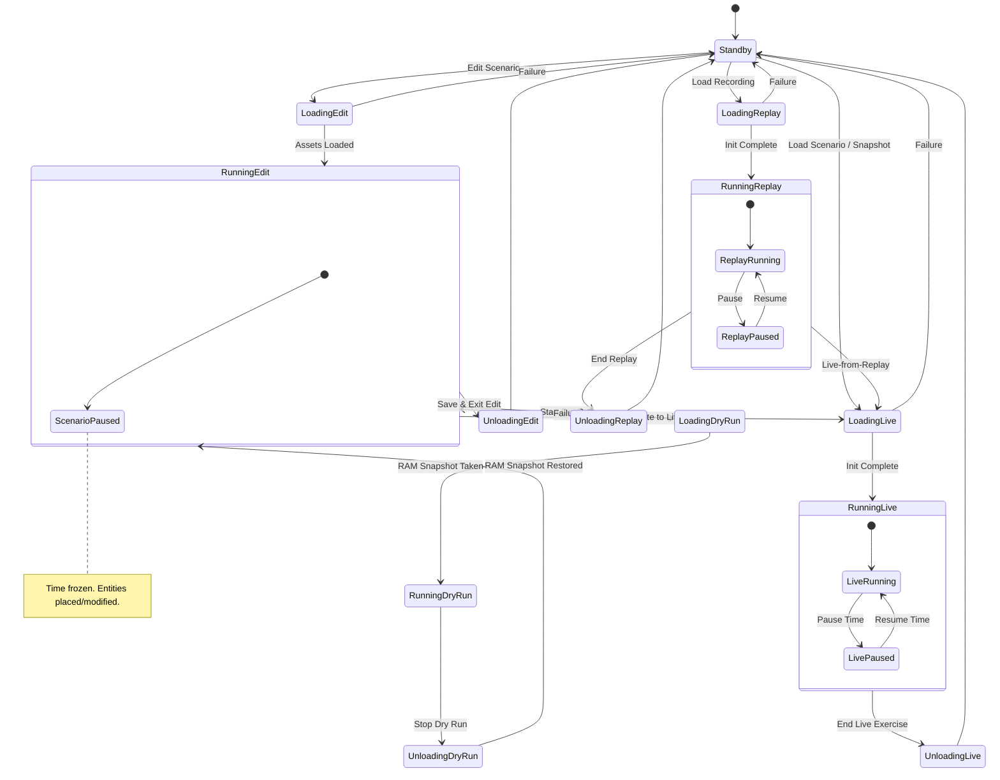
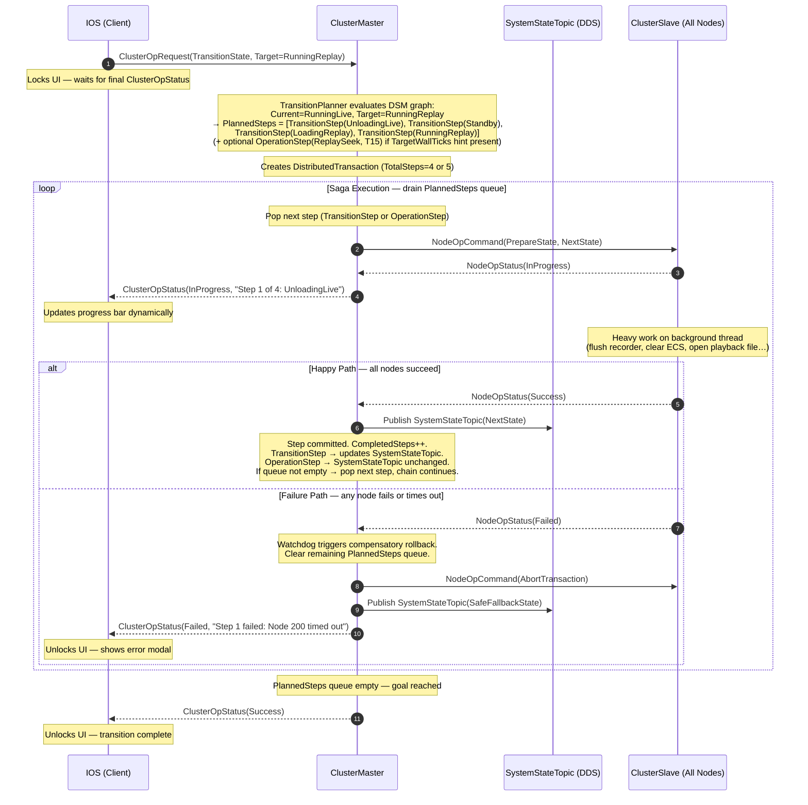
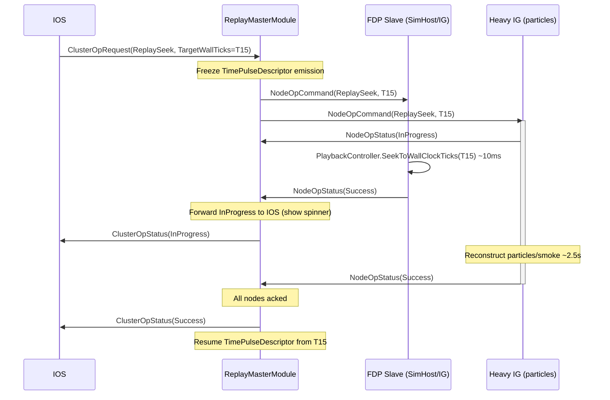
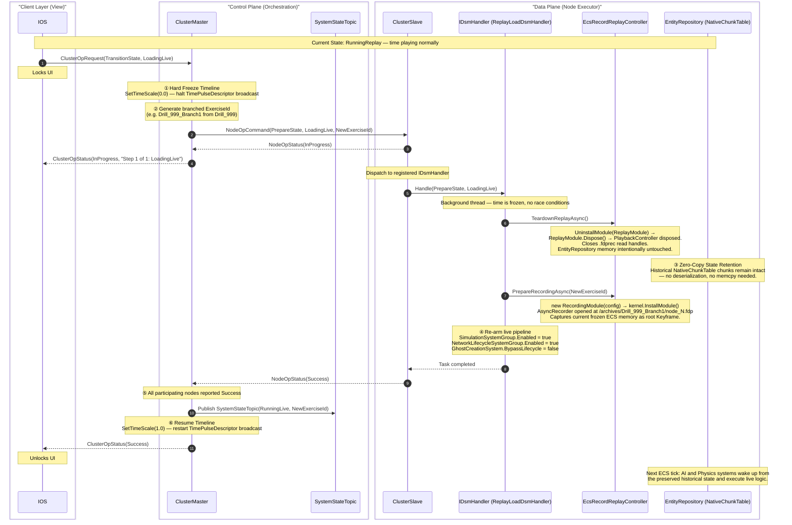
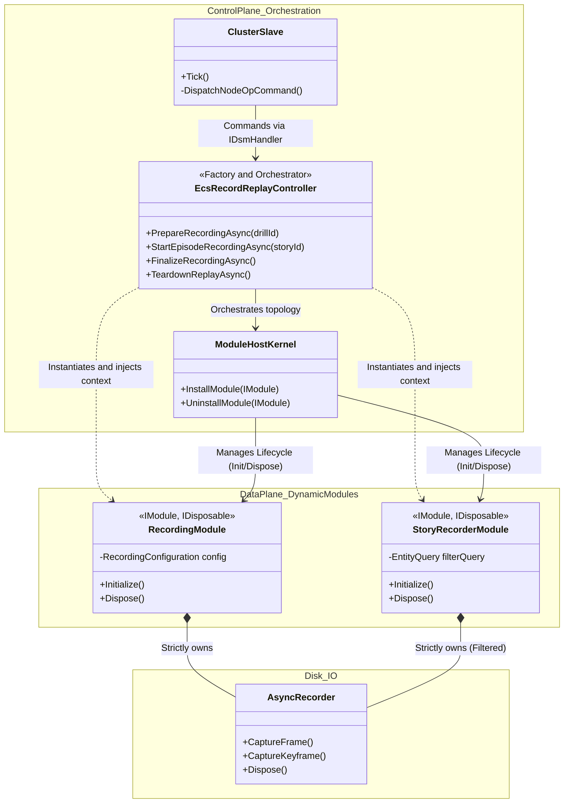
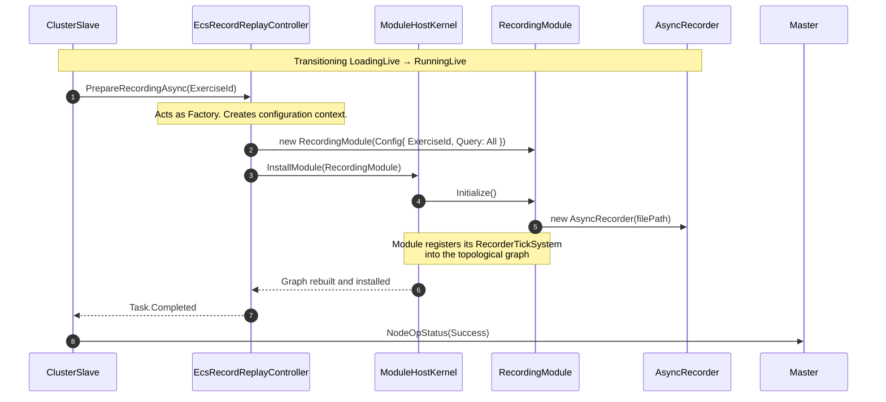
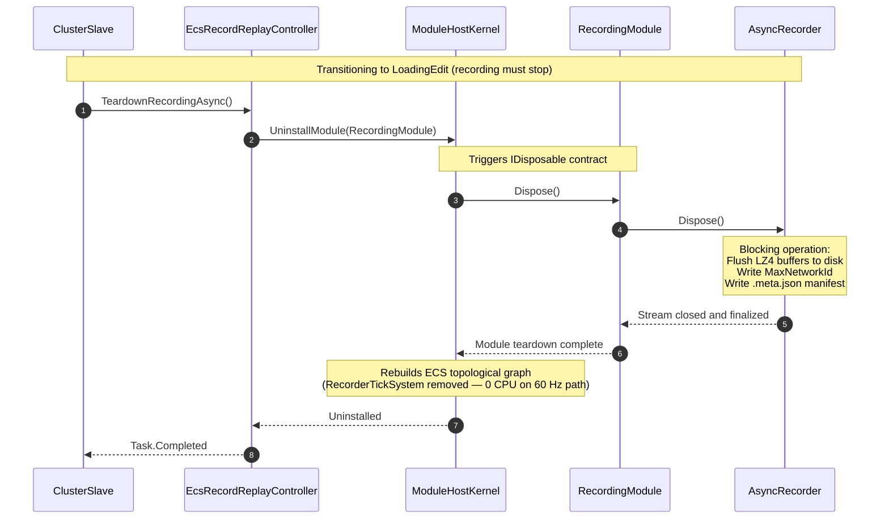
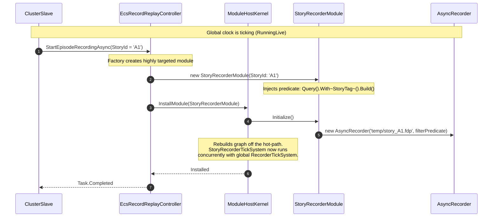
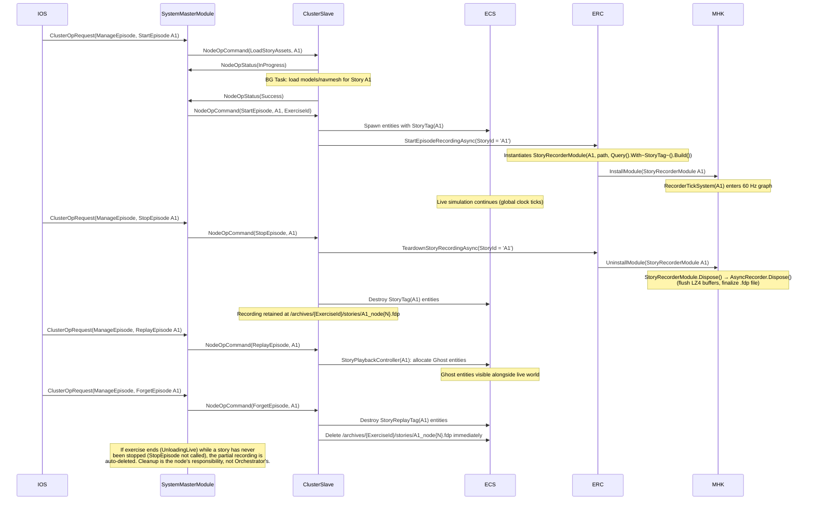
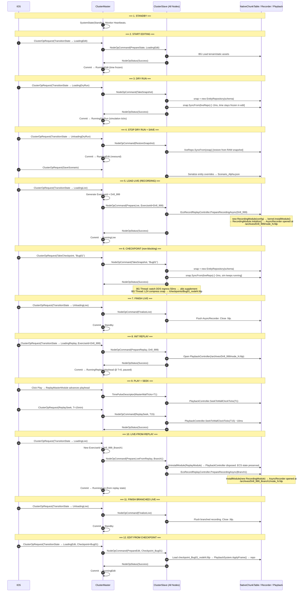

# Distributed Drill Management System — Architecture Design

> **Document scope:** Architectural design for implementing the Drill State Machine (DSM),
> distributed recording/replay, checkpoints, dry runs, stories, zones, node health
> monitoring, and archive management across the Hrot/FDP platform.
>
> Based on the [design-talk.md](./design-talk.md) conversation; cross-referenced against the
> existing codebase as of March 2026.

---

## Table of Contents

1. [System Overview](#1-system-overview)
2. [DDS Message Schema — bdc-sst-orchestration](#2-dds-message-schema)
3. [Drill State Machine (DSM)](#3-drill-state-machine)
4. [SysOp / Two-Phase Commit (2PC) Orchestration Pattern](#4-sysop--two-phase-commit-orchestration-pattern)
5. [ClusterMaster](#5-clustmaster)
   - [5.5 Transition Planner (Macro-Transitions)](#55-transition-planner-macro-transitions)
   - [5.5.2 TransitionPlanner — BFS Implementation](#552-transitionplanner--bfs-implementation)
   - [5.6 Time Control Architecture](#56-time-control-architecture)
   - [5.6.5 Deterministic Mode Switching — DistributedTimeCoordinator and Future Barrier](#565-deterministic-mode-switching--distributedtimecoordinator-and-future-barrier)
   - [5.7 Centralized Network Identity Authority (DdsIdAllocatorServer)](#57-centralized-network-identity-authority)
6. [ClusterSlave](#6-clustslave)
   - [6.6 Time Slave Integration (SlaveTimeController + Kernel Adapter)](#66-time-slave-integration)
7. [Node Health Monitoring (Heartbeat & BIT)](#7-node-health-monitoring)
8. [Replay Subsystem](#8-replay-subsystem)
   - [8.11 Live-from-Replay Temporal Interlock](#811-live-from-replay-temporal-interlock)
   - [8.12 "Always Recording" — Event Capture During Paused Simulation Time](#812-always-recording--event-capture-during-paused-simulation-time)
   - [8.13 Dynamic Recording/Replay Modules Architecture](#813-dynamic-recordingreplay-modules-architecture)
9. [Checkpoints & Dry Runs](#9-checkpoints--dry-runs)
10. [Stories — Multi-Tenant Micro-Scenarios](#10-stories--multi-tenant-micro-scenarios)
11. [Zones](#11-zones)
12. [Scenario Editing & Management](#12-scenario-editing--management)
13. [Archive Export / Import — Storage Gateway Pattern](#13-archive-export--import--storage-gateway-pattern)
14. [Deterministic Batch Runs](#14-deterministic-batch-runs)
15. [Key 12-Step Drill Sequence Flow](#15-key-12-step-drill-sequence-flow)
16. [Required Code Changes Summary](#16-required-code-changes-summary)

---

## 1. System Overview

### 1.1 Node Roles

```
┌─────────────────────────────────────────────────────────────────────────────┐
│                         HROT DISTRIBUTED PLATFORM                         │
│                                                                             │
│  ┌──────────────┐  ┌──────────────┐  ┌──────────────┐  ┌──────────────┐ │
│  │     IOS      │  │  SimHost     │  │  IG          │  │ Orchestrator │ │
│  │  (Control)   │  │ (Simulation) │  │ (Visualise)  │  │  (Master)    │ │
│  │              │  │              │  │              │  │              │ │
│  │  SysOpReq ──►│  │ ◄─NodeOpCmd  │  │ ◄─NodeOpCmd  │  │ NodeOpCmd──► │ │
│  │ ◄─SysOpUpd   │  │  NodeOpSts──►│  │  NodeOpSts──►│  │◄─NodeOpSts  │ │
│  │  Heartbeat──►│  │  Heartbeat──►│  │  Heartbeat──►│  │  (all nodes) │ │
│  └──────────────┘  └──────────────┘  └──────────────┘  └──────┬───────┘ │
│         │                  ▲                  ▲                │          │
│         └──────────────────┴──────────────────┴────────────────┘          │
│                                                                             │
│  Orchestrator (Hrot.Orchestrator, subsystem of Hrot.ClusterRunner):            │
│  ┌──────────────────────────────────────────────────────────────────────┐  │
│  │ ClusterMaster │ DSM State Machine │ Transaction Mgr │ Watchdog  │  │
│  │ OrchestratorContextTopic (TransientLocal) — late-joiner context      │  │
│  └──────────────────────────────────────────────────────────────────────┘  │
│                                                                             │
│  ─────────────────────────── CycloneDDS Bus ──────────────────────────── │
└─────────────────────────────────────────────────────────────────────────────┘
```

### 1.2 Control Planes

| Plane | Direction | Topic |
|-------|-----------|-------|
| Control Plane — Request | IOS → Master | `ClusterOpRequest` |
| Control Plane — Response | Master → IOS | `ClusterOpStatus` |
| Command Plane — Command | Master → All Nodes | `NodeOpCommand` |
| Command Plane — Status | All Nodes → Master | `NodeOpStatus` |
| Health Plane | Each Node → All | `NodeHeartbeat` |
| State Plane | Master → All (persistent) | `SystemStateTopic` |
| Context Plane | Orchestrator → All (persistent) | `OrchestratorContextTopic` |
| Time Plane | Time Master → All | `TimePulseDescriptor` (existing) |
| Time Mode Plane | `DistributedTimeCoordinator` → All | `SwitchTimeModeEvent` (new — internal to time toolkit, see §5.6.5) |

---

## 2. DDS Message Schema

**IDL file:** `bdc-sst-orchestration`  
**C# namespace:** `Hrot.NED.Descriptors.Orchestration`  
**Project:** `Hrot.NED`

### 2.1 Enumerations

```csharp
// ─── Drill State Machine States ───────────────────────────────────────────
public enum ClusterState : int
{
    Standby           = 0,

    // Editing flow
    LoadingEdit       = 10,
    RunningEdit       = 11,
    UnloadingEdit     = 12,

    // Dry-run sub-loop (inside editing)
    LoadingDryRun     = 20,
    RunningDryRun     = 21,
    UnloadingDryRun   = 22,

    // Live simulation flow
    LoadingLive       = 30,
    RunningLive       = 31,
    UnloadingLive     = 32,

    // Replay flow
    LoadingReplay     = 40,
    RunningReplay     = 41,
    UnloadingReplay   = 42,

    // Error / degraded
    Degraded          = 99,
}

// ─── SysOp types (IOS → Master) ──────────────────────────────────────────────
public enum ClusterOpType : int
{
    TransitionState   = 1,   // Load/Unload/switch DSM states
    SaveScenario      = 2,   // Serialize scenario JSON
    LoadZone   = 3,   // Load high-res terrain area
    TakeCheckpoint    = 4,   // Fast RAM snapshot
    CollectCheckpoint = 5,   // Gather checkpoint files to archive
    ExportArchive     = 6,   // Export drill recordings to cold storage
    ImportArchive     = 7,   // Import recordings from cold storage
    ManageEpisode       = 8,   // Start/Stop/Eval/Forget micro-scenario
    ReplaySeek        = 9,   // Jump replay to a specific wall-clock time
    PauseTime         = 10,
    ResumeTime        = 11,
}

// ─── Node operation types (Master → Nodes) ───────────────────────────────────
public enum NodeOpType : int
{
    PrepareState     = 1,
    CommitState      = 2,
    AbortTransaction = 3,
    TakeSnapshot     = 4,   // Non-blocking: node calls SyncFrom, passes buf to async thread
    RestoreSnapshot  = 5,
    PrepareZone   = 7,
    CommitZone    = 8,
    PrepareLive          = 9,
    FinalizeLive         = 10,
    PrepareReplay        = 11,
    FinalizeReplay       = 12,
    ReplaySeek           = 13,
    UploadChunk          = 14,  // Storage Gateway — node embeds UNC manifest in NodeOpStatus ACK
    SerializeLocal       = 15,  // Serialize scenario/checkpoint data to local SSD (SaveScenario / Archive)
    CleanupTempFiles     = 16,  // Delete local temp files after Gateway confirms NAS transfer
    StartEpisode           = 20,
    StopEpisode            = 21,
    ReplayEpisode          = 22,
    ForgetEpisode          = 23,
    LoadStoryAssets      = 24,
}

public enum OpStatus : int
{
    Pending    = 0,
    InProgress = 1,
    Success    = 2,
    Failure    = 3,
    Rejected   = 4,
}
```

### 2.2 DDS Topics

```csharp
// ─── Persistent system state (late-joiner safe) ──────────────────────────────
[DdsTopic("SystemState")]
[DdsIdlFile("bdc-sst-orchestration")]
[DdsQos(Reliability  = DdsReliability.Reliable,
        Durability   = DdsDurability.TransientLocal,
        HistoryKind  = DdsHistoryKind.KeepLast,
        HistoryDepth = 1)]
public partial struct SystemStateTopic
{
  public ClusterState CurrentState;
  public Guid     ExerciseId;          // Unique key per drill run
    public long     StateStartWallTicks;  // wall-clock start of current state
    public int      TransactionEpoch; // Increments on each successful transition
}

// ─── IOS → Master ────────────────────────────────────────────────────────────
[DdsTopic("ClusterOpRequest")]
[DdsIdlFile("bdc-sst-orchestration")]
[DdsQos(Reliability = DdsReliability.Reliable, Durability = DdsDurability.Volatile)]
public partial struct ClusterOpRequest
{
    public Guid       RequestId;
    public ClusterOpType  OperationType;
    public string     PayloadJson;   // Operation-specific params (nullable)
}

// ─── Master → IOS ────────────────────────────────────────────────────────────
[DdsTopic("ClusterOpStatus")]
[DdsIdlFile("bdc-sst-orchestration")]
[DdsQos(Reliability = DdsReliability.Reliable, Durability = DdsDurability.Volatile)]
public partial struct ClusterOpStatus
{
    public Guid      RequestId;
    public OpStatus  Status;
    public int       ErrorCode;
    public string    ResultJson;
}

// ─── Master → All Nodes ──────────────────────────────────────────────────────
[DdsTopic("NodeOpCommand")]
[DdsIdlFile("bdc-sst-orchestration")]
[DdsQos(Reliability = DdsReliability.Reliable, Durability = DdsDurability.Volatile)]
public partial struct NodeOpCommand
{
    public Guid        TransactionId;
    public NodeOpType  Operation;
    public string      PayloadJson;
}

// ─── All Nodes → Master ──────────────────────────────────────────────────────
[DdsTopic("NodeOpStatus")]
[DdsIdlFile("bdc-sst-orchestration")]
[DdsQos(Reliability = DdsReliability.Reliable, Durability = DdsDurability.Volatile)]
public partial struct NodeOpStatus
{
    public Guid      TransactionId;
    public int       NodeId;
    public OpStatus  Status;
    public bool      IsParticipating;  // false = node opted out, Master skips it
    public int       ErrorCode;
    public string    ResultJson;
}

// ─── Health / BIT (all nodes, autonomous 1 Hz) ───────────────────────────────
[DdsTopic("NodeHeartbeat")]
[DdsIdlFile("bdc-sst-orchestration")]
[DdsQos(Reliability  = DdsReliability.BestEffort,
        Durability   = DdsDurability.TransientLocal,
        HistoryKind  = DdsHistoryKind.KeepLast,
        HistoryDepth = 1)]
public partial struct NodeHeartbeat
{
    [DdsKey]
    public int     NodeId;
    public string  SubsystemName;
    public ClusterState LocalClusterState;       // What the node thinks the DSM state is
    public long    WallTicksUtc;
    public float   CpuUsagePercent;
    public long    RamUsedBytes;
    public bool    SimTickAdvancing;     // false if ECS main loop is stalled
    public string  SubsystemsJson;       // JSON dict: { "Recorder": "Healthy", ... }
}

// ─── Late-joiner / drill context (Orchestrator → All, TransientLocal) ──────
// Published/updated by the Orchestrator whenever the drill context changes.
// Late-joining nodes read this once to catch up on what drill is running.
[DdsTopic("OrchestratorContext")]
[DdsIdlFile("bdc-sst-orchestration")]
[DdsQos(Reliability  = DdsReliability.Reliable,
        Durability   = DdsDurability.TransientLocal,
        HistoryKind  = DdsHistoryKind.KeepLast,
        HistoryDepth = 1)]
public partial struct OrchestratorContextTopic
{
  public ClusterState CurrentState;
    public Guid     ExerciseId;
    public int      TransactionEpoch;
    public string   ScenarioId;           // Which scenario is loaded (nullable)
    public string   ArchiveBasePath;      // Where recordings are stored
    public string   RequiredNodeIdsJson;  // JSON int[] — which NodeIds are expected
    public long     StateStartWallTicks;
}

// ─── Replay-specific time pulse (Orchestrator → All, during RunningReplay) ───
// NOTE: During RunningReplay the ReplayMasterModule seeds MasterTimeController
// with the recording epoch (StartWallTicks = recording.StartWallTicks) and sets
// an appropriate TimeScale, then calls MasterTimeController.Update() normally.
// MasterTimeController publishes TimePulseDescriptor at 1 Hz (or on SetTimeScale).
// Slaves run SlaveTimeController PLL as usual — SimTimeSnapshot carries seconds
// elapsed since recording epoch.  No new DDS topic is needed; the consumer may
// check SystemStateTopic.CurrentState == RunningReplay to interpret TotalTime as
// recording-relative seconds rather than live simulation time.
```

---

## 3. Drill State Machine

```
┌──────────────────────────────────────────────────────────────────────────────┐
│                         DRILL STATE MACHINE (DSM)                         │
└──────────────────────────────────────────────────────────────────────────────┘

                      ┌──────────┐
                      │ Standby  │◄─────────────────────────────────┐
                      └────┬─────┘                                   │
            ┌──────────────┼──────────────┐                          │
            │              │              │                          │
      Load  │        Load  │       Load   │                          │
      Edit  ▼        Live  ▼       Rplay  ▼                          │
    ┌────────────┐  ┌─────────────┐  ┌────────────────┐             │
    │LoadingEdit │  │ LoadingLive │  │ LoadingReplay  │             │
    └─────┬──────┘  └──────┬──────┘  └───────┬────────┘             │
          │                │                  │                      │
          ▼                ▼                  ▼                      │
    ┌────────────┐  ┌─────────────┐  ┌────────────────┐             │
    │RunningEdit │  │ RunningLive │  │ RunningReplay  │             │
    └──┬──────┬──┘  └──┬──────┬───┘  └──┬──────┬──────┘             │
       │      │        │  ▲   │         │  ▲   │                    │
  Start│      │Unload  │  │   │Unload   │  │   │Unload             │
  DryRun      │Edit    │Pause │Live     │ Pause│Replay             │
       │      │        │  │   │         │  │   │                    │
       ▼      │        ▼  │   ▼         ▼  │   ▼                    │
  ┌──────────┐│   ┌──────────────┐  ┌──────────────────┐           │
  │LoadingDR ││   │UnloadingLive │  │UnloadingReplay   │           │
  └────┬─────┘│   └──────┬───────┘  └──────────┬───────┘           │
       │      │          │                      │                    │
       ▼      │          └──────────────────────┴────────────────────┘
  ┌───────────┐                         (→ Standby)
  │RunningDR  │  ("DryRun")
  └────┬──────┘
       │ Stop DryRun
       ▼
  ┌────────────────┐
  │UnloadingDryRun │
  └────────┬───────┘
           │ RAM snapshot restored
           └──────────────────────► RunningEdit
```

### 3.1 Valid State Transitions

```
Standby            → LoadingEdit, LoadingLive, LoadingReplay
LoadingEdit        → RunningEdit, Standby (failure)
RunningEdit        → LoadingDryRun, LoadingLive, UnloadingEdit
LoadingDryRun      → RunningDryRun, RunningEdit (failure)
RunningDryRun      → UnloadingDryRun
UnloadingDryRun    → RunningEdit
UnloadingEdit      → Standby
LoadingLive        → RunningLive, Standby (failure)
RunningLive        → UnloadingLive
UnloadingLive      → Standby
LoadingReplay      → RunningReplay, Standby (failure)
RunningReplay      → UnloadingReplay, LoadingLive (Live-from-Replay)
UnloadingReplay    → Standby
Any                → Degraded (health failure)
```

> **Asset caching across Standby:** When transitioning through Standby back to a new
> `LoadingX` state, nodes MUST NOT force a full asset reload. Assets loaded in RAM are
> retained; only assets that differ between old and new scenario are unloaded/reloaded.
> This means `RunningEdit → LoadingLive` (via direct or via Standby) avoids re-scanning
> files that are already resident.

> **Mermaid version** (copy into a Mermaid renderer):



---

## 4. SysOp / Two-Phase Commit Orchestration Pattern

The entire distributed coordination uses a **Two-Phase Commit (2PC)** pattern:

```
IOS              Master                     All Slave Nodes
 │                 │                               │
 │ ClusterOpRequest    │                               │
 ├────────────────►│                               │
 │                 │── validates state ─┐          │
 │                 │◄──────────────────┘          │
 │                 │                               │
 │                 │  NodeOpCommand(PREPARE)       │
 │                 ├──────────────────────────────►│
 │                 │                               │── bg Task ──►
 │                 │  NodeOpStatus(InProgress)     │
 │                 │◄──────────────────────────────┤
 │ ClusterOpStatus     │                               │── heavy work...
 │ (InProgress) ◄──┤                               │
 │                 │  NodeOpStatus(Success)        │◄── bg Task done
 │                 │◄──────────────────────────────┤
 │                 │  (all nodes acked)            │
 │                 │                               │
 │                 │  NodeOpCommand(COMMIT)        │
 │                 ├──────────────────────────────►│
 │                 │── updates SystemStateTopic    │
 │ ClusterOpStatus     │                               │
 │ (Success) ◄─────┤                               │
 │                 │                               │
```

### 4.1 Failure Path (Abort)

```
 │                 │   NodeOpStatus(Failure)       │
 │                 │◄──────────────────────────────┤
 │                 │                               │
 │                 │  NodeOpCommand(ABORT)         │
 │                 ├──────────────────────────────►│── drop StagedAssetPayload
 │ ClusterOpStatus     │                               │
 │ (Failure) ◄─────┤                               │
```

### 4.2 Transaction Epoch (Split-Brain Recovery)

`SystemStateTopic.TransactionEpoch` is incremented on every successful commit.  
A node that "missed" a commit detects this on the next heartbeat cycle by comparing
its local epoch against the published epoch. It self-heals if it completed the
Prepare phase; otherwise it transitions to `Degraded`.

---

## 5. ClusterMaster

**Location:** `Hrot.Orchestrator/ClusterMaster.cs` (new — lives in a dedicated
`Hrot.Orchestrator` project, registered as a subsystem of `Hrot.ClusterRunner`).
`Hrot.ClusterRunner` is just a shell; `Hrot.Orchestrator` runs as a separate process.

> **Late-joiner support:** On every DSM state transition the Orchestrator publishes an
> updated `OrchestratorContextTopic` (TransientLocal, HistoryDepth=1). Any node that
> joins after the transition reads the latest sample immediately and executes its internal
> join procedure (load assets, sync state, etc.).

### 5.1 Responsibilities
- Owns the **DSM** — sole writer of `SystemStateTopic`
- Manages the **Node Roster** via `NodeHeartbeat` consumption
- Executes **2PC transactions** without blocking the main ECS loop
- Generates new `ExerciseId` GUID when entering any non-Standby session
- Provides **`ClusterOpRequest`** validation and rejection logic

### 5.2 Internal Data Structures

```csharp
// ─── Polymorphic step in a planned trajectory (see §5.5) ─────────────────────
//
// A trajectory is a Queue<ISysOpStep>. Each step is either:
//   TransitionStep  — a standard DSM state change executed via 2PC NodeOpCommand
//   OperationStep   — a distributed operation that runs *within* a resident DSM
//                     state (e.g. ReplaySeek after arriving in RunningReplay)
//
// This distinction is critical: ReplaySeek is NOT a state — it is an operation
// that is only valid while the system is already in RunningReplay. A queue typed
// strictly to ClusterState cannot encode it, so the planner always returns
// Queue<ISysOpStep>.
abstract class ISysOpStep
{
    public abstract string Label { get; }   // Shown in ClusterOpStatus "Step X of Y: {Label}"
}

class TransitionStep : ISysOpStep
{
    public ClusterState   TargetState;
    public NodeOpType PrepareOp;
    public NodeOpType CommitOp;
    public override string Label => TargetState.ToString();
}

class OperationStep : ISysOpStep
{
    public ClusterOpType  OperationType;    // e.g. ReplaySeek
    public string     PayloadJson;      // forwarded verbatim to NodeOpCommand
    public override string Label => OperationType.ToString();
}

// ─── Active distributed transaction ──────────────────────────────────────────
class DistributedTransaction
{
    public Guid       TransactionId;
    public Guid       OriginRequestId;     // back-ref to ClusterOpRequest

    // ── Macro-transition support (see §5.5) ──────────────────────────────────
    // PlannedSteps is populated by the TransitionPlanner for every request,
    // even single-step ones (queue length 1 = simple transition).
    // TargetClusterState is the final DSM state goal; operations appended after it
    // (e.g. ReplaySeek) are OperationSteps and do not change the DSM state.
    public ClusterState            TargetClusterState;  // final DSM state goal
    public Queue<ISysOpStep>   PlannedSteps;    // ordered polymorphic steps
    public int                 TotalSteps;      // snapshot of initial queue length — for "Step X of Y"
    public int                 CompletedSteps;  // incremented after each step commits

    public HashSet<int> PendingNodes;      // cloned from ActiveNodes at T=0
    public float      ElapsedSeconds;
    public float      TimeoutSeconds;      // configurable, default 30s
    public bool       AllowPartialSuccess; // e.g. non-critical loggers
}

// ─── Node health profile ──────────────────────────────────────────────────────
class NodeHealthProfile
{
    public int     NodeId;
    public string  SubsystemName;
    public ClusterState LastReportedState;
    public float   SecondsSinceLastHeartbeat;
    public bool    IsCritical;   // if true and goes offline → fault the DSM
}
```

### 5.3 Tick() Logic (runs every ECS frame at BeforeSync phase)

```
┌─ TICK ──────────────────────────────────────────────────────────────────┐
│                                                                          │
│  1. Consume NodeHeartbeat DDS queue                                      │
│     ├─ Update NodeHealthProfile.SecondsSinceLastHeartbeat = 0            │
│     └─ Detect missed heartbeats (> 5s) → prune or fault                  │
│                                                                          │
│  2. Consume ClusterOpRequest DDS queue (from IOS)                            │
│     ├─ Hand request to TransitionPlanner → generates Queue<ISysOpStep>   │
│     └─ If valid path found → spawn DistributedTransaction, begin Phase 1 │
│        (see §5.5 for Transition Planner details)                         │
│                                                                          │
│  3. Consume NodeOpStatus DDS queue (from slave nodes)                    │
│     ├─ Match by TransactionId                                            │
│     ├─ InProgress: forward as ClusterOpStatus(InProgress, "Step X of Y")    │
│     │              to IOS so the UI can show a progress bar              │
│     ├─ Success / IsParticipating=false: remove from PendingNodes         │
│     └─ Failure: abort transaction, clear PlannedSteps queue,             │
│                 publish SystemStateTopic(SafeFallbackState),             │
│                 send ClusterOpStatus(Failure) to IOS                         │
│                                                                          │
│  4. For each active transaction                                           │
│     ├─ Increment ElapsedSeconds                                          │
│     ├─ If timeout → abort (treat as Failure)                             │
│     └─ If PendingNodes.Count == 0 → COMMIT current step:                 │
│         ├─ If current step is TransitionStep:                            │
│         │   ├─ Publish NodeOpCommand(CommitOp)                           │
│         │   └─ Write SystemStateTopic (committed DSM state)              │
│         ├─ If current step is OperationStep:                             │
│         │   └─ (SystemStateTopic unchanged — DSM state stays resident)   │
│         ├─ transaction.PlannedSteps.Dequeue(); CompletedSteps++          │
│         ├─ If PlannedSteps is EMPTY → publish ClusterOpStatus(Success)       │
│         │   to IOS and close transaction                                 │
│         └─ Else → pop next step, reset PendingNodes, dispatch next       │
│                  NodeOpCommand for the step — chain continues            │
│                                                                          │
└──────────────────────────────────────────────────────────────────────────┘
```

### 5.4 ExerciseId Generation

```
Whenever transitioning OUT of Standby (to LoadingEdit, LoadingLive, LoadingReplay):
  _currentExerciseId = Guid.NewGuid()

The ExerciseId is embedded in:
  - SystemStateTopic
  - NodeOpCommand payload JSON  (so nodes can name their .fdp files correctly)
  - AsyncRecorder filePath:  /archives/{ExerciseId}/node_{NodeId}.fdp
```

---

### 5.5 Transition Planner (Macro-Transitions)

The `ClusterMaster` acts as a **Process Manager**: every `ClusterOpRequest(TransitionState,
TargetState)` from the IOS is given to an internal **`TransitionPlanner`** that treats
the DSM as a directed graph and calculates the shortest valid path to the requested target
state.  The result is always a `Queue<ISysOpStep>` loaded into `DistributedTransaction.PlannedSteps`.

A simple, direct single-step request (e.g. `Standby → LoadingEdit`) is just a queue of
length 1.  A "wild" multi-step request (e.g. `RunningLive → RunningReplay`) produces a
longer queue.  The Tick() execution loop is completely agnostic to queue length: it pops
one state, runs the standard two-phase commit, and chains to the next entry when all nodes
ACK success.

**Key benefits of this unified design:**
- **Dumb IOS:** the client fires a single `ClusterOpRequest` naming only the desired final
  state and receives `ClusterOpStatus(InProgress, "Step X of Y: …")` progress updates
  autonomously.  It requires zero knowledge of DSM graph rules.
- **DRY execution path:** timeouts, watchdog monitoring, and distributed rollback are
  written exactly once in `DistributedTransaction` regardless of queue length.
- **Open/Closed for trajectories:** adding a new mandatory intermediate state to the DSM
  later only requires updating the graph definition inside `TransitionPlanner`; all client
  code and the 2PC loop are unchanged.
- **Compensatory rollback:** if a node fails at step N, the Master aborts the remaining
  queue, publishes `SystemStateTopic(SafeFallbackState)`, and sends `ClusterOpStatus(Failed)`
  with a human-readable description.

Every request — simple or wild — is resolved by the planner into a
`Queue<ISysOpStep>`.  Each entry is either a `TransitionStep` (DSM state change, executed
via 2PC `NodeOpCommand`) or an `OperationStep` (a distributed operation run while
residing in a state, e.g. `ReplaySeek`).  This distinction is essential: `ReplaySeek` is
strictly an operation, not a DSM state — it is only valid once the system is already in
`RunningReplay`.

**Example trajectories resolved by the planner:**

| Current State | Target / Hints | Planned Queue (`ISysOpStep` items) |
|---------------|----------------|-------------------------------------|
| `Standby` | `LoadingEdit` | `[TransitionStep(LoadingEdit)]` |
| `RunningLive` | `RunningReplay` | `[TransitionStep(UnloadingLive), TransitionStep(Standby), TransitionStep(LoadingReplay), TransitionStep(RunningReplay)]` |
| `RunningLive` | `RunningReplay` + `TargetWallTicks=T15` | `[TransitionStep(UnloadingLive), TransitionStep(Standby), TransitionStep(LoadingReplay), TransitionStep(RunningReplay), OperationStep(ReplaySeek, T15)]` |
| `RunningEdit` | `RunningLive` | `[TransitionStep(UnloadingEdit), TransitionStep(Standby), TransitionStep(LoadingLive), TransitionStep(RunningLive)]` |
| `RunningReplay` | `RunningEdit` | `[TransitionStep(UnloadingReplay), TransitionStep(Standby), TransitionStep(LoadingEdit), TransitionStep(RunningEdit)]` |

> **Transition hints:** the `ClusterOpRequest.PayloadJson` may carry optional metadata (e.g.
> `"ExerciseId"`, `"ScenarioId"`, `"TargetWallTicks"`) that the planner threads through the
> `NodeOpCommand` payloads for each step.  This lets the IOS say "go to RunningReplay
> of drill 999, seek to T+15 min" in a single request without embedding sequencing logic
> in the client.  The `TargetWallTicks` hint causes the planner to append an
> `OperationStep(ReplaySeek, TargetWallTicks)` after the final `TransitionStep(RunningReplay)`.  The 2PC execution loop dispatches it with a `NodeOpCommand(ReplaySeek, TargetWallTicks)` and waits for all nodes to ACK exactly as it does for a state transition — the loop is oblivious to step type.

#### 5.5.1 Sequence Diagram — Complex (Wild) Transition

The following diagram illustrates the IOS firing a wild `RunningLive → RunningReplay`
request.  The Master resolves the 4-step trajectory internally; the IOS only monitors
`ClusterOpStatus` progress updates.



#### 5.5.2 TransitionPlanner — BFS Implementation

**Why BFS?**  
All DSM state transitions have equal "weight" (one 2PC round-trip per hop). Dijkstra
or A\* are anti-patterns here. **Breadth-First Search (BFS)** is the optimal O(V+E)
algorithm, guaranteeing the shortest path in an unweighted directed graph and cleanly
throwing before any network command is issued if the target is unreachable.

**Graph Definition (Adjacency List)**

The `TransitionPlanner` owns the authoritative single-source-of-truth for valid
lifecycles.  Adding a new intermediate state tomorrow requires touching only this
dictionary — the BFS algorithm and the 2PC execution loop remain unchanged (Open/Closed
Principle):

```csharp
// Location: Hrot.Orchestrator/TransitionPlanner.cs
public class TransitionPlanner
{
    // Directed adjacency list — defines every legal DSM edge.
    private readonly Dictionary<ClusterState, HashSet<ClusterState>> _validTransitions = new()
    {
      { ClusterState.Standby,         new() { ClusterState.LoadingEdit, ClusterState.LoadingLive, ClusterState.LoadingReplay } },
      { ClusterState.LoadingEdit,     new() { ClusterState.RunningEdit,   ClusterState.Standby } },
      { ClusterState.RunningEdit,     new() { ClusterState.LoadingDryRun, ClusterState.LoadingLive, ClusterState.UnloadingEdit } },
      { ClusterState.LoadingDryRun,   new() { ClusterState.RunningDryRun, ClusterState.RunningEdit } },
      { ClusterState.RunningDryRun,   new() { ClusterState.UnloadingDryRun } },
      { ClusterState.UnloadingDryRun, new() { ClusterState.RunningEdit } },
      { ClusterState.UnloadingEdit,   new() { ClusterState.Standby } },
      { ClusterState.LoadingLive,     new() { ClusterState.RunningLive,   ClusterState.Standby } },
      { ClusterState.RunningLive,     new() { ClusterState.UnloadingLive } },
      { ClusterState.UnloadingLive,   new() { ClusterState.Standby } },
      { ClusterState.LoadingReplay,   new() { ClusterState.RunningReplay, ClusterState.Standby } },
      { ClusterState.RunningReplay,   new() { ClusterState.UnloadingReplay, ClusterState.LoadingLive } },
      { ClusterState.UnloadingReplay, new() { ClusterState.Standby } },
    };
```

**BFS Pathfinding**

```csharp
    private List<ClusterState> CalculateShortestPath(ClusterState current, ClusterState target)
    {
      if (current == target) return new List<ClusterState>();

      var frontier  = new Queue<ClusterState>();
      var cameFrom  = new Dictionary<ClusterState, ClusterState>();

      frontier.Enqueue(current);
      cameFrom[current] = current;   // mark visited

        while (frontier.Count > 0)
        {
            var node = frontier.Dequeue();
            if (node == target)
                return ReconstructPath(cameFrom, current, target);

            if (_validTransitions.TryGetValue(node, out var neighbors))
                foreach (var next in neighbors)
                    if (!cameFrom.ContainsKey(next))
                    {
                        frontier.Enqueue(next);
                        cameFrom[next] = node;
                    }
        }

        throw new InvalidOperationException(
          $"No valid DSM trajectory found from {current} to {target}.");
    }

    private static List<ClusterState> ReconstructPath(
      Dictionary<ClusterState, ClusterState> cameFrom, ClusterState start, ClusterState target)
    {
      var path    = new List<ClusterState>();
      var current = target;
      while (current != start) { path.Add(current); current = cameFrom[current]; }
      path.Reverse();
      return path;
    }
```

**Assembling the Polymorphic Command Queue**

Once BFS returns the state path (e.g. `[UnloadingLive, Standby, LoadingReplay,
RunningReplay]`) the planner wraps each state in a `TransitionStep` and then appends
any optional `OperationStep` entries derived from the request's `PayloadJson` hints:

```csharp
    public Queue<ISysOpStep> PlanTrajectory(ClusterState currentState, ClusterOpRequest request)
    {
        var steps = new Queue<ISysOpStep>();

        // 1. Pathfind — state transitions only
        var statePath = CalculateShortestPath(currentState, request.TargetState);
        foreach (var state in statePath)
            steps.Enqueue(new TransitionStep(state, request.PayloadJson));

        // 2. Append hint-driven operations after the final state
        if (request.TargetState == ClusterState.RunningReplay
            && TryExtractSeekTarget(request.PayloadJson, out long targetTick))
            steps.Enqueue(new OperationStep(ClusterOpType.ReplaySeek, targetTick));

        return steps;
    }
}
```

> **Safety guarantee:** If the IOS sends an impossible request (e.g. `RunningDryRun →
> RunningReplay`) the BFS exhausts the frontier and throws `InvalidOperationException`
> before any `NodeOpCommand` is broadcast over DDS.  The 2PC execution loop is never
> entered, and the cluster state is left completely unchanged.

---

### 5.6 Time Control Architecture

The `ClusterMaster` is the **Time Authority** for the distributed cluster.  All time
logic is encapsulated behind an `ITimeController` interface, enabling hot-swapping between
real-time and deterministic stepping modes without disrupting the rest of the system.

#### 5.6.1 `ITimeController` Interface

```csharp
// Location: FDP/Toolkits/FDP.Toolkit.Time/ITimeController.cs  (new)
public interface ITimeController
{
    GlobalTime Update();                    // Advance internal clock, return current state
    void       SetTimeScale(float scale);   // 0.0 = pause, 1.0 = realtime, 2.0 = fast-fwd
    GlobalTime GetCurrentState();           // Non-advancing read
    void       SeedState(GlobalTime seed);  // Abrupt reset — bypasses PLL / error filters
}
```

#### 5.6.2 `SwitchableTimeController` Proxy

A `SwitchableTimeController` wraps an active `ITimeController` instance.  The `ModuleHostKernel`
holds a stable reference to the proxy; the underlying strategy can be hot-swapped at any
frame-perfect moment without any other code being aware of the change.

The proxy exposes a single dedicated swap method, `SwitchTo()`, which is **never** called
directly by `ClusterMaster` or `ClusterSlave` — it is called exclusively by the
`DistributedTimeCoordinator` (Master node) and `SlaveTimeModeListener` (Slave nodes) at
exactly the correct Barrier Frame (see §5.6.5):

```csharp
public class SwitchableTimeController : ITimeController
{
    private ITimeController _activeController;

    public SwitchableTimeController(ITimeController initial)
    {
        _activeController = initial ?? throw new ArgumentNullException(nameof(initial));
    }

    /// <summary>
    /// The only public API specific to this class.
    /// Called by the coordinator layer when the Future Barrier frame is reached.
    /// Gracefully transfers the exact current GlobalTime state to the new strategy.
    /// </summary>
    public void SwitchTo(ITimeController newController)
    {
        if (newController == null) throw new ArgumentNullException(nameof(newController));
        if (_activeController == newController) return;

        var currentState = _activeController.GetCurrentState();
        newController.SeedState(currentState);
        _activeController = newController;
    }

    public ITimeController ActiveController => _activeController;

    // ─── ITimeController Proxy — all calls forwarded to active strategy ─────
    public GlobalTime Update()                  => _activeController.Update();
    public void       SetTimeScale(float scale) => _activeController.SetTimeScale(scale);
    public float      GetTimeScale()            => _activeController.GetTimeScale();
    public TimeMode   GetMode()                 => _activeController.GetMode();
    public GlobalTime GetCurrentState()         => _activeController.GetCurrentState();
    public void       SeedState(GlobalTime s)   => _activeController.SeedState(s);
    public void       Dispose()                 => _activeController.Dispose();
}
```

> **Key design rule:** `SwitchableTimeController` knows nothing about DDS, future barriers,
or the DSM.  It is a pure Proxy + Strategy implementation.  Network synchronisation of
> the swap is fully handled by the coordinator layer described in §5.6.5.

#### 5.6.3 Master-Side Time Strategies

| Strategy | Used When | Behaviour |
|----------|-----------|-----------|
| `MasterTimeController` | `RunningLive`, `RunningReplay`, `RunningDryRun` | Driven by `Stopwatch`; publishes `TimePulseDescriptor` at 1 Hz and on every `SetTimeScale()` call |
| `SteppedMasterController` | Deterministic / debug mode | Halts real-time progression; publishes `FrameOrderDescriptor` per logical tick; waits for `FrameAckDescriptor` before advancing |

During `RunningReplay`, `MasterTimeController` is seeded with the recording epoch via
`SeedState()` so that `GlobalTime.TotalTime` measures seconds from the start of the
recording (see §8.3).

#### 5.6.4 Abrupt Reset (Jump-To-Time Interlock)

Discontinuous operations (seeking during replay, branching live-from-replay) require a
strict **Control-Plane / Data-Plane interlock** to prevent the distributed cluster from
diverging at different timestamps:

```
Master receives jump/seek request
  │
  ├─ 1. Hard freeze: SetTimeScale(0.0), halt TimePulseDescriptor broadcast
  │
  ├─ 2. SeedState(targetTime) on local MasterTimeController
  │      (establishes the new reference epoch before any node is commanded)
  │
  ├─ 3. Broadcast NodeOpCommand(ReplaySeek / PrepareState, targetTime)
  │
  ├─ 4. Wait for NodeOpStatus(Success) from ALL participating nodes
  │      (slaves call SlaveTimeController.SeedState() — bypassing PLL error
  │       filters — then execute their heavy data reconstruction)
  │
  └─ 5. Resume: SetTimeScale(savedScale), restart TimePulseDescriptor
         (time only flows once every node has confirmed it is temporally coherent)
```

> **Why explicit SeedState bypass matters:**  
> The `SlaveTimeController` PLL uses a `JitterFilter` to distinguish network jitter from
> intentional magnitude jumps.  A 15-minute seek looks like a catastrophic clock error to
> the PLL.  `SeedState()` provides a dedicated path that bypasses the filter entirely,
> guaranteeing instant deterministic snap without any slew interpolation artefacts.

#### 5.6.5 Deterministic Mode Switching — `DistributedTimeCoordinator` and Future Barrier

Switching between continuous real-time and deterministic lockstep is **completely
independent of the DSM**.  It is available at any point while the simulation is in a
*running* state (`RunningLive`, `RunningReplay`, `RunningDryRun`).  Because a standard
2PC `SysOp` round-trip would cause different nodes to swap at slightly different simulation
frames (destroying determinism), the switch is instead coordinated via a lightweight
**Future Barrier** on the dedicated **Time Plane**.

**Why 2PC SysOp cannot be used here:**  
Network latency means Node A might receive a `NodeOpCommand(SwitchMode)` at Frame 100 and
Node B at Frame 102.  If each node swaps its controller on receipt, determinism is instantly
destroyed.  Blocking the main simulation thread to wait for ACKs is equally unacceptable.

**The Future Barrier approach:**

```
Request arrives at DistributedTimeCoordinator (Master node)
  │
  ├─ 1. If sim clock is currently running (TimeScale > 0):
  │       Call SetTimeScale(0.0) on the active ITimeController to pause first.
  │       (The coordinator owns time — it pauses before negotiating the barrier.)
  │
  ├─ 2. Read current ECS frame counter (e.g. Frame 100).
  │      Add lookahead: BarrierFrame = 100 + N  (e.g. N=10 → BarrierFrame = 110).
  │
  ├─ 3. Publish SwitchTimeModeEvent { TargetMode, BarrierFrame } over DDS
  │       (via BlitEventTranslator<SwitchTimeModeEvent> — zero-allocation raw memcpy)
  │
  └─ 4. Continue simulating normally until local frame counter reaches BarrierFrame.
         On that exact tick → call _switchableTime.SwitchTo(new SteppedMasterController(...))
         Restore saved TimeScale.

On each Slave node — SlaveTimeModeListener:
  ├─ Receives SwitchTimeModeEvent from DDS.
  ├─ Continues simulating normally.
  └─ When local frame counter reaches BarrierFrame → call _switchableTime.SwitchTo(...)
     Because all nodes derive their frame counter from the same master clock, the swap
     occurs at the identical simulation instant on every node simultaneously.
```

**`SwitchTimeModeEvent` DDS message:**

```csharp
// Location: FDP/Toolkits/FDP.Toolkit.Time/Messages/TimeMessages.cs  (addition)
// Visibility: internal to the time toolkit — not part of the public orchestration API.
[DdsTopic("SwitchTimeModeEvent")]
[DdsIdlFile("bdc-time")]
[DdsQos(Reliability = DdsReliability.Reliable, Durability = DdsDurability.Volatile)]
public struct SwitchTimeModeEvent
{
    public TimeMode TargetMode;     // Continuous | Deterministic
    public ulong    BarrierFrame;   // ECS global frame counter at which to swap
    public float    FixedDelta;     // Only used when TargetMode = Deterministic
}

public enum TimeMode : int
{
    Continuous    = 0,   // Real-time PLL (SlaveTimeController)
    Deterministic = 1,   // Lockstep fixed-delta (SteppedSlaveController)
}
```

**`BlitEventTranslator<SwitchTimeModeEvent>` — network registration (composition root):**

`SwitchTimeModeEvent` must travel from the `DistributedTimeCoordinator` on the Master
node to all Slave `SlaveTimeModeListener` instances over CycloneDDS.  Because writing
a full custom ECS translator for an internal struct would be heavyweight, the platform
provides `BlitEventTranslator<T>`, a generic zero-allocation bridge that performs a raw
`memcpy` of the unmanaged struct both on the write (FdpEventBus → CycloneDDS) and read
(CycloneDDS → FdpEventBus) sides.  Registration at the NetworkModule composition root:

```csharp
// In TimeNetworkModule.RegisterTranslators() — or equivalent composition root
// called during application startup on EVERY node (Master and Slaves).

// Publish side — Master node publishes SwitchTimeModeEvent to FdpEventBus;
// BlitEventTranslator serialises it as raw bytes and writes to CycloneDDS.
networkModule.RegisterEgressBlit<SwitchTimeModeEvent>(
    topicName: "SwitchTimeModeEvent",
    qos:       new DdsQos { Reliability = DdsReliability.Reliable,
                            Durability  = DdsDurability.Volatile });

// Subscribe side — incoming CycloneDDS bytes are blit-copied back into
// SwitchTimeModeEvent and published to the local FdpEventBus.
// SlaveTimeModeListener already subscribes to FdpEventBus<SwitchTimeModeEvent>.
networkModule.RegisterIngressBlit<SwitchTimeModeEvent>(
    topicName: "SwitchTimeModeEvent");
```

> **Why `BlitEventTranslator` is safe for `SwitchTimeModeEvent`:**  
> `SwitchTimeModeEvent` is a plain unmanaged struct (no managed references, no padding
> alignment surprises across nodes because all Hrot nodes share the same compiled
> binary).  The two-field `ulong BarrierFrame` + `float FixedDelta` layout is stable
> across process restarts.  A schema version field is **not** required here because
> `SwitchTimeModeEvent` is an internal ephemeral signal — not stored on disk — so layout
> drift between live nodes is impossible in a correctly deployed cluster.

**Architectural boundaries — who calls what:**

| Layer | Component | Responsibility |
|-------|-----------|----------------|
| Pure math | `SlaveTimeController`, `SteppedSlaveController`, `MasterTimeController`, `SteppedMasterController` | Calculate `DeltaTime` only; no swap logic |
| Proxy | `SwitchableTimeController` | Hold active strategy; `SwitchTo()` transfers state to new strategy |
| Coordinator | `DistributedTimeCoordinator` (Master), `SlaveTimeModeListener` (Slave) | Compute barrier frame; publish / receive `SwitchTimeModeEvent`; call `SwitchTo()` at the right frame |
| DSM / domain | `ClusterMaster`, `ClusterSlave`, physics, AI | Completely unaware of time-mode switching; just read `GlobalTime.DeltaTime` |

---

### 5.7 Centralized Network Identity Authority (`DdsIdAllocatorServer`) {#57-centralized-network-identity-authority}

**Why the Master owns the ID server:**  
The `DdsIdAllocatorServer` is relocated from `SimHostSubsystem` into
`ClusterMaster`.  Hosting it on individual simulation nodes allows split-brain
ID allocation if a node crashes or is replaced.  The Master is the sole state
authority of the cluster — it is therefore the only logical place to host the
identity authority.

**Replay Collision Problem:**  
When a user branches into a live session from a replay, or injects a Story into a
replaying world, newly spawned entities receive fresh `NetworkIdentity` IDs.  If the
allocator's counter has not advanced past the historical high-water mark of the
recording, the new IDs will collide with entity IDs hard-coded inside the `.fdprec`
file, causing catastrophic `NetworkEntityMap` key collisions.

**Solution — Orchestrated High-Water Reset:**

The reset is embedded in the 2PC `LoadingReplay` transaction:

```
Phase 1 — SCATTER (PrepareState, LoadingReplay):
  Each SlaveModule opens the .fdprec companion .meta.json manifest.
  The manifest exposes MaxNetworkId (persisted by `AsyncRecorder` when finalized; triggered via `RecordingModule.Dispose()` → `AsyncRecorder.Dispose()`).
  Slave replies: NodeOpStatus(Success, ResultJson={"MaxNetworkId": 145000})

Phase 2 — GATHER (Master collects all ACKs):
  Master parses ResultJson across all nodes → finds absolute max.
  SafeStartId = max(AllMaxNetworkIds) + ReplayIdSafetyBuffer  // e.g. + 10 000

Phase 3 — RESET & BROADCAST:
  Master calls DdsIdAllocatorServer.Reset(SafeStartId) directly (in-process).
  Server publishes IdResponse { Type = Resp_Reset, Start = SafeStartId } over DDS.
  Every DdsIdAllocator client on every node receives this, flushes its
  pre-allocated _availableIds queue, and re-fetches a fresh chunk starting at SafeStartId.

Phase 4 — COMMIT → RunningReplay.
```

**Architectural rules:**
- Slave nodes hold no `DdsIdAllocatorServer` instance — only `DdsIdAllocator` clients.
- `RecordingMetadata` (written by `AsyncRecorder.FinalizeRecordingAsync`) **must**
  include a `MaxNetworkId` field captured at the moment the live recording ends.
- The safety buffer of 10 000 IDs protects against any entities allocated just before
  `FinalizeLive` that were not flushed to the metadata yet.
- During `OperationStep(ReplaySeek)` (§5.5) the ID allocator is **not** reset again —
  the reset occurs once at `LoadingReplay` and persists for the entire replay session.

**`RecordingMetadata` addition:**

```csharp
// In .meta.json schema — persisted by RecordingModule.Dispose() → AsyncRecorder.Dispose()
public class RecordingMetadata
{
    public Guid   ExerciseId;
    public long   StartWallTicks;
    public long   EndWallTicks;
    public int    MaxEntityId;          // existing
    public long   MaxNetworkId;         // NEW — used for replay collision avoidance
    public int    NodeId;
    public string ComponentSchemaHash;  // existing — layout drift guard
}
```

---

## 6. ClusterSlave

**Location:** `Hrot.SimHost/Modules/Orchestration/ClusterSlave.cs` (new)  
Also instantiated inside `Hrot.IG` and any other FDP node.

**IOS variant:** `Hrot.ExCon` uses a **lightweight slave** — it has no ECS / FDP world,
so `ClusterSlave` must support a no-ECS mode.  The IOS slave still registers with
the Orchestrator (via heartbeat), participates in SysOps (replies `NodeOpStatus`), and
reacts to DSM state changes; it just skips any `IDsmHandler` that touches an
`EntityRepository`.

### 6.1 Responsibilities
- Listens to `NodeOpCommand` and dispatches to **registered DSM handlers**
- Manages idempotency (drops duplicate `TransactionId` commands)
- Publishes autonomous `NodeHeartbeat` at 1 Hz (wall-clock, independent of sim time)
- Bridges background async Task results back to the synchronous ECS loop
- Publishes `NodeOpStatus` responses

### 6.2 DSM Handler Registration

```csharp
public interface IDsmHandler
{
    // Returns true if this handler participates in the given operation
    bool CanHandle(NodeOpType op);

    // Called on background thread. Must not touch EntityRepository.
    // Returns null on success, error string on failure.
    Task<string?> PrepareAsync(NodeOpCommand cmd, CancellationToken ct);

    // Called on main thread at BeforeSync phase after all nodes Prepare-acked.
    void Commit(NodeOpCommand cmd, EntityRepository repo);

    // Called on main thread at BeforeSync phase if transaction is aborted.
    void Abort(NodeOpCommand cmd, EntityRepository repo);
}
```

Example handlers in `Hrot.SimHost`:
+ `LiveLoadDsmHandler` — loads scenario assets; instantiates and installs a `RecordingModule` via `ModuleHostKernel` (does **not** directly own `AsyncRecorder`)
+ `ReplayLoadDsmHandler` — opens `PlaybackController`
+ `EditLoadDsmHandler` — loads static terrain, disables physics systems
+ `CheckpointDsmHandler` — on TakeSnapshot: calls `destRepo.SyncFrom(liveRepo)` on
+  main thread (no pause), then hands `destRepo` to background task for compression
+ `ZoneDsmHandler` — manages staged terrain loading

### 6.3 Main Thread Command Queue

Because `NodeOpCommand` arrives on the DDS network thread, and ECS mutations must
happen at `BeforeSync`, the slave uses an internal pending-action queue:

```
Network Thread             ClusterSlave.Tick() (BeforeSync)
  │                                  │
  │  receives NodeOpCommand          │
  ├──► enqueue PendingMainThreadAction │
  │                                  │
  │                                  ├──► dequeue PendingMainThreadAction
  │                                  ├──► call handler.Commit(cmd, repo)
  │                                  └──► publish NodeOpStatus(Success)
```

### 6.4 Heartbeat Timer

```csharp
// ClusterSlave owns a Stopwatch (NOT sim time based)
private readonly Stopwatch _heartbeatTimer = Stopwatch.StartNew();

// In Tick():
if (_heartbeatTimer.Elapsed.TotalSeconds >= 1.0)
{
    _heartbeatTimer.Restart();
    _ddsWriter.Publish(new NodeHeartbeat
    {
        NodeId            = _config.NodeId,
        SubsystemName     = _config.Name,
        LocalClusterState     = _localClusterState,
        WallTicksUtc      = DateTime.UtcNow.Ticks,
        CpuUsagePercent   = GetCpuPercent(),
        RamUsedBytes      = GC.GetTotalMemory(false) + _unmanagedBytesUsed,
        SimTickAdvancing  = _lastTickVersion != _repo.GlobalVersion,
        SubsystemsJson    = BuildSubsystemsJson(),
    });
    _lastTickVersion = _repo.GlobalVersion;
}
```

### 6.5 DSM State Change Notifications (Internal)

Whenever `ClusterSlave` commits a new DSM state (after receiving a
`NodeOpCommand(CommitState, targetState)`), it raises an **internal `FdpEventBus`
event** — no new `IModule` interface hook is needed.

```csharp
// New internal event — published via FdpEventBus (not over DDS)
public struct ClusterStateChangedEvent
{
  public ClusterState Previous;
  public ClusterState Next;
}

// In ClusterSlave, after commit:
_eventBus.Publish(new ClusterStateChangedEvent { Previous = prev, Next = _localClusterState });
```

Any system that needs to react to DSM transitions (e.g. RecorderSystem,
PhysicsSystem) subscribes:

```csharp
_eventBus.Subscribe<ClusterStateChangedEvent>(OnClusterStateChanged);
```

This decouples modules from the orchestration system entirely.

---

### 6.6 Time Slave Integration — `SlaveTimeController` and `ModuleHostKernel` Adapter

The `ClusterSlave` is deliberately ECS-agnostic and must not inject `GlobalTime`
directly into the `EntityRepository`.  Time injection is the responsibility of the
`ModuleHostKernel`, enforcing the Single Responsibility Principle:

```
┌───────────────────────────────────────────────────────────────────────────┐
│  MAIN UPDATE LOOP — ModuleHostKernel.Tick()                               │
│                                                                           │
│  1. _slaveTime.Update()                                                   │
│     └─ SlaveTimeController runs PLL against latest TimePulseDescriptor    │
│        → produces GlobalTime { TotalTime, TotalWallTicks, TimeScale }     │
│                                                                           │
│  2. _liveWorld.SetSingletonUnmanaged(globalTime)                          │
│     └─ Blasts GlobalTime into ECS as an unmanaged singleton               │
│        → single source of truth for physics, AI, recording                │
│                                                                           │
│  3. _scheduler.Execute(deltaTime)                                         │
│     └─ All domain modules read World.GetSingletonUnmanaged<GlobalTime>()  │
│        — none of them know about DDS, SlaveTimeController, or DSM         │
└───────────────────────────────────────────────────────────────────────────┘
```

#### 6.6.1 `SlaveTimeController` — Phase-Locked Loop (PLL)

The slave uses a `SlaveTimeController` with an internal PLL to synchronise its virtual
clock to the master's `TimePulseDescriptor` between pulses, eliminating network jitter:

```
Incoming TimePulseDescriptor (1 Hz):
  MasterWallTicks = T_master
  SimTimeSnapshot = S_master  (seconds from recording epoch, or live elapsed time)
  TimeScale       = 1.0

PLL error = S_master - SlaveLocalTime.TotalTime
  │
  ├─ Within JitterFilter.Threshold (e.g. ±200 ms):
  │    Slew: gradually correct local clock toward master over N frames
  │    → smooth visual interpolation, no pops
  │
  └─ Beyond JitterFilter.Threshold (large network gap or intentional seek):
       Hard snap safety threshold triggers — or SeedState() is called explicitly
       for intentional jumps (see §5.6.4)
```

`SeedState()` provides the explicit path for all orchestrated jumps.  The PLL filter is
bypassed so the clock teleports to the target time without any slew lag.

#### 6.6.2 Continuous vs Deterministic Slave Modes

| Slave Mode | Controller | Source of Time Signal |
|------------|------------|-----------------------|
| Real-time | `SlaveTimeController` (PLL) | `TimePulseDescriptor` from Master |
| Deterministic | `SteppedSlaveController` | `FrameOrderDescriptor`; publishes `FrameAckDescriptor` before advancing |

Switching between modes is **independent of the DSM**.  It is available at any point
while the simulation is in a running state and is triggered entirely within the time
toolkit via the **Future Barrier** mechanism (see §5.6.5).

On a slave node, the `SlaveTimeModeListener` subscribes to `SwitchTimeModeEvent` over DDS.
When the event arrives, it waits silently until the local ECS frame counter reaches the
aggreed `BarrierFrame`, then calls `_switchableTime.SwitchTo(new SteppedSlaveController(...))`
(or back to `SlaveTimeController` for continuous mode).  `ClusterSlave` is completely
unaware of this — it never calls `SwitchTo()` directly.

---

## 7. Node Health Monitoring

```
┌─────────────────────────────────────────────────────────────────────────┐
│  HEALTH MONITORING FLOW                                                  │
│                                                                          │
│  Each Node                   Master (ClusterMaster)                 │
│    │                                │                                   │
│    │  NodeHeartbeat (1 Hz BestEffort)│                                   │
│    ├──────────────────────────────► │                                   │
│    │                                │── update NodeHealthProfile         │
│    │                                │── reset SecondsSinceLastHeartbeat  │
│    :   (silence > 5s)               │                                   │
│                                     │── SecondsSinceLastHB > 5          │
│                                     │                                   │
│                                     │ if node.IsCritical:               │
│                                     │   → publish SystemState(Degraded)│
│                                     │   → publish ClusterOpStatus(Failure)  │
│                                     │     to any active SysOp           │
│                                     │ else:                             │
│                                     │   → prune from ActiveNodes        │
│                                     │   → log warning                   │
└─────────────────────────────────────────────────────────────────────────┘
```

### 7.1 Node Criticality

Nodes are classified in the system configuration (`config.json`):

```json
{
  "nodes": [
    { "nodeId": 100, "name": "SimHost",  "critical": true  },
    { "nodeId": 200, "name": "IG",       "critical": true  },
    { "nodeId": 300, "name": "IOS",      "critical": false },
    { "nodeId": 400, "name": "DataLogger","critical": false }
  ]
}
```

---

## 8. Replay Subsystem

### 8.1 Components

| Component | Location | Role |
|-----------|----------|------|
| `ReplayMasterModule` | `Hrot.Orchestrator` (Time Master node) | Drives the replay playhead by seeding `MasterTimeController` with the recording epoch; controls speed via `SetTimeScale()`; publishes the existing `TimePulseDescriptor` — no new DDS topic needed |
| `IRecordReplayController` | `FDP/Kernel/Fdp.Kernel/Orchestration/` (new) | Generic abstraction over any recording/playback subsystem; ECS-based and custom-module controllers implement this |
| `EcsRecordReplayController` | `Hrot.SimHost/Modules/Orchestration/` (new) | **Factory & Lifecycle Orchestrator** (Control Plane). Acts as an `IDsmHandler`; instantiates `RecordingModule` / `StoryRecorderModule` with configuration context and installs/uninstalls them via `ModuleHostKernel`. Does **not** directly own `AsyncRecorder` or `PlaybackController`. See §8.8 and §8.13. |
| `RecordingModule` | `Hrot.SimHost/Modules/Orchestration/` (new) | `IModule` + `IDisposable` (Data Plane). Strictly owns one `AsyncRecorder` instance. `Initialize()` opens the file stream; `Dispose()` blocks until LZ4 buffers are flushed and `.meta.json` is written. Registered into `ModuleHostKernel` by `EcsRecordReplayController`. |
| `StoryRecorderModule` | `Hrot.SimHost/Modules/Orchestration/` (new) | `IModule` + `IDisposable` (Data Plane). Per-story variant of `RecordingModule`; owns a filtered `AsyncRecorder` restricted to entities matching `Query().With<StoryTag>().Build()`. Multiple instances can run concurrently; each owns an isolated file stream and background LZ4 worker. |
| `ReplayLoadDsmHandler` | Each FDP node (`Hrot.SimHost`, `Hrot.IG`) | `IDsmHandler` for `PrepareReplay` / `FinalizeReplay`; disables sim groups; toggles `GhostCreationSystem.BypassLifecycle`; creates and owns `EcsRecordReplayController` |
| `NetworkLifecycleSystemGroup` | `FDP/ModuleHost/ModuleHost.Core/Scheduling/` (new) | Concrete `ISystemGroup` with `bool Enabled` toggle; encapsulates `LifecycleSystem`, `GhostPromotionSystem`, `NetworkGatewaySystem` so the orchestrator can disable all three with one O(1) assignment |

### 8.2 Integration with Existing PlaybackController

The existing `PlaybackController` (in `FDP/Kernel/Fdp.Kernel/FlightRecorder/PlaybackController.cs`)
already provides `SeekToFrame()` and `SeekToTick()`. However:

> ⚠️ **Gap 1:** Frame headers currently store only `(ulong)repo.GlobalVersion` (ECS tick) and
> frame type byte.  A `long WallClockTicks` (UTC ticks at capture time) must be added to both
> `RecorderSystem.RecordDeltaFrame` / `RecordKeyframe` and the `FrameMetadata` struct used
> by `PlaybackController.BuildFrameIndex()`.
>
> ⚠️ **Gap 2:** The existing `SeekToTick(EntityRepository, ulong)` does a **linear forward
> scan**.  `SeekToWallClockTicks` needs a proper binary search over `_frameIndex`.
>
> ⚠️ **Gap 3:** `GlobalTime` does not currently expose `TotalWallTicks`.  Both
> `MasterTimeController` and `SlaveTimeController` must populate a new `long TotalWallTicks`
> field so that `EcsRecordReplayController.ProcessPlaybackTick` has a clock value to pass to
> `SeekToWallClockTicks`.

After fixing those gaps, the `PlaybackController` gains `SeekToWallClockTicks(EntityRepository, long wallTicks)`, and `GlobalTime` exposes `TotalWallTicks` for PLL-derived seeking.

### 8.3 ReplayMasterModule Internals

The `ReplayMasterModule` reuses the existing `MasterTimeController` rather than maintaining
a raw independent wall-clock counter.  On entering `RunningReplay` it seeds the controller
with the recording epoch so that `TotalTime` measures seconds from the start of the recording:

```
┌─ REPLAY MASTER: Entering RunningReplay ──────────────────────────────────┐
│  // Seed master clock to start of recording (or seek target).            │
│  // recording.StartWallTicks read from .fdp global header.               │
│  _masterTime.SeedState(new GlobalTime                                    │
│  {                                                                        │
│      TotalTime      = 0.0,                  // seconds from epoch start  │
│      TimeScale      = _playbackSpeed,       // 1.0 = realtime            │
│      StartWallTicks = recording.StartWallTicks,                          │
│  });                                                                      │
└──────────────────────────────────────────────────────────────────────────┘

┌─ REPLAY MASTER TICK (BeforeSync phase) ──────────────────────────────────┐
│  // Speed changes are a single call; pulse is sent immediately:          │
│  //   _masterTime.SetTimeScale(0.0f)  // pause                           │
│  //   _masterTime.SetTimeScale(2.0f)  // 2× fast-forward                 │
│                                                                           │
│  GlobalTime time = _masterTime.Update();                                 │
│  // MasterTimeController automatically publishes TimePulseDescriptor     │
│  // at 1 Hz (and on every SetTimeScale call), carrying:                  │
│  //   MasterWallTicks  = Stopwatch.GetTimestamp()                        │
│  //   SimTimeSnapshot  = time.TotalTime  (seconds from recording epoch)  │
│  //   TimeScale        = current playback speed                          │
│                                                                           │
│  // For heavy seeks: SetTimeScale(0) BEFORE issuing ReplaySeek NodeOp;  │
│  // restore saved speed AFTER all nodes report NodeOpStatus(Success).    │
└────────────────────────────────────────────────────────────────────────────┘
```

### 8.4 ReplaySlaveModule Internals

Rather than consuming `TimePulseDescriptor` once per frame (which would lag by one pulse
interval), the slave reads its PLL-synchronized local clock maintained by
`SlaveTimeController`, giving zero-latency visual synchronization between pulses:

```
┌─ REPLAY SLAVE TICK (BeforeSync phase) ────────────────────────────────────┐
│  // SlaveTimeController.Update() has already run in this BeforeSync pass; │
│  // GlobalTime.TotalTime is PLL-adjusted seconds from the recording epoch. │
│  // (Gap: GlobalTime.TotalWallTicks needs to be exposed from               │
│  //  SlaveTimeController._virtualWallTicks — see §15.2)                   │
│                                                                            │
│  GlobalTime time = _kernel.CurrentTime;                                   │
│                                                                            │
│  foreach (var controller in _replayControllers)                           │
│      controller.ProcessPlaybackTick(time);                                │
│      // EcsRecordReplayController internally calls:                       │
│      //   Strategy A (small gap): StepForward() loop until wallTicks ok  │
│      //   Strategy B (large gap): SeekToWallClockTicks() keyframe anchor  │
└─────────────────────────────────────────────────────────────────────────────┘
```

> **Why PLL rather than direct pulse consumption?**  Consuming `TimePulseDescriptor` once
> per frame puts the slave at least one pulse-interval (1 Hz default) behind the master.
> The PLL predicts master time locally between pulses, giving millisecond-accurate
> synchronization independent of network jitter.  Fast-forward, slow-motion, and 0× pause
> are handled entirely by the existing `TimeScale` math in `GlobalTime` — no replay-specific
> network messages are needed.

### 8.5 Disabling the Simulation During Replay

Pipeline isolation is implemented in two layers because the codebase uses two distinct
scheduling architectures:

**Layer 1 — Fdp.Kernel system groups (ECS simulation computation)**  
`SimulationSystemGroup` and `PostSimulationSystemGroup` are Fdp.Kernel `SystemGroup`
subclasses that inherit `ComponentSystem.Enabled` (line 48, `ComponentSystem.cs`).  Flipping
this boolean is O(1) with zero registration churn:

```csharp
// In ReplayLoadDsmHandler.Commit() — main thread, BeforeSync phase
_simulationGroup.Enabled     = false;   // AI, kinematics stop
_postSimulationGroup.Enabled = false;   // physics integration stops

// On TeardownReplayAsync() (e.g. Live-from-Replay transition):
_simulationGroup.Enabled     = true;
_postSimulationGroup.Enabled = true;
// Both groups restart from the injected historical ECS state on the very next tick.
```

**Layer 2 — ModuleHost `IModuleSystem` ELM systems (entity lifecycle)**  
`LifecycleSystem`, `GhostPromotionSystem`, and `NetworkGatewaySystem` are `IModuleSystem`
instances registered with `SystemScheduler`.  `IModuleSystem` has no `Enabled` property.
Instead, these are encapsulated in a new `NetworkLifecycleSystemGroup` — a concrete
`ISystemGroup` implementation with a `bool Enabled` field.  `SystemScheduler.ExecuteGroup`
iterates `group.GetSystems()`; when `Enabled = false` the group simply skips all iterations:

```csharp
// At composition root (SimHostApp.OnLoad)
var networkLifecycleGroup = new NetworkLifecycleSystemGroup();
networkLifecycleGroup.AddSystem(lifecycleSystem);
networkLifecycleGroup.AddSystem(ghostPromotionSystem);
networkLifecycleGroup.AddSystem(networkGatewaySystem);
_scheduler.RegisterSystem(networkLifecycleGroup);   // registers as one IModuleSystem

var slaveModule = new ClusterSlave(networkLifecycleGroup, ...); // injected

// In ReplayLoadDsmHandler.Commit():
_networkLifecycleGroup.Enabled = false;

// In TeardownReplayAsync():
_networkLifecycleGroup.Enabled = true;
```

**Ghost creation bypass — bound to the entire `RunningReplay` state**  
`GhostCreationSystem.BypassLifecycle` is set `true` on entry to `RunningReplay` and held
`true` until the DSM exits that state.  Making this consistent across both seek and
continuous playback is critical: if ELM were re-enabled between seeks, entities in-flight
over DDS would stall in `Constructing` waiting for ACKs from a node that is only replaying
recorded data, not executing live handshake logic.

```csharp
// In ReplayLoadDsmHandler.Commit():
_ghostCreationSystem.BypassLifecycle = true;

// In TeardownReplayAsync():
_ghostCreationSystem.BypassLifecycle = false;
```

> **Why `GhostCreationSystem.BypassLifecycle` is safe to toggle globally:**  
> `GhostCreationSystem.CreateGhost()` is called **only** by ingress translators, which by
> definition only handle remote/unowned entities.  Locally owned entity creation goes through
> `NetworkSpawningSystem → EntityLifecycleModule`, a separate code path that is unaffected
> by this property.  During replay, locally owned entities are restored by
> `PlaybackController` chunk blasting — `NetworkSpawningSystem` is never invoked.

### 8.6 Heavy Seek (SysOp-coordinated)

Because seeking may take seconds on non-FDP nodes (volumetric IG, particle systems),
seeking is treated as a full `ClusterOpRequest(ReplaySeek)`:



---

### 8.7 `IRecordReplayController` Interface

Every recording/playback subsystem (ECS-based or custom) exposes this interface to the
`ClusterSlave`.  The orchestrator calls lifecycle methods; each implementation manages
its own storage medium and internal state.

```csharp
// Location: FDP/Kernel/Fdp.Kernel/Orchestration/IRecordReplayController.cs
public interface IRecordReplayController
{
    // ─── Recording lifecycle ────────────────────────────────────────────────

    /// Called during LoadingLive. Opens output file, validates storage path.
    Task PrepareRecordingAsync(Guid drillId, string storageDirectory);

    /// Called during UnloadingLive. Flushes buffers, writes .meta.json manifest.
    Task FinalizeRecordingAsync();

    // ─── Replay lifecycle ────────────────────────────────────────────────────

    /// Called during LoadingReplay. Opens .fdp, validates schema manifest,
    /// pre-allocates decompression buffers.  All slow I/O happens here so
    /// ProcessPlaybackTick stays allocation-free on the hot path.
    Task PrepareReplayAsync(Guid drillId, string storageDirectory);

    /// Heavy, orchestrated jump (Two-Phase Commit ReplaySeek SysOp).
    /// Must not return until the module's internal state fully reflects the
    /// requested wall-clock position.  May run for seconds on heavy nodes.
    Task SeekToTimeAsync(long targetWallClockTicks);

    /// Lightweight per-frame catch-up for continuous playback.
    /// Called every BeforeSync; must complete within one frame budget (~16 ms).
    /// Implementation decides internally: sequential delta apply (small gap)
    /// or keyframe anchor + delta replay (large gap).
    void ProcessPlaybackTick(GlobalTime currentTime);

    /// Called during UnloadingReplay or before a Live-from-Replay branch.
    Task TeardownReplayAsync();
}
```

> **Design rules:**
> - All lifecycle methods return `Task` so `ClusterSlave` aggregates controllers via `Task.WhenAll`.
> - `ProcessPlaybackTick` is synchronous and on the hot path; heavy seeks go through `SeekToTimeAsync`.
> - Custom non-ECS modules (e.g. a legacy physics engine or IG particle system) implement `IRecordReplayController` directly and manage their own disk I/O and state injection.

---

### 8.8 `EcsRecordReplayController`

`EcsRecordReplayController` is a **pure Factory & Lifecycle Orchestrator** (Control Plane).
It implements `IDsmHandler` and is registered with `ClusterSlave`.  It does **not**
directly own `AsyncRecorder` or `PlaybackController`.  Instead it instantiates typed
`IModule` objects with the correct operational configuration and routes them through the
`ModuleHostKernel`, which manages their full lifecycle (Install → Initialize → tick →
Uninstall → Dispose).

See §8.13 for the detailed structural class diagram and sequence diagrams.

#### 8.8.1 Refined Responsibilities

| Responsibility | Description |
|---|---|
| **Dynamic Module Orchestration** | Reacts to DSM 2PC commands by installing or uninstalling `RecordingModule` / `StoryRecorderModule` via `ModuleHostKernel`. Installing a module adds its tick systems to the topological graph; uninstalling removes them — zero-cost hot-path once the graph is rebuilt. |
| **Context Parametrisation (Factory)** | Constructs modules and injects their `RecordingConfiguration` before handing them to the kernel. For global recording this means ExerciseId + root archive path + `Query().Build()`; for stories it adds StoryId + ephemeral path + `Query().With<StoryTag>().Build()`. |
| **"No Recording in Edit" Enforcement** | On transition to `LoadingEdit` the controller uninstalls the `RecordingModule`. This physically removes `RecorderTickSystem` from the 60 Hz scheduler — zero `if (isRecording)` boolean checks on the hot path. |
| **Temporal Interlocking (Live-from-Replay)** | During the branch transition the controller uninstalls `ReplayModule` (leaving `EntityRepository` intact) then installs a new `RecordingModule` pointed at the branched ExerciseId path, ensuring the `NativeChunkTable` is preserved across the swap (§8.11). |

#### 8.8.2 Recording Phase

```csharp
// PrepareRecordingAsync — EcsRecordReplayController as Factory
public async Task PrepareRecordingAsync(Guid drillId, string storageDirectory)
{
    var config = new RecordingConfiguration
    {
        FilePath   = $"{storageDirectory}/{drillId}/node_{_nodeId}.fdp",
        EntityQuery = Query().Build(),  // record everything above MinRecordableId
        ExerciseId    = drillId,
    };
    _activeRecordingModule = new RecordingModule(config);
    await _kernel.InstallModuleAsync(_activeRecordingModule);
    // ModuleHostKernel.InstallModuleAsync():
    //   → calls RecordingModule.Initialize()
    //   → RecordingModule opens AsyncRecorder(filePath)
    //   → registers RecorderTickSystem into topological graph
    //   → rebuilds topological sort (off-path; occurs during 2PC barrier)
}

// FinalizeRecordingAsync — triggers IDisposable contract via uninstallation
public async Task FinalizeRecordingAsync()
{
    await _kernel.UninstallModuleAsync(_activeRecordingModule);
    // ModuleHostKernel.UninstallModuleAsync():
    //   → removes RecorderTickSystem from topological graph
    //   → calls RecordingModule.Dispose()
    //   → RecordingModule.Dispose() calls AsyncRecorder.Dispose() — BLOCKING:
    //       flushes LZ4 buffers, writes MaxNetworkId, writes .meta.json manifest
    _activeRecordingModule = null;
}
```

#### 8.8.3 `RecordingModule` Internals (Data Plane)

The `RecordingModule` is the only class that interacts with `AsyncRecorder`.  The 60 Hz
hot path is entirely self-contained inside the module's registered `RecorderTickSystem`:

```csharp
// Inside RecorderTickSystem.Execute() — called by SystemScheduler at ~60 Hz:
void RecordTick(EntityRepository repo, uint prevTick)
{
    if (++_framesSinceKeyframe >= KEYFRAME_INTERVAL)   // e.g. every 60 frames
    {
        _recorder.CaptureKeyframe(repo);
        _framesSinceKeyframe = 0;
    }
    else
    {
        _recorder.CaptureFrame(repo, prevTick);
        // Zero-allocation: raw memcpy to front-buffer; LZ4 on BG worker thread
    }
}
```

#### 8.8.4 Replay Phase — initialization (`PrepareReplayAsync`)

The replay case still uses `PlaybackController` owned by a dynamically installed
`ReplayModule` (analogous to `RecordingModule` for playback):

```csharp
// Inside ReplayModule.Initialize():
_playback = new PlaybackController($"{storageDir}/{drillId}/node_{nodeId}.fdp");
// SchemaValidator.Validate() runs inside ctor.
// Throws InvalidDataException if struct layouts have drifted since recording.
```

#### 8.8.5 Replay Phase — continuous playback (`ProcessPlaybackTick`)
Dual-strategy implementation to handle micro-lag and extreme time-scale differences without corrupting delta chains.

The `ReplayModule`'s `PlaybackTickSystem` implements the same dual-strategy hot path, now
fully encapsulated behind the module boundary:

```
Strategy A — Sequential catch-up (small gap, e.g. node dropped 1–3 frames):
  while (nextFrameWallTicks(repo) <= targetWallTicks)
      _playback.StepForward(repo)
  // All deltas are applied in-memory; intermediate frames are never rendered.

Strategy B — Keyframe anchor (large gap, e.g. TimeScale >= 4× or multi-second lag):
  _playback.SeekToWallClockTicks(repo, targetWallTicks);
  // → binary search _frameIndex for closest preceding keyframe
  //   (gap: FrameMetadata.WallClockTicks field must be added — see §15.2)
  // → blast keyframe chunks directly into NativeChunkTable (memcpy)
  // → apply at most ~59 delta frames (guaranteed by KEYFRAME_INTERVAL = 60)
  // → completes in ~5–15 ms regardless of timeline jump magnitude
```

> **Replay speed control does not pass through the module API.** Speed is governed
> entirely by `MasterTimeController.SetTimeScale()` → `TimePulseDescriptor` →
> `SlaveTimeController` PLL → `GlobalTime.TotalWallTicks`.  The `PlaybackTickSystem`
> simply observes that `currentWallClockTicks` is far ahead and engages Strategy B
> automatically.  The module is a pure disk I/O adapter; the Time Plane remains
> completely separate (see §8.3 / §8.4).

#### 8.8.6 Replay Phase — heavy seek (`SeekToTimeAsync`)

The `EcsRecordReplayController` delegates to the active `ReplayModule`, which in turn
wraps `PlaybackController.SeekToWallClockTicks()` as an async task so
`ClusterSlave` can fan-out via `Task.WhenAll`:

```csharp
// Inside ReplayModule (IRecordReplayController implementation):
public Task SeekToTimeAsync(long targetWallClockTicks) =>
    Task.Run(() => _playback.SeekToWallClockTicks(_repo, targetWallClockTicks));
```

#### 8.8.7 Live-from-Replay Transition

`TeardownReplayAsync` uninstalls the `ReplayModule` (which disposes
`PlaybackController`), leaving `EntityRepository` intact at the historical state.
`PrepareRecordingAsync` then installs a new `RecordingModule` for the branched ExerciseId
path; on the next tick the live simulation groups resume from that injected state.

---

### 8.9 Node-Local Fan-Out/Fan-In (Scatter-Gather)

A single node may host both `EcsRecordReplayController` (seek: ~5 ms) and one or more
custom module controllers (seek: potentially seconds).  `NodeOpStatus` is a per-**node**
contract, so `ClusterSlave` must not report `Success` until every local controller
has fully converged:

```csharp
// Inside ClusterSlave command dispatcher — NodeOpCommand(ReplaySeek, targetTicks)

// 1. Immediately satisfy Master watchdog
_ddsWriter.Publish(new NodeOpStatus { TransactionId = cmd.TransactionId,
                                       NodeId = _nodeId,
                                       Status = OpStatus.InProgress });

// 2. Fan-out: start all controllers concurrently
var seekTasks = _replayControllers
    .Select(c => c.SeekToTimeAsync(cmd.PayloadAs<long>()))
    .ToArray();

ActiveNodeOperation.BackgroundTask = Task.WhenAll(seekTasks);

// 3. Fan-in — checked inside Tick() on main thread:
if (ActiveNodeOperation.BackgroundTask.IsCompleted)
{
    var status = ActiveNodeOperation.BackgroundTask.IsFaulted
        ? OpStatus.Failure : OpStatus.Success;
    _ddsWriter.Publish(new NodeOpStatus { ..., Status = status });
    ActiveNodeOperation = null;
}
```

Only when `Task.WhenAll` resolves (i.e. the **slowest** local controller finishes) does the
node report `Success`.  The Master then restores the saved `TimeScale` on
`MasterTimeController` once **all** nodes in the roster have reported `Success`.

---

### 8.10 Distributed Entity Lifecycle During Replay

**Authoritative nodes (own the recorded entities)**  
`EcsRecordReplayController.ProcessPlaybackTick` blasts `FrameMetadata` chunks directly into
`NativeChunkTable`.  `EntityHeader.LifecycleState` is part of the recorded chunk, so
entities instantly materialise as `Active`; the ELM pipeline is never invoked.  On a
discontinuous jump, the preceding keyframe contains the correct entity set; incremental
destruction / creation logs in delta frames are applied automatically by `PlaybackSystem.ApplyFrame()`.

**Unowned nodes (ghost entities populated via DDS egress)**  
No egress code changes are needed: the `ExportSystemGroup` egress translators
(`CycloneEgressSystem`) see the restored `Active` entities on the very next frame after a
seek and immediately flood DDS as they do in live mode.

On unowned nodes (e.g. an IG whose only copy of entity state comes from the network),
`GhostCreationSystem.BypassLifecycle = true` (set at `RunningReplay` entry, see §8.5)
causes `CreateGhost()` to place new arrivals directly into `EntityLifecycle.Active`,
bypassing `Ghost → Constructing → Active`.  `NetworkLifecycleSystemGroup.Enabled = false`
ensures `LifecycleSystem`, `GhostPromotionSystem`, and `NetworkGatewaySystem` never run.

**Heavy seek — clear and resync strategy**  
During a `ReplaySeek` SysOp (§8.6), unowned nodes purge their ghost world before
authoritative nodes flood the network:

```
1. Receive NodeOpCommand(ReplaySeek, targetWallClockTicks)
2. Iterate NetworkEntityMap; call repo.DestroyEntity(e) for all ghost entities
   (ELM teardown disabled → no DestructionOrder DDS round-trip required)
3. Publish NodeOpStatus(InProgress) immediately
4. Authoritative nodes seek, then CycloneEgressSystem floods DDS with restored state
5. Ingress translators call GhostCreationSystem.CreateGhost() with BypassLifecycle=true
   → entities materialise Active instantly, no distributed ACK handshake
6. This node publishes NodeOpStatus(Success) once local purge + seek completes
```

---

### 8.11 Live-from-Replay Temporal Interlock

When an operator transitions from `RunningReplay` to `RunningLive` ("Take Control"), the
Master must **hard-freeze the simulation time before any node is commanded to swap
pipelines**.  If the time pulse continued while nodes were tearing down the
`PlaybackController` and initialising the `AsyncRecorder`, each node would branch at a
slightly different timestamp depending on its disk I/O latency, destroying determinism.

The complete sequence is:



**Key architectural guarantees enforced by this sequence:**
- **Temporal determinism:** time is frozen at step ①; no ECS mutations occur while disk
  adapters are being swapped in nodes running at different IO speeds.
- **Zero-allocation branch:** `EcsRecordReplayController` does not touch the
  `EntityRepository` during `TeardownReplayAsync()`.  The historical world state is
  preserved in-place in unmanaged 64 KB `NativeChunkTable` blocks.
- **Clean domain separation:** AI, physics, and network systems are entirely unaware of
  the branch.  `GlobalTime.DeltaTime` is simply zero for the duration; when the time
  pulse resumes, domain modules wake up and execute from the injected historical state.

---

### 8.12 "Always Recording" — Event Capture During Paused Simulation Time

The `AsyncRecorder` does not go idle when simulation time is paused.
**Absolute wall-clock (UTC) time continues even while sim-time is
frozen**, so any state-changing event that occurs while the operator is editing the
scenario or while a live exercise is paused must still be captured and timestamped.

**What keeps accruing while sim-time is paused:**

| Event category | Example | Storage |
|----------------|---------|---------|
| Operator tactical graphics | Operator draws a new threat axis on the map | Event delta frame, UTC timestamp |
| Scenario entity edits | Entity placement, attribute change | Event delta frame, UTC timestamp |
| UI-triggered state changes | Operator marks an objective complete | Event delta frame, UTC timestamp |
| DDS messages (non-physics) | Formation command from IOS | Event delta frame, UTC timestamp |

**Recording mechanics:**

```
AsyncRecorder.CaptureEventFrame(wallClockTicks, payload):
  ├─ Appends a delta frame tagged FrameType = Event (not Physics/Keyframe)
  ├─ Stores WallClockTicks from DateTime.UtcNow.Ticks (NOT GlobalTime.TotalWallTicks)
  │    Reason: GlobalTime.TotalWallTicks is frozen while sim-time is paused.
  │    UTC wall-clock guarantees monotonically increasing timestamps for events
  │    that occur between physics ticks.
  └─ Zero-allocation: payload is memcpy'd to the front-buffer ring;
     LZ4 compression runs on BG worker thread, same as physics frames.
```

**Replay of event frames:**

During replay, `PlaybackController.SeekToWallClockTicks()` treats Event frames the same as
Physics frames when building the `_frameIndex` — they are ordered by their `WallClockTicks`
field.  `StepForward()` applies them in chronological order.  Because event frames carry
no physics delta (entities do not move), they are typically tiny; they are never skipped
during Strategy B keyframe anchoring — the apply-delta loop after the keyframe blast
handles them in the ≤ 59 frame window.

**Impact on `RunningEdit` recording:**

During `RunningEdit`, the simulation clock is always paused (`TimeScale = 0.0`).  The
`AsyncRecorder` is *not* active in edit mode AT ALL - no recording during scenario editing takes place.

> **Key invariant:** A recording interval always starts at `WallClockTicks ≥ 0` and is
> always ordered by UTC wall-clock time, regardless of whether simulation time is running,
> paused, or stepping deterministically.  Consumers of the playback file must never assume
> a one-to-one mapping between simulation ticks and wall-clock time.

---

## 8.13 Dynamic Recording/Replay Modules Architecture

This section captures the final architectural evolution in which `AsyncRecorder` (and
its playback counterpart) is moved **out** of `EcsRecordReplayController` and into
dynamically loadable `IModule` objects managed by `ModuleHostKernel`.  The result is
a textbook application of the **Single Responsibility Principle** and the
**Strategy Pattern**: the controller holds the *Control Plane* (DSM orchestration and
factory logic); the modules hold the *Data Plane* (disk I/O and ECS memory blasting).

### 8.13.1 Structural Architecture (Class Diagram)



**Architectural highlights:**
- **Factory role:** `EcsRecordReplayController` constructs `RecordingModule` / `StoryRecorderModule` but does *not* hold the active state. It passes the constructed module to `ModuleHostKernel`.
- **Strict encapsulation:** `AsyncRecorder` is owned exclusively by the module. The orchestrator cannot accidentally call `CaptureFrame()` on the hot path.
- **Zero-cost DSM enforcement:** Uninstalling a module at the `LoadingEdit` transition physically removes `RecorderTickSystem` from the 60 Hz scheduler — no runtime `if (isRecording)` checks.

### 8.13.2 Global Recording Initialization (Sequence Diagram)

The heavy initialization is handled asynchronously off the ECS hot-path, inside the 2PC
barrier that is already present during DSM state transitions.



### 8.13.3 Transition to Edit Mode — Deterministic Teardown

The architecture physically enforces "no recording during `RunningEdit`" by uninstalling
the module.  The `IDisposable` contract guarantees that all LZ4 buffers are flushed and
the `.meta.json` manifest is written before the module is considered torn down.



### 8.13.4 Multi-Tenant Story Recording (Concurrent Isolation)

Multiple `StoryRecorderModule` instances can run concurrently alongside the global
`RecordingModule` with zero memory conflicts.  Each module owns a distinct
`AsyncRecorder` → distinct file stream → distinct LZ4 background worker.  The ECS
`EntityQuery` predicate (injected at construction) provides logical isolation: a story's
recorder only evaluates entities tagged with its own `StoryId`.



**Concurrent safety guarantees:**
- **Logical isolation:** Each `StoryRecorderModule` uses a distinct `EntityQuery` predicate. Entities in Story A never enter the recorder for Story B.
- **Lock-free read-only access:** `AsyncRecorder.CaptureFrame()` performs a raw `memcpy` read of `NativeChunkTable` chunks. Multiple concurrent recorders scanning the same memory create no race conditions.
- **Isolated I/O pipelines:** Each module owns its own background LZ4 worker and file stream. There is no shared I/O bottleneck.
- **Clean teardown:** Uninstalling a specific `StoryRecorderModule` at `StopEpisode` flushes its buffers and closes its file handles without affecting any other concurrent module.

### 8.13.5 Topological Rebuild Cost and Safety

Installing or uninstalling a module forces `SystemScheduler` to rebuild its topological
dependency graph (derived from `[UpdateBefore]` / `[UpdateAfter]` attributes).  This is
computationally non-trivial but **always safe** here because module installation is tied
to discrete, macro-level DSM transitions or Story Start/Stop events — events that already
impose a 2PC barrier.  The rebuild cost is paid off the 60 Hz hot path, never during
normal simulation execution.

### 8.13.6 `RecordingConfiguration` — Initialization Contract

To keep `AsyncRecorder` decoupled from global state, `RecordingModule` and
`StoryRecorderModule` accept a `RecordingConfiguration` data structure at construction:

```csharp
public sealed class RecordingConfiguration
{
    /// Absolute path for the .fdp output file.
    public required string FilePath { get; init; }

    /// ECS entity filter. Null = record all entities above MinRecordableId.
    /// Story recorders inject Query().With<StoryTag>().Build() here.
    public EntityQuery? EntityFilter { get; init; }

    /// Drill or Story identifier embedded in the recording header.
    public required Guid ExerciseId { get; init; }
}
```

---

## 9. Checkpoints & Dry Runs

### 9.1 Checkpoint — Non-Blocking Snapshot with Deferred Acknowledgement

**Design rationale:**  
A checkpoint is a non-mutating operation from the DSM perspective — taking five
snapshots in a row while `RunningLive` does not alter the exercise state.  Two
competing constraints must both be satisfied:

1. **The 60 Hz hot-path must never block on disk I/O.**  LZ4 compression + SSD write
   of a large `EntityRepository` takes 0.5–3 seconds; we cannot stall the main thread.
2. **The `NodeOpStatus(Success)` ACK must not be sent before the bytes are physically
   flushed to disk.**  Acknowledging before the write completes gives a false sense
   of data safety and violates the ACID contract of the 2PC transaction.

The solution is to split the operation across three execution boundaries:
- **Immediate `InProgress` ACK** on command receipt (satisfies Master watchdog)
- **~2 ms synchronous RAM clone** on the main thread at the next `BeforeSync` phase
- **Deferred `Success` / `Failure` ACK** emitted only when the background I/O thread
  finishes writing — monitored via the `SystemSlaveModule.Tick()` loop

**Concurrent checkpoint support:**  
Because `TakeCheckpoint` does not mutate the DSM, the `ClusterMaster` does not
lock the DSM for each request.  The IOS may fire successive checkpoint requests freely;
the Master spawns a separate `DistributedTransaction` per request (tracked in
`Dictionary<Guid, DistributedTransaction>`).  Each transaction proceeds independently
through the pipeline.  ACKs arrive asynchronously, staggered by background I/O
completion order.

**`CheckpointIOWorker` — Serialized I/O Queue:**  
Multiple overlapping checkpoint requests may arrive before earlier disk writes finish.
To prevent CPU-cache thrashing and disk contention, a single background worker thread
drains a `ConcurrentQueue<(EntityRepository, Guid)>` one item at a time.  This
guarantees sequential, predictable I/O load regardless of how quickly the operator
fires new requests.

```
┌─ CHECKPOINT PROTOCOL ──────────────────────────────────────────────────────────┐
│                                                                                  │
│  MASTER: Receives ClusterOpRequest(TakeCheckpoint, Req_A)                           │
│  ├─ Validates ClusterState == RunningLive                                            │
│  ├─ Spawns DistributedTransaction(Req_A)       ← non-exclusive, concurrent       │
│  └─ Broadcasts NodeOpCommand(TakeSnapshot, Req_A) to all slaves                 │
│                                                                                  │
│  SLAVE — NETWORK THREAD (on command receipt):                                   │
│  ├─ Publishes NodeOpStatus(InProgress, Req_A)   ← immediate, satisfies watchdog │
│  └─ Queues PendingMainThreadAction(TakeSnapshot, Req_A) for next BeforeSync     │
│                                                                                  │
│  SLAVE — MAIN THREAD (next BeforeSync tick):                                    │
│  ├─ snap = new EntityRepository(liveRepo.Schema)                                │
│  ├─ snap.SyncFrom(liveRepo)   // ~2ms unmanaged NativeChunkTable memcpy         │
│  │                            // managed components deep-cloned via AutoSerializer│
│  ├─ ECS main thread immediately resumes — 60 Hz is never blocked                │
│  └─ Enqueues (snap, Req_A) into CheckpointIOWorker ConcurrentQueue             │
│                                                                                  │
│  SLAVE — CheckpointIOWorker THREAD (serialized, one item at a time):            │
│  ├─ Pops (snap, Req_A) from queue                                                │
│  ├─ Captures in-flight DDS ingress for ~50ms → checkpoint_A_nodeN.dds          │
│  ├─ LZ4-compresses snap → checkpoint_A_nodeN.fdp                               │
│  └─ On success → sets CompletionResult[Req_A] = Success                         │
│     On IOException → sets CompletionResult[Req_A] = Failure                    │
│                                                                                  │
│  SLAVE — Tick() MONITOR LOOP (main thread, every frame):                        │
│  ├─ Checks CompletionResult for any pending transaction IDs                     │
│  └─ When found → publishes NodeOpStatus(Success/Failure, Req_A)                 │
│                  DEFERRED — only after actual disk flush                         │
│                                                                                  │
│  MASTER — on all nodes ACK Success:                                             │
│  └─ Closes DistributedTransaction(Req_A), sends ClusterOpStatus(Success) to IOS    │
│                                                                                  │
└──────────────────────────────────────────────────────────────────────────────────┘
```

**Sequence diagram — overlapping concurrent checkpoint requests:**

The diagram illustrates the key ordering requirement: `Req_B` arrives *after* the RAM
clone for `Req_A` has already been taken so that the two snapshots capture distinct
simulation states (not duplicates):

```mermaid
sequenceDiagram
    autonumber

    box "Client Layer"
        participant IOS
    end
    box "Control Plane"
        participant Master as ClusterMaster
    end
    box "Data Plane"
        participant Slave as ClusterSlave
        participant ECS as CheckpointDsmHandler (Main Thread)
        participant Worker as CheckpointIOWorker (Background)
    end

    Note over IOS, Worker: 1. User requests first checkpoint
    IOS->>Master: ClusterOpRequest(TakeCheckpoint, Req_A)
    Note over Master: Spawns DistributedTransaction A (non-exclusive)
    Master->>Slave: NodeOpCommand(TakeSnapshot, Req_A)

    Slave-->>Master: NodeOpStatus(InProgress, Req_A)

    Note over ECS: Frame 1000 — BeforeSync
    ECS->>ECS: destRepoA.SyncFrom(liveRepo)  [~2ms]
    ECS->>Worker: Enqueue(destRepoA, Req_A)
    Note over ECS: Main thread resumes 60 Hz immediately

    Note over Worker: Worker pops Req_A, begins LZ4 + SSD write...

    Note over IOS, ECS: 2. Simulation ticks forward ~2 s; state changes materially
    IOS->>Master: ClusterOpRequest(TakeCheckpoint, Req_B)
    Note over Master: Spawns DistributedTransaction B (concurrent with A)
    Master->>Slave: NodeOpCommand(TakeSnapshot, Req_B)

    Slave-->>Master: NodeOpStatus(InProgress, Req_B)

    Note over ECS: Frame 1120 — BeforeSync
    ECS->>ECS: destRepoB.SyncFrom(liveRepo)  [captures NEW distinct state]
    ECS->>Worker: Enqueue(destRepoB, Req_B)
    Note over ECS: Main thread continues...

    Note over Worker: Finishes writing checkpoint_A.fdp to SSD
    Worker-->>Slave: CompletionResult[Req_A] = Success

    Note over Slave: Tick() monitor detects Req_A done
    Slave-->>Master: NodeOpStatus(Success, Req_A)   ← DEFERRED — after actual flush
    Note over Master: Commits DistributedTransaction A
    Master-->>IOS: ClusterOpStatus(Success, Req_A)

    Note over Worker: Worker pops Req_B, begins LZ4 + SSD write...
    Worker-->>Slave: CompletionResult[Req_B] = Success

    Note over Slave: Tick() monitor detects Req_B done
    Slave-->>Master: NodeOpStatus(Success, Req_B)
    Note over Master: Commits DistributedTransaction B
    Master-->>IOS: ClusterOpStatus(Success, Req_B)
```

**Teardown Barrier (graceful `UnloadingLive`):**  
The `CheckpointIOWorker` may still be draining its queue when the operator ends the
exercise.  The `LiveLoadDsmHandler` must not destroy the `EntityRepository` or uninstall
the `RecordingModule` until the queue is empty:

```
Slave receives NodeOpCommand(FinalizeLive):
  ├─ Publishes NodeOpStatus(InProgress, "Flushing checkpoints to disk…")
  ├─ Awaits CheckpointIOWorker.DrainAsync()
  │    (each pending snapshot in the queue writes to disk; no new items arrive
  │     because the Master has held the DSM at UnloadingLive — no new TakeSnapshot
  │     commands can be issued once FinalizeLive is in flight)
  ├─ Once queue empty → FinalizeRecordingAsync()
  │    → EcsRecordReplayController.UninstallModule(RecordingModule)
  │    → RecordingModule.Dispose() → AsyncRecorder.Dispose()
  │       (blocking: flush LZ4 buffers, write MaxNetworkId, write .meta.json)
  └─ Publishes NodeOpStatus(Success)
```

### 9.2 Storage Gateway Integration (Collecting Checkpoints)

Checkpoint files on local node SSDs are made durable via an explicit
`ClusterOpRequest(CollectCheckpoint, CheckpointId)`.  This uses the **Storage Gateway
Pattern** (see §13.1) — the Master requests each node's UNC manifest, and the Gateway
pulls the files to the central NAS using a single outbound SMB connection, avoiding
OS-imposed inbound SMB connection limits.

### 9.3 Dry Run vs Named Checkpoint

| Feature | Dry Run Checkpoint | Named Checkpoint |
|---------|-------------------|------------------|
| Trigger | `LoadingDryRun` transition | `ClusterOpRequest(TakeCheckpoint)` |
| Storage | RAM only (`EntityRepository` in memory) | RAM + async disk (.fdp + .dds supplement) |
| Restore | Automatic on `UnloadingDryRun` | Manual via `ClusterOpRequest(RestoreCheckpoint)` |
| ExerciseId context | In-progress edit session | Linked to current ExerciseId |
| Purpose | Quick scenario preview / rapid prototyping | Bug capture, branch point, session recovery |
| Concurrent | No (edit mode, single session) | Yes (IOS can fire in quick succession) |
| ACK timing | Synchronous (RAM only, no disk) | Deferred until local SSD write complete |

> **Dry Run mechanics:** On `LoadingDryRun` the slave calls `snap.SyncFrom(liveRepo)`
> (same path as named checkpoints) but retains the snapshot purely in RAM.  The
> simulation is unpaused → `RunningDryRun`.  On `UnloadingDryRun` the slave calls
> `liveRepo.SyncFrom(snap)` to blast the backup back into the live repository, exactly
> rewinding the world to the pre-dry-run state.  RAM is freed after the restore.

---

## 10. Stories — Multi-Tenant Micro-Scenarios

### 10.0 Concept & Definition

A **Story** is a highly isolated, localized micro-scenario that executes concurrently
while the global DSM remains in the `RunningLive` state.  This architecture allows
multiple trainees to execute independent sub-exercises in non-overlapping zones
without incurring the massive latency of tearing down and re-initializing the global
simulation.  Stories are **ephemeral**: their recordings are saved to fast local disk,
replayed for immediate trainee feedback, and then explicitly deleted (`ForgetEpisode`).

**Key architectural properties:**
- Multiple stories can run simultaneously in the same ECS world with full isolation.
- The global simulation clock is never paused for story management; only the story's
  specific entities can be "frozen" by stripping actor capability flags.
- Replayed story entities appear as **holograms** (tagged `StoryReplayTag`) alongside
  live actors; AI/physics systems skip them entirely.

### 10.1 ECS Components (NEW — FDP.Toolkit)

```csharp
// Added to FDP.Toolkit.Behavior (or Hrot.IG/Hrot.SimHost component registry)

[ComponentId(GlobalComponentIds.StoryTag)]        // NEW id needed
public struct StoryTag
{
    public Guid StoryId;
}

[ComponentId(GlobalComponentIds.StoryReplayTag)]  // NEW id needed
public struct StoryReplayTag
{
    public Guid StoryId;
    public int  OriginalEntityId;   // For debug/inspection
}
```

**Isolation rules:**
- Every entity spawned for a specific story receives `StoryTag { StoryId = storyGuid }`.
- **Inheritance:** Systems that spawn child entities (e.g. a soldier firing a bullet)
  **must** propagate the parent's `StoryTag` to the child.  Failing to do so creates
  "orphan" entities that bleed into the global recorder.
- **Event isolation:** Transient combat events (`FireInteractionEvent`, `HitEvent`,
  formation commands, etc.) are augmented with the `StoryId` at their origin site.
  Evaluator and scoring modules validate this ID, safely ignoring events that belong to
  other concurrent stories, preventing cross-story scoring contamination.
- **Simulated pauses:** If an instructor pauses a story while the global clock continues,
  the orchestrator strips `ActorCapabilities.CanMove` and `CanShoot` from the story's
  entities.  The `StoryRecorder` continues logging the frozen state with advancing UTC
  timestamps for the duration of the pause.

### 10.2 Architecture

```
┌───────────────────────────────────────────────────────────────────────────┐
│  LIVE SIMULATION (RunningLive)                                             │
│                                                                            │
│  Global ECS World                                                          │
│  ┌─────────────────────────────────────────────────────────────────────┐  │
│  │  Entity 1  (global terrain NPC — no StoryTag)                       │  │
│  │  Entity 2  (global terrain NPC — no StoryTag)                       │  │
│  │  Entity 10 [StoryTag: A1]  tank in Story A1                        │  │
│  │  Entity 11 [StoryTag: A1]  missile from Story A1 → chases E10     │  │
│  │  Entity 20 [StoryTag: B7]  helicopter in Story B7                  │  │
│  └─────────────────────────────────────────────────────────────────────┘  │
│                                                                            │
│  StoryRecorder(A1) → filters Query().With<StoryTag(A1)>()                 │
│  StoryRecorder(B7) → filters Query().With<StoryTag(B7)>()                 │
│  GlobalRecorder    → records everything (or everything above MinId)       │
└───────────────────────────────────────────────────────────────────────────┘
```

### 10.3 Filtered AsyncRecorder (via `StoryRecorderModule`)

The current `AsyncRecorder` uses `RecorderSystem.MinRecordableId` as the only filter.
A new `EntityQuery`-based predicate must be added to `RecorderSystem`.  This predicate
is **not set directly by external code** — it is injected by `StoryRecorderModule` at
construction time (see §8.13.4) and encapsulated behind the module boundary:

```csharp
// RecorderSystem.cs addition — internal, not a public API
public Predicate<int>? EntityFilter { get; set; } = null;
// In RecordDeltaFrame: skip entity if Filter != null && !Filter(entityId)

// How StoryRecorderModule initialises its AsyncRecorder (inside Initialize()):
//   _recorder = new AsyncRecorder(config.FilePath);
//   _recorder.RecorderSystem.EntityFilter = new StoryEntityFilter(storyId, repo).Matches;
//
// EcsRecordReplayController never touches EntityFilter directly.
// It only sets RecordingConfiguration.EntityFilter and passes it to the module ctor.
```

### 10.4 StoryPlaybackController — Entity Remapping

Global replay blasts raw `NativeChunkTable` memory (`memcpy`). This is safe because
global replay **owns the entire ECS** during `RunningReplay`.

Story replay is different: the global world is still **live**. We cannot overwrite
live entity memory. Instead:

```
Recording File: entity 10 → Position, Rotation, Damage
                entity 11 → Position, TargetId=10

StoryPlaybackController:
  1. Allocate new Ghost Entity 8000 → copy data for recorded entity 10
  2. Allocate new Ghost Entity 8001 → copy data for recorded entity 11
  3. Byte-patch entity 8001's TargetId field: 10 → 8000
     (using ComponentPatchMap for the missile component struct)
  4. Add StoryReplayTag to 8000, 8001

AI/Physics systems: skip any entity with StoryReplayTag
```

### 10.5 ComponentPatchMap (Entity Reference Patching)

The `ComponentPatchMap` makes Story replay viable in an unmanaged ECS memory layout
without any heap allocation on the hot path.  It uses a two-phase approach: **startup-time
reflection** to cache byte offsets, and a **zero-allocation raw-byte patching loop** at
replay time.

#### 10.5.1 Startup: Byte-Offset Caching (Unmanaged Structs)

```csharp
// Location: FDP/Kernel/Fdp.Kernel/Orchestration/ComponentPatchMap.cs  (new)

/// <summary>
/// Immutable map of byte offsets at which Entity-typed fields reside inside
/// a specific unmanaged component struct.  Built once at startup via
/// reflection; never allocated again on the hot path.
/// </summary>
public sealed class ComponentPatchMap
{
    public int   ComponentTypeId;

    /// <summary>
    /// Byte offsets of every Entity (int) field within the raw struct layout.
    /// Populated from Marshal.OffsetOf() at component registration time.
    /// Includes offsets for NetworkIdentity fields (also int entity handles)
    /// that cross-reference other entities.
    /// </summary>
    public int[] EntityFieldByteOffsets;  // never null; empty if no Entity fields
}

// ─── Population in ComponentTypeRegistry (startup only) ──────────────────────

private static ComponentPatchMap BuildPatchMap<T>(int typeId) where T : unmanaged
{
    var offsets = typeof(T)
        .GetFields(BindingFlags.Instance | BindingFlags.Public | BindingFlags.NonPublic)
        .Where(f => f.FieldType == typeof(Entity) || f.FieldType == typeof(NetworkIdentity))
        .Select(f => (int)Marshal.OffsetOf<T>(f.Name))
        .ToArray();

    return new ComponentPatchMap { ComponentTypeId = typeId,
                                   EntityFieldByteOffsets = offsets };
}
// Called once per component type during app startup.  Zero cost at runtime.
```

#### 10.5.2 Hot Path: Zero-Allocation Raw Byte Patching Loop

When `StoryPlaybackController` allocates a Ghost entity and copies a component from the
recorded buffer, it calls `PatchEntityRefs()` before writing the component into the live
`NativeChunkTable`.  The method iterates only the pre-computed byte-offset array; no
reflection, no boxing, no LINQ:

```csharp
// Called for every component on every replayed entity — must be zero-allocation.
public static unsafe void PatchEntityRefs(
    byte*            componentDataPtr,   // raw pointer to the component bytes being written
    ComponentPatchMap map,
    NativeHashMap<int, int> oldToNewId)  // recorded entity ID → new Ghost entity ID
{
    foreach (int offset in map.EntityFieldByteOffsets)
    {
        int* fieldPtr = (int*)(componentDataPtr + offset);
        int  oldId    = *fieldPtr;

        // Only patch if the referenced entity was part of the same Story recording.
        // Cross-story or global-entity references are left intact.
        if (oldToNewId.TryGetValue(oldId, out int newId))
            *fieldPtr = newId;
    }
}
// NativeHashMap<int,int> is a Burst-compatible, unmanaged structure —
// zero GC pressure.  The map is built once per PlaybackController.Open() call.
```

`SetComponentRaw(ghostEntityId, typeId, componentDataPtr, sizeInBytes)` is then called on
the patched bytes.  The `NativeChunkTable` copy happens from already-patched memory, so
there is never a post-write fixup pass.

#### 10.5.3 `IEntityRefPatchable` — Complex Unmanaged and Managed Components

The automated byte-offset scanner (§10.5.1) has two critical blind spots:

1. **Unmanaged structs with inline arrays or logical counts** — `FormationRoster` uses
   a `fixed long MemberEntities[3]` buffer reinterpreted as `Entity` via unsafe casting.
   Reflection looking for `typeof(Entity)` fields will **completely miss** this `long[]`.
   Even if the scanner could find them, blindly patching all capacity slots would mutate
   uninitialised (garbage) memory beyond the logical `Count` boundary.  C# 12
   `[InlineArray]` hides its elements behind a single compiler-generated `_element`
   backing field — equally invisible to standard reflection.

2. **Managed (class) ECS components** — fields of type `List<Entity>` or other managed
   reference containers cannot be addressed as raw byte offsets.

For both categories, the component must implement `IEntityRefPatchable`.  This delegates
the patching responsibility to the component itself, which understands exactly how many
real elements are present and how the memory is structured.

**The Interface:**

```csharp
// Location: FDP/Kernel/Fdp.Kernel/Orchestration/IEntityRefPatchable.cs  (new)

/// <summary>
/// Implemented by ECS components that contain Entity-typed fields which cannot
/// be discovered or safely patched by the automated byte-offset scanner.
/// Required for:
///  - Unmanaged structs with fixed buffers / [InlineArray] fields holding entity IDs.
///  - Unmanaged structs where the logical element count is less than physical capacity.
///  - Managed (class) components with Entity fields in managed object graphs.
/// </summary>
public interface IEntityRefPatchable
{
    /// <summary>
    /// Replace all internal entity ID references using the provided remap table.
    /// Only iterate up to the logical Count — never patch dead/uninitialised capacity slots.
    /// </summary>
    void PatchEntityRefs(ref EntityRemapTable remapTable);
}
```

**Zero-Allocation Dispatch (avoiding boxing):**  
Calling `((IEntityRefPatchable)unmanagedStruct).PatchEntityRefs(...)` would box the
struct, allocating on the heap.  To bypass this, `ComponentTypeRegistry` compiles a
strongly-typed generic delegate at startup using the same JIT expression-tree pattern
as `FdpAutoSerializer` and `UnsafeShim`:

```csharp
// Internal generic delegate cached per component type in ComponentTypeRegistry
private delegate void PatchDelegate<T>(ref T component, ref EntityRemapTable map);
// Compiled once via Expression.Lambda at startup — zero cost at runtime.
```

**Unmanaged struct example (`FormationRoster`):**

```csharp
[StructLayout(LayoutKind.Sequential)]
[ComponentId(GlobalComponentIds.FormationRoster)]
public unsafe struct FormationRoster : IEntityRefPatchable
{
    public int           Count;         // logical member count
    public int           TemplateId;
    public FormationType Type;
    public FormationParams Params;

    public fixed long  MemberEntities[3];  // reinterpreted as Entity (obfuscated fixed buffer)
    public fixed ushort SlotIndices[3];

    public void PatchEntityRefs(ref EntityRemapTable remapTable)
    {
        // Iterate only up to logical Count — never touch uninitialised capacity slots
        for (int i = 0; i < Count; i++)
        {
            Entity oldEntity = this.GetMember(i);
            if (remapTable.TryRemap(oldEntity, out Entity newEntity))
                this.SetMember(i, newEntity);
        }
    }
}
```

**Managed component example (`MissileAIState`):**

```csharp
public class MissileAIState : EcsComponent, IEntityRefPatchable
{
    public int    TargetEntityId;
    public Entity[] CollidedWith;

    public void PatchEntityRefs(ref EntityRemapTable remapTable)
    {
        if (remapTable.TryRemap(TargetEntityId, out int newTarget))
            TargetEntityId = newTarget;
        for (int i = 0; i < CollidedWith.Length; i++)
            if (remapTable.TryRemap(CollidedWith[i].Id, out int newId))
                CollidedWith[i] = new Entity(newId);
    }
}
```

**Registration Enforcement:**  
When `ComponentTypeRegistry.Register<T>()` encounters a type:
- Managed type with `Entity`/`NetworkIdentity` fields but **without** `IEntityRefPatchable`
  → throws `NotSupportedException` at startup.
- Unmanaged type where the scanner finds offsets → automated path (§10.5.2).
- Either type with both offsets and `IEntityRefPatchable` → interface wins; byte-offset
  scanner result is discarded for that type.

`StoryPlaybackController` dispatches on component kind per entity per replayed frame:
- Flat unmanaged, no `IEntityRefPatchable` → `PatchEntityRefs(byte*, map, oldToNewId)` (§10.5.2)
- Implements `IEntityRefPatchable` (managed or complex unmanaged) → compiled `PatchDelegate<T>` (this section)
- Managed without Entity fields → skip

### 10.6 Story Lifecycle Sequence



---

## 11. Zones

A **zone** is a named high-resolution area in the world, defined by a 2D polygon
of `GeoPoint` vertices. Loading its high-res terrain/navmesh may take seconds.

### 11.1 Staged Loading (2PC)

```
Phase 1 — PREPARE:
  NodeOpCommand(PrepareZone, { id, bounds, dataPath })
  Node: Background Task loads NavMesh + high-res terrain into StagedAssetPayload
        (completely disconnected from active pointers)
  Node: reply NodeOpStatus(Success) when loaded

Phase 2 — COMMIT:
  NodeOpCommand(CommitZone, { id })
  Node: At BeforeSync, push local ECS event CmdSwapZone { id }
  Next Frame: PhysicsSystem and RenderSystem consume CmdSwapZone,
              swap active pointer from old to new terrain
  (Old terrain pointer released for GC / NativeMemoryAllocator.Free)

ABORT (if any node fails Prepare):
  NodeOpCommand(AbortTransaction, txId)
  Node: Free StagedAssetPayload — no ECS mutation occurred
```

### 11.2 Zone DDS Message

```csharp
// In bdc-sst-orchestration IDL or a dedicated bdc-sst-terrain IDL
[DdsStruct]
public struct ZoneSpec
{
    public string     ZoneId;
    public GeoPoint[] Bounds;       // 2D polygon vertices
    public string     DataPath;        // Path to high-res terrain data
}
```

---

## 12. Scenario Editing & Management

### 12.1 DSM Integration

Scenario editing is a **distributed, collaborative** session governed by the DSM.
The cluster transitions into `LoadingEdit` to load static assets (base terrain,
boundaries) and into `RunningEdit` where **global simulation time is completely frozen
(`TimeScale = 0.0`)**.  AI behaviour trees and kinematic state machines do not tick;
only the `NetworkSpawningSystem` remains active to replicate entity placements across
the cluster via DDS.

### 12.2 Forward-Compatible JSON Serialization

Scenario persistence uses a different strategy from binary RAM snapshots:

| Mechanism | Use Case | Format |
|-----------|----------|--------|
| `EntityRepository.SyncFrom()` | Dry Run / Checkpoint | Binary unmanaged dump — fast but not portable |
| Scenario save | Long-term named scenarios | **JSON** with versioned schema — backwards/forwards compatible |

Nodes serialize only non-default entity overrides and domain-specific schematic
instructions needed to reconstruct the world (e.g. entity placement, attributes,
formation configurations) — not the full raw ECS chunk table.

### 12.3 Scenario Creation vs Loading via `ClusterOpRequest` Payload

Both creating a new scenario and editing an existing one share a single unified DSM
transition request.  The orchestrator stays **agnostic** to the content distinction;
differentiation happens entirely inside `PayloadJson`.

**Case A — Create New Scenario:**

```json
{
  "TargetState": "LoadingEdit",
  "ScenarioId": null,
  "IsNewScenario": true,
  "BaseTerrain": "Desert_01",
  "Zones": [
    { "Id": "Zone_A", "Bounds": [ ... ] }
  ]
}
```

**Case B — Edit Existing Scenario (with optional overrides):**

```json
{
  "TargetState": "LoadingEdit",
  "ScenarioId": "Scenario_Alpha",
  "IsNewScenario": false,
  "Overrides": {
    "Weather": "HeavyRain",
    "TimeOfDay": "0400Z"
  }
}
```

**Processing separation of concerns:**
- `ClusterMaster` routes the payload opaquely — validates the DSM transition and
  threads `PayloadJson` into every `NodeOpCommand` without inspecting its contents.
- `TransitionPlanner` checks if `ScenarioId` is present: if yes, it triggers the
  **Storage Gateway pre-fetch** before entering `LoadingEdit` (see §12.5); if
  `IsNewScenario = true`, the pre-fetch step is skipped entirely.
- `EditLoadEsmHandler` on each leaf node deserializes the JSON and either bootstraps
  a blank world from `BaseTerrain` or loads the pre-fetched files and applies `Overrides`.

> **Open/Closed:** Adding a new dynamic override (e.g. `"CyberJammingLevel"`) requires
> no changes to the DDS schema, `ClusterMaster`, or `TransitionPlanner` — only the
> relevant domain handler needs updating.

### 12.4 `SaveScenario` — SMB Pull Gateway (Scatter, Manifest, Pull)

**Problem:** If 50+ nodes simultaneously write scenario files to a central Windows NAS,
the OS-imposed inbound SMB connection limit (~20 on client SKUs) causes cascading
connection failures.  The platform uses the **SMB Pull Gateway Pattern** to eliminate
this: a single `StorageGatewayModule` (co-located with the Master) pulls data from
leaf nodes using strictly *outbound* connections.

**Phase 1 — Local Serialization (Scatter):**
- IOS fires `ClusterOpRequest(SaveScenario, "Scenario_Alpha")`
- Master broadcasts `NodeOpCommand(SerializeLocal, "Scenario_Alpha")`
- Nodes independently serialize to fast local SSD: `C:\FDP_Temp\Scenario_Alpha\`

**Phase 2 — Opaque UNC Manifest (Gather):**  
Each node embeds its file locations in the `NodeOpStatus(Success)` payload:

```json
{
  "Manifest": [
    {
      "SourceUnc": "\\\\Node_100\\FDP_Temp\\Scenario_Alpha\\map_data.json",
      "RelativeDest": "Node_100/map_data.json"
    }
  ]
}
```
The Master treats these as **opaque byte streams** — it has zero knowledge of the
JSON format inside.

**Phase 3 — Gateway Pull:**  
The `StorageGatewayModule` opens one outbound connection to the NAS
(`\\Central_NAS\Scenarios\Scenario_Alpha\`) and *outbound* reads from each leaf node
under a controlled `Parallel.ForEach(MaxDegreeOfParallelism = 8)`.  The NAS sees
exactly **1 inbound connection**.

**Phase 4 — Cleanup & Commit:**  
Master broadcasts `NodeOpCommand(CleanupTempFiles)`.  Sends `ClusterOpStatus(Success)` to IOS.

### 12.5 `LoadScenario` — Storage Gateway Pre-Fetch

Nodes must never stream scenario files from a remote NAS during the 60 Hz ECS tick.
A pre-fetch barrier decouples the file transfer from scenario parsing:

**Phase 1 — Pre-Fetch Barrier:**  
`TransitionPlanner` detects a non-null `ScenarioId`.  Before entering `LoadingEdit`,
it commands the `StorageGatewayModule` to distribute files.

**Phase 2 — Gateway Push:**  
The Gateway reads the required scenario files from the NAS using its single outbound
connection, then pushes them into each leaf node's `C:\FDP_Temp\` via parallel outbound
SMB writes.  Master publishes `ClusterOpStatus(InProgress, "Pre-fetching scenario…")`.

**Phase 3 — Local Execution (DSM Transition):**  
Only after all pre-fetch acks are received does the Master broadcast
`NodeOpCommand(PrepareState, LoadingEdit)`.  Nodes parse the local files without any
network I/O — the ECS main loop is never blocked.

### 12.6 `StorageGatewayModule`

Single component co-located with `ClusterMaster` that owns all bulk file
movement for Scenarios, Checkpoints, and Archive Export/Import:

```
StorageGatewayModule responsibilities:
  ├─ Receives a manifest list from the Master after all node ACKs
  ├─ Opens exactly ONE outbound SMB connection to the central NAS
  ├─ Performs parallel outbound reads from source UNCs (leaf nodes) up to
  │  MaxDegreeOfParallelism to saturate bandwidth without triggering inbound limits
  ├─ Streams bytes into the single NAS connection, routed by RelativeDest path
  └─ Reports completion back to ClusterMaster
```

**Why not DDS for file streaming?** DDS (CycloneDDS) is optimised for state
and real-time events — piping gigabytes of opaque file bytes through it pollutes the
real-time data plane with bulk transfers.  Standard SMB on a local switch easily
delivers 1+ Gbps without DDS queue back-pressure or fragmentation overhead.

---

## 13. Archive Export / Import — Storage Gateway Pattern

**Problem context:**  
Moving exercise recordings (`.fdprec` files, `.meta.json` manifests) to cold storage
presents the same "Thundering Herd" hazard as Scenario management.  The superseded
Token-Bucket Upload approach was insufficient: even with serialized tokens, individual
SMB connections linger in TCP `TIME_WAIT` state after closure, causing the NAS's
*inbound* connection limit to be exhausted over successive exercises.  The Storage
Gateway Pattern (§12.6) unifies all bulk file operations under a single component.

### 13.1 Archive Export (Gathering to Cold Storage)

**Phase 1 — Local Finalization (Scatter):**  
IOS requests archive export.  Master broadcasts `NodeOpCommand(ExportArchive, ExerciseId)`.
Each `SystemSlaveModule` commands its `AsyncRecorder` to flush buffers, close file
handles, and write the `.meta.json` manifest to local SSD.

**Phase 2 — Opaque UNC Manifest (Gather):**  
Each node replies `NodeOpStatus(Success)` with its manifest embedded in `ResultJson`:
```json
{
  "Manifest": [
    {
      "SourceUnc": "\\\\Node_100\\FDP_Temp\\Drill_999\\node_100.fdprec",
      "RelativeDest": "Drill_999/node_100.fdprec"
    },
    {
      "SourceUnc": "\\\\Node_100\\FDP_Temp\\Drill_999\\node_100.meta.json",
      "RelativeDest": "Drill_999/node_100.meta.json"
    }
  ]
}
```

**Phase 3 — Gateway Pull:**  
Master passes all manifests to `StorageGatewayModule`.  Gateway opens one outbound
connection to `\\Central_NAS\Archives\` and pulls files in parallel from leaf node
UNCs.  The NAS sees exactly 1 inbound connection.

**Phase 4 — Commit & Cleanup:**  
Gateway confirms all bytes written.  Master sends `NodeOpCommand(CleanupTempFiles)`,
then `ClusterOpStatus(Success)` to IOS.

### 13.2 Archive Import / Restore (Pre-Fetching for Replay)

**Phase 1 — Pre-Fetch Barrier:**  
IOS requests `LoadingReplay` for a specific `ExerciseId`.  `TransitionPlanner` intercepts
before the DSM enters `LoadingReplay` and commands the `StorageGatewayModule` to
distribute the archive.

**Phase 2 — Gateway Push:**  
Gateway reads `.fdprec` and `.meta.json` for the ExerciseId from the NAS and pushes them
to each respective node's `C:\FDP_Temp\` directory via parallel outbound SMB.  Master
publishes `ClusterOpStatus(InProgress, "Pre-fetching recording…")`.

**Phase 3 — Local Initialization:**  
Only after all pre-fetch acks are received does the Master broadcast
`NodeOpCommand(PrepareState, LoadingReplay)`.  `ReplayLoadEsmHandler` on each node
opens `PlaybackController` against the local file.  `SchemaValidator` runs against
`.meta.json` to guard against ECS struct layout drift.

**Phase 4 — Commit → `RunningReplay`.**

Additionally the Gateway injects the `MaxNetworkId` metadata into the 2PC ACK payload
during `LoadingReplay` so the Master can reset the `DdsIdAllocatorServer` (§5.7).

### 13.3 Recording Folder Structure

```
/archives/
└── {ExerciseId}/
    ├── node_100_SimHost.fdprec
    ├── node_100_SimHost.meta.json
    ├── node_200_IG.fdprec
    ├── node_200_IG.meta.json
    ├── checkpoints/
    │   ├── {CheckpointId}_node_100.fdp
    │   ├── {CheckpointId}_node_100.dds          ← in-flight DDS supplement
    │   └── {CheckpointId}_node_200.fdp
    └── drill_manifest.json     ← ExerciseId, timestamps, node list, DSM lifecycle log
```

---

## 14. Deterministic Batch Runs

Existing infrastructure (`SteppedMasterController`, `SteppedSlaveController`,
`FrameOrderDescriptor`, `FrameAckDescriptor`) supports this.

### 13.1 Integration with SysOp

The `ClusterMaster` **intercepts** all heavy `ClusterOpRequests` during deterministic
mode by signalling the `SteppedMasterController` to **halt frame emission**.

```
SysOp Intercept (Control Plane Superiority):
  1. ClusterOpRequest arrives (e.g., LoadZone)
  2. ClusterMaster → SteppedMasterController.HaltEmission()
  3. Slaves complete their current frame and freeze (no more FrameOrder received)
  4. 2PC executes safely (no concurrent ECS mutations)
  5. On success/abort → SteppedMasterController.ResumeEmission()
  6. Deterministic stepping resumes from next frame
```

### 13.2 LoadingLive with Deterministic Mode

```json
// ClusterOpRequest.PayloadJson
{
  "TargetState": "LoadingLive",
  "ScenarioId": "Desert_01",
  "TimeMode": "Deterministic",
  "FixedDeltaSeconds": 0.016667
}
```

---

## 15. Key 12-Step Exercise Sequence Flow

Below is the full IOS → Master → Slaves sequence for the canonical exercise scenario
described in the design talk.



---

## 16. Required Code Changes Summary

### 16.1 New Files

| File | Project | Description |
|------|---------|-------------|
| `Hrot.NED/Orchestration/OrchestrationMessages.cs` | `Hrot.NED` | All new DDS topics from §2 (incl. `OrchestratorContextTopic`) |
| `Hrot.Orchestrator/ClusterMaster.cs` | `Hrot.Orchestrator` (new project) | Master orchestrator — runs as separate process via `Hrot.ClusterRunner`; hosts `DdsIdAllocatorServer` (§5.7) |
| `Hrot.Orchestrator/TransitionPlanner.cs` | `Hrot.Orchestrator` | BFS-based directed DSM graph (§5.5.2); resolves any target state into `Queue<ISysOpStep>`; appends `OperationStep` entries when hint payload present; pre-fetch barrier injection for Scenario/Archive loads (§12.5, §13.2) |
| `Hrot.Orchestrator/StorageGatewayModule.cs` | `Hrot.Orchestrator` | SMB Pull Gateway: receives UNC manifests from Master after node ACKs, pulls files from leaf nodes via parallel outbound SMB, writes to central NAS via single outbound connection; used for SaveScenario, LoadScenario, ExportArchive, ImportArchive, CollectCheckpoint (§12.4, §12.5, §13) |
| `Hrot.Orchestrator/ReplayMasterModule.cs` | `Hrot.Orchestrator` | Replay playhead controller |
| `Hrot.IG/Modules/Orchestration/ClusterSlave.cs` | `Hrot.IG` | IG slave (FDP mode) |
| `Hrot.SimHost/Modules/Orchestration/SystemSlaveModule.cs` | `Hrot.SimHost` | SimHost slave (FDP mode) |
| `Hrot.ExCon/Orchestration/IosSystemSlaveModule.cs` | `Hrot.ExCon` | IOS slave (no-ECS lightweight variant) |
| `FDP/Kernel/Fdp.Kernel/FlightRecorder/StoryPlaybackController.cs` | `Fdp.Kernel` | Story entity-remapping playback |
| `FDP/Kernel/Fdp.Kernel/Orchestration/ComponentPatchMap.cs` | `Fdp.Kernel` | Entity ref offset patching (startup reflection, zero-alloc hot path) |
| `FDP/Kernel/Fdp.Kernel/Orchestration/CheckpointIOWorker.cs` | `Fdp.Kernel` | Serialized background I/O queue for checkpoint writes; drains one snapshot at a time to prevent disk thrashing; supports concurrent transactions; exposes `DrainAsync()` for `UnloadingLive` teardown barrier (§9.1) |
| `FDP/ModuleHost/ModuleHost.Core/Abstractions/IEsmHandler.cs` | `ModuleHost.Core` | DSM handler interface |
| `FDP/Toolkits/FDP.Toolkit.Time/ITimeController.cs` | `FDP.Toolkit.Time` | `ITimeController` interface: `Update()`, `SetTimeScale()`, `GetMode()`, `SeedState()` (§5.6.1) |
| `FDP/Toolkits/FDP.Toolkit.Time/SwitchableTimeController.cs` | `FDP.Toolkit.Time` | Proxy wrapper; public API is `SwitchTo(ITimeController)`; called only by coordinator layer (§5.6.2) |
| `FDP/Toolkits/FDP.Toolkit.Time/DistributedTimeCoordinator.cs` | `FDP.Toolkit.Time` | Master-side coordinator: computes BarrierFrame, publishes `SwitchTimeModeEvent`, calls `SwitchTo()` at barrier (§5.6.5) |
| `FDP/Toolkits/FDP.Toolkit.Time/SlaveTimeModeListener.cs` | `FDP.Toolkit.Time` | Slave-side listener: receives `SwitchTimeModeEvent`, waits for BarrierFrame, calls `SwitchTo()` (§5.6.5) |
| `FDP/Kernel/Fdp.Kernel/Events/EsmStateChangedEvent.cs` | `Fdp.Kernel` | Internal FdpEventBus event for DSM transitions |
| `FDP/Kernel/Fdp.Kernel/Orchestration/IRecordReplayController.cs` | `Fdp.Kernel` | Generic recording/playback abstraction (§8.7) |
| `FDP/Kernel/Fdp.Kernel/Orchestration/IEntityRefPatchable.cs` | `Fdp.Kernel` | Interface for **both** complex unmanaged structs (fixed buffers, `[InlineArray]`, logical-count arrays) and managed components containing `Entity`/`NetworkIdentity` fields; prevents over-patching uninitialised capacity slots (§10.5.3) |
| `FDP/Kernel/Fdp.Kernel/Orchestration/RecordingConfiguration.cs` | `Fdp.Kernel` | Immutable data context injected into `RecordingModule` / `StoryRecorderModule` at construction; carries `FilePath`, `EntityFilter`, `ExerciseId` (§8.13.6) |
| `Hrot.SimHost/Modules/Orchestration/EcsRecordReplayController.cs` | `Hrot.SimHost` | **Factory & Lifecycle Orchestrator** (§8.8); instantiates and installs `RecordingModule` / `StoryRecorderModule` via `ModuleHostKernel`; does **not** directly own `AsyncRecorder` or `PlaybackController`; exposes `RecordingMetadata.MaxNetworkId` in pre-replay ACK payload |
| `Hrot.SimHost/Modules/Orchestration/RecordingModule.cs` | `Hrot.SimHost` | `IModule` + `IDisposable` (Data Plane — §8.13.1); strictly owns one `AsyncRecorder`; `Initialize()` opens file stream and registers `RecorderTickSystem`; `Dispose()` blocks until LZ4 flush + `.meta.json` write complete |
| `Hrot.SimHost/Modules/Orchestration/StoryRecorderModule.cs` | `Hrot.SimHost` | Per-story variant of `RecordingModule` (§8.13.4); owns a filtered `AsyncRecorder` scoped to `Query().With<StoryTag>().Build()`; multiple instances run concurrently without memory conflicts |
| `FDP/ModuleHost/ModuleHost.Core/Scheduling/NetworkLifecycleSystemGroup.cs` | `ModuleHost.Core` | Concrete `ISystemGroup` with `bool Enabled` toggle (§8.5) |
| `Hrot.SimHost/Modules/Orchestration/Handlers/LiveLoadDsmHandler.cs` | `Hrot.SimHost` | Scenario load + recorder init |
| `Hrot.SimHost/Modules/Orchestration/Handlers/ReplayLoadDsmHandler.cs` | `Hrot.SimHost` | PlaybackController init; publishes `MaxNetworkId` in ACK |
| `Hrot.SimHost/Modules/Orchestration/Handlers/EditLoadDsmHandler.cs` | `Hrot.SimHost` | Scenario editing handler; parses `IsNewScenario` / `ScenarioId` / `Overrides` from PayloadJson; bootstraps blank world or loads pre-fetched JSON files (§12.3) |
| `Hrot.SimHost/Modules/Orchestration/Handlers/CheckpointDsmHandler.cs` | `Hrot.SimHost` | Non-blocking SyncFrom snapshot; feeds `CheckpointIOWorker`; defers ACK until background write completes (§9.1) |
| `Hrot.SimHost/Modules/Orchestration/Handlers/ZoneDsmHandler.cs` | `Hrot.SimHost` | Staged terrain loader |

### 16.2 Modified Files

| File | Change |
|------|--------|
| `FDP/Kernel/Fdp.Kernel/FlightRecorder/RecorderSystem.cs` | Add `EntityFilter` predicate + UTC wall-clock tick (`long WallClockTicks`) to frame header; add `CaptureEventFrame(long wallClockTicks, …)` (§8.12) |
| `FDP/Kernel/Fdp.Kernel/FlightRecorder/AsyncRecorder.cs` | Accept `EntityFilter` predicate in constructor (consumed internally by `RecorderSystem`; never set by orchestration layer directly); expose `MaxNetworkId` snapshot at finalization for `RecordingMetadata` (§5.7) |
| `FDP/Kernel/Fdp.Kernel/FlightRecorder/PlaybackController.cs` | Add `WallClockTicks` to `FrameMetadata`; add `SeekToWallClockTicks(EntityRepository, long)` with binary search; upgrade `SeekToTick` linear scan to binary search |
| `FDP/Kernel/Fdp.Kernel/GlobalTime.cs` | Add `long TotalWallTicks` field |
| `FDP/Toolkits/FDP.Toolkit.Replication/Systems/GhostCreationSystem.cs` | Add `bool BypassLifecycle` property (§8.5) |
| `FDP/Toolkits/FDP.Toolkit.Time/Messages/TimeMessages.cs` | Add `SwitchTimeModeEvent` struct; document replay semantics of `TimePulseDescriptor` fields |
| `FDP/Toolkits/FDP.Toolkit.Time/MasterTimeController.cs` | Add `SeedState(GlobalTime)` path; immediate `TimePulseDescriptor` publish on `SeedState()` / `SetTimeScale()` |
| `FDP/Toolkits/FDP.Toolkit.Time/SlaveTimeController.cs` | Add `SeedState(GlobalTime)` bypassing `JitterFilter`; expose `_virtualWallTicks` as `TotalWallTicks` |
| `Hrot.SimHost/SimHostApp.cs` | Register `SystemSlaveModule`; remove `DdsIdAllocatorServer` (moved to Orchestrator) |
| `Hrot.IG/IgApplication.cs` | Register `SystemSlaveModule` |
| `Hrot.ClusterRunner/Services/WaitingRoomCoordinator.cs` | Integrate DSM Standby entry; launch Orchestrator subprocess |

### 16.3 Batch Implementation Order

```
Batch 1: DDS Message Schema + DSM enums
         → OrchestrationMessages.cs, ESMState enum, SystemStateTopic

Batch 2: ClusterMaster + TransitionPlanner + ClusterSlave skeleton
         → NodeHeartbeat loop, ClusterOpRequest/Status, NodeOpCommand dispatch
         → TransitionPlanner: BFS adjacency list (§5.5.2), macro-transitions, OperationStep
           Test: wild RunningLive → RunningReplay produces correct ISysOpStep queue
         → ITimeController + SwitchableTimeController proxy
         → DistributedTimeCoordinator + SlaveTimeModeListener + SwitchTimeModeEvent
         → BlitEventTranslator<SwitchTimeModeEvent> wiring
         → MasterTimeController.SeedState() + SlaveTimeController.SeedState() + JitterFilter
           Test: SeedState() bypasses PLL

Batch 3: Wall-clock timestamps in FlightRecorder + GlobalTime
         → RecorderSystem WallClockTicks + CaptureEventFrame
         → FrameMetadata.WallClockTicks + BuildFrameIndex update
         → PlaybackController.SeekToWallClockTicks() + binary search upgrade
         → GlobalTime.TotalWallTicks + MasterTimeController/SlaveTimeController population
         → Schema version bump + unit tests

Batch 4: Checkpoint Protocol + Dry Run
         → CheckpointIOWorker serialized queue (§9.1)
         → CheckpointEsmHandler: SyncFrom + enqueue + deferred ACK via Tick() monitor
         → DDS supplement capture for in-flight messages
         → Dry Run flow (SyncFrom + restore)
         Test: two overlapping TakeCheckpoint requests; verify ACKs arrive deferred

Batch 5: Live + Replay DSM Handlers + ID Authority + Dynamic Recording Modules
         → DdsIdAllocatorServer relocated to ClusterMaster (§5.7)
         → RecordingMetadata.MaxNetworkId field in AsyncRecorder
         → ReplayLoadEsmHandler: MaxNetworkId extraction + ID allocator reset
         → IRecordReplayController interface (§8.7)
         → RecordingConfiguration data context (§8.13.6)
         → RecordingModule: IModule + IDisposable owning AsyncRecorder; Initialize() / Dispose() contract (§8.13.1)
         → EcsRecordReplayController refactored as Factory & Orchestrator (§8.8):
             - PrepareRecordingAsync → new RecordingModule + kernel.InstallModule
             - FinalizeRecordingAsync → kernel.UninstallModule → RecordingModule.Dispose()
             - No direct AsyncRecorder ownership
         → EcsRecordReplayController inc. CaptureEventFrame (§8.12)
         → IEntityRefPatchable + ComponentTypeRegistry enforcement (§10.5.3)
         → NetworkLifecycleSystemGroup + GhostCreationSystem.BypassLifecycle
         → LiveLoadEsmHandler
         → SystemSlaveModule fan-out/fan-in Task.WhenAll (§8.9)
         Test: full 8-12 step integration test

Batch 6: Stories + ComponentPatchMap + StoryRecorderModule
         → StoryTag, StoryReplayTag components
         → RecorderSystem.EntityFilter predicate (internal; consumed by modules only — §10.3)
         → StoryRecorderModule: IModule + IDisposable owning filtered AsyncRecorder;
             injected StoryId + Query().With<StoryTag>().Build() predicate (§8.13.4)
         → EcsRecordReplayController: StartEpisodeRecordingAsync / TeardownStoryRecordingAsync (§8.13.4)
         → ComponentPatchMap startup byte-offset caching (§10.5.1)
         → PatchEntityRefs() zero-alloc unsafe loop (§10.5.2)
         → IEntityRefPatchable compiled PatchDelegate<T> dispatch (§10.5.3)
         → StoryPlaybackController + Entity Remapping (NativeHashMap<int,int>)

Batch 7: Scenario Editing & Management
         → EditLoadEsmHandler: IsNewScenario / ScenarioId / Overrides parsing (§12.3)
         → StorageGatewayModule: SMB Pull Gateway (§12.4 / §12.5 / §13)
         → TransitionPlanner: pre-fetch barrier injection for LoadingEdit and LoadingReplay
         → NodeOpType additions: SerializeLocal, CleanupTempFiles (or reuse UploadChunk)
         Test: SaveScenario end-to-end; LoadScenario pre-fetch path

Batch 8: Zones + Archive
         → ZoneEsmHandler (staged loading)
         → StorageGatewayModule: ExportArchive / ImportArchive paths (§13.1, §13.2)
```
