you are working on applying the .dev\modular-2\DESIGN.md

you are not yet done.


you have successfully executed the most difficult parts of the Dependency Inversion refactoring. 

**The Massive Wins:**
1. **The Plugin Contract is Alive:** You successfully created `INetworkFactory`, `NedNetworkFactory`, and `BdcNetworkFactory`. 
2. **True Domain Decoupling:** `Hrot.ExCon`, `Hrot.SimHost`, `Hrot.CGF`, and `Hrot.IG` have completely severed their physical `<ProjectReference>` links to the NED wire protocol. This is a massive architectural achievement.
3. **Dynamic Composition Root:** The reflection scanner is successfully parsing assemblies to locate `ISubsystem` adapters, and the adapters have been correctly moved out of `Hrot.ClusterRunner` and into their respective domain assemblies.

However, reviewing against the strict Definition of Done in our `DESIGN.md` and `TASK-DETAIL.md`, the system is currently caught in the "uncanny valley" of refactoring. The logical boundaries are mostly correct, but the **physical deployment boundaries and infrastructure lifecycle rules are still being violated**.

Here are the critical gaps you must close to officially fulfill the design:

### Gap 1: Subsystems Still Physically Reference `Fdp.Network.Cyclone`
Rule 3 and `TASK-P5-003` explicitly state that `Hrot.SimHost`, `Hrot.CGF`, `Hrot.IG`, and `Hrot.ExCon` must have zero project references to `Fdp.Network.Cyclone`. The whole point of passing `INetworkFactory` is to shield these domains from network infrastructure.

Yet, your `.csproj` files still contain hard references to it:
* `Hrot.SimHost.csproj` has `<ProjectReference Include="..\FDP\ModuleHost\Fdp.Network.Cyclone\Fdp.Network.Cyclone.csproj" />`.
* `Hrot.CGF.csproj` has it too.
* `Hrot.IG.csproj` has it too.
* `Hrot.Orchestrator.csproj` has it too.

**The Fix:** You must strip these `<ProjectReference>` lines out of the domain `.csproj` files. Because you are already using the `INetworkFactory` abstraction, deleting these lines will prove your domain is truly isolated.

### Gap 2: Subsystems are Still Instantiating `DdsParticipant` (Rule 3 Violation)
Rule 3 clearly dictates: *"No subsystem (Hrot.SimHost, Hrot.CGF, etc.) calls `new DdsParticipant()` or `HrotEnvironment.CreateParticipant()` internally."* The participant must be created *only* by the Composition Root (`Program.cs`) and passed downwards.

Currently, your subsystems are actively ignoring this and spinning up their own participants:
* **ExConSubsystem** calls `_participant = HrotEnvironment.CreateParticipant(config.DomainId);` directly in its `Initialize` method.
* **IgApplication** calls `participant = _context?.Participant ?? HrotEnvironment.CreateParticipant(domainId);` in its network setup.
* **SimHostApp** sets `Headless = false` when creating its `HrotNodeConfig`, which internally forces the `HrotNodeBuilder` to invoke `CreateParticipant()` inside the SimHost domain. 

**The Fix:** Remove all `HrotEnvironment.CreateParticipant()` calls from the subsystems. The Composition Root (`Program.cs` or the Test Harness) must allocate the `DdsParticipant` and inject it into the concrete `NedNetworkFactory` or `BdcNetworkFactory`. The subsystems should rely entirely on the factory and the `SubsystemConfig`.

### Gap 3: Legacy FDP Fragments Were Not Deleted (Phase 1 Failure)
`TASK-P1-001` through `TASK-P1-003` require you to merge the fragmented toolkits into `Fdp.Core`, `Fdp.Engine`, and `Fdp.Presentation`, and then **physically delete** the old `.csproj` files so no one can accidentally reference them.

While you successfully created the unified assemblies (like `Fdp.Engine`), you left the legacy projects lying around on disk. For example:
* `FDP.Framework.Runner.csproj` still exists.
* `FDP.Framework.Raylib.csproj` still exists.

**The Fix:** You must physically delete these legacy `.csproj` files and folders from the repository. Having two definitions of `ISubsystem.cs` (one in `FDP.Framework.Runner` and one in `Fdp.Engine.Runner`) will cause massive compiler confusion moving forward.

***

### Summary
You are 90% of the way there. The hard work of untangling the logic into `INetworkFactory` and the anti-corruption layers is done. 

To cross the finish line, you just need to be ruthless with the physical boundaries:
1. Delete the `Fdp.Network.Cyclone` project references from the domain projects.
2. Strip `CreateParticipant()` calls out of the subsystems and push them up to `Program.cs`.
3. Delete the legacy `FDP.Framework.*` project files from the disk.


mermaid diagram showing what assemblies to contain what logic packs (the desired state) and add description what should be moved where (from the current codebase )

```mermaid
flowchart TB
    subgraph FDP Engine Layer [Fdp.Engine - Reusable Engine Toolkits]
        direction TB
        subgraph Brain Toolkits
            MC[MissionControlModule]
            CR[CognitiveRuntimeModule]
            AD[ActionDispatchModule]
        end
        subgraph Muscle Toolkits
            CM[CombatModule]
            GK[GroundKinematicsModule]
            DA[DamageAssessmentModule]
        end
        subgraph Perception & Presentation Toolkits
            AP[AutonomousPerceptionModule]
            IGP[IgPresentationModule]
            SMP[SimPresentationModule]
        end
    end

    subgraph Core App Layer [Hrot.Core - Shared Application Domain]
        direction TB
        TKB[TKB Database & Blueprints]
        DTO[Command DTOs & INetworkFactory]
    end

    subgraph CGF Deployment [Hrot.CGF - Brain Subsystem]
        direction TB
        CGFPack[CgfLogicPack]
        CGFNodes[CgfNodes]
        CGFDoc[CgfBehaviorSetup]
        
        CGFPack --> MC
        CGFPack --> CR
        CGFPack --> AD
        CGFDoc --> CGFNodes
    end

    subgraph SimHost Deployment [Hrot.SimHost - Muscle Subsystem]
        direction TB
        SHPack[SimHostCoreLogicPack]
        
        SHPack --> CM
        SHPack --> GK
        SHPack --> DA
        SHPack --> AP
    end

    subgraph IG Deployment [Hrot.IG - Presentation Subsystem]
        direction TB
        IGPack[IgPresentationModule / UI]
        IGPack --> IGP
    end

    CGF-Deployment -.-> Core-App-Layer
    SimHost-Deployment -.-> Core-App-Layer
    IG-Deployment -.-> Core-App-Layer
    
    FDP-Engine-Layer -.-> Core-App-Layer
```



To achieve this pristine Hexagonal and CQRS boundary, we must ruthlessly evict the lingering architectural artifacts currently polluting the `Hrot.SimHost` assembly and sever the lateral coupling from `Hrot.CGF`.

Here is the precise refactoring plan to transition the codebase from its current state (`HROT_48`/`FDP_48`) to the desired architecture:

### 1. Evict AI and Behaviors from the Muscle Node
Currently, `Hrot.SimHost` acts as a monolithic "God Assembly" that illegally hosts Brain-tier logic. The Muscle node has no business knowing how to traverse a behavior tree or register AI behaviors.
*   **Move:** `Hrot.SimHost/Brains/SimHostNodes.cs` must be physically relocated to `Hrot.CGF/Brains/CgfNodes.cs`.
*   **Move:** `Hrot.SimHost/Configuration/SimHostBehaviorSetup.cs` must be relocated to `Hrot.CGF/Configuration/CgfBehaviorSetup.cs`.
*   **Result:** `Hrot.CGF` becomes the sole owner of all concrete AI execution nodes and behavior definitions.

### 2. Dismantle the SimulationLogicModule
The `SimulationLogicModule` residing in `Hrot.SimHost` forces the Muscle project to reference Brain modules like `MissionControlModule` and `CognitiveRuntimeModule`, directly violating our role-based composition goals.
*   **Action:** Delete `Hrot.SimHost/Modules/SimulationLogicModule.cs`.
*   **Replacement:** The `SimHost` node will solely rely on `SimHostCoreLogicPack`, which is already beautifully blind to AI concepts and only wires up Combat, Damage, Ground Kinematics, and Perception.

### 3. Sever the Lateral Dependency
Because `Hrot.CGF` was historically relying on `SimHostBehaviorSetup` located in the `SimHost` assembly, it was forced to carry a lateral project reference to its peer subsystem. 
*   **Action:** Delete the `<ProjectReference Include="..\Hrot.SimHost\Hrot.SimHost.csproj" />` line from `Hrot.CGF.csproj`.
*   **Result:** `Hrot.CGF` and `Hrot.SimHost` become 100% physically isolated, sharing only the neutral DTOs and TKB blueprints located in `Hrot.Core`.

### 4. Ensure Engine Toolkit Purity
All abstract `IEcsModule` toolkit implementations (`CombatModule`, `GroundKinematicsModule`, `CognitiveRuntimeModule`, etc.) already correctly reside within `Fdp.Engine`. We simply ensure that the application-level `CgfLogicPack` and `SimHostCoreLogicPack` wire these modular FDP blocks together based on their deployment roles.

By executing these surgical strikes, we enforce the rule that the CGF plugin provides *intents* and the SimHost plugin executes *states*, completely eliminating the "wild references" and establishing a strictly decoupled, deployable architecture.


We must completely absorb both `Hrot.Map.Common` and `Hrot.Map.Definitions` into the unified `Hrot.Core` assembly. This is a mandatory step in Phase 2 of our consolidation plan to establish a clean, centralized application domain layer.

Here is the exact execution plan to achieve this:

1. **Move the Sources:** Physically move all `.cs` source files from the `Hrot.Map.Common` and `Hrot.Map.Definitions` directories into the new `Hrot.Core` project directory. 
2. **Preserve Namespaces:** Do not rename any namespaces during the move. Keep them exactly as `Hrot.Map.Common` and `Hrot.Map.Definitions` to avoid massive file churn across the solution.
3. **Evict Infrastructure Leaks:** You must strictly scrub these files for network coupling before they enter the core domain. Any source file that directly references NED simulation message schemas (such as `NedCommandGateway.cs`, which currently lives in `Hrot.Map.Common`) must be evicted and moved into the `Hrot.Network.NED` infrastructure adapter project.
4. **Destroy the Old Boundaries:** Once the files are moved, update all `<ProjectReference>` entries across the solution to point inward to `Hrot.Core`, and physically delete the old `Hrot.Map.Common.csproj` and `Hrot.Map.Definitions.csproj` files from the repository.

By collapsing these fragmented projects into `Hrot.Core`, we ensure all of our Hexagonal subsystem plugins depend on a single, pristine domain model that is completely ignorant of the underlying DDS network transport.


---

also I see now that the clustrer runner's ScanForSubsystems is able to find just 3 subsystems
1. OrchestratorSubsystem
2. SimHostSubsystem
3. ScenarioSubsystem


no cfg, no simhost, no ig...

-------
You have just encountered a classic .NET plugin architecture gotcha! This happens because of how the Roslyn C# compiler optimizes assembly references.

### The Root Cause: Compiler Optimization
When you deleted the `RunMode` switch statement in `Program.cs`, you removed the last static code references to `CgfSubsystem`, `IgSubsystem`, and `ExConSubsystem`. 

Even though you kept the `<ProjectReference>` links in `Hrot.ClusterRunner.csproj`, the C# compiler is smart: if it sees that your code never explicitly uses a type from a referenced assembly, it **completely removes that assembly from the compiled IL metadata**. 

Because `Hrot.CGF.dll` and `Hrot.IG.dll` are no longer in the IL `extern` list, your `LoadReferencedAssemblies()` algorithm (`asm.GetReferencedAssemblies()`) never sees them, and thus they are never loaded into the `AppDomain` to be scanned.

### Why were Orchestrator, SimHost, and Scenario found?
You might wonder why those three specifically survived the compiler's purge. It is because of lingering static references buried elsewhere in the `Hrot.ClusterRunner` project:
*   **`SimHostSubsystem`**: Accidentally preserved because `EyesAndMuscleSubsystem.cs` statically imports `Hrot.SimHost` to call `SimHostComponentRegistry.RegisterAll()`.
*   **`OrchestratorSubsystem`**: Accidentally preserved because `OrchestratorActionHandlers.cs` statically uses `ClusterMaster` for testing.
*   **`ScenarioSubsystem`**: Preserved because `CiSubsystem.cs` statically instantiates it.

### The Clean Architecture Fix
To achieve a true Hexagonal plugin architecture where adding a subsystem requires zero code changes to the Composition Root, we cannot rely on IL metadata for discovery. We must scan the physical deployment directory (the `bin` folder) where MSBuild copied the plugin DLLs.

Replace your `LoadReferencedAssemblies` method in `Program.cs` with this directory-scanning approach:

```csharp
private static void LoadReferencedAssemblies()
{
    // To support true decoupled plugins, we must scan the deployment directory.
    // The C# compiler optimizes away unused <ProjectReference> links in the IL,
    // so Assembly.GetReferencedAssemblies() will miss purely dynamic plugins.
    var basePath = AppDomain.CurrentDomain.BaseDirectory;
    var dllFiles = System.IO.Directory.GetFiles(basePath, "*.dll");

    var loaded = new HashSet<string>(AppDomain.CurrentDomain.GetAssemblies()
        .Select(a => a.GetName().Name!), StringComparer.OrdinalIgnoreCase);

    foreach (var file in dllFiles)
    {
        var assemblyName = System.IO.Path.GetFileNameWithoutExtension(file);
        
        // Filter to our own domain boundaries to avoid eagerly loading 
        // hundreds of system/third-party DLLs.
        if (!assemblyName.StartsWith("Hrot.") && !assemblyName.StartsWith("Fdp."))
            continue;

        if (!loaded.Contains(assemblyName))
        {
            try
            {
                // Use Load(AssemblyName) rather than LoadFrom to ensure the 
                // plugin is loaded into the default AssemblyLoadContext.
                System.Reflection.Assembly.Load(new System.Reflection.AssemblyName(assemblyName));
                loaded.Add(assemblyName);
            }
            catch { /* ignore assemblies that cannot be loaded */ }
        }
    }
}
```

By switching to a physical file scan, `Hrot.ClusterRunner` will find `Hrot.CGF.dll`, `Hrot.IG.dll`, and `Hrot.ExCon.dll` in the bin folder, force-load them into the AppDomain, and your dynamic `ScanForSubsystems()` reflection pass will instantly discover all of them.


before finishing, make sure the tests are passing and the solution compiles.