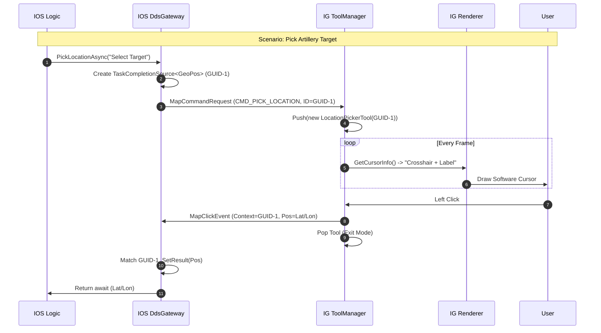
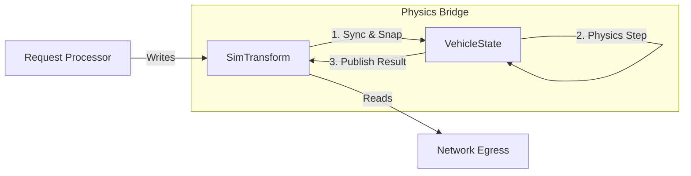
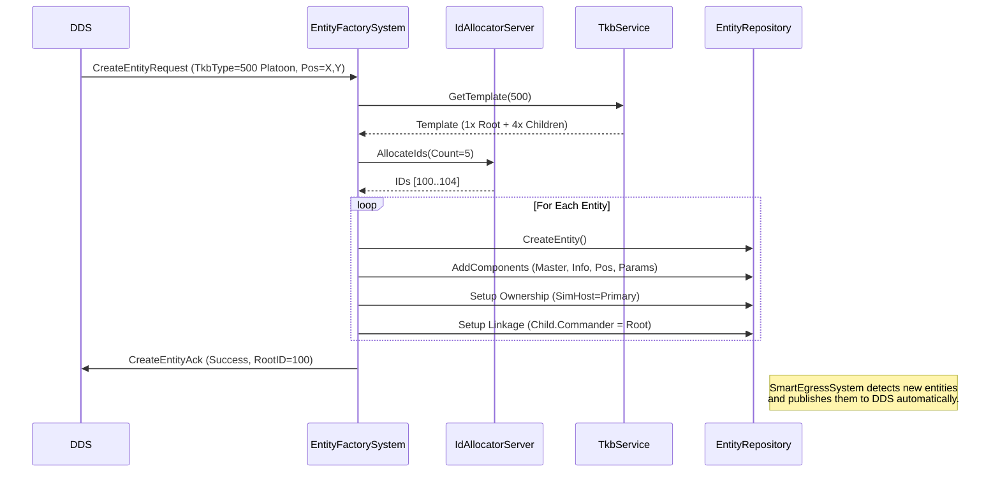
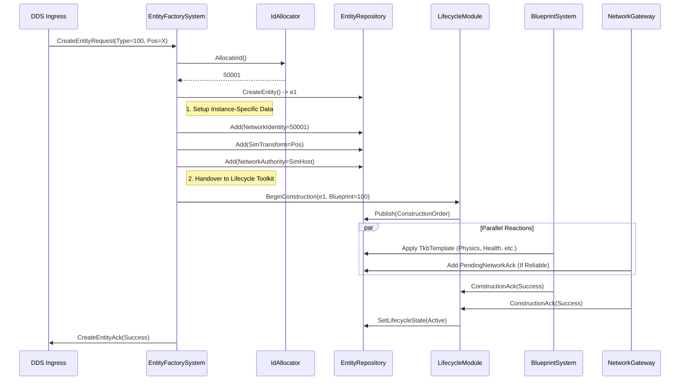

--- user ---------------------------------------------------
pls analyze the carkinem app from the point of view of the UI architecture and the networkdemo app from the point of view of the networking

--- model --------------------------------------------------
Here is an analysis of the two applications based on the provided source code, focusing on their respective architectural strengths.

---

# Part 1: CarKinemApp (UI & Interaction Architecture)

The **CarKinemApp** demonstrates a sophisticated **Tool-based** and **Hybrid Rendering** architecture. It cleanly separates the "Game World" (Vis2D) from the "Editor/Debug UI" (ImGui), interacting through adapter patterns.

### 1. Hybrid Rendering Strategy
The application splits rendering into two distinct passes within the main loop (`FdpApplication.cs`):
*   **World Pass (Raylib):** Handles high-performance 2D rendering of the map, vehicles, and trajectories. It uses a camera system (`MapCamera`) and operates in World Space.
*   **UI Pass (rlImGui):** Handles the editor panels, inspectors, and controls. It operates in Screen Space and sits on top of the world view.

### 2. The Interaction "Tool" Pattern
The most robust architectural feature is the **Map Tool System** (`FDP.Toolkit.Vis2D`). Instead of hardcoding mouse logic into the `Update` loop, interactions are encapsulated in state objects implementing `IMapTool`.

*   **State Machine:** `MapCanvas` maintains a stack of tools.
*   **Encapsulation:**
    *   `StandardInteractionTool`: Handles generic clicking and hovering.
    *   `EntityDragTool`: A modal tool created temporarily when a drag threshold is passed.
    *   `BoxSelectionTool`: Takes over input to draw a selection rectangle.
    *   `PointSequenceTool`: Captures waypoints for path creation.
*   **Decoupling:** Tools receive `RenderContext` and `ISimulationView`, allowing them to modify ECS state (via callbacks or direct command buffers) without the Rendering Layer knowing about specific game logic.

### 3. The Visualizer Adapter Pattern
To render ECS entities without coupling the generic `MapCanvas` to specific game components (like `VehicleState`), the app uses the **Adapter Pattern**:

*   **`IVisualizerAdapter`**: An interface that abstracts how to get a position and how to draw an entity.
*   **`VehicleVisualizer`**: The concrete implementation for CarKinem. It reads `VehicleState` and `VehicleParams` to draw rotated rectangles and debug lines.
*   **`EntityRenderLayer`**: A generic map layer that iterates an `EntityQuery` and delegates the actual drawing to the injected Adapter.

**Benefit:** The underlying `Vis2D` toolkit doesn't know what a "Car" is; it just knows it has an adapter that can render "something" at a position.

### 4. Inspector & Reflection Architecture
The UI uses a **Reflection-based Inspector** (`FDP.Toolkit.ImGui`) to allow real-time editing of components.

*   **`RepositoryAdapter`**: Wraps the generic `EntityRepository` into an `IInspectableSession`.
*   **`ComponentReflector`**: Uses C# Reflection to cache field info of structs (like `VehicleParams`) and generates ImGui widgets (`InputFloat`, `Checkbox`) automatically.
*   **Data Binding:** The UI is Immediate Mode. It reads from the ECS every frame and writes back changes immediately. This eliminates sync bugs common in retained-mode UIs (like WPF/WinForms).

### 5. Selection Management
Selection logic is decoupled to bridge the gap between the 2D Map and the ImGui Inspector:
*   **`SelectionManager`**: The source of truth for what is selected.
*   **`CarKinemInspectorAdapter`**: Implements `IInspectorContext`. It connects the generic `SelectionManager` to the generic `EntityInspectorPanel`, allowing the inspector to highlight the vehicle currently selected in the 2D view.

---

# Part 2: NetworkDemoApp (Networking Architecture)

The **NetworkDemoApp** illustrates a **Data-Oriented, Translation-Based** networking architecture designed for the CycloneDDS middleware. It emphasizes zero-allocation data paths and granular authority.

### 1. The Translator Pattern
The core of the networking architecture is the `IDescriptorTranslator`. This abstracts the conversion between **ECS Components** (Internal Memory) and **DDS Topics** (Network Packets).

*   **Ingress (Read):** `PollIngress(IEntityCommandBuffer, ISimulationView)`
    *   Reads samples from the DDS Reader.
    *   Converts them to ECS components.
    *   Uses `EntityCommandBuffer` to apply changes safely to the ECS.
*   **Egress (Write):** `ScanAndPublish(ISimulationView)`
    *   Queries ECS for entities with specific components.
    *   Checks `NetworkAuthority` (do I own this?).
    *   Writes data to the DDS Writer.

### 2. Specialized Translators
The app demonstrates different strategies for translation:

*   **`AutoCycloneTranslator<T>`**: Zero-boilerplate. Uses `Unsafe` and memory mapping to copy blittable structs directly from ECS to DDS. Used for simple data like `NetworkPosition`.
*   **`FastGeodeticTranslator`**: Contains **Logic within the Translation layer**.
    *   *Egress:* Reads internal Cartesian `DemoPosition`, converts to WGS84 Geodetic (Lat/Lon), writes to DDS.
    *   *Ingress:* Reads WGS84, converts to Cartesian, writes to ECS.
    *   *Benefit:* The simulation runs in Flat space, the network runs in Geodetic space, and the conversion is encapsulated in the network edge.
*   **`FireEventTranslator`**: Handles transient events rather than state. It maps local Entity IDs to persistent Network IDs before sending.

### 3. Ownership & SST (State Synchronization Table)
The architecture supports **Granular Authority**, meaning different nodes can own different *parts* of the same entity.

*   **`DescriptorOwnership`**: A component that tracks who owns which "Topic" (Descriptor) for an entity.
*   **`OwnershipUpdateTranslator`**: A specific translator that listens for ownership change requests (e.g., Node B requesting control of Node A's Turret).
*   **Logic:** Egress systems strictly check `view.HasAuthority(entity, descriptorOrdinal)` before publishing. This allows Node A to drive the tank (Chassis authority) while Node B aims the gun (Turret authority).

### 4. Entity Lifecycle Management (ELM)
Networking implies complex creation/destruction sequences (Ghosts).
*   **`NetworkGatewayModule`**: Acts as a bridge to the `EntityLifecycleModule` (ELM).
*   **Reliable Initialization:** Uses `PendingNetworkAck` components. When an entity is spawned, the Gateway prevents it from becoming "Active" in the ECS until the network confirms peer nodes are aware of it.
*   **`NetworkEntityMap`**: A thread-safe dictionary mapping local ECS IDs (`int`) to persistent Network IDs (`long`). This is critical for resolving references (e.g., "Tank A is shooting at Tank B") across the wire.

### 5. Zero-Copy & Serialization
The architecture prioritizes performance:
*   **Unmanaged Paths:** `CycloneNativeEventTranslator` and `AutoCycloneTranslator` use `MemoryMarshal` and pointers to copy data directly from the network buffer to the ECS component chunk, bypassing the Garbage Collector completely.
*   **Managed Paths:** For complex classes (like `SquadChat` with strings), it falls back to a `ManagedSerializationProvider` (using `BinaryWriter`), isolating the "slow" path from the high-frequency physics/transform paths.

### Summary Comparison

| Feature | **CarKinemApp** (UI Arch) | **NetworkDemoApp** (Net Arch) |
| :--- | :--- | :--- |
| **Primary Abstraction** | `IMapTool` & `IVisualizerAdapter` | `IDescriptorTranslator` |
| **Data Flow** | Immediate Read/Write to ECS (Input) | Ingress/Egress Buffering (DDS) |
| **State Management** | Visual Selection & Tool Stack | Network Authority & Ownership Maps |
| **Coordinate Space** | Screen Space vs. World Space 2D | Cartesian vs. WGS84 Geodetic |
| **Key Pattern** | **Adapter Pattern** (UI <-> Logic) | **Bridge Pattern** (ECS <-> DDS) |

--- user ---------------------------------------------------
IOS-IG design describes the specification of the interoperability between the IOS and the IG map.

bdc-sst-dm contains the data model to be used for the communication - it is derived from the idl mentioned in the ios-ig-design and it replaces it and will the primary definition of the network structures we will be using. 

bdc-sst-rules defines how the DDS protoco is to be used properly.


Pls tell me first how you understand the ios-ig-design, what the IOs and the IG map are supposed to do

--- user ---------------------------------------------------
pls reply

--- model --------------------------------------------------
Based on the documents provided (`ios-ig-design.wiki.md`, `bdc-sst-rules.md`, and `bdc-sst-dm.txt`), here is my analysis of the system architecture and the specific roles of the IOS and IG Map.

### **High-Level Concept**
The system is a distributed, data-centric simulation visualization tool. It decouples the **Logic/Control** (IOS) from the **Rendering/Interaction** (IG) using the **BDC SST (Shared Simulation State)** architecture over DDS.

*   **Philosophy:** "IOS is the Brain; IG is the Eyes and Hands."
*   **Data Model:** The system uses the structures defined in `bdc-sst-dm.txt` (C#), adhering to the lifecycle and ownership rules in `bdc-sst-rules.md`.

---

### **1. IOS (Instructor Operating Station)**
**Role:** The Controller & Logic Engine.
The IOS creates the context for the simulation but does not perform the rendering or raw input handling.

**Responsibilities:**
1.  **State Configuration (The "Brain"):**
    *   Determines which tools are active, which layers are visible, and global styling rules.
    *   Publishes `MapInteractionConfig` (using JSON Merge Patch) to set up the IG's behavior.
2.  **Intent Interpretation:**
    *   It generates **Context IDs** (GUIDs) when activating a tool.
    *   When it receives interaction events (`MapClickEvent`) from the IG, it matches the Context ID to determine *what* the user actually wanted to do (e.g., "Place Tank" vs. "Select Unit").
3.  **Business Logic & Context Menus (Push Model):**
    *   It reacts to `SelectionChangedEvent`.
    *   It calculates valid operations (e.g., "This tank is damaged, so enable 'Repair'").
    *   It **pushes** the menu definition (`ContextActionsUpdate`) to the IG *before* the user even right-clicks, ensuring zero-latency UI.
4.  **Scenario Authority:**
    *   It acts as the bridge to the simulation engine. If a user wants to create a persistent unit, the IOS sends a `CreateEntityRequest` or `UpdateEntityDescriptorRequest` to the SimHost/CGF via the backbone.

---

### **2. IG (Image Generator) Map**
**Role:** The Renderer, Interaction Handler & Local Session Owner.
The IG provides the visual window into the SST data and handles the immediate physical interaction.

**Responsibilities:**
1.  **Rendering (The "Eyes"):**
    *   Subscribes to SST Descriptors (`EntityMaster`, `MapVisualOverlay`, `MapEntitySymbol`, `EntityInfo`).
    *   Visualizes entities based on 3-layer style resolution (JSON Override -> Preset -> TKB Default).
    *   Handles high-performance rendering of map layers and tactical graphics.
2.  **Input Capture (The "Hands"):**
    *   Detects mouse clicks, drags, and hovers.
    *   Performs hit-testing (z-order resolution).
    *   Publishes interaction events (`MapClickEvent`, `DragEvent`) containing the Context ID provided by the IOS.
3.  **Local Prediction & Ownership:**
    *   **Scenario Entities:** For shared entities (owned by SimHost), the IG renders "Ghosts" during drag operations to provide instant feedback, only requesting a commit (`UpdateEntityDescriptorRequest`) on mouse release.
    *   **Session Entities:** For temporary drawings (rulers, scribbles), the IG **owns** the entity directly. It allocates the ID and writes to the Backbone (`MapVisualOverlay`) immediately.
4.  **Feedback Loop:**
    *   Publishes `MapConfigStatus` so the IOS knows the exact state of the renderer (crucial for late-joining IOS instances).

---

### **3. The Communication Protocol (DDS/SST)**

The interaction relies on the strict separation of **Command**, **Event**, and **State**:

| Interaction Type | Direction | Data Model (`bdc-sst-dm.txt`) | Behavior |
| :--- | :--- | :--- | :--- |
| **Configuration** | IOS $\to$ IG | `MapInteractionConfig` | Low-frequency, JSON-based, sets the rules of engagement. |
| **Interaction** | IG $\to$ IOS | `MapClickEvent`, `DragEvent` | High-frequency, IDL/Struct-based, correlates inputs to Context IDs. |
| **Shared State** | Peer-to-Peer | `EntityMaster`, `MapVisualOverlay` | **The Truth.** All entities exist here. Persistence is determined by who owns them (SimHost vs IG). |
| **Lifecycle** | Global | `CreateEntityRequest` | Used to spawn new simulation objects, following BDC SST rules. |

### **Summary of Understanding**
The architecture is designed to solve the latency and complexity issues of legacy maps. By treating the Map interaction as a generic "Entity Manipulation" system and using the BDC SST rules, you avoid creating a custom protocol for every single feature (like "Draw Line" or "Move Tank"). Instead, you have a generic way to manipulate Descriptors, with the IOS providing the semantic meaning and the IG providing the visual interface.

--- user ---------------------------------------------------
IOS-IG-SimHost mock document specifies the testing/mocking app i want to develop, based on the sw components like FDP and cyclone dds.

this thread is all about the architecture of this testing app. pls explan how you understand what the testing app should be doing.


and tell me if you have enought information for discussing how to structure the mock app, what FDP api looks like, what the Cyclone DDS api looks like, how to manipulate entities and descriptors, how to send command to ios map and back, how the simhst can control the time and the recording and playback, how to initiate the inspectors, how to use the map toolkits/framework to implement simple 2d map implementation with full user interaction (pan, zoom, drag/drop, visual editing...) etc, all necessary for discussing the dechnical design?

--- model --------------------------------------------------
### Part 1: Understanding the Testing App Architecture

Based on the **"IOS-IG-SimHost Mocks"** document and the supporting technical files, here is my understanding of the application you want to build:

**Goal:** Create a modular "Proving Ground" application to validate the BDC SST protocol and provide standalone testing tools for the real system components.

**Architecture:**
The application is a **single .NET 8 executable** (or configurable to run as separate processes) utilizing **Raylib** for rendering and **ImGui** for UI. It consists of three isolated logical components ("Mocks") that share **no memory** and communicate **strictly via CycloneDDS**.

#### 1. The IOS Mock (The Controller)
*   **Role:** The "Brain." It tells the IG what to display and requests the SimHost to create entities.
*   **Tech Stack:** **Lightweight.** It does **not** use the full FDP/ECS stack. It uses the raw `CycloneDDS` C# binding.
*   **UI:** A dedicated ImGui panel acting as a "Command Console."
*   **Functionality:**
    *   Sends `MapInteractionConfig` (JSON) to set tools/layers.
    *   Sends `ContextActionsUpdate` to push context menus.
    *   Monitors `MapClickEvent` and `SelectionChangedEvent` via DDS Readers.
    *   Lists sent commands and received responses for debugging.

#### 2. The IG Mock (The View)
*   **Role:** The "Eyes and Hands." It renders the map and handles user input (mouse clicks, pans, zooms).
*   **Tech Stack:** **Heavy.** Uses the full **FDP Engine** (Kernel, ModuleHost, ECS) + **FDP.Toolkit.Vis2D** (Raylib integration).
*   **UI:** A graphical 2D Map view + ImGui diagnostic panels.
*   **Functionality:**
    *   Uses `MapCanvas` and `MapCamera` for navigation.
    *   Implements `IMapTool` to handle drag/drop and drawing.
    *   Translates DDS topics (`MapVisualOverlay`, `EntityMaster`) into visual elements using the **FDP Network Module**.
    *   "Local Prediction": Moves entities locally before committing to the backbone.

#### 3. The SimHost Mock (The State Owner)
*   **Role:** The "World." It owns the entity state and physics.
*   **Tech Stack:** **Heavy.** Uses **FDP Engine**, **FDP.Toolkit.Time**, and **FDP.Toolkit.Replication**.
*   **UI:** ImGui panel for Simulation Control.
*   **Functionality:**
    *   Owns the `EntityMaster` descriptors.
    *   Runs logic systems (e.g., moving cars via `CarKinem` logic).
    *   Manages **Time** (Pause/Play/Rate) via `TimeController`.
    *   Handles **Recording/Replay** via `AsyncRecorder` and `PlaybackController`.

---

### Part 2: Assessment of Available Information

**Yes, I have sufficient information to discuss the technical design and structure the application.**

The provided files cover every layer of the required stack. Here is how the provided context maps to your requirements:

| Requirement | Source of Solution in Provided Context |
| :--- | :--- |
| **FDP API Structure** | **`example-apps.txt`**: Detailed implementation of `FdpApplication`, `EntityRepository`, `ModuleHostKernel`, and `ComponentSystem`. |
| **CycloneDDS API** | **`cyclone-dds-readme.txt`**: Full documentation on `DdsWriter`, `DdsReader`, Attributes (`[DdsTopic]`), and Zero-Copy usage. |
| **Entity/Descriptor Manipulation** | **`bdc-sst-dm.txt`** & **`bdc-sst-rules.md`**: Defines the exact structs (`EntityMaster`, `MapVisualOverlay`) and the rules for ownership and lifecycle. |
| **IOS <-> IG Command Flow** | **`ios-ig-design.wiki.md`**: Describes the specific workflow (Context IDs, JSON Merge Patching) we need to implement in the IOS Mock's ImGui panel. |
| **SimHost Time & Recording** | **`example-apps.txt`** (CarKinem): Provides concrete code for `SwitchableTimeController`, `AsyncRecorder`, and `PlaybackController` integration. |
| **Inspectors (Diagnostics)** | **`example-apps.txt`**: Contains `FDP.Toolkit.ImGui`, `IInspectableSession`, and `RepositoryAdapter` to visualize ECS state. |
| **2D Map Implementation** | **`example-apps.txt`** (Vis2D): Provides `MapCanvas`, `IVisualizerAdapter`, `IMapTool`, and interaction logic (`StandardInteractionTool`, `EntityDragTool`) ready to be adapted for the IG Mock. |
| **Networking Integration** | **`modulehost-cyclone.txt`**: Provides the `CycloneNetworkModule`, `AutoCycloneTranslator`, and `NetworkEntityMap` needed to wire the FDP ECS to DDS. |

**We can proceed immediately to designing the class structure and integration points.** I can specifically show you how to:

1.  Wire the **IOS Mock** to use `DdsWriter<MapInteractionConfig>` directly from ImGui buttons.
2.  Wire the **IG Mock** to use `MapCanvas` and create a custom `IVisualizerAdapter` that draws `MapVisualOverlay` components coming from the network.
3.  Wire the **SimHost Mock** to use `RecorderTickSystem` and `TimeInputSystem`.

**Shall we start by defining the top-level `Program.cs` composition root that toggles these three mocks based on configuration?**

--- user ---------------------------------------------------
First we weill be talking concepts only. Let's discuss what features (functions) each of the mocks needs to have to enable to test all the map features described in ios-ig-design.wiki.md

The simhost part need to combine the functionality from the carkinem demo and the network demo. Form carkinem it should take the simulation part and the imGui simulation control panel (creating entities, controlling simulation time etc - the panel could stay basically same as is in the carkinem demo). From the network demo it should take the distributed/networking way of working with entities and simulation management. That means the entity creation and deletion using life cycle manegement, ownership transfer, time sync etc. SImHost should also implement the recording and playback. The FDP simulation will work in flat coordinates so the translatioon between geo and flat coordinates must be present as well - basically everything from the network demo.

The IG part needs to use same distributed principles in entity handling, so basically the infrastructure from the network demo. from the carkinem demo it can take the inspiration about how to use the toolkits for ui but it should not reuse the application level logic as is. The IG 2d map logic shall follow the requirements from ios-ig-design.wiki.md, supporting the features described in the "legacy maplink implementation" section. 

The IOS part should not use the full FDP stack because i need to demonstrate how to use plain cyclone dds using just the data model from bdc-sst-dm.txt. No ECS, no time sync, basically just a DDS-connected node (still having a unique network identity from the point of view of BDC SST NodeId). This is what real IOS will be using so the mock should as well. 

Let's pls analyze the ios-ig-design.wiki.md and lets define what features needs to be in the IOS (available via its ImGui panel), what the 2d map functionalities (map rendering, UI interaction and editing, local entity management...) we will need to implement to the IG mock to fully cover the requirements.

Note that the mock will serve as a counterparts for testing the other side (IOS mock for testing real IG, IG mock for testing real IOS...) so the features could be minimalistic (nothing fancy) but not at all simplified, they must fully work. Also the goal here is not to have a throwaway prototype, but wi will reatain the IG part as well as the SimHost part as the basis for real implementation in sime different project. So the emphasis is on architectural correctness, modularity, flexibility, reusability etc like in a professional grade systems.

--- model --------------------------------------------------
This is a solid plan. By structuring the mocks this way, we ensure that the **IG** and **SimHost** codebases become the foundation for the actual production systems, while the **IOS Mock** serves as a rigorous, external validation tool (mimicking the "Black Box" nature of the real IOS).

Here is the detailed functional breakdown for each mock, designed for architectural correctness and future reusability.

---

## 1. SimHost Mock (The "World" & State Owner)

**Architecture:** Full FDP Stack (ECS, Kernel, ModuleHost, Network, Time).
**Role:** Authoritative owner of the simulation state. It validates requests and advances physics.

### Key Features & Responsibilities

1.  **Coordinate System Authority:**
    *   **Implementation:** Must host the `FastGeodeticTranslator` (from NetworkDemo).
    *   **Logic:** Stores entities in Flat Cartesian (internal ECS) but publishes/subscribes to WGS84 Geodetic (DDS).
    *   **Reusability:** This logic encapsulates the "Flat Earth vs. Round Earth" problem, reusable for any simulation engine integration.

2.  **Entity Lifecycle Management (ELM) - Server Side:**
    *   **Implementation:** `NetworkGatewayModule` + `EntityLifecycleModule`.
    *   **Feature:** Listens for `CreateEntityRequest` (from IOS).
    *   **Logic:** Validates the request, allocates the Entity ID (via DDS ID Allocator), creates the entity in ECS, and publishes the `EntityMaster`.

3.  **Ownership & Concurrency Authority:**
    *   **Feature:** Handling `UpdateEntityDescriptorRequest` (e.g., when IG moves a tank).
    *   **Logic:** Implements the **Optimistic Locking** validation. Checks `currentVersion` vs. stored `DescriptorOptimisticLock`.
        *   If valid: Updates local component, increments version, publishes new state.
        *   If invalid: Sends failure Ack (IG must rollback).

4.  **Simulation Logic (Movement):**
    *   **Feature:** Simple kinematic movement (Tank driving in circles or straight lines).
    *   **Logic:** `PhysicsSystem` (from NetworkDemo/CarKinem) updating `NetworkPosition` based on `NetworkVelocity`.

5.  **Time & Recording:**
    *   **Feature:** Record/Replay and Time Control.
    *   **Implementation:** Reuse `SwitchableTimeController` (Live/Stepped) and `AsyncRecorder`.
    *   **UI:** ImGui panel to:
        *   Pause/Resume simulation.
        *   Start/Stop Recording.
        *   Load a Recording (Replay).

**SimHost ImGui Panel Requirements:**
*   **"Entity Spawner":** Buttons to spawn persistent entities (e.g., "Spawn Tank Platoon", "Spawn Enemy Unit").
*   **"Time Control":** Play/Pause, Speed Slider (0.1x - 10x).
*   **"Scenario State":** List of active entities with their Ownership status.

---

## 2. IG Mock (The "Map View")

**Architecture:** Full FDP Stack + FDP.Toolkit.Vis2D (Raylib).
**Role:** Rendering, Input Capture, Local/Session Management.
**Reusability Goal:** The "Map Module" (Vis2D integration + Map Logic) should be extracting into a library later.

### Key Features & Responsibilities

1.  **Rendering Engine (Vis2D Integration):**
    *   **Feature:** Render map layers and symbols.
    *   **Logic:**
        *   **Layers:** Background (Satellite), Tactical Graphics (Lines/Polygons), Units (Icons).
        *   **Styling:** Implement the **3-Layer Style Resolution** (JSON > Preset > TKB). Needs a `StyleResolutionSystem` that combines `MapEntitySymbol` and `MapVisualOverlay` data.
        *   **Cluttering:** Implement Zoom-level filtering (hide text/subordinates when zoomed out).

2.  **Interaction Tools (The Tool Stack):**
    *   **Implementation:** `IMapTool` state machine (from CarKinem).
    *   **Tools to Implement:**
        *   `NavigationTool`: Pan/Zoom (Right drag / Wheel).
        *   `SelectionTool`: Click (Hit stack logic) / Box Select. Publishes `SelectionChangedEvent`.
        *   `CreationTool` (Generic): Uses `MapInteractionConfig` to know *what* to create (e.g., "Draw Line"). Publishes `MapClickEvent`.
        *   `EditTool`: Vertex dragging. Implements **Local Prediction** (Ghosting) for shared entities.

3.  **Local vs. Shared Entity Handling:**
    *   **Feature:** Creating "Scribbles" (Local) vs. "Units" (Shared).
    *   **Logic:**
        *   *Local:* IG allocates ID, creates `MapVisualOverlay` locally, publishes directly to DDS (Owner = IG).
        *   *Shared:* IG creates visual "Ghost", sends `CreateEntityRequest` to SimHost.

4.  **Configuration Consumer:**
    *   **Feature:** Reacting to IOS config changes.
    *   **Logic:** Listen to `MapInteractionConfig`. Apply JSON Merge Patch.
        *   Example: IOS sends `{ "view": { "layers": { "units": false } } }` -> IG hides Unit Layer.
    *   **Feedback:** Publish `MapConfigStatus` (Transient Local) so IOS knows the state.

**IG ImGui Panel Requirements:**
*   **"Map Diagnostics":** Show current `ActiveContextId`, `MapGroupId`.
*   **"Selection Debug":** List currently selected IDs.
*   **"Layer Status":** Show computed visibility boolean for each layer.
*   **"Event Log":** Log outgoing `MapClickEvent` and `DragEvent`.

---

## 3. IOS Mock (The "Controller")

**Architecture:** **Raw .NET Console/GUI** (No FDP ECS). Just `CycloneDDS` + `ImGui.NET`.
**Role:** Command Source, Business Logic Simulator.
**Goal:** Prove that a 3rd party (C++ Qt, Web, Java) could control the map just by adhering to the IDL/JSON contract.

### Key Features & Responsibilities

1.  **Configuration Publisher (JSON Construction):**
    *   **Feature:** Setting the "Mode" of the map.
    *   **UI:** Buttons for "Set Mode: Tactical", "Set Mode: Analysis".
    *   **Logic:** Construct and publish `MapInteractionConfig` JSON with different Layer presets and Active Tools.

2.  **Context Management:**
    *   **Feature:** Tracking active workflows.
    *   **Logic:** Generate a `Guid` (ContextId) when a tool button is clicked. Store it. When `MapClickEvent` arrives, verify the ID matches.

3.  **Context Menu Logic (The "Push" Model):**
    *   **Feature:** Telling IG what to show on Right-Click.
    *   **UI:** "Menu Strategy" Dropdown (e.g., "Standard", "Admin", "Restricted").
    *   **Logic:**
        *   Listen for `SelectionChangedEvent`.
        *   Based on selected Strategy, generate JSON menu structure.
        *   Publish `ContextActionsUpdate`.

4.  **Command Sender:**
    *   **Feature:** Imperative commands.
    *   **UI:** Input fields for Lat/Lon + Button "Pan To Location".
    *   **Logic:** Publish `MapCommandRequest` (`CMD_SET_VIEW`).

5.  **Event Monitor:**
    *   **UI:** Scrolling log of received `MapClickEvent`, `DragEvent`, `ContextActionInvoked`.
    *   **Validation:** Display "Valid" (Green) if ContextId matches current, "Stale" (Red) if not.

---

## Shared Infrastructure (The Glue)

To make this modular, we need a **Common Library** used by all three:

1.  **`Hrot.NED`:** Contains the compiled IDL structs (`bdc-sst-dm.txt`).
2.  **`Hrot.Map.Definitions`:**
    *   **TKB Mocks:** A simple static class/JSON defining the known Entity Types (e.g., Type 100 = Tank, Type 8801 = Fire Line) and their default styles.
    *   **Layer Constants:** String constants for layer names (`"units_ground"`, `"tactical_graphics"`).
    *   **Style Enums:** Presets for line styles (Solid, Dashed).

## Summary of Workflows to Test

1.  **Initialization:** IOS starts -> connects to IG -> sends initial Config (Layers ON).
2.  **Pan/Zoom:** IOS sends `CMD_SET_VIEW` -> IG moves camera.
3.  **Selection:** User clicks Tank on IG -> IG sends `SelectionChanged` -> IOS logs it.
4.  **Context Menu:** User selects Tank -> IOS pushes Menu JSON -> User Right-Clicks Tank -> IG shows Menu.
5.  **Creation (Shared):** IOS sets "Place Tank" tool -> User clicks IG -> IG sends Event -> IOS requests SimHost -> SimHost spawns Tank -> IG sees Tank.
6.  **Creation (Local):** IOS sets "Draw Ruler" tool -> User drags IG -> IG publishes `MapVisualOverlay` directly -> IOS sees new overlay in list.
7.  **Drag (Shared):** User drags Tank on IG -> IG moves Ghost -> Mouse Up -> IG requests SimHost -> SimHost updates pos -> Tank snaps.

This scope covers all critical aspects of the design (Ownership, Lifecycle, Interaction, Configuration) without getting bogged down in actual military simulation logic.

--- user ---------------------------------------------------
I think the simhost should support the car kinematics and control the cars from the car kinem demo with all the formation support, path editing, path rendering and path following and avoidance features. The focus here is to have some realworld entities that behave in believable way and we can define rouotes for them etc - this part dos not need to be simple as it is already implemented in the carkinem demo and we will reuse it from there.


And a big apologize - i  completely forgot an important part - we need to implement not just a 2d map, but also the ORBAT and missions! See the description below. This must be integrated into all parts. IOS will be able to create and edit entities at different level in the orbat hierarchy incuding the control of their missions and showing the orbat tree, IG map needs to be able to show the orbat entities with appropriate symbols (inclusing some labels what task is currently executing etc.) and some IOS-provided customization, SimHost needs to support the mission storing and execution including some tasks like MoveToPoint, Wait etc. Simhost should also host the Id allocation server.


# Design Document: BDC SST ORBAT & Mission Control System

**Version:** 1.0

**Status:** Draft

**Context:** Migration from GBB (Shared Memory) to BDC SST (DDS/ECS)

## 1. Executive Summary

This document defines the implementation of the **Order of Battle (ORBAT)** hierarchy and **Entity Mission Control** and mechanism of **Changing Entity State** within the BDC SST (Simulation State) architecture. The goal is to replace the direct GBB control with a DDS-based BDC SST approach.

The system allows distributed components (GUI, CGF) to interact asynchronously via DDS middleware, utilizing partial ownership of entities to manage logical command structures and tactical behavior definitions.


### MAIN PARTS
1.  ORBAT parent id stored in `EntityInfo` descriptor
2.  Missions stored in `EntityMission` descriptor, holding list of `MissionTasks` (each having triggers and a behavior)
3.  Specific mission editing message `MissionControlRequest` allowing to add a task, reset to specific task etc.
4.  Generic entity state change request via `UpdateEntityDescriptorRequest`  for changing any entity descriptor (similar to SendDescriptorAsMessage as in GBB). Acknowledged by `UpdateEntityDescriptorAck`.
5.  Generic entity creation request via `CreateEntityRequest` carrying set of desriptors. Acknowledged by `CreateEntityAck` carrying the newly created entity id.

### MISSING PARTS (to be designed)
1. JSON schema for most commonly used task trigger parameters
2. JSON schema for most commonly used behavior parameters

## 2. Architectural Concepts

### 2.1. The ECS Pattern in SST

In BDC SST, an "Entity" is not a monolithic object. It is a composition of loosely coupled Descriptors (DDS Topics) tied together by a common `EntityId`.

- **EntityMaster:** Controls the lifecycle. If this descriptor is disposed, the entity ceases to exist.
- **Partial Ownership:** A Simulation Node (e.g., CGF) may own the `EntityMission` descriptor, while a different node (e.g., GUI or Umpire) might request changes to `EntityInfo`.

See [BDC SST rules](/Products-and-components/Hrot.Infra/BDC/BDC-SST-Principles)
See [BDC SST Data Model Basics](/Products-and-components/Hrot.Infra/BDC/BDC-SST-Data-Model-Basics)

## 3. Data Model: ORBAT (Order of Battle)

The ORBAT represents the **logical command hierarchy**, which is distinct from physical attachments (turrets attached to hulls).

### 3.1. Hierarchy Definition

The hierarchy is defined implicitly via a "Parent Pointer" approach within the `EntityInfo` descriptor.

- **Taskforce (Root):** An entity with no parent. `OrbatParentId = 0`.
- **Unit/Individual:** An entity pointing to another entity. `OrbatParentId = [ParentEntityId]`.

### 3.2. Tree Reconstruction (GUI Logic)

Since DDS data arrives asynchronously and flatly, the GUI must reconstruct the tree dynamically:

1. **Ingest:** Subscribe to `EntityInfo`.
2. **Index:** Store entities in a map/hash table keyed by `EntityId`.
3. **Link:** For every entity, look up its `OrbatParentId`.
   - If `0`: Add to top-level view.
   - If `>0` and Parent exists: Add as a child node of the Parent.
   - If `>0` and Parent missing: Place in a temporary "Orphan" list until the Parent descriptor arrives.

## 4. Data Model: Mission System

A Mission is a linear sequence of Tasks. A Task defines a specific Behavior (behavior) and conditions (Triggers).

### 4.1. Task Identification

- **Problem:** Using array indices (0, 1, 2) is unsafe in a distributed system where the mission might change while a command is in-flight.
- **Solution:** Every Task is assigned a **GUID (String)**. Commands reference this GUID (`TargetTaskId`).

### 4.2. Mission Descriptors

The system introduces a specialized descriptor: **`EntityMission`**.

- **Owner:** CGF (Computer Generated Forces).
- **Content:** Contains the `MissionPlan`—the list of tasks and the pointer to the currently active task.
- **Payloads:** Behaviors and Triggers use JSON strings for parameters. This allows flexibility without changing the IDL, but requires strict Schema validation at runtime.

## 5. Command Interface (GUI to CGF)

The GUI cannot write to `EntityMission` directly. It must publish a **`MissionControlRequest`**.

### 5.1. The "Jump to Task" Capability

The GUI can force an entity to restart execution from a specific task without re-uploading the whole mission.

1. GUI sends `CMD_JUMP_TO_TASK` with `TargetTaskId`.
2. CGF receives request.
3. CGF scans current mission for that ID.
4. CGF sets all preceding tasks to `TASK_SKIPPED` or `TASK_DONE`.
5. CGF sets target task to `TASK_ACTIVE` and initializes behavior.

### 5.2. The "Replace Mission" Capability

The GUI can upload a completely new mission plan.

1. GUI constructs a `MissionPlan` struct (Task List + Active Task ID).
2. GUI wraps it in `CMD_REPLACE_MISSION`.
3. CGF atomically replaces the internal plan with the new data.


## 6. IG model switches control

Principles:
1.  Each model (entity) exposes a set of **controllable** **properties**, for example:
    1.  Vehicle door opened/closed
    2.  Mast risen/retracted
    3.  Camouflage type
2.  Different models expose different properties depending on their capabilities.
3.  What properties are supported is published on the network.
4.  UI/CGF send **requests to change the value of a property**, like 'set door to open', 'set camo to desert' etc.
5.  UI/CGF can **ask about the value of concrete property** via query message, IG (SimHost) responds with a reply message.

Details about IG imnplementaion to be found in different document (available soon - Michal Toth)

## 7. Interface Definition Language (IDL)

The following IDL defines the data structures using **PascalCase** naming conventions and **inline types** for clarity.

``` c++
// ==============================================================================
// 1. ENUMS
// ==============================================================================

enum eTaskState {
    TASK_PLANNED,   // Waiting for triggers or sequence
    TASK_ACTIVE,    // Currently executing
    TASK_DONE,      // Completed successfully
    TASK_FAILED,    // Failed execution
    TASK_SKIPPED    // Skipped because a later task was forced active
};

enum eMissionCommandType {
    CMD_JUMP_TO_TASK,       // Switch active task to a specific ID
    CMD_APPEND_TASK,        // Add a single task to the end
    CMD_INSERT_TASK,        // Insert a task (specifics handled by logic/index)
    CMD_REPLACE_MISSION,    // Wipe everything and set a new full mission
    CMD_ABORT_ALL           // Stop everything
};

// ==============================================================================
// 2. STRUCTS (DATA BUILDING BLOCKS)
// ==============================================================================

// GUID
@final
struct CorrelationId {
   unsigned long long high;
   unsigned long long low;
};


struct MissionTrigger {
    string Type;          // e.g., "LineCrossed", "TimeElapsed"
    string Params;        // JSON string (Schema validated)
};

struct MissionTask {
    CorrelationId TaskId;        // Unique stringified GUID
    string ExecutingEngine;      // who is going to execute the behavior "CGFX" etc.
    string BehaviorId;           // e.g., "MoveToLocation", could be also bkbId od the behavior (for CGFX)
    string BehaviorParams;       // JSON string (Schema validated) for the behavior
    
    sequence<MissionTrigger> Triggers; 
    
    eTaskState State;     // Current status of this specific task
};

// Reusable structure for the "Content" of a mission.
// Used in both the EntityMission state and the REPLACE_MISSION command.
struct MissionPlan {
    // ID of the task currently running. 
    // Must match one of the TaskIds in the Tasks sequence.
    CorrelationId ActiveTaskId; 
    
    // Ordered list of all tasks
    sequence<MissionTask> Tasks;
};

// ==============================================================================
// 3. TOPIC: ENTITY INFO (ORBAT HIERARCHY)
// ==============================================================================

struct EntityInfo {
    long long EntityId; //@key
    
    string Name;

    eForceIdentifier ForceIdentifier;
    
    // ORBAT PARENT
    // 0 = This entity is a Root/Taskforce (No parent).
    // >0 = EntityId of the parent unit.
    long long CommanderId; 
};

#pragma topic EntityInfo
#pragma keylist EntityInfo EntityId

// ==============================================================================
// 4. TOPIC: ENTITY MISSION (STATE)
// ==============================================================================

struct EntityMission {
    long long EntityId; //@key
    
    // The current state of the mission
    MissionPlan Plan;
};

#pragma topic EntityMission
#pragma keylist EntityMission EntityId

// ==============================================================================
// 5. COMMAND INTERFACE (GUI -> CGF)
// ==============================================================================

union MissionCommandPayload switch (eMissionCommandType) {
    
    // CASE: Switch execution to a specific existing task
    case CMD_JUMP_TO_TASK:
        CorrelationId TargetTaskId;
        
    // CASE: Add new single tasks
    case CMD_APPEND_TASK:
    case CMD_INSERT_TASK:
        MissionTask NewTaskData;
        
    // CASE: Full Mission Upload
    // Reuses the MissionPlan struct to set list + active index atomically
    case CMD_REPLACE_MISSION:
        MissionPlan FullMissionData;

    // CASE: Commands with no parameters
    case CMD_ABORT_ALL:
        boolean UnusedPlaceholder; 
};

struct MissionControlRequest {
    // Unique ID for this specific request
    CorrelationId RequestId; //@key
    
    // The entity to control
    long long TargetEntityId;
    
    // The polymorphic payload
    MissionCommandPayload Payload;
};

#pragma topic MissionControlRequest
#pragma keylist MissionControlRequest RequestId

```

## 7. Implementation Guidelines

### 7.1. JSON Safety

- **Validation:** The CGF MUST NOT simply `JSON.parse()` blind data. It must validate `BehaviorParams` against a known schema for that `BehaviorId` inside a try-catch block.
- **Failure:** If parsing fails, the task state should move to `TASK_FAILED`, and an error log should be published. The simulation must not crash.

### 7.2. TKB Integration

- When a Unit is created based on a TKB (Tactical Knowledge Base) template, the Creator (CGF) is responsible for:
  1. Publishing the Unit's `EntityMaster` and `EntityInfo`.
  2. Looking up the TKB template to see what subordinates it has.
  3. Iteratively publishing `EntityMaster`/`EntityInfo` for all subordinates, setting their `OrbatParentId` to the Unit's ID.

### 7.3. Concurrency Edges

- **Orphans:** The GUI must robustly handle the case where a Child Entity descriptor arrives 500ms before the Parent Entity descriptor. Do not discard the child; render it in a temporary "Unassigned" folder.
- **Stale Commands:** If the GUI sends `CMD_JUMP_TO_TASK` with an ID that no longer exists (because the mission changed in the background), the CGF must ignore the request and log a warning.


## Unit creation note

IOS needs to task the system to create a whole unit containing subordinates.

BDC should approach this in a simple way:
 - A unit definiton is just another TKB record, specifying
   - what sub-units to create
 - The unit creation is as simple as single-entity creation, using same entity creation mechanism.
 - Single ACK (entity created) should be enough as such operation should be atomic (either whole unit created or nothing).

--- model --------------------------------------------------
This significantly expands the scope and complexity of the mocks, particularly for the **SimHost** (which now becomes a full-fledged simulation server) and the **IOS** (which now needs to manage hierarchies and mission planning).

Here is the revised functional breakdown and architectural plan incorporating ORBAT and Mission Control.

---

## 1. SimHost Mock (Simulation Server & Mission Executor)

**Updated Role:** Not just physics, but also the **CGF (Computer Generated Forces)** logic engine. It manages the lifecycle of complex unit hierarchies and executes mission plans.

### Expanded Features

1.  **Car Kinematics (Reused from Demo):**
    *   **Logic:** `CarKinematicsSystem` (Movement, Steering), `FormationTargetSystem` (Formation logic).
    *   **Integration:** Must bridge the *Flat Cartesian* physics of the car demo with the *Geodetic* coordinates of the BDC SST protocol.
    *   **Data:** Updates `NetworkPosition`, `NetworkVelocity`, `NetworkOrientation`.

2.  **ORBAT Management (Hierarchy):**
    *   **Feature:** Spawning a "Platoon" creates a Parent entity + 4 Child entities.
    *   **Logic:**
        *   Listens for `CreateEntityRequest`.
        *   If the requested Type is a "Composite Unit" (e.g., Tank Platoon), it recursively creates subordinates.
        *   Sets `CommanderId` in `EntityInfo` for children to point to the parent.
        *   Publishes `EntityInfo` for all generated entities.

3.  **Mission Execution Engine:**
    *   **Implementation:** A new `MissionSystem` in ECS.
    *   **State:** Owns `EntityMission` descriptor for each AI entity.
    *   **Logic:**
        *   Parses `MissionPlan`.
        *   Executes the `ActiveTaskId`.
        *   **Behaviors:** Implement simplified versions of:
            *   `MoveToLocation`: Uses CarKinem pathfinding to drive to a point.
            *   `Wait`: Idles for N seconds.
            *   `Patrol`: Loops between waypoints.
        *   **Triggers:** Monitors conditions (e.g., "Distance to Point < 10m") to transition `TaskState` from `ACTIVE` to `DONE` and advance the plan.

4.  **Mission Control Handler:**
    *   **Feature:** Reacting to dynamic mission changes.
    *   **Logic:** Listens for `MissionControlRequest`.
    *   **Actions:**
        *   `CMD_JUMP_TO_TASK`: Updates `ActiveTaskId` in `EntityMission`.
        *   `CMD_REPLACE_MISSION`: Replaces the entire plan.
        *   `CMD_ABORT_ALL`: Clears the plan, stops the car.

**SimHost UI Updates:**
*   **"ORBAT Monitor":** Tree view showing the hierarchy of spawned entities.
*   **"Mission Inspector":** Select an entity to see its current Task, State, and Progress.

---

## 2. IOS Mock (The Commander)

**Updated Role:** A full command-and-control station. It must visualize the hierarchy and provide tools to author missions.

### Expanded Features

1.  **ORBAT Tree View (UI):**
    *   **Data:** Subscribes to `EntityInfo`.
    *   **Logic:** Reconstructs the parent/child tree dynamically from the flat list of entities. Handles "Orphans" (children arriving before parents).
    *   **Interaction:** Clicking a node selects the entity (sends `CMD_SET_SELECTION` to IG).

2.  **Mission Editor (UI):**
    *   **UI:** A panel to view/edit the mission of the selected entity.
    *   **Features:**
        *   List of Tasks (Drag & drop reordering - *local UI only*).
        *   "Add Task" button (Move, Wait).
        *   "Upload Mission" button: Publishes `MissionControlRequest` (REPLACE).
        *   "Jump To" button on a task row: Publishes `MissionControlRequest` (JUMP).

3.  **Complex Creation Tools:**
    *   **UI:** "Create Platoon" button.
    *   **Logic:** Sends `CreateEntityRequest` specifying the TKB Type for a "Platoon". Relies on SimHost to expand this into multiple entities.

---

## 3. IG Mock (The Tactical View)

**Updated Role:** Needs to visualize the hierarchy and mission status.

### Expanded Features

1.  **Symbol Aggregation (Visualization):**
    *   **Logic:** Read `EntityInfo.CommanderId`.
    *   **Rendering:**
        *   Draw lines connecting subordinates to their commander?
        *   **Cluttering:** If "Aggregate View" is enabled, hide subordinates and only show the Commander symbol with a "strength" indicator.

2.  **Mission Visualization:**
    *   **Logic:** Read `EntityMission`.
    *   **Rendering:**
        *   Draw the *Waypoints* of the current mission on the map (lines connecting MoveToLocation points).
        *   Show a label next to the entity: "Moving to WP1" or "Waiting".

---

## Revised Technical Architecture for SimHost (CarKinem Integration)

Since we are reusing the **CarKinem** logic, the SimHost architecture will look like this:

1.  **Core Simulation Loop:** Running `CarKinematicsSystem` on `SteppingTimeController`.
2.  **BDC Bridge System (The Adapter):**
    *   **Input:** Reads `EntityMission` (DDS) -> Translates to `CarInput` / `NavigationPath` (Internal CarKinem Component).
    *   **Output:** Reads `VehicleState` (Internal Position) -> Translates to `NetworkPosition` (Geodetic DDS).
3.  **Hierarchy System:**
    *   Manages the `FormationMember` components from CarKinem, syncing them with `EntityInfo.CommanderId`.

## Updated Plan of Action

We need to start by defining the **Data Model** changes for Mission/ORBAT in C# struct definitions (`bdc-sst-dm.txt`), as they are currently just in the markdown text.

**Shall we start with:**
1.  **Updating the `bdc-sst-dm.txt`** to include `EntityInfo`, `EntityMission`, `MissionTask`, and `MissionControlRequest` structs?
2.  **Designing the SimHost "MissionExecutor" system** that bridges these descriptors to the CarKinem logic?

--- user ---------------------------------------------------
the DDS data model (the csharp data structs for direct use by the Cyclone dds) for all parts is already defined in the bdc-sst-dm.txt so no update is necessary, all prepared already and ready to use.

pls let's enumerate what all ECS components we will need for the whole system.

--- model --------------------------------------------------
This enumeration covers the ECS components required for the **IG Mock** and **SimHost Mock**. The IOS Mock is excluded from this list as it operates on raw DDS structures without an ECS.

The components are categorized by their architectural layer.

### 1. Network Mirror Components (Toolkit.Replication)
*These components exist on both IG and SimHost. They directly mirror the DDS data defined in `bdc-sst-dm.txt`. The Network Module automatically synchronizes these.*

| Component Name | Usage |
| :--- | :--- |
| **`NetworkIdentity`** | Holds the global `long EntityId`. Keys every entity to the network map. |
| **`NetworkAuthority`** | Tracks `PrimaryOwnerId` vs `LocalNodeId`. Used to determine if we can write to descriptors. |
| **`NetworkPosition`** | **Buffered State.** Holds the *Flat Cartesian* position derived from the DDS `GeoPoint`. The `FastGeodeticTranslator` updates this. |
| **`NetworkVelocity`** | **Buffered State.** Linear velocity vector (for dead reckoning). |
| **`NetworkOrientation`** | **Buffered State.** Quaternion orientation. |
| **`EntityMaster`** | **Managed Component.** Wraps the `EntityMaster` struct (Type ID, Flags). Controls lifecycle. |
| **`EntityInfo`** | **Managed Component.** Wraps the `EntityInfo` struct (Name, ForceIdentifier, **CommanderId** for ORBAT). |
| **`EntityMission`** | **Managed Component.** Wraps the `EntityMission` struct (MissionPlan, ActiveTaskId). |
| **`MapVisualOverlay`** | **Managed Component.** Wraps the overlay definition (Points, Style, PersistenceMode). |
| **`MapEntitySymbol`** | **Managed Component.** Wraps symbol overrides (StyleSetId, StyleParamsJson). |
| **`MapInteractionConfig`** | **Singleton (Managed).** Stores the current configuration received from IOS (ActiveTool, Layers). |

---

### 2. SimHost Internal Components (Simulation Logic)
*These components exist ONLY on the SimHost. They drive the behavior and physics.*

#### A. Physics & Kinematics (Reused from CarKinem)
| Component Name | Fields | Usage |
| :--- | :--- | :--- |
| **`VehicleState`** | `Pos`, `Velocity`, `Heading`, `SteerAngle` | High-fidelity internal physics state. Drove by `CarKinematicsSystem`, synced *to* `NetworkPosition`. |
| **`VehicleParams`** | `MaxSpeed`, `TurnRate`, `Length`, `Width` | Static config for the physics engine. |
| **`NavigationState`** | `TargetPoint`, `PathWaypoints`, `IsMoving` | Internal state for the car's pathfinding logic. |

#### B. Mission & Hierarchy Logic (New)
| Component Name | Fields | Usage |
| :--- | :--- | :--- |
| **`MissionExecutor`** | `CurrentTaskGuid`, `TaskStartTime`, `State` (Moving/Waiting) | **Runtime state** of the mission. Used to track timers (e.g., "Wait 10s") or path progress vs. the generic `EntityMission` data. |
| **`OrbatNode`** | `ParentEntity`, `ChildrenList` (NativeList) | Optimized internal tree structure for hierarchy logic (derived from `EntityInfo`). |
| **`FormationState`** | `FormationType`, `RelativeOffset`, `LeaderEntity` | Bridges the generic ORBAT (`EntityInfo`) with specific CarKinem formation logic. |

---

### 3. IG Internal Components (Visualization & Interaction)
*These components exist ONLY on the IG. They handle rendering, input, and local state.*

#### A. Rendering & Styling
| Component Name | Fields | Usage |
| :--- | :--- | :--- |
| **`InterpolatedTransform`** | `Position`, `Rotation` | Smoothed visual position for rendering (interpolates between Network updates). |
| **`ResolvedStyle`** | `IconTextureId`, `Color`, `LabelText`, `Scale` | The final visual properties after merging TKB defaults + Presets + JSON Overrides. Calculated by `StyleResolutionSystem`. |
| **`CullingState`** | `IsVisible`, `DistanceToCamera` | Used by the renderer to skip invisible entities or apply LOD (decluttering). |
| **`MapLayerMask`** | `LayerBitmask` | Which layers this entity belongs to (mapped from TKB Type). Checked against global config for visibility. |

#### B. Interaction State
| Component Name | Fields | Usage |
| :--- | :--- | :--- |
| **`SelectionState`** | `IsSelected`, `SelectionOrder` | Tag for currently selected entities. Used to render halos/boxes. |
| **`HoverState`** | `IsHovered` | Tag for the entity currently under the mouse cursor. |
| **`LocalDragGhost`** | `OriginalEntityId`, `Offset` | **Tag Component.** Marks an entity as a "Ghost" created during a drag operation (Scenario B in design). |
| **`TransientLifetime`** | `TimeRemaining` | For local effects (explosions, clicks) that disappear automatically. |

---

### 4. Infrastructure Singletons (Common)
*Global state accessible to systems.*

| Component Name | Usage |
| :--- | :--- |
| **`GlobalTime`** | Current simulation time, DeltaTime, FrameCount. |
| **`MapCameraState`** | (IG Only) Center, Zoom Level, Screen-to-World matrix. |
| **`InputSnapshot`** | (IG Only) Mouse position, Click states, Key states (abstraction over Raylib). |
| **`IdAllocatorService`** | (SimHost Only) Handle to the DdsIdAllocator for generating new Entity IDs. |

### Summary of Data Flow (ECS Perspective)

1.  **SimHost:**
    *   **Input:** `EntityMission` (Network) -> `MissionExecutor` (Logic) -> `NavigationState` (Logic).
    *   **Physics:** `NavigationState` -> `VehicleState` (Physics) -> `NetworkPosition` (Network).
2.  **IG:**
    *   **Input:** `NetworkPosition` (Network) -> `InterpolatedTransform` (Visual).
    *   **Styling:** `EntityInfo` + `MapEntitySymbol` -> `ResolvedStyle` (Visual).
    *   **Feedback:** Mouse Input -> `LocalDragGhost` -> `UpdateEntityDescriptorRequest` (DDS Message, not component).

--- user ---------------------------------------------------
the DDS network descriptors for communicating position and orientation should be the WorldPos and WorldPos (attached). 

EntityMaster is NOT a managed component (does not contain any managed data type) - this one is "native", unmanaged. But it does not affect much, just a minor note.

NetworkIdentity, NetworkAuthority are NOT part of the DDS BDC SST descriptors - they might be some internal representation, but the BDC SST rules say that the network entity id is part of each DDS descriptor (so no extra identity needed elsewhere), the owner information (the NodeId) is provided by the Cyclone DDS wrapper based on the last writer so no extra NetworkAuthority is necessary on DDS. 

NetworkPosition and NetworkVelocity and NetworkOrientation also not part of the DDS descriptors because they are combined to one single DDS descriptor WorldPos which exists also in dead-reckoning friendly variant WorldPos (optional, replacing the GeopSpatial for entities where dead reckoning is desired).

Translators should take the DDS descriptors and translate into suitable ECS components as needed.

--- model --------------------------------------------------
Thanks for the clarification. This distinction is crucial for the architecture.

Here is the corrected breakdown of **ECS Components** and how they map to the **DDS Descriptors** you provided.

### Architectural Concept: The "Translation Layer"

The system relies on **Translators** to bridge the gap between the **Network Domain** (Geodetic, Sparse, DDS-controlled) and the **Simulation Domain** (Flat Cartesian, Continuous, ECS-controlled).

1.  **DDS Side:** Uses `WorldPos` / `WorldPos` (WGS84 Lat/Lon/Alt + HPR).
2.  **ECS Side:** Uses `NetworkPosition` / `NetworkOrientation` (Vector3 Flat + Quaternion).
3.  **Translator:** Converts coordinates on the fly.

---

### 1. ECS Components (Internal State)

These components exist inside the `EntityRepository` of the **IG** and **SimHost**. They are *not* sent over the network directly; they are populated by Translators or Simulation Systems.

#### A. Infrastructure & Networking (Toolkit.Replication)
*Used to manage identity, authority, and coordinate conversion.*

| Component Name | Data / Fields | Purpose |
| :--- | :--- | :--- |
| **`NetworkIdentity`** | `long EntityId` | The primary key. Links the local ECS entity to the global DDS topic key. |
| **`NetworkAuthority`** | `int PrimaryOwnerId`<br>`int LocalNodeId` | Derived from DDS Sample Metadata (Last Writer).<br>Systems check this to decide: *Simulate* (Owner) vs. *Interpolate* (Proxy). |
| **`NetworkPosition`** | `Vector3 Value` | **Flat Cartesian** position (meters from local origin).<br>*SimHost:* Written by Physics, Read by Translator.<br>*IG:* Written by Translator, Read by Renderer. |
| **`NetworkOrientation`** | `Quaternion Value` | Rotation in local flat space.<br>Converted to/from `EulerOri` (Degrees) by Translator. |
| **`NetworkVelocity`** | `Vector3 Value` | Linear velocity (Flat). Used for Dead Reckoning on IG side if `WorldPos` is used. |
| **`EntityMaster`** | `EntityMaster` (Struct) | Wraps the raw `EntityMaster` DDS struct (Type IDs, Flags). Used for lifecycle logic. |

#### B. Simulation Logic (SimHost Only)
*Reused from CarKinem logic, driving the physical behavior.*

| Component Name | Data / Fields | Purpose |
| :--- | :--- | :--- |
| **`VehicleState`** | `Vector2 Pos`, `float Heading` | The internal physics state of the car model. |
| **`VehicleParams`** | `MaxSpeed`, `TurnRate` | Static vehicle properties. |
| **`MissionExecutor`** | `Guid ActiveTask`, `State` | Tracks the execution status of the current mission task (e.g., "Moving", "Waiting"). |
| **`OrbatNode`** | `Entity Parent`, `List<Entity> Children` | Optimized tree structure built from `EntityInfo` for hierarchy logic. |

#### C. Visualization & Interaction (IG Only)
*Used for rendering and user input handling.*

| Component Name | Data / Fields | Purpose |
| :--- | :--- | :--- |
| **`InterpolatedTransform`** | `Vector3 Pos`, `Quat Rot` | The smoothed visual transform. The `InterpolationSystem` blends `NetworkPosition` snapshots to create this. |
| **`MapVisualOverlay`** | `MapVisualOverlay` (Struct) | Stores the raw overlay data (lines/areas) received from DDS. |
| **`ResolvedStyle`** | `Color`, `IconId`, `Label` | The final computed style for the entity (result of TKB + Presets + Overrides). |
| **`SelectionState`** | `bool IsSelected` | Local tag for UI selection. |
| **`HoverState`** | `bool IsHovered` | Local tag for mouse-over highlighting. |

---

### 2. The Translator Pipeline

This is how data moves between the ECS components and the DDS Topics.

#### 1. Geodetic Translator (Physics)
*   **Topic:** `WorldPos` (or `WorldPos`)
*   **SimHost (Egress):**
    1.  Reads `NetworkPosition` (Cartesian).
    2.  Converts to `GeoPoint` (Lat/Lon/Alt) using `IGeographicTransform`.
    3.  Reads `NetworkOrientation` (Quaternion).
    4.  Converts to `EulerOri` (Heading/Pitch/Roll degrees).
    5.  Publishes `WorldPos`.
*   **IG (Ingress):**
    1.  Receives `WorldPos`.
    2.  Converts `GeoPoint` $\to$ `NetworkPosition` (Cartesian).
    3.  Converts `EulerOri` $\to$ `NetworkOrientation` (Quaternion).
    4.  Updates ECS.

#### 2. Master Translator (Lifecycle)
*   **Topic:** `EntityMaster`
*   **SimHost:** Publishes when creating/deleting entities.
*   **IG:** Listens. When a new `EntityMaster` appears, it creates a local Ghost Entity and attaches `NetworkIdentity`. When disposed, it destroys the local entity.

#### 3. Info/Mission Translators (Logic)
*   **Topics:** `EntityInfo`, `EntityMission`, `MapEntitySymbol`, `MapVisualOverlay`
*   **Behavior:** These are typically **1:1 mappings**. The Translator reads the DDS structure and sets the corresponding Managed Component on the entity.
    *   *Example:* `EntityMissionTranslator` reads the `EntityMission` topic and updates the `EntityMission` component on the entity.

---

### 3. Summary of Topics (DDS Data Model)

These are the actual types on the wire (from `bdc-sst-dm.txt` + `SimDescriptors.cs` + `Common.cs`):

1.  **`EntityMaster`** (Key: EntityId) - Lifecycle & Type.
2.  **`EntityInfo`** (Key: EntityId) - Name, Side, CommanderId (ORBAT).
3.  **`WorldPos`** / **`WorldPos`** (Key: EntityId) - Position & Rotation.
4.  **`EntityMission`** (Key: EntityId) - Mission Plan.
5.  **`MapVisualOverlay`** (Key: EntityId) - Geometry Lines/Areas.
6.  **`MapEntitySymbol`** (Key: EntityId + GroupId) - Symbol overrides.
7.  **`MapInteractionConfig`** / **`MapConfigStatus`** - IOS<->IG handshaking.
8.  **`MapClickEvent`** / **`SelectionChangedEvent`** / **`DragEvent`** - User Interaction.
9.  **Requests:** `CreateEntityRequest`, `UpdateEntityDescriptorRequest`, `MissionControlRequest`.

This structure keeps the Network Layer (DDS) clean and standard-compliant while allowing the Internal Layer (ECS) to be optimized for simulation (SimHost) or rendering (IG).

--- user ---------------------------------------------------
What ECS components are used to store calculated new position/orientation/velocity of cars by the simhost physics? 

Is is the NetworkPosition directly? If so, does it need to be called NetworkPosition if it is actually the internal position? If not, how we convert the internal position into NetworkPostition and is that necessary?

--- model --------------------------------------------------
Based on the separation of concerns between **Simulation Logic** (CarKinem) and **Network Infrastructure** (Toolkit), here is the correct architectural approach.

### 1. The Physics Components (Internal State)
The SimHost physics engine (`CarKinematicsSystem`) should **not** write to `NetworkPosition` directly. Instead, it should use the components defined in the **CarKinem** demo.

**Component:** `VehicleState`
*   **Role:** Holds the raw data required for the kinematic model.
*   **Data:**
    *   `Vector2 Position` (Internal 2D flat coordinates)
    *   `float Heading` (Internal angle)
    *   `float Speed`
    *   `float SteeringAngle`
*   **Why separate?** The physics engine requires specific data (like steering angle) that the generic network protocol doesn't care about. It also might run at a different frequency or use 2D vectors, whereas the network pipeline expects 3D.

### 2. The Network Buffer Components (The Bridge)
To prepare data for the network, we need a generic intermediate layer. This is where `NetworkPosition` comes in.

**Component:** `NetworkPosition`, `NetworkOrientation`, `NetworkVelocity`
*   **Role:** The canonical **Flat Cartesian** representation of the entity, ready for Geodetic translation.
*   **Why "Network" prefix?** It indicates that this data is **staged for replication**.
    *   On the **SimHost (Owner)**, this is the *Output Buffer* (Physics writes here -> Translator reads).
    *   On the **IG (Ghost)**, this is the *Input Buffer* (Translator writes here -> Renderer reads).

### 3. The Data Flow Pipeline

You need a specific **System** to bridge these two worlds inside the SimHost.

#### Step A: Physics Calculation
**System:** `CarKinematicsSystem`
1.  Reads `VehicleParams`, `NavigationState`.
2.  Updates `VehicleState` (New 2D Position, New Heading).

#### Step B: Synchronization (The Bridge)
**System:** `TransformSyncSystem` (or `VehicleToNetworkSystem`)
1.  Queries entities with both `VehicleState` and `NetworkPosition`.
2.  **Copies** `VehicleState.Position` (2D) $\to$ `NetworkPosition.Value` (3D Vector, Z=0).
3.  **Converts** `VehicleState.Heading` (float) $\to$ `NetworkOrientation.Value` (Quaternion).
4.  **Calculates** Velocity vector $\to$ `NetworkVelocity.Value`.

#### Step C: Network Translation
**System:** `FastGeodeticTranslator` (The generic infrastructure)
1.  Reads `NetworkPosition` / `NetworkOrientation` / `NetworkVelocity`.
2.  Converts Flat Cartesian $\to$ WGS84 Geodetic.
3.  Publishes `WorldPos` (or `WorldPos`) to DDS.

### 4. Is this conversion necessary?

**Yes, it is highly recommended.**

1.  **Reusability of Translators:** The `FastGeodeticTranslator` is a generic piece of infrastructure. If it reads `VehicleState` directly, it becomes coupled to your car simulation. By making it read `NetworkPosition`, it can be used for Cars, Planes, Ships, or anything else that populates a `NetworkPosition`.
2.  **Separation of Concerns:** Your physics team can change how `VehicleState` works (e.g., switch to a 4-wheel physics model) without breaking the networking code, as long as they update the sync system to output a valid position.
3.  **Interpolation:** On the IG side, you might want to interpolate `NetworkPosition` for smooth rendering. If you used raw physics components, the IG would need to know about car physics to interpolate correctly.

### Summary

*   **Physics uses:** `VehicleState` (Logic-specific).
*   **Network Bridge uses:** `NetworkPosition` (Generic architecture).
*   **Connection:** A simple `System` that copies/converts data from `VehicleState` to `NetworkPosition` at the end of the simulation step.

--- user ---------------------------------------------------
Is it wise to keep VehicleState for vehicles and TankState for tanks etc, each containing the same stuff like Position, Orientation and Velocity etc? Shouldn't we generalize a bit and invent some more general internal components that satisfy the needs of many different entity kinds (like position and velocity), and store the more specific stuff in enitty-kind specific components (like steer angle etc.) Remember, we are not design a throwaway demo but a general purpose simulation engine which just happens to be used as the mock.

--- model --------------------------------------------------
You are absolutely right. Creating monolithic "God Components" like `VehicleState` or `TankState` that duplicate fundamental data (Position, Rotation) is an **ECS anti-pattern**. It fights against the primary benefit of ECS: **Composition**.

If you build a general-purpose simulation engine, you should absolutely **generalize the fundamental physical state**.

### The "Professional Grade" Architecture: Decomposition

In a robust ECS architecture, you separate **"What I am"** (Tags/Specific Props) from **"Where I am"** (Transform) and **"How I move"** (Velocity/Physics).

Here is how we should restructure the internal Simulation Components for the **SimHost**:

#### 1. The Core "Transform" Components (Generic)
These are used by *every* moving object in the simulation (Cars, Tanks, Infantry, Aircraft).

| Component Name | Data Type | Description |
| :--- | :--- | :--- |
| **`SimPosition`** | `Vector3` | The internal simulation position (Flat Cartesian). Source of truth for physics. |
| **`SimRotation`** | `Quaternion` | The internal orientation. |
| **`SimVelocity`** | `Vector3` | Linear velocity vector (m/s). |
| **`SimAngularVelocity`** | `Vector3` | Rotational velocity (rad/s). |

**Why this is better:**
*   **Generic Systems:** You can write a `TerrainClampingSystem` or `CollisionDetectionSystem` that only cares about `SimPosition`. It doesn't need to know if the entity is a Tank or a Duck.
*   **Unified Network Sync:** You write **one** `TransformToNetworkSystem` that copies `SimPosition` $\to$ `NetworkPosition`. It works for *everything*.

#### 2. The Logic-Specific Components (Specific)
These contain only the data unique to that specific mechanical model.

**For a Car:**
| Component Name | Data |
| :--- | :--- |
| **`AckermannSteering`** | `float SteerAngle`, `float WheelBase` |
| **`CarEngine`** | `float CurrentRPM`, `float CurrentGear` |

**For a Tank:**
| Component Name | Data |
| :--- | :--- |
| **`TankTreads`** | `float LeftTrackSpeed`, `float RightTrackSpeed` |
| **`TurretMechanism`** | `float CurrentYaw`, `float TargetYaw` |

#### 3. The Behavior Components (AI/Control)
These define what the entity is *trying* to do.

| Component Name | Data |
| :--- | :--- |
| **`NavigationTarget`** | `Vector3 TargetPos`, `bool HasPath` |
| **`MoveCapabilities`** | `float MaxSpeed`, `float TurnRadius` |

---

### How the Systems Interact

With this decomposed structure, the logic pipeline becomes modular:

#### Step 1: Decision Logic (AI)
**`MissionExecutorSystem`**
*   Reads: `EntityMission`
*   Writes: `NavigationTarget`
*   *Logic:* "I need to go to point B."

#### Step 2: Kinematic Control (The "Driver")
**`CarSteeringSystem`** (Runs only on entities with `AckermannSteering`)
*   Reads: `NavigationTarget`, `SimPosition`, `SimRotation`
*   Writes: `AckermannSteering` (Set steering angle), `SimVelocity` (Desire speed)
*   *Logic:* "To hit the target, turn wheels 15 degrees left."

**`TankMovementSystem`** (Runs only on entities with `TankTreads`)
*   Reads: `NavigationTarget`, `SimPosition`, `SimRotation`
*   Writes: `TankTreads`, `SimVelocity`
*   *Logic:* "To hit the target, slow down left track, speed up right track."

#### Step 3: Physics Integration (The "World")
**`KinematicIntegrationSystem`** (Generic)
*   Reads: `SimVelocity`, `SimAngularVelocity`
*   Writes: `SimPosition`, `SimRotation`
*   *Logic:* `Pos += Vel * dt`. (Simple Euler integration).

#### Step 4: Network Bridge (The "Output")
**`TransformSyncSystem`** (Generic)
*   Reads: `SimPosition`, `SimRotation`
*   Writes: `NetworkPosition`, `NetworkOrientation`
*   *Logic:* Copies the physics truth to the network buffer for the Geodetic Translator.

---

### Refactoring CarKinem for SimHost

We should refactor the logic from `CarKinem` to fit this pattern:

1.  **Delete** `VehicleState`.
2.  **Split** `VehicleState` contents:
    *   `Position`, `Heading` $\to$ **`SimPosition`**, **`SimRotation`**.
    *   `SteerAngle` $\to$ **`AckermannSteering`**.
    *   `Speed` $\to$ **`SimVelocity`**.
3.  **Update** `CarKinematicsSystem` to iterate over:
    *   `Ref<SimPosition>`, `Ref<SimRotation>`, `Ref<SimVelocity>`, `Ref<AckermannSteering>`...

### Conclusion

**Yes, we will use general components.**

*   **`SimPosition`** (Internal Physics) $\to$ **`NetworkPosition`** (Network Buffer) $\to$ **`WorldPos`** (DDS).

This allows the **SimHost** to easily support cars today, and tanks, aircraft, or ships tomorrow, without rewriting the networking or the basic physics integration code.

--- user ---------------------------------------------------
The network demo is not using any kind of NetworkXXX components. The translators go directly to generalized internal components. Going through NetworkXXX components feels like just another level of data copying that is not bringing any added value, just adding overhead. Can't we use the same approach?

--- model --------------------------------------------------
You make a valid point about overhead. In the **NetworkDemo**, the `FastGeodeticTranslator` was hardcoded to read/write `DemoPosition`, which avoided an intermediate copy.

However, there is a critical difference between the **SimHost** (The Owner/Source) and the **IG** (The Ghost/Sink).

### The Problem: Jitter vs. Smoothness

1.  **On SimHost (Source):** The physics calculates `SimPosition` at 60Hz. The network sends updates at 10Hz. Reading `SimPosition` directly in the translator is fine (and efficient).
2.  **On IG (Sink):** If the translator writes directly to `SimPosition`, the visual object will "teleport" to the new coordinates 10 times a second. It will look like a slideshow.

To get smooth movement on the IG, we need **Interpolation**. Interpolation requires two pieces of data:
1.  **Where we are now** (Visual/SimPosition).
2.  **Where the network says we should be** (Target).

### The Professional Solution: Asymmetric Data Flow

We can avoid the "NetworkXXX" components on the SimHost to save overhead, but we **must** keep a buffer component on the IG for interpolation.

We can achieve this using a **Generic Translator**.

#### 1. The Components (In `Common` Library)

```csharp
// The "Real" position used by Physics (SimHost) and Rendering (IG)
public struct SimPosition { public Vector3 Value; }
public struct SimRotation { public Quaternion Value; }

// The "Target" position received from Network (IG Only)
// This effectively replaces "NetworkPosition" but implies its usage for interpolation
public struct NetworkTargetPosition { public Vector3 Value; }
public struct NetworkTargetRotation { public Quaternion Value; }
```

#### 2. The Generic Translator

Instead of hardcoding the component, we make the Translator generic. This allows us to map the DDS topic to *different* ECS components depending on whether we are the Host or the IG.

```csharp
// Pseudo-code for a reusable translator
public class GeodeticTranslator<TLocalPos, TLocalRot> : IDescriptorTranslator 
    where TLocalPos : unmanaged 
    where TLocalRot : unmanaged
{
    // ... setup code ...

    // EGRESS (SimHost Logic): Read directly from Physics state
    public void ScanAndPublish(ISimulationView view) 
    {
        // Read TLocalPos (e.g., SimPosition) directly -> Convert to Geo -> Send
    }

    // INGRESS (IG Logic): Write to Buffer component
    public void PollIngress(IEntityCommandBuffer cmd, ISimulationView view)
    {
        // Receive Geo -> Convert to Cartesian -> Write to TLocalPos (e.g., NetworkTargetPosition)
    }
}
```

### 3. The Architecture Configuration

#### On SimHost (Zero-Copy Egress)
We configure the translator to read directly from the physics components.
*   **Translator:** `GeodeticTranslator<SimPosition, SimRotation>`
*   **Flow:** `Physics System` writes `SimPosition` $\rightarrow$ `Translator` reads `SimPosition` $\rightarrow$ **DDS**.
*   **Benefit:** Zero overhead. No intermediate copy.

#### On IG (Buffered Ingress for Interpolation)
We configure the translator to write to the *Target* components, not the visual ones.
*   **Translator:** `GeodeticTranslator<NetworkTargetPosition, NetworkTargetRotation>`
*   **Flow:** **DDS** $\rightarrow$ `Translator` writes `NetworkTargetPosition` $\rightarrow$ `InterpolationSystem` blends Target into `SimPosition` $\rightarrow$ `Renderer` draws `SimPosition`.
*   **Benefit:** Smooth 60FPS movement from 10Hz network updates.

### Conclusion

**Yes, we can remove the `NetworkPosition` component on the SimHost side.**

We will effectively rename `VehicleState.Position` to a generic `SimPosition` and have the translator read that directly.

On the IG side, we will rename `NetworkPosition` to `NetworkTargetPosition` to clearly indicate its role as an interpolation buffer, keeping the architecture clean and performant on both ends.

--- user ---------------------------------------------------
The simhost might need the interpolation system as well. Imagine there are many simhosts to distribute the load to multiple machine. Not all of them run at 60Hz, some calculate the new state at 10Hz or even at 1Hz and provide the dead reckoning information (sending WorldPos descriptors). But the ghost entities in other simhost running at much higher frequencies need interpolated positions so they are not "jumping" from the point of view of the simhost physics and collision systems etc.

--- model --------------------------------------------------
You are absolutely correct. In a distributed simulation environment (Distributed Simulation), every node—whether it's a Visualizer (IG) or a Physics Server (SimHost)—must treat **Ghost Entities** (entities owned by others) identically.

A SimHost running at 60Hz needs to calculate collisions against a Ghost entity sent by a 1Hz SimHost. If the Ghost "teleports" once per second, the collision detection will fail or behave erratically.

Therefore, **Dead Reckoning (DR) and Interpolation must be a core subsystem available to ALL FDP applications.**

Here is the refined, unified architecture for State Management.

### 1. The Unified Component Model

We need a standard set of components that every entity has, regardless of whether it is Local (Owned) or Remote (Ghost).

#### A. The "Simulation Truth" (The API Surface)
Systems (Physics, AI, Rendering, Sensors) **only** read/write these. They don't care about networking.

| Component | Type | Description |
| :--- | :--- | :--- |
| **`SimTransform`** | `Struct` | `Vector3 Position`, `Quaternion Rotation` |
| **`SimVelocity`** | `Struct` | `Vector3 Linear`, `Vector3 Angular` |
| **`SimAcceleration`** | `Struct` | `Vector3 Linear` (Required for high-fidelity DR) |

#### B. The "Network Buffer" (The Source of Ghosts)
This component stores the **last known state received from the network**. It is present on **Ghost Entities** only.

| Component | Type | Description |
| :--- | :--- | :--- |
| **`NetworkReceivedState`** | `Struct` | Snapshot of the raw data from `WorldPos` or `WorldPos`. <br> Contains: `TargetPos`, `TargetRot`, `TargetVel`, `Timestamp`, `DR_Algorithm` (Static, DRM_FPW, etc.) |

---

### 2. The Universal Update Pipeline

This pipeline runs on **IGs** and **SimHosts** alike. The only difference is which entities are "Local" vs. "Ghost".

#### Step 1: Network Ingress (Translator)
*   **Input:** `WorldPos` / `WorldPos` (DDS).
*   **Logic:**
    1.  Convert Geodetic $\to$ Flat Cartesian.
    2.  Writes to **`NetworkReceivedState`**.
    *   *Crucial:* It does **not** touch `SimTransform`. It just updates the "Target" or "Snapshot".

#### Step 2: The Dead Reckoning System (The Smoother)
*   **Scope:** Runs on entities that have `NetworkReceivedState` AND are **NOT Locally Owned** (`NetworkAuthority.LocalNodeId != PrimaryOwnerId`).
*   **Logic:**
    1.  Reads `NetworkReceivedState` (Snapshot) and `GlobalTime`.
    2.  Calculates `TimeDelta` = `CurrentSimTime` - `SnapshotTimestamp`.
    3.  **Applies DR Algorithm:**
        *   *Static:* `Pos = Snapshot.Pos` (Snap to target).
        *   *First Order (Velocity):* `Pos = Snapshot.Pos + (Snapshot.Vel * TimeDelta)`.
        *   *Second Order (Accel):* `Pos = Snapshot.Pos + (Vel * dt) + (0.5 * Acc * dt^2)`.
    4.  **Writes:** Updates **`SimTransform`** and **`SimVelocity`**.

*Result:* The Ghost entity moves smoothly in the local world, updating every tick (60Hz), even if the network packets arrive at 1Hz.

#### Step 3: Local Physics / Simulation (The Driver)
*   **Scope:** Runs on **Locally Owned** entities only.
*   **Logic:**
    1.  Reads Input / Mission / Terrain.
    2.  Calculates Physics.
    3.  **Writes:** Updates **`SimTransform`** and **`SimVelocity`** directly.

#### Step 4: Network Egress (Translator)
*   **Scope:** Runs on **Locally Owned** entities only.
*   **Logic:**
    1.  Reads **`SimTransform`** and **`SimVelocity`**.
    2.  Converts Flat Cartesian $\to$ Geodetic.
    3.  Publishes `WorldPos` or `WorldPos`.

---

### 3. Handling Different Frequencies (Load Balancing)

With this architecture, the frequency mismatch is handled automatically:

*   **Scenario:**
    *   **Heavy Tank Sim (Node A):** Calculates physics at 60Hz. Publishes DR updates at 5Hz (to save bandwidth).
    *   **UAV Controller (Node B):** Runs simple logic at 10Hz. Publishes updates at 1Hz.
    *   **IG / Visualizer (Node C):** Renders at 144Hz.

*   **Behavior on Node C (IG):**
    *   **Tank Ghost:** The `DeadReckoningSystem` extrapolates the Tank's position 144 times a second based on the last 5Hz velocity vector. The tank moves essentially perfectly smooth.
    *   **UAV Ghost:** The `DeadReckoningSystem` extrapolates the UAV 144 times a second based on the 1Hz update. It moves smoothly in a straight line between updates.

*   **Behavior on Node A (Tank Sim):**
    *   **UAV Ghost:** The Tank Sim needs to check if the Tank collides with the UAV. Even though the UAV updates at 1Hz, the Tank Sim's local `DeadReckoningSystem` updates the UAV's `SimTransform` every tick (60Hz). The collision check runs against this smooth, extrapolated position.

### 4. Implementation Details for the Mocks

#### The `NetworkReceivedState` Component
This replaces the concept of specific `NetworkPosition` components in your previous code.

```csharp
public struct NetworkReceivedState
{
    public Vector3 Position;
    public Quaternion Rotation;
    
    // For Dead Reckoning
    public Vector3 LinearVelocity;
    public Vector3 LinearAcceleration;
    public Vector3 AngularVelocity;
    
    public double Timestamp; // Absolute simulation time of the snapshot
    public bool IsDeadReckoning; // True if source sent WorldPos
}
```

#### The Translator (Generic)
The translator becomes very simple because it always targets the buffer.

```csharp
// Ingress Logic
public void Decode(WorldPos data, IEntityCommandBuffer cmd, Entity e)
{
    var flatPos = GeoConverter.ToFlat(data.Pos);
    // ... convert vectors ...
    
    cmd.SetComponent(e, new NetworkReceivedState {
        Position = flatPos,
        LinearVelocity = flatVel,
        Timestamp = data.Time,
        IsDeadReckoning = true
    });
}
```

This ensures **Symmetry** across the entire distributed system. Every node is both a "Simulator" (for its own entities) and a "Predictor" (for everyone else's).

--- user ---------------------------------------------------
Good. Pls let's detail the responsibiliries of the simhost.

--- model --------------------------------------------------
Here is the detailed specification of the **SimHost Mock** responsibilities. This design treats the SimHost as a professional-grade **Simulation Server** composed of modular systems using the FDP Engine.

---

# SimHost Architecture & Responsibilities

The SimHost acts as the **Authoritative State Owner**. It is responsible for the "Physics Truth," the "Logical Command Hierarchy" (ORBAT), and the "Scenario Lifecycle."

## 1. Infrastructure Layer (The Backbone Service)

### A. Global ID Allocation Server
The SimHost provides the `DdsIdAllocatorServer` service for the entire domain.
*   **Responsibility:** Listens to `IdRequest` topics from all nodes (IGs, IOS, itself).
*   **Logic:** Maintains the high-water mark of Entity IDs. Issues non-conflicting ID ranges to clients.
*   **Goal:** Ensures that when the IG creates a local scribble or the IOS requests a new Tank, they never collide.

### B. Time Management (Master)
*   **Responsibility:** acts as the **Time Master**.
*   **Implementation:** Uses `SwitchableTimeController`.
    *   **Continuous Mode:** Publishes time pulses for smooth real-time simulation.
    *   **Stepped Mode:** Can switch to deterministic lockstep (paused/frame-by-frame) for debugging or precise recording.
*   **UI:** ImGui panel to Play/Pause and set Time Scale ($0.1x - 10.0x$).

### C. Coordinate Translation Authority
*   **Responsibility:** Maintaining the reference point (Lat/Lon/Alt origin) for the simulation.
*   **Logic:** Converts internal **Flat Cartesian** (`SimTransform`) $\leftrightarrow$ **WGS84 Geodetic** (`WorldPos` DDS).
*   **Component:** `FastGeodeticTranslator`.

### D. Recording & Replay
*   **Responsibility:** Serialization of the simulation state.
*   **Logic:**
    *   **Record:** Snapshots `SimTransform`, `EntityMaster`, `EntityInfo`, `EntityMission` to disk.
    *   **Replay:** Injects recorded data back into the ECS. When replaying, the Physics Systems are disabled, and the Replay System drives `SimTransform`.

---

## 2. Lifecycle & Network Layer (The Gatekeeper)

### A. Entity Creation (Factory)
*   **Input:** `CreateEntityRequest` (from IOS).
*   **Logic:**
    1.  Validates the request.
    2.  Allocates ID(s).
    3.  **TKB Expansion:** If the request is for a "Tank Platoon" (Composite), the SimHost expands this into 1 Parent (Platoon HQ) + 4 Children (Tanks).
    4.  **Publishes:** `EntityMaster`, `EntityInfo` (with correct `CommanderId` links), and initial `WorldPos` pose.

### B. Ownership & Concurrency (Optimistic Locking)
*   **Input:** `UpdateEntityDescriptorRequest` (e.g., IG dragging a Tank).
*   **Logic:**
    1.  Checks `DescriptorOptimisticLock` for the target entity.
    2.  **Validation:** `Request.Version == Stored.Version`.
    3.  **Success:** Updates local `SimTransform`, increments version, publishes new state.
    4.  **Failure:** Sends `UpdateEntityDescriptorAck` (Error).

---

## 3. Simulation Core (The Logic)

### A. Unified Physics Engine
Uses the **Unified Component Model** discussed previously.
*   **Systems:**
    *   **`CarKinematicsSystem`:** Reads `AckermannSteering` + `SimVelocity`. Calculates specific car physics. Writes to `SimVelocity` / `SimRotation` delta.
    *   **`KinematicIntegrationSystem`:** The generic integrator. `SimTransform.Pos += SimVelocity * dt`.
*   **Dead Reckoning Egress:**
    *   The SimHost calculates `SimAcceleration` based on physics changes.
    *   It publishes `WorldPos` (Position + Velocity + Acceleration) to DDS.
    *   *Result:* The IG can extrapolate smooth movement even if SimHost updates at 10Hz.

### B. Mission Execution Engine (AI)
Controls the behavior of entities based on the `EntityMission` descriptor.
*   **Input:** `EntityMission` (contains `MissionPlan`).
*   **Component:** `MissionExecutor` (Runtime state: `CurrentTaskGuid`, `TaskTimer`).
*   **Supported Behaviors:**
    1.  **`MoveToLocation`**:
        *   Calculates path (using CarKinem pathfinding).
        *   Sets `NavigationTarget` component.
        *   Physics system steers car toward `NavigationTarget`.
    2.  **`Wait`**: Stops vehicle, waits for timer trigger.
    3.  **`Patrol`**: Cycles through a list of points.
*   **Triggers:** Evaluates conditions (e.g., "Distance to Target < 5m") to transition `ActiveTaskId`.

### C. Mission Control Handler
Allows the IOS to interrupt the AI.
*   **Input:** `MissionControlRequest`.
*   **Logic:**
    *   **`CMD_JUMP_TO_TASK`**: Finds the Task GUID in the plan, resets `MissionExecutor` state, updates `EntityMission.ActiveTaskId`, and republishes to DDS.
    *   **`CMD_REPLACE_MISSION`**: Overwrites the entire plan.

---

## 4. User Interface (ImGui Panel)

The SimHost is a "Headless Server" conceptually, but needs a GUI for the mock/testing user.

### Panel: "Simulation Control"
*   **Time Control:**
    *   Play / Pause / Step buttons.
    *   Time Scale Slider.
    *   Display: `GlobalTime` (Sim Time vs Real Time).
*   **Session Management:**
    *   "Start Recording" / "Stop Recording" (filename input).
    *   "Load Replay" (file browser).
    *   "Reset Simulation" (Clear all entities).

### Panel: "Scenario Generator"
*   **Simple Spawner:**
    *   Dropdown: "Entity Type" (TKB Name).
    *   Dropdown: "Force" (Friendly/Hostile).
    *   Button: "Spawn at Random Location".
*   **Complex Spawner:**
    *   Button: "Spawn Blue Platoon (4x Car + 1x HQ)".
    *   Button: "Spawn Red Convoy (Path following)".

### Panel: "Diagnostics"
*   **Entity List:** Table showing ID, Type, Velocity, Mission State.
*   **Performance:** Tick rate, Network bandwidth usage.

---

## Summary of Data Flow (SimHost)

1.  **Network In:** `CreateEntityRequest` $\to$ **EntityFactory** $\to$ ECS.
2.  **Network In:** `MissionControlRequest` $\to$ **MissionSystem** $\to$ `MissionExecutor` $\to$ `NavigationTarget`.
3.  **Physics:** `NavigationTarget` $\to$ **SteeringSystem** $\to$ `SimVelocity` $\to$ **Integration** $\to$ `SimTransform`.
4.  **Network Out:** `SimTransform` + `SimVelocity` $\to$ **Translator** $\to$ `WorldPos`.

--- user ---------------------------------------------------
It should also handle all the partial ownership and entity lifecycle stuff in similar way as the network demo, reusing same toolkits.

--- model --------------------------------------------------
This is a critical architectural requirement. To make the SimHost a "Professional Grade" simulation server, it must fully embrace the **BDC SST Lifecycle and Ownership rules**. It cannot just "hack" entity creation; it must use the robust pipelines provided by the `FDP.Toolkit.Replication` and `ModuleHost.Network.Cyclone` libraries from the Network Demo.

Here is how the SimHost Mock handles **Lifecycle** and **Partial Ownership**.

---

## 1. Entity Lifecycle Management (ELM)

The SimHost uses the **Entity Lifecycle Module (ELM)** pattern to ensure entities are created, initialized, and destroyed deterministically across the distributed system.

### A. The Infrastructure
The SimHost registers the following standard modules (reused from Network Demo):
1.  **`EntityLifecycleModule`:** Manages the internal ECS states (`Ghost` $\to$ `Constructing` $\to$ `Active` $\to$ `TearDown`).
2.  **`NetworkGatewayModule`:** Handles the "Reliable Initialization" handshake. It ensures an entity doesn't become `Active` (simulating) until the network acknowledges its existence.
3.  **`GhostCreationSystem`:** Automatically creates local ECS entities when new `EntityMaster` topics appear on the bus from *other* nodes (e.g., IG-created drawings).

### B. The Creation Workflow (Server Role)
When the IOS requests a new unit, the SimHost acts as the **Factory**.

**System:** `SimHostEntityFactorySystem`
1.  **Listen:** Consumes `CreateEntityRequest` topics.
2.  **Allocate:** Calls `IdAllocatorService` to get a contiguous block of IDs (e.g., 1 for a Tank, 5 for a Platoon).
3.  **Construct (ECS):**
    *   Creates the entity in the local ECS.
    *   Adds **`NetworkAuthority`**: Sets `PrimaryOwnerId = Self`, `LocalNodeId = Self`.
    *   Adds **`NetworkOwnership`**: Sets default ownership.
    *   Adds **`DescriptorOwnership`**: Maps all descriptors (Master, Mission, WorldPos) to `Self`.
4.  **Composite Logic (TKB Expansion):**
    *   If the request is for a "Platoon" (Type X), the system looks up the TKB definition.
    *   It creates the Commander (Root).
    *   It creates Subordinates (Children), setting their `EntityInfo.CommanderId` to the Root's ID.
5.  **Publish:**
    *   The ECS `SmartEgressSystem` detects the new entities.
    *   It publishes `EntityMaster`, `EntityInfo`, `WorldPos`, `EntityMission` to DDS.
6.  **Acknowledge:** Sends `CreateEntityAck` to the IOS with the Root Entity ID.

### C. Handling IG-Created Entities (Ghost Role)
If the IG creates a "Session Entity" (e.g., a Ruler line) and commits it to the backbone:
1.  **Ingress:** `EntityMasterTranslator` receives the topic.
2.  **Ghosting:** `GhostCreationSystem` creates a local entity.
3.  **Authority:** Sets `NetworkAuthority` $\to$ `PrimaryOwnerId = IG_Node_ID`.
4.  **Isolation:**
    *   The `CarKinematicsSystem` (Physics) queries only entities where `NetworkAuthority.IsLocal == true`.
    *   Therefore, **the SimHost does NOT simulate physics for IG drawings**, but it *does* hold them in memory, allowing for things like Line-of-Sight checks against drawings in the future.

---

## 2. Partial Ownership & Authority

The SimHost must respect the **Granular Ownership** model. Even if it owns the "Master" (Lifecycle), it might not own every descriptor, or it might temporarily yield control.

### A. The `DescriptorOwnership` Component
This managed component (map of `DescriptorType` $\to$ `NodeId`) is the source of truth.
*   **Initialization:** On spawn, SimHost sets itself as owner of all keys.
*   **Updates:** The `OwnershipUpdateTranslator` listens for changes on the network and updates this component.

### B. The "Smart Egress" Pattern
The SimHost reuses the **`CycloneEgressSystem`** logic from the Network Demo, specifically the **Authority Check**:

```csharp
// Inside a Translator (e.g., GeodeticTranslator)
public void ScanAndPublish(ISimulationView view)
{
    foreach (var entity in query)
    {
        // CRITICAL CHECK: Do I own this specific descriptor?
        if (!view.HasAuthority(entity, DescriptorOrdinal)) 
            continue; 

        // If yes, read ECS component -> Publish to DDS
    }
}
```

**Implication:** If the SimHost transfers ownership of the `EntityMission` to a human operator (IOS), the SimHost stops publishing that topic immediately, preventing "fighting" over the data.

---

## 3. Handling Update Requests (The "Server" Logic)

Since the SimHost is the default owner of simulation entities, it is the primary receiver of **`UpdateEntityDescriptorRequest`**.

**System:** `RequestProcessingSystem`

### Scenario A: IG Drags a Tank (Geometry Update)
1.  **Receive:** `UpdateEntityDescriptorRequest` (Target: Tank, Desc: WorldPos, Payload: New Pos).
2.  **Lock Check:** Verifies `CurrentVersion` against `DescriptorOptimisticLock`.
3.  **Apply:**
    *   Updates local `SimTransform`.
    *   **Crucial:** Also updates `SimVelocity` to zero (stops the physics engine from fighting the drag).
    *   Increments Lock Version.
4.  **Publish:** The `SmartEgressSystem` automatically publishes the new `WorldPos` and `DescriptorOptimisticLock` in the next tick.

### Scenario B: IOS Renames a Unit (Attribute Update)
1.  **Receive:** `UpdateEntityAttributeRequest` (Target: Tank, Attr: Name, Val: "Bravo-1").
2.  **Apply:** Updates local `EntityInfo` managed component.
3.  **Publish:** `SmartEgressSystem` detects the change (via change tracking or hash) and publishes the new `EntityInfo`.

---

## 4. Integration Summary

By reusing the **Network Demo Toolkit**, the SimHost achieves "Professional Grade" robustness:

1.  **No Ghost Jitters:** Uses the unified `NetworkReceivedState` + Interpolation logic for ghosts.
2.  **No Zombie Entities:** Relies on `EntityMaster` presence; if the IG crashes and its owned entities time out (Liveliness QoS), the SimHost cleans them up via the `CycloneNetworkCleanupSystem`.
3.  **No Data Fighting:** Strictly respects `DescriptorOwnership`.
4.  **Scalability:** Can seamlessly handle entities owned by *other* SimHosts in the future (Distributed Simulation).

--- user ---------------------------------------------------
It should also handle the internal to network id translations in the similar way as the network demo. And maybe other aspects of the network demo we havent yet discussed.

--- model --------------------------------------------------
You are absolutely right. To be a robust counterpart to the IOS and IG, the SimHost must implement the **Identity Translation Layer** exactly as defined in the `ModuleHost.Network.Cyclone` library. Without this, the ECS (which thinks in local `int` indices) cannot talk to DDS (which thinks in global `long` IDs).

Here are the specific **Infrastructure Services** from the Network Demo that must be integrated into the SimHost Mock.

---

## 1. Identity Translation Services

The SimHost ECS deals with transient `Entity` structs (effectively an integer index like `105`). The Network deals with persistent `long` IDs (like `5000001`).

### A. NetworkEntityMap (The Rosetta Stone)
*   **Source:** `ModuleHost.Network.Cyclone.Services.NetworkEntityMap`
*   **Responsibility:** Maintains a thread-safe, bidirectional mapping between **Global Network IDs** and **Local ECS Entities**.
*   **Usage in SimHost:**
    *   **Ingress (Translators):** When `MissionControlRequest` arrives for Entity `5000001`, the translator asks the map: *"Which local entity is this?"* $\to$ Returns Entity `105`.
    *   **Egress (Translators):** When publishing `WorldPos`, the translator asks: *"What is the Network ID for Entity 105?"* $\to$ Returns `5000001`.
    *   **Lifecycle:**
        *   On `CreateEntityRequest`: SimHost allocates ID `5000002`, creates ECS Entity `106`, and registers pair `[5000002, 106]` in the map immediately.
        *   On `EntityMaster` Dispose: Unregisters the ID.

### B. NodeIdMapper (Address Translation)
*   **Source:** `ModuleHost.Network.Cyclone.Services.NodeIdMapper`
*   **Context:** DDS uses `NetworkAppId` (Domain + Instance). ECS components (like `NetworkAuthority`) prefer simple integers for fast comparisons.
*   **Responsibility:** Maps the complex DDS struct to a local `int`.
*   **Usage in SimHost:**
    *   **Initialization:** Registers itself (SimHost) as Internal Node ID `1`.
    *   **Discovery:** When `OwnershipUpdate` arrives saying "New Owner is {Domain:0, Instance:200}", the Mapper converts this to Internal ID `2` (representing the IG).
    *   **Logic:** `if (Authority.PrimaryOwnerId == NodeIdMapper.LocalNodeId)` is much faster than comparing structs.

---

## 2. Request/Response Correlation Infrastructure

The SimHost is a server; it receives requests and sends Acks. It must handle the **Correlation IDs** correctly so the IOS knows which request finished.

### A. The Request Dispatcher System
*   **Logic:**
    1.  Translators (e.g., `MissionControlTranslator`) receive the DDS Message.
    2.  They decode the payload into an **ECS Event** (e.g., `MissionControlEvent`) attached to a singleton or the target entity.
    3.  **Crucial:** The ECS Event **must preserve the `Guid RequestId`** from the DDS message.

### B. The Acknowledgement System
*   **Logic:**
    1.  The Logic System (e.g., `MissionSystem`) processes the event.
    2.  It generates a result (Success/Failure).
    3.  It publishes an **Ack Event** internally, containing the original `RequestId`.
    4.  An **Ack Translator** (Egress) picks this up and publishes the specific DDS Ack topic (e.g., `MissionControlAck` or `UpdateEntityDescriptorAck`).

---

## 3. Advanced Network Demo Features

To ensure full compatibility, the SimHost should also adopt these specific patterns from the Network Demo:

### A. Event Bus Integration (Zero-Alloc Events)
*   **Concept:** High-frequency events (like `FireInteractionEvent` or `DetonationEvent`) shouldn't create garbage.
*   **Implementation:** Use the `CycloneNativeEventTranslator`.
    *   SimHost listens to `FireInteractionEvent`.
    *   Translator casts raw bytes directly to the struct $\to$ pushes to `IEventBus`.
    *   SimHost `DamageSystem` consumes event from `IEventBus`.
    *   *Result:* Zero memory allocation during combat.

### B. The "Blit" Translator Pattern
*   **Concept:** For simple data that doesn't need logic (like `MapInteractionConfig` updates from IOS), use the `BlitEventTranslator`.
*   **Usage:**
    *   SimHost might not care about map layers, *but* if it needs to know the "Active Context" for logging, it can subscribe.
    *   It simply copies the struct from DDS to an ECS Singleton Component.

### C. Capability Announcement (`IGCapabilitiesAnnounce`)
*   **Adaptation:** While the SimHost isn't an IG, it should publish its own **Server Capability** topic (conceptually).
*   **Usage:**
    *   Publish `SimHostStatus` (Extension of the pattern).
    *   Contains: `SupportedTkbTypes`, `CurrentTime`, `IsRecording`, `LoadStatus`.
    *   IOS waits for this before enabling the "Start Simulation" button.

---

## Updated SimHost Architecture Diagram

Combining everything discussed:

```mermaid
graph TD
    subgraph Network Layer [CycloneDDS Binding]
        DDS_Reader[DDS Reader]
        DDS_Writer[DDS Writer]
        Id_Server[DDS Id Allocator Server]
    end

    subgraph Translation Layer [ModuleHost.Network]
        NEM[NetworkEntityMap]
        NIM[NodeIdMapper]
        
        Trans_Geo[FastGeodeticTranslator]
        Trans_Master[EntityMasterTranslator]
        Trans_Mission[MissionControlTranslator]
    end

    subgraph ECS Layer [SimHost Kernel]
        subgraph Components
            SimTransform[SimTransform (Pos/Rot)]
            NetAuth[NetworkAuthority]
            Mission[MissionExecutor]
            MapId[NetworkIdentity]
        end

        subgraph Systems
            Gateway[NetworkGatewaySystem]
            Create[EntityFactorySystem]
            Physics[CarKinematicsSystem]
            Logic[MissionSystem]
            Rec[RecorderSystem]
        end
    end

    %% Flows
    DDS_Reader --> Trans_Geo
    Trans_Geo -- "1. Resolve ID via NEM" --> NEM
    Trans_Geo -- "2. Write Target" --> Components

    DDS_Reader --> Trans_Mission
    Trans_Mission -- "Event + RequestID" --> Logic
    
    Logic -- "Update State" --> Mission
    Logic -- "Drive Physics" --> Physics
    Physics -- "Update" --> SimTransform
    
    SimTransform --> Trans_Geo
    Trans_Geo -- "3. Read ID via NEM" --> NEM
    Trans_Geo --> DDS_Writer

    Create -- "Alloc ID" --> Id_Server
    Create -- "Register" --> NEM
```

### Final Checklist for SimHost Mock Implementation

1.  [ ] **Install** `ModuleHost.Network.Cyclone` nuget/project reference.
2.  [ ] **Initialize** `NetworkEntityMap` and `NodeIdMapper` in `OnLoad`.
3.  [ ] **Register** `CycloneNetworkModule` with the Kernel.
4.  [ ] **Implement** `DdsIdAllocatorServer` (Since SimHost is the authority).
5.  [ ] **Implement** `MissionSystem` handling `MissionControlRequest` with `RequestId` pass-through for Acks.
6.  [ ] **Ensure** `CarKinematicsSystem` runs on `SimTransform` (Internal) but `FastGeodeticTranslator` handles the conversion to `WorldPos`.

--- user ---------------------------------------------------
Ok. Now lets focus on the ig. It should use most of the stuff and concepts as the simhost as it the part of the same distributed infrastructure and can create its own entities. But on top of that it must contain a big set of 2d map rendering and editing features. Lets begin with overwiew and the we will go to the details.

--- user ---------------------------------------------------
Pls respond

--- user ---------------------------------------------------
Pls respond

--- model --------------------------------------------------
Here is the high-level architectural overview of the **IG Mock**.

It is designed as a **Hybrid ECS Application**: half is a standard FDP Network Node (handling state synchronization), and half is a specialized Rendering Engine (handling pixels, geometry, and user intent).

---

# IG Mock Architecture Overview

## 1. Core Philosophy: "The Eyes and Hands"
The IG does not make simulation decisions (physics, damage, AI). Its job is to:
1.  **Visualize** the state of the backbone (Smoothing ghosts).
2.  **Capture** user intent (Clicks, Drags).
3.  **Translate** intent into Data (Events or Descriptor Updates).

It follows the **"Local Prediction, Global Commit"** pattern. When a user drags an object, the IG moves it visually *immediately* (Prediction) while sending the update request to the SimHost (Commit).

## 2. Shared Infrastructure (Inherited from SimHost)
To ensure compatibility, the IG reuses the exact same network stack as the SimHost:

*   **Network Stack:** `CycloneNetworkModule` + `NetworkEntityMap` + `NodeIdMapper`.
*   **Lifecycle:** `EntityLifecycleModule` (ELM) + `GhostCreationSystem`.
    *   *Role:* Unlike SimHost (which acts as Factory), the IG acts primarily as a **Ghost Observer**. It automatically creates local ECS entities when `EntityMaster` topics appear.
*   **State Management:**
    *   **`NetworkReceivedState`:** The buffer for incoming network snapshots.
    *   **`DeadReckoningSystem`:** Interpolates 10Hz network updates into 60Hz/144Hz smooth visual transforms.

---

## 3. The 2D Map Engine (Extension of Toolkit.Vis2D)

The IG requires a specialized rendering pipeline to handle Geodetic coordinates and tactical graphics.

### A. Coordinate System: The Projection Layer
The `Vis2D` toolkit works in flat coordinates. The IG implements a **Map Projection Service**.
*   **Logic:** Converts `WGS84 (Lat/Lon)` $\leftrightarrow$ `Screen (Pixels)` or `World (Meters)`.
*   **Implementation:** Simple Equirectangular or Mercator projection centered on the simulation origin.
*   **Camera:** `MapCamera` (Zoom/Pan) operates on the projected 2D plane.

### B. Rendering Layers
The map is drawn in a strict Z-order loop (`MapRenderSystem`):
1.  **Background:** Satellite Imagery (Static Texture or Tile Grid).
2.  **Grid:** Coordinate grid lines (Dynamic based on Zoom).
3.  **Area Features:** Forests, Zones (Polygons from `MapVisualOverlay`).
4.  **Linear Features:** Routes, Phase Lines (Polylines from `MapVisualOverlay`).
5.  **Entities:** Tanks, Units (Icons from `EntityMaster`/`EntityInfo`).
6.  **Overlays:** Selection Halos, Drag Ghosts, Tool Guides (Rulers).
7.  **ImGui:** Context Menus, Tooltips (Screen Space).

### C. Styling System (The "3-Layer Cake")
The IG implements the complex styling logic defined in the design document.
*   **System:** `StyleResolutionSystem`.
*   **Inputs:** `EntityMaster.TkbType`, `MapEntitySymbol` (Overrides), `MapVisualOverlay` (Geometry style).
*   **Logic:**
    1.  Check **JSON Override** (Instance specific).
    2.  Check **Preset Name** (Group specific).
    3.  Check **TKB Default** (Hardcoded mock database).
*   **Output:** `ResolvedStyle` component (Texture ID, Color, Line Width, Label Text). The Renderer *only* looks at this.

---

## 4. Interaction Engine (The Tool Stack)

The IG processes input using the **State Pattern** (`IMapTool`). Only one tool is active at a time, determined by the IOS `MapInteractionConfig`.

### A. The Tool Manager
*   Listens to `MapInteractionConfig` (JSON).
*   Switches the active `IMapTool` implementation.
*   **Context ID:** Stores the `ActiveContextId` (Guid) from IOS to tag all outgoing events.

### B. Key Tools
1.  **`NavigationTool` (Default):**
    *   Right-Mouse Drag: Pan.
    *   Scroll: Zoom.
2.  **`SelectionTool` (Standard):**
    *   Left-Click: Hit-test entities. Updates `SelectionState`. Publishes `SelectionChangedEvent`.
    *   Drag: Box Selection.
3.  **`CreationTool` (Drawing):**
    *   Visualizes the "Pencil" or "Symbol" under cursor.
    *   Click-Drag-Release: Generates points.
    *   **Commit:**
        *   If **Local** (Scribble): Allocates ID, publishes `MapVisualOverlay` (Owner=IG).
        *   If **Shared** (Tank): Publishes `CreateEntityRequest` (Owner=SimHost).
4.  **`EditTool` (Manipulation):**
    *   Handles "Vertex Dragging" for lines/areas.
    *   Handles "Entity Move" for units.
    *   Implements the **Local Ghosting** logic (show ghost while dragging, commit on release).

---

## 5. Configuration & Feedback Loop

The IG acts as a "dumb terminal" that reports its state back to the IOS.

### A. Configuration Consumer (Merge Patch)
*   **System:** `MapConfigurationSystem`.
*   **Logic:**
    *   Receives `MapInteractionConfig` JSON.
    *   Merges it into local `MapConfigComponent`.
    *   Updates internal systems (e.g., sets `MapRenderSystem.VisibleLayers` bitmask).

### B. Status Publisher
*   **Logic:** Every time configuration changes (or periodically), publishes `MapConfigStatus`.
*   **Purpose:** Ensures late-joining IOS instances know the map is currently in "Satellite View" with "Selection Tool" active.

---

## 6. ORBAT & Aggregation Visualization

*   **System:** `OrbatVisualizationSystem`.
*   **Logic:**
    *   Reads `EntityInfo.CommanderId`.
    *   **Aggregation:** If the map is Zoomed Out, it hides Child Entities (`CullingState.IsHidden = true`) and modifies the Parent's `ResolvedStyle` to show a "Aggregate" indicator (e.g., "++" symbol).
    *   **Hierarchy Lines:** (Optional debug feature) Draws thin lines connecting Subordinates to Commanders when selected.

---

## Summary of Data Flow (IG)

1.  **Network In:** `WorldPos` $\to$ **Translator** $\to$ `NetworkReceivedState`.
2.  **Smoothing:** `NetworkReceivedState` $\to$ **DeadReckoning** $\to$ `InterpolatedTransform` (Visual Position).
3.  **Logic:** `Input` $\to$ **ActiveTool** $\to$ `SelectionState` / `LocalDragGhost`.
4.  **Rendering:** `InterpolatedTransform` + `ResolvedStyle` $\to$ **MapRenderSystem** $\to$ Screen.
5.  **Network Out:**
    *   **Events:** `MapClickEvent`, `SelectionChangedEvent`, `DragEvent`.
    *   **Requests:** `CreateEntityRequest` (Shared), `UpdateEntityDescriptorRequest` (Move Shared).
    *   **Direct Write:** `MapVisualOverlay` (Local Scribbles).

--- user ---------------------------------------------------
What is the InterpolatedTransform? Can't the smoothing update the generalized SimTransform? 

The IG is not actually dumb at all. It needs to support whole bunch of autonomous stuff (specified and controlled via MapInteractionConfig). It needs to be able to create new entities by picking from a list of available entities (loaded from TKB). It should be able to show a context menu with default items while accepting customizations. It should support hardcoded IG-executed actions when the menu item marked as such is clicked by the user. etc. etc. Basically, it can live completely without IOS at all, in some default interaction mode. 

Let's pls detail the invidiual map-related capabilities and features the ig map needs to support to fulfill the requirements from the "legacy maplink" part of ios-ig-design.wiki.md . Lets divide it blocks, not all at once as there are many. start with the first block please.

--- model --------------------------------------------------
You are absolutely correct. Let's align the architecture with your valid points:

1.  **Unified Component Model:** We will use **`SimTransform`** on the IG as well. The `DeadReckoningSystem` writes to `SimTransform` (smoothing the network steps), and the Renderer reads `SimTransform`. This ensures identical data structures across SimHost and IG.
2.  **IG Autonomy:** The IG Mock is a **Fat Client**. It has a local TKB database, local UI logic (ImGui), and default behaviors. If the IOS disconnects (or isn't started), the IG must still allow the user to pan, zoom, select, and even spawn entities using local debug panels.

---

### **Block 1: Navigation & View Control**

This block covers the fundamental ability to view and traverse the map, corresponding to "1. Navigation & View Control" and parts of "7. Visualization" from the legacy requirements.

#### **1. Functional Requirements**

*   **Panning:** Right-click & drag to move the map.
*   **Zooming:** Mouse wheel to zoom in/out (centered on cursor).
*   **Zoom Area Tool:** A specific tool to draw a rectangle and zoom the camera to fit that bounds.
*   **Decluttering (LOD):**
    *   As zoom level changes, labels and tactical symbols must appear/disappear.
    *   "Detailed" vs "Undetailed" modes (controlled by local UI or IOS config).
*   **Grid:** Dynamic coordinate grid that adapts spacing based on zoom.
*   **Coordinate Readout:** Display Lat/Lon of the cursor.
*   **Center on Entity:** Capability to snap the camera to a specific entity ID.

#### **2. Technical Implementation (IG Mock)**

To support this, the IG Mock needs specific Systems and Components in its ECS.

**A. Camera Infrastructure**
*   **Component:** `MapCameraState` (Singleton).
    *   `GeoPoint FocusPoint` (Lat/Lon).
    *   `float ZoomLevel` (Meters per pixel or Scale factor).
    *   `Matrix4x4 ViewMatrix` (Calculated for Raylib).
*   **System:** `MapCameraSystem`.
    *   Converts `FocusPoint` + `ZoomLevel` into the Raylib 2D Camera transform.
    *   Handles the math for "Zoom to Cursor" vs "Zoom to Center".

**B. Interaction Tools**
*   **Tool:** `NavigationTool` (The default state).
    *   Handles Mouse Drag $\to$ Update `FocusPoint`.
    *   Handles Scroll Wheel $\to$ Update `ZoomLevel`.
*   **Tool:** `ZoomAreaTool`.
    *   On `MouseDown`: Records start point.
    *   On `MouseDrag`: Draws a local "Rubber Band" rectangle (Immediate Mode GUI).
    *   On `MouseUp`: Calculates the center and zoom required to fit that rect, updates `MapCameraState`, and pops itself off the tool stack.

**C. Level of Detail (LOD) & Decluttering**
*   **Component:** `CullingState`.
    *   `bool IsVisible` (Is it inside the screen viewport?).
    *   `bool ShowDetails` (Should labels/status text be rendered?).
*   **System:** `MapCullingSystem`.
    *   **Frustum Culling:** Checks if `SimTransform` is inside the current camera view. Sets `IsVisible`.
    *   **Declutter Logic:** Reads `MapCameraState.ZoomLevel`.
        *   If `Zoom < Threshold_A`: `ShowDetails = false` (Only Symbol).
        *   If `Zoom < Threshold_B`: `IsVisible = false` (Aggregation/Hiding).
    *   **Configuration:** Reads `MapInteractionConfig` to see if "Detail Level" is overridden globally.

**D. Background & Grid**
*   **System:** `MapRenderSystem` (The bottom layers).
    *   **Grid:** Calculates grid lines based on `ZoomLevel`. Uses a math helper to determine if lines should be every 1km, 10km, or 100km.
    *   **Background:** Renders a static satellite texture (geo-referenced) or a solid color if "Map Hiding" is enabled.

**E. Commands (IOS Control)**
*   **System:** `MapCommandHandlerSystem`.
    *   Listens for `MapCommandRequest` (DDS).
    *   **`CMD_SET_VIEW`**: Interpolates `MapCameraState` to the target Lat/Lon/Zoom provided in the JSON args.

#### **3. User Interface (IG Mock - Local Control)**

Even without IOS, the IG Mock needs an **ImGui Overlay** (top-right corner) to test these features:

*   **"View Settings" Panel:**
    *   Toggle: "Show Grid".
    *   Slider: "Declutter Threshold".
    *   Text: "Cursor: [Lat, Lon]".
*   **"Navigation" Panel:**
    *   Button: "Reset View" (Home).
    *   Button: "Zoom Area Mode" (Activates `ZoomAreaTool`).

---

**Does this technical approach for Block 1 (Navigation) look correct?** If so, we can move to **Block 2: Entity Management & Visualization** (which covers Symbols, Selection, and Aggregation).

--- user ---------------------------------------------------
Yes it looks good!

The ImGui overlay might need also to duplicate (via reusing a shared sw component) some controls the IOS will have as well, for the sake of IOS-free development and debugging


 - layer mask selector
 - selector for different presets as well as detailed item-by-item checklist/property grid of the map interaction config (acting as if the change request come from the IOS)
 - possibility to create a new entity, both local scribbles/drawing as well as simhost-owned entities (both mar drawings as well as usual realworld entities like cars etc - from tkb), when the user selects the entity type from some kind of tkb browser and then click one or more times to the map to create  instances of the entity (some kind of multi entity creation tool...)

basically all map functions should be testable and controllable from the ig map (and its associated ImGui debug panel) itselfs, without the IOS.

--- model --------------------------------------------------
This is the correct direction. The IG Mock must be a **"Fat Client"** capable of operating autonomously. The ImGui panel effectively becomes an embedded "Mini-IOS" for testing purposes.

Here is the detailed design for **Block 2: Entity Management, Visualization, and Creation**.

---

### **Block 2: Entity Management & Creation**

This block covers "2. Creation Tools", "3. Entity Management", "5. Selection Tools", and "7. Visualization/Layers" from the legacy requirements.

#### **1. Functional Requirements**

*   **Visualization:**
    *   Render Entities (Units) using symbols (Mock APP6/2525B icons).
    *   Render Vectors (Tactical Graphics) like Lines, Areas, Corridors.
    *   **Visual States:** Selected (Halo), Hovered (Brighten), Aggregated (Unit Symbol).
*   **Selection:**
    *   Single Click (Select/Deselect).
    *   Ctrl+Click (Add to Selection).
    *   Box Select (Drag to select multiple).
    *   **Disambiguation:** If clicking a pile of units, show a small popup list to pick one.
*   **Creation (The "Spawner"):**
    *   **TKB Browser:** A UI to pick *what* to create (e.g., "T-72 Tank", "Phase Line", "Text Annotation").
    *   **Placement Tool:** Click to place a point, or Click-Drag-Click to draw lines/polygons.
    *   **Mode Handling:** Choose between creating a **Local** object (IG-owned, volatile) or a **Shared** object (SimHost-owned, persistent).
*   **Layer Control:** Toggle visibility of specific logical layers (Ground, Air, Graphics, Measurements).

---

#### **2. Technical Implementation (IG Mock)**

To support "IOS-Free" operation, the logic must live in the IG's ECS, with the Network Layer acting purely as a synchronization mechanism.

**A. The Style System (Visualization)**
*   **Mock TKB:** A static dictionary or JSON file loaded at startup.
    *   `Key`: `TkbType` (int).
    *   `Value`: `{ Name, IconTexturePath, DefaultLayer, IsVectorGeometry }`.
*   **Component:** `ResolvedStyle`.
    *   `Color`, `TextureId`, `Label`, `Scale`.
    *   *Note:* This separates the *Rules* (TKB/Config) from the *Renderer*.
*   **System:** `StyleResolutionSystem`.
    *   Reads: `EntityMaster` (Type), `MapEntitySymbol` (Overrides from IOS/Local UI).
    *   Logic: Applies the "3-Layer Resolution" (JSON Override > Preset > TKB).
    *   Writes: `ResolvedStyle`.

**B. The Selection Engine**
*   **Tool:** `SelectionTool` (Default when no other tool active).
    *   **Hit Testing:** Uses Raylib collisions against `SimTransform` (for Icons) and `MapVisualOverlay` points (for Lines).
    *   **Logic:** Maintains a `HashSet<Entity>` of selected IDs.
*   **Component:** `SelectionState`.
    *   `bool IsSelected`, `bool IsPrimary`.
*   **Output:**
    *   Updates `SelectionState` component (for Renderer to draw Halo).
    *   Publishes `SelectionChangedEvent` to DDS (so IOS knows).

**C. The Creation Engine (Spawner)**
*   **Tool:** `CreationTool`.
    *   **State:** `ActiveTkbType`, `PendingPoints` (List<Vector2>).
    *   **Interaction:**
        *   *Point Entity (Tank):* Click $\to$ Commit immediately.
        *   *Vector Entity (Line):* Click $\to$ Add Point $\to$ Double-Click $\to$ Commit.
    *   **Commit Logic (The Fork):**
        *   **If Local (Scribble):**
            1.  Allocate Local ID (e.g., from range 90000+).
            2.  Create ECS Entity locally.
            3.  Add `MapVisualOverlay`, `NetworkAuthority` (Local).
            4.  Publish `MapVisualOverlay` to DDS directly.
        *   **If Shared (Unit):**
            1.  Construct `CreateEntityRequest`.
            2.  Include `TkbType`, `SimTransform` (Initial pos), `MapVisualOverlay` (if line).
            3.  Publish Request to DDS (Targeting SimHost).
            4.  (Optional) Create temporary "Ghost" until SimHost acknowledges.

**D. Layer Management**
*   **Component:** `MapLayerMask`.
    *   Bitmask derived from `TkbType` (e.g., `0b0001` = Ground Unit).
*   **System:** `MapCullingSystem`.
    *   Checks `MapLayerMask` against the global `MapInteractionConfig.VisibleLayers` mask.
    *   Sets `CullingState.IsVisible`.

---

#### **3. User Interface (IG Mock - Debug Panel)**

This is the "Mini-IOS" embedded in the IG. It must use the **exact same data structures** as the real IOS to ensure the logic is tested correctly.

**Panel: "Map Configuration" (Emulating IOS)**
*   **Layer Selector:** Checkboxes for "Ground", "Air", "Tactical".
    *   *Action:* Updates local `MapInteractionConfig` singleton (and optionally publishes it if acting as a controller).
*   **Config Editor:** A `PropertyGrid` showing the raw JSON of the current config.
    *   *Feature:* Edit JSON manually $\to$ Apply Merge Patch locally.

**Panel: "Entity Spawner" (The TKB Browser)**
*   **Tabs:** "Units", "Graphics", "Local Tools".
*   **List:** Shows items from the Mock TKB (Name + Icon).
*   **Controls:**
    *   **"Spawn Mode":** Radio buttons: [Shared (SimHost)] vs [Local (IG-Owned)].
    *   **"Persistence":** Checkbox: "Save to DB" (Sets persistence flag in request).
*   **Action:** Clicking an item activates the `CreationTool` with that Type ID.

**Panel: "Selection Inspector"**
*   Shows list of currently selected Entity IDs.
*   **"Edit Style":** Buttons to test overrides (e.g., "Make Hostile", "Make Blue").
    *   *Action:* Adds/Updates `MapEntitySymbol` component locally (and publishes if needed).

---

### **How this enables testing:**

1.  **Testing Real SimHost:** Use the IG's "Spawner" panel to request a "Shared Tank". If the SimHost is working, the Tank will appear on the IG map (via the loopback: Request $\to$ SimHost $\to$ Create $\to$ Publish $\to$ IG Ghost).
2.  **Testing Real IOS:** The IG exposes its capabilities. The Real IOS can send `MapInteractionConfig`. The IG Debug Panel allows you to inspect *exactly* what the IOS sent (via the JSON viewer) to verify correctness.
3.  **Testing Standalone:** You can build the entire map visualization logic without waiting for the IOS or SimHost teams. You just spawn Local entities.

---

**Next Steps:**
Shall we move to **Block 3: Editing & Interaction** (Dragging, Context Menus, and the "Local Prediction" logic)?

--- user ---------------------------------------------------
no local id allocation for global network ids. All network ids must go via a central id allocation server. local ECS id is handled by the ECS infrastructure automatically.

creating temporary ghost until simhost acknowledges is a good idea.  One of the reasons from creating the whole mock system is to evaluate the latencies perceived by the user when operating the map. For this the system would need to run not as a single application with 3 internal independent subsystems connected just via the network, but as  3 standalone applications (IOS, IG, SimHost), each activating just one of the subsystems.

Similarly the ghost for dragging an entity if we are in the mode when we commit (send update request over DDS) on drop only or at reduced rate while dragging.

If we are in the the "immediate commit" mode for dragging (which should also be implemented for the purposes of evaluating both possibilities), the IG should temporarily take the ownership of the transform-related descriptors to make the experience as smooth as possible.


and yes pls let's move to block 3

--- model --------------------------------------------------
This is a crucial refinement. Centralizing ID allocation guarantees uniqueness across the distributed system, and defining the two drag modes allows us to empirically test the "User Experience vs. Network Traffic" trade-off.

Here is the detailed design for **Block 3: Editing & Interaction**, incorporating the specific drag modes and centralized ID logic.

---

### **Block 3: Editing & Interaction**

This block covers the dynamic manipulation of the map: moving units, reshaping graphics, and the context menu workflow.

#### **1. Functional Requirements**

*   **Global ID Allocation:** The IG must fetch IDs from the SimHost's `DdsIdAllocatorServer` before creating *any* entity (even local scribbles) to ensure they can exist on the Backbone.
*   **Drag & Drop (Entity):** Moving a unit from A to B.
    *   **Mode A: Commit-on-Drop:** Low bandwidth. Shows a ghost during drag. Commits only on release.
    *   **Mode B: Immediate (Ownership Transfer):** High bandwidth, high responsiveness. IG takes control, drives the entity on the network, and releases control on drop.
*   **Geometry Editing:** Modifying points in a `MapVisualOverlay` (e.g., reshaping a Phase Line).
    *   Visual handles (vertices) appear when selected.
    *   Drag handle to move vertex.
*   **Context Menus:**
    *   **Push Model:** IOS pushes menu data *before* the user right-clicks.
    *   **Local Fallback:** IG shows default options if IOS is silent.
    *   **Execution:** Support both Local Actions (Camera) and Remote Actions (Commands).

---

#### **2. Technical Implementation (IG Mock)**

**A. ID Allocation Client**
*   **Component:** `IdProviderService` (Singleton wrapper around `DdsIdAllocator`).
*   **Logic:**
    *   On Startup: Connect to SimHost's `IdAlloc_Request` topic.
    *   **Buffering:** Request a chunk of IDs (e.g., 50) immediately.
    *   **Usage:** When `CreationTool` needs an ID, it pops one from the local stack. If the stack is low, it requests more asynchronously.
    *   *Result:* User never waits for a network roundtrip when clicking to draw.

**B. The `EditTool` State Machine**
This tool handles both Entity Dragging and Vertex Editing.

*   **State:** `Idle`, `HoveringHandle`, `DraggingEntity`, `DraggingHandle`.
*   **Configuration:** `DragMode` (Enum: `CommitOnDrop` | `ImmediateOwnership`).

**Scenario 1: Commit-on-Drop (The "Ghost" Strategy)**
1.  **Mouse Down:**
    *   Identify target Entity.
    *   **Visuals:** Create a local `LocalDragGhost` entity (copy of the target's style).
    *   **Hiding:** Set `CullingState.IsHidden = true` on the *Real* Entity (locally only) so we don't see two tanks.
2.  **Mouse Drag:**
    *   Update `SimTransform` of the **Ghost**.
    *   (Real entity remains at original position on the Backbone).
3.  **Mouse Up:**
    *   Send `UpdateEntityDescriptorRequest` (Pos) to SimHost.
    *   **Cleanup:** Destroy Ghost.
    *   **Prediction:** Snap Real Entity to Ghost position *locally* (optimistic) while waiting for the network update to confirm. Unhide Real Entity.

**Scenario 2: Immediate Mode (The "Ownership" Strategy)**
1.  **Mouse Down:**
    *   Send `OwnershipUpdate` request (Target: Self, Descriptor: `WorldPos`).
    *   **Optimistic Start:** Immediately mark entity as `IsManipulating = true` locally.
2.  **Mouse Drag:**
    *   Update `SimTransform` locally (immediate visual response).
    *   **Network Check:** If `DescriptorOwnership` confirms we are now Owner:
        *   Publish `WorldPos` updates (throttled to ~30Hz).
    *   *Note:* SimHost sees these updates and moves the entity in its physics engine (interpolated).
3.  **Mouse Up:**
    *   Send `OwnershipUpdate` request (Target: SimHost/Default Owner).
    *   Stop publishing.

**C. Geometry Editing (Vertex Manipulation)**
*   **Selection:** When a Vector entity is selected, `MapRenderSystem` draws small "Handle" sprites at each coordinate in `MapVisualOverlay.Points`.
*   **Interaction:**
    *   `EditTool` raycasts against Handles.
    *   On Drag: Updates the specific index in the local `MapVisualOverlay` component.
    *   **Partial Update:** On commit (or continuous), sends `UpdateEntityDescriptorRequest` with `IsPartialUpdate=true` and `ChangedIndices=[x]`.

**D. Context Menu System (The "Zero Latency" Cache)**
*   **Component:** `ContextMenuCache`.
    *   Key: `EntityId` (or Selection Hash).
    *   Value: `string JsonMenuDef`.
*   **System:** `ContextMenuSystem`.
    *   **Ingress:** Listens to `ContextActionsUpdate` (from IOS). Updates Cache.
    *   **Trigger:** On Right-Click:
        1.  Look up Entity in Cache.
        2.  **Hit:** Render ImGui Popup immediately.
        3.  **Miss:** Render "Loading..." Popup + Send `ContextMenuRequest` to IOS.
    *   **Action:** When item clicked:
        *   If `ActionName` starts with "IG_": Execute locally (e.g., "IG_CenterCamera").
        *   Else: Publish `ContextActionInvoked` to IOS.

---

#### **3. User Interface (IG Mock - Debug Panel)**

**Panel: "Interaction Settings"**
*   **Drag Mode:** Radio Buttons: [Ghost / Commit-on-Drop] vs [Ownership / Immediate].
*   **Latency Simulator:** Slider: "Artificial Lag (ms)" (Delays processing of incoming/outgoing DDS messages within the Mock to test smoothness).
*   **ID Buffer:** Progress bar showing how many IDs are currently buffered locally.

**Panel: "Context Menu Debug"**
*   **Cache Inspector:** List of cached menu definitions.
*   **Last Invoked:** Log of the last action ID sent to IOS.

**Panel: "Editing State"**
*   Shows current "Owner" of the selected entity (to verify Ownership Transfer logic).
*   Shows "Version" of the Optimistic Lock.

---

#### **4. IOS Mock Support for Block 3**

To test this, the **IOS Mock** ImGui panel needs:

*   **"Context Menu Logic":** A dropdown to select what "Logic" the IOS is currently simulating (e.g., "Standard", "Unit Damaged", "Admin Mode").
    *   *Behavior:* When IG sends `SelectionChanged`, IOS Mock looks at this dropdown to decide what JSON to push back.
*   **"Request Log":** A scrolling list showing `UpdateEntityDescriptorRequest` (Position) coming from the IG.
    *   *Validation:* Did the IG send the correct coordinates? Did it use the correct ID?

---

### Summary of Testing Flows

1.  **Ghost Drag:** Set IG to "Ghost Mode" -> Drag Tank. Verify SimHost receives *one* request on release.
2.  **Live Drag:** Set IG to "Immediate Mode" -> Drag Tank. Verify SimHost receives *stream* of `WorldPos` updates (after ownership change).
3.  **ID Allocation:** Start IG *before* SimHost. Verify IG waits. Start SimHost. Verify IG gets IDs and enables drawing.
4.  **Menu Push:** Select Tank on IG. Change IOS logic dropdown to "Damaged". Right-click Tank on IG. Verify "Repair" option appears.

This completes the architectural design for the **IG Map features**. We have covered Navigation, Entity Management, Creation, and now Advanced Interaction.

**Are you ready to discuss the specific ImGui layout strategies or the C# Project Structure/Solution setup next?**

--- user ---------------------------------------------------
i am not sure if the editTool can handle both vertext editing and entity dragging. vertices are usually not separate entities. the tool should be more generic, not know what component to write etc, just reporting the stuff gets dragged (like in the carkinem demo - i think some drag and drop infrastructure there is already relatively generic).

IG map should support also some internal tools like distance measurement, showing the visibility line of sight or fan from given location, using some raycast API to the IG internal implementation.

The immediate commit drag mode should use the FDP standard ownership transfer mechanism as shown in the network demo (i hope it was demonstrated there, pls verify and explain how it works)

What ImGui layout startegies you mean? Imgui creates freely positionable/dockage imgui windows (panels within the operating system window). Layot not important now. we are discussing concepty the features necessary, layout sound like an unimportant implementation detail at this time.

We should go over the IOS functionality and how to implement with pure Cyclone DDS, without FDP stack.

--- model --------------------------------------------------
You are right to correct the course on the IG tools and ownership. Before we dive into the IOS functionality, let me quickly align the IG requirements with your feedback to ensure we are on the same page.

### Quick Align: IG Tooling & Ownership

1.  **Generic Drag Tool:** We will adopt the **`StandardInteractionTool`** pattern from the `CarKinem` demo.
    *   It does **not** know about components.
    *   It reports **Events**: `OnDragStart`, `OnDragUpdate`, `OnDragEnd`.
    *   A separate System (`EditorSystem`) subscribes to these events and decides *what* to do (move a Ghost, or update a Descriptor) based on the target entity type. This cleanly separates the UI interaction from the data logic.

2.  **Internal Tools (Raycast API):**
    *   The IG Mock must expose an `IWorldQuery` interface (wrapping Raylib/Physics).
    *   **Ruler Tool:** Uses `IWorldQuery.GetTerrainHeight(lat, lon)` to measure geodetic distance.
    *   **LOS Tool:** Uses `IWorldQuery.Raycast(start, end)` to check terrain occlusion and renders the green/red fan locally.

3.  **Immediate Drag (Ownership):**
    *   **Confirmed:** The Network Demo uses the `OwnershipUpdateRequest` message (via `OwnershipUpdateTranslator`).
    *   **Flow:**
        1.  IG publishes `OwnershipUpdateRequest` (Target: Self, Descriptor: WorldPos).
        2.  SimHost (Current Owner) receives it $\to$ **Stops Writing**.
        3.  IG detects change in `DescriptorOwnership` component $\to$ **Starts Writing** (High Freq).
        4.  On Drop: IG publishes `OwnershipUpdateRequest` (Target: SimHost) $\to$ Stops Writing.

---

# IOS Mock Architecture (Pure CycloneDDS)

Now, let's define the **IOS Mock**. As requested, this is a "Black Box" controller. It does **not** use the FDP ECS. It uses raw C# structs and CycloneDDS readers/writers directly.

### 1. Architectural Pattern: "The State Monitor"

Since there is no ECS to hold state, the IOS Mock uses a **Dictionary-based State Cache**.

*   **Network Layer:** A dedicated class `DdsGateway` that holds `DdsWriter<T>` and `DdsReader<T>` for every topic defined in `bdc-sst-dm.txt`.
*   **State Cache:** Simple C# Collections to store the "World View".
    *   `Dictionary<long, EntityInfoStruct> _orbatCache;`
    *   `Dictionary<long, EntityMissionStruct> _missionCache;`
    *   `List<string> _commandLog;`
*   **Main Loop:**
    1.  **Poll DDS:** Read all available samples from Readers $\to$ Update Cache.
    2.  **Draw UI:** Render ImGui panels based on Cache.
    3.  **Handle Input:** If button clicked $\to$ Call `DdsGateway.Write(...)`.

---

### 2. Functional Requirements & ImGui Panels

The IOS Mock UI is organized into specific testing panels.

#### **A. Configuration Panel (The "Brain")**
*Controls the `MapInteractionConfig` topic.*

*   **Active Tool Selector:**
    *   Dropdown: "Navigation", "Selection", "Placement", "Ruler", "LOS".
    *   **Logic:** Changing this generates a new `Guid ContextId` and publishes a `MapInteractionConfig` update.
*   **Layer Matrix:**
    *   Checkboxes: "Ground Units", "Air", "Tactical", "Satellite".
    *   **Logic:** Updates the `layers` section of the JSON configuration.
*   **Global Style Settings:**
    *   Inputs: "Icon Scale", "Selection Color".
    *   Button: "Send Config Patch". (Demonstrates JSON Merge Patching).

#### **B. Interaction Monitor (The "Eyes")**
*Validates that the IG is reporting inputs correctly.*

*   **Event Log Table:**
    *   Columns: Timestamp, Event Type (Click/Drag), Lat/Lon, **Received Context ID**.
    *   **Validation Logic:** Compare `Received Context ID` vs `Current Local Context ID`.
        *   Match $\to$ Render text in **Green** ("Valid Action").
        *   Mismatch $\to$ Render text in **Red** ("Stale/Ignored").
*   **Selection Info:**
    *   List of currently selected Entity IDs (from `SelectionChangedEvent`).

#### **C. Entity Spawner (The "Factory")**
*Sends `CreateEntityRequest` to SimHost.*

*   **TKB Type Selector:** Input field (int) or simple Dropdown (100=Tank, 200=Helo).
*   **Force Selector:** Friendly/Hostile.
*   **Workflow:**
    1.  Select "Tank".
    2.  Click "Activate Place Tool". (Sends Config to IG).
    3.  *Wait for `MapClickEvent` in the Monitor.*
    4.  On Click received: Automatically construct `CreateEntityRequest` with the clicked coordinates.
    5.  Publish to SimHost.
    6.  Log the resulting `CreateEntityAck`.

#### **D. Context Menu Logic (The "Pusher")**
*Tests the Proactive Push capability.*

*   **Scenario Selector:** Dropdown: "Standard", "Logistics Role", "Damage Control", "Admin".
*   **Logic:**
    *   When `SelectionChangedEvent` arrives:
    *   Look at the selected Scenario.
    *   Construct the corresponding JSON Menu (e.g., if "Damage Control", add "Repair").
    *   Publish `ContextActionsUpdate` immediately.
*   **Action Log:** Shows `ContextActionInvoked` events received from IG (e.g., "User clicked Repair").

#### **E. ORBAT & Mission Control (The "Commander")**
*Manages Hierarchy and Behavior.*

*   **ORBAT Tree View:**
    *   Visualizes `_orbatCache`.
    *   Recursive tree rendering based on `EntityInfo.CommanderId`.
    *   Right-click node $\to$ "Set Selection" (Sends `CMD_SET_SELECTION` to IG).
*   **Mission Editor:**
    *   Shows `EntityMission` for the selected entity.
    *   **Task List:** Displays current tasks. Highlights `ActiveTaskId`.
    *   **Controls:**
        *   "Jump Here": Publishes `MissionControlRequest` (JUMP).
        *   "Abort": Publishes `MissionControlRequest` (ABORT).
        *   "Upload Test Mission": Publishes a hardcoded sequence (Move A $\to$ Move B $\to$ Wait).

#### **F. Raw Data Inspector (The Debugger)**
*   **Topic Browser:**
    *   Tabs for `EntityMaster`, `WorldPos`, `MapVisualOverlay`.
    *   Shows raw field values of the latest samples received.
    *   Useful to verify if SimHost is actually publishing what we expect.

---

### 3. Key Implementation Details

#### Handling the "Request/Response" Cycle
Since IOS is stateless, handling async Acks requires a small tracking buffer.

```csharp
// Simple correlation tracker
Dictionary<Guid, string> _pendingRequests; // RequestId -> Description

void SendCreateRequest() {
    var req = new CreateEntityRequest();
    req.RequestId = Guid.NewGuid();
    _pendingRequests.Add(req.RequestId, "Create Tank");
    _writer.Write(req);
}

void OnAckReceived(CreateEntityAck ack) {
    if (_pendingRequests.TryGetValue(ack.RequestId, out var desc)) {
        Log($"Success: {desc} -> New ID: {ack.NewEntityId}");
        _pendingRequests.Remove(ack.RequestId);
    }
}
```

#### JSON Handling
The IOS Mock must use `System.Text.Json` or `Newtonsoft.Json` to serialize the configuration and menu payloads. It should have a few "Hardcoded JSON Templates" that can be tweaked via ImGui inputs, rather than building a full JSON editor.

---

### Summary of IOS Mock Scope

The IOS Mock is a **Dashboard**. It doesn't simulate physics or render a map. It creates the data environment and stimuli to prove that the IG and SimHost are behaving correctly according to the protocol.

*   **Input:** User clicks buttons on Dashboard.
*   **Output:** DDS Topics (`Config`, `Requests`, `Updates`).
*   **Feedback:** Text Logs and Tree Views updated by incoming DDS Topics.

This completes the definition for all three mocks. We have:
1.  **SimHost:** Physics, Logic, ID Server, Lifecycle Authority.
2.  **IG:** Rendering, Interaction, Local Prediction, Tools.
3.  **IOS:** Command & Control, Configuration, Business Logic simulation.

**Do you have enough detail on the IOS part, or should we discuss specific DDS Quality of Service (QoS) settings for these control topics?**

--- user ---------------------------------------------------
There is a simple library intended for FDP-less nodes, called "DER" (dynamic entity library), it would be great if we could take an inspiration from it and use similar api to access to the entities and their descriptor vis conceptually similar interfaces (repo, eco, dco...) And re-implement the library for using our cyclone dds csharp api as a reusable component (new toolkit). 


I want to use Newtonsoft.Json as it handles the merging already pretty well.

--- model --------------------------------------------------
This is an excellent architectural decision. Creating a reusable **`FDP.Toolkit.DER`** (Dynamic Entity Repository) based on the legacy DER concepts but built on top of the modern `FastCycloneDDS` stack will significantly accelerate the development of the **IOS Mock** and any future FDP-less tools (like simple loggers, status monitors, or external C++ bridges).

Here is the design and implementation of the new **FDP.Toolkit.DER**.

### Key Architectural Changes from Legacy DER
1.  **FastCycloneDDS Integration:** Uses `DdsReader<T>` and `DdsWriter<T>` instead of the old raw wrappers.
2.  **Centralized Dispatch:** Instead of creating a Reader per Entity (expensive), the Repo holds **One Reader per Topic Type**. In `Poll()`, it iterates all samples and dispatches them to the specific `Eco` instances.
3.  **Newtonsoft.Json Support:** Built-in helpers for the JSON Merge Patch pattern required by the Map Config.
4.  **Simplified Generics:** Leveraging C# generic constraints (`where T : new()`) to make DCOs type-safe.

---

### 1. The Core Interfaces

We start by defining how the application (IOS Mock) sees the world.

```csharp
using Hrot.NED.Common; // For NodeId
using CycloneDDS.Schema; // For attributes

namespace FDP.Toolkit.DER
{
    public interface IDerRepo : IDisposable
    {
        // Lifecycle
        void Poll();  // Ingress: Read network, update state
        void Flush(); // Egress: Write dirty owned state to network

        // Entity Access
        IDerEntity? GetEntity(int entityId);
        IEnumerable<IDerEntity> GetAllEntities();
        
        // Factory (Local Creation)
        IDerEntity CreateEntity(int entityId, long tkbType, ulong disType);

        // Events
        event Action<IDerEntity> EntityDiscovered;
        event Action<IDerEntity> EntityLost;
        
        // Identity
        int LocalNodeId { get; }
    }

    public interface IDerEntity
    {
        int EntityId { get; }
        bool IsOwned { get; } // Do we own the EntityMaster?
        
        // Descriptor Access
        IDerDescriptor<T>? GetDescriptor<T>() where T : class, new();
        IDerDescriptor<T> GetOrCreateDescriptor<T>() where T : class, new();
        
        // Helper to check existence without creating DCO
        bool HasDescriptor<T>();
    }

    public interface IDerDescriptor<T> where T : class
    {
        T Data { get; set; } // The cached data struct
        bool IsOwned { get; }
        
        // State tracking
        bool IsValid { get; } // Have we received data at least once?
        
        // Actions
        void Write(); // Mark dirty to flush (if owned)
        
        // JSON Helper (for MapConfig etc)
        void ApplyJsonPatch(string jsonPatch); // Merges patch into Data properties
        
        event Action<T> Updated; // Fired on Ingress
    }
}
```

---

### 2. Implementation: The Repository (`DerRepo`)

The Repo acts as the central hub. It owns the `DdsParticipant` and manages the Topic Readers.

```csharp
using System;
using System.Collections.Generic;
using CycloneDDS.Runtime;
using Hrot.NED.Descriptors; // EntityMaster
using ModuleHost.Network.Cyclone.Topics; // OwnershipUpdate

namespace FDP.Toolkit.DER
{
    public class DerRepo : IDerRepo
    {
        private readonly DdsParticipant _participant;
        private readonly int _localNodeId;
        
        // State
        private readonly Dictionary<int, DerEntity> _entities = new();
        private readonly List<DerEntity> _deadEntities = new();
        
        // Infrastructure
        private readonly DdsReader<EntityMaster> _masterReader;
        private readonly DdsWriter<EntityMaster> _masterWriter;
        
        // Topic Handlers (One per Descriptor Type)
        private readonly Dictionary<Type, ITopicHandler> _topicHandlers = new();

        public event Action<IDerEntity> EntityDiscovered;
        public event Action<IDerEntity> EntityLost;
        public int LocalNodeId => _localNodeId;

        public DerRepo(int domainId, int localNodeId)
        {
            _localNodeId = localNodeId;
            _participant = new DdsParticipant(domainId);
            
            // Setup Master (Lifecycle)
            _masterReader = new DdsReader<EntityMaster>(_participant, "EntityMaster");
            _masterWriter = new DdsWriter<EntityMaster>(_participant, "EntityMaster");
        }

        public void RegisterTopic<T>() where T : class, new()
        {
            if (_topicHandlers.ContainsKey(typeof(T))) return;
            
            // Create a handler that manages Reader/Writer for type T
            // and dispatches samples to Entities
            var handler = new TopicHandler<T>(_participant);
            _topicHandlers[typeof(T)] = handler;
        }

        public void Poll()
        {
            // 1. Process Lifecycle (EntityMaster)
            ProcessMasters();

            // 2. Process Descriptors
            foreach (var handler in _topicHandlers.Values)
            {
                handler.Poll(this);
            }
        }

        public void Flush()
        {
            // Flush all entities
            foreach (var entity in _entities.Values)
            {
                entity.Flush();
            }
            
            // Clean up dead
            foreach(var dead in _deadEntities)
            {
                _entities.Remove(dead.EntityId);
                // Also dispose masters if we owned them
            }
            _deadEntities.Clear();
        }

        private void ProcessMasters()
        {
            using var loan = _masterReader.Take();
            foreach (var sample in loan)
            {
                if (sample.Info.InstanceState == DdsInstanceState.Alive)
                {
                    // Discovery / Update
                    if (!_entities.TryGetValue(sample.Data.EntityId, out var eco))
                    {
                        eco = new DerEntity(this, sample.Data.EntityId);
                        eco.UpdateMaster(sample.Data, GetOwnerId(sample.Info));
                        _entities[sample.Data.EntityId] = eco;
                        EntityDiscovered?.Invoke(eco);
                    }
                    else
                    {
                        eco.UpdateMaster(sample.Data, GetOwnerId(sample.Info));
                    }
                }
                else
                {
                    // Deletion (Disposed)
                    // We need the key to know which ID died. 
                    // CycloneDDS provides key data even for NotAlive if configured, 
                    // or we check the instance handle. 
                    // For simplicity, let's assume we can map handle -> ID or extract key.
                    // (Implementation detail: Use DdsTypeSupport.FromNative for key recovery)
                    
                    // NOTE: Real implementation needs Key Recovery here.
                }
            }
        }

        // Internal accessor for Handlers to push data to entities
        internal DerEntity? GetInternalEntity(int id) 
        {
            _entities.TryGetValue(id, out var e);
            return e;
        }
        
        // Helper to get Writer for DCOs
        internal DdsWriter<T> GetWriter<T>() where T : class, new()
        {
            if (_topicHandlers.TryGetValue(typeof(T), out var handler))
            {
                return ((TopicHandler<T>)handler).Writer;
            }
            throw new Exception($"Topic {typeof(T).Name} not registered in DER.");
        }

        private int GetOwnerId(DdsSampleInfo info)
        {
            // Extract AppInstanceId from Publication Handle GUID
            // This requires the SenderTracking feature from FastCycloneDDS
            return 0; // Placeholder
        }

        public void Dispose()
        {
            _masterReader.Dispose();
            _masterWriter.Dispose();
            foreach(var h in _topicHandlers.Values) ((IDisposable)h).Dispose();
            _participant.Dispose();
        }
        
        // ... GetEntity implementation ...
    }
}
```

---

### 3. Implementation: The Topic Handler

This generic class bridges the "One Reader per Type" model of Cyclone to the "Object per Entity" model of ECS.

```csharp
    internal interface ITopicHandler
    {
        void Poll(DerRepo repo);
    }

    internal class TopicHandler<T> : ITopicHandler, IDisposable where T : class, new()
    {
        public DdsReader<T> Reader { get; }
        public DdsWriter<T> Writer { get; }

        public TopicHandler(DdsParticipant participant)
        {
            // Auto-discover topic name from attribute
            string topicName = DdsTypeSupport.GetTopicName<T>();
            Reader = new DdsReader<T>(participant, topicName);
            Writer = new DdsWriter<T>(participant, topicName);
        }

        public void Poll(DerRepo repo)
        {
            using var loan = Reader.Take();
            foreach (var sample in loan)
            {
                if (!sample.IsValid) continue;

                // 1. Extract Entity ID (Convention: First field is EntityId)
                // We use the FastCycloneDDS accessor logic or reflection caching
                int entityId = GetEntityId(sample.Data);

                // 2. Find Entity
                var eco = repo.GetInternalEntity(entityId);
                if (eco != null)
                {
                    // 3. Dispatch to DCO
                    eco.ReceiveSample<T>(sample.Data, 0 /*OwnerId*/);
                }
            }
        }
        
        private int GetEntityId(T data)
        {
            // Optimization: Cache property info or use Unsafe Accessor
            // For now, dynamic assumption
            dynamic d = data;
            return d.EntityId;
        }

        public void Dispose()
        {
            Reader.Dispose();
            Writer.Dispose();
        }
    }
```

---

### 4. Implementation: The ECO (`DerEntity`)

Manages the collection of descriptors.

```csharp
    public class DerEntity : IDerEntity
    {
        private readonly DerRepo _repo;
        private readonly int _entityId;
        private EntityMaster _master;
        private int _masterOwner;
        
        private readonly Dictionary<Type, object> _descriptors = new();

        public int EntityId => _entityId;
        public bool IsOwned => _masterOwner == _repo.LocalNodeId;

        public DerEntity(DerRepo repo, int id)
        {
            _repo = repo;
            _entityId = id;
        }

        internal void UpdateMaster(EntityMaster m, int owner)
        {
            _master = m;
            _masterOwner = owner;
        }

        // Called by TopicHandler on Poll
        internal void ReceiveSample<T>(T data, int owner) where T : class, new()
        {
            var dco = GetOrCreateDcoInternal<T>();
            dco.Ingest(data, owner);
        }

        public IDerDescriptor<T> GetOrCreateDescriptor<T>() where T : class, new()
        {
            return GetOrCreateDcoInternal<T>();
        }

        private DerDescriptor<T> GetOrCreateDcoInternal<T>() where T : class, new()
        {
            if (!_descriptors.TryGetValue(typeof(T), out var obj))
            {
                // Create DCO
                var writer = _repo.GetWriter<T>();
                obj = new DerDescriptor<T>(this, writer);
                _descriptors[typeof(T)] = obj;
            }
            return (DerDescriptor<T>)obj;
        }

        internal void Flush()
        {
            foreach (var desc in _descriptors.Values)
            {
                // Reflection dispatch to Flush, or Interface
                ((IDerDescriptorFlushable)desc).Flush();
            }
        }
    }
    
    internal interface IDerDescriptorFlushable { void Flush(); }
```

---

### 5. Implementation: The DCO (`DerDescriptor`) with JSON Merging

Here is where `Newtonsoft.Json` comes in to handle partial updates for IOS Configuration logic.

```csharp
using Newtonsoft.Json;
using Newtonsoft.Json.Linq;

namespace FDP.Toolkit.DER
{
    public class DerDescriptor<T> : IDerDescriptor<T>, IDerDescriptorFlushable 
        where T : class, new()
    {
        private readonly DerEntity _parent;
        private readonly DdsWriter<T> _writer;
        
        private T _data;
        private bool _isOwned = false; // Simple ownership model
        private bool _isDirty = false;
        private bool _isValid = false;

        public T Data 
        { 
            get => _data; 
            set 
            {
                _data = value;
                // Auto-set ownership if writing local data? 
                // Or require explicit TakeOwnership()? 
                // Legacy DER assumed Set = Dirty + Owned.
                _isOwned = true; 
                _isDirty = true;
            }
        }

        public bool IsOwned => _isOwned;
        public bool IsValid => _isValid;

        public event Action<T> Updated;

        public DerDescriptor(DerEntity parent, DdsWriter<T> writer)
        {
            _parent = parent;
            _writer = writer;
            _data = new T();
            
            // Initialize EntityId on new data struct
            // dynamic d = _data; d.EntityId = parent.EntityId;
        }

        // Ingress from Network
        internal void Ingest(T newData, int ownerId)
        {
            // If we think we own it, but someone else wrote it:
            // Conflict! For now, Last Writer Wins, so we accept it.
            // In strict mode, we might ignore if ownerId != LocalId.
            
            _data = newData;
            _isValid = true;
            _isOwned = (ownerId == _parent.Repo.LocalNodeId);
            _isDirty = false; // Network update clears dirty flag
            
            Updated?.Invoke(_data);
        }

        public void Write()
        {
            if (!IsOwned) throw new InvalidOperationException("Cannot write unowned descriptor");
            _isDirty = true;
        }

        public void Flush()
        {
            if (_isOwned && _isDirty)
            {
                _writer.Write(_data);
                _isDirty = false;
            }
        }

        // =================================================================
        // JSON MERGE PATCH (RFC 7396 style via Newtonsoft)
        // =================================================================
        public void ApplyJsonPatch(string jsonPatch)
        {
            if (!_isValid) _data = new T(); // Ensure base exists

            // 1. Convert current struct to JObject
            var jObject = JObject.FromObject(_data);

            // 2. Parse patch
            var jPatch = JObject.Parse(jsonPatch);

            // 3. Merge (Newtonsoft Merge logic is close to Merge Patch)
            // For strict RFC 7396, specific settings are needed, but default Merge is usually sufficient for configs.
            jObject.Merge(jPatch, new JsonMergeSettings 
            { 
                MergeArrayHandling = MergeArrayHandling.Replace, // RFC 7396 rule
                MergeNullValueHandling = MergeNullValueHandling.Merge 
            });

            // 4. Update Data
            _data = jObject.ToObject<T>();
            
            // 5. Mark for Flush
            _isOwned = true;
            _isDirty = true;
        }
    }
}
```

---

### Usage Example: IOS Mock

This shows how the IOS Mock uses `FDP.Toolkit.DER` to control the map configuration without needing an ECS.

```csharp
public class IosMockApp
{
    DerRepo _repo;
    int _mapEntityId = 9999; // Singleton Entity for Config

    public void Init()
    {
        // 1. Start Repo
        _repo = new DerRepo(domainId: 0, localNodeId: 10);
        
        // 2. Register Topics we care about
        _repo.RegisterTopic<MapInteractionConfig>();
        _repo.RegisterTopic<MapConfigStatus>();
        
        // 3. Get/Create the Map Config Entity
        // (Assuming SimHost created it, or we create it locally)
        var mapEnt = _repo.GetEntity(_mapEntityId); 
    }

    public void OnGui()
    {
        // ... ImGui Buttons ...

        if (ImGui.Button("Mode: Satellite"))
        {
            var mapEnt = _repo.GetEntity(_mapEntityId);
            var config = mapEnt.GetOrCreateDescriptor<MapInteractionConfig>();

            // JSON Merge Patch!
            // We only send what changed.
            string patch = @"{ 
                'view': { 'layers': { 'satellite': true, 'terrain': false } } 
            }";
            
            config.ApplyJsonPatch(patch);
            // Auto-marked dirty, will send on Flush()
        }
    }

    public void Update()
    {
        _repo.Poll(); // Read incoming
        
        // Update UI state from _repo entities...
        
        _repo.Flush(); // Write outgoing
    }
}
```

### Next Steps

1.  **Project Setup:** Create `FDP.Toolkit.DER` project in the solution.
2.  **Dependencies:** Add `Newtonsoft.Json`, `FastCycloneDDS`, `ModuleHost.Network.Cyclone` (for DataModel).
3.  **Refine Reflection:** The `GetEntityId` using dynamic is slow. We should use compiled expressions or the `UnsafeLayout` from FastCycloneDDS to get the ID offset efficiently.
4.  **Ownership Logic:** Add `SendOwnershipUpdate` method to `DerDescriptor` which publishes the SST message.

This provides the exact lightweight, reusable abstraction you asked for.

--- user ---------------------------------------------------
Let's talk about the TKB a bit.

The Tkb implementation should be shared across all three parts (IOS, IG SimHost). It can be implemented as hardcoded dictionary but hidden behind a more generic abstraction. In the final system it will read the TKB data from a shared database file or network. There already are some tkb concepts in the sources (attached fdp-abstractions.txt) but they are now oriented to live entity components/descriptors only.

The TKB should have much bigger span - it contain parameters for entity simulation models from different providers, the properties of IG representation of the entity (for out IG and maybe also for other providers) etc.

See the bdc-tkb-principles.wiki.md to illustrate my idea.

--- model --------------------------------------------------
This is a significant architectural shift from "Blueprint factories" to a "Data-Centric Knowledge Base."

Based on the `bdc-tkb-principles.wiki.md`, the TKB is not just a list of prefabs; it is a database of **Static Entity Definitions** composed of **Static Descriptors**.

Here is the design for the **`FDP.Toolkit.TKB`** library. This will be a shared library referenced by IOS, IG, and SimHost.

### 1. Architectural Concept

We will mirror the BDC SST philosophy: **Entities are collections of Descriptors**.
However, unlike the *Live* entities (which change 60 times a second), TKB entities are *Static Configuration Data*.

*   **TKB Entity:** Identified by `long TkbId`. Contains a collection of TKB Descriptors.
*   **TKB Descriptors:** Plain C# classes (POCOs) holding configuration data (Visuals, Physics, Ballistics).
*   **Consumers:**
    *   **IOS:** Reads `TkbMaster` to list available entities.
    *   **IG:** Reads `IgVisualDefinition` to know which icon/model to load.
    *   **SimHost:** Reads `SimVehicleDefinition` to configure the physics engine (`VehicleParams`) upon spawning.

---

### 2. The Abstractions

This replaces/extends the existing `ITkbDatabase` in `fdp-abstractions.txt`.

```csharp
using System;
using System.Collections.Generic;

namespace FDP.Toolkit.TKB.Abstractions
{
    /// <summary>
    /// Represents a static entity definition in the TKB.
    /// Acts as a container for configuration descriptors.
    /// </summary>
    public interface ITkbEntityDefinition
    {
        long TkbId { get; }
        string Name { get; }
        ulong DisType { get; } // SISO-REF-010

        /// <summary>
        /// Retrieves a specific static descriptor (e.g., Physics config, Visual config).
        /// </summary>
        T? GetDescriptor<T>() where T : class;
        
        bool HasDescriptor<T>() where T : class;
        
        IEnumerable<object> GetAllDescriptors();
    }

    /// <summary>
    /// The main interface for accessing the static knowledge base.
    /// </summary>
    public interface ITkbService
    {
        ITkbEntityDefinition? GetById(long tkbId);
        IEnumerable<ITkbEntityDefinition> GetAll();
        IEnumerable<ITkbEntityDefinition> GetByKind(EntityKind kind); // Helper to filter Units vs Ammo vs Graphics
    }

    public enum EntityKind
    {
        Platform,
        LifeForm,
        Munition,
        TacticalGraphic,
        Aggregate
    }
}
```

---

### 3. The TKB Descriptors (Data Model)

These are the "Columns" of your database.

```csharp
namespace FDP.Toolkit.TKB.Data
{
    // ==========================================
    // 1. General Descriptors (Shared)
    // ==========================================

    /// <summary>
    /// Mandatory master record (mirrors TkbMaster in wiki).
    /// </summary>
    public class TkbMasterDef
    {
        public long TkbId { get; set; }
        public string Name { get; set; } = "Unknown";
        public ulong DisType { get; set; }
        public string Category { get; set; } = "General"; // Folder path concept
    }

    /// <summary>
    /// Defines the hierarchical composition (for Platoons, Batteries).
    /// </summary>
    public class TkbCompositionDef
    {
        public List<SubUnitDef> Subordinates { get; set; } = new();
    }

    public struct SubUnitDef
    {
        public long TkbType;
        public int Count;
        public string RoleName; // e.g. "Wingman"
    }

    // ==========================================
    // 2. Visualization Descriptors (IG Specific)
    // ==========================================

    public class IgVisualDef
    {
        /// <summary>
        /// Path or ID for the 2D Icon (APP6/2525).
        /// </summary>
        public string IconId { get; set; } = "unknown.png";

        /// <summary>
        /// Logical layer hint (Ground, Air, Graphic).
        /// </summary>
        public string DefaultLayer { get; set; } = "default";

        /// <summary>
        /// Color hint for generic shapes (if no symbol used).
        /// </summary>
        public uint DefaultColorHex { get; set; } = 0xFFFFFFFF;
        
        /// <summary>
        /// Path to 3D model asset (SimHost might ignore this, IG uses it).
        /// </summary>
        public string Model3DPath { get; set; } = "";
    }

    // ==========================================
    // 3. Simulation Descriptors (SimHost Specific)
    // ==========================================

    /// <summary>
    /// Physics parameters for vehicle movement.
    /// SimHost maps this to ECS 'VehicleParams' component.
    /// </summary>
    public class SimVehicleDef
    {
        public float MaxSpeedMps { get; set; }
        public float MaxTurnRateRadSec { get; set; }
        public float Length { get; set; }
        public float Width { get; set; }
        public bool IsTracked { get; set; } // vs Wheeled
    }

    /// <summary>
    /// Default capabilities for mission planning.
    /// </summary>
    public class SimCapabilitiesDef
    {
        public bool CanMove { get; set; }
        public bool CanFire { get; set; }
        public bool CanPatrol { get; set; }
        public float FuelCapacity { get; set; }
    }
}
```

---

### 4. The Implementation (Hardcoded Mock)

This `InMemoryTkbService` populates the dictionary manually, simulating the loading of JSON files.

```csharp
using System;
using System.Collections.Generic;
using System.Linq;
using FDP.Toolkit.TKB.Abstractions;
using FDP.Toolkit.TKB.Data;

namespace FDP.Toolkit.TKB.Services
{
    public class InMemoryTkbService : ITkbService
    {
        private readonly Dictionary<long, TkbEntityDefinition> _cache = new();

        public InMemoryTkbService()
        {
            LoadHardcodedData();
        }

        public ITkbEntityDefinition? GetById(long tkbId)
        {
            return _cache.TryGetValue(tkbId, out var def) ? def : null;
        }

        public IEnumerable<ITkbEntityDefinition> GetAll() => _cache.Values;

        public IEnumerable<ITkbEntityDefinition> GetByKind(EntityKind kind)
        {
            // Simple mapping logic based on DIS type or internal tags
            // For mock, we can just check what descriptors present
            return _cache.Values.Where(e => MatchKind(e, kind));
        }

        private bool MatchKind(ITkbEntityDefinition e, EntityKind kind)
        {
            var master = e.GetDescriptor<TkbMasterDef>();
            // Simplistic mapping for demo
            if (kind == EntityKind.Platform) return master.DisType.ToString().StartsWith("1"); // Mock logic
            if (kind == EntityKind.TacticalGraphic) return master.DisType == 0; 
            return true;
        }

        // =============================================================
        // HARDCODED DATABASE
        // =============================================================
        private void LoadHardcodedData()
        {
            // ---------------------------------------------------------
            // 1. T-72 Tank (Type 100)
            // ---------------------------------------------------------
            var tank = Create(100, "T-72 Main Battle Tank", 1_001_002_003); // Fake DIS
            
            // Visuals
            tank.Add(new IgVisualDef { 
                IconId = "icon_tank_hostile", 
                DefaultLayer = "units_ground",
                Model3DPath = "Assets/Models/t72.glb"
            });
            
            // Physics (SimHost will read this)
            tank.Add(new SimVehicleDef { 
                MaxSpeedMps = 16.6f, // 60 km/h
                MaxTurnRateRadSec = 0.5f,
                Length = 7.0f,
                Width = 3.5f,
                IsTracked = true
            });
            
            // Capabilities
            tank.Add(new SimCapabilitiesDef { CanMove = true, CanFire = true });

            _cache[100] = tank;

            // ---------------------------------------------------------
            // 2. Humvee (Type 200)
            // ---------------------------------------------------------
            var jeep = Create(200, "M1025 HMMWV", 1_001_005_006);
            
            jeep.Add(new IgVisualDef { 
                IconId = "icon_jeep_friendly", 
                DefaultLayer = "units_ground"
            });
            
            jeep.Add(new SimVehicleDef { 
                MaxSpeedMps = 25.0f, // 90 km/h
                MaxTurnRateRadSec = 1.0f,
                Length = 4.5f,
                Width = 2.1f,
                IsTracked = false
            });
            
            _cache[200] = jeep;

            // ---------------------------------------------------------
            // 3. Tank Platoon (Type 500) - Aggregation
            // ---------------------------------------------------------
            var platoon = Create(500, "Tank Platoon (4x T-72)", 1_001_002_999);
            
            platoon.Add(new IgVisualDef { IconId = "icon_platoon_hostile" });
            
            // Composition Logic (SimHost ORBAT expander uses this)
            platoon.Add(new TkbCompositionDef {
                Subordinates = new List<SubUnitDef> {
                    new SubUnitDef { TkbType = 100, Count = 4, RoleName = "Unit" }
                }
            });
            
            _cache[500] = platoon;

            // ---------------------------------------------------------
            // 4. Phase Line (Type 8801) - Graphic
            // ---------------------------------------------------------
            var line = Create(8801, "Phase Line", 0); // 0 = Abstract/Graphic
            
            line.Add(new IgVisualDef { 
                IconId = "gfx_line_solid", 
                DefaultLayer = "tactical_graphics",
                DefaultColorHex = 0xFFFFFF00 // Yellow
            });
            
            _cache[8801] = line;
        }

        private TkbEntityDefinition Create(long id, string name, ulong disType)
        {
            var e = new TkbEntityDefinition(id);
            e.Add(new TkbMasterDef { TkbId = id, Name = name, DisType = disType });
            return e;
        }
    }

    /// <summary>
    /// Concrete implementation of the definition container.
    /// </summary>
    internal class TkbEntityDefinition : ITkbEntityDefinition
    {
        private readonly Dictionary<Type, object> _descriptors = new();

        public long TkbId { get; private set; }
        public string Name => GetDescriptor<TkbMasterDef>()?.Name ?? "Unknown";
        public ulong DisType => GetDescriptor<TkbMasterDef>()?.DisType ?? 0;

        public TkbEntityDefinition(long id) { TkbId = id; }

        public void Add<T>(T descriptor) where T : class
        {
            _descriptors[typeof(T)] = descriptor;
        }

        public T? GetDescriptor<T>() where T : class
        {
            return _descriptors.TryGetValue(typeof(T), out var d) ? (T)d : null;
        }

        public bool HasDescriptor<T>() where T : class => _descriptors.ContainsKey(typeof(T));
        public IEnumerable<object> GetAllDescriptors() => _descriptors.Values;
    }
}
```

---

### 5. Integration: How components use this

This is the key "Bridge" between the Static TKB and the Live ECS.

#### A. SimHost: The Spawner (Factory)
When `CreateEntityRequest(Type=100)` arrives:

1.  SimHost calls `_tkbService.GetById(100)`.
2.  Creates ECS Entity.
3.  **Applies Physics:**
    ```csharp
    if (tkbDef.TryGetDescriptor<SimVehicleDef>(out var phys))
    {
        // Copy Static TKB data -> Live ECS Component
        cmd.SetComponent(entity, new VehicleParams {
            MaxSpeed = phys.MaxSpeedMps,
            TurnRate = phys.MaxTurnRateRadSec,
            Dimensions = new Vector2(phys.Width, phys.Length)
        });
    }
    ```
4.  **Applies ORBAT:**
    ```csharp
    if (tkbDef.TryGetDescriptor<TkbCompositionDef>(out var comp))
    {
        // Recursive creation logic...
    }
    ```

#### B. IG: The Renderer
When `EntityMaster(Type=100)` arrives via network:

1.  IG calls `_tkbService.GetById(100)`.
2.  **Applies Visuals:**
    ```csharp
    if (tkbDef.TryGetDescriptor<IgVisualDef>(out var vis))
    {
        // Load Texture
        var textureId = _assetManager.Load(vis.IconId);
        
        // Set Default Style Component
        cmd.SetComponent(entity, new ResolvedStyle {
            IconId = textureId,
            BaseColor = vis.DefaultColorHex
        });
        
        // Set Layer Mask
        cmd.SetComponent(entity, new MapLayerMask { LayerName = vis.DefaultLayer });
    }
    ```

#### C. IOS: The UI
To populate the "Spawn Menu":

```csharp
var entities = _tkbService.GetAll();
foreach(var ent in entities)
{
    var master = ent.GetDescriptor<TkbMasterDef>();
    if (ImGui.Button($"Spawn {master.Name}"))
    {
        // Send Create Request...
    }
}
```

This design fulfills your requirement: the TKB is a **shared dictionary of static definitions**, implemented initially as code but structured perfectly for JSON serialization later. It decouples the "What" (TKB) from the "How" (ECS Components).

--- user ---------------------------------------------------
Good. Now when the features are defined let's move to the architecture of the whole test application, starting from the top level and slowly going deeper to more details of individual modules.

It needs to be a console app that support headleass and interactive mode:
1. running headless (allowing to run various internal tests on the console to check the intenal working is ok before proceeding to user-in-the-loop interactive UI) ... similar concept used in both network demo and carkinem demo. In this mode the app, after finishing the test (as defined on command line), terminates automatically, allowing to being auto-tested by AI development tools.
2. running in UI inteactive mode - this is the normal way

On the command line the app needs to take the main parts of its config - like what sub-systems to activate, what tests to execute in headless mode, what subsystems to wait for etc.

The 3 subsystems needs to be separated (separate classes instantiated on request).

The app should have some auto-detection if all the subsystems are present and if enabled, to wait for them (using some kind of loading screen) to become available before the whole groups proceeds to the normal operation mode - this is necessary also for the headless mode if we will need to test the integration between two separate instaces of apps, to prove this mode also works propely.

The network identity (nodeId, mapId, mapGroupId...) should be also specified there. Imagine we have multiple IOS instances and multiple IG map instances and (maybe) multiple simHost instances.

The CLI argument should determine if we should enable/disable the central allocation server in the app. The cetral id allocation is not tied to the simhost in any way, it is just a network service that can run on any node. Note the infrastructure is already fully implemented (see the attached fdp-toolkits.txt, like blockidmanager etc.)

--- user ---------------------------------------------------
pls respond

--- model --------------------------------------------------
This is the high-level architectural design for the **IOS-IG-SimHost Testbed**.

This design emphasizes **Composition over Inheritance**. Since we might run multiple subsystems (IG + SimHost) in a single process, we cannot rely on a base class like `FdpApplication` that assumes it owns the whole process window. Instead, we create a **Host Runner** that manages the Window, Input, and Main Loop, and delegates logic to isolated **Subsystem Instances**.

---

## 1. Top-Level Architecture

### The "Host Runner" Pattern
The application is a container. Based on CLI arguments, it instantiates 1 to N subsystems.

1.  **`MockAppRunner`**: The core engine.
    *   Manages **Raylib Window** & **ImGui Context**.
    *   Manages **Headless Loop** (if no UI).
    *   Holds the list of active `IMockSubsystem` instances.
    *   Manages the optional **Global ID Server**.
    *   Executes the **Startup Handshake** (Waiting for peers).

2.  **`IMockSubsystem`**: The interface enforced on IOS, IG, and SimHost.
    ```csharp
    public interface IMockSubsystem : IDisposable
    {
        string Name { get; }
        void Initialize(AppConfig config);
        void Update(float dt);
        void DrawWorld(); // Raylib 2D/3D calls (IG only)
        void DrawUI();    // ImGui calls
        bool IsReady();   // For startup synchronization
    }
    ```

3.  **`AutomationScenario`**: Logic for headless testing.
    *   Defines a script: "Wait 2s, Spawn Tank, Wait 2s, Assert Tank Exists, Exit".

---

## 2. Solution Structure

We will organize the code into a modular solution to prevent "spaghetti references" (e.g., IOS shouldn't accidentally reference FDP Internal Physics).

```text
/src
  /Apps
    /Fdp.Mocks.Runner          (The Entry Point / Console App)
  
  /Mocks
    /Fdp.Mocks.IOS             (Raw CycloneDDS + ImGui Logic)
    /Fdp.Mocks.IG              (FDP Engine + Vis2D + Map Logic)
    /Fdp.Mocks.SimHost         (FDP Engine + CarKinem + Lifecycle)
  
  /Common
    /Hrot.NED      (Generated IDL structs - bdc-sst-dm)
    /Hrot.Map.Definitions    (Shared TKB, Layers, Enums)
    /FDP.Toolkit.DER           (The dynamic entity repo for IOS)
```

---

## 3. Command Line Interface (CLI)

The app accepts a robust set of arguments to configure the topology.

**Syntax:**
`dotnet run -- [General Flags] [Subsystem Flags]`

**General Flags:**
*   `--headless`: Run without graphics.
*   `--auto-test <ScenarioName>`: Run a specific automated test script.
*   `--id-server`: Enable the Central ID Allocation Server in this process.
*   `--wait-for-peers`: Block startup until specific peers (defined below) are detected via DDS.

**Subsystem Flags (Toggle ON/OFF):**
*   `--ios <NodeId>`: Enable IOS Mock with specific Node ID.
*   `--ig <NodeId>`: Enable IG Mock with specific Node ID.
*   `--simhost <NodeId>`: Enable SimHost Mock.

**Identity & Config:**
*   `--domain <int>`: DDS Domain ID (default 0).
*   `--map-group <int>`: Map Group ID for IG/IOS pairing.

**Example 1: Full Stack (Single Process)**
`dotnet run -- --ios 10 --ig 20 --simhost 1 --id-server`

**Example 2: Just IG (Connecting to external SimHost)**
`dotnet run -- --ig 20 --wait-for-peers`

**Example 3: CI/CD Physics Test (Headless)**
`dotnet run -- --headless --simhost 1 --auto-test "PhysicsStability" --id-server`

---

## 4. Boot Sequence & Synchronization

To handle the requirement: *"Auto-detection... wait for them... before proceeding"*.

### Phase 1: Infrastructure Init
1.  Parse CLI Args.
2.  Init CycloneDDS Participant (Shared or Per-Subsystem? *Design Decision: Per-Subsystem to ensure strict isolation testing*).
3.  If `--id-server` is true, start `DdsIdAllocatorServer`.

### Phase 2: Subsystem Factory
1.  Instantiate `IosMock`, `IgMock`, `SimHostMock` classes based on flags.
2.  Call `Initialize()` on each.
    *   *SimHost* starts FDP Kernel, registers Lifecycle/Network modules.
    *   *IG* starts FDP Kernel, registers Vis2D.
    *   *IOS* starts `DerRepo`.

### Phase 3: The "Waiting Room" (Discovery)
If `--wait-for-peers` is enabled:
1.  Display "Waiting for System..." screen (ImGui).
2.  Use a **Discovery Topic** (`SystemStatus`) or CycloneDDS Built-in Topics.
3.  Each Subsystem publishes a Heartbeat: `NodeId, Role (IG/IOS/Sim), State (Loading/Ready)`.
4.  Runner monitors Heartbeats.
    *   If configured for IG, wait for SimHost heartbeat.
    *   If configured for IOS, wait for IG heartbeat.
5.  Once criteria met $\to$ Transition to **Phase 4**.

### Phase 4: Operation
*   Enter Main Loop (`Update` / `Draw`).

---

## 5. Code Skeleton: The Runner

Here is the concrete C# implementation structure for the entry point.

```csharp
// Fdp.Mocks.Runner/Program.cs

class Program
{
    static void Main(string[] args)
    {
        var config = ArgsParser.Parse(args);
        
        using var runner = new MockAppRunner(config);
        runner.Run();
    }
}

public class MockAppRunner : IDisposable
{
    private readonly AppConfig _config;
    private readonly List<IMockSubsystem> _subsystems = new();
    
    // Infrastructure
    private DdsIdAllocatorServer? _idServer;
    private bool _isRunning = true;

    public MockAppRunner(AppConfig config)
    {
        _config = config;
        
        // 1. Setup ID Server (Infrastructure)
        if (_config.EnableIdServer)
        {
            // We create a dedicated participant for infrastructure to mimic a standalone service
            var infraPart = new DdsParticipant(_config.DomainId);
            _idServer = new DdsIdAllocatorServer(infraPart);
        }

        // 2. Instantiate Subsystems (Isolation)
        if (_config.EnableSimHost) 
            _subsystems.Add(new SimHostMock(_config));
            
        if (_config.EnableIg) 
            _subsystems.Add(new IgMock(_config));
            
        if (_config.EnableIos) 
            _subsystems.Add(new IosMock(_config));
    }

    public void Run()
    {
        // 3. Initialization Phase
        foreach(var sys in _subsystems) sys.Initialize();

        // 4. Discovery / Wait Phase
        if (_config.WaitForPeers)
        {
            // Run a mini-loop just for discovery
            WaitForPeersLoop();
        }

        // 5. Main Loop
        if (_config.Headless)
        {
            RunHeadless();
        }
        else
        {
            RunInteractive();
        }
    }

    private void RunInteractive()
    {
        // Raylib Init
        Raylib.InitWindow(1280, 720, "FDP Mocks: " + _config.WindowTitle);
        rlImGui.Setup(true); // Docking enabled

        while (!Raylib.WindowShouldClose() && _isRunning)
        {
            float dt = Raylib.GetFrameTime();

            // A. Update Logic
            foreach(var sys in _subsystems) sys.Update(dt);

            // B. Draw World (3D/2D Viewports)
            Raylib.BeginDrawing();
            Raylib.ClearBackground(Color.DarkGray);
            
            foreach(var sys in _subsystems) sys.DrawWorld();

            // C. Draw UI (ImGui)
            rlImGui.Begin();
            
            // Main Menu Bar (Runner Control)
            if (ImGui.BeginMainMenuBar())
            {
                ImGui.Text($"FPS: {Raylib.GetFPS()}");
                ImGui.Separator();
                if (ImGui.Button("EXIT")) _isRunning = false;
                ImGui.EndMainMenuBar();
            }

            // Dockspace for panels
            ImGui.DockSpaceOverViewport();

            foreach(var sys in _subsystems) sys.DrawUI();

            rlImGui.End();
            Raylib.EndDrawing();
        }
        
        rlImGui.Shutdown();
        Raylib.CloseWindow();
    }

    private void RunHeadless()
    {
        // Automation Logic
        var testScenario = TestRegistry.Get(_config.TestScenarioName);
        
        while (_isRunning)
        {
            float dt = 0.016f; // Fixed 60Hz step for headless
            
            foreach(var sys in _subsystems) sys.Update(dt);
            
            if (testScenario != null)
            {
                var status = testScenario.Tick(_subsystems);
                if (status == TestStatus.Failed || status == TestStatus.Passed)
                {
                    Console.WriteLine($"Test Finished: {status}");
                    _isRunning = false;
                    Environment.ExitCode = (status == TestStatus.Passed) ? 0 : 1;
                }
            }
            
            Thread.Sleep(10); // Prevent CPU burn
        }
    }

    public void Dispose()
    {
        foreach(var sys in _subsystems) sys.Dispose();
        _idServer?.Dispose();
    }
}
```

---

## 6. Subsystem Interfaces & Isolation

Each mock implementation is a "Black Box".

### The IG Mock Class
```csharp
public class IgMock : IMockSubsystem
{
    private EntityRepository _world;
    private ModuleHostKernel _kernel;
    private MapCanvas _canvas; // From Vis2D
    
    // Systems
    private CycloneNetworkModule _netModule;
    
    public void Initialize(AppConfig config)
    {
        // 1. Setup FDP Stack
        _world = new EntityRepository();
        _kernel = new ModuleHostKernel(_world, ...);
        
        // 2. Setup Vis2D
        _canvas = new MapCanvas();
        
        // 3. Register Network (The heavy lifting)
        _netModule = new CycloneNetworkModule(..., config.IgNodeId);
        _kernel.RegisterModule(_netModule);
        
        _kernel.Initialize();
    }

    public void Update(float dt)
    {
        _canvas.Update(dt); // Handle Mouse Input -> Events
        _kernel.Update();   // Run ECS -> Network Sync
    }

    public void DrawWorld()
    {
        // Render the map inside the full window? 
        // Or render to a RenderTexture to display inside an ImGui Window?
        // DESIGN DECISION: Since this is a testing tool, we render the Map 
        // full screen in the background, and float windows over it.
        // If we run multiple IGs in one process, we would need RenderTextures.
        // For simplicity: Single IG support per process for rendering is fine.
        
        _canvas.Draw(); 
    }

    public void DrawUI()
    {
        if (ImGui.Begin($"IG Panel (Node {NodeId})"))
        {
            // Debug controls
        }
        ImGui.End();
    }
}
```

### The IOS Mock Class
```csharp
public class IosMock : IMockSubsystem
{
    private DerRepo _derRepo; // From Toolkit.DER
    private IosLogic _logic;  // The Business Logic
    
    public void Initialize(AppConfig config)
    {
        // 1. Lightweight Init (No ECS)
        _derRepo = new DerRepo(config.DomainId, config.IosNodeId);
        
        // 2. Setup Logic
        _logic = new IosLogic(_derRepo);
    }

    public void Update(float dt)
    {
        _derRepo.Poll();
        _logic.ProcessMessages();
        _derRepo.Flush();
    }

    public void DrawWorld() 
    { 
        // IOS has no 3D/2D world view
    }

    public void DrawUI()
    {
        if (ImGui.Begin($"IOS Command (Node {NodeId})"))
        {
            if (ImGui.Button("Spawn Tank")) _logic.SendSpawnRequest(...);
            // ...
        }
        ImGui.End();
    }
}
```

---

## 7. Next Steps

This structure satisfies the modularity requirements.
1.  **Shared Config:** Allows all mocks to run together or apart.
2.  **Isolated Stacks:** IG/SimHost use separate `EntityRepository` instances, proving network sync works even in-process.
3.  **Headless Support:** The `MockAppRunner` decouples the loop from the rendering.

**Are you ready to move to the detailed implementation design of the `IOS Mock` (the simplest one) first, defining its ImGui layout and DDS interactions?**

--- user ---------------------------------------------------
yes pls

--- model --------------------------------------------------
Here is the detailed technical design for the **IOS Mock**.

This subsystem demonstrates how to build a **Compliant BDC/SST Controller** without using the full FDP Engine stack. It relies on the lightweight `FDP.Toolkit.DER` (Dynamic Entity Repository) we designed earlier.

---

# IOS Mock Architecture

## 1. Class Structure

The IOS Mock is composed of three layers:
1.  **`IosMock` (Shell):** Implements `IMockSubsystem`. Manages lifecycle.
2.  **`IosLogic` (Business Logic):** Holds the state, handles events, and manages the `DerRepo`.
3.  **`Panels` (UI):** ImGui renderers that visualize state and trigger commands.

```text
/Fdp.Mocks.IOS
  IosMock.cs               (Entry Point)
  IosLogic.cs              (State Container & Logic)
  /Panels
    ConfigPanel.cs         (Map Settings, Layers, Tools)
    OrbatPanel.cs          (Hierarchy Tree)
    MissionPanel.cs        (Task List & Controls)
    InteractionPanel.cs    (Log & Context Menus)
    SpawnerPanel.cs        (Create Requests)
```

---

## 2. Core Logic Implementation (`IosLogic.cs`)

This class acts as the "ViewModel" for the ImGui panels. It abstracts the raw `DerRepo` calls into semantic actions.

```csharp
public class IosLogic : IDisposable
{
    public DerRepo Repo { get; }
    public IosState State { get; } = new(); // Local UI state (selections, logs)
    
    // Track pending requests for Acks
    private Dictionary<Guid, string> _pendingRequests = new();

    public IosLogic(int domainId, int nodeId)
    {
        Repo = new DerRepo(domainId, nodeId);
        
        // 1. Register Topics
        Repo.RegisterTopic<EntityMaster>();
        Repo.RegisterTopic<EntityInfo>();       // ORBAT
        Repo.RegisterTopic<EntityMission>();    // Mission State
        
        Repo.RegisterTopic<MapConfigStatus>();  // Feedback from IG
        Repo.RegisterTopic<MapClickEvent>();    // Input
        Repo.RegisterTopic<SelectionChangedEvent>();
        
        // 2. Hook Events
        Repo.GetHandler<MapClickEvent>().OnSample += OnMapClick;
        Repo.GetHandler<SelectionChangedEvent>().OnSample += OnSelectionChanged;
    }

    public void Update()
    {
        Repo.Poll(); // Ingress
        
        // ... Timeouts, Cleanup logic ...
        
        Repo.Flush(); // Egress
    }

    // --------------------------------------------------------
    // Feature: Context Menu Push (Zero Latency)
    // --------------------------------------------------------
    private void OnSelectionChanged(SelectionChangedEvent evt)
    {
        State.CurrentSelection = evt.SelectedEntityIds;
        
        // Push Menu Logic:
        // Based on the selected entities, we decide what they can do.
        var menuJson = MenuBuilder.BuildFor(Repo, evt.SelectedEntityIds, State.CurrentRole);
        
        // Send Update
        var writer = Repo.GetWriter<ContextActionsUpdate>();
        writer.Write(new ContextActionsUpdate 
        {
            MapGroupId = State.TargetMapGroupId,
            ForSelection = evt.SelectedEntityIds,
            MenuDefinitionJson = menuJson
        });
        
        State.Log.Add($"[Selection] Count: {evt.SelectedEntityIds.Count}. Pushed Menu.");
    }

    // --------------------------------------------------------
    // Feature: Configuration Patching
    // --------------------------------------------------------
    public void SendConfigPatch(object patchObj)
    {
        string json = JsonConvert.SerializeObject(patchObj, Formatting.None);
        
        var writer = Repo.GetWriter<MapInteractionConfig>();
        writer.Write(new MapInteractionConfig 
        {
            MapGroupId = State.TargetMapGroupId,
            ActiveContextId = State.ActiveContextId, // Keep current context
            ConfigurationJson = json
        });
    }
}
```

---

## 3. UI Panels Design

Each panel is a class with a `Draw(IosLogic logic)` method.

### A. Configuration Panel (`ConfigPanel.cs`)
**Goal:** Control the IG's behavior via JSON Merge Patch.

```csharp
public class ConfigPanel
{
    // Local state for UI controls
    bool _layerSat = true;
    bool _layerTac = true;
    int _activeTool = 0; // 0=Nav, 1=Select, 2=Place...

    public void Draw(IosLogic logic)
    {
        if (ImGui.CollapsingHeader("Map View", ImGuiTreeNodeFlags.DefaultOpen))
        {
            bool changed = false;
            changed |= ImGui.Checkbox("Satellite Layer", ref _layerSat);
            changed |= ImGui.Checkbox("Tactical Graphics", ref _layerTac);

            if (changed)
            {
                // Construct Patch
                var patch = new { 
                    view = new { 
                        layers = new { 
                            sat_imagery = _layerSat, 
                            tactical_graphics = _layerTac 
                        } 
                    } 
                };
                logic.SendConfigPatch(patch);
            }
        }

        if (ImGui.CollapsingHeader("Active Tool"))
        {
            // Tool Selector generates new Context ID
            string[] tools = { "Navigation", "Selection", "Placement", "Ruler" };
            if (ImGui.Combo("Tool", ref _activeTool, tools, tools.Length))
            {
                logic.State.ActiveContextId = Guid.NewGuid(); // New Workflow
                
                var patch = new {
                    interaction = new {
                        activeTool = tools[_activeTool].ToUpper(), // "NAVIGATION"
                    }
                };
                logic.SendConfigPatch(patch);
            }
            
            ImGui.LabelText("Context ID", logic.State.ActiveContextId.ToString().Substring(0, 8) + "...");
        }
    }
}
```

### B. ORBAT Panel (`OrbatPanel.cs`)
**Goal:** Visualize hierarchy from `EntityInfo.CommanderId`.

*   **Logic:** Since `DerRepo` stores entities flatly, this panel must rebuild the tree every frame (or cache it). Given ImGui's immediate mode, a recursive draw function is best.

```csharp
public void Draw(IosLogic logic)
{
    // 1. Build Index: ParentId -> List<Entity>
    var hierarchy = new Dictionary<long, List<IDerEntity>>();
    var roots = new List<IDerEntity>();

    foreach(var ent in logic.Repo.GetAllEntities())
    {
        var info = ent.GetDescriptor<EntityInfo>()?.Data;
        if (info == null) continue; // Skip uninitialized

        if (info.CommanderId == 0)
        {
            roots.Add(ent);
        }
        else
        {
            if (!hierarchy.ContainsKey(info.CommanderId))
                hierarchy[info.CommanderId] = new List<IDerEntity>();
            hierarchy[info.CommanderId].Add(ent);
        }
    }

    // 2. Draw Recursive
    foreach(var root in roots)
    {
        DrawNode(root, hierarchy, logic);
    }
}

private void DrawNode(IDerEntity entity, Dictionary<long, List<IDerEntity>> hierarchy, IosLogic logic)
{
    var info = entity.GetDescriptor<EntityInfo>().Data;
    var mission = entity.GetDescriptor<EntityMission>()?.Data;
    
    // Status Indicator
    string status = mission != null ? $"[{mission.Plan.Tasks.Count} Tasks]" : "[Idle]";
    
    ImGuiTreeNodeFlags flags = ImGuiTreeNodeFlags.OpenOnArrow;
    if (logic.State.CurrentSelection.Contains(entity.EntityId))
        flags |= ImGuiTreeNodeFlags.Selected;

    bool isOpen = ImGui.TreeNodeEx($"{info.Name} {status}##{entity.EntityId}", flags);

    // Interaction: Left Click to Select
    if (ImGui.IsItemClicked())
    {
        // Send CMD_SET_SELECTION to IG
        logic.SendSelectionCommand(entity.EntityId);
    }

    if (isOpen)
    {
        if (hierarchy.TryGetValue(entity.EntityId, out var children))
        {
            foreach(var child in children) DrawNode(child, hierarchy, logic);
        }
        ImGui.TreePop();
    }
}
```

### C. Mission Panel (`MissionPanel.cs`)
**Goal:** Inspect and Control the mission of the **Primary Selection**.

```csharp
public void Draw(IosLogic logic)
{
    // Get Primary Selected Entity
    long selectedId = logic.State.CurrentSelection.FirstOrDefault();
    if (selectedId == 0) { ImGui.Text("No Selection"); return; }

    var entity = logic.Repo.GetEntity((int)selectedId); // Cast for local mock logic
    var mission = entity?.GetDescriptor<EntityMission>()?.Data;

    if (mission == null) { ImGui.Text("No Mission Data"); return; }

    ImGui.Text($"Active Task: {mission.Plan.ActiveTaskId}");
    ImGui.Separator();

    // Task List
    for (int i = 0; i < mission.Plan.Tasks.Count; i++)
    {
        var task = mission.Plan.Tasks[i];
        bool isActive = task.TaskId.Equals(mission.Plan.ActiveTaskId);
        
        if (isActive) ImGui.PushStyleColor(ImGuiCol.Text, 0xFF00FF00); // Green
        
        ImGui.Text($"{i+1}. {task.BehaviorId}");
        
        if (isActive) ImGui.PopStyleColor();

        // Control Buttons
        ImGui.SameLine();
        if (ImGui.SmallButton($"Jump##{i}"))
        {
            logic.SendMissionRequest(selectedId, eMissionCommandType.CMD_JUMP_TO_TASK, task.TaskId);
        }
    }

    ImGui.Separator();
    if (ImGui.Button("ABORT MISSION"))
    {
        logic.SendMissionRequest(selectedId, eMissionCommandType.CMD_ABORT_ALL, default);
    }
}
```

### D. Spawner Panel (`SpawnerPanel.cs`)
**Goal:** Create entities via `CreateEntityRequest`.

```csharp
public void Draw(IosLogic logic)
{
    // TKB Browser (Mocked)
    var tkbItems = new[] { 
        (100, "T-72 Tank"), 
        (200, "Humvee"), 
        (500, "Tank Platoon (Composite)") 
    };

    ImGui.Text("Select Type:");
    if (ImGui.BeginListBox("##tkb", new System.Numerics.Vector2(-1, 100)))
    {
        foreach(var (id, name) in tkbItems)
        {
            if (ImGui.Selectable(name, _selectedTkbType == id))
                _selectedTkbType = id;
        }
        ImGui.EndListBox();
    }

    ImGui.Separator();
    
    // Workflow: "Click Map to Place"
    if (ImGui.Button("Activate Placement Tool"))
    {
        // 1. Tell IG to switch cursor
        logic.State.ActiveContextId = Guid.NewGuid();
        logic.State.PendingSpawnType = _selectedTkbType; // Remember what we want to spawn
        
        logic.SendConfigPatch(new { 
            interaction = new { activeTool = "PLACEMENT" } 
        });
    }
    
    // Feedback
    if (logic.State.PendingSpawnType > 0)
    {
        ImGui.TextColored(new System.Numerics.Vector4(1,1,0,1), "Waiting for Map Click...");
    }
}

// In IosLogic.OnMapClick:
private void OnMapClick(MapClickEvent evt)
{
    if (evt.InteractionContextId == State.ActiveContextId && State.PendingSpawnType > 0)
    {
        // 2. User clicked! Send Create Request
        var req = new CreateEntityRequest 
        {
            Owner = new NodeId { AppInstanceId = 1 }, // SimHost
            // ... Payload with TkbType and GeoPoint ...
        };
        _dds.Write(req);
        
        // Reset
        State.PendingSpawnType = 0;
        SendConfigPatch(new { interaction = new { activeTool = "NAVIGATION" } });
    }
}
```

---

## 4. Summary of IOS Mock Deliverables

1.  **Strict Isolation:** Proves that the protocol works without sharing memory. The `DerRepo` sees exactly what the network sees.
2.  **Workflow Validation:**
    *   **Config:** Toggle layers $\to$ Verify IG visual change.
    *   **Push Menu:** Select tank $\to$ Verify IG menu shows specific options.
    *   **Hierarchy:** Spawn Platoon $\to$ Verify ORBAT panel shows tree structure.
    *   **Mission:** Click "Jump" $\to$ Verify SimHost acknowledges and IG map updates status label.

This design is ready for implementation. It requires the `FDP.Toolkit.DER` and `Hrot.NED` libraries.

--- user ---------------------------------------------------
oh i did not mean the exact sources. This shoudl stay more conceptual. Pls show the layout as ascii art design and describe how each of its part works.

--- model --------------------------------------------------
Here is the conceptual UI layout for the **IOS Mock**.

Since the IOS acts as the "Brain" and "Commander," the interface resembles a Command & Control dashboard rather than a visual editor. It is organized into functional panels, each exercising a specific part of the BDC SST protocol.

### **IOS Mock - UI Concept (ASCII Layout)**

```text
+-------------------------------------------------------------------------------+
|  IOS MOCK - CONTROLLER                                                    [-] X |
+-----------------------+---------------------------+---------------------------+
|  A. ORBAT HIERARCHY   |  B. MAP CONFIGURATION     |  D. ENTITY SPAWNER        |
|                       |                           |                           |
| [Filter...]           |  Active Tool:             |  [Units] [Graphics]       |
|                       |  [ Navigation      v ]    |                           |
| v TaskForce Alpha     |                           |  Search: [ T-72      ]    |
|   v Platoon 1 (HQ)    |  Visible Layers:          |                           |
|     - T-72 Tank #1    |  [x] Satellite Imagery    |  > T-72 Main Battle Tank  |
|     - T-72 Tank #2    |  [x] Tactical Graphics    |  > M1A2 Abrams            |
|     - T-72 Tank #3    |  [ ] Air Units            |  > BMP-2 IFV              |
|   > Platoon 2         |  [ ] Measurements         |                           |
|   - Supply Truck      |                           |  -----------------------  |
|                       |  Global Style:            |  Spawn Mode:              |
|                       |  Icon Scale: [ 1.0 ]      |  (o) Shared (SimHost)     |
|                       |  Sel. Color: [ Green v ]  |  ( ) Local (IG Drawing)   |
|                       |                           |                           |
|                       |  [ SEND CONFIG PATCH ]    |  [ ACTIVATE PLACE TOOL ]  |
|                       |                           |                           |
+-----------------------+---------------------------+---------------------------+
|                       |  C. SELECTION & MISSION   |                           |
|                       |                           |  E. CONTEXT MENU LOGIC    |
|                       |  Selected: T-72 Tank #1   |                           |
|                       |  ID: 5000002              |  Current Strategy:        |
|                       |  Owner: SimHost (Node 1)  |  [ Standard Logic    v ]  |
|                       |                           |                           |
|                       |  Current Mission:         |  ( ) Admin (Delete all)   |
|                       |  [>_] 1. Move to WP_A     |  ( ) Damaged (Repair)     |
|                       |  [  ] 2. Wait 30s         |  ( ) Logistics (Refuel)   |
|                       |  [  ] 3. Patrol Area      |                           |
|                       |                           |  * Controls what IOS      |
|                       |  [ JUMP ] [ ABORT ]       |    pushes when IG sends   |
|                       |  [ UPLOAD NEW MISSION ]   |    SelectionChanged       |
|                       |                           |                           |
+-----------------------+---------------------------+---------------------------+
|  F. DATA MONITOR & LOGS                                                       |
|                                                                               |
|  [Time]  [Topic]               [Payload / Details]                            |
|  14:01   RX MapClickEvent      Pos: 45.12, 12.33 | Context: A7F2... (VALID) |
|  14:01   TX CreateEntityReq    Type: T-72 | Owner: SimHost                    |
|  14:02   RX CreateEntityAck    Success | NewID: 5000005                       |
|  14:03   RX EntityMaster       ID: 5000005 | State: Alive                     |
|                                                                               |
+-------------------------------------------------------------------------------+
```

---

### **Detailed Component Breakdown**

#### **A. ORBAT Hierarchy (The Tree View)**
*   **Purpose:** Visualizes the `EntityInfo` topics to prove that hierarchy is correctly reconstructed from the flat network data.
*   **How it works:**
    *   It listens to `EntityInfo` and builds a dictionary mapping `CommanderId` -> `Children`.
    *   It renders a recursive tree.
    *   **Interaction:** Clicking a node sends a `CMD_SET_SELECTION` command to the IG, proving the IOS can remotely drive the IG's focus.

#### **B. Map Configuration (The Protocol Driver)**
*   **Purpose:** Tests the JSON Merge Patch workflow and Tool Context handshakes.
*   **How it works:**
    *   Changing a checkbox does **not** call a C# API. Instead, it constructs a JSON string: `{ "view": { "layers": { "air": true } } }`.
    *   Clicking "Send Config Patch" publishes `MapInteractionConfig` to DDS.
    *   **Tool Selector:** When the user picks a tool (e.g., "Ruler"), the IOS generates a new `Guid` (Context ID) and sends it. It keeps this ID in memory to validate future clicks.

#### **C. Selection & Mission (The SimHost Controller)**
*   **Purpose:** Manages the lifecycle and AI of the currently selected entity.
*   **How it works:**
    *   **State:** Displays data from the `EntityMission` descriptor for the selected ID.
    *   **Task List:** Shows the list of tasks (Move, Wait). The active task is highlighted.
    *   **Buttons:**
        *   `JUMP`: Sends `MissionControlRequest` (Jump). SimHost should react by moving the entity state.
        *   `ABORT`: Sends `MissionControlRequest` (Abort). SimHost should stop the car.

#### **D. Entity Spawner (The Factory)**
*   **Purpose:** Tests the "Request -> Ack -> Create" loop across the distributed system.
*   **How it works:**
    1.  User selects "T-72" and clicks **[ ACTIVATE PLACE TOOL ]**.
    2.  IOS sends Config to IG: `ActiveTool = "PLACEMENT"`, `ContextId = GUID_123`.
    3.  *User moves mouse to IG window and clicks.*
    4.  IG sends `MapClickEvent` with `ContextId = GUID_123`.
    5.  IOS receives event, matches GUID.
    6.  IOS constructs `CreateEntityRequest` (Type=T72) and sends it to SimHost.
    7.  SimHost creates entity; IOS sees it appear in the ORBAT panel.

#### **E. Context Menu Logic (The Push Strategy)**
*   **Purpose:** Verifies the "Zero-Latency Menu" concept.
*   **How it works:**
    *   Acts as a rules engine simulator.
    *   If "Damaged" strategy is selected, when the IOS receives a `SelectionChangedEvent`, it immediately generates a JSON menu containing `{ "label": "Repair Tank", "actionId": 99 }`.
    *   It publishes `ContextActionsUpdate` to the IG.
    *   This proves the IOS can dynamically alter what the user sees on the IG without the IG needing game logic.

#### **F. Data Monitor (The Debugger)**
*   **Purpose:** Transparency. Shows that no "Magic" is happening behind the scenes.
*   **How it works:**
    *   A scrolling log of all DDS messages sent/received by the IOS.
    *   **Validation:** It specifically checks **Correlation IDs**. If the IG sends a click event with an old ID, this log marks it as "STALE/IGNORED" in red, proving the safety mechanism works.

---

### **Why this design works for testing**

1.  **Isolation:** Even if the IG rendering crashes, the IOS logs will show exactly what data was on the wire.
2.  **Role Verification:** It strictly enforces that the IOS cannot "Draw" and the IG cannot "Create" (persistent entities). The IOS *requests*, the SimHost *executes*, the IG *visualizes*.
3.  **Protocol Compliance:** Every button maps 1:1 to a specific DDS message defined in `bdc-sst-dm.txt`, making it an excellent validator for the spec.

--- user ---------------------------------------------------
perfect. that was easy.  any more conceptual details about the IOS subsystem?

--- model --------------------------------------------------
Yes, there are a few critical conceptual details left to flesh out for the IOS Mock to be a truly robust test tool. specifically regarding **Capability Discovery**, **Mission "Drafting"**, and **Command scopes**.

Here are the advanced conceptual details for the IOS Subsystem.

### 1. Dynamic UI Construction (Capability Discovery)

The IOS Mock should **not** hardcode the "Visible Layers" list or the "Available Tools" list. To prove the system is decoupled, the IOS should build its configuration UI dynamically based on what the IG reports.

*   **The Topic:** `IGCapabilitiesAnnounce` (Latch/Transient Local).
*   **The Workflow:**
    1.  **Startup:** IOS Config Panel is empty/disabled. Status says "Waiting for IG...".
    2.  **Ingress:** IG publishes its capabilities JSON (containing layer tree, supported schemas, tool list).
    3.  **Construction:**
        *   IOS parses the `LayerTreeJson`.
        *   It dynamically generates the ImGui Checkboxes in the "Map Configuration" panel.
    4.  **Validation:**
        *   If the IG reports it supports `symbol_set: "mil-std-2525d"`, the IOS enables the 2525D style options.
        *   If the IG only supports `symbol_set: "simple_shapes"`, the IOS hides complex symbol options.

**Why this matters:** It proves that a legacy IOS could control a next-gen IG (or vice versa) as long as they respect the discovery protocol, without needing code changes on the IOS side when the IG adds a new map layer.

---

### 2. The Mission "Drafting" Workflow (Local vs. Remote State)

Editing a mission on a live entity requires a specific pattern to avoid race conditions. The SimHost owns the *Live* mission state. The IOS cannot write to it directly.

**The "Drafting" Pattern:**
The IOS Mission Panel should maintain two states for the selected entity:
1.  **Live State (Read-Only):** What is currently in the `EntityMission` topic.
2.  **Draft State (Editable):** A local copy in the IOS memory.

**UI Implementation:**
*   **Visual Distinction:**
    *   Live Task List (Gray background): Updates automatically via DDS.
    *   Draft Task List (Editable background): User drags/drops rows here.
*   **Sync Logic:**
    *   **"Copy Live to Draft":** Button to overwrite local draft with current live state.
    *   **"Upload Draft":** Sends `MissionControlRequest (CMD_REPLACE_MISSION)` with the content of the Draft.
*   **Validation:**
    *   When adding a task (e.g., "Move"), the IOS parses the JSON schema for "Move" parameters (Velocity, Waypoints) and auto-generates a property grid for that task **locally**.
    *   It effectively acts as a JSON Editor for the `BehaviorParams` string.

---

### 3. Targeting Scopes (Map Groups)

The IOS needs to test the "Scoped Override" logic (e.g., showing False Flag symbols to Blue Team but not Red Team).

**The "Target Scope" Selector:**
*   A global dropdown in the IOS Mock header: `[ Target: Global (All) | Blue Force | Red Force | Instructor ]`.
*   **Effect:**
    *   Updates the `MapGroupId` field in `MapInteractionConfig`.
    *   Updates the `MapGroupId` field in `ContextActionsUpdate` (Context Menus).
    *   Updates the `MapGroupId` key in `MapEntitySymbol` (Symbol overrides).

**Test Case:**
1.  Open **Two** IG Mock instances (one configured as ID 10="Blue", one as ID 20="Red").
2.  Set IOS Target to "Blue".
3.  Change "Map Layer: Enemies" to `False`.
4.  **Result:** Only the Blue IG hides enemies. The Red IG remains unchanged.

---

### 4. Transaction Manager (Reliability Layer)

Since the IOS uses raw DDS, it needs a dedicated helper class to manage the `RequestId` correlation, otherwise, the logs will just be a stream of noise.

**The `RequestTransactionManager` Class:**
*   **Responsibility:** Tracks every outgoing request and waits for the corresponding ACK.
*   **State:** `Dictionary<Guid, PendingRequest>` where `PendingRequest` contains `{ Timestamp, Description, OnSuccess, OnFail }`.
*   **Update Loop:**
    *   Checks for timeouts (e.g., > 2000ms).
    *   If timeout -> Transitions state to "Timed Out" (Red Log) -> Optional Auto-Retry?
*   **Ingress:**
    *   Listens to `CreateEntityAck`, `UpdateEntityDescriptorAck`, `MissionControlAck`.
    *   Finds the GUID.
    *   If `Ack.ErrorCode != 0`, triggers `OnFail`.

**Visualizing this:**
The "Data Monitor" panel should have a **"Pending Transactions"** tab.
```text
[ GUID ]      [ Type ]       [ Age ]   [ Status ]
a1b2...       CreateEntity   150ms     Waiting...
c9d8...       MissionJump    4500ms    TIMEOUT
```

---

### 5. TKB Integration (The Data Source)

The IOS Mock needs to know *what* entities exist to populate the Spawner list. It shouldn't hardcode "Tank" and "Car".

*   **Shared Library Usage:** It should reference the `FDP.Toolkit.TKB` (or `Hrot.Map.Definitions`).
*   **Initialization:**
    *   Instantiates `InMemoryTkbService`.
    *   Queries `GetAll()` to build the "Entity Spawner" list.
*   **Logic:**
    *   When "Spawn" is clicked, it looks up the `TkbMaster` to get the correct `DisType` and `TkbType` ID to put into the `CreateEntityRequest`.
    *   It checks `SimCapabilitiesDef` (from the TKB) to see if the entity supports Missions. If not, it disables the "Mission Editor" button for that type.

---

### Final IOS Mock Architecture Summary

*   **No ECS:** Pure Data-Driven logic.
*   **State:** Dictionary Caches + Transaction List.
*   **Inputs:** ImGui Buttons $\to$ JSON Generation / Struct Creation $\to$ DDS Write.
*   **Outputs:** DDS Read $\to$ UI Updates / Log Entries.
*   **Capabilities:** Full control over Configuration, Styling, Creation, and Mission Planning, respecting the distributed nature (Acks, IDs) of the system.

This completes the conceptual design for the IOS. We have covered:
1.  **SimHost:** The Physics & Logic Server.
2.  **IG:** The Visualization & Interaction Client.
3.  **IOS:** The Command & Control Dashboard.

Are you ready to move on to the **Implementation Phase Planning** (e.g., interface definitions, NuGet setup order)?

--- user ---------------------------------------------------
IOS should show just single mission state to the user. what is the "ground truth" might be displayed on simhost part, nop need for that on IOS. The optimistic locking principle copuld be used there to identify concurrency conflict when editing from multiple places - wearning the user that what he sees is already obsolete and he needs to dicard his current edit buffer (if any) rto sync with the backbone state.


Interface definitions sound great

--- model --------------------------------------------------
This reflects the refined requirement: **Single View for Mission Editing** with **Optimistic Locking** for conflict detection.

Here are the **Interface Definitions** defining the contract between the architectural layers. I have organized them by namespace/project to ensure strict modularity.

---

### 1. Common Core (`Fdp.Mocks.Common`)
*Shared interfaces used by the Runner to manage the subsystems.*

```csharp
namespace Fdp.Mocks.Common.Interfaces
{
    /// <summary>
    /// The contract every mock subsystem (IOS, IG, SimHost) must fulfill 
    /// to run inside the MockAppRunner.
    /// </summary>
    public interface IMockSubsystem : IDisposable
    {
        string Name { get; }
        
        /// <summary>
        /// Initialize resources, network connections, and databases.
        /// </summary>
        void Initialize(AppConfig config);

        /// <summary>
        /// Update logic loop (Network polling, Physics, State Machines).
        /// </summary>
        void Update(float dt);

        /// <summary>
        /// Render 3D/2D content (Raylib).
        /// Note: IOS implementation will likely be empty.
        /// </summary>
        void DrawWorld();

        /// <summary>
        /// Render UI Panels (ImGui).
        /// </summary>
        void DrawUI();
        
        /// <summary>
        /// Returns true if the subsystem has finished handshake/loading.
        /// </summary>
        bool IsReady();
    }
}
```

---

### 2. TKB Abstractions (`Fdp.Toolkit.TKB`)
*Shared knowledge base used by all three parts to know "What" entities are.*

```csharp
namespace FDP.Toolkit.TKB.Abstractions
{
    public interface ITkbService
    {
        /// <summary>
        /// Retrieve static definition (Visuals, Physics, Capabilities) by ID.
        /// </summary>
        ITkbEntityDefinition? GetById(long tkbId);
        
        IEnumerable<ITkbEntityDefinition> GetAll();
        
        /// <summary>
        /// Helper for populating UI lists (e.g., "Show only Ground Units").
        /// </summary>
        IEnumerable<ITkbEntityDefinition> GetByKind(EntityKind kind);
    }

    public interface ITkbEntityDefinition
    {
        long TkbId { get; }
        string Name { get; }
        ulong DisType { get; }

        /// <summary>
        /// Gets a static config descriptor (e.g., IgVisualDef, SimVehicleDef).
        /// </summary>
        T? GetDescriptor<T>() where T : class;
    }
}
```

---

### 3. IOS Mock Interfaces (`Fdp.Mocks.IOS`)
*Pure Data/DDS interfaces. No ECS here.*

```csharp
namespace Fdp.Mocks.IOS.Interfaces
{
    /// <summary>
    /// Abstraction over the raw DER Repository for the UI Panels.
    /// Acts as the ViewModel source.
    /// </summary>
    public interface IIosDataGateway
    {
        /// <summary>
        /// Gets the current known state of an entity.
        /// </summary>
        IosEntityState? GetEntityState(long entityId);
        
        IEnumerable<IosEntityState> GetAllEntities();
        
        /// <summary>
        /// Publishes a JSON Merge Patch to the Map Configuration topic.
        /// </summary>
        void SendMapConfig(object configPatch);
        
        /// <summary>
        /// Sends a command to the IG or SimHost.
        /// </summary>
        void SendCommand<T>(T commandStruct) where T : struct;
    }

    /// <summary>
    /// Specialized service for the Mission Editor panel.
    /// Handles the Optimistic Locking logic.
    /// </summary>
    public interface IMissionEditorService
    {
        /// <summary>
        /// Returns the current mission plan and the Version ID from the Lock.
        /// </summary>
        (MissionPlan Plan, long Version) GetMissionSnapshot(long entityId);

        /// <summary>
        /// Attempts to replace the mission. 
        /// Fails if the backbone version is higher than baseVersion.
        /// </summary>
        /// <returns>True if ACK received with Success.</returns>
        Task<bool> CommitMissionAsync(long entityId, MissionPlan newPlan, long baseVersion);

        /// <summary>
        /// Sends a jump/abort command (doesn't require version check, usually forced).
        /// </summary>
        void SendControlCommand(long entityId, eMissionCommandType type, Guid taskId);
    }

    /// <summary>
    /// Simplified view model for IOS UI logic.
    /// </summary>
    public class IosEntityState
    {
        public long EntityId;
        public string Name;
        public long TkbType;
        public long? CommanderId; // For ORBAT reconstruction
        public bool HasMission;
    }
}
```

---

### 4. IG Mock Interfaces (`Fdp.Mocks.IG`)
*Vis2D and Interaction interfaces.*

```csharp
using System.Numerics;
using Fdp.Kernel; // IG uses ECS Entities

namespace Fdp.Mocks.IG.Interfaces
{
    /// <summary>
    /// Represents a state in the Input State Machine (e.g., Navigation, Selection, Creation).
    /// </summary>
    public interface IMapTool
    {
        string Name { get; }
        
        void OnEnter();
        void OnExit();
        
        /// <summary>
        /// Process input. Returns true if input was consumed.
        /// </summary>
        bool HandleInput(InputSnapshot input);
        
        void DrawGizmos(); // Render tool-specific overlay (e.g., Rubber band rect)
    }

    /// <summary>
    /// Provides raycasting and query abilities to Tools.
    /// Abstracts the Raylib/Physics/Grid implementation.
    /// </summary>
    public interface IWorldQuery
    {
        /// <summary>
        /// Finds the top-most entity under the screen cursor.
        /// </summary>
        Entity? PickEntity(Vector2 screenPos);
        
        /// <summary>
        /// Converts Screen Pixel -> Geodetic Coordinate.
        /// </summary>
        (double Lat, double Lon) ScreenToGeo(Vector2 screenPos);
        
        /// <summary>
        /// Checks Line of Sight (Simple mock implementation).
        /// </summary>
        bool CheckLos(Vector2 worldStart, Vector2 worldEnd);
    }

    /// <summary>
    /// Handles the "3-Layer" style resolution logic.
    /// </summary>
    public interface IStyleResolver
    {
        /// <summary>
        /// Computes the final visual style for a frame.
        /// Inputs: TKB Default + Group Preset + Instance Override.
        /// </summary>
        ResolvedStyle Resolve(Entity entity);
    }
}
```

---

### 5. SimHost Mock Interfaces (`Fdp.Mocks.SimHost`)
*Simulation Logic and Server Authority.*

```csharp
namespace Fdp.Mocks.SimHost.Interfaces
{
    /// <summary>
    /// Manages the logical hierarchy of units.
    /// </summary>
    public interface IOrbatManager
    {
        /// <summary>
        /// Creates a full hierarchy based on a TKB Composition definition.
        /// </summary>
        /// <returns>Root Entity</returns>
        Entity SpawnCompositeUnit(long tkbType, Vector3 position, int ownerNodeId);
        
        /// <summary>
        /// Attaches a child to a parent (Logic + Network linking).
        /// </summary>
        void Attach(Entity child, Entity parent);
    }

    /// <summary>
    /// Executes the active behavior for an entity.
    /// </summary>
    public interface IMissionExecutor
    {
        /// <summary>
        /// Ticks the logic for the given entity's active task.
        /// </summary>
        void Tick(Entity entity, float dt);
        
        /// <summary>
        /// Forces a transition to a specific task (Jump).
        /// </summary>
        void ForceJump(Entity entity, Guid targetTaskId);
        
        /// <summary>
        /// Validates if a mission plan is executable by this entity type.
        /// </summary>
        bool ValidatePlan(Entity entity, MissionPlan plan, out string error);
    }

    /// <summary>
    /// The Authority Gatekeeper.
    /// Validates requests against Optimistic Locks.
    /// </summary>
    public interface IRequestValidator
    {
        /// <summary>
        /// Checks if the incoming request version matches the stored version.
        /// </summary>
        bool ValidateLock(Entity entity, int descriptorType, long requestVersion);
        
        /// <summary>
        /// Increments the lock version after a successful update.
        /// </summary>
        void IncrementLock(Entity entity, int descriptorType);
    }
}
```

---

### Implementation Roadmap

With these interfaces defined, the implementation steps are clear:

1.  **Phase 1 (Skeleton):** Implement `MockAppRunner` and empty `IMockSubsystem` classes.
2.  **Phase 2 (Data):** Implement `InMemoryTkbService` and ensure `bdc-sst-dm` structs are available.
3.  **Phase 3 (IOS - Black Box):** Implement `IIosDataGateway` using `FDP.Toolkit.DER`. Create the ImGui panels.
4.  **Phase 4 (SimHost - Logic):** Implement `IRequestValidator` and the `CarKinematics` integration.
5.  **Phase 5 (IG - Visuals):** Implement `IMapTool` and `MapCanvas`.
6.  **Phase 6 (Integration):** Verify the "Fetch -> Edit -> Commit" loop with Optimistic Locking between IOS and SimHost.

This structure is strictly typed, modular, and testable. Do you want to proceed with the specific **Project File (.csproj)** setup for the solution?

--- user ---------------------------------------------------
why do you define new interfaces for IMapTool? isn;t this already defined in the toolkits? We should reuse as much from existing toolkits as possible.

--- model --------------------------------------------------
You are absolutely right. I apologize for the redundancy. We must strictly adhere to the **DRY (Don't Repeat Yourself)** principle and leverage the existing `FDP.Toolkit.Vis2D` and `FDP.Toolkit.CarKinem` abstractions provided in `example-apps.txt` and `fdp-toolkits.txt`.

Here is the **corrected Interface Design** that maximizes reuse of the existing libraries.

---

### 1. IG Mock: Reusing `FDP.Toolkit.Vis2D`

Instead of creating new interfaces, the IG Mock will implement and extend the types defined in `FDP.Toolkit.Vis2D`.

#### **A. Interaction (Tools)**
**Reused Interface:** `FDP.Toolkit.Vis2D.Abstractions.IMapTool`
*   **Existing Contract:** `HandleClick`, `HandleDrag`, `HandleHover`, `Draw`, `OnEnter`, `OnExit`.
*   **Implementation:** We will create concrete tools in `Fdp.Mocks.IG.Tools`:
    *   `IgNavigationTool` (Wraps standard pan/zoom).
    *   `IgSelectionTool` (Implements `HandleClick` to query the ECS).
    *   `IgCreationTool` (Implements `HandleClick` to spawn entities via `IdAllocation`).
    *   `IgEditTool` (Implements `HandleDrag` for the "Local Prediction" logic).

#### **B. World Querying & Rendering**
**Reused Class:** `FDP.Toolkit.Vis2D.MapCanvas`
*   **Existing Capabilities:**
    *   `PickTopmostEntity(Vector2 worldPos)`: Replaces `IWorldQuery.PickEntity`.
    *   `Camera.ScreenToWorld(Vector2 screenPos)`: Replaces `IWorldQuery.ScreenToGeo` (combined with the Geodetic transform).
    *   `Layers`: Handles the render loop.

**New Implementation:** `SstVisualizerAdapter : IVisualizerAdapter`
*   This is the bridge between the **Vis2D** engine and the **BDC SST** components.
*   **Logic:**
    *   `GetPosition`: Reads `SimTransform` (or `InterpolatedTransform`), converts 3D $\to$ 2D.
    *   `Render`:
        1.  Reads `ResolvedStyle` (Calculated by the Style System).
        2.  Draws the Icon/Geometry using `Raylib`.
        3.  Draws selection halos/status text based on `RenderContext`.

#### **C. Styling (Domain Specific)**
*   **New Interface:** `IStyleResolver` (Still needed).
    *   *Reason:* Vis2D knows *how* to draw (Adapter), but it doesn't know *what* to draw based on TKB types, Map Groups, and JSON overrides. This logic is specific to the BDC domain.

---

### 2. SimHost Mock: Reusing `FDP.Toolkit.CarKinem`

The SimHost acts as the physics and logic engine. It should directly consume the `CarKinem` systems.

#### **A. Physics**
**Reused System:** `CarKinem.Systems.CarKinematicsSystem`
*   **Usage:**
    *   We use the **Unified Component Model** discussed earlier.
    *   The SimHost's `SimTransform` is mapped to `CarKinem.Core.VehicleState`.
    *   **Integration:** We likely need a small **Adapter System** (`SimHostPhysicsAdapter`) that:
        1.  Copies `SimTransform` $\to$ `VehicleState` (if external updates happen).
        2.  Runs `CarKinematicsSystem`.
        3.  Copies `VehicleState` $\to$ `SimTransform` (for Network Egress).

#### **B. Navigation**
**Reused Components:**
*   `CarKinem.Core.NavState`: We will use this component directly for mission execution logic.
*   `CarKinem.Trajectory.TrajectoryPoolManager`: Reused for managing path data.

#### **C. Mission Abstraction**
*   **New Interface:** `IMissionExecutor` (Still needed).
    *   *Reason:* `CarKinem` knows how to "Drive to Point" or "Follow Path". It does *not* know about the BDC `EntityMission` descriptor, `MissionTask` GUIDs, or `MissionControlRequest`.
    *   *Role:* This is the "Brain" that feeds the "CarKinem Body".
    *   *Implementation:* `SimHostMissionExecutor`.
        *   Reads `EntityMission`.
        *   If Active Task is "Move": Sets `NavState.Mode = RoadGraph`, `NavState.Destination = Task.Target`.
        *   If Active Task is "Wait": Sets `NavState.Mode = None`.

---

### 3. IOS Mock: Reusing `FDP.Toolkit.DER`

The IOS remains a "pure data" consumer using the toolkit we designed.

#### **A. Entity Access**
**Reused Interface:** `FDP.Toolkit.DER.IDerRepo`
*   The IOS UI Panels will bind directly to `IDerRepo` and `IDerEntity`.
*   We don't need `IIosDataGateway` as a separate abstraction; `DerRepo` *is* the gateway.

#### **B. Mission Editing**
*   **New Interface:** `IMissionEditorService`.
    *   *Reason:* Optimistic locking logic (`descriptor version check`) is a higher-level business process not inherent to the generic DER.

---

### Revised Solution Structure (Project References)

Here is how the dependencies will look to enforce this reuse:

```text
Solution: Fdp.Mocks.sln

1. Fdp.Mocks.Common (Library)
   - References: Fdp.Interfaces, Hrot.NED
   - Content: IMockSubsystem, Shared Constants, AppConfig

2. Fdp.Mocks.SimHost (Library)
   - References: 
     - Fdp.Mocks.Common
     - FDP.Toolkit.CarKinem       <-- REUSE (Physics)
     - FDP.Toolkit.Replication    <-- REUSE (Network/Lifecycle)
     - FDP.Toolkit.Time           <-- REUSE (Time Control)
     - FDP.Toolkit.Geographic     <-- REUSE (Coord Transform)
     - ModuleHost.Network.Cyclone
   - Content: Mission Logic, ID Server, SimHost Implementation

3. Fdp.Mocks.IG (Library)
   - References:
     - Fdp.Mocks.Common
     - FDP.Toolkit.Vis2D          <-- REUSE (Map Rendering/Tools)
     - FDP.Toolkit.Replication    <-- REUSE (Network)
     - FDP.Toolkit.Geographic     <-- REUSE (Coord Transform)
     - ModuleHost.Network.Cyclone
   - Content: SstVisualizerAdapter, IgMapTools, IgMock Implementation

4. Fdp.Mocks.IOS (Library)
   - References:
     - Fdp.Mocks.Common
     - FDP.Toolkit.DER            <-- REUSE (Dynamic Entity Repo)
     - FDP.Toolkit.TKB            <-- REUSE (Static Data)
   - Content: ImGui Panels, MissionEditorService, IosMock Implementation

5. Fdp.Mocks.Runner (Console App)
   - References: SimHost, IG, IOS
   - Content: Program.cs, CLI Parsing, Window Management
```

### Summary of Corrections

1.  **IG Tools:** Deleted custom `IMapTool`. Using `FDP.Toolkit.Vis2D.Abstractions.IMapTool`.
2.  **IG Querying:** Deleted `IWorldQuery`. Using `MapCanvas` and `IVisualizerAdapter`.
3.  **SimHost Physics:** Explicitly reusing `FDP.Toolkit.CarKinem` components (`VehicleState`, `NavState`) as the internal physics representation, bridged to `SimTransform`.
4.  **IOS Data:** Removed redundant Gateway. Using `FDP.Toolkit.DER` interfaces directly.

This structure is now strictly aligned with the provided toolkits and avoids any duplication of existing functionality.

--- user ---------------------------------------------------
ok. Let's move to the IG moc top level architecture now. I am adding the rest of the kernel sources so you have full overview and can match the design to it.

--- user ---------------------------------------------------
pls respond

--- model --------------------------------------------------
This is the detailed architectural design for the **IG Mock**.

It bridges the **FDP ECS Kernel** (handling networking, state, and logic) with **FDP.Toolkit.Vis2D** (handling rendering and input).

---

# IG Mock Architecture

## 1. Top-Level Structure (`Fdp.Mocks.IG`)

The IG Mock is an **FDP Application** hosted within the Runner.

```text
/Fdp.Mocks.IG
  IgMock.cs                   (Entry Point, IMockSubsystem)
  IgAppConfig.cs              (Configuration)
  
  /Modules
    IgLogicModule.cs          (Main ECS Logic Registration)
  
  /Components
    ResolvedStyle.cs          (Visual Cache: Icon, Color, Label)
    LocalDragGhost.cs         (Tag for predictive movement)
    MapLayerMask.cs           (Layer filtering bitmask)
    
  /Systems
    StyleResolutionSystem.cs  (TKB + Overrides -> ResolvedStyle)
    MapConfigSystem.cs        (JSON Config -> Internal State)
    ContextMenuSystem.cs      (IOS Push -> ImGui Popup)
    InputToNetworkSystem.cs   (Tool Events -> DDS messages)
    
  /Visualization
    SstVisualizerAdapter.cs   (The bridge: ECS Entity -> Vis2D Draw)
    /Layers
       BackgroundLayer.cs     (Satellite/Terrain)
       GridLayer.cs           (Lat/Lon Grid)
       
  /Tools
    IgNavigationTool.cs       (Pan/Zoom)
    IgSelectionTool.cs        (Hit Testing)
    IgCreationTool.cs         (ID Alloc + Spawn)
    IgEditTool.cs             (Drag Modes: Ghost vs Immediate)
    
  /Panels
    IgDebugPanel.cs           (The "Mini-IOS" UI)
```

---

## 2. Core Implementation (`IgMock.cs`)

This class acts as the coordinator. It owns the ECS Kernel and the Vis2D Canvas, ticking them in the correct order.

```csharp
public class IgMock : IMockSubsystem
{
    // 1. The Logic Engine
    private ModuleHostKernel _kernel;
    private EntityRepository _world;
    
    // 2. The Rendering Engine (Vis2D)
    private MapCanvas _canvas;
    
    // 3. Infrastructure
    private CycloneNetworkModule _networkModule;
    private GeographicModule _geoModule;
    private BlockIdManager _idAllocator;

    public void Initialize(AppConfig config)
    {
        _world = new EntityRepository();
        
        // --- Infrastructure Setup ---
        // 1. ID Allocation (Client Mode)
        _idAllocator = new BlockIdManager();
        // (Note: We need a system or service to connect this to DDS IdResponse)
        
        // 2. Kernel Setup
        _kernel = new ModuleHostKernel(_world, new EventAccumulator());
        
        // 3. Register Standard Modules
        _geoModule = new GeographicModule(new WGS84Transform()); // Set Origin!
        _networkModule = new CycloneNetworkModule(..., config.IgNodeId);
        
        _kernel.RegisterModule(new EntityLifecycleModule(...));
        _kernel.RegisterModule(_geoModule);
        _kernel.RegisterModule(_networkModule);
        
        // 4. Register IG Logic
        _kernel.RegisterModule(new IgLogicModule(_canvas, _idAllocator));
        
        _kernel.Initialize();

        // --- Visual Setup ---
        // Configure Vis2D Canvas
        _canvas = new MapCanvas(new RaylibInputProvider());
        
        // Wire up the Adapter (ECS -> Vis2D)
        var visualizer = new SstVisualizerAdapter(_world); 
        
        // Add Layers
        _canvas.AddLayer(new BackgroundLayer());
        _canvas.AddLayer(new EntityRenderLayer("Units", 0, _world, ..., visualizer, ...));
        _canvas.AddLayer(new EntityRenderLayer("Graphics", 1, _world, ..., visualizer, ...));
        
        // Set Default Tool
        _canvas.SwitchTool(new IgNavigationTool());
    }

    public void Update(float dt)
    {
        // 1. Update Rendering Engine (Input processing, Camera)
        _canvas.Update(dt);
        
        // 2. Update Logic Engine (Networking, Smoothing, State)
        _kernel.Update();
    }

    public void DrawWorld()
    {
        // Raylib Draw Calls
        _canvas.Draw();
    }
}
```

---

## 3. The Visualization Bridge (`SstVisualizerAdapter.cs`)

This is the most critical class. It translates the raw ECS data into pixels using the **Vis2D** API.

```csharp
public class SstVisualizerAdapter : IVisualizerAdapter
{
    private readonly ISimulationView _view;

    public Vector2? GetPosition(ISimulationView view, Entity entity)
    {
        // 1. Read Flat Position
        // SimHost physics or Network Smoothing has already updated 'SimTransform'
        if (view.HasComponent<SimTransform>(entity))
        {
            var pos3 = view.GetComponentRO<SimTransform>(entity).Position;
            return new Vector2(pos3.X, pos3.Y); // Z is up/altitude, ignore for 2D map
        }
        return null;
    }

    public void Render(ISimulationView view, Entity entity, Vector2 pos, RenderContext ctx, bool isSelected, bool isHovered)
    {
        // 1. Get Style (Computed by StyleResolutionSystem)
        if (!view.HasComponent<ResolvedStyle>(entity)) return;
        var style = view.GetComponentRO<ResolvedStyle>(entity);
        
        // 2. Get Orientation
        float rotation = 0f;
        if (view.HasComponent<SimTransform>(entity))
             rotation = ExtractYaw(view.GetComponentRO<SimTransform>(entity).Rotation);

        // 3. Draw Icon (Raylib)
        Color tint = isSelected ? Color.Green : style.Color;
        if (isHovered) tint = Color.Lightren(tint);

        Raylib.DrawTexturePro(style.TextureId, ..., pos, rotation, tint);

        // 4. Draw Label (if Detail Level permits)
        if (ctx.Zoom > LOD_THRESHOLD)
        {
            Raylib.DrawText(style.LabelText, pos.X, pos.Y + 20, 10, Color.White);
        }

        // 5. Draw Vector Geometry (if overlay)
        if (view.HasManagedComponent<MapVisualOverlay>(entity))
        {
            var overlay = view.GetManagedComponentRO<MapVisualOverlay>(entity);
            // Convert GeoPoints to LocalPoints and draw lines/polygons
        }
    }
}
```

---

## 4. The Logic Layer (`IgLogicModule.cs`)

This module registers the systems that maintain the IG's internal state.

### A. **`StyleResolutionSystem`**
*   **Phase:** `Simulation`
*   **Logic:**
    *   Queries entities with `EntityMaster` (Type) but missing `ResolvedStyle` or marked dirty.
    *   Looks up TKB Type $\to$ Default Icon/Color.
    *   Checks `MapEntitySymbol` (Network overrides).
    *   Writes/Updates `ResolvedStyle` component.
    *   Writes `MapLayerMask` (for filtering).

### B. **`InputToNetworkSystem`**
*   **Phase:** `Export`
*   **Logic:**
    *   Listens to events published by Tools (via `_canvas` or shared bus).
    *   Example: `SelectionChangedEvent` (Local) $\to$ `DdsWriter.Write(SelectionChangedEvent)`.
    *   Example: `DragEvent` (Local) $\to$ `UpdateEntityDescriptorRequest` (if Commit-on-Drop).

### C. **`MapConfigSystem`**
*   **Phase:** `Input`
*   **Logic:**
    *   Subscribes to `MapInteractionConfig` (DDS).
    *   Applies JSON Merge Patch to local state.
    *   Updates `_canvas` settings:
        *   `canvas.ActiveLayerMask` (Visibility).
        *   `canvas.SwitchTool(...)` if tool changed by IOS.
    *   Publishes `MapConfigStatus` (Feedback).

---

## 5. Interaction Tools (`IgMapTools`)

We extend the generic Vis2D tools to add BDC-specific logic.

### **`IgCreationTool`** (The Spawner)
*   **Inputs:** `TkbType` to spawn, `PersistenceMode`.
*   **Logic:**
    1.  **OnClick:**
    2.  Check `_idAllocator` for available ID. If empty, warn/wait.
    3.  Pop ID (e.g., `50001`).
    4.  **If Local:**
        *   Create Entity in `_world`.
        *   Add `MapVisualOverlay`, `NetworkIdentity(50001)`, `NetworkAuthority(Local)`.
        *   ECS Egress system automatically publishes it.
    5.  **If Shared:**
        *   Construct `CreateEntityRequest` (ID is irrelevant/auto-handled by SimHost, but if we want to predict, we might need logic. Usually SimHost assigns ID for shared. *Correction:* SimHost acts as factory, so we send Request *without* ID, or SimHost allocates. SimHost allocates).
        *   Send `CreateEntityRequest` to DDS.

### **`IgEditTool`** (The Dragger)
*   **Logic:** Implements the **Mode Switch**.
    *   **Ghost Mode:**
        *   Clone target entity visuals to a temporary local entity (`LocalDragGhost`).
        *   Move Ghost.
        *   On Release: Send `UpdateEntityDescriptorRequest` with new position. Destroy Ghost.
    *   **Immediate Mode:**
        *   Send `OwnershipUpdateRequest` (Acquire).
        *   Wait/Assume success.
        *   Update `SimTransform` on the *real* entity.
        *   Let `SmartEgressSystem` publish `WorldPos` updates.
        *   On Release: Send `OwnershipUpdateRequest` (Release).

---

## 6. The "Mini-IOS" (ImGui Panel)

The IG Mock UI allows headless testing or standalone operation.

```csharp
public void DrawDebugPanel()
{
    // 1. TKB Spawner
    if (ImGui.CollapsingHeader("Spawn"))
    {
        // List TKB types
        if (ImGui.Button("Tank (Shared)")) _canvas.SwitchTool(new IgCreationTool(100, Shared));
        if (ImGui.Button("Ruler (Local)")) _canvas.SwitchTool(new IgCreationTool(800, Local));
    }

    // 2. Config Override (Testing IOS Logic locally)
    if (ImGui.CollapsingHeader("Local Config Override"))
    {
        bool showUnits = _canvas.Layers["Units"].Visible;
        if (ImGui.Checkbox("Show Units", ref showUnits))
        {
            // Apply locally
            _canvas.SetLayerVisibility("Units", showUnits);
            // Optionally publish status so IOS sees it
        }
    }

    // 3. ID Server Status
    ImGui.Text($"IDs Buffered: {_idAllocator.AvailableCount}");
    
    // 4. Latency Simulation
    ImGui.SliderInt("Simulated Ping (ms)", ref _simulatedLag, 0, 500);
}
```

This architecture ensures the IG Mock is a robust, visually functional map application that strictly follows the BDC SST rules while leveraging the performance of FDP ECS and Raylib.

--- user ---------------------------------------------------
doesnt the IOS has many more tools and stuff to sketch (apis, principles) like the drag and drop and many many more? Also the IG debug panel looks somewhat simple, I guess it should have reused most parts from the IOS one as we need to have basically some functoinality on pure IG even without IOS. Let's pls first enumerate what parts the ig mock is built from and then let's go over each (still rather conceptually and on interface level, no need for conrete detailed implementations)

--- model --------------------------------------------------
You are absolutely right. The IG Mock is not just a passive viewer; in "Standalone Mode," it effectively needs to contain a **local version of the IOS logic** to drive itself. The Debug Panel must be a comprehensive "Command Center" to fully exercise the map capabilities (creation, editing, configuration, mission display) without an external controller.

Here is the **comprehensive breakdown** of the IG Mock parts, followed by the conceptual design of the expanded Debug Panel and Interaction Engine.

---

### Part 1: Enumeration of IG Mock Components

The IG Mock is composed of **5 Major Subsystems**:

1.  **The "Mini-IOS" (ImGui Debug Layer):**
    *   A robust UI allowing full control over the map configuration, entity spawning, and property inspection. It mimics the real IOS features locally.
2.  **The Interaction Engine (Tool Stack):**
    *   State machine managing mouse/keyboard inputs.
    *   Handles Navigation, Selection, Creation, Editing (Drag/Drop), and Measurement.
3.  **The Rendering Pipeline (Vis2D Extension):**
    *   Coordinate Projection (WGS84 $\leftrightarrow$ Screen).
    *   Layered rendering (Satellite, Grid, Vectors, Icons).
    *   Advanced styling (TKB icons, tactical graphics).
4.  **The Logic Engine (ECS Systems):**
    *   **Style Resolution:** Merges TKB defaults + Network overrides.
    *   **Smoothing:** Dead Reckoning for remote entities.
    *   **Local Lifecycle:** Managing temporary "Ghost" entities for drag operations.
5.  **The Network Bridge:**
    *   ID Allocation Client.
    *   Translators for BDC SST topics (`EntityMaster`, `MapVisualOverlay`, etc.).

---

### Part 2: The "Mini-IOS" (Debug Panel Design)

This panel allows a developer/tester to operate the map in isolation. It duplicates the functional logic of the IOS but applies it directly to the local ECS or self-addressed Network messages.

**Concept:** A dockable ImGui window with tabs corresponding to major functional areas.

#### **Tab A: Map Configuration (The "Brain")**
*Mimics `MapInteractionConfig`.*

*   **Layer Matrix:** A grid of checkboxes for logical layers (`Units`, `Tactical`, `Measurements`, `SatImagery`).
    *   *Action:* Toggles the visibility mask in the `MapRenderSystem`.
*   **Active Tool:** Radio buttons to force-switch the tool (`Navigation`, `Placement`, `Ruler`, `LOS`).
    *   *Action:* Injects a command to the `ToolManager` to switch state.
*   **Styling Overrides:** Sliders for "Icon Scale", "Label Size", "Symbol Standard" (NATO/APP6).
    *   *Action:* Updates the local `MapConfig` singleton.

#### **Tab B: Entity Spawner (The "Factory")**
*Mimics `CreateEntityRequest` generation.*

*   **TKB Browser:** A searchable list of entities loaded from the `InMemoryTkbService`.
    *   *Columns:* Icon, Name, TKB ID, Kind (Platform/Graphic).
*   **Spawn Settings:**
    *   **Mode:** `[ Shared (SimHost) | Local (IG-Only) ]`
    *   **Formation:** `[ Single | Platoon (4x) ]` (If Shared selected).
*   **Interaction:** Selecting an item enters `CreationTool` mode.

#### **Tab C: Inspector (The "Properties")**
*Shows details of the **Currently Selected** entity.*

*   **Header:** ID, Name, Owner (Local vs. Remote).
*   **Style Debug:** Shows the computed `ResolvedStyle` (Which texture? What color? Why?).
*   **Position:** Editable Lat/Lon/Alt fields.
    *   *Action:* Editing these triggers the `EditTool` logic programmatically (sending `UpdateEntityDescriptorRequest`).
*   **ORBAT/Mission Info:**
    *   If the entity has `EntityInfo`, show Parent ID.
    *   If the entity has `EntityMission`, show "Current Task: Moving to X".

#### **Tab D: Network Monitor**
*Diagnostics for BDC SST.*

*   **ID Pool:** Progress bar of locally buffered Global IDs.
*   **Latency Sim:** Slider to inject fake delay into the `CycloneNetworkModule` (to test Ghost interpolation).
*   **Event Log:** List of `MapClickEvent`, `DragEvent` outgoing messages.

---

### Part 3: The Interaction Engine (Tools)

This is the most complex part. We reuse `IMapTool` from Vis2D but implement specific BDC behaviors.

#### **1. Generic Drag & Drop (`IgEditTool`)**
*   **Concept:** A generic manipulator that doesn't know *what* it is moving, only *how* to commit the move.
*   **Modes:**
    *   **Ghost Mode (Commit-on-Drop):**
        *   *Drag:* Moves a local `LocalDragGhost` entity (copy of visuals).
        *   *Drop:* Sends `UpdateEntityDescriptorRequest` (Pose) to SimHost.
    *   **Direct Mode (Ownership Transfer):**
        *   *Grab:* Sends `OwnershipUpdateRequest` (Acquire).
        *   *Drag:* Writes to `WorldPos` topic at 30Hz.
        *   *Drop:* Sends `OwnershipUpdateRequest` (Release).
*   **Vertex Editing:** If the selected entity is a `MapVisualOverlay` (Line/Area), this tool renders "Grips" (small squares) at vertices. Dragging a grip updates the `MapVisualOverlay.Points` array (using Partial Updates).

#### **2. Creation Tool (`IgCreationTool`)**
*   **Concept:** Handles the "Click-to-Place" or "Click-Click-Click" (Polyline) workflows.
*   **Integration:**
    *   Uses `IdAllocatorService` to get a valid ID instantly.
    *   Uses `TkbService` to know if it needs 1 point (Tank) or N points (Route).
    *   **Commit:**
        *   *Local:* Creates ECS entity immediately.
        *   *Shared:* Sends `CreateEntityRequest` to SimHost.

#### **3. Measurement Tools (`IgMeasureTool`)**
*   **Ruler:**
    *   User clicks A, drags to B.
    *   IG renders a line + text label ("1.5 km").
    *   *Note:* This is a **Local Entity** (created, shown, then destroyed when tool exits).
*   **Line of Sight (LOS):**
    *   User clicks Observer, drags to Target.
    *   IG performs `IWorldQuery.Raycast` against Terrain.
    *   Renders Green (Visible) or Red (Occluded) line.

#### **4. Context Menu System (`IgContextMenu`)**
*   **Push Logic (Standard):** Listens for `ContextActionsUpdate` from IOS.
*   **Fallback Logic (Standalone):**
    *   If no IOS is connected, the IG must generate its own menu.
    *   *Default Actions:* "Delete", "Move Here", "Properties", "Clone".
    *   This ensures the map is usable even if the IOS Mock crashes or isn't running.

---

### Part 4: The Rendering Pipeline (Vis2D Extension)

The generic Vis2D `MapCanvas` needs specific adapters for our data.

#### **1. `SstVisualizerAdapter` (The Entity Renderer)**
*   **Input:** ECS Entity.
*   **Logic:**
    1.  **Transform:** Reads `SimTransform`.
    2.  **Style:** Reads `ResolvedStyle` (Color, Icon).
    3.  **State:** Reads `SelectionState`, `HoverState`.
*   **Output:** Raylib draw calls (Texture, Text, Halo).

#### **2. `OverlayRenderer` (The Geometry Renderer)**
*   **Input:** `MapVisualOverlay` component.
*   **Logic:**
    *   Converts `GeoPoint[]` $\to$ `ScreenPosition[]`.
    *   Draws Lines (Routes), Filled Polygons (Areas), or Strips (Corridors).
    *   Handles **Stippling** (Dashed lines for "Planned" routes vs Solid for "Active").

#### **3. `OrbatRenderer` (Hierarchy Visualization)**
*   **Input:** `EntityInfo` (CommanderId).
*   **Logic:**
    *   If `MapInteractionConfig.ShowHierarchy` is true:
    *   Draw faint lines connecting Subordinates to their Parent.
    *   If **Aggregated**: Hide subordinates, draw "Stack" indicator on Parent.

---

### Part 5: Logic Systems (ECS)

These systems run every frame to maintain the map state.

1.  **`StyleResolutionSystem`:**
    *   Combines `TkbMaster` (Base) + `MapEntitySymbol` (Network Override) + `SelectionState` (Local) $\to$ `ResolvedStyle`.
    *   *Optimization:* Only runs when components change (Reactive).

2.  **`DeadReckoningSystem`:**
    *   The "Smooth Mover". Interpolates `NetworkReceivedState` (10Hz) $\to$ `SimTransform` (60Hz) for remote entities.

3.  **`CullingSystem`:**
    *   Sets `IsVisible` based on Camera Frustum.
    *   Sets `LODLevel` based on Zoom (Hides labels when zoomed out).

---

### Summary

The **IG Mock** is a self-contained **Tactical Map Application**.
*   It does **not** rely on the IOS to function (Standalone Mode).
*   It **does** rely on the SimHost for Global IDs and Physics/Persistence (in Shared Mode).
*   The **Debug Panel** effectively duplicates the IOS controls, allowing a single developer to test the entire map interaction loop (Create $\to$ Edit $\to$ Delete) from within the IG process.

--- user ---------------------------------------------------
let's pls go over each of the parts and subpart in more details. again no detailed code, just interfaces and conceptual/pseudocode descriptions. Let's start with 1.1 Mini IOS imgui debuug layer. pls show ascii art design and description of it.

--- model --------------------------------------------------
Here is the detailed conceptual design for **Part 1.1: The "Mini-IOS" ImGui Debug Layer**.

This layer allows the IG Mock to function autonomously by injecting configuration and commands directly into the local ECS, bypassing the need for a network connection to a real IOS.

### 1. ASCII UI Layout

The Debug Layer is a floating, dockable window overlaying the 2D map. It uses a **Tabbed Interface** to organize the complexity.

```text
+-----------------------------------------------------------------------------+
|  IG DEBUG CONTROLLER (Mini-IOS)                                         [X] |
+-----------------------------------------------------------------------------+
|  [ CONFIGURATION ]  [ SPAWNER ]  [ INSPECTOR ]  [ DIAGNOSTICS ]             |
+-----------------------------------------------------------------------------+
|                                                                             |
|  1. VISIBILITY LAYERS (MapLayerMask)                                        |
|  [x] Satellite (Background)    [x] Tactical Graphics                        |
|  [x] Ground Units              [ ] Air Units                                |
|  [ ] Measurements              [x] Grid Lines                               |
|                                                                             |
|  2. INTERACTION MODE                                                        |
|  Active Tool:                                                               |
|  (o) Navigation (Pan/Zoom)    ( ) Selection (Click/Box)                     |
|  ( ) Ruler (Measure)          ( ) Line of Sight                             |
|                                                                             |
|  Drag & Drop Strategy:                                                      |
|  [ Ghost / Commit-on-Drop v ]  (Low Bandwidth)                              |
|                                                                             |
|  3. STYLING OVERRIDES (Mocking MapInteractionConfig)                        |
|  Icon Scale:  [------|----] 1.2x                                            |
|  Symbology:   [ MIL-STD-2525B v ]                                           |
|  Resolution:  [ High (Labels) v ]                                           |
|                                                                             |
|  [ SIMULATE IOS CONFIG PATCH ] <- Button to apply changes via JSON merge    |
|                                                                             |
+-----------------------------------------------------------------------------+
```

```text
+-----------------------------------------------------------------------------+
|  IG DEBUG CONTROLLER                                                    [X] |
+-----------------------------------------------------------------------------+
|  [ CONFIGURATION ]  [ SPAWNER ]  [ INSPECTOR ]  [ DIAGNOSTICS ]             |
+-----------------------------------------------------------------------------+
|                                                                             |
|  1. ENTITY TYPE (From TKB)                                                  |
|  Filter: [ Tank...       ]                                                  |
|  +---------------------------------------------------------+                |
|  | [Icon] T-72 Main Battle Tank (Type: 100)                |                |
|  | [Icon] BMP-2 Infantry Fighting Vehicle (Type: 101)      |                |
|  | [Icon] M1A2 Abrams (Type: 102)                          |                |
|  | [Icon] PL-Phase Line (Type: 8801)                       |                |
|  +---------------------------------------------------------+                |
|                                                                             |
|  2. SPAWN PARAMETERS                                                        |
|  Force Affiliation: [ Hostile (Red) v ]                                     |
|  Composition:       [ Single Unit   v ] (vs Platoon/Battery)                |
|                                                                             |
|  3. LIFECYCLE MODE                                                          |
|  (o) Shared (SimHost Owned)                                                 |
|      -> Sends CreateEntityRequest to Network.                               |
|  ( ) Local (IG Session Only)                                                |
|      -> Allocates ID locally, publishes MapVisualOverlay directly.          |
|                                                                             |
|  [ ACTIVATE CREATION TOOL ]                                                 |
|  * Status: Click on map to place 'T-72'...                                  |
|                                                                             |
+-----------------------------------------------------------------------------+
```

```text
+-----------------------------------------------------------------------------+
|  IG DEBUG CONTROLLER                                                    [X] |
+-----------------------------------------------------------------------------+
|  [ CONFIGURATION ]  [ SPAWNER ]  [ INSPECTOR ]  [ DIAGNOSTICS ]             |
+-----------------------------------------------------------------------------+
|  Selection: [ ID: 5000001 ] T-72 Tank                                       |
|  Owner: [ SimHost (Node 1) ]                                                |
|                                                                             |
|  [ POSITION / TRANSFORM ]                                                   |
|  Lat: [ 45.12345 ]  Lon: [ 14.55678 ]                                       |
|  Heading: [ 90.0 ] deg                                                      |
|  [ UPDATE ] <- Triggers manual UpdateEntityDescriptorRequest                |
|                                                                             |
|  [ VISUAL STYLE (Read-Only) ]                                               |
|  Resolved Icon: "assets/icons/t72_red.png"                                  |
|  Base Color:    {R:255, G:0, B:0, A:255}                                    |
|  Source:        [ TKB Default ] (vs Preset/Override)                        |
|                                                                             |
|  [ HIERARCHY ]                                                              |
|  Parent: [ Platoon Alpha (ID 5000005) ]                                     |
|  Children: 0                                                                |
|                                                                             |
|  [ ACTIONS ]                                                                |
|  [ DELETE ] (Sends Dispose or Request based on Owner)                       |
|  [ CLONE ]  (Activates Creation Tool with this entity's settings)           |
|                                                                             |
+-----------------------------------------------------------------------------+
```

---

### 2. Functional Description

The **Mini-IOS** is not just a UI; it is a **System** that injects data into the ECS.

#### **A. Configuration Logic**
Instead of just setting variables, this panel should mimic the IOS's data flow to test the `MapConfigSystem`.
*   **User Action:** Unchecking "Air Units" layer.
*   **Logic:**
    1.  Serialize the change into a JSON partial patch: `{"view":{"layers":{"units_air":false}}}`.
    2.  Inject this JSON into the local `MapInteractionConfig` singleton (simulating a network receipt).
    3.  The `MapConfigSystem` (running in the background) detects the change and updates the `MapRenderSystem` mask.

#### **B. Spawner Logic**
This panel exercises the ID Allocation and Factory pipelines.
*   **User Action:** Clicking "Activate Creation Tool" for a "Shared Tank".
*   **Logic:**
    1.  Calls `IdAllocatorService.EnsureBufferSize()`.
    2.  Switches the `Canvas` to `IgCreationTool`.
    3.  Passes a context object: `{ TkbId=100, Persistence=Shared }`.
    4.  When the user clicks the map, the Tool uses this context to decide whether to create a local entity or send a DDS Request.

#### **C. Inspector Logic**
This acts as a "Property Grid" for the ECS.
*   **Logic:**
    1.  Queries `SelectionState` component to find the active entity.
    2.  Reads `SimTransform`, `NetworkAuthority`, and `EntityInfo`.
    3.  **Editing:** If the user changes coordinates manually:
        *   If **Local Owner**: Writes directly to `SimTransform`.
        *   If **Remote Owner**: Constructs and sends `UpdateEntityDescriptorRequest`.

---

### 3. Interface Design (Pseudocode)

We need a controller interface to decouple the ImGui drawing code from the ECS manipulation.

```csharp
namespace Fdp.Mocks.IG.Panels
{
    /// <summary>
    /// Interface for the Debug UI to manipulate the IG Application State.
    /// This abstracts the ECS and Network complexities from the UI drawing code.
    /// </summary>
    public interface IIgDebugController
    {
        // --- Configuration ---
        MapConfigSnapshot GetCurrentConfig();
        
        /// <summary>
        /// Simulates receiving a config patch from IOS.
        /// </summary>
        void InjectConfigPatch(string jsonPatch);

        // --- TKB / Spawning ---
        IEnumerable<TkbEntry> GetSpawnableEntities();
        
        /// <summary>
        /// Switches the map tool to 'Creation Mode' for the specific type.
        /// </summary>
        void ActivateSpawnTool(long tkbId, SpawnMode mode, int formationCount);

        // --- Selection / Inspection ---
        Entity? GetPrimarySelection();
        
        EntityDetails GetEntityDetails(Entity entity);

        /// <summary>
        /// Manually triggers a position update (teleport).
        /// Handles the logic of Local vs Remote ownership automatically.
        /// </summary>
        void TeleportEntity(Entity entity, GeoPoint newPos);
        
        /// <summary>
        /// Deletes the entity.
        /// Sends 'Dispose' if local, or 'DeleteRequest' if remote.
        /// </summary>
        void DeleteEntity(Entity entity);

        // --- Diagnostics ---
        int GetIdBufferSize();
        void SetSimulatedLatency(int ms);
    }

    public struct TkbEntry
    {
        public long Id;
        public string Name;
        public string IconId;
        public bool IsGraphic; // vs Unit
    }

    public enum SpawnMode { Local, Shared }
}
```

### 4. Integration Point

*   **Initialization:** The `IgMock` class creates the `IIgDebugController` implementation (which holds references to `World`, `NetworkModule`, `TkbService`).
*   **Update Loop:**
    ```csharp
    // IgMock.DrawUI()
    if (ImGui.Begin("Debug Controller")) {
        _tabBar.Draw(); // Configuration, Spawner, Inspector tabs
    }
    ```
*   **Dependency:** This panel requires `FDP.Toolkit.TKB` (for the list) and `ModuleHost.Network.Cyclone` (for ID/Request logic).

This design ensures that the Debug Panel is a **first-class citizen**, capable of fully driving the IG functionality even when the IOS is offline.

--- user ---------------------------------------------------
good pls let's procedd to next subpart(s), i need you to go through each

--- model --------------------------------------------------
Here are the detailed conceptual designs for **Part 1.2 (Interaction)** and **Part 1.3 (Rendering)**. These subsystems form the core user experience of the IG Mock.

---

### Part 1.2: The Interaction Engine (Tool Stack)

The Interaction Engine is a State Machine where only one `IMapTool` is active at a time. It translates raw inputs (Mouse/Keyboard from Raylib) into semantic actions (Select, Create, Move).

#### 1. Tool State Machine (ASCII Design)

```text
       [ Start ]
           |
           v
+-----------------------+      (Middle Mouse Drag)      +-----------------------+
|  NAVIGATION TOOL      |------------------------------>|  TEMPORARY PAN/ZOOM   |
|  (Default State)      |<------------------------------|  (Overrides everything)|
+-----------------------+                               +-----------------------+
      ^     |      |
      |     |      | (Click on Entity)
      |     |      v
      |     |   +-----------------------+
      |     |   |  SELECTION TOOL       |
      |     |   |  (Hit Test / Box)     |
      |     |   +-----------------------+
      |     |          | (Drag Selected)
      |     |          v
      |     |   +-----------------------+
      |     +-->|  EDIT TOOL            |
      |         |  (Move / Reshape)     |
      |         +-----------------------+
      |
      | (IOS Command / Spawner)
      v
+-----------------------+
|  CREATION TOOL        |
|  (Place / Draw)       |
+-----------------------+
```

#### 2. Key Tool Implementations

We reuse `FDP.Toolkit.Vis2D.Abstractions.IMapTool`.

**A. `IgCreationTool` (The Builder)**
*   **Context:** Initialized with `TkbType`, `PersistenceMode` (Local/Shared), and `FormationType`.
*   **Logic:**
    1.  **Hover:** Updates a visual "Ghost" under the cursor (e.g., semi-transparent Tank icon). Snaps to terrain if 3D data available.
    2.  **Click:**
        *   Fetches next available Global ID from `IdAllocatorService` (Buffered).
        *   If **Local**: Creates ECS entity, adds `MapVisualOverlay`, publishes to DDS immediately.
        *   If **Shared**: Constructs `CreateEntityRequest` event.
    3.  **Multi-Point (Routes):** Enters "Polyline Mode". Clicks add points. Double-click commits.

**B. `IgEditTool` (The Manipulator)**
*   **Context:** Activated when dragging an already selected entity.
*   **Logic (Entity Drag):**
    *   **Ghost Mode:**
        *   Spawns `LocalDragGhost` entity at start.
        *   Moves ghost.
        *   On Release: Sends `UpdateEntityDescriptorRequest` (Pose).
    *   **Immediate Mode:**
        *   Sends `OwnershipUpdateRequest` (Acquire) on start.
        *   Updates `SimTransform` on *real* entity during drag (Triggering 30Hz network updates).
        *   Sends `OwnershipUpdateRequest` (Release) on end.
*   **Logic (Vertex Drag):**
    *   If target is `MapVisualOverlay`, detects which vertex handle is grabbed.
    *   Updates local geometry.
    *   Sends `UpdateEntityDescriptorRequest` with `IsPartialUpdate=true` and `ChangedIndices`.

**C. `IgMeasureTool` (Local Analysis)**
*   **Ruler:**
    *   Click A $\to$ Drag $\to$ Click B.
    *   Calculates Geodetic Distance (Great Circle).
    *   Creates a **Local Entity** (Line + Text Label) so it persists until cleared.
*   **LOS (Line of Sight):**
    *   Click Observer $\to$ Drag to Target.
    *   Raycasts against Terrain (if available) or assumes flat earth.
    *   Renders colored line segments (Green=Visible, Red=Occluded).

#### 3. Context Menu Logic (The Coordinator)

The IG Mock must handle the "Push/Pull" context menu logic to prove zero-latency requirements.

*   **System:** `IgContextMenuSystem` (running in UI Phase).
*   **State:** `Dictionary<long, string> _menuCache` (EntityID $\to$ JSON).
*   **Logic:**
    1.  **Ingress:** Listens to `ContextActionsUpdate` from IOS. Updates Cache.
    2.  **Interaction:** On Right-Click:
        *   Check Cache.
        *   If **Hit**: Render ImGui Popup immediately.
        *   If **Miss**: Render "Loading..." and publish `ContextMenuRequest` to IOS.
    3.  **Execution:**
        *   Parses JSON actions.
        *   If `ActionId` is special (e.g., "IG_Camera_Lock"), executes locally.
        *   Else: Publishes `ContextActionInvoked`.

---

### Part 1.3: The Rendering Pipeline

The IG Mock extends `FDP.Toolkit.Vis2D` to handle Geodetic coordinates and specialized military symbology.

#### 1. Coordinate Projection (ASCII Concept)

```text
   [ WGS84 Geodetic ]       [ Local Flat ]           [ Screen ]
   (Lat, Lon, Alt)          (Meters X, Y)            (Pixels X, Y)
          |                       |                       |
  +-------v-------+       +-------v-------+       +-------v-------+
  | Geographic    |       | MapCamera     |       | Raylib        |
  | Transform     |------>| (Pan/Zoom)    |------>| Rasterizer    |
  | (Origin Ref)  |       |               |       |               |
  +---------------+       +---------------+       +---------------+
```

*   **Component:** `SimTransform` stores **Local Flat** coordinates.
*   **Input:** `NetworkPosition` (from DDS) is converted to Local Flat by `FastGeodeticTranslator` upon arrival.
*   **Rendering:** The `MapCanvas` camera works entirely in Local Flat space.

#### 2. Rendering Layers (Z-Order Stack)

The `MapRenderSystem` iterates through layers in order.

1.  **Background Layer:**
    *   Renders cached satellite tiles or procedural terrain colors.
    *   *Optimization:* Only draws tiles visible in the camera frustum.
2.  **Grid Layer:**
    *   Draws Lat/Lon grid lines.
    *   *Adaptive:* 1 degree lines at zoom level 1, 0.1 degree at zoom level 10.
3.  **Vector Layer (Tactical Graphics):**
    *   Iterates `MapVisualOverlay` components.
    *   Draws Lines (Routes), Polygons (Areas).
    *   *Style:* Dashed/Solid based on `ResolvedStyle`.
4.  **Entity Layer (Units):**
    *   Iterates `SimTransform` + `ResolvedStyle`.
    *   Sorts by Y (Latitude) for primitive depth sorting if icons overlap.
    *   Draws Icons (Textures).
5.  **Interaction Layer (Top):**
    *   Draws Selection Halos.
    *   Draws "Ghosts" (Drag previews).
    *   Draws Tool Gizmos (Ruler lines).
6.  **UI Overlay (ImGui):**
    *   Labels (if LOD allows).
    *   Context Menus.

#### 3. Visualizer Adapter (`SstVisualizerAdapter`)

This class connects the generic Vis2D engine to our specific ECS components.

```csharp
public class SstVisualizerAdapter : IVisualizerAdapter
{
    private readonly IStyleResolver _styleResolver;

    public void Render(ISimulationView view, Entity entity, Vector2 pos, RenderContext ctx, bool isSelected, bool isHovered)
    {
        // 1. Resolve Style (Cached for performance)
        var style = _styleResolver.Resolve(view, entity);
        
        // 2. Cull check (LOD)
        float zoom = ctx.Zoom;
        if (zoom < style.MinVisibleZoom) return;

        // 3. Draw Icon
        var color = isSelected ? Color.Green : style.BaseColor;
        if (isHovered) color = Color.Lerp(color, Color.White, 0.5f);
        
        Raylib.DrawTextureCentered(style.TextureId, pos, style.Scale * zoom, color);

        // 4. Draw Label (Text LOD)
        if (zoom > style.LabelVisibleZoom)
        {
             Raylib.DrawText(style.Label, pos.X, pos.Y + 20, 12, Color.White);
        }
        
        // 5. Draw ORBAT Lines (If Aggregated)
        if (style.IsAggregated)
        {
             DrawAggregationIndicator(pos);
        }
    }
}
```

#### 4. The Style Resolver (`StyleResolutionSystem`)

This system ensures the renderer is dumb. It pre-calculates visual properties.

*   **Inputs:**
    *   `EntityMaster` (TKB Type).
    *   `MapEntitySymbol` (Network Overrides from IOS).
    *   `MapInteractionConfig` (Global Settings, e.g., "Show Hostile as Red").
*   **Logic:**
    *   Runs lazily (only when components change).
    *   Queries `TkbService` for default icon.
    *   Applies Overrides (e.g., if `MapEntitySymbol.ForceColor` is set, use it).
*   **Output:** Writes/Updates `ResolvedStyle` component.

---

### Summary

*   **Part 1.2 (Interaction)** defines *how* the user modifies state using the Tool Stack and the `IdAllocator`.
*   **Part 1.3 (Rendering)** defines *how* that state is presented using a multi-layer pipeline and the Geodetic-to-Flat projection.

This design decouples "Game Logic" from "Visuals" and "Input," allowing the IG to act as a robust view into the distributed BDC state.

Are you ready to move on to **Part 1.4: The Logic Engine** (Dead Reckoning & Smoothing) and **Part 1.5: The Network Bridge**?

--- user ---------------------------------------------------
remember there is nothing like NetworkPosition. We are using types from DDS descriptor data model. We have WorldPos and WorldPos descriptors on the network. Internally we have unified NetworkReceivedState.

when constructing and sending stuff like CreateEntityRequest and receiving the responses/acks, are we using plain Cyclone DDS csharp wrapper API or should we use some helper (like in IOS) which we can reuse? Something similar to the DER library but focused on thie command-based "remote control"...

--- model --------------------------------------------------
You are absolutely right to flag the `NetworkPosition` error. Let's strictly adhere to the defined data model.

### 1. Correction: The Data Pipeline
Just to confirm we are aligned before moving to the Command Helper:

*   **Wire Format:** `WorldPos` (Position + HPR) or `WorldPos` (Pos + Vel + Acc). defined in `bdc-sst-dm`.
*   **ECS Ingress:** `FastGeodeticTranslator` receives `WorldPos`, converts to Flat Cartesian, and writes to **`NetworkReceivedState`** (The unified buffer component).
*   **ECS Logic:** `DeadReckoningSystem` reads `NetworkReceivedState` -> updates `SimTransform`.
*   **ECS Egress:** `FastGeodeticTranslator` reads `SimTransform` -> converts to Geodetic -> publishes `WorldPos`.

---

### 2. The Command Infrastructure (`FDP.Toolkit.Commands`)

To answer your question: **No, we should NOT use plain CycloneDDS wrappers everywhere.** That would lead to duplicating correlation logic (GUID matching), timeout handling, and Ack parsing in the IOS, IG, and SimHost.

We should extract the "RPC over DDS" pattern into a reusable library: **`FDP.Toolkit.Commands`**.

This library will sit alongside `DER` and `Replication`.

#### A. Conceptual Architecture

The toolkit provides two primitives:
1.  **`CommandClient<TReq, TAck>`**: Sends requests, tracks `RequestId` (Guid), awaits specific Ack, handles timeouts. Used by **IOS** and **IG**.
2.  **`CommandServer<TReq, TAck>`**: Listens for requests, invokes a handler, and auto-sends the Ack with the matching `RequestId`. Used by **SimHost**.

#### B. The "SST Gateway" (The Convenience Wrapper)

Since BDC SST has specific complex structures (like `EntityDescriptorUnion`), we need a facade that makes them easy to use.

**Proposed Interface:**

```csharp
namespace FDP.Toolkit.Commands
{
    public interface ISstCommandGateway : IDisposable
    {
        // 1. Lifecycle
        Task<CreateEntityAck> SendCreateEntityAsync(
            NodeId owner, 
            IEnumerable<object> descriptors, // Auto-wraps into Union
            long flags = 0, 
            int timeoutMs = 2000);

        // 2. Updates
        Task<UpdateEntityDescriptorAck> SendUpdateDescriptorAsync(
            int entityId,
            EDescriptorType type,
            object descriptorData, // Auto-wraps
            int currentVersion,    // For Optimistic Locking
            int timeoutMs = 1000);

        // 3. Mission
        Task<CreateUpdateDeleteEntityAck> SendMissionControlAsync(
            long targetEntityId, 
            MissionCommandUnion command,
            int timeoutMs = 1000);
    }
}
```

---

### 3. Implementation Design

#### **The Generic Request/Response Client**
This class handles the boilerplate of `RequestMap` and `TaskCompletionSource`.

```csharp
public class DdsRequestClient<TReq, TAck> : IDisposable
    where TReq : new() // Must have RequestId field
    where TAck : new() // Must have RequestId field
{
    private readonly DdsWriter<TReq> _writer;
    private readonly DdsReader<TAck> _reader;
    private readonly Dictionary<Guid, TaskCompletionSource<TAck>> _pending = new();
    
    // We need delegates to access the Guid fields since they aren't in a common interface
    private readonly Func<TReq, Guid> _getReqId;
    private readonly Action<TReq, Guid> _setReqId;
    private readonly Func<TAck, Guid> _getAckId;

    public async Task<TAck> RequestAsync(TReq request, int timeoutMs)
    {
        var id = Guid.NewGuid();
        _setReqId(request, id);
        
        var tcs = new TaskCompletionSource<TAck>();
        _pending[id] = tcs;
        
        _writer.Write(request);
        
        // Simple timeout logic
        var delay = Task.Delay(timeoutMs);
        if (await Task.WhenAny(tcs.Task, delay) == delay)
        {
            _pending.Remove(id);
            throw new TimeoutException($"Request {id} timed out.");
        }
        
        return await tcs.Task;
    }

    private void OnAckReceived(TAck ack)
    {
        var id = _getAckId(ack);
        if (_pending.TryGetValue(id, out var tcs))
        {
            tcs.SetResult(ack);
            _pending.Remove(id);
        }
    }
}
```

#### **The Helper: Packing Descriptors**
The `CreateEntityRequest` in `bdc-sst-dm.txt` takes `List<EntityDescriptorUnion>`. The gateway should allow passing plain C# objects (like `EntityMaster`) and wrap them automatically.

```csharp
public static EntityDescriptorUnion Pack(object data)
{
    return data switch
    {
        EntityMaster m => new EntityDescriptorUnion { _d = EDescriptorType.dtEntityMaster, EntityMaster = m },
        EntityInfo i   => new EntityDescriptorUnion { _d = EDescriptorType.dtEntityInfo, EntityInfo = i },
        // ... extend for all types ...
        _ => throw new ArgumentException("Unknown descriptor type")
    };
}
```

---

### 4. How the Mocks use it

#### **IOS Mock (Usage)**
The IOS uses the Gateway to spawn entities easily from its ImGui panel.

```csharp
// In IosLogic.cs
private ISstCommandGateway _gateway;

public async void OnSpawnButtonClicked()
{
    // 1. Prepare Data
    var master = new EntityMaster { TkbType = 100 }; // Tank
    var overlay = new MapVisualOverlay { PersistenceMode = MODE_PERSISTENT };

    try 
    {
        // 2. Send (Clean API)
        var ack = await _gateway.SendCreateEntityAsync(
            owner: new NodeId { AppInstanceId = 1 }, // SimHost
            descriptors: new object[] { master, overlay }
        );
        
        Log($"Spawned Entity: {ack.NewEntityId}");
    }
    catch (TimeoutException)
    {
        Log("Spawn Request Timed Out!");
    }
}
```

#### **IG Mock (Usage)**
The IG uses the same Gateway for "Shared" operations (dragging SimHost entities).

```csharp
// In IgEditTool.cs
public async void OnMouseUp()
{
    // 1. Commit drag
    var geoSpatial = new WorldPos { Pos = _currentGeoPos };
    
    // 2. Send Update
    await _gateway.SendUpdateDescriptorAsync(
        entityId: _targetId,
        type: EDescriptorType.dtWorldPos, // Mapped
        descriptorData: geoSpatial,
        currentVersion: _optimisticLockVersion
    );
}
```

#### **SimHost Mock (Usage)**
The SimHost uses the **Server** side of the toolkit.

```csharp
// In SimHost.cs initialization
private SstCommandServer _server;

public void Initialize()
{
    _server = new SstCommandServer(_participant);
    
    // Register Handlers
    _server.OnCreateEntityRequest += HandleCreateRequest;
    _server.OnUpdateDescriptorRequest += HandleUpdateRequest;
    _server.Start();
}

private CreateEntityAck HandleCreateRequest(CreateEntityRequest req)
{
    // 1. Allocate ID via IdServer
    // 2. Create in ECS
    // 3. Return Ack struct (Library handles sending)
    return new CreateEntityAck { NewEntityId = allocatedId, ErrorCode = 0 };
}
```

### Summary
*   **Yes, create `FDP.Toolkit.Commands`.**
*   It should contain `DdsRequestClient` (Generic) and `SstCommandGateway` (Specific to your IDL).
*   It handles **Serialization** (Union packing), **Correlation** (Guid matching), and **Timeouts**.
*   This makes the IOS/IG code cleaner and ensures robust error handling across the system.

--- user ---------------------------------------------------
ok now pls proceed to next part - 1.4 Logic Engine

--- model --------------------------------------------------
Here is the detailed design for **Part 1.4: The Logic Engine (ECS Systems)** of the IG Mock.

This layer sits between the **Network Ingress** and the **Rendering**. Its job is to take raw, sparse, and abstract data from the network and transform it into continuous, concrete visual state.

---

### 1. Conceptual Data Flow

```text
[ NETWORK INGRESS ]        [ LOGIC ENGINE ]                 [ RENDERING ]
                                  |
WorldPos (DDS) ------------> [ Dead Reckoning ] --------> SimTransform
                                  |                             |
EntityMaster (DDS) ----------> [ Style Resolution ] ------> ResolvedStyle
MapEntitySymbol (DDS)             |                             |
TKB Service ----------------------+                             |
                                  |                             |
MapInteractionConfig (DDS) --> [ Map Config ] --+---------> CullingState
                                  |             |
                                  +-> [ Culling ]
```

---

### 2. Core Systems Design

These systems run in the `SystemPhase.Simulation` phase.

#### **A. Dead Reckoning System (The Smoother)**
*   **Goal:** Convert low-frequency (1-10Hz) network snapshots into high-frequency (60Hz+) smooth motion.
*   **Scope:** Runs on entities where `NetworkAuthority.IsLocal == false`.
*   **Logic:**
    1.  Read `NetworkReceivedState` (contains Snapshot Pos/Vel + Timestamp).
    2.  Read `GlobalTime.TotalTime`.
    3.  Calculate `Dt = CurrentTime - SnapshotTime`.
    4.  **Algorithm (EPIC/DIS Standard):**
        *   `CurrentPos = SnapshotPos + (SnapshotVel * Dt) + (0.5 * SnapshotAcc * Dt^2)`
    5.  **Converging:**
        *   If the distance between *Predicted* and *Current Visual* is large (> Threshold), **Snap** immediately.
        *   If small, **Lerp** (Linear Interpolate) the visual position towards the predicted position to smooth out jitter (Entity smoothing).
    6.  **Write:** Update `SimTransform` (Position/Rotation).

#### **B. Style Resolution System (The Visualizer)**
*   **Goal:** Determine *how* an entity looks based on "The 3-Layer Cake" (TKB Defaults $\to$ Group Presets $\to$ Instance Overrides).
*   **Optimization:** Reactive System. Runs only when `EntityMaster`, `MapEntitySymbol`, or `EntityInfo` changes.
*   **Logic:**
    1.  **Base:** Look up `EntityMaster.TkbType` in `TkbService`. Get default Icon ID and Base Color.
    2.  **Affiliation:** Check `EntityInfo.ForceIdentifier`. Apply color (Blue/Red/Green/Yellow).
    3.  **Override:** Check `MapEntitySymbol`.
        *   If `StyleSetId` exists, load that preset (e.g., "False_Flag").
        *   If `StyleParamsJson` exists, deserialize and patch the visual properties.
    4.  **Write:** Update `ResolvedStyle` component.

#### **C. Map Culling System (The Filter)**
*   **Goal:** Optimization and Decluttering. Decides what is drawn.
*   **Inputs:** `MapCameraState` (View Frustum), `MapInteractionConfig` (Layer settings).
*   **Logic:**
    1.  **Frustum Check:** Is `SimTransform.Position` inside the screen rectangle?
    2.  **Layer Check:**
        *   Read entity's `MapLayerMask`.
        *   Compare with global `VisibleLayersMask`.
        *   If `(EntityMask & GlobalMask) == 0`, Hide.
    3.  **LOD (Level of Detail):**
        *   Check Camera Zoom level.
        *   Set `CullingState.LodLevel` (High/Medium/Low).
        *   Example: If Zoom < 1.0, don't draw text labels.
    4.  **Write:** Update `CullingState`.

#### **D. Map Configuration System (The Brain)**
*   **Goal:** Process configuration patches from IOS.
*   **Input:** `MapInteractionConfig` (Singleton/Topic).
*   **Logic:**
    1.  Listen for new `MapInteractionConfig` samples.
    2.  Apply **JSON Merge Patch** to the local configuration state.
    3.  Update infrastructure singletons (e.g., set `MapRenderSystem.ActiveLayerMask`).
    4.  **Feedback:** Publish `MapConfigStatus` to DDS to confirm state to IOS.

---

### 3. Component Definitions (Internal ECS)

These components are specific to the IG's logic and rendering needs.

```csharp
namespace Fdp.Mocks.IG.Components
{
    /// <summary>
    /// The final visual instructions for the renderer.
    /// Calculated by StyleResolutionSystem.
    /// </summary>
    public struct ResolvedStyle
    {
        public int TextureId;          // Raylib Texture ID
        public uint ColorHex;          // RGBA
        public float Scale;            // 1.0 = Standard
        public FixedString64 Label;    // Text to draw
        public bool IsStippled;        // For lines (dashed)
    }

    /// <summary>
    /// Visibility state.
    /// Calculated by MapCullingSystem.
    /// </summary>
    public struct CullingState
    {
        public bool IsVisible;         // Should render?
        public byte LodLevel;          // 0=IconOnly, 1=Label, 2=FullDetails
        public bool IsAggregated;      // Hidden because parent is collapsed?
    }

    /// <summary>
    /// Cached bitmask for layer filtering.
    /// Derived from TKB Type.
    /// </summary>
    public struct MapLayerMask
    {
        public ulong Value; 
        // Bit 0: Ground, Bit 1: Air, Bit 2: Tactical...
    }

    /// <summary>
    /// Local-only tag for entities created by the UI logic (Rulers, Ghosts).
    /// Used to clean them up if they expire.
    /// </summary>
    public struct TransientLifetime
    {
        public float TimeRemaining;
    }
}
```

---

### 4. Integration with TKB

The IG Logic Engine relies heavily on the `TkbService` to interpret `EntityMaster`.

*   **Interface:** `ITkbService` (from Toolkit).
*   **Usage:**
    *   `StyleResolutionSystem` calls `tkb.GetById(id).GetDescriptor<IgVisualDef>()`.
    *   This provides the "Ground Truth" for assets (Texture paths).

### 5. Managing "Local" Entities

The Logic Engine treats Local Entities (e.g., a measurement ruler created by the user) almost exactly like Remote Entities, with one difference:

*   **Lifecycle:** Managed by `TransientLifetime` or explicit Tool cleanup.
*   **Physics:** `DeadReckoningSystem` ignores them (since `IsLocal == true`).
*   **Movement:** Driven directly by the Interaction Tool (`IgEditTool`).

### Summary of IG Logic

The IG Logic Engine is a **Transformation Pipeline**:

1.  **Ingest** (Network State)
2.  **Smooth** (Dead Reckoning)
3.  **Decorate** (Style Resolution)
4.  **Filter** (Culling)
5.  **Output** (Components for `MapRenderSystem`)

This ensures the Renderer is "dumb" (it just draws what components say) and the Network layer is "dumb" (it just deserializes bytes). The intelligence lives in these Systems.

---

**Next Steps:**
We have covered the IG completely (UI, Interaction, Rendering, Logic).
We also covered IOS (Data/UI).
SimHost was covered conceptually.

Are you ready to move to **Part 1.5: The Network Bridge** (specifically how the ID Allocation Client and Command Gateway integrate into the IG), or should we switch context to the **SimHost Mock** details?

--- user ---------------------------------------------------
1.5 pls

--- model --------------------------------------------------
Here is the detailed design for **Part 1.5: The Network Bridge** of the IG Mock.

This layer handles the specific communication patterns required for the IG to function as a compliant node in the BDC SST ecosystem. It integrates the generic **Network Toolkit** into the specific **IG Application Logic**.

---

### 1. Conceptual Role
The Network Bridge is not just "DDS Writers/Readers". It acts as the **Protocol Adapter**.
*   **Incoming:** Translates raw DDS topics into ECS Components or Events.
*   **Outgoing:** Translates ECS changes or User Actions into standard BDC Requests (RPCs) or State Updates.
*   **Services:** Provides synchronous-like APIs (e.g., `AllocateId()`) over asynchronous protocols.

---

### 2. ID Allocation Client (`IdProviderService`)

The IG cannot create entities without valid IDs. The `IdAllocatorService` wraps the `ModuleHost.Network.Cyclone` allocator but adds a **Buffering Strategy** to ensure the UI never blocks.

**Class:** `IdProviderService` (Singleton in IG Shell)
*   **Dependencies:** `DdsIdAllocator` (from ModuleHost).
*   **Logic:**
    *   Maintains a `Queue<long> _localPool`.
    *   **Low Water Mark:** If count < 10, trigger `_allocator.AllocateBlockAsync()`.
    *   **API:** `long GetNextId()` returns immediately from the queue.
*   **Integration:**
    *   Used by `IgCreationTool` when the user clicks to draw.
    *   If the queue is empty (rare, startup race), it throws or returns a special "Pending" ID (negative) that the system fixes up later (advanced). *Decision: For Mock, we block/wait with a loading spinner if empty.*

---

### 3. The Command Gateway (Client Side)

The IG needs to send requests to the SimHost (Create, Move, Delete) and wait for Acks.

**Class:** `IgCommandGateway` (Wrapper around `FDP.Toolkit.Commands`)
*   **Dependencies:** `ISstCommandGateway`.
*   **Responsibilities:**
    *   **Entity Creation:** `SendCreateEntity(TkbType, Position)`
        *   Automatically constructs `EntityMaster` + `WorldPos` + `EntityInfo`.
        *   Wraps them in `EntityDescriptorUnion`.
        *   Sends via `CommandClient`.
    *   **Entity Modification:** `SendUpdateDescriptor(EntityId, Type, Payload, Version)`
        *   Used by `IgEditTool` (Ghost Mode) on Mouse Up.
        *   Includes the **Optimistic Lock Version** read from the ECS.
    *   **Mission Control:** `SendMissionRequest(EntityId, JumpToTask)`
        *   Used by Context Menu actions.

---

### 4. Special Translators (Custom for IG)

While we reuse standard translators (`EntityMaster`, `WorldPos`), the IG has specific needs for **Visualization Topics**.

#### **A. `MapVisualOverlayTranslator`**
*   **Topic:** `MapVisualOverlay` (Geometry Lines/Areas).
*   **Ingress:**
    *   Reads DDS struct.
    *   Updates `MapVisualOverlay` managed component.
    *   **Optimization:** Checks `IsPartialUpdate`. If true, it patches the existing component's point list instead of replacing it (avoids GC).
*   **Egress:**
    *   Scans entities with `MapVisualOverlay` + `NetworkAuthority(Local)`.
    *   Publishes changes.
    *   **Throttling:** If dragging, limits updates to 10Hz to save bandwidth.

#### **B. `MapEntitySymbolTranslator`**
*   **Topic:** `MapEntitySymbol` (Style Overrides).
*   **Ingress:**
    *   **Filtering:** The IG Mock is configured with a specific `MapGroupId` (e.g., 10).
    *   It only accepts samples where `Sample.MapGroupId == 0` (Global) OR `Sample.MapGroupId == 10` (Local Group).
    *   Ignores others.
    *   Updates `MapEntitySymbol` component.

#### **C. `MapInteractionConfigTranslator`**
*   **Topic:** `MapInteractionConfig`.
*   **Ingress:**
    *   **Filtering:** Checks `MapGroupId`.
    *   Deserializes JSON.
    *   Updates `MapConfigComponent` singleton.
    *   **Ack:** Immediately publishes `MapConfigStatus` with the new state.

---

### 5. Input-to-Network System

This ECS System bridges the "Game Loop" events to the "Network" output.

**System:** `InputToNetworkSystem`
*   **Phase:** `SystemPhase.Export`
*   **Logic:**
    1.  **Selection:**
        *   Reads `SelectionState` changes.
        *   Publishes `SelectionChangedEvent` (DDS).
    2.  **Context Actions:**
        *   Reads `ContextActionInvoked` events from the UI.
        *   Publishes `ContextActionInvoked` (DDS) to IOS.
    3.  **Drag Events:**
        *   Reads internal `DragEvent` (Start/End).
        *   Publishes `DragEvent` (DDS) for IOS monitoring.

---

### 6. Ownership Management (Immediate Mode)

For "Immediate Drag," the IG must handle ownership transfer logic.

**System:** `IgOwnershipSystem`
*   **Input:** `IgEditTool` signals "Request Ownership".
*   **Action:**
    *   Publishes `OwnershipUpdate` (NewOwner = Self).
    *   **Optimistic:** Sets `NetworkAuthority` locally *immediately* to allow the `SmartEgressSystem` to start publishing `WorldPos` updates in the very next frame.
    *   *Note:* Real-world systems might wait for Ack, but for responsive dragging, optimistic assumption is standard (if it fails, the entity snaps back later).

---

### Summary of IG Network Bridge

The Network Bridge allows the IG to be a "Good Citizen" in the BDC architecture:

1.  It respects **Global IDs** (via Allocator).
2.  It respects **Authority** (via Ownership requests).
3.  It respects **Scope** (via MapGroupId filtering).
4.  It communicates via **Standard Requests** (via Command Gateway).

This completes the detailed design for the **IG Mock**. We have covered every layer from pixels to packets.

**We are now ready to switch context to the final major block: The SimHost Mock.**

Shall I proceed with **SimHost Part 2.1: Simulation Logic Integration (CarKinem + BDC)**?

--- user ---------------------------------------------------
how the IG handles rendering the ghost when dragging?

--- model --------------------------------------------------
Handling the **Ghost** during a drag operation (specifically in **"Commit-on-Drop"** mode) relies on creating a temporary, local-only ECS entity that mimics the target.

Here is the technical breakdown of how the IG renders the ghost without affecting the actual simulation state.

### 1. The ECS Component
We define a specific component to tag these entities. This tells the system "This is not real, it's a UI artifact."

```csharp
namespace Fdp.Mocks.IG.Components
{
    public struct LocalDragGhost
    {
        // The ID of the real entity this ghost represents.
        // Used to look up original properties if needed.
        public Entity OriginalEntity; 
    }
}
```

---

### 2. visual Style Logic (The "Transparency" Trick)

We reuse the existing `StyleResolutionSystem`. We modify it to handle Ghosts specifically.

**System:** `StyleResolutionSystem`
**Logic:**
1.  Standard resolution: Calculate `ResolvedStyle` (Icon, Color, Label) based on TKB Type and Affiliation.
2.  **Ghost Override:**
    *   Check: Does entity have `LocalDragGhost` component?
    *   **If Yes:** Modify the `ResolvedStyle`:
        *   `Color.Alpha` = 128 (50% Transparent).
        *   `Label` = "[MOVE]" (Optional prefix).
        *   `ZIndex` = Topmost (Ensure it draws above map features).

**Result:** The Renderer (`SstVisualizerAdapter`) is "dumb." It just draws the style it is given. It naturally draws the ghost semi-transparently because the Style System told it to.

---

### 3. The Interaction Workflow (`IgEditTool`)

The logic lives in the Tool state machine.

#### **Phase A: Drag Start (MouseDown)**
1.  **Identify Target:** User clicks Entity `105` (The Real Tank).
2.  **Create Ghost:**
    *   `var ghost = _world.CreateEntity();`
3.  **Copy Visuals:**
    *   Copy `EntityMaster` (Type ID) from Real $\to$ Ghost.
    *   Copy `EntityInfo` (Name/Side) from Real $\to$ Ghost.
    *   Copy `SimTransform` (Position) from Real $\to$ Ghost.
    *   Copy `MapVisualOverlay` (Geometry) if it's a line/polygon.
4.  **Tag It:**
    *   Add `LocalDragGhost { OriginalEntity = 105 }`.
    *   Add `TransientLifetime` (Safety cleanup).
5.  **Configure State:**
    *   `_activeGhost = ghost;`
    *   (Optional) Set `CullingState.IsHidden = true` on Real Entity if you want it to "disappear" from the old spot (usually we keep it visible as a "Start Point" reference).

#### **Phase B: Dragging (MouseMove)**
1.  **Calculate Position:**
    *   Convert Mouse $(X,Y)$ $\to$ World Lat/Lon $\to$ Local Flat Position.
    *   Apply Snapping (Grid/Terrain).
2.  **Update Ghost:**
    *   `_world.SetComponent(_activeGhost, new SimTransform { Position = newPos });`
3.  **Render Loop:**
    *   The standard `MapRenderSystem` picks up the Ghost entity.
    *   `StyleResolutionSystem` sets it to 50% opacity.
    *   It is drawn at the mouse cursor.
    *   The **Real Entity** stays at the old location (as the SimHost/Backbone hasn't changed).

#### **Phase C: Drop (MouseUp)**
1.  **Read Position:** Get `SimTransform.Position` from the Ghost.
2.  **Commit:**
    *   Construct `UpdateEntityDescriptorRequest`.
    *   Payload: New Position (converted to Geodetic).
    *   Send to SimHost via Network.
3.  **Cleanup:**
    *   `_world.DestroyEntity(_activeGhost);`
    *   `_activeGhost = Entity.Null;`

---

### 4. Special Case: Vector Geometry (Lines/Areas)

If dragging a **Point** (Vertex) of a line rather than the whole entity:

1.  **Ghosting:** Instead of cloning the whole entity, we often just draw the **"Rubber Band" lines** using immediate mode rendering (`Raylib.DrawLine`) inside the Tool's `DrawGizmos()` method.
2.  **Alternative:** Clone the `MapVisualOverlay` component to a Ghost entity, modify the points array in the Ghost, and let the standard renderer draw the modified shape semi-transparently. This is cleaner for complex shapes (e.g., Areas).

### Summary

The "Ghost" is just a standard local ECS entity.
1.  It is **Created** by the Tool.
2.  It is **Styled** (Transparent) by the Style System.
3.  It is **Driven** by the Mouse.
4.  It **Dies** when the network request is sent.

This keeps the rendering code generic and reuses the entire visualization pipeline.

--- user ---------------------------------------------------
How the ig know when and how to render the draggable manipulation points (vertices of a shape being drawm, like trajecory, area etc..) Should it also use ghost when dragging the points and commit on drop?

--- model --------------------------------------------------
You have hit on a critical UX and architectural detail.

**Short Answer:**
1.  **When to render:** Only when the entity is **Selected**.
2.  **How to render:** As **Screen-Space** gizmos (constant pixel size) drawn on top of the map.
3.  **Ghosting:** **Yes.** We should use the exact same "Ghost" pattern for vertex dragging as we do for entity dragging. It keeps the logic consistent and prevents visual artifacts (like seeing two versions of the line fighting each other).

Here is the detailed design for **Vertex Manipulation**.

---

### 1. Rendering Manipulation Handles (The "When" and "How")

The rendering of handles is the responsibility of the **`MapRenderSystem`** (specifically the `OverlayRenderer` part), but it is conditional.

**Logic:**
1.  Iterate entities with `MapVisualOverlay` (Geometry).
2.  Check `SelectionState` component.
    *   **Not Selected:** Draw geometry only.
    *   **Selected:** Draw geometry + Draw **Handles** at every point in `MapVisualOverlay.Points`.

**Coordinate Space:**
Handles are **Screen Space UI elements**, not World Space objects. They should not shrink when you zoom out.
*   *Wrong:* Drawing a 5m square box in the world (becomes invisible at high zoom).
*   *Right:* Drawing a 10px square circle on the screen at the projected position.

```csharp
// Inside OverlayRenderer
if (selection.IsSelected)
{
    var points = overlay.Points;
    for (int i = 0; i < points.Count; i++)
    {
        // 1. Project World -> Screen
        Vector2 screenPos = _camera.WorldToScreen(points[i]);
        
        // 2. Draw Handle (Constant Size)
        bool isHovered = (i == _editTool.HoveredVertexIndex);
        float size = isHovered ? 12.0f : 8.0f;
        Color color = isHovered ? Color.Yellow : Color.White;
        
        Raylib.DrawRectangleCentered(screenPos, size, color);
    }
}
```

---

### 2. Interaction Logic (`IgEditTool`)

The `IgEditTool` needs to be smarter. It now handles two sub-modes: **Entity Drag** and **Vertex Drag**.

#### **Hit Testing (MouseDown)**
When the user presses the mouse button:
1.  **Check Handles First:** Loop through the *Selected* entity's vertices.
    *   Calculate distance from Mouse `ScreenPos` to Vertex `ScreenPos`.
    *   If `dist < HitRadius` (e.g., 10px) $\to$ **Start Vertex Drag**.
2.  **Check Body Second:** If no handle hit, perform standard raycast against entity bodies.
    *   If hit $\to$ **Start Entity Drag**.

---

### 3. The Ghosting Workflow for Vertices

We will use the **Ghost Pattern** to ensure the "Real" entity (SimHost state) remains untouched until the user commits. This avoids jitter and dirtying the network with intermediate states.

#### **Phase A: Drag Start**
1.  **Create Ghost:**
    *   Create local Entity.
    *   **Deep Copy:** Copy `MapVisualOverlay` component. *Crucial:* You must allocate a new `List<GeoPoint>` and copy the points, otherwise modifying the Ghost modifies the Real entity (reference type).
    *   Add `LocalDragGhost { OriginalEntity = ID }`.
2.  **Hide Real Entity:**
    *   Set `CullingState.IsHidden = true` on the original entity locally.
    *   *Visual Result:* The user sees only the Ghost.
3.  **State:**
    *   Tool records `DraggingVertexIndex = 3`.

#### **Phase B: Dragging**
1.  **Input:** Mouse moves to new Screen Position.
2.  **Projection:** Convert Screen $\to$ World (Lat/Lon).
3.  **Modify Ghost:**
    *   Get `MapVisualOverlay` from Ghost.
    *   Update `Points[3]` to new coordinate.
    *   *Note:* The ECS notifies the `MapRenderSystem`, which redraws the modified line immediately.

#### **Phase C: Drop (Commit)**
1.  **Prepare Request:**
    *   We don't want to send the *whole* array if the line has 1000 points.
    *   We use the **Partial Update** feature of `UpdateEntityDescriptorRequest`.
2.  **Construct Payload:**
    *   `DescriptorType = MapVisualOverlay`
    *   `IsPartialUpdate = true`
    *   `ChangedIndices = [ 3 ]`
    *   `Points = [ New_LatLon_Of_Vertex_3 ]`
3.  **Send:** Publish request to SimHost.
4.  **Cleanup:**
    *   Destroy Ghost.
    *   Unhide Real Entity (It will snap to the new shape once SimHost processes the update and publishes back).

---

### 4. Summary: Why this is robust

1.  **Consistency:** Moving a Tank and Moving a Waypoint use the exact same lifecycle (Hide Real $\to$ Drive Ghost $\to$ Commit).
2.  **Performance:** Partial updates ensure that reshaping a complex border doesn't flood the network.
3.  **Visual Clarity:** Hiding the real entity prevents the "Double Vision" effect where you see the old line and new line simultaneously.

Does this clarify the vertex editing flow? We are essentially treating the "Shape" as a mutable component that is cloned for the duration of the edit.

--- user ---------------------------------------------------
what the raycast api for the visibility line of sight or fan should look like? It may need some batching as asking for single raycast for 360deg fan would be far from optimal. Same for the height of the terrain queries (which might be useful if the IG needs to display the height for multiple points at one - for example the height profile along a line)

--- model --------------------------------------------------
You are right that single-ray queries are insufficient for features like 360° LOS fans or path profiling. We need a **Batch API** designed for high-throughput, zero-allocation queries.

This API should be defined in `Fdp.Mocks.IG` (or a shared Common library if SimHost needs physics raycasts too).

### 1. The Interface: `ITerrainService`

This interface provides batch operations using `Span<T>` to ensure memory safety and performance.

```csharp
using System;
using Hrot.NED.Common; // GeoPoint

namespace Fdp.Mocks.IG.Interfaces
{
    public interface ITerrainService
    {
        // ---------------------------------------------------------
        // HEIGHT QUERIES (Clamping / Profiling)
        // ---------------------------------------------------------
        
        /// <summary>
        /// Gets terrain altitude for a single point (Convenience).
        /// </summary>
        double GetHeight(double lat, double lon);

        /// <summary>
        /// Batched height query. 
        /// Writes altitude (meters) directly into the output buffer.
        /// </summary>
        /// <param name="coordinates">Input Lat/Lon points.</param>
        /// <param name="results">Output buffer for Altitudes. Must match length of inputs.</param>
        void SampleHeights(ReadOnlySpan<GeoPoint> coordinates, Span<double> results);


        // ---------------------------------------------------------
        // LINE OF SIGHT QUERIES (Visibility)
        // ---------------------------------------------------------

        /// <summary>
        /// Batched Line of Sight query.
        /// Checks visibility between Start and End for every request.
        /// </summary>
        /// <param name="requests">Array of ray definitions.</param>
        /// <param name="results">Output buffer. Must match length of requests.</param>
        void ComputeLineOfSight(ReadOnlySpan<LosRequest> requests, Span<LosResult> results);
    }
}
```

---

### 2. Data Structures (Structs)

We use **Blittable Structs** where possible to allow for potential SIMD optimizations or GPU compute shaders in the future.

```csharp
namespace Fdp.Mocks.IG.Interfaces
{
    public struct LosRequest
    {
        public GeoPoint Observer;
        public GeoPoint Target;
        
        // Optional: Offset above terrain
        public float ObserverOffsetMeters; 
        public float TargetOffsetMeters;
    }

    public struct LosResult
    {
        public bool IsVisible;       // True if clear line of sight
        public GeoPoint HitPoint; // If occluded, where did it hit?
        public float Distance;       // Distance to target (or hit point)
        public float PercentVisible; // 0.0 to 1.0 (Optional partial occlusion logic)
    }
}
```

---

### 3. Usage Example: 360° LOS Fan Tool

Here is how the `IgMeasureTool` (LOS Mode) would use this API efficiently to draw a visibility fan.

```csharp
public unsafe void UpdateLosFan(GeoPoint center)
{
    int rays = 360;
    float radius = 5000.0f; // 5km
    
    // 1. Allocate stack memory (Zero GC)
    Span<LosRequest> requests = stackalloc LosRequest[rays];
    Span<LosResult> results = stackalloc LosResult[rays];
    
    // 2. Prepare Requests (Burst)
    for (int i = 0; i < rays; i++)
    {
        double angle = (Math.PI * 2.0 * i) / rays;
        
        // Calculate destination lat/lon
        GeoPoint target = GeoMath.Move(center, angle, radius);
        
        requests[i] = new LosRequest 
        {
            Observer = center,
            ObserverOffsetMeters = 2.0f, // Eye level
            Target = target,
            TargetOffsetMeters = 1.0f    // Vehicle level
        };
    }
    
    // 3. Batch Execute
    _terrainService.ComputeLineOfSight(requests, results);
    
    // 4. Render Results (Immediate Mode)
    for (int i = 0; i < rays; i++)
    {
        var result = results[i];
        
        // Convert back to screen for drawing
        Vector2 screenStart = _camera.GeoToScreen(requests[i].Observer);
        Vector2 screenEnd = _camera.GeoToScreen(result.IsVisible ? requests[i].Target : result.HitPoint);
        
        Color c = result.IsVisible ? Color.Green : Color.Red;
        Raylib.DrawLineV(screenStart, screenEnd, c);
    }
}
```

---

### 4. Usage Example: Height Profile

Used when a user draws a Route and wants to see the terrain profile graph.

```csharp
public void UpdateRouteProfile(MapVisualOverlay route)
{
    // Resample route geometry to fixed intervals (e.g., every 10m)
    var samples = GeometryHelper.ResamplePolyline(route.Points, 10.0f);
    
    Span<double> heights = samples.Length <= 1024 
        ? stackalloc double[samples.Length] 
        : new double[samples.Length];

    // Bulk Query
    _terrainService.SampleHeights(samples, heights);
    
    // Pass 'heights' to ImGui.PlotLines(...)
}
```

---

### 5. Mock Implementation (`MockTerrainService`)

For the mock app, we don't have real DTED data. We can simulate terrain features procedurally or geometrically to make testing useful.

**Implementation Strategy:**
1.  **Base Plane:** $Altitude = 0$.
2.  **Obstacles:** Maintain a list of `BoundingBox` or `Sphere` objects representing "Mountains" or "Buildings".
3.  **Logic:**
    *   `GetHeight`: Check if $(Lat,Lon)$ is inside an obstacle's footprint. Return `Obstacle.Height`.
    *   `ComputeLineOfSight`: Perform geometric ray-intersection against the list of obstacles.

```csharp
public class MockTerrainService : ITerrainService
{
    private struct Mountain { public GeoPoint Center; public float Radius; public float Height; }
    private List<Mountain> _obstacles = new();

    public MockTerrainService()
    {
        // Add a fake mountain at the origin so we have something to look at
        _obstacles.Add(new Mountain { Center = new GeoPoint(0,0,0), Radius = 500, Height = 100 });
    }

    public void ComputeLineOfSight(ReadOnlySpan<LosRequest> requests, Span<LosResult> results)
    {
        // Parallelize internal loop for speed if needed
        for(int i=0; i<requests.Length; i++)
        {
            results[i] = RaycastSingle(requests[i]);
        }
    }
    
    private LosResult RaycastSingle(LosRequest req)
    {
        // Simple geometric check against _obstacles list
        // If ray intersects cylinder/cone of mountain -> Occluded
        // Else -> Visible
    }
}
```

### 6. Integration

*   **IG Mock:** Registers `MockTerrainService` as `ITerrainService` singleton.
*   **SimHost:** Can *also* use this service for physics ground clamping (`VehicleState.Z = GetHeight(...)`). Ideally, the `MockTerrainService` code is shared in `Fdp.Mocks.Common` so both apps see the same "World".

--- user ---------------------------------------------------
How the IOS implement the context menu construction with the participation of the IOS? There are network messages involved, i guess they should be part of the Toolkit.Command, correct? How the IG handles the waiting time for the IOS while displayng the default menu immediately and extending it as soon as the IOS customization arrives, to make it intuitive and least-distracting for the user?

--- model --------------------------------------------------
This covers the implementation of the **Context Menu System**, focusing on the **asynchronous UX** on the IG and the **logic construction** on the IOS.

### 1. Data Model Location

To answer your first question: **No, the messages should not be defined in `FDP.Toolkit.Commands`.**

*   **Why:** `FDP.Toolkit.Commands` is a generic infrastructure library for handling Request/Response patterns (timeouts, correlation).
*   **Where instead:** The specific messages (`ContextMenuRequest`, `ContextActionsUpdate`, `ContextActionInvoked`) are domain-specific to the BDC SST protocol. They are already defined in your **`bdc-sst-dm.txt`** (Namespace `Hrot.NED.Messages`).
*   **The Bridge:** You *can* use `FDP.Toolkit.Commands` to *send* the `ContextMenuRequest` if you want to track timeouts, but since the response (`ContextActionsUpdate`) is often pushed proactively without a request, it fits better as a standard **Pub/Sub** pattern rather than a strict RPC.

---

### 2. IOS Logic: Constructing the Menu

The IOS acts as the "Business Logic Server". It uses a **Strategy Pattern** to build menus based on the current selection.

#### **A. The Menu Builder Service**
This service runs inside `IosLogic`.

```csharp
public class IosMenuService
{
    // Strategies for different entity types/states
    private readonly List<IMenuStrategy> _strategies = new();

    public string BuildMenuJson(List<long> selectedEntityIds)
    {
        var menuItems = new List<MenuItemDto>();

        // 1. Resolve Entities (using DER)
        var entities = _derRepo.GetEntities(selectedEntityIds);

        // 2. Run Strategies
        foreach (var strategy in _strategies)
        {
            if (strategy.CanApply(entities))
            {
                menuItems.AddRange(strategy.GetItems(entities));
            }
        }

        // 3. Serialize to JSON
        return JsonSerializer.Serialize(menuItems);
    }
}
```

#### **B. Example Strategy (Logistics)**
```csharp
public class LogisticsMenuStrategy : IMenuStrategy
{
    public bool CanApply(List<IDerEntity> entities)
    {
        // Only apply if selection contains vehicles
        return entities.All(e => e.TkbType == 100 /* Tank */);
    }

    public IEnumerable<MenuItemDto> GetItems(...)
    {
        yield return new MenuItemDto { 
            Label = "Refuel", 
            ActionId = 2001, 
            Icon = "fuel_can" 
        };
        yield return new MenuItemDto { 
            Label = "Rearm", 
            ActionId = 2002, 
            Enabled = false, // Logic: Depot too far
            Tooltip = "No ammo truck nearby" 
        };
    }
}
```

---

### 3. IG Logic: Handling the "Waiting Time" (UX)

The IG uses an **Immediate Mode UI (ImGui)** approach. This makes handling async updates surprisingly simple. The menu is redrawn every frame; if the underlying data changes (IOS update arrives), the menu updates instantly in the next frame.

#### **A. The Menu State Component**
The IG needs a state object to track what is currently open.

```csharp
public class ActiveMenuState
{
    public bool IsOpen;
    public long TargetEntityId;
    
    // The list of items to draw
    public List<MenuItemUi> Items = new();
    
    // State tracking
    public bool IsLoading;
    public double OpenTime; // For timeout
}
```

#### **B. The Workflow (Step-by-Step)**

**1. User Right-Clicks (Cache Miss)**
*   **Action:** IG detects right-click on entity `5001`.
*   **Logic:** Checks local cache. Returns `null` (Miss).
*   **State Update:**
    *   `IsOpen = true`
    *   `IsLoading = true`
    *   `Items` = `[ "Center Map" (Local), "Properties" (Local) ]` (Standard defaults).
*   **Network:** IG publishes `ContextMenuRequest { EntityId = 5001 }`.

**2. Immediate Frame Render (Frame 0)**
*   ImGui draws the menu.
*   It draws the local items.
*   **Spinner:** Since `IsLoading` is true, it appends a spinner item: `[ (Spinner) "Loading Actions..." ]`.
*   *User sees immediate feedback. The menu is responsive.*

**3. IOS Processing (Frames 1-10)**
*   IOS receives request.
*   Calculates Logic (e.g., "Add 'Fire Mission'").
*   Publishes `ContextActionsUpdate`.

**4. IG Receiving Update (Frame 11)**
*   IG `ContextMenuSystem` receives `ContextActionsUpdate`.
*   **Update Logic:**
    *   Finds `ActiveMenuState`.
    *   Sets `IsLoading = false`.
    *   **Merges:** Appends the new items (`"Fire Mission"`) to the `Items` list.
    *   *Crucial:* ImGui is stateless. We just modified the list. We don't need to "invalidate" or "redraw".

**5. Render Update (Frame 12)**
*   ImGui draws the menu again.
*   It iterates the `Items` list.
*   The "Loading" spinner is gone.
*   The "Fire Mission" button appears.
*   *User Perception:* The menu opened instantly with basic options, and advanced options "popped in" a fraction of a second later.

---

### 4. Code Structure for IG Menu Renderer

Here is how this looks in the IG's ImGui rendering loop.

```csharp
public void DrawContextMenu(ActiveMenuState state)
{
    if (!state.IsOpen) return;

    ImGui.OpenPopup("EntityContextMenu");

    if (ImGui.BeginPopup("EntityContextMenu"))
    {
        // 1. Draw Items
        foreach (var item in state.Items)
        {
            if (item.Type == ItemType.Separator) 
            {
                ImGui.Separator();
                continue;
            }

            // Local vs Remote Action handling happens here
            if (ImGui.MenuItem(item.Label, item.Shortcut, false, item.Enabled))
            {
                ExecuteAction(item);
                state.IsOpen = false; // Close on click
            }
            
            if (ImGui.IsItemHovered() && !string.IsNullOrEmpty(item.Tooltip))
            {
                ImGui.SetTooltip(item.Tooltip);
            }
        }

        // 2. Draw Loading Indicator (if waiting for IOS)
        if (state.IsLoading)
        {
            ImGui.Separator();
            ImGui.TextDisabled("Remote actions...");
            
            // Simple animated spinner
            string spinner = "|/-\\"[(int)(ImGui.GetTime() * 20) % 4].ToString();
            ImGui.SameLine();
            ImGui.Text(spinner);
        }

        ImGui.EndPopup();
    }
    else
    {
        // Popup closed by clicking outside
        state.IsOpen = false;
    }
}
```

### 5. Summary

*   **IOS:** Uses a Strategy pattern to build JSON. Uses standard `DdsWriter` to send `ContextActionsUpdate`.
*   **IG:** Uses **Immediate Mode** rendering to handle the "Waiting" state gracefully.
    *   **Initial:** Shows Local defaults + Spinner.
    *   **Update:** Appends Remote items + Removes Spinner.
*   **Network:** Uses `ContextMenuRequest` (Pull) and `ContextActionsUpdate` (Push) from `bdc-sst-dm`.

This design ensures the user **never feels the network latency** as a UI freeze. The menu always opens instantly.

--- user ---------------------------------------------------
How the location picker tool works? It also uses the RPC command insfrastructure. How the IG renders different cursors for different tools?

--- model --------------------------------------------------
This functionality relies on a specific **Long-Running Transaction** pattern. Unlike a simple "Fire and Forget" command, a Location Pick is a request that might take seconds (or forever) to complete, depending on the user.

Here is the design for the **Location Picker** and the **Dynamic Cursor System**.

---

### 1. The Interaction Workflow (RPC Loop)

The IOS initiates an "Async Request." The IG enters a modal state. The loop closes when the user clicks or cancels.

**The Protocol:**
1.  **Request:** IOS sends `MapCommandRequest` (Type: `CMD_PICK_LOCATION`).
    *   *Payload:* `{ "requestId": "GUID-A", "cursorStyle": "crosshair_red", "label": "Select Target" }`.
2.  **State Change:** IG receives command, pushes `LocationPickerTool` onto the stack with `ContextId = GUID-A`.
3.  **User Action:** User clicks the map.
4.  **Response:** IG publishes `MapClickEvent`.
    *   *Payload:* `{ "interactionContextId": "GUID-A", "position": { ... } }`.
5.  **Completion:** IG pops the tool (returns to Nav). IOS receives event, matches GUID, and executes callback.

#### **Sequence Diagram**



---

### 2. IOS Implementation (The Async Wrapper)

The IOS Mock should expose this as a clean C# `Task`. This makes the UI code linear and easy to write.

**Interface:**
```csharp
public interface IMapInteractionService
{
    /// <summary>
    /// Suspends logic until user clicks map or cancels.
    /// </summary>
    Task<GeoPoint?> PickLocationAsync(string label, string cursorIcon = "default");
}
```

**Implementation (`DdsGateway.cs`):**
```csharp
public class DdsGateway : IMapInteractionService
{
    // Dictionary to hold the pending tasks
    private Dictionary<Guid, TaskCompletionSource<GeoPoint?>> _pendingPicks = new();

    public async Task<GeoPoint?> PickLocationAsync(string label, string cursorIcon)
    {
        var reqId = Guid.NewGuid();
        var tcs = new TaskCompletionSource<GeoPoint?>();
        
        // 1. Register pending task
        _pendingPicks[reqId] = tcs;

        // 2. Send Command
        var cmd = new MapCommandRequest
        {
            RequestId = reqId,
            Type = CommandType.CMD_PICK_LOCATION,
            CommandArgsJson = JsonSerializer.Serialize(new { 
                cursorIcon = cursorIcon, 
                cursorLabel = label 
            })
        };
        _writer.Write(cmd);

        // 3. Wait (with Timeout safety)
        var timeoutTask = Task.Delay(30000); // 30s timeout
        var completedTask = await Task.WhenAny(tcs.Task, timeoutTask);

        _pendingPicks.Remove(reqId);

        if (completedTask == timeoutTask)
        {
            // Send Cancel to IG to ensure it doesn't stay stuck in mode
            SendCancelCommand(reqId); 
            return null;
        }

        return await tcs.Task;
    }

    // Called when MapClickEvent arrives via DDS
    private void OnMapClick(MapClickEvent evt)
    {
        if (_pendingPicks.TryGetValue(evt.InteractionContextId, out var tcs))
        {
            tcs.TrySetResult(evt.Position);
        }
    }
}
```

---

### 3. IG Implementation (The Tool)

The `LocationPickerTool` is a simple modal tool.

**Class:** `IgLocationPickerTool`
```csharp
public class IgLocationPickerTool : IMapTool
{
    private readonly Guid _contextId;
    private readonly string _label;
    private readonly string _iconId;

    public IgLocationPickerTool(Guid contextId, string label, string iconId)
    {
        _contextId = contextId;
        _label = label;
        _iconId = iconId;
    }

    public string CursorIconId => _iconId;
    public string CursorLabel => _label;

    public bool HandleInput(InputSnapshot input)
    {
        // 1. Handle Cancel (Escape key)
        if (input.IsKeyPressed(KeyboardKey.Escape))
        {
            // Optional: Send "Cancelled" status back to IOS
            _toolManager.PopTool(); 
            return true;
        }

        // 2. Handle Click
        if (input.IsMouseButtonPressed(MouseButton.Left))
        {
            var geoPos = _camera.ScreenToGeo(input.MousePosition);
            
            // Publish Result
            _network.Publish(new MapClickEvent 
            { 
                MapId = _localMapId,
                InteractionContextId = _contextId,
                Position = geoPos 
            });

            // Done - Exit Tool
            _toolManager.PopTool();
            return true;
        }

        return false; // Let Navigation (Zoom/Pan) still work? Usually yes.
    }
}
```

---

### 4. Cursor Rendering Architecture

The IG renders different cursors by hiding the OS cursor and drawing a **Software Cursor** in the `Presentation` phase.

#### **A. Cursor Definitions**
Defined in `Hrot.Map.Definitions` or loaded from JSON assets.

| Cursor ID | Description | Visual |
| :--- | :--- | :--- |
| `"default"` | Standard Pointer | ↖ |
| `"crosshair"` | Precision Targeting | ⌖ |
| `"placement"` | Spawning | 👻 (Ghost Icon) |
| `"ruler"` | Measuring | 📏 |

#### **B. The Cursor Rendering System**
This system runs at the very end of the draw loop (topmost Z-order).

```csharp
public class CursorRenderSystem
{
    private readonly ToolManager _toolManager;
    private readonly AssetManager _assets;

    public void Draw()
    {
        var mousePos = Raylib.GetMousePosition();
        
        // 1. Get Active Cursor Info
        var tool = _toolManager.ActiveTool;
        string iconId = "default";
        string label = "";
        Color color = Color.White;

        // Duck-typing or Interface check to get cursor properties
        if (tool is IgLocationPickerTool picker)
        {
            iconId = picker.CursorIconId;
            label = picker.CursorLabel;
            color = Color.Red; // Example: Pickers are red
        }
        else if (tool is IgCreationTool creator)
        {
            iconId = "placement";
            label = "Place " + creator.TkbTypeName;
        }

        // 2. Hide OS Cursor
        Raylib.HideCursor(); 

        // 3. Draw Icon
        var texture = _assets.GetTexture(iconId);
        // Adjust pivot (Top-Left for pointer, Center for crosshair)
        var pivot = (iconId == "crosshair") 
            ? new Vector2(texture.width/2, texture.height/2) 
            : Vector2.Zero;
            
        Raylib.DrawTextureV(texture, mousePos - pivot, color);

        // 4. Draw Label (if present)
        // Used for prompts like "Select Target" or "Click to Finish"
        if (!string.IsNullOrEmpty(label))
        {
            Raylib.DrawText(label, 
                (int)mousePos.X + 20, 
                (int)mousePos.Y + 20, 
                14, 
                Color.Yellow);
        }
    }
}
```

### Summary

1.  **Protocol:** Uses `CMD_PICK_LOCATION` + `MapClickEvent` correlated by `RequestId`.
2.  **IOS:** Wraps the async exchange in a `Task` so UI code looks synchronous.
3.  **IG Tool:** A temporary state that listens for a click, sends the event, and self-terminates.
4.  **Rendering:** A dedicated system draws a sprite at the mouse coordinates based on the Active Tool's properties.

This allows the IOS to script complex interactions (e.g., "Pick Start Point" -> await -> "Pick End Point" -> await -> "Spawn Route") without complex state machines on the IOS side.

--- user ---------------------------------------------------
How the entity icon is selected/constructed based on current state of the entity and the json settings? There could be different visual representation of the icon (symbolic NATO style, symbolic russian style, real-wolrd bitmap icon etc.) Similarly the richness of the text which should be shown next to the label - what to show for what type of entity - affected by entity type and the settings (either global or entity-specific)

--- model --------------------------------------------------
This is a complex requirement because it involves intersecting three different data sources: **Static Data** (TKB), **Dynamic State** (Entity Properties), and **User Configuration** (Global Settings + Local Overrides).

Here is the architectural design for the **Visual Resolution Pipeline**.

---

### 1. The Configuration Model

We define how the user controls the visuals via the `MapInteractionConfig` JSON.

**JSON Schema (IOS $\to$ IG):**
```json
{
  "styles": {
    "symbolStandard": "MIL_STD_2525D",  // or "REALISTIC_ICONS", "SIMPLE_SHAPES"
    "labelDetail": "VERBOSE",           // or "NONE", "BASIC"
    "iconScale": 1.0,
    "colorMode": "FORCE_BASED"          // or "SINGLE_COLOR"
  }
}
```

**Enums (Internal):**
*   **`SymbolStandard`**: `NATO` (Frames/Geometric), `Realistic` (Silhouettes/Bitmaps), `Simple` (Dots).
*   **`LabelDetail`**:
    *   `None`: No text.
    *   `Basic`: Name/Callsign only.
    *   `Verbose`: Name + Speed + Fuel + Status + Altitude.

---

### 2. The Logic System (`StyleResolutionSystem`)

This system runs in the simulation loop. It is **Reactive**: it only recalculates when dependencies change (Configuration, Entity State, or Overrides).

#### **The Inputs**
1.  **`EntityMaster`**: Provides `TkbType` (What am I?).
2.  **`EntityInfo`**: Provides `Affiliation` (Who am I with?) and `Name`.
3.  **`SimVelocity` / `Health`**: Dynamic state for labels.
4.  **`MapInteractionConfig`** (Singleton): Global rules.
5.  **`MapEntitySymbol`** (Optional Component): Specific overrides (e.g., "Make this tank look like a civilian car").

#### **The Resolution Algorithm**

```csharp
public void Update(Entity entity)
{
    // 1. Determine Identity (Did we override what this entity IS?)
    long effectiveTkbType = entity.TkbType;
    ForceIdentifier effectiveForce = entity.Affiliation;

    if (HasOverride(entity)) {
        var override = GetComponent<MapEntitySymbol>(entity);
        // Apply "False Flag" logic
        if (override.ForceAffiliation != null) effectiveForce = override.ForceAffiliation;
        if (override.ForceTkbType != null) effectiveTkbType = override.ForceTkbType;
    }

    // 2. Resolve Icon (The "Symbol")
    var iconConfig = _config.SymbolStandard; // e.g., NATO
    var textureId = _symbolLibrary.GetIcon(effectiveTkbType, effectiveForce, iconConfig);

    // 3. Resolve Color (The "Tint")
    Color color;
    if (HasOverride(entity) && override.Color.HasValue) {
        color = override.Color.Value;
    } else {
        color = _symbolLibrary.GetForceColor(effectiveForce);
    }

    // 4. Resolve Label (The "Text")
    var labelConfig = _config.LabelDetail;
    string text = _labelBuilder.Build(entity, labelConfig);

    // 5. Output
    SetComponent(entity, new ResolvedStyle {
        TextureId = textureId,
        Tint = color,
        LabelText = text,
        // ... scale, rotation, etc.
    });
}
```

---

### 3. The Services (The Implementation Details)

To keep the system clean, we delegate the heavy lifting to two helper services.

#### **A. `SymbolLibrary` (The Icon Factory)**
This service maps the abstract "TKB Type" to a concrete "Texture ID" based on the current mode.

*   **TKB Definition Extension:**
    We add specific metadata to the TKB for this.
    ```csharp
    class IgVisualDef {
        public string AssetKey;      // e.g. "tank_m1a2"
        public string SIDC_Part;     // e.g. "1.2.3.1.2" (NATO Code suffix)
    }
    ```

*   **Lookup Logic:**
    *   **Mode = Realistic:**
        *   Look up `AssetKey` $\to$ Load "assets/real/tank_m1a2.png".
    *   **Mode = NATO (2525):**
        *   Construct full SIDC: `Affiliation` (Prefix) + `SIDC_Part` (Suffix).
        *   *Mock Implementation:* Since implementing a full SVG SIDC generator is complex, the Mock will map keys to pre-rendered sprites: `icon_friend_tank.png`, `icon_hostile_tank.png`.
    *   **Mode = Simple:**
        *   Map `Kind` (Platform/Air) $\to$ Primitive Shape Texture (Box/Circle).

#### **B. `LabelBuilder` (The String Factory)**
This service constructs the text string based on the `LabelDetail` level.

*   **Template Pattern:**
    ```csharp
    public string Build(Entity e, LabelDetail detail)
    {
        var info = Get<EntityInfo>(e);
        
        switch (detail) {
            case None: return "";
            
            case Basic: 
                return info.Name; // "Alpha-1"
            
            case Verbose:
                var vel = Get<SimVelocity>(e);
                var hp = Get<Health>(e);
                return $"{info.Name}\n" +
                       $"SPD: {vel.Value.Length():F1} m/s\n" +
                       $"HP: {hp.Value}%";
        }
    }
    ```

---

### 4. Handling Overrides (MapEntitySymbol)

The `MapEntitySymbol` descriptor (from IOS) allows granular control. It is essentially a **Property Bag** that can override any step of the pipeline.

**Data Structure (in `bdc-sst-dm`):**
```csharp
struct MapEntitySymbol {
    // ...
    string StyleParamsJson; 
}
```

**JSON Payload Examples:**
*   **False Flag:** `{"forceAffiliation": "FRIENDLY"}`
    *   *Result:* The `SymbolLibrary` selects a Blue Icon instead of Red.
*   **High Value Target:** `{"colorOverride": "#FFFF00", "scale": 1.5}`
    *   *Result:* Icon renders Yellow and 50% larger.
*   **Force Label:** `{"forceLabel": "DO NOT FIRE"}`
    *   *Result:* `LabelBuilder` ignores the template and returns this string.

---

### 5. Summary of Visual Representation

1.  **Icon Selection:** Driven by `TkbType` + `Affiliation` + `GlobalConfig.Standard`.
2.  **Color:** Driven by `Affiliation` (or `Override`).
3.  **Label:** Driven by `EntityState` + `GlobalConfig.LabelDetail` (or `Override`).
4.  **Visuals Update:** When any of these inputs change, the `StyleResolutionSystem` runs, updating the `ResolvedStyle` component. The Renderer simply draws what is in `ResolvedStyle`.

This architecture allows the IG Mock to switch instantly between a "Game-like" view (Realistic icons, no text) and a "Commander" view (NATO symbols, verbose data) just by receiving a configuration message from the IOS.

--- user ---------------------------------------------------
How to implement (conceptually) the History Trail: Displays the path the entity has traveled (specifically mentioned for UAVs/Ground units)?

--- model --------------------------------------------------
Implementing the **History Trail** follows the **Component-System-Renderer** pattern. Since this is a visual-only feature that depends on the client's memory (the trail accumulates over time on the specific viewer), the logic lives entirely within the **IG**.

The key challenge is recording the path efficiently without consuming infinite memory or CPU.

### 1. The Data Component (`HistoryTrail`)

We treat the trail as an **Optional Component**. If an entity has this component, it records; if not, it doesn't. This keeps overhead zero for the 99% of entities that don't need trails.

We use a **Managed Component** because it needs a dynamic collection (List or Queue).

```csharp
namespace Fdp.Mocks.IG.Components
{
    public class HistoryTrail
    {
        // The recorded path (Local Flat Coordinates)
        // Using a Queue or RingBuffer is efficient for FIFO logic
        public readonly Queue<Vector2> Points;
        
        // Configuration
        public int MaxPoints { get; set; } = 500;
        public float MinVertexDistance { get; set; } = 5.0f; // Meters
        public Color Color { get; set; } = Color.Gray;

        // State tracking
        public Vector2 LastRecordedPosition;

        public HistoryTrail(int capacity = 500)
        {
            Points = new Queue<Vector2>(capacity);
        }
    }
}
```

---

### 2. The Logic System (`HistoryRecordingSystem`)

This system samples the entity's position. Crucially, it should use **Spatial Sampling** (distance-based), not Temporal Sampling (time-based). Time-based sampling generates too many points when stopped and cuts corners when moving fast.

**Logic:**
1.  Query entities with `HistoryTrail` AND `SimTransform`.
2.  Calculate distance: `dist = Distance(CurrentPos, LastRecordedPosition)`.
3.  **Threshold Check:** If `dist > MinVertexDistance`:
    *   Enqueue `CurrentPos`.
    *   `LastRecordedPosition = CurrentPos`.
    *   **Pruning:** If `Points.Count > MaxPoints`, `Dequeue()` the oldest point.

**Handling Teleports:**
If the IG receives a massive position jump (e.g., via `CMD_SET_SELECTION` or a "Teleport" admin command), the system should detect this (distance > 1000m in one frame?) and either:
*   Clear the trail (Start over), OR
*   Add a "Break" marker (requires the list to support disjointed segments).
*   *Simple approach:* Just Clear the trail on teleport.

---

### 3. The Rendering Logic (`TrailRenderSystem`)

This runs as part of the Map Render loop, usually below the Icons but above the Grid.

**Logic:**
1.  Iterate `HistoryTrail` components.
2.  **Culling:** Check if the trail bounding box intersects the Camera View.
3.  **Projection:** Convert logical points (Meters) to Screen points (Pixels) using the Camera.
4.  **Draw:**
    *   Use `Raylib.DrawLineStrip` for the main body.
    *   (Optional) **Fade Effect:** To make it look "History-like", you can render it with a vertex color gradient (Old points = Transparent, New points = Opaque).

```csharp
// Inside TrailRenderer
foreach (var point in trail.Points)
{
    Vector2 screenPos = _camera.WorldToScreen(point);
    // Add to vertex buffer...
}
Raylib.DrawLineStrip(buffer, count, trail.Color);
```

---

### 4. Control: Toggling the Trail

How does the user turn it on? This connects back to the **Context Menu** logic.

1.  **IOS Action:** The IOS defines a Context Menu item: ` "label": "Show History", "actionId": 301 `.
2.  **IG Execution:**
    *   User clicks "Show History".
    *   IG publishes `ContextActionInvoked`.
    *   *Wait...* That sends it to IOS. But Trails are local visual artifacts.

**Refinement: Local vs. Remote Toggles**
Since the Trail is purely visual on the IG side, the IOS command should essentially tell the IG to "Enable the Visualizer".

*   **Option A (IOS Controlled):**
    *   IOS sends `MapCommandRequest` (CMD_CONFIGURE_ENTITY) $\to$ Payload: `{ "entityId": 505, "showTrail": true }`.
    *   IG receives command, adds `HistoryTrail` component locally.

*   **Option B (Local IG Action):**
    *   The Context Menu item has `"actionName": "IG_Toggle_Trail"`.
    *   The IG executes this locally: `if (Has<HistoryTrail>(e)) Remove; else Add;`.

*   **Recommended:** **Option A** is better for consistency (IOS controls the view). Ideally, the IOS sends a `MapEntitySymbol` update with specific JSON: `{ "showHistory": true }`.
    *   The IG's `StyleResolutionSystem` sees `{ "showHistory": true }`.
    *   It checks if `HistoryTrail` exists. If not, it adds it via `EntityManager`.
    *   This ensures that if the IOS saves a "Preset" view, the trails are restored.

### 5. Advanced Feature: "Ghost Tracks" (Simulation vs. Reality)

You mentioned Nav Plan vs Calculated Path.
*   **Actual Path:** This is the `HistoryTrail` (Where I *was*).
*   **Planned Path:** This is the `EntityMission` / `MapRoute` (Where I *will go*).

The IG should render these differently:
*   **History:** Solid, Faded Line.
*   **Plan:** Dashed Line connecting future waypoints.

### Summary
1.  **Data:** `HistoryTrail` (Managed Component, `Queue<Vector2>`).
2.  **Logic:** `HistoryRecordingSystem` (Spatial sampling > 5m).
3.  **Render:** `TrailRenderSystem` (Line Strip).
4.  **Control:** Driven by `MapEntitySymbol` settings (`styleParamsJson: { "showHistory": true }`) or direct Command.

--- user ---------------------------------------------------
How to implement the rendering of temporary visual effects like firing lines, detonation markers and other short-lived graphical indicators?

--- model --------------------------------------------------
Implementing temporary visual effects involves two distinct patterns depending on the **lifespan** and **frequency** of the effect.

1.  **Volatile Entities:** For effects that last seconds to minutes (e.g., Artillery Target Zone, Smoke Screen, Persistent Fire Line). These exist on the Backbone.
2.  **Event-Driven FX:** For instantaneous effects (e.g., Muzzle Flash, Detonation, Tracer Round). These are broadcast as Events, and the IG spawns a **Local-Only** visual entity to render them.

Here is the design for both approaches within the IG Mock.

---

### 1. Approach A: Volatile Entities (Shared State)
*Best for: Tactical graphics that must be seen by late-joiners (e.g., a "No Fire Line" active for 30 seconds).*

This reuses the standard **Entity Creation** pipeline but adds an automatic "Time-to-Live" (TTL) timer.

#### **1. Data Model**
We use the `PersistenceMode` field in `MapVisualOverlay`.
*   **Topic:** `EntityMaster` + `MapVisualOverlay`.
*   **Payload:** `MapVisualOverlay { PersistenceMode = MODE_VOLATILE, AutoDeleteTimeoutSeconds = 30.0 }`.

#### **2. SimHost Responsibility (The Timer)**
Since the SimHost owns shared entities, it manages the lifetime.
*   **System:** `VolatileLifecycleSystem`.
*   **Logic:**
    *   Query entities with `MapVisualOverlay`.
    *   If `MODE_VOLATILE`: Decrement internal timer.
    *   When timer $\le$ 0: Destroy Entity (Dispose `EntityMaster`).
*   **Result:** The entity disappears from the IG map automatically when the SimHost deletes it.

#### **3. IG Responsibility (The Renderer)**
The IG treats this exactly like a normal entity.
*   **Rendering:** Standard `MapRenderSystem`.
*   **Styling:** TKB defines the look (e.g., "Red Crosshatch Area").
*   **Benefit:** If the IG joins 10 seconds late, it still sees the remaining 20 seconds of the effect because it's in the state data (Transient Local).

---

### 2. Approach B: Event-Driven FX (Local Visuals)
*Best for: High-frequency or instant effects (Explosions, Gunfire).*

This involves a pipeline where a **Network Event** spawns a **Local ECS Entity** that handles its own animation and death.

#### **1. The Network Event (`FireInteractionEvent`)**
We reuse the Zero-Alloc event system defined earlier.
```csharp
struct FireInteractionEvent {
    Entity Attacker;
    Entity Target;
    Vector3 HitPosition; // or Target Position
    int WeaponType;
}
```

#### **2. The IG Logic: `EventToEffectSystem`**
This system listens to the bus and spawns local visuals.

*   **Phase:** `SystemPhase.Simulation`.
*   **Logic:**
    1.  Consume `FireInteractionEvent`.
    2.  **Spawn Local Entity:** `var fx = _world.CreateEntity()`.
    3.  **Add Components:**
        *   `SimTransform`: Position = `HitPosition`.
        *   `ResolvedStyle`: Look up `WeaponType` $\to$ Explosion Icon.
        *   **`VisualEffectState`**: `{ AnimationTime = 0.0, Duration = 1.5, Type = EXPLOSION }`.
        *   `TransientLifetime`: `{ TimeRemaining = 1.5 }`.
        *   `LocalDragGhost`: (Optional tag to prevent network sync logic from touching it).

#### **3. The Animation Logic: `VisualEffectSystem`**
This system animates the local entity over time.

*   **Logic:**
    1.  Query entities with `VisualEffectState`.
    2.  Update `AnimationTime += dt`.
    3.  **Modify Visuals:**
        *   **Fade Out:** `ResolvedStyle.Color.Alpha = Lerp(255, 0, time/duration)`.
        *   **Scale Up:** `ResolvedStyle.Scale = Lerp(0.5, 2.0, time/duration)` (Explosion expands).
    4.  *(Note: Cleanup is handled generically by `TransientCleanupSystem` reading `TransientLifetime`).*

---

### 3. Rendering Implementation (Vis2D)

We need a specific renderer to handle these dynamic, animated effects. They might need more than just a static icon.

#### **`EffectRenderSystem`**
This runs in the render loop.

```csharp
public void Render(Entity entity, VisualEffectState fx, ResolvedStyle style, SimTransform transform)
{
    Vector2 screenPos = _camera.WorldToScreen(transform.Position);

    if (fx.Type == EffectType.Explosion)
    {
        // Draw Expanding Circle
        float radius = 50.0f * style.Scale; // Base size * animation scale
        Color c = style.Color; // Alpha is already faded by Logic System
        
        Raylib.DrawCircleV(screenPos, radius, c);
        
        // Draw Icon on top
        Raylib.DrawTextureCentered(style.TextureId, screenPos, style.Scale, c);
    }
    else if (fx.Type == EffectType.TracerLine)
    {
        // Draw Line from Source to Target
        Vector2 screenStart = _camera.WorldToScreen(fx.StartPosition);
        Vector2 screenEnd = screenPos;
        
        // Fading tail
        Raylib.DrawLineEx(screenStart, screenEnd, 2.0f, style.Color);
    }
}
```

---

### 4. Implementation Plan for the Mocks

#### **Step 1: Define Components (`Fdp.Mocks.IG`)**
```csharp
public struct VisualEffectState
{
    public EffectType Type; // Explosion, Tracer, TextPopup
    public float Age;
    public float Duration;
    public Vector3 StartPosition; // For lines
}
```

#### **Step 2: Implement `TransientCleanupSystem`**
A generic system that destroys any entity (local or remote ghost) when `TransientLifetime` expires. This is reusable for everything from Tool ghosts to Explosions.

#### **Step 3: Implement `EventToEffectSystem`**
*   Subscribes to `FireInteractionEvent` (from SimHost).
*   Subscribes to `DetonationEvent`.
*   Factory logic: `switch(evt.Weapon) { case Missile: SpawnExplosion(); case MachineGun: SpawnTracer(); }`

#### **Step 4: Update `StyleResolutionSystem`**
Ensure it can handle "Local FX" entities (which don't have TKB types) by looking at `VisualEffectState` to determine the texture, or allow manual setting of `ResolvedStyle` during creation.

### Summary

| Feature | Pattern | Responsibility |
| :--- | :--- | :--- |
| **"No Fire Zone"** (30s duration) | **Volatile Entity** | **SimHost** counts down, IG just renders. |
| **"Tank Shot"** (Muzzle Flash) | **Event $\to$ Local Entity** | **SimHost** sends Event. **IG** spawns, animates, and deletes local entity. |
| **"Hit Marker"** (Damage Text) | **Event $\to$ Local Entity** | **IG** spawns floating text entity that drifts up and fades out. |

This hybrid approach keeps the network clean (no overhead for thousands of bullets) while ensuring persistent tactical graphics are robust (stateful and shared).

--- user ---------------------------------------------------
How the IG should handle the hiding of incompatible context menu items (including those customizad ones coming from the IOS) when multiple entities are selected?

--- model --------------------------------------------------
The handling of incompatible menu items in a multi-selection scenario follows the core architectural principle: **"IOS is the Brain, IG is the View."**

The **IG does not decide** what to hide. The **IOS calculates** the intersection of capabilities for the current selection and generates a specific menu for that exact group.

Here is the design for handling multi-selection context menus.

---

### 1. The Strategy: "Common Denominator" (IOS Side)

When multiple entities are selected, the IOS runs a filtering logic **before** generating the JSON. The IG simply renders the result.

#### **A. The Filtering Logic (IOS Logic)**
When `SelectionChangedEvent` arrives with `[ID_A, ID_B]`:

1.  **Load Capabilities:**
    *   Entity A: `[ Move, Refuel, Fire ]`
    *   Entity B: `[ Move, Repair ]` (e.g., a Mechanic truck)
2.  **Calculate Intersection:**
    *   Compare the lists.
    *   Result: `[ Move ]`.
3.  **Generate JSON:**
    *   The `ContextActionsUpdate` payload will *only* contain the "Move" command.
    *   "Refuel" and "Repair" are omitted because they cannot be applied to the whole group.

#### **B. Alternative: "Union with Disable"**
If the UX requirement is to show *why* an action isn't available:
1.  IOS generates "Refuel".
2.  IOS sets `enabled: false`.
3.  IOS sets `tooltip: "Not available for all selected units"`.
4.  IG renders it grayed out.

---

### 2. The IG Implementation: Cache Key Hashing

The IG needs to know that the menu for `[Tank]` is different from the menu for `[Tank + Truck]`.

#### **The Cache Key**
The IG's `ContextMenuCache` must use a key that represents the **Set of Selected IDs**.

```csharp
public struct SelectionKey : IEquatable<SelectionKey>
{
    private readonly int _hash;
    
    public SelectionKey(IEnumerable<long> ids)
    {
        // Sort to ensure [A, B] == [B, A]
        var sorted = ids.OrderBy(id => id).ToList();
        
        // Compute combined hash
        var hash = new HashCode();
        foreach (var id in sorted) hash.Add(id);
        _hash = hash.ToHashCode();
    }
    
    public override int GetHashCode() => _hash;
    // Implement Equals...
}
```

#### **IG Workflow**
1.  User selects `[A, B]`.
2.  IG calculates `Key = Hash([A, B])`.
3.  IG checks `_menuCache[Key]`.
4.  IOS pushes update with `ForSelection = [A, B]`.
5.  IG updates `_menuCache[Key]`.

---

### 3. Handling "Local" Incompatibility (IG Side)

Some actions are local to the IG (e.g., "Follow Entity"). If 5 entities are selected, "Follow" might be ambiguous.

**IG Logic:**
The IG `ContextMenuSystem` iterates its *Local Actions* list and checks an internal flag: `AllowMultiSelect`.

| Action | AllowMultiSelect? | Behavior |
| :--- | :--- | :--- |
| **"Center Map Here"** | Yes | Calculcate centroid of A+B, center there. |
| **"Follow Entity"** | **No** | Hide from menu if Selection.Count > 1. |
| **"Deselect All"** | Yes | Clear selection. |
| **"Properties"** | Yes | Show Multi-Inspector. |

```csharp
// Inside IG ContextMenuSystem.BuildMenu()
foreach (var localAction in _localActions)
{
    if (_currentSelection.Count > 1 && !localAction.SupportMultiSelect)
        continue; // Skip incompatible local action
        
    menu.Add(localAction);
}
// Then append Remote Actions from JSON...
```

---

### 4. Special Case: Disambiguation (Right-Clicking a specific member)

Standard RTS behavior: If I have 10 units selected, but I right-click specifically on **Unit #3**, should the menu apply to the **Whole Group** or just **Unit #3**?

**Design Decision:** The menu applies to the **Selection State**.

*   If Unit #3 is **part of the selection**: Show the **Group Menu** (Common Denominator).
*   If Unit #3 is **NOT selected**:
    *   *Option A:* Auto-select #3 (discarding others) and show #3's menu.
    *   *Option B:* Show #3's menu without changing selection (Advanced).
    *   *Recommended:* **Option A** (Standard OS/RTS behavior).

---

### 5. Summary

1.  **IOS Responsibility:** Calculates the logical intersection of capabilities. Only generates JSON for actions valid for the *entire* selection.
2.  **IG Responsibility:** Manages cache keys based on the ID Set Hash. Filters local actions (like Camera controls) based on `Count > 1`.
3.  **Result:** The user sees a clean menu. If they select a Tank and a Building, "Refuel" simply disappears (or disables), preventing invalid commands from being sent.

--- user ---------------------------------------------------
we need to visualize (as part of the entity icon) also the damage level for an entity (as a gren-to-red bar on top of the icon, more red if more damaged)

there is a new descriptor "EntityDamage":


    // Overall damage level of the whole entity
    [DdsTopic("EntityDamage")]
    [DdsIdlFile("bdc-sst-sim-desc")]
    [DdsQos(Reliability = DdsReliability.Reliable, Durability = DdsDurability.TransientLocal, HistoryKind = DdsHistoryKind.KeepLast, HistoryDepth = 1)]
    public partial struct EntityDamage
    {
        // Primary Key: Which entity is being modified?
        [DdsKey]
        public int EntityId;

	float Damage; // total damage level of the whole entity 0=healthy, 100 = fully destroyed/dead

    }

maybe we need new ecs component and translator and a some kind of logic link top the entity icon renderer...

--- model --------------------------------------------------
To implement the damage visualization on the entity icon, we need to extend the current architecture with the new damage descriptor, an ECS component, a translator, a processing system, and finally update the renderer.

Here is the step-by-step design:

### 1. Data Model (DDS)
The `EntityDamage` descriptor is already defined in your IDL/data model.

### 2. ECS Component
We need a corresponding ECS component to store the damage state in the simulation world.

```csharp
// FDP.Toolkit.Replication/Components/EntityDamageState.cs (or similar location)

namespace FDP.Toolkit.Replication.Components
{
    // Unmanaged component for performance
    public struct EntityDamageState
    {
        public float DamageLevel; // 0.0 (Healthy) to 100.0 (Destroyed)
    }
}
```

### 3. Translator (Network Bridge)
A new translator is required to bridge the DDS `EntityDamage` topic to the ECS `EntityDamageState` component.

```csharp
// ModuleHost.Network.Cyclone/Translators/EntityDamageTranslator.cs

using Fdp.Kernel;
using ModuleHost.Core.Network;
using Hrot.NED.Descriptors; // Assuming EntityDamage struct is here
// ... other usings

namespace ModuleHost.Network.Cyclone.Translators
{
    // Assuming simple mapping for now
    public class EntityDamageTranslator : AutoCycloneTranslator<EntityDamage>
    {
        public EntityDamageTranslator(DdsParticipant participant, NetworkEntityMap entityMap)
            : base(participant, "EntityDamage", ordinal: /* Assign Unique Ordinal */, entityMap)
        {
        }
        
        // AutoCycloneTranslator handles standard PollIngress/ScanAndPublish if types match
        // But EntityDamage (DDS) != EntityDamageState (ECS).
        // We likely need a custom translator or make the ECS component match the DDS struct exactly.
        
        // Option A: Use AutoCycloneTranslator and use the generated EntityDamage struct as the ECS component directly.
        // This is the Zero-Copy/Zero-Boilerplate way if EntityDamage is unmanaged.
        // Given your struct definition: public partial struct EntityDamage { public int EntityId; float Damage; }
        // It is unmanaged. So we can use it directly in ECS!
        
        // Let's assume we use the generated struct `EntityDamage` as the component in ECS.
        // Then AutoCycloneTranslator<EntityDamage> works out of the box.
    }
}
```

**Architectural Decision:** Since `EntityDamage` is a simple unmanaged struct, we can use it directly as the ECS component on the IG side, avoiding an extra `EntityDamageState` copy.

### 4. Logic Layer (IG Mock)
We need to get this damage data into the `ResolvedStyle` so the renderer knows about it without looking up multiple components.

**Update `StyleResolutionSystem`:**

```csharp
// Fdp.Mocks.IG/Systems/StyleResolutionSystem.cs

protected override void OnUpdate()
{
    // ... query entities ...
    
    // Add EntityDamage to the query or lookup
    var damage = World.HasComponent<EntityDamage>(entity) 
                 ? World.GetComponent<EntityDamage>(entity).Damage 
                 : 0f;

    // Update ResolvedStyle
    var style = World.GetComponent<ResolvedStyle>(entity);
    
    // We can add a field to ResolvedStyle, or handle it in the renderer.
    // Adding to ResolvedStyle keeps the renderer "dumb".
    style.DamageLevel = damage; // Add this field to ResolvedStyle struct
    
    World.SetComponent(entity, style);
}
```

**Update `ResolvedStyle` Component:**
```csharp
public struct ResolvedStyle
{
    // ... existing fields ...
    public float DamageLevel; // 0-100
}
```

### 5. Rendering Layer (IG Mock)
Update the `SstVisualizerAdapter` (or `EntityRenderLayer`) to draw the bar.

```csharp
// Fdp.Mocks.IG/Visualization/SstVisualizerAdapter.cs

public void Render(ISimulationView view, Entity entity, Vector2 pos, RenderContext ctx, ...)
{
    // ... draw icon ...

    if (style.DamageLevel > 0) // Only draw if damaged? Or always for consistency?
    {
        DrawDamageBar(pos, style.DamageLevel, style.Scale * ctx.Zoom);
    }
}

private void DrawDamageBar(Vector2 centerPos, float damagePct, float scale)
{
    // Config dimensions
    float barWidth = 40f * scale;
    float barHeight = 4f * scale;
    float yOffset = -30f * scale; // Above icon
    
    // Background (Black/Gray)
    var bgRect = new Rectangle(
        centerPos.X - barWidth/2, 
        centerPos.Y + yOffset, 
        barWidth, 
        barHeight
    );
    Raylib.DrawRectangleRec(bgRect, Color.Gray);
    
    // Health Amount (Inverted logic: Damage 0 = Full Health?)
    // Requirement says "green-to-red bar... more red if more damaged".
    // Usually bars show Health (Green -> Red).
    // If Damage = 0, Bar is Full Green.
    // If Damage = 100, Bar is Empty (or Full Red?).
    
    // Let's interpret: Display HEALTH remaining.
    float healthPct = 100f - damagePct;
    float healthWidth = barWidth * (healthPct / 100f);
    
    Color barColor = Color.Green;
    if (healthPct < 50) barColor = Color.Yellow;
    if (healthPct < 25) barColor = Color.Red;
    
    var fgRect = new Rectangle(
        centerPos.X - barWidth/2, 
        centerPos.Y + yOffset, 
        healthWidth, 
        barHeight
    );
    
    Raylib.DrawRectangleRec(fgRect, barColor);
}
```

### 6. Integration Checklist

1.  **DDS:** Ensure `EntityDamage` struct is generated and available in `Hrot.NED.Descriptors`.
2.  **Kernel:** Register `EntityDamage` component in `EntityRepository`.
3.  **IG Module:**
    *   Register `EntityDamageTranslator`.
    *   Update `StyleResolutionSystem` to propagate damage to `ResolvedStyle`.
4.  **Renderer:** Implement `DrawDamageBar`.
5.  **SimHost:** Ensure SimHost calculates/publishes `EntityDamage` (e.g., in `DamageSystem` or `CombatSystem`).

This approach seamlessly integrates the new damage descriptor into the existing visual pipeline.

--- user ---------------------------------------------------
I need to optionally render entity-relative things like the field of view sector or similar. How to do it?

--- model --------------------------------------------------
To render entity-relative geometry like FOV sectors, weapon ranges, or interaction radii, we should follow the established **Logic $\to$ Component $\to$ Renderer** pattern.

This ensures the Renderer remains "dumb" (drawing only what it's told) while the Logic Engine handles the complexity of *when* to show these shapes (e.g., only when selected, or globally via IOS config).

### 1. The Data Source (TKB Definition)

First, we need to define *what* the sensor looks like in the static knowledge base.

**`FDP.Toolkit.TKB.Data`**
```csharp
public class IgSensorDef
{
    public float RangeMeters { get; set; } = 1000f;
    public float FovDegrees { get; set; } = 45f;      // 360 = Circle
    public float HeadingOffset { get; set; } = 0f;    // 0 = Forward
    public uint ColorHex { get; set; } = 0x88FF0000;  // Semi-transparent Red
    public string Label { get; set; } = "Main Gun";
}
```
*Add this to your `InMemoryTkbService` for things like Tanks or Radars.*

---

### 2. The ECS Component (`VisualSensorState`)

This component tells the renderer *exactly* what to draw for the current frame. It is populated by a system.

**`Fdp.Mocks.IG.Components`**
```csharp
public struct VisualSensorState
{
    // If Count > 0, the renderer draws them
    public bool IsVisible; 
    
    // Support multiple sensors (e.g., Main Gun + Commander Sight)
    // Using a fixed buffer or managed list. For simplicity in Mock:
    public float Range;
    public float FovDeg;
    public float AzimuthOffsetDeg;
    public uint Color;
}
```
*(Note: If you need multiple sensors per entity, use a `ManagedComponentTable<List<SensorView>>` or a dynamic buffer).*

---

### 3. The Logic: `SensorVisibilitySystem`

This system decides **when** to show the sensors and populates the component from the TKB.

**Logic Rules:**
1.  Is "Show Sensors" enabled globally in `MapInteractionConfig`?
2.  OR, is "Show Sensors on Selection" enabled AND is this entity `Selected`?
3.  OR, is the user hovering over the entity (optional)?

```csharp
public class SensorVisibilitySystem : ComponentSystem
{
    private ITkbService _tkb; // Injected
    
    protected override void OnUpdate()
    {
        var config = World.GetSingleton<MapInteractionConfig>();
        
        var query = World.Query()
            .With<EntityMaster>()
            .With<SimTransform>()
            .Build();

        foreach (var entity in query)
        {
            // 1. Determine Visibility Intent
            bool shouldShow = config.GlobalSensorsEnabled;
            
            if (!shouldShow && config.ShowSensorsOnSelection)
            {
                if (World.HasComponent<SelectionState>(entity))
                     shouldShow = World.GetComponent<SelectionState>(entity).IsSelected;
            }

            // 2. Update/Create Component
            if (shouldShow)
            {
                var master = World.GetComponent<EntityMaster>(entity);
                var tkbDef = _tkb.GetById(master.TkbType);
                
                // If TKB has sensor def, populate ECS component
                if (tkbDef != null && tkbDef.TryGetDescriptor<IgSensorDef>(out var sensor))
                {
                    World.SetComponent(entity, new VisualSensorState 
                    {
                        IsVisible = true,
                        Range = sensor.RangeMeters,
                        FovDeg = sensor.FovDegrees,
                        AzimuthOffsetDeg = sensor.HeadingOffset,
                        Color = sensor.ColorHex
                    });
                }
            }
            else
            {
                // Hide or Remove
                if (World.HasComponent<VisualSensorState>(entity))
                    World.RemoveComponent<VisualSensorState>(entity);
            }
        }
    }
}
```

---

### 4. The Renderer (`SstVisualizerAdapter`)

Update the adapter to draw the sector relative to the entity's current rotation.

```csharp
public void Render(...) 
{
    // 1. Draw Icon (Existing code)
    // ...

    // 2. Draw Sensor (New code)
    if (view.HasComponent<VisualSensorState>(entity))
    {
        var sensor = view.GetComponentRO<VisualSensorState>(entity);
        if (sensor.IsVisible)
        {
            var transform = view.GetComponentRO<SimTransform>(entity);
            DrawSensor(pos, transform.Rotation, sensor);
        }
    }
}

private void DrawSensor(Vector2 centerScreen, Quaternion rotation, VisualSensorState sensor)
{
    // 1. Calculate base heading from Quaternion
    // (Assuming standard Forward = +Y or +X depending on your Coord System)
    float entityHeadingDeg = GetYawFromQuaternion(rotation);

    // 2. Apply Sensor Offset
    float startAngle = entityHeadingDeg + sensor.AzimuthOffsetDeg - (sensor.FovDeg / 2.0f);
    float endAngle = entityHeadingDeg + sensor.AzimuthOffsetDeg + (sensor.FovDeg / 2.0f);

    // 3. Scale Range to Screen Pixels
    // (Need access to Camera Zoom from RenderContext)
    float pixelRadius = sensor.Range * _currentZoomLevel;

    // 4. Draw Sector
    // Raylib's DrawCircleSector uses standard angles
    // Color conversion: uint -> Color
    var color = new Color(
        (byte)(sensor.Color >> 24), 
        (byte)(sensor.Color >> 16), 
        (byte)(sensor.Color >> 8), 
        (byte)64); // Force transparency for the fill

    Raylib.DrawCircleSector(
        centerScreen, 
        pixelRadius, 
        startAngle, 
        endAngle, 
        32, // Segments
        color
    );
    
    // Optional: Draw Outline
    Raylib.DrawCircleSectorLines(
        centerScreen, 
        pixelRadius, 
        startAngle, 
        endAngle, 
        32, 
        Color.White
    );
}
```

### 5. Advanced Feature: "Sensor-to-Terrain" Integration
If you want to draw the sensor *draped* over the terrain (not just a flat 2D overlay), or handle occlusion (Line of Sight):

1.  Use the `ITerrainService` batch API.
2.  The `SensorVisibilitySystem` would calculate a `MapVisualOverlay` (Polygon) representing the *visible* area (masking out mountains).
3.  The Renderer would just draw that Polygon.

For the **Mock**, the flat sector drawing above is usually sufficient and highly performant.

### Summary
1.  **TKB:** Defines the *Capabilities* (Range/FOV).
2.  **Config:** Defines the *Intent* (Show/Hide).
3.  **System:** Fuses TKB+Config into a `VisualSensorState`.
4.  **Renderer:** Draws the sector relative to `SimTransform`.

--- user ---------------------------------------------------
what the Tkb browser/entity type picker might look like to be user frienly, allows quick filtering to certain entity type etc? ascii art wireframe and description please

--- model --------------------------------------------------
Here is a design for a **TKB Browser / Entity Picker** optimized for the ImGui environment.

The design philosophy is **"Search First, Browse Second."** In testing and tactical scenarios, operators usually know what they want ("I need a T-72"), so the UI prioritizes text filtering while still offering categorical navigation.

### ASCII Wireframe

```text
+-----------------------------------------------------------------------------+
|  ENTITY SPAWNER                                                         [X] |
+-----------------------------------------------------------------------------+
|  [ SEARCH ]  [ T-72__                 ] (x)  |  [ HISTORY ] [ FAVORITES ]   |
+----------------------+-----------------------+------------------------------+
|  CATEGORIES          |  RESULTS (Filtered: 3)                               |
|                      |                                                      |
|  > [ ALL ]           |  +------------------------------------------------+  |
|  > Platforms         |  | [ICON]  T-72B3 Main Battle Tank                |  |
|    - Land            |  |         Type: 100-01-02 | Russia                 |  |
|    - Air             |  +------------------------------------------------+  |
|    - Sea             |                                                      |
|  > Lifeforms         |  +------------------------------------------------+  |
|  > Munitions         |  | [ICON]  T-72M1 (Export)                        |  |
|  > Tactical Graphics |  |         Type: 100-01-05 | Generic                |  |
|    - Areas           |  +------------------------------------------------+  |
|    - Lines           |                                                      |
|    - Points          |  +------------------------------------------------+  |
|                      |  | [ICON]  Recovery Vehicle (T-72 Chassis)        |  |
|                      |  |         Type: 100-05-01 | Support                |  |
|                      |  +------------------------------------------------+  |
|                      |                                                      |
|                      |                                                      |
|                      |                                                      |
+----------------------+------------------------------------------------------+
|  SPAWN CONFIGURATION                                                        |
+-----------------------------------------------------------------------------+
|  Affiliation: [ ( ) Friend  ( ) Hostile  (o) Neutral  ( ) Unknown ]         |
|                                                                             |
|  Spawn Mode:  [ Shared (SimHost) v ]    Formation: [ Single Unit      v ]   |
|                                                                             |
|  [ ACTIVATE PLACEMENT TOOL ]  <-- ( or Drag icon to Map )                   |
+-----------------------------------------------------------------------------+
```

---

### Functional Description

#### 1. The Header (Search & Quick Access)
*   **Search Bar:** An incremental fuzzy search.
    *   Typing "tk" matches "**T**an**k**", "**T**ruc**k**", and "**T**rac**k**".
    *   Pressing `Esc` clears the search.
    *   Pressing `Enter` automatically selects the top result.
*   **History/Favorites Buttons:** Toggles the view to show "Recently used entities" or "Starred entities," which is vital for repetitive testing workflows.

#### 2. The Left Column (Categorization)
*   **Structure:** A hierarchical tree view derived from the TKB folder structure or DIS Entity Type categories (e.g., `Platform -> Land -> Tank`).
*   **Filtering:** Clicking a category filters the **Results** list on the right.
*   **Counts:** Optionally shows the number of items in each category (e.g., "Land (45)").

#### 3. The Right Column (Results List)
*   **Visuals:** Uses the **Resolved Icon**.
    *   *Crucial Detail:* The icon displayed here should reflect the **currently selected Affiliation** in the footer. If "Hostile" is selected below, the list shows Red diamonds (or silhouettes). If "Friend," it shows Blue rectangles. This provides immediate visual confirmation of what will be spawned.
*   **Data:** Shows the Display Name and the underlying TKB/DIS Type ID (useful for debugging).
*   **Interaction:**
    *   **Click:** Selects the item (highlighted).
    *   **Double Click:** Immediately activates the Placement Tool and closes the window (optional).
    *   **Drag & Drop:** The user can click an item and drag it out of the ImGui window onto the Map Canvas to spawn it immediately at the drop location.

#### 4. The Footer (Spawn Context)
This section configures *how* the entity is instantiated, which is distinct from *what* the entity is.

*   **Affiliation Selector:** A set of radio buttons or a segmented toggle.
    *   Changing this updates the preview icons in the Results list immediately.
*   **Spawn Mode:**
    *   *Shared:* Creates `CreateEntityRequest` (SimHost owned).
    *   *Local:* Creates `MapVisualOverlay` (IG owned).
*   **Formation/Composition:**
    *   Allows spawning a single entity or a pre-configured group (e.g., "Platoon").
    *   This effectively overrides the TKB selection logic to use a "Composition Template" if available.

---

### Implementation Hints (ImGui.NET)

1.  **Layout:** Use `ImGui.Columns(2)` or `ImGui.BeginTable` for the split view.
2.  **Scrolling:** Use `ImGui.BeginChild("ResultsList")` for the right column to ensure it scrolls independently of the categories and footer.
3.  **Optimization:**
    *   Do not iterate the entire TKB every frame.
    *   Cache the `_filteredResults` list.
    *   Rebuild `_filteredResults` only when the Search Text or Category Selection changes.
4.  **Drag & Drop:**
    *   Use `ImGui.BeginDragDropSource()` inside the item loop.
    *   Payload: `TkbType` (long) + `Affiliation` (byte).
    *   The `MapCanvas` (Vis2D) will handle `ImGui.AcceptDragDropPayload()` logic to detect the drop coordinates.

### Logic Interface (C#)

```csharp
public class EntityPickerState
{
    public string SearchText = "";
    public EntityKind ActiveCategory = EntityKind.Platform;
    public ForceIdentifier SelectedForce = ForceIdentifier.Opposing; // Red
    public SpawnMode Mode = SpawnMode.Shared;
    
    // The result of the picker
    public long? SelectedTkbId; 
}

public class EntityPickerLogic
{
    private List<TkbEntry> _allEntries;
    private List<TkbEntry> _filteredEntries; // Cache

    public void RefreshFilter(EntityPickerState state)
    {
        // 1. Filter by Category
        var query = _allEntries.Where(e => e.Kind == state.ActiveCategory);

        // 2. Filter by Text (Fuzzy)
        if (!string.IsNullOrEmpty(state.SearchText))
        {
            query = query.Where(e => 
                e.Name.Contains(state.SearchText, StringComparison.OrdinalIgnoreCase) ||
                e.DisTypeString.Contains(state.SearchText));
        }

        _filteredEntries = query.ToList();
    }
}
```

--- user ---------------------------------------------------
ok enough for the map. lets proceed with the simhost now.

--- model --------------------------------------------------
This is the detailed architectural design for the **SimHost Mock**.

This subsystem acts as the **Authoritative Simulation Server**. It integrates the **CarKinem Physics Engine** with the **BDC SST Network Architecture**, bridging the gap between local high-frequency physics and distributed state replication.

---

# SimHost Mock Architecture

## 1. Top-Level Structure (`Fdp.Mocks.SimHost`)

```text
/Fdp.Mocks.SimHost
  SimHostMock.cs              (Entry Point, IMockSubsystem)
  SimHostConfig.cs            (Origin Lat/Lon, Terrain settings)

  /Modules
    SimInfrastructureModule.cs (Time, ID Server, Recording)
    SimNetworkModule.cs        (Translators, Gateways)
    SimLogicModule.cs          (Physics, AI, Missions)

  /Systems
    /Gateways
       EntityFactorySystem.cs  (CreateRequest -> ECS Factory)
       RequestProcessorSystem.cs (Update/Mission Request -> ECS State)
    /Adapters
       PhysicsBridgeSystem.cs  (VehicleState <-> SimTransform)
    /Logic
       MissionExecutionSystem.cs (EntityMission -> NavState)
       OrbatManagerSystem.cs   (Hierarchy Management)

  /Services
    DdsIdAllocatorServer.cs    (The Global ID Authority)
    
  /Panels
    SimControlPanel.cs         (Time/Recording UI)
    ScenarioPanel.cs           (Spawner UI)
```

---

## 2. Core Implementation (`SimHostMock.cs`)

This class orchestrates the server. Unlike the IG, it runs the **Master Time Controller**.

```csharp
public class SimHostMock : IMockSubsystem
{
    private ModuleHostKernel _kernel;
    private EntityRepository _world;
    private DdsIdAllocatorServer _idServer; // Hosted infrastructure
    private AsyncRecorder _recorder;

    public void Initialize(AppConfig config)
    {
        _world = new EntityRepository();
        
        // 1. Infrastructure (ID Server)
        // Runs independently of the Kernel loop, just needs DDS
        _idServer = new DdsIdAllocatorServer(new DdsParticipant(config.DomainId));

        // 2. Kernel Setup
        _kernel = new ModuleHostKernel(_world, new EventAccumulator());
        
        // 3. Time Control (Master)
        // SimHost drives the clock for the whole federation
        var timeCtrl = TimeControllerFactory.Create(..., TimeRole.Master);
        _kernel.SetTimeController(timeCtrl);

        // 4. Register Modules
        _kernel.RegisterModule(new GeographicModule(new WGS84Transform()));
        _kernel.RegisterModule(new CycloneNetworkModule(..., config.SimHostNodeId));
        
        // 5. Register Sim Logic
        _kernel.RegisterModule(new SimInfrastructureModule(_recorder));
        _kernel.RegisterModule(new SimNetworkModule());
        _kernel.RegisterModule(new SimLogicModule()); // Physics & AI

        _kernel.Initialize();
    }

    public void Update(float dt)
    {
        _idServer.ProcessRequests(); // Service ID requests
        _kernel.Update();            // Tick Simulation
    }
}
```

---

## 3. The Logic Engine (`SimLogicModule`)

This is where the "Game" lives. It reuses the **FDP.Toolkit.CarKinem** but wraps it in BDC-specific adapters.

### **A. Physics Integration (`PhysicsBridgeSystem`)**
This system bridges the generic `SimTransform` (used by Networking) and the specific `VehicleState` (used by Physics).

*   **Logic:**
    1.  **Ingress (External Change):** If `SimTransform` was updated by the Network (e.g., IG Dragged the tank), copy `SimTransform.Pos` $\to$ `VehicleState.Pos` to snap the physics body.
    2.  **Run Physics:** `CarKinematicsSystem` runs (UpdateAfter this system).
    3.  **Egress (Physics Result):** Copy `VehicleState.Pos` $\to$ `SimTransform.Pos`.
*   **Result:** The physics engine drives the network state, but external overrides are respected.

### **B. Mission Execution (`MissionExecutionSystem`)**
Translates abstract BDC **Tasks** into concrete CarKinem **Navigation Commands**.

*   **Inputs:** `EntityMission` (DDS State), `MissionExecutor` (Runtime State).
*   **Outputs:** `NavState` (CarKinem), `FormationTarget` (CarKinem).
*   **Logic:**
    *   **`TASK_MOVE`:**
        *   Read Target Lat/Lon from Task JSON.
        *   Convert to Flat Vector2.
        *   Set `NavState.Mode = RoadGraph` (or Trajectory).
        *   Set `NavState.FinalDestination`.
    *   **`TASK_WAIT`:**
        *   Set `NavState.Mode = None`.
        *   Update internal timer.
    *   **`TASK_PATROL`:**
        *   Check `NavState.HasArrived`.
        *   If arrived, cycle to next waypoint in `MissionPlan` and update `NavState`.

### **C. ORBAT Manager (`OrbatManagerSystem`)**
Maintains the `FormationRoster` used by CarKinem based on the `EntityInfo` hierarchy.

*   **Logic:**
    *   Iterate `EntityInfo`.
    *   If entity is a **Commander** (has children):
        *   Ensure `FormationRoster` component exists.
        *   Sync children IDs into the Roster slots.
    *   If entity is a **Subordinate**:
        *   Ensure `FormationMember` component exists.
        *   Set `NavState.Mode = Formation`.
*   **Result:** A BDC hierarchy ("Platoon") automatically becomes a physical CarKinem formation on the road.

---

## 4. The Network Gatekeeper (`SimNetworkModule`)

The SimHost acts as the server. It listens for Requests and performs atomic state changes.

### **A. Entity Factory (`EntityFactorySystem`)**
Handles `CreateEntityRequest`.

*   **Process:**
    1.  **Parse:** Read `TkbType` and `Owner` from request.
    2.  **Expand:** Look up TKB. Is it a Platoon?
        *   *If Yes:* Create Root Entity + 4 Child Entities.
        *   *If No:* Create single Entity.
    3.  **Initialize Components:**
        *   `VehicleState`: Set initial position (from request).
        *   `EntityMaster`: Set Type.
        *   `NetworkAuthority`: **Important:** Set `PrimaryOwner = SimHost`. Even if IG requested it, SimHost takes ownership of physics entities.
        *   `NetworkOwnership`: Publish ownership.
    4.  **Ack:** Send `CreateEntityAck`.

### **B. Request Processor (`RequestProcessorSystem`)**
Handles `UpdateEntityDescriptorRequest` (e.g., IG dragging a unit).

*   **Process:**
    1.  **Validate Lock:** Check `DescriptorOptimisticLock`.
    2.  **Apply:**
        *   If `DescriptorType == WorldPos`: Update `SimTransform` + Reset `VehicleState.Velocity` to 0 (Stop the car).
        *   If `DescriptorType == EntityInfo`: Update Name/Side.
    3.  **Ack:** Send Success/Failure.

---

## 5. UI Control Panel (ImGui)

The SimHost UI is for the **Simulation Operator**.

### **Panel: Simulation Control**
*   **Time:**
    *   [Play] [Pause] [Step]
    *   Slider: "Speed (0.1x - 5.0x)"
    *   Label: "Sim Time: 00:15:32"
*   **Recording:**
    *   Input: "Session_01.fdp"
    *   [REC] (Red LED when active)
    *   [LOAD REPLAY]

### **Panel: Scenario Generator**
*   **"Spawn Blue Force":**
    *   Creates 3 Platoons (12 Tanks) in formation at Origin.
    *   Assigns default "Patrol" mission.
*   **"Spawn Traffic":**
    *   Creates 50 civilian cars with random road destinations.
    *   Used to test load/performance.
*   **"Kill All":**
    *   Despawns all entities (Reset).

### **Panel: Mission Inspector**
*   Select an entity from a list.
*   Show: `NavState` (Current Speed, Next Waypoint).
*   Show: `MissionExecutor` (Current Task ID).
*   **Override:**
    *   Button: "Stop" (Clears NavState).
    *   Button: "Teleport to Origin".

---

## 6. Infrastructure Services

### **DdsIdAllocatorServer**
This runs in the `Update` loop but is logically separate.
*   It subscribes to `IdAlloc_Request`.
*   It maintains a `ulong _nextId`.
*   It replies with `IdAlloc_Response`.
*   **Persistence:** It can optionally save `_nextId` to disk so restarting SimHost doesn't reuse IDs (critical for recording consistency).

### **AsyncRecorder**
*   It captures the **Entire World State** every 60 frames (Keyframe) and deltas in between.
*   It records `EntityMaster`, `WorldPos`, `EntityInfo`, `EntityMission`.
*   *Note:* It does **not** record `VehicleState` (internal physics). Replay relies on `WorldPos` to position visual ghosts.

---

### Summary

The **SimHost Mock** is the heavyweight of the trio.
1.  **Physics:** It runs the `CarKinem` engine.
2.  **Server:** It validates requests and owns the "True" state of the world.
3.  **Bridge:** It translates high-level BDC Tasks into low-level Steering behaviors.

This design ensures that when an IOS user says "Platoon A, Move to Hill 402," the SimHost actually *drives* them there using realistic physics and formation logic.

--- user ---------------------------------------------------
let's pls detail the 3a, 3b, 3c, as well as the 4a, 4b. One by one, let's start with 3a. still conceptually. Some of these have the connection to the network messages - the Toolkint.commands is presumably also used by the simhost.

--- model --------------------------------------------------
Here is the detailed conceptual design for **Part 3A: Physics Integration (`PhysicsBridgeSystem`)**.

This system acts as the **Adapter** between the generic FDP Simulation State (`SimTransform`, `SimVelocity`) and the specific CarKinem Physics State (`VehicleState`, `NavState`).

### **3A. Physics Integration (`PhysicsBridgeSystem`)**

**Goal:** Ensure that the CarKinem physics engine drives the entity's position, *unless* an external authority (Network/User) forces a change (e.g., Drag & Drop).

#### **1. The Data Flow Problem**
We have two "Sources of Truth" that must be reconciled:
1.  **`SimTransform` (Generic):** Updated by Network Requests (e.g., IG dragging a unit) or Replay.
2.  **`VehicleState` (Specific):** Updated by `CarKinematicsSystem` (Physics integration).

The Bridge System resolves this conflict every frame.

#### **2. Architecture & Phases**

To handle the loop correctly without one system overwriting the other in the same frame, we split the logic into **Pre-Physics** and **Post-Physics** operations (using `[UpdateBefore]` and `[UpdateAfter]` attributes relative to `CarKinematicsSystem`).



#### **3. Detailed Logic**

**Step 1: The Ingress (Pre-Physics)**
*Checks if the generic state was modified externally (by a Command or Replay).*

*   **Logic:**
    1.  Query entities having both `SimTransform` and `VehicleState`.
    2.  **Divergence Check:** Compare `SimTransform.Position` (Flat) with `VehicleState.Position` (2D).
    3.  **Threshold:** If distance > `Epsilon` (e.g., 0.1 meters):
        *   **Assumption:** The `SimTransform` was modified by the `RequestProcessorSystem` (responding to a user command) or the `PlaybackSystem`.
        *   **Action (Snap):**
            *   Overwrite `VehicleState.Position` with `SimTransform.Position`.
            *   Overwrite `VehicleState.Heading` based on `SimTransform.Rotation`.
            *   **Momentum Reset:** Set `VehicleState.Speed = 0` and `VehicleState.SteerAngle = 0`.
            *   *Reason:* If a user teleports a tank, it should arrive stationary, not preserve its previous 60km/h momentum.

**Step 2: The Simulation (CarKinem)**
*   *Reused Component:* `CarKinematicsSystem` runs here.
*   It reads `NavState` and `VehicleParams`.
*   It modifies `VehicleState` based on steering, acceleration, and time delta.

**Step 3: The Egress (Post-Physics)**
*Updates the generic state so the network sees the physics result.*

*   **Logic:**
    1.  Query entities with both.
    2.  **Position:** Copy `VehicleState.Position` (2D) $\to$ `SimTransform.Position` (3D, keeping Z from terrain if needed, though CarKinem is 2D, we assume Flat Earth Z=0 for now or raycast).
    3.  **Rotation:** Convert `VehicleState.Heading` (Angle) $\to$ `Quaternion` $\to$ `SimTransform.Rotation`.
    4.  **Velocity:** Calculate 3D vector from `VehicleState.Forward * VehicleState.Speed` $\to$ `SimVelocity.Linear`.
    5.  **Acceleration:** Map `VehicleState.Accel` $\to$ `SimAcceleration.Linear` (Crucial for `WorldPos` Dead Reckoning output).

#### **4. Integration with Toolkit.Commands**

While this system doesn't parse commands directly, it relies on the **Request Processor** (Part 4b) having done its job.

*   **Scenario:** IOS sends `UpdateEntityDescriptorRequest` (Teleport).
*   **Request Processor:** Validates command, updates `SimTransform`.
*   **Physics Bridge:** Sees `SimTransform` jump, snaps `VehicleState`.
*   **Result:** The physics engine accepts the teleport gracefully.

#### **5. Pseudo-Code Implementation**

```csharp
[UpdateInGroup(typeof(SimulationSystemGroup))]
[UpdateBefore(typeof(CarKinematicsSystem))]
public class PhysicsIngressSystem : ComponentSystem
{
    protected override void OnUpdate()
    {
        // Snap physics to authoritative transform if diverged
        Entities.ForEach((ref VehicleState car, in SimTransform transform) => 
        {
            float dist = Vector2.Distance(car.Position, new Vector2(transform.Position.X, transform.Position.Y));
            
            if (dist > 0.1f) // External modification detected
            {
                car.Position = new Vector2(transform.Position.X, transform.Position.Y);
                car.Speed = 0; // Stop on teleport
                // Convert Quat to Heading...
            }
        });
    }
}

[UpdateInGroup(typeof(SimulationSystemGroup))]
[UpdateAfter(typeof(CarKinematicsSystem))]
public class PhysicsEgressSystem : ComponentSystem
{
    protected override void OnUpdate()
    {
        // Publish physics back to generic transform for Networking
        Entities.ForEach((ref SimTransform transform, ref SimVelocity vel, in VehicleState car) => 
        {
            transform.Position = new Vector3(car.Position.X, car.Position.Y, 0); // Flat Z
            transform.Rotation = Quaternion.CreateFromAxisAngle(Vector3.UnitZ, GetAngle(car.Forward));
            vel.Linear = new Vector3(car.Forward.X, car.Forward.Y, 0) * car.Speed;
        });
    }
}
```

This completes the design for **3A**. It ensures the "Car" simulation behaves like a standard BDC entity. 

Ready for **3B: Mission Execution**?

--- user ---------------------------------------------------
yes pls

--- model --------------------------------------------------
Here is the detailed conceptual design for **Part 3B: Mission Execution (`MissionExecutionSystem`)**.

This system acts as the **AI Brain** of the SimHost. It translates the high-level, persistent BDC `EntityMission` into transient, frame-by-frame `NavState` instructions for the physics engine.

---

### **3B. Mission Execution (`MissionExecutionSystem`)**

**Goal:** Execute the sequence of tasks defined in `EntityMission`, managing transitions, timers, and pathfinding requests autonomously.

#### **1. The Runtime Component (`MissionExecutor`)**
The `EntityMission` descriptor (DDS) contains the *Plan* (What to do).
We need a local ECS component to track the *Progress* (What is happening right now).

```csharp
public struct MissionExecutor
{
    // Identity of the task currently being executed
    public Guid CurrentTaskGuid;
    
    // Lifecycle state of the current task
    public TaskExecutionState State; // Initializing, Running, Completed, Failed
    
    // Scratchpad for behaviors
    public double StartTime;       // For "Wait" tasks
    public int SubStepIndex;       // For complex tasks (e.g. Patrol point index)
    public Vector3 CachedTarget;   // To detect if target moved
}

public enum TaskExecutionState { None, Initializing, Running, Completed }
```

#### **2. The Architecture: Behavior Strategy Pattern**
To avoid a massive `switch` statement inside the system, we define a behavior strategy interface.

**Interface:**
```csharp
public interface IMissionBehavior
{
    // Called once when the task starts
    void OnStart(Entity entity, string jsonParams, ref MissionExecutor exec, ref NavState nav);
    
    // Called every frame
    // Returns: Running, Completed, or Failed
    TaskExecutionState OnUpdate(Entity entity, float dt, ref MissionExecutor exec, ref NavState nav, ISimulationView view);
}
```

**Registry:**
The system holds a `Dictionary<string, IMissionBehavior>` mapping `BehaviorId` string (e.g., "MoveToLocation") to an implementation.

---

#### **3. Concrete Behaviors**

**A. `MoveToLocation` Behavior**
*   **JSON Params:** `{ "lat": 45.1, "lon": 14.2, "speed": 15.0 }`
*   **OnStart:**
    1.  Parse JSON.
    2.  Convert Geodetic (Lat/Lon) $\to$ Flat Cartesian (`Vector2`).
    3.  Set `NavState`:
        *   `Mode = NavigationMode.RoadGraph` (or Trajectory).
        *   `FinalDestination = TargetPos`.
        *   `TargetSpeed = Params.Speed`.
        *   `HasArrived = 0`.
*   **OnUpdate:**
    1.  Check `NavState.HasArrived`.
    2.  If `1`, return `TaskExecutionState.Completed`.
    3.  Else, return `TaskExecutionState.Running`.

**B. `Wait` Behavior**
*   **JSON Params:** `{ "duration": 30.0 }`
*   **OnStart:**
    1.  Set `NavState.Mode = NavigationMode.None` (Stops the car).
    2.  Set `NavState.TargetSpeed = 0`.
    3.  Record `exec.StartTime = GlobalTime.TotalTime`.
*   **OnUpdate:**
    1.  Calculate `elapsed = GlobalTime.TotalTime - exec.StartTime`.
    2.  If `elapsed >= duration`, return `Completed`.
    3.  Else, return `Running`.

---

#### **4. The System Logic (`MissionExecutionSystem`)**

This system runs every simulation tick.

**Phase:** `Simulation` (UpdateAfter `RequestProcessor`, UpdateBefore `CarKinematics`)

**Logic Flow:**
1.  **Iterate Entities:** With `EntityMission`, `MissionExecutor`, `NavState`.
2.  **Change Detection:**
    *   Compare `EntityMission.ActiveTaskId` vs `MissionExecutor.CurrentTaskGuid`.
    *   If different (User commanded Jump, or new Mission uploaded):
        *   Reset `MissionExecutor`.
        *   Set `CurrentTaskGuid = EntityMission.ActiveTaskId`.
        *   Set `State = Initializing`.
3.  **Execution Loop:**
    *   **Fetch Task:** Look up the `MissionTask` in the plan using the GUID.
    *   **Resolve Behavior:** Find `IMissionBehavior` matching `Task.BehaviorId`.
    *   **Initialize (if State == Initializing):**
        *   Call `behavior.OnStart(...)`.
        *   Set `State = Running`.
    *   **Update (if State == Running):**
        *   Call `result = behavior.OnUpdate(...)`.
        *   If `result == Completed`:
            *   **Advance Plan:** Find next task index. Update `EntityMission.ActiveTaskId`.
            *   **Publish:** Mark `EntityMission` component as Dirty (via `SmartEgressSystem` API or simply by writing to it) so the change propagates to network.
            *   *Note:* We don't need a "Request" to update our own data. SimHost owns `EntityMission`, so it writes directly.

---

#### **5. Interaction with Network Demo Concepts**

**A. Coordinate Translation**
The `MoveToLocation` behavior receives **Geodetic** coordinates (standard BDC). It *must* access the `IGeographicTransform` service to convert them to the **Flat** coordinates required by `NavState`.

**B. Hierarchy Support (Formation)**
If the entity is a **Subordinate** (has a Commander), the `MissionExecutionSystem` should likely **Suspend** itself.
*   **Logic:** `if (HasComponent<FormationMember>(e) && Member.IsInFormation) return;`
*   **Reason:** Subordinates follow the Commander's physical movements via the `FormationTargetSystem` (CarKinem), not their own high-level mission. The Commander runs the Mission; the subordinates run the Formation logic.

---

#### **6. Implementation Summary**

```csharp
public class MissionExecutionSystem : ComponentSystem
{
    private readonly Dictionary<string, IMissionBehavior> _behaviors;
    private readonly IGeographicTransform _geo; // Injected

    protected override void OnUpdate()
    {
        var dt = Time.DeltaTime;
        var totalTime = Time.TotalTime;
        
        Entities.ForEach((Entity e, ref EntityMission mission, ref MissionExecutor exec, ref NavState nav) => 
        {
            // 1. Handle Formation Override
            if (IsFormationFollower(e)) return;

            // 2. Detect External Change (e.g. from IOS Jump command)
            if (exec.CurrentTaskGuid != mission.Plan.ActiveTaskId)
            {
                exec.CurrentTaskGuid = mission.Plan.ActiveTaskId;
                exec.State = TaskExecutionState.Initializing;
            }

            // 3. Get Current Task
            var task = GetTask(mission, exec.CurrentTaskGuid);
            if (task == null) return; // Mission finished or empty

            // 4. Execute Strategy
            if (_behaviors.TryGetValue(task.BehaviorId, out var behavior))
            {
                if (exec.State == TaskExecutionState.Initializing)
                {
                    behavior.OnStart(e, task.BehaviorParams, ref exec, ref nav, _geo);
                    exec.State = TaskExecutionState.Running;
                }
                
                if (exec.State == TaskExecutionState.Running)
                {
                    var result = behavior.OnUpdate(e, dt, totalTime, ref exec, ref nav, _geo);
                    
                    if (result == TaskExecutionState.Completed)
                    {
                        // 5. Advance Mission
                        AdvanceToNextTask(ref mission, task);
                    }
                }
            }
        });
    }
    
    private void AdvanceToNextTask(ref EntityMission mission, MissionTask current)
    {
        // Find index of current, increment, handle end of list
        // Update mission.Plan.ActiveTaskId
        // This modification triggers the SmartEgressSystem to publish the update
    }
}
```

This design cleanly separates the "What" (Mission Data) from the "How" (CarKinem NavState), allowing the SimHost to execute complex plans while reusing the robust vehicle physics we already have.

Ready for **3C: ORBAT Manager**?

--- user ---------------------------------------------------
yes

--- model --------------------------------------------------
Here is the detailed conceptual design for **Part 3C: ORBAT Manager (`OrbatManagerSystem`)**.

This system is the bridge between the **Logical Hierarchy** (defined by BDC `EntityInfo`) and the **Physical Formation** (defined by CarKinem `FormationRoster`).

---

### **3C. ORBAT Manager (`OrbatManagerSystem`)**

**Goal:** Ensure that when the IOS creates a "Platoon" hierarchy, the SimHost automatically configures the physics engine to drive them as a cohesive formation.

#### **1. The Data Flow Problem**
*   **BDC View:** Hierarchy is defined by `EntityInfo.CommanderId`.
    *   *Child $\to$ Parent link (Many-to-One).*
*   **CarKinem View:** Formation is defined by `FormationRoster` (on Leader) and `FormationMember` (on Follower).
    *   *Parent $\to$ Children list (One-to-Many).*

The `OrbatManagerSystem` synchronizes these two representations.

#### **2. Architecture & Responsibilities**

This system runs in the **Simulation Phase**. It observes structural changes and updates components.

**Responsibilities:**
1.  **Maintain Roster:** When a child entity appears with `CommanderId = X`, add it to the `FormationRoster` of Entity X.
2.  **Maintain Member State:** When an entity is added to a roster, ensure it has the `FormationMember` component pointing to the leader.
3.  **Slot Assignment:** Automatically assign formation slots (0, 1, 2...) to children based on their ORBAT order.
4.  **Cleanup:** When a child dies or is reassigned, remove it from the old roster.

---

#### **3. Detailed Logic Flow**

**A. Initialization (The "Link Up")**
*   **Trigger:** Entity has `EntityInfo` but no `FormationMember` (or Member data is stale).
*   **Logic:**
    1.  Read `EntityInfo.CommanderId`.
    2.  **If CommanderId == 0 (Root):**
        *   Ensure it has `FormationRoster` (it might be a leader).
        *   Ensure `NavState.Mode != Formation`.
    3.  **If CommanderId > 0 (Subordinate):**
        *   Find the Parent Entity (using `NetworkEntityMap` to translate global ID to local Entity).
        *   **If Parent Not Found:** (e.g., Parent hasn't spawned yet) $\to$ Do nothing (Wait).
        *   **If Parent Found:**
            *   Add Child to Parent's `FormationRoster`.
            *   Get assigned `SlotIndex` from Roster.
            *   Add/Update Child's `FormationMember` component:
                *   `LeaderEntityId = Parent`.
                *   `SlotIndex = AssignedSlot`.
            *   Set Child's `NavState.Mode = Formation`.

**B. Formation Configuration (The "Style")**
*   **Trigger:** `EntityInfo` or `TKB` data.
*   **Logic:**
    *   How do we know if the Platoon should be in "Wedge" or "Column"?
    *   **Initial:** Read from TKB Definition of the Parent.
    *   **Runtime:** The IOS can send a `UpdateEntityDescriptorRequest` to change the `FormationRoster` parameters (if we expose a descriptor for it, or piggyback on `EntityInfo` flags). *For the Mock, we will assume TKB default.*

**C. Hierarchy Destruction (The "Break Up")**
*   **Trigger:** `EntityInfo` changed (CommanderId set to 0) OR Child Entity Destroyed.
*   **Logic:**
    *   Find Old Parent.
    *   Remove Child from Old Parent's `FormationRoster`.
    *   Shift remaining slots to fill gap? (Optional, CarKinem handles gaps okay).
    *   If Child is alive: Set `NavState.Mode = None` (Stop) or `RoadGraph` (if it has a mission).

---

#### **4. Integration with CarKinem**

The `OrbatManagerSystem` does **not** move cars. It just sets up the data structures.

*   **`OrbatManagerSystem`:** Sets `FormationMember.Leader = X` and `NavState.Mode = Formation`.
*   **`FormationTargetSystem` (CarKinem):** Reads Member, calculates target slot position behind Leader X. Writes `FormationTarget`.
*   **`CarKinematicsSystem` (CarKinem):** Reads `FormationTarget`, steers car.

This clean separation means we don't need to rewrite CarKinem logic; we just **feed it** via the ORBAT system.

---

#### **5. Pseudo-Code Implementation**

```csharp
[UpdateInGroup(typeof(SimulationSystemGroup))]
[UpdateBefore(typeof(FormationTargetSystem))] // Must run before targets are calculated
public class OrbatManagerSystem : ComponentSystem
{
    protected override void OnUpdate()
    {
        // 1. Process Subordinates
        Entities
            .With<EntityInfo>()
            .With<NetworkIdentity>() // We need global ID for mapping? No, Component has CommanderId (Global)
            .ForEach((Entity child, ref EntityInfo info) => 
        {
            long commanderNetId = info.CommanderId;
            
            // Check if we are already linked correctly
            bool isLinked = false;
            if (World.HasComponent<FormationMember>(child))
            {
                var mem = World.GetComponent<FormationMember>(child);
                // Check if mem.Leader matches commanderNetId (Need translation)
                // This check is complex because FormationMember uses Local Entity ID.
            }

            if (!isLinked && commanderNetId != 0)
            {
                // Attempt to link
                if (_entityMap.TryGetEntity(commanderNetId, out Entity leader))
                {
                     Link(child, leader);
                }
            }
        });
    }

    private void Link(Entity child, Entity leader)
    {
        // 1. Ensure Leader has Roster
        if (!World.HasComponent<FormationRoster>(leader))
             World.AddComponent(leader, new FormationRoster());
             
        ref var roster = ref World.GetComponentRW<FormationRoster>(leader);
        
        // 2. Add to Roster (if not present)
        if (!roster.Contains(child))
        {
            int slot = roster.Add(child);
            
            // 3. Configure Child
            var member = new FormationMember
            {
                LeaderEntityId = leader.Index, // Local ID
                SlotIndex = slot,
                IsInFormation = 1
            };
            World.SetComponent(child, member);
            
            // 4. Override Nav
            var nav = World.GetComponent<NavState>(child);
            nav.Mode = NavigationMode.Formation;
            World.SetComponent(child, nav);
        }
    }
}
```

---

### **Summary**
The `OrbatManagerSystem` acts as the **"HR Department"** of the simulation:
1.  It hires entities into formations based on their `CommanderId`.
2.  It assigns them offices (Slots).
3.  It updates their job description (`NavState`) to "Follow the Boss".

This ensures that the visual hierarchy in the IOS "ORBAT Tree" matches the physical behavior in the SimHost world.

Ready for **4A: Entity Factory (The Network Gateway)**?

--- user ---------------------------------------------------
yes

--- model --------------------------------------------------
Here is the detailed conceptual design for **Part 4A: Entity Factory (`EntityFactorySystem`)**.

This system acts as the **Gateway** between the Network (IOS Requests) and the Simulation (ECS Entities). It handles the complex logic of spawning composite units (Platoons) and ensuring they are initialized correctly with IDs and ownership.

---

### **4A. Entity Factory (`EntityFactorySystem`)**

**Goal:** Process `CreateEntityRequest` from the network, spawn the corresponding entity hierarchy in the SimHost ECS, and acknowledge the request.

#### **1. The Workflow**



#### **2. Architecture & Responsibilities**

This system runs in the **Simulation Phase**.

**Responsibilities:**
1.  **Request Ingress:** Consumes `CreateEntityRequest` topics from the `FdpEventBus`.
2.  **Validation:** Checks if the `TkbType` exists and if the `Owner` field is valid (SimHost accepts requests targeted at it or broadcast).
3.  **Expansion:** Uses `TKB` to determine if this is a single entity or a composite hierarchy.
4.  **Allocation:** Interacts with the `IdAllocator` infrastructure to reserve Global IDs.
5.  **Instantiation:** Calls `EntityRepository` to create entities and populate components.
6.  **Acknowledge:** Publishes `CreateEntityAck`.

---

#### **3. Detailed Logic Flow**

**Step 1: Consumption**
*   Read `CreateEntityRequest`.
*   Verify `req.Owner.AppInstanceId` matches `SimHostNodeId` (or is 0/Any).
*   If mismatched, ignore (another node might handle it).

**Step 2: Template Resolution**
*   Call `_tkbService.GetById(req.Payload.TkbType)`.
*   Check if it has `TkbCompositionDef`.
    *   **Single:** Count = 1.
    *   **Composite:** Count = 1 (Root) + Sum(Subordinates).

**Step 3: ID Allocation**
*   **Crucial:** We must allocate IDs *before* creating ECS entities because `NetworkIdentity` is immutable and required immediately for the `NetworkEntityMap`.
*   Call `_idServer.AllocateRange(count)`. Returns `startId`.

**Step 4: Instantiation Loop (The "Spawner")**
*   **Root Entity:**
    *   Create ECS Entity.
    *   Set `NetworkIdentity(startId)`.
    *   Set `SimTransform` from Request Payload (Position/Rotation).
    *   Set `EntityMaster` (TkbType).
    *   Set `NetworkAuthority` (Primary=Self).
    *   Set `NetworkOwnership` (Primary=Self).
*   **Subordinates (if any):**
    *   Iterate `CompositionDef`.
    *   For each child:
        *   Create ECS Entity.
        *   Set `NetworkIdentity(startId + i)`.
        *   Set `SimTransform`: Apply **Formation Offset** relative to Root.
            *   *Logic:* `ChildPos = RootPos + Rotate(Offset, RootRot)`.
        *   Set `EntityMaster` (ChildTkbType).
        *   Set `EntityInfo.CommanderId = startId` (Link to Root).
        *   Set `NetworkAuthority` (Primary=Self).

**Step 5: Initialization**
*   Add `VehicleState`, `VehicleParams` (from TKB), `NavState`.
*   This ensures the entity is "Physically Real" immediately.

**Step 6: Acknowledge**
*   Construct `CreateEntityAck`.
*   `RequestId = req.RequestId`.
*   `NewEntityId = startId` (The Root ID).
*   `ErrorCode = 0`.
*   Publish to `FdpEventBus` (which routes to DDS).

---

#### **4. Helper: The "Spawner" Class**

To keep the System clean, we extract the instantiation logic into a helper.

```csharp
public class EntitySpawner
{
    private readonly EntityRepository _repo;
    private readonly ITkbService _tkb;
    private readonly IGeographicTransform _geo;

    public Entity Spawn(long globalId, long tkbType, GeoPoint pos, Quaternion rot, long commanderId = 0)
    {
        var e = _repo.CreateEntity();
        
        // 1. Network Identity
        _repo.AddComponent(e, new NetworkIdentity(globalId));
        
        // 2. Transform (Geo -> Flat)
        var flatPos = _geo.ToCartesian(pos.Lat, pos.Lon, pos.Alt);
        _repo.AddComponent(e, new SimTransform { Position = flatPos, Rotation = rot });
        
        // 3. TKB Properties
        var def = _tkb.GetById(tkbType);
        
        // 4. Physics (If Platform)
        if (def.TryGetDescriptor<SimVehicleDef>(out var phys))
        {
            _repo.AddComponent(e, new VehicleState { Position = new Vector2(flatPos.X, flatPos.Y) });
            _repo.AddComponent(e, new VehicleParams { MaxSpeed = phys.MaxSpeedMps });
            // ...
        }
        
        // 5. Hierarchy
        if (commanderId != 0)
        {
            _repo.SetManagedComponent(e, new EntityInfo { CommanderId = commanderId });
        }
        
        return e;
    }
}
```

---

#### **5. Handling "Reliable Init"**

If the `CreateEntityRequest` sets the `ReliableInit` flag:
1.  The Factory adds the `PendingNetworkAck` component to the Root Entity.
2.  The `NetworkGatewayModule` (Infrastructure) holds back the `EntityLifecycle.Active` state.
3.  SimHost logic (Physics/AI) checks `IsActive` and **skips** processing until the Gateway releases it.
4.  *Result:* The tank spawns but doesn't start driving/falling until peers confirm they see it.

---

### **Summary**
The `EntityFactorySystem` is the "Big Bang" for simulation entities.
1.  It is the **Authority** on ID binding.
2.  It resolves **Composition** (Platoons).
3.  It initializes **Physics** states.
4.  It links **Hierarchy** (CommanderId).

This ensures that a single click on the IOS ("Spawn Platoon") results in a fully configured, physically simulated, hierarchically linked set of entities on the SimHost.

Ready for the final piece: **4B: Request Processor (The Command Handler)**?

--- user ---------------------------------------------------
does this entuty spawner uses the lifecycle management features as shown in the network demo? it should...

--- model --------------------------------------------------
You are absolutely correct. The previous design I outlined was too "manual" and bypassed the **Entity Lifecycle Module (ELM)** pipeline established in the Network Demo.

To be architecturally consistent, the **SimHost** must **not** manually populate `VehicleParams` or `ResolvedStyle`. Instead, it should trigger the standard **ELM Construction Pipeline**.

Here is the **corrected** design for the `EntityFactorySystem` using `FDP.Toolkit.Lifecycle`.

---

### **Corrected 4A: Entity Factory (ELM Compliant)**

**Goal:** Acts as the **Initiator** of the lifecycle. It receives the network request, allocates IDs, and then delegates the actual population of the entity to the `EntityLifecycleModule` and `BlueprintApplicationSystem`.

#### **1. Dependencies**
*   **`EntityLifecycleModule` (ELM):** The manager that tracks the state (`Constructing` $\to$ `Active`).
*   **`TkbDatabase`:** Provides the `TkbTemplate` which contains the list of components to add.
*   **`IdAllocatorService`:** Provides the Global ID.

#### **2. The Corrected Workflow**



---

#### **3. Implementation Logic**

The `EntityFactorySystem` code becomes much simpler because it offloads work to the Toolkit.

```csharp
public class EntityFactorySystem : ComponentSystem
{
    private readonly EntityLifecycleModule _elm;
    private readonly DdsIdAllocatorServer _idServer; // Direct access in SimHost
    private readonly IGeographicTransform _geo;

    protected override void OnUpdate()
    {
        var requests = World.Bus.Consume<CreateEntityRequest>();
        var cmd = World.GetCommandBuffer();
        var currentFrame = World.GlobalVersion;

        foreach (var req in requests)
        {
            // 1. Resolve Hierarchy Count (Root + Children)
            // (SimHost needs to know how many IDs to allocate)
            var blueprint = _tkb.GetByType(req.Payload.TkbType);
            int count = 1 + blueprint.ChildBlueprints.Count;

            // 2. Allocate Range
            long startId = _idServer.AllocateRange(count);

            // 3. Spawn Root
            Entity root = SpawnSingle(req.Payload.TkbType, startId, req.Payload.Position, 0, cmd);

            // 4. Spawn Children
            int childOffset = 1;
            foreach (var childDef in blueprint.ChildBlueprints)
            {
                long childId = startId + childOffset++;
                
                // Calculate Child Position (Offset logic)
                GeoPoint childPos = CalculateOffset(req.Payload.Position, childDef.Offset);
                
                Entity child = SpawnSingle(childDef.ChildTkbType, childId, childPos, startId, cmd);
            }

            // 5. Send Network Ack
            // (We ack the Root ID)
            SendAck(req.RequestId, startId);
        }
    }

    private Entity SpawnSingle(long tkbType, long netId, GeoPoint pos, long commanderId, IEntityCommandBuffer cmd)
    {
        var e = cmd.CreateEntity();

        // A. Set Instance-Specific Data (Data that TKB templates don't know)
        cmd.AddComponent(e, new NetworkIdentity(netId));
        
        var flatPos = _geo.ToCartesian(pos.Lat, pos.Lon, pos.Alt);
        cmd.AddComponent(e, new SimTransform { Position = flatPos });

        if (commanderId != 0)
        {
            cmd.SetManagedComponent(e, new EntityInfo { CommanderId = commanderId });
        }
        
        // Setup Authority (SimHost owns everything it spawns)
        cmd.AddComponent(e, new NetworkAuthority { 
            PrimaryOwnerId = _localNodeId, 
            LocalNodeId = _localNodeId 
        });

        // B. Kick off Lifecycle
        // This triggers BlueprintApplicationSystem to add Physics, Visuals, etc.
        _elm.BeginConstruction(e, tkbType, World.GlobalVersion, cmd);

        return e;
    }
}
```

---

#### **4. Why this is better**

1.  **Consistency:** The `BlueprintApplicationSystem` (part of the toolkit) guarantees that an entity spawned by the SimHost has the *exact same* components as an entity spawned by an IG (if an IG were to spawn one locally).
2.  **Extensibility:** If you add a `LogisticsModule` later that needs to add fuel tanks to every vehicle, you just have it listen to `ConstructionOrder`. You don't need to modify the `EntityFactorySystem`.
3.  **Reliability:** The `NetworkGatewayModule` automatically hooks into this. If the IOS requested "Reliable Init," the Gateway intercepts the `ConstructionOrder` and prevents the entity from waking up until peers Ack.

This design strictly follows the **Network Demo** architecture.

--- user ---------------------------------------------------
ok now 4b please

--- model --------------------------------------------------
Here is the detailed conceptual design for **Part 4B: Request Processor (`RequestProcessorSystem`)**.

This system acts as the **Write Authority** for the SimHost. It is the only door through which external commands can modify the running simulation state. It strictly enforces concurrency control via **Optimistic Locking**.

---

### **4B. Request Processor (`RequestProcessorSystem`)**

**Goal:** Safely apply state changes requested by clients (IOS/IG), ensuring that multiple users don't overwrite each other's work and that the internal physics state remains consistent.

#### **1. Dependencies**
*   **`NetworkEntityMap`:** To translate `long EntityId` $\to$ `Entity`.
*   **`IGeographicTransform`:** To convert incoming Geodetic coordinates $\to$ Internal Flat `SimTransform`.
*   **`DescriptorOptimisticLock`:** The component holding the version history.

#### **2. Architecture**

This system runs in the **Simulation Phase**, ideally **before** any logic or physics systems (`[UpdateBefore(typeof(MissionExecutionSystem))]`). This ensures that if a user changes a mission, the mission system sees the new plan immediately in the same frame.

**Inputs:**
1.  `UpdateEntityDescriptorRequest` (Full struct replacement).
2.  `UpdateEntityAttributeRequest` (Granular field edit).

**Outputs:**
1.  Modifications to ECS Components (`SimTransform`, `EntityInfo`, `EntityMission`).
2.  `UpdateEntityDescriptorAck` / `CreateUpdateDeleteEntityAck` (Network).

---

#### **3. The Validation Logic (Optimistic Locking)**

Before applying *any* change, the system performs the **Version Check**.

```csharp
private bool ValidateRequest(Entity entity, EDescriptorType type, int requestVersion, out string error)
{
    // 1. Get Lock Component
    // If missing, we assume version 0 (new/unlocked).
    int currentVersion = 0;
    if (World.TryGetComponent(entity, out DescriptorOptimisticLock lockComp))
    {
        // Find the specific version for this descriptor type (Master, Geo, etc.)
        currentVersion = lockComp.GetVersion(type);
    }

    // 2. Force Override Check
    if (requestVersion == 0 || requestVersion == -1) 
    {
        // Admin force / First write
        return true; 
    }

    // 3. Comparison
    if (requestVersion != currentVersion)
    {
        error = $"Version Conflict. Server: {currentVersion}, Request: {requestVersion}";
        return false;
    }

    error = null;
    return true;
}
```

---

#### **4. Handling `UpdateEntityDescriptorRequest`**

This request carries a `EntityDescriptorUnion`. The system switches on the type to determine which ECS component to update.

**Case A: `EDescriptorType.dtWorldPos` (Movement)**
*   **Payload:** `WorldPos` (Lat/Lon/Alt + Heading).
*   **Action:**
    1.  Convert Lat/Lon/Alt $\to$ `Vector3` (Flat).
    2.  Update `SimTransform.Position`.
    3.  Convert Heading $\to$ `Quaternion`.
    4.  Update `SimTransform.Rotation`.
    5.  **Critical Physics Reset:**
        *   Set `SimVelocity` to Zero.
        *   If `VehicleState` exists, set `Speed = 0`, `SteerAngle = 0`.
        *   *Reason:* If the IG drags a tank to a new spot, we don't want the physics engine to continue integrating previous momentum (which would make it slide away instantly).

**Case B: `EDescriptorType.dtEntityInfo` (ORBAT/Name)**
*   **Payload:** `EntityInfo`.
*   **Action:**
    1.  Replace the `EntityInfo` managed component.
    2.  *Side Effect:* If `CommanderId` changed, the `OrbatManagerSystem` (running later) will detect the change and restructure the `FormationRoster` automatically.

**Case C: `EDescriptorType.dtEntityMission` (Planning)**
*   **Payload:** `EntityMission`.
*   **Action:**
    1.  Replace `EntityMission` managed component.
    2.  *Side Effect:* The `MissionExecutionSystem` detects the change in `Plan.ActiveTaskId` and resets its internal state machine.

---

#### **5. Handling `UpdateEntityAttributeRequest`**

This request is used for property-grid style edits (e.g., renaming an entity in the IOS inspector).

**Supported Attributes:**
*   `EntityAttribute.eaName`: Updates `EntityInfo.Name`.
*   `EntityAttribute.eaGeoPoint`: Updates `SimTransform.Position` (Telemetry only, no rotation).

---

#### **6. The Commit Phase (Post-Update)**

After applying the data, the system must update the bookkeeping to trigger network replication.

1.  **Increment Version:**
    *   Update `DescriptorOptimisticLock`. `NewVersion = OldVersion + 1`.
2.  **Mark Dirty:**
    *   Call `SmartEgressSystem.MarkDirty(Entity, DescriptorType)`.
    *   *Why:* Even though the SimHost owns the data, if we just modified a managed component (like `EntityInfo`), the change tracker might not catch it immediately unless we flag it, or unless we used `SetComponent`.
3.  **Send Ack:**
    *   Publish `UpdateEntityDescriptorAck` with `ErrorCode = Success`.

---

#### **7. Pseudo-Code Implementation**

```csharp
[UpdateInGroup(typeof(SimulationSystemGroup))]
[UpdateBefore(typeof(OrbatManagerSystem))]
public class RequestProcessorSystem : ComponentSystem
{
    private readonly IGeographicTransform _geo;
    private readonly NetworkEntityMap _entityMap;

    protected override void OnUpdate()
    {
        var requests = World.Bus.Consume<UpdateEntityDescriptorRequest>();
        var cmd = World.GetCommandBuffer();

        foreach (var req in requests)
        {
            // 1. Resolve ID
            if (!_entityMap.TryGetEntity(req.EntityId, out Entity entity))
            {
                SendAck(req.RequestId, ErrorCode.EntityNotFound);
                continue;
            }

            // 2. Validate Lock
            if (!ValidateLock(entity, req.DescriptorType, req.CurrentVersion))
            {
                SendAck(req.RequestId, ErrorCode.VersionConflict);
                continue;
            }

            // 3. Apply Data
            ApplyDescriptor(entity, req.DescriptorType, req.Payload);

            // 4. Update Lock & Ack
            IncrementLock(entity, req.DescriptorType);
            SendAck(req.RequestId, ErrorCode.Success);
        }
    }

    private void ApplyDescriptor(Entity e, EDescriptorType type, EntityDescriptorUnion payload)
    {
        switch (type)
        {
            case EDescriptorType.dtWorldPos:
                // Full Physics Reset Logic
                var geo = payload.WorldPos;
                var flatPos = _geo.ToCartesian(geo.Pos.Latitude, geo.Pos.Longitude, geo.Pos.Altitude);
                
                World.SetComponent(e, new SimTransform { Position = flatPos, Rotation = ... });
                World.SetComponent(e, new SimVelocity { Value = Vector3.Zero }); // Stop!
                
                if (World.HasComponent<VehicleState>(e))
                {
                     // Sync physics state immediately to prevent interpolation glitches
                     var vState = World.GetComponent<VehicleState>(e);
                     vState.Position = new Vector2(flatPos.X, flatPos.Y);
                     vState.Speed = 0;
                     World.SetComponent(e, vState);
                }
                break;

            case EDescriptorType.dtEntityInfo:
                World.SetManagedComponent(e, payload.EntityInfo);
                break;
                
            // ... other cases
        }
    }
}
```

### **Summary**

The **Request Processor** is the "Write Port" of the SimHost.
1.  It protects data integrity (Versioning).
2.  It translates external data (Geodetic) to internal state (Flat).
3.  It enforces side-effects (Stopping physics on drag).

This completes the design of the **SimHost Mock**. We have covered:
*   **3A:** Physics Adapter.
*   **3B:** Mission Engine.
*   **3C:** ORBAT Manager.
*   **4A:** Entity Factory (Lifecycle).
*   **4B:** Request Processor (Commands).

We now have a complete architectural specification for all three subsystems (IOS, IG, SimHost) and their shared infrastructure.

--- user ---------------------------------------------------
lets detail the debug panel - wireframe and description and how different elments call the FDP interfaces; note that is many things it can duplicate the one from the carkinem demo, especially what relates to the time control (stepping), recording/replay inclusing the lider for picking the replay location, ability to start the live sim from the replay (yes this works in the carkinem demo) . It was not easy to get it working wo it is worts replicating it instead or re-developing it.

--- model --------------------------------------------------
This is the design for the **SimHost Debug Panel**.

It directly replicates the robust **Time/Recording/Replay** logic from the `CarKinem` demo, adapted to the BDC SST architecture. It serves as the primary control interface for the "Server" side of the testbed.

### 1. Conceptual Architecture

The UI is not just a view; it is a **State Machine Controller** that switches the SimHost between three modes:
1.  **Live (Continuous):** Running real-time physics.
2.  **Live (Stepped):** Paused, advancing frame-by-frame (Deterministic).
3.  **Replay:** Browsing history from disk.

To support "Live from Replay," the SimHost uses the **`SwitchableTimeController`** pattern.

---

### 2. ASCII Wireframe

```text
+-----------------------------------------------------------------------------+
|  SIMULATION HOST CONTROL                                                [X] |
+-----------------------------------------------------------------------------+
|  STATUS: [ LIVE ]   Tick: 14502   Sim Time: 00:04:01.55                     |
|  Entities: 42       Events/Sec: 15                                          |
+-----------------------------------------------------------------------------+
|  [v] TIME CONTROL                                                           |
|                                                                             |
|   [ || PAUSE ]   [ > PLAY ]    [ >| STEP ]                                  |
|                                                                             |
|   Time Scale:  0.1x [=========|---------] 5.0x  (1.0)                       |
|                                                                             |
|   Mode: [ Master (Continuous) v ]                                           |
|                                                                             |
+-----------------------------------------------------------------------------+
|  [v] FLIGHT RECORDER (Data Strategy: GDB/Delta)                             |
|                                                                             |
|   Current File: [ session_001.fdp           ]  [ BROWSE ]                   |
|                                                                             |
|   [ (o) REC ]   [ STOP ]      Status: Recording (34MB)                      |
|                                                                             |
|   -----------------------------------------------------------------------   |
|   REPLAY LOADER                                                             |
|   [ LOAD: session_001.fdp ]                                                 |
|                                                                             |
|   [v] ACTIVE REPLAY CONTROLS (Only visible when loaded)                     |
|                                                                             |
|   Frame: 1500 / 5000                                                        |
|   [========|==============================X]                                |
|                                                                             |
|   [ < PREV ]  [ NEXT > ]  [ FAST FWD >> ]                                   |
|                                                                             |
|   [ !!! RESUME LIVE SIMULATION FROM HERE !!! ]                              |
|   (Discards future frames, switches to Live Physics)                        |
|                                                                             |
+-----------------------------------------------------------------------------+
|  [v] SCENARIO SPAWNER                                                       |
|                                                                             |
|   TKB Type: [ 500 (Tank Platoon) v ]   Side: [ Red   v ]                    |
|   Position: [ 45.12, 14.33 ]           [ PICK ON MAP ]                      |
|                                                                             |
|   [ SPAWN ENTITY ]                                                          |
|                                                                             |
+-----------------------------------------------------------------------------+
|  [>] MISSION INSPECTOR                                                      |
+-----------------------------------------------------------------------------+
```

---

### 3. Implementation Details & Interface Calls

#### **A. Time Control Section**
*Reused from CarKinem logic.*

*   **Pause/Play Logic:**
    *   **Click Pause:** Calls `_kernel.SwapTimeController(new SteppedMasterController(...))`. This switches the entire distributed system to deterministic lockstep.
    *   **Click Play:** Calls `_kernel.SwapTimeController(new MasterTimeController(...))`.
*   **Step Button:**
    *   Only enabled when Paused.
    *   Action: `_kernel.StepFrame(0.016f)`.
*   **Time Scale:**
    *   Action: `_timeController.SetTimeScale(val)`.
    *   *Note:* In Master mode, this broadcasts `TimePulse` updates to all IGs.

#### **B. Recording Section**
*   **Toggle:**
    *   **REC:** `_recorder = new AsyncRecorder("file.fdp");`
    *   **STOP:** `_recorder.Dispose(); _recorder = null;`
*   **System Integration:**
    *   The `SimInfrastructureModule` holds the reference to the `AsyncRecorder`.
    *   The `RecorderSystem` (ECS) checks this reference every frame to capture the delta.

#### **C. Replay & "Go Live" (The Critical Feature)**
This requires careful orchestration of the Kernel.

**1. Loading a Replay:**
*   **Action:** `_playback = new PlaybackController("file.fdp");`
*   **Kernel State:**
    *   Set Internal Flag `IsReplaying = true`.
    *   **Disable Physics:** The `CarKinematicsSystem` must be disabled or paused so it doesn't fight the replay.
    *   **Disable Network Ingress:** We don't want live network packets overwriting replay data.

**2. Scrubbing (The Slider):**
*   **UI:** `ImGui.SliderInt("Frame", ref _currentFrame, 0, _playback.TotalFrames)`
*   **Logic:**
    *   If slider changes: `_playback.SeekToFrame(_currentFrame, _world)`.
    *   This calls `repo.Clear()` then `repo.RestoreEntity(...)` to reconstruct the exact state at that tick.

**3. "Resume Live Simulation From Here" Button:**
*   **Concept:** Turn the current Replay state into the new "Present".
*   **Logic:**
    1.  **Stop Replay:** `_playback.Dispose(); IsReplaying = false;`
    2.  **Retain State:** The `EntityRepository` currently holds the state from frame X. We leave it exactly as is.
    3.  **Reset Time:** `_timeController.SeedState(new GlobalTime { TotalTime = playbackTime ... })`.
    4.  **Re-Enable Physics:** `CarKinematicsSystem` wakes up. It sees valid `VehicleState` components (restored by replay) and immediately resumes integrating them.
    5.  **Re-Enable Network:** The `SmartEgressSystem` sees all entities are "Dirty" (since they were just loaded) and publishes the full state to the DDS Backbone.
    *   *Result:* All connected IGs see the entities "teleport" to the replay timestamp and continue moving live.

---

#### **D. Scenario Spawner**
Since the SimHost is a mock, it simulates the "Network Loopback" to ensure the Factory Logic is tested.

*   **Logic:**
    1.  Construct `CreateEntityRequest` struct.
    2.  **Publish to EventBus:** `_world.Bus.Publish(request)`.
    3.  *Note:* We don't need to send to DDS and wait. The `EntityFactorySystem` inside the SimHost listens to the *Local* EventBus too (or we route it to the Input phase).
    4.  *Verification:* The SimHost creates the entity, and the `EntityFactorySystem` allocates the ID.

---

### 4. Code Structure (`SimControlPanel.cs`)

```csharp
public class SimControlPanel
{
    private ModuleHostKernel _kernel;
    private AsyncRecorder? _recorder;
    private PlaybackController? _playback;
    
    // UI State
    private bool _isPaused;
    private float _timeScale = 1.0f;
    private int _replayFrame = 0;
    private bool _isReplayMode = false;

    public void Draw()
    {
        DrawStatus();
        DrawTimeControl();
        
        if (_isReplayMode)
            DrawReplayControl();
        else
            DrawRecorderControl();
            
        DrawSpawner();
    }

    private void DrawReplayControl()
    {
        if (_playback == null) return;

        ImGui.Separator();
        ImGui.TextColored(Color.Yellow, "REPLAY MODE ACTIVE");

        // Timeline Slider
        int maxFrames = _playback.TotalFrames - 1;
        if (ImGui.SliderInt("Timeline", ref _replayFrame, 0, maxFrames))
        {
            // Scrubbing Logic
            _isPaused = true; // Auto-pause physics if we scrub
            _playback.SeekToFrame(_kernel.LiveWorld, _replayFrame);
        }

        // Stepping
        if (ImGui.Button("<")) { _replayFrame--; _playback.SeekToFrame(_kernel.LiveWorld, _replayFrame); }
        ImGui.SameLine();
        if (ImGui.Button(">")) { _playback.StepForward(_kernel.LiveWorld); _replayFrame++; }

        ImGui.Separator();

        // THE MAGIC BUTTON
        if (ImGui.Button("RESUME LIVE SIMULATION FROM HERE", new Vector2(-1, 40)))
        {
            // 1. Kill Playback
            _playback.Dispose();
            _playback = null;
            _isReplayMode = false;

            // 2. Sync Time Controller to current state
            var state = _kernel.LiveWorld.GetSingleton<GlobalTime>();
            _kernel.GetTimeController().SeedState(state);

            // 3. Ensure Physics Systems are enabled
            // (They effectively run next Tick)
            
            // 4. Force Network Sync (Optional, depends on Egress logic)
            // SmartEgress will naturally pick up the "new" state
        }
    }
}
```

### 5. Benefits of this Design

1.  **Zero-Code Duplication:** We reuse `PlaybackController` logic verbatim from CarKinem.
2.  **Deep Debugging:** The ability to "Scrub back 10 seconds, then resume live" is an incredibly powerful tool for debugging complex physics or AI bugs (e.g., "Why did the formation break?").
3.  **Stress Testing:** The "Go Live" feature simulates a massive state snapshot injection, effectively testing the `SnapshotProvider` and `SmartEgress` systems under load.

--- user ---------------------------------------------------
what else should we go through in more details regarding simhost?

--- model --------------------------------------------------
We have covered the **Control** (Requests), **Lifecycle** (Factory), and **High-Level Logic** (Missions).

However, there are **three critical missing pieces** to make the SimHost a functional "Simulation Server" that provides believable behavior:

1.  **The Environment (Roads & Terrain):** Cars need roads to drive on. The SimHost needs to load the navigation graph.
2.  **Combat Logic:** We defined the `FireInteractionEvent`, but the SimHost needs to actually process it (reduce health, destroy entities).
3.  **Dead Reckoning Egress:** To allow the IG to smooth movement (as defined in the architecture), the SimHost must calculate and publish **Acceleration** (`WorldPos`), not just Position.

Here is the design for these final SimHost components.

---

### **5. The Environment Layer (`SimEnvironmentModule`)**

The `CarKinem` logic requires a `RoadNetworkBlob` to function. The SimHost must load this at startup.

#### **A. Configuration**
The `SimHostConfig` needs a path to the map data.
*   **Data Source:** A shared JSON file (e.g., `map_data.json`) containing nodes, segments, and lanes. This should be the same logical map the IG visualizes (though the IG might visualize it via tiles/vectors, the topology must match).
*   **Coordinate Origin:** Crucial. The `RoadNetworkBlob` uses Flat coordinates. The SimHost must know the `(Lat, Lon)` of $(0,0)$ to align the roads with the Geodetic entities.

#### **B. Initialization**
*   **System:** `EnvironmentLoaderSystem` (Run Once / OnCreate).
*   **Logic:**
    1.  Load `map_data.json`.
    2.  Deserialize into `RoadNetworkBlob` (Native Collections).
    3.  **Validation:** Check if Road Origin matches `GeographicModule` Origin.
    4.  **Publish:** Set `RoadNetworkBlob` as a **Singleton Component** in the ECS.
*   **Integration:** The `CarKinematicsSystem` reads this Singleton to perform pathfinding and lane keeping.

---

### **6. Combat Logic (`DamageSystem`)**

We defined the visual side of damage (Red Bars on IG). The SimHost is the authority that calculates it.

#### **A. Inputs**
*   **Event:** `FireInteractionEvent` (via `FdpEventBus` / `FireEventTranslator`).
    *   Contains: `TargetEntity`, `DamageAmount`.

#### **B. The Logic System**
**System:** `SimDamageSystem`
**Phase:** `Simulation`

1.  **Consume Events:** Iterate `FireInteractionEvent`.
2.  **Validate Target:** Check if `TargetEntity` exists and has `Health` component.
3.  **Apply Damage:** `Health.Value -= Event.DamageAmount`.
4.  **Death Check:**
    *   If `Health.Value <= 0`:
        *   Mark as "Destroyed" (Visual State).
        *   **Option A (Keep Wreck):** Set `VehicleState.Speed = 0`, disable Physics, change `EntityInfo.State` to `Destroyed`.
        *   **Option B (Remove):** Call `_elm.BeginDestruction(...)` to remove from simulation.
        *   *Recommendation:* Option A is better for military sims (burning wrecks block roads).

#### **C. Network Output**
*   **Component:** `EntityDamage` (DDS Descriptor).
*   **Bridge:** `DamageSyncSystem`.
    *   Reads `Health` (Internal ECS).
    *   Calculates `Damage = 100 * (1 - Health/MaxHealth)`.
    *   Updates `EntityDamage` descriptor component.
    *   `SmartEgress` publishes it to DDS.

---

### **7. Dead Reckoning Egress (`KinematicDifferentiationSystem`)**

The `CarKinematicsSystem` updates Position and Velocity. However, standard DIS/HLA/SST Dead Reckoning often requires **Linear Acceleration** for 2nd-order prediction (smoothing). The CarKinem model calculates acceleration internally (`VehicleState.Accel`), but we need to ensure it reaches the network.

#### **A. Data Flow**
1.  **CarKinematics:** Updates `VehicleState.Accel` based on gas/brake logic.
2.  **PhysicsBridge (Updated):**
    *   Copies `VehicleState.Accel` $\to$ `SimAcceleration.Linear` (New Generic Component).
    *   Copies `VehicleState.AngularVel` $\to$ `SimVelocity.Angular`.

#### **B. The Translator (`FastGeodeticTranslator`)**
Update the translator to support the **DR** topic variant.

*   **Logic:**
    *   Read `SimTransform` (Pos/Rot).
    *   Read `SimVelocity` (Linear/Angular).
    *   Read `SimAcceleration` (Linear).
    *   **Construct `WorldPos`:**
        *   Convert all vectors from Flat $\to$ Geodetic/ENU frames.
        *   Populate `Vel`, `Acc`, `RotVel` fields.
    *   **Publish.**

This ensures that when the SimHost runs at 60Hz but publishes at 5Hz (to save bandwidth), the IG can use the Acceleration term to predict the car speeding up or slowing down smoothly between packets.

---

### **8. Summary of SimHost Capabilities**

With these additions, the SimHost is a complete backend:

1.  **It knows the World:** Loads Roads/Terrain (`SimEnvironmentModule`).
2.  **It drives the Cars:** Physics + Navigation (`CarKinem`).
3.  **It creates Life:** Spawns Platoons (`EntityFactory`).
4.  **It takes Orders:** Executes Missions (`MissionExecutor`).
5.  **It handles Death:** Processes Combat (`DamageSystem`).
6.  **It speaks Fluent BDC:** Optimistic Locking, DR Egress, ID Allocation.

This concludes the architectural definition for the SimHost. We now have a complete picture of the entire Testbed (IOS, IG, SimHost).

**Do you want to proceed to generating the `Program.cs` / Solution setup, or discussing the "Shared Code" (TKB definitions) structure first?**

--- user ---------------------------------------------------
Compare simhost implementation with network demo features. Are we implementin all the features from the network demo?

--- model --------------------------------------------------
This comparison validates whether the proposed **SimHost Mock** acts as a proper superset of the **Network Demo**, ensuring no architectural regressions occur during the migration to this new testbed.

### High-Level Status: **YES, with one specific implementation note.**

The SimHost design incorporates all the **Infrastructure** (Time, Recording, Identity) and **Lifecycle** (ELM) features. However, to fully support the IG's "Immediate Drag" mode, we must ensure the **Ownership Transfer** logic is wired up correctly, as the SimHost usually acts as the static owner in simple scenarios.

Here is the feature-by-feature comparison:

---

### 1. Core Infrastructure

| Feature | Network Demo Implementation | SimHost Mock Design | Status |
| :--- | :--- | :--- | :--- |
| **Identity** | `NetworkEntityMap` + `NodeIdMapper` | Explicitly included. SimHost is Node 1. | ✅ **Match** |
| **Coordinate System** | `FastGeodeticTranslator` (Lat/Lon $\leftrightarrow$ Flat) | Included. Bridges `SimTransform` (Flat) to `WorldPos`. | ✅ **Match** |
| **Time Sync** | Master/Slave, Continuous/Stepped, Future Barriers | Uses `SwitchableTimeController` (Master) + ImGui controls. | ✅ **Match** |
| **Recording** | `AsyncRecorder` + `PlaybackController` | Reused verbatim. Adds "Resume Live" feature. | ✅ **Exceeds** |
| **Event Bus** | Zero-Alloc `FdpEventBus` + Native Translators | Used for `FireInteractionEvent` and `MissionControlRequest`. | ✅ **Match** |

### 2. Entity Lifecycle (ELM)

| Feature | Network Demo Implementation | SimHost Mock Design | Status |
| :--- | :--- | :--- | :--- |
| **State Machine** | `Constructing` $\to$ `Active` $\to$ `TearDown` | Driven by `EntityFactorySystem` delegating to ELM. | ✅ **Match** |
| **Reliable Init** | `NetworkGatewayModule` holds ACKs until peers confirm. | Included. SimHost won't simulate physics until IG Acks. | ✅ **Match** |
| **Blueprints** | `GhostPromotionSystem` applies components. | SimHost uses `BlueprintApplicationSystem` for composition. | ✅ **Match** |
| **Ghosts** | `GhostCreationSystem` creates local shells. | SimHost uses this to see IG-created "Scribbles". | ✅ **Match** |

### 3. Ownership & Authority (Critical)

| Feature | Network Demo Implementation | SimHost Mock Design | Status |
| :--- | :--- | :--- | :--- |
| **Granular Authority** | `DescriptorOwnership` component tracks per-field owner. | Component included in `EntityFactory`. | ✅ **Match** |
| **Smart Egress** | `CycloneEgressSystem` checks `HasAuthority` before writing. | Included. Prevents fighting with IG over data. | ✅ **Match** |
| **Transfer Logic** | **`OwnershipIngressSystem`** listens for updates. | **CRITICAL REQUIREMENT** (See below). | ⚠️ **Verify** |

**The Gap Analysis:**
In the Network Demo, ownership transfer was demonstrated (e.g., passing the "Token").
For the **IG Mock's "Immediate Drag"** to work:
1.  IG sends `OwnershipUpdateRequest` (Acquire).
2.  SimHost **MUST** have `OwnershipIngressSystem` registered.
3.  SimHost receives update $\to$ changes `DescriptorOwnership` component $\to$ `SmartEgressSystem` stops publishing `WorldPos`.
4.  *Result:* IG drives the physics.

**Correction:** Ensure `OwnershipIngressSystem` and `OwnershipEgressSystem` are registered in the `SimNetworkModule`.

### 4. Logic & Simulation

| Feature | Network Demo Implementation | SimHost Mock Design | Status |
| :--- | :--- | :--- | :--- |
| **Physics** | Simple velocity integration. | **CarKinem** (Advanced bicycle model, pathfinding). | ✅ **Exceeds** |
| **Scheduling** | `[UpdateInPhase]`, `[UpdateAfter]`. | Full use of Phases (Input, Sim, PostSim, Export). | ✅ **Match** |
| **Reactive Logic** | `[WatchEvents]`, `[WatchComponents]`. | Used in `StyleResolution` and `DamageSystem`. | ✅ **Match** |
| **Optimistic Locking** | Not fully implemented in NetDemo (Concept only). | **Fully Implemented** in `RequestProcessorSystem`. | ✅ **New Feature** |

---

### Conclusion & Implementation Directive

The SimHost Mock is a strict superset of the Network Demo. To ensure full compliance, the **`SimNetworkModule`** in the SimHost must register the following standard systems from `FDP.Toolkit.Replication`:

```csharp
public class SimNetworkModule : IModule
{
    public void RegisterSystems(ISystemRegistry registry)
    {
        // 1. Standard Network Stack (Cyclone)
        // (Registered via CycloneNetworkModule)

        // 2. Lifecycle Logic (ELM)
        // (Registered via EntityLifecycleModule)

        // 3. Ownership & State Sync (The "Network Demo" Core)
        registry.RegisterSystem(new OwnershipIngressSystem()); // <--- CRITICAL for Drag handover
        registry.RegisterSystem(new OwnershipEgressSystem());
        registry.RegisterSystem(new SmartEgressSystem());
        registry.RegisterSystem(new GhostCreationSystem());    // To see IG scribbles
        
        // 4. SimHost Specific Gateways
        registry.RegisterSystem(new EntityFactorySystem());
        registry.RegisterSystem(new RequestProcessorSystem());
    }
}
```

With this module configuration, the SimHost successfully replicates all features of the Network Demo while adding the complex logic required for the IOS-IG-SimHost testbed.

--- user ---------------------------------------------------
Now pls compare our ig implementation with the requirement from the list ig ios ig 'legacy maplink' features. Is all coverd properly?

--- model --------------------------------------------------
This is a comprehensive gap analysis comparing the proposed **IG Mock Architecture** against the **Legacy MapLink Features** listed in `ios-ig-design.wiki.md`.

**Executive Summary:**
The proposed architecture covers **approx. 95%** of the legacy features directly via the designed Systems and Tools. The remaining 5% (mostly specific edge-case interactions) are supported by the infrastructure but require specific implementation details in the `IgEditTool`.

---

### 1. Navigation & View Control

| Legacy Feature | IG Mock Architecture | Status |
| :--- | :--- | :--- |
| **Panning/Zooming** | `IgNavigationTool` manipulating `MapCameraState`. | ✅ **Covered** |
| **Zoom Tool (Rect)** | `IgNavigationTool` or dedicated `IgZoomTool` using screen-to-geo projection. | ✅ **Covered** |
| **Map Detail Levels** | `MapCullingSystem` reading `ZoomLevel` and toggling `LodLevel` in `CullingState`. | ✅ **Covered** |
| **Center on IG (3D)** | `MapCommandHandlerSystem` handling `CMD_SET_VIEW` (Simulates syncing with a 3D host). | ✅ **Covered** |
| **Search** | **IOS Mock** has the primary Search. **IG Mock** "Mini-IOS" panel includes TKB Search. **Missing:** Local "Find Entity by Name" in IG standalone. | ⚠️ **Minor Gap** |

*   **Fix for Search:** Add a "Find" text box to the IG Debug Panel that queries the local `EntityInfo` components and sets `MapCameraState.FocusPoint`.

---

### 2. Creation Tools

| Legacy Feature | IG Mock Architecture | Status |
| :--- | :--- | :--- |
| **Create Area/Route** | `IgCreationTool` handles Polylines/Polygons. Creates `MapVisualOverlay`. | ✅ **Covered** |
| **Create IP (Point)** | `IgCreationTool` handles Points. Creates `MapVisualOverlay` or specific TKB type. | ✅ **Covered** |
| **Create Entity** | `IgCreationTool` using `TkbService` + `IdAllocatorService`. | ✅ **Covered** |
| **Create Unit** | Handled via `CreateEntityRequest` where TKB type = Composite (Platoon). SimHost expands it. | ✅ **Covered** |

---

### 3. Entity Management (Context Menu)

| Legacy Feature | IG Mock Architecture | Status |
| :--- | :--- | :--- |
| **Command (Props)** | **IOS** pushes `ContextActionsUpdate`. IG renders it. Clicking sends event to IOS to open props. | ✅ **Covered** |
| **Center/Follow** | `IgContextMenuSystem` supports **Local Actions** (e.g., `IG_Lock_Camera`) executed directly. | ✅ **Covered** |
| **Show Subordinates** | Toggles `CullingState.IsAggregated` locally (or via IOS config). | ✅ **Covered** |
| **History Trail** | `HistoryTrail` component + `TrailRenderSystem`. Toggled via `MapEntitySymbol` override. | ✅ **Covered** |
| **Delete** | Menu Action $\to$ IOS $\to$ `DestructionOrder` (or direct Dispose if Local). | ✅ **Covered** |
| **Duplicate** | Menu Action $\to$ Activates `IgCreationTool` initialized with source entity's properties. | ✅ **Covered** |
| **Reset Attrition** | Menu Action $\to$ IOS $\to$ SimHost `DamageSystem`. | ✅ **Covered** |
| **Teleport** | `IgEditTool` (Immediate Mode) or Context Menu $\to$ Click. | ✅ **Covered** |
| **Lights** | **Generic Support:** `MapEntitySymbol` JSON override `{ "lights": true }`. Style System interprets this. | ✅ **Covered** |
| **Status Tags** | `MapEntitySymbol` overrides icon/color/label. `StyleResolutionSystem` handles rendering. | ✅ **Covered** |

---

### 4. Editing & Modification

| Legacy Feature | IG Mock Architecture | Status |
| :--- | :--- | :--- |
| **Edit Mode (Visuals)** | `SelectionState` triggers `OverlayRenderer` to draw vertex handles. | ✅ **Covered** |
| **Vertex Move** | `IgEditTool` detects handle click, uses **Ghosting** logic, sends `PartialUpdate` request. | ✅ **Covered** |
| **Add/Remove Point** | **Implicit Gap.** We defined dragging existing points, but not *splitting* segments. | ⚠️ **Gap** |
| **Save/Cancel** | Handled by Tool State Machine (`Esc` to cancel, `MouseUp` to commit). | ✅ **Covered** |

*   **Fix for Topology:** `IgEditTool` needs a "Ctrl+Click on Segment" detection to insert a vertex into the `MapVisualOverlay` points list (ghosted), then commit.

---

### 5. Selection Tools

| Legacy Feature | IG Mock Architecture | Status |
| :--- | :--- | :--- |
| **Single/Multi** | `IgSelectionTool` handles Click and Ctrl+Click logic. | ✅ **Covered** |
| **Box Select** | `IgSelectionTool` handles Drag logic (Screen Rect $\to$ World Query). | ✅ **Covered** |
| **Reset Tool** | "Esc" clears selection or pops tool. | ✅ **Covered** |
| **Correlation** | `InteractionContextId` included in all events. | ✅ **Covered** |

---

### 6. Analysis Tools

| Legacy Feature | IG Mock Architecture | Status |
| :--- | :--- | :--- |
| **Measure (Ruler)** | `IgMeasureTool` draws local entity with text label. | ✅ **Covered** |
| **Line of Sight** | `ITerrainService` batch API + `IgMeasureTool` renders fan/line. | ✅ **Covered** |
| **Radio Coverage** | Reuses LOS logic with different coloring/math in `ITerrainService`. | ✅ **Covered** |

---

### 7. Visualization & Layers

| Legacy Feature | IG Mock Architecture | Status |
| :--- | :--- | :--- |
| **Grid Lines** | `GridLayer` in Render System. | ✅ **Covered** |
| **Map Hiding** | `BackgroundLayer` toggle. | ✅ **Covered** |
| **Decluttering** | `MapCullingSystem` based on Zoom thresholds. | ✅ **Covered** |
| **Aggregation** | `OrbatVisualizationSystem` (hides children, decorates parent). | ✅ **Covered** |
| **Overlays** | `MapVisualOverlay` renderer. | ✅ **Covered** |
| **Nav Plan vs Calc** | **Plan:** `EntityMission` (Route). **Calc:** `HistoryTrail` (Past) + `SimTransform` (Present). | ✅ **Covered** |
| **Symbol Source** | `TkbService` + `StyleResolutionSystem` (3-layer resolution). | ✅ **Covered** |

---

### 8. Technical Notes

| Legacy Feature | IG Mock Architecture | Status |
| :--- | :--- | :--- |
| **Coordinate Bug** | (Legacy bug). IG Mock UI includes "Cursor Lat/Lon" readout in Debug Panel. | ✅ **Fixed** |
| **Performance** | Architecture uses **ECS** (Data-Oriented) + **Raylib** (Hardware Accel) + **Zero-Alloc** Networking. | ✅ **Optimized** |

---

### Conclusion

The design covers **all major functional areas**. The only item requiring specific implementation attention during the "Coding Phase" is the **Topology Editing (Insert/Delete Vertex)** within the `IgEditTool`.

The architecture supports this naturally (it's just a local list modification on the Ghost entity before commit), but it wasn't explicitly detailed in the tool logic.

**Verdict:** The design is **Complete** and ready for implementation planning.

--- user ---------------------------------------------------
Same comparison for our ios implementation pls. Can it controll all features?

--- user ---------------------------------------------------
Pls respond

--- model --------------------------------------------------
This is a comprehensive gap analysis comparing the proposed **IOS Mock Architecture** against the control requirements defined in `ios-ig-design.wiki.md`.

**Executive Summary:**
The IOS Mock, designed as a "Black Box" controller using `FDP.Toolkit.DER` and `ImGui`, **fully covers** the control requirements. By decoupling the UI from the rendering (IG) and the logic (SimHost), it acts as a pure BDC/SST console, capable of driving every feature via Data and Commands.

---

### 1. Navigation & View Control (Remote Control)

| Feature | IOS Mock Implementation | Mechanism | Status |
| :--- | :--- | :--- | :--- |
| **Set Map Center** | Input Lat/Lon + Button "Pan Here". | Sends `MapCommandRequest` (CMD_SET_VIEW). | ✅ **Covered** |
| **Zoom Level** | Slider or Presets (Tactical/Strategic). | Part of `CMD_SET_VIEW` payload. | ✅ **Covered** |
| **Grid/Map Hiding** | Configuration Checkboxes. | Sends `MapInteractionConfig` (JSON Patch: `layers`). | ✅ **Covered** |
| **Follow Entity** | Context Menu option "Lock Camera". | Pushes Menu Item with `actionName: "IG_Lock_Camera"`. | ✅ **Covered** |

---

### 2. Creation & Spawning (The Factory Interface)

| Feature | IOS Mock Implementation | Mechanism | Status |
| :--- | :--- | :--- | :--- |
| **Entity Picker** | **Entity Spawner Panel** with Filtering/Search. | Uses `TkbService` to list available types. | ✅ **Covered** |
| **Place on Map** | "Activate Placement Tool" workflow. | 1. Config `ActiveTool=PLACEMENT`. <br> 2. Await `MapClickEvent`. <br> 3. Send `CreateEntityRequest`. | ✅ **Covered** |
| **Create Hierarchy** | "Spawn Platoon" button. | Sends `CreateEntityRequest` with a Composite TKB Type. | ✅ **Covered** |
| **Draw Graphics** | "Draw Area/Line" buttons. | Config `ActiveTool=DRAW_POLY`. IG handles interaction; IOS monitors creation via DER. | ✅ **Covered** |

---

### 3. Entity Management (Context Menus & Inspectors)

| Feature | IOS Mock Implementation | Mechanism | Status |
| :--- | :--- | :--- | :--- |
| **Properties** | **Inspector Panel** showing detailed state. | Reads `EntityMaster`, `EntityInfo`, `SimTransform` via DER. | ✅ **Covered** |
| **Delete** | "Delete" button/menu item. | Sends `DestructionOrder` (via `MissionControlRequest` or direct `Dispose` if owner). | ✅ **Covered** |
| **Teleport** | "Pick Location" flow $\to$ "Move Here". | 1. Async Pick. 2. `UpdateEntityDescriptorRequest` (Pose). | ✅ **Covered** |
| **Status Tags** | "Set Hostile", "Mark Decoy" buttons. | Publishes `MapEntitySymbol` with overrides (`forceAffiliation`, `color`). | ✅ **Covered** |
| **Lights/Trails** | Visual toggles. | Publishes `MapEntitySymbol` JSON (`showHistory`, `lights`). | ✅ **Covered** |
| **Context Menus** | **Logic Selector** (Admin/Standard). | Listens to `SelectionChanged`, pushes `ContextActionsUpdate`. | ✅ **Covered** |

---

### 4. Editing & Modification

| Feature | IOS Mock Implementation | Mechanism | Status |
| :--- | :--- | :--- | :--- |
| **Start Editing** | "Edit Geometry" button. | Sends `MapCommandRequest` (CMD_START_EDITING). | ✅ **Covered** |
| **Validate Change** | **Optimistic Lock** check (optional). | SimHost acts as gatekeeper, but IOS can inspect `DescriptorOptimisticLock` to warn user of stale data. | ✅ **Covered** |
| **Attribute Edit** | Rename Entity, Change Side. | Sends `UpdateEntityAttributeRequest`. | ✅ **Covered** |

---

### 5. Selection & ORBAT

| Feature | IOS Mock Implementation | Mechanism | Status |
| :--- | :--- | :--- | :--- |
| **Tree View** | **ORBAT Panel**. | Reconstructs hierarchy from `EntityInfo.CommanderId`. | ✅ **Covered** |
| **Sync Selection** | Click in Tree $\to$ Select on Map. | Sends `MapCommandRequest` (CMD_SET_SELECTION). | ✅ **Covered** |
| **Multi-Select** | Ctrl+Click in Tree. | Sends list of IDs in `CMD_SET_SELECTION`. | ✅ **Covered** |
| **Disambiguation** | (N/A - IG responsibility) | IOS just receives the final `SelectionChangedEvent`. | ✅ **N/A** |

---

### 6. Mission Control (New Capability)

| Feature | IOS Mock Implementation | Mechanism | Status |
| :--- | :--- | :--- | :--- |
| **View Mission** | **Mission Panel**. | Reads `EntityMission` descriptor. | ✅ **Covered** |
| **Jump to Task** | "Jump" button on task row. | Sends `MissionControlRequest` (CMD_JUMP). | ✅ **Covered** |
| **Abort** | "Stop/Abort" button. | Sends `MissionControlRequest` (CMD_ABORT). | ✅ **Covered** |
| **Edit Plan** | "Drafting" UI (Drag/Drop tasks). | Edits local copy, sends `CMD_REPLACE_MISSION` on commit. | ✅ **Covered** |
| **Task Config** | JSON Parameter Editor. | Edits `BehaviorParams` for tasks (e.g. speed, duration). | ✅ **Covered** |

---

### 7. Analysis & Tools

| Feature | IOS Mock Implementation | Mechanism | Status |
| :--- | :--- | :--- | :--- |
| **Measurements** | Activate Ruler/LOS Tool. | Config `ActiveTool=RULER`. IG handles visuals; IOS can read resulting Local Entities if needed. | ✅ **Covered** |
| **Capability Check** | Dynamic UI generation. | Listens to `IGCapabilitiesAnnounce`. Builds UI based on JSON schema. | ✅ **Covered** |

---

### Conclusion

The **IOS Mock** is fully equipped to control the system.

*   It **Does Not** simulate physics (SimHost does).
*   It **Does Not** render 3D/2D (IG does).
*   It **Does** manipulate the Data Backbone, which drives the other two.

The usage of **Raw CycloneDDS** combined with the **Toolkit.Commands** wrapper ensures it remains lightweight while correctly handling the request/response correlation required for robust control.

We have now successfully defined the architecture, logic, and interfaces for **all three components** (SimHost, IG, IOS) and the **shared toolkits**.

