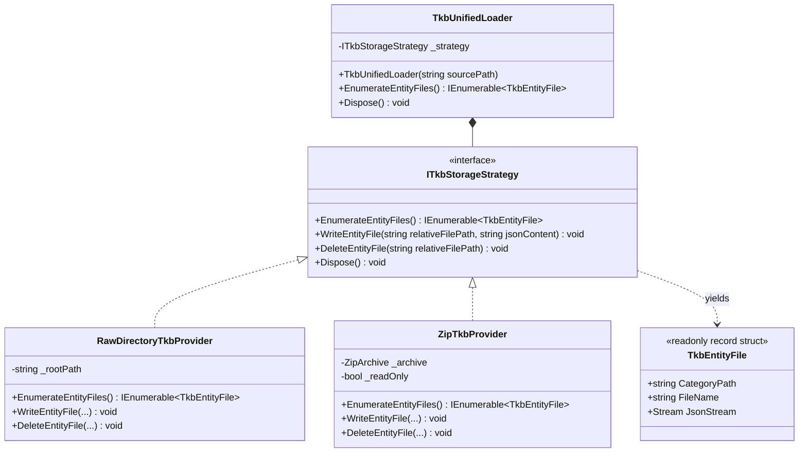
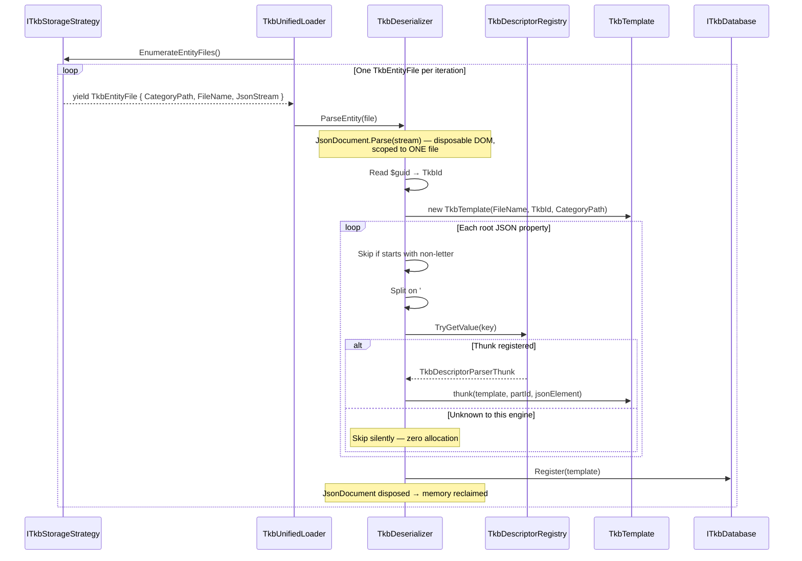
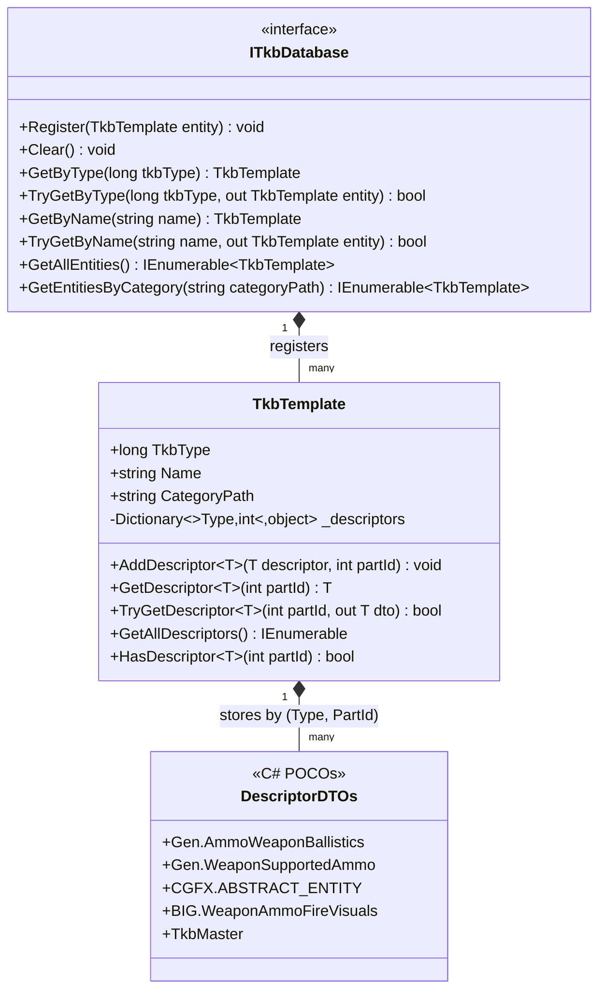
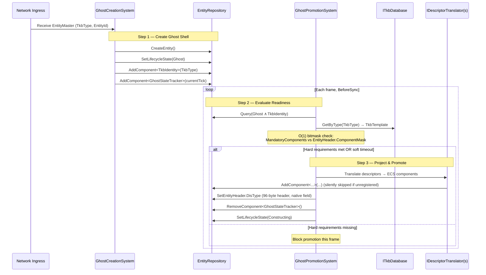
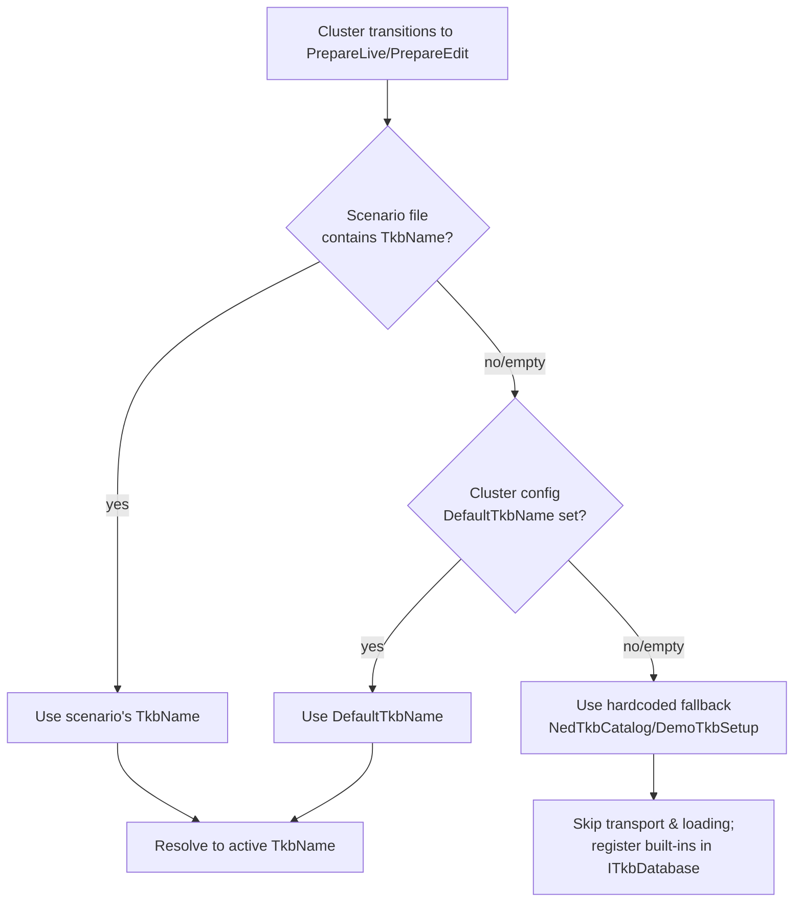
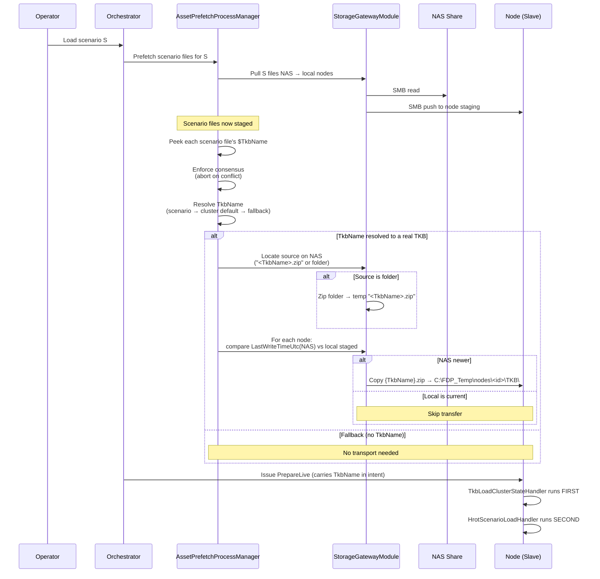
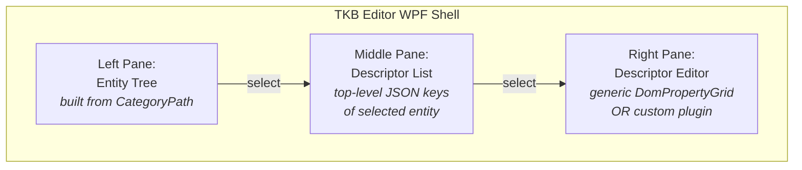

# TKB Design Description

**Status:** Draft for implementation
**Scope:** TKB storage, transport, loading, and in-engine processing for FDP/HROT.
The TKB Editor is covered only at the conceptual level at the end of this document; detailed editor design is for a later stage.

---

## 1. Purpose and Scope

The **Transient Knowledge Base (TKB)** is the cluster-wide, **engine-agnostic blueprint registry** that defines every entity that can be instantiated in a simulation: physical platforms (tanks, aircraft, infantry), but also **logical/abstract entities** such as weapons, ammunition (with ballistic parameters), sensors, materials (hit-damage profiles), IG 3D models, and attachable accessories.

The current FDP/HROT prototype hardcodes the TKB for a handful of entity types. This design specifies the production system where:

- The TKB is **authored as JSON files on disk** (one file per entity), version-controlled in Git.
- The TKB is **transported to the cluster** as a single compressed ZIP artifact from a central NAS share to each node's local staging directory.
- Each node **loads its own selective view** of the TKB into RAM via a memory-resident `ITkbDatabase` provider service.
- The TKB is **loaded before any scenario content is loaded**, so scenario-driven entity creation always finds the required blueprints in memory.
- The TKB is **cached across cluster lifecycle transitions** (it survives `Idle`) and is reloaded only when the requested TKB name or its on-disk timestamp changes.

This document describes:

1. The TKB data model and its conceptual principles.
2. The on-disk file/folder schema (raw and ZIP variants).
3. The Virtual File System (VFS) storage abstraction and streaming ingestion pipeline.
4. The C# attributes, DTOs, source-generated registry, and in-memory representation.
5. The runtime ECS projection (entity creation pipeline).
6. The integration into the HROT/FDP orchestrator startup sequence.
7. A conceptual outline of the future WPF TKB Editor and what it reuses from the existing ConfigEditor.

---

## 2. Core Architectural Principles

The TKB enforces hard separation of concerns across five bounded contexts:

| Context | Responsibility | Optimized For |
|---|---|---|
| **Domain Schema** | Pure C# DTOs annotated with semantic attributes | Engineering clarity, refactor-safety |
| **Storage (Authoring)** | Raw JSON files in a Git repo, one file per entity | Human readability, line-level diff, branching, merging |
| **Transport (Runtime)** | A single compressed ZIP artifact pulled from the NAS | Network I/O, avoiding SMB small-file bottlenecks |
| **In-Memory Representation** | `TkbTemplate` registry with O(1) lookups | High-speed runtime queries, low GC pressure |
| **ECS Projection** | Domain-specific translators emitting ECS components | Hot-path performance, zero-reflection spawning |

Key invariants:

1. **DTOs stay pure POCOs.** They carry only semantic attributes (`[TkbDescriptor]`, `[WeaponRef]`, `[AmmoRef]`, ranges, units, etc.). They never carry transport-specific markers like `[MessagePack.Key]` or UI framework attributes.
2. **Each TKB entity is a self-contained DOM.** One JSON file ↔ one entity ↔ one in-memory `TkbTemplate`. There is no global merged DOM at runtime.
3. **Engines load selectively.** Each engine compiles its own `TkbDescriptorRegistry` from the descriptor DTOs available in its assemblies. Descriptors it does not know are silently skipped during ingestion; the engine never sees them. This allows the **same TKB payload** to feed SimHost, IG, CGF, ExCon, and diagnostic apps with **asymmetric schemas**.
4. **Storage and transport are decoupled but share the same VFS contract.** A single `ITkbStorageStrategy` interface implements both a raw-folder backend and a ZIP backend; consumers (loader, editor) never know which medium they are reading from.
5. **The TKB is engine-agnostic.** It does not reference ECS component types. Conversion to ECS components is a downstream projection performed by application-specific translators during entity creation, not during TKB loading.
6. **DDS is not used for TKB transport.** TKB is static asset data. Funneling thousands of static blueprints through DDS topics with `TransientLocal`/`Reliable` QoS would flood discovery and history caches. TKB distribution piggybacks on the existing `StorageGatewayModule` SMB pull pipeline used for scenario files.

---

## 3. TKB Data Model

### 3.1 Entity Identity: 64-bit `TkbId`

Every TKB entity is identified by a single 64-bit signed integer (`long` in C#, `uint64` conceptually). This ID is the **primary key** for all runtime lookups and the value stored in the `TkbIdentity` ECS component of spawned entities.

> **Note on existing FDP/HROT code:** the codebase already uses `long TkbType` throughout (`TkbIdentity`, `ITkbDatabase`, `EntityMaster` DDS topic, `SpawnEntityCommand`, etc.). The 32-bit `EntityId` is a different concept — it identifies a **live network instance**, not its blueprint.

The 64-bit value uses a semantic base-10 layout for human readability while remaining a single integer for O(1) lookups:

```
F PP KK NNNNNNNNNNNN
│ │  │  │
│ │  │  └─ Ordinal (12 digits): sequential, random, or content hash
│ │  └──── Entity Kind (2 digits): mirrors the DIS Entity Type kind field (extended)
│ └─────── Project number (2 digits): 00 = common Base TKB; non-zero = project branch
└───────── Offline-allocation flag (1 digit): 0 = standard, 9 = offline-allocated (requires merge conflict resolution)
```

When a project-specific entity is promoted into the common Base TKB, the `PP` digits are zeroed (its ordinal must remain unique). The `F=9` flag signals to merge tools that the entity was created without coordination with the central allocator and needs duplicate-detection on integration.

### 3.2 Extended DIS Entity Kind

The `kind` field of the DIS Entity Type is extended beyond the standard SISO-REF-010-2015 set (Platform, Lifeform, Munition, Sensor, …) to also cover **logical entities** that do not exist physically in the simulation but carry domain data referenced by physical entities:

- `Weapon` — capabilities and supported ammo
- `Ammo` — ballistic parameters, fire visuals
- `Material` — hit-damage and armor properties
- `IgModel` — visual representation, attachment points
- `Accessory` — modular attachable parts (helmets, packs, modular weapon attachments)

Every entity — physical or logical — is treated with the **same data-oriented uniformity**: it is a `TkbMaster` plus a collection of domain-prefixed descriptors. There is no special case in the loader or runtime for "logical" entities.

### 3.3 Descriptors: Domain-Prefixed, Multi-Instance

A TKB entity is composed by attaching **descriptors** to it. Each descriptor is a typed C# DTO that describes one capability or one block of data.

**Strict naming rule:** every descriptor except `TkbMaster` must carry a **domain prefix** that identifies the bounded context that defined it:

| Prefix | Meaning |
|---|---|
| `Gen.` | Generic, cluster-wide common data usable by any engine |
| `CGFX.` | Specific to the CGF engine |
| `BIG.` | Specific to the B-IG image generator |
| *(future)* | Additional engines/apps reserve their own prefix |

The hierarchical key after the prefix can be further dotted (e.g. `BIG.Ammo.ABSTRACT_PROJECTILE`). The **entire dot-delimited string is a single, flat lookup key** — the registry does not walk the hierarchy at runtime. Domain prefixing guarantees that two engines defining a similar capability under the same short name cannot collide.

**Multi-instance descriptors** are supported by appending `#<PartId>` to the descriptor key:

```
Gen.AmmoWeaponBallistics#1
Gen.AmmoWeaponBallistics#2
BIG.WeaponAmmoFireVisuals#300002204
```

The same C# DTO schema applies to all instances. Each instance is stored in memory under a composite `(Type, PartId)` key. `PartId` is an arbitrary integer chosen by the author; it is **not** assumed to be sequential. A descriptor with no `#` postfix is stored with `PartId = 0`.

### 3.4 The `TkbMaster` Descriptor

`TkbMaster` is the **only unprefixed descriptor** and is **mandatory** on every TKB entity. It establishes the entity's existence and carries:

- `CustomName` — human-readable name (defaults to the JSON file name)
- `DisType` — DIS Entity Type string (e.g. `"16.0.0.0.0.0.0"`); the `kind` field drives entity classification
- *(future fields as needed)*

### 3.5 Schemaless Extensibility

The format intentionally permits keys at the entity root that are **not registered descriptors**:

- **Keys that begin with a non-letter character** (e.g. `_LegacyData`, `$revision`) are reserved for editor/tool metadata. The runtime parser skips them with zero allocations. The offline editor preserves them in the DOM for round-tripping.
- **Keys with a domain prefix the local engine does not know** are also silently skipped at runtime.

This makes the format forward-compatible: adding a new engine's descriptors does not break older nodes; legacy metadata fields survive editor save round-trips.

---

## 4. The TKB File Schema

### 4.1 One Entity = One JSON File

Each TKB entity is stored as a single, self-contained JSON object. The object is a flat dictionary of descriptors keyed by their hierarchical names:

```jsonc
{
  "$guid": 300002445,
  "TkbMaster": {
    "CustomName": "107mm Rocket",
    "DisType": "16.0.0.0.0.0.0"
  },
  "CGFX.ABSTRACT_ENTITY": {
    "AbstractEntity": {
      "ID": {
        "EntityID": 1936230038,
        "Name": "107mm Rocket",
        "TypeID": 32001
      },
      "SymbolPath": "Undefined.bmp"
    }
  },
  "Gen.WeaponSupportedAmmo": {
    "Ammos": [
      { "AmmoGuid": 300002204 }
    ]
  },
  "Gen.AmmoWeaponBallistics#1": {
    "WeaponGuid": 8263,
    "MuzzleSpeed": 830
  },
  "Gen.AmmoWeaponBallistics#2": {
    "WeaponGuid": 7453,
    "MuzzleSpeed": 870
  },
  "BIG.WeaponAmmoFireVisuals#300002204": {
    "AmmoGuid": 300002204,
    "FireParticleEffect": "fx_rocket_launch",
    "FireSoundEffect": "snd_rocket_fire"
  },
  "_LegacyData": {
    "LastModified": "2026-05-15T15:00:00Z"
  }
}
```

Structural rules:

1. **`$guid`** — required root property, 64-bit integer, the entity's `TkbId`.
2. **`TkbMaster`** — required, the only unprefixed descriptor.
3. **All other letter-starting keys** — must carry a domain prefix; map to a registered DTO; optionally suffixed with `#<PartId>`.
4. **Non-letter-starting keys** — reserved for editor/tool metadata; preserved on round-trip but ignored at runtime.

### 4.2 Folder Layout (Raw Variant)

When the TKB is stored as raw files, each JSON file lives anywhere inside a root folder. **The directory tree is purely a user-facing categorization** used by the editor and viewers — it is decoupled from the entity's DIS classification or schema.

```
TKB_Sample/
├── Ammo/
│   └── SmallCal/
│       └── 5.56x45mm M193.json
├── Platform/
│   └── Vehicle/
│       └── Military/
│           └── MBT/
│               └── Merkava Mk4.json
└── Weapon/
    └── Rifle/
        └── X95 MicroTavor.json
```

Conventions:

- The **file name without `.json`** is the default `TkbMaster.CustomName` if the JSON does not set one explicitly.
- The **relative directory path** (e.g. `Platform/Vehicle/Military/MBT`) is captured at load time as the `CategoryPath` property of the in-memory `TkbTemplate` and used by viewers to build tree UIs.
- Forward slashes are used internally regardless of OS.

### 4.3 ZIP Layout (Transport Variant)

The ZIP archive **preserves the exact same internal folder structure** as the raw variant — it is simply that hierarchy compressed into one file. The ZIP **filename without extension is the TKB's name** (e.g. `Sample_v1.zip` → TKB named `Sample_v1`).

A ZIP entry path inside the archive looks like `Platform/Vehicle/Military/MBT/Merkava Mk4.json`. The loader treats the ZIP entry path identically to a raw file's relative path.

---

## 5. Storage and Transport Tier (VFS Boundary)

### 5.1 Class Diagram



### 5.2 Contracts

```csharp
/// <summary>
/// One TKB entity file yielded by the VFS. The JsonStream MUST be processed
/// and disposed before the enumerator is advanced — this bounds memory to
/// one file at a time and prevents Large Object Heap fragmentation.
/// </summary>
public readonly record struct TkbEntityFile(
    string CategoryPath,   // Forward-slash relative dir, e.g. "Platform/Vehicle/Military/MBT"
    string FileName,       // File name without extension, e.g. "Merkava Mk4"
    Stream JsonStream);    // Open stream positioned at the start of the JSON content

public interface ITkbStorageStrategy : IDisposable
{
    /// <summary>
    /// Lazy enumeration. Caller MUST dispose each yielded stream
    /// (or consume it via JsonDocument.Parse, which disposes it) before
    /// advancing to the next record.
    /// </summary>
    IEnumerable<TkbEntityFile> EnumerateEntityFiles();

    /// <summary>
    /// Writes one entity file atomically. The relativeFilePath uses forward
    /// slashes and includes the .json extension (e.g.
    /// "Platform/Vehicle/Military/MBT/Merkava Mk4.json").
    /// </summary>
    void WriteEntityFile(string relativeFilePath, string jsonContent);

    /// <summary>
    /// Removes an entity file. Same path conventions as WriteEntityFile.
    /// </summary>
    void DeleteEntityFile(string relativeFilePath);
}
```

### 5.3 `RawDirectoryTkbProvider`

Backed by a directory on disk. Used for authoring (the TKB Editor writes here) and for the runtime when a TKB is supplied as an unzipped folder.

Reading: recursively enumerate `*.json`; for each, compute `CategoryPath` from the relative directory using forward slashes; open a `FileStream` and yield it; close on the next iteration.

Writing: create any missing intermediate directories; perform a sparse write — only entity files explicitly passed to `WriteEntityFile` are touched. Other files in the tree are untouched. This preserves Git-friendly minimal diffs.

### 5.4 `ZipTkbProvider`

Backed by a ZIP archive. Used for the runtime transport path (the cluster always loads from a `{TkbName}.zip` staged into each node's local cache). Also usable from the editor when ZIP is selected as the storage medium.

Reading: open with `ZipArchiveMode.Read`; iterate `_archive.Entries`; skip directory entries and non-`.json` files; for each entry, derive `CategoryPath` from the entry's directory; call `entry.Open()` and yield the decompression stream.

Writing (when used as authoring target): open with `ZipArchiveMode.Update`; on each `WriteEntityFile`, **delete the existing entry first** then create a new one (do not call `Open()` on an existing entry for write — `ZipArchive` cannot transparently overwrite). Normalize backslashes to forward slashes for entry names.

> **ZIP concurrency warning:** `ZipArchiveMode.Update` rewrites the archive's central directory on close. A ZIP archive cannot be safely read and written by different threads simultaneously, and large archives incur full-repack cost on save. The editor implementation must hold an exclusive lock on the ZIP file during save operations. For collaborative authoring, **raw folder storage is strongly recommended**; ZIP-as-storage is acceptable only for single-author workflows or already-finalized TKBs.

### 5.5 `TkbUnifiedLoader`

A thin factory + façade that picks the right strategy from the source path:

```csharp
public sealed class TkbUnifiedLoader : IDisposable
{
    private readonly ITkbStorageStrategy _strategy;

    public TkbUnifiedLoader(string sourcePath)
    {
        if (File.Exists(sourcePath) &&
            sourcePath.EndsWith(".zip", StringComparison.OrdinalIgnoreCase))
        {
            _strategy = new ZipTkbProvider(sourcePath, readOnly: true);
        }
        else if (Directory.Exists(sourcePath))
        {
            _strategy = new RawDirectoryTkbProvider(sourcePath);
        }
        else
        {
            throw new ArgumentException($"Invalid TKB source path: {sourcePath}");
        }
    }

    public IEnumerable<TkbEntityFile> EnumerateEntityFiles()
        => _strategy.EnumerateEntityFiles();

    public void Dispose() => _strategy.Dispose();
}
```

Downstream consumers code against `TkbUnifiedLoader` (or `ITkbStorageStrategy` directly) and never know whether they are reading from a folder or a ZIP.

---

## 6. C# Domain Schema: Attributes and DTOs

### 6.1 The `[TkbDescriptor]` Attribute

Pure semantic marker, applied to a class or struct, binding it to a hierarchical descriptor name:

```csharp
[AttributeUsage(AttributeTargets.Class | AttributeTargets.Struct,
                Inherited = false, AllowMultiple = false)]
public sealed class TkbDescriptorAttribute : Attribute
{
    /// <summary>
    /// User-perspective hierarchical name, e.g. "Gen.AmmoWeaponBallistics",
    /// "CGFX.ABSTRACT_ENTITY", "BIG.WeaponAmmoFireVisuals".
    /// MUST start with a domain prefix (Gen., CGFX., BIG., ...).
    /// MUST NOT include the #PartId postfix.
    /// </summary>
    public string HierarchicalName { get; }

    public TkbDescriptorAttribute(string hierarchicalName)
    {
        if (string.IsNullOrWhiteSpace(hierarchicalName))
            throw new ArgumentException(
                "Hierarchical name cannot be empty.", nameof(hierarchicalName));
        HierarchicalName = hierarchicalName;
    }
}
```

Naming guidance:

- `HierarchicalName` is the **user-perspective** name as it appears in the JSON. It is not a "mount path" or storage path — implementation terms like that should not leak into the API.
- The C# namespace and class name of the DTO are **decoupled** from `HierarchicalName`. Refactoring the class or moving it between assemblies will not break the data binding.

### 6.2 Field-Level Relational Attributes

These tag fields that reference other TKB entities by their 64-bit IDs. The TKB Editor uses them to render relational pickers; the runtime can use them for cross-entity lookup validation:

```csharp
[AttributeUsage(AttributeTargets.Field | AttributeTargets.Property)]
public sealed class WeaponRefAttribute : Attribute { }

[AttributeUsage(AttributeTargets.Field | AttributeTargets.Property)]
public sealed class AmmoRefAttribute : Attribute { }

[AttributeUsage(AttributeTargets.Field | AttributeTargets.Property)]
public sealed class ModelRefAttribute : Attribute { }
```

Other UI-relevant attributes (`[EditRange]`, `[EditUnit]`, `[EditDisplayName]`, `[SchemaAllowedValues]`, `[System.ComponentModel.ReadOnly]`) are reused from the existing `StructEdit` and ConfigEditor stacks where possible.

### 6.3 DTO Example

DTOs are plain POCOs. They mirror the JSON shape exactly so `System.Text.Json` deserializes the entire descriptor in one pass without any custom converters:

```csharp
[TkbDescriptor("Gen.AmmoWeaponBallistics")]
public struct AmmoWeaponBallisticsDto
{
    [WeaponRef]
    public long WeaponGuid;

    [EditUnit("m/s")]
    [EditRange(0, 5000)]
    public double MuzzleSpeed;
}

[TkbDescriptor("CGFX.ABSTRACT_ENTITY")]
public struct CgfxAbstractEntityDto
{
    [JsonPropertyName("AbstractEntity")]
    public AbstractEntityData AbstractEntity;
}

public struct AbstractEntityData
{
    public EntityIdBlock ID;
    public string SymbolPath;
}

public struct EntityIdBlock
{
    public long EntityID;
    public string Name;
    public long TypeID;
}
```

**Important constraint:** DTOs must **not** carry transport-specific markers like `[MessagePack.Key]`. The transport layer is JSON-only. Leaking binary serialization concerns into the domain model is explicitly forbidden.

---

## 7. Source-Generated Descriptor Registry

### 7.1 Why Source Generation

The hot path of TKB ingestion is "given a JSON property name, find the deserializer". Doing this with runtime reflection or `AppDomain.GetAssemblies()` scanning at startup is slow, allocates, and stalls the cluster initialization. The engine already uses Roslyn source generators for similar mappings (`Fbt.SourceGen`, `Fhsm.SourceGen`); the TKB system follows the same pattern.

A new generator, conventionally named `Tkb.SourceGen`, runs at compile time and:

1. Scans the C# syntax trees in the consuming assembly for types decorated with `[TkbDescriptor]`.
2. For each match, emits a static module initializer that registers a typed parser thunk into `TkbDescriptorRegistry`.
3. The emitted code is per-assembly: each engine's assembly registers only the descriptors it knows. This is what makes selective ingestion automatic — no runtime configuration required.

### 7.2 The Registry

```csharp
public delegate void TkbDescriptorParserThunk(
    TkbTemplate entity,
    int partId,
    System.Text.Json.JsonElement jsonElement);

public static class TkbDescriptorRegistry
{
    private static readonly Dictionary<string, TkbDescriptorParserThunk> _parsers
        = new(StringComparer.OrdinalIgnoreCase);

    public static IReadOnlyDictionary<string, TkbDescriptorParserThunk> Parsers
        => _parsers;

    /// <summary>
    /// Called by the source-generated module initializer of each assembly that
    /// contains [TkbDescriptor]-decorated types. Last registration wins (but
    /// duplicate keys across assemblies are a build-time error — the generator
    /// emits a warning).
    /// </summary>
    public static void RegisterParser(
        string hierarchicalName,
        TkbDescriptorParserThunk parser)
    {
        _parsers[hierarchicalName] = parser;
    }
}
```

### 7.3 Example of Generated Code

```csharp
// Auto-generated by Tkb.SourceGen — DO NOT EDIT
internal static class __TkbDescriptors_MyEngineAssembly
{
    [System.Runtime.CompilerServices.ModuleInitializer]
    internal static void Register()
    {
        TkbDescriptorRegistry.RegisterParser(
            "Gen.AmmoWeaponBallistics",
            (template, partId, jsonElement) =>
            {
                var dto = jsonElement.Deserialize<AmmoWeaponBallisticsDto>(
                    FdpJsonOptionsRegistry.DefaultRelaxed)!;
                template.AddDescriptor(dto, partId);
            });

        TkbDescriptorRegistry.RegisterParser(
            "CGFX.ABSTRACT_ENTITY",
            (template, partId, jsonElement) =>
            {
                var dto = jsonElement.Deserialize<CgfxAbstractEntityDto>(
                    FdpJsonOptionsRegistry.DefaultRelaxed)!;
                template.AddDescriptor(dto, partId);
            });

        // ...one entry per [TkbDescriptor]-decorated type in this assembly
    }
}
```

The thunk's responsibility is **storage only** (call `AddDescriptor`). It does **not** project to ECS components. ECS projection is the separate downstream concern covered in §10.

---

## 8. Streaming Ingestion Pipeline

### 8.1 Sequence Diagram



### 8.2 `TkbDeserializer`

```csharp
public sealed class TkbDeserializer
{
    private readonly ITkbDatabase _db;

    public TkbDeserializer(ITkbDatabase db) => _db = db;

    public void ParseAndRegister(TkbEntityFile file)
    {
        using var doc = JsonDocument.Parse(file.JsonStream);
        var root = doc.RootElement;

        if (!root.TryGetProperty("$guid", out var guidProp))
            throw new TkbFormatException(
                $"Entity file '{file.FileName}' is missing $guid.");
        long tkbId = guidProp.GetInt64();

        var template = new TkbTemplate(
            name: file.FileName,
            tkbType: tkbId,
            categoryPath: file.CategoryPath);

        foreach (var prop in root.EnumerateObject())
        {
            string name = prop.Name;

            // Reserved metadata or non-descriptor — preserve in DOM (editor),
            // ignore at runtime.
            if (name.Length == 0 || !char.IsLetter(name[0]))
                continue;

            // Skip $guid (already handled above; also non-letter so loop would skip).
            // TkbMaster is handled as a normal descriptor (it has a registered DTO).

            // Split "Gen.AmmoWeaponBallistics#2" → ("Gen.AmmoWeaponBallistics", 2).
            int hashIdx = name.IndexOf('#');
            string key = hashIdx < 0 ? name : name.Substring(0, hashIdx);
            int partId = hashIdx < 0
                ? 0
                : int.Parse(name.AsSpan(hashIdx + 1));

            if (TkbDescriptorRegistry.Parsers.TryGetValue(key, out var thunk))
            {
                thunk(template, partId, prop.Value);
            }
            // else: this engine does not know this descriptor — skip silently.
        }

        _db.Register(template);
    }
}
```

Memory guarantees:

- **One `JsonDocument` is alive at any moment.** It is scoped to a single entity file. Disposed before the next file is opened.
- **No string allocation for the descriptor key on the hot path** (other than the single substring split, which can be optimized to span-based lookup if profiling identifies it).
- **Unknown descriptors cost effectively nothing.** `JsonDocument` does not materialize sub-objects until they are accessed; iterating root properties and skipping unknowns walks pointers without parsing the unknown sub-tree.

---

## 9. In-Memory Representation

### 9.1 Class Diagram



### 9.2 `TkbTemplate`

The pure in-memory representation of a single TKB entity. **Engine-agnostic** — it holds parsed descriptors as boxed objects, with no coupling to ECS:

```csharp
public sealed class TkbTemplate
{
    public long TkbType { get; }
    public string Name { get; }
    public string CategoryPath { get; }

    // Composite-key storage: (DescriptorClrType, PartId) → boxed DTO instance.
    private readonly Dictionary<(Type, int), object> _descriptors = new();

    public TkbTemplate(string name, long tkbType, string categoryPath = "")
    {
        Name = name ?? throw new ArgumentNullException(nameof(name));
        TkbType = tkbType;
        CategoryPath = categoryPath ?? string.Empty;
    }

    /// <summary>
    /// Stores a parsed descriptor instance. Called by the source-generated thunks.
    /// </summary>
    public void AddDescriptor<T>(T descriptor, int partId = 0) where T : notnull
    {
        _descriptors[(typeof(T), partId)] = descriptor;
    }

    /// <summary>
    /// O(1) lookup of a specific descriptor by its CLR type and part ID.
    /// </summary>
    public T? GetDescriptor<T>(int partId = 0) where T : class
    {
        return _descriptors.TryGetValue((typeof(T), partId), out var dto)
            ? (T)dto
            : null;
    }

    public bool TryGetDescriptor<T>(int partId, out T descriptor) where T : struct
    {
        if (_descriptors.TryGetValue((typeof(T), partId), out var boxed))
        {
            descriptor = (T)boxed;
            return true;
        }
        descriptor = default;
        return false;
    }

    public bool HasDescriptor<T>(int partId = 0)
        => _descriptors.ContainsKey((typeof(T), partId));

    /// <summary>
    /// Enumerates every stored descriptor. Used by editors, diagnostic UIs,
    /// and translators that want to project the full entity.
    /// </summary>
    public IEnumerable<(Type Type, int PartId, object Data)> GetAllDescriptors()
    {
        foreach (var kvp in _descriptors)
            yield return (kvp.Key.Item1, kvp.Key.Item2, kvp.Value);
    }
}
```

Notes:

- `TkbTemplate` **no longer holds ECS applicator delegates** as the prototype did. It is pure data. ECS projection is a separate concern; see §10.
- `MandatoryComponent` and `ChildBlueprintDefinition` are also still owned by `TkbTemplate` for use by the ECS promotion path (§10), but they are populated by domain translators during/after load, not by the JSON parser.

### 9.3 `ITkbDatabase`

The cluster-wide singleton. Constructed once per node, populated by `TkbDeserializer`, queried by every system that needs blueprint data:

```csharp
public interface ITkbDatabase
{
    void Register(TkbTemplate entity);

    /// <summary> Removes all entities. Used on TKB reload. </summary>
    void Clear();

    // Primary 64-bit ID lookup.
    TkbTemplate GetByType(long tkbType);
    bool TryGetByType(long tkbType, out TkbTemplate entity);

    // Name lookup (fall-back / debugging / scripting).
    TkbTemplate GetByName(string name);
    bool TryGetByName(string name, out TkbTemplate entity);

    // Enumeration.
    IEnumerable<TkbTemplate> GetAllEntities();

    // Hierarchical UI viewer support — index by CategoryPath.
    IEnumerable<TkbTemplate> GetEntitiesByCategory(string categoryPath);
}
```

Implementation:

- Backed by two dictionaries: `Dictionary<long, TkbTemplate>` for ID lookup, `Dictionary<string, TkbTemplate>` for name lookup, both populated on `Register`.
- A secondary `ILookup<string, TkbTemplate>` keyed by `CategoryPath` rebuilt on each `Register` (or lazily) for category enumeration.
- All read paths are lock-free after initialization. `Register` and `Clear` are called only during the load phase (single-threaded gate, see §11).

### 9.4 Use Cases Beyond ECS Spawning

The `ITkbDatabase` + `TkbTemplate` pair serves **all** consumers of TKB data, not just entity creation:

| Consumer | How it queries |
|---|---|
| Network spawn pipeline (`GhostPromotionSystem`) | `GetByType(tkbId)` → ECS projection (§10) |
| AI threat evaluation | `GetByType(weaponId).GetDescriptor<AmmoWeaponBallisticsDto>(partId)` |
| Image generator | `GetByType(modelId).GetDescriptor<IgModelDto>()` |
| Diagnostic / debug viewer | `GetAllEntities()` + `template.GetAllDescriptors()` |
| TKB Editor | Loads via storage strategy directly (not via in-memory DB) |
| `StructEdit` ImGui inspector | `GetAllDescriptors()` projected via attributes |


---

## 10. ECS Instantiation and Runtime Projection

### 10.1 Principle

TKB data is engine-agnostic. The transformation from a pure `TkbTemplate` (a bag of typed descriptors) into ECS components is performed by **domain-specific translators** at the moment an entity is spawned. The TKB itself never references ECS component types.

This preserves three properties:

1. **Schema sharing.** The same TKB ZIP can feed a SimHost, an IG, and an ExCon — each runs its own translators and ignores descriptors it does not care about.
2. **Decoupling from the runtime.** A change in ECS component layout never requires re-baking the TKB.
3. **Zero-allocation hot path.** ECS applicators are pre-compiled per template at first use (or eagerly after load) so the actual spawn does no reflection.

### 10.2 Sequence Diagram



### 10.3 Components on Spawned Entities

- **`TkbIdentity`** — `struct { long TkbType; }`. Stamped at ghost creation. Permanent link from the live ECS entity back to its blueprint. Replaces all legacy spawn-request mechanisms.
- **`GhostStateTracker`** — transient, holds the frame tick when the ghost was created. Used by the promotion system to enforce `SoftTimeoutFrames` for optional components.

### 10.4 `MandatoryComponent` and Readiness

A `TkbTemplate` carries a list of `MandatoryComponent` entries:

```csharp
public readonly struct MandatoryComponent
{
    public int ComponentTypeId { get; init; }   // ECS component type ID
    public MandatoryKind Kind { get; init; }    // Hard or Soft
}

public enum MandatoryKind { Hard, Soft }
```

- **Hard** — the entity cannot be promoted until this component is present in `EntityHeader.ComponentMask`. Used for state that must arrive via the network before simulation can begin.
- **Soft** — desired but optional. After `SoftTimeoutFrames` (configurable), the promotion proceeds without it, and the missing data is discarded.

`MandatoryComponent` entries are populated **per translator** when the template is loaded. Each engine's translators add only the components that engine cares about. A pure IG node's template for the same entity will have a different (smaller) `MandatoryComponents` list than a SimHost's.

The check itself is a single bitwise AND between the required mask and `EntityHeader.ComponentMask` — O(1), allocation-free, lock-free.

### 10.5 `IDescriptorTranslator`

```csharp
public interface IDescriptorTranslator
{
    /// <summary>
    /// Called once per template after JSON load. The translator inspects the
    /// template's descriptors and, if relevant, registers ECS applicators and
    /// MandatoryComponent requirements on it.
    /// </summary>
    void TranslateBlueprint(TkbTemplate template, ITranslationContext ctx);
}
```

Each engine owns its set of translators. Examples:

- A SimHost physics translator reads `Gen.AmmoWeaponBallistics#N` descriptors and emits ECS ballistic state components plus their `MandatoryComponent` entries.
- An IG translator reads `BIG.WeaponAmmoFireVisuals#N` and emits visual/audio components.
- A CGF translator reads `CGFX.ABSTRACT_ENTITY` and emits CGF-specific tracking components.

If the target `EntityRepository` does not have a component type registered, the `AddComponent<T>` call silently no-ops. This is what allows the **same set of translators** to run on nodes with asymmetric ECS schemas.

### 10.6 `ChildBlueprintDefinition` (Dynamic Composition)

For hierarchical units (e.g. ORBATs, multi-part platforms with sub-entities), the template carries:

```csharp
public readonly struct ChildBlueprintDefinition
{
    public int InstanceId { get; init; }
    public long ChildTkbType { get; init; }
    public string TacticalDesignation { get; init; }
}
```

At spawn time, the engine iterates these entries, allocates child entities via the same TKB pipeline, and wires the relationship via ECS relational components (`UnitSubordinate`, `VisHierarchyNode`, etc.). Children resolve their own `TkbTemplate` via `ITkbDatabase.GetByType(ChildTkbType)`.

`ChildBlueprintDefinition` is populated by a generic translator from `Gen.` composition descriptors during template construction.

---

## 11. Integration into HROT / FDP

### 11.1 Storage Convention

The TKB master repository lives on the central NAS at:

```
\\<nas-host>\<share>\TKB\         (NAS source)
```

Mirrored or pointed-to from each cluster member's well-known shared path:

```
C:\FDP_Temp\shared\TKB\           (cluster-visible, used by orchestrator as source)
```

Within that folder the orchestrator finds **named TKBs**, in either of two forms:

```
C:\FDP_Temp\shared\TKB\
├── Sample_v1.zip                  ← ZIP form: TKB name = "Sample_v1"
├── Sample_v2.zip
├── ExerciseX/                     ← Folder form: TKB name = "ExerciseX"
│   └── (raw TKB tree as in §4.2)
└── ExerciseY/
    └── ...
```

**TKB name** = the file name without `.zip` extension, OR the folder name. Both forms are valid sources for the orchestrator.

Each node stages its own copy locally:

```
C:\FDP_Temp\nodes\node-<id>\TKB\
└── <TkbName>.zip                  ← always a ZIP at the node side
```

The node-local staging is always ZIP regardless of how the source is stored on the NAS. If the source is a folder, the orchestrator zips it into a temporary file before pushing (one ZIP build, N node pushes — far cheaper than SMB small-file storms on every node).

### 11.2 TKB Resolution: Fallback Hierarchy

When the cluster prepares to enter a live or edit state, the active TKB name is resolved by this **strict fallback hierarchy**:



Notes:

- The **scenario header** declares the TKB the scenario was authored against. Honors authoring intent.
- The **orchestrator config** (`orchestrator-config.json`, new `DefaultTkbName` field) provides the cluster-wide default for scenarios that do not specify one.
- The **hardcoded fallback** is the current prototype catalog (`NedTkbCatalog` / `DemoTkbSetup`). This keeps engine development and tests working with zero NAS infrastructure.

### 11.3 Scenario Header Extension

```csharp
public sealed class ScenarioHeaderDto
{
    public string? SubsystemType { get; set; }
    public string? SchemaVersion { get; set; }
    // NEW:
    public string? TkbName { get; set; }   // Null/empty = "no opinion"
}
```

The orchestrator extracts `TkbName` from each scenario file it stages — typically by peeking the header with `JsonDocument.Parse` without materializing the full scenario DOM. A multi-file scenario (one per node) is allowed but must satisfy a **consensus rule**:

- All non-empty `TkbName` values across the staged scenario files must be **equal**.
- Empty/missing values are treated as "no opinion" and silently accept the consensus value.
- A conflict (two different non-empty names in the same scenario) aborts the load with a critical error before any TKB transport begins.

### 11.4 Orchestrator-Side Workflow



The TKB prefetch step **must complete before** `PrepareLive` / `PrepareEdit` is dispatched to the slaves — exactly the same ordering guarantee that applies today to scenario file prefetch. By the time a node starts loading its scenario, the corresponding TKB ZIP is already in its local staging directory.

### 11.5 Node-Side: `TkbLoadClusterStateHandler`

Each node implements an `IClusterStateHandler` that handles `PrepareLive` and `PrepareEdit`. It is registered on the `ClusterSlave` **strictly before** `HrotScenarioLoadHandler` so the scenario loader always finds the TKB in memory.

```csharp
public sealed class TkbLoadClusterStateHandler : IClusterStateHandler
{
    private readonly ITkbDatabase _tkbDb;
    private readonly string _localTkbStagingRoot;     // ...\nodes\<id>\TKB

    // Cache state — survives Idle transitions.
    private string? _lastLoadedTkbName;
    private DateTime _lastLoadedTimestamp;

    private const string FallbackSentinel = "$FALLBACK";

    public TkbLoadClusterStateHandler(
        ITkbDatabase tkbDb,
        string localStagingRoot)
    {
        _tkbDb = tkbDb;
        _localTkbStagingRoot = Path.Combine(localStagingRoot, "TKB");
    }

    public bool CanHandle(NodeOpType op)
        => op == NodeOpType.PrepareLive || op == NodeOpType.PrepareEdit;

    public Task<object?> PrepareAsync(
        ExecuteNodeOpIntent intent,
        CancellationToken ct)
    {
        string? requestedTkb = ExtractTkbNameFromIntent(intent);

        // (1) Fallback path: no TKB specified anywhere → built-in catalog.
        if (string.IsNullOrWhiteSpace(requestedTkb))
        {
            if (_lastLoadedTkbName != FallbackSentinel)
            {
                _tkbDb.Clear();
                NedTkbCatalog.RegisterAll(_tkbDb);   // or DemoTkbSetup.RegisterAll
                _lastLoadedTkbName = FallbackSentinel;
                _lastLoadedTimestamp = default;
            }
            return Task.FromResult<object?>(null);
        }

        // (2) Differential cache check by timestamp.
        string localZipPath = Path.Combine(
            _localTkbStagingRoot, $"{requestedTkb}.zip");
        DateTime currentFileTime = File.GetLastWriteTimeUtc(localZipPath);

        if (_lastLoadedTkbName == requestedTkb &&
            _lastLoadedTimestamp == currentFileTime)
        {
            // Cache hit — TKB is already loaded in RAM, no work to do.
            return Task.FromResult<object?>(null);
        }

        // (3) Reload from disk via VFS abstraction.
        _tkbDb.Clear();
        using var loader = new TkbUnifiedLoader(localZipPath);
        var deserializer = new TkbDeserializer(_tkbDb);

        foreach (var entityFile in loader.EnumerateEntityFiles())
        {
            deserializer.ParseAndRegister(entityFile);
        }

        _lastLoadedTkbName = requestedTkb;
        _lastLoadedTimestamp = currentFileTime;

        return Task.FromResult<object?>(null);
    }

    public void Commit(ExecuteNodeOpIntent intent, EntityRepository? repo) { }

    /// <summary>
    /// On Idle: do nothing. The in-memory TKB is preserved for the next scenario.
    /// </summary>
    public void Abort(ExecuteNodeOpIntent intent, EntityRepository? repo) { }
}
```

Behavior summary:

| Situation | Action |
|---|---|
| No TKB requested AND fallback already active | No-op |
| No TKB requested AND fallback not active | Clear DB, register hardcoded catalog |
| Requested TKB same name AND same timestamp as last load | No-op (cache hit) |
| Requested TKB different name or newer timestamp | Clear DB, stream-load from local ZIP |
| Cluster goes to Idle | No-op (preserve cache) |

### 11.6 Wiring (No DI Container)

FDP/HROT do not use a DI container — all wiring is explicit constructor injection. The `ITkbDatabase` is constructed in the composition root (`HrotNodeBuilder` / equivalent) and passed through. Conceptual outline:

```csharp
// In HrotNodeBuilder (Phase 2 — domain registration)
ITkbDatabase tkbDb = new TkbDatabase();
context.TkbDb = tkbDb;   // expose via the node context

// In NodeBootstrapper.BuildOrchestration (Phase 5)
var tkbHandler = new TkbLoadClusterStateHandler(
    tkbDb: context.TkbDb,
    localStagingRoot: localTempRoot);

// REGISTER TKB HANDLER FIRST — before scenario handler.
clusterSlave.RegisterHandler(tkbHandler);

if (scenarioSerializer != null)
{
    var scenarioLoader = new HrotScenarioLoadHandler(
        scenarioSerializer,
        new HrotScenarioLoader(storageProvider, scenarioSerializer.SubsystemType),
        zoneService,
        scenarioExtractor,
        scenarioSource,
        scenarioIdAllocator,
        world: context.World,
        controller: controller,
        storageDirectory: localTempRoot);

    clusterSlave.RegisterHandler(scenarioLoader);
}
```

Registration order in `ClusterSlave` defines execution order for `PrepareLive` / `PrepareEdit`. Putting the TKB handler first guarantees the scenario loader always finds blueprints in memory.

### 11.7 Orchestrator-Side Pseudocode

```csharp
// Inside AssetPrefetchProcessManager (or equivalent saga), after scenario files
// have been staged on all participating nodes:

private async Task ResolveAndPrefetchTkbAsync(
    string scenarioId,
    List<NodeDistributionTarget> targets,
    string nasBasePath,
    CancellationToken ct)
{
    // 1. Extract TkbName from each staged scenario file (header peek only).
    string? consensusTkbName = null;
    foreach (var file in _gateway.EnumerateStagedScenarioFiles(scenarioId))
    {
        string? fileTkbName = HrotScenarioEnvelope.PeekTkbName(file);
        if (string.IsNullOrWhiteSpace(fileTkbName)) continue;

        if (consensusTkbName != null &&
            !string.Equals(consensusTkbName, fileTkbName,
                StringComparison.OrdinalIgnoreCase))
        {
            throw new InvalidOperationException(
                $"TKB conflict in scenario '{scenarioId}': " +
                $"'{consensusTkbName}' vs '{fileTkbName}' in {file}.");
        }
        consensusTkbName = fileTkbName;
    }

    // 2. Apply fallback hierarchy.
    string? activeTkbName = consensusTkbName
        ?? _clusterConfig.DefaultTkbName;

    if (string.IsNullOrWhiteSpace(activeTkbName))
        return;   // Fallback path — nodes will use the built-in catalog.

    // 3. Locate or build the source ZIP on the NAS side.
    string tkbRoot = Path.Combine(nasBasePath, "TKB");
    string? sourceZipPath = ResolveOrBuildTkbZip(tkbRoot, activeTkbName);
    if (sourceZipPath == null)
        throw new FileNotFoundException(
            $"TKB '{activeTkbName}' not found at {tkbRoot}");

    // 4. Differential push to each node (timestamp-based).
    await _gateway.PushTkbArtifactAsync(
        sourceZipPath, activeTkbName, targets, ct);

    // 5. Carry activeTkbName forward in the cluster state intent so that
    //    each node's TkbLoadClusterStateHandler can extract it.
}

private static string? ResolveOrBuildTkbZip(string tkbRoot, string tkbName)
{
    string zipPath = Path.Combine(tkbRoot, $"{tkbName}.zip");
    if (File.Exists(zipPath)) return zipPath;

    string folderPath = Path.Combine(tkbRoot, tkbName);
    if (Directory.Exists(folderPath))
    {
        // Build a transport ZIP on the fly into a temp location and return its path.
        return BuildTkbZipFromFolder(folderPath, tkbName);
    }
    return null;
}
```

The `PushTkbArtifactAsync` step compares `LastWriteTimeUtc` of the source ZIP against the existing file on each node and copies only when the NAS copy is strictly newer.

### 11.8 ClusterConfiguration Extension

`orchestrator-config.json` gains one new property:

```json
{
  "DefaultTkbName": "Sample_v2",
  // ... existing fields ...
}
```

A missing or empty value means "no cluster default" — scenarios that do not specify a TKB will fall through to the hardcoded built-in catalog.

### 11.9 Cluster Lifecycle Invariants

| Cluster State Transition | TKB Handler Behavior |
|---|---|
| `Idle → PrepareLive` | Resolve, cache-check, possibly reload |
| `Idle → PrepareEdit` | Same |
| `Live → Idle`, `Edit → Idle` | `Abort()` is a no-op; memory retained |
| Subsequent re-entry with same TKB | Cache hit; no reload |
| Subsequent re-entry after NAS update | Timestamp mismatch triggers reload |
| Node restart | Cache lost in RAM, but local ZIP still on disk; first `PrepareLive` reloads from local disk without re-fetching NAS unless differential push detects a newer source |


---

## 12. TKB Editor (Conceptual — Detailed Design Deferred)

The TKB Editor is a **separate WPF application**, not a mode of the existing `ConfigEditor`. The two have fundamentally different workspace models (single-file/cascading-configuration vs. multi-file/hierarchical-asset) and forcing them into one shell creates structural friction. A dedicated TKB Editor avoids that while reusing the proven internals of `ConfigEditor`.

This section captures the **conceptual** plan only. A full editor design is a separate effort.

### 12.1 What Is Reused vs. Built New

| Component | Reused from ConfigEditor | New for TKB Editor |
|---|---|---|
| `JsonDomDeserializer` | ✓ as-is | — |
| `SchemaLoaderService` | ✓ — recognize `[TkbDescriptor]` exactly as it recognizes `[ConfigSchemaRoot]` | adapter only |
| `DomValidator` | ✓ as-is | context-aware mode (see §12.5) |
| `EditHistoryService` (undo/redo) | ✓ as-is | scoped per active entity |
| `DomNodeFactory` | ✓ as-is | — |
| `CustomUIRegistryService` | ✓ as-is for field-level editors (`IValueEditor`, `IValueRenderer`) | extended with whole-descriptor custom editors |
| `DataGrid` / `MainDataGrid` (property grid) | ✓ infrastructure | **refactored** into a reusable `DomPropertyGrid` UserControl |
| `MainViewModel` (god object) | ✗ discarded | replaced by focused workspace VMs (`EntityTreeViewModel`, `DescriptorListViewModel`, `PropertyGridViewModel`) |
| `MainWindow.xaml` shell | ✗ discarded | new 3-pane shell |
| Cascade layer infrastructure (`LayerProcessor`, `CascadedDomDisplayMerger`, `ProjectSaver`) | ✓ infrastructure | adapted for per-entity isolated DOMs (no monolithic merge) |

### 12.2 Conceptual Workspace Layout



- **Left pane (Entity Tree).** Built from the `CategoryPath` of all loaded entity files. Selecting a leaf sets the active DOM root to that entity.
- **Middle pane (Descriptor List).** Lists the top-level keys of the selected entity's JSON object: `TkbMaster`, `Gen.AmmoWeaponBallistics#1`, `BIG.WeaponAmmoFireVisuals#1`, …
- **Right pane (Descriptor Editor).** Two flavors, switchable:
  - **Generic** — the refactored `DomPropertyGrid` UserControl, driven by the schema derived from `[TkbDescriptor]`-decorated DTOs. Always available as a fallback.
  - **Custom (plugin)** — a WPF view registered for a specific descriptor DTO type. Use case: a visual ballistics editor for `Gen.AmmoWeaponBallistics`, a 3D-model browser for an IG model descriptor.

Both flavors operate on the same underlying `DomNode` and share the same `EditHistoryService` so undo/redo works seamlessly.

### 12.3 Schema Resolution via `[TkbDescriptor]`

`SchemaLoaderService` is extended (or wrapped) to scan loaded assemblies for `[TkbDescriptor]` and produce a schema-root entry per hierarchical name. The lookup pattern mirrors how `[ConfigSchemaRoot]` is currently handled. When the property grid asks "what is the schema for this DOM path?", the loader:

1. Strips any `#PartId` postfix from the top-level segment of the DOM path.
2. Performs an O(1) lookup on the resulting hierarchical name.
3. Returns the schema for the corresponding C# DTO.

This means a single C# DTO transparently provides validation, defaults, and UI hints to every multi-part instance of that descriptor on the entity.

### 12.4 Per-Entity Isolated DOM

Unlike the legacy ConfigEditor's monolithic merged DOM, the TKB Editor treats **each entity file as an isolated DOM tree**:

- One DOM per `$guid`.
- The entity tree drives which DOM is "active".
- Undo/redo is scoped to the active entity.
- Save writes back only that one JSON file (sparse-save naturally satisfied — there is no need for the legacy `IntraLayerValueOrigins` mapping inside a single entity).

### 12.5 Cascade Layers for TKB Branching

The editor supports the same cascading project model as ConfigEditor, with a TKB-specific twist: **each layer is loaded via the VFS abstraction** (`ITkbStorageStrategy`), so a layer can be a folder *or* a ZIP. A typical setup:

```
Layer 0 (base, lowest priority):     Sample_v1.zip       (read-only)
Layer 1 (project override, top):     MyProject_TKB/      (writable raw folder)
```

The editor merges layers **per entity** (matched by `$guid`):

- Both layers contain the entity → deep-merge their JSON objects, higher-priority layer wins for primitive/array values, objects are recursively merged.
- Only the base layer has it → base value, unchanged.
- Only the project layer has it → a project-only addition.

Tracking `_authoritativeValueOrigins` (per-property which layer won) is retained from ConfigEditor's `CascadedDomDisplayMerger` and drives "Reset to base" actions and override-highlighting in the UI.

When saving, the editor writes **only to the active (highest-priority writable) layer**, and only the entities that have been mutated, regardless of whether the base layer is a ZIP or folder. ZIP base layers are treated as read-only by policy.

### 12.6 Two Validation Modes

The merged DOM is shown in two viewing modes:

- **"Merged Result"** — full validation including required-field checks. Used as the final health check before publishing.
- **"Selected Layer Only"** — required-field checks disabled, so partial overrides (a project layer that only changes one ballistic parameter) do not produce noise.

### 12.7 Storage Modes

Two storage modes are first-class for the TKB Editor:

- **Folder mode (recommended for authoring).** The active layer is a folder of raw JSON files. Sparse writes mean only modified entities touch disk. Plays perfectly with Git.
- **ZIP mode (acceptable, single-author).** The active layer is a single `.zip`. The VFS abstraction makes this transparent to the editor's save pipeline (one entity → one entry rewrite in the archive). Subject to ZIP concurrency caveats (§5.4) — no parallel readers/writers, full repack on save.

The decision between them is per layer in the project file. The base layer is almost always ZIP (delivered as a transport artifact); the project layer is almost always folder (for Git).

### 12.8 Out of Scope for This Document

A full editor design document is deferred. Topics to be detailed later include:

- The shell's keyboard-navigation state machine (`MainDataGrid_PreviewKeyDown` equivalent), preserving the keyboard-only authoring UX from ConfigEditor.
- The plugin contract for custom descriptor editors (interface, lifecycle, packaging).
- Project file format (`.tkbproj` or `.cascade.jsonc`) and layer definition schema.
- Bulk-edit operations across entities (multi-select on the entity tree).
- Search and filter UX.
- ID allocation tooling (offline `F=9` flagging, project-number assignment, collision detection at merge).

---

## 13. Naming Conventions Reference

A consolidated list of the names this design uses. Implementers should follow them exactly to avoid drift across modules.

| Concept | Name | Notes |
|---|---|---|
| 64-bit entity ID | `TkbType` (the field), `TkbId` (the concept) | C# type: `long`. JSON key: `$guid`. |
| Hierarchical descriptor name | `HierarchicalName` | E.g. `"Gen.AmmoWeaponBallistics"`. Domain-prefix-mandatory except for `TkbMaster`. |
| Multi-instance ID | `PartId` | Integer after `#` in JSON keys. Defaults to `0` if absent. |
| Per-entity in-memory blueprint | `TkbTemplate` | Holds descriptors keyed by `(Type, PartId)`. |
| Per-entity descriptor | "Descriptor" everywhere | Avoid "DTO" as a user-facing term; if used internally, treat as "Descriptor Type Object". |
| Per-entity file (VFS) | `TkbEntityFile` | Record struct with `CategoryPath`, `FileName`, `JsonStream`. |
| Storage abstraction | `ITkbStorageStrategy` | One method set for read + write. |
| Concrete storage backends | `RawDirectoryTkbProvider`, `ZipTkbProvider` | — |
| Loader façade | `TkbUnifiedLoader` | Factory that picks a strategy from a path. |
| Streaming parser | `TkbDeserializer` | Consumes `TkbEntityFile`, registers `TkbTemplate` into the DB. |
| Static parser registry | `TkbDescriptorRegistry` | Populated by source generator. |
| Parser delegate type | `TkbDescriptorParserThunk` | `(TkbTemplate, int, JsonElement) → void`. |
| Cluster-wide DB | `ITkbDatabase` | Singleton. Holds all registered templates. |
| Node load handler | `TkbLoadClusterStateHandler` | Runs before scenario load. |
| Source generator | `Tkb.SourceGen` | Naming follows `Fbt.SourceGen`, `Fhsm.SourceGen`. |
| Folder hierarchy in-memory | `CategoryPath` | Forward-slash-normalized relative dir. Used by UI viewers only. |

---

## 14. Implementation Order Recommendation

A suggested sequence that lets each layer be tested before the next is built:

1. **Attributes + DTOs.** `TkbDescriptorAttribute`, relational attributes, plus the first concrete DTO (`TkbMasterDto` and a couple of `Gen.*` descriptors). No source generator yet — register parsers by hand.
2. **VFS layer.** `TkbEntityFile`, `ITkbStorageStrategy`, `RawDirectoryTkbProvider`, `ZipTkbProvider`, `TkbUnifiedLoader`. Cover with unit tests against fixture folders and fixture ZIPs.
3. **In-memory layer.** `TkbTemplate`, `TkbDatabase` (concrete) implementing `ITkbDatabase`. Manual `Register` calls; verify lookup APIs.
4. **Deserializer.** `TkbDeserializer`. Hand-register a couple of parsers, exercise full end-to-end ingest from a fixture folder and a fixture ZIP.
5. **Source generator.** `Tkb.SourceGen` emitting module initializers that call `TkbDescriptorRegistry.RegisterParser`. Replace the hand-registered parsers.
6. **Node-side handler.** `TkbLoadClusterStateHandler` with cache-by-name-and-timestamp, fallback to built-in catalog, register on `ClusterSlave`. Verify ordering vs. `HrotScenarioLoadHandler`.
7. **Orchestrator-side prefetch.** Scenario header `TkbName`, consensus check, source resolution (ZIP or folder-zipping), differential push via extended `StorageGatewayModule`. Add `DefaultTkbName` to `orchestrator-config.json`.
8. **ECS projection layer.** `IDescriptorTranslator` contract, `MandatoryComponent`, `ChildBlueprintDefinition`, `GhostPromotionSystem` integration. Translators per engine added incrementally.
9. **Hardening.** Memory profiling of large TKBs, ZIP performance on big trees, error reporting on TKB conflicts and missing files, integration tests for cluster transitions including `Idle ↔ Live` cycle with TKB cache preservation.
10. **(Later)** TKB Editor — separate effort, scope per §12.

