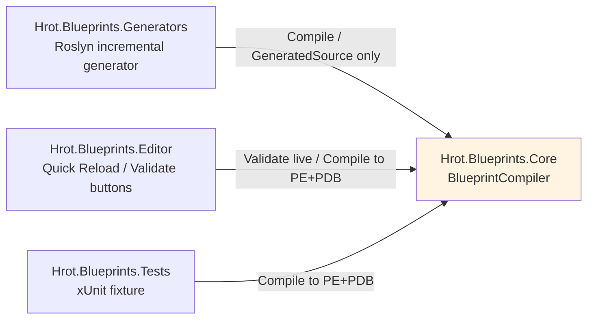
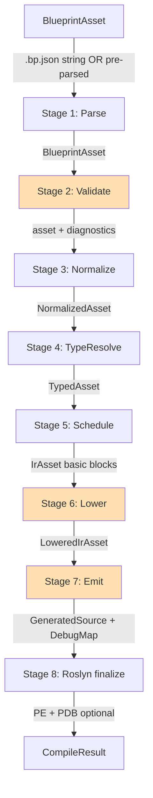

# Blueprint Subsystem — Compiler Detailed Design

> **Status:** Detailed design, derived from `Blueprint_Subsystem_Architecture_v1.2.md` + Final Resolutions + Inline Patches + Implementation Roadmap v1.1.
> **Audience:** Implementation agent and human reviewer.
> **Drives:** Milestones M3 (Validator), M4 (Library lowering), M5 (Instance lowering), M6 (AiPrimitive lowering + thunks), M7 (Latent / channel commands / waits).
> **Doesn't cover:** Runtime systems (Runtime DD), test harness (Test Harness DD), debug protocol UI (Debug Protocol DD), editor (Editor DD), hot-reload coordinator (Hot Reload DD).
> **Companion code lives in:** `Hrot/Subsystems/Blueprints/Hrot.Blueprints.Core/Compiler/` (per Roadmap §2).

---

## Table of Contents

1. Architecture of the compiler library
2. Pipeline overview and stage contracts
3. IR data model
4. Stage 1 — Parse
5. Stage 2 — Validate
6. Stage 3 — Normalize
7. Stage 4 — Type resolve
8. Stage 5 — Schedule
9. Stage 6 — Lower (dispatch-aware)
10. Stage 7 — Emit (C# generation)
11. Stage 8 — Roslyn finalize (compile, PDB, embedded source)
12. Determinism enforcement
13. Debug map generation
14. Catalogs integration (engine events, channel commands, wait primitives)
15. End-to-end worked example: MoveToAndFire
16. End-to-end worked example: HealthRegen (Instance + latent)
17. Compiler test strategy
18. Open questions for implementation

---

## 1. Architecture of the compiler library

### 1.1 Module layout

The compiler library lives at `Hrot/Subsystems/Blueprints/Hrot.Blueprints.Core/Compiler/` and exposes one public entry point — `BlueprintCompiler` — plus a set of supporting types organized into namespaces.

```
Hrot.Blueprints.Core/Compiler/
├── BlueprintCompiler.cs                    # public entry point
├── CompileOptions.cs                        # input options record
├── CompileResult.cs                         # output record
├── Diagnostics/
│   ├── Diagnostic.cs                       # the diagnostic record type
│   ├── DiagnosticCodes.cs                  # BP0001..BP9999 catalog
│   └── DiagnosticSink.cs                   # accumulator used during pipeline
├── Ir/
│   ├── IrAsset.cs                          # top-level compiled asset
│   ├── IrGraph.cs                          # one graph in basic-block form
│   ├── IrBlock.cs                          # basic block
│   ├── IrStatement.cs                      # one statement (operation)
│   ├── IrExpression.cs                     # data-flow expression tree
│   ├── IrValue.cs                          # SSA-like temp identifier
│   ├── IrOperation.cs                      # enum of all IR operations
│   ├── IrTypeRef.cs                        # resolved type reference
│   └── IrDebugAnnotation.cs                # source-node trail for debug map
├── Stages/
│   ├── Stage1_Parse.cs                     # JSON → BlueprintAsset
│   ├── Stage2_Validate.cs                  # asset → diagnostics
│   ├── Stage3_Normalize.cs                 # asset → normalized asset
│   ├── Stage4_TypeResolve.cs               # normalized asset → typed asset
│   ├── Stage5_Schedule.cs                  # typed asset → IR (basic blocks)
│   ├── Stage6_Lower.cs                     # IR → dispatch-lowered IR
│   └── Stage7_Emit.cs                      # lowered IR → C# source text
├── Lowering/
│   ├── LibraryLowering.cs
│   ├── AiPrimitiveLowering.cs
│   ├── InstanceLowering.cs
│   ├── ChannelCommandLowering.cs
│   ├── WaitLowering_AiPrimitive.cs         # phase-byte state machine
│   ├── WaitLowering_Instance.cs            # BlueprintLatentCursor switch
│   └── LatentDelayLowering.cs
├── Emit/
│   ├── CSharpEmitter.cs                    # main emitter, line tracker
│   ├── EmissionContext.cs                  # threaded through emitters
│   ├── Templates/                          # reusable template fragments
│   │   ├── ThunkTemplates.cs               # BTree/HSM thunk skeletons
│   │   ├── RegistrarTemplate.cs            # [BlueprintRegistrar] class
│   │   ├── ProjectionTemplate.cs           # Unsafe.As + StructureHash header
│   │   └── ProbeTemplate.cs                # DebugProbe.NodeEnter calls
│   ├── Sanitizer.cs                        # SanitizedName generator
│   └── DebugMapBuilder.cs                  # tracks source spans alongside emission
├── Roslyn/
│   ├── InMemoryRoslynCompiler.cs           # CSharpCompilation.Emit wrapper
│   ├── MetadataReferenceResolver.cs        # FDP assembly references
│   └── EmbeddedTextHelper.cs               # EmbeddedText.FromSource integration
└── Determinism/
    ├── DeterministicEnumerable.cs          # OrderBy-by-Id helpers
    └── FnvHasher.cs                        # FNV-1a 32-bit and 64-bit
```

### 1.2 Public API surface

The library exposes a small, stable API. Everything else is `internal`.

```csharp
namespace Hrot.Blueprints.Core.Compiler;

public interface IBlueprintCompiler
{
    /// <summary>Compile an asset to a CompileResult.</summary>
    CompileResult Compile(BlueprintAsset asset, CompileOptions options);

    /// <summary>Run validation only (no codegen). Cheap; suitable for live editor feedback.</summary>
    ValidationResult Validate(BlueprintAsset asset, ValidationOptions? options = null);
}

public sealed class BlueprintCompiler : IBlueprintCompiler
{
    public CompileResult Compile(BlueprintAsset asset, CompileOptions options) { /* ... */ }
    public ValidationResult Validate(BlueprintAsset asset, ValidationOptions? options = null) { /* ... */ }
}

public sealed record CompileOptions(
    CompilerMode Mode,
    INodeRegistry NodeRegistry,
    ITypeRegistry TypeRegistry,
    IEngineEventCatalog EngineEvents,
    IChannelCommandCatalog ChannelCommands,
    IWaitPrimitiveCatalog WaitPrimitives,
    IReadOnlyList<BlueprintAsset> SiblingAssets,
    bool EmitPdbWithEmbeddedSource = false,
    string? VirtualSourcePath = null);

public enum CompilerMode { Release, Debug, Trace }

public sealed record CompileResult(
    bool Succeeded,
    string? GeneratedSource,
    int BlueprintId,
    ulong StructureHash,
    DebugMap? DebugMap,
    IReadOnlyList<Diagnostic> Diagnostics,
    BlueprintAsset CanonicalAsset,
    byte[]? PortablePdb,               // only when EmitPdbWithEmbeddedSource was set
    byte[]? PortablePe);                // only when EmitPdbWithEmbeddedSource was set

public sealed record ValidationOptions(bool ResolveSiblings = true);
public sealed record ValidationResult(IReadOnlyList<Diagnostic> Diagnostics);
```

Two distinct entry points serve two distinct callers:

- **`Validate`** is what the editor calls on every dirty-flag transition. It runs stages 1-4 only, accumulates diagnostics, never produces C#. Designed to complete in milliseconds even for large assets.
- **`Compile`** is what the generator and the test harness call. It runs all stages; if `EmitPdbWithEmbeddedSource = true` it also runs Stage 8 (Roslyn compile to PE+PDB bytes).

### 1.3 Three callers of the compiler library



All three use the same `BlueprintCompiler` shape; they differ in what they ask for in `CompileOptions`. The generator never asks for PE+PDB (it hands the source string to Roslyn's normal pipeline via `AddSource`). The editor and tests ask for PE+PDB to load assemblies into patch ALCs directly.

### 1.4 Compiler statelessness

`BlueprintCompiler` instances hold no mutable state. Each `Compile` call is independent. Two parallel calls with the same input produce byte-identical output (determinism §12).

This matters because the Roslyn generator may re-invoke the compiler many times per build, sometimes in parallel for different assets, and it must not race.

---

## 2. Pipeline overview and stage contracts



Each stage is a pure function `Stage<TIn, TOut>(TIn input, DiagnosticSink sink, CompileOptions opts) → TOut`. Stages return early if previous diagnostics include errors (no point typechecking an invalid graph).

### 2.1 Stage error-handling contract

Two categories:

- **Hard error**: stage aborts, returns null/empty output, downstream stages skipped. Examples: malformed JSON in Parse, type-resolution failure in TypeResolve.
- **Soft error**: stage continues, accumulates more diagnostics, downstream stages may also run (often producing more diagnostics that are useful to surface together). Example: a single missing variable reference doesn't abort validation of the rest of the graph.

`DiagnosticSink.HasErrors` is checked at each stage boundary. Hard error → pipeline aborts and `CompileResult.Succeeded = false`. Warnings never abort.

### 2.2 Diagnostic code naming

```
BPxxxx = Blueprint compiler diagnostic
  BP0001-BP0999 : Parse stage
  BP1000-BP1999 : Validate stage
  BP2000-BP2999 : Normalize stage
  BP3000-BP3999 : TypeResolve stage
  BP4000-BP4999 : Schedule stage
  BP5000-BP5999 : Lower stage
  BP6000-BP6999 : Emit stage
  BP7000-BP7999 : Roslyn finalize
  BP9000-BP9999 : Internal compiler error (bug in compiler itself)
```

A full diagnostic catalog appears in `DiagnosticCodes.cs`. Each code constant has an XML doc explaining when it fires and how the author fixes it.

---

## 3. IR data model

The IR sits between the asset model (declarative, author-shaped) and the C# emission (imperative, machine-shaped). It is the form on which lowering and emission operate.

### 3.1 Design principles

The IR has these properties:

1. **Basic-block oriented.** Each graph becomes a list of `IrBlock`s, where each block ends with a control-flow operation (branch, return, sequence-next, wait-suspend). This makes lowering to `goto`-style C# trivial.
2. **SSA-like temps.** Data values flow through `IrValue` identifiers. Each `IrValue` is assigned exactly once. This makes type checking and value tracking straightforward.
3. **Debug-annotated.** Every `IrStatement` carries an `IrDebugAnnotation` recording the source node ID, source pin ID (if applicable), and graph ID. The emitter walks these annotations alongside generation, building the debug map.
4. **Dispatch-agnostic until Stage 6.** The IR coming out of Stage 5 (Schedule) is the same regardless of dispatch kind. Stage 6 (Lower) is where dispatch-aware transformations happen.
5. **Carries enough metadata to emit correct C# directly.** No "look back at the original asset" during emit; the IR is self-sufficient.

### 3.2 `IrAsset`

```csharp
namespace Hrot.Blueprints.Core.Compiler.Ir;

public sealed record IrAsset
{
    public Guid AssetId { get; init; }
    public string Name { get; init; } = "";
    public string SanitizedName { get; init; } = "";       // for filename / class name
    public int BlueprintId { get; init; }                  // FNV-1a 32-bit
    public ulong StructureHash { get; init; }              // FNV-1a 64-bit
    public BlueprintDispatchKind Dispatch { get; init; }

    // For AiPrimitive only
    public AiPrimitiveIntent? Intent { get; init; }
    public IReadOnlyList<AiPrimitiveHosting> Hostings { get; init; } = Array.Empty<AiPrimitiveHosting>();
    public IReadOnlyList<IrField> Parameters { get; init; } = Array.Empty<IrField>();
    public IReadOnlyList<IrField> WorkingState { get; init; } = Array.Empty<IrField>();

    // For Instance only
    public IReadOnlyList<IrField> Variables { get; init; } = Array.Empty<IrField>();
    public IReadOnlyList<IrCustomEvent> CustomEvents { get; init; } = Array.Empty<IrCustomEvent>();
    public IReadOnlyList<int> CallablePeerBlueprintIds { get; init; } = Array.Empty<int>();
    public bool IsWorldSingleton { get; init; }
    public BlackboardTier? SelectedTier { get; init; }     // chosen by compiler if tierHint=Auto

    // All dispatch kinds
    public IReadOnlyList<IrGraph> Graphs { get; init; } = Array.Empty<IrGraph>();
}

public sealed record IrField
{
    public Guid Id { get; init; }
    public string Name { get; init; } = "";
    public IrTypeRef Type { get; init; } = null!;
    public string DefaultValueCSharp { get; init; } = "";  // C# literal expression
    public int Offset { get; init; }                       // computed during lowering
    public int Size { get; init; }
}

public sealed record IrCustomEvent
{
    public Guid Id { get; init; }
    public string Name { get; init; } = "";
    public IReadOnlyList<IrField> Parameters { get; init; } = Array.Empty<IrField>();
}
```

### 3.3 `IrGraph` and `IrBlock`

```csharp
public sealed record IrGraph
{
    public Guid Id { get; init; }
    public string Name { get; init; } = "";
    public IrGraphKind Kind { get; init; }
    public IReadOnlyList<IrField> Inputs { get; init; } = Array.Empty<IrField>();
    public IReadOnlyList<IrField> Outputs { get; init; } = Array.Empty<IrField>();
    public IReadOnlyList<IrBlock> Blocks { get; init; } = Array.Empty<IrBlock>();
    public IrBlockId Entry { get; init; }
}

public enum IrGraphKind
{
    Function,                // ordinary function graph
    Event,                   // event handler graph (Instance)
    AiPrimitiveMain,         // the single AiPrimitive entry graph
    Construction,            // construction script (Slice 2)
}

public readonly record struct IrBlockId(int Value);

public sealed record IrBlock
{
    public IrBlockId Id { get; init; }
    public string Label { get; init; } = "";              // human-readable, for emitted C# label
    public IReadOnlyList<IrStatement> Statements { get; init; } = Array.Empty<IrStatement>();
    public IrTerminator Terminator { get; init; } = null!;
}
```

Each block ends with an `IrTerminator` describing how control leaves the block:

```csharp
public abstract record IrTerminator
{
    public IrDebugAnnotation Debug { get; init; } = null!;
}

public sealed record IrTerm_Goto(IrBlockId Target) : IrTerminator;
public sealed record IrTerm_Branch(IrValue Condition, IrBlockId IfTrue, IrBlockId IfFalse) : IrTerminator;
public sealed record IrTerm_Return(IrValue? Value) : IrTerminator;
public sealed record IrTerm_ReturnStatus(NodeStatus Status) : IrTerminator;
public sealed record IrTerm_Suspend(IrValue ResumePoint, IrValue? WaitUntilTime, IrBlockId ResumeBlock) : IrTerminator;
public sealed record IrTerm_FallThrough : IrTerminator;   // block continues to next in source order
```

### 3.4 `IrStatement` and `IrOperation`

A statement is one operation that produces (optionally) an `IrValue` and (optionally) has side effects.

```csharp
public sealed record IrStatement
{
    public IrValue? ResultValue { get; init; }            // null for void-returning ops
    public IrOperation Operation { get; init; } = null!;
    public IrDebugAnnotation Debug { get; init; } = null!;
}

public readonly record struct IrValue(int Index, IrTypeRef Type);
```

`IrOperation` is a discriminated union (modeled as an abstract record hierarchy). The complete list:

```csharp
public abstract record IrOperation;

// Constants and references
public sealed record IrOp_Const(string CSharpLiteral, IrTypeRef Type) : IrOperation;
public sealed record IrOp_ReadParam(int ParamIndex) : IrOperation;
public sealed record IrOp_ReadVariable(int VariableIndex) : IrOperation;
public sealed record IrOp_WriteVariable(int VariableIndex, IrValue Value) : IrOperation;
public sealed record IrOp_ReadInputArg(int ArgIndex) : IrOperation;
public sealed record IrOp_Self : IrOperation;
public sealed record IrOp_Time : IrOperation;
public sealed record IrOp_DeltaTime : IrOperation;

// Pure-function calls (math, logical, type coercion)
public sealed record IrOp_PureCall(
    string MethodFqn,                                     // e.g. "System.Math.Sqrt"
    IReadOnlyList<IrValue> Args,
    IrTypeRef ReturnType) : IrOperation;

// Impure calls into Blueprint code
public sealed record IrOp_LibraryCall(
    int LibraryBlueprintId,
    string MethodName,
    IReadOnlyList<IrValue> Args,
    IrTypeRef ReturnType) : IrOperation;

public sealed record IrOp_PeerCall(
    int PeerBlueprintId,
    string MethodName,
    IReadOnlyList<IrValue> Args,
    IrTypeRef ReturnType) : IrOperation;                  // emits partition slot lookup

public sealed record IrOp_AiPrimitiveCall(
    int AiPrimitiveBlueprintId,
    IReadOnlyList<IrValue> Args,
    IrTypeRef ReturnType) : IrOperation;                  // via BlueprintCall hosting

public sealed record IrOp_RaiseCustomEvent(
    int CustomEventIndex,
    IReadOnlyList<IrValue> Args) : IrOperation;            // synchronous, same-Instance

// Engine-event-driven (Instance only, in generated tick poll loop)
public sealed record IrOp_PollEngineEvent(
    string EventTypeFqn,
    string TargetFieldName,                                // for self-filter
    IReadOnlyList<IrField> PayloadFields,
    Guid HandlerGraphId) : IrOperation;

// ECS read (impure)
public sealed record IrOp_HasComponent(string ComponentTypeFqn, IrValue Entity) : IrOperation;
public sealed record IrOp_GetComponent(string ComponentTypeFqn, IrValue Entity, IrTypeRef Type) : IrOperation;
public sealed record IrOp_GetComponentRO(string ComponentTypeFqn, IrValue Entity, IrTypeRef Type) : IrOperation;

// ECS write via ECB (impure)
public sealed record IrOp_AddComponent(string ComponentTypeFqn, IrValue Entity, IrValue Value) : IrOperation;
public sealed record IrOp_RemoveComponent(string ComponentTypeFqn, IrValue Entity) : IrOperation;
public sealed record IrOp_DestroyEntity(IrValue Entity) : IrOperation;
public sealed record IrOp_PublishEvent(string EventTypeFqn, IReadOnlyList<(string FieldName, IrValue Value)> Fields) : IrOperation;

// Channel command (impure, lowered from ChannelCommandNode)
public sealed record IrOp_ChannelCommand(
    string ChannelComponentTypeFqn,                       // e.g. "Hrot.LocomotionChannel"
    string ActionIdConstantName,                           // e.g. "NavigationConstants.ActionIdMoveTo"
    string ParamsStructTypeFqn,                            // e.g. "Hrot.MoveToParams"
    IReadOnlyList<(string FieldName, IrValue Value)> ParamFields) : IrOperation;

// Wait primitives — pseudo-operations; Stage 6 turns them into block structure.
public sealed record IrOp_WaitForChannel(
    string ChannelComponentTypeFqn,
    IReadOnlyList<IrField> StatusFields) : IrOperation;

public sealed record IrOp_WaitForEvent(
    string EventTypeFqn,
    string? FilterFieldName,
    IrValue? FilterValue,
    IReadOnlyList<IrField> PayloadFields) : IrOperation;

public sealed record IrOp_LatentDelay(IrValue Seconds) : IrOperation;

// Debug probes (Debug/Trace modes)
public sealed record IrOp_DebugProbe_NodeEnter(Guid NodeId, string NodeKind) : IrOperation;
public sealed record IrOp_DebugProbe_PinValue(Guid PinId, IrValue Value, string PinName) : IrOperation;
```

### 3.5 `IrDebugAnnotation`

```csharp
public sealed record IrDebugAnnotation
{
    public Guid GraphId { get; init; }
    public Guid? NodeId { get; init; }                     // null for compiler-synthesized ops
    public Guid? PinId { get; init; }                      // for value-producing ops
    public string? Synthesized { get; init; }              // e.g. "wait-resume-1", "phase-init"
}
```

Synthesized annotations document compiler-inserted operations that don't trace back to a single source node (e.g., a `goto` between basic blocks resulting from a Branch node).

### 3.6 `IrTypeRef`

The IR uses fully-resolved CLR type references rather than the asset-model's `BlueprintTypeRef`. The Type Resolve stage converts the latter to the former.

```csharp
public sealed record IrTypeRef
{
    public string FullName { get; init; } = "";            // FQTN
    public bool IsArray { get; init; }
    public IrTypeRef? ElementType { get; init; }           // for IsArray
    public bool IsUnmanaged { get; init; }                 // true for value types from a hosted-by-engine list
    public int SizeBytes { get; init; }                    // for unmanaged types only; 0 for managed
    public bool IsEntityHandle { get; init; }              // true for Fdp.Core.Entity
}
```

`IsUnmanaged` and `SizeBytes` come from a static table of well-known FDP types in the type registry; user-defined unmanaged component types are added to this table by attribute scan.

---

*Continued in Part 2 — Stages 1-3 (Parse, Validate, Normalize).*

## 4. Stage 1 — Parse

### 4.1 Goal

Convert a `.bp.json` text payload into an in-memory `BlueprintAsset` object graph. Validate JSON well-formedness only — semantic validation is Stage 2.

### 4.2 Implementation

```csharp
internal static class Stage1_Parse
{
    public static BlueprintAsset? Run(string json, DiagnosticSink sink)
    {
        try
        {
            var options = BlueprintJsonServices.GetDeserializeOptions();
            var asset = JsonSerializer.Deserialize<BlueprintAsset>(json, options);
            if (asset is null)
            {
                sink.Add(Diagnostic.Error(DiagnosticCodes.BP0001_NullAsset,
                    "JSON deserialized to null. File may be empty or malformed."));
                return null;
            }
            return asset;
        }
        catch (JsonException ex)
        {
            sink.Add(Diagnostic.Error(DiagnosticCodes.BP0002_JsonParseError,
                $"JSON parse error: {ex.Message} (path: {ex.Path}, line: {ex.LineNumber})"));
            return null;
        }
    }
}
```

### 4.3 Diagnostics emitted

| Code   | Severity | Condition                              |
|--------|----------|----------------------------------------|
| BP0001 | Error    | Deserialization returned null          |
| BP0002 | Error    | JSON parse exception                   |
| BP0010 | Error    | Asset has empty/zero Guid              |
| BP0011 | Error    | Asset has empty Name                   |

### 4.4 Notes

- Stage 1 does not check schema version, polymorphic discriminator validity, or any business rules.
- `BlueprintJsonServices.GetDeserializeOptions()` provides `FdpJsonOptionsRegistry.DefaultRelaxed`-based options with polymorphic resolvers for `Node`.
- Unknown fields silently ignored per architect's QJ-2 ruling; missing fields default-initialize.

---

## 5. Stage 2 — Validate

### 5.1 Goal

Apply every business rule from v1.2 §4-§6 and §15-§16. Accumulate diagnostics. Hard-fail only on rules that would make subsequent stages crash.

This stage is also runnable independently (via `IBlueprintCompiler.Validate`) for live editor feedback.

### 5.2 Validator pipeline

The validator is organized as a list of validator passes:

```csharp
internal interface IValidator
{
    void Validate(BlueprintAsset asset, ValidationContext ctx);
}

internal sealed class ValidationContext
{
    public DiagnosticSink Diagnostics { get; }
    public ITypeRegistry TypeRegistry { get; }
    public INodeRegistry NodeRegistry { get; }
    public IEngineEventCatalog EngineEvents { get; }
    public IChannelCommandCatalog ChannelCommands { get; }
    public IWaitPrimitiveCatalog WaitPrimitives { get; }
    public IReadOnlyDictionary<Guid, BlueprintAsset> SiblingsById { get; }
}

internal static class Stage2_Validate
{
    private static readonly IReadOnlyList<IValidator> Validators = new IValidator[]
    {
        new V_AssetStructure(),                // AssetId, Name non-empty
        new V_DispatchKindCompatibility(),     // dispatch + intent + hostings
        new V_NodeStructure(),                 // pins valid; no orphan pins
        new V_LinkStructure(),                 // links refer to real pins
        new V_GraphStructure(),                // entry points; reachability
        new V_VariablesAndState(),             // size limits per dispatch
        new V_AiPrimitiveIntent(),             // Condition: no Running, no latent
        new V_LatentRules(),                   // latent only where allowed
        new V_ChannelCommandReferences(),      // ChannelCommandNode in catalog
        new V_EventGraphReferences(),          // event graphs in catalog or custom
        new V_WaitNodeReferences(),            // wait nodes in catalog
        new V_PeerReferences(),                // CallablePeers consistent
        new V_TypeReferences(),                // BlueprintTypeRef resolves
        new V_DeterminismOrdering(),           // mostly Slice 2
    };

    public static void Run(BlueprintAsset asset, ValidationContext ctx)
    {
        foreach (var v in Validators)
        {
            v.Validate(asset, ctx);
            if (ctx.Diagnostics.HasFatalErrors) return;
        }
    }
}
```

### 5.3 V_DispatchKindCompatibility (spelled out in full)

```csharp
internal sealed class V_DispatchKindCompatibility : IValidator
{
    public void Validate(BlueprintAsset asset, ValidationContext ctx)
    {
        switch (asset.Dispatch)
        {
            case BlueprintDispatchKind.Library:
                if (asset.Primitive is not null)
                    ctx.Diagnostics.Add(Diagnostic.Error(DiagnosticCodes.BP1010,
                        "Library asset has 'primitive' block, valid only for AiPrimitive.",
                        asset.AssetId));
                if (asset.Variables.Count > 0)
                    ctx.Diagnostics.Add(Diagnostic.Error(DiagnosticCodes.BP1011,
                        "Library asset must not declare member variables.", asset.AssetId));
                if (asset.CustomEvents.Count > 0)
                    ctx.Diagnostics.Add(Diagnostic.Error(DiagnosticCodes.BP1012,
                        "Library asset must not declare custom events.", asset.AssetId));
                if (asset.Graphs.Any(g => g.Kind == GraphKind.Event))
                    ctx.Diagnostics.Add(Diagnostic.Error(DiagnosticCodes.BP1013,
                        "Library asset must not contain Event graphs.", asset.AssetId));
                break;

            case BlueprintDispatchKind.AiPrimitive:
                if (asset.Primitive is null)
                {
                    ctx.Diagnostics.Add(Diagnostic.Error(DiagnosticCodes.BP1020,
                        "AiPrimitive asset must have a 'primitive' block.", asset.AssetId));
                    return;
                }
                if (asset.Primitive.Hostings.Count == 0)
                    ctx.Diagnostics.Add(Diagnostic.Error(DiagnosticCodes.BP1021,
                        "AiPrimitive must declare at least one hosting.", asset.AssetId));

                var actionHostings = new[] { AiPrimitiveHosting.BTreeAction, AiPrimitiveHosting.HsmAction };
                var conditionHostings = new[] { AiPrimitiveHosting.BTreeCondition, AiPrimitiveHosting.HsmGuard };
                foreach (var hosting in asset.Primitive.Hostings)
                {
                    if (asset.Primitive.Intent == AiPrimitiveIntent.Action && conditionHostings.Contains(hosting))
                        ctx.Diagnostics.Add(Diagnostic.Error(DiagnosticCodes.BP1022,
                            $"Action intent incompatible with condition-shaped hosting '{hosting}'.",
                            asset.AssetId));
                    if (asset.Primitive.Intent == AiPrimitiveIntent.Condition && actionHostings.Contains(hosting))
                        ctx.Diagnostics.Add(Diagnostic.Error(DiagnosticCodes.BP1023,
                            $"Condition intent incompatible with action-shaped hosting '{hosting}'.",
                            asset.AssetId));
                }
                if (asset.Variables.Count > 0)
                    ctx.Diagnostics.Add(Diagnostic.Error(DiagnosticCodes.BP1024,
                        "AiPrimitive uses 'parameters' and 'workingState', not 'variables'.",
                        asset.AssetId));
                if (asset.Graphs.Any(g => g.Kind == GraphKind.Event))
                    ctx.Diagnostics.Add(Diagnostic.Error(DiagnosticCodes.BP1025,
                        "AiPrimitive does not subscribe to engine events.", asset.AssetId));
                break;

            case BlueprintDispatchKind.Instance:
                if (asset.Primitive is not null)
                    ctx.Diagnostics.Add(Diagnostic.Error(DiagnosticCodes.BP1030,
                        "Instance asset must not have a 'primitive' block.", asset.AssetId));
                if (asset.Parameters.Count > 0 || asset.WorkingState.Count > 0)
                    ctx.Diagnostics.Add(Diagnostic.Error(DiagnosticCodes.BP1031,
                        "Instance uses 'variables', not 'parameters'/'workingState'.",
                        asset.AssetId));
                break;
        }
    }
}
```

### 5.4 V_AiPrimitiveIntent (spelled out in full)

```csharp
internal sealed class V_AiPrimitiveIntent : IValidator
{
    public void Validate(BlueprintAsset asset, ValidationContext ctx)
    {
        if (asset.Dispatch != BlueprintDispatchKind.AiPrimitive) return;
        if (asset.Primitive?.Intent != AiPrimitiveIntent.Condition) return;

        foreach (var graph in asset.Graphs)
        {
            foreach (var node in graph.Nodes)
            {
                switch (node)
                {
                    case ReturnNode rn when rn.Status == NodeStatus.Running:
                        ctx.Diagnostics.Add(Diagnostic.Error(DiagnosticCodes.BP1100,
                            "Condition intent: Return Running is forbidden. " +
                            "Conditions must be instantaneous.",
                            asset.AssetId, graph.Id, node.Id));
                        break;

                    case LatentDelayNode:
                    case WaitForChannelNode:
                    case WaitForEventNode:
                        ctx.Diagnostics.Add(Diagnostic.Error(DiagnosticCodes.BP1101,
                            "Condition intent: latent nodes are forbidden. " +
                            "Condition graphs must be synchronous.",
                            asset.AssetId, graph.Id, node.Id));
                        break;
                }
            }
        }
    }
}
```

### 5.5 V_VariablesAndState (spelled out in full)

Implements size-limit checks and computes layouts.

```csharp
internal sealed class V_VariablesAndState : IValidator
{
    public void Validate(BlueprintAsset asset, ValidationContext ctx)
    {
        switch (asset.Dispatch)
        {
            case BlueprintDispatchKind.AiPrimitive:
                if (asset.Primitive is null) return;

                int paramsSize = ComputeStructSize(asset.Parameters, ctx);
                if (paramsSize > 100)
                    ctx.Diagnostics.Add(Diagnostic.Error(DiagnosticCodes.BP1200,
                        $"AiPrimitive Parameters total {paramsSize} bytes; max is 100 " +
                        "(BrainBlackboard.BehaviorParameters slice).",
                        asset.AssetId));

                int workingSize = ComputeStructSize(asset.WorkingState, ctx);
                if (workingSize > 1024 - 8)
                    ctx.Diagnostics.Add(Diagnostic.Error(DiagnosticCodes.BP1201,
                        $"AiPrimitive WorkingState total {workingSize} bytes; max is " +
                        $"{1024 - 8} (Blackboard1024 minus 8-byte StructureHash header).",
                        asset.AssetId));
                break;

            case BlueprintDispatchKind.Instance:
                int stateSize = ComputeStructSize(asset.Variables, ctx);
                int tierBudget = (asset.TierHint, stateSize) switch
                {
                    (BlackboardTierHint.Force1024, _) => 928,
                    (BlackboardTierHint.Force4096, _) => 3936,
                    (BlackboardTierHint.Force16384, _) => 16096,
                    (BlackboardTierHint.Auto, _) when stateSize <= 928 => 928,
                    (BlackboardTierHint.Auto, _) when stateSize <= 3936 => 3936,
                    (BlackboardTierHint.Auto, _) when stateSize <= 16096 => 16096,
                    _ => 0,
                };
                if (tierBudget == 0)
                    ctx.Diagnostics.Add(Diagnostic.Error(DiagnosticCodes.BP1210,
                        $"Instance state {stateSize} bytes exceeds largest tier (16384). " +
                        "Reduce variable count or split asset.",
                        asset.AssetId));
                else if (asset.TierHint != BlackboardTierHint.Auto && stateSize > tierBudget)
                    ctx.Diagnostics.Add(Diagnostic.Error(DiagnosticCodes.BP1211,
                        $"Instance state {stateSize} bytes exceeds requested tier " +
                        $"{asset.TierHint} budget {tierBudget} bytes.",
                        asset.AssetId));
                break;
        }
    }

    private int ComputeStructSize(IReadOnlyList<VariableDecl> fields, ValidationContext ctx)
    {
        int offset = 0;
        foreach (var f in fields)
        {
            if (!ctx.TypeRegistry.TryResolve(f.Type, out var resolvedType))
                continue;
            int align = resolvedType.AlignmentBytes;
            int sz = resolvedType.SizeBytes;
            offset = AlignUp(offset, align);
            offset += sz;
        }
        return AlignUp(offset, 8);
    }

    private static int AlignUp(int offset, int align) => (offset + align - 1) & ~(align - 1);
}
```

### 5.6 V_PeerReferences (spelled out in full)

```csharp
internal sealed class V_PeerReferences : IValidator
{
    public void Validate(BlueprintAsset asset, ValidationContext ctx)
    {
        foreach (var graph in asset.Graphs)
        {
            foreach (var node in graph.Nodes.OfType<CallPeerBlueprintNode>())
            {
                if (!asset.CallablePeers.Contains(node.TargetPeerAssetId))
                {
                    ctx.Diagnostics.Add(Diagnostic.Error(DiagnosticCodes.BP1300,
                        $"CallPeerBlueprintNode targets asset {node.TargetPeerAssetId}, " +
                        "which is not in CallablePeers list.",
                        asset.AssetId, graph.Id, node.Id));
                    continue;
                }

                if (!ctx.SiblingsById.TryGetValue(node.TargetPeerAssetId, out var peer))
                {
                    ctx.Diagnostics.Add(Diagnostic.Error(DiagnosticCodes.BP1301,
                        $"CallablePeer {node.TargetPeerAssetId} not found among compiled assets. " +
                        "Add as <AdditionalFiles> or remove from CallablePeers.",
                        asset.AssetId, graph.Id, node.Id));
                    continue;
                }

                bool found = peer.Graphs.Any(g =>
                    g.Kind == GraphKind.Function && g.Name == node.TargetMethod);
                if (!found)
                    ctx.Diagnostics.Add(Diagnostic.Error(DiagnosticCodes.BP1302,
                        $"CallablePeer {peer.Name} has no function graph named " +
                        $"'{node.TargetMethod}'.",
                        asset.AssetId, graph.Id, node.Id));
            }
        }
    }
}
```

### 5.7 Diagnostic catalog (excerpt)

```
BP0001  NullAsset
BP0002  JsonParseError
BP0010  MissingAssetId
BP0011  MissingAssetName
BP1010  LibraryHasPrimitiveBlock
BP1011  LibraryHasVariables
BP1012  LibraryHasCustomEvents
BP1013  LibraryHasEventGraphs
BP1020  AiPrimitiveMissingPrimitiveBlock
BP1021  AiPrimitiveNoHostings
BP1022  AiPrimitiveActionIntentConditionHosting
BP1023  AiPrimitiveConditionIntentActionHosting
BP1024  AiPrimitiveHasVariables
BP1025  AiPrimitiveHasEventGraphs
BP1030  InstanceHasPrimitiveBlock
BP1031  InstanceHasParametersOrWorkingState
BP1100  ConditionReturnsRunning
BP1101  ConditionContainsLatentNode
BP1200  AiPrimitiveParametersTooLarge
BP1201  AiPrimitiveWorkingStateTooLarge
BP1210  InstanceStateTooLargeForAnyTier
BP1211  InstanceStateExceedsRequestedTier
BP1300  CallPeerNotInCallablePeersList
BP1301  CallPeerNotFoundInSiblings
BP1302  CallPeerMissingTargetMethod
BP1400  UnknownEngineEvent
BP1401  UnknownChannelCommand
BP1402  UnknownWaitPrimitive
BP1500  TypeRefDoesNotResolve
BP1501  TypeMismatchOnLink
BP1600  ExecutionPathHasOrphanedNode
BP1601  ExecutionPathHasNoReturn
BP1602  GraphHasNoEntry
```

### 5.8 Validation performance targets

Stage 2 runs **on every editor keystroke** (via dirty-flag debounce). Targets:

- Small asset (5-20 nodes): < 1 ms.
- Medium asset (50-200 nodes): < 10 ms.
- Large asset (500+ nodes): < 50 ms.

Implementation rules:
- No allocations in the hot path of node-walking. Reuse `List<T>` via `ArrayPool<T>` where helpful.
- Cross-reference resolution computed once per `ValidationContext`.
- Type-registry lookups cached.

---

## 6. Stage 3 — Normalize

### 6.1 Goal

Transform the validated asset into a canonical form ready for typing and scheduling. Specifically:

- Materialize default values for unconnected data pins (replace with literal nodes).
- Insert implicit cast nodes where pin types differ but a known coercion exists (e.g., `int → float`).
- Eliminate orphan nodes that have no exec inputs and produce no used data.
- (Slice 2) Expand macros, inline collapsed subgraphs.

### 6.2 Stage output

A `NormalizedAsset` with the same shape as `BlueprintAsset` but with transforms applied. Any added nodes carry synthesized `IrDebugAnnotation` so the debug map can still trace back to author intent.

### 6.3 Implementation sketch

```csharp
internal static class Stage3_Normalize
{
    public static BlueprintAsset Run(BlueprintAsset asset, ValidationContext ctx)
    {
        asset = MaterializeDefaultPinLiterals(asset, ctx);
        asset = InsertImplicitCasts(asset, ctx);
        asset = EliminateOrphanNodes(asset, ctx);
        return asset;
    }

    private static BlueprintAsset MaterializeDefaultPinLiterals(BlueprintAsset asset, ValidationContext ctx)
    {
        // For each unconnected data input pin with DefaultLiteralJson != null:
        //   - Synthesize a LiteralNode with the default value.
        //   - Connect it to the input pin with a synthesized link.
        // All synthesized Guids derived deterministically from
        //   (graphId, pinId, "default-literal").
        // ...
    }

    private static BlueprintAsset InsertImplicitCasts(BlueprintAsset asset, ValidationContext ctx)
    {
        // For each link where source pin type T != dest pin type U:
        //   - Look up coercion(T, U) in TypeRegistry.
        //   - If coercion exists: insert a CastNode between source and dest.
        //   - If no coercion: leave it; TypeResolve will emit a type-mismatch diagnostic.
        // ...
    }

    private static BlueprintAsset EliminateOrphanNodes(BlueprintAsset asset, ValidationContext ctx)
    {
        // Walk graphs; a node is orphan if:
        //   - It has no incoming exec wire AND
        //   - No output exec wire AND
        //   - No output data wire reaches a node connected to the exec chain.
        // Remove orphans; emit a warning.
        // ...
    }
}
```

### 6.4 Determinism in normalization

All synthesized Guids must be deterministic. Recipe:

```csharp
private static Guid SynthesizedGuid(string purpose, params object[] inputs)
{
    using var hasher = System.Security.Cryptography.SHA256.Create();
    using var ms = new MemoryStream();
    using var w = new BinaryWriter(ms);
    w.Write(purpose);
    foreach (var input in inputs)
        w.Write(input.ToString() ?? "");
    var hash = hasher.ComputeHash(ms.ToArray());
    return new Guid(hash.Take(16).ToArray());
}
```

Synthesized literal node for the default value of pin `p` in graph `g`:
```csharp
SynthesizedGuid("default-literal", g.Id, p.Id)
```

Always the same Guid for the same (graph, pin) inputs. Determinism preserved.

### 6.5 Diagnostics emitted

| Code   | Severity | Condition                                            |
|--------|----------|------------------------------------------------------|
| BP2001 | Warning  | Orphan node eliminated (with node ID for editor)     |
| BP2002 | Warning  | Implicit cast inserted (informational)               |
| BP2003 | Error    | Default value JSON literal doesn't parse for the pin's type |

---

*Continued in Part 3 — Stages 4-5 (TypeResolve, Schedule).*

## 7. Stage 4 — Type resolve

### 7.1 Goal

Convert every `BlueprintTypeRef` in the asset (a string-based reference like `{"typeId": "System.Int32"}`) into an `IrTypeRef` (a fully-resolved CLR type with size, alignment, and unmanaged-ness known). Verify every link's source and destination pins have compatible types.

### 7.2 The type registry

The compiler consumes an `ITypeRegistry` that knows about:

- **Built-in C# primitives** (`int`, `float`, `bool`, `byte`, etc.) with their sizes and alignments.
- **`System.Numerics`** vector types (`Vector2`, `Vector3`, `Vector4`, `Quaternion`).
- **`Fdp.Core`** types: `Entity`, etc.
- **Engine component types** exposed for read access (read-only API).
- **User-declared types** registered via attributes (`[ComponentId]`, `[EventId]`, etc.) on the engine side.

```csharp
public interface ITypeRegistry
{
    bool TryResolve(BlueprintTypeRef typeRef, out IrTypeRef resolved);
    bool TryGetCoercion(IrTypeRef from, IrTypeRef to, out string? csharpExpr);
    IReadOnlyList<IrTypeRef> AllTypes { get; }
}
```

The default implementation (`StaticTypeRegistry`) is populated at compiler-startup from a hard-coded table. The engine team adds entries when they expose new types to Blueprint authoring.

### 7.3 Built-in coercion table

The Slice 1 coercion table is conservative:

| From      | To        | C# expression  |
|-----------|-----------|----------------|
| `byte`    | `int`     | `(int)$expr`   |
| `byte`    | `float`   | `(float)$expr` |
| `short`   | `int`     | `(int)$expr`   |
| `short`   | `float`   | `(float)$expr` |
| `int`     | `long`    | `(long)$expr`  |
| `int`     | `float`   | `(float)$expr` |
| `int`     | `double`  | `(double)$expr`|
| `float`   | `double`  | `(double)$expr`|

No reverse coercions (no `float → int` without explicit cast). No bool conversions. Slice 2 may add string formatting as a coercion path.

### 7.4 Implementation

```csharp
internal static class Stage4_TypeResolve
{
    public static TypedAsset Run(BlueprintAsset asset, ValidationContext ctx)
    {
        var resolvedPinTypes = new Dictionary<Guid, IrTypeRef>();
        var resolvedFieldTypes = new Dictionary<Guid, IrTypeRef>();

        // Resolve all variable/parameter/working-state field types
        ResolveFieldTypes(asset.Variables, resolvedFieldTypes, ctx);
        ResolveFieldTypes(asset.Parameters, resolvedFieldTypes, ctx);
        ResolveFieldTypes(asset.WorkingState, resolvedFieldTypes, ctx);

        // Resolve all pin types
        foreach (var graph in asset.Graphs)
            foreach (var node in graph.Nodes)
                foreach (var pin in node.Pins)
                    if (pin.Type is not null && pin.Kind == PinKind.Data)
                    {
                        if (ctx.TypeRegistry.TryResolve(pin.Type, out var resolved))
                            resolvedPinTypes[pin.Id] = resolved;
                        else
                            ctx.Diagnostics.Add(Diagnostic.Error(DiagnosticCodes.BP1500,
                                $"Pin type '{pin.Type.TypeId}' does not resolve.",
                                asset.AssetId, graph.Id, node.Id, pin.Id));
                    }

        // Verify link compatibility
        foreach (var graph in asset.Graphs)
            foreach (var link in graph.Links)
                VerifyLinkTypes(link, graph, resolvedPinTypes, ctx);

        return new TypedAsset(asset, resolvedPinTypes, resolvedFieldTypes);
    }

    private static void VerifyLinkTypes(
        Link link, Graph graph,
        Dictionary<Guid, IrTypeRef> pinTypes,
        ValidationContext ctx)
    {
        if (!pinTypes.TryGetValue(link.From.PinId, out var fromType)) return;
        if (!pinTypes.TryGetValue(link.To.PinId, out var toType)) return;

        if (fromType.FullName == toType.FullName) return;  // exact match
        if (ctx.TypeRegistry.TryGetCoercion(fromType, toType, out _)) return;  // coerces

        ctx.Diagnostics.Add(Diagnostic.Error(DiagnosticCodes.BP1501,
            $"Link from pin type '{fromType.FullName}' to pin type '{toType.FullName}': " +
            "no implicit coercion exists.",
            ctx.AssetId, graph.Id, link.From.NodeId, link.From.PinId));
    }
}

internal sealed record TypedAsset(
    BlueprintAsset Asset,
    IReadOnlyDictionary<Guid, IrTypeRef> PinTypes,
    IReadOnlyDictionary<Guid, IrTypeRef> FieldTypes);
```

### 7.5 Wildcard pins (Slice 1 minimal)

A few node kinds use wildcards (typed at link time, not declaration time):

- **`ArrayMakeNode`** — output `Array<T>` where `T` is inferred from the first input.
- **`ArrayGetNode`** — output `T` where `T` is the element type of the input array.

For Slice 1, these resolve via a simple two-pass walk: first pass resolves all concrete types; second pass propagates types into wildcards. If a wildcard cannot be resolved (no connection from a concrete source), emit `BP1502_UnresolvableWildcard`.

Slice 2 expands wildcard handling to support `Math.Op(T, T) → T` style polymorphic pure nodes.

### 7.6 Notes on `IsUnmanaged` resolution

The type registry's `IsUnmanaged` flag determines whether a value type can be used in fixed-byte-array projections (Params, WorkingState, State structs). The registry must reject managed types (classes, strings) in these contexts.

`V_VariablesAndState` (Stage 2) already checks size limits; here we additionally verify that every variable/param/working-state field's resolved type has `IsUnmanaged = true`. If not, emit `BP1503_ManagedTypeInState`.

---

## 8. Stage 5 — Schedule

### 8.1 Goal

Convert the typed asset into IR basic blocks. Each graph becomes a list of `IrBlock`s. Execution control flow (exec wires) determines block boundaries; data flow (data wires) populates statement operations.

### 8.2 Algorithm overview

Walk each graph from its entry node, following exec wires:

1. **Topologically sort** nodes reachable from entry via exec edges.
2. For each linear stretch of exec-flow (sequence of nodes with single-output exec), pack into one `IrBlock`.
3. At each branch (`Branch` node, `WaitForChannelNode` success/failure outputs), emit an `IrTerm_Branch` terminator, create new blocks for each branch arm.
4. For each `LatentDelay` / `WaitForChannelNode` / `WaitForEventNode`: split the surrounding block at the latent point, emit an `IrTerm_Suspend` terminator, create a resume block on the other side.

For each node added to a block, generate `IrStatement`s for:
- Reading its data inputs (resolves `IrValue`s for them — pure call results, variable reads, constants).
- Performing the node's operation (one or more statements depending on node kind).
- Storing the result (if any) into an `IrValue` that downstream nodes can reference.

### 8.3 Block layout

A graph's blocks are laid out in a deterministic order:

- Entry block always has `IrBlockId(0)`.
- Subsequent blocks numbered in BFS order from entry, sorted by source-node-id at each level for determinism.
- Block label strings use a deterministic convention: `entry`, `branch_{nodeId_short}_true`, `branch_{nodeId_short}_false`, `wait_resume_{n}`, `success`, `failure`.

### 8.4 Data flow lowering

Each node has zero or more data input pins and zero or more data output pins. Data pins are resolved to `IrValue`s before the node's main operation runs.

Example: an `AddNode` (math pure operation) with two data inputs (`A: float`, `B: float`) and one data output (`Result: float`):

```
Pin A connected to: LiteralNode(5.0) output pin
Pin B connected to: GetVariableNode("Multiplier") output pin

Schedule emits:
   irValue_1 = IrOp_Const("5.0f", float)                  // for pin A's source
   irValue_2 = IrOp_ReadVariable(idxMultiplier)            // for pin B's source
   irValue_3 = IrOp_PureCall("System.Math.Add",
                              [irValue_1, irValue_2], float)
                                                            // the Add node itself
```

Each `IrValue` has a stable index (monotonic per graph). The emitter generates a unique C# local variable name from this index (`__t0`, `__t1`, `__t2`, etc.).

### 8.5 Common subexpression elimination

A node may use the same data value multiple times. Schedule deduplicates by computing each pin's `IrValue` exactly once and reusing the same `IrValue` reference at every consumption site.

Implementation: a `pinValueCache : Dictionary<Guid, IrValue>` is maintained during schedule; before generating a new `IrValue` for a pin, check the cache. The cache scope is per-block (since the IR is SSA-like and basic-block-local).

### 8.6 Latent operation handling

Latent pseudo-ops (`IrOp_LatentDelay`, `IrOp_WaitForChannel`, `IrOp_WaitForEvent`) require block splitting:

```
Before split — block contains:
  statements: [A, B, C, IrOp_WaitForChannel(...), D, E]
  terminator: IrTerm_Goto(next)

After split:
  Block_pre:
    statements: [A, B, C]
    terminator: IrTerm_Suspend(resumePoint, null, Block_resume)

  Block_resume:
    statements: [D, E]   // after the wait
    terminator: IrTerm_Goto(next)
```

The `IrOp_WaitForChannel` is kept as a marker in `Block_pre`'s last statement (so Stage 6 has the metadata it needs). Stage 6's `WaitLowering` then transforms the suspend marker + resume block into either the AiPrimitive phase-byte pattern or the Instance cursor pattern.

### 8.7 Diagnostic emission

If the schedule walk encounters:
- A node with an unconnected required data input AND no default → `BP4001 UnconnectedRequiredDataInput`.
- An exec output with no destination AND the node isn't terminal → `BP4002 DanglingExecOutput`.
- A cycle in pure data flow → `BP4003 PureDataCycle`.
- A node reachable from entry that produces no `IrOp` (unknown node kind) → `BP4004 UnknownNodeKind`.

### 8.8 Implementation skeleton

```csharp
internal static class Stage5_Schedule
{
    public static IrAsset Run(TypedAsset typedAsset, ValidationContext ctx)
    {
        var irGraphs = new List<IrGraph>();
        foreach (var graph in typedAsset.Asset.Graphs)
        {
            var scheduler = new GraphScheduler(graph, typedAsset, ctx);
            var irGraph = scheduler.Schedule();
            irGraphs.Add(irGraph);
        }

        return new IrAsset
        {
            AssetId        = typedAsset.Asset.AssetId,
            Name           = typedAsset.Asset.Name,
            SanitizedName  = Sanitizer.SanitizeName(typedAsset.Asset.Name),
            BlueprintId    = BlueprintIdHash.Compute(typedAsset.Asset.AssetId),
            StructureHash  = 0,  // computed in Stage 6 after layout finalization
            Dispatch       = typedAsset.Asset.Dispatch,
            Intent         = typedAsset.Asset.Primitive?.Intent,
            Hostings       = typedAsset.Asset.Primitive?.Hostings ?? Array.Empty<AiPrimitiveHosting>(),
            Parameters     = BuildIrFields(typedAsset.Asset.Parameters, typedAsset),
            WorkingState   = BuildIrFields(typedAsset.Asset.WorkingState, typedAsset),
            Variables      = BuildIrFields(typedAsset.Asset.Variables, typedAsset),
            CustomEvents   = BuildCustomEvents(typedAsset.Asset.CustomEvents, typedAsset),
            CallablePeerBlueprintIds = ResolvePeerIds(typedAsset.Asset.CallablePeers, ctx),
            IsWorldSingleton = typedAsset.Asset.IsWorldSingleton,
            Graphs         = irGraphs,
        };
    }
}

internal sealed class GraphScheduler
{
    private readonly Graph _graph;
    private readonly TypedAsset _typed;
    private readonly ValidationContext _ctx;

    private readonly List<IrBlock> _blocks = new();
    private readonly Dictionary<Guid, IrBlockId> _nodeEntryBlock = new();
    private readonly Dictionary<Guid, IrValue> _pinValueCache = new();
    private int _nextValueIndex = 0;
    private int _nextBlockId = 0;

    public GraphScheduler(Graph graph, TypedAsset typed, ValidationContext ctx)
    {
        _graph = graph;
        _typed = typed;
        _ctx = ctx;
    }

    public IrGraph Schedule()
    {
        var entryNode = FindEntryNode(_graph);
        var entryBlock = AllocBlock("entry");
        ScheduleNode(entryNode, entryBlock);
        return new IrGraph
        {
            Id = _graph.Id,
            Name = _graph.Name,
            Kind = MapGraphKind(_graph.Kind),
            Blocks = _blocks,
            Entry = new IrBlockId(0),
        };
    }

    private IrBlockId AllocBlock(string label)
    {
        var id = new IrBlockId(_nextBlockId++);
        _blocks.Add(new IrBlock { Id = id, Label = label });
        return id;
    }

    private IrValue AllocValue(IrTypeRef type)
        => new IrValue(_nextValueIndex++, type);

    // ... ScheduleNode, ScheduleExpression, etc.
}
```

The full `GraphScheduler` is several hundred lines; the test strategy in §17 exercises it through golden snapshots of `IrGraph` outputs.

---

*Continued in Part 4 — §9 Stage 6 (Lower).*

## 9. Stage 6 — Lower (dispatch-aware)

### 9.1 Goal

Apply dispatch-specific transformations to the IR. Stage 5 produces dispatch-agnostic IR; Stage 6 specializes it for the target dispatch kind.

This is where the *real* dispatch-aware decisions are made:

- **Library**: minimal transforms (it's already mostly right).
- **AiPrimitive**: Convert `IrOp_LatentDelay` / `IrOp_WaitForChannel` / `IrOp_WaitForEvent` into "phase-byte" state machine structure (one extra working-state field, branching on it at function entry).
- **Instance**: Same latent ops converted into `BlueprintLatentCursor` switch structure.

Plus a few dispatch-agnostic transforms:
- Compute final field offsets in Params / WorkingState / State structs (deterministic layout).
- Compute the final `StructureHash`.
- Insert debug probes in Debug/Trace modes.

### 9.2 Stage entry point

```csharp
internal static class Stage6_Lower
{
    public static IrAsset Run(IrAsset asset, CompilerMode mode, DiagnosticSink sink)
    {
        // Common transforms first
        asset = ComputeFieldLayouts(asset);          // assigns Offset/Size to each IrField
        asset = ComputeStructureHash(asset);          // sets asset.StructureHash

        // Dispatch-specific lowering
        asset = asset.Dispatch switch
        {
            BlueprintDispatchKind.Library      => LibraryLowering.Apply(asset, sink),
            BlueprintDispatchKind.AiPrimitive  => AiPrimitiveLowering.Apply(asset, sink),
            BlueprintDispatchKind.Instance     => InstanceLowering.Apply(asset, sink),
            _ => throw new InvalidOperationException()
        };

        // Debug probe insertion (last, so probes target the final block structure)
        asset = DebugProbeInsertion.Apply(asset, mode);

        return asset;
    }
}
```

### 9.3 Common field layout

```csharp
internal static class FieldLayout
{
    public static IrAsset ComputeFieldLayouts(IrAsset asset)
    {
        return asset with
        {
            Parameters    = LayoutFields(asset.Parameters, startOffset: 0),
            WorkingState  = LayoutFields(asset.WorkingState, startOffset: 8),    // after StructureHash header
            Variables     = LayoutFields(asset.Variables, startOffset: 16),       // after BlueprintLatentCursor
        };
    }

    private static IReadOnlyList<IrField> LayoutFields(IReadOnlyList<IrField> fields, int startOffset)
    {
        var result = new List<IrField>(fields.Count);
        int offset = startOffset;
        foreach (var f in fields)
        {
            int align = TypeAlignment(f.Type);
            offset = AlignUp(offset, align);
            result.Add(f with { Offset = offset, Size = f.Type.SizeBytes });
            offset += f.Type.SizeBytes;
        }
        return result;
    }

    private static int TypeAlignment(IrTypeRef t)
        => t.SizeBytes switch { 1 => 1, 2 => 2, <= 4 => 4, _ => 8 };

    private static int AlignUp(int offset, int align) => (offset + align - 1) & ~(align - 1);
}
```

For Instance dispatch, the `State` struct's first 16 bytes are reserved for `BlueprintLatentCursor`; user variables start at offset 16.

For AiPrimitive dispatch, `Params` starts at offset 0 (mapped into BehaviorParameters slice), and `WorkingState` starts at offset 8 (after the 8-byte StructureHash header in Blackboard1024).

### 9.4 StructureHash computation

```csharp
internal static class StructureHashComputation
{
    public static ulong Compute(IrAsset asset)
    {
        var sb = new StringBuilder();
        sb.Append(asset.Dispatch).Append(';');

        AppendFields(sb, asset.Parameters);
        AppendFields(sb, asset.WorkingState);
        AppendFields(sb, asset.Variables);

        return FnvHasher.Hash64(Encoding.UTF8.GetBytes(sb.ToString()));
    }

    private static void AppendFields(StringBuilder sb, IReadOnlyList<IrField> fields)
    {
        foreach (var f in fields)  // already in declared order
            sb.Append(f.Name).Append('|')
              .Append(f.Type.FullName).Append('|')
              .Append(f.Offset).Append('|')
              .Append(f.Size).Append(';');
    }
}
```

Per v1.2 §7.3 + §18: structure hash is a deterministic function of the layout. Adding/removing/reordering fields or changing types changes the hash. The hot-reload reconciliation check uses this hash to decide between soft and hard reload.

### 9.5 AiPrimitive Wait lowering (the heart of the AiPrimitive design)

A `WaitForChannelNode` in the IR before lowering is just an opaque latent operation. After lowering, it becomes a structural change to the graph: a new phase-byte field is added to WorkingState, and the graph's entry block becomes a switch over that phase byte.

**Before lowering** (Stage 5 output):

```
IrBlock_pre:
  statements:
    [IrOp_ChannelCommand("LocomotionChannel", "ActionIdMoveTo", "MoveToParams", [pin1, pin2, pin3])]
    [IrOp_WaitForChannel("LocomotionChannel", [Status, ...])]   // pseudo-op marker
  terminator: IrTerm_Suspend(resumePoint=1, null, IrBlock_resume)

IrBlock_resume:
  statements:
    [(post-wait logic — Branch on status)]
  terminator: ...
```

**After AiPrimitive Wait lowering:**

The `WorkingState` gains a synthesized `Phase` byte (offset 8). The graph is restructured:

```
IrBlock_entry (always runs first; phase dispatch):
  statements: []  (or just debug probe for entry)
  terminator: switch on workingState.Phase:
    0 → IrBlock_phase0_initial
    1 → IrBlock_phase1_check_loco
    default → IrBlock_failure_unknown_phase

IrBlock_phase0_initial:
  statements:
    [IrOp_ChannelCommand("LocomotionChannel", ...)]
    [IrOp_WriteWorkingState_Phase(1)]
  terminator: IrTerm_ReturnStatus(NodeStatus.Running)

IrBlock_phase1_check_loco:
  statements:
    [__t = IrOp_GetComponentRO("LocomotionChannel", Self)]
    [__status = IrOp_FieldRead(__t, "Status")]
  terminator: switch on __status:
    Running → IrTerm_ReturnStatus(Running)
    Failure → goto IrBlock_failure_path
    Success → goto IrBlock_phase1_continue

IrBlock_phase1_continue:
  statements: (post-wait logic, possibly with another phase advance)
  terminator: ...

IrBlock_failure_path:
  statements: [IrOp_WriteWorkingState_Phase(0)]  // reset for next entry
  terminator: IrTerm_ReturnStatus(Failure)
```

Each Wait node consumes one phase value. A function with N Waits has phases 0..N (phase 0 = initial entry; phases 1..N = post-each-Wait).

Note that `IrBlock_entry` is synthesized — it's the dispatcher. The original entry block becomes `IrBlock_phase0_initial`.

### 9.6 AiPrimitive lowering implementation

```csharp
internal static class AiPrimitiveLowering
{
    public static IrAsset Apply(IrAsset asset, DiagnosticSink sink)
    {
        // Find all latent ops across all graphs (only the AiPrimitiveMain graph
        // has any in Slice 1, but the pattern is general).
        foreach (var (graphIndex, graph) in asset.Graphs.Select((g, i) => (i, g)))
        {
            if (!HasAnyLatentOp(graph)) continue;

            // Add synthesized Phase byte to WorkingState if not already present
            asset = EnsurePhaseByteInWorkingState(asset);

            // Restructure the graph
            var loweredGraph = LowerLatentOpsInGraph(graph, asset);
            asset = asset with
            {
                Graphs = asset.Graphs
                    .Select((g, i) => i == graphIndex ? loweredGraph : g)
                    .ToList(),
            };
        }
        return asset;
    }

    private static IrAsset EnsurePhaseByteInWorkingState(IrAsset asset)
    {
        // Check if a "__phase" field already exists (it shouldn't in user-authored
        // assets; the name is reserved).
        if (asset.WorkingState.Any(f => f.Name == "__phase")) return asset;

        var phaseField = new IrField
        {
            Id = SynthesizedGuids.PhaseField(asset.AssetId),
            Name = "__phase",
            Type = IrTypeRefs.Byte,
            DefaultValueCSharp = "0",
            // Offset/Size assigned by FieldLayout
        };
        return asset with
        {
            WorkingState = new[] { phaseField }.Concat(asset.WorkingState).ToList(),
        };
    }

    private static IrGraph LowerLatentOpsInGraph(IrGraph graph, IrAsset asset)
    {
        // 1. Identify all latent boundaries (Suspend terminators).
        // 2. Assign phase numbers (1..N, in DFS order from entry).
        // 3. Generate the entry-block phase switch.
        // 4. For each suspended block: replace Suspend terminator with
        //    IrOp_WriteWorkingState_Phase + IrTerm_ReturnStatus(Running).
        // 5. For each resume block: insert into the phase-switch dispatch.
        // 6. For the resume block's first statement, add the wait-condition check
        //    (GetComponentRO on the channel, switch on Status).
        //
        // Full implementation runs ~150 lines; sketch is in §15 worked example.

        return LoweredGraphBuilder.Build(graph, asset);
    }
}
```

### 9.7 Instance Wait lowering

The same wait operation lowers differently for Instance dispatch — uses `BlueprintLatentCursor.ResumeAt` instead of a phase byte.

**Before** (same as AiPrimitive):

```
IrBlock_pre:
  statements:
    [IrOp_ChannelCommand("LocomotionChannel", ...)]
    [IrOp_WaitForChannel(...)]
  terminator: IrTerm_Suspend(resumePoint=1, null, IrBlock_resume)
```

**After Instance Wait lowering:**

```
IrBlock_entry:
  terminator: switch on state.Cursor.ResumeAt:
    0 → IrBlock_initial
    1 → IrBlock_resume_wait_1

IrBlock_initial:
  statements: (everything before the Wait)
    [IrOp_ChannelCommand(...)]
    [IrOp_WriteCursor_ResumeAt(1)]
    [IrOp_WriteCursor_InstanceVersion(/* captured slot.InstanceVersion */)]
  terminator: IrTerm_Return(null)              // Instance Tick returns void

IrBlock_resume_wait_1:
  statements:
    [IrOp_CheckCursorVersion]                  // staleness check; if stale, reset and return
    [__t = IrOp_GetComponentRO("LocomotionChannel", Self)]
    [__status = IrOp_FieldRead(__t, "Status")]
  terminator: switch on __status:
    Running → IrTerm_Return(null)
    Failure → IrBlock_failure_path
    Success → IrBlock_resume_continue

IrBlock_resume_continue: (post-wait logic, possibly with another resume label)
  ...

IrBlock_failure_path:
  statements: [IrOp_WriteCursor_ResumeAt(0)]
  terminator: IrTerm_Return(null)
```

Key differences from AiPrimitive:
1. State machine uses `state.Cursor.ResumeAt` (a `uint`), not a separate phase byte.
2. Adds `IrOp_CheckCursorVersion` to defend against hot-reload staleness (the slot's `InstanceVersion` may have been bumped while a cursor was in flight).
3. Return is `IrTerm_Return(null)` (void) instead of `IrTerm_ReturnStatus`.

### 9.8 Latent Delay lowering

A `LatentDelay(seconds)` lowers similarly to a Wait but the resume condition is time-based.

**AiPrimitive Delay:**
```
phase 0:
  statements:
    [__waitUntil = IrOp_Add(IrOp_Time, IrOp_Const(seconds))]
    [IrOp_WriteWorkingState_WaitUntil(__waitUntil)]
    [IrOp_WriteWorkingState_Phase(1)]
  terminator: IrTerm_ReturnStatus(Running)

phase 1 (check):
  statements: []
  terminator: if (Time < workingState.WaitUntil) Running else goto next-phase-block
```

For AiPrimitive Delay we need to add a `WaitUntilTime: float` field to WorkingState. The lowering pass detects this and adds it once (idempotent if already present).

**Instance Delay:**
```
initial:
  statements:
    [state.Cursor.ResumeAt = 1]
    [state.Cursor.InstanceVersion = capturedVersion]
    [state.Cursor.WaitUntilTime = Time + seconds]
  terminator: IrTerm_Return

resume_delay_1:
  statements:
    [IrOp_CheckCursorVersion]
  terminator: if (Time < state.Cursor.WaitUntilTime) Return else goto next-block
```

Cleaner for Instance because `BlueprintLatentCursor.WaitUntilTime` already exists in the cursor struct.

### 9.9 Library lowering

Library lowering is mostly a no-op. The only things to do:
- Verify no latent ops survived (defensive double-check — Stage 2's validator should have caught this).
- Strip any `IrOp_ReadVariable` ops (Library has no variables; should also be caught earlier).
- Confirm at least one function graph exists, otherwise emit `BP5001 LibraryHasNoFunctions`.

```csharp
internal static class LibraryLowering
{
    public static IrAsset Apply(IrAsset asset, DiagnosticSink sink)
    {
        // Defensive double-check
        foreach (var g in asset.Graphs)
            foreach (var b in g.Blocks)
                foreach (var s in b.Statements)
                    if (s.Operation is IrOp_LatentDelay or IrOp_WaitForChannel or IrOp_WaitForEvent)
                        sink.Add(Diagnostic.Error(DiagnosticCodes.BP9001_InternalLibraryLatent,
                            "Library asset contains latent op (Stage 2 should have caught this)."));

        if (!asset.Graphs.Any(g => g.Kind == IrGraphKind.Function))
            sink.Add(Diagnostic.Error(DiagnosticCodes.BP5001_LibraryHasNoFunctions,
                "Library asset has no function graphs.", asset.AssetId));

        return asset;
    }
}
```

### 9.10 Instance lowering wrapper

```csharp
internal static class InstanceLowering
{
    public static IrAsset Apply(IrAsset asset, DiagnosticSink sink)
    {
        // For each event graph and the Tick graph (if present), apply InstanceWaitLowering.
        var newGraphs = new List<IrGraph>(asset.Graphs.Count);
        foreach (var graph in asset.Graphs)
        {
            if (HasAnyLatentOp(graph))
                newGraphs.Add(WaitLowering_Instance.Apply(graph));
            else
                newGraphs.Add(graph);
        }
        return asset with { Graphs = newGraphs };
    }
}
```

### 9.11 Debug probe insertion (after dispatch lowering)

In Debug and Trace modes, insert `IrOp_DebugProbe_NodeEnter` at the start of every block that corresponds to a source node:

```csharp
internal static class DebugProbeInsertion
{
    public static IrAsset Apply(IrAsset asset, CompilerMode mode)
    {
        if (mode == CompilerMode.Release) return asset;

        var newGraphs = asset.Graphs.Select(g => g with
        {
            Blocks = g.Blocks.Select(b => InsertProbes(b, mode)).ToList()
        }).ToList();
        return asset with { Graphs = newGraphs };
    }

    private static IrBlock InsertProbes(IrBlock b, CompilerMode mode)
    {
        if (b.Statements.Count == 0) return b;

        // NodeEnter probe at start of every block whose first statement is
        // tied to a real source node.
        var firstStmt = b.Statements[0];
        if (firstStmt?.Debug.NodeId is null) return b;

        var probe = new IrStatement
        {
            Operation = new IrOp_DebugProbe_NodeEnter(
                firstStmt.Debug.NodeId.Value,
                firstStmt.Debug.NodeId.Value.ToString()),
            Debug = firstStmt.Debug,
        };

        var newStatements = new List<IrStatement> { probe };
        newStatements.AddRange(b.Statements);

        // In Trace mode, also probe each value-producing statement
        if (mode == CompilerMode.Trace)
        {
            // Insert IrOp_DebugProbe_PinValue after each statement that
            // produces an IrValue tied to a pin.
            // ...
        }

        return b with { Statements = newStatements };
    }
}
```

### 9.12 Output of Stage 6

The lowered `IrAsset` is now ready for emission. Specifically:
- `Parameters`, `WorkingState`, `Variables` all have `Offset` and `Size` set.
- `StructureHash` computed and set on the asset.
- All latent ops have been replaced with concrete state-machine block structure.
- Debug probes inserted (if Debug/Trace mode).

Stage 7 walks this IR and emits C#.

---

*Continued in Part 5 — §10 Stage 7 (Emit) and §11 Stage 8 (Roslyn finalize).*

## 10. Stage 7 — Emit (C# generation)

### 10.1 Goal

Walk the lowered IR and generate one C# source string per asset. Build the debug map alongside.

### 10.2 Emitter architecture

```csharp
namespace Hrot.Blueprints.Core.Compiler.Emit;

internal sealed class CSharpEmitter
{
    private readonly StringBuilder _sb = new();
    private readonly DebugMapBuilder _debugMap;
    private readonly EmissionContext _ctx;
    private int _indent;
    private int _currentLine = 1;          // tracks line number for debug map

    public CSharpEmitter(EmissionContext ctx)
    {
        _ctx = ctx;
        _debugMap = new DebugMapBuilder(ctx.Asset.AssetId);
    }

    public (string Source, DebugMap DebugMap) Emit(IrAsset asset)
    {
        EmitFileHeader(asset);
        EmitUsings();

        switch (asset.Dispatch)
        {
            case BlueprintDispatchKind.Library:
                LibraryLowering.EmitClass(this, asset);
                break;
            case BlueprintDispatchKind.AiPrimitive:
                AiPrimitiveLowering.EmitClass(this, asset);
                break;
            case BlueprintDispatchKind.Instance:
                InstanceLowering.EmitClass(this, asset);
                break;
        }

        EmitRegistrarClass(asset);
        return (_sb.ToString(), _debugMap.Build());
    }

    public void Write(string text)
    {
        _sb.Append(text);
        _currentLine += text.Count(c => c == '\n');
    }

    public void WriteLine(string line = "")
    {
        for (int i = 0; i < _indent; i++) _sb.Append("    ");
        _sb.Append(line);
        _sb.Append('\n');
        _currentLine++;
    }

    public void Indent() => _indent++;
    public void Outdent() => _indent = Math.Max(0, _indent - 1);

    public void EmitNodeStart(IrDebugAnnotation debug)
    {
        if (debug.NodeId is null) return;
        _debugMap.RecordNodeStart(debug.NodeId.Value, debug.GraphId, _currentLine);
    }

    public void EmitNodeEnd(IrDebugAnnotation debug)
    {
        if (debug.NodeId is null) return;
        _debugMap.RecordNodeEnd(debug.NodeId.Value, _currentLine);
    }

    public EmissionContext Ctx => _ctx;
}
```

### 10.3 Library emission template

The simplest case:

```csharp
namespace Hrot.AI.Behaviors.Generated;

// <auto-generated />
// Asset: {AssetName} ({AssetId})
// BlueprintId: 0x{BlueprintId:X8}

public static class {SanitizedName}_Bp
{
    public const int BlueprintId = unchecked((int){BlueprintIdHex});

    // For each function graph in the asset:
    public static {ReturnType} {GraphName}({Params})
    {
        // ... generated body from IR blocks ...
    }
}
```

### 10.4 AiPrimitive emission template

```csharp
namespace Hrot.AI.Behaviors.Generated;

public static class {SanitizedName}_Bp
{
    public const int BlueprintId = unchecked((int){BlueprintIdHex});
    public const ulong StructureHash = {StructureHashULongLiteral};

    [StructLayout(LayoutKind.Sequential)]
    public struct Params
    {
        public {ParamFieldType} {ParamFieldName};
        // ... one field per parameter, in declared order ...
    }

    [StructLayout(LayoutKind.Sequential)]
    public struct WorkingState
    {
        public byte __phase;                            // synthesized by Stage 6 if latent
        public {WSFieldType} {WSFieldName};
        // ... one field per declared working-state variable ...
    }

    private static unsafe void InitDefaultWorkingState(WorkingState* dst)
    {
        *dst = default;
        // Plus specific default-value writes for non-zero defaults
        dst->{WSFieldName} = {DefaultExpr};
    }

    // The shared core method
    public static NodeStatus TickCore(
        ref Params p,
        ref WorkingState ws,
        Entity self,
        EntityRepository world,
        float time)
    {
        // Body emitted from IR — block-by-block per §10.6
        // Includes the phase-switch at top from Stage 6 lowering.
    }

    // Per declared hosting, emit one thunk:

    // If BTreeAction or BTreeCondition in hostings:
    public static NodeStatus BTreeTick(
        ref BrainBlackboard bb,
        ref BehaviorTreeState state,
        ref BTreeContext ctx,
        int paramIndex)
    {
        ref var p = ref Unsafe.As<byte, Params>(
            ref bb.BehaviorParameters[paramIndex * sizeof(Params)]);

        ref var bb1024 = ref ctx.World.GetComponentRW<Blackboard1024>(ctx.Self);
        unsafe
        {
            fixed (byte* memory = bb1024.Memory)
            {
                ulong storedHash = *(ulong*)memory;
                if (storedHash != StructureHash)
                {
                    Unsafe.InitBlock(memory, 0, (uint)sizeof(Blackboard1024));
                    *(ulong*)memory = StructureHash;
                    InitDefaultWorkingState((WorkingState*)(memory + 8));
                }
                ref var ws = ref Unsafe.AsRef<WorkingState>(memory + 8);
                return TickCore(ref p, ref ws, ctx.Self, ctx.World, ctx.World.Time);
            }
        }
    }

    // If HsmAction in hostings:
    public static unsafe void HsmActivity(void* instance, void* context, HsmCommandWriter* writer)
    {
        var bridge = (HsmKernelBridge*)context;
        var world = (EntityRepository)GCHandle.FromIntPtr(bridge->WorldHandle).Target!;
        ref var p = ref *(Params*)instance;

        ref var bb1024 = ref world.GetComponentRW<Blackboard1024>(bridge->Self);
        fixed (byte* memory = bb1024.Memory)
        {
            if (*(ulong*)memory != StructureHash)
            {
                Unsafe.InitBlock(memory, 0, (uint)sizeof(Blackboard1024));
                *(ulong*)memory = StructureHash;
                InitDefaultWorkingState((WorkingState*)(memory + 8));
            }
            ref var ws = ref Unsafe.AsRef<WorkingState>(memory + 8);
            TickCore(ref p, ref ws, bridge->Self, world, world.Time);  // status discarded
        }
    }

    // If HsmGuard in hostings:
    public static unsafe bool HsmGuard(void* instance, void* context, ushort eventId)
    {
        var bridge = (HsmKernelBridge*)context;
        var world = (EntityRepository)GCHandle.FromIntPtr(bridge->WorldHandle).Target!;
        ref var p = ref *(Params*)instance;

        ref var bb1024 = ref world.GetComponentRW<Blackboard1024>(bridge->Self);
        fixed (byte* memory = bb1024.Memory)
        {
            if (*(ulong*)memory != StructureHash)
            {
                Unsafe.InitBlock(memory, 0, (uint)sizeof(Blackboard1024));
                *(ulong*)memory = StructureHash;
                InitDefaultWorkingState((WorkingState*)(memory + 8));
            }
            ref var ws = ref Unsafe.AsRef<WorkingState>(memory + 8);
            return TickCore(ref p, ref ws, bridge->Self, world, world.Time) == NodeStatus.Success;
        }
    }

    // If BlueprintCall in hostings:
    public static NodeStatus Call(
        ref Params p,
        ref WorkingState ws,
        Entity self,
        EntityRepository world,
        float time)
        => TickCore(ref p, ref ws, self, world, time);
}
```

### 10.5 Instance emission template

```csharp
namespace Hrot.AI.Behaviors.Generated;

public static class {SanitizedName}_Bp
{
    public const int BlueprintId = unchecked((int){BlueprintIdHex});
    public const ulong StructureHash = {StructureHashULongLiteral};

    [StructLayout(LayoutKind.Sequential)]
    public struct State
    {
        public BlueprintLatentCursor Cursor;            // first 16 bytes
        public {VarFieldType} {VarFieldName};
        // ... one field per variable ...
    }

    public static class VarIds
    {
        public const string {VarName} = "{var-Guid}";
        // ...
    }

    public static int StateSize => Unsafe.SizeOf<State>();

    public static void InitDefault(Span<byte> stateBytes)
    {
        ref var s = ref Unsafe.As<byte, State>(ref MemoryMarshal.GetReference(stateBytes));
        s = default;
        s.{VarName} = {DefaultExpr};
        // ...
    }

    // For each event graph in the asset:
    public static void Event_{EventName}(
        ref State s,
        ISimulationView view,
        IEntityCommandBuffer ecb,
        Entity self,
        float time,
        {AdditionalParamsFromCatalog})
    {
        // Body emitted from IR
    }

    // The Tick method (always present; may be sparse):
    public static void Tick(
        ref State s,
        ISimulationView view,
        IEntityCommandBuffer ecb,
        Entity self,
        float time,
        float deltaTime)
    {
        // Engine event polling (one loop per Event graph matching catalog entry):
        var {EventVar} = view.ReadEvents<{EventType}>();
        for (int i = 0; i < {EventVar}.Count; i++)
        {
            var __evt = {EventVar}[i];
            if (!view.IsAlive(__evt.{TargetField})) continue;
            if (__evt.{TargetField} == self)
                Event_{EventName}(ref s, view, ecb, self, time,
                    __evt.{Field1}, __evt.{Field2}, ...);
        }
        // ... more poll loops ...

        // User-authored Tick graph body (with cursor switch from Stage 6 lowering)
        switch (s.Cursor.ResumeAt)
        {
            case 0: goto __block_initial;
            case 1: goto __block_resume_1;
            // ...
        }
    __block_initial:
        // ... emitted statements ...
    }

    public static void RegisterAll(BlueprintRegistry registry)
    {
        registry.RegisterInstance(BlueprintId, new BlueprintDefinition
        {
            Name = "{Name}",
            Kind = BlueprintDispatchKind.Instance,
            StructureHash = StructureHash,
            StateSize = StateSize,
            StateClrType = typeof(State),
            InitDefault = InitDefault,
            Tick = TickThunk,
            EventHandlers = new Dictionary<string, EventHandlerDelegate>
            {
                ["{EventName}"] = Event_{EventName}_Thunk,
            },
        });
    }

    private static void TickThunk(
        Span<byte> bytes, ISimulationView view, IEntityCommandBuffer ecb,
        Entity self, float time, float deltaTime)
    {
        ref var s = ref Unsafe.As<byte, State>(ref MemoryMarshal.GetReference(bytes));
        Tick(ref s, view, ecb, self, time, deltaTime);
    }

    // ... event handler thunks ...
}
```

### 10.6 Block emission (the workhorse)

Each `IrBlock` emits as:

```csharp
__block_{Label}:
{
    // For each statement:
    //   Emit the statement.
    // Then emit the terminator.
}
```

Or for top-level (entry) blocks, no label is emitted (just statements + terminator).

```csharp
internal static class BlockEmitter
{
    public static void Emit(CSharpEmitter e, IrBlock block, bool isEntry)
    {
        if (!isEntry)
            e.WriteLine($"__block_{block.Label}:");

        // Wrap in a scope so locals don't leak between blocks
        e.WriteLine("{");
        e.Indent();
        foreach (var stmt in block.Statements)
            StatementEmitter.Emit(e, stmt);
        TerminatorEmitter.Emit(e, block.Terminator);
        e.Outdent();
        e.WriteLine("}");
    }
}
```

### 10.7 Statement emission

Type-driven dispatch over `IrOperation`:

```csharp
internal static class StatementEmitter
{
    public static void Emit(CSharpEmitter e, IrStatement stmt)
    {
        e.EmitNodeStart(stmt.Debug);

        switch (stmt.Operation)
        {
            case IrOp_Const op:
                if (stmt.ResultValue.HasValue)
                    e.WriteLine($"{TypeRefToCSharp(stmt.ResultValue.Value.Type)} " +
                                $"__t{stmt.ResultValue.Value.Index} = {op.CSharpLiteral};");
                break;

            case IrOp_ReadParam op:
                e.WriteLine($"{TypeRefToCSharp(stmt.ResultValue!.Value.Type)} " +
                            $"__t{stmt.ResultValue.Value.Index} = " +
                            $"p.{ParamFieldName(op.ParamIndex, e.Ctx)};");
                break;

            case IrOp_ReadVariable op:
                e.WriteLine($"{TypeRefToCSharp(stmt.ResultValue!.Value.Type)} " +
                            $"__t{stmt.ResultValue.Value.Index} = " +
                            $"s.{VarFieldName(op.VariableIndex, e.Ctx)};");
                break;

            case IrOp_WriteVariable op:
                e.WriteLine($"s.{VarFieldName(op.VariableIndex, e.Ctx)} = " +
                            $"__t{op.Value.Index};");
                break;

            case IrOp_Self:
                e.WriteLine($"Entity __t{stmt.ResultValue!.Value.Index} = self;");
                break;

            case IrOp_Time:
                e.WriteLine($"float __t{stmt.ResultValue!.Value.Index} = time;");
                break;

            case IrOp_DeltaTime:
                e.WriteLine($"float __t{stmt.ResultValue!.Value.Index} = deltaTime;");
                break;

            case IrOp_PureCall op:
                var args = string.Join(", ", op.Args.Select(a => $"__t{a.Index}"));
                e.WriteLine($"{TypeRefToCSharp(op.ReturnType)} " +
                            $"__t{stmt.ResultValue!.Value.Index} = " +
                            $"{op.MethodFqn}({args});");
                break;

            case IrOp_LibraryCall op:
                args = string.Join(", ", op.Args.Select(a => $"__t{a.Index}"));
                var libClass = e.Ctx.ResolveLibraryClass(op.LibraryBlueprintId);
                e.WriteLine($"{TypeRefToCSharp(op.ReturnType)} " +
                            $"__t{stmt.ResultValue!.Value.Index} = " +
                            $"{libClass}.{op.MethodName}({args});");
                break;

            case IrOp_PeerCall op:
                EmitPeerCall(e, stmt, op);
                break;

            case IrOp_AiPrimitiveCall op:
                EmitAiPrimitiveCall(e, stmt, op);
                break;

            case IrOp_RaiseCustomEvent op:
                args = string.Join(", ", op.Args.Select(a => $"__t{a.Index}"));
                e.WriteLine($"Event_{e.Ctx.CustomEventName(op.CustomEventIndex)}" +
                            $"(ref s, view, ecb, self, time, {args});");
                break;

            case IrOp_HasComponent op:
                e.WriteLine($"bool __t{stmt.ResultValue!.Value.Index} = " +
                            $"view.HasComponent<{op.ComponentTypeFqn}>(__t{op.Entity.Index});");
                break;

            case IrOp_GetComponentRO op:
                e.WriteLine($"ref readonly var __t{stmt.ResultValue!.Value.Index} = " +
                            $"ref view.GetComponentRO<{op.ComponentTypeFqn}>(__t{op.Entity.Index});");
                break;

            case IrOp_GetComponent op:
                e.WriteLine($"var __t{stmt.ResultValue!.Value.Index} = " +
                            $"view.GetComponentRO<{op.ComponentTypeFqn}>(__t{op.Entity.Index});");
                break;

            case IrOp_AddComponent op:
                e.WriteLine($"ecb.AddComponent(__t{op.Entity.Index}, __t{op.Value.Index});");
                break;

            case IrOp_RemoveComponent op:
                e.WriteLine($"ecb.RemoveComponent<{op.ComponentTypeFqn}>(__t{op.Entity.Index});");
                break;

            case IrOp_DestroyEntity op:
                e.WriteLine($"ecb.DestroyEntity(__t{op.Entity.Index});");
                break;

            case IrOp_PublishEvent op:
                var fieldInits = string.Join(", ",
                    op.Fields.Select(f => $"{f.FieldName} = __t{f.Value.Index}"));
                e.WriteLine($"ecb.PublishEvent(new {op.EventTypeFqn} {{ {fieldInits} }});");
                break;

            case IrOp_ChannelCommand op:
                ChannelCommandLowering.Emit(e, op, stmt.ResultValue);
                break;

            case IrOp_DebugProbe_NodeEnter op:
                e.WriteLine($"DebugProbe.NodeEnter(self, \"{op.NodeId}\");");
                break;

            case IrOp_DebugProbe_PinValue op:
                e.WriteLine($"DebugProbe.PinValueChanged(self, \"{op.PinId}\", __t{op.Value.Index});");
                break;

            // ... handlers for remaining IrOp_* ...

            default:
                throw new NotSupportedException(
                    $"Unsupported IR operation in Emit: {stmt.Operation.GetType().Name}");
        }
    }
}
```

### 10.8 Terminator emission

```csharp
internal static class TerminatorEmitter
{
    public static void Emit(CSharpEmitter e, IrTerminator term)
    {
        switch (term)
        {
            case IrTerm_Goto t:
                e.WriteLine($"goto __block_{e.Ctx.LabelForBlock(t.Target)};");
                break;

            case IrTerm_Branch t:
                e.WriteLine($"if (__t{t.Condition.Index})");
                e.WriteLine($"    goto __block_{e.Ctx.LabelForBlock(t.IfTrue)};");
                e.WriteLine($"else");
                e.WriteLine($"    goto __block_{e.Ctx.LabelForBlock(t.IfFalse)};");
                break;

            case IrTerm_Return t:
                if (t.Value.HasValue)
                    e.WriteLine($"return __t{t.Value.Value.Index};");
                else
                    e.WriteLine("return;");
                break;

            case IrTerm_ReturnStatus t:
                e.WriteLine($"return NodeStatus.{t.Status};");
                break;

            case IrTerm_Suspend t:
                throw new InvalidOperationException(
                    "IrTerm_Suspend reached Emit stage; should have been lowered in Stage 6.");

            case IrTerm_FallThrough:
                break;  // next block emitted next
        }
    }
}
```

### 10.9 Channel command lowering helper

```csharp
internal static class ChannelCommandLowering
{
    public static void Emit(CSharpEmitter e, IrOp_ChannelCommand op, IrValue? _)
    {
        // Use a deterministic local-variable suffix derived from the statement's
        // hashable identity (passed via emission context counter).
        var n = e.Ctx.NextLocalCounter("ch");

        e.WriteLine($"ref var __ch_{n} = ref world.GetComponentRW" +
                    $"<{op.ChannelComponentTypeFqn}>(self);");
        e.WriteLine($"__ch_{n}.ActiveAction = {op.ActionIdConstantName};");
        e.WriteLine("unsafe");
        e.WriteLine("{");
        e.Indent();
        e.WriteLine($"fixed (byte* __paramSlot = __ch_{n}.Params)");
        e.WriteLine("{");
        e.Indent();
        e.WriteLine($"*({op.ParamsStructTypeFqn}*)__paramSlot = new {op.ParamsStructTypeFqn}");
        e.WriteLine("{");
        e.Indent();
        var lastIndex = op.ParamFields.Count - 1;
        for (int i = 0; i < op.ParamFields.Count; i++)
        {
            var f = op.ParamFields[i];
            var sep = i == lastIndex ? "" : ",";
            e.WriteLine($"{f.FieldName} = __t{f.Value.Index}{sep}");
        }
        e.Outdent();
        e.WriteLine("};");
        e.Outdent();
        e.WriteLine("}");
        e.Outdent();
        e.WriteLine("}");
        e.WriteLine($"__ch_{n}.ActionInstanceId++;");
    }
}
```

The `NextLocalCounter` is per-asset deterministic — same input asset → same local names → byte-identical output.

### 10.10 Sanitizer

```csharp
internal static class Sanitizer
{
    public static string SanitizeName(string assetName)
    {
        var sb = new StringBuilder();
        foreach (char c in assetName)
            sb.Append(char.IsLetterOrDigit(c) ? c : '_');
        var result = sb.ToString();
        if (result.Length == 0 || !char.IsLetter(result[0]))
            result = "_" + result;
        return result;
    }

    public static string GeneratedFileName(BlueprintAsset asset, bool isRegistrar)
    {
        var sanitized = SanitizeName(asset.Name);
        var hex = BlueprintIdHash.Compute(asset.AssetId).ToString("X8");
        return isRegistrar
            ? $"BlueprintRegistrar_{sanitized}_{hex}_Bp.g.cs"
            : $"{sanitized}_{hex}_Bp.g.cs";
    }
}
```

---

## 11. Stage 8 — Roslyn finalize

### 11.1 Goal

When `EmitPdbWithEmbeddedSource = true` (editor's Quick Reload + test harness), run Roslyn to produce PE and PDB byte arrays from the generated source. Per v1.2 Inline Patch 3.

When `EmitPdbWithEmbeddedSource = false` (normal generator path), skip this stage; the generator gives the source to MSBuild directly via `AddSource`.

### 11.2 Implementation

```csharp
namespace Hrot.Blueprints.Core.Compiler.Roslyn;

public sealed class InMemoryRoslynCompiler
{
    private readonly MetadataReferenceResolver _references;

    public InMemoryRoslynCompiler(MetadataReferenceResolver references)
    {
        _references = references;
    }

    public (byte[] Pe, byte[] Pdb) Compile(
        string generatedSource,
        string virtualSourcePath,
        string assemblyName,
        DiagnosticSink sink)
    {
        var sourceText = SourceText.From(generatedSource, Encoding.UTF8);
        var parseOptions = new CSharpParseOptions(
            LanguageVersion.Latest,
            DocumentationMode.None,
            SourceCodeKind.Regular);
        var syntaxTree = CSharpSyntaxTree.ParseText(
            sourceText,
            parseOptions,
            path: virtualSourcePath);

        var refs = _references.Resolve();
        var compilation = CSharpCompilation.Create(
            assemblyName,
            new[] { syntaxTree },
            refs,
            new CSharpCompilationOptions(
                OutputKind.DynamicallyLinkedLibrary,
                optimizationLevel: OptimizationLevel.Debug,
                deterministic: true,
                allowUnsafe: true));

        var embeddedText = EmbeddedText.FromSource(virtualSourcePath, sourceText);
        var emitOptions = new EmitOptions(
            debugInformationFormat: DebugInformationFormat.PortablePdb);

        using var peStream = new MemoryStream();
        using var pdbStream = new MemoryStream();
        var result = compilation.Emit(
            peStream: peStream,
            pdbStream: pdbStream,
            embeddedTexts: new[] { embeddedText },
            options: emitOptions);

        if (!result.Success)
        {
            foreach (var d in result.Diagnostics)
                if (d.Severity == DiagnosticSeverity.Error)
                    sink.Add(Diagnostic.Error(DiagnosticCodes.BP7001,
                        $"Roslyn error: {d.Id} {d.GetMessage()}"));

            throw new BlueprintCompileException(
                "In-memory compilation failed; see diagnostics.");
        }

        return (peStream.ToArray(), pdbStream.ToArray());
    }
}
```

### 11.3 `MetadataReferenceResolver`

Resolves the set of assemblies the generated Blueprint code references:

- Standard .NET BCL (System, System.Numerics, System.Runtime, etc.)
- `Fdp.Core` (for `Entity`, `EntityRepository`, `ISimulationView`, etc.)
- `Fdp.Toolkits` (for `BTreeContext`, `HsmKernelBridge`, etc.)
- `Fdp.Toolkits.Blueprints` (for `BlueprintBlackboard*`, `BlueprintRegistry`, etc.)
- `Hrot.AI.Behaviors` *itself* (for cross-reference to hand-written types like `LocomotionChannel`, `MoveToParams`, etc.)

```csharp
public sealed class MetadataReferenceResolver
{
    private readonly IReadOnlyList<MetadataReference> _references;
    public MetadataReferenceResolver(IReadOnlyList<MetadataReference> references)
        => _references = references;
    public IReadOnlyList<MetadataReference> Resolve() => _references;

    public static MetadataReferenceResolver ForRuntimeAssemblies(IEnumerable<Assembly> assemblies)
    {
        var refs = assemblies
            .Where(a => !a.IsDynamic && !string.IsNullOrEmpty(a.Location))
            .Select(a => MetadataReference.CreateFromFile(a.Location))
            .ToList<MetadataReference>();
        return new MetadataReferenceResolver(refs);
    }
}
```

For tests, the resolver is given an explicit list of `MetadataReference`. For the Roslyn generator, references come from MSBuild's compilation context. For the editor's Quick Reload, references come from `AppDomain.CurrentDomain.GetAssemblies()`.

### 11.4 Loading the compiled assembly

The caller is responsible for loading the (Pe, Pdb) bytes into an `AssemblyLoadContext`:

```csharp
var (pe, pdb) = compiler.Compile(/* ... */);
var alc = new AssemblyLoadContext($"BlueprintPatch_{Guid.NewGuid():N}", isCollectible: true);
using var peStream = new MemoryStream(pe);
using var pdbStream = new MemoryStream(pdb);
Assembly loaded = alc.LoadFromStream(peStream, pdbStream);
```

The two-arg `LoadFromStream` overload gives the attached debugger access to symbols. Without it, debugger attach finds the patch assembly but cannot step into it.

This loading code lives in the Hot Reload Detailed Design and the Editor Detailed Design, not in the compiler.

---

*Continued in Part 6 — §12 Determinism, §13 Debug map, §14 Catalogs.*

## 12. Determinism enforcement

Per v1.2 §7.3 and Roadmap §7 quality gate 3.

### 12.1 The contract

For byte-identical input (same `BlueprintAsset` object graph), `Compile` produces:
- Byte-identical `GeneratedSource`.
- Byte-identical `DebugMap` (after JSON serialization).
- Byte-identical PE + PDB bytes (when Stage 8 ran).

Two parallel calls with the same input must produce the same output. The Roslyn incremental generator relies on this: if we generate different output for the same `.bp.json`, incremental caching breaks and full rebuilds happen on every change.

### 12.2 Mechanisms

**M-1. Sort everything iterated for codegen.** Every iteration over a `Dictionary<K,V>` or `HashSet<T>` in emitter code is preceded by `.OrderBy(x => x.Id)` or equivalent. Validators iterating purely for diagnostic emission can be tolerant (diagnostics are deduplicated downstream), but anything that produces code is strict.

```csharp
// WRONG — Dictionary iteration order is implementation-defined
foreach (var (key, value) in someDict)
    EmitField(value);

// RIGHT
foreach (var (key, value) in someDict.OrderBy(kv => kv.Key))
    EmitField(value);
```

**M-2. No `Guid.NewGuid()`, no `DateTime.Now`** anywhere in the compiler. Synthesized Guids use the deterministic SHA256-based recipe from §6.4. The "Compiled at" header comment uses a deterministic timestamp derived from the asset's content hash, or is omitted entirely.

```csharp
// FORBIDDEN in compiler
var newId = Guid.NewGuid();        // non-deterministic
var now = DateTime.Now;            // non-deterministic

// ALLOWED
var newId = SynthesizedGuids.PhaseField(asset.AssetId);  // deterministic hash
```

**M-3. Roslyn `deterministic: true`** is set on every `CSharpCompilation.Create` call in Stage 8. Roslyn's own determinism handles its internal random-number sources (anonymous type ordering, etc.).

**M-4. StructureHash computation is canonical.** Per §9.4: fields walked in declared order, each emitted as `Name|TypeFullName|Offset|Size;`, then FNV-1a 64-bit hashed.

**M-5. BlueprintId derivation is canonical.** FNV-1a 32-bit of the asset Guid's 16 raw bytes:

```csharp
public static int Compute(Guid assetId)
{
    Span<byte> bytes = stackalloc byte[16];
    assetId.TryWriteBytes(bytes);
    return unchecked((int)FnvHasher.Hash32(bytes));
}
```

**M-6. Local-variable counter is asset-deterministic.** The `NextLocalCounter(prefix)` helper in `EmissionContext` increments a per-prefix counter local to one `Compile` call. Because emission walks the IR in a deterministic order, the same input asset always produces the same sequence of counter values.

**M-7. Floating-point literals use round-trip format.**

```csharp
// WRONG — locale-dependent or imprecise
$"{value}"

// RIGHT — round-trip-safe
$"{value.ToString("R", CultureInfo.InvariantCulture)}f"
```

**M-8. Reflection enumeration order.** If the compiler ever reflects over types (e.g., for type-registry population), `OrderBy(MemberInfo.Name)` is mandatory.

**M-9. `MetadataReference` order.** Sort by `Display` property before passing to `CSharpCompilation.Create`.

**M-10. Determinism tests in CI.** A dedicated `Determinism/CompilerDeterminismTests.cs` in the test suite:

```csharp
[Fact]
public void Compile_SameInput_ProducesByteIdenticalOutput()
{
    var asset = MakeRepresentativeAsset();
    var opts = MakeStandardOptions();

    var result1 = _compiler.Compile(asset, opts);
    var result2 = _compiler.Compile(asset, opts);

    Assert.Equal(result1.GeneratedSource, result2.GeneratedSource);
    Assert.Equal(result1.BlueprintId,    result2.BlueprintId);
    Assert.Equal(result1.StructureHash,  result2.StructureHash);

    var dbg1Json = JsonSerializer.Serialize(result1.DebugMap);
    var dbg2Json = JsonSerializer.Serialize(result2.DebugMap);
    Assert.Equal(dbg1Json, dbg2Json);
}
```

Run for each dispatch kind, each sample asset shape (Library / AiPrimitive Action / AiPrimitive Condition / Instance with latent), and after each compiler change.

### 12.3 Things that can break determinism (and the mitigations)

| Potential source                        | Mitigation                                        |
|-----------------------------------------|---------------------------------------------------|
| `Dictionary<K,V>` enumeration order     | Sort by key before iterating                       |
| `HashSet<T>` enumeration order          | Convert to sorted list before iterating            |
| Parallel emission across assets          | Single-threaded emitter per asset                  |
| Random GUID generation                  | Forbidden in codegen path; use SynthesizedGuids   |
| File timestamps in comments              | Use content-hash-derived timestamp or omit         |
| Reflection-discovered ordering           | `OrderBy(MemberInfo.Name)` whenever enumerating    |
| Roslyn `MetadataReference` order         | Sort by `Display` before passing                   |
| Floating-point formatting locale         | Use `"R"` + `CultureInfo.InvariantCulture`         |
| Async/await scheduling order             | No async in compiler; pure sync code               |
| `string.GetHashCode()` (different per process) | Forbidden in codegen; use FnvHasher for stable hashes |

### 12.4 Internal compiler invariants

A few global rules enforced by code review and by `DeterministicEnumerable` helpers:

```csharp
internal static class DeterministicEnumerable
{
    public static IOrderedEnumerable<T> OrderById<T>(this IEnumerable<T> source) where T : IHasGuid
        => source.OrderBy(x => x.Id);

    public static IOrderedEnumerable<KeyValuePair<TKey, TValue>> OrderByKey<TKey, TValue>(
        this IDictionary<TKey, TValue> dict) where TKey : IComparable<TKey>
        => dict.OrderBy(kv => kv.Key);

    // Used wherever the compiler iterates for codegen.
    // Code review rule: any non-trivial iteration in Emit/ or Lowering/
    // namespaces should use these helpers or have a comment explaining
    // why the source is already in deterministic order.
}
```

---

## 13. Debug map generation

### 13.1 Goal

Build a sidecar `DebugMap` alongside the C# source, mapping graph nodes/pins to generated source lines. Consumed by:
- The Blueprint debug protocol (set BP on node → look up line → set BP on PDB line).
- The editor (jump-to-node from diagnostic).
- Future visual debugger UI.

### 13.2 Data model

```csharp
namespace Hrot.Blueprints.Core.Compiler;

public sealed record DebugMap
{
    public Guid AssetId { get; init; }
    public int BlueprintId { get; init; }
    public ulong StructureHash { get; init; }
    public string GeneratedSourcePath { get; init; } = "";
    public IReadOnlyList<DebugMapNodeEntry> Nodes { get; init; } = Array.Empty<DebugMapNodeEntry>();
    public IReadOnlyList<DebugMapPinEntry> Pins { get; init; } = Array.Empty<DebugMapPinEntry>();
}

public sealed record DebugMapNodeEntry
{
    public Guid NodeId { get; init; }
    public Guid GraphId { get; init; }
    public int StartLine { get; init; }
    public int EndLine { get; init; }
    public string NodeKind { get; init; } = "";         // e.g. "ChannelCommand", "WaitForChannel"
    public string DisplayName { get; init; } = "";       // for debugger UI
}

public sealed record DebugMapPinEntry
{
    public Guid PinId { get; init; }
    public Guid NodeId { get; init; }
    public string PinName { get; init; } = "";
    public string ValueAccessExpression { get; init; } = "";  // e.g. "__t5"
    public string Type { get; init; } = "";
}
```

### 13.3 `DebugMapBuilder`

The emitter calls `DebugMapBuilder.RecordNodeStart(NodeId, GraphId, currentLine)` before emitting a node's statements, and `RecordNodeEnd` after. This produces a `[StartLine, EndLine]` span per node.

```csharp
internal sealed class DebugMapBuilder
{
    private readonly Guid _assetId;
    private readonly List<DebugMapNodeEntry> _nodes = new();
    private readonly List<DebugMapPinEntry> _pins = new();
    private readonly Dictionary<Guid, (Guid GraphId, int StartLine)> _openNodes = new();

    public DebugMapBuilder(Guid assetId) => _assetId = assetId;

    public void RecordNodeStart(Guid nodeId, Guid graphId, int line)
    {
        if (_openNodes.ContainsKey(nodeId)) return;  // idempotent
        _openNodes[nodeId] = (graphId, line);
    }

    public void RecordNodeEnd(Guid nodeId, int line)
    {
        if (!_openNodes.TryGetValue(nodeId, out var info)) return;
        _nodes.Add(new DebugMapNodeEntry
        {
            NodeId = nodeId,
            GraphId = info.GraphId,
            StartLine = info.StartLine,
            EndLine = line,
            // NodeKind and DisplayName filled in via lookup table set by emitter context
        });
        _openNodes.Remove(nodeId);
    }

    public void RecordPin(Guid pinId, Guid nodeId, string pinName, string valueAccess, string type)
    {
        _pins.Add(new DebugMapPinEntry
        {
            PinId = pinId, NodeId = nodeId,
            PinName = pinName, ValueAccessExpression = valueAccess, Type = type,
        });
    }

    public DebugMap Build()
    {
        // Close any open nodes (defensive; shouldn't happen)
        foreach (var (nodeId, info) in _openNodes)
            _nodes.Add(new DebugMapNodeEntry
            {
                NodeId = nodeId, GraphId = info.GraphId,
                StartLine = info.StartLine, EndLine = info.StartLine,
            });

        return new DebugMap
        {
            AssetId = _assetId,
            Nodes = _nodes.OrderBy(n => (n.GraphId, n.StartLine)).ToList(),
            Pins = _pins.OrderBy(p => p.PinId).ToList(),
        };
    }
}
```

Note the deterministic sort at `Build()` time. Insertion order is also deterministic (emitter walks IR in deterministic order), but explicit ordering belt-and-braces the property.

### 13.4 Serialization

The DebugMap serializes as a JSON sidecar:

```
{SanitizedName}_{BlueprintId:X8}.dbgmap.json
```

Production build outputs to `obj/.../GeneratedFiles/`. Editor's Quick Reload keeps it in memory only.

Example excerpt:

```json
{
  "assetId": "11111111-2222-3333-4444-555555555555",
  "blueprintId": -1582119980,
  "structureHash": "0x0123456789ABCDEF",
  "generatedSourcePath": "MoveToAndFire_A1B2C3D4_Bp.g.cs",
  "nodes": [
    {
      "nodeId": "n-cmd-move",
      "graphId": "graph-main",
      "startLine": 47, "endLine": 65,
      "nodeKind": "ChannelCommand",
      "displayName": "Locomotion / MoveTo"
    },
    {
      "nodeId": "n-wait-move",
      "graphId": "graph-main",
      "startLine": 67, "endLine": 79,
      "nodeKind": "WaitForChannel",
      "displayName": "Wait for Locomotion"
    }
  ],
  "pins": [
    {
      "pinId": "p-loco-dest",
      "nodeId": "n-cmd-move",
      "pinName": "Destination",
      "valueAccessExpression": "__t0",
      "type": "System.Numerics.Vector3"
    }
  ]
}
```

### 13.5 How the debug protocol uses it

When the Blueprint debug protocol receives `SetBreakpoint(assetId, graphId, nodeId)`:

1. Look up `(graphId, nodeId)` in the `DebugMap.Nodes`.
2. Find `(StartLine, EndLine)` and `GeneratedSourcePath`.
3. Communicate to the runtime to set a probe-conditional breakpoint at that location.

When a `BreakpointHit` fires (via `IBlueprintDebugSession.OnNodeEnter`):

1. The runtime reports the `nodeId` that triggered.
2. The debug session looks up local-variable expressions for each pin (`DebugMap.Pins`) and evaluates them via the .NET debugger's expression evaluator (Slice 1: report by name + last seen value).
3. Reports `BreakpointHit { AssetId, GraphId, NodeId, Self, Locals }`.

The actual debugger integration lives in the Debug Protocol Detailed Design; this doc just specifies the data the compiler emits.

---

## 14. Catalogs integration

The compiler consumes three catalogs (per v1.2 §15). They are read at compile-time only; they don't appear in generated code.

### 14.1 `IEngineEventCatalog`

```csharp
public interface IEngineEventCatalog
{
    bool TryGet(string eventName, out EngineEventCatalogEntry entry);
    IReadOnlyList<EngineEventCatalogEntry> All { get; }
}

public sealed record EngineEventCatalogEntry(
    Type ClrType,
    string EventName,            // matches event graph name
    string DisplayName,
    string Category,
    string? Tooltip,
    string? TargetFieldName,
    IReadOnlyList<EngineEventField> Fields);

public sealed record EngineEventField(string FieldName, Type FieldType);
```

**Used by:**
- **Stage 2 (Validate)** — `V_EventGraphReferences` looks up event graph names. Missing → `BP1400 UnknownEngineEvent`.
- **Stage 5 (Schedule)** — when an event graph is found in the catalog, schedule synthesizes a graph-input list matching the catalog's `Fields` and validates the graph's authored inputs match by name + type.
- **Stage 7 (Emit)** — when emitting the Tick method for an Instance, emits one poll loop per subscribed engine event. The catalog provides the target field name + payload field list for the loop body.

```csharp
// In Stage 7, when emitting Instance Tick:
foreach (var eventGraph in asset.Graphs.Where(g => g.Kind == IrGraphKind.Event))
{
    if (!ctx.EngineEvents.TryGet(eventGraph.Name, out var catEntry)) continue;

    var evtsVar = $"__evts_{ctx.NextLocalCounter("evts")}";
    e.WriteLine($"var {evtsVar} = view.ReadEvents<{catEntry.ClrType.FullName}>();");
    e.WriteLine($"for (int __i = 0; __i < {evtsVar}.Count; __i++)");
    e.WriteLine("{");
    e.Indent();
    e.WriteLine($"var __e = {evtsVar}[__i];");
    if (catEntry.TargetFieldName != null)
    {
        e.WriteLine($"if (!view.IsAlive(__e.{catEntry.TargetFieldName})) continue;");
        e.WriteLine($"if (__e.{catEntry.TargetFieldName} != self) continue;");
    }
    var args = string.Join(", ", catEntry.Fields.Select(f => $"__e.{f.FieldName}"));
    e.WriteLine($"Event_{eventGraph.Name}(ref s, view, ecb, self, time, {args});");
    e.Outdent();
    e.WriteLine("}");
}
```

### 14.2 `IChannelCommandCatalog`

```csharp
public interface IChannelCommandCatalog
{
    bool TryGet(string channelTypeFqn, string actionId, out ChannelCommandCatalogEntry entry);
    IReadOnlyList<ChannelCommandCatalogEntry> All { get; }
}

public sealed record ChannelCommandCatalogEntry(
    string ChannelTypeFqn,            // e.g. "Hrot.LocomotionChannel"
    string ActionId,                   // e.g. "ActionIdMoveTo"
    string ActionIdConstantName,       // e.g. "NavigationConstants.ActionIdMoveTo"
    string DisplayName,                // e.g. "Move To"
    string Category,                   // e.g. "Locomotion"
    string? Tooltip,
    Type ParamsType,                   // e.g. typeof(MoveToParams)
    IReadOnlyList<ChannelCommandField> Fields);

public sealed record ChannelCommandField(
    string FieldName,
    Type FieldType,
    string DisplayName,
    string? Tooltip);
```

**Used by:**
- **Stage 2 (Validate)** — `V_ChannelCommandReferences` checks every `ChannelCommandNode`'s (channelType, actionId) is in the catalog. Missing → `BP1401 UnknownChannelCommand`. Also validates that the node's data input pins match the catalog's `Fields` by name + type.
- **Stage 5 (Schedule)** — converts `ChannelCommandNode` to `IrOp_ChannelCommand` using the catalog for the param struct type FQTN, the action ID constant name, and the field list.
- **Stage 7 (Emit)** — `ChannelCommandLowering` uses the catalog-provided info to emit the correct `*( {ParamsType}*)__paramSlot = new {ParamsType} { ... }` shape.

### 14.3 `IWaitPrimitiveCatalog`

```csharp
public interface IWaitPrimitiveCatalog
{
    bool TryGet(string waitKind, out WaitPrimitiveCatalogEntry entry);
    IReadOnlyList<WaitPrimitiveCatalogEntry> All { get; }
}

public sealed record WaitPrimitiveCatalogEntry(
    string WaitKind,                  // "WaitForChannel:LocomotionChannel"
    string DisplayName,
    string Category,
    string? Tooltip,
    Type? StatusComponentType,        // for WaitForChannel; null otherwise
    Type? EventOrResultType);          // for WaitForEvent / WaitForRingBufferResult
```

**Used by:**
- **Stage 2 (Validate)** — `V_WaitNodeReferences` checks wait nodes resolve. Missing → `BP1402 UnknownWaitPrimitive`.
- **Stage 5 (Schedule)** — builds `IrOp_WaitForChannel` / `IrOp_WaitForEvent` with type metadata from the catalog.
- **Stage 6 (Lower)** — catalog provides status component type for the poll loop's GetComponentRO call, and (for events) the filter field name.

### 14.4 Slice 1 hand-curated entries

For Slice 1, all three catalogs are populated statically by hand in `Fdp.Toolkits.Blueprints/Catalogs/`. Expected initial sizes:
- `EngineEventCatalog`: ~10-15 entries (OnHit, OnDamaged, OnBeginPlay, OnDestroyed, OnAreaEntered, OnAreaExited, OnInteract, OnHearSound, etc.).
- `ChannelCommandCatalog`: ~8 entries (Locomotion/MoveTo, Locomotion/Stop, Locomotion/FollowEntity, Weapon/Fire, Weapon/AimAndFire, Weapon/Reload, Interaction/Use, Interaction/Drop).
- `WaitPrimitiveCatalog`: ~5 entries (WaitForChannel:Loco, WaitForChannel:Weapon, WaitForChannel:Interaction, WaitForEvent:BehaviorFinishedEvent, WaitForRingBufferResult:PathfindingResult).

The maintainer's experience adding a new entry to any catalog: edit one C# file, add one record literal, rebuild. The validator and emitter pick it up automatically because they consume the catalog interfaces.

### 14.5 Slice 2 evolution path

Slice 2 replaces hand-curated catalogs with attribute-driven discovery:

```csharp
[BlueprintExposedEvent(EventName = "OnHit", DisplayName = "On Hit", Category = "Combat",
    TargetFieldName = "Target")]
public struct HitEvent { /* ... */ }

[BlueprintExposedChannelCommand(ChannelTypeFqn = "Hrot.LocomotionChannel",
    ActionId = "ActionIdMoveTo", DisplayName = "Move To", Category = "Locomotion")]
public static class NavigationConstants
{
    public const ushort ActionIdMoveTo = 1001;
}
```

The catalog interfaces stay the same. Slice 2's implementation scans loaded assemblies for these attributes and builds the catalog automatically. No compiler changes needed.

---

*Continued in Part 7 — §15 worked example MoveToAndFire, §16 worked example HealthRegen.*

## 15. End-to-end worked example: MoveToAndFire

This is the Slice 1 headline demo (per Q-OPEN-E). Let me trace it from `.bp.json` through all eight stages to the final generated C#.

### 15.1 The asset

`Hrot/Subsystems/Hrot.AI.Behaviors/Blueprints/Combat/MoveToAndFire.bp.json`:

```json
{
  "header": { "subsystemType": "Hrot.Blueprints", "schemaVersion": "1.0" },
  "assetId": "11111111-2222-3333-4444-555555555555",
  "name": "MoveToAndFire",
  "dispatch": "AiPrimitive",
  "primitive": {
    "intent": "Action",
    "hostings": ["BTreeAction", "HsmAction"]
  },
  "parameters": [
    { "id": "p-target", "name": "TargetPosition",
      "type": { "typeId": "System.Numerics.Vector3" } },
    { "id": "p-speed",  "name": "ApproachSpeed",
      "type": { "typeId": "System.Single" } }
  ],
  "workingState": [],
  "graphs": [
    {
      "id": "graph-main",
      "name": "Main",
      "kind": "Function",
      "nodes": [
        { "kind": "EventEntry", "id": "n-entry",
          "pins": [{ "id": "out-exec", "direction": "Output", "kind": "Exec" }] },

        { "kind": "ChannelCommand", "id": "n-cmd-move",
          "channelType": "Hrot.LocomotionChannel",
          "actionId": "ActionIdMoveTo",
          "pins": [
            { "id": "in-exec",    "direction": "Input",  "kind": "Exec" },
            { "id": "in-dest",    "direction": "Input",  "kind": "Data",
              "type": { "typeId": "System.Numerics.Vector3" } },
            { "id": "in-speed",   "direction": "Input",  "kind": "Data",
              "type": { "typeId": "System.Single" } },
            { "id": "out-exec",   "direction": "Output", "kind": "Exec" }
          ] },

        { "kind": "WaitForChannel", "id": "n-wait-move",
          "channelType": "Hrot.LocomotionChannel",
          "pins": [
            { "id": "in-exec",     "direction": "Input",  "kind": "Exec" },
            { "id": "out-success", "direction": "Output", "kind": "Exec" },
            { "id": "out-failure", "direction": "Output", "kind": "Exec" }
          ] },

        { "kind": "ChannelCommand", "id": "n-cmd-fire",
          "channelType": "Hrot.WeaponChannel",
          "actionId": "ActionIdFire",
          "pins": [
            { "id": "in-exec",     "direction": "Input",  "kind": "Exec" },
            { "id": "out-exec",    "direction": "Output", "kind": "Exec" }
          ] },

        { "kind": "WaitForChannel", "id": "n-wait-fire",
          "channelType": "Hrot.WeaponChannel",
          "pins": [
            { "id": "in-exec",     "direction": "Input",  "kind": "Exec" },
            { "id": "out-success", "direction": "Output", "kind": "Exec" },
            { "id": "out-failure", "direction": "Output", "kind": "Exec" }
          ] },

        { "kind": "Return", "id": "n-ret-ok",
          "pins": [{ "id": "in-exec", "direction": "Input", "kind": "Exec" }],
          "status": "Success" },

        { "kind": "Return", "id": "n-ret-fail",
          "pins": [{ "id": "in-exec", "direction": "Input", "kind": "Exec" }],
          "status": "Failure" }
      ],
      "links": [
        { "from": {"nodeId":"n-entry",    "pinId":"out-exec"},
          "to":   {"nodeId":"n-cmd-move", "pinId":"in-exec"} },
        { "from": {"nodeId":"n-cmd-move", "pinId":"out-exec"},
          "to":   {"nodeId":"n-wait-move","pinId":"in-exec"} },
        { "from": {"nodeId":"n-wait-move","pinId":"out-success"},
          "to":   {"nodeId":"n-cmd-fire", "pinId":"in-exec"} },
        { "from": {"nodeId":"n-wait-move","pinId":"out-failure"},
          "to":   {"nodeId":"n-ret-fail", "pinId":"in-exec"} },
        { "from": {"nodeId":"n-cmd-fire", "pinId":"out-exec"},
          "to":   {"nodeId":"n-wait-fire","pinId":"in-exec"} },
        { "from": {"nodeId":"n-wait-fire","pinId":"out-success"},
          "to":   {"nodeId":"n-ret-ok",   "pinId":"in-exec"} },
        { "from": {"nodeId":"n-wait-fire","pinId":"out-failure"},
          "to":   {"nodeId":"n-ret-fail", "pinId":"in-exec"} }
      ]
    }
  ]
}
```

Data pin connections for parameters are also in the links (omitted from the JSON above for length): `TargetPosition` → `in-dest` on `n-cmd-move`; `ApproachSpeed` → `in-speed` on `n-cmd-move`. (`n-cmd-fire` has no data params for this demo's FireParams type.)

### 15.2 After Stage 1 (Parse)

`BlueprintAsset` instance materialized; no diagnostics.

### 15.3 After Stage 2 (Validate)

All validators pass:
- `V_DispatchKindCompatibility`: Action intent, both hostings (BTreeAction + HsmAction) are action-compatible.
- `V_AiPrimitiveIntent`: Intent is Action; no Condition rules apply.
- `V_VariablesAndState`: Parameters total `12 + 4 = 16 bytes` ≤ 100 byte budget. WorkingState empty.
- `V_ChannelCommandReferences`: Both `Locomotion/MoveTo` and `Weapon/Fire` resolve in the catalog.
- `V_WaitNodeReferences`: Both `WaitForChannel:Locomotion` and `WaitForChannel:Weapon` resolve.
- `V_GraphStructure`: Entry node found; all exec paths terminate in a Return.

### 15.4 After Stage 3 (Normalize)

No transforms needed for this asset (no default literals to materialize since all data pins are connected; no orphans; no implicit casts).

### 15.5 After Stage 4 (TypeResolve)

All pin types resolve:
- `Vector3` → `IrTypeRef { FullName="System.Numerics.Vector3", IsUnmanaged=true, SizeBytes=12 }`
- `Single` → `IrTypeRef { FullName="System.Single", IsUnmanaged=true, SizeBytes=4 }`

No type mismatches on links.

### 15.6 After Stage 5 (Schedule)

The Main graph becomes IR (simplified textual form):

```
IrGraph "Main" (kind=AiPrimitiveMain):
  entry: Block_0

  Block_0 (label="entry"):
    statements:
      [IrOp_ReadParam(0, Vector3) → __t0]              # TargetPosition
      [IrOp_ReadParam(1, float)   → __t1]              # ApproachSpeed
      [IrOp_ChannelCommand("Hrot.LocomotionChannel",
                            "ActionIdMoveTo",
                            "Hrot.MoveToParams",
                            [("Destination", __t0), ("Speed", __t1)])]
      [IrOp_WaitForChannel("Hrot.LocomotionChannel", [Status])]  // marker
    terminator: IrTerm_Suspend(resumePoint=1, null, Block_1_resume)

  Block_1_resume (label="wait_resume_1"):
    statements: []
    terminator: IrTerm_Branch_status(LocomotionChannel.Status):
      Success → Block_2_after_move
      Failure → Block_4_failure
      Running → (handled by Stage 6 lowering)

  Block_2_after_move (label="after_wait_move"):
    statements:
      [IrOp_ChannelCommand("Hrot.WeaponChannel",
                            "ActionIdFire",
                            "Hrot.FireParams",
                            [])]
      [IrOp_WaitForChannel("Hrot.WeaponChannel", [Status])]
    terminator: IrTerm_Suspend(resumePoint=2, null, Block_3_resume)

  Block_3_resume (label="wait_resume_2"):
    statements: []
    terminator: IrTerm_Branch_status(WeaponChannel.Status):
      Success → Block_5_success
      Failure → Block_4_failure
      Running → (handled by Stage 6 lowering)

  Block_4_failure (label="failure_path"):
    statements: []
    terminator: IrTerm_ReturnStatus(Failure)

  Block_5_success (label="success_path"):
    statements: []
    terminator: IrTerm_ReturnStatus(Success)
```

### 15.7 After Stage 6 (AiPrimitive Wait lowering)

The two `WaitForChannel` suspensions become phase-byte advances. `WorkingState` gains the synthesized `__phase` byte:

```
WorkingState (after Stage 6):
  byte __phase   (offset 8, size 1)

StructureHash computed: 0x0123456789ABCDEFUL  // example

IrGraph "Main" after lowering:

  Block_dispatch (synthesized, label="dispatch"):
    statements: []
    terminator: switch on ws.__phase:
      0 → Block_phase0
      1 → Block_phase1_check_loco
      2 → Block_phase2_check_weapon
      default → Block_phase_unknown

  Block_phase0 (label="phase0_initial"):
    statements:
      [ReadParam(0) → __t0]   [ReadParam(1) → __t1]
      [IrOp_ChannelCommand(LocomotionChannel/MoveTo, ...)]
      [IrOp_WriteWS_Phase(1)]
    terminator: IrTerm_ReturnStatus(Running)

  Block_phase1_check_loco (label="phase1_check_loco"):
    statements:
      [IrOp_GetComponentRO("LocomotionChannel", Self) → __t2]
      [IrOp_FieldRead(__t2, "Status") → __t3]
    terminator: switch on __t3:
      Running → IrTerm_ReturnStatus(Running)
      Failure → Block_failure
      Success → Block_phase1_continue

  Block_phase1_continue (label="phase1_continue_to_fire"):
    statements:
      [IrOp_ChannelCommand(WeaponChannel/Fire, ...)]
      [IrOp_WriteWS_Phase(2)]
    terminator: IrTerm_ReturnStatus(Running)

  Block_phase2_check_weapon (label="phase2_check_weapon"):
    statements:
      [IrOp_GetComponentRO("WeaponChannel", Self) → __t4]
      [IrOp_FieldRead(__t4, "Status") → __t5]
    terminator: switch on __t5:
      Running → IrTerm_ReturnStatus(Running)
      Failure → Block_failure
      Success → Block_success

  Block_failure (label="failure_path"):
    statements: [IrOp_WriteWS_Phase(0)]
    terminator: IrTerm_ReturnStatus(Failure)

  Block_success (label="success_path"):
    statements: [IrOp_WriteWS_Phase(0)]
    terminator: IrTerm_ReturnStatus(Success)

  Block_phase_unknown (label="phase_unknown"):
    statements: [IrOp_WriteWS_Phase(0)]
    terminator: IrTerm_ReturnStatus(Failure)
```

Debug probe insertion adds `IrOp_DebugProbe_NodeEnter` at the start of each block whose first statement traces back to a source node — `Block_phase0` gets a probe for `n-cmd-move`, `Block_phase1_check_loco` for `n-wait-move`, etc.

### 15.8 After Stage 7 (Emit) — full generated C#

```csharp
// <auto-generated />
// Asset: MoveToAndFire (11111111-2222-3333-4444-555555555555)
// BlueprintId: 0xA1B2C3D4
// StructureHash: 0x0123456789ABCDEF

using System;
using System.Runtime.CompilerServices;
using System.Runtime.InteropServices;
using System.Numerics;
using Fdp.Core;
using Fdp.Toolkit;
using Fdp.Toolkit.Blueprints;
using Hrot;

namespace Hrot.AI.Behaviors.Generated;

public static class MoveToAndFire_Bp
{
    public const int   BlueprintId   = unchecked((int)0xA1B2C3D4);
    public const ulong StructureHash = 0x0123456789ABCDEFUL;

    [StructLayout(LayoutKind.Sequential)]
    public struct Params
    {
        public Vector3 TargetPosition;
        public float ApproachSpeed;
    }

    [StructLayout(LayoutKind.Sequential)]
    public struct WorkingState
    {
        public byte __phase;
    }

    private static unsafe void InitDefaultWorkingState(WorkingState* dst)
    {
        *dst = default;
    }

    public static NodeStatus TickCore(
        ref Params p,
        ref WorkingState ws,
        Entity self,
        EntityRepository world,
        float time)
    {
        switch (ws.__phase)
        {
            case 0:  goto __block_phase0_initial;
            case 1:  goto __block_phase1_check_loco;
            case 2:  goto __block_phase2_check_weapon;
            default: goto __block_phase_unknown;
        }

    __block_phase0_initial:
        {
            DebugProbe.NodeEnter(self, "n-cmd-move");
            Vector3 __t0 = p.TargetPosition;
            float __t1 = p.ApproachSpeed;
            ref var __ch_0 = ref world.GetComponentRW<Hrot.LocomotionChannel>(self);
            __ch_0.ActiveAction = Hrot.NavigationConstants.ActionIdMoveTo;
            unsafe
            {
                fixed (byte* __paramSlot = __ch_0.Params)
                {
                    *(Hrot.MoveToParams*)__paramSlot = new Hrot.MoveToParams
                    {
                        Destination = __t0,
                        Speed = __t1
                    };
                }
            }
            __ch_0.ActionInstanceId++;
            ws.__phase = 1;
            return NodeStatus.Running;
        }

    __block_phase1_check_loco:
        {
            DebugProbe.NodeEnter(self, "n-wait-move");
            ref readonly var __t2 = ref world.GetComponentRO<Hrot.LocomotionChannel>(self);
            NodeStatus __t3 = __t2.Status;
            switch (__t3)
            {
                case NodeStatus.Running: return NodeStatus.Running;
                case NodeStatus.Failure: goto __block_failure_path;
                case NodeStatus.Success: goto __block_phase1_continue_to_fire;
                default: return NodeStatus.Running;
            }
        }

    __block_phase1_continue_to_fire:
        {
            DebugProbe.NodeEnter(self, "n-cmd-fire");
            ref var __ch_1 = ref world.GetComponentRW<Hrot.WeaponChannel>(self);
            __ch_1.ActiveAction = Hrot.CombatConstants.ActionIdFire;
            unsafe
            {
                fixed (byte* __paramSlot = __ch_1.Params)
                {
                    *(Hrot.FireParams*)__paramSlot = new Hrot.FireParams
                    {
                    };
                }
            }
            __ch_1.ActionInstanceId++;
            ws.__phase = 2;
            return NodeStatus.Running;
        }

    __block_phase2_check_weapon:
        {
            DebugProbe.NodeEnter(self, "n-wait-fire");
            ref readonly var __t4 = ref world.GetComponentRO<Hrot.WeaponChannel>(self);
            NodeStatus __t5 = __t4.Status;
            switch (__t5)
            {
                case NodeStatus.Running: return NodeStatus.Running;
                case NodeStatus.Failure: goto __block_failure_path;
                case NodeStatus.Success: goto __block_success_path;
                default: return NodeStatus.Running;
            }
        }

    __block_success_path:
        {
            DebugProbe.NodeEnter(self, "n-ret-ok");
            ws.__phase = 0;
            return NodeStatus.Success;
        }

    __block_failure_path:
        {
            DebugProbe.NodeEnter(self, "n-ret-fail");
            ws.__phase = 0;
            return NodeStatus.Failure;
        }

    __block_phase_unknown:
        {
            ws.__phase = 0;
            return NodeStatus.Failure;
        }
    }

    public static NodeStatus BTreeTick(
        ref BrainBlackboard bb,
        ref BehaviorTreeState state,
        ref BTreeContext ctx,
        int paramIndex)
    {
        ref var p = ref Unsafe.As<byte, Params>(
            ref bb.BehaviorParameters[paramIndex * sizeof(Params)]);

        ref var bb1024 = ref ctx.World.GetComponentRW<Blackboard1024>(ctx.Self);
        unsafe
        {
            fixed (byte* memory = bb1024.Memory)
            {
                ulong storedHash = *(ulong*)memory;
                if (storedHash != StructureHash)
                {
                    Unsafe.InitBlock(memory, 0, (uint)sizeof(Blackboard1024));
                    *(ulong*)memory = StructureHash;
                    InitDefaultWorkingState((WorkingState*)(memory + 8));
                }
                ref var ws = ref Unsafe.AsRef<WorkingState>(memory + 8);
                return TickCore(ref p, ref ws, ctx.Self, ctx.World, ctx.World.Time);
            }
        }
    }

    public static unsafe void HsmActivity(void* instance, void* context, HsmCommandWriter* writer)
    {
        var bridge = (HsmKernelBridge*)context;
        var world = (EntityRepository)System.Runtime.InteropServices.GCHandle
            .FromIntPtr(bridge->WorldHandle).Target!;
        ref var p = ref *(Params*)instance;

        ref var bb1024 = ref world.GetComponentRW<Blackboard1024>(bridge->Self);
        fixed (byte* memory = bb1024.Memory)
        {
            if (*(ulong*)memory != StructureHash)
            {
                Unsafe.InitBlock(memory, 0, (uint)sizeof(Blackboard1024));
                *(ulong*)memory = StructureHash;
                InitDefaultWorkingState((WorkingState*)(memory + 8));
            }
            ref var ws = ref Unsafe.AsRef<WorkingState>(memory + 8);
            TickCore(ref p, ref ws, bridge->Self, world, world.Time);
        }
    }
}

[BlueprintRegistrar]
public static unsafe class BlueprintRegistrar_MoveToAndFire_A1B2C3D4_Bp
{
    public static void Register(
        BlueprintRegistry registry,
        BehaviorRegistry behReg,
        HsmActionDispatcher hsmDispatcher)
    {
        behReg.RegisterAction("MoveToAndFire_Bp", MoveToAndFire_Bp.BTreeTick);
        hsmDispatcher.RegisterAction(
            MoveToAndFire_Bp.BlueprintId,
            (IntPtr)(delegate* unmanaged<void*, void*, HsmCommandWriter*, void>)
                &MoveToAndFire_Bp.HsmActivity);
        registry.RegisterAiPrimitive(MoveToAndFire_Bp.BlueprintId, new BlueprintDefinition
        {
            Name = "MoveToAndFire",
            Kind = BlueprintDispatchKind.AiPrimitive,
            StructureHash = MoveToAndFire_Bp.StructureHash,
            StateSize = 0,
        });
    }
}
```

### 15.9 After Stage 8 (Roslyn finalize, when applicable)

If invoked via the test harness or editor Quick Reload with `EmitPdbWithEmbeddedSource = true`, the compiler runs Roslyn over the above source, emits PE + PDB bytes (with embedded source via `EmbeddedText.FromSource`), and returns them in `CompileResult.PortablePe` / `CompileResult.PortablePdb`.

Loading these into an `AssemblyLoadContext` produces a usable assembly that can be reflected to find `[BlueprintRegistrar]` classes — exactly the same shape as MSBuild-built code.

### 15.10 Debug map sidecar

```json
{
  "assetId": "11111111-2222-3333-4444-555555555555",
  "blueprintId": -1582119980,
  "structureHash": "0x0123456789ABCDEF",
  "generatedSourcePath": "MoveToAndFire_A1B2C3D4_Bp.g.cs",
  "nodes": [
    { "nodeId": "n-cmd-move",  "graphId": "graph-main", "startLine": 50, "endLine": 71,
      "nodeKind": "ChannelCommand",  "displayName": "Locomotion / MoveTo" },
    { "nodeId": "n-wait-move", "graphId": "graph-main", "startLine": 73, "endLine": 86,
      "nodeKind": "WaitForChannel", "displayName": "Wait for Locomotion" },
    { "nodeId": "n-cmd-fire",  "graphId": "graph-main", "startLine": 88, "endLine": 105,
      "nodeKind": "ChannelCommand",  "displayName": "Weapon / Fire" },
    { "nodeId": "n-wait-fire", "graphId": "graph-main", "startLine": 107, "endLine": 120,
      "nodeKind": "WaitForChannel", "displayName": "Wait for Weapon" },
    { "nodeId": "n-ret-ok",    "graphId": "graph-main", "startLine": 122, "endLine": 127,
      "nodeKind": "Return", "displayName": "Return Success" },
    { "nodeId": "n-ret-fail",  "graphId": "graph-main", "startLine": 129, "endLine": 134,
      "nodeKind": "Return", "displayName": "Return Failure" }
  ],
  "pins": [
    { "pinId": "in-dest",  "nodeId": "n-cmd-move", "pinName": "Destination",
      "valueAccessExpression": "__t0", "type": "System.Numerics.Vector3" },
    { "pinId": "in-speed", "nodeId": "n-cmd-move", "pinName": "Speed",
      "valueAccessExpression": "__t1", "type": "System.Single" }
  ]
}
```

### 15.11 Runtime behavior (informational)

A BTree action wired to call `MoveToAndFire_Bp.BTreeTick`:

- **Tick 1**: Phase 0 → command Locomotion/MoveTo, set phase=1, return Running.
- **Tick 2..N**: Phase 1 → poll LocomotionChannel.Status. Running until dispatcher reports arrival.
- **Tick N+1** (arrival): Phase 1 sees Status=Success → fall through to fire command, set phase=2, return Running.
- **Tick N+2..M**: Phase 2 → poll WeaponChannel.Status.
- **Tick M+1** (fire complete): Phase 2 sees Status=Success → reset phase=0, return Success.

If at any point the LocomotionChannel returns Failure (unreachable, blocked), phase resets to 0 and we return Failure immediately. Same for WeaponChannel.

Hot reload: if the asset is recompiled with the same StructureHash (e.g., adding only comments or whitespace), all live entities continue from their current phase. If the StructureHash changes (e.g., adding a new working-state field), the next `TickCore` call will see `*(ulong*)memory != StructureHash`, zero the Blackboard1024 payload, and restart at phase 0.

---

## 16. End-to-end worked example: HealthRegen (Instance + latent)

A shorter trace for an Instance-dispatch asset.

### 16.1 The asset (abbreviated)

```json
{
  "assetId": "22222222-3333-4444-5555-666666666666",
  "name": "HealthRegen",
  "dispatch": "Instance",
  "tierHint": "Auto",
  "variables": [
    { "id": "v-cur",  "name": "CurrentHealth", "type": { "typeId": "System.Int32" },   "defaultValueJson": "0" },
    { "id": "v-max",  "name": "MaxHealth",     "type": { "typeId": "System.Int32" },   "defaultValueJson": "100" },
    { "id": "v-rate", "name": "RegenRate",     "type": { "typeId": "System.Single" }, "defaultValueJson": "10.0" }
  ],
  "graphs": [
    { "id": "g-begin", "name": "BeginPlay", "kind": "Event", "inputs": [], "nodes": [/* sets CurrentHealth = MaxHealth */] },
    { "id": "g-hit",   "name": "OnHit",     "kind": "Event",
      "inputs": [
        { "name": "Attacker",  "type": { "typeId": "Fdp.Core.Entity" } },
        { "name": "Damage",    "type": { "typeId": "System.Single" } },
        { "name": "Direction", "type": { "typeId": "System.Numerics.Vector3" } }
      ],
      "nodes": [
        /* CurrentHealth -= (int)Damage;
           Delay 5 seconds;
           while CurrentHealth < MaxHealth: CurrentHealth += (int)(RegenRate * deltaTime); */
      ]
    }
  ]
}
```

### 16.2 Generated C# (excerpt)

```csharp
public static class HealthRegen_Bp
{
    public const int   BlueprintId   = unchecked((int)0xB2C3D4E5);
    public const ulong StructureHash = 0xFEDCBA9876543210UL;

    [StructLayout(LayoutKind.Sequential)]
    public struct State
    {
        public BlueprintLatentCursor Cursor;   // bytes 0..15
        public int CurrentHealth;               // byte 16
        public int MaxHealth;                   // byte 20
        public float RegenRate;                 // byte 24
    }

    public static int StateSize => Unsafe.SizeOf<State>();

    public static void InitDefault(Span<byte> stateBytes)
    {
        ref var s = ref Unsafe.As<byte, State>(ref MemoryMarshal.GetReference(stateBytes));
        s = default;
        s.MaxHealth = 100;
        s.RegenRate = 10.0f;
    }

    public static void Event_BeginPlay(
        ref State s, ISimulationView view, IEntityCommandBuffer ecb,
        Entity self, float time)
    {
        DebugProbe.NodeEnter(self, "n-bp-set-health");
        s.CurrentHealth = s.MaxHealth;
    }

    public static void Event_OnHit(
        ref State s, ISimulationView view, IEntityCommandBuffer ecb,
        Entity self, float time,
        Entity attacker, float damage, Vector3 direction)
    {
        DebugProbe.NodeEnter(self, "n-hit-damage");
        s.CurrentHealth -= (int)damage;

        // Start a 5-second regen delay cursor
        s.Cursor.ResumeAt = 1;
        s.Cursor.InstanceVersion = /* captured via runtime context — Slice 1 deferred */ 0;
        s.Cursor.WaitUntilTime = time + 5.0f;
    }

    public static void Tick(
        ref State s, ISimulationView view, IEntityCommandBuffer ecb,
        Entity self, float time, float deltaTime)
    {
        // Engine event poll for HitEvent (Event_OnHit graph subscribes)
        var __evts_0 = view.ReadEvents<Hrot.HitEvent>();
        for (int __i = 0; __i < __evts_0.Count; __i++)
        {
            var __e = __evts_0[__i];
            if (!view.IsAlive(__e.Target)) continue;
            if (__e.Target != self) continue;
            Event_OnHit(ref s, view, ecb, self, time, __e.Attacker, __e.Damage, __e.Direction);
        }

        // Cursor-driven regen state machine
        switch (s.Cursor.ResumeAt)
        {
            case 0: return;  // no active cursor
            case 1: goto __block_resume_after_delay;
            default: { s.Cursor.ResumeAt = 0; return; }
        }

    __block_resume_after_delay:
        {
            if (time < s.Cursor.WaitUntilTime) return;

            // Tick regen for one frame
            if (s.CurrentHealth < s.MaxHealth)
            {
                s.CurrentHealth += (int)(s.RegenRate * deltaTime);
                if (s.CurrentHealth > s.MaxHealth) s.CurrentHealth = s.MaxHealth;
                return;  // stay in case 1; we'll resume next tick
            }
            s.Cursor.ResumeAt = 0;  // healed; cursor closed
            return;
        }
    }

    public static void RegisterAll(BlueprintRegistry registry)
    {
        registry.RegisterInstance(BlueprintId, new BlueprintDefinition
        {
            Name = "HealthRegen",
            Kind = BlueprintDispatchKind.Instance,
            StructureHash = StructureHash,
            StateSize = StateSize,
            StateClrType = typeof(State),
            InitDefault = InitDefault,
            Tick = TickThunk,
            EventHandlers = new Dictionary<string, EventHandlerDelegate>
            {
                ["BeginPlay"] = BeginPlayThunk,
                ["OnHit"]     = OnHitThunk,
            },
        });
    }

    private static void TickThunk(
        Span<byte> bytes, ISimulationView view, IEntityCommandBuffer ecb,
        Entity self, float time, float deltaTime)
    {
        ref var s = ref Unsafe.As<byte, State>(ref MemoryMarshal.GetReference(bytes));
        Tick(ref s, view, ecb, self, time, deltaTime);
    }

    // ... BeginPlayThunk, OnHitThunk shaped similarly
}

[BlueprintRegistrar]
public static class BlueprintRegistrar_HealthRegen_B2C3D4E5_Bp
{
    public static void Register(BlueprintRegistry registry)
        => HealthRegen_Bp.RegisterAll(registry);
}
```

### 16.3 Key differences from MoveToAndFire (AiPrimitive)

| Aspect | MoveToAndFire (AiPrimitive) | HealthRegen (Instance) |
|---|---|---|
| Dispatch model | BTree-callable + HSM-callable | BlueprintTickSystem-driven |
| State location | `BrainBlackboard.BehaviorParameters` + `Blackboard1024` | Slot in `BlueprintBlackboard1024` |
| Latent mechanism | Phase byte in WorkingState; returns `NodeStatus.Running` | `BlueprintLatentCursor.ResumeAt` + `WaitUntilTime`; returns void |
| Event subscription | None (BTree/HSM kernels poll us, not vice versa) | `view.ReadEvents<T>()` loops in `Tick` |
| Cross-Blueprint calls | Not in this demo | Possible via `callablePeers` (also not in this demo) |
| Registration | `BehaviorRegistry` + `HsmActionDispatcher` + `BlueprintRegistry` | `BlueprintRegistry` only |
| Cleanup on reload | Inline StructureHash check on `Blackboard1024` first 8 bytes | Per-slot in `BlueprintBlackboardPartitions` |

Both share the same underlying compiler pipeline (Stages 1-5), diverge in Stage 6 (lowering), and produce structurally different but conceptually parallel C# in Stage 7.

---

*Continued in Part 8 — §17 Compiler test strategy, §18 Open questions.*

## 17. Compiler test strategy

### 17.1 Test philosophy

Three principles govern compiler testing:

1. **Each stage has its own test surface.** Stage 5 has its own golden-IR tests. Stage 7 has its own golden-source tests. Bugs are localized.
2. **End-to-end tests anchor the whole pipeline.** For each of the five Slice 1 demos, an end-to-end test runs Parse→Roslyn-load→Reflect→Invoke and asserts behavior.
3. **Determinism is verified on every change.** Per-stage determinism + end-to-end byte-identical-output tests.

### 17.2 Project layout

```
Hrot/Subsystems/Blueprints/Hrot.Blueprints.Tests/Compiler/
├── Stage1_ParseTests.cs
├── Stage2_ValidationTests/
│   ├── V_DispatchKindCompatibilityTests.cs
│   ├── V_AiPrimitiveIntentTests.cs
│   ├── V_VariablesAndStateTests.cs
│   ├── V_PeerReferencesTests.cs
│   └── V_AllValidatorsCoverageTests.cs       # ensures every BPxxxx is covered
├── Stage3_NormalizationTests.cs
├── Stage4_TypeResolveTests.cs
├── Stage5_ScheduleTests/
│   ├── GoldenIrTests.cs                       # snapshot tests on IrGraph
│   ├── DataFlowCseTests.cs
│   └── LatentBlockSplitTests.cs
├── Stage6_LoweringTests/
│   ├── LibraryLoweringTests.cs
│   ├── AiPrimitiveLoweringTests.cs            # phase-byte state machine
│   ├── InstanceLoweringTests.cs               # cursor switch
│   ├── ChannelCommandLoweringTests.cs
│   └── DebugProbeInsertionTests.cs
├── Stage7_EmitTests/
│   ├── LibraryEmitGoldenTests.cs
│   ├── AiPrimitiveEmitGoldenTests.cs
│   ├── InstanceEmitGoldenTests.cs
│   ├── ThunkEmissionTests.cs
│   └── SanitizerTests.cs
├── Stage8_RoslynTests/
│   ├── InMemoryCompileTests.cs
│   ├── PdbEmbeddedSourceTests.cs
│   └── MetadataReferenceResolverTests.cs
├── Determinism/
│   ├── ComplierDeterminismTests.cs
│   ├── BlueprintIdHashTests.cs
│   └── StructureHashTests.cs
├── EndToEnd/
│   ├── MoveToAndFire_EndToEndTests.cs         # the Q-OPEN-E demo
│   ├── HealthRegen_EndToEndTests.cs
│   ├── HasVisibleTarget_EndToEndTests.cs
│   ├── DoorActor_DoorSensor_EndToEndTests.cs
│   └── MathUtilsLib_EndToEndTests.cs
└── Snapshots/                                  # golden-output snapshots
    ├── Schedule/
    ├── Emit/
    └── DebugMap/
```

### 17.3 Stage 1 — Parse tests

```csharp
public class Stage1_ParseTests
{
    [Fact]
    public void Parse_ValidJson_ProducesAsset()
    {
        var json = TestData.MinimalLibraryAssetJson;
        var asset = Stage1_Parse.Run(json, new DiagnosticSink());
        Assert.NotNull(asset);
        Assert.Equal("MathLib", asset.Name);
    }

    [Fact]
    public void Parse_MalformedJson_EmitsBP0002()
    {
        var sink = new DiagnosticSink();
        var asset = Stage1_Parse.Run("{ bad json", sink);
        Assert.Null(asset);
        Assert.Contains(sink.Diagnostics, d => d.Code == "BP0002");
    }

    [Fact]
    public void Parse_EmptyString_EmitsBP0001()
    {
        var sink = new DiagnosticSink();
        var asset = Stage1_Parse.Run("null", sink);
        Assert.Null(asset);
        Assert.Contains(sink.Diagnostics, d => d.Code == "BP0001");
    }

    [Theory]
    [InlineData("LibraryAsset")]
    [InlineData("AiPrimitiveActionAsset")]
    [InlineData("AiPrimitiveConditionAsset")]
    [InlineData("InstanceAsset")]
    public void Parse_AllDispatchKinds_RoundTrip(string sampleName)
    {
        var original = TestData.LoadAsset(sampleName);
        var json = BlueprintJsonServices.Serialize(original);
        var parsed = Stage1_Parse.Run(json, new DiagnosticSink());
        // Round-trip equality via JSON re-serialization
        var rejson = BlueprintJsonServices.Serialize(parsed!);
        Assert.Equal(json, rejson);
    }
}
```

### 17.4 Stage 2 — Validator tests

Coverage requirement: **every diagnostic code BP1xxx must have at least one positive test (fires when expected) and one negative test (doesn't fire on a healthy asset)**.

```csharp
public class V_AiPrimitiveIntentTests
{
    [Fact]
    public void Condition_WithReturnRunning_EmitsBP1100()
    {
        var asset = BlueprintAssetBuilder
            .AiPrimitive("MyCondition")
            .WithIntent(AiPrimitiveIntent.Condition)
            .WithHostings(AiPrimitiveHosting.BTreeCondition)
            .WithGraph("Main", g => g.Return(NodeStatus.Running))
            .Build();

        var diags = Validate(asset);
        Assert.Contains(diags, d => d.Code == "BP1100" && d.NodeId is not null);
    }

    [Fact]
    public void Condition_WithLatentDelayNode_EmitsBP1101()
    {
        var asset = BlueprintAssetBuilder
            .AiPrimitive("MyCondition")
            .WithIntent(AiPrimitiveIntent.Condition)
            .WithHostings(AiPrimitiveHosting.BTreeCondition)
            .WithGraph("Main", g => g.Delay(1.0f).Return(NodeStatus.Success))
            .Build();

        var diags = Validate(asset);
        Assert.Contains(diags, d => d.Code == "BP1101");
    }

    [Fact]
    public void Condition_ReturningOnlySuccessFailure_NoDiagnostics()
    {
        var asset = BlueprintAssetBuilder
            .AiPrimitive("MyCondition")
            .WithIntent(AiPrimitiveIntent.Condition)
            .WithHostings(AiPrimitiveHosting.BTreeCondition)
            .WithGraph("Main", g => g.Return(NodeStatus.Success))
            .Build();

        var diags = Validate(asset);
        Assert.DoesNotContain(diags, d => d.Code is "BP1100" or "BP1101");
    }
}
```

The `V_AllValidatorsCoverageTests` asserts every code in `DiagnosticCodes.cs` is tested:

```csharp
[Fact]
public void EveryDiagnosticCode_HasAtLeastOnePositiveTest()
{
    var declaredCodes = typeof(DiagnosticCodes)
        .GetFields(BindingFlags.Public | BindingFlags.Static)
        .Where(f => f.FieldType == typeof(string))
        .Select(f => (string)f.GetValue(null)!)
        .ToHashSet();

    var coveredCodes = TestDiagnosticInventory.GetCoveredCodes();   // populated by per-validator tests
    var uncovered = declaredCodes.Except(coveredCodes).ToList();

    Assert.Empty(uncovered);
}
```

### 17.5 Stage 5 — Schedule golden IR tests

Snapshot-based: each test compiles a sample asset through Stages 1-5, serializes the resulting `IrAsset` to a canonical text form, compares against a checked-in snapshot.

```csharp
public class GoldenIrTests
{
    [Theory]
    [InlineData("LibraryMath")]
    [InlineData("InstanceCounter")]
    [InlineData("AiPrimitiveSimpleAction")]
    [InlineData("AiPrimitiveWithLatentWait")]
    public void Schedule_ProducesExpectedIr(string sampleName)
    {
        var asset = TestData.LoadAsset(sampleName);
        var typed = RunStagesUntilSchedule(asset);
        var ir = Stage5_Schedule.Run(typed, new ValidationContext(/* ... */));

        var actual = IrPrinter.PrettyPrint(ir);
        var expected = TestData.LoadSnapshot($"Schedule/{sampleName}.ir.txt");

        Assert.Equal(expected, actual);
    }
}
```

`IrPrinter.PrettyPrint` produces a stable textual form of the IR (deterministic, multi-line, easy to diff). Snapshots live in `Snapshots/Schedule/`. When the compiler's behavior changes intentionally, snapshots are updated and code-reviewed.

### 17.6 Stage 7 — Emit golden source tests

Same pattern, this time comparing generated C# source:

```csharp
public class AiPrimitiveEmitGoldenTests
{
    [Theory]
    [InlineData("MoveToAndFire")]
    [InlineData("HasVisibleTarget")]
    public void Emit_AiPrimitive_MatchesGoldenSource(string sampleName)
    {
        var asset = TestData.LoadAsset(sampleName);
        var result = _compiler.Compile(asset, _options);

        Assert.True(result.Succeeded);
        var expected = TestData.LoadSnapshot($"Emit/{sampleName}.cs.txt");
        Assert.Equal(expected, result.GeneratedSource);
    }
}
```

Golden snapshots are checked in. They make the doc and the implementation testable in lockstep: when v1.2 says "AiPrimitive emits this shape," the test verifies the assertion.

### 17.7 Stage 8 — Roslyn finalize tests

```csharp
public class InMemoryCompileTests
{
    [Fact]
    public void Compile_ValidSource_ProducesLoadableAssembly()
    {
        var (pe, pdb) = _compiler.Compile(
            TestData.SampleLibrarySource,
            "Sample_Bp.g.cs",
            "TestAssembly_1",
            new DiagnosticSink());

        Assert.NotEmpty(pe);
        Assert.NotEmpty(pdb);

        var alc = new AssemblyLoadContext("test", isCollectible: true);
        var asm = alc.LoadFromStream(new MemoryStream(pe), new MemoryStream(pdb));
        Assert.NotNull(asm.GetType("Hrot.AI.Behaviors.Generated.Sample_Bp"));

        alc.Unload();
    }

    [Fact]
    public void Compile_PdbContainsEmbeddedSource()
    {
        var source = TestData.SampleLibrarySource;
        var (pe, pdb) = _compiler.Compile(source, "Sample_Bp.g.cs", "TestAsm", new DiagnosticSink());

        // Use Microsoft.DiaSymReader.PortablePdb or similar to verify
        // the PDB contains the embedded source text.
        var embedded = PortablePdbInspector.ExtractEmbeddedSource(pdb, "Sample_Bp.g.cs");
        Assert.Equal(source, embedded);
    }

    [Fact]
    public void Compile_InvalidSource_EmitsBP7001()
    {
        var sink = new DiagnosticSink();
        Assert.Throws<BlueprintCompileException>(() =>
            _compiler.Compile("this is not valid C#", "x.cs", "X", sink));
        Assert.Contains(sink.Diagnostics, d => d.Code == "BP7001");
    }
}
```

### 17.8 Determinism tests

```csharp
public class CompilerDeterminismTests
{
    [Theory]
    [InlineData("LibraryMath")]
    [InlineData("InstanceCounter")]
    [InlineData("MoveToAndFire")]
    [InlineData("HealthRegen")]
    public void Compile_TwoRuns_ProducesByteIdenticalOutput(string sampleName)
    {
        var asset = TestData.LoadAsset(sampleName);
        var r1 = _compiler.Compile(asset, _options);
        var r2 = _compiler.Compile(asset, _options);

        Assert.Equal(r1.GeneratedSource, r2.GeneratedSource);
        Assert.Equal(r1.BlueprintId, r2.BlueprintId);
        Assert.Equal(r1.StructureHash, r2.StructureHash);

        var dbg1 = JsonSerializer.Serialize(r1.DebugMap);
        var dbg2 = JsonSerializer.Serialize(r2.DebugMap);
        Assert.Equal(dbg1, dbg2);
    }

    [Fact]
    public void Compile_ParallelCalls_AllProduceSameOutput()
    {
        var asset = TestData.LoadAsset("MoveToAndFire");
        var results = Enumerable.Range(0, 16)
            .AsParallel()
            .Select(_ => _compiler.Compile(asset, _options))
            .ToList();

        var first = results[0].GeneratedSource;
        Assert.All(results, r => Assert.Equal(first, r.GeneratedSource));
    }

    [Fact]
    public void BlueprintId_SameGuid_SameHash()
    {
        var guid = new Guid("11111111-2222-3333-4444-555555555555");
        var id1 = BlueprintIdHash.Compute(guid);
        var id2 = BlueprintIdHash.Compute(guid);
        Assert.Equal(id1, id2);
    }

    [Fact]
    public void StructureHash_FieldOrderChanges_HashChanges()
    {
        var a = MakeAsset(fields: new[] { ("X", typeof(int)), ("Y", typeof(int)) });
        var b = MakeAsset(fields: new[] { ("Y", typeof(int)), ("X", typeof(int)) });

        var ra = _compiler.Compile(a, _options);
        var rb = _compiler.Compile(b, _options);

        Assert.NotEqual(ra.StructureHash, rb.StructureHash);
    }

    [Fact]
    public void StructureHash_FieldTypeChange_HashChanges()
    {
        var a = MakeAsset(fields: new[] { ("X", typeof(int)) });
        var b = MakeAsset(fields: new[] { ("X", typeof(float)) });

        var ra = _compiler.Compile(a, _options);
        var rb = _compiler.Compile(b, _options);

        Assert.NotEqual(ra.StructureHash, rb.StructureHash);
    }
}
```

### 17.9 End-to-end tests

These compile assets in-memory, load via collectible ALC, reflect for `[BlueprintRegistrar]`, register into a `BlueprintRegistry`, and invoke the generated code against `MockSimulationView` / `MockEntityCommandBuffer` (which delegate to a real `Fdp.Core.EntityRepository` per M2 of the Roadmap).

```csharp
public class MoveToAndFire_EndToEndTests
{
    [Fact]
    public void Run_FromBTree_CompletesSuccessfully()
    {
        using var fixture = new BlueprintTestFixture();
        var asset = TestData.LoadAsset("MoveToAndFire");
        fixture.CompileAndLoad(asset);

        var entity = fixture.World.CreateEntity();
        fixture.World.AddComponent(entity, new BrainBlackboard());
        fixture.World.AddComponent(entity, new Blackboard1024());
        fixture.World.AddComponent(entity, new LocomotionChannel());
        fixture.World.AddComponent(entity, new WeaponChannel());

        // Configure MoveToParams in BehaviorParameters slice
        var p = new MoveToAndFire_Bp_Params { TargetPosition = Vector3.One, ApproachSpeed = 5f };
        fixture.World.WriteBehaviorParameters(entity, p);

        // Tick 1: should issue MoveTo command, return Running
        var status = fixture.InvokeBTreeAction("MoveToAndFire_Bp", entity);
        Assert.Equal(NodeStatus.Running, status);
        Assert.Equal(NavigationConstants.ActionIdMoveTo,
            fixture.World.GetComponentRO<LocomotionChannel>(entity).ActiveAction);

        // Simulate dispatcher completing the move
        fixture.SetChannelStatus<LocomotionChannel>(entity, NodeStatus.Success);

        // Tick 2: should advance phase, issue Fire command, return Running
        status = fixture.InvokeBTreeAction("MoveToAndFire_Bp", entity);
        Assert.Equal(NodeStatus.Running, status);
        Assert.Equal(CombatConstants.ActionIdFire,
            fixture.World.GetComponentRO<WeaponChannel>(entity).ActiveAction);

        // Simulate fire completion
        fixture.SetChannelStatus<WeaponChannel>(entity, NodeStatus.Success);

        // Tick 3: should return Success
        status = fixture.InvokeBTreeAction("MoveToAndFire_Bp", entity);
        Assert.Equal(NodeStatus.Success, status);
    }

    [Fact]
    public void Run_FromHsm_CompletesSuccessfully()
    {
        // Same logic, invoked via HSM thunk instead of BTree thunk
        // ...
    }

    [Fact]
    public void Reload_SameStructureHash_PreservesPhase()
    {
        // Compile, attach to entity, tick once (phase advances to 1),
        // recompile from identical asset (StructureHash unchanged),
        // verify phase still equals 1 in Blackboard1024.
    }

    [Fact]
    public void Reload_ChangedStructureHash_ResetsToPhaseZero()
    {
        // Compile, attach to entity, tick once,
        // recompile with modified asset (e.g., add WorkingState field),
        // verify Blackboard1024 was zeroed and phase = 0.
    }
}
```

### 17.10 Performance tests

A small set of timing tests verifying validation/compilation stays within targets:

```csharp
public class CompilerPerformanceTests
{
    [Fact]
    public void Validate_SmallAsset_CompletesUnder1ms()
    {
        var asset = TestData.LoadAsset("LibraryMath");  // small asset
        var sw = Stopwatch.StartNew();
        for (int i = 0; i < 100; i++)
            _compiler.Validate(asset);
        sw.Stop();
        var perCall = sw.Elapsed.TotalMilliseconds / 100;
        Assert.True(perCall < 1.0, $"Validate took {perCall}ms per call (target: <1ms)");
    }

    [Fact]
    public void Compile_MediumAsset_CompletesUnder50ms()
    {
        var asset = TestData.LoadAsset("MoveToAndFire");
        var sw = Stopwatch.StartNew();
        var result = _compiler.Compile(asset, _options);
        sw.Stop();
        Assert.True(sw.Elapsed.TotalMilliseconds < 50,
            $"Compile took {sw.Elapsed.TotalMilliseconds}ms (target: <50ms)");
    }
}
```

These aren't strict gates — they catch obvious regressions and are excluded from the main test suite (run only in nightly CI or on-demand).

### 17.11 Test data infrastructure

```csharp
internal static class TestData
{
    public static BlueprintAsset LoadAsset(string sampleName)
    {
        var json = File.ReadAllText(Path.Combine("TestAssets", $"{sampleName}.bp.json"));
        return BlueprintJsonServices.Deserialize(json)!;
    }

    public static string LoadSnapshot(string snapshotPath)
        => File.ReadAllText(Path.Combine("Snapshots", snapshotPath));

    public static class SampleAssets
    {
        public const string LibraryMath = "LibraryMath";
        public const string InstanceCounter = "InstanceCounter";
        public const string MoveToAndFire = "MoveToAndFire";
        public const string HealthRegen = "HealthRegen";
        public const string HasVisibleTarget = "HasVisibleTarget";
        public const string DoorActor = "DoorActor";
        public const string DoorSensor = "DoorSensor";
    }
}
```

`TestAssets/*.bp.json` and `Snapshots/*` are checked in as deterministic fixtures. The five Slice 1 demos (per Roadmap §5) are the primary fixtures.

---

## 18. Open questions for implementation

A few specific items that are worth flagging for the implementation phase, but which don't affect the architecture:

### 18.1 InstanceVersion capture mechanism

The `BlueprintLatentCursor.InstanceVersion` field is supposed to capture the slot's current InstanceVersion at suspend time, so the next tick's staleness check can detect hot-reload-driven invalidation.

The clean way to thread this value into generated code is to pass it as an additional `Tick` parameter (`uint currentInstanceVersion`) populated by `BlueprintTickSystem` when it invokes the slot. This means the generated `Tick` signature for Instance dispatch grows by one parameter.

**Decision needed during M5/M10 implementation:** confirm the parameter shape and update the v1.2 spec accordingly. The doc currently has `Tick(ref State s, ISimulationView view, IEntityCommandBuffer ecb, Entity self, float time, float deltaTime)`. Likely amended to add `uint instanceVersion` at the end.

### 18.2 Engine event payload field-ordering convention

When the catalog declares an engine event like `HitEvent`, the compiler emits a call to `Event_OnHit(ref s, view, ecb, self, time, attacker, damage, direction)`. The argument order must match the order of `Fields` declared in `EngineEventCatalogEntry`.

**Decision needed:** confirm the convention. Likely: the catalog entry's `Fields` list determines the order; the event handler graph's `Inputs` must match name-for-name (already validated in Stage 5 via the schedule walk).

### 18.3 Custom event signatures in Instance dispatch

A custom event's parameters get marshaled into a generated synchronous `Event_<Name>` method, similar to engine events. But unlike engine events, they don't poll — they're invoked directly via `IrOp_RaiseCustomEvent`.

**Decision needed:** the signature shape of `Event_<CustomName>` — does it include `view`, `ecb`, `self`, `time`? Likely yes for consistency. The doc shows engine event handlers with these parameters; custom events should match.

### 18.4 Parameter struct name uniqueness

Two AiPrimitive assets can declare parameter structs with the same field names but different types. Each emits a `public struct Params` inside its own static class — so collision is by-class-name, not globally. But the engine's `[SharedAi*]` generators may reflect over the params type — confirm during integration that `BlueprintAssetName_Bp.Params` doesn't collide with any hand-written param struct.

**Decision needed during M14:** validate against the real engine's BTreeActionGenerator behavior.

### 18.5 `EmissionContext` thread-safety

`EmissionContext` carries a per-asset counter (`NextLocalCounter`) and is mutable during emission. To preserve determinism under parallel compilation:

- One `EmissionContext` per `Compile` call.
- `Compile` is internally single-threaded (no parallelization within one compile).
- Parallel compiles use separate `EmissionContext` instances — no shared state.

**Decision (already locked):** confirmed by the statelessness rule in §1.4. Added here for the implementation agent's clarity.

### 18.6 Asset Guid migration

If an author manually edits a `.bp.json` and accidentally changes the asset Guid (or copies a file and forgets to re-Guid it), the `BlueprintId` will change, which is a breaking change for any references (saved games, replays).

**Open**: should the editor enforce one-Guid-per-asset (forbid Guid editing in the Asset Editor) and offer "regenerate Guid" as an explicit action? Likely yes — affects Editor Detailed Design.

### 18.7 Sibling-asset resolution at generator time

The Roslyn generator sees `.bp.json` files via `AdditionalFiles`. It must compile them in dependency order if `CallablePeers` references are to resolve correctly.

**Decision needed:** the generator does a two-pass walk — first pass parses all `.bp.json` files into `BlueprintAsset` objects; second pass compiles each one with the full sibling list. This is also where the catalog gets populated from siblings (a Library asset's functions become callable by name).

The architecture supports this; the implementation needs to wire it up during M4.

### 18.8 Diagnostic format for editor consumption

Diagnostic records carry `NodeId`, `PinId`, `GraphId` so the editor can jump to the offending element. The runtime debug protocol uses the same identifiers.

**Decision needed during M3:** confirm the editor's diagnostic-rendering path expects this exact `Diagnostic` record shape, or define a thin DTO if the editor needs additional formatting metadata.

---

*End of Compiler Detailed Design. Next document in the queue: Runtime Detailed Design.*
