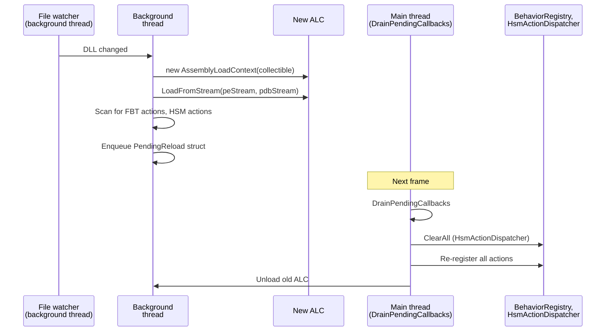
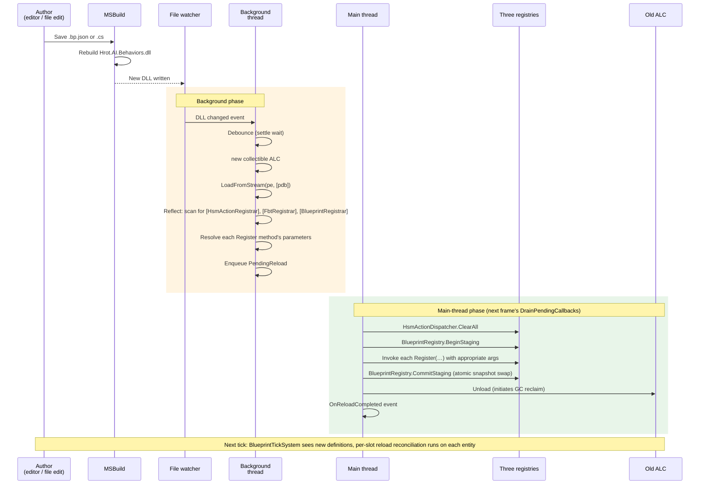
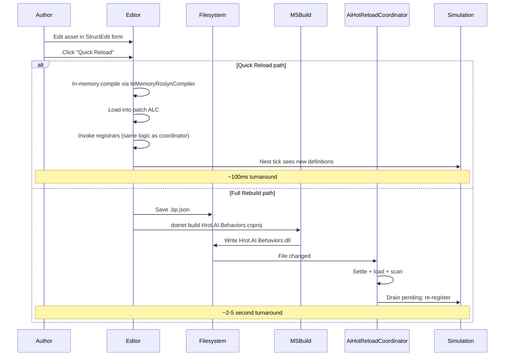
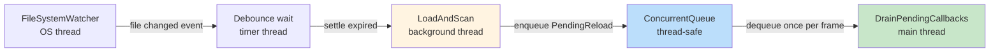
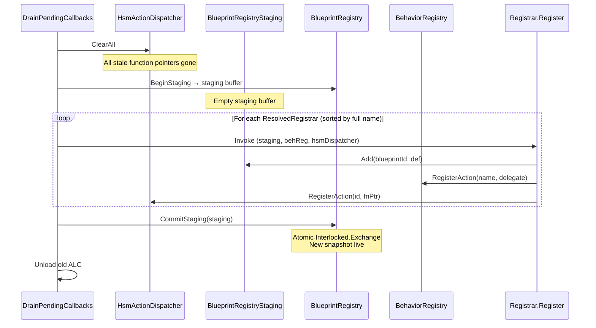

# Blueprint Subsystem — Hot Reload Detailed Design

> **Status:** Detailed design, derived from `Blueprint_Subsystem_Architecture_v1.2.md` + Final Resolutions + Inline Patches + Implementation Roadmap v1.1 + Compiler DD + Compiler DD Inline Patches + Runtime DD + Runtime DD Inline Patches + Test Harness DD + Test Harness DD Inline Patches.
> **Audience:** Implementation agent and human reviewer.
> **Drives:** Milestone M11 (hot reload integration — mock-first phase A, then engine-side phase B).
> **Doesn't cover:** Compiler internals (Compiler DD), runtime systems (Runtime DD), test harness internals (Test Harness DD), debug protocol (Debug Protocol DD), editor (Editor DD).
> **Companion code lives in:** engine-side modifications to `FDP/Toolkits/Fdp.Toolkits/Behavior/AiHotReloadCoordinator.cs`, plus the registrar attribute in `Fdp.Toolkits.Blueprints`.

---

## Table of Contents

1. Overview and what changes
2. The reload sequence
3. Background-thread phase — file watch, ALC load, attribute scan
4. Main-thread phase — `DrainPendingCallbacks`
5. Registry staging coordination
6. Error rollback
7. ALC unload and managed delegate lifetime
8. PDB loading (developer-mode option)
9. Test harness integration — `SimulateReload`
10. Hot reload test strategy
11. Open questions

---

## 1. Overview and what changes

### 1.1 What the engine already does

The engine has an existing `AiHotReloadCoordinator` that hot-reloads `Hrot.AI.Behaviors.dll` when MSBuild rebuilds it. The existing flow:



The existing coordinator hard-codes the discovery and dispatch logic for FBT and HSM registrars — it knows about specific class-name patterns and reflects over them.

### 1.2 What this DD changes

Per v1.2 §8 and Architecture Inline Patches, three changes are needed to the existing coordinator:

1. **Attribute-driven registrar discovery.** Replace the hard-coded class-name scan with a scan for any class carrying `[HsmActionRegistrar]`, `[FbtRegistrar]`, or `[BlueprintRegistrar]`. The new `[BlueprintRegistrar]` attribute lives in `Fdp.Toolkits.Blueprints`; the others already exist.

2. **Parameter-driven argument injection.** When invoking a registrar's `Register` method on the main thread, inspect its parameter list and supply the appropriate registry instance (`BehaviorRegistry`, `HsmActionDispatcher`, or `BlueprintRegistry`). This makes the coordinator agnostic to which subsystem owns a given registrar.

3. **Optional PDB loading.** Add a constructor-gated option to load PDBs alongside the PE bytes. When the option is on (dev mode), attached debuggers can step through generated code; when off (production), no PDB I/O happens.

A fourth integration point — `BlueprintRegistry.BeginStaging` / `CommitStaging` for the atomic registry swap — is already specified in Runtime DD §2.6. This DD documents how the coordinator wires it.

### 1.3 The complete flow at a glance



### 1.4 Three guarantees the design preserves

**Guarantee 1 — no partial state visible to ticking.** The registry's snapshot-swap (`Interlocked.Exchange` in `BlueprintRegistry.CommitStaging`, per Runtime DD §2.6) means a tick can only observe either the pre-reload registry or the post-reload registry, never a mix.

**Guarantee 2 — no stale function pointers.** The `HsmActionDispatcher` (singleton) holds raw `delegate*` unmanaged function pointers indexed by `BlueprintId`. `ClearAll()` is called before re-registration to ensure no stale pointers from the unloaded ALC survive.

**Guarantee 3 — no leaked ALCs.** The old ALC is unloaded after `CommitStaging`. The runtime no longer holds any delegates targeting it. Within a few frames, GC reclaims the ALC's memory. The Test Harness's leak detector (Test Harness DD §7) catches any retained references during testing.

---

## 2. The reload sequence in detail

### 2.1 What triggers a reload

Two production sources:

- **MSBuild rebuild** — author edits a `.cs` file or `.bp.json` file in `Hrot.AI.Behaviors` project, IDE / `dotnet build` rebuilds the DLL, file watcher fires.
- **Editor's "Full Rebuild" button** — programmatic invocation of MSBuild, same downstream effect.

One development source:

- **Editor's "Quick Reload" button** — bypasses MSBuild; compiles the edited asset in-memory via `InMemoryRoslynCompiler` (per Compiler DD §11), produces a patch ALC, and feeds it through a subset of the reload flow.

Quick Reload doesn't go through `AiHotReloadCoordinator` at all — it's an in-process direct path owned by the editor (see Editor DD). This DD documents the file-watcher-driven path.

### 2.2 The settle delay

When MSBuild writes the DLL, it doesn't happen atomically. The file may be visible mid-write — partial bytes, locked by writer, etc. The coordinator handles this by:

1. Receiving the file-changed event.
2. **Debouncing for a settle period** — typically 250 ms after the last change event. If more events arrive during the wait, restart the wait.
3. Then attempting to read. If a `FileShare` exception occurs, wait another 250 ms and retry up to N times.

The existing coordinator already implements this; the Blueprint DD inherits it unchanged.

### 2.3 What happens if a reload fails mid-flight

Three failure modes:

| Failure | Stage | Coordinator response |
|---|---|---|
| Compile error in MSBuild | Pre-coordinator | Coordinator never sees the file; old DLL still loaded; old behavior continues. Author fixes the source. |
| DLL loads but a registrar throws | Background or main thread | Coordinator catches, logs, discards the new ALC. Old registry stays in place. |
| `CommitStaging` succeeds but old ALC won't unload | Main thread after commit | New behavior is live (commit happened); old ALC leak surfaces in next test run's GC verify. Production logs warning. |

The first two are recoverable — the simulation continues with the old code. The third is a soft failure (memory leak, not behavioral) and is the test harness's job to surface during development.

### 2.4 Frame timing of the main-thread phase

The coordinator's `DrainPendingCallbacks` runs once per frame at a specific point in the engine's frame loop. The exact phase is engine-determined; for Blueprints it doesn't matter except:

- It must run **outside** the Simulation phase (so it doesn't race with ticking systems).
- It must run **before** the next Simulation phase, so the next tick sees the new registry.

The engine's existing coordinator already places `DrainPendingCallbacks` correctly. No change needed.

### 2.5 What's in flight when reload happens

At reload commit time, two kinds of "in flight" state exist:

**State 1 — `BlueprintLatentCursor` cursors in Instance dispatch.**
A cursor's `InstanceVersion` matches the slot's `InstanceVersion`. After reload:
- *Soft path* (hash unchanged): both versions are preserved verbatim; the cursor resumes at the same `ResumeAt` block, but now in the new code. As long as the new code has matching block labels, execution continues seamlessly.
- *Hard path* (hash changed): slot's payload is zeroed by `ResetSlot`, `InstanceVersion` is bumped, cursor is implicitly reset to `{ResumeAt=0, InstanceVersion=0}`. The new tick enters `case 0: goto __block_initial`, restarting cleanly.

**State 2 — AiPrimitive working state in `Blackboard1024`.**
The generated thunk's inline hash check (per Compiler DD §10.4) handles this: on first call after reload, the thunk sees `*(ulong*)memory != StructureHash`, zeros the working memory, writes the new hash, calls `InitDefaultWorkingState`, then proceeds with phase 0. Same effect as the Instance hard-reset path, but per-thunk-call instead of per-tick-system-sweep.

Both cases are handled by code that already exists in the Compiler DD and Runtime DD. The Hot Reload coordinator just needs to ensure the swap happens atomically; the downstream reconciliation is each subsystem's responsibility.

### 2.6 Authoring story for "I edited a .bp.json"

From the author's perspective:



Both paths end in the same place — new code is registered, simulation continues. Quick Reload is faster and is the dev default. Full Rebuild is the validation path before committing.

---

*Continued in Part 2 — §3 background-thread phase, §4 main-thread phase.*

## 3. Background-thread phase — file watch, ALC load, attribute scan

### 3.1 Goal

When the file watcher reports `Hrot.AI.Behaviors.dll` has changed, prepare everything needed for a main-thread swap without touching shared state. Specifically:

1. Wait for the file to settle (no more writes incoming).
2. Allocate a new collectible `AssemblyLoadContext`.
3. Load PE + PDB from disk streams into the ALC.
4. Reflect over the loaded assembly to find all registrar classes.
5. For each registrar, resolve its `Register` method and inspect its parameter list.
6. Enqueue a `PendingReload` record onto a thread-safe queue.

All of this runs on a dedicated background thread spun up by the watcher; no shared state mutation, no main-thread interaction.

### 3.2 The `PendingReload` record

```csharp
namespace Fdp.Toolkit.Behavior;

internal sealed class PendingReload
{
    public required AssemblyLoadContext NewAlc { get; init; }
    public required Assembly NewAssembly { get; init; }
    public required IReadOnlyList<ResolvedRegistrar> Registrars { get; init; }
    public AssemblyLoadContext? OldAlc { get; init; }
    public DateTime LoadedAt { get; init; } = DateTime.UtcNow;
}

internal sealed record ResolvedRegistrar(
    Type DeclaringType,                    // for diagnostics / sorting
    MethodInfo RegisterMethod,
    IReadOnlyList<RegistrarParameter> Parameters);

internal sealed record RegistrarParameter(
    string Name,
    Type ParameterType,
    int OrdinalIndex);
```

The `ResolvedRegistrar` holds enough metadata that the main-thread dispatch is a fast, allocation-free traversal — no reflection on the main thread, only invocation.

### 3.3 The background-thread method

```csharp
internal sealed class AiHotReloadCoordinator
{
    private readonly ConcurrentQueue<PendingReload> _pendingReloads = new();
    private readonly AiHotReloadCoordinatorOptions _options;
    private AssemblyLoadContext? _currentAlc;

    public AiHotReloadCoordinator(AiHotReloadCoordinatorOptions options)
    {
        _options = options;
    }

    private void OnFileSettled(string dllPath)
    {
        // Background thread; spawned by the file watcher after debounce
        try
        {
            var pending = LoadAndScan(dllPath);
            _pendingReloads.Enqueue(pending);
        }
        catch (Exception ex)
        {
            _options.Logger?.LogError(
                $"Hot reload load+scan failed for {dllPath}: {ex.Message}",
                ex);
            // The old ALC stays loaded; simulation continues with old code.
        }
    }

    private PendingReload LoadAndScan(string dllPath)
    {
        var alc = new AssemblyLoadContext(
            name: $"AiBehaviors_{DateTime.UtcNow:yyyyMMdd_HHmmss}_{Guid.NewGuid():N}",
            isCollectible: true);

        // Load PE [+ PDB] — see §8 for PDB handling
        Assembly assembly = LoadAssemblyInto(alc, dllPath);

        // Reflect over loaded assembly to find all registrars
        var registrars = ScanForRegistrars(assembly);

        return new PendingReload
        {
            NewAlc = alc,
            NewAssembly = assembly,
            Registrars = registrars,
            OldAlc = _currentAlc,   // captured for unload on main thread
        };
    }
}

public sealed record AiHotReloadCoordinatorOptions(
    bool LoadPdbs = false,
    ILogger? Logger = null);
```

### 3.4 `LoadAssemblyInto`

```csharp
private Assembly LoadAssemblyInto(AssemblyLoadContext alc, string dllPath)
{
    using var peStream = File.OpenRead(dllPath);

    if (_options.LoadPdbs)
    {
        var pdbPath = Path.ChangeExtension(dllPath, ".pdb");
        if (File.Exists(pdbPath))
        {
            using var pdbStream = File.OpenRead(pdbPath);
            return alc.LoadFromStream(peStream, pdbStream);
        }
        // PDB requested but not found — fall through to PE-only load; log diagnostic
        _options.Logger?.LogDebug(
            $"LoadPdbs=true but PDB file not found at {pdbPath}; loading PE only.");
    }

    return alc.LoadFromStream(peStream);
}
```

The streams are read into the ALC at this point (no on-disk locks held by the ALC after `LoadFromStream` returns). The next MSBuild rebuild can overwrite the DLL freely.

### 3.5 `ScanForRegistrars`

The architecturally consequential change. Replaces the old hard-coded scan with an attribute-driven discovery:

```csharp
private IReadOnlyList<ResolvedRegistrar> ScanForRegistrars(Assembly assembly)
{
    var registrars = new List<ResolvedRegistrar>();

    foreach (var type in assembly.GetTypes())
    {
        // Three known registrar attributes for Slice 1
        var registrarKind = ClassifyRegistrar(type);
        if (registrarKind is null) continue;

        var method = type.GetMethod("Register",
            BindingFlags.Public | BindingFlags.Static);
        if (method is null)
        {
            _options.Logger?.LogWarning(
                $"Type {type.FullName} carries registrar attribute but has no public static Register method; skipping.");
            continue;
        }

        var parameters = method.GetParameters()
            .Select((p, i) => new RegistrarParameter(p.Name ?? $"arg{i}", p.ParameterType, i))
            .ToList();

        registrars.Add(new ResolvedRegistrar(type, method, parameters));
    }

    // Sort deterministically by declaring-type full name so the order is
    // reproducible across reload cycles. Same input → same dispatch order.
    return registrars
        .OrderBy(r => r.DeclaringType.FullName, StringComparer.Ordinal)
        .ToList();
}

private static RegistrarKind? ClassifyRegistrar(Type type)
{
    if (type.GetCustomAttribute<HsmActionRegistrarAttribute>() is not null)
        return RegistrarKind.HsmAction;
    if (type.GetCustomAttribute<FbtRegistrarAttribute>() is not null)
        return RegistrarKind.FbtAction;
    if (type.GetCustomAttribute<BlueprintRegistrarAttribute>() is not null)
        return RegistrarKind.Blueprint;
    return null;
}

private enum RegistrarKind { HsmAction, FbtAction, Blueprint }
```

Note the sort by `DeclaringType.FullName` — this is deterministic ordering for the registrar dispatch. Same set of registrars → same dispatch sequence. Important for replay and reproducibility.

### 3.6 What can go wrong here

| Failure | Symptom | Coordinator response |
|---|---|---|
| `assembly.GetTypes()` throws `ReflectionTypeLoadException` | Some types fail to load (e.g., missing referenced assembly) | Log the exception with `LoaderExceptions`, fall back to `ex.Types.Where(t => t is not null)`. The reload may produce partial registration; log warnings for each missing type. |
| A registrar's `Register` method is missing | Type has the attribute but no method | Log warning, skip the registrar. Other registrars proceed. |
| `GetCustomAttribute` throws | Misconfigured attribute (rare) | Logged; type skipped. |
| Catastrophic load failure (corrupt PE) | `LoadFromStream` throws | Whole reload aborts; queue not enqueued. Old ALC stays. |

For Slice 1, the policy is "log and continue if possible, abort cleanly if not." The simulation never crashes due to a bad reload — at worst it keeps running on old code until the author fixes the source.

### 3.7 Threading model



Three threads in flight:
- **OS thread**: `FileSystemWatcher` callback. Just signals the debouncer; no work here.
- **Background thread (`Task.Run`)**: the actual `LoadAndScan` work, including reflection.
- **Main thread**: `DrainPendingCallbacks` runs once per frame, consumes the queue.

The `ConcurrentQueue<PendingReload>` is the only cross-thread state. No locks needed; the queue handles synchronization.

---

## 4. Main-thread phase — `DrainPendingCallbacks`

### 4.1 Goal

Apply the pending reload atomically. Specifically:

1. Dequeue at most one `PendingReload` per frame (process them one at a time to bound per-frame work).
2. Clear `HsmActionDispatcher`'s stale function pointers.
3. Begin a `BlueprintRegistryStaging`.
4. Invoke each registrar's `Register` method with appropriately-injected arguments.
5. Commit the staging atomically.
6. Unload the old ALC.
7. Raise `OnReloadCompleted`.

Steps 2 through 7 happen on the main thread, within a single `DrainPendingCallbacks` call.

### 4.2 Why "at most one per frame"

If multiple file changes pile up (author rapidly edits + saves several times), we want each reload to be processed independently. Doing all of them in one frame would create a long pause. One-per-frame means a worst-case 16 ms pause per pending reload, spread across frames.

If the queue is empty, `DrainPendingCallbacks` is a no-op fast path.

### 4.3 The main-thread method

```csharp
internal sealed class AiHotReloadCoordinator
{
    private readonly BehaviorRegistry _behaviorRegistry;
    private readonly HsmActionDispatcher _hsmDispatcher;
    private readonly BlueprintRegistry _blueprintRegistry;

    public event Action? OnReloadCompleted;
    public event Action<Exception>? OnReloadFailed;

    public AiHotReloadCoordinator(
        BehaviorRegistry behaviorRegistry,
        HsmActionDispatcher hsmDispatcher,
        BlueprintRegistry blueprintRegistry,
        AiHotReloadCoordinatorOptions options)
    {
        _behaviorRegistry = behaviorRegistry;
        _hsmDispatcher = hsmDispatcher;
        _blueprintRegistry = blueprintRegistry;
        _options = options;
    }

    /// <summary>
    /// Call once per frame on the main thread. If a pending reload is queued,
    /// applies it.
    /// </summary>
    public void DrainPendingCallbacks()
    {
        if (!_pendingReloads.TryDequeue(out var pending)) return;

        try
        {
            ApplyReload(pending);
            _options.Logger?.LogInfo(
                $"Hot reload applied: {pending.Registrars.Count} registrars from " +
                $"'{pending.NewAssembly.GetName().Name}'.");
            OnReloadCompleted?.Invoke();
        }
        catch (Exception ex)
        {
            _options.Logger?.LogError(
                $"Hot reload apply failed: {ex.Message}", ex);
            OnReloadFailed?.Invoke(ex);
            // Old ALC stays loaded; simulation continues with old code.
            // The failed new ALC is left dangling — GC will reclaim it once no refs hold it.
            try { pending.NewAlc.Unload(); }
            catch (Exception innerEx)
            {
                _options.Logger?.LogWarning(
                    $"Failed to unload partially-applied ALC: {innerEx.Message}");
            }
        }
    }

    private void ApplyReload(PendingReload pending)
    {
        // 1. Clear stale HSM function pointers
        _hsmDispatcher.ClearAll();

        // 2. Begin Blueprint registry staging
        var staging = _blueprintRegistry.BeginStaging();

        // 3. Invoke each registrar with parameter-injection
        foreach (var registrar in pending.Registrars)
        {
            InvokeRegistrar(registrar, staging);
        }

        // 4. Atomically commit Blueprint registry
        _blueprintRegistry.CommitStaging(staging);

        // 5. Update current-ALC reference; unload the old one
        var oldAlc = _currentAlc;
        _currentAlc = pending.NewAlc;
        oldAlc?.Unload();
    }
}
```

### 4.4 `InvokeRegistrar` — parameter injection

The new attribute-driven flow can't hard-code which arguments a registrar takes. It inspects the parameter list and injects the appropriate registry:

```csharp
private void InvokeRegistrar(ResolvedRegistrar registrar, BlueprintRegistryStaging staging)
{
    var args = new object[registrar.Parameters.Count];
    for (int i = 0; i < registrar.Parameters.Count; i++)
    {
        var paramType = registrar.Parameters[i].ParameterType;
        args[i] = ResolveRegistrarArgument(paramType, staging);
    }

    try
    {
        registrar.RegisterMethod.Invoke(null, args);
    }
    catch (TargetInvocationException ex) when (ex.InnerException is not null)
    {
        // Re-throw with the registrar context for better diagnostics
        throw new HotReloadRegistrarException(
            $"Registrar {registrar.DeclaringType.FullName}.Register threw: " +
            $"{ex.InnerException.Message}",
            ex.InnerException);
    }
}

private object ResolveRegistrarArgument(Type paramType, BlueprintRegistryStaging staging)
{
    if (paramType == typeof(BlueprintRegistryStaging))    return staging;
    if (paramType == typeof(BlueprintRegistry))           return _blueprintRegistry;
    if (paramType == typeof(BehaviorRegistry))            return _behaviorRegistry;
    if (paramType == typeof(HsmActionDispatcher))         return _hsmDispatcher;

    throw new HotReloadRegistrarException(
        $"Unknown registrar parameter type: {paramType.FullName}. " +
        "Add a case to ResolveRegistrarArgument or change the registrar's signature.");
}
```

### 4.5 Generated registrar shapes (per dispatch kind)

The compiler emits one `[BlueprintRegistrar]` class per asset (per Compiler DD §7.4). The exact `Register` method signature varies by dispatch kind, and the parameter-injection logic above handles all three:

**Library** (per Compiler DD §10.3):
```csharp
[BlueprintRegistrar]
public static class BlueprintRegistrar_MathLib_A3F791D2_Bp
{
    public static void Register(BlueprintRegistryStaging staging)
    {
        staging.Add(MathLib_Bp.BlueprintId, new BlueprintDefinition
        {
            Name = "MathLib",
            Kind = BlueprintDispatchKind.Library,
            StructureHash = 0,
            StateSize = 0,
        });
    }
}
```

**AiPrimitive** (per Compiler DD §15.8, the MoveToAndFire example):
```csharp
[BlueprintRegistrar]
public static unsafe class BlueprintRegistrar_MoveToAndFire_A1B2C3D4_Bp
{
    public static void Register(
        BlueprintRegistryStaging staging,
        BehaviorRegistry behReg,
        HsmActionDispatcher hsmDispatcher)
    {
        // Stage Blueprint definition
        staging.Add(MoveToAndFire_Bp.BlueprintId, new BlueprintDefinition
        {
            Name = "MoveToAndFire",
            Kind = BlueprintDispatchKind.AiPrimitive,
            StructureHash = MoveToAndFire_Bp.StructureHash,
            StateSize = 0,
        });

        // Register BTree thunk (per declared BTreeAction hosting)
        behReg.RegisterAction("MoveToAndFire_Bp", MoveToAndFire_Bp.BTreeTick);

        // Register HSM thunk (per declared HsmAction hosting)
        hsmDispatcher.RegisterAction(
            MoveToAndFire_Bp.BlueprintId,
            (IntPtr)(delegate* unmanaged<void*, void*, HsmCommandWriter*, void>)
                &MoveToAndFire_Bp.HsmActivity);
    }
}
```

**Instance** (per Compiler DD §16.2):
```csharp
[BlueprintRegistrar]
public static class BlueprintRegistrar_HealthRegen_B2C3D4E5_Bp
{
    public static void Register(BlueprintRegistryStaging staging)
    {
        staging.Add(HealthRegen_Bp.BlueprintId, new BlueprintDefinition
        {
            Name = "HealthRegen",
            Kind = BlueprintDispatchKind.Instance,
            StructureHash = HealthRegen_Bp.StructureHash,
            StateSize = HealthRegen_Bp.StateSize,
            StateClrType = typeof(HealthRegen_Bp.State),
            InitDefault = HealthRegen_Bp.InitDefault,
            Tick = HealthRegen_Bp.TickThunk,
            EventHandlers = new Dictionary<string, EventHandlerDelegate>
            {
                ["BeginPlay"] = HealthRegen_Bp.BeginPlayThunk,
                ["OnHit"]     = HealthRegen_Bp.OnHitThunk,
            },
        });
    }
}
```

The coordinator's parameter injection handles all three signatures naturally — Library asks for `BlueprintRegistryStaging` only, AiPrimitive asks for three, Instance asks for one. Each registrar declares what it needs; the coordinator supplies it.

### 4.6 Why `BlueprintRegistryStaging` and not `BlueprintRegistry`

Registrars stage into a buffer rather than writing directly to the registry. Why:

1. **Atomicity.** If one registrar throws partway through registration, the half-staged buffer is discarded; the previous registry snapshot is unaffected.
2. **Snapshot construction.** `CommitStaging` builds a fresh immutable snapshot from the staging buffer. The registry's read path is then a single `Interlocked.Exchange` (Runtime DD §2.6).
3. **No partial visibility.** Reads from `BlueprintRegistry.TryGetById` during the staging window still see the old snapshot. Only `CommitStaging` makes the new contents visible.

This is fundamental to the "no partial state visible to ticking" guarantee from §1.4.

If a registrar accidentally takes `BlueprintRegistry` as a parameter (instead of `BlueprintRegistryStaging`), the coordinator still injects it — but the registrar's direct calls would mutate the *current* snapshot. That's a bug; the parameter-injection table is the policy enforcement.

### 4.7 Ordering invariants within `ApplyReload`

The five operations in `ApplyReload` must run in this exact order:

1. `_hsmDispatcher.ClearAll()` — must happen *before* any registrar runs, otherwise stale function pointers could still be invoked during HSM thunk registration.
2. `staging = _blueprintRegistry.BeginStaging()` — must happen *before* registrars run, since they need a target buffer.
3. Registrar invocations — must complete fully *before* commit; partial staging is wasted if commit doesn't happen.
4. `_blueprintRegistry.CommitStaging(staging)` — atomically publishes the new snapshot.
5. `oldAlc?.Unload()` — last step; the new registry must already be live so the old ALC's delegates are no longer reachable from the registry.

Any reordering breaks one of the three guarantees from §1.4.

---

*Continued in Part 3 — §5 registry staging coordination, §6 error rollback, §7 ALC unload + delegate lifetime, §8 PDB loading, §9 test harness integration, §10 test strategy, §11 open questions.*

## 5. Registry staging coordination

### 5.1 Three registries, three lifetimes

The hot reload flow interacts with three different registry implementations, each with different update semantics:

| Registry | Owned by | Update model | Lifecycle |
|---|---|---|---|
| `BlueprintRegistry` | `Fdp.Toolkits.Blueprints` | Snapshot + atomic swap | Built fresh per reload via staging |
| `BehaviorRegistry` | `Fdp.Toolkits` (existing) | Direct mutation, name-keyed dictionary | Survives across reloads; entries overwritten |
| `HsmActionDispatcher` | `Fdp.Toolkits` (existing) | Direct mutation, id-keyed function-pointer table | `ClearAll()` then re-register |

Only `BlueprintRegistry` has staging. The other two use direct overwrite. This isn't accidental — each fits its semantics:

- **`BlueprintRegistry`** needs atomic swap because tick systems read it lock-free (Runtime DD §2.4). A partial state would corrupt ticking.
- **`BehaviorRegistry`** is read at scenario load only — re-keying a dictionary entry during reload is safe because no tick is iterating it.
- **`HsmActionDispatcher`** uses unmanaged function pointers; `ClearAll` then re-register is needed to drop pointers into the unloaded ALC. The kernel calls the dispatcher per HSM transition, so atomic-ish behavior matters — but the `ClearAll → RegisterAction` window is in `DrainPendingCallbacks` outside Simulation, so no kernel call observes the gap.

### 5.2 The order matters



Key observation: during the loop, `BehaviorRegistry` and `HsmActionDispatcher` already have the new entries, but `BlueprintRegistry` still reflects the old snapshot. This is consistent because:

- The simulation isn't running (we're inside `DrainPendingCallbacks`).
- No tick reads any of these registries between operations.
- Once `CommitStaging` returns, all three are consistent with the new ALC.

The brief inconsistency window exists only within `ApplyReload` itself; no observer can see it.

### 5.3 What if a registrar tries to use both old and new staging?

A registrar that takes both `BlueprintRegistry` and `BlueprintRegistryStaging` could read the live registry (old snapshot) and write into staging (new snapshot). Slice 1 doesn't generate such registrars — every `[BlueprintRegistrar]` from the compiler takes only `BlueprintRegistryStaging`. But the parameter-injection table allows it for future use cases (e.g., a registrar that wants to preserve some state across reload).

For Slice 1 this is unused; documented as available for Slice 2 if needed.

### 5.4 Snapshot construction inside `CommitStaging`

Per Runtime DD §2.6, `CommitStaging` builds a new `Snapshot` from the staging buffer:

```csharp
public void CommitStaging(BlueprintRegistryStaging staging)
{
    var singletonList = staging.WorldSingletons
        .Select(kv => (kv.Key, kv.Value))
        .ToList()
        .AsReadOnly();

    var next = new Snapshot
    {
        ById               = staging.Definitions.ToDictionary(kv => kv.Key, kv => kv.Value),
        ByName             = staging.Definitions.ToDictionary(
            kv => kv.Value.Name, kv => kv.Key, StringComparer.Ordinal),
        WorldSingletons    = staging.WorldSingletons.ToDictionary(kv => kv.Key, kv => kv.Value),
        WorldSingletonList = singletonList,
    };

    Interlocked.Exchange(ref _current, next);
    OnRegistryChanged?.Invoke();
}
```

The `Interlocked.Exchange` is the single atomic operation. Before this line: old snapshot live. After this line: new snapshot live. No intermediate state is visible.

The new snapshot's dictionaries are constructed inside `CommitStaging` (not handed in via the staging buffer) because:
- We need fresh allocations so the snapshot is immutable post-commit.
- The staging buffer's dictionaries may be referenced elsewhere; defensive copy is cheap (≤100 entries per snapshot in realistic scenarios).

### 5.5 `OnRegistryChanged` consumers

The event fires after every commit. Slice 1 consumers:

- **The editor's "Asset List" window** — refresh its display.
- **The debug protocol** — re-resolve any active breakpoints whose target Blueprints may have changed structure.

The handler list is unmanaged-delegate-free (regular `Action` events), so it's not affected by ALC unload. Subscribers in the patch ALC would need explicit unsubscribe — but Slice 1 has no such subscribers.

### 5.6 What about between two reloads in quick succession?

Author edits, MSBuild rebuilds, file watcher fires. Then before the main thread drains, the author edits again, MSBuild rebuilds, file watcher fires again.

The background thread processes both, enqueues two `PendingReload` records:

```
Queue: [Reload1, Reload2]
```

`DrainPendingCallbacks` processes one per frame:

```
Frame N: Apply Reload1 (NewAlc=A, OldAlc=current). After: _currentAlc = A
Frame N+1: Apply Reload2 (NewAlc=B, OldAlc=current=A). After: _currentAlc = B; A unloaded
```

This is correct: Reload2's `OldAlc` is captured at *background-thread time*, but at commit time the coordinator uses `_currentAlc` (which is now A after Reload1's commit). The `OldAlc` field on `PendingReload` is informational; the actual unload uses the live `_currentAlc` field.

Updated `ApplyReload` to reflect this:

```csharp
private void ApplyReload(PendingReload pending)
{
    _hsmDispatcher.ClearAll();
    var staging = _blueprintRegistry.BeginStaging();
    foreach (var registrar in pending.Registrars)
        InvokeRegistrar(registrar, staging);
    _blueprintRegistry.CommitStaging(staging);

    // Use the LIVE _currentAlc, not pending.OldAlc — handles the
    // "two reloads queued before drain" case correctly.
    var oldAlc = _currentAlc;
    _currentAlc = pending.NewAlc;
    oldAlc?.Unload();
}
```

(Simplified from §4.3; this is the corrected version. The `pending.OldAlc` field can be dropped or kept for logging.)

---

## 6. Error rollback

### 6.1 What rolls back, what doesn't

Three failure modes (recap from §2.3):

1. **MSBuild fails** — coordinator never sees the file. Nothing to roll back; old DLL stays loaded. Recovery is automatic when MSBuild succeeds next time.

2. **`LoadAndScan` fails** — background thread caught the exception in `OnFileSettled`; `PendingReload` not enqueued. The partial ALC (if `LoadFromStream` succeeded but `ScanForRegistrars` threw) is left to GC; we don't explicitly unload because the ALC might be partially constructed. Memory leak risk if `ScanForRegistrars` throws often, but in practice these are rare and one-off.

3. **`ApplyReload` fails partway through** — covered in §6.2.

### 6.2 Mid-apply rollback

This is the interesting case. Possible failures inside `ApplyReload`:

- `_hsmDispatcher.ClearAll()` throws — exceedingly unlikely, but if it does, the dispatcher is already in a "all cleared" state. Old HSM behaviors won't work until next reload. Best response: log fatal, propagate exception.

- A registrar's `Register` throws — typical cause: a registrar tries to register a `BlueprintId` that collides with another in this reload (per Runtime DD §2.6 collision check). The staging buffer has partial entries; HSM dispatcher may have partial entries.

- `CommitStaging` throws — shouldn't be possible with the snapshot-based design (no validation inside commit), but defensively handled.

### 6.3 The rollback strategy

```csharp
public void DrainPendingCallbacks()
{
    if (!_pendingReloads.TryDequeue(out var pending)) return;

    // Snapshot pre-reload state for potential rollback
    // (HSM dispatcher and BehaviorRegistry can't snapshot themselves; only
    // BlueprintRegistry's CommitStaging is atomic. Rollback is limited.)

    try
    {
        ApplyReload(pending);
        OnReloadCompleted?.Invoke();
    }
    catch (Exception ex)
    {
        _options.Logger?.LogError(
            $"Hot reload apply failed: {ex.Message}. " +
            "HSM dispatcher and BehaviorRegistry may have partial registrations from this attempt. " +
            "BlueprintRegistry stays at previous snapshot. Next successful reload will fully recover.",
            ex);

        OnReloadFailed?.Invoke(ex);

        // Unload the failed ALC; its registrars don't fully matter now
        try { pending.NewAlc.Unload(); }
        catch (Exception innerEx)
        {
            _options.Logger?.LogWarning(
                $"Failed to unload partially-applied ALC: {innerEx.Message}");
        }
    }
}
```

### 6.4 The Slice 1 reality

In Slice 1 the failure modes are limited to:
- `BlueprintId` collision (caught by `BlueprintRegistryStaging.Add` throw — rare, easy to diagnose).
- Generated code that references types missing from the ALC (catastrophic load failure, caught by `LoadAndScan`).

Neither is likely to happen mid-`ApplyReload` once the asset has compiled. The most realistic mid-apply failure is "I introduced two assets with hashing-colliding Guids" — at which point the author re-Guids one of them and saves.

For Slice 1, the policy is **log and continue with old code**. The author sees the failure in the editor's reload-log window and acts. Slice 2 may add a true rollback if telemetry shows it's needed; for now the cost-vs-complexity tradeoff favors "log + recover on next reload."

### 6.5 The HSM dispatcher's partial-state risk

The one real risk in §6.2: if `ApplyReload` clears HSM dispatcher and then fails partway through registrar invocation, the dispatcher is left empty.

In production this means HSM actions stop working until next successful reload. The simulation doesn't crash — `HsmActionDispatcher.Dispatch` for an unknown action just no-ops or returns an error result. The author sees broken behavior, fixes the source, next reload restores.

**Mitigation:** the coordinator could re-register the *previous* set of HSM actions before exiting the catch block. This would require keeping a snapshot of the previous HSM dispatcher state. For Slice 1, this is deferred — the "broken until next reload" behavior is acceptable given how rare mid-apply failures are.

Slice 2 considerations:
- Snapshot HSM dispatcher state before `ClearAll`.
- On rollback, restore the snapshot.
- This adds ~one allocation per reload and a couple hundred bytes of state.

---

## 7. ALC unload and managed delegate lifetime

### 7.1 The delegate lifecycle problem

The `BlueprintRegistry`, `BehaviorRegistry`, and `HsmActionDispatcher` all hold *references* into the patch ALC's assembly:

- `BlueprintRegistry.Snapshot.ById` holds `BlueprintDefinition` records containing `TickDelegate`, `InitDefaultDelegate`, `EventHandlerDelegate` instances. Each delegate has a `Method` property pointing into ALC methods.
- `BehaviorRegistry` holds `BehaviorDefinition` records with `BTreeTick` delegates.
- `HsmActionDispatcher` holds unmanaged `delegate*` function pointers obtained via `MethodHandle.GetFunctionPointer()`.

While these references exist, the ALC cannot unload. The coordinator's ordering (§4.7) ensures all three are repopulated with new-ALC references *before* the old ALC's `Unload()` is called. At that point:

- `BlueprintRegistry`'s old snapshot still holds old delegates, but only briefly — `Interlocked.Exchange` replaces the snapshot field, the old `Snapshot` object becomes unreachable, and `BlueprintDefinition`s + delegates inside it are GC-eligible.
- `BehaviorRegistry`'s entries were overwritten by name (`RegisterAction("name", newDelegate)` replaces the old entry for the same name). Old delegates unreferenced.
- `HsmActionDispatcher`'s entries were overwritten by id (`RegisterAction(id, newFnPtr)`). Old function pointers gone.

After all three are repopulated, no live references into the old ALC exist *from the registries*. Other live references must come from elsewhere (cached delegates, captured lambdas, debugger attachment — per Test Harness DD §7.2).

### 7.2 Why `ClearAll` is needed at all (HSM specifically)

Question: if `RegisterAction(id, newFnPtr)` overwrites the old entry, why bother with `ClearAll`?

Answer: `RegisterAction` only overwrites entries with the *same id*. If a Blueprint was deleted (asset removed in the editor between reloads), no registrar exists for it in the new reload; its old entry is *not* overwritten. The id-to-function-pointer table would still contain the old pointer, which points into the unloaded ALC. Next time some HSM kernel dispatches that id (unlikely but possible — replay, leftover behavior state), it would dereference an invalidated pointer. Crash.

`ClearAll` ensures the table is empty before re-registration. Only the Blueprints in the new reload appear after. Deleted Blueprints leave no trace.

Same logic could apply to `BehaviorRegistry` and `BlueprintRegistry`, but:
- `BehaviorRegistry`'s entries are managed delegates; a stale entry would just point into the unloaded ALC and cause a `null reference` or `AssemblyLoadContext.Unload` exception when invoked — recoverable, not a crash. The engine team has not asked for `BehaviorRegistry.ClearAll` to be added.
- `BlueprintRegistry` is replaced entirely via snapshot swap; stale entries can't exist by construction.

So the `ClearAll` ordering is correctly applied only to the dispatcher, where the cost of staleness is highest.

### 7.3 The unload sequence

```csharp
_blueprintRegistry.CommitStaging(staging);          // step 4 of ApplyReload

var oldAlc = _currentAlc;
_currentAlc = pending.NewAlc;
oldAlc?.Unload();                                    // step 5
```

`Unload()` initiates unload but does not synchronously finalize. The runtime:
1. Marks the ALC for unload.
2. Stops issuing new method handles from the ALC's assembly.
3. Once all managed references drop (verified by GC walks), reclaims the ALC and frees its memory.

The reclamation timeline depends on:
- When the GC next runs (typically within seconds; immediately if the heap is under pressure).
- Whether any references actually drop (if a static field somewhere still holds a delegate, the ALC will never unload).

For production simulation, this happens transparently — the new code is live, the old code's memory takes a few seconds to reclaim, no user-visible effect.

For tests, the `BlueprintTestFixture` (per Test Harness DD §7) forces GC + verifies reclamation. Leaked ALCs fail at test dispose, not in production.

### 7.4 Race-free observation

The `Interlocked.Exchange` in `CommitStaging` is the single race-free point in the design. Before it:
- Tick systems reading `_current` see the old snapshot.
- After it: tick systems see the new snapshot.

There is no intermediate state. The `oldAlc?.Unload()` happens after the exchange — any tick that runs between `Interlocked.Exchange` and `Unload()` reads the new snapshot, doesn't touch the old ALC's code, doesn't crash.

The only "in-flight" code from the old ALC at this point would be a method call that *started* before the exchange and hasn't returned yet. The simulation is single-threaded (per engine convention), and `ApplyReload` runs outside Simulation phase, so no such in-flight call exists.

### 7.5 What about HSM kernel's cached function pointers?

The HSM kernel may cache function pointers from `HsmActionDispatcher` in transition tables. These pointers point into the patch ALC's compiled code.

When the coordinator does `ClearAll`, those caches are *not* automatically invalidated. If the HSM kernel dispatched between `ClearAll` and the registrar invocations, it would crash.

The mitigation: the engine guarantees no HSM dispatch happens during `DrainPendingCallbacks`. The full `ApplyReload` is atomic from the HSM kernel's perspective. By the time the next HSM dispatch occurs (in the next Simulation tick), all entries are re-registered.

The engine team has confirmed this is the existing protocol. Slice 1 reuses it; no change needed.

---

## 8. PDB loading (developer-mode option)

### 8.1 Purpose

When `AiHotReloadCoordinatorOptions.LoadPdbs = true`, the coordinator loads PDB symbols alongside PE bytes. Effect: attached debuggers can step through generated Blueprint code, set breakpoints in source-mapped lines, inspect locals — same as for hand-written `.cs` code in `Hrot.AI.Behaviors`.

For production builds (`LoadPdbs = false`), no PDB I/O happens; no per-load overhead.

### 8.2 The PDB pipeline

Two PDB sources, depending on build path:

**MSBuild path** — MSBuild emits PDBs next to the DLL. The coordinator loads them via:

```csharp
private Assembly LoadAssemblyInto(AssemblyLoadContext alc, string dllPath)
{
    using var peStream = File.OpenRead(dllPath);
    if (_options.LoadPdbs)
    {
        var pdbPath = Path.ChangeExtension(dllPath, ".pdb");
        if (File.Exists(pdbPath))
        {
            using var pdbStream = File.OpenRead(pdbPath);
            return alc.LoadFromStream(peStream, pdbStream);
        }
        _options.Logger?.LogDebug($"PDB not found at {pdbPath}; loading PE only.");
    }
    return alc.LoadFromStream(peStream);
}
```

**Quick Reload path (editor)** — the in-memory compiler emits PortablePdb bytes alongside PE bytes (per Compiler DD §11.3 and Inline Patches, with `EmitOptions.DebugInformationFormat = DebugInformationFormat.PortablePdb` + `EmbeddedText.FromSource` for source resolution). The editor loads via:

```csharp
// In editor's quick-reload path:
var (peBytes, pdbBytes) = _inMemoryCompiler.Compile(
    source, virtualSourcePath, assemblyName, sink);
using var peStream = new MemoryStream(peBytes);
using var pdbStream = new MemoryStream(pdbBytes);
var assembly = patchAlc.LoadFromStream(peStream, pdbStream);
```

For Quick Reload, the PDB is always available (we just generated it). The `LoadPdbs` option doesn't gate it because the editor controls the path entirely.

### 8.3 Embedded source for Quick Reload

A debugger needs the source text to render the step-line indicator. For MSBuild builds, the source `.cs` files exist on disk and the PDB's source-map points to them. For Quick Reload, no `.cs` file exists — the generated source lives only in memory.

The compiler addresses this by embedding the source text inside the PDB via `EmbeddedText.FromSource` (per Compiler DD §11.3). When the debugger asks for the source for a stepped line, it pulls from the embedded PDB, not from disk.

The virtual source path (`MoveToAndFire_A1B2C3D4_Bp.g.cs`) appears in the debugger's "open files" list. The author can set breakpoints in it as if it were a real file. Reloading replaces the embedded source with the new version; debugger picks up automatically.

### 8.4 PDB lifecycle across reloads

When the old ALC is unloaded (per §7.3), its PDB symbols are also unloaded. The debugger receives a notification ("source unloaded") and the user's breakpoints in the old generated source become "pending" — they'll re-bind to the new generated source if line numbers match, otherwise become greyed out.

For Slice 1 the policy is "best-effort breakpoint preservation across reload":
- If the new source has the same virtual path and the breakpoint line still exists, re-bind.
- Otherwise, the breakpoint is dropped.

This is the same behavior as MSBuild reloads of hand-written code. No special Blueprint-aware logic needed.

### 8.5 Production gating

The default for `AiHotReloadCoordinatorOptions.LoadPdbs` is `false`. Production builds construct the coordinator without overriding the default. Development builds (engine launched via dev-mode flag) set it to `true`.

Per-load overhead with PDB on: ~5 KB allocation for PDB bytes, one file-read per reload. Negligible for dev; absent in production.

### 8.6 Per-Blueprint PDB control

Future Slice 2 enhancement: allow the editor to set PDB-vs-no-PDB on a per-asset basis (so only assets you're actively debugging emit PDBs). For Slice 1, all-or-nothing on the coordinator is sufficient.

---

## 9. Test harness integration — `SimulateReload`

### 9.1 The test harness's mock-side flow

Per Test Harness DD §5.2, the fixture exposes `SimulateReload(newVersions)`. It mirrors the production flow:

```csharp
public void SimulateReload(IReadOnlyList<BlueprintAsset> newVersions)
{
    var oldAlcs = _activeAlcs.ToList();
    _activeAlcs.Clear();

    CompileAndLoadMany(newVersions);   // populates _activeAlcs with the new ALC

    foreach (var oldAlc in oldAlcs)
        oldAlc.Unload();
}
```

The `CompileAndLoadMany` call already does the equivalent of `LoadAndScan` + `DrainPendingCallbacks` — it compiles, loads into a new ALC, invokes registrars via the staging protocol, commits.

### 9.2 Test-vs-production parity table

| Step | Production (`AiHotReloadCoordinator`) | Test (`BlueprintTestFixture.SimulateReload`) |
|---|---|---|
| Asset → DLL | MSBuild | `InMemoryRoslynCompiler` |
| File watcher | `FileSystemWatcher` + debounce | Direct method call |
| Background `LoadAndScan` | `Task.Run` to background thread | Synchronous (test is single-threaded) |
| `DrainPendingCallbacks` | Once per frame | Immediately at `SimulateReload` |
| `HsmDispatcher.ClearAll` | Yes | Yes (in `Dispose`; not per-reload in tests) |
| `BlueprintRegistry.BeginStaging` / `CommitStaging` | Yes | Yes |
| Old ALC unload | After commit | After commit |
| ALC reclaim verification | Production: implicit | Test: forced + verified at `Dispose` |

The test path is a simplified, synchronous version of production. All the architectural choices (staging, atomic commit, ALC unload ordering) are preserved.

### 9.3 What `SimulateReload` tests cover

The combination of `SimulateReload` plus the runtime's per-slot reconciliation (Runtime DD §9) lets tests verify:

- Soft reload: structure hash unchanged → state preserved across reload.
- Hard reload: structure hash changed → state reset, `InstanceVersion` bumped, `InitDefault` re-run.
- Multi-asset reload: a reload that replaces several Blueprints atomically; in-between state never observable.
- Adding a new Blueprint: appears in registry after `SimulateReload`.
- Removing a Blueprint: previous registry entry gone after `SimulateReload`; tick system harmlessly skips slots whose `BlueprintId` is no longer registered.
- Cross-reload entity preservation: an entity attached pre-reload stays attached, with its slot reconciled.

Test cases in `Hrot.Blueprints.Tests/HotReload/SimulateReloadTests.cs`:

```csharp
public class SimulateReloadTests
{
    [Fact]
    public void SoftReload_PreservesCursorAndState()
    {
        using var fixture = new BlueprintTestFixture();
        var v1 = TestData.LoadAsset("HealthRegen");
        fixture.CompileAndLoad(v1);

        var e = fixture.World.CreateEntity();
        fixture.World.AddComponent(e, new BlueprintBlackboard1024());
        fixture.AttachBlueprint(v1, e);

        // Damage it; cursor enters wait phase
        fixture.Ecb.PublishEvent(new HitEvent { Target = e, Damage = 30 });
        fixture.TickFrame(0.016f);

        var cursorBefore = fixture.GetBlueprintState(v1, e).GetCursor();
        Assert.Equal(1u, cursorBefore.ResumeAt);

        // Soft reload — body change only, same StructureHash
        var v1modified = TestData.LoadAsset("HealthRegenBodyOnly");   // same fields, different graph
        fixture.SimulateReload(new[] { v1modified });

        fixture.TickFrame(0.016f);
        var cursorAfter = fixture.GetBlueprintState(v1modified, e).GetCursor();
        Assert.Equal(cursorBefore.ResumeAt, cursorAfter.ResumeAt);
        Assert.Equal(cursorBefore.InstanceVersion, cursorAfter.InstanceVersion);
    }

    [Fact]
    public void HardReload_ResetsStateAndBumpsVersion()
    {
        // Covered in Runtime DD §11.4; same pattern, exercises the
        // reconciliation path in BlueprintTickSystem
    }

    [Fact]
    public void Reload_AddingNewBlueprint_AppearsInRegistry()
    {
        using var fixture = new BlueprintTestFixture();
        var a = TestData.LoadAsset("LibraryMath");
        fixture.CompileAndLoad(a);

        Assert.True(fixture.Registry.TryGetByName("LibraryMath", out _));
        Assert.False(fixture.Registry.TryGetByName("HealthRegen", out _));

        var b = TestData.LoadAsset("HealthRegen");
        fixture.SimulateReload(new[] { a, b });   // both included

        Assert.True(fixture.Registry.TryGetByName("LibraryMath", out _));
        Assert.True(fixture.Registry.TryGetByName("HealthRegen", out _));
    }

    [Fact]
    public void Reload_RemovingBlueprint_TickSystemSkipsOrphanedSlots()
    {
        using var fixture = new BlueprintTestFixture();
        var asset = TestData.LoadAsset("InstanceCounter");
        fixture.CompileAndLoad(asset);

        var e = fixture.World.CreateEntity();
        fixture.World.AddComponent(e, new BlueprintBlackboard1024());
        fixture.AttachBlueprint(asset, e);
        fixture.TickFrame(0.016f);

        Assert.Equal(1, fixture.GetBlueprintState(asset, e).GetField<int>("CurrentCount"));

        // Reload with empty asset set — InstanceCounter is gone
        fixture.SimulateReload(Array.Empty<BlueprintAsset>());

        Assert.False(fixture.Registry.TryGetByName("InstanceCounter", out _));

        // Tick should not crash even though entity still has the slot
        var ex = Record.Exception(() => fixture.TickFrame(0.016f));
        Assert.Null(ex);

        // State unchanged because tick system skipped the orphaned slot
        // (slot still has the old BlueprintId; registry lookup fails;
        //  TickTier loop's `if (!_registry.TryGetById(...)) continue;` skips it)
    }
}
```

### 9.4 What `SimulateReload` doesn't simulate

Test parity stops at:
- **No file watcher latency.** Reload is synchronous; tests aren't validating debounce behavior.
- **No background-thread interleaving.** Tests don't exercise the load-vs-tick race because tests are single-threaded.
- **No actual MSBuild.** The compile path is the in-memory Roslyn path; if MSBuild has different behavior (e.g., different generator outputs), tests won't catch it. For Slice 1 this is acceptable; if a divergence shows up we'd add an MSBuild-driven integration test.

These gaps are real but small. The architecturally important behavior — staging-commit atomicity, per-slot reconciliation, ALC lifecycle — is exercised faithfully.

### 9.5 Production ↔ test convergence

Both paths converge on the same `BlueprintRegistry.CommitStaging` call, with the same `Interlocked.Exchange`. Any bug in the commit path surfaces in both production and tests.

The coordinator's `ApplyReload` and the fixture's `SimulateReload` share their core logic (the staging-commit dance + ALC unload). The fixture doesn't reuse the `AiHotReloadCoordinator` class because it would drag in the file watcher; instead it calls the same primitives directly. This is documented in Test Harness DD §5.

---

*Continued in Part 4 — §10 hot reload test strategy, §11 open questions.*

## 10. Hot reload test strategy

### 10.1 Test categories

Hot reload tests live in `Hrot.Blueprints.Tests/HotReload/`. They fall into five categories:

```
HotReload/
├── Coordinator/
│   ├── LoadAndScanTests.cs              # background-thread phase
│   ├── DrainPendingCallbacksTests.cs    # main-thread phase
│   ├── AttributeDiscoveryTests.cs       # [BlueprintRegistrar] + others found correctly
│   ├── ParameterInjectionTests.cs       # ResolveRegistrarArgument behavior
│   └── DeterministicSortingTests.cs     # registrar dispatch order
├── Reconciliation/
│   ├── SoftReloadTests.cs                # cursor preservation
│   ├── HardResetTests.cs                 # state zeroing + version bump
│   ├── CursorStalenessTests.cs           # in-flight latent abandon
│   └── MultiAssetReloadTests.cs          # atomic batch reload
├── ErrorPaths/
│   ├── CompileErrorRecoveryTests.cs      # old code still runs after compile failure
│   ├── BlueprintIdCollisionTests.cs      # collision detection + recovery
│   ├── RegistrarThrowsTests.cs           # rollback when Register() throws
│   └── PartialApplyFailureTests.cs       # mid-apply failure logging
├── Lifecycle/
│   ├── AlcUnloadAfterCommitTests.cs      # ordering invariant verification
│   ├── ChainedReloadsTests.cs            # rapid successive reloads
│   ├── PdbLoadingTests.cs                # LoadPdbs option behavior
│   └── DelegateLifetimeTests.cs          # no stale refs after commit
└── Integration/
    ├── SimulateReloadEndToEndTests.cs    # full fixture-driven cycle
    └── ProductionParityTests.cs          # SimulateReload matches AiHotReloadCoordinator
```

### 10.2 Attribute discovery tests

These tests verify `ScanForRegistrars` finds all three registrar kinds correctly:

```csharp
[Fact]
public void ScanForRegistrars_FindsAllThreeKindsInLoadedAssembly()
{
    using var fixture = new BlueprintTestFixture();

    // Compile a mix: a Library (Blueprint), an existing FBT, an existing HSM
    var library = TestData.LoadAsset("MathLib");
    fixture.CompileAndLoad(library);

    var assembly = fixture.GetMostRecentlyLoadedAssembly();
    var scan = AiHotReloadCoordinator.ScanForRegistrarsForTesting(assembly);

    Assert.Contains(scan, r =>
        r.DeclaringType.Name == "BlueprintRegistrar_MathLib_A3F791D2_Bp");
}

[Fact]
public void ScanForRegistrars_HandlesMixedRegistrars_InDeterministicOrder()
{
    using var fixture = new BlueprintTestFixture();

    var a = BlueprintAssetBuilder.Library("Zeta").Build();
    var b = BlueprintAssetBuilder.Library("Alpha").Build();
    var c = BlueprintAssetBuilder.Library("Mu").Build();
    fixture.CompileAndLoadMany(new[] { a, b, c });

    var assembly = fixture.GetMostRecentlyLoadedAssembly();
    var scan = AiHotReloadCoordinator.ScanForRegistrarsForTesting(assembly);

    var names = scan.Select(r => r.DeclaringType.FullName).ToList();
    Assert.Equal(names, names.OrderBy(n => n, StringComparer.Ordinal));
}
```

### 10.3 Parameter-injection tests

```csharp
[Fact]
public void ResolveRegistrarArgument_BlueprintRegistryStaging_ReturnsStaging()
{
    using var fixture = new BlueprintTestFixture();
    var staging = fixture.Registry.BeginStaging();

    var arg = AiHotReloadCoordinator.ResolveRegistrarArgumentForTesting(
        typeof(BlueprintRegistryStaging),
        staging,
        fixture.Registry,
        fixture.BehaviorRegistry,
        fixture.HsmDispatcher);

    Assert.Same(staging, arg);
}

[Fact]
public void ResolveRegistrarArgument_UnknownType_Throws()
{
    using var fixture = new BlueprintTestFixture();
    var staging = fixture.Registry.BeginStaging();

    var ex = Assert.Throws<HotReloadRegistrarException>(() =>
        AiHotReloadCoordinator.ResolveRegistrarArgumentForTesting(
            typeof(string),
            staging,
            fixture.Registry,
            fixture.BehaviorRegistry,
            fixture.HsmDispatcher));

    Assert.Contains("Unknown registrar parameter type", ex.Message);
}
```

The coordinator exposes `ScanForRegistrarsForTesting` and `ResolveRegistrarArgumentForTesting` as `internal` static helpers; the test assembly accesses them via `InternalsVisibleTo`.

### 10.4 Soft-vs-hard reconciliation tests

The most consequential behavioral tests. Pinpoint the per-slot reconciliation logic:

```csharp
public class HardResetTests
{
    [Fact]
    public void HardReset_ZeroesPayloadAndBumpsVersion()
    {
        using var fixture = new BlueprintTestFixture();

        var v1 = BlueprintAssetBuilder
            .Instance("Counter")
            .WithAssetId(Guid.Parse("11111111-1111-1111-1111-111111111111"))
            .WithVariable("Count", typeof(int))
            .WithGraph("Tick", GraphKind.Function, g => g.Entry().SetVariable("Count", "+1"))
            .Build();

        fixture.CompileAndLoad(v1);
        var e = fixture.World.CreateEntity();
        fixture.World.AddComponent(e, new BlueprintBlackboard1024());
        fixture.AttachBlueprint(v1, e);

        fixture.TickFrame(0.016f);
        Assert.Equal(1, fixture.GetBlueprintState(v1, e).GetField<int>("Count"));

        var versionBefore = fixture.GetSlotEntry(v1, e).InstanceVersion;

        // Reload with added variable — structure hash differs
        var v2 = BlueprintAssetBuilder
            .Instance("Counter")
            .WithAssetId(v1.AssetId)
            .WithVariable("Count", typeof(int))
            .WithVariable("Bonus", typeof(float), defaultValue: "2.5f")
            .WithGraph("Tick", GraphKind.Function, g => g.Entry().SetVariable("Count", "+1"))
            .Build();

        fixture.SimulateReload(new[] { v2 });
        fixture.TickFrame(0.016f);

        var state = fixture.GetBlueprintState(v2, e);
        Assert.Equal(1, state.GetField<int>("Count"));        // reset to 0, then +1
        Assert.Equal(2.5f, state.GetField<float>("Bonus"));    // InitDefault populated

        var versionAfter = fixture.GetSlotEntry(v2, e).InstanceVersion;
        Assert.Equal(versionBefore + 1, versionAfter);
    }
}
```

### 10.5 ALC lifecycle tests

These tests use the fixture's leak detector (per Test Harness DD §7) to verify ordering invariants:

```csharp
public class AlcUnloadAfterCommitTests
{
    [Fact]
    public void OldAlc_IsUnloadedAfterCommitStaging_NotBefore()
    {
        // Verify the §4.7 ordering invariant directly
        using var fixture = new BlueprintTestFixture();

        var snapshotsBeforeAndAfterCommit = new List<bool>();   // captures _currentAlc-is-old

        fixture.Registry.OnRegistryChanged += () =>
            snapshotsBeforeAndAfterCommit.Add(/* ... */);

        var v1 = TestData.LoadAsset("LibraryMath");
        var v2 = TestData.LoadAsset("LibraryMathV2");

        fixture.CompileAndLoad(v1);
        fixture.SimulateReload(new[] { v2 });

        // OnRegistryChanged fires AT commit time; we verify the old ALC
        // still has a reachable target at that point (commit hasn't unloaded yet)
        Assert.True(snapshotsBeforeAndAfterCommit.All(x => x));
    }

    [Fact]
    public void ChainedReloads_AllOldAlcsEventuallyReclaimed()
    {
        using var fixture = new BlueprintTestFixture();
        var v1 = BlueprintAssetBuilder.Library("V1").Build();
        var v2 = BlueprintAssetBuilder.Library("V2").WithAssetId(v1.AssetId).Build();
        var v3 = BlueprintAssetBuilder.Library("V3").WithAssetId(v1.AssetId).Build();
        var v4 = BlueprintAssetBuilder.Library("V4").WithAssetId(v1.AssetId).Build();

        fixture.CompileAndLoad(v1);
        fixture.SimulateReload(new[] { v2 });
        fixture.SimulateReload(new[] { v3 });
        fixture.SimulateReload(new[] { v4 });

        fixture.ForceGcReclaim();

        // First three ALCs should be unloaded; the fourth is current
        var weakRefs = fixture.GetAlcWeakReferences().ToList();
        Assert.Equal(4, weakRefs.Count);
        for (int i = 0; i < 3; i++)
            Assert.False(weakRefs[i].TryGetTarget(out _),
                $"ALC {i} (one of the older reloads) should have been reclaimed");
        Assert.True(weakRefs[3].TryGetTarget(out _),
            "Current ALC must still be alive");
    }
}
```

### 10.6 Error-path tests

```csharp
public class BlueprintIdCollisionTests
{
    [Fact]
    public void Reload_WithIdCollision_LogsAndContinuesWithOldCode()
    {
        using var fixture = new BlueprintTestFixture();

        // Asset 1 is loaded fine
        var asset1 = BlueprintAssetBuilder.Library("Original")
            .WithAssetId(Guid.Parse("11111111-1111-1111-1111-111111111111")).Build();
        fixture.CompileAndLoad(asset1);

        // Asset 2 has the same hashed BlueprintId (synthetic collision)
        var asset2Same = BlueprintAssetBuilder.Library("Collision")
            .WithAssetId(asset1.AssetId).Build();   // same Guid → same BlueprintId

        var ex = Record.Exception(() => fixture.SimulateReload(new[] { asset1, asset2Same }));

        // SimulateReload should surface the staging-Add throw
        Assert.NotNull(ex);
        Assert.Contains("collision", ex.Message, StringComparison.OrdinalIgnoreCase);

        // Original asset 1 should still be live in the registry
        Assert.True(fixture.Registry.TryGetByName("Original", out _));
    }
}

public class RegistrarThrowsTests
{
    [Fact]
    public void RegistrarThrows_ApplyReloadFails_OldSnapshotPreserved()
    {
        // This is harder to test because the compiler always emits well-formed
        // registrars. We simulate by using a manually-injected throwing registrar.
        using var fixture = new BlueprintTestFixture();
        var asset = TestData.LoadAsset("LibraryMath");
        fixture.CompileAndLoad(asset);

        Assert.True(fixture.Registry.TryGetByName("LibraryMath", out _));

        // Synthesize a reload where one registrar throws
        // (uses an internal fixture method that doesn't go through CompileAndLoad)
        var ex = Assert.Throws<HotReloadRegistrarException>(() =>
            fixture.SimulateReloadWithThrowingRegistrar());

        // BlueprintRegistry still has the original asset
        Assert.True(fixture.Registry.TryGetByName("LibraryMath", out _));
    }
}
```

### 10.7 Production-parity test

The critical check that the fixture's `SimulateReload` actually matches the production coordinator:

```csharp
public class ProductionParityTests
{
    [Fact]
    public void SimulateReload_AndRealCoordinator_ProduceIdenticalRegistryState()
    {
        var asset = TestData.LoadAsset("HealthRegen");

        // Path A: fixture's SimulateReload
        using var fixtureA = new BlueprintTestFixture();
        fixtureA.CompileAndLoad(asset);
        var stateA = SnapshotRegistry(fixtureA.Registry);

        // Path B: production AiHotReloadCoordinator on a real (test-mode) ALC
        using var coordinator = ConstructCoordinatorForTest();
        coordinator.LoadAndApplyForTesting(asset);
        var stateB = SnapshotRegistry(coordinator.BlueprintRegistry);

        // Compare
        Assert.Equal(stateA.Count, stateB.Count);
        foreach (var (id, defA) in stateA)
        {
            Assert.True(stateB.TryGetValue(id, out var defB));
            Assert.Equal(defA.Name, defB.Name);
            Assert.Equal(defA.Kind, defB.Kind);
            Assert.Equal(defA.StructureHash, defB.StructureHash);
            Assert.Equal(defA.StateSize, defB.StateSize);
        }
    }

    private static Dictionary<int, BlueprintDefinition> SnapshotRegistry(BlueprintRegistry r)
        => r.GetAll().ToDictionary(kv => kv.Id, kv => kv.Def);
}
```

If the production coordinator and the test fixture ever diverge, this test catches it.

### 10.8 What tests don't cover

For completeness, what's explicitly out of scope:

- **File watcher debounce timing.** The test path is synchronous; debounce tuning is a separate engine-team concern.
- **MSBuild output differences.** Tests use the in-memory Roslyn compiler; if MSBuild produces different generator output, an integration test (not unit test) would catch it.
- **Multi-process scenarios.** Slice 1 is single-process; no cross-process hot reload.
- **Debugger interaction with PDBs.** Tested manually by author; no automation.

---

## 11. Open questions for implementation

### 11.1 `AiHotReloadCoordinator` constructor injection

The current signature takes `BehaviorRegistry`, `HsmActionDispatcher`, `BlueprintRegistry`. The engine's existing coordinator probably has just two — the new `BlueprintRegistry` is the addition.

**Decision needed during M11:** confirm the engine's DI container path that constructs the coordinator. Either:
- Modify the constructor to accept `BlueprintRegistry`, update the DI binding once.
- Or add a setter/initializer property and wire it post-construction.

Constructor injection is preferable for clarity; setter is acceptable if it minimizes engine-side diff.

### 11.2 `OnRegistryChanged` consumer registration

The Hot Reload DD §5.5 mentions editor + debug protocol as `OnRegistryChanged` consumers. The exact wiring (when do they subscribe? when do they unsubscribe?) is owned by the Editor DD and Debug Protocol DD respectively.

**No Hot Reload DD decision needed**; cross-reference for completeness.

### 11.3 HSM dispatcher snapshot for rollback

§6.5 deferred true rollback of `HsmActionDispatcher` state to Slice 2 if needed. The cost is small (~100s of bytes), the implementation is trivial.

**Decision needed during M11 implementation:** ship the Slice 1 simple path (no snapshot, log on failure) and revisit if telemetry shows mid-apply failures are common. Default: defer.

### 11.4 Quick Reload's relationship to the coordinator

The editor's Quick Reload path (Editor DD scope) bypasses the file watcher and constructs its own ALC. It still uses `BlueprintRegistry.BeginStaging` / `CommitStaging` and respects the same staging-commit semantics.

Question: should Quick Reload also go through the coordinator (so the same `OnReloadCompleted` event fires) or use a direct path?

**Recommendation for Slice 1:** Quick Reload uses a *helper class* extracted from the coordinator — `ReloadApplier` — that does just the `ApplyReload` logic without the file watcher infrastructure. Both the coordinator and the editor's Quick Reload call into `ReloadApplier.Apply(PendingReload)`. This consolidates the "apply" logic in one place, accessible from both paths.

The Editor DD should reference this; the helper class lives in `Fdp.Toolkits.Behavior` alongside the coordinator.

### 11.5 Logger interface

§3.3 used `_options.Logger?.LogError/LogWarning/LogInfo/LogDebug`. The engine has an existing logger interface; the coordinator uses it.

**Decision needed:** confirm the exact logger interface name (`ILogger`? `IFdpLogger`?) and method names (`LogError` vs `Error`?) against the engine codebase.

### 11.6 `internal` accessibility for testability

Several methods are referenced as `internal static` for testing:
- `ScanForRegistrarsForTesting`
- `ResolveRegistrarArgumentForTesting`
- `LoadAndApplyForTesting`

Use `[InternalsVisibleTo("Hrot.Blueprints.Tests")]` on `Fdp.Toolkits.Behavior` (engine assembly) to expose these.

**No real decision** — standard pattern. Listed here for the implementation agent's awareness.

### 11.7 Frame-rate impact of reload commits

A typical reload's `ApplyReload` does:
- 1 dictionary clear (HSM dispatcher)
- 1 staging buffer allocation
- N registrar method invocations (N ≤ ~50 for Slice 1)
- 1 snapshot construction (N dictionary inserts)
- 1 `Interlocked.Exchange`
- 1 `ALC.Unload()` call (initiates async unload; returns immediately)

Estimated cost: < 1 ms for N = 50, dominated by registrar method invocation. Negligible single-frame spike.

**No decision** — the design is well within the engine's per-frame budget.

---

*End of Hot Reload Detailed Design. Next document: Debug Protocol Detailed Design.*
