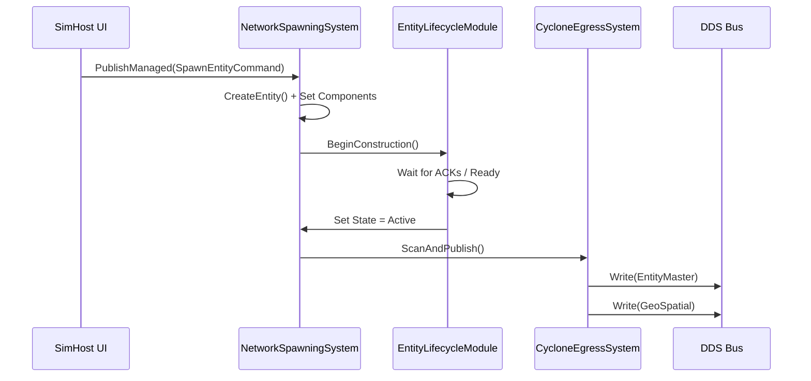
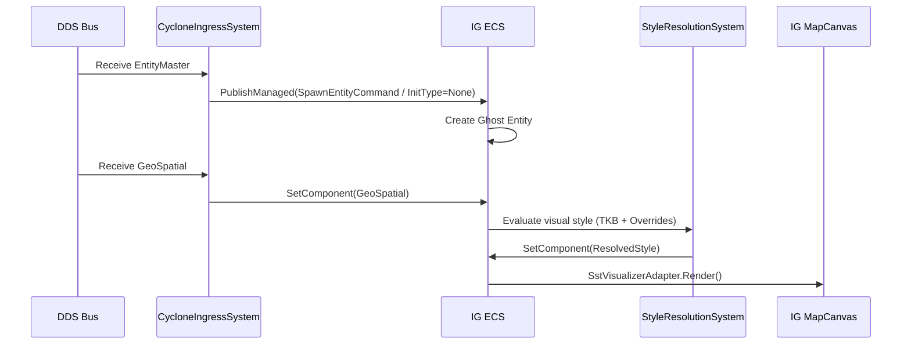
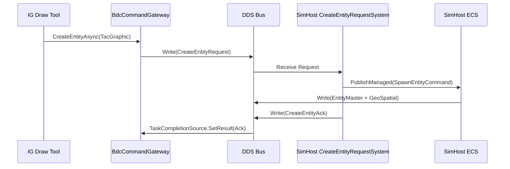
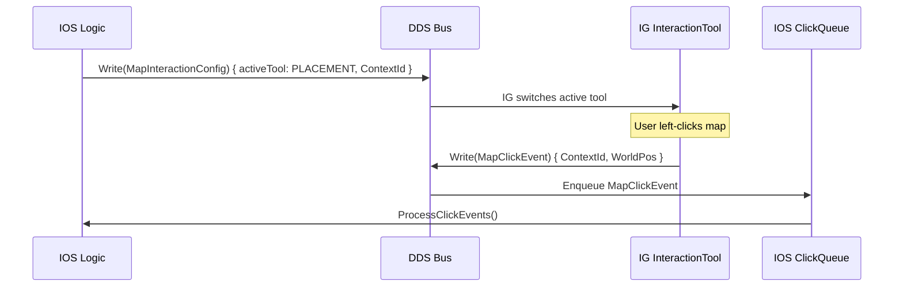
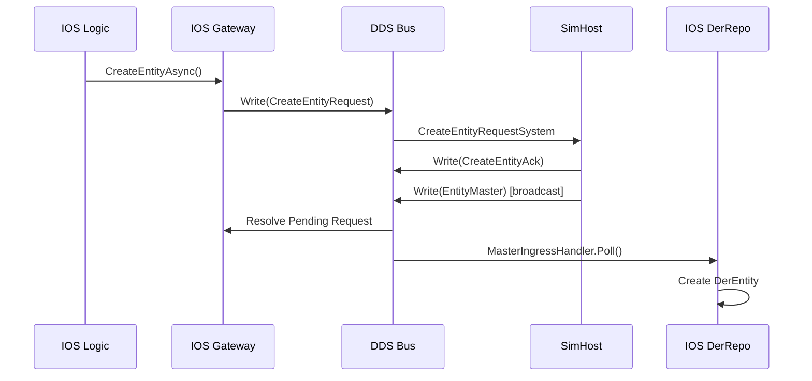
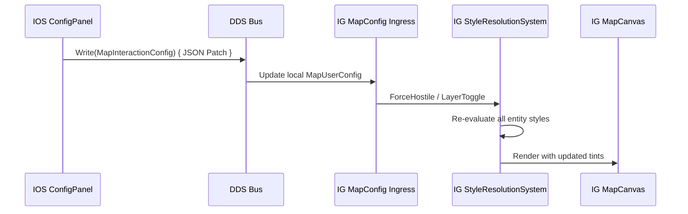

# Integration Troubleshooting & Architecture Hardening Design

**Version:** 1.0  
**Date:** 2026-02-27  
**Status:** Ready for Implementation

**Source Design Talk:** [Troubleshooting_FDP_Integration.json.md](../../FDP/Docs/troubleshooting-integration/Troubleshooting_FDP_Integration.json.md)

---

## Table of Contents

1. [Context & Problem Statement](#1-context--problem-statement)
2. [Root Cause Analysis](#2-root-cause-analysis)
3. [Architectural Decisions & Constraints](#3-architectural-decisions--constraints)
4. [Phase 1: Integration Bug Fixes](#4-phase-1-integration-bug-fixes)
5. [Phase 2: Architecture Consolidation](#5-phase-2-architecture-consolidation)
6. [Phase 3: Debug Instrumentation & End-to-End Validation](#6-phase-3-debug-instrumentation--end-to-end-validation)
7. [Major Data Flows (Reference)](#7-major-data-flows-reference)

---

## 1. Context & Problem Statement

The Bagira simulation stack is composed of three collaborating processes:

| App | Role |
|-----|------|
| **SimHost** | Authoritative owner of vehicle/unit entities; simulates their behaviour; publishes via DDS |
| **IG** | Displays the 2D map; receives unowned entity read-replicas from SimHost; allows drawing of owned map entities; integrates the IOS UI panels over ImGui |
| **IOS** | Lightweight controller; sends configuration, spawn requests, and interaction requests to IG and SimHost via DDS |
| **Runner** | Host process that can run all three subsystems in-process for debugging and headless AI-driven testing (`-m all`) |

### Observed Symptoms (post initial-stub code)

- "New unit…" and "Spawn" buttons do nothing.
- Map does not pan or zoom when all three run inside Runner.
- SimHost standalone renders moving cars; those cars never appear in the IG window.
- IG standalone can pan/zoom but shows no entities.
- No right-click context menu on the map.
- Pressing "Spawn" on the Mini-IOS panel does nothing.

---

## 2. Root Cause Analysis

Five independent root causes were identified. **All five must be fixed together** — fixing only a subset leaves the system silent.

### RC-1: Missing TKB Blueprint Registrations

`TkbDatabase` is instantiated empty in both `IgApplication` and `SimHostApp`. When `NetworkSpawningSystem` processes a `SpawnEntityCommand`, it looks up the `TkbType` in the database and silently rejects the command with `"[NS] Unknown TkbType"` when the catalog is empty.

**Required fix:** Call `BdcTkbCatalog.RegisterAll(tkbDb)` immediately after constructing `TkbDatabase` in both apps.

### RC-2: SimHost Spawns "Local-Only" Invisible Cars

`SimHostScenarioManager.SpawnVehicle` calls `_repo.CreateEntity()` and manually attaches `SimTransform` + `VehicleState`, but **omits** `NetworkIdentity`, `NetworkOwnership`, and `EntityMaster`. Because these network components are absent, `GeoSpatialEgressTranslator` never selects the entity for publication and the car stays invisible to the network.

**Required fix:** Replace the manual entity construction with a `SpawnEntityCommand` event so that `NetworkSpawningSystem` builds the entity with the full component set including network identity.

### RC-3: IOS Uses Null Stub Writers

`Bagira.IOS/Program.cs` and `Bagira.Runner/Services/IosSubsystem.cs` wire `NullDdsWriter<T>` for every outbound topic (`MapInteractionConfig`, `CreateEntityRequest`, `MissionControlRequest`, `ContextActionsUpdate`). All UI actions publish into a black hole.

**Required fix:** Introduce `DdsWriterAdapter<T>` (a thin wrapper around `CycloneDDS.Runtime.DdsWriter<T>`) and substitute it for all `NullDdsWriter` usages.

### RC-4: ImGui DockSpace Blocks Map Input

`Bagira.IOS/IosMock.cs` calls `ImGui.DockSpaceOverViewport(0)` without flags. This creates a full-screen invisible ImGui window that captures all mouse events, preventing Raylib and `MapCanvas` from ever receiving clicks or scroll events.

**Required fix:** Add `ImGuiDockNodeFlags.PassthruCentralNode` so that mouse events over empty dockspace areas fall through to the Raylib layer.

### RC-5: IG-to-IOS Map Event Bridge Is Missing

`IgApplication.cs` registers no DDS translators for `MapClickEvent` or `CreateEntityRequest` on the egress side. Left-click and right-click events generated by `CreationTool` / `StandardInteractionTool` are lost before they reach the DDS bus and never arrive at IOS.

**Required fix:** Register outbound translators in `IgApplication` for `MapClickEvent` (→ IOS) and `CreateEntityRequest` (→ SimHost). Wire the `BdcCommandGateway` into the IG initialisation.

---

## 3. Architectural Decisions & Constraints

### Decision 1: IG is the Sole Map Owner in `-m all` Mode

Raylib's input and render APIs are global state machines. Two subsystems cannot simultaneously own the 2D `MapCanvas`. When IG is present in the Runner, SimHost **must** run headless.

**Constraint:** `SubsystemOrchestrator` must detect IG presence and force `Headless = true` on SimHost during initialisation.

**Input routing after the fix:**
1. `ImGui.GetIO().WantCaptureMouse == true` → IOS panel is active; IG map ignores input.
2. `WantCaptureMouse == false` → `IgApplication.MapCanvas` owns the click.
3. SimHost is headless — it never participates in input routing.

### Decision 2: `BagiraEnvironment` Shared Bootstrapper

All three apps need the same coordinate origin, TKB catalog, and DDS domain. Duplicating this in three places caused RC-1, and will cause future drift. A static `BagiraEnvironment` utility in `Bagira.Map.Common` centralises these concerns.

**Interface:**
```csharp
// Bagira.Map.Common/BagiraEnvironment.cs
public static class BagiraEnvironment
{
    public static TkbDatabase     CreateTkb();               // registers BdcTkbCatalog
    public static WGS84Transform  CreateGeoTransform();      // Berlin origin by default
    public static DdsParticipant  CreateParticipant(int domainId);
}
```

**Constraint:** All three apps and the Runner's subsystems must call only `BagiraEnvironment.*` methods; direct construction of `TkbDatabase`, `WGS84Transform`, and `DdsParticipant` is prohibited outside of `BagiraEnvironment`.

### Decision 3: `DdsWriterAdapter<T>` Pattern for IOS Writers

IOS must remain testable. The `IDdsWriter<T>` interface is retained. `NullDdsWriter` is valid **only** in unit tests. All production paths (standalone `Program.cs` and `IosSubsystem`) use `DdsWriterAdapter<T>`.

---

## 4. Phase 1: Integration Bug Fixes

These five tasks directly address the five root causes. They are the minimum set required to achieve basic end-to-end operation.

### Task INTS-P1-001 — Register TKB Catalog in SimHost and IG

Call `BagiraEnvironment.CreateTkb()` (or equivalent) in both `SimHostApp.OnLoad` and `IgApplication.InitializeNetwork` so that `NetworkSpawningSystem` can resolve TKB templates.

*See TASK-DETAILS for success conditions.*

### Task INTS-P1-002 — Fix SimHost Vehicle Spawning to Use SpawnEntityCommand

Refactor `SimHostScenarioManager.SpawnVehicle` to publish a `SpawnEntityCommand` (with `TkbType`, `NetworkId = 0` for auto-allocation, and `OwnerNodeId`) so that `NetworkSpawningSystem` constructs the entity with `NetworkIdentity`, `NetworkOwnership`, `EntityMaster`, and `SimTransform`.

*See TASK-DETAILS for mapping of `VehicleClass` → TKB type.*

### Task INTS-P1-003 — Replace NullDdsWriter with DdsWriterAdapter in IOS

1. Implement `DdsWriterAdapter<T> : IDdsWriter<T>` in `Bagira.Map.Common` (or `Bagira.IOS`).
2. Replace all four `NullDdsWriter` usages in `Program.cs` and `IosSubsystem.cs`.

*See TASK-DETAILS for exact constructor signatures.*

### Task INTS-P1-004 — Add PassthruCentralNode to ImGui DockSpace

In `IosMock.cs` → `DrawUI()`, change `ImGui.DockSpaceOverViewport(0)` to include `ImGuiDockNodeFlags.PassthruCentralNode`.

### Task INTS-P1-005 — Wire IG-to-IOS Map Event Translators

Register egress translators in `IgApplication` for:
- `MapClickEvent` → DDS (consumed by IOS `_clickQueue`)
- `CreateEntityRequest` → DDS (consumed by SimHost `CreateEntityRequestSystem`)

Wire `BdcCommandGateway` into `IgApplication` so the `MiniIosPanelState` issues authoritative DDS requests to SimHost rather than local ghost spawns.

---

## 5. Phase 2: Architecture Consolidation

These tasks are not required for basic operation but prevent future regression and reduce maintenance cost.

### Task INTS-P2-006 — Implement BagiraEnvironment Bootstrapper

Create `Bagira.Map.Common/BagiraEnvironment.cs` with `CreateTkb()`, `CreateGeoTransform()`, and `CreateParticipant(int domainId)`.

### Task INTS-P2-007 — Fix SubsystemOrchestrator Headless Logic

In `Bagira.Runner/Services/SubsystemOrchestrator.cs` → `Initialize()`:
- After collecting subsystems, check `bool hasIG = _subsystems.Any(s => s.Name == "IG")`.
- Pass `Headless = _headless || (hasIG && subsystem.Name == "SimHost")` to each subsystem's `SubsystemConfig`.

### Task INTS-P2-008 — Refactor IgApplication to Use BagiraEnvironment

Remove inline `TkbDatabase`/`WGS84Transform`/`DdsParticipant` construction from `IgApplication.InitializeNetwork`; replace with `BagiraEnvironment.*` calls.

### Task INTS-P2-009 — Refactor SimHostApp to Use BagiraEnvironment

Remove inline construction from `SimHostApp.OnLoad`; replace with `BagiraEnvironment.*` calls.

### Task INTS-P2-010 — Refactor IosSubsystem to Use BagiraEnvironment

Remove inline construction from `IosSubsystem.Initialize`; replace with `BagiraEnvironment.*` calls and `DdsWriterAdapter<T>` wiring.

---

## 6. Phase 3: Debug Instrumentation & End-to-End Validation

These tasks add structured trace logging and an integration test that validates the full end-to-end entity lifecycle.

### Task INTS-P3-011 — Trace Logging: SimHost Entity Spawn (Flow 1)

Add `Console.WriteLine` / `ILogger` calls at key boundaries in:
- `SimHostScenarioManager.SpawnVehicle`
- `NetworkSpawningSystem.ProcessSpawn`
- `EntityLifecycleModule` ACK promotion
- `EntityMasterTranslator.ScanAndPublish`
- `GeoSpatialEgressTranslator.ScanAndPublish`

### Task INTS-P3-012 — Trace Logging: IG Entity Ingress & Render (Flow 2)

Add trace at:
- `EntityMasterTranslator.ProcessSample` (IG ingress)
- `GeoSpatialTranslator.Decode`
- `StyleResolutionSystem.Execute`
- `SstVisualizerAdapter.Render` (guarded by entity ID filter to avoid spam)

### Task INTS-P3-013 — Trace Logging: IG Map Drawings & IOS Interactions (Flows 3-6)

Add trace at:
- `BdcCommandGateway.CreateEntityAsync` / `CompleteRequest`
- `CreateEntityRequestSystem.ProcessRequest` / `SendErrorAck`
- `IosLogic.StartPlacementMode` / `ProcessClickEvents`
- `RequestTransactionManager.CompleteRequest` / `CheckTimeouts`
- `MapInteractionConfig` ingress in IG

### Task INTS-P3-014 — Integration Test: End-to-End Entity Lifecycle

Write a `[TestMethod]` in `Bagira.SimHost.Integration.Tests` (or a new `Bagira.Integration.Tests` project) that:
1. Starts SimHost + IG in-process with real DDS (Domain 10 test domain).
2. Sends a `SpawnEntityCommand` to SimHost.
3. Polls IG's entity registry for up to 3 seconds.
4. Asserts the entity appears in IG with correct `TkbType`, non-zero `GeoSpatial` position, and a resolved `StyleComponent`.

---

## 7. Major Data Flows (Reference)

The following Mermaid diagrams describe the expected data flows after all fixes are applied. Use them as the reference for debug instrumentation placement.

### Flow 1: SimHost Creates a Network-Published Vehicle



### Flow 2: IG Receives and Renders Entities from SimHost



### Flow 3: IG Creates Network-Distributed Map Drawings



### Flow 4: IOS Requests Map Point Pick from IG



### Flow 5: IOS Requests Entity Creation via Gateway



### Flow 6: IOS Sends Map Configuration Update


