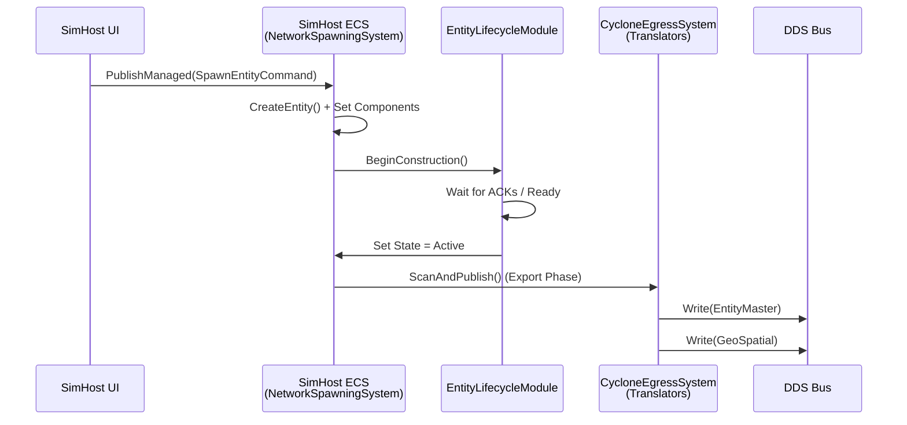
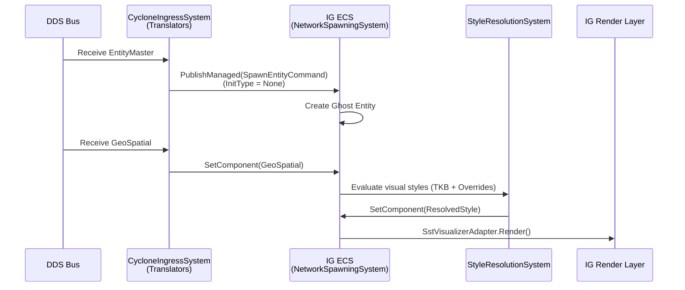
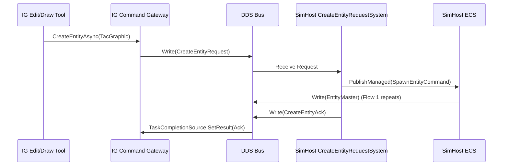
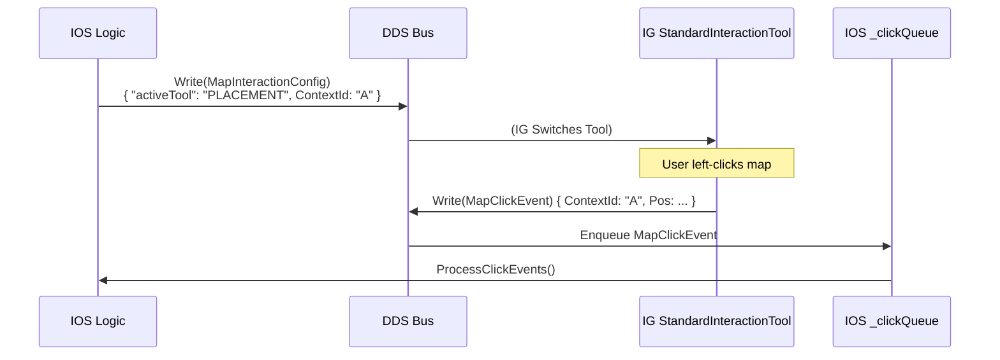
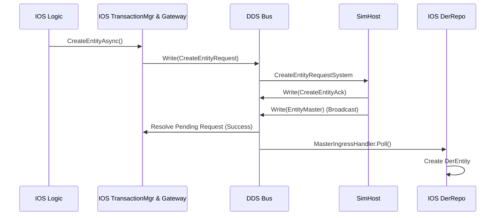
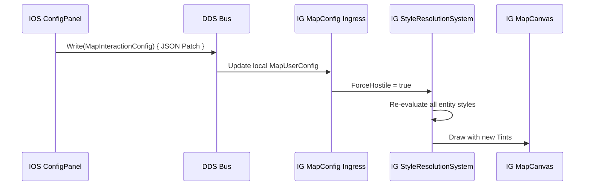

--- user ---------------------------------------------------
fdp.txt is the  game engine. apps.txt is the source code for the apps using it. The idea was that simhost owns most of the the entities (like cars) and simulates their behavior and publishes them over the network according to bdc-sst-rules, IG is showing a 2d map of the situation (receiveing the vehicles from simhost over the network) and allows to draw extra shapes (as map entities owned by the IG but published over the network), and IOS is controlling the IG map remotely. There is also a Runner app which is able to run all three parts (SimHost, IG and IOS) in a single a optionally headless app for easier debugging and automated AI driven development debugging and testing. IG can create request creating new vehicles by sending network request to SimHost. IG should also show the ORBAT by scanning the entities on the network and building the tree of the entities. My trouble is that when i press UI buttons, basically nothing is happening. For example, if i run the Runner with "-m all" parameter to instantiate all 3 parts, pressing the "New unit..." does nothing. Pressing "Spawn" from the "Mini IOS" panel" does nothing. Map does not zoom and pan. No entities visible. When i run Bagira.SimHost separately as standalone app, it shows its own 2d window with car entities that moves. But i do not see those in the IG window. When i run Bagira.IG separately, the map can zoom and pan but no entities shown. If i press Spawn on the IG's "Mini IOS" panel, nothing happens. Similarly if i run Bagira.IOS app (it shows Node 10) and press "New unit..." from its "ORBAT Tree" panel, nothing happens. Map has to right-click context menu. Map click are supposed to travel to IOS as network messages but i see nothing. The apps look just drafted but not much integrated. SimHost and IG are buld on top of the full FDP ECS stack and are supposed to mimic the network distrobution as the Fdp.Examples.NetworkDemo project is showing. IOS is a lightweight app communicating via requests and responses via the DER library. Pls analyze and find the troubles and suggest solutions.

--- model --------------------------------------------------
Based on a thorough analysis of the provided source code, the applications look exactly as you described: they are individually drafted but lack the "connective tissue" required to bridge the local ECS logic to the DDS network, and to link the UI panels to the data plane.

Here is the diagnosis of the 5 exact reasons why nothing is happening, along with the code solutions to fix them.

---

### Root Cause 1: Missing TKB (Blueprint) Registrations
When IG or SimHost attempts to spawn an entity (e.g., via `SpawnEntityCommand` or `CreateEntityRequest`), the `NetworkSpawningSystem` looks up the `TkbType`. However, the `TkbDatabase` is initialized as empty and the templates are never loaded. 
*Result:* The spawn requests are silently rejected with `"[NS] Unknown TkbType"`.

**Solution:** Load the catalog into both `SimHostApp` and `IgApplication`.
In **`Bagira.SimHost/SimHostApp.cs`** and **`Bagira.IG/IgApplication.cs`**, find where `tkbDb` is instantiated and add the registration call:
```csharp
var tkbDb = new TkbDatabase();
// ADD THIS LINE:
Bagira.Map.Definitions.Tkb.BdcTkbCatalog.RegisterAll(tkbDb);
```

### Root Cause 2: SimHost Spawns "Local-Only" Invisible Cars
In standalone mode, the SimHost shows cars moving. However, `SimHostScenarioManager.SpawnVehicle` bypasses the ECS Network and TKB architecture. It uses `_repo.CreateEntity()` and manually adds `SimTransform` and `VehicleState`, but it **forgets to add** `NetworkIdentity`, `NetworkOwnership`, or `EntityMaster`.
Because these network components are missing, the `GeoSpatialEgressTranslator` ignores them, and they never broadcast to DDS.

**Solution:** Refactor `SimHostScenarioManager.cs` to publish a `SpawnEntityCommand` so the `NetworkSpawningSystem` handles the TKB templates and network components automatically.
```csharp
// In Bagira.SimHost/UI/SimHostScenarioManager.cs
public void SpawnVehicle(Vector2 position, Vector2 heading, VehicleClass vehicleClass = VehicleClass.PersonalCar)
{
    // Map the local VehicleClass to the global TKB type
    long tkbType = vehicleClass switch {
        VehicleClass.Tank => Bagira.Map.Common.TkbEntityTypes.Tank_M1Abrams,
        VehicleClass.Pedestrian => Bagira.Map.Common.TkbEntityTypes.Infantry_Rifleman,
        _ => Bagira.Map.Common.TkbEntityTypes.Truck_HMMWV
    };

    float angle = VectorMath.SignedAngle(Vector2.UnitX, heading);
    var rot = System.Numerics.Quaternion.CreateFromAxisAngle(System.Numerics.Vector3.UnitZ, angle);

    // Let the network spawning system construct the entity authoritatively
    _repo.Bus.PublishManaged(new CarKinem.Commands.CmdSpawnVehicle { /* ... */ }); 
    // OR BETTER: Publish SpawnEntityCommand directly so it gets a Network ID and Owner:
    _repo.Bus.PublishManaged(new FDP.Toolkit.NetworkSpawning.Events.SpawnEntityCommand
    {
        NetworkId = 0, // Auto-allocate
        TkbType = tkbType,
        OwnerNodeId = 1, // Local authority
        InitType = ModuleHost.Core.Network.Interfaces.ReliableInitType.AllPeers,
        InitialComponents = new System.Collections.Generic.List<object>
        {
            new SimTransform { Position = new System.Numerics.Vector3(position.X, position.Y, 0), Rotation = rot }
        }
    });
}
```

### Root Cause 3: The IOS App uses "Null" Stub Writers
If you look at **`Bagira.IOS/Program.cs`** (and `Bagira.Runner/Services/IosSubsystem.cs`), the network writers are completely stubbed out:
```csharp
var configWriter       = new NullDdsWriter<MapInteractionConfig>();
var createEntityWriter = new NullDdsWriter<CreateEntityRequest>();
// ...
```
When you click "New Unit..." and fill out the spawner, it generates the configuration patches and spawn requests, but pushes them into a black hole.

**Solution:** Wire up real CycloneDDS writers in `IosSubsystem.cs` and `Bagira.IOS/Program.cs`.
```csharp
// 1. Create a real adapter class
public class DdsWriterAdapter<T> : IDdsWriter<T> where T : unmanaged
{
    private readonly CycloneDDS.Runtime.DdsWriter<T> _writer;
    public DdsWriterAdapter(CycloneDDS.Runtime.DdsParticipant p, string topic) 
        => _writer = new CycloneDDS.Runtime.DdsWriter<T>(p, topic);
    public void Write(T sample) => _writer.Write(sample);
}

// 2. In IosSubsystem.Initialize() and IOS Program.cs:
var participant = new DdsParticipant((uint)config.DomainId);

var configWriter = new DdsWriterAdapter<MapInteractionConfig>(participant, "MapInteractionConfig");
var createEntityWriter = new DdsWriterAdapter<CreateEntityRequest>(participant, "CreateEntityRequest");
// Pass these into the IosLogic constructor instead of NullDdsWriter
```

### Root Cause 4: ImGui Dockspace Blocks Map Panning
In the Runner app, the Map doesn't pan or zoom. This is because **`Bagira.IOS/IosMock.cs`** executes `ImGui.DockSpaceOverViewport(0);`. 
By default, this creates a full-screen invisible ImGui window that consumes *all* mouse inputs, preventing Raylib and the `MapCanvas` from ever receiving clicks or scroll events.

**Solution:** Add the `PassthruCentralNode` flag to let the mouse penetrate the empty areas of the dockspace down to the map.
```csharp
// In Bagira.IOS/IosMock.cs, inside DrawUI()
ImGui.DockSpaceOverViewport(0, ImGui.GetMainViewport(), ImGuiDockNodeFlags.PassthruCentralNode);
```

### Root Cause 5: IG to IOS Map Events aren't bridging
When the user left-clicks or right-clicks in the IG map, the `CreationTool` or `StandardInteractionTool` are supposed to tell the IOS what happened. But `IgApplication.cs` has no DDS Translators registered for `MapClickEvent` or `CreateEntityRequest`.

**Solution:** 
1. Use the `BdcCommandGateway` inside IG so it can actually send requests:
```csharp
// In Bagira.IG/IgApplication.cs
var gateway = new Bagira.Map.Common.Commands.BdcCommandGateway(participant);
```
2. When the IG's MiniIOS UI panel (`MiniIosPanelState.cs`) requests a spawn, instead of pushing a `SpawnEntityCommand` to the local EventBus (which results in an invisible local ghost), it should issue a DDS `CreateEntityRequest` to the SimHost so the SimHost authoritatively creates and publishes it.

### Summary Checklist to Get it Running:
1. Call `BdcTkbCatalog.RegisterAll(tkb)` in both `IgApplication` and `SimHostApp`.
2. Update `SimHostScenarioManager` to use `SpawnEntityCommand` so the generated cars are properly networked and tagged with `EntityMaster`.
3. Replace `NullDdsWriter` with `DdsWriterAdapter` wrapping actual CycloneDDS writers in the IOS setups.
4. Add `ImGuiDockNodeFlags.PassthruCentralNode` to the IOS `DockSpaceOverViewport` call.
5. *(Optional but helpful)* In `MiniIosPanelState.cs`, add `new EntityMaster { TkbType = TkbType }` to the `InitialComponents` list so that if you spawn entities purely locally in IG without the network, the `StyleResolutionSystem` will at least be able to render them.

--- user ---------------------------------------------------
The initialization of the apps migh also be a bit scattered and duplicated. As they all should work togerther it would be nice if they have some common configuration parts like for example the concrete tkb; maybe also the system and modules setup could be a bit more unified so to avoid duplications. Do you possibilities like that? Also when the 3 separate parts are running inside the runner, how do we differentiate which part should handle mouse clicks etc., how to single user input channel is distributed to the apps?

--- model --------------------------------------------------
You have accurately identified two major architectural challenges when merging distinct distributed applications into a single "Runner" process: **Initialization Boilerplate** and **Input/Canvas Collision**.

Because `SimHost` and `IG` were originally designed as standalone executables, they both assume they own the physical screen (Raylib) and the global mouse/keyboard state. If both try to draw their 2D maps and read mouse clicks in the same loop, they will fight over the camera, draw over each other, and cause a mess. 

Here is how we unify the initialization and properly distribute the display and inputs.

---

### Part 1: Solving the Input and Display Collision

Because Raylib's input (`Raylib.GetMousePosition()`) and rendering (`BeginDrawing()`) are global state machines, **you cannot have two active 2D Map Canvases running in the same process.** 

If you run `-m all`, the **IG** should be the sole owner of the visual map, while the **SimHost** should act purely as a headless server simulating the physics and AI in the background. The **IOS** only renders ImGui panels, so it safely shares the screen with the IG.

**The Fix:** Modify the `SubsystemOrchestrator` in the Runner to force the SimHost into headless mode if the IG is also present.

Update **`Bagira.Runner/Services/SubsystemOrchestrator.cs`**:

```csharp
public void Initialize()
{
    if (!_headless)
    {
        Raylib.InitWindow(_windowWidth, _windowHeight, WindowTitle);
        Raylib.SetTargetFPS(DefaultTargetFps);
        rlImGui.Setup(true);
    }

    // Check if IG is in the mix
    bool hasIG = _subsystems.Any(s => s.Name == "IG");

    foreach (var subsystem in _subsystems)
    {
        // THE FIX: If IG is running, force SimHost to be headless 
        // so it doesn't fight IG for the MapCanvas and mouse inputs.
        bool forceHeadless = _headless || (hasIG && subsystem.Name == "SimHost");

        var cfg = new SubsystemConfig
        {
            Headless       = forceHeadless,
            OwnWindow      = false,
            SubsystemName  = subsystem.Name
        };
        subsystem.Initialize(cfg);
    }
}
```

**How Input is Distributed Now:**
1. **ImGui gets first dibs:** If the mouse is over an IOS panel (like "ORBAT" or "Mini IOS"), `ImGui.GetIO().WantCaptureMouse` is true. `IgApplication` checks this and ignores the map click.
2. **IG owns the Map:** If the mouse is over the actual map, ImGui ignores it. `IgApplication.MapCanvas` processes the click, triggers the `StandardInteractionTool`, and (thanks to the BDC Gateway fix) sends a DDS command to the network.
3. **SimHost observes:** Because SimHost is forced headless, its `_vis` (Visualization) is never created. It just reads the DDS network and reacts to the IG's commands.

---

### Part 2: Unifying Initialization

Instead of manually creating and configuring the TKB, Geodetic origin, and DDS participant in three different places, we should extract a `BagiraEnvironment` bootstrapper into `Bagira.Map.Common`.

Create a new file **`Bagira.Map.Common/BagiraEnvironment.cs`**:

```csharp
using CycloneDDS.Runtime;
using Fdp.Modules.Geographic.Transforms;
using Fdp.Toolkit.Tkb;
using Bagira.Map.Definitions.Tkb;

namespace Bagira.Map.Common
{
    /// <summary>
    /// Unified environment factory for Bagira subsystems to ensure 
    /// everyone uses the exact same coordinate spaces and TKB blueprints.
    /// </summary>
    public static class BagiraEnvironment
    {
        public static TkbDatabase CreateTkb()
        {
            var tkb = new TkbDatabase();
            // Automatically registers M1Abrams, T72, Infantry, etc.
            BdcTkbCatalog.RegisterAll(tkb);
            return tkb;
        }

        public static WGS84Transform CreateGeoTransform()
        {
            // Ensures IG, SimHost, and IOS all agree on where (0,0,0) is in the real world
            var wgs84 = new WGS84Transform();
            wgs84.SetOrigin(52.52, 13.405, 0.0); // Berlin default
            return wgs84;
        }
        
        public static DdsParticipant CreateParticipant(int domainId)
        {
            return new DdsParticipant((uint)domainId);
        }
    }
}
```

### Part 3: Applying the Unified Init to the Apps

Now you can strip out the duplicated boilerplate in your application shells.

**1. Update `IgApplication.cs` (Bagira.IG)**
```csharp
private void InitializeNetwork(bool enableNetwork)
{
    _networkEnabled = enableNetwork;

    // Use shared Bootstrapper
    var tkb = BagiraEnvironment.CreateTkb();
    _world.SetSingletonManaged<Fdp.Interfaces.ITkbDatabase>(tkb);

    // ... (Elm setup remains)

    if (enableNetwork)
    {
        var participant = BagiraEnvironment.CreateParticipant(IgNetworkConstants.DdsDomain);
        var geoTransform = BagiraEnvironment.CreateGeoTransform();

        // Pass into translators...
    }
    // ...
}
```

**2. Update `SimHostApp.cs` (Bagira.SimHost)**
```csharp
protected override void OnLoad()
{
    // ... world setup
    
    // Use shared Bootstrapper
    var ddsParticipant = BagiraEnvironment.CreateParticipant(config.DomainId);
    var tkbDb          = BagiraEnvironment.CreateTkb();
    var wgs84          = BagiraEnvironment.CreateGeoTransform();
    var entityMap      = new NetworkEntityMap();
    _idAllocator       = new DdsIdAllocator(ddsParticipant, "SimHostAllocator");

    // ... proceed to Module setup
}
```

**3. Update `IosSubsystem.cs` (Bagira.Runner)**
```csharp
public void Initialize(SubsystemConfig config)
{
    _headless = config.Headless;

    var repo = new DerRepo();
    var participant = BagiraEnvironment.CreateParticipant(config.DomainId);

    // Create real writers instead of NullDdsWriters
    var configWriter = new DdsWriterAdapter<MapInteractionConfig>(participant, "MapInteractionConfig");
    var createEntityWriter = new DdsWriterAdapter<CreateEntityRequest>(participant, "CreateEntityRequest");
    var missionCmdWriter = new DdsWriterAdapter<MissionControlRequest>(participant, "MissionControlRequest");
    var contextMenuWriter = new DdsWriterAdapter<ContextActionsUpdate>(participant, "ContextActionsUpdate");
    
    // ... rest of logic setup
}
```

### Summary of how the Architecture flows after these fixes:
1. **Runner** starts up.
2. It initializes **SimHost**, **IG**, and **IOS**.
3. It detects IG is present, so it forces **SimHost** into pure-simulation mode (Headless = true).
4. All three apps use `BagiraEnvironment` to create their respective DDS participants, WGS84 coordinates, and fully populated TKBs.
5. The **IG** draws the world Map in Raylib. The **IOS** draws its windows on top using ImGui.
6. The user clicks "Spawn" in an IOS panel. ImGui intercepts the mouse click.
7. IOS sends a `CreateEntityRequest` over DDS.
8. **SimHost** (running headlessly) receives the request, spawns the TKB entity, applies the WGS84 transforms, and pushes the `EntityMaster` and `GeoSpatial` components to the DDS network.
9. **IG** receives the new DDS components, creates a ghost entity, applies its local `StyleResolutionSystem`, and draws the newly spawned Tank on the map.

--- user ---------------------------------------------------
pls help me debugging the issue. tell me what should i look for, where to place debug prints to monitor the expected correct data flows between apps and inside the individual apps (through what modules what data are expected the flow). Best as mermaid diagrams. I need the major flows like:
1. SimHost creating network-published owned vehicle entity locally (from its local UI), using ELM and in network distributed manners.
2. IG receiving the network published entities (unowned) from SimHost and rendering them on its 2d map
3. IG creating local but network distributed entity (shared scenario saved drawings etc.), publishing to SimHost, SimHost storing to its ECS and maybe rendering in its graphical window.
4. IOS requesting the IG to pick a point from the map, IG activating the picking mechanism, and IG sending back the picked coordinates.
5. IOS requesting the creation of a new entity at given coordinates with some initial descriptor, Simhost creating the entity and publishing it on the network, also sending back request confirmation, IOS processing the published entity (storing to its DER repo) and receiving the request acknowledgement message (via Commands toolkit).
6. IOS sending map config update (style json to merge), IG publishing the updated configuration
you are free to identify other major flows

--- model --------------------------------------------------
Here is a comprehensive debugging guide for the Bagira distributed simulation architecture. 

To debug these asynchronous, multi-phase ECS architectures effectively, you need to place trace logs at the **boundaries** between components: 
1. **Input/UI generation**
2. **ECS Event Bus / Command Buffer ingestion**
3. **DDS Translator Egress (Publishing)**
4. **DDS Translator Ingress (Receiving)**

Below are the Mermaid diagrams and exact debug print locations for the 6 major data flows.

---

### Flow 1: SimHost creates a network-published vehicle locally

When the SimHost UI (or Scenario Manager) spawns an entity, it enters the Entity Lifecycle Module (ELM) as `Constructing`, waits for network allocation, becomes `Active`, and is then published to DDS.



#### 📍 Where to place Debug Prints:
*   **`Bagira.SimHost/UI/SimHostScenarioManager.cs`** -> `SpawnVehicle()`
    *   *Print:* `"SimHost UI: Requesting SpawnEntityCommand for TKB {tkbType}"`
*   **`Toolkits/FDP.Toolkit.NetworkSpawning/Systems/NetworkSpawningSystem.cs`** -> `ProcessSpawn()`
    *   *Print:* `"SimHost ECS: ProcessSpawn NetworkId={networkId}, TkbType={cmd.TkbType}"`
*   **`Toolkits/FDP.Toolkit.Lifecycle/EntityLifecycleModule.cs`** -> `ProcessConstructionAck()`
    *   *Print:* `"ELM: Entity {ack.Entity.Index} received all ACKs. Promoting to Active."`
*   **`ModuleHost/ModuleHost.Network.Cyclone/Translators/EntityMasterTranslator.cs`** -> `ScanAndPublish()`
    *   *Print:* `"SimHost Egress: Publishing EntityMaster for NetID {topic.EntityId}"`
*   **`Bagira.SimHost/Translators/GeoSpatialEgressTranslator.cs`** -> `ScanAndPublish()`
    *   *Print:* `"SimHost Egress: Publishing GeoSpatial for NetID {netId.Value}"`

---

### Flow 2: IG receives network-published entities from SimHost

IG acts as a "Ghost" node. It receives `EntityMaster`, spawns an empty placeholder, and then hydrates it with components as other topics (`GeoSpatial`, `EntityInfo`) arrive.



#### 📍 Where to place Debug Prints:
*   **`ModuleHost/ModuleHost.Network.Cyclone/Translators/EntityMasterTranslator.cs`** -> `ProcessSample()`
    *   *Print:* `"IG Ingress: Received EntityMaster NetID={master.EntityId}. Publishing SpawnEntityCommand for Ghost."`
*   **`Bagira.IG/Translators/GeoSpatialTranslator.cs`** -> `Decode()`
    *   *Print:* `"IG Ingress: Applied GeoSpatial (Lat: {data.Pos.Latitude}, Lon: {data.Pos.Longitude}) to Entity {entity.Index}"`
*   **`Bagira.IG/Systems/StyleResolutionSystem.cs`** -> `Execute()`
    *   *Print:* `"IG Style: Resolved Style for Entity {entity.Index}. Texture={style.GetTextureName()}"`
*   **`Bagira.IG/Adapters/SstVisualizerAdapter.cs`** -> `Render()`
    *   *Print:* `"IG Render: Drawing Entity {entity.Index} at {position}"` (Warning: this will spam, so conditionalize it for a specific entity ID).

---

### Flow 3: IG creating local map drawings (Network Distributed)

IG creates tactical graphics (like lines or areas). It wants SimHost to be the authoritative owner, so it sends a `CreateEntityRequest`.



#### 📍 Where to place Debug Prints:
*   **`Bagira.Map.Common/Commands/BdcCommandGateway.cs`** -> `CreateEntityAsync()`
    *   *Print:* `"IG Gateway: Sending CreateEntityRequest ID={request.RequestId}"`
*   **`Bagira.SimHost/Systems/CreateEntityRequestSystem.cs`** -> `ProcessRequest()`
    *   *Print:* `"SimHost: Received CreateEntityRequest {request.RequestId}. Spawning TkbType={tkbType}"`
*   **`Bagira.SimHost/Systems/CreateEntityRequestSystem.cs`** -> `SendErrorAck()` (Very important!)
    *   *Print:* `"SimHost ERROR: Rejecting Request {requestId} with Code {errorCode}"`

---

### Flow 4: IOS requesting IG to activate tool & IG sending click back

IOS sends a configuration patch to activate the "PLACEMENT" tool. The user clicks the IG map, and IG sends a `MapClickEvent` back to the IOS.



#### 📍 Where to place Debug Prints:
*   **`Bagira.IOS/IosLogic.cs`** -> `StartPlacementMode()`
    *   *Print:* `"IOS: Activated Placement Mode. ContextId={ActiveContextId}, TKB={tkbType}"`
*   **`Bagira.IG/Tools/CreationTool.cs`** -> `PublishCreateRequest()` / `HandleClick()`
    *   *Print:* `"IG Tool: Map clicked at {worldPos}. Sending MapClickEvent / Request."`
*   **`Bagira.IOS/IosLogic.cs`** -> `ProcessClickEvents()`
    *   *Print:* `"IOS: Received MapClickEvent. ContextId={evt.InteractionContextId} (Expected: {ActiveContextId})"` (Look out for "DROP" logs here, which already exist in your code).

---

### Flow 5: IOS requesting Entity Creation via Gateway

IOS processes the map click, requests SimHost to create the entity, and waits for the ACK while the DER repository gets populated by the standard network broadcast.



#### 📍 Where to place Debug Prints:
*   **`Bagira.IOS/IosLogic.cs`** -> `ProcessClickEvents()`
    *   *Print:* `"IOS: Sending CreateEntityRequest to SimHost for TKB={PlacementType}"`
*   **`Bagira.IOS/Services/RequestTransactionManager.cs`** -> `CompleteRequest()`
    *   *Print:* `"IOS TxMgr: Request {requestId} completed. Success={success}"`
*   **`Bagira.IOS/Services/RequestTransactionManager.cs`** -> `CheckTimeouts()`
    *   *Print:* `"IOS TxMgr WARNING: Request {id} timed out!"`
*   **`Toolkits/FDP.Toolkit.DER/DdsIngressHandlers.cs`** -> `MasterIngressHandler.Poll()`
    *   *Print:* `"IOS DER: Received EntityMaster for NetID {id}. Stored in repo."`

---

### Flow 6: IOS sending map config update (Styling/Layers)

IOS pushes a JSON patch to toggle layers or change global tactical colors.



#### 📍 Where to place Debug Prints:
*   **`Bagira.IOS/Panels/ConfigPanel.cs`** -> `HandleSendConfigPatch()`
    *   *Print:* `"IOS Config: Sending JSON Patch: {BuildPatch()}"`
*   **`Bagira.IG/Systems/MapUserConfig.cs`** (or wherever the `MapInteractionConfig` translator lives in IG).
    *   *Print:* `"IG Config: Received MapInteractionConfig. Applying JSON patch."`
*   **`Bagira.IG/Systems/StyleResolutionSystem.cs`** -> `BuildStyle()`
    *   *Print:* `"IG Style: Applying MapUserConfig layer. ForceHostile={_userConfig.ForceHostile}"`

---

### Pro-Tip: The "Black Hole" Effect
If you are pressing buttons and absolutely *nothing* is happening, your events are falling into the "Black Hole" between the **Command Buffer** and the **Event Bus Swap**. 

Always verify:
1. **Are you calling `EventBus.SwapBuffers()`?** Events published in frame `N` are not readable until frame `N+1`. If `SwapBuffers()` isn't called, `ConsumeEvents<T>` will always be empty.
2. **Are you executing the correct `SystemPhase`?** If a module publishes an event in `SystemPhase.Simulation`, a system reading it must run in `SystemPhase.PostSimulation` (or `Simulation` on the *next* frame).
3. **Is the DDS Participant matching Domains?** SimHost defaults to Domain `0`. If IG or IOS defaults to a different Domain, they will literally never see each other's traffic. Log `participant.DomainId` on all three startups.

