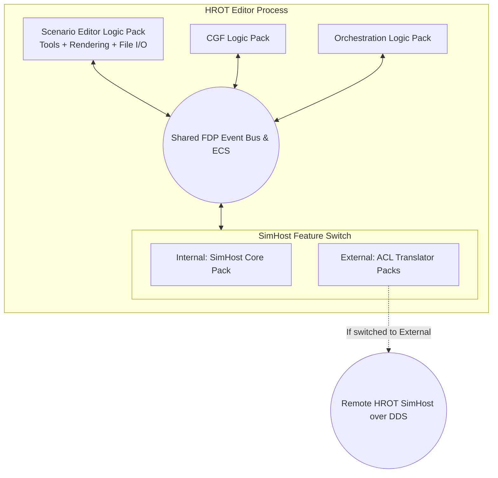
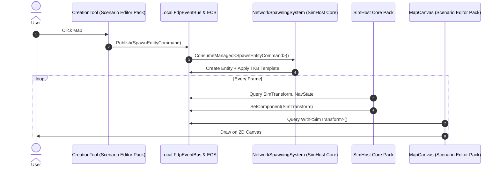
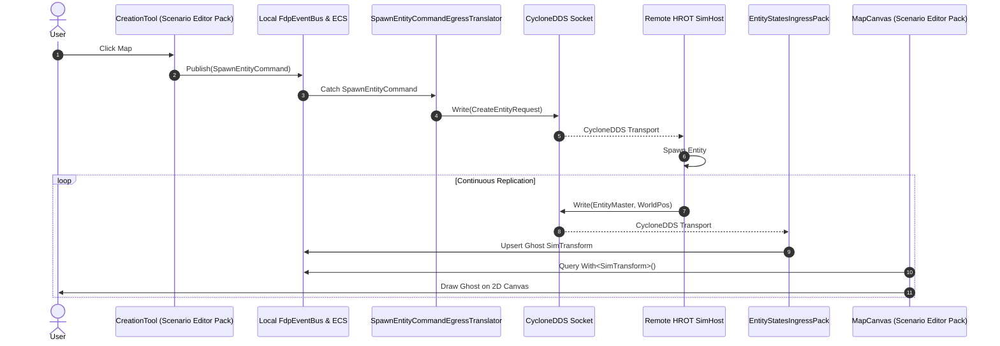

# DESIGN.md — Scenario Editor Pack & HROT Editor Refactoring (`packs-2`)

## Background and Vision

With the CQRS and Anti-Corruption Layer boundaries established in `packs-1`, the next step is to
assemble the **HROT Editor** — a standalone, all-in-one authoring tool — and to enable the
**"Feature Switch"** that lets the Editor operate either with an internal FDP SimHost (offline,
full memory-bus speed) or with an external HROT SimHost over the network.

To achieve this we must:

1. **Decouple** the IG map tools from DDS, so they are portable across deployment topologies.
2. **Extract** a shared `Hrot.ScenarioEditor` Logic Pack containing the map interaction tools and
   rendering layers, usable by the Editor (and still by the IG) without duplicating code.
3. **Formalize host-specific UI Packs** so each application (IG, ExCon, Editor) retains its own
   bespoke ImGui panels while sharing the underlying interaction mechanics.
4. **Implement local scenario file operations** (Save / Load / New) in the Scenario Editor Logic
   Pack, operating entirely on the local `EntityRepository`.
5. **Assemble the HROT Editor** composition root and implement the runtime Feature Switch that
   hot-swaps from the offline All-In-One configuration to an externally networked mode.

### Retained Functionality Constraints

- The existing **HROT IG** and **HROT ExCon** subsystems must retain their current remote-control
  functionality unchanged (IG renders the 2D map; ExCon sends remote tool-activation commands).
- `MapCommandController` retains its remote-tool-activation role (receiving `MapCommandRequest`
  from ExCon and acknowledging via `MapCommandAck`). Only its DDS entity-creation wiring is
  replaced by event-bus publishing.
- ImGui panels are **not** shared across applications; only the underlying map tools and render
  layers are shared.

### Pack Architecture Overview

```
graph TD
    subgraph Edge [Network Edge]
        DDS((CycloneDDS Wire))
    end

    subgraph ACL [Translator Packs]
        TP_States[Entity States & Events Pack]
        TP_Intents[Actuator Intents Pack]
        TP_Spawn[Spawn/Destroy Egress Translators]
    end

    subgraph Core [Pure Domain]
        Bus((FDP Event Bus & ECS Repository))
        subgraph LogicPacks [Logic Packs]
            LP_Muscle[SimHost Core Pack]
            LP_Brain[CGF Logic Pack]
            LP_Orch[Orchestration Pack]
            LP_Editor[Scenario Editor Pack\nTools + Render Layers + File I/O]
        end
    end

    DDS <-->|DDS Structs| ACL
    ACL <-->|Managed Events & ECS| Bus
    Bus <-->|Pure C# POCOs| LogicPacks
```

### HROT Editor Deployment Targets

**Target A — HROT Editor (All-In-One / Offline)**

All Logic Packs share a single `ModuleHostKernel` and `EntityRepository`. No Translator Packs
are installed. Entity commands emitted by map tools are consumed directly by local systems
(`NetworkSpawningSystem`).

**Target B — HROT Editor with Feature Switch → External**

At runtime the Editor hot-plugs out the `SimHost Core Logic Pack` and snaps in the network
Translator Packs (Actuator Intents Egress + Entity States Ingress). Map tools continue emitting
the same FDP events; the ACL translates them to DDS and maintains ghost entities from remote
broadcasts.

---

## Phase 0: Formalize Logic Pack and Translator Pack Composite Wrappers

**Goal:** Create named composite `IEcsModule` wrappers that group existing modules by their
architectural tier. These wrappers are the building blocks consumed by Phase 5 composition roots
and the Feature Switch.

### 0.A — Logic Pack Composite Wrappers

Create three composite `IEcsModule` wrappers (factory classes or thin wrapper modules):

| Class | Contained Modules |
|-------|------------------|
| `SimHostCoreLogicPack` | `GroundKinematicsModule`, `CombatModule`, `DamageAssessmentModule`, `AutonomousPerceptionModule` |
| `CgfLogicPack` | `CognitiveRuntimeModule`, `MissionControlModule`, `ActionDispatchModule` |
| `OrchestrationLogicPack` | `MasterSyncController` / `SlaveSyncController`, cluster state handlers |

These are **not** new C# projects — they are convenience wrappers (e.g. a class implementing
`IEcsModule` that delegates `RegisterSystems` to each contained module, or a static factory
returning `List<IEcsModule>`). They live alongside the modules they group (e.g. in `Hrot.SimHost`,
`Hrot.CGF`, `Hrot.Orchestrator`).

### 0.B — Translator Pack Composite Wrappers

Create two composite translator-pack wrappers to enable the Feature Switch (Phase 5.E):

| Class | Contained Translators |
|-------|----------------------|
| `ActuatorIntentsEgressPack` | `NavigationIntentEgressTranslator`, `WeaponFireIntentEgressTranslator`, `SpawnEntityCommandEgressTranslator`, `UpdateEntityCommandEgressTranslator`, `DestroyEntityCommandEgressTranslator` |
| `EntityStatesIngressPack` | `EntityMasterIngressTranslator`, `GeoSpatialIngressTranslator`, `EntityDamageIngressTranslator`, **`EntityInfoIngressTranslator`** (names, colors, affiliations), **`MapVisualOverlayIngressTranslator`** (tactical area polygons), **`MapRouteIngressTranslator`** (multi-point routes) |

> **Why the full visual suite?** Without `EntityInfoIngressTranslator`, the Editor renders
> unnamed blank symbols in External mode. Without `MapVisualOverlayIngressTranslator` and
> `MapRouteIngressTranslator`, tactical graphics and route polylines are invisible. All three
> are mandatory for the Editor to render a complete 2D operational picture from a remote
> SimHost.

These live in `Hrot.Map.Common` (or the relevant translator assembly) and group translators by
**data category** (not by node role), enabling the composition root to install/uninstall the
entire "External SimHost" surface as a single unit.

> **Out-of-scope packs (existing, no refactoring needed):**  
> The **Service Queries/Responses Pack** (`PathRequest`, `RaycastBatch` translators) and the
> **Network ID Allocation Pack** (`DdsIdAllocator` client and server) are already operational
> in the distributed cluster and do not require new wrappers for `packs-2`. They remain as-is.

---

## Phase 1: Decouple Map Tools from the Network Edge

**Goal:** Strip all DDS/DTO dependencies from `Hrot.IG` map tools and `MapCommandController` so
that the tools emit pure FDP domain events only, making them portable into a shared module.

### 1.A — Purge `CreateEntityRequest` from `CreationTool`

`CreationTool` (`Hrot.IG/Tools/CreationTool.cs`) currently builds a `CreateEntityRequest` — a
CycloneDDS DTO — on every left-click and fires it via an injected
`Action<CreateEntityRequest>` delegate.

**The Fix:**

- Remove the `Action<CreateEntityRequest>` constructor parameter.
- Inject the `FdpEventBus` directly (or an `Action<SpawnEntityCommand>` for testability).
- On left-click, construct a `SpawnEntityCommand` containing: `TkbType`, `OwnerNodeId`, and a
  `SimTransform` (geographic position from the click coordinates).
- Publish via `Bus.PublishManaged(new SpawnEntityCommand { ... })`.

`SpawnEntityCommand` already exists in `FDP.Toolkit.NetworkSpawning.Events`.

### 1.B — Cleanse `EditTool` and `RouteEditTool` of `UpdateEntityDescriptorRequest`

`EditTool` and `RouteEditTool` fire `OnPolylineCommitted`/`onCommit` callbacks that capture a
`_commandGateway` (`NedCommandGateway`) and build `UpdateEntityDescriptorRequest` DDS payloads.

**The Fix:**

- Remove the `_commandGateway` / `Action<UpdateEntityDescriptorRequest>` dependencies from both
  tools.
- When `EditTool` finalises a drag or vertex move, emit `UpdateEntityCommand` onto the
  `FdpEventBus`. The command carries the target `NetworkId` and a `ComponentsToUpdate` list
  populated with the modified pure-ECS component (e.g. updated `SimTransform` or
  `EditablePolyline`).
- When `RouteEditTool` commits a route, emit `UpdateEntityCommand` with an updated `RoutePlan`
  managed component.

`UpdateEntityCommand` already exists in `FDP.Toolkit.NetworkSpawning.Events`.

### 1.C — Remove Network Branching from Context Menus and Delete Hotkeys

`ContextMenuSystem` / keyboard input currently branches on `_networkEnabled`: when `true` it
writes a `DeleteEntityRequest` directly to a `DdsWriter`; when `false` it publishes
`DestroyEntityCommand` to the bus.

**The Fix:**

- Delete the `_networkEnabled` check and the `IDdsWriter<DeleteEntityRequest>` dependency.
- The context menu and delete hotkeys **always** publish `DestroyEntityCommand` to the local
  `FdpEventBus`. The ACL (installed or not) decides whether to forward over DDS.

`DestroyEntityCommand` already exists in `FDP.Toolkit.NetworkSpawning.Events`.

### 1.D — Sever `IDdsWriter<CreateEntityRequest>` from `MapCommandController`

`MapCommandController` (`Hrot.IG/Systems/MapCommandController.cs`) currently holds
`IDdsWriter<CreateEntityRequest> _createEntityWriter` and directly pushes DDS messages in its
`OnEntityCreatedByTool` delegate.

**The Fix:**

- Remove `IDdsWriter<CreateEntityRequest>` from the `MapCommandController` constructor.
- Inject `FdpEventBus` instead.
- Replace the internal `_createEntityWriter.Write(...)` call with
  `_eventBus.PublishManaged(new SpawnEntityCommand { ... })`.
- **Retain** `IDdsWriter<MapCommandAck> _ackWriter`: the controller still needs to acknowledge
  the remote ExCon that the tool session has finished.
- The controller's remote-command activation path (`CMD_PLACE_ENTITY` from ExCon via DDS) is
  unchanged; it still listens for `MapCommandRequest` and pushes the `CreationTool` onto the
  canvas.

### 1.E — Create ACL Egress Translators for Spawn / Update / Destroy Commands

With the tools now emitting pure FDP events, the distributed IG deployment (and future Editor
in External mode) needs ACL egress translators to convert those events back into DDS.

- **`SpawnEntityCommandEgressTranslator`** — catches `SpawnEntityCommand` on the bus, serialises
  it into `CreateEntityRequest`, and writes to DDS. Lives in `Hrot.Map.Common/Replication/Egress/`.
- **`UpdateEntityCommandEgressTranslator`** — catches `UpdateEntityCommand`, serialises it into
  `UpdateEntityDescriptorRequest`, writes to DDS.
- **`DestroyEntityCommandEgressTranslator`** — catches `DestroyEntityCommand`, serialises it into
  `DeleteEntityRequest`, writes to DDS.

The IG's composition root installs these translators so the network behaviour is fully preserved.
The HROT Editor (offline) omits them; the Editor (External mode) installs them dynamically.

---

## Phase 2: Extract the Shared Scenario Interaction Logic Pack

**Goal:** Create a new `Hrot.ScenarioEditor` project housing the purified map tools and render
layers, enabling the Editor and IG to share interaction mechanics without sharing UI panels.

### 2.A — Scaffold the `Hrot.ScenarioEditor` Project

Create a new standalone .NET project `Hrot.ScenarioEditor`.

**Dependency rules (enforced in `.csproj`):**

| Allowed | Forbidden |
|---------|-----------|
| `FDP.Kernel` | `CycloneDDS.*` |
| `FDP.Toolkit.*` | `Hrot.NED` |
| `Hrot.Map.Common` | Any concrete DDS DTO type |
| `Hrot.Common` | |
| `FDP.Toolkit.Vis2D` | |

Implement `ScenarioEditorModule : IEcsModule` with `ExecutionPolicy.Synchronous()`. Its
`RegisterSystems(ISystemRegistry)` method serves as the internal composition root for the tools
and render layers extracted in the subsequent steps.

### 2.B — Migrate Core Interaction Tools into `Hrot.ScenarioEditor`

Move the following tool classes from `Hrot.IG/Tools/` into the new project (same relative
namespace `Hrot.ScenarioEditor.Tools`):

- `CreationTool` (after Phase 1.A purge)
- `EditTool` (after Phase 1.B purge)
- `RouteEditTool` (after Phase 1.B purge)
- `MeasureTool`
- `StandardInteractionTool`
- Corresponding `*Constants.cs` files

After migration the tool files are **deleted** from `Hrot.IG/Tools/` and `Hrot.IG` adds a
project reference to `Hrot.ScenarioEditor` to consume them.

All tools now operate exclusively via `ISimulationView`, `EntityRepository`, and `FdpEventBus`.
No DDS or JSON dependencies may remain.

### 2.C — Extract Visual Rendering Layers into `Hrot.ScenarioEditor`

Move the following rendering components from `Hrot.IG/Systems/` into
`Hrot.ScenarioEditor/Systems/` (or `Hrot.ScenarioEditor/Rendering/`):

- `MapOverlayRenderLayer` — renders tactical polygonal areas (`EditablePolyline` +
  `MapOverlayStyle`).
- `RouteRenderLayer` — renders multi-point path authoring (`RoutePlan` component).
- `MissionRenderLayer` — renders active AI mission trajectories.
- `SelectionRenderSystem` — renders selection highlight rings (`SelectionState` component).
- `NedVisualizerAdapter` / `SstVisualizerAdapter` — MIL-STD-2525 symbol rendering;
  LOD evaluation; entity-symbol draw calls.
- Supporting constants and state files.

These components must query exclusively via `ISimulationView` on local ECS components
(`SimTransform`, `RoutePlan`, `SelectionState`, etc.). They must be oblivious to whether
entities are locally simulated or network ghost proxies.

A `MapCanvasBuilder` static helper (or a bootstrapping method on `ScenarioEditorModule`) composes
these layers into a `MapCanvas` instance that the host applications can embed in their ImGui
windows.

### 2.D — Wire Local Scenario File Operations

Integrate the purified `ScenarioSerializer` into the `ScenarioEditorModule` logic pack so the
scenario authoring lifecycle is fully governed locally:

- **Save Scenario:** Invoke `ScenarioSerializer.Serialize(repo, header)` against the local
  `EntityRepository`; write the JSON DOM to disk.
- **Load Empty (New Scenario):** Publish a synchronous `WorldResetEvent` to the `FdpEventBus`
  so that `SelectionManager`, active map tools, and any other systems holding cached `Entity`
  handles can flush their state before memory is decommitted. Then call `repo.Clear()` and
  inject a fresh `GlobalTime` via `SetSingletonUnmanaged`.
- **Load Scenario:** Publish `WorldResetEvent`, then call `repo.Clear()`, then call
  `ScenarioSerializer.Deserialize(json, repo)` to reconstitute entities in local memory.

> **`WorldResetEvent` contract:** A new managed event type defined in
> `FDP.Toolkit.NetworkSpawning.Events` (or `Hrot.ScenarioEditor.Events`). Systems and tools
> that cache `Entity` handles **must** subscribe to this event and flush their selection /
> active-tool state before it returns. `WorldResetEvent` is consumed synchronously on the
> main thread before `repo.Clear()` is called, guaranteeing no dangling unmanaged pointers.

The `ScenarioSerializerBuilder` is instantiated with the **universal schema identifier
`"Hrot.Scenario"`** (not `"Hrot.Editor"`) and any required `IEntityScenarioTranslator`
registrations, then frozen via `.Build()`.  Using a universal type ensures the authored
scenario file is accepted by execution nodes (SimHost, CGF) whose loaders trust any file
carrying the `"Hrot.Scenario"` schema, regardless of which application authored it.

---

## Phase 3: Formalize Host-Specific UI Packs

**Goal:** Reduce all ImGui panels to lightweight, "dumb" control surfaces organised into
host-specific UI Packs. The shared `Hrot.ScenarioEditor` tools are activated via the event bus,
not by direct method calls inside panels.

### 3.A — Enforce UI-Logic Separation

Panels must:
- Not contain entity manipulation logic or networking code.
- Express operator intent exclusively via an injected **facade interface** (e.g. `IExConLogic`
  for ExCon, `IEditorLogic` for the Editor) — **not** by holding direct references to the
  `FdpEventBus` or calling `ScenarioEditorModule` methods directly.
- Read state from injected read-only facades or view-model objects (e.g. `IDerRepo`,
  `DebugPanelState`, `MiniExConPanelState`).

Any remaining direct ECS mutation or `DdsWriter` calls inside existing panels must be removed
in this step.

### 3.B — Formalize the ExCon UI Pack

Group the remote command-and-control panels into `Hrot.ExCon.UI` (or keep them within
`Hrot.ExCon/Panels/` as a formalized module):

| Panel | Role |
|-------|------|
| `OrbatPanel` | Hierarchical unit management via `CommanderId` |
| `MissionPanel` | Behavioral tasking via `IMissionEditorService` |
| `ConfigPanel` | Map config patches via `IExConLogic.SendConfigPatch` |
| `InteractionPanel` | Cluster-wide interaction controls |
| `DiagnosticsPanel` | Monitoring and diagnostics |
| `SpawnerPanel` | Remote entity spawning via `IExConLogic.StartPlacementMode` |

All panels depend only on `IExConLogic` and `IDerRepo`. Zero DDS or ECS mutation inside panels.

### 3.C — Formalize the IG UI Pack

Group the IG-specific diagnostic/visualization overlays (existing panels stay in `Hrot.IG/UI/`):

| Panel | Role |
|-------|------|
| `IgDebugPanel` | FPS, render overrides — reads `DebugPanelState` |
| `PerformanceOverlay` | ECS culling/render metrics — reads `PerformanceMetrics` |
| `MiniExConPanel` | Local entity spawning/test — delegates via `MiniExConPanelState` |

`MiniExConPanel` interacts with the map by activating the `CreationTool` from the shared
`Hrot.ScenarioEditor` pack (via the event bus), retaining its current spawn functionality.

### 3.D — Scaffold the HROT Editor UI Pack

Create a new project `Hrot.Editor` (or `Hrot.Editor.UI`) containing bespoke ImGui panels for
standalone scenario authoring.

**`IEditorLogic` Facade (Mandatory)**  
Just as the ExCon UI binds exclusively to `IExConLogic`, the Editor UI panels must bind
exclusively to an `IEditorLogic` facade interface. No panel may hold a direct reference to
`FdpEventBus`, `ScenarioEditorModule`, or any ECS type. `IEditorLogic` is the strict
Controller boundary between the View and the application.

```csharp
public interface IEditorLogic
{
    void NewScenario();
    void SaveScenario(string filePath);
    void LoadScenario(string filePath);
    void ActivateTool(EditorTool tool);         // e.g. Spawn, Measure, Edit, RouteEdit
    void CommitPropertyEdit(long networkId, IReadOnlyList<object> updatedComponents);
    IDerRepo View { get; }                     // read-only entity state for panels
}
```

The `EditorApplication` class (or `EditorLogic : IEditorLogic`) implements the facade,
publishing FDP events and delegating file operations to `ScenarioEditorModule` internally.

| Panel | Role |
|-------|------|
| `ScenarioBrowserPanel` | Open / save / new scenario — calls `IEditorLogic.SaveScenario`, `.LoadScenario`, `.NewScenario` |
| `EntityPropertyInspector` | Advanced property inspection/editing — calls `IEditorLogic.CommitPropertyEdit` |
| `EditorOrbatPanel` | Unit hierarchy — reads `IEditorLogic.View` |
| `EditorToolbarPanel` | Tool activation strip — calls `IEditorLogic.ActivateTool` |

All panels are fully testable in isolation by mocking `IEditorLogic`.

---

## Phase 4: Implement Local Scenario File Operations

**Goal:** Wire the `ScenarioSerializer` into the `ScenarioEditorModule` and connect the Editor
UI to Save / Load / New operations, operating entirely on local `EntityRepository` memory.

### 4.A — Instantiate the Purified Serializer

In the `Hrot.Editor` composition root:

```csharp
var serializer = new ScenarioSerializerBuilder("Hrot.Scenario")
    .RegisterTranslator(new HrotEntityScenarioTranslator())   // any custom N:M translators
    .Build();
```

> **Why `"Hrot.Scenario"`, not `"Hrot.Editor"`?**  
> Files stamped with `"Hrot.Editor"` would be rejected by the SimHost and CGF loaders, whose
> `SubsystemType` validation only recognises `"Hrot.SimHost"` and `"Hrot.CGF"` respectively.
> Using the universal `"Hrot.Scenario"` type allows the authored file to be loaded by any
> execution node that explicitly trusts it — the Editor is an authoring tool, not an
> execution node, so it must not claim an execution-node identity in the file header.

The resulting `ScenarioSerializer` is dependency-injected into the `ScenarioEditorModule`.

The builder triggers `FdpAutoSerializer` to JIT-compile strongly-typed
`System.Linq.Expressions.Expression` delegates for every registered saveable component —
eliminating reflection on the hot serialization path.

### 4.B — Implement "Load Empty" (New Scenario)

```csharp
void LoadEmpty(EntityRepository repo, FdpEventBus bus)
{
    bus.PublishManaged(new WorldResetEvent());          // flush cached entity handles
    repo.Clear();                                       // decommits all entity chunks
    repo.SetSingletonUnmanaged(new GlobalTime());       // reset clock to t=0
}
```

`WorldResetEvent` is a new managed event. Any system that caches an `Entity` handle (e.g.
`SelectionManager`, active tool state) must consume it synchronously and clear its internal
tracking before `repo.Clear()` is called. This prevents `AccessViolationException`s from
stale unmanaged pointers after the ECS memory is decommitted.

Triggered by a "New Scenario" UI action via `IEditorLogic.NewScenario()` in
`ScenarioBrowserPanel` (see §3.D).

### 4.C — Implement "Save Scenario"

Two-pass serialization:

1. **Pass 1 — GuidResolver:** Enumerate live entities (excluding `ScenarioIgnoreTag`); generate
   stable GUIDs; build save-side resolver.
2. **Pass 2 — Per-entity serialization:**
   - Compute the intersection of global saveable mask and entity component mask.
   - Run custom `IEntityScenarioTranslator` instances (consume matched component bits).
   - Run `FdpAutoSerializer` on remaining bits (JIT-compiled delegates; zero reflection).
3. Assemble root `JsonObject` with `ScenarioHeader` (`SubsystemType = "Hrot.Scenario"`, schema
   version) and entity array. Write to disk.

### 4.D — Implement "Load Scenario"

Two-pass reconstitution:

1. **Validation:** Check `Header.SubsystemType` is in the set of trusted schema identifiers
   (`"Hrot.Scenario"`, and for backwards compatibility, `"Hrot.SimHost"` or `"Hrot.CGF"` if the
   Editor should be able to open files previously authored by those nodes). Abort on an
   unrecognised schema identifier.
2. **State cleanse:** Publish a synchronous `WorldResetEvent` to the `FdpEventBus` (see §4.B
   below), then call `repo.Clear()` to prevent contamination.
3. **Pass 1 — Identity Restoration:** Read persistent GUIDs; call `repo.CreateEntity()` for each;
   build load-side `IGuidResolver` (GUID → ECS handle).
4. **Pass 2 — Component Injection:**
   - Custom translators first (parse complex DOM entries; mark keys as consumed).
   - `FdpAutoSerializer` sweeps remaining keys (JIT-compiled inject delegates; zero reflection).

---

## Phase 5: Assemble Composition Roots & Implement the Feature Switch

**Goal:** Create the HROT Editor executable (`Hrot.Editor`) as a single-process All-In-One
composition, and implement the runtime Feature Switch that degrades it into a networked hybrid.

### 5.A — Assemble the All-In-One Monolith (Offline State)

`Hrot.Editor` `Program.cs`:

```csharp
var kernel = new ModuleHostKernel(repo, bus);
kernel.Install(new SimHostCoreLogicPack());       // Physics, Kinematics, Combat
kernel.Install(new CgfLogicPack());               // BTree, HSM, MissionControl
kernel.Install(new OrchestrationLogicPack());     // Time Sync, Cluster State
kernel.Install(new ScenarioEditorModule(
    serializer, canvas, eventBus));               // Tools, Rendering, File I/O
// ← No Translator Packs installed
```

**Offline command consumption contract:** In this configuration the `NetworkSpawningSystem`
(part of the `SpawningModule` inside `SimHostCoreLogicPack`) acts as the **single local authority
for all three command types**:

| Command | Local Consumer | Action |
|---------|---------------|--------|
| `SpawnEntityCommand` | `NetworkSpawningSystem` | Creates entity, applies TKB template |
| `UpdateEntityCommand` | `NetworkSpawningSystem` | Applies `ComponentsToUpdate` to the target entity in the local repo |
| `DestroyEntityCommand` | `NetworkSpawningSystem` | Calls `repo.DestroyEntity()` for the target network entity |

Because **no** `ActuatorIntentsEgressPack` is installed, editing a route (`RouteEditTool`
emitting `UpdateEntityCommand`) and deleting an entity (context menu emitting
`DestroyEntityCommand`) are processed entirely in local memory at memory-bus speed. If the
`NetworkSpawningSystem` does not already implement all three consumers, that is a prerequisite
fix (see PACK2-C001 success conditions).

### 5.B — Bind Editor UI Pack Control Surfaces

Instantiate `Hrot.Editor.UI` panels (Phase 3.D) and wire them to the shared tools in
`ScenarioEditorModule`. Panel interactions publish FDP events; the local logic packs consume
them instantly at memory-bus speed.

### 5.C — Implement the Dynamic Reconfiguration (Feature Switch)

Expose a configuration toggle in `EditorToolbarPanel` or application settings.

When toggled to **External**:

1. Show a connection dialog for the remote SimHost DDS endpoint.
2. Await confirmation, then begin asynchronous RCU reconfiguration (Steps 5.D + 5.E).

When toggled back to **Internal**:

1. Uninstall Translator Packs.
2. Reinstall `SimHost Core Logic Pack` + `CGF Logic Pack`.

The UI tools continue emitting `SpawnEntityCommand` — they are unaware of the switch.

### 5.D — Eject Local Processing Logic (Transition to External)

Using the `ModuleHostKernel` RCU hot-plug API:

```csharp
await kernel.UninstallModulesAsync(
    typeof(SimHostCoreLogicPack),
    typeof(CgfLogicPack));
```

The main-thread harvest loop drains in-flight tasks, returns leased `ISimulationView` snapshots,
and disposes unmanaged resources safely without stalling the 60 Hz render loop.

After ejection the local `EntityRepository` becomes a passive data store — physics and AI
systems no longer run, but the render layer continues drawing whatever `SimTransform` data is
in memory.

### 5.E — Snap-In the Anti-Corruption Layer (External State)

```csharp
await kernel.InstallModulesAsync(
    new ActuatorIntentsEgressPack(),       // SpawnEntityCommand / UpdateEntityCommand → DDS
    new EntityStatesIngressPack());        // Full visual picture from remote SimHost
```

`EntityStatesIngressPack` installs the **full suite** of visual and structural ingress
translators required for a complete 2D operational picture:

| Translator | Provides |
|-----------|----------|
| `EntityMasterIngressTranslator` | Entity existence; creates/destroys ghost ECS entries |
| `GeoSpatialIngressTranslator` | `SimTransform` position updates (moving dots) |
| `EntityInfoIngressTranslator` | Unit names, colors, affiliations (MIL-STD-2525 symbols) |
| `MapVisualOverlayIngressTranslator` | Tactical area polygons (`EditablePolyline` + `MapOverlayStyle`) |
| `MapRouteIngressTranslator` | Multi-point route polylines (`RoutePlan` component) |
| `EntityDamageIngressTranslator` | Damage / health state |

The render layer loops over `SimTransform` components, oblivious to data provenance.

The atomic pointer swap from the `KernelExecutionTopology` recompilation completes in a single
frame at the `SystemPhase.BeforeSync` boundary.

---

## Mermaid: HROT Editor Feature Switch States



---

## Sequence: State A — Internal (Offline / All-In-One)



## Sequence: State B — External (Networked)



---

## Data Contract: New FDP Events Used

| Event | Namespace | Already Exists? | Notes |
|-------|-----------|-----------------|-------|
| `SpawnEntityCommand` | `FDP.Toolkit.NetworkSpawning.Events` | ✅ | Used by IG tools after Phase 1.A |
| `UpdateEntityCommand` | `FDP.Toolkit.NetworkSpawning.Events` | ✅ | Used by EditTool / RouteEditTool after Phase 1.B |
| `DestroyEntityCommand` | `FDP.Toolkit.NetworkSpawning.Events` | ✅ | Used by context menus after Phase 1.C |

## New Projects

| Project | Purpose |
|---------|---------|
| `Hrot.ScenarioEditor` | Shared Logic Pack: purified tools + render layers + file I/O |
| `Hrot.Editor` | New `Program.cs` for the HROT Editor executable |
| `Hrot.Editor.UI` (optional — may live inside `Hrot.Editor`) | Bespoke ImGui panels for Editor |

## Project Reference Changes

| Referencing Project | Change |
|--------------------|--------|
| `Hrot.IG` | Adds reference to `Hrot.ScenarioEditor`; removes tool source files |
| `Hrot.ExCon` | No change (panels stay; do not share with Editor) |
| `Hrot.Editor` | References `Hrot.ScenarioEditor`, `FDP.Toolkit.NetworkSpawning`, `Hrot.Map.Common`, `Hrot.SimHost` (for packs) |
