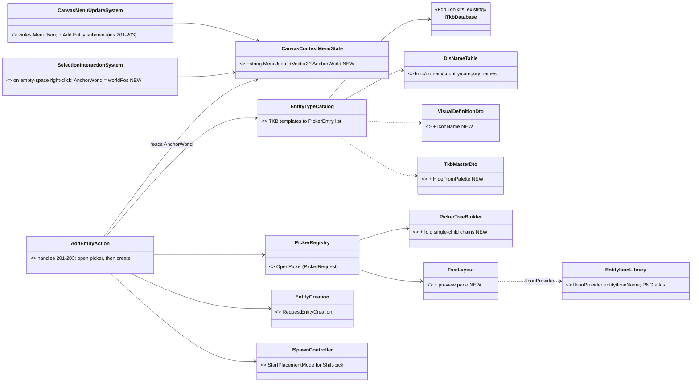
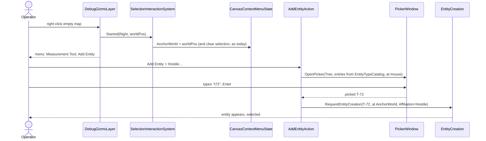
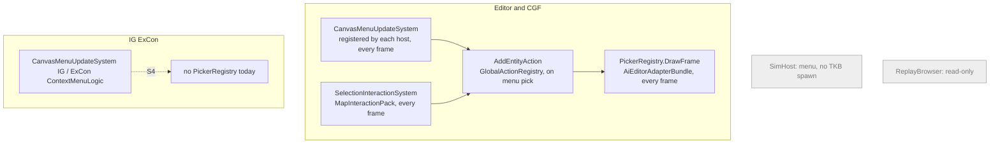

<!--STATUS
state: LIVE
updated: 2026-10-07
build-state: DESIGN (leans awaiting user approval — §2)
current-answer: §2 decisions · §3 diagrams · §5 slices
stale-below: nothing
known-rot: none yet
known-conflict: canvas-context-menu-design.md §5.6 — a canvas menu action carries no position; this design adds the
  clicked point (§2 D4) without changing the action shape.
related-designs:
  - designs/gizmos-1/canvas-context-menu-design.md — owns HOW the empty-map menu is built (JSON in
    CanvasContextMenuState, per-subsystem CanvasMenuUpdateSystem). This doc adds one item and the clicked point.
  - DESIGN_Entity_Authoring_Surface.md — owns THE creation call (RequestEntityCreation) and §5b "the request is sent
    per host". This doc only chooses the type and the point, then calls it.
  - DESIGN_Entity_Creation_Unification.md — owns the creation pipeline every host runs (EntityCreationPack).
  - designs/main-toolbar-1/ASSET-PICKER-UX-DESIGN.md — owns the rule "adopt NodeEdit's PickerWindow (Tree layout), build
    no parallel picker" and DEC-14/15 (icons by IconKey; open with OpenPicker). This doc reuses both.
  - designs/tkb-1/DESIGN.md — owns the TKB schema; this doc adds ONE field (VisualDefinitionDto.IconName, §2 D3).
  - UX/UX_Feature_Tool_Model.md — owns the placement tool (EntityPlacementGizmo, "Spawn" armed with no target); D5
    keeps it for repeated placement.
  - UX/UX_Issues.md#uxi-12 — "Spawn UI ×4"; this picker is the shared type chooser that issue needs (slice S4).
-->

# Add Entity — the map's "create here" picker *(CE-1017)*

> 🔒 **User, `2026-10-06/07`:** *"Empty map context menu now shows just 'Measurement Tool'. It should show 'Add Entity'
> which should open the generic picker filled with entity types, grouped by hierarchical entity category using DIS
> Entity Type categorization (Kind → Country → Category etc.)"* · *"This should feel intuitive to the user. Good
> grouping, incremental filter, ideally also entity 3D model icon (TKB defines icon name, assumes some new icon library
> dedicated for entities)."*

## 1. What exists — the measured basis

### INVENTORY *(codebase-memory graph + grep, `2026-10-07`)*

| query | total | what it found |
|---|---:|---|
| `search_graph name_pattern=".*(Picker\|Spawn\|Placement).*" label=Interface` | 7 | `IPickerSource<T>`, `IPickerRegistry`, `IPickerRenderContext` (NodeEditor.Core) · `IPickerSourceAdapter` · `IPickerListSource` · `ISpatialPickerContext` · **`ISpawnController`** |
| `search_graph ".*(Spawn\|Placement\|EntityType\|Tkb).*(Panel\|Window\|Picker\|…)"` label=Class | 10 | **`SpawnerPanel`** (Editor, CGF, ExCon) · `SimHostSpawnPanel` · `ExConSpawnerWindow` · `SpawnerPanelWindow` · tests |
| `search_graph ".*Picker.*"` label=Class (paged) | 107 (≈35 non-test) | one real picker window: **`PickerWindow`** (NodeEditor.UI); sources: node/variable/type/asset/recipe/terrain; combos elsewhere |
| `search_graph ".*Icon.*"` label=Class | 50 | `IIconProvider`/`IconHandle`, `IconAtlas`, `SilkIconProvider`, `MenuIconRenderer`, `IconsFontAwesome6`, `MilStd2525Renderer` (placeholder shapes) — **no entity icon library, no thumbnail renderer** |
| `search_graph "TkbCatalogEntry\|.*TkbCatalog.*"` | 13 | `NedTkbCatalog`, `UrbanCombatTkbCatalog` (the real types, in C#) · `TkbCatalogEntry(TkbId, Name)` |

### Claim table — what this design rests on

| claim | code — how it IS | design — how it was MEANT |
|---|---|---|
| the empty-map menu has one item, built in one live place | ✅ `CanvasMenuUpdateSystem.cs:26` writes `[{"id":200,"label":"Measurement Tool"}]` each frame; `SharedContextMenuPopulator.PopulateEmptyMapMenu` (`:70`) has **no production caller** | ✅ `canvas-context-menu-design.md` L96: *"Place Entity for the editor can be added later without changing the architecture"* |
| the menu action carries no clicked point | ✅ `GizmoMenuActionEvent{AnchorId, ActionId}` → `GlobalActionHandler(view, Entity)` | ✅ same doc §5.6 (canvas target = `Entity.Null`); ⛔ no doc discusses a position |
| …but the point is already delivered, to selection | ✅ empty-space right-click emits `Started` with `worldPos3` + `MapMouseButton.Right` (`GizmoMap.Presentation/Layers/DebugGizmoLayer.cs`, empty-space branch of the right-click handler), consumed by `SelectionInteractionSystem` | ✅ `UX_Feature_Selection.md` §2.3 (empty-space clear) |
| the spawn type lists are hand-written, not the TKB | ✅ `ScenarioSpawnerCatalog.Default` (14 entries) and ExCon's own 9-entry array (`ExConSubsystem.cs:501`) | ⭐ `UXR-83`: *"No shared UI role has two implementations… spawn UI has four"* |
| one generic picker exists, with tree + fuzzy filter + icons | ✅ `PickerWindow` + `PickerEntry(Id, Name, Description, Category "A/B/C", Keywords, IconTextureId, Tag, IconKey, IsEnabled)`; `PickerTreeBuilder` splits `Category` into folders; fuzzy tiers + highlights; Recent/Favourites (in-memory) | ✅ `ASSET-PICKER-UX-DESIGN.md` D1 *"Adopt NodeEdit's picker (PickerLayout.Tree); do NOT build a parallel picker"* |
| the Tree layout has no preview pane and does not fold single-child folders | ✅ `Layouts/TreeLayout.cs` (Description only as a disabled-row tooltip, `:332`); Grid has an 80 px detail strip | ⛔ searched, none found |
| the shared map library can reach `PickerWindow` | ⛔ **not today**: only `Hrot.Editor.AiShared`/`Blueprints`/`BTree`/`Hsm` editors reference `NodeEditor.UI`; ✅ but `NodeEditor.UI` depends only on `NodeEditor.Core` + ImGui.NET, so `Hrot.Presentation` may reference it with no cycle | ⛔ searched, none found |
| DIS data is too thin to group by on its own | ✅ `BdcTkbCatalog.cs:56-237`: Country **0** on every type; platoons are Kind 1/Domain 1 like tanks; `UrbanCombatTkbCatalog` sets **no** DisType; the JSON loader never copies `TkbMaster.DisType` into `template.DisType` | ✅ `tkb-1/DESIGN.md` L313 `GetEntitiesByCategory` *"for editor tree building"* (`CategoryPath`) |
| no DIS name table exists | ✅ names only in comments (`DISEntityType.cs:14-15`) | ⛔ searched `docs/`+`.dev/`, none found |
| no icon field, no entity icon library | ✅ `VisualDefinitionDto{SymbolCode, ModelPath, ColorHex, Scale, ShowLabel, MapShapeName}`; no thumbnail code anywhere | ⛔ only `tkb-design-ideas.md` L1299 (a model browser *idea*) |
| creation ends in one call | ✅ `EntityCreation.RequestEntityCreation` (`EntityCreation.cs:183`) — today **only the debug API** calls it; `ScenarioSpawnAdapter` builds `EntityCreationRequest` itself | ✅ `DESIGN_Entity_Authoring_Surface.md` (one method; §5b per-host send) |
| the spawner already asks for force | ✅ `SpawnerPanel` Friend/Hostile radio → `{Affiliation}` JSON; `eForceIdentifier {UNKNOWN, FRIENDLY, OPPOSING, NEUTRAL}` | ⛔ no design rule on default force |

## 2. Decisions *(each with a lean — reply "approved" or name the one to change)*

| # | decision | ⭐ lean | rejected (one line each) |
|---|---|---|---|
| **D1** | which picker | ⭐ **`PickerWindow`, Tree layout**, opened at the mouse; `Hrot.Presentation` gains a reference to `NodeEditor.UI`; the host's ONE `PickerRegistry` is reused | a new popup — rule D1 of the asset picker forbids it · a host-side `IEntityTypePicker` seam — adds an interface only because a project reference is missing |
| **D2** | grouping | ⭐ **`Category` path from DIS names, skipping unknown (0) levels**: `Platform / Land / Tank`, `Lifeform / Land / Infantry`; composite units go under a top-level **`Units`** folder (detected by their composition, since their DIS is just Kind 1/Domain 1); a type with no DisType falls back to its `CategoryPath`, then `Other`. **Single-child folder chains fold into one row** (`Platform › Land` when Land is the only domain) — a generic `PickerTreeBuilder` option | raw DIS order with every level — today every country is 0, so the tree would be *"Country 0"* five levels deep · group by `CategoryPath` only — empty for the code-built types |
| **D2b** | DIS names | ⭐ a small **data table** (SISO-REF-010 subset: kinds incl. HROT's extended kinds, domains per kind, the countries we use, land/air/sea platform + lifeform categories); an unknown number shows as `Category 7`, never hides the type | names in code `switch`es — rots silently |
| **D3** | icons | ⭐ new field **`VisualDefinitionDto.IconName`**; new **`EntityIconLibrary`** loads `Assets/EntityIcons/<IconName>.png` (64×64, transparent) into one atlas at startup and answers `IIconProvider` keys `entity/<IconName>`; fallback chain **IconName → a generic glyph per DIS kind/domain** (tank, wheeled, person, aircraft, ship) **→ none** | derive from `ModelPath` at runtime — needs an offscreen 3D renderer in every host · 2525 symbols — `MilStd2525Renderer` is a placeholder, and symbols are not what the user asked for |
| **D3b** | 3D thumbnails | ⭐ **offline**: a later tool renders each `ModelPath` to `<IconName>.png` (Stride); v1 ships hand-made/placeholder PNGs for the built-in types | live render in the picker — cost and a renderer dependency for a 16 px icon |
| **D3c** | where the big icon shows | ⭐ **Tree layout gains an optional preview pane** (generic): 64 px icon + name + DIS string + description; the row keeps a line-height icon | rows at 64 px — 5 visible rows, defeats browsing |
| **D4** | where the entity lands | ⭐ **at the right-clicked point, immediately** (heading 0), then it is **selected**. The point: `SelectionInteractionSystem` already receives the empty-space right-click with `worldPos`; it records it in **`CanvasContextMenuState.AnchorWorld`** when it consumes that event; the Add Entity handler reads it | arm the placement tool after picking — the user already said *where* |
| **D5** | placing several | ⭐ **Shift+Enter / Shift+double-click** on the picked type arms the existing placement tool (`StartPlacementMode`) instead — click to drop, Esc ends | a "count" field — the user places, not counts |
| **D6** | force (side) | ⭐ the menu item is a **submenu: `Add Entity ▸ Friendly… / Hostile… / Neutral…`**; the picker title says which; the force goes in the creation request as today's `{Affiliation}` | a toggle inside the picker — `PickerWindow` has no header controls · a TKB default force — a T-72 is not hostile in every exercise |
| **D7** | which types are listed | ⭐ **built from the TKB** (`ITkbDatabase` templates) — a template is listed when it carries a `TkbMasterDto` (so tactical graphics and terrain zones, which have their own tools, drop out), minus an explicit opt-out **`TkbMasterDto.HideFromPalette`** (sensor children, internal parts). Replaces `ScenarioSpawnerCatalog.Default` | keep the hand-written lists — they already disagree (14 vs 9) and list `Infantry_Officer`, which has **no template** |
| **D8** | search | ⭐ the picker's fuzzy match over `Category/Name` + **keywords = DIS numbers, DIS names, `CustomName`, model name** — typing *"tank"*, *"usa"* or *"1.1.225"* all work; Recent shows first (already built) | substring on name only (today's SpawnerPanel) |
| **D9** | which hosts | ⭐ **Editor and CGF first** (both run `ScenarioSpawnAdapter` and already own a `PickerRegistry`); IG and ExCon in S4 with UXI-12; SimHost and ReplayBrowser never (no TKB spawn / read-only) | all hosts at once — IG creation is commanded by ExCon (`CMD_PLACE_ENTITY`), a different send path (§5b) |
| **D10** | creation call | ⭐ **`EntityCreation.RequestEntityCreation`** (its first UI caller), owner per host as §5b rules | another hand-built `EntityCreationRequest` — the fifth path |

## 3. Diagrams

*What it shows:* three new classes and four small extensions; every other box already exists. The catalog is the one
place TKB data becomes picker rows — the same catalog later feeds `SpawnerPanel` (S4).

*What it shows:* the point is captured by the system that ALREADY handles that right-click — no new input path.

*What it shows:* who runs each piece every frame. IG and ExCon have the menu but no `PickerRegistry` — they join in S4;
SimHost and ReplayBrowser (grey) never get the item.

## 4. Open questions *(beyond the leans)*

1. **D3b thumbnails** — do you want the offline render tool now (S5), or are hand-made PNGs fine to start?
2. **D6** — is *Unknown* needed as a fourth force in the submenu?
3. **D4** — should a ground entity snap to the terrain height at the point (yes, via the existing terrain query), and
   should heading default to north or to the camera's up?

## 5. Slices

| slice | content | depends |
|---|---|---|
| **S0 data** | fill DisType (incl. country) on the 15 built-in templates; JSON loader copies `TkbMaster.DisType`; add `IconName`, `HideFromPalette`; `DisNameTable` | — |
| **S1 picker** | `EntityTypeCatalog` + D2 fold + D3c preview pane + D8 keywords; `Hrot.Presentation` → `NodeEditor.UI` | S0 |
| **S2 menu** | Add Entity submenu, `AnchorWorld`, `AddEntityAction` → `RequestEntityCreation`, select new entity, Shift = placement tool; Editor + CGF | S1 |
| **S3 icons** | `EntityIconLibrary` + fallback glyphs + PNGs for the built-in types | S1 |
| **S4 one spawn chooser** | `SpawnerPanel` uses the same picker + catalog; retire `ScenarioSpawnerCatalog.Default` and ExCon's array; IG/ExCon get the menu (UXI-12) | S2 |
| **S5 thumbnails** | offline tool: render `ModelPath` → `EntityIcons/<IconName>.png` | S3 |

Acceptance (S2): right-click empty map → *Add Entity ▸ Hostile…* → type `t7` → Enter ⇒ a hostile T-72 exists at the
clicked point, selected, and Delete removes it; the picker shows `Platform › Land › Tank › T-72` with an icon.
