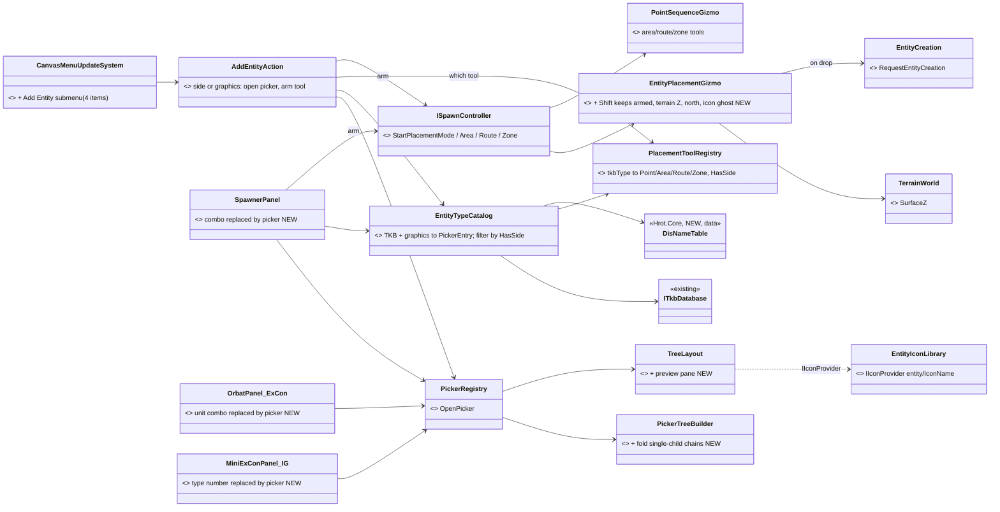
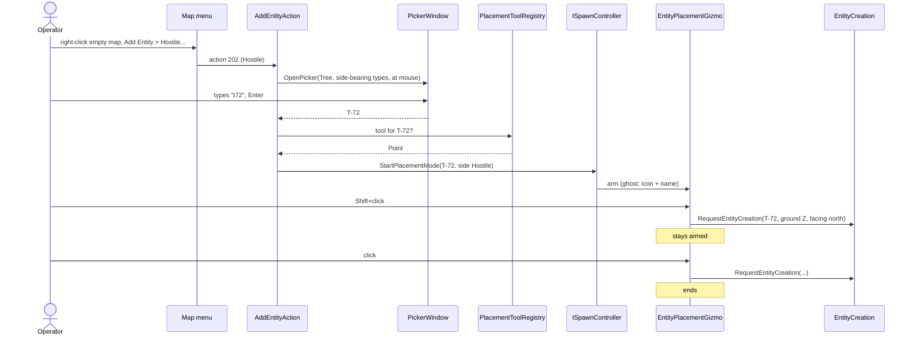
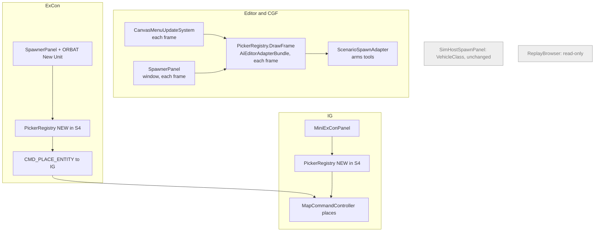

<!--STATUS
state: LIVE
updated: 2026-10-07 (rev 5 — level 0 is always the ground; Stride deferred as CE-1030, §2c)
build-state: READY-TO-BUILD — approved by the user 2026-10-07 (all leans, §2–§2c); CE-1031 is the terrain owner's follow-up
current-answer: §2 decisions (rev 2) AS AMENDED BY §2a (rev 3) AND §2b (rev 4) AND §2c (rev 5); the later section wins where they differ · §3 diagrams · §5 slices
stale-below: "## ⛔ HISTORY" — the rev-1 leans D4/D5/D6/D9 (create at the clicked point, Shift = tool, force-only
  submenu, spawn panels retired). Do NOT quote them.
known-rot: none yet
known-conflict: none — rev 1's conflict with canvas-context-menu-design.md §5.6 (no clicked point) is gone: rev 2 always
  arms a placement tool, so the menu action needs no position.
related-designs:
  - DESIGN_Building_Interiors.md — resolves CE-1031 (ground inside buildings); storeys become levels through SurfacesAt
  - designs/gizmos-1/canvas-context-menu-design.md — owns HOW the empty-map menu is built (JSON in
    CanvasContextMenuState, per-subsystem CanvasMenuUpdateSystem). This doc adds the "Add Entity" submenu.
  - DESIGN_Entity_Authoring_Surface.md — owns THE creation call (RequestEntityCreation) and §5b "the request is sent
    per host". This doc chooses the type and arms the tool; the tool's drop calls it.
  - DESIGN_Entity_Creation_Unification.md — owns the creation pipeline every host runs (EntityCreationPack).
  - designs/main-toolbar-1/ASSET-PICKER-UX-DESIGN.md — owns "adopt NodeEdit's PickerWindow (Tree layout), build no
    parallel picker" and DEC-14/15 (icons by IconKey; open with OpenPicker). Reused.
  - designs/tkb-1/DESIGN.md — owns the TKB schema; this doc adds VisualDefinitionDto.IconName and
    TkbMasterDto.HideFromPalette.
  - UX/UX_Feature_Tool_Model.md — owns the placement tools (EntityPlacementGizmo; area/route/zone PointSequenceGizmo).
    This doc makes every pick arm one of them and adds Shift multi-placement, terrain snap and north heading.
  - UX/UX_Issues.md#uxi-12 — "Spawn UI ×4"; the spawn panels STAY and call this picker (slice S4).
  - DESIGN_Terrain_World.md §7 W8 — owns "no ground clamp; the movement model sets Z = SurfaceZ(x, y, zHint = current Z)"
    (user ruling). §2a here only chooses an entity's BIRTH Z / level; it adds no clamp step.
  - DESIGN_Node_Roles_And_Policies.md — owns the role list (Map2D = IG only) and R-138/R-140; §2a D9 gates on capabilities.
  - blueprints/Blueprint_Issues_Tracker.md CE-1024 — the named geopoint; a "Map Graphics" point type when it exists.
-->

# Add Entity — one grouped type picker, always followed by a placement tool *(CE-1017)*

> 🔒 **User, `2026-10-06/07`:** *"Empty map context menu now shows just 'Measurement Tool'. It should show 'Add Entity'
> which should open the generic picker filled with entity types, grouped by hierarchical entity category using DIS
> Entity Type categorization (Kind → Country → Category etc.)"* · *"This should feel intuitive to the user. Good
> grouping, incremental filter, ideally also entity 3D model icon (TKB defines icon name, assumes some new icon library
> dedicated for entities)."*
>
> 🔒 **Rulings, `2026-10-07`:** *"hand-made PNGs first, snap to terrain. Facing North. No unknown side. Existing spawn
> panels should not go away. They just should call the new grouping picker instead of showing plain selector popup.
> Grouping should include special area entities and map symbol entities. Some entity kinds like the areas need their
> own placement tool started when that kind of entity selected (independently on clicked point). Likely unifying that to
> always call a placement tool instead of immediately placing the entity? The placement tool could then easily allow for
> multi-placement if shift is pressed when click placing. Some of those entities like areas also do not have any concept
> of hostile or friendly or neutral, so they might need extra submenu."*

## 1. What exists — the measured basis

### INVENTORY *(codebase-memory graph + grep, `2026-10-07`)*

| query | total | what it found |
|---|---:|---|
| `search_graph name_pattern=".*(Picker\|Spawn\|Placement).*" label=Interface` | 7 | `IPickerSource<T>`, `IPickerRegistry`, `IPickerRenderContext` (NodeEditor.Core) · `IPickerSourceAdapter` · `IPickerListSource` · `ISpatialPickerContext` · **`ISpawnController`** |
| `search_graph ".*(Spawn\|Placement\|EntityType\|Tkb).*(Panel\|Window\|Picker\|…)"` label=Class | 10 | **`SpawnerPanel`** (Editor, CGF, ExCon) · `SimHostSpawnPanel` · `ExConSpawnerWindow` · `SpawnerPanelWindow` · tests |
| `search_graph ".*Picker.*"` label=Class (paged) | 107 (≈35 non-test) | one real picker window: **`PickerWindow`** (NodeEditor.UI); sources: node/variable/type/asset/recipe/terrain; combos elsewhere |
| `search_graph ".*Icon.*"` label=Class | 50 | `IIconProvider`/`IconHandle`, `IconAtlas`, `SilkIconProvider`, `MenuIconRenderer`, `IconsFontAwesome6`, `MilStd2525Renderer` (placeholder shapes) — **no entity icon library, no thumbnail renderer** |
| `search_graph "TkbCatalogEntry\|.*TkbCatalog.*"` | 13 | `NedTkbCatalog`, `UrbanCombatTkbCatalog` (the real types, in C#) · `TkbCatalogEntry(TkbId, Name)` |

### Claim table — what this design rests on

| claim | code — how it IS | design — how it was MEANT |
|---|---|---|
| the empty-map menu has one item, built in one live place | ✅ `CanvasMenuUpdateSystem.cs:26` writes `[{"id":200,"label":"Measurement Tool"}]` each frame; `SharedContextMenuPopulator.PopulateEmptyMapMenu` (`:70`) has **no production caller** | ✅ `canvas-context-menu-design.md` L96: *"Place Entity for the editor can be added later without changing the architecture"* |
| the menu action carries no clicked point | ✅ `GizmoMenuActionEvent{AnchorId, ActionId}` → `GlobalActionHandler(view, Entity)` | ✅ same doc §5.6 (canvas target = `Entity.Null`); ⛔ no doc discusses a position |
| …but the point is already delivered, to selection | ✅ empty-space right-click emits `Started` with `worldPos3` + `MapMouseButton.Right` (`GizmoMap.Presentation/Layers/DebugGizmoLayer.cs`, empty-space branch of the right-click handler), consumed by `SelectionInteractionSystem` | ✅ `UX_Feature_Selection.md` §2.3 (empty-space clear) |
| the spawn type lists are hand-written, not the TKB | ✅ `ScenarioSpawnerCatalog.Default` (14 entries) and ExCon's own 9-entry array (`ExConSubsystem.cs:501`) | ⭐ `UXR-83`: *"No shared UI role has two implementations… spawn UI has four"* |
| one generic picker exists, with tree + fuzzy filter + icons | ✅ `PickerWindow` + `PickerEntry(Id, Name, Description, Category "A/B/C", Keywords, IconTextureId, Tag, IconKey, IsEnabled)`; `PickerTreeBuilder` splits `Category` into folders; fuzzy tiers + highlights; Recent/Favourites (in-memory) | ✅ `ASSET-PICKER-UX-DESIGN.md` D1 *"Adopt NodeEdit's picker (PickerLayout.Tree); do NOT build a parallel picker"* |
| the Tree layout has no preview pane and does not fold single-child folders | ✅ `Layouts/TreeLayout.cs` (Description only as a disabled-row tooltip, `:332`); Grid has an 80 px detail strip | ⛔ searched, none found |
| the shared map library can reach `PickerWindow` | ⛔ **not today**: only `Hrot.Editor.AiShared`/`Blueprints`/`BTree`/`Hsm` editors reference `NodeEditor.UI`; ✅ but `NodeEditor.UI` depends only on `NodeEditor.Core` + ImGui.NET, so `Hrot.Presentation` may reference it with no cycle | ⛔ searched, none found |
| DIS data is too thin to group by on its own | ✅ `BdcTkbCatalog.cs:56-237`: Country **0** on every type; platoons are Kind 1/Domain 1 like tanks; `UrbanCombatTkbCatalog` sets **no** DisType; the JSON loader never copies `TkbMaster.DisType` into `template.DisType` | ✅ `tkb-1/DESIGN.md` L313 `GetEntitiesByCategory` *"for editor tree building"* (`CategoryPath`) |
| no DIS name table exists | ✅ names only in comments (`DISEntityType.cs:14-15`) | ⛔ searched `docs/`+`.dev/`, none found |
| no icon field, no entity icon library | ✅ `VisualDefinitionDto{SymbolCode, ModelPath, ColorHex, Scale, ShowLabel, MapShapeName}`; no thumbnail code anywhere | ⛔ only `tkb-design-ideas.md` L1299 (a model browser *idea*) |
| creation ends in one call | ✅ `EntityCreation.RequestEntityCreation` (`EntityCreation.cs:183`) — today **only the debug API** calls it; `ScenarioSpawnAdapter` builds `EntityCreationRequest` itself | ✅ `DESIGN_Entity_Authoring_Surface.md` (one method; §5b per-host send) |
| the spawner already asks for force | ✅ `SpawnerPanel` Friend/Hostile radio → `{Affiliation}` JSON; `eForceIdentifier {UNKNOWN, FRIENDLY, OPPOSING, NEUTRAL}` | ⛔ no design rule on default force |
| **rev 2** — placement faces EAST today, not north | ✅ `EntityPlacementGizmo.cs:217` `Rotation = Quaternion.Identity`; `SimTransform` (`SimComponents.cs:25-27`): *"yaw: 0=X axis direction (east), +90=Y axis direction (north)"* ⇒ north = yaw +90° about Z | ⛔ searched, none found |
| **rev 2** — placement does not snap to terrain | ✅ `EntityPlacementGizmo.cs:216` `Position = (x, y, 0f)`; `TerrainWorld.SurfaceZ(x, y, zHint)` exists (`TerrainWorld.cs:98`) and the loaded terrain is an ECS managed singleton (`TerrainResidency.cs:256`) — no Hrot production caller of `SurfaceZ` yet | ✅ `DESIGN_Terrain_World.md` (the surface query) |
| **rev 2** — Shift+click does nothing today | ✅ `EntityPlacementGizmo.OnMouseEvent` tests `button == MapMouseButton.Left` exactly, and a Shift click carries `MapMouseButton.ShiftMask` (`MapMouseButton.cs:12`) ⇒ no match; `autoPopOnPlace` removes the tool after one drop (`:157`) | ⛔ searched, none found |
| **rev 2** — areas, routes and zones have their own tools | ✅ `ScenarioSpawnAdapter.StartAreaAuthoringMode` / `StartRouteAuthoringMode` / `StartZoneAuthoringMode` → `PointSequenceGizmo` (`ScenarioSpawnAdapter.cs:29-30,279`); `AreaAuthoringArm`. **`TacGraphic_FireLine` (8801) has no template and no tool** | ✅ `ISpawnController` doc (zone = same mechanism as area, `TkbType` is the discriminator) |
| **rev 2** — the spawn panels that choose a TKB type | ✅ `SpawnerPanel` combo (Editor, CGF, ExCon) · ExCon ORBAT "Unit Type" combo (`OrbatPanel.cs:355,370`) · IG `MiniExConPanel` typed numeric "TKB Type" field (`:85-128`). `SimHostSpawnPanel` picks a `VehicleClass`, **not** a TKB type ⇒ out of scope | ✅ `UXI-12` (four spawn UIs) |

## 2. Decisions — rev 2 *(user rulings applied; leans marked ⭐ await "approved")*

| # | decision | ⭐ lean / 🔒 ruling | rejected (one line each) |
|---|---|---|---|
| **D1** | which picker | ⭐ **`PickerWindow`, Tree layout**, opened at the mouse; `Hrot.Presentation` references `NodeEditor.UI` (it depends only on `NodeEditor.Core` + ImGui.NET — no cycle); each host runs ONE `PickerRegistry` | a new popup — the asset-picker rule forbids it · a host-side picker interface — exists only to dodge a project reference |
| **D2** | grouping | ⭐ `Category` = **DIS names, unknown (0) levels skipped**, single-child chains **folded** into one row (generic `PickerTreeBuilder` option); composite units under **`Units`**; 🔒 **map graphics included** under **`Map Graphics`** — `Area`, `Route`, `Terrain Zone`, `Fire Line` (shown **disabled**, *"no placement tool yet"*), and point symbols (`Points`, e.g. the named geopoint `CE-1024`); no DIS ⇒ `CategoryPath` ⇒ `Other` | raw DIS levels — every country is 0 today, so the tree would read *"Country 0"* |
| **D2b** | DIS names | ⭐ a data table (SISO-REF-010 subset + HROT's extended kinds); unknown numbers show as `Category 7` | names in code `switch`es — rot silently |
| **D3** | icons | 🔒 **hand-made PNGs first**: `VisualDefinitionDto.IconName` → `Assets/EntityIcons/<IconName>.png` (64×64) packed by **`EntityIconLibrary`** into one atlas, `IIconProvider` keys `entity/<IconName>`; fallback **IconName → generic glyph per DIS kind/domain or graphic kind → none** | runtime 3D render — a renderer in every host for a 16 px icon · 2525 symbols — the renderer is a placeholder |
| **D3c** | big icon | ⭐ Tree layout gains an optional **preview pane** (64 px icon, name, DIS string, description); rows keep a line-height icon | 64 px rows — five visible rows |
| **D4** | what a pick does | 🔒 **always arms a placement tool — never creates directly**, independent of the clicked point. The tool comes from the type's **`PlacementTool`**: `Point` (`EntityPlacementGizmo`) by default; `Area`, `Route`, `Zone` (the existing `PointSequenceGizmo` tools) for those graphics — a small **`PlacementToolRegistry`** keyed by TKB type in `Hrot.Presentation` | create at the right-clicked point (rev 1) — areas cannot be created that way, and two behaviours confuse · a TKB field for the tool — tools are editor UI, the TKB is shared sim data |
| **D5** | multi-placement | 🔒 **Shift+click drops and keeps the tool armed**; a plain click drops and ends it; Esc or right-click ends. ⭐ The ghost shows the type's icon + name (today a numeric `tkbType` label). Area/route/zone tools keep their current finish-then-end behaviour in v1 | a "count" field — the user places, not counts |
| **D6** | sides | 🔒 **no Unknown.** ⭐ Menu: **`Add Entity ▸ Friendly… · Hostile… · Neutral… · ─ · Map Graphics…`**. The three side items open the picker filtered to side-bearing types and pass the side to the tool; **`Map Graphics…`** opens it filtered to side-less types. `HasSide` comes from `PlacementToolRegistry` (graphics and point symbols: false; everything else: true) | a side toggle in the picker — `PickerWindow` has no header controls · one picker with a per-row side question — a second dialog after every pick |
| **D6b** | landing pose | 🔒 **snap to terrain, face north**: `Z = TerrainWorld.SurfaceZ(x, y, zHint: 0)` when the terrain singleton exists (ground under decks; lowest surface inside a footprint), else 0; `Rotation` = yaw **+90°** about Z (the transform's yaw 0 is EAST). Applies to every point placement, the spawn panels' included | `Quaternion.Identity` — measured to face east |
| **D7** | which types | ⭐ **built from the TKB**: templates carrying a `TkbMasterDto`, minus **`TkbMasterDto.HideFromPalette`** (sensor children, internal parts), **plus** the `PlacementToolRegistry` graphics (they carry no master). Replaces the two hand-written catalogs | keep the hand-written lists — they disagree (14 vs 9) and list `Infantry_Officer`, which has no template |
| **D8** | search | ⭐ fuzzy match over `Category/Name` + keywords (DIS numbers and names, `CustomName`, model name); Recent first | name substring (today's panel) |
| **D9** | where the picker is used | 🔒 **the spawn panels stay and call this picker** instead of their combos: `SpawnerPanel` (Editor, CGF, ExCon — its side radio gains *Neutral*, its Draw Area/Route/Zone buttons stay), ExCon ORBAT *New Unit* (opened rooted at `Units`), IG `MiniExConPanel` (replaces the typed number). ⭐ The map menu ships on **Editor + CGF** first; ExCon and IG gain a `PickerRegistry` for their panels. `SimHostSpawnPanel` picks a `VehicleClass`, not a TKB type — unchanged | retire the panels (rev 1) — overruled |
| **D10** | the create call | ⭐ the point tool's drop goes through `ScenarioSpawnAdapter` → **`EntityCreation.RequestEntityCreation`** (its first UI caller); ExCon's send path (`CMD_PLACE_ENTITY` → IG) is unchanged, per `DESIGN_Entity_Authoring_Surface.md` §5b | a fifth hand-built `EntityCreationRequest` |

## 2a. Rev 3 — rulings of `2026-10-07` (2nd round) and the ground-placement discussion

> 🔒 **User:** *"if we press Shift during placement it needs to change the symbol … Alternatively we could keep the
> placement mode of the usual single-click-to-place entities always in multi-placement with right/ESC to cancel"* ·
> *"How the snap to terrain works in case of multi-story buildings and multi-level grounds? lean: highest surface for
> now, later … 'move to height level' … The ground-clamping is likely not done on the issuer side … but as part of entity
> spawn process on the node owning the entity … the spawn request should somehow also contain the request for
> ground-clamping (… the height level index …) and ignoring the height coordinate provided"* · *"Add Entity menu should
> be available on any Map2d role host which has enough information available"* · *"By map symbol entities I meant any
> kind of tactical graphics (overlays) that are drawn by the map. named GeoPoint is similar kind."* · *"Areas, routes and
> zones should not support multi-placement mode, only 'physical' entities (platform) should."*

### Claim table — ground placement *(measured `2026-10-07`)*

| claim | code — how it IS | design — how it was MEANT |
|---|---|---|
| nothing clamps at spawn | ✅ `CreateEntityRequestSystem.cs:260-266` takes the `SimTransform` as given; SimHost spawners hard-code Z=0 (`SimHostScenarioManager.cs:105,154,…`) | ✅ `DESIGN_Terrain_World.md` W8 *"no ground clamp … spawns at Z=0 settle on the first movement tick"* |
| the movement model is the only runtime Z writer, and it keeps the CURRENT level | ✅ `CarKinematicsSystem.cs:303-310` `z = SurfaceZ(x, y, tf.Position.Z)`; `SurfaceZ` takes the highest surface ≤ `zHint + 0.6 m`, else the lowest (`TerrainWorld.cs:90-130`) | ✅ W8 + user ruling (Terrain_World §7): *"entity movement model clamps them to ground height or on top of building or to building floor"* |
| ⇒ the birth Z SELECTS the level the entity then keeps | ✅ follows from the two rows above (zHint = current Z) | ⛔ no doc says it — this is the gap |
| entities without a movement model never settle | ✅ only `CarKinematicsSystem` writes Z; `LinearKinematics` was not built | ⚠ W8 lists `LinearKinematicsSystem` as intended |
| no "levels at (x,y)" API | ✅ the per-candidate loop is private inside `SurfaceZ`; inputs public (`Prisms`, `Walkables`, `GroundZ`) | ⛔ searched, none found |
| the request has room for a level intent | ✅ `EntityCreationRequest.InitialComponents` / `InitialAttributesJson`; wire `CreateEntityRequest.Flags` uses bit 0 only (`GenericMessages.cs:158-193`); ⛔ no field today | ⛔ searched, none found |
| every ECS map host has terrain | ✅ `RoleLoadRequirements.UniversalParts = {KnowledgeBase, Terrain}` (`:39`) — Editor, CGF, IG, SimHost load it; ExCon (not ECS) does not, and places through an IG (`CMD_PLACE_ENTITY`) | ✅ Terrain_World W3 *"the world becomes a universal load part"* |
| `Map2D` is IG's role only | ✅ `NodeRole.Map2D` passed only by `IgApplication.cs:1034`/`IgNodeBootstrapper`; Editor, CGF, SimHost draw a map without it | ✅ `DESIGN_Node_Roles_And_Policies.md:112` *"presentation only, no simulation logic"*; `DESIGN_Stride_Node_Modes.md` §6.3 *"the 2-D map is a surface, not a node role"* |

### Rev-3 decisions

| # | decision | ⭐ lean / 🔒 ruling | rejected (one line each) |
|---|---|---|---|
| **D2 (amended)** | map graphics | 🔒 **"map symbol entities" = every tactical graphic (overlay) the map draws** + the named GeoPoint; all side-less, all under `Map Graphics` | point symbols only (rev 2's reading) |
| **D5 (rev 3)** | multi-placement | 🔒 **physical entities only; areas, routes, zones single.** 🔒 **APPROVED `2026-10-07`: always multi** for physical entities: each click places, **right-click / Esc ends**; a cursor hint reads *"click: place · right-click/Esc: done"* | Shift-to-continue + a "+" badge — a modifier the user must discover and hold; always-multi costs at most one Esc |
| **D6b (rev 3)** | birth height | ⭐ **the request carries a LEVEL INTENT and the CREATING node resolves it** (your proposal): an optional `SurfacePlacement { Level = Top \| Index n (0 = lowest) }` rides in the request; the node that runs `CreateEntityRequestSystem` for it resolves `Z` from its own `TerrainWorld` and **ignores the sent Z**; with no terrain it keeps the sent Z. Default for Add Entity: **`Top`** (highest surface — your lean). New **`TerrainWorld.SurfacesAt(x, y)`** → ordered levels (ground, slabs, roofs) shared by the resolver, the ghost preview and later "move to level" | issuer resolves Z — works for today's map hosts (all have terrain), but not for issuers without terrain (MCP/debug API lat-lon spawns, `CreateEntityCommand` whose `Altitude` has no reference, hand-written scenarios) and it splits the level vocabulary from "move to level", which MUST run on the owner · a continuous clamp step — contradicts W8 (a second writer of `Position`) |
| **D6c** | "move to level" (later) | ⭐ an owner-routed entity command `MoveToSurfaceLevel(n)` using `SurfacesAt`, offered in the entity's Details as a list *"Ground 0.0 m · Deck 1 3.2 m · Roof 9.6 m"*; the movement model then keeps it there (zHint = new Z) | a free Z field — the user wants floors, not metres |
| **D9 (rev 3)** | which hosts | 🔒 **APPROVED `2026-10-07`: gate on CAPABILITY, not the `Map2D` bit** (only IG holds it): offer Add Entity where the host has TKB + terrain + the creation pack + the shared spawn adapter + a `PickerRegistry` — **Editor, CGF, Stride mode 1 now**; **IG** after it moves onto the shared adapter (Authoring Surface §5b.2 ①); **SimHost, Stride mode 2** after they get adapter + picker. Greyed with a reason in Preview (*"authoring is suspended"*, `ScenarioEditorState.OperatingPreview` — preview creations vanish on rewind) and while loading/saving. ExCon keeps its remote route through an IG | the literal `Map2D` role — would offer it on IG only and not on Editor/CGF |

⚠ **Two things this needs from the cluster, stated so they are not assumed:** an owner-0 request needs an arbiter
(CGF or Editor) in the cluster; a host without one should create with `owner = self`. And the wire slot for
`SurfacePlacement` is not chosen yet — `InitialComponents` needs a descriptor translator to cross the wire,
`InitialAttributesJson` does not; ⭐ lean **an attribute record**, measured in S2.

## 2b. Rev 4 — the level scheme, and every map host at once *(user, `2026-10-07`, 3rd round)*

> 🔒 **User:** *"specify the desired 'height level' as int 0=ground floor (good default, same as usual ground clamps),
> -1 = first underground, +1 = first above ground floor, whatever above existing floors is the 'put highest as
> possible', similarly also in underground direction … some special values for using given z-coordinate and let the
> motion model clamp and also for 'treat z-coordinate as height above the specified level'"* · *"SimHost/Stride needs
> the creation pipeline and the tools and the picker sooner, not later — there should be nothing preventing it, we
> should be unifying and sharing to high extents."*

📐 **What the terrain model allows** (`TerrainWorld.cs`): the ground is ONE flat plane `GroundZ`; `TerrainWalkable`
slabs and ramps carry their own Z, **above or below** `GroundZ`; a `TerrainPrism` (building, wall) is **solid** — its
roof is walkable, its interior is not, and the ground is not a surface inside its footprint (`SurfaceZ` skips
`GroundZ` when `insideSolid`); `Floors` is a label only in v1.

### D6b rev 4 — `SpawnHeight { Mode, Level }` *(supersedes rev 3's Top/Index)*

| field | values | meaning |
|---|---|---|
| `Level` *(int, default **0**)* | `0` | the **ground floor** at (x, y): the lowest surface at or above `GroundZ − StepHeight` — `GroundZ` in the open; inside a solid footprint that is the roof (the only surface there) |
| | `+n` | the n-th surface ABOVE the ground floor; past the top ⇒ the **highest** |
| | `−n` | the n-th surface BELOW the ground floor (basement slab, tunnel floor); past the bottom ⇒ the **lowest** |
| `Mode` | ⭐ **`OnLevel`** *(Add Entity's default)* | `Z = level surface`; the sent Z is **ignored** |
| | **`AboveLevel`** | `Z = level surface + sent Z` (a helicopter 50 m above the ground floor, a drone above a roof) |
| | **`Absolute`** *(when the field is absent — today's behaviour)* | the sent Z is used as is; the motion model clamps per W8 |

⭐ **Explicit `Mode` + `Level`, not magic `Level` values** — a reserved int (say `int.MinValue` for "absolute") reads
like a real level in logs and every reader must know the sentinel. ⭐ Surfaces closer than 0.3 m merge into one level
(a ramp foot meeting the ground is not a second level).

⚠ **`AboveLevel` only survives for entities whose motion model does not ground-clamp** — a car's `SurfaceZ(x, y,
zHint = current Z)` drops it back to the highest surface ≤ its Z + 0.6 m, i.e. the ground. That is W8 working as
ruled, not a defect; it is the mode for air platforms.

**One function serves everything:** `TerrainWorld.SurfacesAt(x, y) → float[]` (ascending, merged) plus
`ResolveLevel(x, y, level)` — used by the creating node, by the placement ghost (so the preview stands where the
entity will), and later by *"Move to level"* (D6c), whose list labels levels the same way (`0 Ground 0.0 m · +1 Deck
3.2 m · +2 Roof 9.6 m · −1 Basement −3.0 m`).

### D9 rev 4 — every ECS map host in the same slices *(supersedes rev 3's staging; capability gating APPROVED)*

🔒 **No host is "later".** Measured: `MapInteractionPack.Build` is ALREADY called by **five** hosts (Editor
`EditorSubsystem.cs:1928`, CGF `CgfSubsystem.cs:1374`, IG `IgApplication.cs:806`, SimHost `SimHostApp.cs:404`,
ReplayBrowser `ReplayBrowserSubsystem.cs:191`). ⭐ **Lean: Add Entity is installed BY that pack** — the menu item, the
shared spawn adapter (`ScenarioSpawnAdapter`), the picker host (`PickerRegistry` drawn each frame) and the entity
icon library — so a host gets all of it by the call it already makes. A host that lacks the creation pipeline
(ReplayBrowser) gets no item, by capability, not by a host check.

| host | what it must gain | note |
|---|---|---|
| Editor, CGF | nothing new beyond the pack | already have adapter, picker, creation pack |
| **IG** | the shared adapter replaces `MapCommandController`'s own placement gizmo | already ruled: `DESIGN_Entity_Authoring_Surface.md` §5b.2 ① |
| **SimHost** | adapter + picker + icons, via the pack | has creation pack, terrain, TKB, canvas menu |
| **Stride mode 2** | ⚠ the pack itself: it reuses `SimHostVisualization` but has **no gizmo registry** (`StrideNodeShell.cs:751`, `CE-253`/`CE-254`), **no** `CanvasMenuUpdateSystem`, and its TKB load is **unconfirmed** | ⇒ S0 measures Stride's TKB load; the gizmo registry is a prerequisite shared with `CE-253/254` |
| Stride mode 1 | nothing (hosts the Editor) | |
| ExCon | unchanged — places through an IG (`CMD_PLACE_ENTITY`) | not an ECS host |
| ReplayBrowser | no item (no creation pipeline; read-only) | |

⚠ An owner-0 request needs an arbiter (CGF or Editor) in the cluster; IG, SimHost and Stride are not arbiters ⇒ when
none is present the host creates with `owner = self` (R-138: every node can create).

## 2c. Rev 5 — level 0 is always the ground *(user, `2026-10-07`, 4th round)*

> 🔒 **User:** *"can level 0 be always ground level; even inside a solid building (buildings are not usually solid in
> real world) — if we want placing on the roof, we select that option explicitly. 'Above level' should be possible for
> some rare cases like parachuter and similar multi-domain entities. Submarines can use negative height and level=0.
> Stride can be left out for now, but pls record it as a task so we don't forget."*

| field | rev 5 meaning *(supersedes §2b's level 0 row)* |
|---|---|
| `Level 0` | 🔒 **always the ground plane, `GroundZ`** — in the open AND inside a building footprint. The roof is an explicit `+n` |
| `+n` / `−n` | the n-th surface above / below `GroundZ` (slabs, ramps, roofs; basement slabs, tunnel floors); past the end ⇒ highest / lowest; surfaces within 0.3 m of `GroundZ` merge into level 0 |
| `AboveLevel` | 🔒 kept for the rare multi-domain cases — a parachutist (`AboveLevel`, level 0, +800 m), and 🔒 **submarines: level 0 with a NEGATIVE height** (`AboveLevel`, level 0, −50 m). It holds only while the entity's own motion model does not ground-clamp it (W8) |

### ⚠ The consequence, measured — v1 buildings are SOLID in movement and navigation

| claim | code | design |
|---|---|---|
| inside a footprint the ground is not a surface | ✅ `TerrainWorld.SurfaceZ`: `if (!insideSolid) Consider(GroundZ, …)` — and with every candidate above reach it returns the LOWEST, i.e. the **roof** | ✅ `TerrainPrism`: *"Storeys, for the label only in v1 (a prism is solid)"* |
| ⇒ a ground vehicle placed at level 0 inside a building is **lifted onto the roof on its first movement tick** | ✅ `CarKinematicsSystem.cs:303-310` (`zHint = current Z = GroundZ`) | ✅ W8 — working as ruled for a solid prism |
| the navmesh has no ground inside a building | ✅ `TerrainWorldMesh` adds roof + walls only; rail `Mesh_GroundSkipsBuildingsAndWater_ButKeepsTheGarageGroundFloor` | ✅ `DESIGN_Terrain_World.md` §2 (prism = solid) |

⇒ **Placement can honour level 0 inside a building only if the terrain stops treating buildings as solid at ground
level.** ⭐ **Lean: filed as `CE-1031`, not done here** — it changes movement (`SurfaceZ` keeps `GroundZ` inside a
`Building` prism; walls stay solid), navigation (ground-floor polygons inside buildings, with doors to reach them) and
the `Floors` label (storeys becoming real slabs). That is the terrain owner's design (`DESIGN_Terrain_World.md`,
backend lane), and it is the same change "buildings are not usually solid in real world" asks for. **Until it lands**,
Add Entity at level 0 inside a footprint places on the ground and the motion model lifts a ground vehicle to the roof;
the ghost shows a warning *"inside a solid building — will settle on the roof"* so it is not a surprise.

### Stride mode 2 — deferred, recorded

🔒 Left out for now; recorded as **`CE-1030`** (the Stride node gains the pack: gizmo registry first — `CE-253`/`CE-254`
— then canvas menu, picker, icons; confirm its TKB load).

## 3. Diagrams

*What it shows:* every entry point — the map menu and the three panels — ends in the same two calls: the picker, then
`ISpawnController` to arm the tool the type needs. Nothing creates an entity except the tool's drop.

*What it shows:* the clicked point plays no part; the tool owns placement. A `Map Graphics…` pick of *Area* takes the
same path to `StartAreaAuthoringMode` instead.

*What it shows:* which host runs which piece each frame. ExCon and IG have no `PickerRegistry` today — S4 adds one;
ExCon's placement still happens on IG through its existing command. Grey boxes never get the picker.

## 4. Open questions

1. **"Map symbol entities"** — ⭐ my reading: point symbols placed on the map with no side (the named geopoint `CE-1024`,
   and any future point graphic). Measured: **no such TKB type exists yet** (only Fire Line, Route, Area, Terrain Zone).
   Is that what you meant, or do you mean something already on the map today?
2. **Shift for area/route/zone tools** — ⭐ lean: not in v1 (they finish on a closing click); add later if wanted.

## 5. Slices

| slice | content | depends |
|---|---|---|
| **S0 data** | DisType (with country) on the 15 built-in templates; JSON loader copies `TkbMaster.DisType`; `IconName`, `HideFromPalette`; `DisNameTable` | — |
| **S1 picker** | `EntityTypeCatalog` + `PlacementToolRegistry`; fold + preview pane + keywords; `Hrot.Presentation` → `NodeEditor.UI` | S0 |
| **S2 tool + level** | `EntityPlacementGizmo`: always-multi for physical types (right-click/Esc ends), north, icon+name ghost at the resolved level; `TerrainWorld.SurfacesAt`/`ResolveLevel`; `SpawnHeight` in the request, resolved by the creating node; drop → `RequestEntityCreation` | — |
| **S3 menu, every map host** | `Add Entity ▸ Friendly/Hostile/Neutral/Map Graphics`, installed by `MapInteractionPack` on Editor, CGF, IG (onto the shared adapter), SimHost; Stride mode 2 deferred → `CE-1030` | S1, S2 |
| **S4 panels** | `SpawnerPanel`, ExCon ORBAT *New Unit*, IG `MiniExConPanel` call the picker; ExCon + IG get a `PickerRegistry`; retire both hand-written catalogs | S1 |
| **S5 icons** | `EntityIconLibrary`, fallback glyphs, hand-made PNGs for the built-in types and graphics | S1 |

**Acceptance (S3):** right-click empty map → *Add Entity ▸ Hostile…* → type `t7` → Enter → Shift+click twice, click
once ⇒ three hostile T-72s on the ground, facing north, the tool ended; the picker showed `Platform › Land › Tank ›
T-72` with an icon. *Map Graphics… → Area* ⇒ the area tool is armed, no side asked.

## ⛔ HISTORY — rev 1 leans, SUPERSEDED `2026-10-07` by the user's rulings

- rev-1 D4 *"create at the right-clicked point, immediately"* (with `CanvasContextMenuState.AnchorWorld` recorded by
  `SelectionInteractionSystem`) → replaced by D4 rev 2 (always a placement tool).
- rev-1 D5 *"Shift+Enter arms the placement tool"* → replaced by D5 rev 2 (Shift+click keeps the tool armed).
- rev-1 D6 *"Add Entity ▸ Friendly/Hostile/Neutral"* → extended by `Map Graphics…`; no Unknown.
- rev-1 D9 / S4 *"retire `ScenarioSpawnerCatalog` and move the spawn panels onto the picker (UXI-12)"* — the panels are
  NOT retired; only their combos are replaced.
