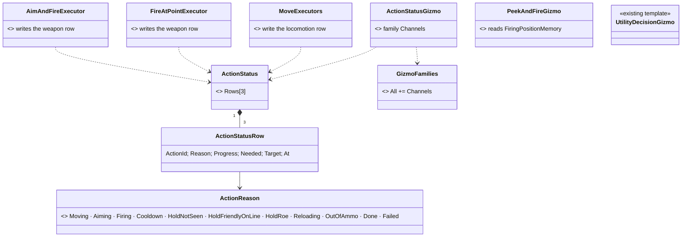
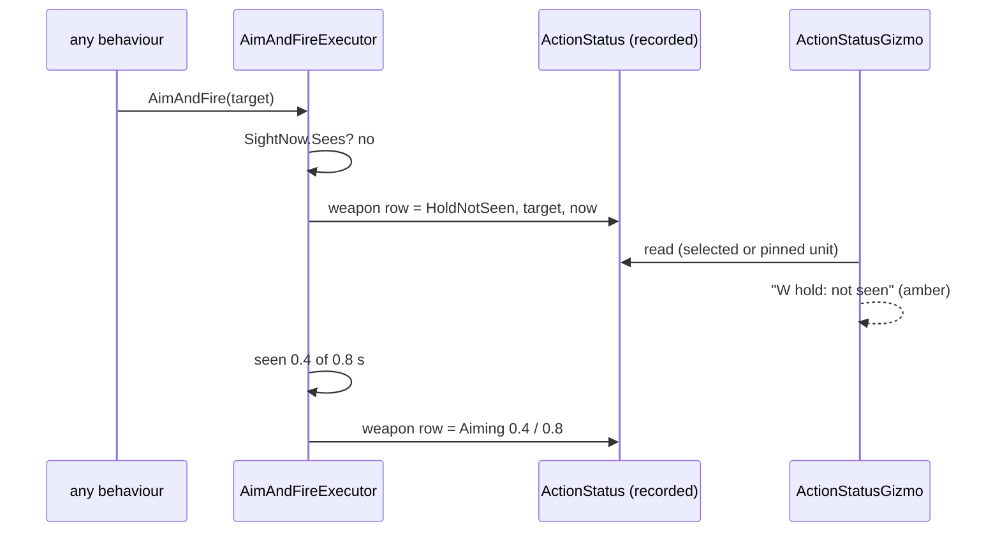
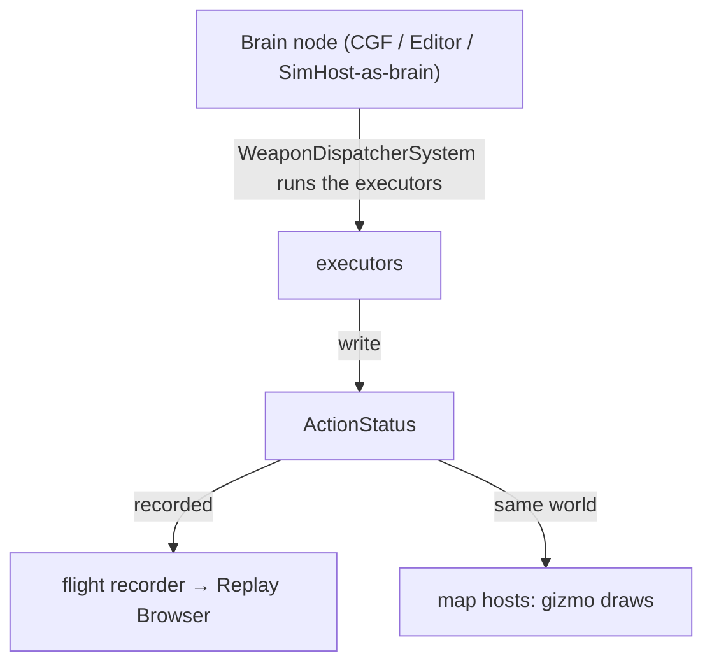

<!--STATUS
state: LIVE
updated: 2026-10-09
build-state: DESIGN — leans T1–T4 await the user
current-answer: §2 leans · §3 classes · §4 sequence · §5 modules
stale-below: nothing
known-rot: none
known-conflict: R-226 / DESIGN_Terrain_Combat_Tuning.md §5a precedent — UtilityDecisionLog exists only while a unit is OBSERVED (trace armed); T2 here leans ALWAYS present, argued in §2
related-designs:
  - DESIGN_Terrain_Combat_Tuning.md — OWNS §5a (R-226: debug gizmos draw RECORDED state, NoScenario components) and §5b (R-227: gizmo families, scope, pins)
  - DESIGN_Uniform_Gizmo_Membership.md — OWNS §10 (R-228: gizmo membership is uniform across the five map hosts — "has data = can draw")
  - DESIGN_Peek_And_Fire.md — OWNS the first consumer: the aim timer / sight gate (P-3) whose holds this makes visible, and PeekAndFire's phases (§8.2)
  - designs/behav-diag-1/DESIGN.md — OWNS DebugState, the patch command and the trace rings (the "observe" arming this does NOT depend on, T2)
-->

# AI action status — seeing why a unit is not shooting *(backend, `2026-10-09`)*

> 🔒 **User, `2026-10-09`:** *"how can we indicate the internal state of 'aiming, not shooting because target not seen and stuff
> like that for debugging'? any switchable gizmo for these internal 'thoughts' of the AI behaviors, behavior specific?"*

## 1. INVENTORY — measured `2026-10-09` (read-only sweep + `GizmoFamilies.cs`, `AiOverlayFlags.cs`, `UtilityDecisionGizmo.cs` read)

| exists | state |
|---|---|
| `UtilityDecisionLog` + `UtilityDecisionGizmo` — a recorded `NoScenario` component drawn as text at the unit, family `UtilityDecision` | ✅ used — **the template** |
| `AiOverlayFlags.Channels` (*"active locomotion/weapon/interaction action"*) | ⚠ declared, **no gizmo uses it**, not in `GizmoFamilies.All` (no scope setting, no pin) |
| `HillAttackGizmo` — draws only while the unit runs `PlatoonHillAttack`, reads that behaviour's own state | ✅ used — **the behaviour-specific template** |
| `WeaponChannel.State` holds the aim timer (`AimState`, P-3); it is `NoScenario` ⇒ recorded | ✅ but the HOLD REASONS (not seen · cooldown · friendly on the line · ROE) all return `Running` and are indistinguishable |
| `BehaviorLog.Trace` | text to the NLog file only — never the map |
| a per-unit status/reason component | ⛔ **searched `docs/`, `.dev/`, `Hrot/`, `FDP/`: none** |

## 2. Leans *(awaiting the user)*

| # | lean | why |
|---|---|---|
| **T1** | **one recorded component `ActionStatus` per unit**: a row per channel (locomotion · weapon · interaction) = action id, **reason** (`Moving`, `Aiming`, `Firing`, `Cooldown`, `HoldNotSeen`, `HoldFriendlyOnLine`, `HoldRoe`, `Reloading`, `OutOfAmmo`, `Done`, `Failed`…), progress / needed (e.g. 0.4 / 0.8 s), target, sim time. **Written by the EXECUTORS** | the executor is the one place every behaviour's action passes (as the aim gate) ⇒ every behaviour — BTree, HSM, blueprint, C# — gets it with no change |
| **T2** | **always present on brain units** (≈ 60 B), not only while "AI trace" is armed | the question is usually *"why is NOBODY firing"*; arming each unit first defeats it, and a replay should already hold the answer. ⚠ Departs from the `UtilityDecisionLog` precedent (armed-only, its log is bigger and per decision) |
| **T3** | **`ActionStatusGizmo`**, family **`Channels`** (added to `GizmoFamilies.All`, default **selected or pinned**, switchable to all in the layer panel; pinnable from the context menu): one short line per busy channel under the unit — `W aiming 0.4/0.8 s → 1234` · `W hold: not seen` (amber) · `L moving 12 m`. `GET /entities/{id}/weapons` reports the same reason (map and API agree) | reuses families, scope, pins and the five map hosts as built (R-227, R-228) — no new switch mechanism |
| **T4** | **behaviour-specific thoughts = a gizmo per behaviour**, as `HillAttackGizmo`: `PeekAndFireGizmo` draws only while the unit runs `PeekAndFire` — its phase and timer, the hide and peek points, and the remembered firing positions with their heat (burned = red) from `FiringPositionMemory` | the behaviour's state is already recorded (unit memory, node state); no new runtime text API |

| rejected | the one fact that killed it |
|---|---|
| a free-text "thought" string each behaviour writes every tick | strings per unit per tick in recorded state; a reason enum + numbers carries the same and stays fixed-size |
| logging holds to `BehaviorLog` | never reaches the map; you read files after the fact |
| arming per unit only (the `UtilityDecisionLog` way) | see T2 |

## 3. Classes

*What the picture shows: the writers are the EXECUTORS, not the behaviours — that is why no behaviour needs editing to be seen.*

## 4. Sequence — "why is A not shooting?"

## 5. Modules — who writes, who draws

*The status lives where the brain runs (the brain components are not replicated, R-226); the map hosts that share that world draw it,
and a replay draws it from the recording. ⚠ An IG that only receives replicated state does not see it — as for every AI gizmo today.*
