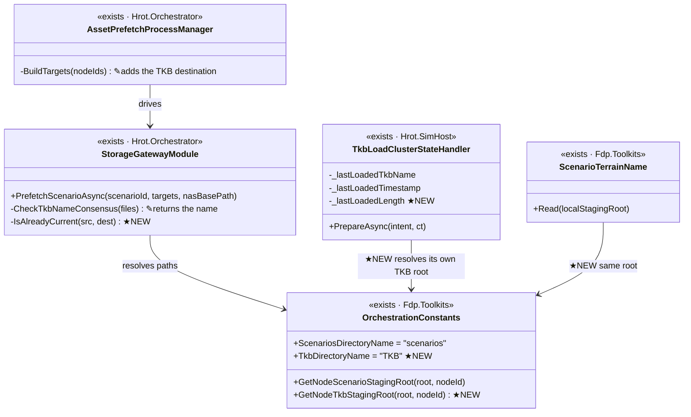
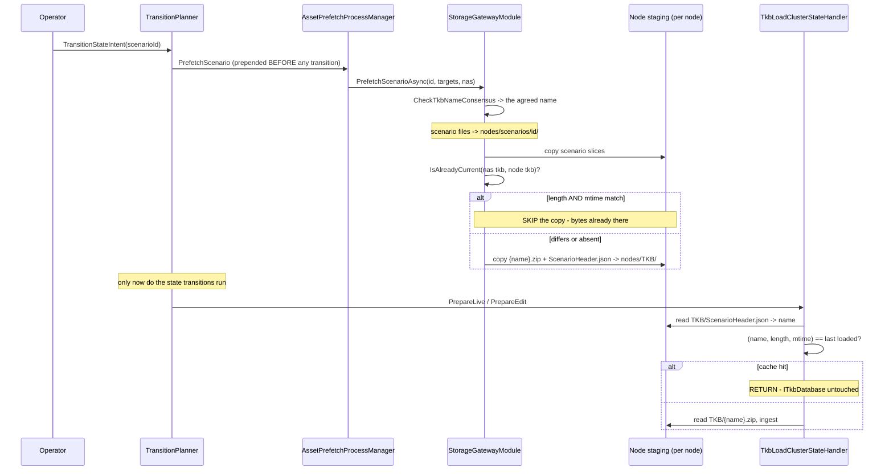
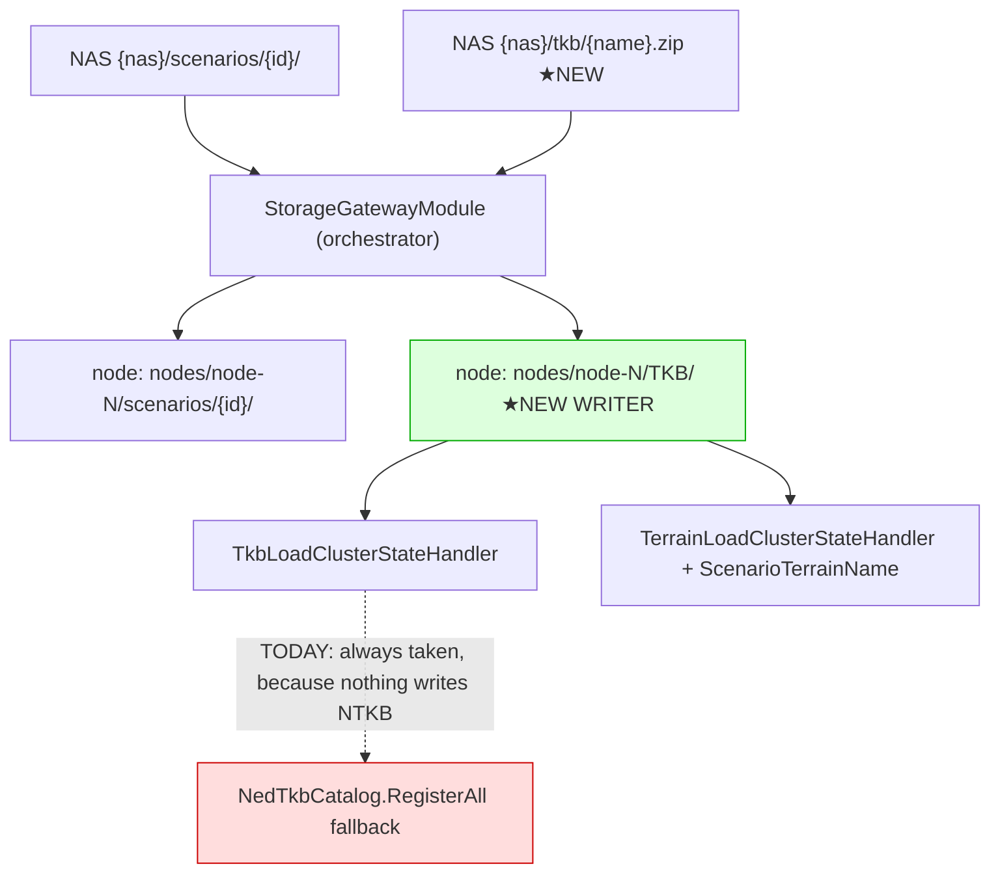

<!--STATUS
state: LIVE
build-state: ✅ BUILT 2026-09-18 — one batch, S1-S4. §9 carries the AS-BUILT: V1 settled (the lean
  FLIPPED), three deviations folded in, and what S4 measured that this design assumed. The INVENTORY
  (§1), classDiagram (§3), sequenceDiagram (§4) and module graph TD (§5) stand as drawn except where §9
  marks them.
updated: 2026-09-18
current-answer: §2 is the measured gap, §3-§5 are the model, §6 is the skip rules and WHY they
  compose, §7 is what this deliberately does not build, ⭐ §9 is the AS-BUILT and supersedes §8.
stale-below: §8-V1 is ANSWERED — read §9.1, not §8. §4's sequence omits the named-but-unpublished
  artifact arm, which §9.3 adds.
stale-below: nothing — new document.
known-rot: TWO things this design assumed that the build measured false, both in §9 —
  (a) §2/§4 speak only of the TKB NAME, but the terrain name rides the SAME staged header and had to be
  carried too, or S4 was impossible; (b) §5's "terrain inherits everything here unchanged" is true of the
  HEADER and false of the ARTIFACT — see §9.4.
known-conflict: none.
related-designs:
  - docs/DESIGN_Asset_Management.md — ⭐⭐ THE GENERAL CASE this document is the one-artifact-kind slice
    of. It REUSES this document's (length, mtime) skip verbatim and generalises the flat single-file
    push into a recursive per-file manifest + transport partition. ⛔ It adds no second freshness rule.
  - docs/blueprints/Architect_Question_72_Asset_Lifecycle_And_Distribution.md — the GENERAL asset
    lifecycle this document is a deliberate subset of (per-node needs, packaging, authoring sync).
    ⚠ Q72 §4 records what this slice already settles so it is not reopened.
  - docs/designs/tkb-1/DESIGN.md — §7.3 OWNS THE NODE SIDE: the node reads TkbName from its own locally
    staged scenario header, never from the wire payload, and caches on (TkbName, zip timestamp). This
    document owns how that header and that zip GET THERE, which §7.3 assumes and never specifies.
  - docs/DESIGN_Terrain_Zones_And_Assets.md — §2.1e ②a owns the terrain loader, which mirrors the TKB
    loader field for field and therefore inherits everything here unchanged. BP-550 is closed by this.
  - docs/designs/cluster-master-cqrs-1/DESIGN.md — owns the prefetch saga (AssetPrefetchProcessManager)
    this extends; the trajectory slot and the fan-out are its, not this document's.
  - docs/DESIGN_Distributed_Scenario_Persistence.md — owns the NAS scenario layout and the save gate;
    this adds one sibling directory to that layout and changes nothing else about it.
  - docs/DESIGN_Cluster_Load_Phase.md — ⭐⭐⭐ owns the load MESSAGE and the per-ROLE load contract.
    ⚠ It moves the TKB and terrain NAMES onto the message (this document's staged
    `ScenarioHeader.json` sidecar then demotes to a local cache / fallback) and it records the RACE
    measured between this document's staging step and the step that consumes it. This document keeps
    the BYTES — NAS layout, the copy, and the two (length, mtime) skips — unchanged.
-->

# DESIGN — **Artifact staging: getting the named TKB to the nodes**

> **The one rule:** an artifact a scenario NAMES must arrive before the scenario LOADS, and neither the
> transfer nor the ingest may happen twice for the same bytes.

## 1. INVENTORY — measured `2026-09-18` *(`scripts/find.sh`, which runs `search_code` AND grep and diffs them; ⚠ the graph index returned 0 for these patterns and only grep answered, so this is a **grep-only** enumeration and is marked as such — `check_index_coverage` was not reachable)*

| # | what exists | where |
|---|---|---|
| ① | the trajectory slot — `PrefetchScenario` prepended **before any state transition** | `TransitionPlanner.cs:150` |
| ② | the saga that owns the async prefetch | `AssetPrefetchProcessManager.cs` |
| ③ | the copier — NAS dir → every node's staging dir, parallel, per-file success/failure | `StorageGatewayModule.PrefetchScenarioAsync:229` |
| ④ | ⭐ **it already reads `Header.TkbName`, and already fails loud on disagreement** | `:255 CheckTkbNameConsensus` → `PeekTkbNameFromFile` |
| ⑤ | the per-node destination the orchestrator computes | `AssetPrefetchProcessManager.cs:193-197` |
| ⑥ | the NAS/staging path authority | `OrchestrationConstants.cs` — `scenarios`/`exercises`/`episodes`/`shared`; ⛔ **no TKB entry** |
| ⑦ | the node-side reader + its differential cache | `TkbLoadClusterStateHandler.cs:65,79,86` |
| ⑧ | the terrain reader, mirroring ⑦ | `ScenarioTerrainName.cs:31`, `TerrainAssetHandler.cs:70` |
| ⑨ | precedent for a **node-id-aware** staging handler | `NodeBootstrapper.cs:325` — `new ReferenceArchiveHandler(localTempRoot, nodeId)` |
| ⛔ | anything that WRITES a TKB zip or a `ScenarioHeader.json` into staging | **nothing.** Only tests |

## 2. THE MEASURED GAP — **two halves that have never met**

📐 The node reads `{stagingRoot}/TKB/ScenarioHeader.json` and `{stagingRoot}/TKB/{name}.zip`.
📐 Prefetch writes `{nodeStagingRoot}/scenarios/{scenarioId}/*.json`.

⇒ 🔴 **`ScenarioHeader.json` has zero production writers**, so `ExtractTkbNameFromLocalScenario` returns
`null` on every real load and `TkbLoadClusterStateHandler` falls through to `NedTkbCatalog.RegisterAll()`.
⭐⭐ **The TKB loader has therefore never resolved a name in production** — which is why the missing zip
(`BP-550`) was never noticed: **the name was never read, so the zip was never wanted.**

⚠ **This widens `BP-550` rather than replacing it.** `BP-550` said the zip is undistributed; the header is
undistributed too, and that is the half that makes the failure silent instead of loud.

## 3. CLASS DIAGRAM — **what changes, and what merely gains a caller**

> **What the picture shows that prose hid:** only **one** new type-level concept exists (`TkbDirectoryName`
> + its root helper). Everything else is an existing class gaining a field or a caller — which is why this
> is one batch and not a programme.

## 4. SEQUENCE — **a scenario load that names a TKB**

> **What the picture shows that prose hid:** the two skips are on **different sides of the barrier** and
> never negotiate. The orchestrator's skip leaves the node's file untouched, which is precisely what makes
> the node's skip fire — see §6.

## 5. MODULE RELATIONSHIPS — **who writes and who reads each directory**

> **Caption — the dead edge is the whole point.** The red edge is what production takes **today** on every
> load. The green box has **no writer at all** until this design lands. ⛔ A class diagram could not show
> that; only asking *"who writes this directory"* could.

## 6. THE TWO SKIPS — **and why they compose rather than merely coexist**

🔒 **Ruled by the user `2026-09-18`: the key is `(length, lastWriteTimeUtc)`. ⛔ No sidecar, no hash.**

📐 **Measured `2026-09-18`, and the whole scheme rests on it:** `File.Copy` **preserves the source's
last-write time** *(source `02:22:38.1012573Z` → destination identical, while "now" was `07:22`)*.
⇒ ⭐⭐⭐ **a timestamp is therefore a CLUSTER-WIDE identity, not a local artefact** — the mtime a node sees
is the NAS artifact's own, so both sides can compare the same number without exchanging anything.

| case | orchestrator | node | correct? |
|---|---|---|---|
| node already has these bytes | **skips the copy** | file untouched ⇒ cache still matches ⇒ **no reload** | ✅ |
| NAS artifact differs | copies; destination inherits the **source's** mtime | mtime now differs ⇒ **reload** | ✅ |
| node process restarted, file current | **skips the copy** | in-memory cache empty ⇒ **ingest only, no transfer** | ✅ ⭐ the asymmetry is free and right |
| artifact restored to an OLDER version | mtime differs ⇒ copies | differs ⇒ reload | ✅ equality, not ordering |

⭐ **One line to add on the node side:** `TkbLoadClusterStateHandler` keys on `(name, mtime)` today. **Add
length**, so both sides evaluate literally the same predicate.

### ⚠ The residual risk, stated rather than buried

⛔ `(length, mtime)` is **not** a content identity.
- *rebuilt but byte-identical zip* → new mtime → needless copy + reload. **Wasteful, correct.**
- *different zip, same length AND same 100-ns mtime* → both skips fire wrongly and the **wrong TKB stays
  loaded**. Vanishingly unlikely for tool-built artifacts, ⚠ **but silent and persistent.**

🔒 **Accepted by the user**, who ruled out the sidecar. ⭐ Recorded here so a future reader meets the
tradeoff rather than rediscovering it.

## 7. WHAT THIS DELIBERATELY DOES NOT BUILD

⛔ A content hash or `.sha256` sidecar — ruled out; §6 records what that costs.
⛔ A node→orchestrator "what do you hold?" report — a local `File.Exists` + stat answers it with no round trip.
⛔ TKB versioning in the NAME — the filesystem already carries the fact; `R-42`-style permanence is worse.
⛔ Any change to the 2PC round or the cluster state machine — distribution is strictly upstream of both.
⛔ Publishing TKB zips to the NAS in the first place — that is an authoring/build concern, not a runtime one.

## 8. UNDER-SPECIFIED

| # | what is missing | who settles it |
|---|---|---|
| **V1** | the node handler is constructed with the **bare** staging root (`NodeBootstrapper.cs:331`) and reads `{root}/TKB`, while the orchestrator writes per-node (`{root}/nodes/node-N/...`). In a co-located runner those differ; on one-node-per-machine they coincide | ⭐ **implementer measurement, not a user decision.** ⚠ The precedent is four lines above: `new ReferenceArchiveHandler(localTempRoot, nodeId)` (`:325`) already threads the node id into a staging-aware handler. ⭐ **Lean: make the TKB handler node-aware the same way** and have both sides call `GetNodeTkbStagingRoot`. ⛔ What would flip it: if `ResolveStagingRoot()` is already per-node on every deployment shape, the bare root is correct and the helper takes no node id |

---

## 9. ⭐⭐⭐ AS-BUILT — **what the build measured, and where this design was wrong** *(batch artifact-staging, `2026-09-18`)*

### 9.1 ✅ `V1` ANSWERED — **the lean FLIPPED, and its own cited precedent is what flipped it**

⛔⛔ **§8 leaned *"make the TKB handler node-aware, mirroring `ReferenceArchiveHandler`."* 📐 Measured, that
would have been wrong twice over:**

| 📐 the measurement | consequence |
|---|---|
| **every production host already passes a PER-NODE root** as `localTempRoot` — `SimHostApp.cs:362` *(`Combine(base,"nodes",$"node-{id}")`)*, `CgfSubsystem.cs:612` *(identical)*, `OrchestratorSubsystem.cs:137` *(`GetNodeStagingRoot(id)`)* | ⇒ the handler's *"bare"* root **already is** `{base}/nodes/node-N`. ⭐ This is **exactly** the condition §8 named as what would flip it |
| ⛔ **the cited precedent argues the OTHER WAY.** `ReferenceArchiveHandler(localTempRoot, nodeId)` uses the id to build a **FILE NAME** — `node_{id}.fdp`, under the **shared** `exercises/` directory *(`ReferenceArchiveHandler.cs:73-74`)* — ⛔ not to make its root per-node | ⇒ it is a precedent for node-discriminated **filenames in a shared directory**, the opposite shape |

⇒ ⭐⭐ **As built: the handler takes the per-node root it already gets, and `GetTkbStagingRoot` takes NO node
id.** ⛔ Threading one in would have **double-applied the node segment**. `GetNodeTkbStagingRoot(base, id)`
exists for the orchestrator and is defined by **composing** the two existing helpers, so the sides cannot
drift — railed in `TheHostsAgreeOnTheScenarioRootTests`, the suite whose whole purpose is *"two sides agree
on a root"*.

⚠ **One precision §8 got slightly wrong:** it phrased the flip condition as *"if `ResolveStagingRoot()` is
already per-node"*. 📐 `ResolveStagingRoot()` is **not** per-node — it is the base. What is per-node is the
value each host **passes**, which is the thing that actually decides it.

### 9.2 🔴 DEVIATION — **the staged header carries BOTH names, because terrain rides the same file**

⛔ §2 and §4 speak only of the TKB name. 📐 Measured: **`ScenarioTerrainName.Read` reads `TerrainName` out
of that very `ScenarioHeader.json`** *(`ScenarioTerrainName.cs:42`)*. ⇒ **writing only `TkbName` would have
made `S4` impossible**, since terrain's *"inherit with no new code"* is precisely *"read your name from the
staged header"*.

⇒ `CheckTkbNameConsensus` reaches consensus on **both** names and `StagedArtifactNames` carries both.
⚠ Disagreement on **either** still fails loud, which is the existing contract extended, not changed.

### 9.3 🔴 DEVIATION — **a named-but-UNPUBLISHED artifact logs loudly and does NOT fail the prefetch**

📐 **The build surfaced a design question this document never answered, and three PRE-EXISTING rails
answered it:** `PrefetchScenario_SameTkbName_AllFiles_Succeeds` and two siblings assert `IsFullSuccess` for
scenarios that name a TKB with **no published artifact**. ⛔ The first draft counted that a failure and
reddened all three.

| ⭐ the ruling taken, and why | |
|---|---|
| ⛔ **counting it would change the orchestrator's TRANSITION OUTCOME** for a condition this design never said should block a transition — far beyond *"copy the zip"* | ⚠ and it would silently redefine what `IsFullSuccess` means to every existing caller |
| ⭐⭐ **the loud failure already has a designed home** — the node's `TkbLoadClusterStateHandler` throws `FileNotFoundException` naming the exact path | ⇒ nothing is swallowed; the gateway's error names the missing NAS path **and where to publish it**, which is the actionable half |

⇒ ⭐ `IsFullSuccess` keeps meaning *"every transfer I attempted succeeded."*

### 9.4 🔴 `S4`'s FINDING — **terrain inherits the HEADER, and CANNOT inherit the ARTIFACT**

⛔⛔ **This document's `related-designs` says terrain *"mirrors the TKB loader field for field and therefore
inherits everything here unchanged."* 📐 Measured, that is true of ONE half and false of the other:**

| half | inherits? | 📐 why |
|---|---|---|
| the **NAME**, from the staged header | ✅ **yes, with no new code** | both readers open the same `{node}/TKB/ScenarioHeader.json`; `S2c` writes both names into it. ⭐ Railed through the orchestrator's own `BuildStagedHeaderJson`, ⛔ not a hand-written fixture — a fixture could not catch the writer emitting a shape the reader cannot parse |
| the **ARTIFACT** | 🔴 **no, and it cannot** | the TKB artifact is `{node}/TKB/{name}.zip` *(`TkbLoadClusterStateHandler.cs:78`)*; the terrain definition is `{node}/Terrain/{name}.json` *(`TerrainLoadClusterStateHandler.cs:138`)* — **different directory, different extension**. ⇒ `S2b`, which copies one named zip out of `{nas}/tkb`, cannot serve it |

⇒ ⭐⭐ **`BP-550` closes for the TKB and stays OPEN for terrain.** ⛔ The terrain artifact path was
**deliberately not built**: the dispatch ruled a terrain-specific path is a FINDING to report, and a second
artifact KIND is squarely the wider asset-management model that is out of scope. ⭐ A rail pins the gap so
it cannot be mistaken for done.

### 9.5 ⚠ THE SHAPE OF THE STAGED HEADER — **not a copy of the scenario's own header block**

📐 Both node-side readers take a **FLAT object with PascalCase keys** — `ValueTextEquals("TkbName")` /
`("TerrainName")`, no nesting *(`TkbLoadClusterStateHandler.cs:152`, `ScenarioTerrainName.cs:42`)* — whereas
a scenario file carries `header: { tkbName, terrainName }`, **nested and camelCase**. ⇒ ⛔ *"write the agreed
header"* could be read as *"copy the block"*, and that would produce a file **neither reader can parse**.
⭐ `BuildStagedHeaderJson` builds the reader's shape, and omits absent names rather than writing `null`.

### 9.6 ⚠ AND THE SUITES THIS BATCH HAD TO FIX FIRST — **the copy loop had never run in a test**

📐 `T-1` found **three reds before any code**, and two shared one cause: the fixtures built the NAS layout
**without the `scenarios/` segment** production resolves *(`StorageGatewayModule.cs:238`)*, so
`PrefetchScenarioAsync` threw `DirectoryNotFoundException` at its first statement. ⇒ ⛔⛔ **the empty-directory
guard, `CheckTkbNameConsensus` and the whole parallel copy loop had never been exercised** — the very method
this batch extends. *(The third was a Linux-portability defect: the "invalid" destination was a UNC path,
which on Linux is a legal relative filename, so the copy succeeded and the count read 3 where 2 was
expected.)*
