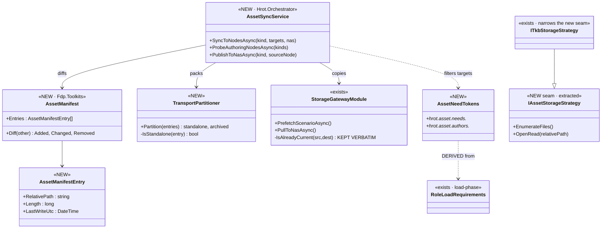
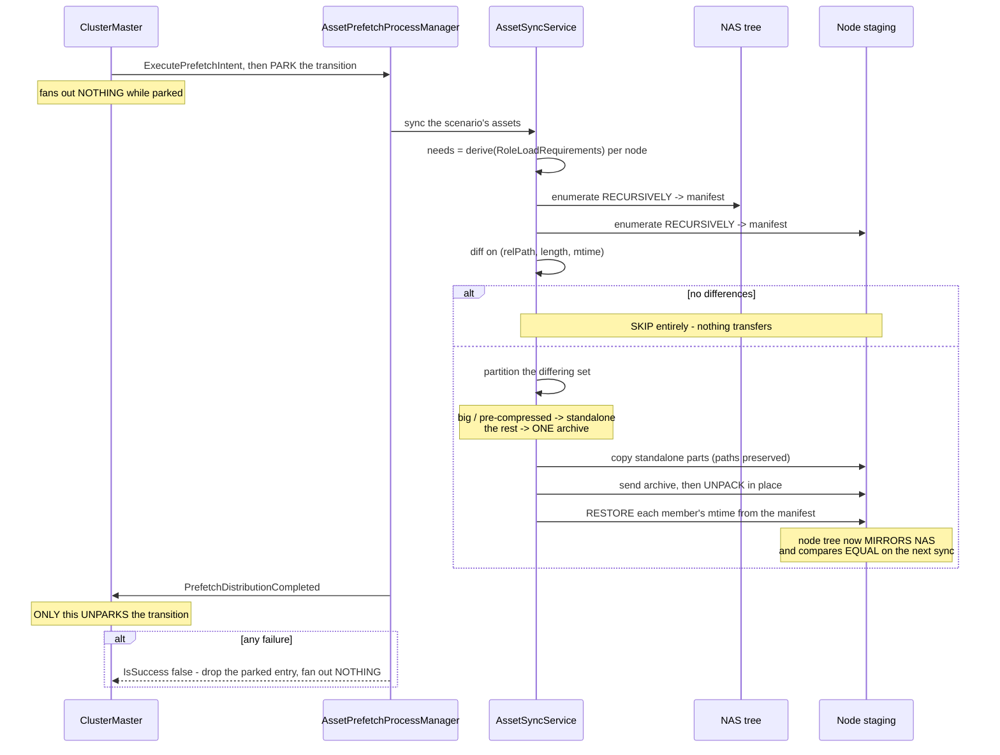
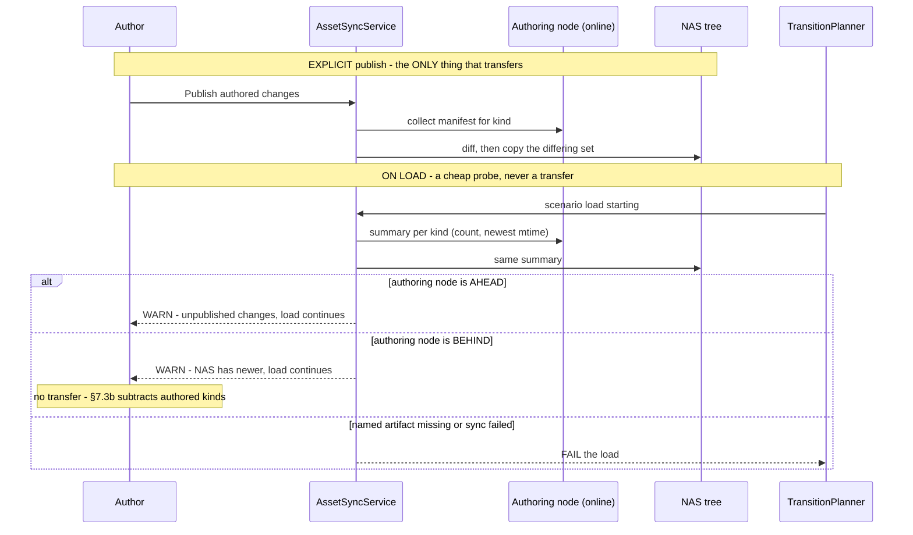
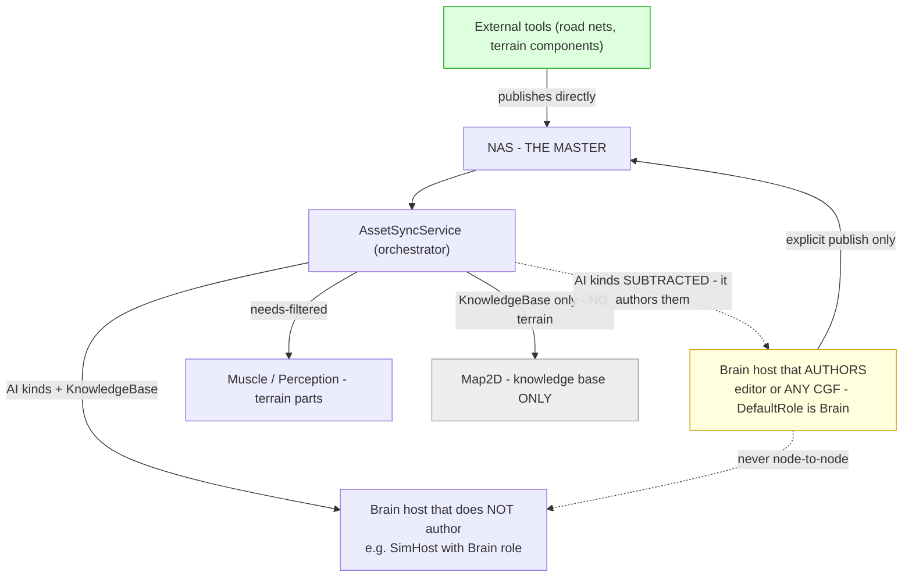

<!--STATUS
state: LIVE
build-state: ⭐ A and C are READY-TO-BUILD. ⚠ B is buildable ONLY WITH §7.3b (the author-subtraction) —
  ⛔ B1/B2 without it MIRROR NAS ONTO THE AUTHOR'S OWN FOLDER. W5 CLOSED 2026-09-19; W6 (the explicit
  refresh-from-NAS operation) is open and needs the user, but does NOT block B.
  Carries the INVENTORY (§1), a classDiagram (§3), two sequenceDiagrams (§4, §5) and a
  module-relationship graph TD (§6). Every decision here is RULED in Architect_Question_72 — including
  §7.3a's adapter, which the 2026-09-19 review forced and which AQ-72 now carries as Q72-M.
updated: 2026-09-19 (REVISED TWICE after the backend session's reviews — round 1: six corrections;
  round 2: §7.3b's author-subtraction, the BaseFolder predicate, the merged AUTH/BRAIN box)
current-answer: §2 is the model in one table (the three forms, the two directions) — ⭐ read its
  restore-at-unpack paragraph, it is what makes the one-predicate claim TRUE. §3-§6 are the structure.
  §7 is the WHY the diagrams cannot carry; ⭐ §7.3a is RULED and carries the whole LoadPart->AssetKind
  map, and ⭐⭐ §7.3b is the AUTHOR-SUBTRACTION without which B destroys authored work on first load —
  read them as one rule. §8 is the increment split. §9 is under-specified (W1-W4 + W6 live; W5 CLOSED).
  ⛔ §HISTORY is what the two reviews measured FALSE — never quote it.
stale-below: everything under `## ⛔ HISTORY`. ⛔ Six statements this document originally made are wrong;
  each is named there with what measured it false.
known-rot: ⛔ §7.3's "derive from RoleLoadRequirements" is TRUE but INSUFFICIENT — read §7.3a with it,
  which measures the vocabulary gap and carries the ruled adapter. ⚠ §7.6 records an inherited
  constraint this design does not remove (the orchestrator stats and writes every node's disk).
known-conflict: none. ⚠ DESIGN_Artifact_Staging.md is a BUILT SUBSET — §2.1 says exactly what it already
  does and what this generalises; ⛔ this document does not re-decide any of it.
related-designs:
  - docs/blueprints/Architect_Question_72_Asset_Lifecycle_And_Distribution.md — THE decision record.
    Every rule here cites a Q72 sub-question; read it for WHY a rule is what it is.
  - docs/DESIGN_Artifact_Staging.md — BUILT. Owns the NAS->node push for ONE artifact (the named TKB) as
    a SINGLE FILE, with the (length, mtime) skip this generalises. Its skip predicate is kept verbatim.
  - docs/DESIGN_Cluster_Load_Phase.md — owns RoleLoadRequirements (which role LOADS which part) and the
    per-role ordered chain. ⭐ This document DERIVES its staging needs from that table (Q72-L) rather
    than authoring a second vocabulary; it decides which BYTES reach a node's disk beforehand.
  - docs/blueprints/Architect_Question_70_Host_Capabilities_And_Reliable_Init_Degradation.md — owns the
    capability-token facility. Both token vocabularies here are namespaces on it; no new facility.
  - docs/designs/cluster-master-cqrs-1/DESIGN.md — owns the prefetch saga and the storage gateway in BOTH
    directions (PushToNodes, PullToNas). This extends both; the trajectory slot is that document's.
  - docs/designs/tkb-1/DESIGN.md — owns ITkbStorageStrategy, the zip/raw VFS pair this generalises (Q72-D).
  - docs/DESIGN_Terrain_Zones_And_Assets.md — owns the terrain definition asset whose schema gains the
    component vocabulary (Q72-A).
-->

# DESIGN — **Asset management: NAS as master, nodes hold what they need**

> **The one rule:** ⭐ **the NAS is the master; a node holds a copy of exactly what it will load; the copy
> is refreshed only when the bytes differ; and a scenario never loads against data that is inconsistent
> anywhere it is needed.**

## 1. INVENTORY — measured `2026-09-18`/`19`

⚠ **Coverage:** grep-corroborated, **not** graph-enumerated (`check_index_coverage` unreachable, and
`scripts/find.sh` mis-reports regex alternations — `BP-558`). ⭐ Treat as a floor.
📄 **The full inventory with its bearing on each decision is `AQ-72` §1** — ⛔ not restated here. The rows
that shape the STRUCTURE:

| # | measured | consequence for this design |
|---|---|---|
| ① | ⛔ **no recursive enumeration anywhere** — every scan is one level (`ScanLocalScenarios:440`, `ScanNasExercises:484`), and `PrefetchScenarioAsync:244` copies flat | 🔴 `Q72-K` (subfolders, any depth) makes a recursive walk **mandatory on both sides**, and it does not exist |
| ② | `FileManifestEntry` = `SourceUnc` + `RelativeDest` + `DocType` — ⛔ **no length, no mtime**. ⭐ It is the **node→NAS** DTO (`SerializeLocal`'s result payload); NAS→node uses `NodeDistributionTarget` | the freshness manifest needs **two fields on a wire DTO** — ⛔ but in increment **C** (publish), **not** A: see §8 |
| ③ | ⛔ **nothing enumerates a NAS asset tree** for any `AssetKind`; the only asset-ish reader is a ledger dir | the **NAS half is entirely new code** |
| ④ | ✅ `File.Copy` **preserves** the source mtime *(measured)* | a timestamp is a **cluster-wide identity**; both skips share one predicate |
| ⑤ | ✅ `IAssetCatalogContributor.BaseFolder` gives the per-kind dir; ⛔ `IEditableAsset` carries no timestamp | the publish probe is a **stat-only walk**, not a cached read. ⚠ `BaseFolder` is `null` for scenarios |
| ⑥ | ✅ `PullToNasAsync` + consensus aggregators exist (node→NAS); ✅ `PrefetchScenarioAsync` (NAS→node) | **both directions exist**; this adds recursion, partitioning and the skip |
| ⑦ | ✅ `ITkbStorageStrategy` + `ZipTkbProvider` + `RawDirectoryTkbProvider` | the FS-agnostic seam exists **for TKB only** |
| ⑧ | ✅ `RoleLoadRequirements` (BUILT) declares which role loads which part | ⭐ the **source** of the needs tokens (`Q72-L`) |

### 1.1 What `DESIGN_Artifact_Staging` already BUILT — ⛔ not re-decided here

✅ the NAS `tkb/` folder · ✅ the per-node TKB staging root · ✅ the staged header carrying **both** names ·
✅ `IsAlreadyCurrent` on `(length, mtime)` · ✅ the node-side cache key gaining length.
⇒ ⭐⭐ **this design GENERALISES that slice from one named single file to any asset, tree or archive** —
its skip predicate is kept **verbatim**, not re-derived.

## 2. THE MODEL — **three forms, two directions, one predicate**

| | at rest on **NAS** | in **transport** | at rest on the **node** |
|---|---|---|---|
| **who decides** | the publisher — our host, or an **external tool** | ⭐ the **sync**, automatically | 🔒 **a MIRROR of NAS** (`Q72-H`) |
| **shape** | tree **or** archive | a **partition**: big/pre-compressed **standalone**, the rest **one archive** (`Q72-H1`) | identical to NAS — **shape AND structure** (`Q72-K`) |
| **freshness** | ⭐⭐⭐ **the per-file `(relative path, length, mtime)` manifest — on the AT-REST pair, NEVER on the transport** | | |

⭐⭐ **Why the transport may be chosen freely — and the ONE thing that must be done to make it true.**
④ means a file copied **directly** keeps the source mtime. ⛔⛔ **The archive arm does NOT**, and an earlier
version of this section claimed it did — see `## ⛔ HISTORY`. 📐 **Measured twice** *(backend session on
.NET 8; corroborated here on the ZIP container itself)*: ZIP stores **DOS timestamps on a 2-second grid**,
so `2026-09-19T11:22:33.456Z` is stored as `…:32` and every member loses sub-second and odd-second
precision — a **−1.456 s** delta against a predicate that is **exact** equality
(`StorageGatewayModule.cs:524-525`).

⇒ ⛔ **left alone, every file arriving through the archive arm compares UNEQUAL FOREVER** and re-transfers
on every sync — ⚠ **precisely the small-file case the partition exists to optimise.**

⇒ ⭐⭐⭐ **The unpack MUST restore the manifest's mtime:** the sync already carries
`(relPath, length, mtime)` per entry, so extraction is followed by `File.SetLastWriteTimeUtc(dest,
entry.LastWriteUtc)`. 🔒 **This is a NAMED success condition with its own rail, not an implementation
detail** — it is what makes *"the two transport shapes are indistinguishable to the skip"* true **by
construction** instead of by assumption. ⭐ Only then is packing a pure wire optimisation needing no
agreement from either end.

## 3. CLASS DIAGRAM

> **What the picture shows that prose hid:** `AssetNeedTokens` has a **dashed derive edge**, not a
> composition edge — ⭐ it is **computed** from `RoleLoadRequirements`, never hand-authored beside it
> (`Q72-L`). And `ITkbStorageStrategy` **narrows** the new seam rather than being replaced (`Q72-D`).
>
> ⭐⭐ **`Diff` returns THREE sets — added, changed and REMOVED.** ⛔ A one-sided diff cannot express
> *"present on the node, absent on NAS"*, so a renamed or deleted NAS file would leave an orphan on every
> node **forever** — and §2's word is **MIRROR**, which is not a testable condition without a delete set.
> ⚠ Whether removal actually deletes is a build decision that must be **stated and railed**, not left to
> the reader (`§9-W4`).

## 4. SEQUENCE — **NAS → node, the sync that runs before a load**

> **What the picture shows that prose hid — two things, and the second can hang the cluster.**
> ⭐ The partition happens **after** the diff, so an unchanged 100 GB file is **never packed, never
> copied, never considered** — the expensive case is eliminated by the cheap check that precedes it.
>
> ⛔⛔ **And `AssetSyncService` sits INSIDE the prefetch saga, never beside it.** 📐 `TransitionPlanner`
> only **enqueues** an `OperationStep(ClusterOpType.PrefetchScenario, …)` (`TransitionPlanner.cs:150`) —
> it holds no bus and calls nothing, so it cannot be this sequence's actor. As built by `L8`
> (📄 `DESIGN_Cluster_Load_Phase` §7), `ClusterMaster` **parks** the transition and **only**
> `PrefetchDistributionCompletedEvent` unparks it. ⚠ **A sync on a parallel path leaves the transition
> parked until the 300 s liveness bound fails it — a HANG, not an error.** ⭐ An earlier version of this
> diagram drew `TransitionPlanner` as the caller; see `## ⛔ HISTORY`.

## 5. SEQUENCE — **node → NAS, publish and the staleness probe**

> **What the picture shows that prose hid:** the two arms end **differently on purpose** (`Q72-I`) — an
> unpublished blueprint edit **warns**, a missing named artifact **fails**. ⭐ The probe returns a
> **summary**, never a manifest, which is what keeps it cheap enough to run on every load.
>
> ⭐⭐ **THE BEHIND ARM IS NOT SYMMETRY FOR ITS OWN SAKE.** §7.3b subtracts authored kinds from the sync,
> so an authoring host **never automatically receives anyone else's assets** ⇒ ⛔ without this arm, two
> authoring Brain hosts diverge **silently**. ⭐ It warns and transfers **nothing** — the fix stays an
> explicit user act (`§9-W6`), exactly as `Q72-I` chose for publishing.
>
> ⚠⚠ **The STATED LIMIT — the participant is `Authoring node (ONLINE)` and that word is load-bearing.**
> §7.5's own justification for explicit publish is *"other nodes may be offline at authoring time"* ⇒
> an **offline** author's unpublished changes are **invisible to the probe**, and the *"consistent
> everywhere"* guarantee is restored **only for online authors.** ⛔ This is a limit, not a gap to fix
> here — but it must be **railed** (*author offline ⇒ no warning, load continues*), 📌 because otherwise
> a later reader reads the silence as proof there was nothing to warn about.

## 6. MODULE RELATIONSHIPS — **who may write which store**

> **Caption — what the picture shows that prose hid.** ⭐ `Map2D` is the **sharp** case, not the empty
> one: it receives **the knowledge base and nothing else.** `UniversalParts = { KnowledgeBase }` is
> 🔒 *"required by every ECS node, whatever its roles — not role-derived at all"*
> (`RoleLoadRequirements.cs:34`, user: *"every ECS enable node should be able to create entities so every
> needs the TKB loaded"*), while **terrain** is genuinely derived away — that host holds a
> `RoadNetworkHolder` nothing on it reads (`:56-57`). ⇒ **the filter subtracts a part, never a node.**
> ⛔⛔ **And the AUTHORING box is a BRAIN box** — an earlier version drew *"authoring host"* and *"brain
> nodes"* as two populations; 📐 `CgfSubsystem.DefaultRole = NodeRole.Brain` makes them **the same hosts
> by default** (see `## ⛔ HISTORY`). ⭐ That is why the yellow box has a **subtracting** dashed edge:
> §7.3b — *a node is never an automatic sync target for a kind it authors* — and why the unsubtracted
> drawing would have mirrored NAS **onto the folder the author is editing.**
>
> And authoring hosts **never** push to each other: the NAS is the only path, which is what makes
> *"master source"* true rather than aspirational.
>
> ⛔⛔ **This edge was drawn as *"Map2D gets nothing"* and that was WRONG** — see `## ⛔ HISTORY`. 📌 If
> `B1`'s filter drops the TKB for `Map2D`, `KnowledgeBaseLoadStep` throws `FileNotFoundException` on IG
> for any scenario naming a TKB — ⭐ loud, not silent, and measured in the `--mode all` acceptance log:
> `[LoadPhase] IG composed for roles [Map2D]: KnowledgeBase.`

## 7. WHY — what the diagrams cannot carry

### 7.1 Why the freshness key is on the AT-REST pair and never on the transport
An archive built from a tree gets a **new mtime every run** ⇒ a skip keyed on it never fires. Keying on
the per-file at-rest manifest makes the transport **free to change** without touching correctness.
📄 `Q72-H` / §3a.

⚠⚠ **And the follow-through this section originally missed.** Keying on the at-rest pair handles the
**archive object's** mtime — ⛔ it says nothing about the **members'** mtimes after extraction, which the
ZIP format quantises to 2 s. 📌 `Q72-C` had the right instinct and ruled publish-time packaging; `Q72-H`
then moved packing into the transport and **inherited a conclusion whose premise had changed**. ⇒ §2's
restore-at-unpack is not an extra safeguard — it is the step that makes this section's claim hold for the
archive arm at all.

### 7.2 Why the partition, and not one archive
🔒 **Not a CPU argument.** A 100 GB member makes the archive 100 GB+ **and unpacking needs the size twice
over**, which can simply fail. ⭐ The goal being protected is **file count**, and a partition protects it
fully: *one 100 GB heightmap + 3 000 small files* → **2 transfers**. 📄 `Q72-H1`.

### 7.3 Why the needs tokens are DERIVED, not authored
Two vocabularies for one question is the duplication this codebase produces most. `RoleLoadRequirements`
already answers *"which role needs which part"*, and `AQ-70` already derives roles from tokens one layer
up. ⚠ **What would widen it:** a standby node needing bytes it does not load — deferred by the load-phase
design's own §5.1. 📄 `Q72-L`.

### 7.3a ✅ THE VOCABULARY GAP — **`LoadPart` and `AssetKind` do not meet.** *(RULED `2026-09-19`, user: "ok accepting your lean" — 📄 `Q72-M`)*

📐 **Measured, and §7.3 shipped without it:**

| vocabulary | values | where |
|---|---|---|
| `LoadPart` | `KnowledgeBase`, `Terrain`, `ScenarioEntities` | `LoadPhaseContracts.cs:32-42` |
| `AssetKind` | `Blueprint`, `BTree`, `Hsm`, `Blackboard`, `Utility`, `Scenario` | `AssetKind.cs:3-11` |

⛔⛔ **The intersection is EMPTY**, neither contains TKB / terrain / road-net, and **behaviour assets have
no `LoadPart` at all** — `LoadPhaseChain` never loads them. ⇒ ⚠ *"derive the tokens from
`RoleLoadRequirements`"* is **under-determined as written**, and §7.3's own warning about two vocabularies
currently applies to this design shipping **three**.

✅✅ **THE RULING — an ADAPTER here, and ⛔ do NOT extend `RoleLoadRequirements`.** *(the claim table that
carried the lean is kept below: it is the evidence, and a reader may push on a row rather than the verdict)*

| the lean rests on | code — how it IS | design basis — how it was MEANT to be |
|---|---|---|
| `RoleLoadRequirements` is an **ordered execution list**, one `ILoadPartProvider` per part | ✅ `LoadPhaseChain.cs:97` composes a provider per required part | ✅ its own header: *"the ROLE declares the WHAT; the HOST supplies the HOW"* |
| nothing in the chain loads behaviour assets | ✅ its 3 members are the whole enum | ✅ `DESIGN_Cluster_Load_Phase` §4.1b |
| behaviour assets go to **every Brain host, as files** | ✅ the **reader** is built — `CgfSubsystem.cs:2078` (`BlueprintPeerSource`), `:2506` (`QuickReloadService`), `:2479` (`AiHotReloadCoordinator`); ⛔ only the DISTRIBUTION is missing | ✅ 🔒 user, `AQ-72` §0a |
| the requirement table is owned **elsewhere** | — | ✅ `RoleLoadRequirements.cs:19-21` → `DESIGN_Node_Roles_And_Policies` §3.2 |

⇒ ⭐ **a `LoadPart → asset-kind` map (3 rows) owned by THIS design** — an *adapter between two existing
vocabularies* is **not** a third vocabulary — ⭐ **plus one rule for behaviour assets: `Brain ⇒ all AI
asset kinds`.** 🔒 That rule is **one line, not a table**, which is what keeps it from being the
duplication §7.3 warns against; it is railed and it is stated here.

| the map — **the whole of it** | asset kind(s) reaching the node |
|---|---|
| `LoadPart.KnowledgeBase` | the scenario's named **TKB artifact** |
| `LoadPart.Terrain` | the **terrain definition** and its road graph |
| `LoadPart.ScenarioEntities` | the **scenario** ⚠ *(already travels by the prefetch path — see `§9-W3`)* |
| ⭐ **`NodeRole.Brain`**, not a `LoadPart` | ⭐⭐ **every kind whose catalog contributor exposes a non-null `BaseFolder`** — today `Blueprint`, `BTree`, `Hsm` |

⛔⛔ **The brain row originally read *"all AI asset kinds — Blueprint, BTree, Hsm, Blackboard, Utility"*
and that was WRONG** *(see `## ⛔ HISTORY`)*. 📐 `AssetRoots.AssetsRelative` (`:197-204`) resolves
**three** kinds and **throws `ArgumentOutOfRangeException`** for `Blackboard`, `Utility` and `Scenario`:
*"AssetKind.{kind} has no Assets root."* ⇒ ⭐ **there is nothing on disk to sync for those kinds.**

⭐⭐⭐ **So the rule is stated as a PREDICATE, not a list** — *"a kind is syncable iff its contributor has a
`BaseFolder`"*. 🔒 That is **zero maintenance**: a kind gaining a root becomes syncable with no edit here,
and it is the **same** property `C2`'s probe already walks (§1 ⑤). ⛔ A hand-written list of three would
rot the first time a fourth kind gains a root.

⚠ **What would flip the one-liner into a table:** a behaviour asset only SOME brain hosts need. ⭐ The
adapter is where it would go — **a widening, not a redesign** (📄 `Q72-M`).

### 7.3b ⛔⛔ THE SUBTRACTION THAT MAKES §7.3a SAFE — **a node is never an automatic sync target for a kind it AUTHORS**

🔴 **Without this, the `Brain ⇒ file-rooted AI kinds` rule DESTROYS AUTHORED WORK on the first load.**
📐 Measured — **every Brain host today is also an authoring host, and they are not two populations:**

| | |
|---|---|
| `CgfSubsystem.DefaultRole = NodeRole.Brain` | `CgfSubsystem.cs:92` — ⭐ **the DEFAULT**, not a deployment choice |
| the editor composes Brain too | `EditorSubsystem.cs:1451`; `CgfApplication.cs:207` |
| and both read their AI assets from the **authoring** root | `CgfSubsystem.cs:2078` (`BlueprintPeerSource`), `:2506` (`QuickReloadService`); `EditorSubsystem.cs:1826/3950/4472` |

⇒ ⛔⛔ **a NAS→node mirror of an AI kind lands on the folder the author is editing.** With `W4` = *delete*,
a NAS never published to **wipes** local work on first load; with `W4` = *report*, it still **overwrites**
every changed file — ⚠ **and §5's probe would then WARN *"you have unpublished changes"* about exactly the
changes the sync had just destroyed.** 🔒 **Warn-then-clobber is the inverse of what `Q72-I` protects.**

⭐⭐⭐ **The rule:** `B2` already builds `hrot.asset.authors.<kind>` ⇒ **subtract it from the needs set.**
⭐ One predicate on a facility the plan builds anyway, and it makes the overlap harmless **by
construction** rather than by deployment convention. ⭐ It also gives `hrot.asset.authors.*` a second
reason to exist beyond *"nobody authors K is legal"*.

⛔ **Rejected:** *land synced AI assets in the per-node staging root instead* — the CGF reader is
`AssetRoots`, so they would be **invisible** there, and 🔒 *"to stay editable they need to be present as
individual files"* ⇒ it needs a second root and a merge rule. · *rely on deployment never co-locating
author and Brain* — `CgfSubsystem.DefaultRole` makes co-location **the default**.

#### ⚠ The consequence, stated rather than hidden — **an authoring host never automatically receives ANYONE ELSE'S assets**

⭐ **The rule is not vacuous** — a Brain host that is *not* an authoring host still receives everything:
📐 `Hrot.SimHost` carries `NodeRole.Brain` (`NodeBootstrapper.cs:223/256`) and reads **no** `AssetRoots`.
⛔ **But for a CGF or editor host it means divergence is possible and silent:** two authoring Brain hosts
can run different behaviour trees, and §5's probe only warns when a node is **AHEAD** of NAS.

⇒ ⭐⭐ **Close it in the probe, not in the sync:** `C2`/`C3` report **BEHIND as well as AHEAD** — a warning,
never a transfer. ⭐ That costs one comparison, keeps the user in control, and is the same shape `Q72-I`
already chose for the other direction. ⚠ **The mirror OPERATION** — *"refresh my authored kinds from
NAS"*, explicit and user-triggered like `C4`'s publish — is **`§9-W6` and needs the user's nod**; ⛔ it is
NOT assumed here.

⛔ **Rejected:** *add `LoadPart.BehaviorAssets`* — the chain would then require a provider **nobody
implements**, making the table claim a load step that never runs (`R-133`: a fake must announce itself),
and it edits a table this design does not own. ⭐⭐ **And the positive half of the same argument: the
reader ALREADY EXISTS, outside the load chain** — `CgfSubsystem`'s `BlueprintPeerSource` /
`QuickReloadService` / `AiHotReloadCoordinator` read these assets on their own schedule, ⇒ a `LoadPart`
would model as a load step something that is **not one**. · *a full role→kind table here* — that **is**
the second vocabulary, and `Q72-L` exists to avoid it.

### 7.4 Why subfolders are not an optimisation
🔒 *"this is a way how **user organizes** the assets."* ⇒ the structure is **authored content**; losing it
is losing the user's work. ⛔ That is why ① is a blocker and not a nice-to-have. 📄 `Q72-K`.

### 7.5 Why publish is explicit and the probe never transfers
🔒 Auto-save exists and sync is long; other nodes may be offline at authoring time. ⇒ an automatic sync
would make load time unbounded and fire constantly. ⭐ The probe restores the *"consistent everywhere"*
guarantee **without** paying for it, because a summary is not a manifest. 📄 `Q72-I`.
⚠ **Restored for ONLINE authors only** — the same offline case that justifies explicit publish also puts
an offline author beyond the probe's reach. See §5's caption; it is railed, not silently assumed.

### 7.6 ⚠ The inherited assumption this design does NOT remove — **the orchestrator writes every node's disk**
📐 Measured: `BuildNodeDistributionTargets` composes each node's staging root **from the orchestrator's own
process** — `GetNodeStagingRoot(_localStagingRoot, nodeId)` (`AssetPrefetchProcessManager.cs:238`) — so
§4's *"enumerate the node RECURSIVELY"* is the **orchestrator** statting a path it can already write.
⇒ ⭐ true on one machine or a shared filesystem, ⛔ **false for a genuinely distributed deployment.**

🔒 **Stated, not fixed.** The alternative — the node builds and returns its **own** manifest — is a **new
`NodeOpType`**, which this design's scope explicitly excludes. ⚠ It is **inherited from the built prefetch
path, not introduced here**; ⛔ but this is *the* asset-distribution design, so the constraint is recorded
as **planned** rather than left to be discovered in a batch.

## 8. THE INCREMENTS — three, and the first is the enabler

| # | what | why this boundary |
|---|---|---|
| **A — the manifest and the recursive walk** | `AssetManifest` (three-set `Diff`) + recursive enumeration on **both** sides. ⛔⛔ **NOT the `FileManifestEntry` fields** — they moved to **C**, see below | ⭐⭐ **everything else needs it**, and ① says it exists nowhere. ⛔ Landing anything else first builds on sand |
| **B — needs-filtered sync with the partition** | `AssetSyncService` NAS→node, tokens derived from `RoleLoadRequirements`, `TransportPartitioner`, the skip kept verbatim | ⭐ this is the increment that makes *"nodes keep just copies they really need"* true |
| **C — publish and the probe** | explicit publish node→NAS, the summary probe, warn/fail split | ⭐ independent of B and **safe to defer**; ⛔ it is the only part that touches authoring hosts |

⭐ **`Q72-D`'s seam extraction rides with B** — it is what lets a tree asset be read without caring whether
it is a directory or an archive.

⛔⛔ **The `FileManifestEntry` fields belong to C, not A.** 📐 Measured (`OrchestrationPayloadDtos.cs`):
that DTO is the **node→NAS** shape — `SourceUnc` is *"the file on the **originating node**"*,
`RelativeDest` is *"under the **NAS** base directory"*, and it is returned as the `SerializeLocal`
result payload; every consumer is node→NAS or diagnostics. ⭐ **The NAS→node prefetch path uses
`NodeDistributionTarget`, not this type.** ⇒ putting a wire-contract change in `A` lands it **two
increments before its first caller** and bills `A` as *"the enabler"* for something it does not enable.
⭐ Its first real consumer is **publish (C)**.

## 9. UNDER-SPECIFIED

| # | what | who settles it |
|---|---|---|
| **W1** | the **standalone threshold** (size) and the default extension/path rule set | ⭐ implementer, with a configurable default. ⚠ `Q72-H1` ruled the SHAPE; the number is a tuning value |
| **W2** | whether the probe's summary is computed per call or cached on `ContributorChanged` | ⭐ implementer — ⑤ measured the walk is stat-only; start simple, cache only if measured slow |
| **W3** | how a scenario participates in the probe, given ⑤'s `BaseFolder == null` for scenarios | ⭐ implementer. ⚠ Scenarios already travel by the prefetch path, so the likely answer is **they do not** — ⛔ but that must be stated, not assumed |
| **W4** | ⭐⭐ whether a **removed** NAS entry **deletes** the node's copy, or is reported and left | ⭐ implementer, **stated and railed either way** — §3's three-set `Diff` makes the set available; ⛔ *"MIRROR"* is not testable until this is answered |
| **W6** | ⭐ the **mirror of `C4`** — *"refresh my authored kinds from NAS"*, explicit and user-triggered | 🔴 **the USER — a NEW user-facing operation, so not assumed.** ⚠ §7.3b makes it the only way an authoring host takes someone else's published assets; ⛔ until it exists, `C3`'s BEHIND arm **warns and nothing more**, which is safe but leaves the author to resolve it by hand |
| ~~**W5**~~ | ✅ **CLOSED `2026-09-19`** — the `LoadPart → AssetKind` adapter and `Brain ⇒ all AI kinds` | ✅ **the USER ruled it** (*"ok accepting your lean"*). 📄 **§7.3a carries the map; `Q72-M` carries the ruling.** ⇒ **`B1` is unblocked** |

## ⛔ HISTORY — **what the `2026-09-19` review measured FALSE, kept so nobody re-quotes it**

⭐ Reviewed by the backend session (`H - back`) at the user's request; every claim below was **re-verified
against source by the coordinator** before being folded in. ⛔ **None of these statements is current.**

| ⛔ the original text | 📐 what measured it false |
|---|---|
| §2: *"a file copied directly and a file unpacked from an archive land with the **same mtime**, so the two transport shapes are indistinguishable to the skip"* | ZIP's **2-second DOS grid** loses sub-second and odd-second precision against an **exact** predicate (`StorageGatewayModule.cs:524-525`) ⇒ the archive arm would compare unequal **forever**. ⭐ §2 now requires restore-at-unpack |
| §6: *"`Map2D` gets **nothing** because `RoleLoadRequirements` derives no need for it"* | `UniversalParts = { KnowledgeBase }` is **not role-derived at all** (`:34`). ⭐ The evidence quoted (an unread `RoadNetworkHolder`) is about **terrain only** and was generalised one step too far |
| §4: `TransitionPlanner` drawn as the actor calling the sync | it only **enqueues** an `OperationStep` (`TransitionPlanner.cs:150`); `L8` parks the transition inside `ClusterMaster` ⇒ a parallel path would **hang** until the liveness bound |
| §3: `Diff(other) → AssetManifestEntry[]`, one-sided | cannot express *"on the node, absent on NAS"* ⇒ orphans forever, and *"MIRROR"* untestable |
| §8/①②: the `FileManifestEntry` fields placed in increment **A** | that DTO is **node→NAS**; its first consumer is publish ⇒ moved to **C** |
| §7.3: *"derive the tokens from `RoleLoadRequirements`"*, stated as sufficient | `LoadPart` ∩ `AssetKind` = **∅**, and behaviour assets have no `LoadPart` ⇒ §7.3a is the amendment |

### ⛔ Round 2 — `2026-09-19`, measured by the same review

| ⛔ the original text | 📐 what measured it false |
|---|---|
| §6 drew **`AUTH` (authoring host)** and **`BRAIN` (brain nodes)** as two populations, with no edge between the sync and `AUTH` | 🔴 **they are the SAME hosts**: `CgfSubsystem.DefaultRole = NodeRole.Brain` (`:92`), and both CGF and editor read AI assets from the **authoring** root (`CgfSubsystem.cs:2078/2506`). ⇒ the mirror would have landed **on the folder the author is editing**, and §5's probe would have warned about changes it had just destroyed. ⭐ §7.3b is the subtraction that fixes it |
| §7.3a's brain row: *"all AI asset kinds — `Blueprint`, `BTree`, `Hsm`, `Blackboard`, `Utility`"* | `AssetRoots.AssetsRelative` (`:197-204`) resolves **three** and **throws** for `Blackboard`/`Utility`/`Scenario` — *"has no Assets root"*. ⇒ nothing on disk to sync for two of the five. ⭐ Now a **predicate** (*contributor has a `BaseFolder`*), not a list |
| §7.3a's claim-table row *"behaviour assets go to every Brain host, as files"* marked **⛔ not yet built** | ⭐ the **distribution** is unbuilt; the **reader** is measured — `CgfSubsystem.cs:2078/2506/2479`. ⇒ the row is ✅, and §4.1a's *load-nothing-where-nothing-reads-it* test **passes** rather than being waived |
| `A3`: *"land the archive rail red-and-skipped with the reason"* | ⛔ gate contract row 6 — **a new skip is a finding, not a fix** ⇒ batch ① would file a finding against itself. ⭐ The rail moved to `B4`, beside the fix |
