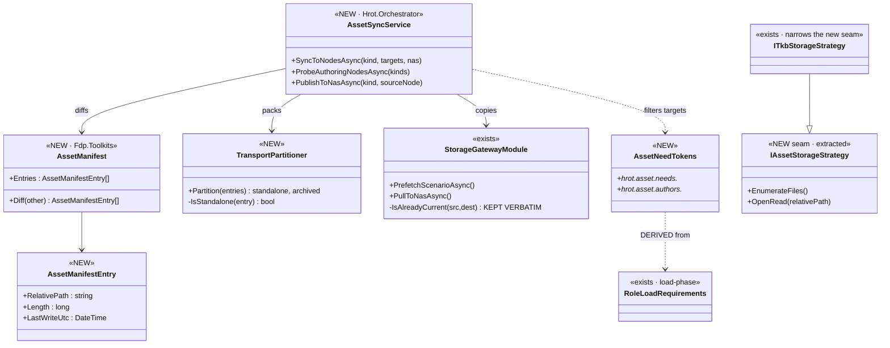
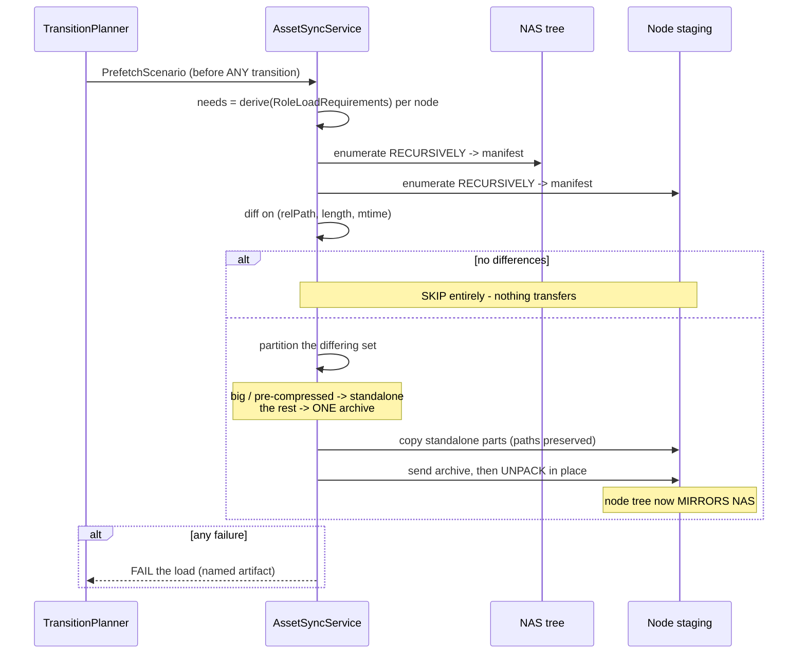
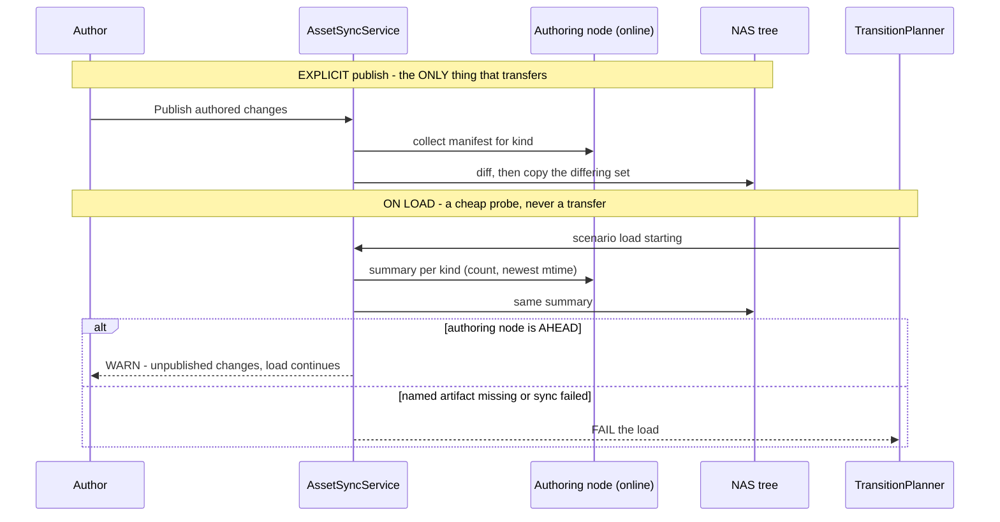
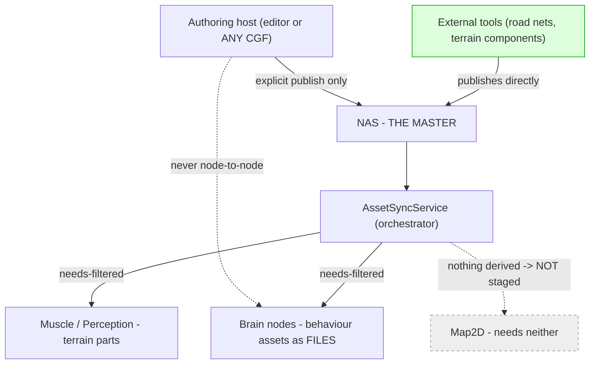

<!--STATUS
state: LIVE
build-state: ✅ READY-TO-BUILD 2026-09-19 — three increments (§8). Carries the INVENTORY (§1), a
  classDiagram (§3), two sequenceDiagrams (§4, §5) and a module-relationship graph TD (§6). Every
  decision here is RULED in Architect_Question_72; ⛔ this document adds no new decisions, only structure.
updated: 2026-09-19
current-answer: §2 is the model in one table (the three forms, the two directions). §3-§6 are the
  structure. §7 is the WHY the diagrams cannot carry. §8 is the increment split. §9 is under-specified.
stale-below: nothing — new document.
known-rot: nothing yet.
known-conflict: none. ⚠ DESIGN_Artifact_Staging.md is a BUILT SUBSET — §2.1 says exactly what it already
  does and what this generalises; ⛔ this document does not re-decide any of it.
related-designs:
  - docs/blueprints/Architect_Question_72_Asset_Lifecycle_And_Distribution.md — THE decision record.
    Every rule here cites a Q72 sub-question; read it for WHY a rule is what it is.
  - docs/DESIGN_Artifact_Staging.md — BUILT. Owns the NAS->node push for ONE artifact (the named TKB) as
    a SINGLE FILE, with the (length, mtime) skip this generalises. Its skip predicate is kept verbatim.
  - docs/DESIGN_Cluster_Load_Phase.md — owns RoleLoadRequirements (which role LOADS which part) and the
    per-role ordered chain. ⭐ This document DERIVES its staging needs from that table (Q72-L) rather
    than authoring a second vocabulary; it decides which BYTES reach a node's disk beforehand.
  - docs/blueprints/Architect_Question_70_Host_Capabilities_And_Reliable_Init_Degradation.md — owns the
    capability-token facility. Both token vocabularies here are namespaces on it; no new facility.
  - docs/designs/cluster-master-cqrs-1/DESIGN.md — owns the prefetch saga and the storage gateway in BOTH
    directions (PushToNodes, PullToNas). This extends both; the trajectory slot is that document's.
  - docs/designs/tkb-1/DESIGN.md — owns ITkbStorageStrategy, the zip/raw VFS pair this generalises (Q72-D).
  - docs/DESIGN_Terrain_Zones_And_Assets.md — owns the terrain definition asset whose schema gains the
    component vocabulary (Q72-A).
-->

# DESIGN — **Asset management: NAS as master, nodes hold what they need**

> **The one rule:** ⭐ **the NAS is the master; a node holds a copy of exactly what it will load; the copy
> is refreshed only when the bytes differ; and a scenario never loads against data that is inconsistent
> anywhere it is needed.**

## 1. INVENTORY — measured `2026-09-18`/`19`

⚠ **Coverage:** grep-corroborated, **not** graph-enumerated (`check_index_coverage` unreachable, and
`scripts/find.sh` mis-reports regex alternations — `BP-558`). ⭐ Treat as a floor.
📄 **The full inventory with its bearing on each decision is `AQ-72` §1** — ⛔ not restated here. The rows
that shape the STRUCTURE:

| # | measured | consequence for this design |
|---|---|---|
| ① | ⛔ **no recursive enumeration anywhere** — every scan is one level (`ScanLocalScenarios:440`, `ScanNasExercises:484`), and `PrefetchScenarioAsync:244` copies flat | 🔴 `Q72-K` (subfolders, any depth) makes a recursive walk **mandatory on both sides**, and it does not exist |
| ② | `FileManifestEntry` = `SourceUnc` + `RelativeDest` + `DocType` — ⛔ **no length, no mtime** | the freshness manifest needs **two fields on a wire DTO** |
| ③ | ⛔ **nothing enumerates a NAS asset tree** for any `AssetKind`; the only asset-ish reader is a ledger dir | the **NAS half is entirely new code** |
| ④ | ✅ `File.Copy` **preserves** the source mtime *(measured)* | a timestamp is a **cluster-wide identity**; both skips share one predicate |
| ⑤ | ✅ `IAssetCatalogContributor.BaseFolder` gives the per-kind dir; ⛔ `IEditableAsset` carries no timestamp | the publish probe is a **stat-only walk**, not a cached read. ⚠ `BaseFolder` is `null` for scenarios |
| ⑥ | ✅ `PullToNasAsync` + consensus aggregators exist (node→NAS); ✅ `PrefetchScenarioAsync` (NAS→node) | **both directions exist**; this adds recursion, partitioning and the skip |
| ⑦ | ✅ `ITkbStorageStrategy` + `ZipTkbProvider` + `RawDirectoryTkbProvider` | the FS-agnostic seam exists **for TKB only** |
| ⑧ | ✅ `RoleLoadRequirements` (BUILT) declares which role loads which part | ⭐ the **source** of the needs tokens (`Q72-L`) |

### 1.1 What `DESIGN_Artifact_Staging` already BUILT — ⛔ not re-decided here

✅ the NAS `tkb/` folder · ✅ the per-node TKB staging root · ✅ the staged header carrying **both** names ·
✅ `IsAlreadyCurrent` on `(length, mtime)` · ✅ the node-side cache key gaining length.
⇒ ⭐⭐ **this design GENERALISES that slice from one named single file to any asset, tree or archive** —
its skip predicate is kept **verbatim**, not re-derived.

## 2. THE MODEL — **three forms, two directions, one predicate**

| | at rest on **NAS** | in **transport** | at rest on the **node** |
|---|---|---|---|
| **who decides** | the publisher — our host, or an **external tool** | ⭐ the **sync**, automatically | 🔒 **a MIRROR of NAS** (`Q72-H`) |
| **shape** | tree **or** archive | a **partition**: big/pre-compressed **standalone**, the rest **one archive** (`Q72-H1`) | identical to NAS — **shape AND structure** (`Q72-K`) |
| **freshness** | ⭐⭐⭐ **the per-file `(relative path, length, mtime)` manifest — on the AT-REST pair, NEVER on the transport** | | |

⭐⭐ **Why the transport may be chosen freely:** ④ means a file copied directly and a file unpacked from an
archive land with **the same mtime**, so the two transport shapes are **indistinguishable to the skip**.
⇒ packing is a pure wire optimisation and needs no agreement from either end.

## 3. CLASS DIAGRAM

> **What the picture shows that prose hid:** `AssetNeedTokens` has a **dashed derive edge**, not a
> composition edge — ⭐ it is **computed** from `RoleLoadRequirements`, never hand-authored beside it
> (`Q72-L`). And `ITkbStorageStrategy` **narrows** the new seam rather than being replaced (`Q72-D`).

## 4. SEQUENCE — **NAS → node, the sync that runs before a load**

> **What the picture shows that prose hid:** the partition happens **after** the diff, so an unchanged
> 100 GB file is **never packed, never copied, never considered** — ⭐ the expensive case is eliminated by
> the cheap check that precedes it.

## 5. SEQUENCE — **node → NAS, publish and the staleness probe**

> **What the picture shows that prose hid:** the two arms end **differently on purpose** (`Q72-I`) — an
> unpublished blueprint edit **warns**, a missing named artifact **fails**. ⭐ The probe returns a
> **summary**, never a manifest, which is what keeps it cheap enough to run on every load.

## 6. MODULE RELATIONSHIPS — **who may write which store**

> **Caption — the two dashed edges are the design.** `Map2D` gets **nothing** because
> `RoleLoadRequirements` derives no need for it — that is `Q72-A`'s intersection doing its job, and the
> load-phase design already measured a `RoadNetworkHolder` on that host **that nothing reads**.
> And authoring hosts **never** push to each other: the NAS is the only path, which is what makes
> *"master source"* true rather than aspirational.

## 7. WHY — what the diagrams cannot carry

### 7.1 Why the freshness key is on the AT-REST pair and never on the transport
An archive built from a tree gets a **new mtime every run** ⇒ a skip keyed on it never fires. Keying on
the per-file at-rest manifest makes the transport **free to change** without touching correctness.
📄 `Q72-H` / §3a.

### 7.2 Why the partition, and not one archive
🔒 **Not a CPU argument.** A 100 GB member makes the archive 100 GB+ **and unpacking needs the size twice
over**, which can simply fail. ⭐ The goal being protected is **file count**, and a partition protects it
fully: *one 100 GB heightmap + 3 000 small files* → **2 transfers**. 📄 `Q72-H1`.

### 7.3 Why the needs tokens are DERIVED, not authored
Two vocabularies for one question is the duplication this codebase produces most. `RoleLoadRequirements`
already answers *"which role needs which part"*, and `AQ-70` already derives roles from tokens one layer
up. ⚠ **What would widen it:** a standby node needing bytes it does not load — deferred by the load-phase
design's own §5.1. 📄 `Q72-L`.

### 7.4 Why subfolders are not an optimisation
🔒 *"this is a way how **user organizes** the assets."* ⇒ the structure is **authored content**; losing it
is losing the user's work. ⛔ That is why ① is a blocker and not a nice-to-have. 📄 `Q72-K`.

### 7.5 Why publish is explicit and the probe never transfers
🔒 Auto-save exists and sync is long; other nodes may be offline at authoring time. ⇒ an automatic sync
would make load time unbounded and fire constantly. ⭐ The probe restores the *"consistent everywhere"*
guarantee **without** paying for it, because a summary is not a manifest. 📄 `Q72-I`.

## 8. THE INCREMENTS — three, and the first is the enabler

| # | what | why this boundary |
|---|---|---|
| **A — the manifest and the recursive walk** | `AssetManifest` + recursive enumeration on **both** sides + the two `FileManifestEntry` fields | ⭐⭐ **everything else needs it**, and ① says it exists nowhere. ⛔ Landing anything else first builds on sand |
| **B — needs-filtered sync with the partition** | `AssetSyncService` NAS→node, tokens derived from `RoleLoadRequirements`, `TransportPartitioner`, the skip kept verbatim | ⭐ this is the increment that makes *"nodes keep just copies they really need"* true |
| **C — publish and the probe** | explicit publish node→NAS, the summary probe, warn/fail split | ⭐ independent of B and **safe to defer**; ⛔ it is the only part that touches authoring hosts |

⭐ **`Q72-D`'s seam extraction rides with B** — it is what lets a tree asset be read without caring whether
it is a directory or an archive.

## 9. UNDER-SPECIFIED

| # | what | who settles it |
|---|---|---|
| **W1** | the **standalone threshold** (size) and the default extension/path rule set | ⭐ implementer, with a configurable default. ⚠ `Q72-H1` ruled the SHAPE; the number is a tuning value |
| **W2** | whether the probe's summary is computed per call or cached on `ContributorChanged` | ⭐ implementer — ⑤ measured the walk is stat-only; start simple, cache only if measured slow |
| **W3** | how a scenario participates in the probe, given ⑤'s `BaseFolder == null` for scenarios | ⭐ implementer. ⚠ Scenarios already travel by the prefetch path, so the likely answer is **they do not** — ⛔ but that must be stated, not assumed |
