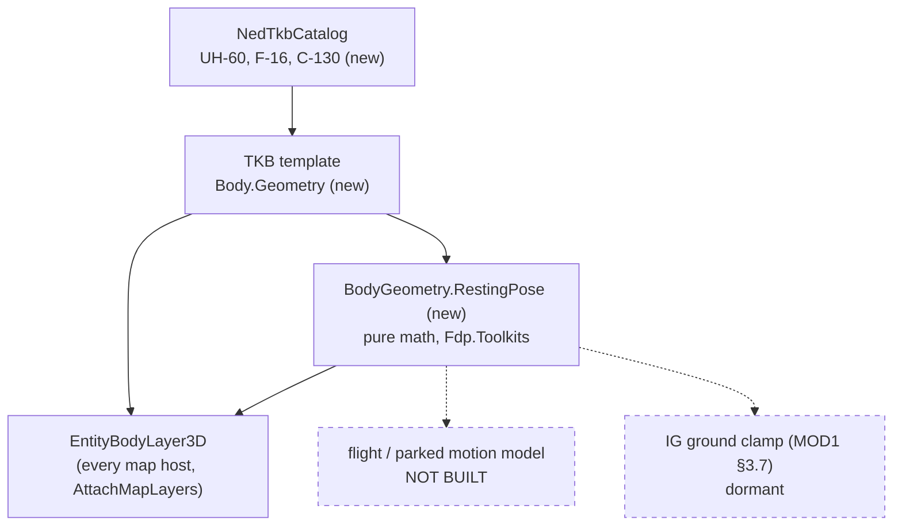
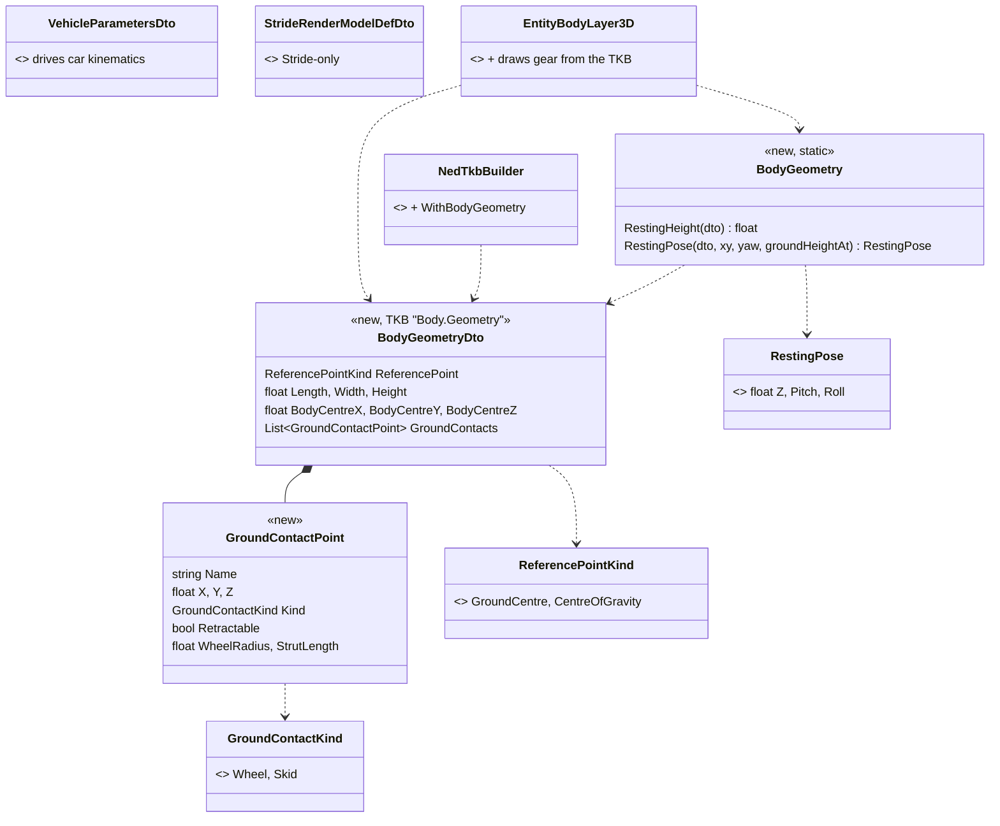
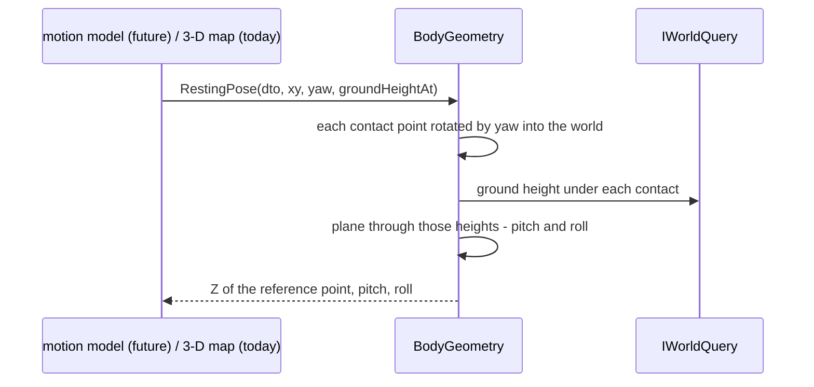

<!--STATUS
state: LIVE
build-state: BUILT 2026-10-10 (G1–G5); the first SIM consumer (a flight / parked-aircraft motion model) is not built — §5.
updated: 2026-10-10
current-answer: §2 inventory · §3 diagrams · §4 decisions · §5 as-built and what is left.
stale-below: nothing.
known-rot: none.
known-conflict: docs/designs/modularizing/MOD1-DESIGN.md §3.7.4 — its IG clamp sets an entity's Z to the terrain hit, which
  is right for a ground-referenced vehicle and BURIES a CG-referenced aircraft by its gear height; not reconciled (§5, finding).
related-designs:
  - DESIGN_Visual_Effects.md — the same "the TKB type defines it" pattern for effects; decals drape on the ground under a hit.
  - DESIGN_Map_3D_Mode.md — draws the aircraft kits; places the body by this descriptor's box offset and draws the gear at its
    contact points (§3.5).
  - DESIGN_Terrain_Height.md — §4a / R-249: the motion model, reading the clamping flag, puts an entity on the ground; this
    design gives that model the gear height and the resting pose for a CG-referenced body.
  - designs/modularizing/MOD1-DESIGN.md — §3.7 the IG ground-clamp pipeline and the GroundClampingOverride descriptor that a
    flight model flips on touchdown / take-off.
  - designs/tkb-1/DESIGN.md — owns the TKB descriptor model; Body.Geometry is a new descriptor in it.
-->

# DESIGN — body geometry and ground contact (aircraft landing gear)

🔒 **User, `2026-10-10`:** *"note the aircraft model need to 'know' where their landing gear is relative to their center of
gravity (reference point) so that we can simulate the landing; so we need some new fields in TKB description and the TKB
entries for the aircraft."*

## 1. The problem in one line

An aircraft's position (`SimTransform.Position`) is its **centre of gravity**, not a point on the ground — so resting, taxiing
and touching down need to know **where the wheels are relative to that point**. Nothing in the TKB says so today.

## 2. INVENTORY — measured `2026-10-10` (graph CLI `search_graph` + `search_code`, grep; `check_index_coverage` not available via CLI)

| query | result |
|---|---|
| `search_graph` `.*(Gear|ContactPoint|GroundContact|CentreOfGravity|ReferencePoint|Airframe|Aircraft|Flight|Wheel).*`, Class | **0 production** hits (flight-recorder tests, a test `WheelState`) |
| `search_code` "landing gear", "gear height", "center/centre of gravity" | one design talk only: `.dev/_DONE/modularizing/design-talk.md:1863` (a flight model flips clamping on take-off / touchdown) |
| TKB size sources | `VehicleParametersDto` (L, W — and it drives car kinematics), `SimVehicleDef` (catalog builder input, mapped to it), `StrideRenderModelDefDto` (box half-extents, offsets — **engine-specific by its own rule**, `:35-43`) |
| ground clamping | `GroundClampingConfig` (`Geographic/Components/GroundClampingConfig.cs:12`), MOD1 §3.7's IG pipeline, `CarKinematicsSystem` reading the flag (R-249) — all treat the position as a GROUND point |
| built-in aircraft | **none** (`TkbEntityTypes`; ids 400–499 unused) |

## 3. THE ARCHITECTURE

### 3.1 Modules — who reads the geometry

*What the picture shows that prose hid:* today the ONLY live reader is the 3-D map. The two readers the user's goal needs —
the motion model that lands and parks the aircraft, and the IG clamp — are drawn dashed: the data and the math are ready for
them, the systems are not built (§5).

### 3.2 Classes

*What it shows:* one engine-neutral descriptor, sitting BESIDE the two existing size sources rather than inside either — the
kinematics one would give an aircraft car physics, the Stride one is engine-specific.

### 3.3 Sequence — resting on the gear (what a lander or parker calls)

## 4. DECISIONS *(built — the user may redirect any row)*

| # | decision | ⭐ chosen | rejected — one line each |
|---|---|---|---|
| **G1** | where the fields live | ⭐ ONE new engine-neutral descriptor `Body.Geometry`: what the position MEANS (reference point), overall size, where the size box sits relative to the reference point, the ground-contact points | extend `StrideRenderModelDefDto` — engine-specific by its own rule (R-250) · fields on `VehicleParametersDto` — that descriptor gives an entity CAR kinematics · a gear-only descriptor — the drawing also needs the size and the box offset, so two descriptors would describe one body |
| **G2** | the contact points | ⭐ metres in BODY axes from the reference point (x forward, y left, z up — `z < 0` below the CG), each a wheel or a skid end, retractable or not, with a wheel radius and a strut length; the point is where the tyre / skid TOUCHES the ground | the axle centre — every reader would re-add the radius · fractions of the size — a gear position is a fixed engineering number |
| **G3** | the math | ⭐ `BodyGeometry.RestingHeight` (level ground) and `RestingPose` (a plane through the ground under the contacts ⇒ Z, pitch, roll — works on slopes, R-248), pure and engine-neutral in `Fdp.Toolkits` | each consumer computing its own — three versions of "where does the aircraft sit" |
| **G4** | the TKB entries | ⭐ **UH-60A Black Hawk** (400, DIS 1.2.225.21 utility helicopter, wheeled), **F-16C** (401, 1.2.225.1 fighter), **C-130H** (402, 1.2.225.4 cargo): master, visual, DIS, faction, `Body.Geometry` — **no** `VehicleParametersDto`, so they get no car kinematics; placeable from Add Entity as static entities | generic "Helicopter / Jet / Cargo" types — real types make the gear numbers checkable |
| **G5** | the 3-D map | ⭐ with `Body.Geometry` the kit is placed by the box offset and its own drawn gear is replaced by gear AT the TKB points; retractable gear is hidden when the body is clearly airborne (presentation-only until a gear-state component exists) | drawing the kit's generic gear — would disagree with the numbers the landing uses |

## 5. AS-BUILT and what is left

| piece | where |
|---|---|
| `BodyGeometryDto`, `GroundContactPoint`, the two enums; `BodyGeometry` + `RestingPose` | `FDP/Toolkits/Fdp.Toolkits/Tkb/Domain/BodyGeometryDto.cs` |
| `TkbEntityTypes.Heli_UH60 = 400`, `Jet_F16 = 401`, `Cargo_C130 = 402`; `NedTkbBuilder.WithBodyGeometry`; the three entries | `Hrot/Engine/Hrot.Core/MapDefinitions/` |
| kit gear parts tagged `PartRole.Gear`; the layer draws TKB gear | `Hrot/Engine/Hrot.Presentation/Map3D/` |

**Gates:** `BodyGeometryTests` 7/7 (inside `Fdp.Toolkits.Tests` **3051/3052**, 1 skip); `Hrot.Core.Tests` **217/217**;
`Hrot.Presentation.Tests` **431/432** (the frame rail skips without a display; under Xvfb it draws the three aircraft — two
airborne with gear up, the C-130 parked by `RestingPose` on its TKB gear); `Hrot.Editor.Tests` **474/476**; `Hrot.IG.Tests`
**461/462**; `Hrot.SimHost.Tests` **1177/1180**; `Hrot.ReplayBrowser.Tests` **34/34**.

⚠ **Left, named — each needs its owner, none is silently assumed:**

| gap | lean |
|---|---|
| no motion model moves an aircraft (no flight dynamics, no taxi), so nothing lands or parks one; a placed aircraft keeps the Z it was placed at | the stand-in aircraft motion model, when built, grounds with `RestingPose` while its clamping flag is on (R-249 — the model reads the flag; ⛔ no separate clamp step, R-182) and flips `GroundClampingOverride` on touchdown / take-off (MOD1 §3.7.7) |
| 🔴 MOD1 §3.7.4's IG clamp sets Z to the terrain hit — it would bury a CG-referenced aircraft by its gear height | the clamp target becomes `hit + RestingHeight` when the type's reference point is the CG |
| nothing seeds `GroundClampingConfig.BaseRequiresClamping` from the TKB (Terrain_Height H1 finding) | seed it where the TKB is applied; an aircraft starts unclamped unless placed on the ground |
| gear up / down is not a state anywhere | a gear-state component owned by the flight model; the map's airborne heuristic then retires |
