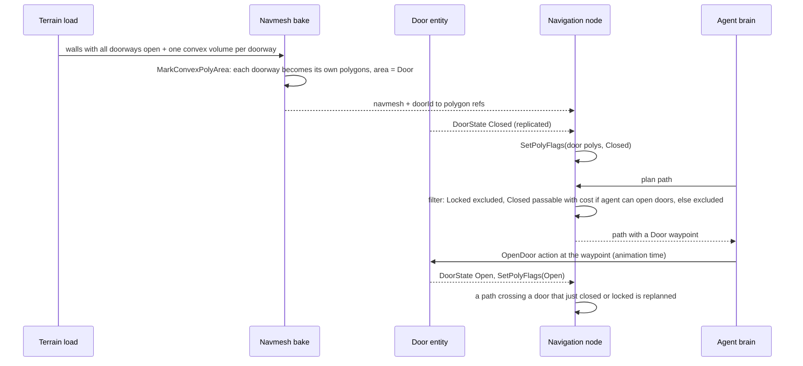
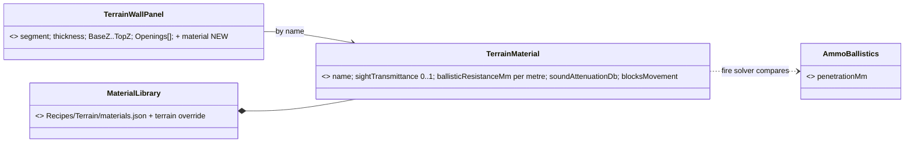
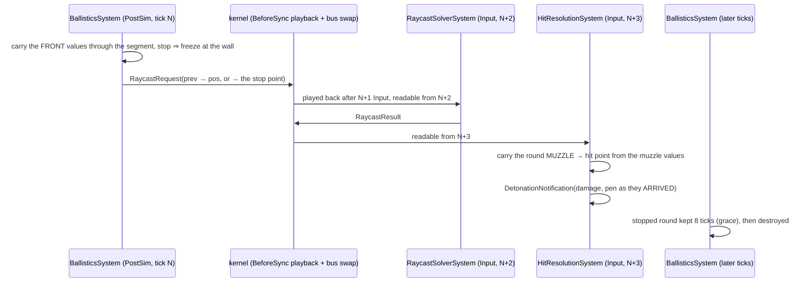
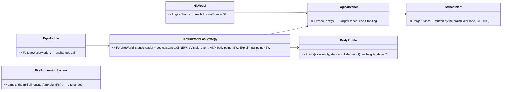
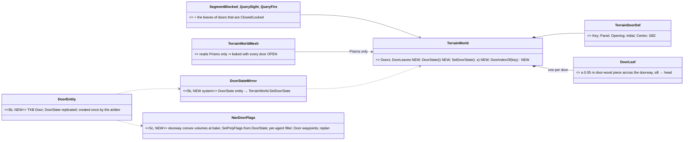
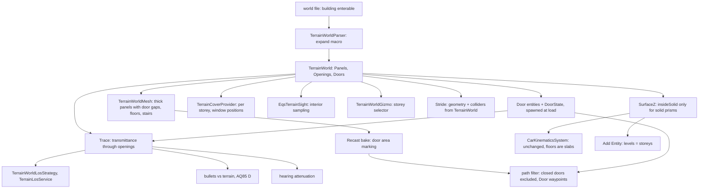

<!--STATUS
state: LIVE
updated: 2026-10-07 (rev 8 — §3d approved and built: §3h penetration as built; rev 7 — blast/fragment exposure by wall height and posture, §3f; §3g Stage 1 as built)
build-state: READY-TO-BUILD for B-0…B-2 — §3/§3a/§3b leans APPROVED by the user 2026-10-07; §3c materials APPROVED 2026-10-07; §3d APPROVED 2026-10-07 (R-217) and BUILT (§3h)
current-answer: §3j Stage 5 doors · §3i Stage 4 posture · §3h penetration as built · §3g Stage 1 as built · §7 programme summary · §3f (rev 7) > §3e (rev 6) > §3d (rev 5) > §3c (rev 4) > §3b (rev 3) > §3a (rev 2) > §3 where they differ · §4 change map · §6 slices
stale-below: §3 rows B1, B5, B6, B9 are rev 1 — superseded by §3a
known-rot: none yet
known-conflict: DESIGN_Terrain_World.md §2 / §6 L459 — "building = solid prism (floors = label only in v1)". This doc is the
  v2 that note deferred ("enterable buildings need doors/stairs"); solid prisms stay valid for walls and non-enterable
  buildings.
related-designs:
  - DESIGN_Terrain_World.md — OWNS the one world file → one TerrainWorld model and every query on it (R-181/182/183).
    This doc proposes the enterable-building extension of that model; the terrain doc stays the owner.
  - blueprints/Architect_Question_81_SimHost_Test_Terrain_World.md — T1 (2.5D hand-authorable primitives, mesh rejected),
    T5 (Z picks the floor), T7 (multi-level), T8 (Stride renders the same file, "later").
  - DESIGN_Add_Entity_Picker.md §2c — level 0 = ground everywhere; filed CE-1031, which this doc resolves.
  - designs/navig-2/Navigation_Design_v2_0.md — owns TraversalKind.Door (§4) and multi-layer navmesh (§8); doors here
    feed it.
  - designs/group-maneuvers/Squad_Coordination_Design_v1_1.md §8.6 — stack-and-room-entry; built roles, no geometry.
  - blueprints/Architect_Question_85_Hit_Chance.md §D — bullets against terrain walls; shares this doc's trace query.
  - DESIGN_Terrain_Combat_Tuning.md — OWNS the defaults (reference library + provenance), the demo/test plan and the
    diagnostics (routes, gizmo layers) for everything in this doc.
  - designs/eqs-2/EQS_Design_v1.3_final.md §19 — TerrainCoverProvider (outer prism edges only today).
  - DESIGN_Terrain_Zones_And_Assets.md §2.1c — buildings are static/bakeable terrain content.
-->

# Enterable buildings — walls, doors, windows, floors *(target state, CE-1031)*

> 🔒 **User, `2026-10-07`:** *"let's pls discuss the building with walls and doors and windows (visibility through) and
> floors, this is desired target state, what will we need to change?"* · earlier: *"buildings are not usually solid in
> real world"*.

## 1. Where we are — measured

### INVENTORY *(codebase-memory graph + grep, `2026-10-07`)*

| query | result |
|---|---|
| `trace_path` inbound on `TerrainWorld.SegmentBlocked` | 12 callers: `TerrainWorldLosStrategy`, `TerrainLosService` (→ `CheapLineOfSightTest`, `ThreatExposureTest`), `DangerAreaSensorSystem` + tests |
| `trace_path` inbound on `TerrainWorld.SurfaceZ` | `CarKinematicsSystem`, `DangerAlongRouteClassifier`, `EqsTerrainSight.TryPlace` (→ `PointPatternGenerators`), `TerrainCoverProvider` |
| grep `.Prisms` / `.Walkables` / `InsideSolid` (graph does not model field reads) | `TerrainWorldMesh` (navmesh), `TerrainCoverProvider`, `EqsTerrainSight.InsideSolid`, `TerrainWorldGizmo` (2D), `WorldInfoReport`, `TerrainResidency` (load) |
| `search_graph` for Hearing/Occlu/HitChance/Penetrat/Building/Stair/Transpar/Interior classes | **none** — no window, door, transparency or interior concept exists |

### Claim table

| claim | code — how it IS | design — how it was MEANT |
|---|---|---|
| a building is one solid volume | ✅ `TerrainPrism` (`TerrainWorld.cs:21-36`) blocks BaseZ..TopZ; `Floors` label only | ✅ `DESIGN_Terrain_World.md` §2 L76; §6 L459 *"prisms are solid in v1: enterable buildings need doors/stairs"* |
| floors and stairs already exist as primitives | ✅ `TerrainWalkable` slab/ramp with per-vertex Z; `SurfaceZ` stands on them; the garage deck + ramp in `test-town` | ✅ AQ81 T1 *"a garage = slabs + ramps"*, T7 multi-level |
| the navmesh already handles stacked floors | ✅ `TerrainWorldMesh` sends slab/ramp triangles to Recast; the heightfield keeps stacked spans; Infantry agent 0.3 m radius, 1.8 m height, 0.4 m climb (`RecastNavmeshBaker.cs:62`) | ✅ Terrain_World §6 L454 (DotRecast chosen for *"stacked floors natively"*) |
| inside a footprint there is no ground and no navmesh | ✅ `SurfaceZ` skips `GroundZ` when `insideSolid` (`:124-126`); `TerrainWorldMesh` drops ground cells inside prisms (`:76-84`), emits roof + outer walls (`:86-113`) | ✅ same §2 |
| sight is a yes/no test; nothing is partly see-through | ✅ `SegmentBlocked` returns bool (`:137-169`); `ILosStrategy.IsVisible` bool; forest affects cost only | ⛔ searched, no transparency design |
| **bullets ignore terrain entirely** | ✅ `RaycastSolverSystem` → `Intersection2D.RaycastCircle` against entity colliders only; `LineOfFire.BlockedByFriendly` is the only pre-fire check | ✅ AQ85 §D plans 3D bullets against terrain walls (not built) |
| hearing ignores terrain | ✅ `AcousticPerception.cs:131-136` distance only | ⛔ searched, none |
| cover and EQS sample outside only | ✅ `TerrainCoverProvider` every 2.5 m along outer prism edges, stance from the whole prism height; `EqsTerrainSight.InsideSolid` rejects every interior point | ✅ EQS §19 (as built) |
| doors exist only as a navigation word | ✅ `TraversalKind.Door` contract; `DotRecastNavmeshProvider` marks every waypoint `Walk`; no off-mesh links, no area flags, no TileCache in the bake | ✅ Navigation v2 §4 (*"derived from off-mesh-link userId"*) — never authored |
| nothing moves through walls only because paths go around them | ✅ `CarKinematicsSystem` has no static collision; RVO between entities only | ✅ W8 (movement model owns Z) |
| Stride's 3D world is separate | ✅ `StrideHrotGame.BakeNavmesh` bakes scene colliders; no `TerrainWorld` reference under `Stride/` | ⚠ AQ81 T8 *"later: Stride renders the same file"* |
| urban behaviours assume interiors they cannot use | ✅ squad room-entry roles built (BATCH-31) with no room geometry; every demo fights around blocks | ✅ Squad §8.6 stack-and-room-entry (planned) |

## 2. The target, in one picture


*What it shows:* an enterable building adds only ONE new primitive, the wall panel with openings. Floors, stairs and
the roof are the slabs and ramps that already work everywhere (`SurfaceZ`, navmesh, sight). A building is a
parse-time macro, not a runtime type.

## 3. Decisions *(leans — reply "approved" or name the one to change)*

| # | decision | ⭐ lean | rejected (one line each) |
|---|---|---|---|
| **B1** | how a building is modelled | ⭐ **a parse-time macro**: a world-file `building` with `"enterable": true` expands into wall panels per storey (outer walls with openings, optional inner walls), a floor slab per storey, stairs as ramps, a roof slab. A building without the flag stays a solid prism (`test-town` unchanged) | a runtime `Building` type every consumer must understand — eleven consumers would each learn a new shape · a triangle mesh — AQ81 T1 rejected it as not hand-authorable |
| **B2** | the new primitive | ⭐ **`TerrainWallPanel`**: a wall segment with thickness and BaseZ..TopZ, carrying **openings** (door, window, gap) as intervals along it with a sill and a head height | holes in prism polygons — the parser rejects holes today, and a hole is a plan-view thing, not a door at a height |
| **B3** | sight through openings | ⭐ the terrain trace returns **transmittance (0..1)**, not a bool: an opening passes 1.0; a window's *glass* value is a per-opening property (default 1.0 for sight); `ILosStrategy` thresholds it. Forest can later use the same value | keep a bool — windows would be fully open or fully opaque, and partial cover (foliage, smoke) would need a second API later |
| **B4** | one trace for sight, fire and sound | ⭐ **one `TerrainWorld.Trace(from, to, purpose)`** returning the crossed occluders; sight, bullets (AQ85 §D) and hearing (attenuation per wall) read it with their own rules | three geometry paths — the disease R-181 ("one model, cannot disagree") exists to prevent |
| **B5** | doors | ⭐ **doors are entities** (TKB type `Door`), spawned from the world file at load with a stable id, carrying a replicated **`DoorState`**; the navmesh marks each doorway polygon with a **door area**, and the path filter excludes closed/locked doors — no rebake. Static open doorways (no `DoorId`) are just gaps | doors as terrain-only data — their state would not replicate or persist · rebake on every door change — seconds per change |
| **B6** | moving through a door | ⭐ the path planner emits `TraversalKind.Door` on door polygons (Navigation v2 §4); the brain/animation opens it; until door actions exist, doors spawn **open** | off-mesh links per door — Recast already carves the doorway; a link adds a second representation |
| **B7** | authoring | ⭐ facade **rules with defaults** (storey 3 m, a window every 3 m at sill 0.9 m / head 2.1 m, one door per facade marked) plus an explicit openings list that overrides; still hand-editable GeoJSON | every opening by hand — a 4-storey block is ~60 openings · an external generator tool — a second producer of the file |
| **B8** | 2D map | ⭐ a **storey selector** on the map (and "follow the selected entity's storey"): walls and openings of that storey drawn, other storeys faint, roofs off when inside | draw all storeys at once — unreadable |
| **B9** | Stride 3D | ⭐ **in this programme**: Stride generates building geometry and colliders from the same `TerrainWorld` (AQ81 T8) — otherwise the 3D view shows solid blocks while the sim walks inside | keep Stride's hand-made scene — the two worlds disagree exactly where interiors matter |

## 3a. Rev 2 — the user's answers *(`2026-10-07`)*

> 🔒 **User:** *"Stride will later build its terrain from our file, part of programme, but out of scope now. What kind
> of shortcut in terrain file you mean? Position of doors and windows — will they be in the terrain, how? Special side
> file for building templates? We need buildings with inner walls as well. Solid building is just special case of a
> generic building. One query for all, but possibly different solver implementation (sound does not travel just
> straight). Door opening action needed. How the closed door will block the pathfinding? Can closed doors be treated as
> obstacle while navmesh is always for all doors opened?"*

### The building file model — templates in a side file, instances in the terrain *(supersedes B1, B7)*


*What it shows:* the "shortcut" is the **instance**: one line in the terrain file names a template and where it stands;
the template carries every wall, door and window in its own local coordinates. The runtime keeps the building
(for room/portal queries) and also its expanded primitives (for every existing consumer).

| ⭐ lean | |
|---|---|
| **Template = a side file** `<name>.building.json`, looked up like terrains: the terrain's own `buildings/` folder first, then the shared `Recipes/Buildings/` library | a house type used 20 times is described once |
| **Template coordinates are local** (metres, origin at the template's anchor); the instance gives `position`, `rotation`, `baseZ` | moving or rotating a building moves its doors and windows with it |
| **Doors and windows live on their wall**: `at` = metres along the wall from its `from` end, `width`, `sillZ`/`headZ` above that storey's floor; a door may carry a `doorId` and an initial state | a wall knows its openings; no separate geometry to keep aligned |
| **Inner walls are just walls** in the storey's list — no outer/inner distinction in the data; a room is whatever the walls enclose | |
| **🔒 Solid is the special case**: a template (or inline building) with `"solid": true` and no storeys is today's prism; today's `{"kind":"building","height":12}` polygon still parses as exactly that | `test-town` keeps working unchanged |
| **Inline variant** for a one-off: the same template JSON inside the instance's `properties` | no side file for a unique building |
| **Door ids are instance-qualified at load**: `"Block D/front"` | a stable **terrain-object key**, NOT a network id — §3b translates it to a runtime network id |
| ⛔ dropped: rev-1 B7 facade rules | explicit openings are clearer; a template is written once, so the cost of explicitness is paid once |

Example — a template and an instance:

```jsonc
// Recipes/Buildings/house-2f.building.json
{ "name": "house-2f",
  "storeys": [
    { "height": 3.0,
      "walls": [
        { "from": [0,0],  "to": [10,0], "thickness": 0.3,
          "openings": [ { "kind": "door",   "at": 4.5, "width": 1.0, "sillZ": 0.0, "headZ": 2.1, "doorId": "front", "initial": "closed" },
                        { "kind": "window", "at": 1.5, "width": 1.2, "sillZ": 0.9, "headZ": 2.1 } ] },
        { "from": [10,0], "to": [10,8], "thickness": 0.3 },
        { "from": [10,8], "to": [0,8],  "thickness": 0.3 },
        { "from": [0,8],  "to": [0,0],  "thickness": 0.3 },
        { "from": [5,0],  "to": [5,8],  "thickness": 0.15,
          "openings": [ { "kind": "door", "at": 6.0, "width": 0.9, "sillZ": 0.0, "headZ": 2.1, "doorId": "hall" } ] } ],
      "stairs": [ { "from": [8,1], "to": [8,6], "width": 1.0, "toStorey": 1 } ] },
    { "height": 3.0, "walls": [ "…" ] } ],
  "roof": "flat" }
```
```jsonc
// test-town.world.geojson — one feature
{ "type": "Feature", "geometry": { "type": "Point", "coordinates": [150, 120] },
  "properties": { "kind": "building", "template": "house-2f", "rotation": 90, "baseZ": 0, "label": "Block D",
                  "doors": { "front": "locked" } } }
```

### One query, a solver per purpose *(supersedes B3/B4 wording)*

| ⭐ lean | |
|---|---|
| **One API**: `ITerrainPropagation.Query(from, to, Purpose) → { transmittance 0..1, path length, crossed[] }` | callers ask one question; the answer's meaning is per purpose |
| **Sight solver**: straight trace; openings 1.0; closed door = its panel; window glass per opening | straight is right for light |
| **Fire solver**: straight trace; walls stop; openings pass; penetration later (AQ85 §D) | |
| **Sound solver**: ⭐ v1 straight trace with attenuation per crossed wall/floor (less through openings); ⭐ v2 **portal propagation** — shortest route from room to room **through openings** (rooms derived from the walls at load), attenuated by distance and by each closed door | sound bends around corners and through doors; the room/portal graph is why the runtime keeps `TerrainBuilding`, not just flattened panels |

### Doors — state, action, and how a closed door blocks paths *(supersedes B5/B6)*

🔒 **Yes: the navmesh is always baked with every door OPEN, and a closed door acts as an obstacle at runtime — no
rebake.** Measured: the referenced DotRecast (2026.1.3) has `RcConvexVolume`/`MarkConvexPolyArea` (bake), and
`DtNavMesh.SetPolyFlags` + `DtQueryDefaultFilter.SetIncludeFlags/SetExcludeFlags` (runtime); no TileCache package is
referenced.


*What it shows:* the door is geometry at bake time (its own polygons) and a flag at run time; the same replicated
`DoorState` drives the path filter, the sight/fire trace (closed = opaque panel) and the sound solver.

| ⭐ lean | |
|---|---|
| **Door = an entity** (TKB `Door`), created ONCE in the cluster at load by the arbiter, ⛔ ~~with a deterministic network id from terrain name + qualified door id~~ **RETRACTED rev 3** — no such scheme exists; its runtime id comes from the one allocator, through the key map of §3b | every node can address the same door; its state replicates |
| **`DoorState`**: Open / Closed / Locked / Destroyed; initial value from the template, overridable per instance, overridable per scenario | |
| **Actions**: `OpenDoor`, `CloseDoor`, `Lock`/`Unlock`, `Breach` — behaviour actions executed by the door's owner; the actor needs to be adjacent; opening takes animation time | |
| **Path filter per agent**: Locked → excluded (unless the agent can breach: high cost + `Breach` waypoint); Closed → passable at a cost with a `TraversalKind.Door` waypoint for agents that can open doors; excluded for vehicles/animals | |
| **Every navigation node applies the same flags** from the replicated `DoorState`, so all nodes plan alike | |
| ⛔ rejected: TileCache obstacles | needs a tiled navmesh + the TileCache package, rebuilds tiles, and gives a wall, not a door with semantics |
| ⛔ rejected: rebake per door change | seconds per change |
| ⛔ rejected: off-mesh link per door | Recast already carves the doorway; a link is a second representation |

### Stride *(supersedes B9)*

🔒 **Out of scope now**; part of the programme later — Stride will build its terrain from this file (AQ81 T8). Slice
B-7 is parked.

## 3b. Rev 3 — terrain-object ids and saving door state *(user, `2026-10-07`)*

> 🔒 **User:** *"network ids are dynamic so the 'fixed' ones from the terrain need to be translated to real runtime
> network id same as scenario entity network ids. those fixed terrain-provided ids must never collide with scenario
> entity ids."* · approved: window = plain opening (v1); the scenario author sets a door's initial state.

### Claim table — how ids work today *(measured)*

| claim | code — how it IS | design — how it was MEANT |
|---|---|---|
| a scenario has no stable entity id | ✅ the file key is `Guid.NewGuid()` per save (`ScenarioSerializer.cs:164-176`); the entity's last runtime id is saved in `NetworkIdentity` and used only as the "old id" at the next load | ✅ `DESIGN_Distributed_Scenario_Persistence.md` §4b I2 *"the DOM key is `Guid.NewGuid()` generated per save, not the network id"* |
| runtime ids are re-allocated at every load and references remapped | ✅ `StagingEntityExtractor.cs:243-262` `oldToNewMap[oldId] = idAllocator.AllocateId()` → `EntityCreationRequest.PreAllocatedNetworkId`; every component remapped through `EntityRef` (`RemapComponentNetworkIds`, `:406-438`) | ✅ `DESIGN_Entity_Reference.md` D3/D4 *"ONE type plan, two appliers"* |
| ONE id authority, one sequence, no namespaces | ✅ the authority resets to 1000 at every world reset; CGF allocates authored ids | ✅ `DESIGN_Deterministic_Network_Ids.md` §11b/§11e *"One id authority per world … no reserved band to police"* |
| ⇒ rev 2's "deterministic network id from the door key" does not exist | ⛔ no hashed/name-derived id anywhere | ⛔ the ids doc has none — **rev 2 cited a scheme the cited doc does not contain** |
| Save writes CURRENT state, in Edit and Live alike | ✅ `ScenarioSerializer.cs:178-190` walks live components; save-in-Live proven (`POST /scenario/save` in `--mode all`) | ✅ Persistence §1 *"save an entity iff you are its non-transient primary owner"* |
| a checkpoint is a binary snapshot, and cannot be restored yet | ✅ `ReferenceCheckpointHandler` → `.fdp` per node; *"Restore Checkpoint is NOT here"* (`ScenarioMenuCommands.cs:231-233`) | ✅ `DESIGN_Cgf_Scenario_Session_Slice.md:183` (restore deferred) |

### Decisions

| # | ⭐ lean | rejected (one line each) |
|---|---|---|
| **K1** | 🔒 a door's runtime network id comes from **the same single allocator** as every entity — so it can never collide with any runtime id, by construction | a reserved numeric band for terrain objects — the ids design rules *"no reserved band"* and would need policing |
| **K2** | 🔒 what the terrain provides is a **terrain-object key**, a STRING: `"<terrain>/<building>/<doorId>"` (e.g. `"test-town/Block D/front"`). It is never a number, so it cannot be mistaken for a scenario entity's saved id (which is numeric) | numeric terrain ids — two number spaces in one reference field would collide exactly as the user warns |
| **K3** | at load, the **arbiter creates the door entities in key order** right after the scenario's own allocation step, and keeps a **`TerrainObjectMap: key → runtime id`** beside `oldToNewMap` (same `OnRemap` channel) | creating doors on every node — one door would become N entities |
| **K4** | a scenario reference to a door (a behaviour param *"open this door"*, a door-state entry) stores the **key**, not a number: a `TerrainObjectRef` beside `EntityRef`, resolved through `TerrainObjectMap` by the same remap pass | storing the door's runtime number — meaningless at the next load |
| **K5** | door ENTITIES are not saved (the terrain recreates them); door STATE is: the scenario gets a `terrainObjects` section keyed by K2 — `{ "test-town/Block D/front": { "door": "Locked" } }` | saving door entities — they would be created twice (terrain + scenario) |

### Saving door state — what I meant, corrected

⛔ **Rev 2 said *"runtime changes saved only by checkpoints"*. That was WRONG for this codebase and is retracted:** I
assumed a split between an authored initial state and a runtime state; measured, **Save writes the CURRENT state of
every entity, in Edit and Live alike**, and a checkpoint is a separate binary snapshot that cannot be restored yet.
⇒ **Doors follow the same rule as everything else:** whatever state a door has when the scenario is saved is written
into `terrainObjects` (K5), and that becomes its initial state at the next load. In Edit mode that is exactly *"the
scenario author sets the initial state"*; a save during Live captures the door as it is then, like it captures every
moved vehicle.

## 3c. Rev 4 — fences and materials *(user, `2026-10-07`)*

> 🔒 **User:** *"approved the building design's other leans (templates in side files, one query with a solver per
> purpose, doors as entities with navmesh flags). we need to have also fences — different resistance to bullet
> penetration, different params of visibility blocking."*

📐 **Measured:** the world file already has `wall` (a LineString with `height`, `thickness`, `baseZ`; `test-town` has a
0.5 m *Low Wall* and a 3 m *High Wall*). ⛔ ~~no penetration value exists anywhere~~ **RETRACTED rev 5** — the search
missed the TKB folder: `WeaponMountDto.Penetration` (mm RHA, `CE-3071`) exists and drives `ArmorModel`; see §3d.


*What it shows:* a fence is not a new primitive — it is a wall panel with a material; the material is the one place
the three solvers (sight, fire, sound) and the navmesh read their per-surface numbers from.

| # | decision | ⭐ lean | rejected (one line each) |
|---|---|---|---|
| **M1** | what a fence is | ⭐ **a wall panel with a material** — the existing `wall` feature (and template walls) gains `"material"`; `fence` is accepted as an alias of `wall` whose default material is `fence-wood` | a separate `fence` primitive — a second shape every consumer must learn, for the same geometry |
| **M2** | where materials live | ⭐ a **material library side file** (`Recipes/Terrain/materials.json`, overridable in the terrain folder — the same lookup as building templates); panels name a material; unknown name fails the load loudly | numbers on every feature — the same fence typed 40 times |
| **M3** | sight | ⭐ `sightTransmittance` 0..1 per material, **multiplied** along the line; perception sees through when the product ≥ a threshold (⭐ 0.5) in v1; later the product scales detection range | thickness-dependent sight — a fence's see-through-ness is its pattern, not its depth |
| **M4** | bullets | ⛔ *superseded by §3d P2* — ~~pass when `penetrationMm` ≥ the sum; a new ammo field with a default per weapon class~~ (there is no "weapon class"; the source and the rule are in §3d) | a pass probability per material — a 5.56 and a 12.7 would go through a wooden fence equally |
| **M5** | sound | ⭐ `soundAttenuationDb` per material, summed along the path (the sound solver of §3a) | |
| **M6** | movement | ⭐ `blocksMovement` (default true): a blocking panel goes into the navmesh like any wall — a 1 m fence is higher than the infantry climb (0.4 m), so it blocks walking; vaulting and vehicles breaking through fences are later | fences never in the navmesh — units would walk through them |
| **M7** | defaults for existing content | ⭐ a wall with no material is `concrete`; `test-town` is unchanged in behaviour | |

**Starter material table** *(values are placeholders to tune, not data)*:

| material | sight | ballistic resistance (mm RHA per m) | sound (dB) | typical thickness |
|---|---:|---:|---:|---:|
| `concrete` | 0.0 | 1500 | 40 | 0.2–0.4 m |
| `brick` | 0.0 | 1000 | 35 | 0.25 m |
| `fence-wood` (solid planks) | 0.0 | 60 | 10 | 0.03 m |
| `fence-chainlink` | 0.85 | 5 | 0 | 0.005 m |
| `fence-metal-sheet` | 0.0 | 200 | 15 | 0.002 m |
| `hedge` | 0.3 | 20 | 5 | 0.8 m |
| `glass` *(windows later; v1 windows are openings)* | 1.0 | 30 | 20 | 0.01 m |

## 3d. Rev 5 — where penetration comes from, and explosive effects *(user, `2026-10-07`)*

> 🔒 **User:** *"what is the weapon class? I always tend to treat weapons as the launcher and the projectile (ammo)
> because both together may affect the penetration capability (projectile type, projectile speed)."* · *"…and what
> about explosive ammo with indirect hit effect?"* · approved: §3c materials.

### Claim table *(measured — graph + grep)*

| claim | code — how it IS | design — how it was MEANT |
|---|---|---|
| ⛔ "weapon class" | does not exist — **I invented it in rev 4; retracted** | — |
| penetration exists, per weapon MOUNT | ✅ `WeaponMountDto.Penetration` (mm RHA) + `DamagePerHit` (`WeaponSuiteDto.cs`, `CE-3071`) → copied onto the bullet (`FireProcessingSystem.cs:154`) → `DetonationNotification.Penetration` → `DamageCalculationSystem.cs:69-77` | ✅ `CE-3071` |
| the penetration rule is a smooth ramp, expected damage, no dice | ✅ `ArmorModel.PenetrationChance = clamp((pen / armour − 0.8) / 0.4, 0, 1)`; `ExpectedDamage = damage × chance` (*"A2 — no dice"*) | ✅ same file |
| the launcher × ammo pair is ALREADY the TKB's model — designed, not used | ✅ `AmmoWeaponBallisticsDto` (`Gen.AmmoWeaponBallistics`): `WeaponGuid` (0 = generic), `MuzzleSpeed`, `Damage`; one per weapon via `#PartId`; **only tests read it** | ✅ `tkb-1/DESIGN.md:156,179-180` (an ammo with a profile per weapon); `tkb-design-ideas.md:81,156` (`Weapon` — *"capabilities and supported ammo"*, `Gen.WeaponSupportedAmmo`) |
| a mount does not know WHICH ammo it holds | ✅ `WeaponMountDto` has `WeaponGuid` + `InitialAmmunition` (a count), no ammo type | ⛔ searched, none |
| **no explosive / area effect exists** | ✅ graph: no Blast/Fragment/Splash/AreaDamage/Warhead/Artillery class; a detonation is ONE struck entity + a point (`DetonationNotification`, wire `MunitionDetonation` has no warhead data); damage applies to `evt.Target` only | ⛔ searched, none (AQ85 owns hit chance only) |

⚠ `check_index_coverage` is not available through the graph CLI, so the "none" rows rest on graph + grep together.

### Decisions

🔒 **APPROVED `2026-10-07` (R-217)** — user: *"Penetration model approved"*. As built: §3h.

| # | decision | ⭐ lean | rejected (one line each) |
|---|---|---|---|
| **P1** | where penetration lives | ⭐ 🔒 *(your model)* **on the launcher × ammo pair**: add `PenetrationMm` (RHA) to the existing `AmmoWeaponBallisticsDto` beside `MuzzleSpeed` and `Damage`. Lookup: (ammo, this weapon) → (ammo, generic `WeaponGuid 0`) → the mount's `Penetration` (today's `CE-3071` value, kept as the fallback) → unknown (0) | a field on the ammo alone — the same round from a longer barrel penetrates more · a "weapon class" default — does not exist |
| **P1b** | which ammo a mount fires | ⭐ the mount gains a **loaded-ammo reference** (`AmmoGuid`, from the weapon's supported-ammo list); ammo switching is later | inferring the ammo from the weapon — a weapon fires several |
| **P1c** | speed and range | ⭐ v1 constant per pair; later an optional **penetration-vs-range table** in the same DTO (kinetic rounds lose penetration with range; shaped charges do not) | |
| **P2** | bullets through walls | ⭐ **one penetration rule for armour AND walls**: a material's resistance is in **mm RHA per metre** (§3c units, renamed), a panel's = that × thickness, and the round's chance through it = **`ArmorModel.PenetrationChance(pen, panel)`**; along the line the chances multiply and the round's penetration is reduced by what it crossed. Expected value, no dice — as `ArmorModel` already does | a separate wall rule (rev 4's hard threshold) — two penetration models would disagree on the same round |
| **E1** | explosive and indirect effects | ⭐ **a separate design, filed as `CE-1032`** (weapons/combat — AQ85's neighbour): a TKB **`WarheadDto`** on the ammo (kind: kinetic / HE / HEAT / fragmentation; blast radius; fragment radius + fragment penetration; fuze: impact / delay / airburst); a detonation then has a **direct effect** (penetration, as now) and an **area effect** on every entity within the radius | folding it into the building programme — it is a combat model change with its own rulings |
| **E2** | what buildings must provide for E1 | ⭐ **two more purposes on the ONE query now**: `Fragment` (straight; fragments stopped by walls per their small penetration vs material resistance) and `Blast` (attenuated by walls like sound; v2 through openings room-to-room); and an **indirect round's impact point** comes from a terrain trace along its arc — so a mortar round hits the ROOF and occupants are protected by the floor slabs above them | designing the query for direct fire only — E1 would reopen it |
| **E3** | damage to the building itself | ⭐ v1: a door can be **Destroyed** (already a `DoorState`); wall breaching = changing geometry at runtime → later | breachable walls now — a runtime navmesh and trace change |

## 3e. Rev 6 — the warhead is denoted by the ammo's DIS type *(user, `2026-10-07`)*

> 🔒 **User:** *"note the ammo DIS type could already denote the warhead, not as extra runtime data."*

| ⭐ lean *(supersedes §3d E1's "warhead … on the ammo" wording)* | |
|---|---|
| **Warhead parameters are TKB data of the munition type**, keyed by the ammo's DIS entity type (kind 2 = munition): `WarheadDto` (kind, blast/fragment radius, fragment penetration, fuze) lives on the ammo's TKB template — static, never sent per shot | the ammo IS a TKB type with a DIS type; the receiver looks it up |
| **A detonation carries only the munition's identity** (its DIS / TKB type) plus the point and the struck entity; every node resolves the effect from its own TKB | per-detonation warhead fields — redundant data on the wire, and two sources that can disagree |
| For external DIS interop, the standard burst descriptor's Warhead/Fuze enums are **derived** from the same TKB entry on egress | |
| ⚠ prerequisite: a mount must know its loaded ammo (§3d P1b) — the ammo type is what the shot, and later the detonation, carries | |

## 3f. Rev 7 — blast and fragments depend on wall height and the target's posture *(user, `2026-10-07`)*

> 🔒 **User:** *"blast effect should be affected by wall height and character height in current posture (low wall does
> not help unless character is prone and unexposed)"*

| ⭐ lean | rejected (one line each) |
|---|---|
| **Exposure, not a yes/no line**: a target has a **body profile per stance** — sample points up its silhouette (standing ≈ 0.2/0.9/1.6 m, crouched ≈ 0.2/0.6/1.0 m, prone ≈ 0.15/0.3 m; vehicles: hull points). Exposure = mean transmittance of the `Fragment` query from the burst point to each sample point | one ray to the centre — a man standing behind a 0.5 m wall would read as fully hidden or fully exposed |
| **Fragments**: damage × exposure (expected value, no dice — as `ArmorModel`). A 0.5 m wall shields only points below the line from the burst over the wall's top ⇒ **standing: head and chest exposed; prone: all points below it ⇒ unexposed** | |
| **Blast (overpressure)**: radius falloff × a wall factor that applies only when the wall top is above the target's highest sample point (a low wall does not stop overpressure for a standing man); v2 adds room-to-room propagation through openings | blast blocked like fragments — overpressure wraps over low cover |
| **Burst height matters by construction**: an airburst sees over the wall (fuze in the warhead, §3e) | |
| **The same body profile is the LOS target silhouette** (W5: *"the target's silhouette height follows its stance"*) — one profile for being seen, being shot and being hit by fragments | a separate profile per effect — they would disagree |
| ⚠ **Dependency — stance is never set today** (`CE-3010`: no host composes the animation pipeline, every entity reads as Standing). ⭐ Lean: a **logical stance** written by behaviours/scenario when no animation backend runs, so posture matters for perception and damage without animation; the animated path keeps writing it when present | waiting for `CE-3010` — every prone/crouch premise in the demos would be untestable until then |
| 🔒 **APPROVED `2026-10-07`, with the user's reading:** *"logical-stance approved if what you mean is that brain does not wait for go-prone animation to finish"* — ⭐ **yes, exactly that**: when the brain orders a stance, the LOGICAL stance (what perception, fire and fragments read) changes in that tick; an animation, where one runs, only shows it and never gates it. A short configurable "settling" delay can be added later if needed — v1 has none | gating the logical stance on the animation's end — the brain would wait on presentation, and headless hosts (no animation) would never change stance |

## 3g. ✅ Stage 1 (B-0 model) as built *(backend, `2026-10-07`)*


*What it shows:* a panel is kept for its metadata AND expanded into ordinary thin prisms around its openings — so every
existing consumer (`SurfaceZ`, `SegmentBlocked`, the navmesh, cover, the map) sees doorways and windows as gaps with no
code change, and the ground inside an enterable building is a floor by construction (nothing solid covers it): the
`CE-1031` fix needed no `insideSolid` change.

| item | as built — and the deviations, argued |
|---|---|
| format | `building` + **Point** geometry = an instance: `template` (side file) or inline `building`, `rotation` (degrees CCW, engine yaw), `baseZ`, `label`, `doors {id: state}`; `building` + Polygon = today's solid prism (unchanged); `fence` = `wall` with default material `fence-wood` and thickness 0.05 m; any single-segment `wall`/`fence` may carry `openings` |
| template | `footprint` (optional — default = bounding box of the ground storey's walls), `material` (default for its walls), `storeys[{height, walls, floor?, stairs?}]`, `roof: flat|none`, or `"solid": true` + `footprint` + `height`. A storey's `floor` is ONE ring or a LIST of rings (default: the footprint) — ⚠ the author leaves the stairwell open by splitting the floor (as `bt-range`'s `house-2f` does); Stage 2's navmesh needs that headroom |
| openings | defaults: door sill 0 / head 2.1, window 0.9 / 2.1, gap full height; must fit the wall and not overlap — else the load fails naming the wall; a door with `doorId` becomes a `TerrainDoorDef`, initial = `initial` (default **open**) overridden by the instance's `doors` |
| ⚠ materials home | the shared library is an **embedded data file** in `Fdp.Toolkits` (`Terrain/Data/materials.json`, §3c's starter table) instead of a loose `Recipes/Terrain/materials.json` — always present on every host and in tests; a terrain folder's own `materials.json` overrides by name, as designed |
| sight | `TerrainWorld.QuerySight(from, to)` → product of crossed materials' transmittance + each crossing (panel/prism/slab/ramp, material, building, storey). ✅ **Stage 3 (sight half) as built:** `SegmentBlocked` IS `transmittance < 0.5` (§3c M3) — every perception consumer (`TerrainWorldLosStrategy`, `TerrainLosService`/EQS, `DangerAreaSensorSystem`) sees through chain-link (up to four fences) and not through a hedge; a prism with no material is opaque, so `test-town` is unchanged. Rail `TerrainWorldTests.Stage3_*` (incl. *route and perception agree*) |
| routes | `GET /terrain/levels?x=&y=`, `GET /terrain/query?from=x,y,z&to=x,y,z&purpose=sight`, `GET /doors` (static definitions; `runtimeId` null until Stage 5) + RouteDocs |
| map layers | ✅ wall pieces coloured by material, fences/hedges dashed, enterable buildings labelled `<label> <n>F`. ⏭ the **storey selector** (B-4) and the interactive **levels probe** are NOT built — the probe's data is `/terrain/levels`; both are map-tool work for the ui lane or a later backend pass |
| content | `Recipes/Terrain/bt-range/` — one panel per material, a fence row, a 0.5 m low wall, two `house-2f` instances (House A: front **locked**, hall open; House B rotated 90°), a solid block; `test-town` unchanged |
| rails | `TerrainWorldTests.Stage1_*` (10, incl. *test-town unchanged* and *bt-range loads*) · `TerrainReportTests` (4) |
| ✅ **Stage 2 (B-1 walk inside) — needed NO code** | measured `2026-10-07`: because doorways are already gaps between panel pieces and floors/stairs are ordinary walkables, the existing `TerrainWorldMesh` + Recast bake gives walkable ground inside the house, carves the doorway, and a path from outside **enters by the door, climbs the stair ramp and ends on storey 2** (Z ≈ 3). Rail: `RecastNavmeshFactoryTests.Stage2_*` (asserts no waypoint between floors off the stairs and none crossing the wall outside the door). ⚠ needs the upper floor split around the stairwell (headroom). ⏭ moved to Stage 5: the doorway **convex volumes** (their only purpose is the door flags) and `GET /navigation/path` |

## 3h. ✅ Penetration (§3d P1/P1b/P2) as built *(backend, `2026-10-07`, R-217)*


*What it shows:* one penetration ramp (`ArmorModel.PenetrationChance`) serves armour, walls, the HTTP dry run and — through
`ParameterResolver` — the reported value; the only new runtime type is the stateless `TerrainPenetration`.


*What it shows:* a segment's raycast resolves THREE ticks after the segment (measured, `ModuleHostKernel.cs` — Input
`:511`, playback `:547`, swap `:553`, PostSimulation `:764`), so nothing may depend on "the next tick": the hit carries the
round from its muzzle, and a stopped round waits out a grace before it goes.

| item | as built — and the deviations, argued |
|---|---|
| P1 | `AmmoWeaponBallisticsDto.PenetrationMm`; `ParameterResolver.MountPenetration(db, mount)`: (ammo, this weapon) → (ammo, generic) → `WeaponMountDto.Penetration` → 0. A profile with `PenetrationMm` 0 states nothing. `FireProcessingSystem` reads it through `CombatTkb.PenetrationOf`; `GET /tkb/resolve` reports it with the source (`<ammo>: Gen.AmmoWeaponBallistics#1.PenetrationMm (this weapon)`). ⚠ the pair's `Damage` is NOT read yet — only penetration was approved; `DamagePerHit` stays on the mount |
| P1b | `WeaponMountDto.AmmoGuid` (`[AmmoRef]`, 0 = not declared ⇒ the mount's own value). ⏭ no built-in catalog declares ammo types yet, so every shipped weapon still resolves to its mount value — **no re-pin** |
| P2 | `TerrainWorld.QueryFire` (the Fire purpose of the one query): per piece the path INSIDE it, clipped to its height (a 45° crossing resists √2 × the thickness); no material ⇒ the default (concrete — a solid building stops any round); a slab/ramp = `SlabThicknessMetres` 0.2 of the default material (300 mm RHA); the ground is not an occluder. `TerrainPenetration.Cross`: chance = `PenetrationChance(round, resistance)`, damage × chance, a known round's penetration − resistance; chance ≤ 0.001 ⇒ stopped |
| ⚠ unknown round | a round with penetration 0 meets terrain as `EngineFallbacks.UnknownRoundTerrainPenetrationMm` = 5 (the catalogs' rifle) and STAYS unknown after (still ignores armour). ⛔ without it chain-link would stop it (any resistance > 0 defeats 0 mm) |
| ⚠ spent round | a known round reduced below 0 keeps 0.001 mm, never 0 — 0 would make it an unknown round that ignores armour |
| ⚠ **the shot line** *(prerequisite, AQ85 §D first half)* | ⛔ before, a shot flew FEET to FEET — through terrain every low wall and window sill would have stopped a round aimed over it. ⭐ It now flies from the shooter's eye to the middle of the target's silhouette for the LOGICAL stance, by the SAME rule sight uses (`TerrainWorldLosStrategy.EyeHeightFor/AimHeightFor`, §3f "one profile for being seen and being shot"). The ENTITY hit test stays a 2-D circle — body profiles are Stage 4 |
| timing | ⭐ **corrected `2026-10-07` (CE-3101)** — the muzzle values stay on the bullet (`Damage`/`Penetration`) with its `Muzzle`; `BallisticsSystem` decides stops from separate FRONT values (`FrontDamage`/`FrontPenetration`), truncates the raycast at the wall, freezes the round there and keeps it `StoppedRoundGraceTicks` (8) before destroying it; `HitResolutionSystem` carries the round MUZZLE → hit point. ⛔ SUPERSEDED: *"holds the far-end values for a tick and applies them at the start of its next pass; a stopped round is destroyed next pass"* — a segment's raycast resolves THREE ticks later (sequence above), so that version double-counted a fence for a unit struck in front of it and destroyed a stopped round before a hit in front of the wall could resolve |
| diagnostics | `GET /terrain/query?purpose=fire&penetration=&damage=` — each crossing with path, resistance, chance, passes; `stopped`, `arrivingDamage` |
| tuning note | with the starter table a rifle (5 mm) passes chain-link, metal sheet and ONE wooden fence (3 mm at 0.05 m), and is stopped by a second fence, a hedge (16 mm at 0.8 m), brick and concrete — placeholder values (§3c), tune in `materials.json` |
| rails | `TerrainWorldTests.Stage3Fire_*` · `BallisticsSystemTests.R217_*` (5) · `HitResolutionSystemDetonationTests.R217_*` (3) · `ParameterResolverTests.R217_*` · `FireProcessingSystemTests.R217_*` (+ three fire rails re-stated for the eye → aim line) · `TerrainReportTests` (fire) |

## 3i. ✅ Stage 4 (posture) — designed, then built as drawn *(backend, `2026-10-07`; leans approved in §3f)*


*What it shows:* one stance rule (`LogicalStance.Of`) feeds sight and fire, and the only production composition
(`EqsModule` → `ForLiveWorld`) picks it up with no call-site change.

| item | decision *(§3f, approved)* |
|---|---|
| stance read | the LOGICAL stance — `StanceIntent.TargetStance`, else Standing. ⚠ On a SimHost in a cluster it arrives only with the behaviors lane's stance wire (`CE-2121` slice ②); in the editor (one world) it is there now. Until ②, the cluster reads Standing exactly as today |
| body points | per stance, as fractions of that stance's eye height (`EyeHeightFor`): standing 0.12/0.53/0.94 (≈ 0.2/0.9/1.6 m), crouched 0.18/0.55/0.91 (≈ 0.2/0.6/1.0), prone 0.43/0.86 (≈ 0.15/0.3); a target with a collider height (a vehicle): 0.25/0.5/0.85 of it |
| sight | eye → each body point; the target is SEEN when ANY point's line is clear (terrain transmittance ≥ 0.5 and no collider within its height). ⭐ a standing man behind a 1.2 m wall is now seen (his head is above it); a prone man behind a 0.5 m wall is not |
| fire | unchanged — the round still aims at the mid-silhouette (`AimHeightFor`); per-point EXPOSURE for fragments is `CE-1032` |
| diagnostics | `/perception/los` lists every point with its own verdict |
| acceptance | ⭐ rail: a standing observer sees a standing target over a 0.5 m wall and over a 1.2 m wall; a prone target behind the 0.5 m wall is not seen; `LogicalStance.Of` drives it with no stance reader passed |
| ✅ as built | matches the diagram: `LogicalStance.Of` (beside `StanceIntent`, `Tkb/Domain/StanceComponents.cs`); `HitModel.LogicalStance` delegates to it; `TerrainWorldLosStrategy.ForLiveWorld` defaults its stance reader to it; `BodyProfile.Fractions` + `BodyPoints`; `IsVisible` = any point clear; `Explain` lists every `LosPoint`; `/perception/los` returns `points[]` with per-point verdicts (MCP regenerated). Rails: `LosStrategyTests.Stage4_*` (2) — standing behind a 0.5 m wall seen, prone not; only the head clears a 1.2 m wall; `ForLiveWorld` hides a target the tick its `StanceIntent` says prone. The earlier posture rails (`TerrainLos_*`) held unchanged |
| ⏭ not in Stage 4 | per-point EXPOSURE for fragments/blast (`CE-1032`); the cluster SimHost reads Standing until the stance wire (`CE-2121` slice ②) carries `StanceIntent` |

## 3j. Stage 5 (doors) — slices, and 5a as built *(backend, `2026-10-07`; decisions approved in §3a/§3b)*


*What it shows:* the door LEAF lives beside the prisms, never among them — so sight and fire see a shut door while the
navmesh (baked open, §3a) and `SurfaceZ` never do; the replicated door entity (5b) only has to write one byte per door.

| slice | content | state |
|---|---|---|
| **5a** | door leaves + live door state in `TerrainWorld`; sight/`SegmentBlocked`/fire include a Closed/Locked leaf (material `door-wood`: sight 0, 60 mm/m — a rifle round goes through a wooden door); `/doors` reports the LIVE state | ✅ built |
| **5b** | door ENTITIES (TKB `Door`, created once by the arbiter at load, runtime id from the one allocator, `TerrainObjectMap`) + replicated `DoorState` + a mirror system writing `SetDoorState` on every node | ⏭ next |
| **5c** | navmesh: doorway convex volumes at bake (door area), door → poly refs, `SetPolyFlags` from `DoorState`, a custom `IDtQueryFilter` (DotRecast has no `SetAreaCost`), `TraversalKind.Door` waypoints carried through (today `PlanPath` drops them), replan on a door change (today only the frustration watchdog replans) | ⏭ |
| **5d** | door commands (`OpenDoor`/`Close`/`Lock`/`Unlock`/`Breach`) executed by the door's owner; the behaviour nodes are the behaviors lane's | ⏭ |
| **5e** | scenario `terrainObjects` section (save writes current door state; load applies it) + `TerrainObjectRef` — ⚠ the serializer reads only `Entities` and the distributed merge rebuilds only `{$meta, Header, Entities}`, so both need the section added | ⏭ |

| 5a as built | |
|---|---|
| ⚠ deviation from the original Stage 1 behaviour | a doorway WAS a gap whatever its door's state; now a Closed/Locked door blocks sight and is a `door` crossing for fire (§3a: *"closed door = its panel"*). The Stage 1 rail `Stage1_SightPassesAWindowAndADoorway_ButNotTheWallBesideThem` was re-stated deliberately (the instance's front is locked ⇒ blocked; opened ⇒ clear). `test-town` has no doors — unchanged |
| initial state | the terrain/instance `TerrainDoorDef.Initial` until the door entities (5b) mirror the replicated state |
| rails | `TerrainWorldTests.Stage5_*` (closed blocks sight, is a door-wood crossing for fire; open / destroyed are gaps; locked blocks; no leaf in `Prisms`) |

## 4. Change map — what each consumer must do


*What it shows:* everything hangs off the one model; movement needs no change at all because floors are slabs; the
two genuinely new runtime pieces are the transmittance trace and the door entities.

| area | change | size |
|---|---|---|
| **format + parser** | `enterable` buildings, `storeys`, facade rules, explicit `openings`; `wall` features may carry openings too | M |
| **`TerrainWorld`** | `Panels` (with openings), `Doors`; `SurfaceZ`: `insideSolid` only for solid prisms; new `SurfacesAt` (shared with Add Entity) | M |
| **trace** | `Trace(from, to)` → crossed occluders + transmittance; `SegmentBlocked` becomes `Trace(...) < threshold` | M |
| **navmesh** | panels emitted as thick boxes split at openings (doorways carve through; windows above sill do not); floors and stairs as walkables; door polygons get a door area | M |
| **path planning** | query filter excludes closed/locked doors; waypoints on door polygons become `TraversalKind.Door`; check `FindNearestPoly` extents against storey height | S–M |
| **movement** | none for floors (slabs already work); stairs authored as ramps ≤ 60° for infantry; vehicles are kept out by doorway width (< 2 × 1.8 m radius) | — |
| **sight** | `TerrainWorldLosStrategy`/`TerrainLosService` threshold transmittance; eye heights unchanged (stance runtime is `CE-3010`) | S |
| **fire** | ✅ §3h — bullets trace terrain through openings, walls resist by the armour rule (R-217) | M |
| **hearing** | attenuation per crossed wall/floor | S |
| **cover / EQS** | `InsideSolid` → solid prisms only; cover points per storey along panels (inner side too); **window firing positions** (inside, facing out); stance from the opening's sill, not the building height | M |
| **doors** | TKB `Door` type; spawn from the world file at load (terrain-object keys mapped to runtime ids, §3b; not persisted as scenario entities — their state is, §3b); replicated `DoorState`; open/close action | M |
| **2D map** | storey selector; draw panels + openings of the selected storey | M |
| **Stride** | generate walls/floors/stairs geometry + colliders from `TerrainWorld`; its navmesh from the same mesh | L |
| **behaviours** | room entry (Squad §8.6) gets geometry: stack at a door, enter by sectors; "occupy building / window" EQS templates | M (after the above) |
| **Add Entity** | nothing new — storeys appear as levels through `SurfacesAt` | — |
| **test content** | one enterable building in `test-town` (2 storeys, stairs, doors, windows) + rails for each consumer | S |

## 5. Open questions

1. **B3 glass** — 🔒 **APPROVED `2026-10-07`: a window is a plain opening for both sight and fire in v1** (glass and
   penetration later).
2. **B5 door persistence** — 🔒 **APPROVED `2026-10-07`: the scenario author sets a door's initial state.** What happens
   to a door changed at runtime when the scenario is saved — §3b (the scenario saves its CURRENT state, like every entity).
3. **B9** — is generating Stride geometry from the world file in scope now, or after the sim side works?

## 6. Slices

| slice | content | depends |
|---|---|---|
| **B-0 model** | building templates (side files) + instances, solid as the special case, `TerrainBuilding` + panels/openings, `SurfaceZ` fix, `SurfacesAt`; one two-storey building with inner walls in `test-town` | — |
| **B-1 walk inside** | navmesh with doorways, floors, stairs; path into an upper storey (static open doors) | B-0 |
| **B-2 see and shoot** | `Trace` with transmittance; material library + fences (`wall` + `material`); sight through windows/doorways/fences; bullets vs terrain with material resistance and ammo `penetrationMm` (with AQ85 §D) | B-0 |
| **B-3 tactics** | cover per storey, window firing positions, interior EQS sampling | B-2 |
| **B-4 map** | storey selector, panels + openings on the 2D map | B-0 |
| **B-5 doors** | door entities (arbiter, terrain-object keys → runtime ids via `TerrainObjectMap`, `TerrainObjectRef`, scenario `terrainObjects` state), `DoorState`, doorway convex volumes at bake, `SetPolyFlags` + per-agent filter, `OpenDoor`/`Close`/`Lock`/`Breach` actions, replan on change | B-1 |
| **B-6 sound** | sound solver: v1 straight with per-wall attenuation; v2 room/portal propagation | B-2 |
| **B-7 Stride** | ⛔ **parked** (🔒 out of scope now) — geometry + colliders + navmesh from `TerrainWorld` | B-1 |
| **B-8 room entry** | Squad §8.6 on real geometry | B-1, B-3, B-5 |

## 7. Programme summary — every change, terrain and beyond *(`2026-10-07`)*

*Owner lanes in brackets. ✅ approved · ⭐ lean awaiting approval · 📋 filed only.*

### Terrain *(backend — `DESIGN_Terrain_World.md` owns the model)*

| change | status |
|---|---|
| building **templates** in side files (`*.building.json`, local coords, storeys, outer AND inner walls, openings on their wall, stairs) + **instances** in the world file; **solid = special case** (today's buildings unchanged) | ✅ |
| one new primitive **`TerrainWallPanel`** (segment, thickness, height, openings: door/window/gap with sill/head) + **materials** library (sight, ballistic resistance mm RHA/m, sound dB, blocks movement); `fence` = wall + material | ✅ |
| `SurfaceZ`: ground no longer skipped inside enterable buildings; new **`SurfacesAt`/`ResolveLevel`** (levels: 0 ground, ±n) — shared with Add Entity | ✅ |
| **one propagation query**, a solver per purpose: Sight, Fire, Sound, Fragment, Blast — transmittance + crossed occluders | ✅ (purposes Fragment/Blast ⭐) |
| **navmesh**: thick panels with doorways carved, storey floors, stairs as ramps; each doorway its own polygons (convex volume) | ✅ |
| **doors**: entities created once by the arbiter at load; string **terrain-object key** → runtime id from the one allocator (`TerrainObjectMap`); `DoorState` replicated; scenario stores door state by key (`terrainObjects`) | ✅ |
| **path filter**: `SetPolyFlags` on doorway polygons from `DoorState`; per-agent filter (closed passable with a Door step for agents that can open; locked excluded unless breaching); replan on change | ✅ |
| cover / EQS: interior sampling, cover per storey on both wall sides, **window firing positions**, stance from the opening's sill | ⭐ (B-3) |
| 2D map: **storey selector**, panels + openings drawn | ⭐ (B-4) |
| a two-storey test building with inner walls, doors, windows, fences in `test-town` | ✅ (B-0) |
| Stride builds its world from this file | 📋 later (parked) |
| breachable walls (runtime geometry change) | 📋 later |

### Weapons, penetration, damage *(backend — combat; AQ85 owns hit chance)*

| change | status |
|---|---|
| **penetration on the launcher × ammo pair**: `PenetrationMm` on the existing `AmmoWeaponBallisticsDto`; lookup pair → generic → mount `Penetration` (`CE-3071`) → unknown | ✅ built (§3h, R-217) |
| a mount's **loaded ammo** (`AmmoGuid`); ammo switching later | ✅ built (§3h) |
| **bullets trace the terrain**: one rule for armour and walls — `ArmorModel.PenetrationChance` per piece, chances multiply, penetration reduced by what is crossed; expected value, no dice | ✅ built (§3h, R-217) |
| penetration vs range table per pair (kinetic decays, shaped charge not) | 📋 later |
| **warheads**: `WarheadDto` on the ammo's TKB type, identified by its **DIS type**; detonation carries only the munition identity; **area effect** (fragments straight, stopped per penetration; blast attenuated by walls); indirect fire impacts along its arc (mortar hits the roof) | 📋 `CE-1032` (design owed) |
| door **Destroyed** by damage | ✅ (`DoorState`) |

### Perception — sight, hearing, stance, sensors *(backend)*

| change | status |
|---|---|
| sight: `ILosStrategy`/`ILosService` consume **transmittance** (see through when ≥ 0.5 in v1; later scales detection range) — windows, doorways, chain-link, hedges | ✅ (B-2) |
| hearing: today **distance only** → per-wall/floor attenuation (v1 straight, v2 room-to-room through openings) | ✅ (B-6) |
| **stance**: eye height per stance exists (`SensorMount`), but no host runs the stance runtime, so everyone reads as Standing (`CE-3010`) — prone behind a low wall, crouch at a window sill only matter once that is composed | 📋 `CE-3010` (existing) |
| entity colliders as occluders unchanged; the target's silhouette height follows its stance (W5) once `CE-3010` lands | 📋 |

### Movement and navigation *(backend)*

| change | status |
|---|---|
| movement model: **no change** (floors are slabs; Z follows the current floor, W8) | ✅ |
| `TraversalKind.Door` waypoints from doorway polygons; `OpenDoor`/`CloseDoor`/`Lock`/`Unlock`/`Breach` actions (adjacent, animation time) | ✅ (B-5) |
| vehicles kept out by doorway width; fence vaulting and vehicles breaking fences | ✅ / 📋 later |

### Editor / UI *(ui)*

| change | status |
|---|---|
| **Add Entity** picker (TKB-built, DIS grouping, icons, always-multi placement, terrain levels, `SpawnHeight`) — `DESIGN_Add_Entity_Picker.md` | ✅ ready to build |
| "Move to level" in the entity's Details | ⭐ (D6c) |
| Add Entity on Stride mode 2 | 📋 `CE-1030` |
| storey selector on the map | ⭐ (B-4) |

### Behaviours *(behaviors)*

| change | status |
|---|---|
| squad stack-and-room-entry on real rooms and doors (Squad §8.6) | 📋 B-8 |
| EQS templates: occupy building / window positions | ⭐ (B-3) |
