<!--STATUS
state: LIVE
updated: 2026-10-09 (§3l Stage 7a BUILT — §3l.7 as built · §3k Stage 6 warheads BUILT — as-built table; CE-3116 body profile · designed + approved, R-225 · 5d-3/5d-4 as built: the mover crosses doors, §3j; rev 8 — §3d approved and built: §3h penetration as built; rev 7 — blast/fragment exposure by wall height and posture, §3f; §3g Stage 1 as built)
build-state: READY-TO-BUILD for B-0…B-2 — §3/§3a/§3b leans APPROVED by the user 2026-10-07; §3c materials APPROVED 2026-10-07; §3d APPROVED 2026-10-07 (R-217) and BUILT (§3h)
current-answer: §3l Stage 7a cover per storey + window firing positions (APPROVED, R-232 — BUILT, §3l.7 as built; §3l.2 diagram updated) · §3k Stage 6 warheads (BUILT — "Stage 6 as built") · §3j Stage 5 doors (5a, 5b, 5c, 5d-1…5d-4, 5e as built; 5b′ R-219 supersedes the mirror) · §3i Stage 4 posture · §3h penetration as built · §3g Stage 1 as built · §7 programme summary · §3f (rev 7) > §3e (rev 6) > §3d (rev 5) > §3c (rev 4) > §3b (rev 3) > §3a (rev 2) > §3 where they differ · §4 change map · §6 slices
stale-below: §3 rows B1, B5, B6, B9 are rev 1 — superseded by §3a
known-rot: §3j's top classDiagram and "5b as built" still draw DoorStateMirrorSystem / TerrainWorld.SetDoorState — removed by 5b′ (R-219); the banner there says so
known-conflict: DESIGN_Terrain_World.md §2 / §6 L459 — "building = solid prism (floors = label only in v1)". This doc is the
  v2 that note deferred ("enterable buildings need doors/stairs"); solid prisms stay valid for walls and non-enterable
  buildings.
related-designs:
  - DESIGN_Peek_And_Fire.md — the window duel: refines §3d P2's aim point (highest SEEN body point) and adds a body-height band to the person hit test; consumes §3l's window positions
  - DESIGN_Entity_Interactions.md — OWNS how any interaction (doors first) crosses to the target's owner: typed FDP event per kind, one topic with a DDS union; slice I-1 replaces 5d-1's door-only topic
  - DESIGN_Terrain_World.md — OWNS the one world file → one TerrainWorld model and every query on it (R-181/182/183); §6a owns their allocation contract (R-220).
    This doc proposes the enterable-building extension of that model; the terrain doc stays the owner.
  - blueprints/Architect_Question_81_SimHost_Test_Terrain_World.md — T1 (2.5D hand-authorable primitives, mesh rejected),
    T5 (Z picks the floor), T7 (multi-level), T8 (Stride renders the same file, "later").
  - DESIGN_Distributed_Scenario_Persistence.md §4b — owns the save gate and the distributed merge; 5e adds the TerrainObjects section to both.
  - DESIGN_Add_Entity_Picker.md §2c — level 0 = ground everywhere; filed CE-1031, which this doc resolves.
  - designs/navig-2/Navigation_Design_v2_0.md — owns TraversalKind.Door (§4) and multi-layer navmesh (§8); doors here
    feed it. §14 OWNS runtime navmesh change (R-218): 5c's door filter is its STATE half; wall breaching (E3) waits on its P2.
  - designs/group-maneuvers/Squad_Coordination_Design_v1_1.md §8.6 — stack-and-room-entry; built roles, no geometry.
  - blueprints/Architect_Question_85_Hit_Chance.md §D — bullets against terrain walls; shares this doc's trace query.
  - DESIGN_Terrain_Combat_Tuning.md — OWNS the defaults (reference library + provenance), the demo/test plan and the
    diagnostics (routes, gizmo layers) for everything in this doc.
  - designs/eqs-2/EQS_Design_v1.3_final.md §19 — OWNS the EQS pipeline, its tests and the starter templates (§19.6 lists FindWindowFiringPosition); TerrainCoverProvider reads building panels by face since §3l.
  - DESIGN_Terrain_Zones_And_Assets.md §2.1c — buildings are static/bakeable terrain content.
-->

# Enterable buildings — walls, doors, windows, floors *(target state, CE-1031)*

> 🔒 **User, `2026-10-07`:** *"let's pls discuss the building with walls and doors and windows (visibility through) and
> floors, this is desired target state, what will we need to change?"* · earlier: *"buildings are not usually solid in
> real world"*.

## 1. Where we are — measured

### INVENTORY *(codebase-memory graph + grep, `2026-10-07`)*

| query | result |
|---|---|
| `trace_path` inbound on `TerrainWorld.SegmentBlocked` | 12 callers: `TerrainWorldLosStrategy`, `TerrainLosService` (→ `CheapLineOfSightTest`, `ThreatExposureTest`), `DangerAreaSensorSystem` + tests |
| `trace_path` inbound on `TerrainWorld.SurfaceZ` | `CarKinematicsSystem`, `DangerAlongRouteClassifier`, `EqsTerrainSight.TryPlace` (→ `PointPatternGenerators`), `TerrainCoverProvider` |
| grep `.Prisms` / `.Walkables` / `InsideSolid` (graph does not model field reads) | `TerrainWorldMesh` (navmesh), `TerrainCoverProvider`, `EqsTerrainSight.InsideSolid`, `TerrainWorldGizmo` (2D), `WorldInfoReport`, `TerrainResidency` (load) |
| `search_graph` for Hearing/Occlu/HitChance/Penetrat/Building/Stair/Transpar/Interior classes | **none** — no window, door, transparency or interior concept exists |

### Claim table

| claim | code — how it IS | design — how it was MEANT |
|---|---|---|
| a building is one solid volume | ✅ `TerrainPrism` (`TerrainWorld.cs:21-36`) blocks BaseZ..TopZ; `Floors` label only | ✅ `DESIGN_Terrain_World.md` §2 L76; §6 L459 *"prisms are solid in v1: enterable buildings need doors/stairs"* |
| floors and stairs already exist as primitives | ✅ `TerrainWalkable` slab/ramp with per-vertex Z; `SurfaceZ` stands on them; the garage deck + ramp in `test-town` | ✅ AQ81 T1 *"a garage = slabs + ramps"*, T7 multi-level |
| the navmesh already handles stacked floors | ✅ `TerrainWorldMesh` sends slab/ramp triangles to Recast; the heightfield keeps stacked spans; Infantry agent 0.3 m radius, 1.8 m height, 0.4 m climb (`RecastNavmeshBaker.cs:62`) | ✅ Terrain_World §6 L454 (DotRecast chosen for *"stacked floors natively"*) |
| inside a footprint there is no ground and no navmesh | ✅ `SurfaceZ` skips `GroundZ` when `insideSolid` (`:124-126`); `TerrainWorldMesh` drops ground cells inside prisms (`:76-84`), emits roof + outer walls (`:86-113`) | ✅ same §2 |
| sight is a yes/no test; nothing is partly see-through | ✅ `SegmentBlocked` returns bool (`:137-169`); `ILosStrategy.IsVisible` bool; forest affects cost only | ⛔ searched, no transparency design |
| **bullets ignore terrain entirely** | ✅ `RaycastSolverSystem` → `Intersection2D.RaycastCircle` against entity colliders only; `LineOfFire.BlockedByFriendly` is the only pre-fire check | ✅ AQ85 §D plans 3D bullets against terrain walls (not built) |
| hearing ignores terrain | ✅ `AcousticPerception.cs:131-136` distance only | ⛔ searched, none |
| cover and EQS sample outside only | ✅ `TerrainCoverProvider` every 2.5 m along outer prism edges, stance from the whole prism height; `EqsTerrainSight.InsideSolid` rejects every interior point | ✅ EQS §19 (as built) |
| doors exist only as a navigation word | ✅ `TraversalKind.Door` contract; `DotRecastNavmeshProvider` marks every waypoint `Walk`; no off-mesh links, no area flags, no TileCache in the bake | ✅ Navigation v2 §4 (*"derived from off-mesh-link userId"*) — never authored |
| nothing moves through walls only because paths go around them | ✅ `CarKinematicsSystem` has no static collision; RVO between entities only | ✅ W8 (movement model owns Z) |
| Stride's 3D world is separate | ✅ `StrideHrotGame.BakeNavmesh` bakes scene colliders; no `TerrainWorld` reference under `Stride/` | ⚠ AQ81 T8 *"later: Stride renders the same file"* |
| urban behaviours assume interiors they cannot use | ✅ squad room-entry roles built (BATCH-31) with no room geometry; every demo fights around blocks | ✅ Squad §8.6 stack-and-room-entry (planned) |

## 2. The target, in one picture


*What it shows:* an enterable building adds only ONE new primitive, the wall panel with openings. Floors, stairs and
the roof are the slabs and ramps that already work everywhere (`SurfaceZ`, navmesh, sight). A building is a
parse-time macro, not a runtime type.

## 3. Decisions *(leans — reply "approved" or name the one to change)*

| # | decision | ⭐ lean | rejected (one line each) |
|---|---|---|---|
| **B1** | how a building is modelled | ⭐ **a parse-time macro**: a world-file `building` with `"enterable": true` expands into wall panels per storey (outer walls with openings, optional inner walls), a floor slab per storey, stairs as ramps, a roof slab. A building without the flag stays a solid prism (`test-town` unchanged) | a runtime `Building` type every consumer must understand — eleven consumers would each learn a new shape · a triangle mesh — AQ81 T1 rejected it as not hand-authorable |
| **B2** | the new primitive | ⭐ **`TerrainWallPanel`**: a wall segment with thickness and BaseZ..TopZ, carrying **openings** (door, window, gap) as intervals along it with a sill and a head height | holes in prism polygons — the parser rejects holes today, and a hole is a plan-view thing, not a door at a height |
| **B3** | sight through openings | ⭐ the terrain trace returns **transmittance (0..1)**, not a bool: an opening passes 1.0; a window's *glass* value is a per-opening property (default 1.0 for sight); `ILosStrategy` thresholds it. Forest can later use the same value | keep a bool — windows would be fully open or fully opaque, and partial cover (foliage, smoke) would need a second API later |
| **B4** | one trace for sight, fire and sound | ⭐ **one `TerrainWorld.Trace(from, to, purpose)`** returning the crossed occluders; sight, bullets (AQ85 §D) and hearing (attenuation per wall) read it with their own rules | three geometry paths — the disease R-181 ("one model, cannot disagree") exists to prevent |
| **B5** | doors | ⭐ **doors are entities** (TKB type `Door`), spawned from the world file at load with a stable id, carrying a replicated **`DoorState`**; the navmesh marks each doorway polygon with a **door area**, and the path filter excludes closed/locked doors — no rebake. Static open doorways (no `DoorId`) are just gaps | doors as terrain-only data — their state would not replicate or persist · rebake on every door change — seconds per change |
| **B6** | moving through a door | ⭐ the path planner emits `TraversalKind.Door` on door polygons (Navigation v2 §4); the brain/animation opens it; until door actions exist, doors spawn **open** | off-mesh links per door — Recast already carves the doorway; a link adds a second representation |
| **B7** | authoring | ⭐ facade **rules with defaults** (storey 3 m, a window every 3 m at sill 0.9 m / head 2.1 m, one door per facade marked) plus an explicit openings list that overrides; still hand-editable GeoJSON | every opening by hand — a 4-storey block is ~60 openings · an external generator tool — a second producer of the file |
| **B8** | 2D map | ⭐ a **storey selector** on the map (and "follow the selected entity's storey"): walls and openings of that storey drawn, other storeys faint, roofs off when inside | draw all storeys at once — unreadable |
| **B9** | Stride 3D | ⭐ **in this programme**: Stride generates building geometry and colliders from the same `TerrainWorld` (AQ81 T8) — otherwise the 3D view shows solid blocks while the sim walks inside | keep Stride's hand-made scene — the two worlds disagree exactly where interiors matter |

## 3a. Rev 2 — the user's answers *(`2026-10-07`)*

> 🔒 **User:** *"Stride will later build its terrain from our file, part of programme, but out of scope now. What kind
> of shortcut in terrain file you mean? Position of doors and windows — will they be in the terrain, how? Special side
> file for building templates? We need buildings with inner walls as well. Solid building is just special case of a
> generic building. One query for all, but possibly different solver implementation (sound does not travel just
> straight). Door opening action needed. How the closed door will block the pathfinding? Can closed doors be treated as
> obstacle while navmesh is always for all doors opened?"*

### The building file model — templates in a side file, instances in the terrain *(supersedes B1, B7)*

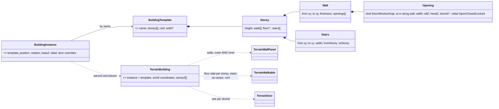
*What it shows:* the "shortcut" is the **instance**: one line in the terrain file names a template and where it stands;
the template carries every wall, door and window in its own local coordinates. The runtime keeps the building
(for room/portal queries) and also its expanded primitives (for every existing consumer).

| ⭐ lean | |
|---|---|
| **Template = a side file** `<name>.building.json`, looked up like terrains: the terrain's own `buildings/` folder first, then the shared `Recipes/Buildings/` library | a house type used 20 times is described once |
| **Template coordinates are local** (metres, origin at the template's anchor); the instance gives `position`, `rotation`, `baseZ` | moving or rotating a building moves its doors and windows with it |
| **Doors and windows live on their wall**: `at` = metres along the wall from its `from` end, `width`, `sillZ`/`headZ` above that storey's floor; a door may carry a `doorId` and an initial state | a wall knows its openings; no separate geometry to keep aligned |
| **Inner walls are just walls** in the storey's list — no outer/inner distinction in the data; a room is whatever the walls enclose | |
| **🔒 Solid is the special case**: a template (or inline building) with `"solid": true` and no storeys is today's prism; today's `{"kind":"building","height":12}` polygon still parses as exactly that | `test-town` keeps working unchanged |
| **Inline variant** for a one-off: the same template JSON inside the instance's `properties` | no side file for a unique building |
| **Door ids are instance-qualified at load**: `"Block D/front"` | a stable **terrain-object key**, NOT a network id — §3b translates it to a runtime network id |
| ⛔ dropped: rev-1 B7 facade rules | explicit openings are clearer; a template is written once, so the cost of explicitness is paid once |

Example — a template and an instance:

```jsonc
// Recipes/Buildings/house-2f.building.json
{ "name": "house-2f",
  "storeys": [
    { "height": 3.0,
      "walls": [
        { "from": [0,0],  "to": [10,0], "thickness": 0.3,
          "openings": [ { "kind": "door",   "at": 4.5, "width": 1.0, "sillZ": 0.0, "headZ": 2.1, "doorId": "front", "initial": "closed" },
                        { "kind": "window", "at": 1.5, "width": 1.2, "sillZ": 0.9, "headZ": 2.1 } ] },
        { "from": [10,0], "to": [10,8], "thickness": 0.3 },
        { "from": [10,8], "to": [0,8],  "thickness": 0.3 },
        { "from": [0,8],  "to": [0,0],  "thickness": 0.3 },
        { "from": [5,0],  "to": [5,8],  "thickness": 0.15,
          "openings": [ { "kind": "door", "at": 6.0, "width": 0.9, "sillZ": 0.0, "headZ": 2.1, "doorId": "hall" } ] } ],
      "stairs": [ { "from": [8,1], "to": [8,6], "width": 1.0, "toStorey": 1 } ] },
    { "height": 3.0, "walls": [ "…" ] } ],
  "roof": "flat" }
```
```jsonc
// test-town.world.geojson — one feature
{ "type": "Feature", "geometry": { "type": "Point", "coordinates": [150, 120] },
  "properties": { "kind": "building", "template": "house-2f", "rotation": 90, "baseZ": 0, "label": "Block D",
                  "doors": { "front": "locked" } } }
```

### One query, a solver per purpose *(supersedes B3/B4 wording)*

| ⭐ lean | |
|---|---|
| **One API**: `ITerrainPropagation.Query(from, to, Purpose) → { transmittance 0..1, path length, crossed[] }` | callers ask one question; the answer's meaning is per purpose |
| **Sight solver**: straight trace; openings 1.0; closed door = its panel; window glass per opening | straight is right for light |
| **Fire solver**: straight trace; walls stop; openings pass; penetration later (AQ85 §D) | |
| **Sound solver**: ⭐ v1 straight trace with attenuation per crossed wall/floor (less through openings); ⭐ v2 **portal propagation** — shortest route from room to room **through openings** (rooms derived from the walls at load), attenuated by distance and by each closed door | sound bends around corners and through doors; the room/portal graph is why the runtime keeps `TerrainBuilding`, not just flattened panels |

### Doors — state, action, and how a closed door blocks paths *(supersedes B5/B6)*

🔒 **Yes: the navmesh is always baked with every door OPEN, and a closed door acts as an obstacle at runtime — no
rebake.** Measured: the referenced DotRecast (2026.1.3) has `RcConvexVolume`/`MarkConvexPolyArea` (bake), and
`DtNavMesh.SetPolyFlags` + `DtQueryDefaultFilter.SetIncludeFlags/SetExcludeFlags` (runtime); no TileCache package is
referenced.

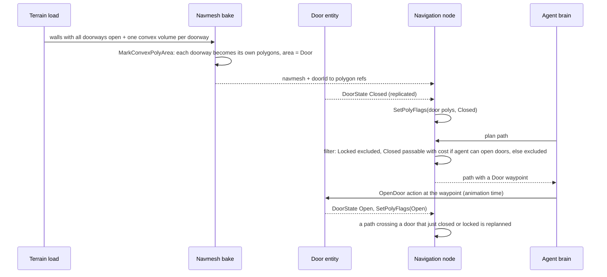
*What it shows:* the door is geometry at bake time (its own polygons) and a flag at run time; the same replicated
`DoorState` drives the path filter, the sight/fire trace (closed = opaque panel) and the sound solver.

| ⭐ lean | |
|---|---|
| **Door = an entity** (TKB `Door`), created ONCE in the cluster at load by the arbiter, ⛔ ~~with a deterministic network id from terrain name + qualified door id~~ **RETRACTED rev 3** — no such scheme exists; its runtime id comes from the one allocator, through the key map of §3b | every node can address the same door; its state replicates |
| **`DoorState`**: Open / Closed / Locked / Destroyed; initial value from the template, overridable per instance, overridable per scenario | |
| **Actions**: `OpenDoor`, `CloseDoor`, `Lock`/`Unlock`, `Breach` — behaviour actions executed by the door's owner; the actor needs to be adjacent; opening takes animation time | |
| **Path filter per agent**: Locked → excluded (unless the agent can breach: high cost + `Breach` waypoint); Closed → passable at a cost with a `TraversalKind.Door` waypoint for agents that can open doors; excluded for vehicles/animals | |
| **Every navigation node applies the same flags** from the replicated `DoorState`, so all nodes plan alike | |
| ⛔ rejected: TileCache obstacles | needs a tiled navmesh + the TileCache package, rebuilds tiles, and gives a wall, not a door with semantics |
| ⛔ rejected: rebake per door change | seconds per change |
| ⛔ rejected: off-mesh link per door | Recast already carves the doorway; a link is a second representation |

### Stride *(supersedes B9)*

🔒 **Out of scope now**; part of the programme later — Stride will build its terrain from this file (AQ81 T8). Slice
B-7 is parked.

## 3b. Rev 3 — terrain-object ids and saving door state *(user, `2026-10-07`)*

> 🔒 **User:** *"network ids are dynamic so the 'fixed' ones from the terrain need to be translated to real runtime
> network id same as scenario entity network ids. those fixed terrain-provided ids must never collide with scenario
> entity ids."* · approved: window = plain opening (v1); the scenario author sets a door's initial state.

### Claim table — how ids work today *(measured)*

| claim | code — how it IS | design — how it was MEANT |
|---|---|---|
| a scenario has no stable entity id | ✅ the file key is `Guid.NewGuid()` per save (`ScenarioSerializer.cs:164-176`); the entity's last runtime id is saved in `NetworkIdentity` and used only as the "old id" at the next load | ✅ `DESIGN_Distributed_Scenario_Persistence.md` §4b I2 *"the DOM key is `Guid.NewGuid()` generated per save, not the network id"* |
| runtime ids are re-allocated at every load and references remapped | ✅ `StagingEntityExtractor.cs:243-262` `oldToNewMap[oldId] = idAllocator.AllocateId()` → `EntityCreationRequest.PreAllocatedNetworkId`; every component remapped through `EntityRef` (`RemapComponentNetworkIds`, `:406-438`) | ✅ `DESIGN_Entity_Reference.md` D3/D4 *"ONE type plan, two appliers"* |
| ONE id authority, one sequence, no namespaces | ✅ the authority resets to 1000 at every world reset; CGF allocates authored ids | ✅ `DESIGN_Deterministic_Network_Ids.md` §11b/§11e *"One id authority per world … no reserved band to police"* |
| ⇒ rev 2's "deterministic network id from the door key" does not exist | ⛔ no hashed/name-derived id anywhere | ⛔ the ids doc has none — **rev 2 cited a scheme the cited doc does not contain** |
| Save writes CURRENT state, in Edit and Live alike | ✅ `ScenarioSerializer.cs:178-190` walks live components; save-in-Live proven (`POST /scenario/save` in `--mode all`) | ✅ Persistence §1 *"save an entity iff you are its non-transient primary owner"* |
| a checkpoint is a binary snapshot, and cannot be restored yet | ✅ `ReferenceCheckpointHandler` → `.fdp` per node; *"Restore Checkpoint is NOT here"* (`ScenarioMenuCommands.cs:231-233`) | ✅ `DESIGN_Cgf_Scenario_Session_Slice.md:183` (restore deferred) |

### Decisions

| # | ⭐ lean | rejected (one line each) |
|---|---|---|
| **K1** | 🔒 a door's runtime network id comes from **the same single allocator** as every entity — so it can never collide with any runtime id, by construction | a reserved numeric band for terrain objects — the ids design rules *"no reserved band"* and would need policing |
| **K2** | 🔒 what the terrain provides is a **terrain-object key**, a STRING: `"<terrain>/<building>/<doorId>"` (e.g. `"test-town/Block D/front"`). It is never a number, so it cannot be mistaken for a scenario entity's saved id (which is numeric) | numeric terrain ids — two number spaces in one reference field would collide exactly as the user warns |
| **K3** | at load, the **arbiter creates the door entities in key order** right after the scenario's own allocation step, and keeps a **`TerrainObjectMap: key → runtime id`** beside `oldToNewMap` (same `OnRemap` channel) | creating doors on every node — one door would become N entities |
| **K4** | a scenario reference to a door (a behaviour param *"open this door"*, a door-state entry) stores the **key**, not a number: a `TerrainObjectRef` beside `EntityRef`, resolved through `TerrainObjectMap` by the same remap pass | storing the door's runtime number — meaningless at the next load |
| **K5** | door ENTITIES are not saved (the terrain recreates them); door STATE is: the scenario gets a `terrainObjects` section keyed by K2 — `{ "test-town/Block D/front": { "door": "Locked" } }` | saving door entities — they would be created twice (terrain + scenario) |

### Saving door state — what I meant, corrected

⛔ **Rev 2 said *"runtime changes saved only by checkpoints"*. That was WRONG for this codebase and is retracted:** I
assumed a split between an authored initial state and a runtime state; measured, **Save writes the CURRENT state of
every entity, in Edit and Live alike**, and a checkpoint is a separate binary snapshot that cannot be restored yet.
⇒ **Doors follow the same rule as everything else:** whatever state a door has when the scenario is saved is written
into `terrainObjects` (K5), and that becomes its initial state at the next load. In Edit mode that is exactly *"the
scenario author sets the initial state"*; a save during Live captures the door as it is then, like it captures every
moved vehicle.

## 3c. Rev 4 — fences and materials *(user, `2026-10-07`)*

> 🔒 **User:** *"approved the building design's other leans (templates in side files, one query with a solver per
> purpose, doors as entities with navmesh flags). we need to have also fences — different resistance to bullet
> penetration, different params of visibility blocking."*

📐 **Measured:** the world file already has `wall` (a LineString with `height`, `thickness`, `baseZ`; `test-town` has a
0.5 m *Low Wall* and a 3 m *High Wall*). ⛔ ~~no penetration value exists anywhere~~ **RETRACTED rev 5** — the search
missed the TKB folder: `WeaponMountDto.Penetration` (mm RHA, `CE-3071`) exists and drives `ArmorModel`; see §3d.


*What it shows:* a fence is not a new primitive — it is a wall panel with a material; the material is the one place
the three solvers (sight, fire, sound) and the navmesh read their per-surface numbers from.

| # | decision | ⭐ lean | rejected (one line each) |
|---|---|---|---|
| **M1** | what a fence is | ⭐ **a wall panel with a material** — the existing `wall` feature (and template walls) gains `"material"`; `fence` is accepted as an alias of `wall` whose default material is `fence-wood` | a separate `fence` primitive — a second shape every consumer must learn, for the same geometry |
| **M2** | where materials live | ⭐ a **material library side file** (`Recipes/Terrain/materials.json`, overridable in the terrain folder — the same lookup as building templates); panels name a material; unknown name fails the load loudly | numbers on every feature — the same fence typed 40 times |
| **M3** | sight | ⭐ `sightTransmittance` 0..1 per material, **multiplied** along the line; perception sees through when the product ≥ a threshold (⭐ 0.5) in v1; later the product scales detection range | thickness-dependent sight — a fence's see-through-ness is its pattern, not its depth |
| **M4** | bullets | ⛔ *superseded by §3d P2* — ~~pass when `penetrationMm` ≥ the sum; a new ammo field with a default per weapon class~~ (there is no "weapon class"; the source and the rule are in §3d) | a pass probability per material — a 5.56 and a 12.7 would go through a wooden fence equally |
| **M5** | sound | ⭐ `soundAttenuationDb` per material, summed along the path (the sound solver of §3a) | |
| **M6** | movement | ⭐ `blocksMovement` (default true): a blocking panel goes into the navmesh like any wall — a 1 m fence is higher than the infantry climb (0.4 m), so it blocks walking; vaulting and vehicles breaking through fences are later | fences never in the navmesh — units would walk through them |
| **M7** | defaults for existing content | ⭐ a wall with no material is `concrete`; `test-town` is unchanged in behaviour | |

**Starter material table** *(values are placeholders to tune, not data)*:

| material | sight | ballistic resistance (mm RHA per m) | sound (dB) | typical thickness |
|---|---:|---:|---:|---:|
| `concrete` | 0.0 | 1500 | 40 | 0.2–0.4 m |
| `brick` | 0.0 | 1000 | 35 | 0.25 m |
| `fence-wood` (solid planks) | 0.0 | 60 | 10 | 0.03 m |
| `fence-chainlink` | 0.85 | 5 | 0 | 0.005 m |
| `fence-metal-sheet` | 0.0 | 200 | 15 | 0.002 m |
| `hedge` | 0.3 | 20 | 5 | 0.8 m |
| `glass` *(windows later; v1 windows are openings)* | 1.0 | 30 | 20 | 0.01 m |

## 3d. Rev 5 — where penetration comes from, and explosive effects *(user, `2026-10-07`)*

> 🔒 **User:** *"what is the weapon class? I always tend to treat weapons as the launcher and the projectile (ammo)
> because both together may affect the penetration capability (projectile type, projectile speed)."* · *"…and what
> about explosive ammo with indirect hit effect?"* · approved: §3c materials.

### Claim table *(measured — graph + grep)*

| claim | code — how it IS | design — how it was MEANT |
|---|---|---|
| ⛔ "weapon class" | does not exist — **I invented it in rev 4; retracted** | — |
| penetration exists, per weapon MOUNT | ✅ `WeaponMountDto.Penetration` (mm RHA) + `DamagePerHit` (`WeaponSuiteDto.cs`, `CE-3071`) → copied onto the bullet (`FireProcessingSystem.cs:154`) → `DetonationNotification.Penetration` → `DamageCalculationSystem.cs:69-77` | ✅ `CE-3071` |
| the penetration rule is a smooth ramp, expected damage, no dice | ✅ `ArmorModel.PenetrationChance = clamp((pen / armour − 0.8) / 0.4, 0, 1)`; `ExpectedDamage = damage × chance` (*"A2 — no dice"*) | ✅ same file |
| the launcher × ammo pair is ALREADY the TKB's model — designed, not used | ✅ `AmmoWeaponBallisticsDto` (`Gen.AmmoWeaponBallistics`): `WeaponGuid` (0 = generic), `MuzzleSpeed`, `Damage`; one per weapon via `#PartId`; **only tests read it** | ✅ `tkb-1/DESIGN.md:156,179-180` (an ammo with a profile per weapon); `tkb-design-ideas.md:81,156` (`Weapon` — *"capabilities and supported ammo"*, `Gen.WeaponSupportedAmmo`) |
| a mount does not know WHICH ammo it holds | ✅ `WeaponMountDto` has `WeaponGuid` + `InitialAmmunition` (a count), no ammo type | ⛔ searched, none |
| **no explosive / area effect exists** | ✅ graph: no Blast/Fragment/Splash/AreaDamage/Warhead/Artillery class; a detonation is ONE struck entity + a point (`DetonationNotification`, wire `MunitionDetonation` has no warhead data); damage applies to `evt.Target` only | ⛔ searched, none (AQ85 owns hit chance only) |

⚠ `check_index_coverage` is not available through the graph CLI, so the "none" rows rest on graph + grep together.

### Decisions

🔒 **APPROVED `2026-10-07` (R-217)** — user: *"Penetration model approved"*. As built: §3h.

| # | decision | ⭐ lean | rejected (one line each) |
|---|---|---|---|
| **P1** | where penetration lives | ⭐ 🔒 *(your model)* **on the launcher × ammo pair**: add `PenetrationMm` (RHA) to the existing `AmmoWeaponBallisticsDto` beside `MuzzleSpeed` and `Damage`. Lookup: (ammo, this weapon) → (ammo, generic `WeaponGuid 0`) → the mount's `Penetration` (today's `CE-3071` value, kept as the fallback) → unknown (0) | a field on the ammo alone — the same round from a longer barrel penetrates more · a "weapon class" default — does not exist |
| **P1b** | which ammo a mount fires | ⭐ the mount gains a **loaded-ammo reference** (`AmmoGuid`, from the weapon's supported-ammo list); ammo switching is later | inferring the ammo from the weapon — a weapon fires several |
| **P1c** | speed and range | ⭐ v1 constant per pair; later an optional **penetration-vs-range table** in the same DTO (kinetic rounds lose penetration with range; shaped charges do not) | |
| **P2** | bullets through walls | ⭐ **one penetration rule for armour AND walls**: a material's resistance is in **mm RHA per metre** (§3c units, renamed), a panel's = that × thickness, and the round's chance through it = **`ArmorModel.PenetrationChance(pen, panel)`**; along the line the chances multiply and the round's penetration is reduced by what it crossed. Expected value, no dice — as `ArmorModel` already does | a separate wall rule (rev 4's hard threshold) — two penetration models would disagree on the same round |
| **E1** | explosive and indirect effects | ⭐ **a separate design, filed as `CE-1032`** (weapons/combat — AQ85's neighbour): a TKB **`WarheadDto`** on the ammo (kind: kinetic / HE / HEAT / fragmentation; blast radius; fragment radius + fragment penetration; fuze: impact / delay / airburst); a detonation then has a **direct effect** (penetration, as now) and an **area effect** on every entity within the radius | folding it into the building programme — it is a combat model change with its own rulings |
| **E2** | what buildings must provide for E1 | ⭐ **two more purposes on the ONE query now**: `Fragment` (straight; fragments stopped by walls per their small penetration vs material resistance) and `Blast` (attenuated by walls like sound; v2 through openings room-to-room); and an **indirect round's impact point** comes from a terrain trace along its arc — so a mortar round hits the ROOF and occupants are protected by the floor slabs above them | designing the query for direct fire only — E1 would reopen it |
| **E3** | damage to the building itself | ⭐ v1: a door can be **Destroyed** (already a `DoorState`); wall breaching = changing geometry at runtime → later | breachable walls now — a runtime navmesh and trace change |

## 3e. Rev 6 — the warhead is denoted by the ammo's DIS type *(user, `2026-10-07`)*

> 🔒 **User:** *"note the ammo DIS type could already denote the warhead, not as extra runtime data."*

| ⭐ lean *(supersedes §3d E1's "warhead … on the ammo" wording)* | |
|---|---|
| **Warhead parameters are TKB data of the munition type**, keyed by the ammo's DIS entity type (kind 2 = munition): `WarheadDto` (kind, blast/fragment radius, fragment penetration, fuze) lives on the ammo's TKB template — static, never sent per shot | the ammo IS a TKB type with a DIS type; the receiver looks it up |
| **A detonation carries only the munition's identity** (its DIS / TKB type) plus the point and the struck entity; every node resolves the effect from its own TKB | per-detonation warhead fields — redundant data on the wire, and two sources that can disagree |
| For external DIS interop, the standard burst descriptor's Warhead/Fuze enums are **derived** from the same TKB entry on egress | |
| ⚠ prerequisite: a mount must know its loaded ammo (§3d P1b) — the ammo type is what the shot, and later the detonation, carries | |

## 3f. Rev 7 — blast and fragments depend on wall height and the target's posture *(user, `2026-10-07`)*

> 🔒 **User:** *"blast effect should be affected by wall height and character height in current posture (low wall does
> not help unless character is prone and unexposed)"*

| ⭐ lean | rejected (one line each) |
|---|---|
| **Exposure, not a yes/no line**: a target has a **body profile per stance** — sample points up its silhouette (standing ≈ 0.2/0.9/1.6 m, crouched ≈ 0.2/0.6/1.0 m, prone ≈ 0.15/0.3 m; vehicles: hull points). Exposure = mean transmittance of the `Fragment` query from the burst point to each sample point | one ray to the centre — a man standing behind a 0.5 m wall would read as fully hidden or fully exposed |
| **Fragments**: damage × exposure (expected value, no dice — as `ArmorModel`). A 0.5 m wall shields only points below the line from the burst over the wall's top ⇒ **standing: head and chest exposed; prone: all points below it ⇒ unexposed** | |
| **Blast (overpressure)**: radius falloff × a wall factor that applies only when the wall top is above the target's highest sample point (a low wall does not stop overpressure for a standing man); v2 adds room-to-room propagation through openings | blast blocked like fragments — overpressure wraps over low cover |
| **Burst height matters by construction**: an airburst sees over the wall (fuze in the warhead, §3e) | |
| **The same body profile is the LOS target silhouette** (W5: *"the target's silhouette height follows its stance"*) — one profile for being seen, being shot and being hit by fragments | a separate profile per effect — they would disagree |
| ⚠ **Dependency — stance is never set today** (`CE-3010`: no host composes the animation pipeline, every entity reads as Standing). ⭐ Lean: a **logical stance** written by behaviours/scenario when no animation backend runs, so posture matters for perception and damage without animation; the animated path keeps writing it when present | waiting for `CE-3010` — every prone/crouch premise in the demos would be untestable until then |
| 🔒 **APPROVED `2026-10-07`, with the user's reading:** *"logical-stance approved if what you mean is that brain does not wait for go-prone animation to finish"* — ⭐ **yes, exactly that**: when the brain orders a stance, the LOGICAL stance (what perception, fire and fragments read) changes in that tick; an animation, where one runs, only shows it and never gates it. A short configurable "settling" delay can be added later if needed — v1 has none | gating the logical stance on the animation's end — the brain would wait on presentation, and headless hosts (no animation) would never change stance |

## 3g. ✅ Stage 1 (B-0 model) as built *(backend, `2026-10-07`)*

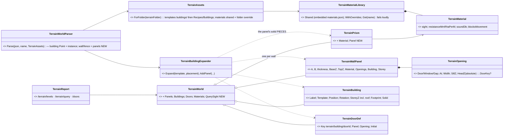
*What it shows:* a panel is kept for its metadata AND expanded into ordinary thin prisms around its openings — so every
existing consumer (`SurfaceZ`, `SegmentBlocked`, the navmesh, cover, the map) sees doorways and windows as gaps with no
code change, and the ground inside an enterable building is a floor by construction (nothing solid covers it): the
`CE-1031` fix needed no `insideSolid` change.

| item | as built — and the deviations, argued |
|---|---|
| format | `building` + **Point** geometry = an instance: `template` (side file) or inline `building`, `rotation` (degrees CCW, engine yaw), `baseZ`, `label`, `doors {id: state}`; `building` + Polygon = today's solid prism (unchanged); `fence` = `wall` with default material `fence-wood` and thickness 0.05 m; any single-segment `wall`/`fence` may carry `openings` |
| template | `footprint` (optional — default = bounding box of the ground storey's walls), `material` (default for its walls), `storeys[{height, walls, floor?, stairs?}]`, `roof: flat|none`, or `"solid": true` + `footprint` + `height`. A storey's `floor` is ONE ring or a LIST of rings (default: the footprint) — ⚠ the author leaves the stairwell open by splitting the floor (as `bt-range`'s `house-2f` does); Stage 2's navmesh needs that headroom |
| openings | defaults: door sill 0 / head 2.1, window 0.9 / 2.1, gap full height; must fit the wall and not overlap — else the load fails naming the wall; a door with `doorId` becomes a `TerrainDoorDef`, initial = `initial` (default **open**) overridden by the instance's `doors` |
| ⚠ materials home | the shared library is an **embedded data file** in `Fdp.Toolkits` (`Terrain/Data/materials.json`, §3c's starter table) instead of a loose `Recipes/Terrain/materials.json` — always present on every host and in tests; a terrain folder's own `materials.json` overrides by name, as designed |
| sight | `TerrainWorld.QuerySight(from, to)` → product of crossed materials' transmittance + each crossing (panel/prism/slab/ramp, material, building, storey). ✅ **Stage 3 (sight half) as built:** `SegmentBlocked` IS `transmittance < 0.5` (§3c M3) — every perception consumer (`TerrainWorldLosStrategy`, `TerrainLosService`/EQS, `DangerAreaSensorSystem`) sees through chain-link (up to four fences) and not through a hedge; a prism with no material is opaque, so `test-town` is unchanged. Rail `TerrainWorldTests.Stage3_*` (incl. *route and perception agree*) |
| routes | `GET /terrain/levels?x=&y=`, `GET /terrain/query?from=x,y,z&to=x,y,z&purpose=sight`, `GET /doors` (static definitions; `runtimeId` null until Stage 5) + RouteDocs |
| map layers | ✅ wall pieces coloured by material, fences/hedges dashed, enterable buildings labelled `<label> <n>F`. ⏭ the **storey selector** (B-4) and the interactive **levels probe** are NOT built — the probe's data is `/terrain/levels`; both are map-tool work for the ui lane or a later backend pass |
| content | `Recipes/Terrain/bt-range/` — one panel per material, a fence row, a 0.5 m low wall, two `house-2f` instances (House A: front **locked**, hall open; House B rotated 90°), a solid block; `test-town` unchanged |
| rails | `TerrainWorldTests.Stage1_*` (10, incl. *test-town unchanged* and *bt-range loads*) · `TerrainReportTests` (4) |
| ✅ **Stage 2 (B-1 walk inside) — needed NO code** | measured `2026-10-07`: because doorways are already gaps between panel pieces and floors/stairs are ordinary walkables, the existing `TerrainWorldMesh` + Recast bake gives walkable ground inside the house, carves the doorway, and a path from outside **enters by the door, climbs the stair ramp and ends on storey 2** (Z ≈ 3). Rail: `RecastNavmeshFactoryTests.Stage2_*` (asserts no waypoint between floors off the stairs and none crossing the wall outside the door). ⚠ needs the upper floor split around the stairwell (headroom). ⏭ moved to Stage 5: the doorway **convex volumes** (their only purpose is the door flags) and `GET /navigation/path` |

## 3h. ✅ Penetration (§3d P1/P1b/P2) as built *(backend, `2026-10-07`, R-217)*

```mermaid
classDiagram
    direction LR
    class AmmoWeaponBallisticsDto { <<existing TKB, Gen.AmmoWeaponBallistics#part>> WeaponGuid (0 = generic); MuzzleSpeed; Damage; PenetrationMm NEW }
    class WeaponMountDto { <<existing>> WeaponGuid; Penetration (CE-3071); DamagePerHit; DispersionMils; AmmoGuid NEW }
    class ParameterResolver { <<existing>> MountPenetration(db, mount) NEW — pair → generic → mount → 0; Penetration(t, i, db) reports it }
    class CombatTkb { <<existing>> PenetrationOf(world, mount) NEW }
    class FireProcessingSystem { <<existing>> shot line eye → aim (R-217); bullet.Penetration = PenetrationOf }
    class TerrainWorldLosStrategy { <<existing>> EyeHeightFor / AimHeightFor NEW static — the one height rule }
    class TerrainWorld { <<existing>> QuerySight; QueryFire NEW → FireCrossing T, path, resistance }
    class TerrainPenetration { <<NEW, Combat>> Carry(world, from, to, ref dmg, ref pen, out stopT); Cross(resistance, ...) }
    class ArmorModel { <<existing>> PenetrationChance — the ONE ramp }
    class BallisticsSystem { <<existing>> carries the FRONT per segment; truncates at a stop; freezes + grace }
    class BallisticProjectile { <<existing>> Damage; Penetration (muzzle values); Muzzle NEW; FrontDamage NEW; FrontPenetration NEW; StoppedTick NEW }
    class HitResolutionSystem { <<existing>> carries MUZZLE → hit point before DetonationNotification }
    class TerrainReport { <<Hrot.Editor DebugApi>> /terrain/query?purpose=fire NEW }
    WeaponMountDto --> AmmoWeaponBallisticsDto : AmmoGuid → ammo type's profiles
    ParameterResolver --> WeaponMountDto
    CombatTkb --> ParameterResolver
    FireProcessingSystem --> CombatTkb
    FireProcessingSystem --> TerrainWorldLosStrategy
    BallisticsSystem --> TerrainPenetration
    HitResolutionSystem --> TerrainPenetration
    TerrainReport --> TerrainPenetration
    TerrainPenetration --> TerrainWorld
    TerrainPenetration --> ArmorModel
    BallisticsSystem --> BallisticProjectile
```
*What it shows:* one penetration ramp (`ArmorModel.PenetrationChance`) serves armour, walls, the HTTP dry run and — through
`ParameterResolver` — the reported value; the only new runtime type is the stateless `TerrainPenetration`.

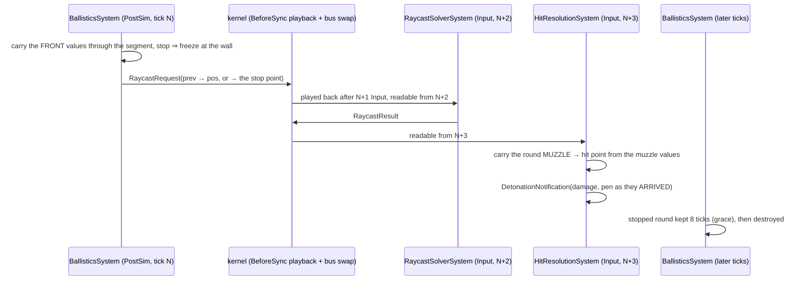
*What it shows:* a segment's raycast resolves THREE ticks after the segment (measured, `ModuleHostKernel.cs` — Input
`:511`, playback `:547`, swap `:553`, PostSimulation `:764`), so nothing may depend on "the next tick": the hit carries the
round from its muzzle, and a stopped round waits out a grace before it goes.

| item | as built — and the deviations, argued |
|---|---|
| P1 | `AmmoWeaponBallisticsDto.PenetrationMm`; `ParameterResolver.MountPenetration(db, mount)`: (ammo, this weapon) → (ammo, generic) → `WeaponMountDto.Penetration` → 0. A profile with `PenetrationMm` 0 states nothing. `FireProcessingSystem` reads it through `CombatTkb.PenetrationOf`; `GET /tkb/resolve` reports it with the source (`<ammo>: Gen.AmmoWeaponBallistics#1.PenetrationMm (this weapon)`). ⚠ the pair's `Damage` is NOT read yet — only penetration was approved; `DamagePerHit` stays on the mount |
| P1b | `WeaponMountDto.AmmoGuid` (`[AmmoRef]`, 0 = not declared ⇒ the mount's own value). ⏭ no built-in catalog declares ammo types yet, so every shipped weapon still resolves to its mount value — **no re-pin** |
| P2 | `TerrainWorld.QueryFire` (the Fire purpose of the one query): per piece the path INSIDE it, clipped to its height (a 45° crossing resists √2 × the thickness); no material ⇒ the default (concrete — a solid building stops any round); a slab/ramp = `SlabThicknessMetres` 0.2 of the default material (300 mm RHA); the ground is not an occluder. `TerrainPenetration.Cross`: chance = `PenetrationChance(round, resistance)`, damage × chance, a known round's penetration − resistance; chance ≤ 0.001 ⇒ stopped |
| ⚠ unknown round | a round with penetration 0 meets terrain as `EngineFallbacks.UnknownRoundTerrainPenetrationMm` = 5 (the catalogs' rifle) and STAYS unknown after (still ignores armour). ⛔ without it chain-link would stop it (any resistance > 0 defeats 0 mm) |
| ⚠ spent round | a known round reduced below 0 keeps 0.001 mm, never 0 — 0 would make it an unknown round that ignores armour |
| ⚠ **the shot line** *(prerequisite, AQ85 §D first half)* | ⛔ before, a shot flew FEET to FEET — through terrain every low wall and window sill would have stopped a round aimed over it. ⭐ It now flies from the shooter's eye to the middle of the target's silhouette for the LOGICAL stance, by the SAME rule sight uses (`TerrainWorldLosStrategy.EyeHeightFor/AimHeightFor`, §3f "one profile for being seen and being shot"). The ENTITY hit test stays a 2-D circle — body profiles are Stage 4 |
| timing | ⭐ **corrected `2026-10-07` (CE-3101)** — the muzzle values stay on the bullet (`Damage`/`Penetration`) with its `Muzzle`; `BallisticsSystem` decides stops from separate FRONT values (`FrontDamage`/`FrontPenetration`), truncates the raycast at the wall, freezes the round there and keeps it `StoppedRoundGraceTicks` (8) before destroying it; `HitResolutionSystem` carries the round MUZZLE → hit point. ⛔ SUPERSEDED: *"holds the far-end values for a tick and applies them at the start of its next pass; a stopped round is destroyed next pass"* — a segment's raycast resolves THREE ticks later (sequence above), so that version double-counted a fence for a unit struck in front of it and destroyed a stopped round before a hit in front of the wall could resolve |
| diagnostics | `GET /terrain/query?purpose=fire&penetration=&damage=` — each crossing with path, resistance, chance, passes; `stopped`, `arrivingDamage` |
| tuning note | with the starter table a rifle (5 mm) passes chain-link, metal sheet and ONE wooden fence (3 mm at 0.05 m), and is stopped by a second fence, a hedge (16 mm at 0.8 m), brick and concrete — placeholder values (§3c), tune in `materials.json` |
| rails | `TerrainWorldTests.Stage3Fire_*` · `BallisticsSystemTests.R217_*` (5) · `HitResolutionSystemDetonationTests.R217_*` (3) · `ParameterResolverTests.R217_*` · `FireProcessingSystemTests.R217_*` (+ three fire rails re-stated for the eye → aim line) · `TerrainReportTests` (fire) |

## 3i. ✅ Stage 4 (posture) — designed, then built as drawn *(backend, `2026-10-07`; leans approved in §3f)*


*What it shows:* one stance rule (`LogicalStance.Of`) feeds sight and fire, and the only production composition
(`EqsModule` → `ForLiveWorld`) picks it up with no call-site change.

| item | decision *(§3f, approved)* |
|---|---|
| stance read | the LOGICAL stance — `StanceIntent.TargetStance`, else Standing. ⚠ On a SimHost in a cluster it arrives only with the behaviors lane's stance wire (`CE-2121` slice ②); in the editor (one world) it is there now. Until ②, the cluster reads Standing exactly as today |
| body points | ⭐ **`2026-10-09` R-246: the TOP point is the EYE** (fractions 0.12/0.53/**1.0** · 0.18/0.55/**1.0** · 0.43/**1.0**; [`DESIGN_Peek_And_Fire.md`](DESIGN_Peek_And_Fire.md) D16) — ⛔ SUPERSEDED below: the tops under the eye. Per stance, as fractions of that stance's eye height (`EyeHeightFor`): standing 0.12/0.53/0.94 (≈ 0.2/0.9/1.6 m), crouched 0.18/0.55/0.91 (≈ 0.2/0.6/1.0), prone 0.43/0.86 (≈ 0.15/0.3); a target with a collider height (a vehicle): 0.25/0.5/0.85 of it · ⭐ `CE-3116`: the HULL height (`PhysicsColliderReaders.HullHeight`) — 0 for a person, whose 1.8 m capsule collider is not a hull |
| sight | eye → each body point; the target is SEEN when ANY point's line is clear (terrain transmittance ≥ 0.5 and no collider within its height). ⭐ a standing man behind a 1.2 m wall is now seen (his head is above it); a prone man behind a 0.5 m wall is not |
| fire | unchanged — the round still aims at the mid-silhouette (`AimHeightFor`); per-point EXPOSURE for fragments is `CE-1032` |
| diagnostics | `/perception/los` lists every point with its own verdict |
| acceptance | ⭐ rail: a standing observer sees a standing target over a 0.5 m wall and over a 1.2 m wall; a prone target behind the 0.5 m wall is not seen; `LogicalStance.Of` drives it with no stance reader passed |
| ✅ as built | matches the diagram: `LogicalStance.Of` (beside `StanceIntent`, `Tkb/Domain/StanceComponents.cs`); `HitModel.LogicalStance` delegates to it; `TerrainWorldLosStrategy.ForLiveWorld` defaults its stance reader to it; `BodyProfile.Fractions` + `BodyPoints`; `IsVisible` = any point clear; `Explain` lists every `LosPoint`; `/perception/los` returns `points[]` with per-point verdicts (MCP regenerated). Rails: `LosStrategyTests.Stage4_*` (2) — standing behind a 0.5 m wall seen, prone not; only the head clears a 1.2 m wall; `ForLiveWorld` hides a target the tick its `StanceIntent` says prone. The earlier posture rails (`TerrainLos_*`) held unchanged |
| ⏭ not in Stage 4 | per-point EXPOSURE for fragments/blast (`CE-1032`); the cluster SimHost reads Standing until the stance wire (`CE-2121` slice ②) carries `StanceIntent` |

## 3j. Stage 5 (doors) — slices, and 5a as built *(backend, `2026-10-07`; decisions approved in §3a/§3b)*


*What it shows:* the door LEAF lives beside the prisms, never among them — so sight and fire see a shut door while the
navmesh (baked open, §3a) and `SurfaceZ` never do; the replicated door entity (5b) only has to write one byte per door.

| slice | content | state |
|---|---|---|
| **5a** | door leaves + live door state in `TerrainWorld`; sight/`SegmentBlocked`/fire include a Closed/Locked leaf (material `door-wood`: sight 0, 60 mm/m — a rifle round goes through a wooden door); `/doors` reports the LIVE state | ✅ built |
| **5b** | door ENTITIES (TKB `Door`, created once by the arbiter at load, runtime id from the one allocator, the key map = the `TerrainObjectKey` entities) + replicated `DoorState` + a mirror system writing `SetDoorState` on every node | ✅ built (below) |
| **5c** | navmesh: doorway convex volumes at bake (door area), door → poly refs, a door-aware `IDtQueryFilter` reading the live state (⚠ not `SetPolyFlags` — N1), `TraversalKind.Door` on `PlanPath` waypoints | ✅ built (below); carrying `Door` through the trajectory pool + replanning moved to **5d** (N4) |
| **5d** | door commands (`OpenDoor`/`Close`/`Lock`/`Unlock`/`Breach`) executed by the door's owner | ✅ built (below): commands, rules, transport, executors, the mover crossing doors, the door nodes + `TerrainObjectRef`; `bt-doors` passes live |
| **5e** | scenario `TerrainObjects` section (save writes current door state; load applies it) — the serializer, the distributed merge and the load step each carry it | ✅ built (below); ⚠ `TerrainObjectRef` moved to **5d**, which has its first consumer |

| 5a as built | |
|---|---|
| ⚠ deviation from the original Stage 1 behaviour | a doorway WAS a gap whatever its door's state; now a Closed/Locked door blocks sight and is a `door` crossing for fire (§3a: *"closed door = its panel"*). The Stage 1 rail `Stage1_SightPassesAWindowAndADoorway_ButNotTheWallBesideThem` was re-stated deliberately (the instance's front is locked ⇒ blocked; opened ⇒ clear). `test-town` has no doors — unchanged |
| initial state | the terrain/instance `TerrainDoorDef.Initial` until the door entities (5b) mirror the replicated state |
| rails | `TerrainWorldTests.Stage5_*` (closed blocks sight, is a door-wood crossing for fire; open / destroyed are gaps; locked blocks; no leaf in `Prisms`) |

### 5b as built — door entities, the replicated state, the mirror *(backend, `2026-10-07`)*

> ⛔ **SUPERSEDED IN PART `2026-10-08` by [5b′](#5b--door-state-is-read-from-the-readers-own-view-r-219) (R-219):** the
> `DoorStateMirrorSystem`, the pack's `TerrainObjectSystems` and the live door state on `TerrainWorld` (`SetDoorState`, 5a) are
> **removed** — the terrain is shared by reference into every background snapshot, so live state on it reached every thread at
> once. The door entities, `DoorState`/`TerrainObjectKey`, the descriptor and the load-step creation below stand unchanged.

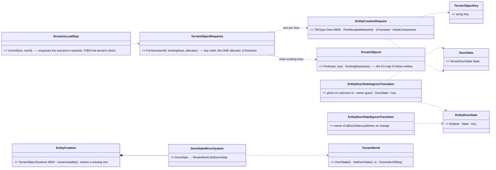
*What it shows that prose hid:* the key → runtime-id map of §3b K3 is **not a table** — it is the set of entities carrying
`TerrainObjectKey`; and nothing on a node writes `TerrainWorld` door state except the one mirror.

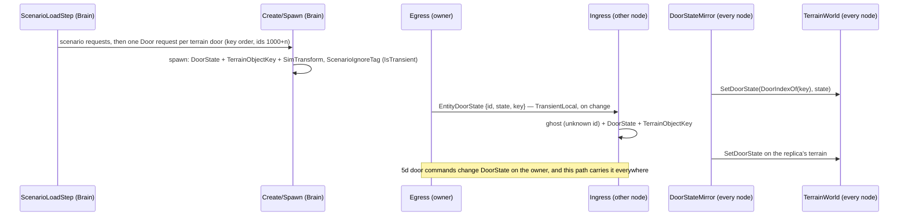

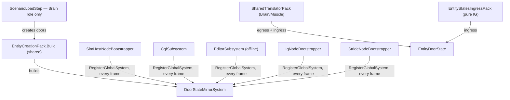
*What it shows:* the mirror is reached on **every** host — online or offline — through the one pack, and a host that forgets
it is named by `EntityCreation.Unserviceable()` (rail `EveryRoot_SchedulesTheTerrainObjectSystems`); only the Brain creates
doors, every other node receives them.

| 5b as built | |
|---|---|
| ids (§3b K1/K3) | `TerrainObjectRequests.ForDoors` pre-allocates from the step's allocator — the cluster's one authority — in ordinal key order, AFTER the scenario's own requests ⇒ deterministic for a given scenario + terrain |
| not saved (K5) | `IsTransient` ⇒ the spawning node stamps `ScenarioIgnoreTag`; replicas are not primary owners, so no node saves a door entity. Both new components are also `NoScenario` |
| new scenario | doors are created for a NEW scenario too (the terrain has doors whether or not there are units) |
| ownership | `dtDoorState` is in no group ⇒ the creator keeps it (creator's remainder); `RegisterMapping(dtDoorState → DoorState)` lets 5d move the write with the descriptor |
| ⚠ deviation from §3b K3 | no separate `TerrainObjectMap` class: the map IS the `TerrainObjectKey` entities (`TerrainObjects.Find`) — a second table would be a second representation of one fact. 5e's `TerrainObjectRef` resolves through it |
| ⚠ known limit | several Brain nodes (R-162) each running the load step would each create the doors — the same exposure the scenario's own entities have today; the `ExistingKeys` skip only covers a re-commit on one node |
| visible effect | a door entity has `SimTransform` + `NetworkIdentity`, so the map draws its pick box (a door is selectable — the hook for 5d's commands); no symbol, no palette entry (bare template) |
| ⚠ found live `2026-10-08` | a door is a TRANSIENT spawn, so `NetworkSpawningSystem.ProcessSpawn` stamps `ScenarioIgnoreTag` on every node — and **no host registered that tag** (every rail registered it for itself). The first cluster load of a terrain with doors (`bt-doors`) killed the CGF process. ✅ Registered in `HrotSharedComponentRegistry` (every host); rail `RegisterAll_TheTransientSpawnTag_IsRegistered`. The same crash was latent for any transient spawn (an IG sketch, R-140) |
| rails (5b) | `TerrainWorldTests.Stage5b_*` (mirror) · `ScenarioLoadStepTests.Stage5b_*` (creation, order, ids, no doubling) · `EntityDoorStateTranslatorTests` (wire round trip into the other node's terrain) · `EntityCreationPackRails.EveryRoot_SchedulesTheTerrainObjectSystems` / `Build_AlwaysHasTheDoorMirror_OfflineToo` |

### 5c — doors in the navmesh *(backend, `2026-10-07`; leans of §3a "Doors", one mechanism changed — below)*

**INVENTORY** *(codebase-memory `search_graph name_pattern=.*(Navmesh|NavMesh|QueryFilter|PathRegistry|TraversalKind|PlanPath).*`
→ 35 classes, 14 production; interfaces → `INavmeshProvider`, `IPathRegistry`, `INavmeshFactory`; plus an Explore sweep, grep-confirmed)*:
the bake is `RecastNavmeshFactory.Build(world)` → `RecastNavmeshBaker.Bake` (one `RcSampleInputGeomProvider`, local to `Bake`,
`RecastNavmeshBaker.cs:136`) → `DotRecastNavmeshProvider`, published by `TerrainResidency.Commit` through `SwitchableNavmeshProvider`.
**Zero** uses of `AddConvexVolume`/`MarkConvexPolyArea`/`SetPolyFlags`/area ids. Every poly gets flag 1 (`:255`). One
`DtQueryDefaultFilter` per layer (`DotRecastNavmeshProvider.cs:49`). `PlanPath` writes `TraversalKind.Walk` literally (`:274`);
`PathfindingSolverSystem.SolveNavmesh` keeps positions only (`:402`); `EngineBackedPathRegistry` hard-codes `Walk` (`:140`, `:202`);
`OffMeshLinkDetectionSystem` has no production registration. The only replan is the frustration watchdog
(`NavigationExecutionSystem.cs:181`); nothing compares `QueryVersion`. No "can open doors" capability exists; the agent class is the
nav LAYER (`NavLayerSelection.For`: Infantry, or Vehicle for a `VehicleState`).

| claim the design rests on | code — how it IS | design — how it was MEANT |
|---|---|---|
| the mesh is shared READ-ONLY by two background threads | ✅ `DotRecastNavmeshProvider.cs:51-57` (CE-2122: EQS + NavigationSolver query in parallel, per-thread `DtNavMeshQuery`) | ✅ CE-2122 fix note in that file |
| ⇒ a runtime `SetPolyFlags` would mutate it under those threads | ✅ DotRecast `SetPolyFlags` writes `DtPoly.flags` in place | ⛔ §3a assumed `SetPolyFlags` — written before CE-2122 was measured |
| ~~the door's live state is readable from any thread~~ ⛔ **SUPERSEDED by 5b′ (R-219)**: true of torn reads, false of the snapshot model — the filter now judges by the caller's `DoorStates` | ~~`TerrainWorld.DoorState(i)`, `Volatile`~~ removed | 5b′ |
| infantry fits a doorway, a vehicle does not | ✅ vehicle radius 1.8 m (`RecastNavmeshBaker.cs:76`) erodes a 1 m opening away | ✅ §3a "excluded for vehicles" |

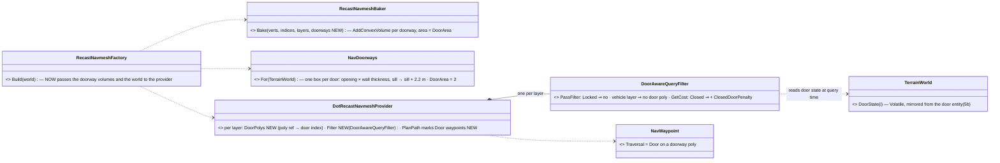
*What it shows that prose hid:* nothing is written into the mesh after the bake — the door's state reaches the planner through the
filter, so the read-only mesh of CE-2122 stays read-only, and every query (`PlanPath`, `PathExists`, `PathCost`, EQS reachability,
sampling) honours a locked door with no further change.

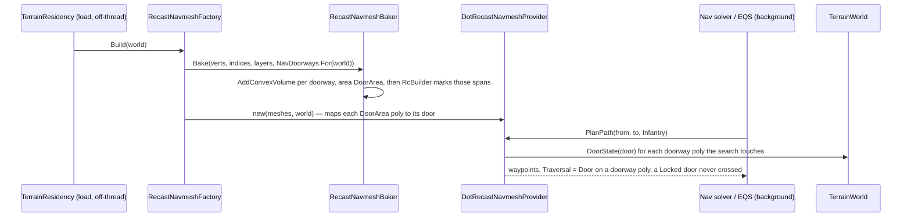

| decision | lean | rejected (one line each) |
|---|---|---|
| **N1** how a door's state reaches the planner | ⭐ a `DoorAwareQueryFilter` judges by the door states at query time — ⚠ **as built (R-219, 5b′): the CALLER's `DoorStates` from its own view**, not a live field on the terrain (the STATE half of Navigation v2 §14; geometry changes use its snapshot swap — R-218) — ⚠ **mechanism changed from §3a's `SetPolyFlags`**, behaviour identical | runtime `SetPolyFlags` — mutates the mesh two background threads read (CE-2122) · a mesh copy per state change — a rebake by another name |
| **N2** which agents may open doors | ⭐ the Infantry layer (closed = passable at a cost); the Vehicle layer never uses a door poly | a per-agent capability component — none exists and nothing would write it yet; add it when a unit type needs to differ |
| **N3** the cost of a closed door | ⭐ `ClosedDoorPenaltyMetres = 10` added when entering a closed door's poly — a detour shorter than ~10 m wins | no penalty — a closed door would look free · a multiplier — a doorway poly is short, so it would barely register |
| **N4** door waypoints and replanning | ⭐ `PlanPath` marks `Traversal = Door` now; **carrying it through the trajectory pool, and replanning on a door change, move to 5d** with their consumer (the door action) | carrying it now — three hops (`PathfindingSolverSystem`, `TrajectoryWaypoint`, `EngineBackedPathRegistry`) for a value nothing reads until 5d |

⛔ ~~**Interim, until 5d:** an infantry agent may plan through a CLOSED door and, with no door action yet, walk the doorway as if it
were open.~~ **SUPERSEDED `2026-10-08` by 5d-3** — a path-following agent now stops at a closed door and opens it (§3j "5d-3 / 5d-4 as built"); only a DtCrowd-driven agent still walks the doorway as before.

| 5c as built *(backend, `2026-10-07`)* | |
|---|---|
| matches the diagrams | `NavDoorways.For` (one box per door: opening × wall thickness + 0.4 m each side, sill − 0.5 → sill + 2.2 m, `DoorArea` = 2) → `RecastNavmeshBaker.Bake(…, doorways)` → `AddConvexVolume` · `DotRecastNavmeshProvider(meshes, world, doorways)` maps each `DoorArea` poly to its door (`NavDoorways.DoorPolys`) and gives each layer a `DoorAwareQueryFilter` (Infantry may open doors) · `PlanPath` marks `TraversalKind.Door` |
| ⚠ found while building — a PRE-EXISTING contract bug | DotRecast answers an unreachable goal with a **partial** path (to the polygon nearest it), and `PathExists`/`PathCost` counted that as a path — against their own contracts (*"a walkable path exists"*, *"`MaxValue` when no path exists"*). Rare before (an island); with a locked door it is the normal answer for "into that room". ⇒ both now require a COMPLETE path (`polyPath[last] == endRef`); `PlanPath` still returns the partial one, so an agent still goes as near as it can |
| rails | `RecastNavmeshFactoryTests.Stage5c_*` — the doorway bakes into door polygons and a path through it carries a `Door` waypoint · locked = wall, closed / destroyed / open = passable, read live · the filter charges a closed door once on entry and keeps vehicles out |


### 5b′ — door state is read from the reader's own view *(backend, `2026-10-08`, R-219)*

> 🔒 **User, `2026-10-08`:** *"Regarding doors state as entities in ecs repo - this is also sensitive topic to multi thread reading
> and writing. Is there an issue? Note the fdp supports automatic cheap snapshotting the ecs repo for modules running in own
> threads"* → *"Approved, do the fix first"*.

| claim | code — how it IS | design — how it was MEANT |
|---|---|---|
| a background module reads a SNAPSHOT replica | ✅ GDB `DoubleBufferProvider` / SoD `OnDemandProvider` → `SyncFrom` | ✅ `Fdp.ModuleHost.md` "snapshot isolation" |
| a per-entity component is COPIED into the replica | ✅ `EntityRepository.Sync.cs` (component tables `SyncFrom`); no module narrows its mask (`GetRequiredComponents` overridden by none) | ✅ same |
| a managed component without `SnapshotViaClone` is shared BY REFERENCE | ✅ `EntityRepository.cs:660-663` | ✅ `DataPolicy`: records "safe everywhere", mutable classes default `NoPreview` |
| a SINGLETON is shared by TABLE — a value swapped in reaches every snapshot | ✅ `EntityRepository.Sync.cs:157` `SyncSingletonById` shares `_singletons[typeId]` (incl. `TerrainWorld`) | ⛔ ⇒ the "immutable `DoorStates` singleton" first proposed would NOT have been snapshot-consistent — measured before building |
| ⛔ 5a/5b put LIVE door state on `TerrainWorld` | ✅ was `TerrainWorld.SetDoorState` + `DoorStateMirrorSystem` | ⛔ broke the shared-by-reference contract; the 5c claim *"readable from any thread"* was true of torn reads, false of the model |

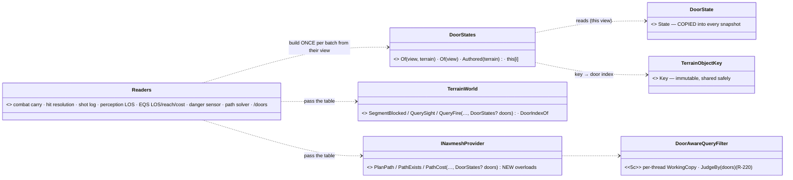
*What it shows that prose hid:* nothing writes door state anywhere but the `DoorState` components; every reader derives its table
from the view it already holds — a background module's view IS its snapshot, so it sees the doors of its own tick for free.

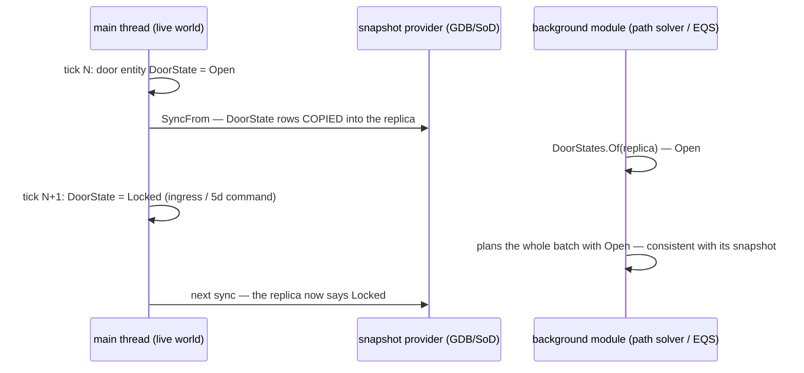

| decision | lean (approved) | rejected (one line each) |
|---|---|---|
| where a query gets door state | ⭐ `DoorStates.Of(view, terrain)` built from the reader's own view, passed explicitly to every terrain and navmesh query | a mutable field on `TerrainWorld` — shared by reference into every snapshot · an immutable singleton — singletons are shared by TABLE, so a swap reaches every snapshot (measured) · `SnapshotViaClone` on the terrain — deep-clones the whole terrain per snapshot · an implicit thread-static door context — invisible plumbing a caller can skip |
| the mirror system and the pack seam | ⭐ removed — there is nothing to mirror | keep an empty `TerrainObjectSystems` seam — an unused registration contract on five hosts |
| no table passed | the door as the terrain AUTHORED it (`TerrainDoorDef.Initial`) | "open" — would ignore a scenario's authored locked door |

⭐ **As built `2026-10-08`, R-220:** `DoorStates.Of` allocates nothing while the doors are unchanged. It re-reads the door entities
into thread scratch on every call and returns that thread's previous table when the bytes are equal; it never uses a version key. The
navmesh judges the caller's table through a per-thread working filter instead of `With(doors)`.
📄 [`DESIGN_Terrain_World.md`](DESIGN_Terrain_World.md) §6a.

| rails | `TerrainWorldTests.R219_AQueryOnASnapshot_SeesTheDoorsOfThatSnapshot_NotALaterFlipOnTheLiveWorld` (the reason for the rule: a `SyncFrom` replica keeps the door open while the live world locks it) · `R219_AViewsDoorTable_IsBuiltFromItsDoorEntities` · `Stage5_*`/`Stage5c_*` re-stated on per-view tables · `EntityDoorStateTranslatorTests` (the wire reaches the replica's VIEW) · `TerrainReportTests.Doors_NameTheDoorEntity_AndReportItsState_FromTheWorldsView` |
|---|---|

### 5d — door commands *(backend, `2026-10-08`; slices 5d-1…5d-4 built, `bt-doors` passes live)*

| claim | code — how it IS | design — how it was MEANT |
|---|---|---|
| door actions run on the ACTOR's Brain node | ✅ `InteractionDispatcherSystem` via `ActionDispatchModule`, scheduled by `CgfLogicPack` (Brain tier: CGF + editor) | ✅ `DESIGN_Ownership_Groups_And_Grants.md` :523 — channels never leave the Brain |
| the door's state has ONE writer, its owner (the creator) | ✅ `EntityDoorStateEgressTranslator` gates on `HasAuthority(door, PackKey(dtDoorState,0))` | ✅ §3a *"actions executed by the door's owner"*; 5b ownership row |
| a non-owner's change reaches the owner as a typed command, not a value | ✅ the damage path (`DamageAssessedEgressTranslator` → `EntityHitDamage` → ingress with `IsRemote` → `HealthApplicationSystem` owner gate) | ✅ `.dev/bdc-sst-rules.md:130` *"a specific message to the current owner"*; `DESIGN_Cgf_AxisB_Rotation_Slice.md` §11.1 |
| the open-door action was a stub | ✅ `OpenDoorExecutor` set Success on the first tick, ignoring its door | ⛔ §3a: adjacent, animation time |
| a replica before its master has no `NetworkAuthority` | ✅ `GhostCreationSystem.CreateGhost` adds only identity + tracker | — measured, so the applier excludes ghosts |
| the Door flag is dropped before the mover; nothing replans on a door change | ✅ `PathfindingSolverSystem.cs:407` copies positions only; `TrajectoryWaypoint` has no kind; the only replan is the frustration watchdog | ✅ §3a sequence *"OpenDoor at the waypoint … replanned"*; N4 moved both here |

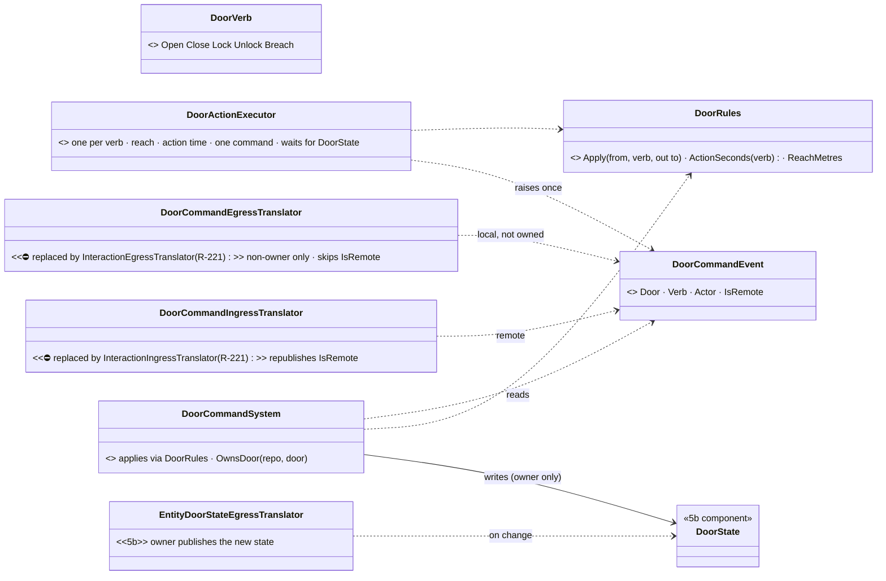
*What it shows that prose hid:* nothing but the owner's `DoorCommandSystem` writes `DoorState`. The executor never writes the door:
it raises a command and reads the answer back from the replicated state, so the action behaves the same whether the door is local or
on another node.

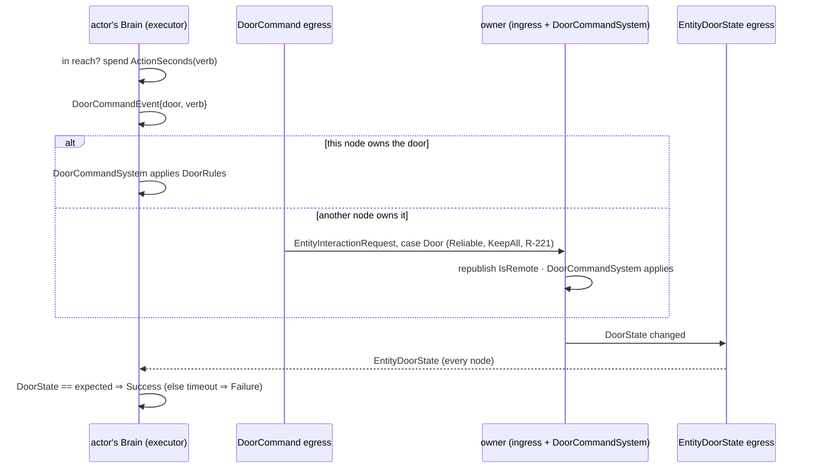

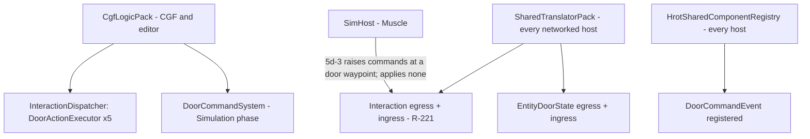
*What it shows that prose hid:* only the Brain tier applies commands (it is where doors are created and owned). A SimHost raises a
command (5d-3, the mover at a door waypoint) but never applies one, so its commands always travel through the translators, even in
`--mode all`, where each host keeps its own world. The SimHost edge was dashed (not built) until 5d-3; it is built now.

| decision | ⭐ as built | rejected (one line each) |
|---|---|---|
| transport to the owner | ⭐ a typed command on the bus (`DoorCommandEvent`) + its own Reliable/KeepAll topic, the damage path's shape | the attribute edit request (F-10): it carries a VALUE, not a verb with preconditions · a temporary ownership transfer: `bdc-sst-rules.md:130` forbids it for a one-time change |
| the answer | ⭐ the door's replicated state; the executor waits for the state the verb leads to (timeout 3 s) | an ack message: a second topic for what the state already says |
| where the rules live | ⭐ one `DoorRules` table, used by the applier (to write) and the executor (to know what to wait for, and to fail at once on a refused verb) | rules in the executor only: a command from the mover or an operator would bypass them |
| adjacency | ⭐ 2 m horizontally and 1.5 m vertically from the doorway centre; out of reach ⇒ Failure (the behaviour moves the actor there first) | stay Running while out of reach (`EmbarkExecutor`): an action that never ends when nothing walks the actor there |
| action time | ⭐ `DoorRules.ActionSeconds` (open/close 1 s, lock/unlock 2 s, breach 3 s), spent before the command is sent | instant: the stub's behaviour, contradicts §3a |
| one executor or five | ⭐ one class, constructed per verb, five action ids (4–8) in one list (`BehaviorConstants.DoorActionExecutors`) every host registers whole | one id with a verb parameter: the blueprint catalog keys a command by action id, so one id would hide four verbs from the palette |
| the applier's gate | ⭐ the owner of the door-state DESCRIPTOR (`PackKey(dtDoorState,0)`), the key its egress publishes under; a ghost is never the owner | the component claim (`HasAuthority<DoorState>`): not what the publisher tests, so the two could disagree |

| slice | content | state |
|---|---|---|
| **5d-1** | `DoorVerb`/`DoorRules`/`DoorCommandEvent`/`DoorCommandSystem`, the `EntityDoorCommand` topic + translators (⛔ the door-only topic and translators were REPLACED `2026-10-08` by [`DESIGN_Entity_Interactions.md`](DESIGN_Entity_Interactions.md) slice I-1: a door command now crosses on the ONE `EntityInteractionRequest` topic as the union case `Door`; the event, rules, executor and `DoorCommandSystem` are unchanged), `DoorActionExecutor` ×5 on every Brain host, blueprint catalog entries `CloseDoor`/`LockDoor`/`UnlockDoor`/`BreachDoor` | ✅ built |
| **5d-2** | a BTree door node with a `TerrainObjectRef` param (K4: the key, resolved through `TerrainObjects.Find`) | ✅ built (below): `TerrainObjectRef`, `DoorNodes.MoveToDoor`/`OperateDoor`, the curated `DoorLocksmith` |
| **5d-3** | carry `Door` waypoints planner → mover (`PathfindingSolverSystem`, `TrajectoryWaypoint`, `EngineBackedPathRegistry`); the mover stops at a closed door, raises Open, waits, goes on | ✅ built (below) — ⚠ the `CoarseWaypoints` wire NOT carried: solver and mover are one node (below) |
| **5d-4** | replan when a door ahead on the path locks (R-218 P3) · the `bt-doors` scenario | ✅ replan built (below) · ✅ `bt-doors` passes live (`2026-10-08`) |

| rails | `DoorCommandTests` (the rules table, owner-only applier, the executor's time/one-command/answer, failure cases, the verb list) · `EntityDoorStateTranslatorTests.Stage5d_ACommandRaisedOnAReplica_IsAppliedByTheOwner_AndTheNewStateComesBack` (the wire) |
|---|---|

### 5d-3 / 5d-4 as built — the mover crosses doors *(backend, `2026-10-08`; plan approved, hold mechanism approved: *"Approved, go with IsBlocked"*)*

| claim | code — how it IS | design — how it was MEANT |
|---|---|---|
| the planner and the mover run on ONE node | ✅ `PathfindingSolverSystem` (`NavigationSolverModule`) and `CarKinematicsSystem` (`GroundKinematicsModule`) are both SimHost modules; the trajectory pool is shared in-process | ✅ `DESIGN_Navigation_v2` — the Muscle owns solve + move |
| a "stop here, keep the path" flag already existed, unread | ✅ `NavState.IsBlocked` — written only by `VehicleCommandSystem` (reset to 0 on a new command), read by nothing before this slice (grep over `FDP/ Hrot/ Stride/`) | ✅ `FDP/Docs/projects/toolkits/FDP.Toolkit.CarKinem.md:145` *"1 = obstacle ahead"* — designed, never built |
| the frustration watchdog would read a hold as being stuck | ✅ `NavigationExecutionSystem` counts no-progress ticks and replans or fails | ⛔ searched `docs/`+`.dev/`: no rule for a deliberate stop — a hold is not frustration, so it is excluded |
| the only replan request lived inside the watchdog | ✅ was inline in `NavigationExecutionSystem` | ✅ R-218 P3 — *"replan on a stale route"*; one implementation (ruling 9) ⇒ extracted, not copied |

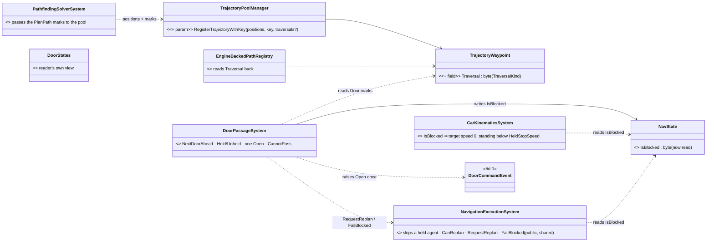
*What it shows that prose hid:* one new class. Everything else is an existing type gaining a field, a parameter or a reader, and the
replan has ONE implementation that both the watchdog and the door passage call.

```mermaid
sequenceDiagram
    participant P as DoorPassageSystem (mover node)
    participant K as CarKinematicsSystem
    participant W as NavigationExecutionSystem
    participant O as door owner (DoorCommandSystem)
    P->>P: next Door mark within 4 m ahead → terrain door (≤ 1.5 m from its centre)
    alt Closed and in reach (2 m)
        P->>K: NavState.IsBlocked = 1
        K->>K: target speed 0 · path + progress kept
        W->>W: held ⇒ not frustration
        P->>P: spend ActionSeconds(Open)
        P->>O: DoorCommandEvent{Open} (interaction transport, R-221)
        O-->>P: DoorState = Open (replicated)
        P->>K: IsBlocked = 0 · drives on
    else Locked (or no answer in 3 s)
        P->>W: CanReplan? RequestReplan : FailBlocked (once per door, 2 s quiet)
        W-->>P: new path, routed round the locked door (the planner's door filter)
    end
```

```mermaid
graph TD
    GKM[GroundKinematicsModule - SimHost] --> NES[NavigationExecutionSystem]
    GKM --> DPS[DoorPassageSystem - NEW, after NES]
    GKM --> CKS[CarKinematicsSystem]
    NSM[NavigationSolverModule - SimHost] --> PSS[PathfindingSolverSystem]
    PSS -->|same process: trajectory pool| DPS
    DPS -->|DoorCommandEvent| EG[Interaction egress - SharedTranslatorPack]
    EG -->|EntityInteractionRequest| DCS[DoorCommandSystem - CgfLogicPack, door owner]
    CREP[DtCrowd hosts]:::dead -.->|no door marks: not covered| DPS
    classDef dead stroke:#c00,stroke-dasharray:4
```
*What it shows that prose hid:* the 5d-1 dashed edge "SimHost raises commands" is now built — `GroundKinematicsModule` ticks
`DoorPassageSystem` every frame on the node that moves the agent. The red edge is the one host family it does not reach: a DtCrowd-driven
agent never gets `CustomTrajectory` marks, so it ignores doors (as before).

| decision | ⭐ as built | rejected (one line each) |
|---|---|---|
| how the agent stops | ⭐ `NavState.IsBlocked` — the designed, unread "obstacle ahead" flag: target speed 0, path and progress kept; cut to 0 below `HeldStopSpeed` (0.05 m/s) because the speed controller is proportional and only decays | a new hold component: a second flag for what `IsBlocked` was designed to say · clearing the path: the agent would have to replan after every door |
| where the door is read | ⭐ the mover node's own `DoorState` (R-219), via a cached `TerrainObjects.Find` per door key | the planner's door filter: it answers "may I plan through", not "is it open NOW" |
| which door a mark is | ⭐ a mark within 1.5 m (and the reach height) of a terrain door's centre | carrying the door index on the waypoint: a second field for a lookup that is cheap and exact on the terrain |
| how far ahead | ⭐ 4 m look-ahead; the hold starts only inside the 2 m reach | holding at the first sight of the mark: the agent would stop short of the door and be out of reach |
| a locked door | ⭐ the shared `RequestReplan` (counts against `ReplanCount`, publishes `PathReplannedEvent`), or `FailBlocked` when the intent allows none; once per door, then 2 s quiet | walking into it until the watchdog fires: seconds of pushing a wall, then a generic failure |
| no answer from the owner | ⭐ after 3 s (the executor's timeout), treated as a door it cannot pass ⇒ the locked path | wait forever: a lost owner would freeze the agent |
| the `CoarseWaypoints` wire | ⭐ not carried — the solver and the mover are one process | three more hops for a value nothing across the wire reads (N4's reason, unchanged) |

⚠ **Found by the first `bt-doors` live run, fixed** — the agent was ordered into House A and "arrived" outside on a PARTIAL path:
① `TerrainWorldMesh` cut a 2 m strip of ground along the 0.15 m inner wall (it dropped every ground cell whose centre lay in a wall
panel) — the hall door never connected (📄 `DESIGN_Terrain_World.md` §6) · ② the template's front door (`at` 4.5 is the opening's
START) was centred ON the inner wall · ③ a 1.0 m doorway leaves 0.4 m after the 0.3 m infantry erosion — one or two 0.3 m voxels, so
it bakes or not by grid alignment. ✅ **Fixed by the tiled bake (`CE-3111`, `2026-10-08`)**: infantry tiles over a building bake
at 0.15 m cells, so a real 0.9 m door passes; House A's doors are 0.9 m (same centres). ⛔ SUPERSEDED: *"a doorway an infantry agent
must pass is ≥ 1.2 m; House A's doors are 1.2 m"* (the stopgap at one 0.3 m tile). Rail
`RecastNavmeshFactoryTests.Stage5d_BtRangeHouseA_EveryDoorwayConnectsForInfantry`.
④ ✅ **the agent planned on the VEHICLE layer** (1.8 m: no doorway admits it): `NavLayerSelection.For` read `VehicleState` as "a vehicle", and SimHost infantry carries it. Fixed by R-222 (`CE-3112`): the layer is mapped from the TKB locomotion class (`Pedestrian` ⇒ Infantry); the human templates now say `Pedestrian`.
✅ Real doors (0.8–0.9 m) pass since the tiled bake — 📄 [`Navigation_Design_v2_0.md`](designs/navig-2/Navigation_Design_v2_0.md)
§14 "P2 as built" (0.9 m: 5/5 grid alignments at 0.15 m; 0.8 m only 2/5 — a 0.8 m door is still alignment-dependent).
⚠ **Found by the first 0.9 m live run, fixed** — `bt-doors` failed on some runs (the back door never opened): turning through the
narrower doorway the mover clipped a jamb, `SurfaceZ` took the ground away inside the wall panel, and the agent was held at the
upper floor's 3 m from then on. ✅ a wall panel never takes the ground away (📄 `DESIGN_Terrain_World.md` §6).
✅ **Fixed by `CE-3115` — `bt-doors` 6/6 again** (it was 4/6 after the tiled bake) — not the mesh: the plan is the same in-process and live (logged).
The mover never steered back onto its path (`CE-3115`, now pure pursuit ON the path — 📄 `FDP.Toolkit.CarKinem.md`), and the tiled mesh's
route goes WEST round House A, where the 1.4 m drift the Visitor picks up (corner, avoidance of the Locksmith) runs inside the wall
and past the back door's mark out of reach; the old east route drifted outside it. The planner now asks for a vertex only where the
AREA changes (`DT_STRAIGHTPATH_AREA_CROSSINGS`; ⛔ SUPERSEDED: `ALL_CROSSINGS` — the fine tiles cut a corner into 10 cm segments).

⚠ **Known limits:** when no route avoids the locked door, the planner returns a PARTIAL path (the agent goes as near as it can and the
watchdog ends the move) · a DtCrowd host ignores doors.

| rails | `DoorPassageSystemTests` ×4 (a closed door holds, opens once after the action time, releases when Open · out of reach / open never holds · locked replans once · locked with no replan allowed fails) · `NavigationExecutionSystemTests.Stage5d_AHoldAtADoor_IsNotFrustration` · `CarKinematicsSystemTests.Stage5d_IsBlocked_StopsOnThePath_KeepsIt_AndDrivesOnWhenCleared` · `EngineBackedPathRegistryTests.Stage5d_TheDoorMark_SurvivesThePoolAndTheRegistry` · `GroundKinematicsModuleTests` (5 systems, `DoorPassageSystem` at [4]) |
|---|---|

### 5d-2 as built — a behaviour names a door and acts on it *(backend, `2026-10-08`; plan approved; R-223 for the test behaviour's form)*

| claim | code — how it IS | design — how it was MEANT |
|---|---|---|
| an action node is a C# method whose params block the scenario JSON fills | ✅ `CgfNodes.Action_WriteMoveToChannel`; the generated registrars deserialize with the canonical options (`IncludeFields`) | ✅ `DESIGN_BTree_Node_Call_Shapes` (CE-504, the shared signature) |
| a door reference stores the KEY | ✅ door entities get their numbers at load | ✅ §3b K4 |
| an unmanaged struct can carry a readable string | ✅ `FixedString64` (`Fdp.Core`), shown as a string by the diagnostics | ⛔ searched, none |
| the door executor needs the actor in reach; the behaviour brings it there | ✅ `DoorActionExecutor` fails out of reach | ✅ §3j 5d decision "adjacency" |
| no node wrote the interaction channel before | ✅ grep of the brains and toolkit nodes | ⛔ none; Entity Interactions I-3 is the executor base only |

```mermaid
classDiagram
    direction LR
    class TerrainObjectRef { <<NEW, Fdp.Toolkits/Terrain>> Key : FixedString64 · Resolve(repo) · DoorIndex(world) · JSON = the key string }
    class MoveToDoorParams { <<NEW>> Door · Speed · Started (runtime) }
    class OperateDoorParams { <<NEW>> Door · Verb · Started (runtime) }
    class DoorNodes { <<NEW, shared nodes>> MoveToDoor · OperateDoor · ApproachPoint · ActionIdOf }
    class DoorActionExecutor { <<5d-1>> reach · action time · one command · the answer }
    class TerrainObjects { <<5b>> Find(repo, key) }
    class DoorLocksmithBehavior { <<NEW curated tree, Hrot.AI.Behaviors>> MoveToDoor → Unlock → Open → MoveTo }
    class DoorLocksmithParamsJsonDto { <<NEW contract, Hrot.Core>> door · x · y · speed }
    TerrainObjectRef ..> TerrainObjects : resolves
    MoveToDoorParams --> TerrainObjectRef
    OperateDoorParams --> TerrainObjectRef
    DoorNodes ..> MoveToDoorParams
    DoorNodes ..> OperateDoorParams
    DoorNodes ..> DoorActionExecutor : puts its action on the interaction channel
    DoorLocksmithBehavior ..> DoorNodes
    DoorLocksmithBehavior ..> DoorLocksmithParamsJsonDto : its resolver fills one block per node
```
*What it shows that prose hid:* the nodes own no door logic — `OperateDoor` only puts the verb on the channel and reports the
executor's answer; everything a door action means stays in the 5d-1 executor and `DoorRules`.

```mermaid
sequenceDiagram
    participant T as BTree (Brain node)
    participant N as DoorNodes
    participant L as locomotion channel / MoveTo executor
    participant I as interaction channel / DoorActionExecutor
    participant O as door owner
    T->>N: MoveToDoor(door)
    N->>N: resolve the key (TerrainObjects.Find) · in reach? ⇒ Success
    N->>L: MoveTo(approach point on the actor's side), remember the activation id
    L-->>N: Running … arrived
    N-->>T: Success (in reach)
    T->>N: OperateDoor(door, Unlock)
    N->>I: action 7 + the door, remember the activation id
    I->>O: after the action time, ONE DoorCommandEvent (R-221)
    O-->>I: DoorState Unlocked (replicated)
    I-->>N: Success
    N-->>T: Success, once (then free to run again)
```

```mermaid
graph TD
    CUR[CuratedBehaviorRegistrar - generated, Hrot.AI.Behaviors] -->|registers DoorLocksmith + its resolver| BEH[BehaviorRegistry]
    BRAIN[BrainTickSystem - CGF / editor] -->|ticks the tree each frame| NODES[DoorNodes - Fdp.Toolkits]
    NODES -->|writes| LOCO[LocomotionChannel]
    NODES -->|writes| INTER[InteractionChannel]
    ADM[ActionDispatchModule - CgfLogicPack] -->|dispatches| INTER
    ADM -->|dispatches| LOCO
```
*What it shows that prose hid:* the nodes run where the BRAIN runs (CGF, editor); the door's owner may be another node — the
command crosses through 5d-1's transport, and the answer comes back as the replicated state.

| decision | ⭐ as built | rejected (one line each) |
|---|---|---|
| the reference | ⭐ `TerrainObjectRef` = the key in a `FixedString64`; JSON is the key string; a key over 63 bytes is refused, never cut | the door's network id: allocated at load (K4) · the door's terrain index: shifts when the file is edited · a hash: unreadable, cannot be written back |
| nodes | ⭐ two, composable: `MoveToDoor`, `OperateDoor(verb)` | one "go and operate" node: cannot say unlock-then-open or lock-behind-you |
| "is this channel activity mine?" | ⭐ the node keeps the activation id it started in its own params block (`Started`, `[JsonIgnore]`, like `FireAtTargetParams.RoundsFired`); it reports the executor's answer ONCE, then a new call starts afresh | comparing the target door: a previous node's finished action on the same door would answer for this one |
| the approach point | ⭐ 1 m off the doorway centre along the wall's normal, on the actor's side (the terrain's door definition gives the wall) | the door centre: the agent would walk into the leaf |
| the test behaviour | ⭐ `DoorLocksmith`, a curated C# tree in `Hrot.AI.Behaviors` with a `[BehaviorContract]` DTO and a typed resolver (R-223) | a JSON recipe: string `MethodFqn` references and editor noise for a behaviour no human edits |

⚠ **Found by the first live run, fixed:** the Locksmith reached the door and the door action failed at once — the built-in
UrbanCombat humans (1001/2002/2003) carried no `CanInteract`, and `InteractionDispatcherSystem` fails every interaction-channel
action without it (the BDC builder sets it; the hand-written catalog did not). ⇒ the three human templates now carry
`CanInteract = true`; rail `BdcTkbBuilderVisualTests.CE3112_BuiltInHumans_ArePedestrians_ThatCanInteract` pins both flags
(with the `Pedestrian` class of R-222). ⚠ The in-process rail could not see it: it drives the executor directly, past the
dispatcher's capability gate.

⚠ **Two more, from the second live run, fixed:** ① the Locksmith opened the door and never walked in — `MoveToDoor` left its
finished walk on the locomotion channel, and the next MoveTo node (`CgfNodes.Action_WriteMoveToChannel`) took that "Success" as
its own. ⭐ The door nodes now HAND BACK their channel when their activity ends (no action, a new activation id). The MoveTo
node's own habit is recorded as `CE-3113` (behaviors lane). ② the Visitor came out of the hall doorway on the upper floor (z 3):
`SurfaceZ` counted the doorway's lintel as solid (📄 `DESIGN_Terrain_World.md` §6).

| rails | `DoorCommandTests.Stage5d2_*` ×3 (the reference is the key in JSON, resolves, refuses an over-long key · OperateDoor puts the verb on the channel and reports the executor's answer once · MoveToDoor aims at the actor's side and succeeds in reach) · live: `bt-doors`' Locksmith unlocks and opens the front and walks in through it |
|---|---|

### 5e — door state is saved in the scenario *(backend, `2026-10-08`, K5)*

| claim | code — how it IS | design — how it was MEANT |
|---|---|---|
| a save goes through ONE serializer, a distributed save through ONE merge | ✅ `ScenarioSaveCore.BuildDom` → `ScenarioSerializer.Serialize`; `ScenarioMergeCore.Merge` rebuilds `{$meta, Header, Entities}` only | ✅ `DESIGN_Distributed_Scenario_Persistence.md` §4b (I1–I4) |
| door entities never reach `Entities` | ✅ `TerrainObjectRequests` sets `IsTransient` ⇒ `ScenarioIgnoreTag`; `CollectSaveableEntities` skips it | ✅ §3b K5 |
| a door entity is created in ONE place, where its initial state is set | ✅ `ScenarioLoadStep.Commit` → `TerrainObjectRequests.ForDoors` | ✅ §3b K3 |
| the save gate is the primary owner | ✅ `CollectSaveableEntities` → `HasAuthority` | ✅ Persistence §1 *"save an entity iff you are its non-transient primary owner"* |

```mermaid
classDiagram
    direction LR
    class TerrainObjectsSection { <<NEW, static>> Name = "TerrainObjects" · Write(repo) · Of(dom) · ReadDoors(dom/json) }
    class ScenarioSerializer { <<existing>> Serialize(repo, header) — appends the section }
    class ScenarioMergeCore { <<existing>> Merge — ⋃ TerrainObjects, a key in two slices throws }
    class ScenarioLoadStep { <<existing>> PrepareAsync reads the section · Commit passes it on }
    class TerrainObjectRequests { <<existing>> ForDoors(terrain, existing, allocator, saved) }
    class DoorState { <<component>> }
    class TerrainObjectKey { <<managed>> }
    ScenarioSerializer ..> TerrainObjectsSection : Write
    ScenarioMergeCore ..> TerrainObjectsSection : Of
    ScenarioLoadStep ..> TerrainObjectsSection : ReadDoors
    ScenarioLoadStep ..> TerrainObjectRequests : saved states
    TerrainObjectsSection ..> DoorState : reads (owned doors)
    TerrainObjectsSection ..> TerrainObjectKey : the key
```
*What it shows that prose hid:* one class owns the section's format. All three places that touch the file call it, so the save, the
merge and the load cannot disagree about the section's shape.

```mermaid
sequenceDiagram
    participant W as Brain world (door entities)
    participant S as ScenarioSerializer
    participant M as ScenarioMergeCore
    participant L as ScenarioLoadStep
    participant R as TerrainObjectRequests
    W->>S: Save — door "range/H/front" is Open, authored Locked
    S->>S: TerrainObjects = { "range/H/front": { "door": "Open" } } (owned + differs only)
    S->>M: distributed save: one slice per node
    M->>M: union the slices' TerrainObjects (a key twice ⇒ throw)
    L->>L: Load — PrepareAsync: ReadDoors(json)
    L->>R: Commit: ForDoors(terrain, existing, allocator, saved)
    R->>W: Door request with DoorState = Open (saved), the hall door = its authored state
```

| decision | ⭐ as built | rejected (one line each) |
|---|---|---|
| which doors are written | ⭐ the doors this host OWNS whose state **differs from the terrain's authored state** | every door — a later change to the terrain's authored state would never reach a scenario that never touched that door · every door this host sees — each node would write the replicas too, and the merge would throw |
| the section's name | `TerrainObjects` (PascalCase like `Header`/`Entities`); the reader also accepts `terrainObjects` (K5's spelling) | `terrainObjects` only — the one camelCase key in a PascalCase file |
| a saved key the terrain does not define | logged and ignored; the next save drops it | fail the load — a renamed door would make every old scenario unloadable |
| a value that is not a door state | ⛔ the load fails loudly | ignore it — a scenario would silently lose a locked door |
| `TerrainObjectRef` (K4) | ✅ **built in 5d-2** (`2026-10-08`); its first consumer is the door nodes' params. The key is stable across loads, so the reference needs no remap pass and nothing in the load path to build now | build it now — a type with no reader |
| schema version | unchanged (3): the section is optional and older readers ignore an unknown top-level key | a version bump — would need a migration for an additive optional section |

| rails | `ScenarioSerializerTests.Stage5e_TheSaveWritesTheOwnedDoorsThatDifferFromTheTerrain_KeyedByTerrainObjectKey` · `ScenarioMergeCoreTests.Stage5e_TerrainObjects_UnionAcrossSlices_AndAKeyInTwoSlicesFailsLoud` · `ScenarioLoadStepTests.Stage5e_ADoorsStateSurvivesSaveAndLoad_AnUntouchedDoorStartsAsAuthored` |
|---|---|

## 3k. Stage 6 — warheads: blast and fragments *(backend, `2026-10-08`; `CE-1032`; 🔒 user: *"approved"*, R-225)*

> 🔒 **User, `2026-10-08`:** *"Go with stage 6, present the design summary"* → *"approved. How the explosion fragments hits will be
> detected, will it become part of raycast batch with results available next tick?"* (answered in "Timing", below).
> Builds on §3d E1–E3, §3e (the ammo type denotes the warhead) and §3f (exposure by wall height and posture) — those are not reopened.

### INVENTORY *(graph CLI + grep, `2026-10-08`)*

| query | result |
|---|---|
| graph `.*Detonat.*` / `.*Explosion.*` / `.*Blast.*` / `.*Fragment.*` / `.*Warhead.*` / `.*Fuze.*` / `.*Munition.*` / `.*Mortar.*` / `.*Grenade.*` / `.*Indirect.*` (Class/Struct/Enum) + grep | ✅ `DetonationNotification` (`Combat/DetonationNotification.cs:24`), `DamageAssessedEvent`, wire `MunitionDetonation` (`FireInteractionMessages.cs:88`) + its two translators; `RefAmmo.BlastLethalRadiusM/InjuryRadiusM` (`ReferenceLibrary.cs:22`, generated, read by nothing). ⛔ no warhead/blast/fragment/fuze/arc type (Blueprint `Fragment` records and test-only `ExplosionEvent` are unrelated) |
| ammo in TKB | `AmmoWeaponBallisticsDto` (`MuzzleSpeed`, `Damage`, `PenetrationMm`), `WeaponMountDto.AmmoGuid`; ⛔ no ammo TKB type is authored as data; ⛔ no lookup by DIS (`ITkbDatabase` by type/name only) |
| the reference library | `ammo.json` already has `M67 grenade`, `40mm HEDP`, `60/81/120mm mortar HE`, `125mm HE-frag` with `explosiveKg`; `weapons.json` has `Hand`, `M203`, the mortars |
| terrain queries | `TerrainWorld.SegmentBlocked` · `QuerySight` · `QueryFire(into)` (`TerrainWorld.cs:313/381/465`); `TerrainPenetration.Carry/Cross` (`TerrainPenetration.cs:164/190`); ⛔ no `ITerrainPropagation` type (the §3a "one query" is a set of `TerrainWorld` methods) |
| flight | straight only (`LinearKinematicsSystem.cs:110`); a shot needs a live target entity (`FireProcessingSystem.cs:67`); a round stopped by terrain is destroyed with NO detonation (`BallisticsSystem.cs:96-106`) |
| damage path | `HitResolutionSystem` (Input) → `DetonationNotification` → `DamageCalculationSystem` (Simulation, MuscleGround, skips `IsRemote`) → `DamageAssessedEvent` → `EntityHitDamage` → `HealthApplicationSystem` (owner of `Health`, R-171) |
| doors | `DoorVerb.Breach` → `Destroyed` (`DoorCommands.cs:59`), owner-applied; nothing in combat sends it |

### Classes

```mermaid
classDiagram
    direction LR
    class WarheadDto { <<NEW TKB descriptor on the ammo type>> Kind · ExplosiveKg · BlastLethalRadiusM · BlastInjuryRadiusM · FragmentRadiusM · FragmentPenetrationMm · FragmentDamage · Fuze · FuzeDelayS · Indirect }
    class ParameterResolver { <<existing>> Warhead(db, ammoType) NEW: TKB → library by name → none }
    class ReferenceLibrary { <<existing>> RefAmmo: explosiveKg, blast radii · NEW RefWarhead (Gurney fragments, fuze, indirect) }
    class MunitionTkbCatalog { <<NEW>> M67 grenade 6001 · 81mm mortar HE 6002 — DIS kind 2, hidden from the palette }
    class WeaponFireIntent { <<existing>> Shooter · Target · NEW AtPoint + TargetPoint }
    class BallisticProjectile { <<existing>> + Ammo · + Warhead bits (Area, Arc, TimeFuze, Landed, Spent) · + FuzeRemaining NEW }
    class DetonationNotification { <<existing>> Target may be NONE · + Ammo NEW }
    class MunitionDetonation { <<existing wire>> + MunitionType NEW }
    class AreaEffectSystem { <<NEW, MuscleGround, Simulation>> per detonation with a warhead: candidates in radius → exposure → damage }
    class TerrainWorld { <<existing>> QueryFire(into) — THE fragment trace · FireCrossing.TopZ NEW }
    class AreaEffect { <<NEW static>> FragmentTransmission · ClosedBarrierTransmission · TerrainShadow · ShadowFactor · falloffs }
    class ColliderOcclusion { <<NEW shared, moved out of TerrainWorldLosStrategy>> Blocking(from, to, skip a, skip b) · Shadow — 3-D cylinders }
    class BodyProfile { <<existing, Stage 4>> NEW Points(view, e, stance, hull) — the one body-point rule }
    class PhysicsColliderReaders { <<existing>> NEW HullHeight — 0 for a person (CE-3116) }
    class FireAtPointExecutor { <<NEW, WeaponChannel action 2>> ammo · cooldown · ROE → WeaponFireIntent(AtPoint) }
    class ArmorModel { <<existing>> PenetrationChance · HitDamage }
    class DamageAssessedEvent { <<existing>> }
    class DoorCommandEvent { <<existing>> Verb = Breach }
    class DetonationLog { <<NEW ring buffer>> per affected entity: stance, points, exposure, shielding, damage }
    class FireAtPoint { <<NEW shared action node>> mount · point }
    FireAtPoint ..> FireAtPointExecutor : WeaponChannel
    FireAtPointExecutor ..> WeaponFireIntent : AtPoint
    ParameterResolver ..> MunitionTkbCatalog : the type by id
    AreaEffectSystem ..> AreaEffect
    AreaEffectSystem ..> PhysicsColliderReaders : HullHeight
    ParameterResolver ..> WarheadDto : reads
    ParameterResolver ..> ReferenceLibrary : fallback
    FireAtPoint ..> WeaponFireIntent : TargetPoint
    WeaponFireIntent ..> BallisticProjectile : FireProcessingSystem spawns (Arc for indirect)
    BallisticProjectile ..> DetonationNotification : hit / terrain stop / fuze
    DetonationNotification ..> MunitionDetonation : egress (IG effect)
    AreaEffectSystem ..> DetonationNotification : consumes
    AreaEffectSystem ..> ParameterResolver : Warhead(Ammo)
    AreaEffectSystem ..> TerrainWorld : QueryFire per body point
    AreaEffectSystem ..> ColliderOcclusion : per body point
    TerrainWorldLosStrategy ..> ColliderOcclusion : the same test
    AreaEffectSystem ..> BodyProfile
    AreaEffectSystem ..> ArmorModel : fragments vs armour
    AreaEffectSystem ..> DamageAssessedEvent : one per affected entity
    AreaEffectSystem ..> DoorCommandEvent : doors in the lethal radius
    AreaEffectSystem ..> DetonationLog
```
*What it shows that prose hid:* every arrow but four ends on something that exists — the area effect rides the existing damage
pipeline (`DamageAssessedEvent` → `EntityHitDamage` → the Health owner) and the existing door command; the NEW types are the
warhead data, one system, one terrain query, the arc and the point-fire node.

### Sequence — a mortar round onto the house

```mermaid
sequenceDiagram
    participant B as Brain (FireAtPoint)
    participant F as FireProcessingSystem (MuscleGround)
    participant K as BallisticsSystem (PostSimulation)
    participant A as AreaEffectSystem (Simulation)
    participant T as TerrainWorld
    participant O as Health owner (HealthApplicationSystem)
    participant D as Door owner (DoorCommandSystem)
    B->>F: WeaponFireIntent(TargetPoint)
    F->>F: arc launch (high angle for a mortar), Ammo on the round
    loop each tick
        K->>T: carry the arc segment (QueryFire)
    end
    K->>K: first contact = roof slab ⇒ impact fuze
    K-->>A: DetonationNotification(Target = none, Ammo) — read next frame
    A->>A: Warhead(Ammo) · candidates = every live Health entity within the max radius
    loop each candidate, each body point of its stance (BodyProfile.Points)
        A->>T: QueryFire(burst → point): fragments × PenetrationChance · closed barriers × exp(−R/100)
        A->>A: colliders on the line (ColliderOcclusion) · shadow on the line to the highest point
    end
    A-->>O: DamageAssessedEvent per entity → EntityHitDamage
    A-->>D: DoorCommandEvent(Breach) for doors in the lethal radius
```
*What it shows that prose hid:* no physics raycast anywhere — the candidates come from one query over the Health entities in reach
and the shielding from the terrain model, synchronously; the only frame boundary is the terrain stop (PostSimulation → next
Simulation).

### Modules — who registers it, who ticks it

```mermaid
graph TD
    SH["SimHostCoreLogicPack (MuscleGround: SimHost, editor)"] --> DAM["DamageAssessmentModule"]
    DAM --> DC["DamageCalculationSystem (direct hit) — existing"]
    DAM --> AE["AreaEffectSystem — NEW, same module, same phase"]
    CM["CombatModule (MuscleGround)"] --> FP["FireProcessingSystem — arc launch"]
    CM --> BS["BallisticsSystem — arc carry, terrain-stop detonation"]
    CGF["CgfLogicPack (Brain)"] --> HA["HealthApplicationSystem — applies, owner-gated"]
    CGF --> FAP["FireAtPoint node — via the shared action registry"]
```
*Caption:* the area effect is registered exactly where direct-hit damage is, so every host that calculates damage today
(SimHost, the editor) calculates area damage, and no host that does not. ⚠ A REMOTE detonation (`IsRemote`, external DIS) gets
no area damage — the same rule `DamageCalculationSystem` applies today.

### Decisions — 🔒 approved `2026-10-08` (R-225)

| # | decision |
|---|---|
| W-1 | warhead numbers: `WarheadDto` on the ammo's TKB type, resolved `TKB → reference library by ammo NAME → none` (kinetic) with provenance in `/tkb/resolve`. ⚠ §3e says keyed by DIS — by name until an ammo carries a DIS code (the penetration chain's same limit) |
| W-2 | the shot, `DetonationNotification` and the wire `MunitionDetonation` carry the AMMO TYPE id; never warhead numbers |
| W-3 | a warhead round that stops on terrain detonates there (Target none); kinetic rounds unchanged |
| W-4 | fuzes v1: impact and time; airburst later |
| W-5 | `AreaEffectSystem` beside `DamageCalculationSystem`; one `DamageAssessedEvent` per affected entity; applied by the Health owner (R-171); no new damage wire |
| W-6′ | fragments, per body point of the target's stance: TERRAIN — `QueryFragment`, straight, each crossing × `ArmorModel.PenetrationChance(fragment pen, resistance)`, openings pass — × ENTITIES — the 3-D collider test line of sight uses (`PhysicsCollider` cylinders, radius + height), moved into ONE shared helper so sight and fragments never disagree; any collider on the line except the target and the struck entity stops fragments (vehicles and bodies alike). Exposure = mean over the points; damage = fragment damage × falloff × exposure (expected value, R-212); a vehicle target takes it through its armour. ⛔ SUPERSEDED W-6: terrain only (🔒 user: *"the physical based is the right way, as it is pretty normal to hide behind vehicles"*) · ⛔ rejected: the raycast batch — it is 2-D (`RaycastSolverSystem` ignores collider height) and a frame late |
| W-7′ | blast (the shock wave): falloff lethal → injury radius (Z 2 / 6, Hopkinson); an obstacle — wall, slab or vehicle (same collider test) — whose top is above the target's HIGHEST body point puts it in a SHADOW, not a block: the overpressure is scaled by a diffraction factor that recovers with the distance behind the obstacle relative to its height (≈ 0.3 right behind a tall wall → ≈ 1 a few wall-heights back), so a close, large burst still hurts a hidden target; personnel only in v1. ⛔ SUPERSEDED W-7: shielding read as a near-block (🔒 user: *"what about the shock wave effect, even for targets hidden behind obstacles, worth simulationg?"* → *"approved"*) |
| W-7v2 | ⏭ v2: CONFINEMENT and room-to-room propagation — a burst inside a room is amplified by reflections, overpressure passes through doorways; needs the room/portal graph Sound v2 (§3a) needs ⇒ built once for both, with or after Stage 7. ⚠ Until then a burst indoors is under-modelled |
| W-8 | indirect: a gravity arc to a ground POINT (`WeaponFireIntent.TargetPoint`), traced through the existing carry ⇒ first contact; `FireAtPoint` shared action node |
| W-9 | doors in the lethal radius with a clear line → `DoorCommandEvent(Breach)` → Destroyed |
| W-10 | `DetonationLog` + `GET /combat/detonations`; `/terrain/query?purpose=fragment|blast`; a blast layer |
| W-11 | rails with in-test numbers (exposure behind a 0.5 m wall: standing ≥ 0.5, prone ≤ 0.1; roof burst spares the ground floor); premise rows (M67, 81 mm); live `bt-grenade-posture`, `bt-mortar-roof` |

**Timing** *(the user's question)*: ⛔ not the raycast batch. The candidates are already known (the spatial grid within the radius)
and what decides a hit is the TERRAIN and the COLLIDERS between burst and body point — a synchronous trace per body point
(`TerrainWorld` + the shared 3-D collider test, W-6′). A detonation from an entity hit (Input) is assessed in the SAME frame's
Simulation; one from a terrain stop (PostSimulation) in the NEXT frame's — at most one frame, as a direct hit today.
✅ Bodies shielding bodies (a vehicle between burst and soldier) — W-6′, with the 3-D collider test line of sight already uses, not the 2-D raycast batch.

| rejected | the one fact |
|---|---|
| warhead numbers on each detonation | §3e — two sources that can disagree |
| one ray to the target's centre | §3f — a man behind a low wall reads all-or-nothing |
| each target's owner computes its own area damage | every node would need warhead + terrain + stance, and they could disagree; damage is calculated on MuscleGround today |
| dice per fragment | R-212 — expected damage, no dice |
| breachable walls now | a runtime geometry change (R-218 P2 is ready, its caller is not) |
| airburst now | needs height-of-burst sensing — v2 |

⚠ **Prerequisite:** merge `behaviors` (`CE-2121` slice ② — the stance wire) so a prone target is prone on the cluster SimHost. ✅ merged `2026-10-08`.
⏭ Out of scope: WHEN the AI throws or calls fire (behaviors lane); the mechanics and the `FireAtPoint` node are here.

### Stage 6 as built *(backend, `2026-10-08`)*

The diagrams above are updated to the as-built classes and sequence. What changed from the decisions table, and why:

| decision | as built | why |
|---|---|---|
| W-1 | `WarheadDto` (`Gen.Warhead`) · `ParameterResolver.Warhead(db, ammoType)` · `RefWarhead` generated for every explosive library ammo: blast `R = Z·W^⅓`, fragments by Gurney (`v₀ = √2E·√(β/(1+β/2))`, one fragment `k·v₀·√m`, reach `28·casing^⅓`, damage `600·W`); coefficients in `coefficients.json` `fragments` · `fuzeDelayS`/`indirect` in `ammo.json` · the munition types `MunitionTkbCatalog` (6001 M67, 6002 81 mm; DIS kind 2, `HideFromPalette`) · `ResolveAll` lists `Warhead.*` rows for a munition ⇒ `/tkb/resolve`; `/reference` shows the warhead | the catalog's units name no ammo; the warhead units do (`Grenadier` 2004, mount 1; `MortarTeam` 2005) |
| W-2 | `BallisticProjectile.Ammo` · `DetonationNotification.Ammo` · wire `MunitionDetonation.MunitionType`; `HitEntityId 0` = a terrain burst (both translators) | — |
| W-3/W-4 | `BallisticsSystem`: a round with an area warhead that stops on the terrain OR on the flat ground (which `QueryFire` does not count) bursts `BurstStandOffMetres` (0.1 m) back along its flight — so a roof is between a roof burst and the room — and is marked `Spent` (a late raycast of an earlier segment cannot burst it again); a TIME-fuzed one lands and waits; the fuze also runs in flight. Warhead bits are read ONCE at firing | the flight never looks the warhead up |
| W-5 | as designed; the STRUCK entity is IN the burst (≈ 0 m; never its own cover) and its direct hit comes on top — a warhead mount states no hit damage, so that is the flat default; ⚠ candidates are one query over live `Health` entities in reach, not the spatial grid | detonations are rare; the grid is a later optimisation |
| W-6′ | ⛔ no `QueryFragment`: fragments use `QueryFire` (the same pieces, the same resistances) × `ArmorModel.PenetrationChance`; colliders through `ColliderOcclusion`, moved verbatim out of the LOS strategy; a round in flight is not cover | one terrain query, as §3a wants |
| W-7′ | refined: a CLOSED barrier — a slab/stair, a shut door, a building's wall panel — passes the blast by its material, `exp(−R/100 mm)` (0.2 m concrete ≈ 5 %, a wooden door ≈ 95 %); an OPEN obstacle — a free wall, a fence, a solid block, a collider — taller than the target's highest body point puts it in the diffraction shadow (`0.3 → 1` over three obstacle heights, `FireCrossing.TopZ`). Blast is for personnel only (`HullHeight == 0`) | without it the floor below a roof burst would be in a "shadow" of the roof, i.e. hit at 30 % |
| W-8 | `WeaponFireIntent.AtPoint/TargetPoint`, wire `WeaponFireRequest` with `TargetEntityId 0` + point; `FireProcessingSystem.ArcLaunch` (high for ≥ 40 m/s — a mortar; low for a throw; out of reach ⇒ 45°); gravity in `BallisticsSystem`; arc/time-fuze rounds live `ArcRoundLifetimeTicks`; `FireAtPointExecutor` (WeaponChannel action 2, CGF) + the shared `FireAtPointNodes.FireAtPoint` + curated `FireAtPoint` behaviour | ⏭ the Blueprint channel catalog entry is left to the behaviors lane (palette goldens) |
| W-9 | as designed: a door inside the lethal radius whose line from the burst crosses only its own leaf | — |
| W-10 | `DetonationLog` (ring of 64) + `GET /combat/detonations` (MCP `get_combat_detonations`) | — |
| W-11 | rails `AreaEffectSystemTests` (6), `WarheadFlightTests` (4), `ReferenceLibraryTests` (2 new), `HrotEnvironmentTests` (munitions); premise rows `bt-grenade-posture`, `bt-mortar-roof`; scenarios + `scripts/utility-demo-check.py`; the curated test behaviour `HoldStance` | — |
| — | ⭐ **`CE-3116` found here:** a soldier's 1.8 m collider (its capsule) made the body profile a HULL, so sight, aim and fragments ignored prone/crouched on the live world. `PhysicsColliderReaders.HullHeight` = 0 for a pedestrian; sight (`ForLiveWorld`), fire aim and the area effect read it; the collider still blocks lines up to its full height | §3f's profile, now true on the live world |

## 3l. Stage 7a — cover per storey, window firing positions *(backend, `2026-10-09`; ✅ C1–C9 APPROVED by the user `2026-10-09` — *"Look ok."* … *"Approved."* (R-232); build-state: BUILT — `CE-3134`, §3l.7)*

> 🔒 **User, `2026-10-09`:** *"Yes 7a first."* · Scope from the approved plan ([`HANDOFF_Buildings_Combat_Programme.md`](blueprints/batches/HANDOFF_Buildings_Combat_Programme.md)
> §4 Stage 7) and §4 above (approved set): *"cover points per storey along panels (inner side too); window firing positions
> (inside, facing out); stance from the opening's sill, not the building height"*. The HOW below is new — leans.

### 3l.1 INVENTORY *(two read-only sweeps + reads, `2026-10-09`; graph MCP partly down — grep + direct reads)*

| question | answer | where |
|---|---|---|
| what the cover database iterates | `world.Prisms` ONLY — every prism edge, a point every 2.5 m, 0.75 m out, facing the wall; stance from the PRISM's height | `TerrainCoverProvider.cs:47-90` |
| how a panel reaches it | a building panel is expanded into prisms (`Panel = index`): jambs between openings, a piece UNDER each sill, a LINTEL over each head | `TerrainBuildingExpander.cs:209-225` |
| ⚠ what that produces on `house-2f` *(inferred from code — measured by rail ⓪ before any change)* | ① a lintel (head 2.1 → ceiling 3.0, 0.9 m) reads as CROUCH cover, its point Z = `SurfaceZ(hint 2.1)` = the floor below; ② an upper-storey piece's OUTSIDE point has no floor at 3.0 m ⇒ `SurfaceZ` falls back to the ground ⇒ phantom "stand" cover outside the house at Z 0; ③ jamb end-caps land in doorways and window gaps | `TerrainCoverProvider.cs:53-83`, `TerrainWorld.cs:189,227` |
| what is stored on a point | `CoverPoint` 28 B: position, direction (facing the wall), `Quality` = 1 always, `StanceHeight` (2 stand · 1 crouch · 0 prone) + padding | `CoverPoint.cs:14-37` |
| who reads the stance | ⛔ nobody — `CoverPointsGenerator` drops it (the §19 flag-bit write was superseded); `TakeCover` moves to X/Y/Z and sets no stance | `CoverPointsGenerator.cs:40`, `EqsTacticsNodes.cs:211` |
| how EQS points get Z | pattern generators: `SurfaceZ(x, y, anchor.Z)` ⇒ ONE level per XY, the asker's; inside a non-solid footprint they are kept | `EqsTerrainSight.cs:57-63` |
| the LOS test's heights | candidate as the eye: the self's STANDING eye at P; threat as the eye: aimed at the self's CROUCHED eye at P | `CheapLineOfSightTest.cs:96-110` |
| who has panelled buildings | `bt-range` only (`House A`, `House B` = `house-2f`: 2 storeys × 3 m, windows sill 0.9 / head 2.1, inner wall, stairwell); `test-town` / `basic-desert` = solid prisms + 2 free walls | `bt-range/buildings/house-2f.building.json` |
| a map layer for cover | none — no gizmo or route lists cover points | grep |

### 3l.2 Classes

```mermaid
classDiagram
  class TerrainCoverProvider { <<existing, grows>> Build(world)$; GetCoverPointsInRadius(center, r, span) ; Points }
  class CoverPoint { <<existing, grows>> Position; Direction; Quality; StanceHeight; +Kind (a pad byte, still 28 B) }
  class CoverKind { <<new enum>> Cover; WindowFiring }
  class TerrainWallPanel { <<existing>> A; B; Thickness; BaseZ; TopZ; Openings; Building; Storey }
  class TerrainOpening { <<existing>> Kind; At; Width; SillZ; HeadZ }
  class TerrainBuilding { <<existing>> Footprint; StoreyZ }
  class TerrainWorld { <<existing>> Prisms; Panels; Buildings; SurfacesAt(x,y) }
  class CoverPointsGenerator { <<existing, grows>> +Kind : CoverKind (default Cover) }
  class ICoverProvider { <<existing, grows>> +GetCoverPointsInRadius(center, r, span, kind) default: Cover only }
  class ManualCoverProvider { <<existing, grows>> filters by kind }
  class FindWindowFiringPosition { <<new starter template>> CoverPoints(Kind=WindowFiring) + LOS candidate→target Visible + Distance + PathCost }
  class FindCoverFromTarget { <<existing, unchanged>> CoverPoints(Kind=Cover) }
  class CoverPointsGizmo { <<new>> layer Cover = 9, off by default }
  TerrainCoverProvider ..> TerrainWorld : solid prisms + free-wall prisms (as today)
  TerrainCoverProvider ..> TerrainWallPanel : building panels by FACE (new)
  TerrainWallPanel --> TerrainOpening
  TerrainCoverProvider --> CoverPoint
  CoverPoint --> CoverKind
  TerrainCoverProvider ..|> ICoverProvider
  ManualCoverProvider ..|> ICoverProvider
  CoverPointsGenerator ..> ICoverProvider : one kind per query
  FindWindowFiringPosition --> CoverPointsGenerator
  FindCoverFromTarget --> CoverPointsGenerator
  CoverPointsGizmo ..> TerrainCoverProvider
```

*What the picture shows that the prose hid: everything downstream — the generator, both templates, the solver, the wire — is
EXISTING. The change is where points come from (a panel's face, not its expanded pieces) and one byte saying what a point is for.*

### 3l.3 Sequence — the database is built, then a unit upstairs asks for a window

```mermaid
sequenceDiagram
  participant TR as TerrainResidency.Prepare
  participant CP as TerrainCoverProvider.Build
  participant W as TerrainWorld
  participant S as EqsSolverSystem (background)
  participant G as CoverPointsGenerator
  participant L as CheapLineOfSightTest
  TR->>CP: Build(world)
  CP->>W: solid prisms + free-wall prisms → points (unchanged rule)
  loop each building panel, each face, every 2.5 m
    CP->>W: SurfacesAt(p) has a level within 0.3 m of the panel's floor?
    alt no floor there (upper storey outside, stairwell)
      CP-->>CP: drop
    else door / gap span
      CP-->>CP: no point
    else window span
      CP-->>CP: sill = low wall → Cover point (stance by sill height), both faces
      CP-->>CP: inside face → WindowFiring point (stance that clears the sill)
    else solid wall
      CP-->>CP: Cover point, Z = floor, stance by wall height above floor
    end
  end
  TR->>TR: Commit publishes ICoverProvider
  S->>G: FindWindowFiringPosition for a unit on storey 2
  G-->>S: WindowFiring points within radius (all storeys)
  S->>L: standing eye at P sees the target?
  L-->>S: keep the visible ones, Distance + PathCost rank them
```

### 3l.4 Modules — who builds it, who reads it, each frame

```mermaid
graph TD
  P[TerrainResidency.Prepare<br/>once per terrain load, off-thread] --> B[TerrainCoverProvider.Build]
  C[TerrainResidency.Commit] --> SG[world singleton ICoverProvider]
  SG --> SN[EQS snapshot sync<br/>EntityRepository.Sync]
  E[EqsModule SlowBackground 10 Hz] --> SO[EqsSolverSystem] --> GEN[CoverPointsGenerator]
  GEN --> SN
  M[map hosts each frame: StatelessGizmoSystem] --> GZ[CoverPointsGizmo — layer Cover]
  GZ --> SG
  T[TakeCover / FiringPosition behaviours] -. stance of the point: NOT read .-> GEN
  style T stroke-dasharray: 5 5
```

*Caption: the dashed edge is the gap this stage does NOT close — a behaviour moving to a point does not take that point's
stance (§3l.5 C8, behaviors lane). Everything solid already ticks on every host that resolves terrain.*

### 3l.5 Decisions *(leans — reply "approved" or name the one to change)*

| # | lean | why |
|---|---|---|
| C1 | **building panels feed cover by PANEL FACE**; solid prisms and FREE walls/fences keep today's prism rule exactly | ⭐ fixes ①–③ at the source; test-town/basic-desert have no panelled buildings ⇒ their cover — and every `ua-*` demo — is byte-identical |
| C2 | both faces, a point every 2.5 m, 0.75 m out, facing the wall; **Z = the panel's storey floor** (`BaseZ`); kept only where `SurfacesAt` has a level within 0.3 m of that floor and it is not inside a solid prism or another panel's thickness at that height | the floor is KNOWN — no `SurfaceZ` guess; the level check drops an upper storey's outside face and the stairwell by construction |
| C3 | a **door or gap span gives no point**; a **window span** is a low wall of the SILL's height above the floor (today's thresholds: ≥ 1.5 stand · ≥ 0.9 crouch · ≥ 0.45 prone · else none) on both faces; **a lintel never gives cover** | 🔒 §4 *"stance from the opening's sill, not the building height"*; the thresholds are EQS §19.5's, unchanged |
| C4 | **window firing positions**: `CoverPoint.Kind = WindowFiring` (a padding byte — the struct stays 28 B), on the face inside the building's footprint (both faces for an inner-wall window), centred on the window, facing out; stance = the LOWEST whose eye clears sill + 0.1 m and stays below the head (eyes 0.35 / 1.1 / 1.7 — §3f); none when even standing does not clear | lowest stance that can still fire = most protection; `house-2f`'s 0.9 m sill ⇒ **crouch** |
| C5 | the query: `CoverPointsGenerator.Kinds` (default `Cover` ⇒ `FindCoverFromTarget` unchanged in meaning) + a new starter template **`FindWindowFiringPosition`** — window points, the existing LOS test (candidate's standing eye must see the target), Distance + PathCost | ⭐ reuse — no new generator, no new test; the standing eye passes a 0.9–2.1 window, so the LOS test needs no change |
| C6 | **pattern sampling stays one level** (the asker's, via `SurfaceZ` with its Z hint); cross-storey candidates come only from the cover/window database | today's donut/grid already samples INSIDE a non-solid footprint on the asker's storey; multi-level pattern sampling multiplies every query's candidates — ⏭ when a template needs it |
| C7 | a **`Cover` map layer** (`CoverPointsGizmo`: cover green, window firing blue, a tick for the facing; ⭐ `CE-3143`: plus the live points beside every standing vehicle, lighter green — 📄 [`DESIGN_Peek_And_Fire.md`](DESIGN_Peek_And_Fire.md) §9.8) | Tuning §5 lists *"Cover & firing positions"*; nothing shows cover today, so a wrong point is invisible |
| C8 | ⛔ **not here:** a behaviour taking the point's stance (`TakeCover`, `FiringPosition`) — `EqsResult` carries no stance and is replicated; a CE row to the behaviors lane with this design as basis | the consumer is behaviors' surface; widening a wire struct deserves its own decision |
| C9 | ⛔ **not here:** `Quality` from the wall's material (a wooden wall is poor cover) | it needs a reference round for "stops a bullet" — a tuning decision; ⏭ filed with the penetration tables |

| rejected | the one fact that killed it |
|---|---|
| keep iterating the panel's prisms, patch the three cases | the prisms do not know their storey floor or that a piece is a lintel — every patch re-derives what the panel already states |
| a separate window-position provider/generator | two producers for the same slot (R-132); the database and the generator already carry position + facing + stance |
| stance per candidate in `EqsResult` now | a replicated struct change for a consumer that does not exist yet (C8) |

### 3l.6 Slices and rails *(rails first, red-proved)*

| slice | content | rail *(⭐ the one that proves it)* |
|---|---|---|
| 7a-0 | measure ①–③ on `house-2f` as they are | ⭐ `Stage7a_TodayHouse2f_*` — written red-on-purpose against the defect, kept as the regression |
| 7a-1 | C1–C3 in `TerrainCoverProvider` | ⭐ both faces of the inner wall on BOTH storeys at their floor Z (±0.05); no point outside an upper storey; none in a doorway; none under a lintel; test-town's database unchanged (count + checksum) |
| 7a-2 | C4–C5 | ⭐ the plan's acceptance: from a rifleman on `House A` storey 2 and a target south of the house, `FindWindowFiringPosition` answers a point at a SOUTH window, Z ≈ 3.0, stance crouch, inside the footprint |
| 7a-3 | C7 | gizmo rail: draws both kinds on its layer, nothing without a provider |

### 3l.7 As built *(`2026-10-09`, `CE-3134`)*

📐 **Measured on House A (bt-range) before → after:** 96 points → 53 · 26 coincident pairs → 0 of one kind (the 5 left are a
window's Cover + WindowFiring pair, by design) · crouch cover in the front doorway → none in any door · Z histogram 0:79 3:17
→ 0:36 3:17, every Z-3 point inside the house and none on the stair opening. test-town (612) and basic-desert (303) are
point-for-point identical (count + checksum pinned).

| # | as built | ⛔ the design above said |
|---|---|---|
| A1 | `CoverPointsGenerator.Kind` — ONE `CoverKind` per query, and `ICoverProvider` gains `GetCoverPointsInRadius(…, kind)` with a default that answers `Cover` from the old method and nothing else (a provider that knows only cover has no windows); `ManualCoverProvider` filters by kind | C5: `Kinds : CoverKind mask` — the enum is not a flag set (`Cover = 0`), and no template wants two kinds mixed |
| A2 | the inner-wall rail checks the GROUND storey only | 7a-1 rail: *"both faces of the inner wall on BOTH storeys"* — `house-2f` has its inner wall on the ground storey only; the upper storey is asserted instead by *"every point stands on its storey floor, an upper one inside, none on the stair opening"* |
| A3 | the rails assert the FIXED behaviour (`TerrainEqsTests.CE3134_*`), red-proved against the old rule: 5 of the 7 House A rails fail on it. The floor rail stays green on the old rule — its phantom upper-storey points fell to Z 0 outside the house, which the coincident-points rail catches | 7a-0: a `Stage7a_TodayHouse2f_*` rail written red-on-purpose against the defect |
| A4 | "nothing solid stands there" = any prism overlapping floor + 0.1 … floor + 1.0 m whose footprint holds the point; a firing stance's eye must also stay 0.05 m under the head | C2 / C4 — the thresholds were not stated |
| A5 | the `Cover` layer is bit 9, **off by default** (a town holds hundreds of points); the gizmo draws only a `TerrainCoverProvider` (the one database that enumerates its points); dot size by stance; `TerrainResidency.MirrorTerrain` copies the provider too, so the layer draws in the Replay Browser | C7 — default, enumeration and replay not stated |
| A6 | the flat-terrain golden suite (one scenario per registered template) gains `FindWindowFiringPosition` over a manual window database | — (the suite's own rule) |

⛔ **Not built here, as decided:** C8 — a behaviour taking the point's stance → `CE-3135` (behaviors lane). C9 — cover
`Quality` from the wall's material → stays ⏭ with the penetration tables.

## 4. Change map — what each consumer must do

```mermaid
graph TD
    F[world file: building enterable] --> P[TerrainWorldParser: expand macro]
    P --> W[TerrainWorld: Panels, Openings, Doors]
    W --> SZ[SurfaceZ: insideSolid only for solid prisms]
    W --> TR[Trace: transmittance through openings]
    W --> NM[TerrainWorldMesh: thick panels with door gaps, floors, stairs]
    NM --> NAV[Recast bake: door area marking]
    NAV --> PATH[path filter: closed doors excluded, Door waypoints]
    TR --> LOS[TerrainWorldLosStrategy, TerrainLosService]
    TR --> FIRE[bullets vs terrain, AQ85 D]
    TR --> HEAR[hearing attenuation]
    W --> COV[TerrainCoverProvider: per storey, window positions]
    W --> EQS[EqsTerrainSight: interior sampling]
    W --> MAP[TerrainWorldGizmo: storey selector]
    W --> STR[Stride: geometry + colliders from TerrainWorld]
    W --> DOOR[Door entities + DoorState, spawned at load]
    DOOR --> PATH
    DOOR --> TR
    SZ --> MOVE[CarKinematicsSystem: unchanged, floors are slabs]
    SZ --> ADD[Add Entity: levels = storeys]
```
*What it shows:* everything hangs off the one model; movement needs no change at all because floors are slabs; the
two genuinely new runtime pieces are the transmittance trace and the door entities.

| area | change | size |
|---|---|---|
| **format + parser** | `enterable` buildings, `storeys`, facade rules, explicit `openings`; `wall` features may carry openings too | M |
| **`TerrainWorld`** | `Panels` (with openings), `Doors`; `SurfaceZ`: `insideSolid` only for solid prisms; new `SurfacesAt` (shared with Add Entity) | M |
| **trace** | `Trace(from, to)` → crossed occluders + transmittance; `SegmentBlocked` becomes `Trace(...) < threshold` | M |
| **navmesh** | panels emitted as thick boxes split at openings (doorways carve through; windows above sill do not); floors and stairs as walkables; door polygons get a door area | M |
| **path planning** | query filter excludes closed/locked doors; waypoints on door polygons become `TraversalKind.Door`; check `FindNearestPoly` extents against storey height | S–M |
| **movement** | none for floors (slabs already work); stairs authored as ramps ≤ 60° for infantry; vehicles are kept out by doorway width (< 2 × 1.8 m radius) | — |
| **sight** | `TerrainWorldLosStrategy`/`TerrainLosService` threshold transmittance; eye heights unchanged (stance runtime is `CE-3010`) | S |
| **fire** | ✅ §3h — bullets trace terrain through openings, walls resist by the armour rule (R-217) | M |
| **hearing** | attenuation per crossed wall/floor | S |
| **cover / EQS** | `InsideSolid` → solid prisms only; cover points per storey along panels (inner side too); **window firing positions** (inside, facing out); stance from the opening's sill, not the building height | M |
| **doors** | TKB `Door` type; spawn from the world file at load (terrain-object keys mapped to runtime ids, §3b; not persisted as scenario entities — their state is, §3b); replicated `DoorState`; open/close action | M |
| **2D map** | storey selector; draw panels + openings of the selected storey | M |
| **Stride** | generate walls/floors/stairs geometry + colliders from `TerrainWorld`; its navmesh from the same mesh | L |
| **behaviours** | room entry (Squad §8.6) gets geometry: stack at a door, enter by sectors; "occupy building / window" EQS templates | M (after the above) |
| **Add Entity** | nothing new — storeys appear as levels through `SurfacesAt` | — |
| **test content** | one enterable building in `test-town` (2 storeys, stairs, doors, windows) + rails for each consumer | S |

## 5. Open questions

1. **B3 glass** — 🔒 **APPROVED `2026-10-07`: a window is a plain opening for both sight and fire in v1** (glass and
   penetration later).
2. **B5 door persistence** — 🔒 **APPROVED `2026-10-07`: the scenario author sets a door's initial state.** What happens
   to a door changed at runtime when the scenario is saved — §3b (the scenario saves its CURRENT state, like every entity).
3. **B9** — is generating Stride geometry from the world file in scope now, or after the sim side works?

## 6. Slices

| slice | content | depends |
|---|---|---|
| **B-0 model** | building templates (side files) + instances, solid as the special case, `TerrainBuilding` + panels/openings, `SurfaceZ` fix, `SurfacesAt`; one two-storey building with inner walls in `test-town` | — |
| **B-1 walk inside** | navmesh with doorways, floors, stairs; path into an upper storey (static open doors) | B-0 |
| **B-2 see and shoot** | `Trace` with transmittance; material library + fences (`wall` + `material`); sight through windows/doorways/fences; bullets vs terrain with material resistance and ammo `penetrationMm` (with AQ85 §D) | B-0 |
| **B-3 tactics** | cover per storey, window firing positions, interior EQS sampling | B-2 |
| **B-4 map** | storey selector, panels + openings on the 2D map | B-0 |
| **B-5 doors** | door entities (arbiter, terrain-object keys → runtime ids via `TerrainObjectMap`, `TerrainObjectRef`, scenario `terrainObjects` state), `DoorState`, doorway convex volumes at bake, `SetPolyFlags` + per-agent filter, `OpenDoor`/`Close`/`Lock`/`Breach` actions, replan on change | B-1 |
| **B-6 sound** | sound solver: v1 straight with per-wall attenuation; v2 room/portal propagation | B-2 |
| **B-7 Stride** | ⛔ **parked** (🔒 out of scope now) — geometry + colliders + navmesh from `TerrainWorld` | B-1 |
| **B-8 room entry** | Squad §8.6 on real geometry | B-1, B-3, B-5 |

## 7. Programme summary — every change, terrain and beyond *(`2026-10-07`)*

*Owner lanes in brackets. ✅ approved · ⭐ lean awaiting approval · 📋 filed only.*

### Terrain *(backend — `DESIGN_Terrain_World.md` owns the model)*

| change | status |
|---|---|
| building **templates** in side files (`*.building.json`, local coords, storeys, outer AND inner walls, openings on their wall, stairs) + **instances** in the world file; **solid = special case** (today's buildings unchanged) | ✅ |
| one new primitive **`TerrainWallPanel`** (segment, thickness, height, openings: door/window/gap with sill/head) + **materials** library (sight, ballistic resistance mm RHA/m, sound dB, blocks movement); `fence` = wall + material | ✅ |
| `SurfaceZ`: ground no longer skipped inside enterable buildings; new **`SurfacesAt`/`ResolveLevel`** (levels: 0 ground, ±n) — shared with Add Entity | ✅ |
| **one propagation query**, a solver per purpose: Sight, Fire, Sound, Fragment, Blast — transmittance + crossed occluders | ✅ (purposes Fragment/Blast ⭐) |
| **navmesh**: thick panels with doorways carved, storey floors, stairs as ramps; each doorway its own polygons (convex volume) | ✅ |
| **doors**: entities created once by the arbiter at load; string **terrain-object key** → runtime id from the one allocator (`TerrainObjectMap`); `DoorState` replicated; scenario stores door state by key (`terrainObjects`) | ✅ |
| **path filter**: `SetPolyFlags` on doorway polygons from `DoorState`; per-agent filter (closed passable with a Door step for agents that can open; locked excluded unless breaching); replan on change | ✅ |
| cover / EQS: interior sampling, cover per storey on both wall sides, **window firing positions**, stance from the opening's sill | ⭐ (B-3) |
| 2D map: **storey selector**, panels + openings drawn | ⭐ (B-4) |
| a two-storey test building with inner walls, doors, windows, fences in `test-town` | ✅ (B-0) |
| Stride builds its world from this file | 📋 later (parked) |
| breachable walls (runtime geometry change) | 📋 later |

### Weapons, penetration, damage *(backend — combat; AQ85 owns hit chance)*

| change | status |
|---|---|
| **penetration on the launcher × ammo pair**: `PenetrationMm` on the existing `AmmoWeaponBallisticsDto`; lookup pair → generic → mount `Penetration` (`CE-3071`) → unknown | ✅ built (§3h, R-217) |
| a mount's **loaded ammo** (`AmmoGuid`); ammo switching later | ✅ built (§3h) |
| **bullets trace the terrain**: one rule for armour and walls — `ArmorModel.PenetrationChance` per piece, chances multiply, penetration reduced by what is crossed; expected value, no dice | ✅ built (§3h, R-217) |
| penetration vs range table per pair (kinetic decays, shaped charge not) | 📋 later |
| **warheads**: `WarheadDto` on the ammo's TKB type, identified by its **DIS type**; detonation carries only the munition identity; **area effect** (fragments straight, stopped per penetration; blast attenuated by walls); indirect fire impacts along its arc (mortar hits the roof) | 📋 `CE-1032` (design owed) |
| door **Destroyed** by damage | ✅ (`DoorState`) |

### Perception — sight, hearing, stance, sensors *(backend)*

| change | status |
|---|---|
| sight: `ILosStrategy`/`ILosService` consume **transmittance** (see through when ≥ 0.5 in v1; later scales detection range) — windows, doorways, chain-link, hedges | ✅ (B-2) |
| hearing: today **distance only** → per-wall/floor attenuation (v1 straight, v2 room-to-room through openings) | ✅ (B-6) |
| **stance**: eye height per stance exists (`SensorMount`), but no host runs the stance runtime, so everyone reads as Standing (`CE-3010`) — prone behind a low wall, crouch at a window sill only matter once that is composed | 📋 `CE-3010` (existing) |
| entity colliders as occluders unchanged; the target's silhouette height follows its stance (W5) once `CE-3010` lands | 📋 |

### Movement and navigation *(backend)*

| change | status |
|---|---|
| movement model: **no change** (floors are slabs; Z follows the current floor, W8) | ✅ |
| `TraversalKind.Door` waypoints from doorway polygons; `OpenDoor`/`CloseDoor`/`Lock`/`Unlock`/`Breach` actions (adjacent, animation time) | ✅ (B-5) |
| vehicles kept out by doorway width; fence vaulting and vehicles breaking fences | ✅ / 📋 later |

### Editor / UI *(ui)*

| change | status |
|---|---|
| **Add Entity** picker (TKB-built, DIS grouping, icons, always-multi placement, terrain levels, `SpawnHeight`) — `DESIGN_Add_Entity_Picker.md` | ✅ ready to build |
| "Move to level" in the entity's Details | ⭐ (D6c) |
| Add Entity on Stride mode 2 | 📋 `CE-1030` |
| storey selector on the map | ⭐ (B-4) |

### Behaviours *(behaviors)*

| change | status |
|---|---|
| squad stack-and-room-entry on real rooms and doors (Squad §8.6) | 📋 B-8 |
| EQS templates: occupy building / window positions | ⭐ (B-3) |
