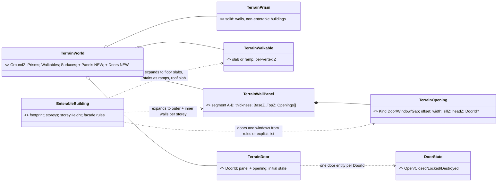
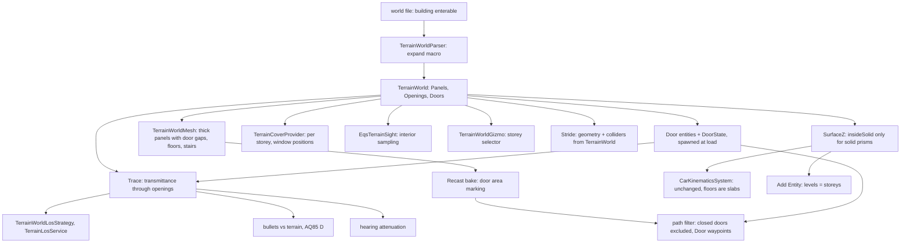

<!--STATUS
state: LIVE
updated: 2026-10-07
build-state: DESIGN (target state + change map; leans in §3 await the user)
current-answer: §3 decisions · §4 change map · §6 slices
stale-below: nothing
known-rot: none yet
known-conflict: DESIGN_Terrain_World.md §2 / §6 L459 — "building = solid prism (floors = label only in v1)". This doc is the
  v2 that note deferred ("enterable buildings need doors/stairs"); solid prisms stay valid for walls and non-enterable
  buildings.
related-designs:
  - DESIGN_Terrain_World.md — OWNS the one world file → one TerrainWorld model and every query on it (R-181/182/183).
    This doc proposes the enterable-building extension of that model; the terrain doc stays the owner.
  - blueprints/Architect_Question_81_SimHost_Test_Terrain_World.md — T1 (2.5D hand-authorable primitives, mesh rejected),
    T5 (Z picks the floor), T7 (multi-level), T8 (Stride renders the same file, "later").
  - DESIGN_Add_Entity_Picker.md §2c — level 0 = ground everywhere; filed CE-1031, which this doc resolves.
  - designs/navig-2/Navigation_Design_v2_0.md — owns TraversalKind.Door (§4) and multi-layer navmesh (§8); doors here
    feed it.
  - designs/group-maneuvers/Squad_Coordination_Design_v1_1.md §8.6 — stack-and-room-entry; built roles, no geometry.
  - blueprints/Architect_Question_85_Hit_Chance.md §D — bullets against terrain walls; shares this doc's trace query.
  - designs/eqs-2/EQS_Design_v1.3_final.md §19 — TerrainCoverProvider (outer prism edges only today).
  - DESIGN_Terrain_Zones_And_Assets.md §2.1c — buildings are static/bakeable terrain content.
-->

# Enterable buildings — walls, doors, windows, floors *(target state, CE-1031)*

> 🔒 **User, `2026-10-07`:** *"let's pls discuss the building with walls and doors and windows (visibility through) and
> floors, this is desired target state, what will we need to change?"* · earlier: *"buildings are not usually solid in
> real world"*.

## 1. Where we are — measured

### INVENTORY *(codebase-memory graph + grep, `2026-10-07`)*

| query | result |
|---|---|
| `trace_path` inbound on `TerrainWorld.SegmentBlocked` | 12 callers: `TerrainWorldLosStrategy`, `TerrainLosService` (→ `CheapLineOfSightTest`, `ThreatExposureTest`), `DangerAreaSensorSystem` + tests |
| `trace_path` inbound on `TerrainWorld.SurfaceZ` | `CarKinematicsSystem`, `DangerAlongRouteClassifier`, `EqsTerrainSight.TryPlace` (→ `PointPatternGenerators`), `TerrainCoverProvider` |
| grep `.Prisms` / `.Walkables` / `InsideSolid` (graph does not model field reads) | `TerrainWorldMesh` (navmesh), `TerrainCoverProvider`, `EqsTerrainSight.InsideSolid`, `TerrainWorldGizmo` (2D), `WorldInfoReport`, `TerrainResidency` (load) |
| `search_graph` for Hearing/Occlu/HitChance/Penetrat/Building/Stair/Transpar/Interior classes | **none** — no window, door, transparency or interior concept exists |

### Claim table

| claim | code — how it IS | design — how it was MEANT |
|---|---|---|
| a building is one solid volume | ✅ `TerrainPrism` (`TerrainWorld.cs:21-36`) blocks BaseZ..TopZ; `Floors` label only | ✅ `DESIGN_Terrain_World.md` §2 L76; §6 L459 *"prisms are solid in v1: enterable buildings need doors/stairs"* |
| floors and stairs already exist as primitives | ✅ `TerrainWalkable` slab/ramp with per-vertex Z; `SurfaceZ` stands on them; the garage deck + ramp in `test-town` | ✅ AQ81 T1 *"a garage = slabs + ramps"*, T7 multi-level |
| the navmesh already handles stacked floors | ✅ `TerrainWorldMesh` sends slab/ramp triangles to Recast; the heightfield keeps stacked spans; Infantry agent 0.3 m radius, 1.8 m height, 0.4 m climb (`RecastNavmeshBaker.cs:62`) | ✅ Terrain_World §6 L454 (DotRecast chosen for *"stacked floors natively"*) |
| inside a footprint there is no ground and no navmesh | ✅ `SurfaceZ` skips `GroundZ` when `insideSolid` (`:124-126`); `TerrainWorldMesh` drops ground cells inside prisms (`:76-84`), emits roof + outer walls (`:86-113`) | ✅ same §2 |
| sight is a yes/no test; nothing is partly see-through | ✅ `SegmentBlocked` returns bool (`:137-169`); `ILosStrategy.IsVisible` bool; forest affects cost only | ⛔ searched, no transparency design |
| **bullets ignore terrain entirely** | ✅ `RaycastSolverSystem` → `Intersection2D.RaycastCircle` against entity colliders only; `LineOfFire.BlockedByFriendly` is the only pre-fire check | ✅ AQ85 §D plans 3D bullets against terrain walls (not built) |
| hearing ignores terrain | ✅ `AcousticPerception.cs:131-136` distance only | ⛔ searched, none |
| cover and EQS sample outside only | ✅ `TerrainCoverProvider` every 2.5 m along outer prism edges, stance from the whole prism height; `EqsTerrainSight.InsideSolid` rejects every interior point | ✅ EQS §19 (as built) |
| doors exist only as a navigation word | ✅ `TraversalKind.Door` contract; `DotRecastNavmeshProvider` marks every waypoint `Walk`; no off-mesh links, no area flags, no TileCache in the bake | ✅ Navigation v2 §4 (*"derived from off-mesh-link userId"*) — never authored |
| nothing moves through walls only because paths go around them | ✅ `CarKinematicsSystem` has no static collision; RVO between entities only | ✅ W8 (movement model owns Z) |
| Stride's 3D world is separate | ✅ `StrideHrotGame.BakeNavmesh` bakes scene colliders; no `TerrainWorld` reference under `Stride/` | ⚠ AQ81 T8 *"later: Stride renders the same file"* |
| urban behaviours assume interiors they cannot use | ✅ squad room-entry roles built (BATCH-31) with no room geometry; every demo fights around blocks | ✅ Squad §8.6 stack-and-room-entry (planned) |

## 2. The target, in one picture

*What it shows:* an enterable building adds only ONE new primitive, the wall panel with openings. Floors, stairs and
the roof are the slabs and ramps that already work everywhere (`SurfaceZ`, navmesh, sight). A building is a
parse-time macro, not a runtime type.

## 3. Decisions *(leans — reply "approved" or name the one to change)*

| # | decision | ⭐ lean | rejected (one line each) |
|---|---|---|---|
| **B1** | how a building is modelled | ⭐ **a parse-time macro**: a world-file `building` with `"enterable": true` expands into wall panels per storey (outer walls with openings, optional inner walls), a floor slab per storey, stairs as ramps, a roof slab. A building without the flag stays a solid prism (`test-town` unchanged) | a runtime `Building` type every consumer must understand — eleven consumers would each learn a new shape · a triangle mesh — AQ81 T1 rejected it as not hand-authorable |
| **B2** | the new primitive | ⭐ **`TerrainWallPanel`**: a wall segment with thickness and BaseZ..TopZ, carrying **openings** (door, window, gap) as intervals along it with a sill and a head height | holes in prism polygons — the parser rejects holes today, and a hole is a plan-view thing, not a door at a height |
| **B3** | sight through openings | ⭐ the terrain trace returns **transmittance (0..1)**, not a bool: an opening passes 1.0; a window's *glass* value is a per-opening property (default 1.0 for sight); `ILosStrategy` thresholds it. Forest can later use the same value | keep a bool — windows would be fully open or fully opaque, and partial cover (foliage, smoke) would need a second API later |
| **B4** | one trace for sight, fire and sound | ⭐ **one `TerrainWorld.Trace(from, to, purpose)`** returning the crossed occluders; sight, bullets (AQ85 §D) and hearing (attenuation per wall) read it with their own rules | three geometry paths — the disease R-181 ("one model, cannot disagree") exists to prevent |
| **B5** | doors | ⭐ **doors are entities** (TKB type `Door`), spawned from the world file at load with a stable id, carrying a replicated **`DoorState`**; the navmesh marks each doorway polygon with a **door area**, and the path filter excludes closed/locked doors — no rebake. Static open doorways (no `DoorId`) are just gaps | doors as terrain-only data — their state would not replicate or persist · rebake on every door change — seconds per change |
| **B6** | moving through a door | ⭐ the path planner emits `TraversalKind.Door` on door polygons (Navigation v2 §4); the brain/animation opens it; until door actions exist, doors spawn **open** | off-mesh links per door — Recast already carves the doorway; a link adds a second representation |
| **B7** | authoring | ⭐ facade **rules with defaults** (storey 3 m, a window every 3 m at sill 0.9 m / head 2.1 m, one door per facade marked) plus an explicit openings list that overrides; still hand-editable GeoJSON | every opening by hand — a 4-storey block is ~60 openings · an external generator tool — a second producer of the file |
| **B8** | 2D map | ⭐ a **storey selector** on the map (and "follow the selected entity's storey"): walls and openings of that storey drawn, other storeys faint, roofs off when inside | draw all storeys at once — unreadable |
| **B9** | Stride 3D | ⭐ **in this programme**: Stride generates building geometry and colliders from the same `TerrainWorld` (AQ81 T8) — otherwise the 3D view shows solid blocks while the sim walks inside | keep Stride's hand-made scene — the two worlds disagree exactly where interiors matter |

## 4. Change map — what each consumer must do

*What it shows:* everything hangs off the one model; movement needs no change at all because floors are slabs; the
two genuinely new runtime pieces are the transmittance trace and the door entities.

| area | change | size |
|---|---|---|
| **format + parser** | `enterable` buildings, `storeys`, facade rules, explicit `openings`; `wall` features may carry openings too | M |
| **`TerrainWorld`** | `Panels` (with openings), `Doors`; `SurfaceZ`: `insideSolid` only for solid prisms; new `SurfacesAt` (shared with Add Entity) | M |
| **trace** | `Trace(from, to)` → crossed occluders + transmittance; `SegmentBlocked` becomes `Trace(...) < threshold` | M |
| **navmesh** | panels emitted as thick boxes split at openings (doorways carve through; windows above sill do not); floors and stairs as walkables; door polygons get a door area | M |
| **path planning** | query filter excludes closed/locked doors; waypoints on door polygons become `TraversalKind.Door`; check `FindNearestPoly` extents against storey height | S–M |
| **movement** | none for floors (slabs already work); stairs authored as ramps ≤ 60° for infantry; vehicles are kept out by doorway width (< 2 × 1.8 m radius) | — |
| **sight** | `TerrainWorldLosStrategy`/`TerrainLosService` threshold transmittance; eye heights unchanged (stance runtime is `CE-3010`) | S |
| **fire** | bullets trace terrain (AQ85 §D) — through openings, stopped by walls; penetration later | M |
| **hearing** | attenuation per crossed wall/floor | S |
| **cover / EQS** | `InsideSolid` → solid prisms only; cover points per storey along panels (inner side too); **window firing positions** (inside, facing out); stance from the opening's sill, not the building height | M |
| **doors** | TKB `Door` type; spawn from the world file at load (stable ids, not persisted as scenario entities); replicated `DoorState`; open/close action | M |
| **2D map** | storey selector; draw panels + openings of the selected storey | M |
| **Stride** | generate walls/floors/stairs geometry + colliders from `TerrainWorld`; its navmesh from the same mesh | L |
| **behaviours** | room entry (Squad §8.6) gets geometry: stack at a door, enter by sectors; "occupy building / window" EQS templates | M (after the above) |
| **Add Entity** | nothing new — storeys appear as levels through `SurfacesAt` | — |
| **test content** | one enterable building in `test-town` (2 storeys, stairs, doors, windows) + rails for each consumer | S |

## 5. Open questions

1. **B3 glass** — should a window stop bullets by default (glass value for fire 0.5, sight 1.0), or is every window an
   opening for both until penetration exists? ⭐ lean: opening for both in v1.
2. **B5 door persistence** — is a door's state part of the scenario (a scenario author locks a door) or runtime only?
   ⭐ lean: authored initial state in the scenario, runtime changes saved by checkpoints only.
3. **B9** — is generating Stride geometry from the world file in scope now, or after the sim side works?

## 6. Slices

| slice | content | depends |
|---|---|---|
| **B-0 model** | format + parser macro, `TerrainWallPanel`/openings, `SurfaceZ` fix, `SurfacesAt`; one enterable building in `test-town` | — |
| **B-1 walk inside** | navmesh with doorways, floors, stairs; path into an upper storey (static open doors) | B-0 |
| **B-2 see and shoot** | `Trace` with transmittance; sight through windows/doorways; bullets vs terrain (with AQ85 §D) | B-0 |
| **B-3 tactics** | cover per storey, window firing positions, interior EQS sampling | B-2 |
| **B-4 map** | storey selector, panels + openings on the 2D map | B-0 |
| **B-5 doors** | door entities, `DoorState`, navmesh door area + filter, `TraversalKind.Door` | B-1 |
| **B-6 sound** | hearing attenuation | B-2 |
| **B-7 Stride** | geometry + colliders + navmesh from `TerrainWorld` | B-1 |
| **B-8 room entry** | Squad §8.6 on real geometry | B-1, B-3, B-5 |
