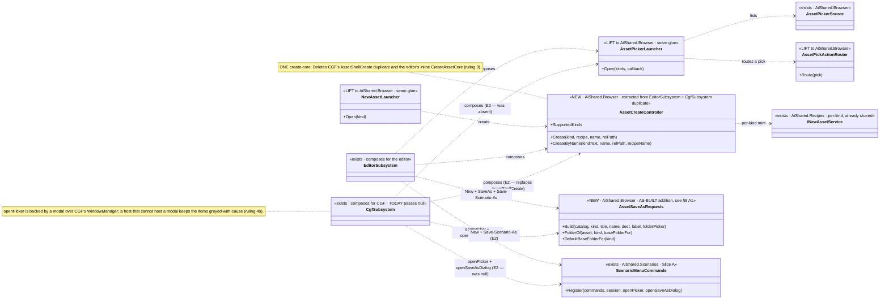
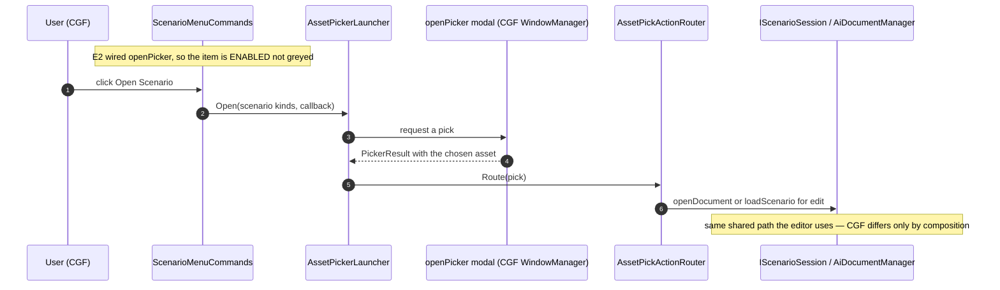

<!--STATUS
state: LIVE
build-state: BUILT — shipped as `CE-049` (`2026-08-26`, UI/CGF lane). Axis-C increment E2 (gap map §2c).
  Carries the INVENTORY (§2), a classDiagram (§4) and a sequenceDiagram (§5), both updated to the AS-BUILT.
updated: 2026-08-26
current-answer: §3 = what was built (5 items). §4/§5 = the UML, AS BUILT. §2 = the measured inventory that
  says E2 is the PICKER UI + wiring, NOT the service layer (CGF already has that).
  ⭐ §8 = the AS-BUILT delta; where §3 and §8 disagree, **§8 wins**.
stale-below: nothing. §2's "one measured RISK" paragraph is RESOLVED — see §8 R1.
design-basis: PROGRAMME_Cgf_Equals_Editor_Gap_Map.md §2c (Axis-C E2, the asset-picker/new-asset shell
  relocation, §6.1) · DESIGN_Cgf_Scenario_Session_Slice.md §9 (Slice A left Open/New greyed on CGF —
  "they light up the day E2 composes a picker") · DESIGN_Cgf_Editor_Sharing_Slice2_Open_Asset.md (the
  OPEN-by-MCP path, already built — the service layer) · Architect_Question_57 (the create/recipe registry,
  MA-019..023) · ruling 9 (one implementation) · ruling 49 / VC-3 (unavailable = absent/greyed-with-cause).
known-conflict: edits EditorSubsystem.cs + CgfSubsystem.cs + ScenarioMenuCommands.cs (AiShared) — the same
  hot files Slice A and the backend batch touched; rule-4 re-pull. ⛔ Disjoint from the MCP lane (DebugApi).
-->
# DESIGN — **CGF asset-picker / new-asset shell** *(Axis-C increment E2)*

> 🎯 Slice A registered `Open Scenario` / `New Scenario` on CGF but left them **greyed** ("no picker on this
> host"). E2 composes the picker on CGF so they light up — by **lifting the launcher glue to shared** and
> **factoring the duplicated create-core into one type** (ruling 9). ⛔ Not the service layer — CGF already has it.

## 1. ⭐ WHY THIS IS UI-ONLY *(measured `2026-08-26`)*
CGF already composes the whole **service/create** layer — per-kind `INewAssetService` registry
*(`CgfSubsystem.WireAssetCreation:1507`, exposed as `AssetShellNewAssetServices`)*, `AssetShellCreate`
*(:1530, a near-verbatim copy of the editor's create-core)*, `AssetCatalog`, `AiDocumentManager`, recipes
— all reachable over MCP *(MA-019..023)*. ⇒ **E2 is the interactive PICKER UI + menu/toolbar wiring**, the
one thing CGF lacks: it passes `openPicker: null` / `openSaveAsDialog: null` to `ScenarioMenuCommands.Register`
*(`CgfSubsystem.cs:1770-1782`)* and omits OpenAsset/NewAsset from the toolbar `HostServices` *(:1744)*.

## 2. ⭐⭐⭐ INVENTORY — the shell classes, measured
| class | home today | verdict for E2 |
|---|---|---|
| `AssetPickerLauncher` | `Hrot.Editor/Browser` | ⭐ **CLEAN LIFT** → `Hrot.Editor.AiShared/Browser` — pure delegate-seam glue *(`openPicker` is an injected `Action<PickerRequest,Action<PickerResult>>`; deps `IAssetCatalog`/`AssetPickerSource`/NodeEditor picker — all shared)*, no `IEditorLogic`/`EditorApplication` |
| `NewAssetLauncher` | `Hrot.Editor/Browser` | ⭐ **CLEAN LIFT** — deps `RecipePickerSource`, `IReadOnlyDictionary<AssetKind,INewAssetService>`, picker types — all shared |
| `AssetPickActionRouter` | `Hrot.Editor/Browser` | ⭐ **CLEAN LIFT** — `(Action<IEditableAsset> openDocument, Action<string> loadScenario)`, its own doc says it avoids concrete host types |
| `ShowNewAssetDialog` + `CreateAssetCore` | **inline in `EditorSubsystem.cs:3797/3831`** | 🔴 **EXTRACT + DEDUP** — a local fn closed over ~8 host fields; **CGF has an equivalent inline copy** *(`AssetShellCreate`, `CgfSubsystem.cs:1530`)*. ⇒ ⭐⭐ **factor the TWO copies into ONE shared `AssetCreateController`** (ruling 9) taking the deps as ctor delegates |
| `AssetPickerSource` · `RecipePickerSource` · `INewAssetService` · `NewAssetDialog` · `SaveAsDialog` | already `Hrot.Editor.AiShared` | ✅ already shared — E2 reuses |

⚠ **The one measured RISK — the modal itself.** `AssetPickerLauncher.openPicker` is backed in the editor by
`_shellPickers.OpenPicker` *(the actual modal browser over `WindowManager`)*. **Confirm CGF can compose an
equivalent `openPicker` / save-as modal** *(is the shell-picker infra shareable, or does CGF compose its own over
its `WindowManager`?)*. ⛔ If a host genuinely cannot host a modal *(a headless node)*, the items stay
greyed-with-cause per ruling 49 — that is the correct end state, not a bug.

> ✅ **RESOLVED at build time — see §8 R1. CGF composes its own, and the proof is structural.**

## 3. ⭐ WHAT TO BUILD *(5 items)*
| # | task | the one thing not to get wrong |
|---|---|---|
| ⭐ **①** | **Lift** `AssetPickerLauncher` · `NewAssetLauncher` · `AssetPickActionRouter` → `Hrot.Editor.AiShared/Browser` | ⚠ HN-037 lesson: measure the field captures — a lift, ⛔ not `s/old/new/`. Editor references the moved types byte-identically |
| ⭐⭐⭐ **②** | **Extract `AssetCreateController`** from `EditorSubsystem.ShowNewAssetDialog`/`CreateAssetCore` **and delete CGF's `AssetShellCreate` duplicate**, both composing the one shared type | ⛔⛔ **ruling 9** — the whole point is ONE create-core, not a third copy. The editor + CGF both construct it with their own dep set |
| ⭐⭐ **③** | **CGF composes** the launchers + create-controller over its own catalog/registry/`WindowManager`, and passes real `openPicker`/`openSaveAsDialog` to `ScenarioMenuCommands.Register` *(replacing the two `null`s)* | ⭐ Slice A's greyed items light up with **zero menu code** — the wiring is the deliverable |
| ⭐ **④** | **Toolbar** — add OpenAsset/NewAsset to CGF's `HostServices` via the shared list *(the same `CgfEditorShellToolbar` path)* | ⚠ if this collides with the toolbar-customization AQ, keep it to enabling what the editor already exposes; ⛔ no new toolbar model |
| ⭐ **⑤** | **Conformance** — extend the existing `SubsetShape`/menu verdict: on CGF the Open/New items are now **enabled** *(not greyed)*, and a host that composes no modal keeps them greyed-with-cause | reuse the equality-rail pattern from Slice A; ⛔ no new verdict type |

## 4. ⭐⭐⭐ CLASS DIAGRAM

## 5. ⭐⭐⭐ SEQUENCE DIAGRAM *(CGF, Open Scenario — now enabled)*

## 6. ⭐ DONE — rails
- editor byte-identical after the lift+extract *(the delegation gate)*; CGF's Open/New items **enabled** and functional; the `AssetShellCreate` duplicate is **gone** *(one create-core)*; a no-modal host keeps them greyed-with-cause; conformance verdict holds. Affected-project builds; conformance suite named + backgrounded (T3); reds proven pre-existing by `git diff`.

## 8. ⭐⭐⭐ AS BUILT — **the deltas, argued** *(`CE-049`, `2026-08-26`; obligation ⑤)*

> ⭐⭐ **Where this section and §3 disagree, THIS WINS.** §4/§5 above were updated to the as-built.

| # | design said | ⭐ as built | why |
|---|---|---|---|
| **R1** | §2: *"⚠ the one measured RISK — confirm CGF can compose an equivalent modal"* | ✅ **RESOLVED: it can, and the proof is STRUCTURAL not hopeful.** `WirePickerShell` builds CGF's own `PickerRegistry` + `SaveAsBrowserDialog` over its existing `AiEditorAdapterBundle` | 📐 `BuildAiShell` is reached **only** from `RegisterWindows`, which `return`s early when `_headless`. ⇒ if the shell is built at all, this node has a `WindowManager` and an ImGui context. ⚠ **Consequence worth stating:** on a genuinely headless CGF the shell is never built, so `ScenarioMenuCommands` is never registered either — the *"greyed-with-cause"* end state is a **unit-rail property**, ⛔ not something a headless run exhibits |
| **A1** | *(not in the item list)* | ⭐⭐ **NEW `AssetSaveAsRequests`** — the `SaveAsRequest` builder + `FolderOf` + the base-folder resolver, shared | ⛔ Item ③ requires CGF to pass a **real** `openSaveAsDialog`. 📐 The editor's dialog is a ~35-line local function closed over the catalog and resolver ⇒ re-typing it for CGF would create the **third** copy of a save-path helper **inside the batch whose item ② collapses the second**. ⭐ The editor's local `FolderOf`/`BuildSaveAsRequest` are now one-line wrappers over it, so its three existing call sites are untouched |
| **A2** | *(not stated)* | ⭐⭐ **`WireAssetCreation` + `WirePickerShell` now run BEFORE `WireSaveAndReload`** | ⛔ **The order is load-bearing:** `WireSaveAndReload` registers `ScenarioMenuCommands`, whose seams ARE the launchers the other two build. Registering the menu first hands it `null`s and leaves every item greyed — the exact state E2 removes. 📐 Verified independent before reordering: neither method read the other's output |
| **A3** | *(not stated)* | ⭐⭐ **CGF's `DrawUI` gained `_shellPickers.DrawFrame()` + `_saveAsBrowser.DrawFrame(icons)`** | 🔴 `PickerRegistry.OpenPicker` only **queues**; `DrawFrame` renders. ⛔ Without these two lines the items are enabled, clickable and **silently do nothing** — precisely the failure ruling 49 / `VC-3` exist to prevent. ⚠ And CGF's registry is **separate** from the canvas bundle's, or every shell picker draws twice *(the editor's own `BATCH-29` note)* |
| **A4** | §3 ② *"delete CGF's `AssetShellCreate` duplicate"* | ⭐ done — **and the survivor is a MERGE, not either original** | 📐 The two copies had **already drifted in three places**: the editor branched early for non-document kinds and CGF did not; the editor wrapped the Blueprint mint-write in `try/catch` and CGF did not; and their *"not in the catalog"* messages differed — **CGF's named the actual remedy** *(`pass --asset-root on a deployed node`)* and the editor's did not. ⇒ ⭐ the controller keeps the editor's branch **and** CGF's better text, so neither host regressed |
| **A5** | §3 ⑤ *"extend the `SubsetShape`/menu verdict"* | ⭐⭐ **no `SubsetShape` change; the Slice A EQUALITY rail INVERTED instead** | 📐 Same finding as Slice A's `F-B`: the `global-menu` shape is keyed by `path` and generalises for free. ⇒ what needed changing was the **enablement** claim: the CGF shape now has a picker, so `AfterE2TheTwoHostsAgreeOnEnablementToo` replaces the old greyed assertion, and greyed-with-cause moved to a new **`NoModalShape`** — ⭐ the honest owner, since it is a property of *"no modal composed"*, ⛔ never of *"being CGF"* |
| **A6** | *(not stated)* | ⭐ **`AssetCreateController` exposes TWO surfaces** — `Create` *(typed, the dialog)* and `CreateByName` *(string, `POST /assets`)* | ⛔ CGF's copy fused the kind-parse + recipe-resolve into the create body while the editor kept them in a separate `AttachAssetAuthoring` lambda. ⇒ two layers, one body — and the MCP surface's `MA-021` recipe-by-name resolve is now shared rather than written twice |

### ⚠ One rail defect I introduced and fixed — recorded because it is the repo's own flake disease

📐 `TheJsonContributorRefreshesBeforeTheCatalogIsAsked` asserted an **exact step list**. It reddened alone
*(cut 1: I expected an unconditional `refresh:assembly`, but the controller guards it with
`if (aiAsm != null)` and the test host had not loaded `Hrot.AI.Behaviors`)*, then went **green alone and RED
in the full suite** *(cut 2: a test running earlier HAD loaded that assembly, so the guarded step fired)*.
⇒ ⭐⭐⭐ **an exact-list assertion there is order-dependent on the whole suite — a rail that lies.** Fixed by
filtering the conditional step and pinning only the invariant order; whether the assembly refresh fires is
asserted separately and conditionally. ⚠ Named here because it is the same shape as `DEBT-AIB-030`, and
writing one accidentally is evidence of how easy that is.

## 7. ⛔ NOT IN E2
Open-Asset/New-Asset for **AI assets** beyond scenarios ride the same shell once composed — verify they light up too, but ⛔ no new asset-kind vocabulary. Tools/selection/camera = **E3**; view/inspector = **E4**. Checkpoint restore = Feature X.
