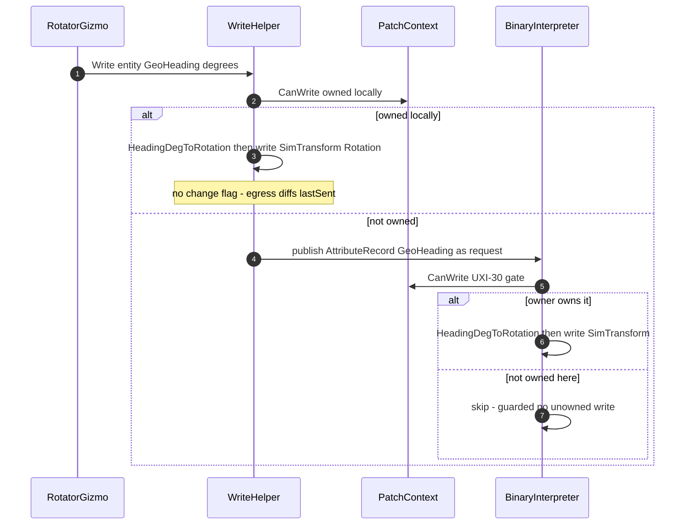
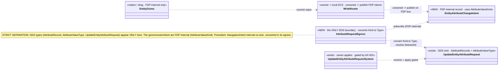
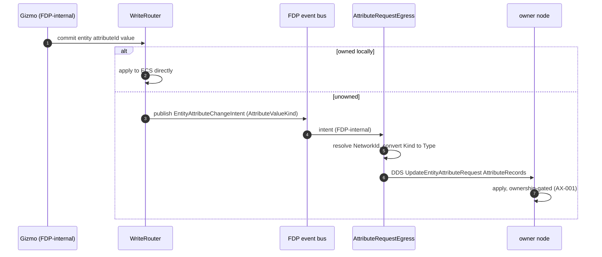
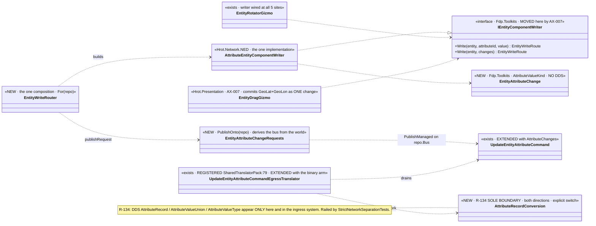
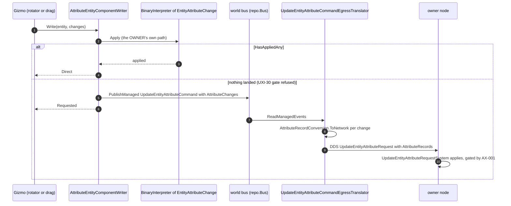
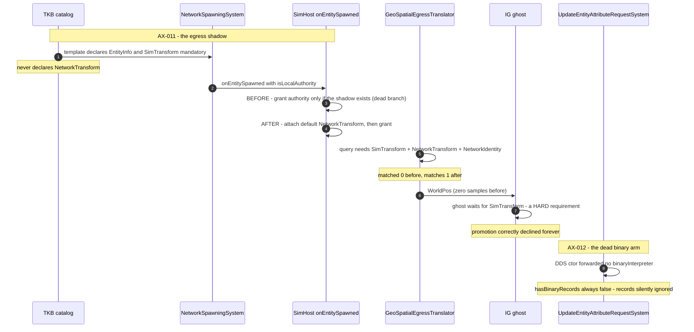
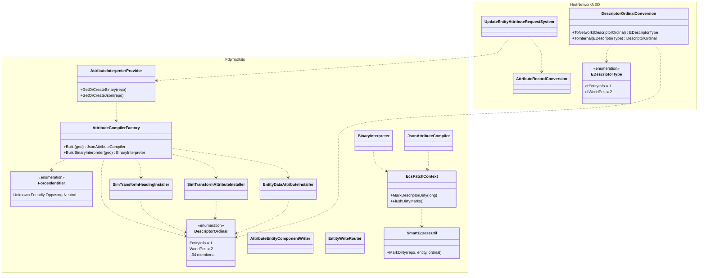
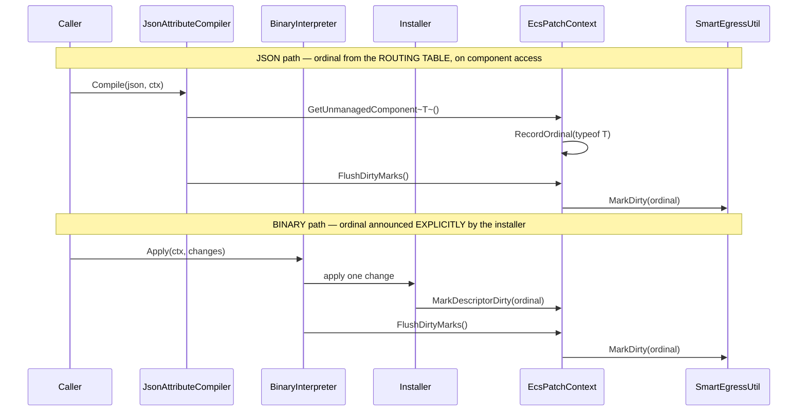
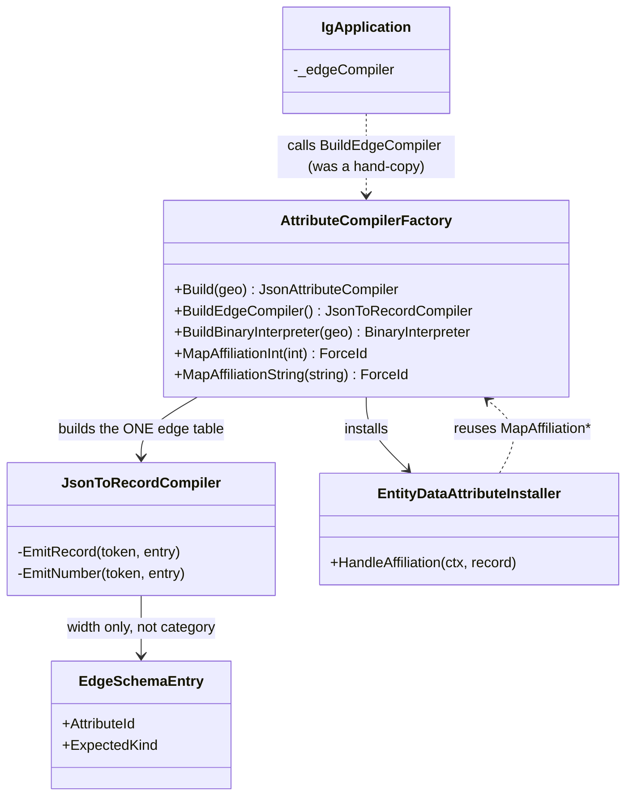

<!--STATUS
state: LIVE
build-state: BUILT — the first cut (AX-001..AX-006), the AX-005 successor (AX-005a/b/c, AX-007, AX-008,
  CE-018, CE-035, CE-036) on 2026-08-25, and AX-011/AX-012 on 2026-08-26 which turned the full
  --mode all round trip GREEN, AX-015/AX-016 (§15) and AX-017 (§16) on 2026-08-26.
  ⭐⭐⭐ §17 IS THE NEWEST AS-BUILT (AX-018): the attribute vocabulary was declared in FOUR tables that
  disagreed — a heading could be APPLIED but never EMITTED, an integer affiliation THREW at the edge, and
  IgApplication hand-copied the edge table (ruling 9). ⛔ §16.5's "the asymmetry is only stylistic" is
  SUPERSEDED by §17.1/§17.2 — it named a shape and never measured the behaviour.
  ⭐⭐ §16 carries the LIVE classDiagram + sequenceDiagram for the apply path:
  it moved out of the DDS assembly into Fdp.Toolkit.Replication.Attributes and made the JSON and binary
  update paths consistent (§17 completes that consistency). ⛔ §14.3 (AX-013, "open question") is ANSWERED by §16 and its
  "a descriptor ordinal IS wire numbering" claim is RETRACTED — do not quote §14.3 as open.
  ⭐⭐ §12.2/§12.3 remain the LIVE diagrams for the EGRESS/request path (§16's are the APPLY path). ⛔ §11.3-§11.5 are SUPERSEDED — the plan asked for a NEW
  intent + a NEW translator; both already existed and were EXTENDED (ruling 9). Read §9 and §12.
  Axis-B FIRST CUT (§4/§5, still LIVE for AX-001..006): a subsystem-
  agnostic entity-write path proven with ROTATION. Delivers UXI-30 (the binary authority gate) + a rotation
  attribute id + a subsystem-agnostic write helper the rotator gizmo drives. ⛔ NOT all of Axis B — one slice
  that establishes the owned→direct / unowned→request routing so later attribute gizmos reuse it.
updated: 2026-08-26
stale-below: ⛔⛔ §1's row "BinaryInterpreter.Apply — NO AUTHORITY GATE" and §6 item ①'s framing are
  SUPERSEDED by §9.1: measured, BOTH production installers already gated every handler, so the binary
  path WAS authority-gated. The real defect — and what was built — is that the gate was per-installer
  and therefore forgettable. §7's "rotation round-trips on a real --mode all cluster" is NOT delivered:
  §9.4 measures why (there is no production SENDER of binary attribute records, which §6 ① itself notes).
  ✅✅ §9.4's open item is FULLY DISCHARGED as of 2026-08-26 — see §13. The full --mode all round trip is
  GREEN. ⛔⛔ §12.5 F2 and §12.6's red row are SUPERSEDED: that replication failure was diagnosed
  (AX-011 missing NetworkTransform shadow) and fixed, together with AX-012 (the binary arm was dead in
  production). Read §13 for the as-built.
  ⛔⛔ §11.3/§11.4/§11.5 are SUPERSEDED by §12 — do NOT quote them as the intended shape.
design-basis: UX_Feature_Authority_Aware_Writes.md §3.3b-c (UXI-30/UXI-29 ruling — change-requests apply ONLY
  to owned components; JSON path already gates via CanWrite, binary path does not) · HROT-PROGRAMMERS-GUIDE
  Part 0 rule 8 (the two writer classes; the replication inverse must be preserved) · user ruling 2026-08-25
  (the gizmo is subsystem-agnostic; owned→direct write, unowned→request intent; SimTransform needs no change
  flag — its egress translator diffs lastSent every tick).
known-conflict: ✅ parallel-safe with the MCP create-recipes session (disjoint files; the ONE shared file is
  CgfSubsystem.cs — this session keeps to gizmo registration, MCP keeps to the asset-service dict). ⛔ Do NOT
  add an MCP route (the MCP session owns the generated catalog) — test via integration rails + existing entity ops.
-->
# DESIGN — **Axis-B first cut: the subsystem-agnostic write path, proven with ROTATION** *(UXI-30 + rotation)*

> 🎯 Axis B lets a node manipulate map entities like the editor. The editor never hits authority *(one-node
> cluster, owns everything)*; a distributed node does. This slice builds the **one write path** every attribute
> gizmo will reuse — **owned → write ECS directly; unowned → publish a change-request** — and proves it with the
> motivating case, **Rotate**, which needs a new attribute id and the binary authority gate *(UXI-30)*.

## 1. ⭐⭐ INVENTORY — measured `2026-08-25`
| ✅ exists | where | role |
|---|---|---|
| `EntityRotatorGizmo` *(reads `SimTransform`, `onCommit(yawRad)`)* | 🔴 **`Hrot.SimHost/Gizmos`** *(SimHost-bound)* | ⭐ the gizmo to make **subsystem-agnostic** — its commit must go through the shared write path, not a SimHost-only ECS poke |
| `IEntityPatchContext.CanWrite()` — native component authority | `Fdp.Toolkits/Replication/Patching` | ⭐⭐ **the gate the JSON path uses** *(`JsonAttributeCompiler:40,58`)* — the check to MIRROR |
| 🔴 `BinaryInterpreter.Apply` — **no authority gate** | `Fdp.Toolkits/Replication/Patching/BinaryInterpreter.cs:102-128` | ⛔ **UXI-30**: dispatches every record to its handler with no `CanWrite` |
| `SimTransformAttributeInstaller` *(position)*; `AttributeCompilerFactory.BuildBinaryInterpreter` | `Hrot.Network.NED/Attributes` | ⭐ the installer to MIRROR for heading |
| ⭐⭐⭐ **`SimTransformBridgeSystem.HeadingDegToRotation(headingDeg)`** + `RotationToHeadingDeg` — *"Compass heading in degrees (0=North, 90=East, clockwise)"* | `Fdp.Toolkits/Geographic/Systems` | ⭐⭐ **the convention + conversion ALREADY EXIST** *(user was right)* — the installer REUSES this; ⛔ no new math |
| ⭐ **`EulerOri.Heading`** *(wire)* · `GeoSpatialEgressTranslator` already does **yaw → compass heading** *(`HeadingConversion_YawToCompass`)*; the DebugApi already takes `headingDeg` *(`GeoToLocal_WithHeadingDeg_IncludesRotation`)* | `Hrot.Network.NED/Common` · `Hrot.SimHost` | ⭐ heading is a first-class wire concept already |
| 🔴 `AttributeIds` — `Name/Affiliation/GeoLat=10/GeoLon=11/GeoAlt=12`, **NO `GeoHeading`** | `Fdp.Toolkits/Replication/Patching/AttributeIds.cs` | ⛔ **the ONLY gap: add `GeoHeading` to the Geo* family** — the convention/conversion/wire all exist |
| `UpdateEntityAttributeRequestSystem` *(binary branch)* — the receiving applier | `Hrot.*` | ⭐ where the gated request lands |
| `SimTransform` egress translator — **diffs `lastSent` every tick** | replication egress | ⚠ ⇒ a direct ECS write of rotation needs **NO change flag** *(user)* |
| ⛔ replication ingress *(`GeoSpatialIngressTranslator:85-89`)* writes unowned **by design** | replication | 🔒 **the inverse — do NOT gate it** *(Part 0 rule 8; the trap)* |

## 2. ⭐⭐⭐ THE ROUTING MODEL *(user ruling `2026-08-25`)*
The gizmo is **subsystem-agnostic**: it knows an entity + a target value, ⛔ not who owns it. A shared **write
helper** decides:
| case | action |
|---|---|
| ⭐ target component **owned locally** | **write ECS directly** *(+ set the component's change flag IF its egress translator needs one; ⭐ `SimTransform` does NOT — it diffs `lastSent`)* |
| ⭐ target component **NOT owned** | **publish a change-request** *(an `AttributeRecord` with the new `GeoHeading` id, in degrees → `UpdateEntityAttributeRequest`)* — the OWNER receives it |
| 🔒 the receiver | **UXI-30**: `BinaryInterpreter.Apply` now gates on `CanWrite` ⇒ applies the request **only to the component it owns**; a request for an unowned component is **skipped** |
| ⛔ replication ingress | **untouched** — still writes unowned ghosts by design *(the inverse gate; Part 0 rule 8)* |

## 3. ⭐ SCOPE
| ✅ IN | ⛔ NOT |
|---|---|
| **UXI-30**: the `CanWrite` gate on `BinaryInterpreter.Apply` *(mirror the JSON path)* | ⛔ touching replication ingress translators *(the inverse — breaking ghost updates is the trap)* |
| **`GeoHeading` attribute id** *(degrees, 0=N/90=E)* in `AttributeIds` + a `SimTransformHeading` installer that **reuses `HeadingDegToRotation`** | ⛔ a full attribute vocabulary — just heading, the motivating case; ⛔ no new conversion math *(it exists)* |
| **the subsystem-agnostic write helper** *(owned→direct / unowned→request)* the rotator gizmo drives | ⛔ vertex/route gizmos *(they keep the descriptor channel — ruling)* |
| **make `EntityRotatorGizmo` subsystem-agnostic** *(commit through the helper)* + reusable from CGF | ⛔ selection/symbology/tools *(later Axis-B slices)* |

## 4. ⭐⭐⭐ CLASS DIAGRAM


## 5. ⭐⭐⭐ SEQUENCE DIAGRAM


## 6. ⭐⭐ ITEMS
| # | task | the one thing not to get wrong |
|---|---|---|
| ⭐ **①** | **UXI-30** — add the `CanWrite` gate to `BinaryInterpreter.Apply` | ⛔ gate **change-request** appliers only; ⛔ **do NOT** touch replication ingress *(the inverse; Part 0 rule 8)*. ⭐ zero production senders ⇒ no compat surface |
| ⭐ **②** | **`AttributeIds.GeoHeading`** *(degrees, 0=N/90=E)* + a `SimTransformHeading` installer that **reuses `HeadingDegToRotation`** *(+ `RotationToHeadingDeg` for read-back)* | ⛔ **no new conversion math — it exists**; a `Float32`/`Float64` heading-degrees scalar in the Geo* family |
| ⭐ **③** | **`IEntityComponentWriter`** — the owned→direct / unowned→request router | ⭐ SimTransform direct write sets **no change flag** *(egress diffs lastSent)*; ⚠ other components may need one — the helper asks the component, it does not assume |
| ⭐ **④** | **`EntityRotatorGizmo` subsystem-agnostic** — commit through the helper; usable from CGF | ⛔ no SimHost-only ECS poke in the commit path |

## 7. GATES
rule 8 + build/test rules *(affected project: `Fdp.Toolkits`, `Hrot.SimHost`, `Hrot.Network.NED`, the integration suite)*. **Row 8 rails:** ⭐ **the UXI-30 gate** — a binary change-request for an UNOWNED component is skipped *(red by removing the gate)*; ⭐ **the replication inverse still works** — a ghost still receives owner state *(anti-regression, 29.23)*; ⭐ **rotation round-trips** — owned node rotates directly; a non-owning node's rotate becomes a request the owner applies *(on a real `--mode all` cluster — the barrier harness shape)*; ⛔ **do NOT add an MCP route** *(the MCP session owns the catalog)* — drive via existing entity ops / integration rails.

## 8. ⭐ WHEN DONE
Fold the as-built here; if the routing deviates, mark the prior state superseded *(obligation ⑤)*. State the ids *(a new prefix, e.g. `AX-`, in a new tracker area — clear of `MA-`/`CE-`)*. Flip the gap-map UXI-30 row + the Axis-B note. The report points here and carries the DECISION LOG.

---

## 9. ⭐⭐⭐ AS-BUILT — `2026-08-25` *(`AX-001`…`AX-006`; supersedes §1's gate row and §6 ①'s framing)*

> ⭐⭐ Written by the implementing session per obligation ⑤. Three of the four items landed as drawn; item
> ① landed for a **different reason than the design gave**, and §7's cluster round-trip is **not
> delivered** — both measured below rather than asserted.

### 9.1 ⛔⛔ Item ① — `UXI-30`'s premise was wrong, and the fix is better for it

| | |
|---|---|
| ⛔ §1 said | *"`BinaryInterpreter.Apply` — **no authority gate** … dispatches every record to its handler with no `CanWrite`"* |
| 📐 **measured** | **Both** production installers — `SimTransformAttributeInstaller` *(4 checks)* and `EntityDataAttributeInstaller` *(2)* — **already opened every handler** with `if (!ctx.PatchContext.CanWrite<T>()) return;` ⇒ ⭐ **the binary path WAS authority-gated**, per handler |
| ⭐⭐ **and that is the JSON path's own shape** | §1's own inventory points at `JsonAttributeCompiler`, whose gate lives in the typed `ValueInvoker<T>` — ⛔ **not** in the router either. ⇒ *"the router has no gate"* was never the defect; it is the architecture |
| ⭐⭐⭐ **the REAL defect** | the gate was **PER-INSTALLER and therefore FORGETTABLE.** ⚠ And this slice adds a **third** installer — exactly when that bites: one omitted line and an unowned component is written **silently** |

⇒ ⭐ **Built:** `BinaryInterpreterBuilder.RegisterHandler<TComponent>(id, handler)` applies the gate at
**registration**, so a handler body needs — and now contains — no guard. Both existing installers are
migrated onto it and their hand-written checks **deleted**, so there is ONE implementation of the check.
⭐ The rail asserts the gate on a handler that is a bare counter: ⛔ it proves the **registration** gates,
not that an author remembered to.

⚠ **The untyped overload deliberately still does NOT gate** — it is the right tool for a handler that
touches no ECS component *(a pure scratchpad accumulator)*. ⭐ Characterised by its own rail so the
boundary is documented rather than a hole.

✅ **§6 ①'s *"zero production senders ⇒ safe to switch on"* — VERIFIED independently:** only the
receiver (`UpdateEntityAttributeRequestSystem`) reads `AttributeRecords`; nothing populates them.

### 9.2 ⭐ Item ② — as drawn, and it really is only a constant plus a route

`AttributeIds.GeoHeading = 13` *(degrees, 0=N/90=E, in the `Geo*` family)* + `SimTransformHeadingInstaller`,
which **calls `SimTransformBridgeSystem.HeadingDegToRotation`** and writes no math of its own. ⭐ The user's
correction was right in full: the convention, the conversion, the wire field and the DebugApi's
`headingDeg` all already existed.

| ⚠ two notes worth keeping | |
|---|---|
| **numbering** | the class doc reserves 100–199 for geo, but the shipped `Geo*` ids are **10/11/12**. `GeoHeading` takes **13** to keep the family contiguous; ⛔ renumbering the existing three to match the prose is a WIRE change and was not attempted |
| **added unconditionally** | ⛔ unlike the position installer, heading needs **no `IGeographicTransform`** — a compass angle is already in the units the bridge takes. ⇒ heading works on a host with no geo transform, and gating it behind one would refuse rotation for no reason |

### 9.3 ⭐⭐⭐ Item ③ — the router, and the mechanism is better than the diagram

⭐ §4 draws `IEntityComponentWriter ..> IEntityPatchContext : CanWrite? (owned)`. ⛔ **The built router
never asks that question**, and deliberately: asking *"do I own `SimTransform`?"* would put the
attribute→component mapping in a **second** place, beside the installers that already hold it.

⇒ ⭐⭐ **It attempts the local apply through the very interpreter the OWNER uses, then asks
`EcsPatchContext.HasAppliedAny` whether anything landed:**

| outcome | meaning |
|---|---|
| something landed | owned ⇒ `Direct` — ⭐ and the conversion that ran was the installer's |
| nothing landed | `UXI-30`'s gate refused ⇒ publish the record as a change-request ⇒ `Requested` |
| no request sink | ⇒ `Refused` — ⛔ *"written"* and *"nobody to ask"* must not collapse into one answer |

⇒ ⭐⭐⭐ **ONE conversion implementation serves both the local and the remote path, and a second attribute
needs no change in the router at all.**

⭐ The change-flag question stays where the design put it: the **installer's handler** marks the
descriptor dirty or does not, so the component decides — the router never assumes.

### 9.4 ⛔⛔ Item ④ built; §7's CLUSTER ROUND-TRIP is NOT delivered

⭐ `EntityRotatorGizmo` commits through the writer in **compass degrees** — reusing
`SimMath.YawRadToCompassDeg`, which this file already used to draw its own label. ⭐ Railed that the two
conversions are **exact inverses** *(algebraically `HeadingDegToRotation(YawRadToCompassDeg(y)) =
FromYaw(y)`)*, because a sign error there rotates entities the wrong way **silently**.

⚠ **The writer is OPT-IN and the existing SimHost call site keeps its direct write** — see §9.5 for the
measured reason that is not merely caution.

🔴 **§7's *"rotation round-trips on a real `--mode all` cluster"* cannot be built yet.** 📐 There is **no
production SENDER** of binary attribute records — §6 ① says so itself, and it is verified. ⇒ the unowned
branch is railed behaviourally at unit level *(the request is published with the right id and value)*, and
the DDS egress for `UpdateEntityAttributeRequest.AttributeRecords` is a **distinct piece of work** beyond
these four items. ⛔ Not attempted; filed.

### 9.5 🔴🔴 THE PREMISE THE DESIGN DID NOT STATE — **"owned" is a bit almost nobody sets**

📐 Measured `2026-08-25`: `EntityRepository.HasAuthority` reads `EntityHeader.AuthorityMask`, and
`SetAuthority` has production callers in **exactly two places** — `Hrot.SimHost`'s bootstrapper *(for
entities it spawns)* and the **NED replication path** *(`DeferredTakeoverSystem`,
`OwnershipUpdateTranslator`)*. ⛔ **`Hrot.Editor` never calls it.**

⇒ ⚠⚠ **On a host that creates entities without granting authority, every attribute write looks UNOWNED**
and becomes a change-request — or, with no sink, a refusal. ⭐ That is the authority model working as
built, ⛔ but §2's routing model reads as though ownership were self-evident, and it is not.

⭐ **Consequences, recorded rather than silently absorbed:**
- the gizmo's writer is **opt-in**, and the SimHost call site is unchanged — ⛔ switching it wholesale
  would change behaviour on hosts whose entities carry no authority bits;
- **a later slice that wires the writer everywhere must first grant authority on the creating host**;
- railed as a characterization *(`TheWriterTreatsAnUngrantedComponentAsUnowned`)* so the next reader meets
  the fact rather than deriving it.

### 9.6 ⭐ The inverse — untouched, and now guarded for the future

📐 `GeoSpatialIngressTranslator` writes through a **command buffer** and only when
`!repo.HasAuthority<SimTransform>(entity)` — i.e. it writes exactly the unowned case, and it never touches
`BinaryInterpreter`. ⇒ ⭐ **this slice could not have gated it even by mistake.** ⭐⭐ A structural rail now
fails the day a replication ingress translator is routed through the change-request builder — the
plausible *"let us unify the two write paths"* refactor — and the shipped
`GeoSpatialIngressTranslatorTests` *(4/4)* remain the behavioural half.

## 11. ⭐⭐⭐ AX-005 SUCCESSOR — the cross-node egress, under **STRICT NETWORK SEPARATION** *(user ruling `2026-08-25`)*

> ⭐⭐⭐ **USER RULING, verbatim intent:** *"the gizmo should NEVER EVER use any DDS structure directly.
> Network must be strictly separated from internal FDP event processing — even at the cost of keeping the
> same enum duplicated in two namespaces (still numerically identical). The intent FDP-bus record uses its
> OWN enum; the egress translator converts to the network enum."*

### 11.1 ⛔⛔ THE RULING — a load-bearing engine invariant
⭐⭐ **No DDS/network type crosses into the FDP-internal event path.** The gizmo → write-router → FDP-bus
intent side speaks **FDP-internal types only**; the **egress translator is the SOLE boundary crosser**,
converting the internal record to the DDS wire message *(and the internal enum to the network enum)*.
⭐ **The precedent is established and named:** `Fdp.Toolkits.Navigation.NavigationIntent` *(internal ECS)*
vs `Hrot.Network.NED…NavigationIntent` *(wire)*, converted only inside `NavigationIntentEgressTranslator`.
⭐⭐⭐ **The two enums ALREADY EXIST for attributes:** **`AttributeValueKind`** *(FDP-internal —
`Fdp.Toolkits/Replication/Patching/AttributeValueKind.cs`)* and **`AttributeValueType`** *(network —
`Hrot.Network.NED/GenericMessages.cs`)* — numerically identical by design. ⛔ **Duplication here is the
CORRECT pattern, not debt.**

### 11.2 🔴 AS-BUILT FINDING — the merged writer took the shortcut this ruling forbids
📐 `AttributeEntityComponentWriter.Write` *(AX-003, merged)* builds a **`AttributeRecord` + `AttributeValueUnion`
+ `AttributeValueType.KindFloat64`** — **network/DDS types** — inside the FDP-internal write path, and applies
them through `BinaryInterpreter<AttributeRecord>`. ⇒ ⛔ **the FDP-internal side is currently coupled to the DDS
record shape.** ⭐ **AX-005 corrects this:** the router/gizmo operate on an **FDP-internal** change record
*(own `AttributeValueKind`)*; ⇒ ⚠ **verify + move** the network types out of the internal path — either the
local-apply mechanism switches to an internal representation, or the internal record converts to the DDS record
**only at the egress boundary**. 📌 Record which, and why, in the report.

### 11.3 ⛔ THE CORRECTED INTENT PATH — **SUPERSEDED by §12, `2026-08-25`** *(kept: the RULING it states is unchanged)*

> ⚠⚠ **The path below was the PLAN. §12 is the AS-BUILT, and it differs in one load-bearing way:**
> ⛔ the new `EntityAttributeChangeIntent` + new egress translator this table asks for were **NOT built** —
> ⭐ measured, both already existed *(`UpdateEntityAttributeCommand` + `UpdateEntityAttributeCommandEgressTranslator`,
> **registered in production**)*, so they were **EXTENDED**, per ruling 9. ⛔ **Do not quote §11.3–§11.5 as
> current.** ⭐ `R-134` itself *(§11.1)* is untouched and still binds.

| step | speaks | where |
|---|---|---|
| ⭐ gizmo commits *(heading deg / position)* → router | ⭐ **FDP-internal only** — an `EntityAttributeChangeIntent { networkId/entity, attributeId, value, `**`AttributeValueKind`**` }` | `Hrot.SimHost`/FDP toolkit |
| ⭐ owned → apply to ECS locally | FDP-internal | the installer/interpreter, internal side |
| ⭐ unowned → publish the **FDP-bus intent** *(NOT a DDS struct)* | ⭐⭐ **FDP-internal enum** | the write router's `_publishRequest` |
| ⭐⭐⭐ **the egress translator** subscribes to the intent, resolves entity→`NetworkId` *(`NetworkEntityMap`)*, and writes DDS `UpdateEntityAttributeRequest{AttributeRecords}` — **converting `AttributeValueKind` → `AttributeValueType`** | ⛔ **the ONLY place DDS appears** | `Hrot.Network.NED/…/Egress` — mirrors `UpdateEntityAttributeCommandEgressTranslator` |
| ⭐ owner receives → applies, ownership-gated | network in, ECS out | `DdsUpdateEntityAttributeRequestSource` → `UpdateEntityAttributeRequestSystem` binary branch *(AX-001 gate)* |

⚠ **Direction note:** this is a **change-request** *(non-owner → owner, event-driven on mouse-release)* — ⛔ NOT
the per-tick replication egress *(owner → ghosts)* like `NavigationIntentEgressTranslator`'s component scan. It
mirrors the **command** egress shape, not the descriptor-scan shape.

### 11.4 ⛔ CLASS DIAGRAM — **SUPERSEDED by §12.2**


### 11.5 ⛔ SEQUENCE DIAGRAM — **SUPERSEDED by §12.3**


### 11.6 ⭐⭐ THE BUNDLED SLICE *(user: "do all at once")*
| # | item | note |
|---|---|---|
| ⭐ **AX-005** | the FDP-internal intent + the request egress *(11.3)* + fix the as-built coupling *(11.2)*; register the egress via the **network module**, ⛔ not `Program.cs` | round-trip rail on a real `--mode all` cluster: a non-owning node rotates a SimHost-owned entity → SimHost applies it, gated |
| ⭐ **AX-007** | **`EntityDragGizmo`** *(exists)* commits **position** through the same router *(`GeoLat`/`GeoLon`)* — move + rotate on one path | ruling 32 already wanted drag on the attribute channel |
| ⭐ **CE-035** | `RequestContinue`-after-step no-op → route through `RequestResume` | neutral-assembly; small |
| ⭐ **CE-036** | the stale `Requires CycloneDDS` skips — real cause: **domain id 250 out of range** | un-skip + fix or re-document |
| ⭐ **CE-018** | `EditorSubsystem`'s two inline `.csproj` walk-ups → `AssetRoots` | ⚠ same file the MCP-diagnostics slice touches for log-sink wiring — **different region**; coordinate |

⚠ **Parallel-safety with the running MCP-diagnostics slice:** disjoint bar `EditorSubsystem.cs` *(CE-018 walk-up
region vs the diagnostics log-sink pass)* — keep to distinct regions; rule 4 re-pull.

---

## 12. ⭐⭐⭐ AS-BUILT — `2026-08-25` *(`AX-005a/b/c`, `AX-007`, `AX-008`, `CE-018`, `CE-035`, `CE-036`)*

> ⭐⭐ **Obligation ⑤.** §11.3–§11.5 were the PLAN and are marked SUPERSEDED above. This section is what
> exists. ⛔ Quote THIS.

### 12.1 ⭐⭐⭐ THE ONE DEVIATION THAT MATTERS — **the intent and its translator ALREADY EXISTED**

📄 §11.3 asked for a **new** `EntityAttributeChangeIntent` and a **new** request egress translator.
📐 **Measured `2026-08-25`** *(`search_graph` + grep, both directions)*:

| what §11.3 asked to build | ⭐ what was measured |
|---|---|
| a new FDP-internal cross-node change intent | ⭐⭐ **`Fdp.Toolkit.Replication.Events.UpdateEntityAttributeCommand` already is one** — FDP-internal *(no DDS reference in `Fdp.Toolkits`)*, and already published by `ExConOrbatAdapter` |
| a new egress translator writing `UpdateEntityAttributeRequest` | ⭐⭐⭐ **`UpdateEntityAttributeCommandEgressTranslator` exists and is REGISTERED IN PRODUCTION** — `Translators/Map/SharedTranslatorPack.cs:79`, so every NED node already has it |
| ⇒ | ⭐ **only the BINARY ARM was missing.** ⛔ A second intent + a second translator writing the same DDS topic would be two implementations of one concept *(ruling 9)* |

⇒ ⭐⭐⭐ **EXTENDED, not duplicated.** 📌 The seam law again: *"we need a shared X"* meant X existed and was
under-adopted. **25 measured instances.**

### 12.2 ⭐⭐ CLASS DIAGRAM — as built



### 12.3 ⭐⭐ SEQUENCE DIAGRAM — as built



### 12.4 ⭐ WHAT CHANGED VS THE PLAN — every deviation, named

| # | deviation | why |
|---|---|---|
| **①** | ⭐⭐⭐ **no new intent, no new translator** — `UpdateEntityAttributeCommand` gained `AttributeChanges`; the shipped translator gained a binary arm | §12.1 — both existed and the translator is registered in production |
| **②** | ⭐⭐ **`IEntityComponentWriter` + `EntityWriteRoute` MOVED to `Fdp.Toolkits`** *(`Fdp.Toolkit.Replication.Patching`)* | `AX-007`: `EntityDragGizmo` lives in `Hrot.Presentation`, which ⛔ must not reference the network assembly. The seam belongs where both sides see it; the IMPLEMENTATION stayed in NED |
| **③** | ⭐⭐ **the interface gained a MULTI-CHANGE overload** | a drag commits `GeoLat`+`GeoLon`; as two single writes the owner applies them a round trip apart and the entity lands on a coordinate pair nobody chose |
| **④** | ⭐⭐ **`EntityWriteRouter.For(repo)` — a factory, not five hand-built writers** | `EntityRotatorGizmo` is constructed in **five** places. Five hand-assembled writers is five chances to forget `publishRequest` — the SILENT-DEFAULT pattern. The dependency is derived, so it cannot be forgotten |
| **⑤** | ⭐ **`EntityAttributeChangeRequests.PublishOnto(repo)` takes the WORLD, not a bus** | the translator drains `view.ReadManagedEvents<T>()` — the WORLD bus. A bus parameter would let a caller pass the ORCHESTRATION bus; the command would publish successfully and be drained by nobody |
| **⑥** | ⭐ **`AX-008` — `NetworkIdResolver.RuntimeNetworkIdOf`** | `CgfSubsystem` and `EditorSubsystem` held **two private line-for-line copies**; the egress needed a third. Collapsed before writing it |
| **⑦** | ⭐ **the drag routes only the COMMIT, never the live preview** | one request per mouse-move would fight replication on an unowned entity every tick. ⚠ Consequence stated: on an unowned entity the preview is visibly reverted until the request lands |
| **⑧** | ⭐ **`CE-018` was FOUR walk-ups, not two** | measured: `EditorSubsystem` ×3 + `EditorApplication` ×1. All routed to `AssetRoots`; `EditorApplication`'s also gained the output-directory arm and ruling 67's config arm it never had |

### 12.5 🔴 FINDINGS

| # | finding |
|---|---|
| **F1** | ⭐⭐⭐ **`EntityRepository.GetSingletonManaged<T>()` THROWS when unset** despite its `T?` return type. 📐 Caught by the `AX-005` egress rail: the **IG never registers `IGeographicTransform`**, so `EntityWriteRouter.For` threw there. ⛔ A unit rail could not have seen it. ⭐ Fixed with `HasSingletonManaged` first — and the absence is normal, not a defect: that host simply has no `Geo*` handlers |
| **F2** | 🔴🔴 **`SimHost → IG` entity replication does not complete in this environment, and it is PRE-EXISTING.** 📐 Measured on a CLEAN tree at `03f92fefe` *(0 build errors)*: `DragDropIntegrationTests` fails with *"IG did not receive entity (netId=1)"*, and **21 of 51** tests in `Hrot.ClusterRunner.Integration.Tests` fail the same way before the host process crashes. ⇒ the full `--mode all` round-trip rail **cannot go green on this base**. ⭐ Kept red *(`R-131` — do not filter around)*; the provable half is green *(§12.6)* |
| **F3** | ⚠ **`CE-035`'s old rail ENCODED the defect.** `RequestContinue_WhenNotPaused_IsNoOp` asserted `ResumeCount == 0` — which is exactly why *step, look, continue* left the operator halted. Superseded, with the reasoning in the new rail's own remarks |
| **F4** | ⚠ **`CE-036`'s skip reason was WRONG.** *"Requires CycloneDDS"* — in an assembly whose other tests boot a real domain. Real cause: CycloneDDS derives ports as `7400 + 250 × domainId`, so `domainId = 250` asks for port `69900`. The usable ceiling is ≈ `232`. Fixed to `200`; all three skips removed |

### 12.6 ⭐ RAILS

| rail | where | state |
|---|---|---|
| ⭐⭐⭐ **`R-134` structural guard** — the internal write path names no DDS type; the boundary set is an EQUALITY | `Hrot.SimHost.Tests/StrictNetworkSeparationTests.cs` *(4)* | ✅ green · red-proved by inverse edit |
| ⭐⭐ **the egress half on a REAL cluster** — an unowned write leaves the node as a DDS request carrying the binary record, with the enum converted | `Hrot.ClusterRunner.Integration.Tests/AttributeChangeRequestRoundTripTests` | ✅ green · red-proved by disabling the binary arm |
| ⭐ **the owner applies the same attribute directly** | same file | ✅ green |
| 🔴 **the FULL `--mode all` round trip** | same file | ⛔ **red — blocked by `F2`**, kept as a live probe |
| ⭐⭐ **`AX-007` drag** — one call carrying both coordinates · no request during the preview · refusal restores · altitude survives · no-writer fallback | `Hrot.Presentation.Tests/EntityDragGizmoTests.cs` *(5)* | ✅ green |
| ⭐⭐ **`CE-035`** — continue-after-step resumes | `Hrot.Diagnostics.Breakpoints.Tests` *(2)* | ✅ green |
| ⭐⭐ **`CE-018`** — the walk-up has ONE implementation in production code | `Hrot.Editor.AiShared.Tests/…/TheWalkUpHasOneImplementationTests.cs` *(2)* | ✅ green |
| ⭐ **`CE-036`** — the three skips removed | `Hrot.ClusterRunner.Integration.Tests/HarnessSmokeTests.cs` *(5)* | ✅ green, 0 skipped |

---

## 13. ⭐⭐⭐ AS-BUILT `2026-08-26` — **`AX-011`/`AX-012`: the round trip is GREEN, and §12.5 `F2` is RESOLVED**

> ⛔⛔ **§12.5 `F2` and §12.6's red row are SUPERSEDED.** They recorded the full `--mode all` round trip as
> blocked on a pre-existing replication failure. 📐 That failure was **diagnosed and fixed**; the rail is
> green. ⭐ The `F2` text stays as history because its *measurement* was correct — only its verdict
> *("cannot go green on this base")* is now false.

### 13.1 ⭐⭐⭐ THE CAUSAL CHAIN — **one missing component, and one omitted argument**



### 13.2 ⭐⭐ WHAT WAS BUILT

| # | change | where |
|---|---|---|
| ⭐⭐⭐ **`AX-011`** | **attach `default(NetworkTransform)` at birth, on the node that OWNS `SimTransform`**, then grant authority over it | `SimHostNodeBootstrapper`'s `onEntitySpawned` hook |
| ⭐⭐⭐ **`AX-012`** | the request system's **DDS constructor builds the binary interpreter itself** from the `geoTransform` it already takes | `UpdateEntityAttributeRequestSystem` |

### 13.3 ⭐⭐⭐ THE PLACEMENT DECISION — **rejected `NetworkSpawningSystem`, and the measurement is why**

⭐ The user's rule was *"every replicated entity on a subsystem which OWNS the `SimTransform` should get the
shadow at birth, regardless of template"* — ⭐⭐ and that is exactly what shipped. ⛔ **What changed is WHERE.**

| candidate | verdict |
|---|---|
| the **TKB catalog** *(`AddMandatoryComponent<NetworkTransform>`)* | ⛔ **rejected** — the shadow is a translator-internal cache, not a domain fact about a vehicle. It would make every template author responsible for a replication detail, and the next template would forget it exactly as this one did |
| **`NetworkSpawningSystem`** *(engine-level, the first choice)* | ⛔ **rejected on MEASUREMENT.** A bare `AddComponent` there **throws** *"Component NetworkTransform is not registered"* — 📐 the engine-level spawn system imposes a registration contract, and **37** files register `TkbIdentity` while only `HrotSharedComponentRegistry` registers `NetworkTransform`. ⇒ it would have needed 37 registry edits, two of them FDP example scenarios. ⭐ Attempted, measured, reverted |
| ⭐⭐ **`SimHostNodeBootstrapper`'s `onEntitySpawned` hook** *(shipped)* | ⭐⭐⭐ **it was ALREADY WRITTEN FOR THIS.** The hook read `if (world.HasComponent<NetworkTransform>(entity)) SetAuthority(...)` — an authority grant for a component **nothing ever attached**, so the branch was dead. 📌 The dead-affordance shape this programme keeps finding. ⭐ It runs on the one host that owns `SimTransform`, in an assembly where the component IS registered |

⚠⚠ **The cost of the shipped choice, stated:** it is **per-host**. A future host that owns `SimTransform` must
wire the same hook. ⛔ The engine-level placement would have been unforgettable; this one is not. ⭐ That is
why `TheEgressShadowExistsAtBirthTests` asserts the invariant on a **real spawn** rather than trusting the
wiring — and why it reproduces the translator's own query rather than merely checking the component.

### 13.4 ⚠⚠ SEEDING — **zeros, and it is a behavioural requirement**

The translator publishes only when the live pose differs from the shadow, or when the salted heartbeat fires
at `% 600` ticks. ⛔ Seeding from the entity's CURRENT `SimTransform` makes the first comparison say *"has not
moved"*, so a **stationary spawned entity is invisible to every other node for up to 10 s at 60 Hz**.
⭐ Zeros force the first tick to publish. ⚠ **Known residual:** an entity spawned at exactly the origin with
identity rotation still waits for the heartbeat — 📌 not railed as a bug, named here as the one case zero
seeding cannot force.

### 13.5 ⭐ RAILS

| rail | where | state |
|---|---|---|
| ⭐⭐⭐ **the full `--mode all` round trip** *(§9.4's open item)* | `AttributeChangeRequestRoundTripTests` | ✅ **GREEN** — was red on `AX-011`+`AX-012` |
| ⭐⭐ **`AX-011`** — shadow present · the translator's OWN query matches · `WorldPos` reaches the wire · owner has authority over it · first publish is prompt *(not heartbeat-delayed)* · the replica gets its copy from ingress | `TheEgressShadowExistsAtBirthTests` *(6)* | ✅ green · red-proved by removing the attach |
| ⭐⭐ **`AX-012`** — the **production factory's** system carries an interpreter · the JSON arm still does too · the DDS ctor needs no help | `TheBinaryArmIsWiredInProductionTests` *(3)* | ✅ green · red-proved by passing `null` |

⭐⭐ **Both rail sets assert on the CONSTRUCTED OBJECT / a REAL spawn, never on a registrar's source** — 📌 the
control CLAUDE.md's silent-default rule asks for, and the reason `AX-012` survived this long.

### 13.6 ⭐ MEASURED EFFECT

| | before | after |
|---|---|---|
| `WorldPos` samples on the wire *(300 frames)* | ⛔ **0** | ✅ **> 0** |
| the egress query's match count | ⛔ **0** *(1 without the shadow clause)* | ✅ **1** |
| IG ghost lifecycle | ⛔ **`Ghost`** forever | ✅ promoted, carries `SimTransform` |
| `DragDropIntegrationTests` | ⛔ 2 failed | ✅ **2 passed** |
| `SpawnMovingVehicleIntegrationTests.SimHostDrag_…` | ⛔ failed | ✅ **passed** |
| the `--mode all` round trip | ⛔ red | ✅ **green** |

⚠ **The suite total still aborts on the pre-existing test-host crash**, and the raw failure count moved
`21 → 24`. ⛔ **That is NOT a regression** — 📐 verified by diffing the failure SETS: **3 fixed, 0 new**. The
6 apparent additions never RAN in the earlier pass *(the crash truncated it)*; all were re-measured on a
clean tree at the started-marker and fail identically there.

---

## 14. ⭐⭐⭐ AS-BUILT `2026-08-26` (2) — **`R-134` was OVERCLAIMED; the rail could not have caught it**

> ⛔⛔ **CORRECTION to §12's `AX-005a` row and to the `AX-005a` tracker row.** Both say *"no DDS type survives
> in the FDP-internal write path"*. ⭐ **The true statement is narrower: no DDS MESSAGE type survives; a DDS
> DESCRIPTOR-ORDINAL enum does.** Quote §14, not §12, on this point.

### 14.1 🔴 WHAT WAS MEASURED

```
SimTransformHeadingInstaller.cs:37    private const long GeoSpatialOrdinal = (long)EDescriptorType.dtWorldPos;
SimTransformAttributeInstaller.cs:37  private const long GeoSpatialOrdinal = (long)EDescriptorType.dtWorldPos;
EntityDataAttributeInstaller.cs:25    private const long EntityInfoOrdinal = (long)EDescriptorType.dtEntityInfo;
AttributeCompilerFactory.cs:31-32     both of the above
```

⭐ `EDescriptorType` lives in `Hrot.NED.Descriptors` *(`AllDescriptors.cs`, alongside `using CycloneDDS.Schema`)*
— **network-layer numbering**. ⇒ the apply path is DDS-*message*-free, not DDS-free, and it physically lives
in the DDS assembly `Hrot.Network.NED`.

⭐⭐ **A free cleanup fell out of measuring it:** all four files also carried a **dead
`using Hrot.NED.Messages;`** — leftovers from `AX-005a`'s retype, with zero remaining references. Removed.
⇒ the coupling is now exactly `Hrot.NED.Descriptors`, and nothing else.

### 14.2 ⭐⭐⭐ WHY THE EXISTING RAIL WAS BLIND — **and why no reflection rail can fix it**

⛔ `StrictNetworkSeparationTests` scanned only `Hrot.NED.Messages`, and only member SIGNATURES.
⭐ Broadening it to the whole `Hrot.NED.` prefix **left it green** — 📐 measured, not assumed.

⇒ ⭐⭐⭐ **the reason is structural: `private const long X = (long)EDescriptorType.Y` is folded to a literal at
compile time.** The assembly contains the number `2` and **no reference to the enum at all**. ⛔ Reflection
cannot see what the compiler erased.

⇒ ⭐⭐ **A SOURCE SCAN is therefore necessary, not a convenience** — `TheApplyPathsNetworkDependenciesAreExactlyTheDeclaredOnes`
asserts the apply path's `Hrot.NED.*` dependencies as an **EQUALITY against a declared allowlist**.
⚠ **It does NOT endorse the allowlist. It PINS it**, so the list cannot grow silently and shrinking it is a
visible edit. ⭐ Red-proved by adding one `using`.

### 14.3 ⛔ `AX-013` — **ANSWERED `2026-08-26` by §16. The table below is HISTORY; do not quote it as open.**

> ⭐⭐⭐ **Resolution:** the apply path **DID** move out of the DDS assembly *(§16)*. ⛔ **The "against"
> column's load-bearing claim — *"a descriptor ordinal IS wire numbering"* — is FALSE and is RETRACTED**
> *(📐 measured: an ordinal is a bit index into `EgressPublicationState.DirtyDescriptors`; nothing
> serialises it)*. ⭐ The duplication the column feared is exactly what the user then ruled acceptable, and
> it is railed element-wise. 📄 **Quote §16, not §14.3.**

⭐ Should the apply path move out of the DDS assembly?

| for moving | against moving |
|---|---|
| the record type is already FDP-internal; the installers speak no wire struct | ⛔ **a descriptor ordinal IS wire numbering** — the installers exist to `MarkDescriptorDirty(ordinal)`. Moving them means injecting or duplicating the wire numbers |
| symmetry with the egress *(drains an FDP command, writes DDS)* | ⚠ the bus-intent variant adds a hop **and a third registration that can be silently absent** — 📌 exactly the failure mode `AX-011`/`AX-012` just were |

⇒ ⛔ **NOT decided here.** ⭐ It is arguable the apply path is legitimately network-layer and only the
*language* was wrong. The rail keeps the inventory honest until someone rules.

### 14.4 ⭐⭐⭐ `AX-014` — **BOTH ARMS SOURCED THE SAME WAY** *(user: "should be consistent")*

🔴 **`AX-012`'s fix introduced an inconsistency, and it was mine.** 📐 Measured:

| arm | before |
|---|---|
| JSON | **built by `NedNetworkFactory` and PASSED IN** |
| binary | **built inside the DDS constructor** *(the `AX-012` fix)* |

⇒ ⛔ two sibling dependencies of one system, from the **same factory class** and the **same
`geoTransform`**, obtained two different ways. 📌 **That ambiguity is what let one of them be forgotten in
the first place** — a reader cannot tell which arm is the caller's job.

⭐⭐ **Now: the DDS constructor DEFAULTS BOTH, and either may be overridden.**
⇒ omitting an argument can no longer silently disable an arm — for **either**, not just the one that
happened to be found. ⚠ The override is not decoration: `SimHostAppTests` passes its own JSON compiler.
⭐ `NedNetworkFactory` no longer builds either *(📐 it was the only production caller, and passed exactly what
the default now builds ⇒ no behaviour change)*.

### 14.5 ⭐ RAILS

| rail | where | state |
|---|---|---|
| ⭐⭐⭐ **the apply path's `Hrot.NED.*` dependencies are EXACTLY the declared set** | `StrictNetworkSeparationTests` *(+1, now 5)* | ✅ green · red-proved by adding one `using` |
| ⭐⭐ **both arms defaulted from the same input** · **either still overridable** | `TheBinaryArmIsWiredInProductionTests` *(+2, now 5)* | ✅ green |

---

## 15. ⭐⭐⭐ AS-BUILT `2026-08-26` (3) — **`AX-015`/`AX-016`: the appliers belong to the WORLD, and the binary path now tells SmartEgress**

> ⛔⛔ **§14.3's "against moving" argument is RETRACTED** — 🔒 the user challenged it and was right.
> ⛔⛔ **§14.4's `AX-014` mechanism is SUPERSEDED** — the constructor no longer defaults either arm.

### 15.1 ⛔ THE RETRACTION — **"a descriptor ordinal is wire numbering" was WRONG**

📐 Measured: `MarkDescriptorDirty(long ordinal)` sets a bit in a **local `ulong`**, capped at 64.
⭐ Nothing serialises `EDescriptorType`; the attribute update carries `AttributeId` *(`GeoHeading = 13`)*.
⇒ ⛔ the enum was a **convenient name for a bit index**, not a wire field. **There is no wire-format obstacle
to moving the apply path out of the DDS assembly** *(`AX-013`)*.

### 15.2 🔴🔴 `AX-015` — **the binary path told SmartEgress NOTHING, and an entity RENAME was lost**

| step | measured |
|---|---|
| the binary path builds its context with `EcsPatchContext.Create(repo, entity)` | ⛔ the **standalone** factory — its ordinal map is **EMPTY** |
| `BinaryInterpreter.Apply` **does** call `FlushDirtyMarks()` | ⭐ but that iterates `_touchedOrdinals`, which stays empty ⇒ marks **nothing** |
| the installers announce via `BinaryPatchContext.MarkDescriptorDirty` | ⛔ which set **only** a local `ulong` — grep: written by installers, reset by `Apply`, **read only by tests** |
| ⇒ | 🔴 **no `SmartEgressUtil` call anywhere in the apply path** |

⚠⚠ **Why it hid for so long.** 📌 `SmartEgressUtil`'s own remarks prescribe a **split** strategy: reliable
low-frequency descriptors *(`EntityInfo`, `EntityMaster`, `EntityMission`)* use `MarkDirty`; high-frequency
`GeoSpatial` uses **state comparison against `NetworkTransform`** instead. ⇒ ⭐ the one attribute exercised
end-to-end — `GeoHeading` → `SimTransform` — republished anyway because its translator **diffs every tick**.
⛔ `EntityInfoEgressTranslator` does not diff; it gates on `SmartEgressUtil.ShouldPublish(…)`.
⇒ 🔴 **a binary rename applied on the owner landed in local ECS and was NEVER republished to any node.**

⭐⭐ **Fixed at the seam, network-agnostically:** `IEntityPatchContext` gains
`MarkDescriptorDirty(long)` — a **plain `long`, naming no DDS type and no enum** — with a **no-op default
implementation** so `ListPatchContext` and the three test doubles need no change. `EcsPatchContext` adds the
ordinal to the **same `HashSet`** the JSON path uses, so the existing `FlushDirtyMarks` reaches
`SmartEgressUtil.MarkDirty` and the documented **dedup** *(both `Name` and `Affiliation` ⇒ one mark)* is kept
rather than re-implemented. ⭐ `SmartEgressUtil` lives in `Fdp.Toolkit.Replication.Utilities` — FDP-side.

### 15.3 ⭐⭐⭐ `AX-016` — **ONE applier pair per WORLD, resolved not built**

🔒 **User ruling:** *"is instantiating the same interpreter in every network factory the right solution? the
interpreter should not be bound to any network."*

| before — measured | after |
|---|---|
| ⛔⛔ `EntityWriteRouter.For(repo)` built an interpreter **PER CALL** ⇒ **one per gizmo** *(five rotator sites + the drag definition per entity)*, each with its own scratchpad | ⭐ resolves the world's one instance |
| `UpdateEntityAttributeRequestSystem`'s DDS ctor built another | ⭐ resolves on first `Execute` |
| ⛔ `OfflineNetworkFactory` supplied **none** ⇒ a networkless host had no applier at all | ⭐ the world has both, with no network present |

⚠ **N copies were not merely wasteful — they were N chances for two interpreters to be built from DIFFERENT
geographic transforms and convert the same attribute differently.**

⭐⭐ **`SetSingletonManaged` was tried and REJECTED on measurement:** it throws *"Component type … is missing a
`[ComponentId]` attribute"*. ⛔ That mechanism is for ECS **components**, so it would mean burning two
**global component-id slots** on things that are not entity data — and `BinaryInterpreter<T>` is an **open
generic**, so every instantiation would share one id. ⇒ ⭐ a `ConditionalWeakTable<EntityRepository, …>`:
one pair per live world, collected with the world, **no ECS coupling**.

⭐ **Both arms move together** *(`AX-014`'s requirement, new mechanism)* — the binary interpreter AND the JSON
compiler are world-scoped, so they cannot drift apart. ⚠ An explicit constructor override still wins:
`SimHostAppTests` passes its own JSON compiler.

### 15.4 ⚠ WHAT `AX-016` DOES **NOT** FIX — stated so it is not over-read

⛔ **It does not make a networkless unowned write land.** 📐 Measured: on a world where nothing owns the
component, the router publishes an intent, **nothing drains it**, and the write is lost while the router
reports `Requested`. ⭐⭐ **A bus-side applier would NOT help** — 📐 measured `HasAppliedAny = false`: it runs
against the **same world** with the **same authority mask**, so the same `UXI-30` gate refuses.
⇒ ⭐ **ownership is what makes the single-node case work** *(`SetAuthority` ⇒ route becomes `Direct`)*, which
is `AX-006`'s parked warning. ⚠ Two open items remain: **`Requested` is a false success** when nothing can
carry the request off-node, and **`AX-006`** itself.

### 15.5 ⭐ RAILS

| rail | where | state |
|---|---|---|
| ⭐⭐⭐ **`AX-015`** — a binary `Name` apply leaves `dtEntityInfo` dirty · two attributes on one descriptor mark it **once** | `Hrot.SimHost.Tests/TheBinaryApplyTellsSmartEgressTests` *(2)* | ✅ green · red-proved by removing the forward |
| ⭐⭐⭐ **`AX-016`** — one interpreter per world however often asked · JSON likewise · **both resolve with NO network** · none needed with no geodetic frame · the router SHARES the world's instance · two routers share one · the request system resolves both on first `Execute` · an override still wins | `Hrot.Network.NED.Tests/TheAppliersBelongToTheWorldTests` *(8)* | ✅ green |

⚠ **`TheBinaryArmIsWiredInProductionTests` was DELETED, not weakened.** Its rails asserted that the DDS
**constructor** produced a non-null interpreter — the right control for `AX-012`, but it pinned a
per-network-stack instance as the contract. ⭐ The replacement asserts the world-scoped property instead, so
`AX-012`'s silent-null arm is **unrepresentable** rather than merely detected.

---

## 16. ⭐⭐⭐ AS-BUILT `2026-08-26` (4) — **`AX-017`: the apply path LEFT the DDS assembly, and the two update paths now AGREE**

> ⭐⭐⭐ **User ruling, verbatim, `2026-08-26`:** *"if same enums needs to exist twice in different namespaces
> (network ine, fdp one), so be it, with same numeric value, translated in network translator, accepted cost
> for network agnisticism."*
>
> ⭐⭐⭐ **And, the same day:** *"again, we need consistency between json and binary attribute update path."*
>
> ⛔ **This section SUPERSEDES §14.3** *(`AX-013`, which it answers)* **and corrects §14.1's framing.**

### 16.1 🔴 THE CLAIM THAT WAS RETRACTED FIRST — it is what unblocked everything

⭐⭐ **§14.3 argued the apply path could not leave the DDS assembly because *"a descriptor ordinal IS wire
numbering."*** ⛔ **Measured, and FALSE.**

| what an ordinal actually is | 📐 evidence |
|---|---|
| a **bit index** | `SmartEgressUtil.MarkDirty` → `EgressPublicationState.DirtyDescriptors.Add(ordinal)` |
| read by | an egress translator's `ShouldPublish(view, entity, ordinal, …)` |
| ⛔ **serialised by** | ⭐⭐ **NOTHING.** The attribute update carries `AttributeId` *(`GeoHeading = 13`)*, never an ordinal |

⇒ ⭐⭐⭐ **it is a purely INTERNAL coordination number between an applier and a translator in ONE process.**
⚠ It happens to be *numbered* like the wire descriptors, which is what made the wrong claim plausible.

### 16.2 ⭐⭐ WHAT MOVED — the class diagram, existing boxes marked



⭐ **Eight files `git mv`'d**, namespace `Hrot.SimHost.Installers` → **`Fdp.Toolkit.Replication.Attributes`**:
the three installers · `AttributeCompilerFactory` · `AttributeInterpreterProvider` ·
`AttributeEntityComponentWriter` *(was `IEntityComponentWriter.cs`)* · `EntityWriteRouter` ·
`EntityAttributeChangeRequests`. ⚠ **17 call-site files** re-`using`'d.

⭐⭐ **What STAYED in `Hrot.Network.NED/Attributes/` is now exactly the boundary** — `AttributeRecordConversion`
*(messages)*, `DescriptorOrdinalConversion` *(ordinals, NEW)*, `EntityAttributeSchemaPublisherSystem`
*(publishes a DDS schema; network-layer by definition)*.

### 16.3 ⛔ WHY A CHECKED CONVERSION AND NOT A CAST

⭐ The numbers are identical *today*. ⛔ **A cast would silently follow whichever enum moved** — which is
precisely the failure the duplication exists to make impossible. ⇒ `DescriptorOrdinalConversion` validates
with `Enum.IsDefined` and **throws `ArgumentOutOfRangeException`** on divergence.
⚠ **Named a "conversion", but at runtime a VALIDATED PASS-THROUGH** — 📌 stated so nobody reads a mapping
table into it. **The value is the CHECK.**

### 16.4 ⭐⭐⭐ THE JSON/BINARY CONSISTENCY — what was actually inconsistent

⭐⭐ **"Consistent" cannot mean "the same code"** — JSON walks an FNV-hashed routing table, binary dispatches
on an `AttributeId`. ⇒ it means **the same observable effect for the same logical attribute**, which is three
claims:

| # | claim | before `AX-017` |
|---|---|---|
| ① | the same **component state** | ✅ already true |
| ② | the same **dirty descriptor** | ✅ true since `AX-015`, but from two unrelated constant sets |
| ③ | the same **delivery guarantee** | 🔴🔴 **FALSE** |

🔴🔴 **③, measured.** `BinaryInterpreter.Apply` ends with `ctx.PatchContext.FlushDirtyMarks()` — ⭐ **a
binary caller CANNOT forget.** ⛔ The JSON path left the flush to its caller, and **three production callers
each remembered it on a separate line** *(`UpdateEntityAttributeRequestSystem`,
`DebugApiService.PatchEntityAttributes`, `EditorSpawnAdapter`)*. ⇒ **a fourth that forgot would reproduce
`AX-015` exactly**: applied locally, never republished, **no exception anywhere.**

⭐⭐⭐ **Fix: `JsonAttributeCompiler.Compile` now flushes itself.** 📌 **The same fix shape as
`UXI-30`/`AX-001`** — move the obligation to the place it cannot be skipped, rather than documenting it for
the next author. ⭐ The three existing explicit calls stay correct and become redundant *(📐
`SmartEgressUtil.MarkDirty` adds to a `HashSet` ⇒ flushing twice marks once — railed)*.
⚠ `ListPatchContext.FlushDirtyMarks` is an intentional no-op, so the no-ECS spawning path is unaffected.



### 16.5 ⚠ THE ASYMMETRY THAT REMAINS — stated, not glossed

⭐ JSON learns its ordinal **implicitly, keyed by component TYPE**; binary is **told explicitly, per apply**.
⭐⭐ Both converge on **ONE sink** *(`EcsPatchContext`'s ordinal `HashSet`)* and read the **same constants**
from `DescriptorOrdinal` in the **same factory class**. ⛔ **But nothing makes a divergence impossible by
construction** ⇒ which is why the rails assert the **effect**, path against path, rather than trusting the
shared constant.

⚠⚠ **And `ForceIdentifier` makes THREE copies of the force enum.** 📐 `Hrot.NED.Descriptors.eForceIdentifier`
and `Hrot.Core.Mission.eForceIdentifier` already both existed, agreeing on `0,1,2,3`, **kept in step by a
comment with no rail.** ⭐ The new copy is railed, and the rail pins the third one too. ⛔ **Consolidating the
two pre-existing Hrot copies is NOT in this slice's scope** — filed, not silently widened.

### 16.6 ⭐ RAILS

| rail | where | state |
|---|---|---|
| ⭐⭐⭐ **the two vocabularies agree ELEMENT-WISE, both directions** · the boundary round-trips every member · it **throws** on an undefined value · `ForceIdentifier` agrees, table complete, third copy pinned | `Hrot.SimHost.Tests/TheDescriptorOrdinalVocabulariesAgreeTests` *(10)* | ✅ green · red-proved by `WorldPos = 2` → `22` |
| ⭐⭐⭐ **the same attribute marks the same descriptor on BOTH paths** *(`Name`, `Heading`)* · **the JSON path needs no caller flush** · a double flush is harmless | `Hrot.SimHost.Tests/TheJsonAndBinaryPathsAgreeTests` *(4)* | ✅ green · red-proved by removing `Compile`'s flush *(3 red)* |
| ⭐⭐⭐ **the apply path's directory has NO `Hrot.NED.*` using AT ALL** *(equality against EMPTY)* | `StrictNetworkSeparationTests` | ✅ green · red-proved by a `#if RED_PROOF` using the compiler ignores and the scanner does not |
| ⭐⭐ **the boundary directory's dependencies are exactly the declared three** · both boundary types detected | `StrictNetworkSeparationTests` *(now 6)* | ✅ green |

⭐⭐ **The allowlist SHRANK from six entries to three, and the four `Hrot.NED.Descriptors` rows are gone.**
📌 **That shrink IS the proof the move landed** — §14.2 said *"shrinking it is a visible, deliberate edit"*,
and this is that edit.

⚠ **A stale comment was corrected, not just the code:** `UpdateEntityAttributeRequestSystem`'s binary arm
said *"FlushDirtyMarks is a no-op here because the binary installer flushers drive SmartEgress themselves"*
— 🔴 **that described the `AX-015` DEFECT as if it were the design.**

---

## 17. ⭐⭐⭐ AS-BUILT `2026-08-26` (5) — **`AX-018`: the vocabulary was declared FOUR times, and they disagreed**

> ⭐⭐⭐ **User, `2026-08-26`:** *"is then the json path inconsistwnt with the binary one? can wr make
> consistent, following network agnostism rules? can we fix the tests where we know correct asserts?"*
>
> ⭐⭐ **Answer to the first: YES, and worse than §16.5 admitted.** §16.5 named a *stylistic* asymmetry
> *(implicit vs explicit ordinal)*. ⛔ **Measuring it properly found two SILENT DEFECTS and a ruling-9
> violation.** 📌 This is the mirror-error rule biting me: §16.5 reasoned about the code's shape without
> measuring its behaviour.

### 17.1 🔴 FOUR TABLES, not two

| # | table | has `Heading`? | callers |
|---|---|---|---|
| ① | `AttributeCompilerFactory.Build()` — JSON path → ECS setter | ✅ | production |
| ② | `AttributeCompilerFactory.BuildEdgeCompiler()` — JSON path → record | ⛔ **NO** | ⚠ **tests only** |
| ③ | 🔴 `IgApplication._edgeCompiler` — JSON path → record, **hand-copied from ②** | ⛔ **NO** | ⭐⭐ **the PRODUCTION one** |
| ④ | `AttributeCompilerFactory.BuildBinaryInterpreter()` — record → ECS | ✅ | production |

📄 The owning design **`docs/designs/attribs2/ATTR2-DESIGN.md` §3.2** states the intent plainly:
*"stay in perfect sync."* ⛔ **Nothing checked it, and it had already failed.**

### 17.2 ⛔ THE THREE DEFECTS — measured, not inferred

| | defect | evidence |
|---|---|---|
| **`D1`** | 🔴🔴 **A heading can be APPLIED but never EMITTED.** `Heading` was added to ① and ④ *(Axis-B item ②)* and to **neither** edge table ⇒ `{"Heading":90.0}` emitted **ZERO** records | 📐 rail: `Assert.Single` on an **empty** collection; the whole-vocabulary patch produced `[1,2,10,11,12]`, missing `13` |
| **`D2`** | 🔴🔴 **An integer affiliation THREW at the edge** — not a silent drop, an **exception on the ingress path** | 📐 `InvalidOperationException: Cannot get the value of a token type 'Number' as a string` at `JsonToRecordCompiler.EmitRecord:201`. ⚠ And `{"Affiliation":2}` is **exactly what ExCon sends** — `MapAffiliationInt` exists *because of* it, and `HandleAffiliation` **already branched on `record.Value.Kind == CsInt32`** ⇒ ⭐ **both ends were ready; only the edge refused** |
| **`D3`** | ⛔ **Ruling 9 — two edge tables.** ③ re-`Register`ed the five paths by hand with a comment saying they must stay in sync with ② | 📌 **the comment WAS the enforcement**, and `D1` is what that buys. ⭐ Same disease as the `eForceIdentifier` triple (§16.5) |

### 17.3 ⭐⭐ THE FIX — and it needs NO network reasoning at all

⭐⭐⭐ **Answering the second question directly: yes, and `R-134` is not even engaged.** 📐 After `AX-017`
**all four tables live in `Fdp.Toolkits`**; the disagreement is entirely FDP-internal. ⇒ ⛔ no DDS type is
involved, nothing crosses the boundary, and the network-agnosticism rules simply do not bear on it.
⭐ *(That is itself a dividend of §16: the question became answerable without touching the network layer.)*



⭐⭐⭐ **`D2`'s fix is the interesting one: THE TOKEN WINS OVER THE SCHEMA.** ⛔ `ExpectedKind` used to
choose the reader getter unconditionally. ⭐ Its **real** job is choosing the **numeric width** — JSON has one
number type, so nothing in `32` says `int` vs `long` vs `double`. ⇒ `EmitRecord` now dispatches on the
**actual token** and delegates width to `EmitNumber`. ⛔ **It does NOT coerce across categories:** a string on
a numeric route throws a **named** diagnostic naming the attribute id, instead of the opaque BCL message.

⭐ **Why the token is the right authority, and this is not a weakening:** a record carries its **own**
`AttributeValueKind`, and consumers **already** branch on it. ⇒ the pipeline was designed for a per-value
kind all along; only this one method insisted otherwise.

### 17.4 ⭐⭐ THE TESTS — *"where we know correct asserts"*

| test | ⭐ was the correct assert KNOWABLE? | action |
|---|---|---|
| ⭐⭐⭐ `HsmBehaviorIntegrationTests.E1_…RegistersExactlySixSystemsInOrder` | ✅ **YES, and the answer was already IN THE REPO.** 📐 `Fdp.Toolkits.Tests/…/CognitiveRuntimeModuleTests` asserts **7** with `BehaviorFrameSystem` at index 6 **and is green** ⇒ the module is right, this copy was a **stale duplicate** never updated | ✅ **FIXED** → 7 + the index-6 check. ⚠ The claim is asserted twice and the owning project's copy is the better home *(it names the internal types instead of comparing strings)* — ⛔ **filed, not removed**: deleting a rail is a separate reviewable act |
| ⭐⭐⭐ `DangerAreaProviderTests.…ZeroAllocAfterWarmup` | ✅ **YES — the INSTRUMENT was wrong, not the claim.** 🔴 It measured `GC.GetTotalMemory` *(the **whole process heap**)* with a 4096-byte fudge and a `[Trait("Stability","Flaky")]` whose comment said *"passes in isolation"* — 📐 **it fails in isolation too (8224 bytes)**. ⛔ Of course: xunit allocates on other threads, so a process-wide counter can never attribute bytes. **No value of the tolerance would have fixed that** | ✅ **FIXED** → `GC.GetAllocatedBytesForCurrentThread()`, which is thread-local. ⭐⭐ The assert is now **EXACTLY zero** — **stricter** than the fudge it replaces — the `Flaky` trait is **gone**, and `GC.Collect` is unnecessary. 📐 Red-proved: one `new object()` per iteration ⇒ **exactly 24000** |
| ⛔ `FullBranchPipelineTests.BranchedRecording_…` | ⛔ **NO. The assert is CORRECT** *(`File.Exists` on the branched recording)* — what is unknown is **why it fails**. 📐 The temp tree is gone after the run, so it needs pipeline instrumentation, not an assert edit | ⛔ **NOT touched.** ⚠ Pre-existing *(reproduced on a base worktree)*; timing-dependent *(50 × `Task.Delay(20)` against a background kernel thread)* |
| ⛔ `GhostPromotionTests.OutOfOrder_…` · `SpawnMovingVehicle_…` ×2 | ⛔ **NO.** *"Ghost entity was not promoted after EntityMaster descriptor arrived"* is exactly the assert one wants — 📌 the `AX-009` family. ⭐ Identical **3/18 on BOTH trees** | ⛔ **NOT touched** — a real behaviour investigation, offered rather than silently started |
| ⚠ `StagingEntityExtractorTests` · `EditLoadClusterOpHandlerTests` · `GizmoRegistryTests` | ⛔ **NO — not an assert bug at all.** The `ComponentTypeRegistry` static-registration order is global mutable state, so the failing identity **rotates between identical runs** *(0–5 reds)* | ⛔ **NOT touched.** ⭐ `R-131` says a flaky test is a defect to resolve — ⚠ but the fix is **engine-level global state**, not a test edit |

⭐⭐ **The discipline that decided every row:** ⛔ **never change an assert to match the code.** ⭐ For each
one, establish **which side is wrong** first — `E1` by finding the green sibling rail, `ZeroAlloc` by
measuring in isolation and recognising the instrument could not work. ⇒ **the four rows where that could not
be established are left red and named.**

### 17.5 ⭐ RAILS

| rail | where | state |
|---|---|---|
| ⭐⭐⭐ **every declared attribute is emitted by the edge table** *(6 cases)* · the whole vocabulary in one patch emits one record each · **the declared vocabulary == `Build()`'s own `RegisteredPaths`** · an integer affiliation crosses as an **`CsInt32`** record · …and applies the **same `ForceId`** as the string form · **both routes produce the same entity state AND the same dirty descriptors** · **no one outside the factory builds an edge table** *(source scan, with its own "did the scan see anything" proof)* | `Hrot.SimHost.Tests/TheFourRoutingTablesAgreeTests` *(12)* | ✅ **12/12** — ⭐ **6 of them were RED before the fix**, which is the red-proof |

⭐⭐⭐ **Note the shape of ②** *(`TheDeclaredVocabularyCoversEveryJsonRoute`)*: the declared list is pinned
against the JSON compiler's **own** `RegisteredPaths`, so ⛔ **it cannot become a fifth stale table.** ⇒ a
path added to one table and not the others reddens there, then ① reddens for the edge — **a new attribute
cannot be half-registered.**
