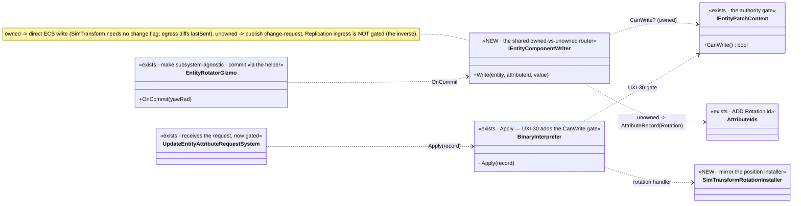
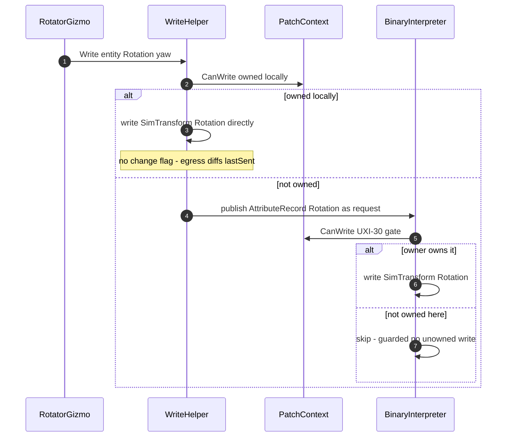

<!--STATUS
state: LIVE
build-state: READY-TO-BUILD — carries classDiagram + sequenceDiagram (§4/§5). Axis-B FIRST CUT: a subsystem-
  agnostic entity-write path proven with ROTATION. Delivers UXI-30 (the binary authority gate) + a rotation
  attribute id + a subsystem-agnostic write helper the rotator gizmo drives. ⛔ NOT all of Axis B — one slice
  that establishes the owned→direct / unowned→request routing so later attribute gizmos reuse it.
updated: 2026-08-25
design-basis: UX_Feature_Authority_Aware_Writes.md §3.3b-c (UXI-30/UXI-29 ruling — change-requests apply ONLY
  to owned components; JSON path already gates via CanWrite, binary path does not) · HROT-PROGRAMMERS-GUIDE
  Part 0 rule 8 (the two writer classes; the replication inverse must be preserved) · user ruling 2026-08-25
  (the gizmo is subsystem-agnostic; owned→direct write, unowned→request intent; SimTransform needs no change
  flag — its egress translator diffs lastSent every tick).
known-conflict: ✅ parallel-safe with the MCP create-recipes session (disjoint files; the ONE shared file is
  CgfSubsystem.cs — this session keeps to gizmo registration, MCP keeps to the asset-service dict). ⛔ Do NOT
  add an MCP route (the MCP session owns the generated catalog) — test via integration rails + existing entity ops.
-->
# DESIGN — **Axis-B first cut: the subsystem-agnostic write path, proven with ROTATION** *(UXI-30 + rotation)*

> 🎯 Axis B lets a node manipulate map entities like the editor. The editor never hits authority *(one-node
> cluster, owns everything)*; a distributed node does. This slice builds the **one write path** every attribute
> gizmo will reuse — **owned → write ECS directly; unowned → publish a change-request** — and proves it with the
> motivating case, **Rotate**, which needs a new attribute id and the binary authority gate *(UXI-30)*.

## 1. ⭐⭐ INVENTORY — measured `2026-08-25`
| ✅ exists | where | role |
|---|---|---|
| `EntityRotatorGizmo` *(reads `SimTransform`, `onCommit(yawRad)`)* | 🔴 **`Hrot.SimHost/Gizmos`** *(SimHost-bound)* | ⭐ the gizmo to make **subsystem-agnostic** — its commit must go through the shared write path, not a SimHost-only ECS poke |
| `IEntityPatchContext.CanWrite()` — native component authority | `Fdp.Toolkits/Replication/Patching` | ⭐⭐ **the gate the JSON path uses** *(`JsonAttributeCompiler:40,58`)* — the check to MIRROR |
| 🔴 `BinaryInterpreter.Apply` — **no authority gate** | `Fdp.Toolkits/Replication/Patching/BinaryInterpreter.cs:102-128` | ⛔ **UXI-30**: dispatches every record to its handler with no `CanWrite` |
| `SimTransformAttributeInstaller` *(position)*; `AttributeCompilerFactory.BuildBinaryInterpreter` | `Hrot.Network.NED/Attributes` | ⭐ the installer to MIRROR for rotation |
| 🔴 `AttributeIds` — **5 constants, NO rotation** *(Name/Affiliation/GeoLat/GeoLon/GeoAlt)* | `Fdp.Toolkits/Replication/Patching/AttributeIds.cs` | ⛔ Rotate cannot be expressed on this channel today *(gap 2)* |
| `UpdateEntityAttributeRequestSystem` *(binary branch)* — the receiving applier | `Hrot.*` | ⭐ where the gated request lands |
| `SimTransform` egress translator — **diffs `lastSent` every tick** | replication egress | ⚠ ⇒ a direct ECS write of rotation needs **NO change flag** *(user)* |
| ⛔ replication ingress *(`GeoSpatialIngressTranslator:85-89`)* writes unowned **by design** | replication | 🔒 **the inverse — do NOT gate it** *(Part 0 rule 8; the trap)* |

## 2. ⭐⭐⭐ THE ROUTING MODEL *(user ruling `2026-08-25`)*
The gizmo is **subsystem-agnostic**: it knows an entity + a target value, ⛔ not who owns it. A shared **write
helper** decides:
| case | action |
|---|---|
| ⭐ target component **owned locally** | **write ECS directly** *(+ set the component's change flag IF its egress translator needs one; ⭐ `SimTransform` does NOT — it diffs `lastSent`)* |
| ⭐ target component **NOT owned** | **publish a change-request** *(an `AttributeRecord` with the new `Rotation` id → `UpdateEntityAttributeRequest`)* — the OWNER receives it |
| 🔒 the receiver | **UXI-30**: `BinaryInterpreter.Apply` now gates on `CanWrite` ⇒ applies the request **only to the component it owns**; a request for an unowned component is **skipped** |
| ⛔ replication ingress | **untouched** — still writes unowned ghosts by design *(the inverse gate; Part 0 rule 8)* |

## 3. ⭐ SCOPE
| ✅ IN | ⛔ NOT |
|---|---|
| **UXI-30**: the `CanWrite` gate on `BinaryInterpreter.Apply` *(mirror the JSON path)* | ⛔ touching replication ingress translators *(the inverse — breaking ghost updates is the trap)* |
| **Rotation attribute id** in `AttributeIds` + a `SimTransformRotation` installer *(mirror position)* | ⛔ a full attribute vocabulary — just rotation, the motivating case |
| **the subsystem-agnostic write helper** *(owned→direct / unowned→request)* the rotator gizmo drives | ⛔ vertex/route gizmos *(they keep the descriptor channel — ruling)* |
| **make `EntityRotatorGizmo` subsystem-agnostic** *(commit through the helper)* + reusable from CGF | ⛔ selection/symbology/tools *(later Axis-B slices)* |

## 4. ⭐⭐⭐ CLASS DIAGRAM

## 5. ⭐⭐⭐ SEQUENCE DIAGRAM

## 6. ⭐⭐ ITEMS
| # | task | the one thing not to get wrong |
|---|---|---|
| ⭐ **①** | **UXI-30** — add the `CanWrite` gate to `BinaryInterpreter.Apply` | ⛔ gate **change-request** appliers only; ⛔ **do NOT** touch replication ingress *(the inverse; Part 0 rule 8)*. ⭐ zero production senders ⇒ no compat surface |
| ⭐ **②** | **`AttributeIds.Rotation`** + `SimTransformRotation` installer | mirror the position installer; a yaw/heading scalar is enough for this cut |
| ⭐ **③** | **`IEntityComponentWriter`** — the owned→direct / unowned→request router | ⭐ SimTransform direct write sets **no change flag** *(egress diffs lastSent)*; ⚠ other components may need one — the helper asks the component, it does not assume |
| ⭐ **④** | **`EntityRotatorGizmo` subsystem-agnostic** — commit through the helper; usable from CGF | ⛔ no SimHost-only ECS poke in the commit path |

## 7. GATES
rule 8 + build/test rules *(affected project: `Fdp.Toolkits`, `Hrot.SimHost`, `Hrot.Network.NED`, the integration suite)*. **Row 8 rails:** ⭐ **the UXI-30 gate** — a binary change-request for an UNOWNED component is skipped *(red by removing the gate)*; ⭐ **the replication inverse still works** — a ghost still receives owner state *(anti-regression, 29.23)*; ⭐ **rotation round-trips** — owned node rotates directly; a non-owning node's rotate becomes a request the owner applies *(on a real `--mode all` cluster — the barrier harness shape)*; ⛔ **do NOT add an MCP route** *(the MCP session owns the catalog)* — drive via existing entity ops / integration rails.

## 8. ⭐ WHEN DONE
Fold the as-built here; if the routing deviates, mark the prior state superseded *(obligation ⑤)*. State the ids *(a new prefix, e.g. `AX-`, in a new tracker area — clear of `MA-`/`CE-`)*. Flip the gap-map UXI-30 row + the Axis-B note. The report points here and carries the DECISION LOG.
