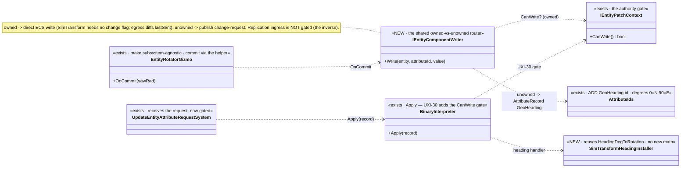
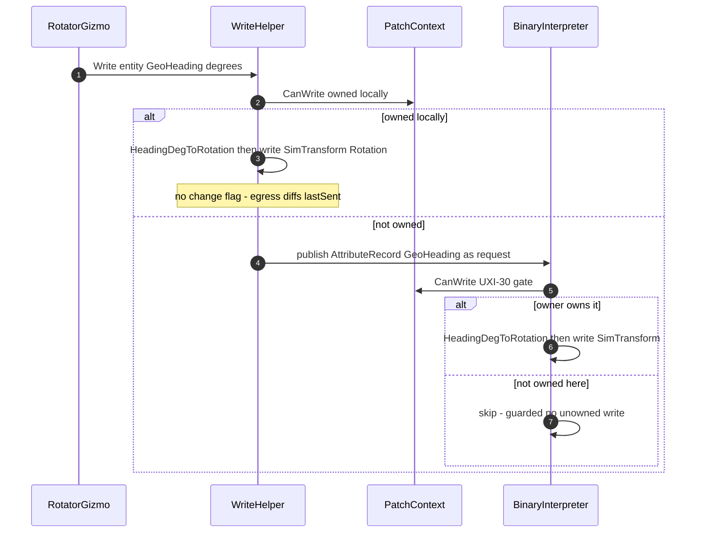

<!--STATUS
state: LIVE
build-state: BUILT `2026-08-25` (AX-001..AX-006) — read §9 AS-BUILT FIRST. Carries classDiagram + sequenceDiagram (§4/§5). Axis-B FIRST CUT: a subsystem-
  agnostic entity-write path proven with ROTATION. Delivers UXI-30 (the binary authority gate) + a rotation
  attribute id + a subsystem-agnostic write helper the rotator gizmo drives. ⛔ NOT all of Axis B — one slice
  that establishes the owned→direct / unowned→request routing so later attribute gizmos reuse it.
updated: 2026-08-25
stale-below: ⛔⛔ §1's row "BinaryInterpreter.Apply — NO AUTHORITY GATE" and §6 item ①'s framing are
  SUPERSEDED by §9.1: measured, BOTH production installers already gated every handler, so the binary
  path WAS authority-gated. The real defect — and what was built — is that the gate was per-installer
  and therefore forgettable. §7's "rotation round-trips on a real --mode all cluster" is NOT delivered:
  §9.4 measures why (there is no production SENDER of binary attribute records, which §6 ① itself notes).
design-basis: UX_Feature_Authority_Aware_Writes.md §3.3b-c (UXI-30/UXI-29 ruling — change-requests apply ONLY
  to owned components; JSON path already gates via CanWrite, binary path does not) · HROT-PROGRAMMERS-GUIDE
  Part 0 rule 8 (the two writer classes; the replication inverse must be preserved) · user ruling 2026-08-25
  (the gizmo is subsystem-agnostic; owned→direct write, unowned→request intent; SimTransform needs no change
  flag — its egress translator diffs lastSent every tick).
known-conflict: ✅ parallel-safe with the MCP create-recipes session (disjoint files; the ONE shared file is
  CgfSubsystem.cs — this session keeps to gizmo registration, MCP keeps to the asset-service dict). ⛔ Do NOT
  add an MCP route (the MCP session owns the generated catalog) — test via integration rails + existing entity ops.
-->
# DESIGN — **Axis-B first cut: the subsystem-agnostic write path, proven with ROTATION** *(UXI-30 + rotation)*

> 🎯 Axis B lets a node manipulate map entities like the editor. The editor never hits authority *(one-node
> cluster, owns everything)*; a distributed node does. This slice builds the **one write path** every attribute
> gizmo will reuse — **owned → write ECS directly; unowned → publish a change-request** — and proves it with the
> motivating case, **Rotate**, which needs a new attribute id and the binary authority gate *(UXI-30)*.

## 1. ⭐⭐ INVENTORY — measured `2026-08-25`
| ✅ exists | where | role |
|---|---|---|
| `EntityRotatorGizmo` *(reads `SimTransform`, `onCommit(yawRad)`)* | 🔴 **`Hrot.SimHost/Gizmos`** *(SimHost-bound)* | ⭐ the gizmo to make **subsystem-agnostic** — its commit must go through the shared write path, not a SimHost-only ECS poke |
| `IEntityPatchContext.CanWrite()` — native component authority | `Fdp.Toolkits/Replication/Patching` | ⭐⭐ **the gate the JSON path uses** *(`JsonAttributeCompiler:40,58`)* — the check to MIRROR |
| 🔴 `BinaryInterpreter.Apply` — **no authority gate** | `Fdp.Toolkits/Replication/Patching/BinaryInterpreter.cs:102-128` | ⛔ **UXI-30**: dispatches every record to its handler with no `CanWrite` |
| `SimTransformAttributeInstaller` *(position)*; `AttributeCompilerFactory.BuildBinaryInterpreter` | `Hrot.Network.NED/Attributes` | ⭐ the installer to MIRROR for heading |
| ⭐⭐⭐ **`SimTransformBridgeSystem.HeadingDegToRotation(headingDeg)`** + `RotationToHeadingDeg` — *"Compass heading in degrees (0=North, 90=East, clockwise)"* | `Fdp.Toolkits/Geographic/Systems` | ⭐⭐ **the convention + conversion ALREADY EXIST** *(user was right)* — the installer REUSES this; ⛔ no new math |
| ⭐ **`EulerOri.Heading`** *(wire)* · `GeoSpatialEgressTranslator` already does **yaw → compass heading** *(`HeadingConversion_YawToCompass`)*; the DebugApi already takes `headingDeg` *(`GeoToLocal_WithHeadingDeg_IncludesRotation`)* | `Hrot.Network.NED/Common` · `Hrot.SimHost` | ⭐ heading is a first-class wire concept already |
| 🔴 `AttributeIds` — `Name/Affiliation/GeoLat=10/GeoLon=11/GeoAlt=12`, **NO `GeoHeading`** | `Fdp.Toolkits/Replication/Patching/AttributeIds.cs` | ⛔ **the ONLY gap: add `GeoHeading` to the Geo* family** — the convention/conversion/wire all exist |
| `UpdateEntityAttributeRequestSystem` *(binary branch)* — the receiving applier | `Hrot.*` | ⭐ where the gated request lands |
| `SimTransform` egress translator — **diffs `lastSent` every tick** | replication egress | ⚠ ⇒ a direct ECS write of rotation needs **NO change flag** *(user)* |
| ⛔ replication ingress *(`GeoSpatialIngressTranslator:85-89`)* writes unowned **by design** | replication | 🔒 **the inverse — do NOT gate it** *(Part 0 rule 8; the trap)* |

## 2. ⭐⭐⭐ THE ROUTING MODEL *(user ruling `2026-08-25`)*
The gizmo is **subsystem-agnostic**: it knows an entity + a target value, ⛔ not who owns it. A shared **write
helper** decides:
| case | action |
|---|---|
| ⭐ target component **owned locally** | **write ECS directly** *(+ set the component's change flag IF its egress translator needs one; ⭐ `SimTransform` does NOT — it diffs `lastSent`)* |
| ⭐ target component **NOT owned** | **publish a change-request** *(an `AttributeRecord` with the new `GeoHeading` id, in degrees → `UpdateEntityAttributeRequest`)* — the OWNER receives it |
| 🔒 the receiver | **UXI-30**: `BinaryInterpreter.Apply` now gates on `CanWrite` ⇒ applies the request **only to the component it owns**; a request for an unowned component is **skipped** |
| ⛔ replication ingress | **untouched** — still writes unowned ghosts by design *(the inverse gate; Part 0 rule 8)* |

## 3. ⭐ SCOPE
| ✅ IN | ⛔ NOT |
|---|---|
| **UXI-30**: the `CanWrite` gate on `BinaryInterpreter.Apply` *(mirror the JSON path)* | ⛔ touching replication ingress translators *(the inverse — breaking ghost updates is the trap)* |
| **`GeoHeading` attribute id** *(degrees, 0=N/90=E)* in `AttributeIds` + a `SimTransformHeading` installer that **reuses `HeadingDegToRotation`** | ⛔ a full attribute vocabulary — just heading, the motivating case; ⛔ no new conversion math *(it exists)* |
| **the subsystem-agnostic write helper** *(owned→direct / unowned→request)* the rotator gizmo drives | ⛔ vertex/route gizmos *(they keep the descriptor channel — ruling)* |
| **make `EntityRotatorGizmo` subsystem-agnostic** *(commit through the helper)* + reusable from CGF | ⛔ selection/symbology/tools *(later Axis-B slices)* |

## 4. ⭐⭐⭐ CLASS DIAGRAM

## 5. ⭐⭐⭐ SEQUENCE DIAGRAM

## 6. ⭐⭐ ITEMS
| # | task | the one thing not to get wrong |
|---|---|---|
| ⭐ **①** | **UXI-30** — add the `CanWrite` gate to `BinaryInterpreter.Apply` | ⛔ gate **change-request** appliers only; ⛔ **do NOT** touch replication ingress *(the inverse; Part 0 rule 8)*. ⭐ zero production senders ⇒ no compat surface |
| ⭐ **②** | **`AttributeIds.GeoHeading`** *(degrees, 0=N/90=E)* + a `SimTransformHeading` installer that **reuses `HeadingDegToRotation`** *(+ `RotationToHeadingDeg` for read-back)* | ⛔ **no new conversion math — it exists**; a `Float32`/`Float64` heading-degrees scalar in the Geo* family |
| ⭐ **③** | **`IEntityComponentWriter`** — the owned→direct / unowned→request router | ⭐ SimTransform direct write sets **no change flag** *(egress diffs lastSent)*; ⚠ other components may need one — the helper asks the component, it does not assume |
| ⭐ **④** | **`EntityRotatorGizmo` subsystem-agnostic** — commit through the helper; usable from CGF | ⛔ no SimHost-only ECS poke in the commit path |

## 7. GATES
rule 8 + build/test rules *(affected project: `Fdp.Toolkits`, `Hrot.SimHost`, `Hrot.Network.NED`, the integration suite)*. **Row 8 rails:** ⭐ **the UXI-30 gate** — a binary change-request for an UNOWNED component is skipped *(red by removing the gate)*; ⭐ **the replication inverse still works** — a ghost still receives owner state *(anti-regression, 29.23)*; ⭐ **rotation round-trips** — owned node rotates directly; a non-owning node's rotate becomes a request the owner applies *(on a real `--mode all` cluster — the barrier harness shape)*; ⛔ **do NOT add an MCP route** *(the MCP session owns the catalog)* — drive via existing entity ops / integration rails.

## 8. ⭐ WHEN DONE
Fold the as-built here; if the routing deviates, mark the prior state superseded *(obligation ⑤)*. State the ids *(a new prefix, e.g. `AX-`, in a new tracker area — clear of `MA-`/`CE-`)*. Flip the gap-map UXI-30 row + the Axis-B note. The report points here and carries the DECISION LOG.

---

## 9. ⭐⭐⭐ AS-BUILT — `2026-08-25` *(`AX-001`…`AX-006`; supersedes §1's gate row and §6 ①'s framing)*

> ⭐⭐ Written by the implementing session per obligation ⑤. Three of the four items landed as drawn; item
> ① landed for a **different reason than the design gave**, and §7's cluster round-trip is **not
> delivered** — both measured below rather than asserted.

### 9.1 ⛔⛔ Item ① — `UXI-30`'s premise was wrong, and the fix is better for it

| | |
|---|---|
| ⛔ §1 said | *"`BinaryInterpreter.Apply` — **no authority gate** … dispatches every record to its handler with no `CanWrite`"* |
| 📐 **measured** | **Both** production installers — `SimTransformAttributeInstaller` *(4 checks)* and `EntityDataAttributeInstaller` *(2)* — **already opened every handler** with `if (!ctx.PatchContext.CanWrite<T>()) return;` ⇒ ⭐ **the binary path WAS authority-gated**, per handler |
| ⭐⭐ **and that is the JSON path's own shape** | §1's own inventory points at `JsonAttributeCompiler`, whose gate lives in the typed `ValueInvoker<T>` — ⛔ **not** in the router either. ⇒ *"the router has no gate"* was never the defect; it is the architecture |
| ⭐⭐⭐ **the REAL defect** | the gate was **PER-INSTALLER and therefore FORGETTABLE.** ⚠ And this slice adds a **third** installer — exactly when that bites: one omitted line and an unowned component is written **silently** |

⇒ ⭐ **Built:** `BinaryInterpreterBuilder.RegisterHandler<TComponent>(id, handler)` applies the gate at
**registration**, so a handler body needs — and now contains — no guard. Both existing installers are
migrated onto it and their hand-written checks **deleted**, so there is ONE implementation of the check.
⭐ The rail asserts the gate on a handler that is a bare counter: ⛔ it proves the **registration** gates,
not that an author remembered to.

⚠ **The untyped overload deliberately still does NOT gate** — it is the right tool for a handler that
touches no ECS component *(a pure scratchpad accumulator)*. ⭐ Characterised by its own rail so the
boundary is documented rather than a hole.

✅ **§6 ①'s *"zero production senders ⇒ safe to switch on"* — VERIFIED independently:** only the
receiver (`UpdateEntityAttributeRequestSystem`) reads `AttributeRecords`; nothing populates them.

### 9.2 ⭐ Item ② — as drawn, and it really is only a constant plus a route

`AttributeIds.GeoHeading = 13` *(degrees, 0=N/90=E, in the `Geo*` family)* + `SimTransformHeadingInstaller`,
which **calls `SimTransformBridgeSystem.HeadingDegToRotation`** and writes no math of its own. ⭐ The user's
correction was right in full: the convention, the conversion, the wire field and the DebugApi's
`headingDeg` all already existed.

| ⚠ two notes worth keeping | |
|---|---|
| **numbering** | the class doc reserves 100–199 for geo, but the shipped `Geo*` ids are **10/11/12**. `GeoHeading` takes **13** to keep the family contiguous; ⛔ renumbering the existing three to match the prose is a WIRE change and was not attempted |
| **added unconditionally** | ⛔ unlike the position installer, heading needs **no `IGeographicTransform`** — a compass angle is already in the units the bridge takes. ⇒ heading works on a host with no geo transform, and gating it behind one would refuse rotation for no reason |

### 9.3 ⭐⭐⭐ Item ③ — the router, and the mechanism is better than the diagram

⭐ §4 draws `IEntityComponentWriter ..> IEntityPatchContext : CanWrite? (owned)`. ⛔ **The built router
never asks that question**, and deliberately: asking *"do I own `SimTransform`?"* would put the
attribute→component mapping in a **second** place, beside the installers that already hold it.

⇒ ⭐⭐ **It attempts the local apply through the very interpreter the OWNER uses, then asks
`EcsPatchContext.HasAppliedAny` whether anything landed:**

| outcome | meaning |
|---|---|
| something landed | owned ⇒ `Direct` — ⭐ and the conversion that ran was the installer's |
| nothing landed | `UXI-30`'s gate refused ⇒ publish the record as a change-request ⇒ `Requested` |
| no request sink | ⇒ `Refused` — ⛔ *"written"* and *"nobody to ask"* must not collapse into one answer |

⇒ ⭐⭐⭐ **ONE conversion implementation serves both the local and the remote path, and a second attribute
needs no change in the router at all.**

⭐ The change-flag question stays where the design put it: the **installer's handler** marks the
descriptor dirty or does not, so the component decides — the router never assumes.

### 9.4 ⛔⛔ Item ④ built; §7's CLUSTER ROUND-TRIP is NOT delivered

⭐ `EntityRotatorGizmo` commits through the writer in **compass degrees** — reusing
`SimMath.YawRadToCompassDeg`, which this file already used to draw its own label. ⭐ Railed that the two
conversions are **exact inverses** *(algebraically `HeadingDegToRotation(YawRadToCompassDeg(y)) =
FromYaw(y)`)*, because a sign error there rotates entities the wrong way **silently**.

⚠ **The writer is OPT-IN and the existing SimHost call site keeps its direct write** — see §9.5 for the
measured reason that is not merely caution.

🔴 **§7's *"rotation round-trips on a real `--mode all` cluster"* cannot be built yet.** 📐 There is **no
production SENDER** of binary attribute records — §6 ① says so itself, and it is verified. ⇒ the unowned
branch is railed behaviourally at unit level *(the request is published with the right id and value)*, and
the DDS egress for `UpdateEntityAttributeRequest.AttributeRecords` is a **distinct piece of work** beyond
these four items. ⛔ Not attempted; filed.

### 9.5 🔴🔴 THE PREMISE THE DESIGN DID NOT STATE — **"owned" is a bit almost nobody sets**

📐 Measured `2026-08-25`: `EntityRepository.HasAuthority` reads `EntityHeader.AuthorityMask`, and
`SetAuthority` has production callers in **exactly two places** — `Hrot.SimHost`'s bootstrapper *(for
entities it spawns)* and the **NED replication path** *(`DeferredTakeoverSystem`,
`OwnershipUpdateTranslator`)*. ⛔ **`Hrot.Editor` never calls it.**

⇒ ⚠⚠ **On a host that creates entities without granting authority, every attribute write looks UNOWNED**
and becomes a change-request — or, with no sink, a refusal. ⭐ That is the authority model working as
built, ⛔ but §2's routing model reads as though ownership were self-evident, and it is not.

⭐ **Consequences, recorded rather than silently absorbed:**
- the gizmo's writer is **opt-in**, and the SimHost call site is unchanged — ⛔ switching it wholesale
  would change behaviour on hosts whose entities carry no authority bits;
- **a later slice that wires the writer everywhere must first grant authority on the creating host**;
- railed as a characterization *(`TheWriterTreatsAnUngrantedComponentAsUnowned`)* so the next reader meets
  the fact rather than deriving it.

### 9.6 ⭐ The inverse — untouched, and now guarded for the future

📐 `GeoSpatialIngressTranslator` writes through a **command buffer** and only when
`!repo.HasAuthority<SimTransform>(entity)` — i.e. it writes exactly the unowned case, and it never touches
`BinaryInterpreter`. ⇒ ⭐ **this slice could not have gated it even by mistake.** ⭐⭐ A structural rail now
fails the day a replication ingress translator is routed through the change-request builder — the
plausible *"let us unify the two write paths"* refactor — and the shipped
`GeoSpatialIngressTranslatorTests` *(4/4)* remain the behavioural half.
