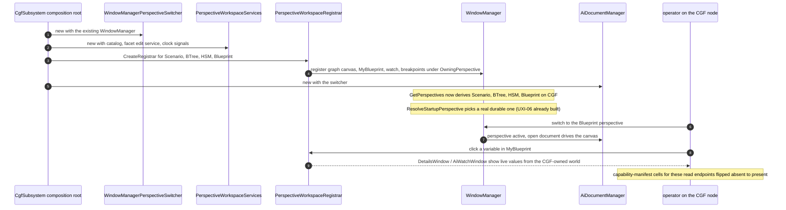

<!--STATUS
state: LIVE
build-state: BUILT (2026-08-25, backend/CGF lane, ids CE-001..CE-010). Carries classDiagram +
  sequenceDiagram (§3/§4). First slice of the cgf==editor programme: CGF constructs the AiShared shell
  and registers the asset-perspective windows, delivering the VIEWING/DIAGNOSTICS chain
  (watch -> MyBlueprint -> asset graphs) on CGF.
updated: 2026-08-25
current-answer: §3/§4 (the diagrams, TRUE as built) + §9 (AS-BUILT — what landed, and the five places
  the build deviated from §5) + §10 (the mid-batch STEER and its measured outcome). Read §9 before
  quoting §5's items: item ③ in particular asked for something that does not exist in the shape it
  describes. Read §10 before quoting §1's "NOT this slice: asset editing" — that framing is SUPERSEDED.
design-basis: PROGRAMME_Unification_And_Harness.md (charter; editor = one-node cluster; Step 4) ·
  PROGRAMME_Cgf_Equals_Editor_Gap_Map.md §0.5 (pure-sharing framing: this slice has NO open design) ·
  UX/UX_Feature_Cgf_Brain_Diagnostics.md §5b (the verified construct diff, UXI-37) ·
  DESIGN_Perspective_Unification.md Part B (CreateRegistrar is the reuse vehicle; A0/A1 default fix BUILT) ·
  Architect_Question_54 (capability manifest — flip a cell absent->present) ·
  DESIGN_Regression_Net.md (the net every port runs against).
known-rot: §1's NOT-row "asset EDITING / hot-reload writes" and §5 item ③'s "leave write/edit cells
  absent" are SUPERSEDED by the 2026-08-25 STEER (§10): take the windows wholesale, add no gating.
  §1's table row and §2's closing line both say "flip the capability-manifest cells
  absent->present". MEASURED FALSE while building (§9.2): the manifest's availability layer is derived
  from the live route table and from what is actually wired, and CapabilityManifest's own doc places the
  known-absent BASELINE in the HARNESS. There is no hand-authored cell. The real act is the nine
  deletions from ClusterConformanceRails.EditorOnlyKinds. Read §9.2 before quoting either line.
  Likewise §2's "Blueprint has a live write path" is true of the EDITOR only: CGF constructs no
  IBlueprintDebugSession, so all three perspectives pass null there (§9.4).
known-conflict: none. This slice CONSUMES Hrot.Editor.AiShared; it must NOT modify it (SHARED_SURFACES:
  "place, do not touch"). Any needed AiShared change is a coordination point with the variable-model lane.
-->
# DESIGN — **cgf==editor slice 1: CGF adopts the AiShared shell** *(viewing / diagnostics)*

> 🎯 Deliver the **watch → MyBlueprint → asset-graph** chain on CGF by having `CgfSubsystem` **construct the
> same AiShared shell the editor already builds** and **register the same windows** under the asset
> perspectives. ⛔ **No new capability** — the charter's *"editor is a one-node cluster"* made literal:
> CGF calls the existing registrar; it does not reimplement anything.

## 1. ⭐ SCOPE

| ✅ IN this slice | ⛔ NOT this slice |
|---|---|
| CGF constructs `IPerspectiveSwitcher` + `AssetCatalog` + `PerspectiveWorkspaceServices` + `CreateRegistrar`×(asset perspectives) + `AiDocumentManager`, **mirroring `EditorSubsystem`** | ⛔ **Asset EDITING / hot-reload writes** on CGF *(later slice — wire `QuickReloadService`; gap map §0.5)* |
| Register the windows: **graph canvas · MyBlueprint · watch · breakpoints · inspector** under the asset perspectives | ⛔ **Map / entity interaction parity** *(Axis B — UXI-11/23/10/29/30)* |
| Flip the capability-manifest cells absent→present for the registered read/diagnostics endpoints | ⛔ **New authoring features** *(AQ25-A/B/C/E — postponable)* · the shared R-52 blackboard-write bug |
| Prove editor-vs-cluster **SAME** for these panels via the net + conformance harness | ⛔ Modifying anything **inside** `Hrot.Editor.AiShared` |

⭐⭐ **Why this is the first slice:** it is the user's own chain, it is **pure wiring** *(gap map §0.5 — no
open design)*, and Blueprint's assembly wall is already down *(`Hrot.CGF` → `Hrot.Blueprints.Editor` →
`Hrot.Editor.AiShared`)*.

## 2. ⭐⭐ INVENTORY — measured `2026-08-25` *(seam law: the shell EXISTS; this is adoption)*

```
grep EditorSubsystem.cs : the construct sites          · search_graph PerspectiveWorkspace* / Ai*Window
sed PerspectiveWorkspaceServices.CreateRegistrar       · read LocalWindowController.ResolveStartupPerspective
```

**The editor's construct sites CGF must mirror** *(`EditorSubsystem.cs`, verified)*:

| service (home: `Hrot.Editor.AiShared`) | editor site | on CGF today |
|---|---|---|
| `WindowManagerPerspectiveSwitcher : IPerspectiveSwitcher` | `:2545` | ❌ construct |
| `AssetCatalog` | `:2561` | ❌ construct |
| `PerspectiveWorkspaceServices` *(centralises facetEditService + clock signals + all the shared deps)* | `:2719` | ❌ construct |
| `PerspectiveWorkspaceServices.CreateRegistrar(perspectiveName, selectionStore, validators, liveValueProvider?, hostKind?, writeLive?)` ×(asset perspectives) | `:2788/2796/2848` | ❌ call |
| `AiDocumentManager(IPerspectiveSwitcher)` *(the graph canvas's whole dependency)* | `:2948` | ❌ construct |

**What CGF ALREADY has** *(so this slice does NOT rebuild it)*: `WindowManager` `:665` · `IWindowRegistrar`
impl · `ComponentEditServiceBuilder().Build()` `:554` · `DataBreakpointManager` + `DataBreakpointSystem` +
`DebugSnapshotProvider` `:555-568` · `BehaviorDiagnosticsModule` `:326` · `BehaviorTraceLog` `:286` ·
blackboard renderers `:277-318`. **Every window asked for EXISTS** in AiShared: `AiGraphCanvasWindow`,
`AiMyBlueprintWindow`, `AiWatchWindow`, `AiBreakpointsWindow`, `InspectorWindow`, `DetailsWindow`.

**Already handled (NOT a prerequisite):** ✅ **UXI-06 default-perspective fix is BUILT** —
`LocalWindowController.ResolveStartupPerspective` derives the default from `WindowManager.GetPerspectives()`
and excludes document-driven perspectives. ⇒ once CGF registers the windows, the asset perspectives appear
in the derived list automatically and the app opens on a real one.

**Per-perspective honesty** *(from the `CreateRegistrar` signature)*: `liveValueProvider`/`writeLive`/
`hostKind` are **genuinely per-perspective** — only Blueprint has a live write path (`IBlueprintDebugSession`);
BTree/HSM pass **null**, and that is the honest answer, not a gap. ⚠ For this READ/diagnostics slice, even
Blueprint's **write** path is out of scope *(charter D3: the lifted API accepts absent capabilities)* —
pass the honest null and flip only the read/diagnostics manifest cells.

## 3. ⭐⭐⭐ CLASS DIAGRAM *(existing classes drawn as existing — the only new thing is a CGF composition block)*


## 4. ⭐⭐⭐ SEQUENCE DIAGRAM *(CGF startup → the chain works)*



## 5. ⭐⭐ THE ITEMS

| # | task | the one thing not to get wrong |
|---|---|---|
| ⭐ **①** | **Construct the shell in `CgfSubsystem`**, mirroring `EditorSubsystem` `:2545-2948`: switcher · `AssetCatalog` · `PerspectiveWorkspaceServices` · `AiDocumentManager` | ⛔ **Do not modify AiShared** — construct only. ⚠ `PerspectiveWorkspaceServices` requires `facetEditService` + both clock signals *(`isSimUp`/`isFrozen`)*; supply CGF's real ones, ⛔ never a silent default *(the SILENT-DEFAULT rule)* |
| ⭐ **②** | **`CreateRegistrar` per asset perspective** and register the windows *(graph canvas · MyBlueprint · watch · breakpoints · inspector)* under `OwningPerspective` | ⭐ perspectives are **emergent** from registration — no perspective list to declare. Pass **null** `liveValueProvider`/`writeLive` for BTree/HSM *(honest, per the signature)* |
| ⭐ **③** | **Flip the capability-manifest cells** absent→present for the registered read/diagnostics endpoints; update the `known-absent` baseline | ⛔ read/diagnostics only — leave write/edit cells absent *(D3)*; the flip is a reviewed one-line-per-cell diff *(AQ54)* |
| ⚠ **④** | **The Scenario perspective on CGF** — per `DESIGN_Perspective_Unification.md` D1/D2, CGF presents the four asset perspectives *(Scenario/BTree/HSM/Blueprint)*; confirm `perspectiveMap` maps `Scenario → CGF` | ⛔ don't add a `CGF` perspective — D1 ruled the asset perspectives instead |

## 5b. ⭐⭐⭐ HEADLESS TEST METHOD — **capture editor goldens FIRST, then diff CGF via MCP** *(user, `2026-08-25`)*

⭐⭐ **Yes — this slice is provable headlessly over MCP, and the mechanism already exists on both hosts.**

| fact — measured `2026-08-25` | consequence |
|---|---|
| ⭐⭐⭐ **The windows are ALREADY `PanelSnapshot`-instrumented IN AiShared** — `AiMyBlueprintWindow` (`DeclareInstrumented`+`Register`), `AiGraphCanvasWindow`, `AiWatchWindow`, `AiBreakpointsWindow`, `DetailsWindow` | ⇒ **the instrumentation TRAVELS WITH the shared window.** The moment CGF constructs+registers them (§5), they publish on CGF **for free** — no extra test wiring |
| ⭐⭐ **`GET /panels`** *(Group T / MX9, `DebugApiService.Panels.cs`)* reads `PanelSnapshot` over HTTP | ⇒ **the panel MODEL is machine-readable over MCP** — *"live dump here, reviewed expectation there"* (`CapabilityManifest.cs:33`). `/panels` is in the manifest |
| ⭐⭐ **Conformance = same binary, two `--mode`s, diff by `PanelKind`** *(`DESIGN_Headless_Testability.md` §Conformance; three-way SAME / DIFFERENT / NOT-PRESENT)* | ⇒ editor-mode **vs** `--mode all` (CGF) diffed **by `PanelKind`**, `panelId` ignored in the diff *(kept only as the golden storage key)* |
| ⚠ **It is MODEL-level, not pixels** — the panel view-model, not a screenshot | ⇒ *"looks the same"* headlessly = **the panel's DATA MODEL matches**; the gizmo frame is diffed the same way. ⛔ no pixel diff at the machine layer |

⭐⭐⭐ **The workflow you described is exactly charter jobs ①→④:**
1. ⭐ **Capture editor goldens NOW** for the asset panels *(MyBlueprint · graph canvas · watch)* per `PanelKind` — job ① *"the reference behaviour, before anything moves"*. ⭐ Available today because the windows are already instrumented in the editor.
2. Build slice 1 *(§5)*.
3. ⭐⭐ **Run the conformance suite** *(editor-mode vs `--mode all`)* — job ④ *"once the same feature is in CGF, check it looks the same as in the editor"* ⇒ **`SAME` per `PanelKind`** is the acceptance verdict.
4. ⭐ **The editor goldens also guard the editor** during the wiring — job ③ *"check this does not change as we refactor"*.

⚠ **The one dependency:** this rides on the **conformance suite (steps 6+7 of `DESIGN_Headless_Testability.md`** — the MCP-drivable cluster host + the editor-vs-cluster diff). Confirm it is landed before dispatch; the ack-gate + cluster-load prerequisites *(HN-028/HN-029)* already are.

## 6. GATES *(the net every port runs against — DESIGN_Regression_Net.md + charter §2)*

⭐ Standing contract *(rule 8)* + the build/test rules *(`.claude/CLAUDE.md` THREE TEST TIERS: affected-project
builds; T3 E2E async)*. ⭐⭐ **Row 8 — the rails that prove this slice:**
- ✅ **the headline (net):** the **paired golden + assertions per `PanelKind`** for the CGF asset perspectives — graph canvas, MyBlueprint, watch — asserted **SAME** as the editor's via the **conformance harness** *(editor-vs-cluster; `DESIGN_Headless_Testability.md`)*. ⛔ This is the acceptance criterion: *the same panels, same content, on CGF.*
- a rail asserting `WindowManager.GetPerspectives()` on `--mode all` **includes** the CGF asset perspectives *(shown RED by reverting the registration)*.
- a rail asserting the flipped **capability-manifest** cells report present on CGF and the `known-absent` baseline shrank by exactly those cells.
- ⛔⛔ **cross-cutting ⇒ name the integration suite** *(rule 8 row 8)*: the `--mode all` conformance/`ClusterRunner.Integration` suite that proves the CGF windows render against the cluster world — run filtered if flaky, or state with base-sha evidence why it cannot gate.

## 7. ⚠ RISKS / COORDINATION

| | |
|---|---|
| ⭐ **`Hrot.Editor.AiShared` is CONSUMED, not modified** | if a construct needs an AiShared change *(e.g. a ctor overload)*, that is a **coordination point with the variable-model lane** *(the freeze owner)* — STOP and report, do not edit AiShared |
| ⚠ **`PerspectiveWorkspaceServices` dependency set** | it centralises many deps *(§2)*; some may not yet exist on CGF's composition root. Where one is genuinely absent, pass the honest null the signature allows and **flip the manifest cell absent** — ⛔ never a silent default |
| ✅ **process exclusivity helps** | editor and CGF **never share a process** *(the runner throws)* ⇒ CGF may reuse the editor's window ids verbatim; no id-collision design needed |
| ⭐ **lane** | this is `CgfSubsystem` wiring + AiShared consumption ⇒ a **CGF/backend lane** slice; the handoff picks it. ⛔ Not the variable-model lane's work *(it owns AiShared internals, which this must not touch)* |

## 8. ⭐ WHEN DONE — ✅ **DONE `2026-08-25`**
⭐⭐ Fold the as-built into this file *(the construct block as built, any per-perspective null decisions, the
manifest cells flipped)* and update the gap map §2 Axis-A rows from 🔌 to ✅ for the windows landed. ⭐ State
the ids allocated; ⛔ the report points here, it does not restate the design.
→ ✅ **§9 below is the as-built** · ✅ gap map Axis-A rows flipped · ✅ ids **`CE-001`…`CE-010`**
*(tracker Area L)* · ✅ report:
[`batches/REPORT_Cgf_Shell_Adoption_Slice1.md`](blueprints/batches/REPORT_Cgf_Shell_Adoption_Slice1.md).

## 9. ⭐⭐⭐ AS-BUILT *(`2026-08-25`, backend/CGF lane — obligation ⑤)*

### 9.1 ⭐ What landed — **one method, and §3/§4 are TRUE**

`CgfSubsystem.BuildAiShell(windowManager)`, called from the end of `RegisterWindows`. Every box §3 draws
exists and is constructed there; the sequence §4 draws is the order the method runs in.
⭐ **Obligation ③ report:** §3 carries **9 classes**, §4 **1 sequence**; ⭐ the build **matches both**, with
the five deviations named in 9.2–9.6 — ⛔ none of which changes a box or an arrow.

| §2 row | as built |
|---|---|
| `WindowManagerPerspectiveSwitcher` | ✅ over CGF's existing `WindowManager` |
| `AssetCatalog` | ✅ — ⚠ **empty** *(9.4)* |
| `PerspectiveWorkspaceServices` | ✅ — `facetEditService` is the **same instance** `Initialize` already builds for the breakpoint predicate compiler *(hoisted to `_facetEditService`; ⛔ a second `ComponentEditServiceBuilder().Build()` would be ruling 9's duplicate)* |
| `CreateRegistrar` × asset perspectives | ✅ **BTree · HSM · Blueprint** — ⚠ **not Scenario** *(9.3)* |
| `AiDocumentManager` | ✅ + the three `AiGraphCanvasWindow`s via `RegisterExtraWindow` |

📐 **Measured result, editor vs `--mode all`:** the cluster went from **14** to **23** panel kinds; the
newly-published ten are `blackboard-authoring · my-blueprint · variables · watch · ai-breakpoints ·
graph-canvas · details · runtime-inspector · diagnostics · bookmarks`.

### 9.2 ⛔⛔ Deviation ① — **item ③ asked for cells that do not exist in that shape**

⭐ §5 item ③ says *"flip the capability-manifest cells absent→present."* 📐 **Measured:**
`CapabilityManifest`'s own doc rules that out — its DESCRIPTION layer is *"enumerated from the live route
table"* and its AVAILABILITY layer is *"**measured** from what is actually wired"*, and it states
explicitly: ⭐ *"the known-absent BASELINE lives in the HARNESS, not here."*

⇒ ⭐⭐ **There is no hand-authored manifest cell to flip.** The one committed baseline is
`ClusterConformanceRails.EditorOnlyKinds`, and item ③ was executed there: **nine entries deleted**, and
⛔ **nothing added in exchange** — the three kinds that still differ went into `DivergesByDesign` *with
their measured reason* (9.5), which a rail deletes the moment they agree.

⚠ **This does not weaken item ③** — the manifest genuinely does report the new capability, it simply does
so by measurement. ⭐ `The_manifest_describes_this_host_truthfully` still passes unchanged, because
`routablePerspectives` comes from the per-subsystem debug **providers**, ⛔ not from the window manager.

### 9.3 ⚠ Deviation ② — **no `Scenario` registrar; the editor has none either**

§5 item ② lists *"Scenario/BTree/HSM/Blueprint"*. 📐 The editor builds `CreateRegistrar` for **three**
perspectives and gives Scenario a bare `PerspectiveWorkspace` + `DetailsWindow` instead
*(`EditorSubsystem` `:2892`)*. ⭐ CGF's Scenario perspective already owns its own windows *(entity
inspector, event browser, profiler, architecture diagnostics)*, so mirroring the editor means **three
registrars**, ⛔ not four. Item ④ is confirmed: `perspectiveMap["Scenario"] = "CGF"`, and **no `CGF`
perspective was added**.

### 9.4 ⭐ Deviation ③ — **the per-perspective nulls, and why each is honest**

| passed as null | ⭐ measured reason — ⛔ none of these is a silent default |
|---|---|
| `validators` on **all three** | the BTree/HSM validator types live in editor assemblies `Hrot.CGF` does not reference; Blueprint has none on either host |
| `liveValueProvider`/`writeLive` on **all three** | BTree/HSM have no live write path anywhere *(the signature's own remark)*; ⚠ **Blueprint differs from the editor here** — `BlueprintLiveValueProvider` reads `debugRegistry.ActiveSession`, and nothing on CGF ever puts an `IBlueprintDebugSession` there ⇒ a provider that could only answer null |
| `EntityPicker` | 📐 `AQ55`'s pick is `IMapPickService.PickEntityAsync`, which lives in **`Hrot.ExCon`** and is implemented only by the editor's adapter and ExCon's logic. CGF references neither ⇒ the Watch's menu entry is **ABSENT rather than dead**, which the property's own doc asks for |
| `StagedWrites` | resolves through `BlueprintLiveValueWriter` ⇒ needs a blueprint session; and slice 1 is READ/diagnostics *(charter `D3`)* |
| the catalog is **empty** | CGF has no `AiCatalogBuilder` — it does not index authoring assets. ⇒ 9.5's `diagnostics` divergence |

⭐ **What IS passed, because CGF has it:** `BreakpointManager` *(this is what makes Watch + Breakpoints
exist at all)*, `SchemaExporter` *(`Rebuild()` over the loaded `Hrot.AI.Behaviors`)*, `EntitySelection`
*(`WorldEntitySelectionSource` over the live world)*, and `EntityIdentity` — ⭐ CGF **publishes** the
staging⇄runtime table, so `StagingEntityExtractor.OnRemap` now fills a `StagingRemapView` **on the same
line** that publishes the event *(⛔ not a second copy of the remap — `R-79`: the logic stays in the
extractor)*.

### 9.5 🔴 Deviation ④ — **`my-blueprint` needed two Blueprint-specific windows, and MEASUREMENT found it**

📐 The first conformance run reported `my-blueprint` **DIFFERENT**: the editor publishes
`BlueprintMyBlueprintWindow` *(7 sections, "No blueprint open.")* under id `ai_my_blueprint_blueprint`,
which **replaces** the registrar's generic `AiMyBlueprintWindow` at the same id — while CGF published only
the generic one *("No asset selected.", 0 sections)*. ⇒ ⛔ **one `PanelKind` served by two different
classes on the two hosts.** ⭐ Both types live in `Hrot.Blueprints.Editor`, already referenced, so the fix
is a construction: `BlueprintMyBlueprintWindow` + `BlueprintBookmarksWindow` are registered as extra
windows on CGF's Blueprint registrar.

⚠ **This is exactly what §2's *"draw the existing class on the same canvas"* rule is for** — the design's
§2 inventory listed `AiMyBlueprintWindow` and did not record that the editor overrides it per-host.
📌 Folded in here so the next slice does not re-derive it.

### 9.6 ⚠ **THREE kinds still differ, each DECLARED with its measured reason** *(not exempted wholesale)*

| kind | 📐 measured | deleted when |
|---|---|---|
| `diagnostics` | `assetCount` 75 vs **0**, `hasValidators` true vs **false** | asset INDEXING reaches CGF |
| `runtime-inspector` | `registeredPaneCount` 1 vs **0** — a pane binds to a debug session and CGF constructs none | debug sessions reach CGF |
| `details` | `mode` **Paused vs Running**, `focus` VariableOutline vs GraphCanvas | ⭐ possibly never — the editor has a PLANNING state with a halted clock, a cluster node's world ticks from boot, and the three-way rail deliberately does not equalise the two |

⛔⛔ **`details`' `mode` is a REAL host difference, not a wiring gap.** CGF's `isSimUp` is
*"the simulation systems are enabled"*, because CGF has no preview/planning mode to read.
⭐ Making it answer *"Paused"* would be a constant standing in for a clock reading — the silent-default
shape this codebase keeps paying for.

### 9.7 ⭐ Rails, and the goldens

| rail | what it pins |
|---|---|
| ⭐⭐⭐ `ClusterConformanceRails.The_asset_panels_are_the_same_on_both_hosts` | **the acceptance criterion** — `graph-canvas · my-blueprint · watch` SAME per `PanelKind`. ⛔ Named separately from the three-way diff on purpose: that one would also pass if these three were quietly declared divergent |
| `The_cluster_offers_the_asset_perspectives` | the perspectives are listed **and switchable** — ⚠ a claimed-but-unswitchable perspective makes the capture loop skip it *silently* |
| `The_ported_kinds_are_really_published_by_the_cluster` | the baseline shrank by exactly what CGF publishes — ⭐ the control that runs **opposite** to `A_declared_divergence_that_stopped_diverging_is_deleted` |
| ⭐⭐ **two new goldens** — `ai_canvas_blueprint`, `ai_watch_blueprint` *(+ their D7 pairing assertions)* | ⛔ the conformance rail compares the two hosts **to each other**, so it stays green if BOTH regress — and after this slice both render from the SAME AiShared classes, which makes an identical regression the LIKELY shape |


## 10. ⭐⭐⭐ THE STEER, AND WHAT IT CHANGED *(`2026-08-25`, rule 1c — mid-batch)*

📄 [`batches/STEER_Cgf_Shell_Adoption_Slice1.md`](blueprints/batches/STEER_Cgf_Shell_Adoption_Slice1.md)
🔒 **User:** *"the editor never disallowed asset editing, so it is easier to take wholesale WITH editing
than to refuse one artificially."* ⇒ ⛔ the *"read/diagnostics only"* framing in §1's NOT-row and §5 item ③
is **SUPERSEDED**: register the windows wholesale, add no code that gates their editing.

| the steer asked | ⭐ measured outcome |
|---|---|
| ⛔ **add no gating code** | ✅ **nothing to undo** — the windows were registered as-is. 📐 The only `null`s passed are ones the host genuinely cannot supply *(§9.4)*; ⛔ none of them is a refusal added on top of a working capability |
| 🔴 **keep the live variable-VALUE write OFF** *(`R-52` corruption, variable-model lane's territory)* | ✅ already so — `writeLive` and `StagedWrites` are null. ⚠ **The REASON in §9.4 is now the steer's**: `R-52` + the freeze, ⛔ **not** *"this is a read-only slice"* |
| ⭐ **measure the reload pipeline; wire it if cheap, else report** | ⛔ **NOT WIRED — reported instead**, see below. `CE-011` |
| ⚠ **ruling 67's deployed-node asset root** | ⛔ **not reached.** It is downstream of `CE-009`: with no catalog and no document factories, no asset can be opened on CGF, so there is nothing to save anywhere — deployed or dev |
| ⭐⭐ **manifest honesty — never report an edit endpoint present if it no-ops** | ✅ holds by construction: no edit capability is reported present on CGF, and the availability layer is **measured**, not declared *(§9.2)* |

### 10.1 ⛔ Why `QuickReloadService` was NOT wired on CGF — **it would be inert**

📐 **Measured `2026-08-25`.** The editor DOES wire it *(`EditorSubsystem.cs:4042`, triggered at `:4096`)*,
so this is a real editor↔CGF gap, ⛔ not a phantom. ⭐ But three of its inputs do not exist on CGF:

| the editor's input | on CGF |
|---|---|
| `BlueprintPeerSource(bpDir)` where `bpDir` comes from a **`.csproj` walk-up** *(`AiBehaviorsProjectPath`)* | ⛔ **this IS ruling 67's blocker**, verbatim — the walk-up the gap map calls *"the one true authoring blocker"* |
| `session: _blueprintDebugSession` *(the auto-instrumentation callback hangs off it)* | ⛔ CGF constructs none *(§9.4)* |
| ⭐⭐⭐ **the TRIGGER** — the RegenerationScheduler flushing a **dirty open document** | ⛔⛔ **CGF can open no document**: no document factories are registered and the catalog is empty *(`CE-009`)* |

⇒ ⭐⭐ **Wiring it today produces a service nothing can call** — 📌 precisely the *"built and unreachable"*
shape this codebase keeps finding *(`BP-327`'s sentence)*. ⛔ **The steer says *"if it is a cheap construct,
wire it; if not, report it"* — it is not cheap, and worse, it would be inert.** ⭐ **`CE-011` files it with
this measurement, and it belongs with `CE-009`: the reload pipeline becomes wireable the same moment CGF
can open an asset at all.**

⚠ **Stated plainly so nobody reads the slice as more than it is:** ⭐ CGF now hosts the editor's windows,
and **nothing artificially stops them editing** — ⛔ but there is no asset for them to edit yet. **That is
`CE-009`, and it is the next slice's headline.**
