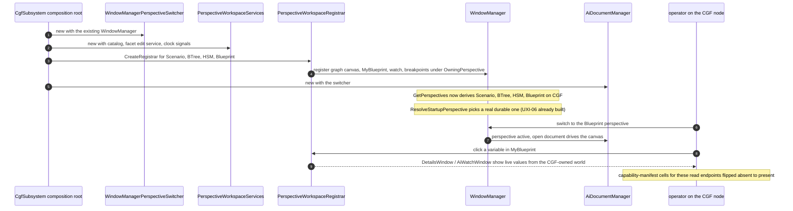

<!--STATUS
state: LIVE
build-state: READY-TO-BUILD — carries classDiagram + sequenceDiagram (§3/§4). First slice of the
  cgf==editor programme: CGF constructs the AiShared shell and registers the asset-perspective windows,
  delivering the VIEWING/DIAGNOSTICS chain (watch -> MyBlueprint -> asset graphs) on CGF.
updated: 2026-08-25
current-answer: the whole file.
design-basis: PROGRAMME_Unification_And_Harness.md (charter; editor = one-node cluster; Step 4) ·
  PROGRAMME_Cgf_Equals_Editor_Gap_Map.md §0.5 (pure-sharing framing: this slice has NO open design) ·
  UX/UX_Feature_Cgf_Brain_Diagnostics.md §5b (the verified construct diff, UXI-37) ·
  DESIGN_Perspective_Unification.md Part B (CreateRegistrar is the reuse vehicle; A0/A1 default fix BUILT) ·
  Architect_Question_54 (capability manifest — flip a cell absent->present) ·
  DESIGN_Regression_Net.md (the net every port runs against).
known-conflict: none. This slice CONSUMES Hrot.Editor.AiShared; it must NOT modify it (SHARED_SURFACES:
  "place, do not touch"). Any needed AiShared change is a coordination point with the variable-model lane.
-->
# DESIGN — **cgf==editor slice 1: CGF adopts the AiShared shell** *(viewing / diagnostics)*

> 🎯 Deliver the **watch → MyBlueprint → asset-graph** chain on CGF by having `CgfSubsystem` **construct the
> same AiShared shell the editor already builds** and **register the same windows** under the asset
> perspectives. ⛔ **No new capability** — the charter's *"editor is a one-node cluster"* made literal:
> CGF calls the existing registrar; it does not reimplement anything.

## 1. ⭐ SCOPE

| ✅ IN this slice | ⛔ NOT this slice |
|---|---|
| CGF constructs `IPerspectiveSwitcher` + `AssetCatalog` + `PerspectiveWorkspaceServices` + `CreateRegistrar`×(asset perspectives) + `AiDocumentManager`, **mirroring `EditorSubsystem`** | ⛔ **Asset EDITING / hot-reload writes** on CGF *(later slice — wire `QuickReloadService`; gap map §0.5)* |
| Register the windows: **graph canvas · MyBlueprint · watch · breakpoints · inspector** under the asset perspectives | ⛔ **Map / entity interaction parity** *(Axis B — UXI-11/23/10/29/30)* |
| Flip the capability-manifest cells absent→present for the registered read/diagnostics endpoints | ⛔ **New authoring features** *(AQ25-A/B/C/E — postponable)* · the shared R-52 blackboard-write bug |
| Prove editor-vs-cluster **SAME** for these panels via the net + conformance harness | ⛔ Modifying anything **inside** `Hrot.Editor.AiShared` |

⭐⭐ **Why this is the first slice:** it is the user's own chain, it is **pure wiring** *(gap map §0.5 — no
open design)*, and Blueprint's assembly wall is already down *(`Hrot.CGF` → `Hrot.Blueprints.Editor` →
`Hrot.Editor.AiShared`)*.

## 2. ⭐⭐ INVENTORY — measured `2026-08-25` *(seam law: the shell EXISTS; this is adoption)*

```
grep EditorSubsystem.cs : the construct sites          · search_graph PerspectiveWorkspace* / Ai*Window
sed PerspectiveWorkspaceServices.CreateRegistrar       · read LocalWindowController.ResolveStartupPerspective
```

**The editor's construct sites CGF must mirror** *(`EditorSubsystem.cs`, verified)*:

| service (home: `Hrot.Editor.AiShared`) | editor site | on CGF today |
|---|---|---|
| `WindowManagerPerspectiveSwitcher : IPerspectiveSwitcher` | `:2545` | ❌ construct |
| `AssetCatalog` | `:2561` | ❌ construct |
| `PerspectiveWorkspaceServices` *(centralises facetEditService + clock signals + all the shared deps)* | `:2719` | ❌ construct |
| `PerspectiveWorkspaceServices.CreateRegistrar(perspectiveName, selectionStore, validators, liveValueProvider?, hostKind?, writeLive?)` ×(asset perspectives) | `:2788/2796/2848` | ❌ call |
| `AiDocumentManager(IPerspectiveSwitcher)` *(the graph canvas's whole dependency)* | `:2948` | ❌ construct |

**What CGF ALREADY has** *(so this slice does NOT rebuild it)*: `WindowManager` `:665` · `IWindowRegistrar`
impl · `ComponentEditServiceBuilder().Build()` `:554` · `DataBreakpointManager` + `DataBreakpointSystem` +
`DebugSnapshotProvider` `:555-568` · `BehaviorDiagnosticsModule` `:326` · `BehaviorTraceLog` `:286` ·
blackboard renderers `:277-318`. **Every window asked for EXISTS** in AiShared: `AiGraphCanvasWindow`,
`AiMyBlueprintWindow`, `AiWatchWindow`, `AiBreakpointsWindow`, `InspectorWindow`, `DetailsWindow`.

**Already handled (NOT a prerequisite):** ✅ **UXI-06 default-perspective fix is BUILT** —
`LocalWindowController.ResolveStartupPerspective` derives the default from `WindowManager.GetPerspectives()`
and excludes document-driven perspectives. ⇒ once CGF registers the windows, the asset perspectives appear
in the derived list automatically and the app opens on a real one.

**Per-perspective honesty** *(from the `CreateRegistrar` signature)*: `liveValueProvider`/`writeLive`/
`hostKind` are **genuinely per-perspective** — only Blueprint has a live write path (`IBlueprintDebugSession`);
BTree/HSM pass **null**, and that is the honest answer, not a gap. ⚠ For this READ/diagnostics slice, even
Blueprint's **write** path is out of scope *(charter D3: the lifted API accepts absent capabilities)* —
pass the honest null and flip only the read/diagnostics manifest cells.

## 3. ⭐⭐⭐ CLASS DIAGRAM *(existing classes drawn as existing — the only new thing is a CGF composition block)*

```mermaid
classDiagram
    direction LR
    class CgfSubsystem {
        <<exists · Hrot.CGF · GAINS a composition block mirroring EditorSubsystem>>
        +BuildAiShell()
    }
    class EditorSubsystem {
        <<exists · the reference to mirror · same calls at 2545-2948>>
    }
    class IPerspectiveSwitcher {
        <<exists · AiShared · GetPerspectives / CurrentPerspective / SwitchPerspective>>
    }
    class WindowManagerPerspectiveSwitcher {
        <<exists · AiShared · wraps WindowManager>>
    }
    class PerspectiveWorkspaceServices {
        <<exists · AiShared · centralises the shared deps>>
        +CreateRegistrar(name, store, validators, liveValueProvider, hostKind, writeLive) PerspectiveWorkspaceRegistrar
    }
    class PerspectiveWorkspaceRegistrar {
        <<exists · AiShared · in-degree 33 · binds windows to OwningPerspective>>
    }
    class AiDocumentManager {
        <<exists · AiShared · needs only IPerspectiveSwitcher>>
    }
    class AssetCatalog {
        <<exists · AiShared>>
    }
    class WindowManager {
        <<exists · CGF already builds it · GetPerspectives derives from registered windows>>
    }
    class AiSharedWindows {
        <<exists · AiShared · GraphCanvas · MyBlueprint · Watch · Breakpoints · Inspector>>
    }
    CgfSubsystem ..> EditorSubsystem : mirrors the calls
    CgfSubsystem ..> WindowManagerPerspectiveSwitcher : constructs with its WindowManager
    CgfSubsystem ..> AssetCatalog : constructs
    CgfSubsystem ..> PerspectiveWorkspaceServices : constructs
    CgfSubsystem ..> AiDocumentManager : constructs with the switcher
    WindowManagerPerspectiveSwitcher ..|> IPerspectiveSwitcher
    AiDocumentManager ..> IPerspectiveSwitcher : uses
    PerspectiveWorkspaceServices ..> PerspectiveWorkspaceRegistrar : CreateRegistrar per asset perspective
    PerspectiveWorkspaceRegistrar ..> AiSharedWindows : registers under OwningPerspective
    PerspectiveWorkspaceRegistrar ..> WindowManager : registers into
    note for CgfSubsystem "the ENTIRE slice is this composition block; no AiShared type is modified"
```



## 4. ⭐⭐⭐ SEQUENCE DIAGRAM *(CGF startup → the chain works)*



## 5. ⭐⭐ THE ITEMS

| # | task | the one thing not to get wrong |
|---|---|---|
| ⭐ **①** | **Construct the shell in `CgfSubsystem`**, mirroring `EditorSubsystem` `:2545-2948`: switcher · `AssetCatalog` · `PerspectiveWorkspaceServices` · `AiDocumentManager` | ⛔ **Do not modify AiShared** — construct only. ⚠ `PerspectiveWorkspaceServices` requires `facetEditService` + both clock signals *(`isSimUp`/`isFrozen`)*; supply CGF's real ones, ⛔ never a silent default *(the SILENT-DEFAULT rule)* |
| ⭐ **②** | **`CreateRegistrar` per asset perspective** and register the windows *(graph canvas · MyBlueprint · watch · breakpoints · inspector)* under `OwningPerspective` | ⭐ perspectives are **emergent** from registration — no perspective list to declare. Pass **null** `liveValueProvider`/`writeLive` for BTree/HSM *(honest, per the signature)* |
| ⭐ **③** | **Flip the capability-manifest cells** absent→present for the registered read/diagnostics endpoints; update the `known-absent` baseline | ⛔ read/diagnostics only — leave write/edit cells absent *(D3)*; the flip is a reviewed one-line-per-cell diff *(AQ54)* |
| ⚠ **④** | **The Scenario perspective on CGF** — per `DESIGN_Perspective_Unification.md` D1/D2, CGF presents the four asset perspectives *(Scenario/BTree/HSM/Blueprint)*; confirm `perspectiveMap` maps `Scenario → CGF` | ⛔ don't add a `CGF` perspective — D1 ruled the asset perspectives instead |

## 5b. ⭐⭐⭐ HEADLESS TEST METHOD — **capture editor goldens FIRST, then diff CGF via MCP** *(user, `2026-08-25`)*

⭐⭐ **Yes — this slice is provable headlessly over MCP, and the mechanism already exists on both hosts.**

| fact — measured `2026-08-25` | consequence |
|---|---|
| ⭐⭐⭐ **The windows are ALREADY `PanelSnapshot`-instrumented IN AiShared** — `AiMyBlueprintWindow` (`DeclareInstrumented`+`Register`), `AiGraphCanvasWindow`, `AiWatchWindow`, `AiBreakpointsWindow`, `DetailsWindow` | ⇒ **the instrumentation TRAVELS WITH the shared window.** The moment CGF constructs+registers them (§5), they publish on CGF **for free** — no extra test wiring |
| ⭐⭐ **`GET /panels`** *(Group T / MX9, `DebugApiService.Panels.cs`)* reads `PanelSnapshot` over HTTP | ⇒ **the panel MODEL is machine-readable over MCP** — *"live dump here, reviewed expectation there"* (`CapabilityManifest.cs:33`). `/panels` is in the manifest |
| ⭐⭐ **Conformance = same binary, two `--mode`s, diff by `PanelKind`** *(`DESIGN_Headless_Testability.md` §Conformance; three-way SAME / DIFFERENT / NOT-PRESENT)* | ⇒ editor-mode **vs** `--mode all` (CGF) diffed **by `PanelKind`**, `panelId` ignored in the diff *(kept only as the golden storage key)* |
| ⚠ **It is MODEL-level, not pixels** — the panel view-model, not a screenshot | ⇒ *"looks the same"* headlessly = **the panel's DATA MODEL matches**; the gizmo frame is diffed the same way. ⛔ no pixel diff at the machine layer |

⭐⭐⭐ **The workflow you described is exactly charter jobs ①→④:**
1. ⭐ **Capture editor goldens NOW** for the asset panels *(MyBlueprint · graph canvas · watch)* per `PanelKind` — job ① *"the reference behaviour, before anything moves"*. ⭐ Available today because the windows are already instrumented in the editor.
2. Build slice 1 *(§5)*.
3. ⭐⭐ **Run the conformance suite** *(editor-mode vs `--mode all`)* — job ④ *"once the same feature is in CGF, check it looks the same as in the editor"* ⇒ **`SAME` per `PanelKind`** is the acceptance verdict.
4. ⭐ **The editor goldens also guard the editor** during the wiring — job ③ *"check this does not change as we refactor"*.

⚠ **The one dependency:** this rides on the **conformance suite (steps 6+7 of `DESIGN_Headless_Testability.md`** — the MCP-drivable cluster host + the editor-vs-cluster diff). Confirm it is landed before dispatch; the ack-gate + cluster-load prerequisites *(HN-028/HN-029)* already are.

## 6. GATES *(the net every port runs against — DESIGN_Regression_Net.md + charter §2)*

⭐ Standing contract *(rule 8)* + the build/test rules *(`.claude/CLAUDE.md` THREE TEST TIERS: affected-project
builds; T3 E2E async)*. ⭐⭐ **Row 8 — the rails that prove this slice:**
- ✅ **the headline (net):** the **paired golden + assertions per `PanelKind`** for the CGF asset perspectives — graph canvas, MyBlueprint, watch — asserted **SAME** as the editor's via the **conformance harness** *(editor-vs-cluster; `DESIGN_Headless_Testability.md`)*. ⛔ This is the acceptance criterion: *the same panels, same content, on CGF.*
- a rail asserting `WindowManager.GetPerspectives()` on `--mode all` **includes** the CGF asset perspectives *(shown RED by reverting the registration)*.
- a rail asserting the flipped **capability-manifest** cells report present on CGF and the `known-absent` baseline shrank by exactly those cells.
- ⛔⛔ **cross-cutting ⇒ name the integration suite** *(rule 8 row 8)*: the `--mode all` conformance/`ClusterRunner.Integration` suite that proves the CGF windows render against the cluster world — run filtered if flaky, or state with base-sha evidence why it cannot gate.

## 7. ⚠ RISKS / COORDINATION

| | |
|---|---|
| ⭐ **`Hrot.Editor.AiShared` is CONSUMED, not modified** | if a construct needs an AiShared change *(e.g. a ctor overload)*, that is a **coordination point with the variable-model lane** *(the freeze owner)* — STOP and report, do not edit AiShared |
| ⚠ **`PerspectiveWorkspaceServices` dependency set** | it centralises many deps *(§2)*; some may not yet exist on CGF's composition root. Where one is genuinely absent, pass the honest null the signature allows and **flip the manifest cell absent** — ⛔ never a silent default |
| ✅ **process exclusivity helps** | editor and CGF **never share a process** *(the runner throws)* ⇒ CGF may reuse the editor's window ids verbatim; no id-collision design needed |
| ⭐ **lane** | this is `CgfSubsystem` wiring + AiShared consumption ⇒ a **CGF/backend lane** slice; the handoff picks it. ⛔ Not the variable-model lane's work *(it owns AiShared internals, which this must not touch)* |

## 8. ⭐ WHEN DONE
⭐⭐ Fold the as-built into this file *(the construct block as built, any per-perspective null decisions, the
manifest cells flipped)* and update the gap map §2 Axis-A rows from 🔌 to ✅ for the windows landed. ⭐ State
the ids allocated; ⛔ the report points here, it does not restate the design.
