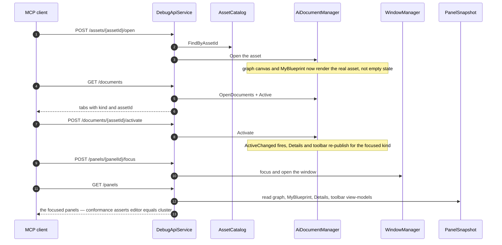

<!--STATUS
state: LIVE
build-state: BUILT (2026-08-25, backend/CGF lane, ids CE-012..CE-018). Carries classDiagram +
  sequenceDiagram (§4/§5). Slice 2 of cgf==editor (CE-009): CGF POPULATES its AssetCatalog and gains the
  MCP surface to OPEN an asset, LIST/SWITCH graph tabs, FOCUS a window, and READ the focus→Details/toolbar
  consequence — turning slice 1's empty shell into a populated, drivable, observable one.
updated: 2026-08-25
current-answer: §4/§5 (the diagrams, TRUE as built) + §11 (AS-BUILT — what landed, the two findings that
  changed the shape, and the four deviations). Read §11 before quoting §2's inventory row about the
  toolbar or §6's item ⑤ home for it.
known-rot: §2's inventory says the main toolbar is "NOT instrumented" and lists only "breakpoint-panel
  mirrors". PARTLY WRONG, measured while building: `editor-toolbar` (EditorToolbarWindow, the editor's
  TOOL PALETTE) was already a published PanelKind. The row is right about the MAIN toolbar
  (MainToolbarManager), which published nothing — see §11.4. Two different surfaces; do not conflate.
  §4/§6 place the new ToolbarPanelViewModel in AiShared; it was built in Fdp.Presentation beside its
  manager instead (§11.4).
design-basis: DESIGN_Cgf_Editor_Sharing_Slice1_Shell_Adoption.md §9 (the shell is built; §6's open rows
  CE-009/010/011 all root in "CGF cannot open an asset") · PROGRAMME_Unification_And_Harness.md (charter) ·
  Architect_Question_54 + R-133 (manifest is MEASURED; new routes carry a RouteDoc) ·
  MCP_Integration.md / HN-030 (routes self-document; SKILL.md is generated) · DESIGN_Regression_Net.md +
  DESIGN_Headless_Testability.md (conformance by PanelKind).
known-conflict: none. CONSUMES Hrot.Editor.AiShared; must NOT modify it (freeze owner = variable-model lane).
-->
# DESIGN — **cgf==editor slice 2 (CE-009): CGF opens an asset + the MCP drive/observe surface**

> 🎯 Slice 1 built the shell but the windows show their EMPTY state — **CGF cannot open an asset**
> *(empty `AssetCatalog`; no MCP route opens an AI asset)*. This slice **populates the catalog** and adds the
> **MCP surface to open an asset, switch graph tabs, focus a window, and read what the focus shows** — so a
> populated blueprint/BTree/HSM graph is visible on CGF and provable headlessly.

## 1. ⭐ SCOPE

| ✅ IN | ⛔ NOT (recorded below) |
|---|---|
| **Populate CGF's `AssetCatalog`** via an `AiAssetCatalogBuilder` with the cluster-appropriate contributors *(index the BTree/HSM/Blueprint assets)* | ⛔ **Asset EDITING / hot-reload writes** *(CE-011; needs the reload pipeline — §7)* |
| **MCP: discover + open an AI asset** — `GET /assets` · `POST /assets/{assetId}/open` *(Guid)* · `POST /assets/open {path}` *(relative folder path, §3a; MX-013)* | ⛔ **Live variable-VALUE write** *(R-52; variable-model lane)* |
| **MCP: list + switch graph tabs** — `GET /documents`, `POST /documents/{assetId}/activate` *(the tab model already exists — §3)* | ⛔ **Map / entity parity** *(Axis B)* |
| **MCP: focus a concrete window/panel** — `POST /panels/{panelId}/focus` | ⛔ **MCP AUTHORING** *(create assets, add/wire nodes — §8 FUTURE, recorded)* |
| **Instrument the main TOOLBAR as a readable `PanelKind`** so focus→toolbar is observable | |
| **Prove SAME on a POPULATED asset**: open X, activate its tab, read graph + MyBlueprint + Details + toolbar, assert editor==cluster | |

## 2. ⭐⭐ INVENTORY — measured `2026-08-25`

| exists? | thing | where | note |
|---|---|:--:|---|
| ✅ | `AiAssetCatalogBuilder` *(contributors → catalog, `RefreshFromAssembly`)* | `EditorSubsystem.cs:1053` | ⭐ editor builds it; **CGF constructs a bare `new AssetCatalog()`** *(`:2571` fallback)* ⇒ empty |
| ✅ | `AssetCatalog.FindByAssetId(Guid) : IEditableAsset?` | `AiShared/Catalog/AssetCatalog.cs:20` | the open lookup |
| ✅✅ | **the TAB model** — `AiDocumentManager.Open(IEditableAsset)` · `Activate(doc)` · `OpenDocuments` · `Active` · `ActiveChanged` | `AiShared/Documents/AiDocumentManager.cs:74-228` | ⭐⭐ **already exists** — slice 1 constructed it; ⛔ **no MCP route drives it** |
| ✅ | MCP today: `GET /panels` · `GET /panels/{id}` · `GET /perspectives` · `POST /perspective` · `POST /entities/{netId}/focus` | `DebugApi/*` | ⛔ **no open-asset, no list/switch-documents, no window-focus route** |
| 🔴 | the **main toolbar** as a `PanelKind` | — | ⛔ **NOT instrumented** — only breakpoint-panel mirrors exist. ⇒ MCP cannot read which buttons a focus shows |
| ✅ | `RouteDoc` / `DebugApiRouteDocs` | `DebugApi/DebugApiRouteDocs.cs` | ⭐ **every new route carries one** ⇒ manifest + SKILL.md auto-generate *(HN-030, R-133)* |

⇒ ⭐⭐ **The tab machinery and the catalog machinery both EXIST** — this slice **populates** the catalog on
CGF and **exposes** the open/switch/focus operations over MCP; the only genuinely new UI code is the toolbar
`PanelKind`.

## 3. ⭐⭐ WHY THE MCP DRIVE/OBSERVE SURFACE IS IN THIS SLICE *(user, `2026-08-25`)*

⛔ You cannot **verify** a populated asset on CGF headlessly without being able to **open** it, **focus** the
window, **switch to the right graph tab**, and **read the resulting panels**. And ⭐ different graph kinds
legitimately drive **different Details content and different toolbar buttons** — so the focus→consequence
must be observable now, even if the consequences are small today. ⇒ open · list/switch tabs · focus ·
read-toolbar are **part of this slice**, not a later nicety.

## 3a. ⭐⭐⭐ ASSET ADDRESSING & FOLDERS *(user, `2026-08-25`)*

📐 **Measured identity model** *(`IEditableAsset`)*: `Guid AssetId` *(the catalog key — `AssetCatalog._byId`
is `Dictionary<Guid,…>`)* · `string Name` · `AssetKind Kind` · **`string SourceFilePath`** · `IsDirty`.

| the concern | ⭐ the resolution |
|---|---|
| ⚠ *"isn't the id a file path, unsafe in a URL?"* | ⛔ **No — the id is a `Guid`** ⇒ `POST /assets/{assetId}/open` **is** URL-safe as written. But a Guid is **not discoverable or memorable**, which is the real problem |
| ⭐⭐ **assets MUST organize into SUBFOLDERS** *(`blueprint/subfolder/blueprint1.bp.json`)* | ⭐ that structure already lives in **`SourceFilePath`**. ⛔ **The catalog contributor MUST index RECURSIVELY** across subfolders *(not one flat folder)*, and `SourceFilePath` preserves the **relative folder path** |
| ⭐ **address by the human PATH, not just the Guid** | ⛔ a raw path in a URL SEGMENT is unsafe *(slashes/dots)* ⇒ ⭐⭐ **two safe forms:** ① `GET /assets` **discovery** returns every asset's `{assetId, name, kind, sourceFilePath}` so a client resolves path→Guid itself; ② `POST /assets/open { path: "blueprint/subfolder/blueprint1.bp.json" }` — the path travels in the **BODY** *(no URL-encoding)*, resolved via a new `AssetCatalog.FindBySourceFilePath`. Open-by-Guid stays the URL-segment form |
| ⚠ `FindByName` is ambiguous across subfolders | ⛔ two folders may hold `blueprint1.bp.json` ⇒ **`Name` cannot be the address; the relative `SourceFilePath` is the human key**, the `Guid` is the stable one |

⇒ ⭐⭐ **Three ways in, all safe:** the `Guid` *(stable, URL-segment)* · the relative `SourceFilePath`
*(human, in the body)* · discovery via `GET /assets`. ⭐ The `RouteDoc`s document all three.

## 4. ⭐⭐⭐ CLASS DIAGRAM

## 5. ⭐⭐⭐ SEQUENCE DIAGRAM

## 6. ⭐⭐ THE ITEMS
| # | task | the one thing not to get wrong |
|---|---|---|
| ⭐ **①** | **Populate the catalog** — construct `AiAssetCatalogBuilder` on CGF with the cluster-appropriate contributors; replace the bare `new AssetCatalog()`. ⭐⭐ **Index RECURSIVELY across subfolders** *(§3a)*; `SourceFilePath` preserves the relative folder path | ⛔ index only what CGF legitimately hosts; ⛔ **not a single flat folder** — subfolders are required; ⚠ asset-root resolution on a DEPLOYED node is ruling 67 — report if it bites, do not silent-fail |
| ⭐ **②** | **Open + discover** *(§3a)*: `GET /assets` *(list `{assetId, name, kind, sourceFilePath}`)* · `POST /assets/{assetId}/open` *(Guid, URL-safe)* · `POST /assets/open {path}` *(relative path in the BODY → new `AssetCatalog.FindBySourceFilePath`)* → `AiDocumentManager.Open` | ⭐ each carries a `RouteDoc`; ⛔ a bad/absent id or path returns a typed hint, not a 500; ⛔ **never put a raw path in a URL segment** |
| ⭐ **③** | **`GET /documents` + `POST /documents/{assetId}/activate`** over `OpenDocuments`/`Active`/`Activate` | ⭐ the model EXISTS — expose it, ⛔ don't reimplement tabs |
| ⭐ **④** | **`POST /panels/{panelId}/focus`** → WindowManager focus/open | ⭐ RouteDoc; make it a no-op-safe on an unknown panel with a hint |
| ⭐ **⑤** | **Instrument the main toolbar as a `PanelKind`** *(a `ToolbarPanelViewModel` registered to `PanelSnapshot`)* | ⭐⭐ this is the observability the user asked for — buttons readable per focus; ⛔ don't gate, just publish what is there |
| ⭐ **⑥** | **Conformance: a POPULATED-asset case** — open X of kind K, activate, read graph + MyBlueprint + Details + toolbar, assert **SAME** editor-vs-`--mode all` | ⚠ still model-level; ⛔ compare to the EDITOR golden, not host-to-host only *(slice 1 §3's caution — both regress identically otherwise)* |

## 7. ⚠ REMINDER FOR ALL LATER FEATURE SLICES — **the main toolbar is a first-class surface** *(user, `2026-08-25`)*
⛔⛔ **When a later slice adds a feature CONTROLLED FROM THE TOOLBAR** *(hot reload, save, run/stop, …)*, its
**toolbar button must be wired AND instrumented on CGF too** — not just the underlying command. 📌 This slice
makes the toolbar a readable `PanelKind` precisely so that *"the button exists on CGF"* is assertable when
those features land. ⭐ Every feature slice's acceptance must include *"its toolbar affordance is present and
SAME on CGF."*

## 8. ⛔ FUTURE — **recorded, NOT this slice** *(user, `2026-08-25`)*
🔮 **MCP AUTHORING — the API gains the ability to AUTHOR, not just observe:** create a new asset, and
**add/connect wiring nodes to a graph** over MCP *(and by extension edit params, delete, save)*. ⭐ This is a
large future capability — it turns MCP from a read/drive surface into an authoring surface, and it will need
its own design *(and it interacts with the editing/write-path work — hot reload, R-52, ruling 67)*. ⛔ **Do
NOT build it here.** 📌 Filed so it is not forgotten; tackle when the read/drive surface and editing slices
have settled. *(Recorded as `CE-FUTURE-authoring`; also noted in the gap map.)*

## 9. GATES *(rule 8 + the build/test rules)*
⭐ Standing contract; affected-project builds *(`Hrot.CGF` + `Hrot.Editor` DebugApi + the SystemTests)*;
T3 async. ⭐⭐ **Row 8 — the rails:**
- ✅ **the headline:** a conformance case that OPENS a real asset on `--mode all`, activates its tab, and
  asserts graph + MyBlueprint + Details are **SAME as the editor** *(not empty state)* — shown RED by
  reverting the catalog population.
- a rail: `GET /documents` lists the opened tab; `POST /documents/{id}/activate` changes `Active`.
- a rail: the toolbar `PanelKind` publishes and is readable via `GET /panels`, SAME on both hosts.
- a rail: `gen:catalog:check` / `gen:skill:check` stay green — the new routes' `RouteDoc`s regenerate the
  catalog + SKILL.md *(HN-030)*.
- ⛔⛔ name + run the **conformance suite** *(`ClusterConformanceRails`)* as the integration gate.

## 10. ⭐ WHEN DONE
Fold the as-built into this file *(the catalog contributors chosen · the routes as built · the toolbar
`PanelKind` · the populated-asset conformance case)*; flip the gap-map Axis-A rows from "empty shell" to
"populated"; close `CE-009` and note whether `CE-011` (reload) is now reachable. State the `CE-` ids;
the report points here.

## 11. ⭐⭐⭐ AS-BUILT *(`2026-08-25`, backend/CGF lane — obligation ⑤)*

### 11.0 ⭐ Obligation ③ — **the diagrams vs what was built**

> §4 carries **8 classes**, §5 carries **1 sequence**. ⭐ **The build MATCHES the sequence exactly** —
> `open → FindByAssetId → Open → GET /documents → activate → focus → read` is the order the rails drive.
> ⚠ **The class diagram deviates in ONE box** *(the toolbar's home, §11.4)* and is **MISSING TWO** that
> measurement forced in *(§11.3)*.

| §4 box | as built |
|---|---|
| `CgfSubsystem.BuildAssetCatalog` | ✅ as drawn |
| `AiAssetCatalogBuilder` → `AssetCatalog` | ✅ as drawn — ⚠ needed **two new project references** *(`CE-012`)* |
| `AssetCatalog.FindBySourceFilePath` | ✅ + a `FindAllBySourceFilePath` the diagram does not show *(ambiguity reporting — §11.2)* |
| `AiDocumentManager` *(no code change)* | ✅ unchanged, as promised |
| `DebugApiService` + the six routes | ✅ all six, each with a `RouteDoc` |
| `ToolbarPanelViewModel` **· AiShared** | ⚠ **built in `Fdp.Presentation`** as `MainToolbarPanelViewModel` — §11.4 |
| — | 🔴 **`BlueprintDocumentFactory` / `BTreeDocumentFactory` / `HsmDocumentFactory`** — §11.3 |
| — | 🔴 **the `ActiveChanged` retarget** — §11.3 |

### 11.1 ⭐ What landed

📐 **Measured over MCP:** the editor indexes **73** assets, `--mode all` indexes **72**.
`CgfSubsystem.BuildAssetCatalog` mirrors `EditorSubsystem` `:986-1061` including the **dual-load**
strategy *(`PU-301` `D4` — assembly contributors first, JSON after, so JSON wins an `AssetId`
collision)*. ⭐ **Recursion needed no work**: all three file contributors already enumerate with
`RecurseSubdirectories = true`, so §3a's *"index across SUBFOLDERS"* holds by construction.

⭐ **Six routes, `gen:catalog` 66 → 72 tools**, each carrying its `RouteDoc` ⇒ `tool-catalog.mjs` and
`SKILL.md` regenerate from them *(`HN-030`, `R-133`)*. Both `/assets` and `/documents` are classified
`editor.authoring` in the manifest — ⚠ **not** `world.read`: they act on the AUTHORING shell, and that
distinction is what lets a node honestly report *"I read the world but host no authoring shell"*.

### 11.2 ⭐ §3a as built — **three addresses, and an ambiguity that is REPORTED**

The `Guid` in a URL segment · the relative `SourceFilePath` in the **body** · discovery via `GET /assets`.
⭐ Matching is a **suffix at a segment boundary**, so `sub/x.bp.json` resolves while `my_x.bp.json` never
matches a query for `x.bp.json`. ⛔ **An ambiguous suffix is a 400 that LISTS the candidates** — ⚠ the
design said *"resolved via `FindBySourceFilePath`"* and did not say what two matches should do; picking
the first would be the silent wrong-asset bug the whole addressing section exists to avoid.

### 11.3 🔴🔴 THE TWO FINDINGS — **"the asset opens" is NOT "the asset is usable"**

📐 **Measured in two rounds, each time by the headline rail rather than by reasoning.**

| round | what the cluster showed | cause | fix |
|---|---|---|---|
| **①** | `graph-canvas` **`hasActiveDocument: true`** — and `my-blueprint` *"No blueprint open."*, `details` *"No document is open."*, breadcrumb stopping at `ComponentCollectionDemo · Instance` where the editor showed `… > Tick (Function)` | ⛔ **`AiDocument.ViewState` is filled by a DOCUMENT FACTORY subscribed to `DocumentOpened`, and CGF had none** ⇒ the document existed carrying no view state | the same three factories the editor wires *(`EditorSubsystem:3916`)*, minus the debug sessions CGF has none of |
| **②** | canvas now byte-identical — `my-blueprint` and `details` **still** empty | ⛔⛔ **those two do not read the document manager.** `DetailsContextBuilder.Build` reads the perspective's `EditorSelectionStore.ActiveAsset`, and the outline holds a **retargeted** model — both PUSHED by an `ActiveChanged` handler *(`EditorSubsystem:3012`)* CGF lacked | the editor's handler, trimmed to what this host has |

⇒ ⭐⭐⭐ **The lesson worth keeping: an "open" that leaves the view state null is INDISTINGUISHABLE from a
working open at the canvas level.** ⚠ Only the panels that read THROUGH the context show the difference —
which is exactly why the acceptance rail compares *content*, and why §1's *"prove SAME on a POPULATED
asset"* was the right criterion rather than *"the open route returns 200"*.

### 11.4 ⚠ Deviation — **the toolbar model lives in `Fdp.Presentation`, and its publish is OUTSIDE the draw**

⭐ §4/§6 place a `ToolbarPanelViewModel` in **AiShared**. 📐 Built as **`MainToolbarPanelViewModel`** in
`Fdp.Presentation`, beside `MainToolbarManager`: the main toolbar is the **SHELL's**, not an AI-shared
concept, and beside its manager **every host publishes it for free** *(⛔ an AiShared home would have
needed each host to wire it)*.

🔴🔴 **And the publish is deliberately outside `WindowManager`'s `if (_mainToolbar.Height > 0f)` guard.**
📐 Measured: **`EditorSubsystem` is the ONLY production caller of `RegisterEntry`/`RegisterSeparator`**,
so a cluster host holds zero items, `Height` is `0`, and the toolbar never renders. ⇒ publishing from
inside the draw would make *"this host offers no toolbar entries"* **indistinguishable from** *"nobody
instrumented the toolbar"* — ⛔ and telling those two apart is the whole point of §7.

⚠ **It bends `IPanelViewModel`'s usual invariant** *("the draw renders only from this")*, and that is
stated at the method: the entries render through opaque host `Action` delegates, so this model never
described pixels — it describes the **registered item set and its visibility**, which is well-defined
whether or not a frame drew it.

⇒ ⭐ **CGF's toolbar is legitimately EMPTY**, declared in `DivergesByDesign` with that reason and
asserted `== 0`, so the first slice that ports a toolbar-controlled feature REDDENS the rail and is
pointed at §7. 📌 That is `CE-016`, and it is a FEATURE gap, ⛔ not an instrumentation one.

### 11.5 ⭐ What the acceptance rail asserts — and what it deliberately does not

| kind | verdict |
|---|---|
| `graph-canvas` · `my-blueprint` | ✅ **SAME, whole model, no exemption** — the content this slice delivers |
| `details` | ⚠ **asserted to be ABOUT THE OPENED ASSET on both hosts** *(same `assetId`, a real `assetName`, no empty state)* — ⛔ its whole-model verdict stays under the DECLARED divergence, whose reason is now **two measured causes**: `$.mode` Paused vs Running *(`CE-003`, pre-dates this slice)* and `$.offeredViewIds` 3 vs 1 *(`details.runtime.Blueprint` needs an `IBlueprintDebugSession`; `CE-004`)* |

⛔⛔ **Neither half is a narrowing.** ⭐ The `details` claim asserted here is strictly STRONGER than
anything that existed before — 📌 before this batch the cluster's Details read `assetId: null` and
*"No document is open."*, and this line is what catches that regression returning.

### 11.6 ⚠ OPEN — **the AiShared additions have NOT been nodded**

⭐ Three purely additive members landed in `Hrot.Editor.AiShared` *(`AssetCatalog.FindBySourceFilePath` ·
`FindAllBySourceFilePath` · `AssetRoots.ResolveProjectDir`)*. ⛔ No existing member changed and
`Hrot.Editor.AiShared.Tests` is unchanged at **2016/0** — ⚠ **but the handoff §4 asks for the
variable-model lane's nod before landing, and it has not been obtained.** 📌 Recorded as `CE-017` and
raised in the report rather than assumed.

### 11.7 ⭐ `CE-011` — **the reload pipeline is now REACHABLE**

⭐ Slice 1 reported `QuickReloadService` as un-wireable because its TRIGGER *(a dirty OPEN document)*
could not exist on CGF. ⇒ ⛔ **that reason is now GONE** — CGF opens documents. ⚠ The other two
blockers stand: its asset dir is ruling 67's `.csproj` walk-up *(now at least centralised in
`AssetRoots.ResolveProjectDir`)*, and it takes a debug session CGF does not construct. ⭐ `CE-011` stays
open, with one of its three reasons struck.
