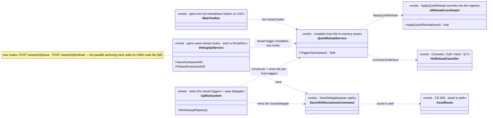
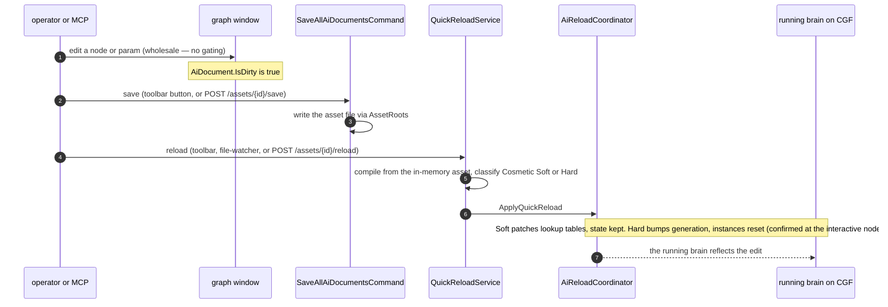

<!--STATUS
state: LIVE
build-state: READY-TO-BUILD — carries classDiagram + sequenceDiagram (§4/§5). Slice 3 of cgf==editor
  (CE-011): editing + hot reload on CGF. Take the windows' native editing WHOLESALE (per the 2026-08-25
  steer); wire the reload pipeline + save path so a saved edit hot-applies to the running brain; add a
  MINIMAL MCP save/reload trigger so it is testable headlessly.
updated: 2026-08-25
current-answer: the whole file.
design-basis: DESIGN_Cgf_Editor_Sharing_Slice2_Open_Asset.md §11 (CE-009 gave CGF OPEN documents — the
  reload trigger's missing precondition — so editing is now reachable) · STEER_Cgf_Shell_Adoption_Slice1.md
  (take editing wholesale; keep the live value-write OFF) · AI_Editor_Shared_Infrastructure.md §17
  (Cosmetic/Soft/Hard classification) · ruling 67 / AssetRoots (write roots) · ruling 53 (Hard-reload
  confirm resolves at the interactive node).
known-conflict: ⚠ SHARES the DebugApi surface with the PARALLEL MCP-authoring track (§8). Partitioned by
  route file; the coordinator serializes the generated catalog/SKILL.md. CONSUMES Hrot.Editor.AiShared;
  must NOT modify it beyond additive wiring — coordinate with the variable-model lane.
-->
# DESIGN — **cgf==editor slice 3 (CE-011): editing + hot reload on CGF**

> 🎯 CE-009 made CGF **open** assets; this makes CGF **edit** them. Take the windows' native editing
> **wholesale** *(the steer — no artificial gating)*, wire the **reload pipeline** so a saved edit
> hot-applies to the running brain, and add a **minimal MCP save/reload trigger** so it is provable
> headlessly. ⛔ Rich MCP AUTHORING *(create assets, add/wire nodes)* is the **separate parallel track** — §8.

## 1. ⭐ SCOPE
| ✅ IN | ⛔ NOT |
|---|---|
| **Take the windows' native editing wholesale** on CGF *(no gating — the steer)* | ⛔ **Rich MCP AUTHORING** *(create asset, add/wire nodes, edit params over MCP)* — §8, the parallel track |
| **Wire the reload pipeline** — `QuickReloadService` + the per-host quick-reload triggers + `ApplyQuickReload` — so a saved edit **hot-applies** *(Soft = patch, Hard = generation bump + reset, §17)* | ⛔ **Live variable-VALUE write** *(R-52 staged blackboard write — variable-model lane, a DIFFERENT path from asset save→reload)* |
| **Wire the save path** — `SaveAllAiDocumentsCommand`/`SaveDelegate` + asset→path via `AssetRoots` *(ruling 67)* | ⛔ **Map / Axis B** |
| **The main-toolbar hot-reload/save button on CGF** *(per §7 of the slice-2 design — a toolbar-controlled feature)* | ⛔ Modifying `Hrot.Editor.AiShared` internals *(additive wiring only)* |
| **A MINIMAL MCP trigger** — `POST /assets/{assetId}/save` · `POST /assets/{assetId}/reload` — so editing is testable headlessly | |
| **Hard-reload confirm routes to the interactive node** *(ruling 53 — a Hard reload on a live cluster is a confirmed cluster-wide reset)* | |

## 2. ⭐⭐ INVENTORY — measured `2026-08-25`
| exists? | thing | where | note |
|---|---|:--:|---|
| ✅ | `QuickReloadService` *(compiles from the in-memory asset)* + `_aiCoordinator.ApplyQuickReload` *(commits into the registry)* | `EditorSubsystem.cs:351,444,3242` | ⭐ editor wires per-host **triggers** `_blueprintQuickReloadTrigger`/`_btreeQuickReloadTrigger`/`_hsmQuickReloadTrigger` *(`:344-349`)*; ⛔ **null on CGF** |
| ✅ | the reload TRIGGER precondition — **a dirty OPEN document** | — | ⭐⭐ **now met** — CE-009 gave CGF open documents *(the exact thing slice-1's CE-011 note said was missing)* |
| ✅ | save — `SaveAllAiDocumentsCommand` + `SaveDelegate(asset, path)` · `AiDocument.IsDirty` · `AppExitPromptController` | `AiShared/Documents/*` | ⭐ wire the `SaveDelegate` on CGF |
| ✅ | write roots — `AssetRoots` *(Assets/ save destination · Recipes/ sources)* | `AiShared/Identity/AssetRoots.cs` | ⭐ added in CE-009; ruling 67 partly done — ⚠ confirm deployed-node resolution |
| ✅ | hot-reload classification Cosmetic/Soft/Hard | `AI_Editor_Shared_Infrastructure.md` §17 · `BTreeHotReloadManager`/`HsmHotReloadManager` | ⭐ Soft = patch *(state kept)*; Hard = generation bump *(state reset, R-24 — intended, confirmed)* |
| ✅ | MCP today: `/assets/*`, `/documents/*`, `/panels/*` *(CE-009)* | `DebugApi/DebugApiService.Assets.cs` | ⭐ **add save/reload beside them; each carries a `RouteDoc`** |

⇒ ⭐⭐ **The reload + save machinery EXISTS and is per-host-triggered; CGF just does not wire the triggers.**
This is wiring + a minimal MCP trigger, not new capability. ⚠ **The asset save→reload path is DISTINCT from
the live value-write (R-52)** — editing a param changes the ASSET FILE and hot-reloads; it does NOT go
through the staged `Blackboard1024` write. That is what keeps R-52 out of this slice.

## 3. ⭐⭐ EDITING IS WHOLESALE, BUT TWO WRITE PATHS STAY DISTINCT
| path | this slice? | why |
|---|---|---|
| ⭐ **asset/graph authoring** *(edit nodes/params → save file → hot reload)* | ✅ **wholesale** | the steer; the reload pipeline is its runtime effect |
| 🔴 **live variable-VALUE edit** *(watch/Details → staged `Blackboard1024` write)* | ⛔ **OFF** | R-52 clobber; variable-model lane's frozen path |

## 4. ⭐⭐⭐ CLASS DIAGRAM

## 5. ⭐⭐⭐ SEQUENCE DIAGRAM

## 6. ⭐⭐ THE ITEMS
| # | task | the one thing not to get wrong |
|---|---|---|
| ⭐ **①** | **Wire `QuickReloadService` + the three per-host triggers + `ApplyQuickReload`** on CGF, mirroring the editor `:344-3266` | ⛔ don't gate the window editing; ⭐ Soft keeps state, Hard resets *(intended, §17)* |
| ⭐ **②** | **Wire the `SaveDelegate`** + asset→path via `AssetRoots` | ⚠ deployed-node roots = ruling 67; report if it bites, ⛔ no silent save-to-nowhere |
| ⭐ **③** | **Hard-reload confirm at the interactive node** *(ruling 53)* — a Hard reload on a live cluster is a confirmed cluster-wide reset | ⛔ never pop a modal on a headless CGF; the confirm resolves where the operator sits |
| ⭐ **④** | **Main-toolbar hot-reload/save button on CGF**, and it publishes to the toolbar `PanelKind` *(CE-009's §7 rule)* | ⭐ assert the affordance is present + SAME on CGF |
| ⭐ **⑤** | **Minimal MCP trigger** — `POST /assets/{id}/save` · `POST /assets/{id}/reload`, each a `RouteDoc` | ⛔ **keep to save/reload — do NOT add node-authoring routes here** *(that is §8's track — collision boundary)* |

## 7. GATES
⭐ rule 8 + build/test rules. **Row 8 — the rails:**
- ✅ **the headline:** edit a param on an open asset *(Soft)* → save → reload → assert the running brain reflects it AND retains state; then a topology edit *(Hard)* → reset + confirmed. Shown RED by reverting the trigger wiring.
- a rail: `POST /assets/{id}/save` persists *(file changes)*; `POST /assets/{id}/reload` hot-applies.
- a rail: the toolbar hot-reload button publishes + is SAME on both hosts.
- a rail: **the live value-write path is still OFF** *(R-52 not reachable via this slice)*.
- ⛔⛔ conformance suite as the integration gate; `gen:catalog:check`/`gen:skill:check` green for the two new routes.

## 8. ⭐⭐⭐ THE PARALLEL MCP-AUTHORING TRACK — **planned so it does NOT collide** *(user, `2026-08-25`)*
🔮 **A SEPARATE session extends the MCP server with SCENARIO AUTHORING incl. AI-asset authoring** *(create
an asset, add/connect wiring nodes, edit params, delete — over MCP)*. 📄 Its design is
**[`Architect_Question_56_Mcp_Authoring_Surface.md`](blueprints/Architect_Question_56_Mcp_Authoring_Surface.md)**
*(to be resolved WITH the user — the discussion)*. ⭐ **The collision plan:**

| shared surface | ⭐ the rule |
|---|---|
| **DebugApi route FILES** | CE-011 owns `DebugApiService.Assets.cs` *(save/reload)*; the authoring track adds its **own** `DebugApiService.Authoring.cs`. ⛔ neither edits the other's |
| **`DebugApiHost` registration · `DebugApiRouteDocs` · `tool-catalog.mjs` · `SKILL.md` · `CapabilityManifest`** | ⚠ **shared, collision-prone** ⇒ ⭐⭐ **the coordinator SERIALIZES these** — the authoring track branches from a coordinator state that already contains CE-011, so it adds on top of CE-011's route registration rather than concurrently. ⛔ **Do NOT run both editing the generated catalog from the same base** |
| **lane** | CE-011 = CGF/backend lane; authoring = its own session on a lane that branches AFTER CE-011 merges *(or a clearly disjoint file set + coordinator-owned regen)* |

⇒ ⭐ **Sequencing recommendation:** dispatch CE-011 now; **design the authoring track (AQ56) WITH the user while CE-011 runs**; dispatch authoring from a base that includes CE-011. ⛔ CE-011 stays strictly save/reload on the MCP side so the boundary is clean.

## 9. ⭐ WHEN DONE
Fold the as-built into this file; flip the gap-map Axis-A "editing" rows; close `CE-011`; report whether the
deployed-node asset-root *(ruling 67)* bit. State the `CE-` ids; the report points here.
