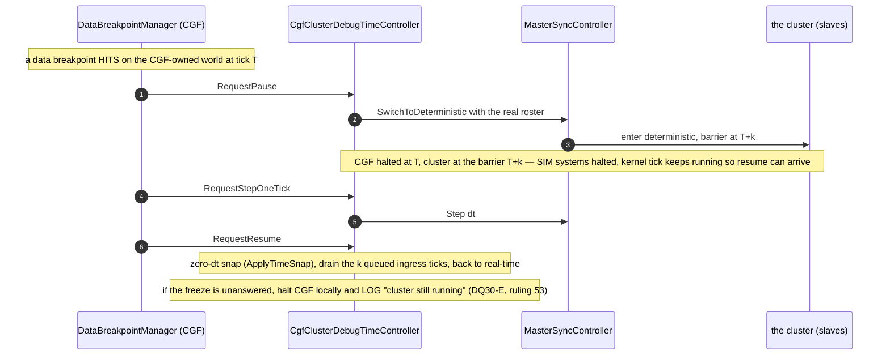
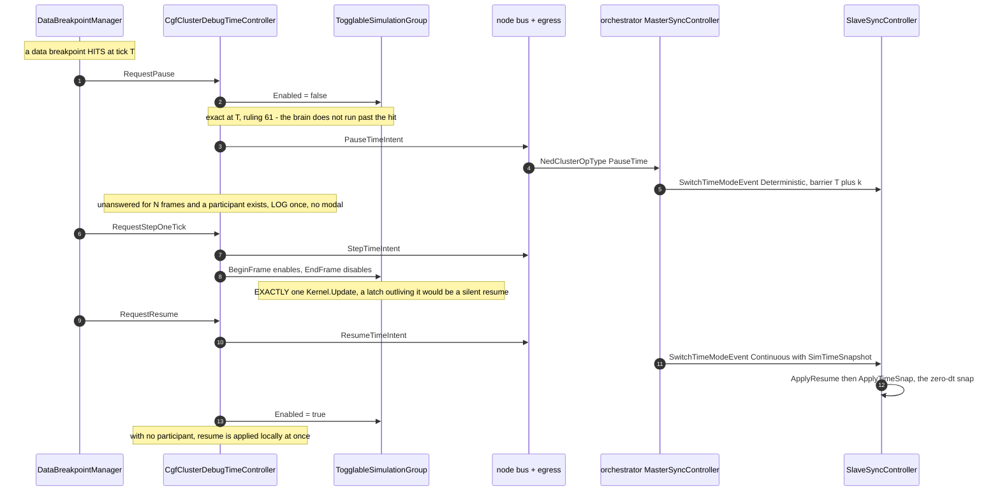

<!--STATUS
state: LIVE
build-state: BUILT `2026-08-25` (CE-025..CE-030)
updated: 2026-08-25
current-answer: ⭐⭐⭐ READ §10 "AS-BUILT" FIRST. It supersedes §4 (classDiagram) and §6 items ①/②/③
  where they disagree, and it carries the TRUE diagrams. Slice 4 of cgf==editor (the DQ30 debug
  pause/step): CgfNoOpTimeController is retired; a breakpoint hit on CGF halts the brain exactly at the
  hit tick and asks the master to freeze the cluster.
stale-below: §4's classDiagram edge `CgfClusterDebugTimeController ..> MasterSyncController` and §6
  item ①'s "with the REAL cluster roster" are NOT BUILDABLE — CGF holds a SlaveSyncController and no
  roster. §6 item ②'s "drain the k queued ingress ticks" describes DQ30-B's REJECTED option B.
  §7's "the barrier is only real with slaves" still stands and is NOT discharged. Read §10.
known-rot: §2's inventory line numbers (`CgfSubsystem.cs:825-834`, `:330-334`) drifted with slice 3;
  the no-op was at `:1710` when this batch retired it.
design-basis: UX/UX_Feature_Cgf_Brain_Diagnostics.md (UXI-37 — "the fix is ONE class") · Design_Question_30
  (DQ30 A–E, all decided) · PROGRAMME_Cgf_Equals_Editor_Gap_Map.md (the CgfClusterDebugTimeController row) ·
  ruling 53 (headless origin logs, never pops a modal — CE-024's correction).
known-conflict: none live. Parallel-safe with the MCP-authoring session — this touches CgfSubsystem + the
  time layer, not DebugApi route files.
-->
# DESIGN — **cgf==editor slice 4: debug pause/step on CGF** *(DQ30)*

> 🎯 CGF already **detects** data-breakpoint hits and **inspects** (CE-001..024), but `CgfNoOpTimeController`
> makes `RequestPause`/`RequestResume`/`RequestStepOneTick` **no-ops** — so a hit does nothing. Replace it
> with a real adapter that **freezes the cluster through the master** and can **step**, mirroring the
> editor's `MasterSyncTimeControllerAdapter`. ⭐ The distributed pause/step protocol is **already built on
> both sides**; this is the one missing adapter.

## 1. ⭐ SCOPE
| ✅ IN | ⛔ NOT |
|---|---|
| **`CgfClusterDebugTimeController : IEngineDebugTimeController`** — freeze/resume/step via `MasterSyncController`, replacing `CgfNoOpTimeController` | ⛔ a NEW pause/step protocol *(it exists — `SwitchToDeterministic`/`Step`/the slave `Stepping` barrier)* |
| **Halt SIM systems, not the kernel tick** *(DQ30-A)* via the existing `TogglableSimulationGroup`/`TogglableInputGroup` | ⛔ halting the kernel tick *(deadlock — the resume arrives through ingress)* |
| **No world-state ingress while frozen; control-plane keeps polling** *(DQ30-C)* | ⛔ freezing the control plane |
| **The k-tick barrier drain** — CGF halts at breakpoint tick T, the cluster barrier at T+k ⇒ CGF drains k queued ticks on resume | ⛔ pretending T == the cluster barrier |
| **Within-tick stepping is local + free** *(DQ30-D / NGS-2.1)* — walk the node-granular recording with the clock paused, no cluster action | |
| **Unanswered freeze ⇒ halt CGF locally + LOG "cluster still running"** *(DQ30-E; ruling 53 — a headless origin LOGS, never a modal — CE-024)* | ⛔ a confirm modal on a headless node |

## 2. ⭐⭐ INVENTORY — measured `2026-08-25`
| ✅ exists | where | role |
|---|---|---|
| `IEngineDebugTimeController` *(RequestPause/Resume/StepOneTick + IsPausedByDebugger)* | `Hrot.Blueprints.Core/IBlueprintTimeController.cs` *(neutral)* | the seam |
| 🔴 `CgfNoOpTimeController` — **all three request methods EMPTY**; `IsPausedByDebugger` returns real state | `CgfSubsystem.cs:825-834` | ⛔ the dead request half — what we replace |
| ⭐ `MasterSyncTimeControllerAdapter` — `RequestPause → _masterSync.SwitchToDeterministic(roster)` · `RequestStepOneTick → _masterSync.Step(dt)` | `Hrot.*` *(editor)* | ⭐⭐ **the class to MIRROR** |
| `DataBreakpointManager` holds the controller and calls `RequestPause()` *(`:554`)* / `RequestStepOneTick()` *(`:612`)* on a hit | `Hrot.Diagnostics.Breakpoints` | ⭐ the caller — already wired; it just gets the no-op on CGF |
| `MasterSyncController.SwitchToDeterministic(roster)` + `Step(dt)`; `SlaveSyncController.SlaveMode.Stepping` *(barrier at an absolute master tick)*; `SteppedSlaveController`; `ReplayMasterModule.FreezeTime()` *(save/restore time-scale)* | time/orchestration | ⭐⭐ **the protocol — already built both sides** |
| `TogglableSimulationGroup` / `TogglableInputGroup` | `CgfSubsystem.cs:330-334` | ⭐ the sim-halt actuator *(DQ30-A)* |
| resume via **zero-dt snap** `ApplyTimeSnap` | time layer | ⭐ already implemented *(DQ30-B)* |

⇒ ⭐⭐⭐ **The fix is ONE adapter class.** The editor drives the same protocol with an EMPTY roster; CGF
drives it with the **real cluster roster** *(so the whole cluster freezes)* plus the k-tick barrier drain.

## 3. ⚠ HOW CGF DIFFERS FROM THE EDITOR ADAPTER *(the only real design content)*
| | editor | CGF |
|---|---|---|
| roster | empty *(one-node)* | **the real cluster roster** ⇒ freezing halts every node |
| barrier | T == now | **T+k** — CGF halted at the hit tick, the cluster at the next barrier ⇒ **drain k queued ingress ticks on resume** |
| unanswered freeze | n/a *(in-process)* | **halt CGF locally + LOG** *(DQ30-E; ruling 53)* |

## 4. ⭐⭐⭐ CLASS DIAGRAM

## 5. ⭐⭐⭐ SEQUENCE DIAGRAM

## 6. ⭐⭐ THE ITEMS
| # | task | the one thing not to get wrong |
|---|---|---|
| ⭐ **①** | **Build `CgfClusterDebugTimeController`**, mirroring `MasterSyncTimeControllerAdapter` but with the **real roster**; construct it in `CgfSubsystem` and pass it to `DataBreakpointManager` **instead of** `CgfNoOpTimeController` | ⛔ delete/retire the no-op; ⛔ don't halt the kernel tick *(DQ30-A)* |
| ⭐ **②** | **The k-tick barrier drain** on resume | ⚠ CGF is k ticks behind the barrier — drain queued ingress; ⛔ don't assume T == barrier |
| ⭐ **③** | **DQ30-C ingress gating** — no world-state ingress while frozen; control-plane keeps polling | ⛔ freezing the control plane deadlocks resume |
| ⭐ **④** | **DQ30-E** — unanswered freeze ⇒ halt CGF locally + **LOG** *(ruling 53; ⛔ no modal on headless)* | this is the corrected CE-024 shape |

## 7. GATES
rule 8 + build/test rules. **Row 8 rails:** set a data breakpoint on a CGF-owned entity → run → **assert paused** *(`IsPausedByDebugger` true, sim advanced 0)* → **step** → assert exactly one tick advanced → **resume** → assert running; shown RED by reverting to the no-op. ⚠ if MCP can't yet set a breakpoint / read paused-state for the test, **extend the harness/MCP** *(allowed)* — but keep it to the test surface, ⛔ not the authoring route file. ⛔⛔ name + run the integration/conformance suite that boots a real `--mode all` cluster *(the barrier is only real with slaves)*; run filtered if flaky, or state with base-sha evidence why it cannot gate.

## 8. ⭐ LANE & COLLISION
⭐ **CGF/backend lane:** `CgfSubsystem.cs` *(construct the adapter, retire the no-op)* · the new `CgfClusterDebugTimeController` · the time/orchestration wiring · `Hrot.SystemTests/**`. ✅ **Parallel-safe with the MCP-authoring session** — it owns `DebugApiService.Authoring.cs` + the generated catalog; this touches CgfSubsystem + the time layer. ⚠ if the test needs a small MCP hook, coordinate the generated-catalog regen with the coordinator *(rule 4 re-pull)*. ⛔ Not: the §17 Soft/Hard reload classification *(CE-023, separate)*; map/Axis B.

## 9. ⭐ WHEN DONE
Fold the as-built here; flip the gap-map row *(CgfClusterDebugTimeController)*; state the ids *(CE- series, Area L)*; report whether the k-tick drain and DQ30-C gating behaved as designed. The report points here.

---

## 10. ⭐⭐⭐ AS-BUILT — `2026-08-25` *(supersedes §4 and §6 ①/②/③ where they disagree)*

> ⭐⭐ **Written by the implementing session per obligation ⑤.** §4's diagram was drawn from the
> *shape* of the editor adapter; measuring the node it had to run on changed three boxes. The
> diagrams below are the TRUE ones.

### 10.1 ⛔⛔ Deviation ① — **there is no `MasterSyncController` on CGF**

| | |
|---|---|
| ⛔ §4 drew | `CgfClusterDebugTimeController ..> MasterSyncController : SwitchToDeterministic + Step` |
| ⛔ §6 ① asked for | *"mirroring `MasterSyncTimeControllerAdapter` but with the **REAL cluster roster**"* |
| 📐 **measured** | CGF's kernel time controller is a **`SlaveSyncController`** *(`CgfApplication.cs:127`)*. The only production `MasterSyncController` is the orchestrator's *(`OrchestratorSubsystem.cs:176`)*. **A slave has no roster to pass.** |
| ⭐⭐ **and the owning design already said so** | `UX_Feature_Cgf_Brain_Diagnostics.md` §3a: *"CGF is a **slave**: it cannot switch modes, only **request**."* ⇒ §4 contradicted §3a, not reality |

⇒ ⭐⭐⭐ **The roster is supplied by the node that owns one.** The controller publishes the **same time
intents the toolbar already publishes** — `PauseTimeIntent` / `ResumeTimeIntent` / `StepTimeIntent` —
onto the orchestration bus; `ClusterOpEgressTranslator` forwards them to the orchestrator as
`NedClusterOpType.PauseTime`/`ResumeTime`/`StepTime`; the orchestrator's `MasterSyncController` calls
`SwitchToDeterministic(roster)` with the **live** roster. ⭐ **Nothing about the roster is duplicated on
CGF**, which is the whole reason to route it this way rather than mirror the editor adapter.

⚠ **Why NOT `ITimeTransportFacade`**, which CGF already constructs *(`CgfSubsystem.cs:959`)*:
its `TogglePlayPause()` is a **toggle** — calling it to pause an already-paused cluster would **resume**
it — and its `Step()` carries an `OperatingEdit → OperatingPreview` state transition a debugger must
never fire. ⭐ The shared implementation is the **intent + the egress translator**, reused unchanged;
the facade is a different role on the same bus, not a duplicate of one.

### 10.2 ⛔ Deviation ② — **item ② was already implemented, and as the OTHER option**

📐 `DQ30` §B decided **option A, the zero-dt snap**, and says it is *"already implemented
(`ApplyTimeSnap`)"* — confirmed: `SlaveSyncController.ApplyResume` → `ApplyTimeSnap` sets
`_baselineSimTime = evt.SimTimeSnapshot`. ⛔ **§6 item ②'s *"drain the k queued ingress ticks"* is
option B** *(true-dt fast-forward)*, which §B **rejected**: *"it re-executes brain logic k times, so the
breakpoint can immediately re-fire on resume."*

⇒ ⭐ **Nothing was built for item ②, deliberately** — a second gap-closing mechanism would be two
answers to one question. ⚠ Queued world-state **ingress** is covered separately by DDS **keep-last**
*(measured: `EntityStateTopic` depth 1, `EntityMasterTopic` depth 100)*, so the first poll after resume
yields the latest sample, not a backlog.

🔴 **Still open (`CE-029`): `k` is UNMEASURED.** §3's own risk row demands it be measured once during
implementation and warns *"do not treat 'small' as verified"*. It needs a live multi-node cluster.

### 10.3 ⛔⛔ Deviation ③ — **the gating target named in `DQ30` §C does not exist**

| # | 📐 measured `2026-08-25` |
|---|---|
| ① | `DQ30` §C / UXI-37 §1a prescribe gating **`CycloneIngressSystem`** — that class has **ZERO production registrations.** CGF's ingress is **`CycloneNetworkIngressSystem`** |
| ② | §1a calls it *"all-or-nothing: one system, one array, one `Execute`"* — there are **12 production constructions across 9 files in 6 assemblies**, and **five** separate registrations on CGF |
| ③ | ⭐⭐ **one of those five is purely CONTROL PLANE** — `SlaveTimeTranslatorRegistration` registers its own ingress system holding only the three time translators |

⇒ ⭐⭐⭐ **This makes the per-translator category load-bearing rather than a nicety, exactly as §C
argued — but for a sharper reason than §C gave.** The gate is handed to **every** ingress system on the
node, control-plane one included, and **only `Category` stops that being `DQ30-A`'s deadlock.**

⭐ **The gate is a settable property, unset by default** ⇒ SimHost and IG are unchanged **by
construction**. ⛔ A constructor parameter would have to be threaded through registration helpers that
hold no debugger and defaulted at nearly every site — the silent-default shape this codebase has a
standing rule against.

### 10.4 ⭐ Addition — **`DQ30-E`'s mirror, which the design did not specify**

§E covers an unanswered **freeze**. ⚠ Nothing covered an unanswered **resume**: offline, no
`SwitchTimeModeEvent` can ever arrive, so waiting for one leaves the node halted for good — ⛔ a worse
failure than the one E is about. ⇒ **with no participant, resume applies locally and at once**, and
both arms are railed.

### 10.5 ⭐⭐⭐ THE TRUE CLASS DIAGRAM

```mermaid
classDiagram
    direction LR
    class IEngineDebugTimeController {
        <<exists · Hrot.Blueprints.Core · neutral seam>>
        +RequestPause()
        +RequestResume()
        +RequestStepOneTick()
        +IsPausedByDebugger bool
    }
    class CgfClusterDebugTimeController {
        <<NEW · Hrot.CGF.Debug>>
        +IsWorldStateFrozen bool
        +ObserveClusterTime()
        +BeginFrame()
        +EndFrame()
    }
    class DataBreakpointManager {
        <<exists · calls RequestPause / StepOneTick / Resume>>
    }
    class TogglableSimulationGroup {
        <<exists · the halt AND step actuator>>
        +Enabled bool
    }
    class FdpEventBus {
        <<exists · the node orchestration bus>>
    }
    class ClusterOpEgressTranslator {
        <<exists · forwards intents to the orchestrator>>
    }
    class MasterSyncController {
        <<exists · ON THE ORCHESTRATOR ONLY · owns the roster>>
    }
    class SlaveSyncController {
        <<exists · CGF kernel time controller · ApplyTimeSnap>>
    }
    class ClusterTimeObservation {
        <<exists · the ONE SwitchTimeModeEvent fold>>
    }
    class CycloneNetworkIngressSystem {
        <<exists · gate added>>
        +IsWorldStateFrozen Func
    }
    IEngineDebugTimeController <|.. CgfClusterDebugTimeController
    DataBreakpointManager ..> IEngineDebugTimeController
    CgfClusterDebugTimeController ..> TogglableSimulationGroup : halt · step for one tick
    CgfClusterDebugTimeController ..> FdpEventBus : publish Pause/Resume/Step intent
    CgfClusterDebugTimeController ..> ClusterTimeObservation : fold the mode events
    CgfClusterDebugTimeController ..> CycloneNetworkIngressSystem : IsWorldStateFrozen
    FdpEventBus ..> ClusterOpEgressTranslator
    ClusterOpEgressTranslator ..> MasterSyncController : over DDS
    MasterSyncController ..> SlaveSyncController : SwitchTimeModeEvent
    note for CgfClusterDebugTimeController "holds NO MasterSyncController and no roster: CGF is a slave and can only REQUEST"
```

### 10.6 ⭐⭐⭐ THE TRUE SEQUENCE DIAGRAM

### 10.7 ⚠ WHAT THIS SLICE DOES NOT ESTABLISH

| ⛔ | |
|---|---|
| **The cluster-wide barrier with real slaves** | §7 asked for it and it is **NOT discharged.** The rails drive a real `FdpEventBus` and real togglable groups, so they prove the halt, the latch and the intent traffic — ⛔ not that `k` converges or that every node stops at the same tick |
| **`k`** | unmeasured — `CE-029` |
| **The remaining four ingress registrations' translator classes** | only the three TIME translators are marked; everything else takes the `WorldState` default. ⭐ That is CORRECT for replication/perception/pathfinding, ⚠ but the **auxiliary** pack *(combat, mission-control)* was not audited translator by translator — if any of it is control plane it now stops with the sim |
