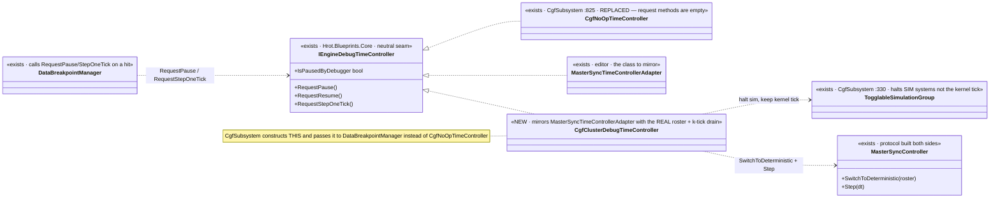
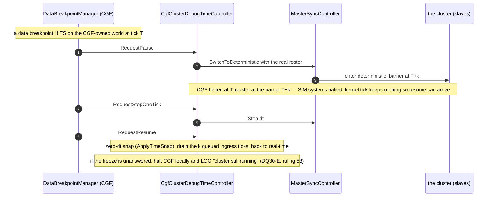

<!--STATUS
state: LIVE
build-state: READY-TO-BUILD — carries classDiagram + sequenceDiagram (§4/§5). Slice 4 of cgf==editor
  (the DQ30 debug pause/step): replace CgfNoOpTimeController with a real CgfClusterDebugTimeController so a
  breakpoint HIT on CGF freezes the cluster through the master and can step — completing the brain-
  diagnostics story (CGF already has data breakpoints + inspection; it just cannot pause/step).
updated: 2026-08-25
design-basis: UX/UX_Feature_Cgf_Brain_Diagnostics.md (UXI-37 — "the fix is ONE class") · Design_Question_30
  (DQ30 A–E, all decided) · PROGRAMME_Cgf_Equals_Editor_Gap_Map.md (the CgfClusterDebugTimeController row) ·
  ruling 53 (headless origin logs, never pops a modal — CE-024's correction).
known-conflict: none live. Parallel-safe with the MCP-authoring session — this touches CgfSubsystem + the
  time layer, not DebugApi route files.
-->
# DESIGN — **cgf==editor slice 4: debug pause/step on CGF** *(DQ30)*

> 🎯 CGF already **detects** data-breakpoint hits and **inspects** (CE-001..024), but `CgfNoOpTimeController`
> makes `RequestPause`/`RequestResume`/`RequestStepOneTick` **no-ops** — so a hit does nothing. Replace it
> with a real adapter that **freezes the cluster through the master** and can **step**, mirroring the
> editor's `MasterSyncTimeControllerAdapter`. ⭐ The distributed pause/step protocol is **already built on
> both sides**; this is the one missing adapter.

## 1. ⭐ SCOPE
| ✅ IN | ⛔ NOT |
|---|---|
| **`CgfClusterDebugTimeController : IEngineDebugTimeController`** — freeze/resume/step via `MasterSyncController`, replacing `CgfNoOpTimeController` | ⛔ a NEW pause/step protocol *(it exists — `SwitchToDeterministic`/`Step`/the slave `Stepping` barrier)* |
| **Halt SIM systems, not the kernel tick** *(DQ30-A)* via the existing `TogglableSimulationGroup`/`TogglableInputGroup` | ⛔ halting the kernel tick *(deadlock — the resume arrives through ingress)* |
| **No world-state ingress while frozen; control-plane keeps polling** *(DQ30-C)* | ⛔ freezing the control plane |
| **The k-tick barrier drain** — CGF halts at breakpoint tick T, the cluster barrier at T+k ⇒ CGF drains k queued ticks on resume | ⛔ pretending T == the cluster barrier |
| **Within-tick stepping is local + free** *(DQ30-D / NGS-2.1)* — walk the node-granular recording with the clock paused, no cluster action | |
| **Unanswered freeze ⇒ halt CGF locally + LOG "cluster still running"** *(DQ30-E; ruling 53 — a headless origin LOGS, never a modal — CE-024)* | ⛔ a confirm modal on a headless node |

## 2. ⭐⭐ INVENTORY — measured `2026-08-25`
| ✅ exists | where | role |
|---|---|---|
| `IEngineDebugTimeController` *(RequestPause/Resume/StepOneTick + IsPausedByDebugger)* | `Hrot.Blueprints.Core/IBlueprintTimeController.cs` *(neutral)* | the seam |
| 🔴 `CgfNoOpTimeController` — **all three request methods EMPTY**; `IsPausedByDebugger` returns real state | `CgfSubsystem.cs:825-834` | ⛔ the dead request half — what we replace |
| ⭐ `MasterSyncTimeControllerAdapter` — `RequestPause → _masterSync.SwitchToDeterministic(roster)` · `RequestStepOneTick → _masterSync.Step(dt)` | `Hrot.*` *(editor)* | ⭐⭐ **the class to MIRROR** |
| `DataBreakpointManager` holds the controller and calls `RequestPause()` *(`:554`)* / `RequestStepOneTick()` *(`:612`)* on a hit | `Hrot.Diagnostics.Breakpoints` | ⭐ the caller — already wired; it just gets the no-op on CGF |
| `MasterSyncController.SwitchToDeterministic(roster)` + `Step(dt)`; `SlaveSyncController.SlaveMode.Stepping` *(barrier at an absolute master tick)*; `SteppedSlaveController`; `ReplayMasterModule.FreezeTime()` *(save/restore time-scale)* | time/orchestration | ⭐⭐ **the protocol — already built both sides** |
| `TogglableSimulationGroup` / `TogglableInputGroup` | `CgfSubsystem.cs:330-334` | ⭐ the sim-halt actuator *(DQ30-A)* |
| resume via **zero-dt snap** `ApplyTimeSnap` | time layer | ⭐ already implemented *(DQ30-B)* |

⇒ ⭐⭐⭐ **The fix is ONE adapter class.** The editor drives the same protocol with an EMPTY roster; CGF
drives it with the **real cluster roster** *(so the whole cluster freezes)* plus the k-tick barrier drain.

## 3. ⚠ HOW CGF DIFFERS FROM THE EDITOR ADAPTER *(the only real design content)*
| | editor | CGF |
|---|---|---|
| roster | empty *(one-node)* | **the real cluster roster** ⇒ freezing halts every node |
| barrier | T == now | **T+k** — CGF halted at the hit tick, the cluster at the next barrier ⇒ **drain k queued ingress ticks on resume** |
| unanswered freeze | n/a *(in-process)* | **halt CGF locally + LOG** *(DQ30-E; ruling 53)* |

## 4. ⭐⭐⭐ CLASS DIAGRAM

## 5. ⭐⭐⭐ SEQUENCE DIAGRAM

## 6. ⭐⭐ THE ITEMS
| # | task | the one thing not to get wrong |
|---|---|---|
| ⭐ **①** | **Build `CgfClusterDebugTimeController`**, mirroring `MasterSyncTimeControllerAdapter` but with the **real roster**; construct it in `CgfSubsystem` and pass it to `DataBreakpointManager` **instead of** `CgfNoOpTimeController` | ⛔ delete/retire the no-op; ⛔ don't halt the kernel tick *(DQ30-A)* |
| ⭐ **②** | **The k-tick barrier drain** on resume | ⚠ CGF is k ticks behind the barrier — drain queued ingress; ⛔ don't assume T == barrier |
| ⭐ **③** | **DQ30-C ingress gating** — no world-state ingress while frozen; control-plane keeps polling | ⛔ freezing the control plane deadlocks resume |
| ⭐ **④** | **DQ30-E** — unanswered freeze ⇒ halt CGF locally + **LOG** *(ruling 53; ⛔ no modal on headless)* | this is the corrected CE-024 shape |

## 7. GATES
rule 8 + build/test rules. **Row 8 rails:** set a data breakpoint on a CGF-owned entity → run → **assert paused** *(`IsPausedByDebugger` true, sim advanced 0)* → **step** → assert exactly one tick advanced → **resume** → assert running; shown RED by reverting to the no-op. ⚠ if MCP can't yet set a breakpoint / read paused-state for the test, **extend the harness/MCP** *(allowed)* — but keep it to the test surface, ⛔ not the authoring route file. ⛔⛔ name + run the integration/conformance suite that boots a real `--mode all` cluster *(the barrier is only real with slaves)*; run filtered if flaky, or state with base-sha evidence why it cannot gate.

## 8. ⭐ LANE & COLLISION
⭐ **CGF/backend lane:** `CgfSubsystem.cs` *(construct the adapter, retire the no-op)* · the new `CgfClusterDebugTimeController` · the time/orchestration wiring · `Hrot.SystemTests/**`. ✅ **Parallel-safe with the MCP-authoring session** — it owns `DebugApiService.Authoring.cs` + the generated catalog; this touches CgfSubsystem + the time layer. ⚠ if the test needs a small MCP hook, coordinate the generated-catalog regen with the coordinator *(rule 4 re-pull)*. ⛔ Not: the §17 Soft/Hard reload classification *(CE-023, separate)*; map/Axis B.

## 9. ⭐ WHEN DONE
Fold the as-built here; flip the gap-map row *(CgfClusterDebugTimeController)*; state the ids *(CE- series, Area L)*; report whether the k-tick drain and DQ30-C gating behaved as designed. The report points here.
