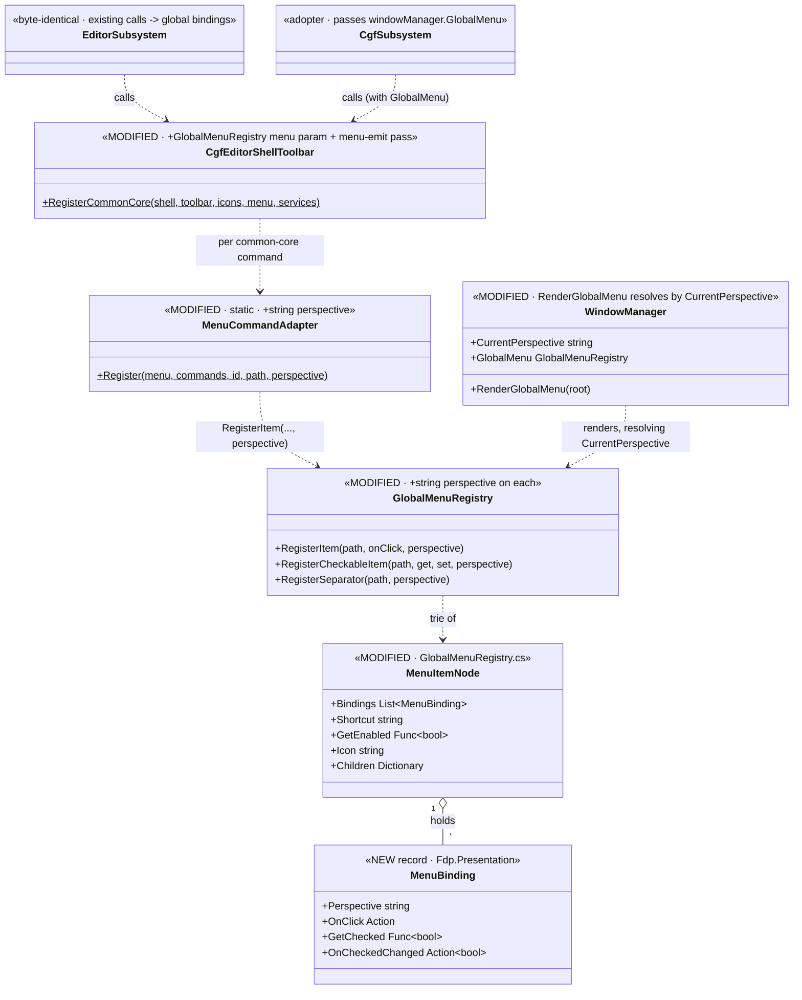
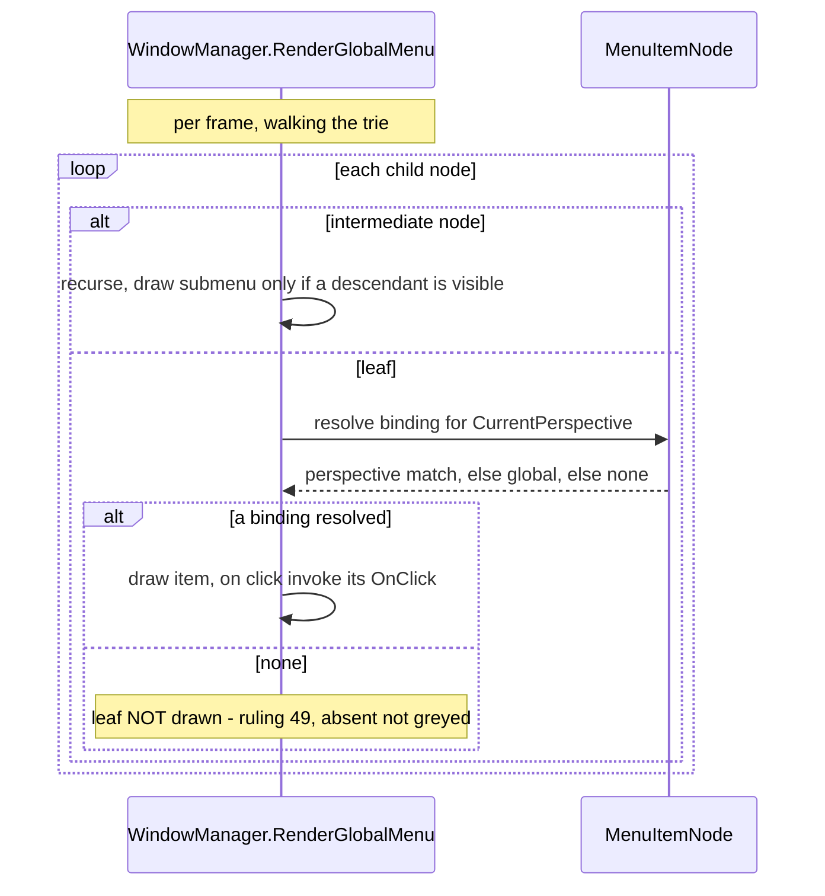

<!--STATUS
state: LIVE
build-state: READY-TO-BUILD — the §6 decision is settled: **CGF's File items are GLOBAL** (user, 2026-08-26).
  Carries class+sequence UML.
updated: 2026-08-26
current-answer: the whole file. Intent basis: UX/UX_Feature_Menu_Follows_Focus.md (UXI-05) +
  UX/UX_Feature_Shell_Parity.md (UXI-35 ISubsystemShell) + the CE-016 as-built (CgfEditorShellToolbar).
known-conflict: extends CgfEditorShellToolbar.cs + CgfSubsystem.cs + EditorSubsystem.cs (UI/CGF lane's
  files) and the shared engine GlobalMenuRegistry/WindowManager ⇒ dispatch in the UI/CGF lane; rule-4 re-pull.
-->
# DESIGN — **CGF menu adoption + the follows-focus registry model** *(UXI-05, slice)*

> 🎯 Two things: **(a)** add UXI-05's per-perspective binding model to `GlobalMenuRegistry` + the draw path
> *(a menu leaf follows the focused perspective)*, editor **byte-identical**; **(b)** extend the shared
> `CgfEditorShellToolbar` helper to also register the common-core **menu** items, so CGF gains a `File`
> menu from the **one** list — the menu half of A1. ⛔ The four gizmo-block cleanup is DEFERRED (§10).

## 1. ⭐ INTENT BASIS *(cited — R-129)*
| source *(STATUS)* | binds this slice |
|---|---|
| `UX/UX_Feature_Menu_Follows_Focus.md` **(LIVE, UXI-05, ✅ designed)** | ⭐⭐⭐ the model: *"a leaf holds **bindings, not one action**"*; `MenuBinding(Perspective, OnClick, GetChecked, OnCheckedChanged)`; **resolution at draw: perspective binding → global (`null`) binding → the leaf is not drawn** *(empty submenus skipped)*. Registration adds `string? perspective = null`, mirroring `ToolbarItem.Perspective`. ⛔ **No `_isPinned`** for menu items. Migration step 1 gate: **editor menu byte-identical, all items global** |
| `UX/UX_Feature_Shell_Parity.md` **(UXI-35, ruling 58/59)** | the `ISubsystemShell` helper *"registers the common-core commands into **`GlobalMenu` + `MainToolbar`** for a host"* — ⇒ the menu belongs in the SAME helper as the toolbar, not a parallel list |
| `DESIGN_Cgf_Shell_Command_Toolbar_Slice.md` §9 *(CE-037, BUILT)* | `CgfEditorShellToolbar.RegisterCommonCore` exists and is **toolbar-only** — its §8 says *"when the menu (UXI-05) is built its registration EXTENDS this same helper."* This slice cashes that |
| ruling **49** | a command a host cannot service is **OMITTED**, not greyed — the resolution's *"not drawn"* is this by construction |
| UXI-06 *(perspective restore)* | ⚠ UXI-05's doc flags a restore-coupling risk; **UXI-06 is already BUILT** *(gap map — `ResolveStartupPerspective` excludes document-driven perspectives)* ⇒ the risk is mitigated, not open |

## 2. ⭐⭐ INVENTORY — as-is *(graph @ 192k nodes + a read-only scan, `2026-08-26`)*
**Two menu-bar mechanisms — keep them separate:**
| | registry-menu path | gizmo-layer path |
|---|---|---|
| draw site | `WindowManager.RenderGlobalMenu(GlobalMenu.Root)` *(`WindowManager.cs:585`, renderer `:690-757`)* | four host blocks: Editor `:2502` · SimHost `:377` · Replay `:427` · IG `:1271` *(each `_gizmoLayer?.ConsumeMainMenu()` → own `BeginMainMenuBar`)* |
| editor content | `File/*` *(`EditorSubsystem.cs:4509-4528` via `MenuCommandAdapter`)* + `File/Scenario/*` *(`ScenarioMenuCommands.cs`)* ⇒ top-levels `File` (+ engine `Settings`) | gizmo DTOs |
| ⭐ **CGF content** | **empty** — only the inherited engine-default `Settings/UI Scale…` *(`WindowManager.cs:110`)*; **no `File`** | ⭐⭐ **CGF has NO such block at all** |
- `MenuItemNode` *(`GlobalMenuRegistry.cs:8-61`)*: single `OnClick`/`GetCheckedState`/`OnCheckedChanged` per leaf + `Shortcut`/`GetEnabled`/`DynamicLabel`/`Icon`; **no perspective**.
- `GlobalMenuRegistry.Register{Item,CheckableItem,Separator}` — **no perspective param**. `MenuCommandAdapter.Register(menu, commands, id, path)` — **no perspective param**.
- `RenderGlobalMenu` does **not** consult `CurrentPerspective` *(a plain property, `WindowManager.cs:222`, in scope)* — "zero new draw plumbing", per UXI-05.
- `CgfEditorShellToolbar.RegisterCommonCore(shell, toolbar?, icons?, services)` *(`:149`)* is **toolbar-only** — never touches `GlobalMenu`/`MenuCommandAdapter`.

⇒ ⭐⭐⭐ **CGF is empty on BOTH paths, and participates in neither gizmo block** — so CGF's menu is the **registry path only**, and this slice needs the registry model + CGF adoption, ⛔ not the four-block cleanup.

## 3. ⭐⭐⭐ WHAT TO BUILD
| # | item | the one thing not to get wrong |
|---|---|---|
| **①** | **Registry per-perspective model** — `MenuItemNode` gains `List<MenuBinding>` *(record `MenuBinding(string? Perspective, Action? OnClick, Func<bool>? GetChecked, Action<bool>? OnCheckedChanged)`)*; the three `Register*` methods gain `string? perspective = null` *(append/replace the binding for that perspective, last-write-wins per perspective)* | ⛔⛔ **backward-compatible: an existing call with no perspective creates ONE global binding** ⇒ editor byte-identical *(migration step-1 gate)* |
| **②** | **Draw-time resolution** in `RenderGlobalMenu` — per leaf: pick the binding whose `Perspective == CurrentPerspective`, else the `null` binding, else **skip the leaf**; **skip an intermediate node with no visible descendants** | ⛔ empty-parent skip is required or the bar grows dead headers *(UXI-05 risk)*; `Shortcut`/`Icon`/`GetEnabled`/`DynamicLabel` stay node-level *(faithful to UXI-05's record)* |
| **③** | **Extend the helper** — `MenuCommandAdapter.Register` gains `string? perspective = null` *(passthrough to the registry)*; `CgfEditorShellToolbar.RegisterCommonCore` gains a `GlobalMenuRegistry? menu` param + a **menu-emit pass** over its `Layout` table *(the same common-core ids, at `File/*` paths)* | ⛔⛔ **ONE list** — the menu pass reads the SAME `Layout`/`shell` the toolbar pass does; ⛔ no CGF-private menu list |
| **④** | **Adopt on CGF** — pass `windowManager.GlobalMenu` to the helper ⇒ CGF gains `File/Save`, `File/Open Asset…`, `File/New Asset…`, `File/Reload` | subset only *(what CGF services)*; OMIT Save-All/Scenario as on the toolbar *(ruling 49)* |
| **⑤** | **Conformance** — a `SUBSET-BY-DESIGN` **menu** verdict mirroring CE-040: CGF's menu paths ⊆ the editor's, same paths; an empty CGF `File` is a violation. Plus a unit rail for the resolution *(two bindings on one path, flip `CurrentPerspective`, assert)* | ⛔ NOT full-array identity — the editor legitimately has Save-As/Save-All/Scenario |

## 4. ⭐⭐ CLASS DIAGRAM *(authoritative)*

## 5. ⭐⭐⭐ SEQUENCE DIAGRAM *(authoritative — draw-time resolution)*

## 6. ✅ DECISION SETTLED — **CGF's `File` items are GLOBAL** *(user, `2026-08-26`)*
CGF's common-core items *(Save/Open/New/Reload)* are **cross-perspective** — they act on whatever AI doc is active — and the **toolbar** already registered them **global** *(CE-039)*. ⇒ register them **global** *(perspective = null)* on CGF: always shown, consistent with the toolbar. The follows-focus MODEL is still built and unit-railed *(items ①/②/⑤)*, ready for the first perspective-SPECIFIC item a later slice adds. ⛔ **Not chosen:** binding them to CGF's editing perspectives — the items are cross-perspective, so that duplicates bindings for no user-visible gain and couples to CGF's perspective naming *(the magic-string risk UXI-05 flags)*.
⇒ ⭐ **This slice delivers "CGF has the File menu + the registry follows-focus model"** — ⛔ not a CGF menu that visibly changes per perspective *(the common-core has no perspective-specific items yet to change)*.

## 7. ⭐ ACCEPTANCE / RAILS
- **Editor byte-identical** — the editor's rendered menu tree is unchanged after item ① *(a `RenderGlobalMenu`/registry-dump diff before/after; migration step-1 gate)*.
- **Resolution unit rail** — register two bindings on one path *(one `null`, one `"P"`)*; flip `CurrentPerspective`; assert the drawn binding switches, and that a path with only `"P"` is **not drawn** under another perspective; an all-filtered submenu is skipped.
- **CGF `File` menu** — dumps `File/Save`, `File/Open Asset…`, `File/New Asset…`, `File/Reload`; the `SUBSET-BY-DESIGN` menu verdict asserts ⊆ the editor's paths; an empty CGF `File` is a **violation** *(anti-vacuity, mirroring CE-040)*.

## 8. ⭐ LANE & GATES
⭐ **UI/CGF lane** *(owns `CgfEditorShellToolbar.cs`, `CgfSubsystem.cs`, `EditorSubsystem.cs`)* — the shared engine edits *(`GlobalMenuRegistry.cs`, `MenuCommandAdapter.cs`, `WindowManager.cs`)* are additive/backward-compatible. ⚠ **rule-4 re-pull** *(these files are hot with the toolbar slice + AX-009)*. Build the AFFECTED projects *(`Fdp.Presentation` · `Hrot.Editor.AiShared` · `Hrot.Editor` · `Hrot.CGF` · `Hrot.SystemTests` + the Presentation unit tests)* — ⛔ never the whole solution in the fix loop. Gates per the rule-8 contract; conformance suite **T3 — background it**. Obligation ⑤: fold any as-built deviation back into THIS doc.

## 9. ⛔ EXPLICITLY OUT
- **The four gizmo-block cleanup** *(UXI-05 steps 2/3 = UXI-13)* — the focus-guard + collapse of the SimHost/IG/ReplayBrowser/Editor `BeginMainMenuBar` blocks into `DebugGizmoLayer.DrawMainMenu()`. ⭐ **CGF participates in none of them**, so it is not on the cgf==editor path; it is a cross-subsystem cleanup with its own acceptance *(the `--mode all` gizmo-menu walk)*. ⇒ this slice delivers the registry MODEL + CGF adoption; the full stacked-bar follows-focus walk is UXI-13's.
- **Per-perspective enabled/label/shortcut** — UXI-05's `MenuBinding` carries only the action; enabled/label/icon stay node-level. A refinement, not this slice.
- **Menu accelerators/hotkeys** beyond the existing `Shortcut` display.
