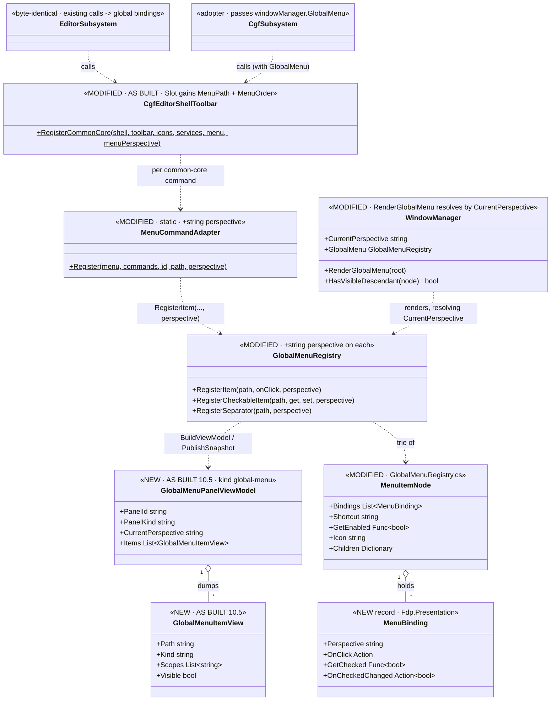
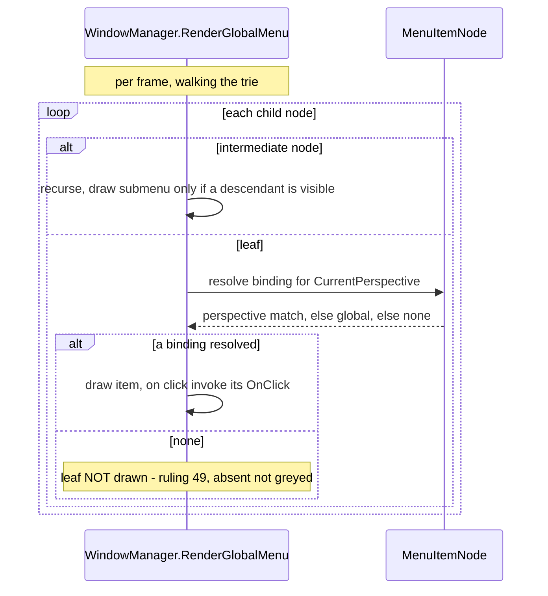

<!--STATUS
state: LIVE
build-state: BUILT (CE-041..CE-045, 2026-08-26). §4/§5 UML updated to the AS-BUILT.
updated: 2026-08-26
stale-below: §3 ④ and §7's `File/Reload` on CGF, and their "CGF gains four File items" — both SUPERSEDED
  by §10.3/§10.4 and listed under `## ⛔ HISTORY`. Do NOT quote them as current.
current-answer: the whole file. Intent basis: UX/UX_Feature_Menu_Follows_Focus.md (UXI-05) +
  UX/UX_Feature_Shell_Parity.md (UXI-35 ISubsystemShell) + the CE-016 as-built (CgfEditorShellToolbar).
known-conflict: extends CgfEditorShellToolbar.cs + CgfSubsystem.cs + EditorSubsystem.cs (UI/CGF lane's
  files) and the shared engine GlobalMenuRegistry/WindowManager ⇒ dispatch in the UI/CGF lane; rule-4 re-pull.
-->
# DESIGN — **CGF menu adoption + the follows-focus registry model** *(UXI-05, slice)*

> 🎯 Two things: **(a)** add UXI-05's per-perspective binding model to `GlobalMenuRegistry` + the draw path
> *(a menu leaf follows the focused perspective)*, editor **byte-identical**; **(b)** extend the shared
> `CgfEditorShellToolbar` helper to also register the common-core **menu** items, so CGF gains a `File`
> menu from the **one** list — the menu half of A1. ⛔ The four gizmo-block cleanup is DEFERRED (§10).

## 1. ⭐ INTENT BASIS *(cited — R-129)*
| source *(STATUS)* | binds this slice |
|---|---|
| `UX/UX_Feature_Menu_Follows_Focus.md` **(LIVE, UXI-05, ✅ designed)** | ⭐⭐⭐ the model: *"a leaf holds **bindings, not one action**"*; `MenuBinding(Perspective, OnClick, GetChecked, OnCheckedChanged)`; **resolution at draw: perspective binding → global (`null`) binding → the leaf is not drawn** *(empty submenus skipped)*. Registration adds `string? perspective = null`, mirroring `ToolbarItem.Perspective`. ⛔ **No `_isPinned`** for menu items. Migration step 1 gate: **editor menu byte-identical, all items global** |
| `UX/UX_Feature_Shell_Parity.md` **(UXI-35, ruling 58/59)** | the `ISubsystemShell` helper *"registers the common-core commands into **`GlobalMenu` + `MainToolbar`** for a host"* — ⇒ the menu belongs in the SAME helper as the toolbar, not a parallel list |
| `DESIGN_Cgf_Shell_Command_Toolbar_Slice.md` §9 *(CE-037, BUILT)* | `CgfEditorShellToolbar.RegisterCommonCore` exists and is **toolbar-only** — its §8 says *"when the menu (UXI-05) is built its registration EXTENDS this same helper."* This slice cashes that |
| ruling **49** | a command a host cannot service is **OMITTED**, not greyed — the resolution's *"not drawn"* is this by construction |
| UXI-06 *(perspective restore)* | ⚠ UXI-05's doc flags a restore-coupling risk; **UXI-06 is already BUILT** *(gap map — `ResolveStartupPerspective` excludes document-driven perspectives)* ⇒ the risk is mitigated, not open |

## 2. ⭐⭐ INVENTORY — as-is *(graph @ 192k nodes + a read-only scan, `2026-08-26`)*
**Two menu-bar mechanisms — keep them separate:**
| | registry-menu path | gizmo-layer path |
|---|---|---|
| draw site | `WindowManager.RenderGlobalMenu(GlobalMenu.Root)` *(`WindowManager.cs:585`, renderer `:690-757`)* | four host blocks: Editor `:2502` · SimHost `:377` · Replay `:427` · IG `:1271` *(each `_gizmoLayer?.ConsumeMainMenu()` → own `BeginMainMenuBar`)* |
| editor content | `File/*` *(`EditorSubsystem.cs:4509-4528` via `MenuCommandAdapter`)* + `File/Scenario/*` *(`ScenarioMenuCommands.cs`)* ⇒ top-levels `File` (+ engine `Settings`) | gizmo DTOs |
| ⭐ **CGF content** | **empty** — only the inherited engine-default `Settings/UI Scale…` *(`WindowManager.cs:110`)*; **no `File`** | ⭐⭐ **CGF has NO such block at all** |
- `MenuItemNode` *(`GlobalMenuRegistry.cs:8-61`)*: single `OnClick`/`GetCheckedState`/`OnCheckedChanged` per leaf + `Shortcut`/`GetEnabled`/`DynamicLabel`/`Icon`; **no perspective**.
- `GlobalMenuRegistry.Register{Item,CheckableItem,Separator}` — **no perspective param**. `MenuCommandAdapter.Register(menu, commands, id, path)` — **no perspective param**.
- `RenderGlobalMenu` does **not** consult `CurrentPerspective` *(a plain property, `WindowManager.cs:222`, in scope)* — "zero new draw plumbing", per UXI-05.
- `CgfEditorShellToolbar.RegisterCommonCore(shell, toolbar?, icons?, services)` *(`:149`)* is **toolbar-only** — never touches `GlobalMenu`/`MenuCommandAdapter`.

⇒ ⭐⭐⭐ **CGF is empty on BOTH paths, and participates in neither gizmo block** — so CGF's menu is the **registry path only**, and this slice needs the registry model + CGF adoption, ⛔ not the four-block cleanup.

## 3. ⭐⭐⭐ WHAT TO BUILD
| # | item | the one thing not to get wrong |
|---|---|---|
| **①** | **Registry per-perspective model** — `MenuItemNode` gains `List<MenuBinding>` *(record `MenuBinding(string? Perspective, Action? OnClick, Func<bool>? GetChecked, Action<bool>? OnCheckedChanged)`)*; the three `Register*` methods gain `string? perspective = null` *(append/replace the binding for that perspective, last-write-wins per perspective)* | ⛔⛔ **backward-compatible: an existing call with no perspective creates ONE global binding** ⇒ editor byte-identical *(migration step-1 gate)* |
| **②** | **Draw-time resolution** in `RenderGlobalMenu` — per leaf: pick the binding whose `Perspective == CurrentPerspective`, else the `null` binding, else **skip the leaf**; **skip an intermediate node with no visible descendants** | ⛔ empty-parent skip is required or the bar grows dead headers *(UXI-05 risk)*; `Shortcut`/`Icon`/`GetEnabled`/`DynamicLabel` stay node-level *(faithful to UXI-05's record)* |
| **③** | **Extend the helper** — `MenuCommandAdapter.Register` gains `string? perspective = null` *(passthrough to the registry)*; `CgfEditorShellToolbar.RegisterCommonCore` gains a `GlobalMenuRegistry? menu` param + a **menu-emit pass** over its `Layout` table *(the same common-core ids, at `File/*` paths)* | ⛔⛔ **ONE list** — the menu pass reads the SAME `Layout`/`shell` the toolbar pass does; ⛔ no CGF-private menu list |
| **④** | **Adopt on CGF** — pass `windowManager.GlobalMenu` to the helper ⇒ CGF gains `File/Save`, `File/Open Asset…`, `File/New Asset…`, `File/Reload` | subset only *(what CGF services)*; OMIT Save-All/Scenario as on the toolbar *(ruling 49)* |
| **⑤** | **Conformance** — a `SUBSET-BY-DESIGN` **menu** verdict mirroring CE-040: CGF's menu paths ⊆ the editor's, same paths; an empty CGF `File` is a violation. Plus a unit rail for the resolution *(two bindings on one path, flip `CurrentPerspective`, assert)* | ⛔ NOT full-array identity — the editor legitimately has Save-As/Save-All/Scenario |

## 4. ⭐⭐ CLASS DIAGRAM *(authoritative)*

## 5. ⭐⭐⭐ SEQUENCE DIAGRAM *(authoritative — draw-time resolution)*

## 6. ✅ DECISION SETTLED — **CGF's `File` items are GLOBAL** *(user, `2026-08-26`)*
CGF's common-core items *(Save/Open/New/Reload)* are **cross-perspective** — they act on whatever AI doc is active — and the **toolbar** already registered them **global** *(CE-039)*. ⇒ register them **global** *(perspective = null)* on CGF: always shown, consistent with the toolbar. The follows-focus MODEL is still built and unit-railed *(items ①/②/⑤)*, ready for the first perspective-SPECIFIC item a later slice adds. ⛔ **Not chosen:** binding them to CGF's editing perspectives — the items are cross-perspective, so that duplicates bindings for no user-visible gain and couples to CGF's perspective naming *(the magic-string risk UXI-05 flags)*.
⇒ ⭐ **This slice delivers "CGF has the File menu + the registry follows-focus model"** — ⛔ not a CGF menu that visibly changes per perspective *(the common-core has no perspective-specific items yet to change)*.

## 7. ⭐ ACCEPTANCE / RAILS
- **Editor byte-identical** — the editor's rendered menu tree is unchanged after item ① *(a `RenderGlobalMenu`/registry-dump diff before/after; migration step-1 gate)*.
- **Resolution unit rail** — register two bindings on one path *(one `null`, one `"P"`)*; flip `CurrentPerspective`; assert the drawn binding switches, and that a path with only `"P"` is **not drawn** under another perspective; an all-filtered submenu is skipped.
- **CGF `File` menu** — dumps `File/Save`, `File/Open Asset…`, `File/New Asset…`, `File/Reload`; the `SUBSET-BY-DESIGN` menu verdict asserts ⊆ the editor's paths; an empty CGF `File` is a **violation** *(anti-vacuity, mirroring CE-040)*.

## 8. ⭐ LANE & GATES
⭐ **UI/CGF lane** *(owns `CgfEditorShellToolbar.cs`, `CgfSubsystem.cs`, `EditorSubsystem.cs`)* — the shared engine edits *(`GlobalMenuRegistry.cs`, `MenuCommandAdapter.cs`, `WindowManager.cs`)* are additive/backward-compatible. ⚠ **rule-4 re-pull** *(these files are hot with the toolbar slice + AX-009)*. Build the AFFECTED projects *(`Fdp.Presentation` · `Hrot.Editor.AiShared` · `Hrot.Editor` · `Hrot.CGF` · `Hrot.SystemTests` + the Presentation unit tests)* — ⛔ never the whole solution in the fix loop. Gates per the rule-8 contract; conformance suite **T3 — background it**. Obligation ⑤: fold any as-built deviation back into THIS doc.

## 9. ⛔ EXPLICITLY OUT
- **The four gizmo-block cleanup** *(UXI-05 steps 2/3 = UXI-13)* — the focus-guard + collapse of the SimHost/IG/ReplayBrowser/Editor `BeginMainMenuBar` blocks into `DebugGizmoLayer.DrawMainMenu()`. ⭐ **CGF participates in none of them**, so it is not on the cgf==editor path; it is a cross-subsystem cleanup with its own acceptance *(the `--mode all` gizmo-menu walk)*. ⇒ this slice delivers the registry MODEL + CGF adoption; the full stacked-bar follows-focus walk is UXI-13's.
- **Per-perspective enabled/label/shortcut** — UXI-05's `MenuBinding` carries only the action; enabled/label/icon stay node-level. A refinement, not this slice.
- **Menu accelerators/hotkeys** beyond the existing `Shortcut` display.

---

## 10. ⭐⭐⭐ AS BUILT — `2026-08-26` *(obligation ⑤ — the design updated to the code, prior state marked)*

> ⭐ Built as `CE-041`…`CE-045`. **Items ①–⑤ all DONE.** ⚠ **Four measured deviations**, each argued below;
> ⛔ §3/§7's original wording for them is **SUPERSEDED** and moved to `## ⛔ HISTORY`.

### 10.1 ⭐⭐ Obligation ③ — **the §4 classDiagram vs what was built**

| §4 says | built as |
|---|---|
| `MenuBinding(Perspective, OnClick, GetChecked, OnCheckedChanged)` | ✅ **exactly**, `GlobalMenuRegistry.cs` |
| `MenuItemNode.Bindings List~MenuBinding~` | ✅ — ⭐ **plus** `OnClick`/`GetCheckedState`/`OnCheckedChanged` kept as **READ-ONLY projections** of the global binding, so every existing reader compiles unchanged. ⛔ Read-only on purpose: a setter would create an action the resolution path cannot see |
| `GlobalMenuRegistry.Register{Item,CheckableItem,Separator}(…, perspective)` | ✅ |
| `MenuCommandAdapter.Register(…, perspective)` | ✅ |
| `WindowManager.RenderGlobalMenu` resolves by `CurrentPerspective` | ✅ — ⭐ **plus** `internal bool HasVisibleDescendant(node)`, the empty-parent skip §3 ② requires. ⛔ Not drawn in §4; **added to the diagram above** |
| `CgfEditorShellToolbar.RegisterCommonCore(shell, toolbar, icons, menu, services)` | ⚠ **parameter ORDER differs** — `(shell, toolbar, icons, services, menu = null, menuPerspective = null)`: `services` is required and `menu` is optional, so it cannot sit before it. ⭐ Cosmetic; the diagram is corrected above |
| §5's sequence *(resolve → draw or skip)* | ✅ **as drawn** |

### 10.2 🔴 DEVIATION 1 — **`Slot.MenuOrder`: the menu's order is NOT the toolbar's**

📐 **Measured:** the editor's toolbar reads **New · Open · Save** *(sortOrder −11, −10, −9)*; its File **menu**
has always read **Open Asset… · New Asset… · Save** — `GlobalMenuRegistry` is a trie with **no ordering
key**, so items render in **registration order**. ⇒ ⛔ driving the menu pass off `SortOrder` would have
**silently swapped the editor's first two File items**, and nothing in the tree would have noticed.

⇒ ⭐⭐ `Slot` carries a **separate `MenuOrder`**, and the menu pass sorts by it. ⭐ One table, two
orderings, **both explicit**. Gated by `The_editor_full_shell_yields_exactly_the_pre_extraction_file_menu`.

### 10.3 🔴🔴 DEVIATION 2 — **NO `File/Reload`, on EITHER host** *(§3 ④ and §7 SUPERSEDED)*

⛔⛔ **§3 ④ and §7 both listed `File/Reload` among CGF's four items. It is NOT built, and the two
requirements are structurally incompatible:**

| the constraint | |
|---|---|
| §3 ①/§7 · UXI-05 migration step 1 | ⭐⭐⭐ **the editor's menu must be BYTE-IDENTICAL** |
| 📐 measured | the editor's File menu has **five** items — Open Asset…, New Asset…, Save, Save As…, Save All — and **NO Reload** |
| §3 ③ · ruling **58** | ⭐⭐ **ONE list, no `if (host==…)`** |

⇒ giving the `compileReload` slot a `MenuPath` **adds `File/Reload` to the EDITOR**, breaking the
byte-identical gate; giving it one *only on CGF* needs a per-host branch ruling 58 forbids. ⛔ **Both
alternatives lose.** ⇒ ⭐ **the slot deliberately carries no `MenuPath`**, and
`The_editor_full_shell_yields_exactly_the_pre_extraction_file_menu` asserts the absence so it stays
**deliberate rather than accidental**.

### ✅✅ RESOLVED `2026-08-26` — **NO menu item, on either host**

🔒 **User, verbatim:** *"hot reload is now a toolbar menu button so no Main menu item is necessary."*

⚠ **The handoff's wording hid a real distinction, recorded here so it is not re-litigated:** *"Reload"*
meant **`blueprint.compileReload`** — the **ACTIVE document only** *("Compile & hot-reload the active
blueprint / BTree / HSM")*. ⛔ It is **NOT** the all-assets command; that is a separate slot,
**`blueprint.fullRebuild`** *("Rebuild all AI behavior assets")*, which CGF omits for want of a handler
*(ruling 49)*.
⇒ ⭐ `compileReload` is **already a toolbar button on BOTH hosts, at the same id and sortOrder**, from
this same table *(`CE-039`)*. ⇒ ⭐⭐ **the as-built is the settled answer** — the omission stands, and the
rail that asserts it is now a *decision* rail, ⛔ not a placeholder.

### 10.4 ⚠ DEVIATION 3 — **CGF gains ONE item, not four** *(§3 ④ / §7 SUPERSEDED)*

📐 Measured, and it is **the derivation working**, ⛔ not a shortfall:

| §3 ④ expected | as built | why |
|---|---|---|
| `File/Save` | ✅ | CGF services save *(CE-039)* |
| `File/Open Asset…` · `File/New Asset…` | ⛔ **absent** | ⭐ CGF composes **no asset picker and no new-asset launcher** — the same ruling-49 absence **`DESIGN_Cgf_Shell_Command_Toolbar_Slice.md` §9.4 already recorded for their toolbar buttons.** No handler ⇒ no descriptor ⇒ no item. ⭐⭐ They appear **with no menu code written** the day a picker is composed |
| `File/Reload` | ⛔ **absent** | §10.3 |

⇒ ⭐ **the mechanism is what shipped**: one table, two surfaces, the subset **derived** from what each
host's shell can service. ⚠ **The rail asserts the SUBSET verdict, not the list** — so the list growing is
not a rail edit.

🔒 **User ruling, `2026-08-26`:** *"i need the feature parity, and menus to be shown just for the features
that are actually available."* ⇒ ⭐⭐ **the second half is DISCHARGED by this slice** *(a menu item exists
only for a serviceable command — ruling 49 by construction)*; ⭐ **the first half is a FEATURE slice, not a
menu slice** — 📐 CGF already holds the catalog and the per-kind `INewAssetService`; what it cannot reach
is `AssetPickerLauncher` / `NewAssetLauncher` / `AssetPickActionRouter`, which live in the **`Hrot.Editor`
assembly** *(`Browser/`)*, plus `ShowNewAssetDialog`, which is a **local function inside
`EditorSubsystem.RegisterWindows`** and not a type at all. ⇒ **relocate to `AiShared` and compose** — the
same move `CE-037` made for the toolbar layout — and **four declared absences close at once** *(two
toolbar buttons + two menu items)* with **no menu or toolbar code written**.
📄 The scoping detail is in [`batches/REPORT_Cgf_Menu_Follows_Focus.md`](blueprints/batches/REPORT_Cgf_Menu_Follows_Focus.md) §6, handed to the coordinator.

### 10.5 ⭐⭐ DEVIATION 4 — **the menu needed a PANEL MODEL before §3 ⑤ could assert anything**

📐 **Measured:** the toolbar has published `main-toolbar` since slice 2; the **menu published nothing at
all**. ⛔ A conformance verdict on an unpublished surface is not a verdict.

⇒ ⭐ **NEW, not in §4:** `GlobalMenuPanelViewModel` / `GlobalMenuItemView`, `GlobalMenuRegistry.
BuildViewModel(perspective)` + `PublishSnapshot(perspective)`, kind **`global-menu`**, published from
`WindowManager`'s menu-bar block **unconditionally** *(the same reason `MainToolbarManager.PublishSnapshot`
sits outside its draw guard: ⛔ "offers nothing" must not look like "never instrumented")*.

⚠ **`scopes` is the field that carries UXI-05:** a leaf bound twice *(global + a perspective)* is a
different fact from a leaf bound once, and `visible` is evaluated with the **same expression the draw
filters on**.

⭐⭐ **And the CE-040 subset checker was GENERALISED rather than copied** — `SubsetShape` names the array
property, the key property and the compared fields, so `main-toolbar` *(entries/id/sortOrder+visible)* and
`global-menu` *(items/path/visible)* run **one implementation** *(ruling 9)*.
⛔ **The menu is NOT compared by order** — the trie has no ordering key, so item order is a per-host
registration-order property the shared table does not promise.

### 10.6 ⭐ THE RAILS AS BUILT

| rail | tier | asserts |
|---|---|---|
| `TheMenuFollowsFocusTests` *(5, `Fdp.Presentation.Tests`)* | T0 | ⭐⭐ two bindings on one path resolve per perspective and **neither wipes the other** · a leaf bound only elsewhere resolves **null** · **no dead headers** *(all-filtered submenu skipped)* · a separator alone does not keep a submenu alive · the panel model's paths/scopes/visibility |
| `TheToolbarLayoutIsOneListTests` **+2** *(now 7)* | T0 | ⭐⭐⭐ the editor's File menu is **byte-identical and in order** *(the `MenuOrder` gate)* + **no `File/Reload`** · CGF's menu is **derived** — only what its shell services, registered **GLOBAL** |
| `The_global_menu_is_readable_on_both_hosts` | **T3** | both hosts publish `global-menu`; the editor's is non-empty *(anti-vacuity on the reference side)*; the cluster offers `File/Save` **and it is VISIBLE**, ⛔ not registered-but-filtered-away |
| `The_two_modes_agree_on_every_shared_panel_kind` *(extended)* | **T3** | ⭐ `global-menu` classified **`SUBSET-BY-DESIGN`**: every cluster path on the editor with the same visibility; ⛔ an **empty** cluster list is a **VIOLATION** |

## ⛔ HISTORY — *superseded `2026-08-26` by §10*

- **§3 ④ / §7's `File/Reload` on CGF** — ⛔ not built; structurally incompatible with the byte-identical
  gate under ruling 58. §10.3 carries the reasoning and the follow-up.
- **§3 ④ / §7's *"CGF gains `File/Save`, `File/Open Asset…`, `File/New Asset…`, `File/Reload`"*** —
  ⛔ CGF gains **`File/Save`** only, by derivation. §10.4.
- **§4's `RegisterCommonCore(shell, toolbar, icons, menu, services)`** — ⛔ the real order is
  `(shell, toolbar, icons, services, menu = null, menuPerspective = null)`. §10.1.
