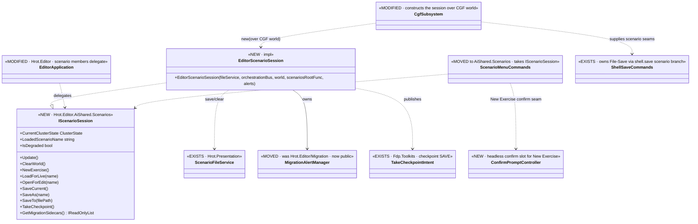
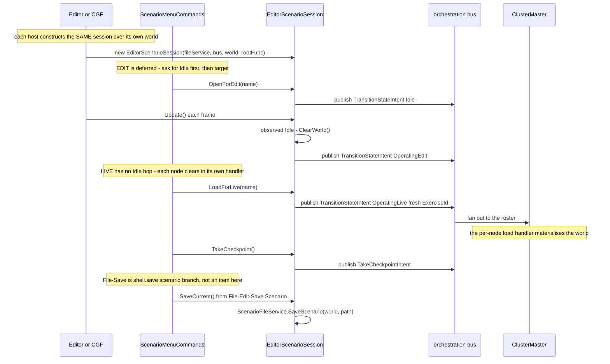

<!--STATUS
state: LIVE
build-state: BUILT — AQ60 Slice A shipped as `CE-046` (`2026-08-26`, UI/CGF lane). = Axis-C increment E1
  (gap map §2c). Distinct File-menu items (no chameleons); toolbar untouched (R3).
updated: 2026-08-26
current-answer: the whole file. §4/§5 carry the UML **as built** — the four deviations are marked inline
  AND listed in §9. Decisions + the user rulings: Architect_Question_60 (§3b, §4, §4b).
  ⛔ Checkpoint RESTORE, capability-gating, toolbar-customization, and the ASSET menu items (E2) are OUT (§8).
stale-below: nothing. §9 is the as-built delta; where §3a and §9 disagree, **§9 wins**.
known-conflict: extends CgfSubsystem.cs + EditorSubsystem.cs + ScenarioMenuCommands.cs (UI/CGF lane) and
  moves EditorApplication's scenario half into Hrot.Editor.AiShared ⇒ UI/CGF lane; rule-4 re-pull.
-->
# DESIGN — **CGF scenario session: the shared facade + distinct File/Scenario menu** *(AQ60 Slice A = Axis-C E1)*

> 🎯 **The user's principle** *(2026-08-26)*: CGF ≡ editor bar distributed-vs-no-network; **most stuff
> shared, minimal duplication.** This is **increment E1 of the editor→shared move** *(gap map §2c Axis C)*:
> extract the scenario half of `EditorApplication` into a shared `IScenarioSession` both hosts instantiate,
> and give **both hosts distinct File-menu items — no chameleons, no per-host defaults in the menu (R2)**.

## 1. ⭐ INTENT BASIS *(cited — R-129)*
| source | binds this slice |
|---|---|
| `Architect_Question_60` §3b/§4/§4b | the user rulings — R1 *(whole editor→shared, nothing capability-level editor-only)*, **R2 *(distinct menu items, no chameleons)***, R3 *(toolbar selection is its own design)* |
| gap map **§2c Axis C** | this is **E1** of the editor→shared extraction *(host-agnostic → shared; the residual thin-host bootstrap is E5)* |
| rulings **58/59/65/66** | 58 all hosts open scenarios · **59 ② Open = cluster-wide request to the master** · 65 editing welcome, save machinery on CGF · 66 load fully possible from CGF |
| `DESIGN_Cgf_Menu_Follows_Focus_Slice.md` §10 *(CE-041..045)* | the shared menu list + `SUBSET-BY-DESIGN` verdict the new items ride on; ⛔ **the menu shows all serviceable items — ruling 49** |
| HN-029 | `/scenario/load/{edit,live}` — the two cluster load paths the menu items route to |

## 2. ⭐⭐ INVENTORY — feasibility *(scans `2026-08-26`; detail: AQ60 §4.1)*
- ⛔ `EditorApplication` can't be shared intact *(assembly wall `Hrot.Editor → Hrot.CGF`)*; ✅ **the scenario half is cleanly separable** — ctor deps engine/shared, **world is a ctor param**, `LoadScenarioByName` already routes through the cluster orchestrator; editor-local ride-along = `MigrationAlertManager` + the `ScenariosRoot` constant.
- ✅ **CGF already LOADS** *(HN-029 `CgfScenarioLoadHandler`)*; the SAVE serializer is on CGF *(`HrotScenarioSerializerFactory.Build`)*; **checkpoint SAVE** exists cluster-wide *(`TakeCheckpointIntent`)*. 🔴 checkpoint **restore** does NOT exist ⇒ §8.
- The `File` menu today: editor registers `File/*` + `File/Scenario/*` *(via `ScenarioMenuCommands`, takes `IEditorLogic`)*; CGF registers only the engine-default `Settings`. ⇒ the wall is `ScenarioMenuCommands` binding to the editor-only `IEditorLogic`.

## 3. ⭐⭐⭐ WHAT TO BUILD *(E1)*
| # | task | the one thing not to get wrong |
|---|---|---|
| ⭐ **①** | **Extract `IScenarioSession` + `EditorScenarioSession`** *(the scenario half of `EditorApplication`)* into **`Hrot.Editor.AiShared`** *(+ `MigrationAlertManager`, the `ScenariosRoot` constant)*. Members: `NewExercise()` · `LoadForLive(name)` · `OpenForEdit(name)` · `SaveCurrent()` · `SaveAs(name)` · `LoadedScenarioName` · `GetMigrationSidecars()` | ⚠⚠ **HN-037 lesson — measure the captures FIRST**; ⛔ do NOT drag the tool/view/mode half *(that is E3/E4)* |
| ⭐⭐ **②** | **Editor delegates** its scenario members to the shared session | ⛔⛔ **editor byte-identical** *(the gate)* — the editor's existing `File/Scenario/*` behaviour unchanged |
| ⭐⭐ **③** | **CGF instantiates** `EditorScenarioSession` over **CGF's own world + orchestration bus** | ⭐ same class, CGF's world — the parameterised-world finding makes this free |
| ⭐⭐⭐ **④** | **`ScenarioMenuCommands` takes `IScenarioSession`** and registers **DISTINCT File-menu items on BOTH hosts (R2)** — see §3a. ⛔ **No chameleon `New`/`Open`; no per-host "default" in the menu** | each item is a **logically distinct action**; all present where serviceable *(ruling 49)* |
| ⭐ **⑤** | **Conformance** — extend the `SUBSET-BY-DESIGN` **menu** verdict *(CE-045 `SubsetShape`)* to the new `File/*` items; a unit rail for `LoadForLive` vs `OpenForEdit` routing + the `NewExercise` confirm-branch | ⛔ NOT full-array identity |

### 3a. ⭐⭐⭐ THE DISTINCT MENU ITEMS *(R2 — no chameleons; both hosts, per serviceability)*
| menu path | action | routes to |
|---|---|---|
| `File/Live/New Exercise` | clear the running exercise + start fresh — **with a confirmation dialog** about finishing a running exercise | a cluster-wide clear/reset to the master |
| `File/Live/Load Scenario` | load a scenario and run it live | **`/scenario/load/live`** *(HN-029, confirmed-at-origin, ruling 59)* |
| `File/Edit/Open Scenario` | open a scenario for editing | **`/scenario/load/edit`** *(HN-029)* |
| `File/Save` | save the scenario open for editing | the editor's exact save via the session *(edit-mode)* |
| `File/Checkpoint/Take Checkpoint` | save the live running state | the existing **`TakeCheckpointIntent`** *(to the master)* |

⛔ **NOT in E1** *(they light up when their service is composed — ruling 49, the derived menu)*: `File/Edit/Open Asset` + `File/Edit/New Asset from Recipe` = **E2** *(the asset-picker/new-asset shell relocation, §6.1)*; `File/Checkpoint/Restore Checkpoint` = **Feature X**. ⭐ E1 establishes the `Live/`·`Edit/`·`Checkpoint/` submenu STRUCTURE; the later items slot in with **zero menu code**.

⛔⛔ **NO toolbar changes in E1 (R3).** Which distinct actions get a toolbar button per host/perspective is the **toolbar+menu customization system — its own AQ** *(gap map §5 FUTURE)*. The toolbar stays exactly as CE-037..045 shipped it.

## 4. ⭐⭐ CLASS DIAGRAM *(authoritative — **AS BUILT**, `CE-046`; the deltas are listed in §9)*

## 5. ⭐⭐ SEQUENCE DIAGRAM *(authoritative — **AS BUILT**; the edit path is TWO-PHASE)*

## 6. ⭐ ACCEPTANCE / RAILS
- **editor byte-identical** — the editor's rendered `File` menu + `IEditorLogic` scenario behaviour unchanged after the extraction + the item rename to the distinct structure *(a `RenderGlobalMenu`/registry-dump diff before/after; ⚠ if the editor's existing item labels change, that IS a visible change — argue it in the report or keep the editor's labels and add the `Live/Edit/Checkpoint` grouping only where new)*.
- **CGF File menu** dumps the E1 items *(Live/New Exercise · Live/Load Scenario · Edit/Open Scenario · Save · Checkpoint/Take Checkpoint)*; the `SUBSET-BY-DESIGN` verdict holds.
- **routing rails** — `LoadForLive`/`OpenForEdit` publish the live/edit `TransitionStateIntent`; `NewExercise` confirms before clearing a running exercise.
- ⛔ **no toolbar entry changed** *(R3 — a rail asserting the toolbar set is unchanged from CE-037..045 is a cheap guard)*.
- affected-project builds; conformance suite named + run *(T3, background)*; reds proven pre-existing by `git diff`.

## 7. ⭐ LANE & GATES
⭐ **UI/CGF lane** *(owns `CgfSubsystem.cs`, `EditorSubsystem.cs`/`EditorApplication.cs`, `ScenarioMenuCommands.cs`; the extraction moves types into `Hrot.Editor.AiShared`)*. ⚠ **rule-4 re-pull** — hot files. Build the AFFECTED projects *(`Hrot.Editor.AiShared` · `Hrot.Editor` · `Hrot.CGF` · `Hrot.Presentation` · `Hrot.SystemTests`)*, ⛔ never the whole solution in the fix loop. Gates per the rule-8 contract; conformance suite **T3 — background it**. Obligation ⑤: fold any as-built deviation into THIS doc.

## 9. ⭐⭐⭐ AS BUILT — **the deviations, argued** *(`CE-046`, `2026-08-26`; obligation ⑤)*

> ⭐⭐ **Where this section and §3a disagree, THIS WINS.** §4/§5 above were rewritten to the as-built, so
> the diagrams are true again rather than merely asserted.

| # | design said | ⭐ as built | why |
|---|---|---|---|
| **D1** | `IScenarioSession` has `NewExercise()` | ⭐⭐ **TWO verbs: `ClearWorld()` *(local wipe)* AND `NewExercise()` *(cluster reset + wipe)*** | 📐 **Measured:** the deferred-load state machine calls the local wipe as **step 1 of its own sequence**. ⛔ Collapsing them would make every edit-open publish a second `Idle` intent from inside the handler for the first. ⇒ `IEditorLogic.NewScenario` maps to `ClearWorld`; only the `File/Live/New Exercise` item reaches `NewExercise` |
| **D2** | §4 draws `ScenarioMenuCommands ..> TakeCheckpointIntent` *(the menu publishes)* | ⭐ **`IScenarioSession.TakeCheckpoint()`** — the session publishes | ⛔ The menu has no bus, so the drawn arrow would put the same one-line publish in **both** hosts' composition roots — two implementations of one concept *(ruling 9)*. ⭐ The session already holds the bus |
| **D3** | §3 ④ *"`ScenarioMenuCommands` takes `IScenarioSession`"* | ⭐⭐ **it also MOVED to `Hrot.Editor.AiShared.Scenarios`** *(with `MigrationAlertManager`, now `public`)* | ⛔ CGF cannot reference `Hrot.Editor` — **that assembly wall is the whole point of the slice** — so taking the interface was necessary and **not sufficient**. ⚠ `AiShared` gained a `Hrot.Presentation` project reference for `ScenarioFileService`; 📐 measured acyclic *(`Hrot.Presentation` → `Hrot.Core`/`Fdp.*` only)* |
| **D4** | §3a lists **`File/Save`** as one of the five items | ⛔⛔ **NO `File/Save` item is registered.** 📐 Measured: `CgfEditorShellToolbar`'s shared slot table **already** emits `File/Save` → `ShellSaveCommands.SaveId`, whose handler **already** branches to the scenario when `isScenarioContext` says so. ⇒ the row is satisfied by **supplying the scenario seams on CGF** *(`isScenarioContext`/`hasLoadedScenario`/`saveScenarioAction`)* | ⭐ Registering a second item at the same path would be two controls for one action, and would touch the toolbar table's own menu row — **which R3 forbids**. ⭐ Ruling 58: one registration list |
| **D5** | §3a implies five items | ⭐ **nine**, because the pre-existing scenario group was **rehomed** rather than left beside the new structure | ⛔ Leaving `File/Scenario/Load Scenario…` in place while adding `File/Edit/Open Scenario` would have kept the chameleon **and** added a duplicate. ⚠ §6 anticipates this: *"if the editor's existing item labels change, that IS a visible change — argue it"*. ⭐ **Every command ID is unchanged**, so hotkeys, MCP identity and id-keyed rails still resolve |
| **D6** | *(unstated)* | ⭐ **`scenariosRoot` is a `Func<string>`, not a string** | ⛔ The editor's `EditorBootstrap.ScenariosRoot` is a computed property over `ClusterConfiguration.Default.NasBasePath`; snapshotting it at construction would change **when** the value is read. ⚠ CGF passes `OrchestrationConstants.GetNodeScenariosRoot(nodeId)` — the same directory its own `HrotScenarioLoader` reads |
| **D7** | §3 ⑤ *"extend the `SUBSET-BY-DESIGN` menu verdict to the new items"* | ⭐⭐ **no extension was needed** — `ClusterConformanceRails`' `global-menu` `SubsetShape` is keyed by `path` and compares `visible`, so it generalises for free | ⛔ **But a subset check cannot fail where the sets should be EQUAL** — a CGF registering none of these items is still *"a subset"*. ⇒ built `TheScenarioMenuIsSharedByBothHostsTests`, which asserts **equality of the item set** and that only *enablement* differs |

### ⚠ Two findings recorded rather than fixed

| finding | |
|---|---|
| **F1 — `MigrationAlertManager.Draw()` has NO production caller.** 📐 Measured: the only reference to the owning property was `EditorApplication.AlertManager` *(`internal`)*, and **nothing read it** ⇒ the degraded-mode banner and the migration modal have **never been drawn**. | ⛔ **Not deleted** *(CLAUDE.md — unreferenced is not unintentional; and `IsDegradedMode` **is** consumed via `IEditorLogic.IsScenarioDegraded`)*. ⭐ Wiring `Draw()` to a frame is its own item |
| **F2 — the live/edit intent shape now lives in three places.** `EditorScenarioSession` *(bus)*, `DebugApiService.LoadScenarioEdit/Live` *(bus, prefers the editor driver)*, `ClusterScenarioPanel` *(the DDS request path)*. | ⭐ The panel is a **different transport**, so not a straight duplicate. ⚠ `DebugApiService`'s **edit** arm is already unified *(it calls `IEditorLogic.LoadScenarioByName`, which now delegates to the session)*; its **live** arm still constructs the intent itself. ⇒ routing it through an optional `IScenarioSession` is a contained follow-up, deliberately not done inside this slice's scope |

## 8. ⛔ EXPLICITLY OUT
- **The ASSET menu items** *(`Edit/Open Asset`, `Edit/New Asset from Recipe`)* — **Axis-C E2 / menu-report §6.1** *(relocate the asset-picker/new-asset shell to AiShared)*. They slot into E1's `Edit/` submenu with zero menu code when E2 lands.
- **Checkpoint RESTORE** *(+ its picker)* — Feature X *(the save exists, restore does not — dead enum slots, no `.fdp` read-back)*. Deferred by the user.
- **Toolbar-button / main-menu-item SELECTION per host/perspective** — the **toolbar+menu customization system**, its own AQ *(R3, gap map §5 FUTURE)*. ⛔ E1 changes no toolbar.
- **Capability-gating config layer** — unify fully-featured first *(R1)*.
- **Save-As modal browser** — rides E2's `PickerRegistry` composition.
