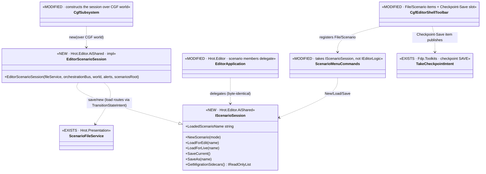
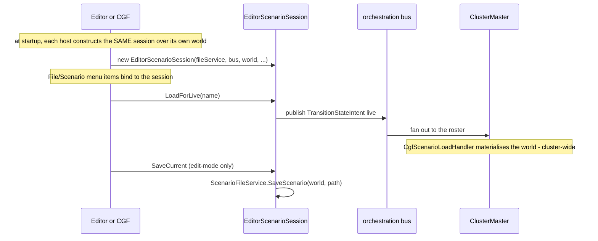

<!--STATUS
state: LIVE
build-state: READY-TO-BUILD — Slice A of Architect_Question_60 (resolved 2026-08-26). Fully-featured
  unification: extract a shared scenario-session facade, instantiate in both, File/Scenario on both hosts.
updated: 2026-08-26
current-answer: the whole file. Decision trail + the user ruling: Architect_Question_60 (§3b, §4).
  ⛔ Checkpoint RESTORE and capability-gating are FUTURE tasks (§8), NOT this slice.
known-conflict: extends CgfSubsystem.cs + EditorSubsystem.cs + CgfEditorShellToolbar.cs (UI/CGF lane)
  and moves EditorApplication's scenario half into Hrot.Editor.AiShared ⇒ UI/CGF lane; rule-4 re-pull.
-->
# DESIGN — **CGF scenario session: the shared facade + File/Scenario on both hosts** *(AQ60 Slice A)*

> 🎯 Make CGF's scenario handling **the same as the editor's, code shared** *(user, `2026-08-26`: "not much
> difference than distributed vs. no-network… most stuff shared, minimal duplication")*. Extract the
> **scenario half** of `EditorApplication` into a shared `IScenarioSession` both hosts instantiate; wire
> `File/Scenario` on both from the one shared list. ⛔ Checkpoint **restore** + capability-gating = future §8.

## 1. ⭐ INTENT BASIS *(cited — R-129)*
| source | binds this slice |
|---|---|
| `Architect_Question_60` §3b/§4 | ⭐⭐⭐ the user ruling + the grounded, feasibility-scanned decisions *(A′/B′/C′/New′)*. **A2-of-scenario = Slice A here** |
| rulings **58/59/65/66** | 58 all hosts open scenarios · **59 ② Open = cluster-wide request to the master** · 65 editing welcome, save machinery on CGF · 66 load fully possible from CGF, editing joins the authoring tier |
| `DESIGN_Cgf_Shell_Command_Toolbar_Slice.md` §9 + `DESIGN_Cgf_Menu_Follows_Focus_Slice.md` §10 | the shared `CgfEditorShellToolbar` list + the `SUBSET-BY-DESIGN` verdict this slice's menu items ride on |
| HN-029 | the cluster load endpoints `/scenario/load/{edit,live}` this slice's Load items route to |

## 2. ⭐⭐ INVENTORY — feasibility *(two read-only scans, `2026-08-26`; full detail in AQ60 §4.1)*
- ⛔ `EditorApplication`/`IEditorLogic` **can't be shared intact** — assembly wall *(`Hrot.Editor → Hrot.CGF`)* + its tool/view/mode half is editor-window-only.
- ✅ **the scenario half is cleanly separable** — ctor deps all engine/shared *(`ScenarioFileService` @ Hrot.Presentation, `FdpEventBus`, `EntityRepository`)*, **world is a ctor param**, `LoadScenarioByName` **already routes through the cluster orchestrator** *(`TransitionStateIntent → HrotEditLoadHandler`)*. Editor-local ride-along: `MigrationAlertManager` (1 field), the `EditorBootstrap.ScenariosRoot` constant.
- ✅ **CGF already LOADS** *(HN-029, `CgfScenarioLoadHandler`, "CGF-authoritative")*; the SAVE serializer is already on CGF *(`HrotScenarioSerializerFactory.Build`)*.
- ✅ **Checkpoint SAVE** exists cluster-wide on CGF *(`TakeCheckpointIntent` → `ClusterMaster` fan-out → `ReferenceCheckpointHandler` → `CheckpointIOWorker`)*, master-triggered. 🔴 **Restore does NOT exist** ⇒ §8.

## 3. ⭐⭐⭐ WHAT TO BUILD *(Slice A)*
| # | task | the one thing not to get wrong |
|---|---|---|
| ⭐ **①** | **Extract `IScenarioSession` + `EditorScenarioSession`** *(the scenario half of `EditorApplication`)* into **`Hrot.Editor.AiShared`**; move `MigrationAlertManager` + the `ScenariosRoot` constant with it | ⚠ **HN-037 lesson — measure the scenario methods' captures FIRST**; ⛔ do NOT drag the tool/view/mode half |
| ⭐⭐ **②** | **Editor delegates** — `EditorApplication`'s scenario members now forward to the shared session | ⛔⛔ **byte-identical** editor behaviour — the editor's `File/Scenario` menu + `IEditorLogic` scenario surface unchanged *(the gate)* |
| ⭐⭐ **③** | **CGF instantiates** `EditorScenarioSession` over **CGF's own world + orchestration bus** | ⭐ same class, different world — the parameterised-world finding is what makes this free |
| ⭐ **④** | **`ScenarioMenuCommands` takes `IScenarioSession`** *(not `IEditorLogic`)*; **two load items** — *Load for Editing* → `/scenario/load/edit`, *Load for Live Run* → `/scenario/load/live` *(HN-029, confirmed-at-origin per ruling 59)*; **New** mode-branched *(live: clear+fresh with a confirm dialog; edit: new-from-recipe)*; **Save** *(edit-mode)* = the editor's save via the session | ⛔ both load items on BOTH hosts — default differs by subsystem, capability does not |
| ⭐ **⑤** | **Checkpoint Save** menu+toolbar item → publishes the existing `TakeCheckpointIntent` *(to the master)* | ⛔ NOT part of the scenario facade — it is a cluster op; a separate slot on the shared `Layout` |
| ⭐ **⑥** | **Conformance** — extend the `SUBSET-BY-DESIGN` **menu** verdict to `File/Scenario/*` *(CGF ⊆ editor, same paths)*; a unit rail for the session's load-edit-vs-live routing | reuse `SubsetShape` *(CE-045)*, ⛔ no new verdict type |

⭐ **Fully-featured** *(AQ60 §4.4)* — ⛔ no host-conditionals; capability-gating is a future config layer over this same surface.

## 4. ⭐⭐ CLASS DIAGRAM *(authoritative)*

## 5. ⭐⭐ SEQUENCE DIAGRAM *(authoritative — both hosts, and a Load-for-Live)*

## 6. ⭐ ACCEPTANCE / RAILS
- **editor byte-identical** — the editor's `File/Scenario` menu + `IEditorLogic` scenario behaviour unchanged after the extraction *(the delegation gate)*.
- **CGF File/Scenario** dumps Load-for-Edit · Load-for-Live · New · Save · Checkpoint-Save; the `SUBSET-BY-DESIGN` menu verdict holds *(CGF ⊆ editor, same paths)*.
- **load routing** rail — `LoadForEdit`/`LoadForLive` publish the edit/live `TransitionStateIntent`; a headless rail asserts the variant.
- **New mode-branch** — live-default asks for confirmation before clearing a running exercise; edit-mode opens the recipe path.
- affected-project builds; the conformance suite named + run *(T3, background)*; reds proven pre-existing by `git diff`.

## 7. ⭐ LANE & GATES
⭐ **UI/CGF lane** *(owns `CgfSubsystem.cs`, `EditorSubsystem.cs`, `CgfEditorShellToolbar.cs`; the extraction moves types into `Hrot.Editor.AiShared`)*. ⚠ **rule-4 re-pull** — these files are hot. Build the AFFECTED projects *(`Hrot.Editor.AiShared` · `Hrot.Editor` · `Hrot.CGF` · `Hrot.Presentation` · `Hrot.SystemTests`)* — ⛔ never the whole solution in the fix loop. Gates per the rule-8 contract; conformance suite **T3 — background it**. Obligation ⑤: fold any as-built deviation back into THIS doc.

## 8. ⛔ EXPLICITLY OUT — **future tasks, own designs** *(AQ60 §4.4)*
- 🔴 **Checkpoint RESTORE** — does not exist *(dead `RestoreSnapshot`/`CollectCheckpoint` enum slots; no `.fdp` read-back; no picker)*. A separate feature: a restore handler + cluster fan-out + a checkpoint list/picker + the *Restore Checkpoint* menu item. **Deferred by the user, `2026-08-26`.**
- 🔴 **Capability-gating config layer** — reduced-capability CGF deployments *(live-only · live+monitoring/debug · fully-headless)*. ⭐ Slice A builds **fully-featured**; the gate layers later over the same derived-subset surface *(ruling 49)*. **User: unify fully-featured FIRST.**
- ⚠ **New (edit-mode) new-from-recipe** shares the asset picker/new-asset shell with the menu report's §6.1 relocation — if §6.1 hasn't landed, either sequence Slice A after it or ship New(edit) minimally and complete it with §6.1. Implementer's call, reported.
