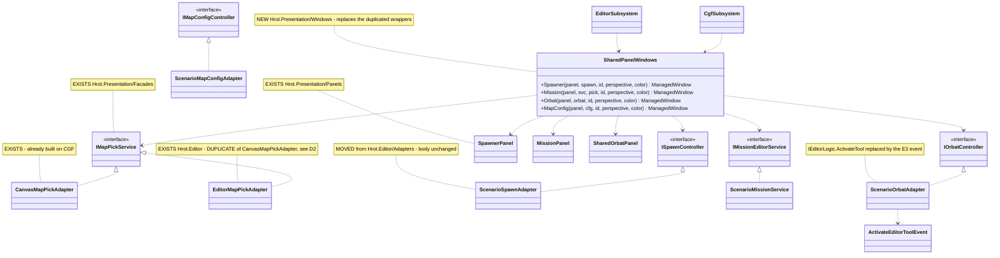
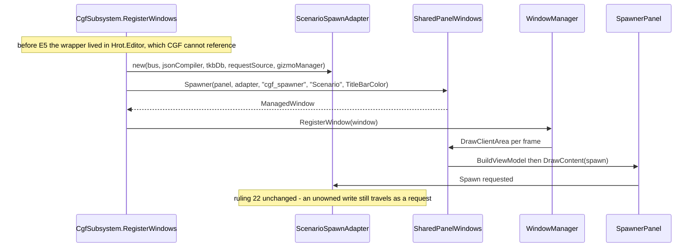

<!--STATUS
state: LIVE
build-state: BUILT
updated: 2026-08-27
current-answer: the whole file. Axis-C E5 — the SCENARIO-PERSPECTIVE WINDOWS (spawner, mission, orbat,
  map config, preview, zone) on CGF. §2 is the inventory, §5 the classDiagram, §6 the sequenceDiagram,
  §7 the item breakdown, §8 the two decisions that needed a call and got one.
current-answer-addendum: §10 is the AS-BUILT and WINS over §5-§8 where they disagree.
stale-below: §2.2's row on EditorSpawnAdapter's `using Hrot.IG.Components` — it calls the using STALE,
  which §10 D2 measures as FALSE (the namespace is declared in Hrot.Core). Do not quote that cell.
known-rot: §5's classDiagram draws a `SharedPanelWindows` factory; the build produced four named window
  TYPES instead (§10 D1) to keep the SimulateDrawClientArea rail seam. The relationships are unchanged.
known-conflict: none. ⚠ PROGRAMME_Cgf_Equals_Editor_Gap_Map.md §2c.2 lists E5 as "the thin-host
  bootstrap divergence, NOT a gap". 📐 That framing is INCOMPLETE, not wrong — see §1: it enumerated
  CAPABILITIES (scenario/asset/tool/inspector) and never enumerated WINDOWS, so the per-host window
  wrappers and their adapters fell between the rows. This design adds that row; the bootstrap
  divergence it names stays exactly as ruled.
-->
# ⭐⭐⭐ AXIS-C **E5** — the Scenario-perspective WINDOWS on CGF

> 🔒 **User, `2026-08-27`, `--mode all`:** *"the editor has many windows in its Scenario perspective like
> mission editor, orbat, entity placement, entity spawner, cgf offers just Entity inspector, Event
> Browser, architecture diagnostic, System profiler."*

## 1. ⚠⚠ THE PREMISE THE GAP MAP MISSED — **E1–E4 shared CAPABILITIES, not WINDOWS**

📐 **Measured, and it explains why four consecutive green slices left this visible:** `--mode all` expands
to `orchestrator,simhost,ig,excon,cgf` — ⛔ **no editor** *(`HrotRunnerConfiguration.Validate`, which also
REJECTS `editor` together with `cgf`)*. ⇒ on that path **CGF *is* the editor**, and every window the
editor registers and CGF does not is a missing feature, not a cosmetic gap.

| what E1–E4 shared | what nobody enumerated |
|---|---|
| the scenario **session** · the asset **picker/create** shell · **tool/selection/camera/rename** · the **inspector** interceptor | ⛔⛔ the **seven `ManagedWindow` wrappers** in `Hrot.Editor/Windows/EditorWindows.cs` and the **five adapters** they need |

⭐⭐ **And the shape is the seam law again, at 2× not 1×:** the PANELS and the FACADE INTERFACES are
**already shared** in `Hrot.Presentation`; what is duplicated is the *wrapper* — `EditorWindows.cs` **and**
`ExConWindows.cs` wrap the same panels with the same body, differing only in id/title/perspective/colour.

## 2. ⭐⭐ INVENTORY — the enumeration, with the queries

```
grep -rn "class Editor[A-Za-z]*Window" Hrot/Subsystems/Hrot.Editor/Windows/EditorWindows.cs   # 7 wrappers
grep -rn "class ExCon[A-Za-z]*Window"  Hrot/Subsystems/Hrot.ExCon/Windows/ExConWindows.cs      # 7 wrappers
grep -rln ": *I{SpawnController|MissionEditorService|MapPickService|OrbatController|MapConfigController}"
grep -c  "IEditorLogic\|_logic\|EditorApplication" Hrot/Subsystems/Hrot.Editor/Adapters/*.cs
grep -n  "ProjectReference" <each csproj>                                                      # the cycle check
```

### 2.1 The panels and facades — ✅ **already shared, in `Hrot.Presentation`**

| kind | types | home |
|---|---|---|
| panels | `MissionPanel` · `SpawnerPanel` · `SharedOrbatPanel` | `Hrot.Presentation/Panels/` |
| facades | `ISpawnController` · `IMissionEditorService` · `IMapPickService` · `IOrbatController` · `IMapConfigController` | `Hrot.Presentation/Facades/` |
| ⭐ a shared map-pick **implementation** | `CanvasMapPickAdapter : IMapPickService` | `Hrot.Presentation/Facades/` — ⭐⭐ **CGF already constructs it** *(`CgfSubsystem` `RegisterWindows`)* |
| ⛔ editor-only panel | `EditorToolbarPanel` *(takes `IEditorLogic`)* | `Hrot.Editor/UI/` |

### 2.2 The five adapters — ⭐ **four are host-agnostic ALREADY; they are in the wrong assembly**

📐 `grep -c "IEditorLogic|_logic|EditorApplication"`:

| adapter | LOC | editor-facade hits | blocker to moving into `Hrot.Presentation` |
|---|--:|--:|---|
| `EditorSpawnAdapter` | 271 | **0** | ⭐ `using Hrot.IG.Components` — 📐 **nothing from it is referenced. A stale using.** ⇒ delete it and the move is clean |
| `EditorMissionService` | 217 | **0** | ⭐ none |
| `EditorMapConfigAdapter` | 71 | **0** | ⭐ none |
| `EditorOrbatAdapter` | 217 | **4** | ⭐⭐ 📐 the hits are **ONE call**: `_logic.ActivateTool(EditorTool.Select)`. ⭐ `E3` already moved `EditorTool` to `Hrot.Common` and built the shared `ToolActivationDrainSystem` ⇒ **publish `ActivateEditorToolEvent`** and `IEditorLogic` drops out entirely |
| `EditorMapPickAdapter` | 134 | **0** | ⛔⛔ **DO NOT MOVE — it DUPLICATES `CanvasMapPickAdapter`** *(§8 D2)* |
| `EditorZoneAdapter` | — | — | ⚠ uses `Hrot.Editor.Gizmos.LocationPickerGizmo` ⇒ needs the same gizmo relocation `E3` did for `EntityRotatorGizmo`. **Deferred to E5b** |

### 2.3 ⛔ The cycle constraint — **measured, and it rules out one obvious home**

```
Hrot.IG  →  Hrot.Presentation          ⇒  ⛔ Hrot.Presentation may NOT reference Hrot.IG
Hrot.Editor → Hrot.CGF                 ⇒  ⛔ CGF may NOT reference Hrot.Editor  (the whole slice's reason)
Hrot.Editor.AiShared → Hrot.Presentation, Hrot.Core   ⇒  ✅ reachable from CGF
```

⇒ ⭐ **`Hrot.Presentation` is the home** for the four clean adapters and the shared wrappers: it already
holds the panels, the facades and `CanvasMapPickAdapter`, and needs **no new project reference**.
⛔ The only thing that wanted `Hrot.IG` was `HrotEntityFilterFactory`, reached solely by the adapter §8 D2
does not move.

## 3. ⭐ WHAT CGF ALREADY HAS for the adapters' arguments

| adapter needs | on CGF |
|---|---|
| `FdpEventBus` | ✅ `_context.World.Bus` / `_context.EventBus` |
| `EntityRepository` | ✅ `_context.World` |
| `BehaviorRegistry` | ✅ `_behaviorRegistry` |
| `ITkbDatabase` | ✅ used by `BuildAssetCatalog` |
| `GlobalGizmoManager` | ✅ `_cgfGizmoManager` |
| `MapCanvas` / `MapViewConfig` | ✅ `_canvas` / its view config |
| `IMapPickService` | ✅⭐ `CanvasMapPickAdapter`, **already constructed** |
| `ScenarioEntityCreationRequestSource` | ⚠ **the one genuine unknown** — resolve at build time; `null` is a legal argument *(optional)*, and its absence must be STATED, not defaulted silently |

## 4. ⛔ NOT IN E5

| out | why |
|---|---|
| `EditorToolbarWindow` / `EditorToolbarPanel` *(the user's "entity placement" palette)* | 📐 takes `IEditorLogic` directly and is a **tool palette**, not a panel over a facade ⇒ its own item once §8 D1's tool seam is exercised |
| `EditorPreviewWindow` · `EditorZoneEditorWindow` | ⚠ `IPreviewController` is the editor's **planning-vs-running** state, which CGF does not have *(a ruled divergence, recorded in `CgfSubsystem`'s `isSimUpSignal` note)*; the zone adapter needs the gizmo move ⇒ **E5b** |
| deleting `ExConWindows.cs`'s wrappers | ⭐ desirable *(ruling 9)* and **separable** — ExCon is the BACKEND lane's file. ⚠ E5 makes the shared set; adopting it on ExCon is a follow-up so this slice does not straddle two lanes |
| reconciling `EditorMapPickAdapter` with `CanvasMapPickAdapter` | §8 D2 — a **decision with regression risk to the editor's map picking**; filed, not smuggled |

## 5. ⭐⭐⭐ CLASS DIAGRAM — existing boxes marked, so a duplicate is visible on the page



## 6. ⭐⭐ SEQUENCE — how CGF gets a spawner window, and where the old wall stood



## 7. ⭐ ITEMS

| # | item | risk |
|---|---|---|
| **①** | `SharedPanelWindows` in `Hrot.Presentation/Windows/` — the four wrappers, id/title/perspective/colour as **arguments**. ⚠ Keep `PanelSnapshot.DeclareInstrumented`/`Register` — the `ui-probe` rails read those | low |
| **②** | `git mv` the four clean adapters → `Hrot.Presentation/Adapters/`, renamed `Scenario*`. ⛔ Bodies unchanged except: drop `EditorSpawnAdapter`'s stale `using Hrot.IG.Components`, and swap `EditorOrbatAdapter`'s one `_logic.ActivateTool` for the `E3` event | ⚠ compile cascade — build the AFFECTED project per §Gates, ⛔ never the solution |
| **③** | `EditorSubsystem` registers through `SharedPanelWindows` — ⭐ **same ids, same titles**, so layout files and every id-keyed rail still resolve | ⚠ **the byte-identical gate**: the editor's window set must not change |
| **④** | `CgfSubsystem` constructs the four adapters + registers the four windows in `"Scenario"`, passing its **existing** `CanvasMapPickAdapter` for mission | low |
| **⑤** | Rails: the two hosts' `Scenario` window sets **agree on the panel KINDS** *(⛔ not on ids — those are per host)*; the adapters are constructed on both; an inverse-edit red-proof per item | ⭐ the layer §1 shows nothing asserted |

## 8. ⭐⭐⭐ TWO DECISIONS

| # | decision | call |
|---|---|---|
| **D1** | `EditorOrbatAdapter`'s `_logic.ActivateTool(EditorTool.Select)` | ⭐⭐ **Publish `ActivateEditorToolEvent`.** `E3` built exactly this seam *(`ToolActivationDrainSystem`, `PostSimulation`)* and both hosts register it. ⛔ Adding an `Action?` tool delegate instead would be a second tool-activation path — ruling 9 |
| **D2** | `EditorMapPickAdapter` **vs** the already-shared `CanvasMapPickAdapter` — both `: IMapPickService`, both ~130 LOC, **same three members** | ⛔⛔ **NOT reconciled in E5, and that is deliberate, not an oversight.** ⚠ The editor's version drives `LocationPickerGizmo` and a real `HrotEntityFilterFactory`; `CanvasMapPickAdapter` carries a private `MatchAllFilterFactory`. ⇒ ⭐ they may be **the same concept at two capability levels**, and collapsing them the wrong way silently degrades the editor's map picking — the user's core workflow. ⭐⭐ E5 needs neither: **CGF passes the shared one it already builds.** 📌 Filed as `CE-063`, with the capability comparison as its first item |

## 9. ⭐ GATES

| gate | command |
|---|---|
| build, **affected project only** | `dotnet build Hrot/Engine/Hrot.Presentation/Hrot.Presentation.csproj --no-restore` *(📐 8 s vs 115 s for the solution)* |
| T0 per edit | `bash scripts/quick-check.sh Hrot/Subsystems/Hrot.Editor.Tests <filter>` |
| T1 before push | `dotnet test Hrot/Subsystems/Hrot.Editor.Tests --no-build` |
| the byte-identical gate | the editor's `Scenario` window **id set** is unchanged — assert it, do not eyeball it |
| T3 async | `bash scripts/run-system-tests.sh --no-build` — ⛔ backgrounded, never a foreground blocker |

## 10. ⭐⭐⭐ AS-BUILT — **where the build deviated, and why** *(`2026-08-27`, `CE-060`/`CE-061`)*

> ⭐⭐ **Where this section and §5–§8 disagree, THIS WINS.** ⛔ §2.2's row on the stale `using` is
> **SUPERSEDED** below; everything else in §2–§9 held.

| # | design said | ⭐ as built | why |
|---|---|---|---|
| **D1** | §5 draws a `SharedPanelWindows` **factory** returning `ManagedWindow` | ⭐ **four PUBLIC window TYPES** — `SpawnerPanelWindow` · `MissionPanelWindow` · `ConfigPanelWindow` · `SharedOrbatPanelWindow` | ⛔ A factory returning the base type would have **retired the `SimulateDrawClientArea` seam** the existing panel-model rails drive. ⭐ Named types keep it, and keep each window's view-model type in the signature |
| **D2** | §2.2: *"`using Hrot.IG.Components` — nothing from it is referenced. **A stale using**"* | ⛔⛔ **WRONG, and the compiler caught it.** ⭐ `Hrot.IG.Components` is a **NAMESPACE DECLARED IN `Hrot.Core`** — `EditablePolyline` and `MapOverlayStyle` live under it and ARE used | 📐 My measurement grepped for `VisualEffect|IgComponent`, which was too narrow to see either type. ⚠⚠ **The conclusion survived by luck, not by reasoning:** the using carries **no `Hrot.IG` assembly reference**, so the move was legal — ⛔ but *"the using is stale"* was false and is recorded at the using itself |
| **D3** | §7 lists five items | ⭐⭐ **plus TWO the design did not anticipate**, both argued | see the two rows below |
| **D3a** | *(unstated)* | ⭐⭐⭐ **`StartPlacementMode` is now SUPPLIED on CGF** | ⚠⚠ **E5 CREATED a silent default.** Before it, CGF composed no spawn adapter, so leaving the seam null was an **honest ruling-49 absence** — the Spawn tool reported itself unserviceable, and `TheViewportInteractionIsSharedTests` cited CGF as exactly that case. ⛔ Once E5 built the adapter, the same omission became *"a production caller that HAS a dependency and does not pass it"* ⇒ a spawner window whose tool refuses. ⭐ Resolved at CALL TIME: the module registers from `Initialize`, the adapter is built later, so a captured value would be permanently null |
| **D3b** | *(unstated)* | ⭐⭐ **`ScenarioSpawnerCatalog.Default`** — one list | 📐 The catalog was an inline literal in **two** hosts *(15 entries in `EditorSubsystem`, a near-duplicate **9** in `ExConSubsystem` with two labels spelled differently)*; a third copy on CGF made it three. ⛔ **ExCon is NOT harmonised** — that file is the BACKEND lane's and whether its shorter list is intent or drift is that owner's call. ⚠ Quietly rewriting another lane's operator-visible labels is not a wiring fix |
| **D4** | §8 D1: replace `_logic.ActivateTool(EditorTool.Select)` with the shared tool event | ⭐⭐⭐ **BOTH events** — `ActivateEditorToolEvent` **and** `SelectEntityCommand` *(`CE-060`)* | 📐 **Measured while making the swap:** the method is called `SelectEntity(int entityId)` and **ignored its argument entirely** ⇒ clicking an ORBAT row selected **nothing**, on either host. ⚠ The design only asked to re-route the call; re-routing it faithfully would have preserved a live defect. ⭐ Same shape as `CE-051`'s finding that `SelectEntityCommand` had no handler |
| **D5** | §4: Preview + Zone are out | ✅ **unchanged** — `EditorPreviewWindow`/`EditorZoneEditorWindow` and `EditorToolbarWindow`/`EditorOrbatWindow` all stay in `EditorWindows.cs` | ⭐ Its head comment now names which four left and why these four stayed |
| **D6** | §8 D2: do not reconcile `EditorMapPickAdapter` with `CanvasMapPickAdapter` | ✅ **held** — CGF passes the `CanvasMapPickAdapter` it already builds; the editor keeps its own | ⭐ Filed **`CE-063`**. ⛔ The duplicate is real and still there — ⚠ that is a **declared** debt, not an oversight |

### ⚠ Findings recorded rather than fixed

| finding | |
|---|---|
| **F1 — `EditorMapPickAdapter` duplicates `CanvasMapPickAdapter`** *(both `: IMapPickService`, ~130 LOC each, same three members)*. The editor's drives `LocationPickerGizmo` + a real `HrotEntityFilterFactory`; the shared one carries a private `MatchAllFilterFactory`. | ⛔ **Not collapsed.** ⭐ They may be one concept at two capability levels, and picking the wrong direction silently degrades the editor's map picking — the user's core workflow. `CE-063` starts with the capability comparison |
| **F2 — `ExConWindows.cs` still declares its own four wrappers**, now duplicating the shared set instead of the editor's. | ⭐ Net duplication is **unchanged** (2 → 2, but one of the two is now the shared home). ⛔ Adopting the shared set on ExCon is the BACKEND lane's file ⇒ separate item |
| **F3 — `MissionPanel`'s node id.** The editor passes a literal `0`; CGF passes `_context.NodeId`. | ⭐ Deliberate, and it is the charter working: *"the editor is a one-node cluster"* means `0` is the editor's real node id, not a placeholder |
