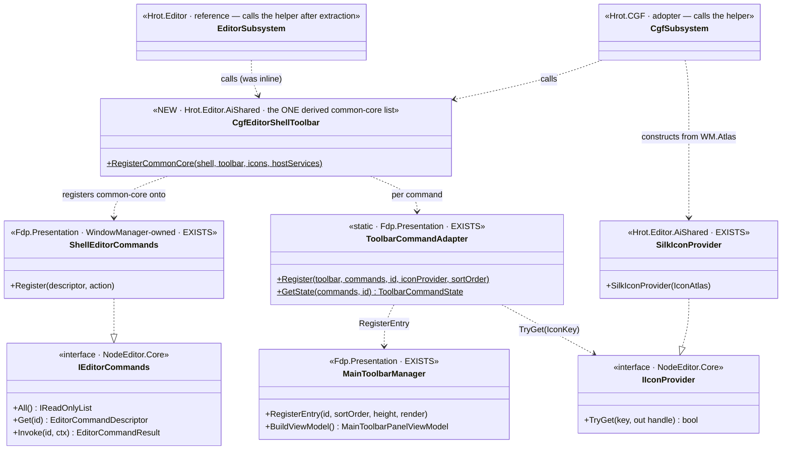
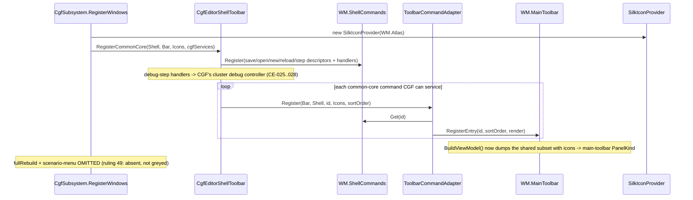

<!--STATUS
state: LIVE
build-state: READY-TO-BUILD — A2 approved (user, 2026-08-26). Extract a shared TOOLBAR-only common-core
  helper both hosts call; adopt on CGF with a real icon provider; defer the UXI-05 menu to its own slice.
updated: 2026-08-26
current-answer: the whole file. Decision trail + options: Architect_Question_58 (A2 approved).
  Intent basis: UX/UX_Feature_Shell_Parity.md (UXI-35, ruling 58/59) + DESIGN_..._Slice2_Open_Asset.md §7.
known-conflict: shares CgfSubsystem.cs + EditorSubsystem.cs with the UI/CGF lane's in-flight work ⇒
  dispatch IN that lane, sequenced after it; rule-4 re-pull before the final commit.
-->
# DESIGN — **CGF shell-command + main-toolbar adoption** *(CE-016 §7, slice A2)*

> 🎯 Route CGF's main toolbar through the **shared** `ShellEditorCommands → ToolbarCommandAdapter (+IIconProvider)`
> pipeline the editor already runs, so CGF's toolbar carries real icon-bearing command buttons that are
> MCP-observable and assert **SAME** on both hosts — closing **seam-law instance 30** *(ruling 58: the
> shell registries have one writer, the editor)*. ⛔ **Menu (UXI-05) is OUT** — its own slice.

## 1. ⭐ INTENT BASIS *(cited — R-129: intent is in the design, not the code)*
| source | binds this slice |
|---|---|
| `Architect_Question_58_*` | the decision + the three options; **A2 approved** *(user, `2026-08-26`)* |
| `UX/UX_Feature_Shell_Parity.md` (UXI-35, rulings 58/59) | ⭐⭐⭐ **item set is DERIVED, not per-host** — *"One registration list… No per-host menu file, no `if (host==…)`."* Names an `ISubsystemShell` helper. Editor = richest reference; CGF = adopter |
| ruling **49** | a command a host cannot service is **OMITTED**, not greyed |
| ruling **13** | status bar reserved ⇒ time control on the toolbar *(CE-034, already done)* |
| `DESIGN_..._Slice2_Open_Asset.md` §7 | *"Every feature slice's acceptance must include 'its toolbar affordance is present and SAME on CGF.'"* |

## 2. ⭐⭐ INVENTORY — as-is *(codebase-memory graph @ 192k nodes + 3 read-only scans, `2026-08-26`)*
**The whole pipeline EXISTS and is shared; CGF under-adopts it.** *(full enumeration: `Architect_Question_58` §1.)*
- CGF's `WindowManager` already **owns** an (empty) `ShellEditorCommands` and a `MainToolbarManager`.
- CGF today: `MainToolbarTimeControlSection` (`CgfSubsystem.cs:1082`) + **two ad-hoc `ImGui.Button`** entries `"SaveAllAiDocuments"`/`"QuickReloadAiAsset"` (`:1657-1667`, no icons, not commands) + a dangling `ToolbarSep_TimeToPersp` (`:1087`). **No** `ShellEditorCommands` use, **no** `ToolbarCommandAdapter`, **no** `IIconProvider`.
- Editor reference wiring: `EditorSubsystem.cs:4464-4562` — `new SilkIconProvider(windowManager.Atlas)`; register Save/Open/New + AI-debug + compileReload/fullRebuild on `windowManager.ShellCommands`; `ToolbarCommandAdapter.Register(...)` per command; `PerspectiveToolbarSection`. **Sole writer** of the four registries *(ruling 58 / seam-law 30)*.
- ⚠ The **canvas** `/editor/commands` MCP bus is a DIFFERENT `IEditorCommands` instance and already answers on CGF *(MD-008)* — ⛔ not this slice.

## 3. ⭐⭐⭐ WHAT TO BUILD *(A2)*
| # | item | the one thing not to get wrong |
|---|---|---|
| **①** | ⭐ **A shared toolbar common-core helper** `CgfEditorShellToolbar` *(or `ISubsystemShell` toolbar half)* in **`Hrot.Editor.AiShared`** — `RegisterCommonCore(shell, toolbar, icons, hostServices)`: registers the common-core command descriptors on `shell` and `ToolbarCommandAdapter.Register`s each onto `toolbar`, at the editor's ids + sort orders | ⛔⛔ **ONE registration list** *(ruling 58)* — ⛔ NOT a CGF-private copy of the editor's inline list |
| **②** | ⭐⭐ **Extract the editor's inline toolbar wiring** *(`EditorSubsystem.cs:4464-4562`)* to call `CgfEditorShellToolbar.RegisterCommonCore` | ⛔⛔ **behaviour-preserving** — the editor's rendered toolbar entry list is **byte-identical** after; that is this item's gate |
| **③** | ⭐⭐ **Adopt on CGF** — `new SilkIconProvider(windowManager.Atlas)`, call `RegisterCommonCore(windowManager.ShellCommands, windowManager.MainToolbar, icons, cgfServices)`, **delete** the two ad-hoc `ImGui.Button` entries + the dangling separator | ⭐ debug-step handlers route through **CGF's cluster debug controller** *(CE-025..028)*, ⛔ not the editor's `AiDebugCommands` |
| **④** | ⭐ **Flip the conformance rail** — delete the `main-toolbar` known-divergence entry in `ClusterConformanceRails.cs` *(`:256-259`)*; the three-way diff then asserts the **shared subset** is SAME by id+sortOrder+visibility | ⛔ NOT full-array identity — the editor legitimately has more *(fullRebuild, scenario-menu)*; those are **declared absent** on CGF *(ruling 49)* |

**The common-core subset CGF registers** *(§58-B)*: Save · SaveAll · Open Asset · New Asset · QuickReload — CGF already holds the services *(save/reload CE-022; create/recipe MA-019..023)* — plus AI-debug step routed through CGF's controller. **OMIT** `fullRebuild` + scenario-menu on CGF *(declared absent)*.

## 4. ⭐⭐ CLASS DIAGRAM *(authoritative)*

## 5. ⭐⭐ SEQUENCE DIAGRAM *(authoritative — the CGF adoption path)*

## 6. ⭐ ACCEPTANCE / RAILS
- CGF's `main-toolbar` PanelKind dumps the shared-subset entries **with icons**, by id+sortOrder; the `main-toolbar` known-divergence entry is **deleted** ⇒ the three-way conformance rail asserts SAME on the shared subset.
- The editor's rendered toolbar entry list is **unchanged** after the extraction *(the byte-identical gate — a headless `MainToolbarManager.BuildViewModel` diff before/after)*.
- Each registered command **invokes** through `IEditorCommands.Invoke` *(headless `ToolbarCommandAdapter.GetState` rail)*; debug-step reaches CGF's cluster controller.
- Omitted commands *(fullRebuild, scenario-menu)* are **declared absent**, not greyed *(ruling 49)*.

## 7. ⭐ LANE & GATES
⭐ **Dispatch to the UI/CGF lane** *(owns `CgfSubsystem.cs` + `EditorSubsystem.cs` — so the extraction is IN-lane)*, sequenced **after** its current work. ⛔ Does not touch the diagnostics lane's files. ⭐ **rule-4 re-pull** before the final commit *(both shared files are hot)*.
Build the AFFECTED projects *(`Hrot.Editor.AiShared` · `Hrot.Editor` · `Hrot.CGF` · `Hrot.SystemTests`)* — ⛔ never the whole solution in the fix loop. Gates per the rule-8 contract; the conformance rail is **T3 — background it**. Obligation ⑤: fold any as-built deviation back into **this** doc before the batch closes.

## 8. ⛔ EXPLICITLY OUT
- **The menu (UXI-05 menu-follows-focus)** — its own slice; when built, its menu registration **extends this same helper** *(not a second list)*.
- The canvas `/editor/commands` bus *(MD-008 — already answers on CGF)*.
- `PerspectiveToolbarSection` on CGF is **optional here**: if the dangling `ToolbarSep_TimeToPersp` is removed, no perspective section is required for A2; adding it is a cheap round-out if CGF has a perspective switcher wired *(it does — `WindowManagerPerspectiveSwitcher`)* — implementer's call, reported either way.
