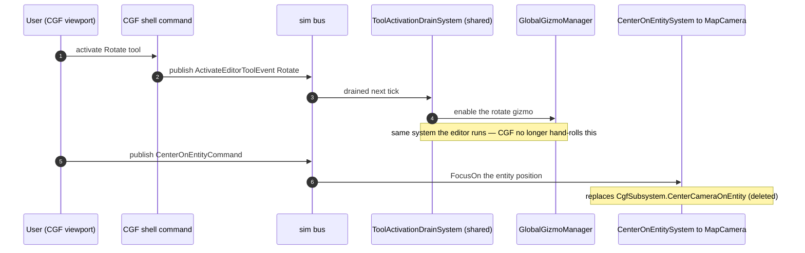

<!--STATUS
state: LIVE
build-state: READY-TO-BUILD. Carries the INVENTORY (§2), a classDiagram (§4) and a sequenceDiagram (§5).
  Axis-C increment E3 (gap map §2c line 171). Handoff references this; do not design in the handoff.
updated: 2026-08-26
current-answer: §3 = what to build. §4/§5 = the UML. §2 = the measured inventory. §6 = the two-way
  reconciliation risk (the load-bearing warning — E3 is a lift AND a de-dup, done together).
design-basis: PROGRAMME_Cgf_Equals_Editor_Gap_Map.md §2c line 171 (E3 = tool/selection/camera/rename → shared,
  "CGF is windowed") + §2c.2 (the assembly wall) · DESIGN_Cgf_Asset_Picker_Shell_Slice.md (E2 — the extract+dedup
  precedent) · DESIGN_Uniform_Gizmo_Membership.md (gizmo membership, context) · ruling 9 (one implementation) ·
  HN-037 (measure captures — a lift, not s/old/new/) · the ScenarioEditorModule stub comment "PACK2-E002 tool migration".
known-conflict: extracts from EditorSubsystem.cs (the 5k monolith) + edits CgfSubsystem.cs (delete its
  hand-rolled center/rotate parallels) + populates ScenarioEditorModule (Hrot.Presentation). Hot files —
  rule-4 re-pull. ⛔ Disjoint from the MCP lane (DebugApi) and the backend lane (test projects).
-->
# DESIGN — **CGF tool / selection / camera / rename** *(Axis-C increment E3)*

> 🎯 Give CGF the editor's **viewport interaction** — activate a tool, select an entity, center the camera,
> rename an entity — by **extracting the orchestration from the editor monolith into shared systems both hosts
> register**, and **deleting CGF's drifted hand-rolled parallels** (ruling 9). ⛔ CGF is not missing the
> viewport primitives — it has them; it is missing the *unified* path.

## 1. ⭐⭐⭐ THE FINDING — thin publishers, orchestration in the monolith, a stub reserved for exactly this
📐 Measured `2026-08-26`. The four `EditorApplication` entry points are **thin event publishers**:
`ActivateTool` → `ActivateEditorToolEvent` *(`EditorApplication.cs:148`)* · `CenterOnEntity` → `CenterOnEntityCommand` *(:195)* ·
`SelectEntity` → `SelectEntityCommand` *(:199)* · `OpenRenameDialog` → `OpenRenameDialogCommand` *(:203)*.
The real behaviour is a **drain welded into `EditorSubsystem.cs` (~5000 lines)**: `DrainToolActivationEvents` *(:4907)*,
the center handler *(:5000)*, the rename handler *(:5013)* and the inline ImGui rename modal *(:2570)*.
⛔ **There is no `ITool`/`ToolManager` registry** — the "tool system" is the `EditorTool` enum
*(Select/Spawn/Edit/Route/Measure/Rotate)* + a switch + the (already shared) gizmos.

⭐⭐ **The intended home already exists and is EMPTY:** `ScenarioEditorModule` *(Hrot.Presentation, shared,
`IEcsModule`)* has an empty `RegisterSystems` with the comment *"populated in PACK2-E002 (tool migration)"* —
never done *(`ScenarioEditorModule.cs:33`)*. ⇒ **E3 finishes PACK2-E002.**

## 2. ⭐⭐⭐ INVENTORY — measured
| symbol | home | verdict for E3 |
|---|---|---|
| `EditorTool` enum · `ActivateEditorToolEvent` | Hrot.Editor | ⭐ clean lift → AiShared/shared |
| `CenterOnEntityCommand` | Hrot.Editor.Commands | ⭐ move to Core *(the other two commands already live there)* |
| `SelectEntityCommand` · `OpenRenameDialogCommand` | `Hrot.Common.Events` | ✅ already shared |
| gizmos *(`VertexEdit`/`RouteWaypoint`/`Measure`/`EntityRotator`)* + `GlobalGizmoManager`/`DataDrivenGizmoSystem`/`GizmoExecutionController` | Fdp / Presentation / SimHost | ✅ already shared |
| `ISelectionState` / `DefaultSelectionState` | Fdp.Presentation `Vis2D` | ✅ already shared *(the E3 viewport selection)* |
| `MapCanvas` / `MapCamera` *(`FocusOn`)* | Fdp.Presentation `Vis2D` | ✅ already shared |
| `EditorSpawnAdapter` *(`StartPlacementModeWithLastType`)* | Hrot.Editor.Adapters | ⭐ clean-ish lift *(deps all Fdp/shared, no `IEditorLogic`)* |
| ⭐ **`ScenarioEditorModule`** *(empty `RegisterSystems`)* | Hrot.Presentation | ⭐⭐⭐ **the home — populate it (PACK2-E002)** |
| 🔴 the DRAIN + center/rename handlers + rename modal | **welded into `EditorSubsystem.cs`** | 🔴 **the real seam — extract to shared systems + an AiShared modal** |

⚠ **Selection is NOT map-pick.** E3 = `DefaultSelectionState` *(persistent viewport selection: `PrimarySelected`/`SelectedEntities`)*.
⛔ `IMapPickService.PickEntityAsync` *(transient async "click to resolve a network id")* is **Axis-B** *(UXI-10/11/29)* — a
different concept with different backing; ⛔ **E3 does not touch it.**

## 3. ⭐ WHAT TO BUILD *(5 items)*
| # | task | the one thing not to get wrong |
|---|---|---|
| ⭐ **①** | **Lift** `EditorTool` · `ActivateEditorToolEvent` · `EditorSpawnAdapter` to shared; **move `CenterOnEntityCommand` to Core** *(beside the other two)* | ⚠ HN-037: a lift, not `s/old/new/` — editor references the moved types byte-identically |
| ⭐⭐⭐ **②** | **Populate `ScenarioEditorModule.RegisterSystems`** *(PACK2-E002)* with the shared drain systems: `ToolActivationDrainSystem` *(→ activates the Spawn/Edit/Route/Measure/Rotate gizmo)* · `SelectEntitySystem` *(→ writes `DefaultSelectionState`)* · `CenterOnEntitySystem` *(→ `MapCamera.FocusOn`)*. **Extract the bodies from `EditorSubsystem`'s drain** | ⛔⛔ the drain reads editor-local `_spawnAdapter`/`_mapPickAdapter`/`EntityInfo`/`EntityWriteRouter` — thread these as module deps; ⛔ do NOT drag `IEditorLogic` in |
| ⭐⭐⭐ **③** | **Extract `EntityRenameModal`** *(ImGui)* → `Hrot.Editor.AiShared.Browser` *(beside the existing `AssetRenameModal`)*; driven by `OpenRenameDialogCommand`, commits via the shared property-edit seam | ⛔ needs an ImGui context ⇒ a windowed host only; a headless node never registers it *(ruling 49 — like the E2 modal)* |
| ⭐⭐⭐ **④** | **Editor delegates** — delete `DrainToolActivationEvents` + the center/rename handlers + the inline modal from `EditorSubsystem`; register `ScenarioEditorModule` + the modal instead | ⛔⛔ **editor byte-identical behaviour** *(the gate)* |
| ⭐⭐ **⑤** | **CGF composes + DE-DUPS** — register `ScenarioEditorModule` + the modal over its existing `MapCanvas`/`MapCamera`/`DefaultSelectionState`/gizmo stack, and **DELETE CGF's hand-rolled `CenterCameraOnEntity` *(`CgfSubsystem.cs:2201`)* + ad-hoc rotate/context-menu parallels** — route them through the shared systems | ⛔⛔ **this is the two-way reconciliation (§6)** — CGF's parallels must die, not sit beside the shared path |

## 4. ⭐⭐⭐ CLASS DIAGRAM

```mermaid
classDiagram
    direction LR
    class ScenarioEditorModule {
        <<exists · STUB · Hrot.Presentation · populate RegisterSystems (PACK2-E002)>>
        +RegisterSystems(world)
    }
    class ToolActivationDrainSystem {
        <<NEW · shared · drains ActivateEditorToolEvent>>
    }
    class SelectEntitySystem {
        <<NEW · shared · SelectEntityCommand to SelectionState>>
    }
    class CenterOnEntitySystem {
        <<NEW · shared · CenterOnEntityCommand to camera>>
    }
    class EntityRenameModal {
        <<NEW · AiShared.Browser · ImGui · beside AssetRenameModal>>
    }
    class EditorSpawnAdapter {
        <<LIFT to shared · StartPlacementModeWithLastType>>
    }
    class DefaultSelectionState {
        <<exists · Fdp.Presentation · already shared>>
    }
    class MapCamera {
        <<exists · Fdp.Presentation · FocusOn>>
    }
    class GlobalGizmoManager {
        <<exists · Fdp · the gizmo stack, already shared>>
    }
    class EditorSubsystem {
        <<exists · DELETE its drain + handlers + inline modal>>
    }
    class CgfSubsystem {
        <<exists · DELETE its hand-rolled CenterCameraOnEntity + ad-hoc rotate>>
    }
    ScenarioEditorModule *-- ToolActivationDrainSystem
    ScenarioEditorModule *-- SelectEntitySystem
    ScenarioEditorModule *-- CenterOnEntitySystem
    ToolActivationDrainSystem ..> EditorSpawnAdapter : Spawn tool
    ToolActivationDrainSystem ..> GlobalGizmoManager : Edit/Route/Measure/Rotate
    SelectEntitySystem ..> DefaultSelectionState : writes
    CenterOnEntitySystem ..> MapCamera : FocusOn
    EditorSubsystem ..> ScenarioEditorModule : registers (was inline drain)
    EditorSubsystem ..> EntityRenameModal : renders (was inline)
    CgfSubsystem ..> ScenarioEditorModule : registers (E3 — was hand-rolled)
    CgfSubsystem ..> EntityRenameModal : renders (E3 — new)
    note for CgfSubsystem "E3 DELETES CgfSubsystem.CenterCameraOnEntity (:2201) and the ad-hoc rotate/context-menu parallels — they route through the shared systems now (ruling 9)."
    note for ScenarioEditorModule "The empty RegisterSystems was reserved for PACK2-E002 tool migration; E3 finishes it. Both hosts already register modules over the same viewport primitives."
```

## 5. ⭐⭐⭐ SEQUENCE DIAGRAM *(CGF, activate the Rotate tool then center — via the shared path)*

## 6. 🔴🔴 THE LOAD-BEARING RISK — **E3 is a two-way reconciliation, not a one-way lift** *(HN-037)*
⛔ The editor drives tools via an **event-drain in the monolith**; CGF has **independently hand-rolled direct
context-menu callbacks** *(`CenterCameraOnEntity`, an ad-hoc `EntityRotatorGizmo` wiring)*. ⇒ ⭐⭐ **the shared
systems must reproduce the editor's behaviour AND CGF must DELETE its parallels — done together, or the two
paths drift further.** 📌 This is exactly the E2 lesson *(the two create-cores had already drifted in 3 places)*
one increment earlier. ⭐ **Measure both sides before writing the shared body**; the report states, per host, what
was deleted and what it now routes through.

## 7. ⭐ DONE — rails
- **editor byte-identical** *(the drain/handlers/modal moved, behaviour unchanged)*; CGF activates the **same tool set** and its center/rotate now route through the shared systems *(a rail asserting CGF's deleted parallels are gone — a source scan, like E2's create-core rail)*; `SelectEntity` writes `DefaultSelectionState` on both; the entity-rename modal works on both windowed hosts and is **absent (not broken)** on a headless node *(ruling 49)*.
- affected-project builds *(`Hrot.Presentation` · `Hrot.Editor.AiShared` · `Hrot.Editor` · `Hrot.CGF`)*; conformance suite named + backgrounded (T3); reds proven pre-existing by `git diff`.

## 8. ⛔ NOT IN E3
- **map-pick** *(`IMapPickService`)* — Axis-B *(UXI-10/11/29)*, a separate track. ⛔ untouched.
- **view / inspector / property-edit** *(`View`/`DerRepo`, `CommitPropertyEdit`, `RebuildAndReloadAI`)* — **E4**.
- ⛔ no new tool vocabulary — only the existing `EditorTool` set; a *tool-customization* surface, if ever, is the future toolbar/menu-customization AQ.
