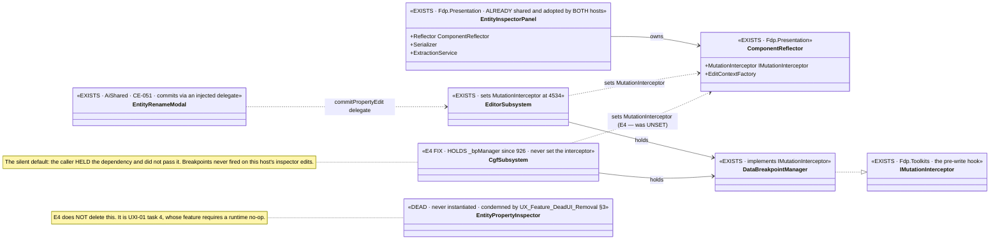
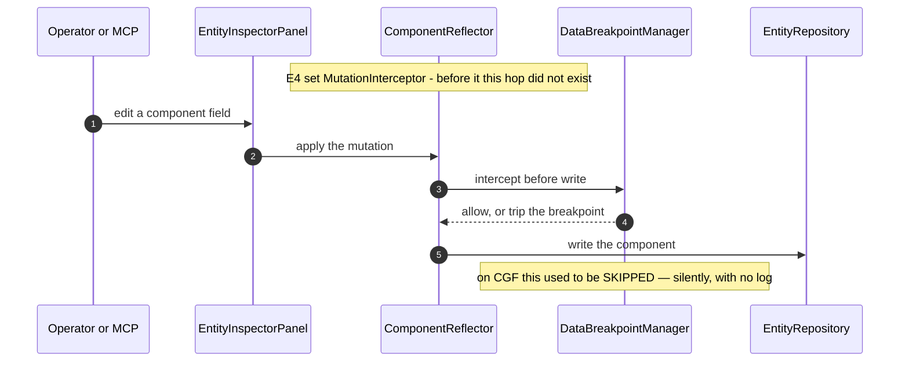

<!--STATUS
state: LIVE
build-state: READY-TO-BUILD — Axis-C increment E4, authored by the implementation session from a FRAME
  handoff (WHO-DESIGNS amendment). Carries the INVENTORY (§2), a classDiagram (§5) and a sequenceDiagram (§6).
updated: 2026-08-26
current-answer: §2 = the measured inventory, and it OVERTURNS the frame's premise — read §1 first.
  §4 = what to build (three items, much smaller than the frame assumed). §5/§6 = the UML.
design-basis: PROGRAMME_Cgf_Equals_Editor_Gap_Map.md §2c line 172 (the E4 frame) ·
  DESIGN_Cgf_Scenario_Session_Slice.md / DESIGN_Cgf_Asset_Picker_Shell_Slice.md /
  DESIGN_Cgf_Tool_Selection_Camera_Slice.md (the E1–E3 extraction-pattern precedent, and E3's §6 two-way
  reconciliation lesson) · docs/UX/UX_Feature_DeadUI_Removal.md §3 (which ALREADY condemns two of the three
  types the frame points at) · CLAUDE.md's SILENT-DEFAULT rule (the one real defect found) ·
  ruling 9 · ruling 49.
known-conflict: edits CgfSubsystem.cs (hot file) — rule-4 re-pull. ⛔ Disjoint from the MCP lane (DebugApi)
  and the backend lane (test projects).
-->
# DESIGN — **CGF view / inspector / property-edit** *(Axis-C increment E4)*

> 🎯 **The frame asked: "give CGF the editor's view/inspector/property-edit surface."**
> 📐 **Measured answer: CGF ALREADY HAS IT — both hosts have composed the same shared inspector panel for
> some time.** ⇒ E4 is not an extraction. It is **one real defect, one small seam, and a correction to the
> roadmap's own line 172.**

## 1. ⛔⛔ THE PREMISE CORRECTION — **read this before §4**

⭐⭐⭐ **The three things the frame names as "→ shared" are, measured:**

| the frame says | 📐 measured `2026-08-26` |
|---|---|
| *"the view/inspector orchestration → shared"* | ✅ **ALREADY SHARED, ALREADY ADOPTED ON BOTH HOSTS.** `Fdp.Presentation.Panels.EntityInspectorPanel` is composed by `EditorSubsystem.cs:243` **and** `CgfSubsystem.cs:306`, each with its own `Serializer` + `ExtractionService` + context-menu handlers, each registering an inspector window. ⇒ ⛔ **there is nothing to extract** |
| *"`View`/`DerRepo` read surface → shared"* | ⛔⛔ **Its only two consumers are BOTH condemned dead UI.** `EditorOrbatPanel` *(constructed at `EditorSubsystem.cs:1559`, **never registered**)* and `EntityPropertyInspector` *(48 lines, **never instantiated** outside its own test)*. 📄 **`docs/UX/UX_Feature_DeadUI_Removal.md` §3 already lists both**, and its STATUS block says they are *"still open and still condemned — no ruling has touched them."* ⇒ ⭐ **sharing `DerRepo` would be sharing a surface the design corpus is deleting** |
| *"`CommitPropertyEdit` → shared"* | ⚠ **Real, but tiny.** After `CE-051` its only live consumer is the **already-shared** `EntityRenameModal`, which takes it as an injected delegate. The remaining sites are 2 in `EditorSubsystem` + the dead stub |

### ⭐⭐ …and E3's §6 lesson INVERTED

⭐ E2 found the two hosts' create-cores had drifted; E3 found CGF hand-rolling parallels. ⇒ E4's frame
correctly told me to expect a two-way reconciliation. 📐 **It is two-way, but the other way round: CGF is
not the host that is behind.** The **editor** carries the dead stub the roadmap points at, and CGF's
inspector composition is, if anything, richer *(two buffer-view providers + an `EditContextFactory` for
the blackboard DTOs)*.

### 🔴🔴 THE ONE REAL DEFECT — and it has a named rule

📐 **`CgfSubsystem` constructs a `DataBreakpointManager` at `:926` and NEVER assigns
`_fdpEntityInspector.Reflector.MutationInterceptor`.** The editor does, at `:4534`, with the comment
*"wire MutationInterceptor early so it is set in headless mode too."*

⇒ ⛔⛔ **Data breakpoints do not fire on inspector-driven mutations on CGF** — silently. No throw, no log,
no failing assertion; a breakpoint the operator set simply never trips.

⭐⭐⭐ **This is exactly CLAUDE.md's SILENT-DEFAULT shape, verbatim: *"a production caller that HAS a
dependency must PASS it."*** ⚠ And it is the *distinguishing* case that rule names — ⛔ not a harmlessly
defaulted optional, but a caller **holding the value two hundred lines from where it is needed** and not
handing it over. 📌 The rule's own precedent is `PerspectiveWorkspaceRegistrar` handing an exporter to the
validator two lines above the window it did not hand it to.

## 2. ⭐⭐⭐ INVENTORY — measured *(the queries are in §3)*

| symbol | home | verdict for E4 |
|---|---|---|
| `Fdp.Presentation.Panels.EntityInspectorPanel` | `Fdp.Presentation` | ✅ **already shared AND adopted by both hosts** — nothing to do |
| `ComponentReflector` *(+ `MutationInterceptor`, `EditContextFactory`, buffer-view providers)* | `Fdp.Presentation` | ✅ already shared. 🔴 **CGF leaves `MutationInterceptor` unset** — the defect |
| `ComponentEditDrawer` · `ComponentEditWindow` · `IComponentEditService` | `Fdp.Presentation` / StructEdit | ✅ already shared; both hosts compose an edit service |
| `IEditorLogic.CommitPropertyEdit` | `Hrot.Editor` | ⚠ the write seam. ⭐ Already reachable host-agnostically as a **delegate** *(`EntityRenameModal` proves the shape)*; ⛔ a full `IPropertyEditor` interface would be a seam with one method and two callers |
| `IEditorLogic.View` / `DerRepo` | `Hrot.Editor` / `Fdp.Toolkit.DER` | ⛔ **do NOT share** — both consumers are condemned dead UI *(§1)* |
| `Hrot.Editor/UI/EntityPropertyInspector.cs` *(48 L)* | `Hrot.Editor` | ⛔ **condemned already** — `UX_Feature_DeadUI_Removal.md` §3 row 4. ⚠ Not E4's to delete unilaterally: it is `UXI-01`'s task 4 and its feature requires *"a no-op at runtime"* |
| `IEditorLogic.RebuildAndReloadAI` | `Hrot.Editor` | ⛔ **its own increment, not E4** — see §7 |

## 3. ⭐ THE QUERIES RUN *(so the enumeration is checkable — INVENTORY rule)*

| query | result |
|---|---|
| `search_graph(name_pattern=".*(EntityInspector\|PropertyInspector\|EntityPropertyEdit\|ComponentEdit).*")` | `total: 172` — the inspector/edit machinery is overwhelmingly in `Fdp.Presentation` + StructEdit, **not** in either host |
| `grep -rn "CommitPropertyEdit"` *(production, non-Stride)* | 6 files: `EntityPropertyInspector` *(dead)* · `EditorSubsystem` ×2 · `EntityRenameModal` *(already shared)* · `IEditorLogic` · `EditorApplication` |
| `grep -rn "MutationInterceptor"` | editor sets it *(`:4534`)*; **CGF never does**, though it holds `_bpManager` from `:926` |
| `grep -rn "EntityPropertyInspector"` | **zero production instantiations** — only its own test |
| `grep -rln "EntityPropertyInspector" docs/ .dev/` | 6 docs, incl. **`UX_Feature_DeadUI_Removal.md`**, which already condemns it |

## 4. ⭐⭐ WHAT TO BUILD — **three items, and deliberately no extraction**

| # | task | the one thing not to get wrong |
|---|---|---|
| ⭐⭐⭐ **①** | **Wire CGF's `MutationInterceptor`** from the `DataBreakpointManager` it already holds, at the same point in composition the editor does *(before the headless early-return, so it is set headless too)* | ⛔ **This is the whole functional content of E4.** ⚠ It must be set even when headless — the editor's comment says exactly why, and MCP-driven mutations are the headless case that matters |
| ⭐⭐ **②** | **A forwarding rail PER HOST, asserted on the CONSTRUCTED OBJECT** — not on the composition source | 🔒 CLAUDE.md's control for the silent-default class: *"a forwarding rail PER DEPENDENCY, asserted on the CONSTRUCTED OBJECT."* ⚠ A source scan would pass on a line that assigns the wrong thing |
| ⭐ **③** | **Record the premise correction in the gap map's E4 line** so the roadmap stops asking for an extraction that is already done | ⛔ Do not silently drop line 172 — ⭐ mark it measured-and-superseded with the evidence, per the DESIGN-DOCUMENT-FORMAT rules |

⛔ **NOT building:** an `IPropertyEditor` seam *(one method, two callers, and the delegate shape already
works — a new interface here is the "shared X" the seam law warns about)*; a `DerRepo` share *(§1)*; the
two dead-UI deletions *(`UXI-01`'s, and its feature demands a runtime no-op)*.

## 5. ⭐⭐⭐ CLASS DIAGRAM

## 6. ⭐⭐⭐ SEQUENCE DIAGRAM *(a breakpointed inspector edit on CGF — after E4)*

## 7. ⛔ NOT IN E4

- **`RebuildAndReloadAI`** — ⭐ **decided, per the frame's decide-and-log:** it is **its own increment**, not
  E4. 📐 It shells out to `dotnet build` on the AI-behaviours project and relies on a
  `FileSystemWatcher`/ALC swap; ⇒ it is a **dev-loop capability**, not the view/inspector surface, and on a
  deployed CGF node there is no project to build. ⚠ Sharing it would hand a non-dev host a button that
  cannot work — ruling 49 says absent-and-explained beats present-and-broken.
- **`EntityPropertyInspector` / `EditorOrbatPanel` deletions** — `UXI-01` task 3/4.
- **`DerRepo` sharing** — §1.
- **The live `stage_entity_variable` debug write path** — a different seam from `CommitPropertyEdit`; the
  frame flagged the distinction and the measurement confirms they are separate.
