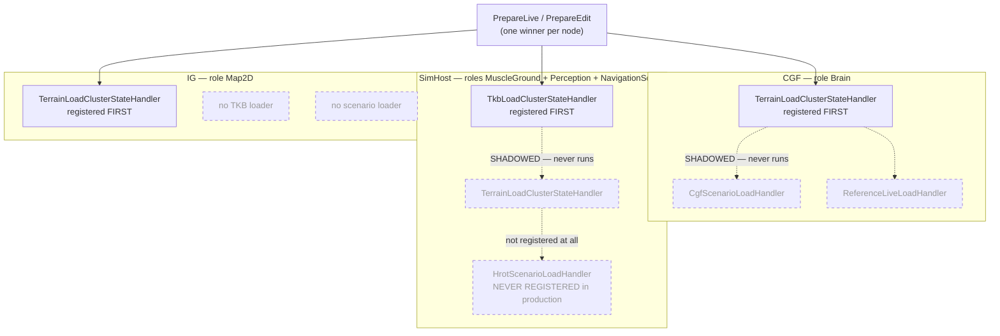
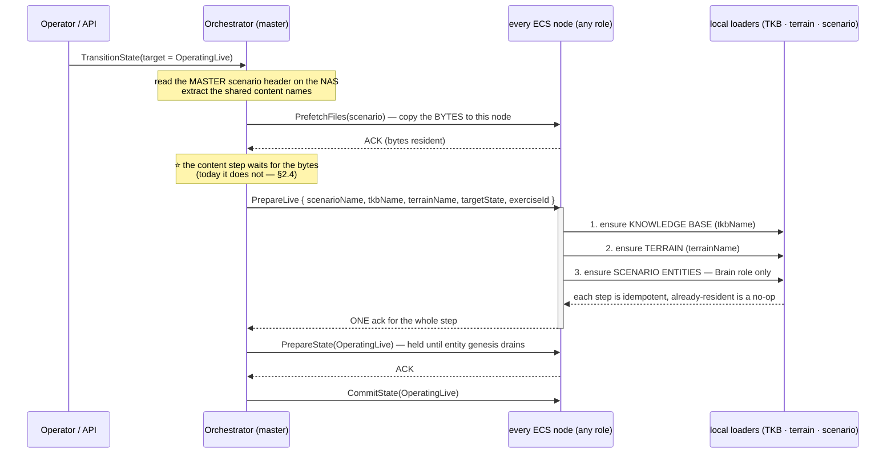
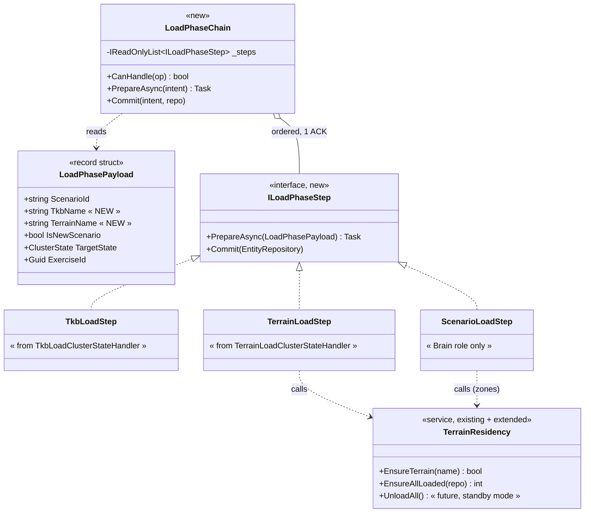
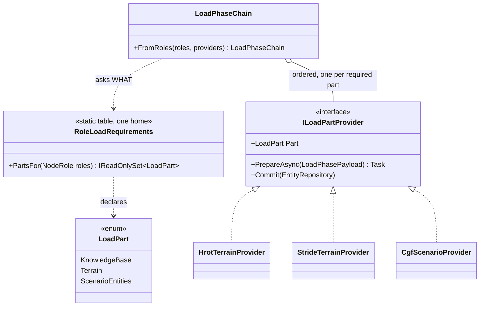

<!--STATUS
state: LIVE
updated: 2026-09-18
build-state: READY-TO-BUILD
current-answer: §4 (the per-role contract) and §5 (the plan). §2 is the measured as-is.
stale-below: nothing
known-rot: nothing known
known-conflict: DESIGN_Terrain_Zones_And_Assets.md §2.1e ④ ("it must NOT ride the scenario-load
  handler") argued the opposite of §4 here. Its PREMISE is confirmed by measurement (§2.3) but its
  CONCLUSION is superseded — see §4.3. That section is marked SUPERSEDED in its own file.
related-designs:
  - docs/DESIGN_Terrain_Zones_And_Assets.md — owns WHAT terrain and zones ARE (the definition file,
    the ECS singleton, the zone ops, the asset build). This document owns only WHEN it loads and WHO
    runs it during the cluster's Loading* phase.
  - docs/DESIGN_Artifact_Staging.md — owns how the BYTES reach a node (NAS -> per-node staging, the
    skip predicate, the staged header sidecar). This document owns what the load MESSAGE carries.
  - docs/DESIGN_Deterministic_Network_Ids.md — owns the id authority reset at the world boundary,
    which happens in this same phase.
  - docs/DESIGN_Node_Roles_And_Policies.md — ⭐⭐⭐ owns the ROLES themselves and therefore §3.2's
    per-role REQUIREMENT table (which role needs the knowledge base / terrain / scenario entities, by
    measured consumer). This document owns HOW and WHEN those requirements are satisfied and never
    restates the table. Its §3.1 (a role never denies a capability) bounds §4.1b here.
-->

# DESIGN — **the cluster LOAD phase: what each ROLE does, and how TKB, terrain and scenario compose**

> 🔒 **User, `2026-09-18`:** *"the node-centric concept is superseded, replaced with unification and
> role-centric approach … each node must be able to do all what is required for its role, in unified
> way. The init phase is distributed and should be unified; potentially each node must be able to load
> those scenario parts it needs."*
>
> 🔒 **User, same day:** *"Role not reading scenario file directly still need to consume 'shared' parts
> of the scenario like the TKB and terrain. These 'shared' part must be communicated in the cluster
> orchestration message initiating the LoadingXXX state."*
>
> 🔒 **And on terrain specifically:** *"the scenario load should do the terrain load first; terrain load
> should happen as part of scenario load unless the terrain is already loaded; no separate
> terrain-preload step is needed at the moment … terrain loading should be callable from multiple
> places … should be idempotent; and we might need to support terrain unloading as well."*

---

## 1. INVENTORY — measured `2026-09-18` (graph + grep; `check_index_coverage` NOT run)

```
search_graph(name_pattern=".*ClusterStateHandler.*", label="Class")                    -> total 4  (2 production, 2 test)
search_graph(name_pattern=".*(ScenarioLoadHandler|EditLoadHandler|LiveLoadHandler|PrefetchHandler).*",
             label="Class")                                                            -> total 14 (8 production, 4 test, 2 payload records)
grep -rn "RegisterHandler" <the three host bootstrappers>                               -> 11 + 9 + 6 call sites
```

| production handler that can claim a `Loading*` step | file |
|---|---|
| `TkbLoadClusterStateHandler` | `Hrot/Subsystems/Hrot.SimHost/Orchestration/Handlers/TkbLoadClusterStateHandler.cs` |
| `TerrainLoadClusterStateHandler` | `Hrot/Engine/Hrot.Core/Services/TerrainLoadClusterStateHandler.cs` |
| `CgfScenarioLoadHandler` | `Hrot/Subsystems/Hrot.CGF/Orchestration/Handlers/CgfScenarioLoadHandler.cs` |
| `HrotScenarioLoadHandler` | `Hrot/Subsystems/Hrot.SimHost/Orchestration/Handlers/HrotScenarioLoadHandler.cs` |
| `HrotEditLoadHandler` | `Hrot/Engine/Hrot.Presentation/ScenarioEditor/Handlers/HrotEditLoadHandler.cs` |
| `ReferenceReplayLoadHandler` · `ReferenceLiveLoadHandler` · `ReferencePrefetchHandler` · `ExConScenarioLoadHandler` | `FDP/Toolkits/.../Handlers/`, `Hrot/Subsystems/Hrot.ExCon/Observer/` |

---

## 2. AS-IS — **the measured picture, and it is worse than "terrain is in the wrong place"**

### 2.1 The dispatch rule that decides everything

📐 `ClusterSlave.cs:404-448` — the node walks its handler list, gives the step to the **first** handler
whose `CanHandle` returns true, and **returns**. One step, one participant, one ACK.
⛔ Every other handler that wanted that step is silently skipped. Nothing logs it.

### 2.2 What that produces today, per host



*What the picture shows that the prose hid: the dashed edges are the whole defect. On **CGF** the
terrain loader cancels the scenario loader, so the cluster loads **zero entities**. On **SimHost** the
TKB loader cancels the terrain loader, so terrain has **never** loaded there. And a **named TKB** is
loaded on SimHost only — CGF and IG build their knowledge base from the hard-coded catalogue and would
ignore a scenario's `TkbName` entirely.*

| 📐 measured evidence | |
|---|---|
| CGF loads nothing | a temporary probe showed `CgfScenarioLoadHandler.PrepareAsync` never invoked for `PrepareLive`; disabling the terrain registration on CGF changed the load from `entityCount:0, sawWorldChange:false` to `entityCount:8, sawWorldChange:true` and the full `hill-attack-close` run then passed both acceptance conditions |
| pinned, and red on the dispatch base `a5e9a5278` too | `ClusterConformanceRails.The_two_hosts_hold_the_same_loaded_world` · `..._number_the_same_entities_identically` — `[editor] entityCount:8` vs `[all] entityCount:0` |
| terrain never runs on SimHost | registration order `NodeBootstrapper.cs:331` (TKB) before `:344` (terrain), first-wins; the `--mode all` log carries exactly **two** `[TerrainLoad]` lines for **three** ECS hosts |

### 2.3 Why the scenario loader is absent on SimHost — **the premise `Terrain §2.1e ④` got right**

📐 `SimHostNodeBootstrapper.cs:391-438` passes the serializer but **not** the extractor / request source /
id allocator, with its own comment: *"Load handlers stay off (no authoring deps here)."* The registration
in `NodeBootstrapper.cs:365` is conditional on all three. ⇒ **in production SimHost has no scenario-load
handler at all**, and neither does IG. That is not an oversight — it is the role model: the **Brain** role
owns reading, parsing and saving the scenario; the muscle / perception / navigation / map roles consume a
world that is replicated to them.

### 2.4 How the shared names reach a node today — **a sidecar file, not the message**

| | |
|---|---|
| the load message (`EditLoadHandlerPayload`, `ReferenceEditLoadHandler.cs:8`) carries | `ScenarioId` (the scenario NAME) · `IsNewScenario` · `TargetState` · `ExerciseId` |
| it does **not** carry | ⛔ **`TkbName`** · ⛔ **`TerrainName`** · ⛔ anything else about content |
| so the names travel by | the orchestrator's gateway reading the master scenario header on the NAS and writing `{node staging}/TKB/ScenarioHeader.json` during the file-copy step (`StorageGatewayModule.BuildStagedHeaderJson`); each node then reads that file off its own disk (`TkbLoadClusterStateHandler`, `ScenarioTerrainName.Read`) |

🔴 **And that channel races the step that consumes it.** 📐 Measured in one `--mode all` load:
`PrefetchScenario started` at `T+0`, **`PrepareLive` dispatched at `T+6 ms`**, `PrefetchFiles` fanned out
at `T+55 ms`, staging ACKs at `T+118 ms`. The scenario loader survives only because it retries for two
seconds; **the TKB and terrain loaders do not retry** — they read once, find no header, and conclude
*"this scenario names no TKB / no terrain"*, which is a **legal and silent** answer indistinguishable from
the truth. ⇒ a node can come up on default content with nothing anywhere saying so.

---

## 3. THE MODEL — one unified load phase, composed per role



*What the picture shows that the prose hid: the node answers **once** for a step that has **three**
participants. That is the difference from today, where three handlers compete for one ACK and two lose
silently — and it is why this cannot be fixed by reordering the list.*



*What the picture shows that the prose hid: terrain residency is a **service with several callers**, not a
cluster step. The step is one caller; the future operator-driven preload is another; a standby unload is a
third. That is what makes "callable from multiple places" structural rather than a promise.*

---

## 4. THE PER-ROLE CONTRACT

### 4.1 What each role does in the `Loading*` phase

> ⛔⛔ **CORRECTED `2026-09-18`, before any of this was built.** The first version of this table gave
> **every** role a ✅ for terrain, with reasons like *"line of sight and broadphase are terrain-dependent"*
> and *"draws the map background and road graphics"*. 🔴 **Those were written from a principle, not from a
> measurement** — the precise failure mode `R-139` exists to prevent. 📐 Measured (`search_code` + grep
> agree): the only production consumers of the road graph are `CarKinematicsSystem` and the pathfinding
> solver. The rows below are by CONSUMER.

⭐⭐ **The per-role requirement table is owned by
[`DESIGN_Node_Roles_And_Policies.md`](DESIGN_Node_Roles_And_Policies.md) §3.2** — that document owns what a
role *is*, so it owns what a role *needs*. ⛔ It is not restated here. In summary: **every role needs the
knowledge base; only `MuscleGround` and `NavigationSolver` have a measured terrain consumer; only `Brain`
reads the scenario file**, because only `Brain` also edits and saves it.

⇒ ⭐ That asymmetry is exactly why the shared content names must ride the **message**: four of five roles
never open the scenario file, so they cannot read the names out of it.

### 4.1a ⛔ OPEN — **does a role with no consumer still load terrain?**

⚠ Two rules point in opposite directions and this document owns the tie-break:

| ⭐ load it anyway | ⛔ do not load it |
|---|---|
| [`DESIGN_Terrain_Zones_And_Assets.md`](DESIGN_Terrain_Zones_And_Assets.md) §8.3 N4 — a zone operation is **cluster-wide**, and a node that does not hold the named terrain must **fail loudly** rather than silently pass | 🔒 the user's own framing: *"each node must be able to load those scenario parts **it needs**"*. Nothing on `Brain`, `Perception` or `Map2D` reads the road graph — ⭐ `Map2D` even holds a `RoadNetworkHolder` (`IgNodeBootstrapper.cs:80`) that **nothing on that host reads**. And memory held for no reader is the opposite of §5.1's future standby mode |

⭐ **Lean: do NOT load it where no consumer exists**, and narrow §8.3 N4's loud failure to roles that
declare the requirement. ⚠ **What would change the lean:** a measured consumer appearing on `Map2D` (a map
that actually draws the road graph) or on `Perception` (line of sight against terrain obstacles) — both are
plausible and neither exists today. ⇒ the requirement table is the single place that would change.

### 4.1b ⭐⭐⭐ THE ROLE DECLARES THE *WHAT*; THE HOST SUPPLIES THE *HOW* *(user, `2026-09-18`)*

> 🔒 **User, verbatim:** *"the goal is to unify the handling of the loading phase across host by binding
> it to the host role, not to the host bootstrap code, while keeping the possibility for each host to
> override the HOW the handling is done (like stride-simhost loads different data than SimHost because
> they implement their muscle/perception/navigation/etc… role differently)."*

⭐⭐ **This is what makes the chain in §3 uniform rather than three parallel chains.** The host bootstrap
stops deciding *whether* a part loads; it only registers *how*.



*What the picture shows that the prose hid: `HrotTerrainProvider` and `StrideTerrainProvider` satisfy the
**same** requirement with **different** data, and the chain cannot tell them apart. That is the override
point, and it is the only one — nothing lets a host satisfy fewer parts than its roles require.*

| ⭐ the rules that fall out | |
|---|---|
| ⭐⭐⭐ **a host may not require LESS than its roles do** | ⛔ composing the chain from the role set makes "forgot to register the terrain step on this host" unrepresentable — which is precisely the defect class in §2.2 |
| ⭐⭐ **a host MAY satisfy a part differently** | `HrotStrideApp` and `Hrot.SimHost` both carry `MuscleGround`; both must make terrain resident; they load different data |
| ⛔ **a missing provider for a required part is a STARTUP failure, loud** | ⚠ not a silent skip — that is the whole disease this replaces |
| ⛔ **this is NOT a permission gate** | 📄 `DESIGN_Node_Roles_And_Policies.md` §3.1 — a role never denies a capability. A host that composes a scenario reader may run that step whatever its role says; the table is the default, not a prohibition |

⇒ ⭐ **`L2`/`L4` in §5 are restated by this:** the chain is built from `roles × providers`, not from a
hand-written registration order in each bootstrapper.

### 4.2 Where the parts come from

| part | carried by | consumed by |
|---|---|---|
| **which** TKB / terrain / scenario | ⭐ the **load message** (§3's payload) — the orchestrator extracts the names from the master scenario on the NAS | every node, per its role |
| **the bytes** (TKB archive, terrain definition, scenario file) | ⭐ the **staging copy** — NAS → per-node directory, before the content step | the loaders |
| **what this node needs** | ⭐ **the node's own role** — never on the wire | the chain, locally |

### 4.3 ⛔ SUPERSEDES `DESIGN_Terrain_Zones_And_Assets.md` §2.1e ④

That section ruled *"the terrain loader must NOT ride the scenario-load handler"*, on the measured ground
that a muscle node has no scenario-load handler (§2.3 — **the premise is correct and still holds**). Its
remedy was *"register it unconditionally on every ECS host, like the TKB loader"* — and that is exactly
what produced the shadowing in §2.2, because registering unconditionally means **competing**
unconditionally.

⇒ The premise survives; the conclusion is replaced. Terrain is neither a competitor nor a passenger on the
scenario load: it is an **ordered step in one composed chain** that every ECS host runs, and on the Brain
role the scenario step simply comes after it — which satisfies *"scenario load does the terrain load
first"* without hanging terrain off a handler four roles do not have.

---

## 5. THE PLAN

| # | item | owner surface |
|---|---|---|
| **L1** | Add `TkbName` and `TerrainName` to the load payload; the orchestrator fills them from the master scenario header it already reads. ⭐ The payload crosses the wire as **JSON**, so this is purely additive — no wire id, no compatibility break (`R-42` does not bite) | `ReferenceEditLoadHandler.cs` payload · `StorageGatewayModule` / the transition fan-out |
| **L2** | Introduce the ordered **load-phase chain**: one registered handler per ECS host claiming `PrepareLive`/`PrepareEdit`, running its steps in order and ACKing once. ⭐ Composed from **`roles × providers`** (§4.1b), never from a per-bootstrapper registration order; a required part with no provider fails **loudly at startup** | new, beside `SerializeLocalRegistrar` |
| **L3** | Re-home `TkbLoadClusterStateHandler` and `TerrainLoadClusterStateHandler` as **steps**, reading their name from the payload, falling back to the staged header only when the payload is silent (one release of tolerance) | both handlers |
| **L4** | Register the chain on **every ECS host** — CGF, SimHost, IG, editor — with the scenario step present only where the Brain role composes it | the three bootstrappers + the editor |
| **L5** | Terrain residency becomes a service with a stable entry point: `EnsureTerrain(name)` idempotent (already-resident ⇒ no-op), plus an `UnloadAll()` seam left **unwired** for the future standby mode | `TerrainLoadService` |
| **L6** | Ensure the content step runs **after** the staging ACKs, closing the race in §2.4 — and remove the two-second retry that papers over it today | the orchestrator's transition sequencing |
| **L7** | Rails: the chain runs **all** its steps and ACKs once · a shadowed step is impossible by construction · a Brain host loads entities · a non-Brain host loads TKB + terrain and **no** entities · the payload names beat the sidecar · an absent name is legal and silent, an absent **artifact** is loud | `Hrot.SimHost.Tests`, `Hrot.CGF` tests, and the existing cluster conformance rails |

### 5.1 Deliberately NOT in this plan

| | |
|---|---|
| ⛔ a separate terrain **preload** cluster step | 🔒 user: *"no separate terrain-preload step is needed at the moment (although it could happen later — but that would likely require new cluster node operation)"*. `L5`'s service is the seam it would call |
| ⛔ terrain **unload** wired to anything | 🔒 user: *"we might need to support terrain unloading as well if we wanted (in the future) the hosts to go to some kind of clean low-memory standby mode"*. The entry point exists; nothing calls it |
| ⛔ changing `ClusterSlave` to run every matching handler | ⚠ several handlers depend on first-wins exclusivity — `ReferenceLiveLoadHandler` claims cold `PrepareLive` *only if* a scenario handler did not, and running both would double the recording preparation. The chain gets the ordering without touching the dispatcher |
| ⛔ giving non-Brain roles a scenario reader | §4.1 — the role model says the Brain owns the file; the others receive a replicated world |

### 5.2 Acceptance

⭐ `--mode all`, stock build, `hill-attack-close`: the load answers `entityCount: 8, sawWorldChange: true`;
all three ECS worlds hold the 8 entities; both hostiles reach zero health; all four attackers report
`LocomotionChannel.Status = Success` within a few metres of their **own** `NavigationIntent.FinalDestination`
with ammunition no longer changing. 📐 That exact outcome was already produced by the probe build in §2.2 —
this plan is what makes it true without a probe.
