<!--STATUS
state: LIVE
updated: 2026-10-06 (§8.1 CE-3076: the WorldEpoch list completed — EQS config, damage, lifecycle status, entity info, mission control, brain tick, dispatchers; CE-3093 the clock is not reset at the boundary) · 2026-10-05 (§8 CE-2101: the world boundary clears every host; §9 CE-295: a load over a loaded cluster unloads first; §10 CE-3075: a scenario naming no terrain unloads the resident one)
build-state: L1-L8 BUILT 2026-09-18 (§6 the AS-BUILT of L1-L7, §7.7 the AS-BUILT of L8, §5.2 the measured acceptance).
  ⭐ L8 (the deterministic staging WAIT — parked transitions) closed the half of L6 that §6.4 had deferred:
  every wait-on-a-clock in the load path is DELETED.
current-answer: §4 (the per-role contract), §5 (the plan + the MET acceptance), §6 (the AS-BUILT of L1-L7) and
  ⭐ §7 (L8 — the deterministic staging WAIT, BUILT; §7.7 is its AS-BUILT).
  ⭐ §8 (CE-2101 — the world boundary clears every host before the load, BUILT; §8.1 CE-3076 completed its WorldEpoch list).
  ⭐ §9 (CE-295 — a load over a loaded cluster asks for Idle first, through ONE caller-side sequence, BUILT).
  §2 is the measured as-is that the build removed.
  ⭐ §4.1 splits the two DERIVATIONS — the knowledge base is required by every ECS node (not role-derived),
  terrain and scenario entities are role-derived. §4.1a is RULED (load nothing where nothing reads it).
  §4.1b is role x provider composition. ⭐⭐ §4.1c is the ONE scenario-load step and the measured
  three-copy drift it retires.
stale-below: §2 describes the world BEFORE this batch. It is kept because the defect it measures is the
  whole argument for §3-§4; ⛔ do not read it as current.
known-rot: nothing known
known-conflict: DESIGN_Terrain_Zones_And_Assets.md §2.1e ④ ("it must NOT ride the scenario-load
  handler") argued the opposite of §4 here. Its PREMISE is confirmed by measurement (§2.3) but its
  CONCLUSION is superseded — see §4.3. That section is marked SUPERSEDED in its own file.
related-designs:
  - docs/DESIGN_Terrain_World.md — owns the terrain's CONTENT; its §5 made the terrain world UNIVERSAL (every ECS node; the navmesh bake stays NavigationSolver-only) — folded into §4.1a's table 2026-10-03.
  - docs/DESIGN_Terrain_Zones_And_Assets.md — owns WHAT terrain and zones ARE (the definition file,
    the ECS singleton, the zone ops, the asset build). This document owns only WHEN it loads and WHO
    runs it during the cluster's Loading* phase.
  - docs/blueprints/Architect_Question_72_Asset_Lifecycle_And_Distribution.md — the general asset
    lifecycle (per-node needs, transport packaging, authoring sync). ⭐ Q72-L records that this
    document's RoleLoadRequirements is the natural SOURCE of its hrot.asset.needs.* token set — this
    one decides what a node LOADS, that one decides what bytes reach its disk first. They compose.
  - docs/DESIGN_Artifact_Staging.md — owns how the BYTES reach a node (NAS -> per-node staging, the
    skip predicate, the staged header sidecar). This document owns what the load MESSAGE carries.
  - docs/DESIGN_Asset_Management.md — ⭐⭐ DERIVES its per-node needs vocabulary (hrot.asset.needs.*)
    FROM this document's RoleLoadRequirements (Q72-L). ⛔ That table stays the single source: a second
    hand-authored needs table would be R-132 (two producers for one slot). This one decides what a node
    LOADS; that one decides what bytes reach its disk first.
  - docs/DESIGN_Deterministic_Network_Ids.md — owns the id authority reset at the world boundary,
    which happens in this same phase.
  - docs/DESIGN_Node_Roles_And_Policies.md — ⭐⭐⭐ owns the ROLES themselves and therefore §3.2's
    per-role REQUIREMENT table (which role needs the knowledge base / terrain / scenario entities, by
    measured consumer). This document owns HOW and WHEN those requirements are satisfied and never
    restates the table. Its §3.1 (a role never denies a capability) bounds §4.1b here.
-->

# DESIGN — **the cluster LOAD phase: what each ROLE does, and how TKB, terrain and scenario compose**

> 🔒 **User, `2026-09-18`:** *"the node-centric concept is superseded, replaced with unification and
> role-centric approach … each node must be able to do all what is required for its role, in unified
> way. The init phase is distributed and should be unified; potentially each node must be able to load
> those scenario parts it needs."*
>
> 🔒 **User, same day:** *"Role not reading scenario file directly still need to consume 'shared' parts
> of the scenario like the TKB and terrain. These 'shared' part must be communicated in the cluster
> orchestration message initiating the LoadingXXX state."*
>
> 🔒 **And on terrain specifically:** *"the scenario load should do the terrain load first; terrain load
> should happen as part of scenario load unless the terrain is already loaded; no separate
> terrain-preload step is needed at the moment … terrain loading should be callable from multiple
> places … should be idempotent; and we might need to support terrain unloading as well."*

---

## 1. INVENTORY — measured `2026-09-18` (graph + grep; `check_index_coverage` NOT run)

```
search_graph(name_pattern=".*ClusterStateHandler.*", label="Class")                    -> total 4  (2 production, 2 test)
search_graph(name_pattern=".*(ScenarioLoadHandler|EditLoadHandler|LiveLoadHandler|PrefetchHandler).*",
             label="Class")                                                            -> total 14 (8 production, 4 test, 2 payload records)
grep -rn "RegisterHandler" <the three host bootstrappers>                               -> 11 + 9 + 6 call sites
```

| production handler that can claim a `Loading*` step | file |
|---|---|
| `TkbLoadClusterStateHandler` | `Hrot/Subsystems/Hrot.SimHost/Orchestration/Handlers/TkbLoadClusterStateHandler.cs` |
| `TerrainLoadClusterStateHandler` | `Hrot/Engine/Hrot.Core/Services/TerrainLoadClusterStateHandler.cs` |
| `CgfScenarioLoadHandler` | `Hrot/Subsystems/Hrot.CGF/Orchestration/Handlers/CgfScenarioLoadHandler.cs` |
| `HrotScenarioLoadHandler` | `Hrot/Subsystems/Hrot.SimHost/Orchestration/Handlers/HrotScenarioLoadHandler.cs` |
| `HrotEditLoadHandler` | `Hrot/Engine/Hrot.Presentation/ScenarioEditor/Handlers/HrotEditLoadHandler.cs` |
| `ReferenceReplayLoadHandler` · `ReferenceLiveLoadHandler` · `ReferencePrefetchHandler` · `ExConScenarioLoadHandler` | `FDP/Toolkits/.../Handlers/`, `Hrot/Subsystems/Hrot.ExCon/Observer/` |

---

## 2. AS-IS — **the measured picture, and it is worse than "terrain is in the wrong place"**

### 2.1 The dispatch rule that decides everything

📐 `ClusterSlave.cs:404-448` — the node walks its handler list, gives the step to the **first** handler
whose `CanHandle` returns true, and **returns**. One step, one participant, one ACK.
⛔ Every other handler that wanted that step is silently skipped. Nothing logs it.

### 2.2 What that produces today, per host

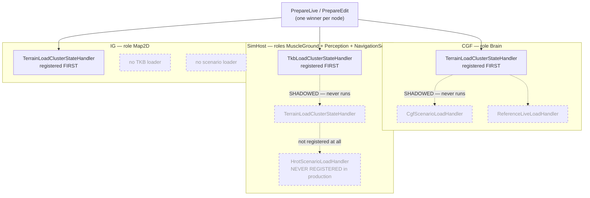
```mermaid
graph TD
  subgraph CGF["CGF — role Brain"]
    C1["TerrainLoadClusterStateHandler<br/>registered FIRST"]
    C2["CgfScenarioLoadHandler"]
    C3["ReferenceLiveLoadHandler"]
  end
  subgraph SH["SimHost — roles MuscleGround + Perception + NavigationSolver"]
    S1["TkbLoadClusterStateHandler<br/>registered FIRST"]
    S2["TerrainLoadClusterStateHandler"]
    S3["HrotScenarioLoadHandler<br/>NEVER REGISTERED in production"]
  end
  subgraph IG["IG — role Map2D"]
    I1["TerrainLoadClusterStateHandler<br/>registered FIRST"]
    I2["no TKB loader"]
    I3["no scenario loader"]
  end

  P["PrepareLive / PrepareEdit<br/>(one winner per node)"] --> C1
  P --> S1
  P --> I1
  C1 -.->|"SHADOWED — never runs"| C2
  C1 -.-> C3
  S1 -.->|"SHADOWED — never runs"| S2
  S2 -.->|"not registered at all"| S3

  classDef dead stroke-dasharray: 5 5,color:#999
  class C2,C3,S2,S3,I2,I3 dead
```

*What the picture shows that the prose hid: the dashed edges are the whole defect. On **CGF** the
terrain loader cancels the scenario loader, so the cluster loads **zero entities**. On **SimHost** the
TKB loader cancels the terrain loader, so terrain has **never** loaded there. And a **named TKB** is
loaded on SimHost only — CGF and IG build their knowledge base from the hard-coded catalogue and would
ignore a scenario's `TkbName` entirely.*

| 📐 measured evidence | |
|---|---|
| CGF loads nothing | a temporary probe showed `CgfScenarioLoadHandler.PrepareAsync` never invoked for `PrepareLive`; disabling the terrain registration on CGF changed the load from `entityCount:0, sawWorldChange:false` to `entityCount:8, sawWorldChange:true` and the full `hill-attack-close` run then passed both acceptance conditions |
| pinned, and red on the dispatch base `a5e9a5278` too | `ClusterConformanceRails.The_two_hosts_hold_the_same_loaded_world` · `..._number_the_same_entities_identically` — `[editor] entityCount:8` vs `[all] entityCount:0` |
| terrain never runs on SimHost | registration order `NodeBootstrapper.cs:331` (TKB) before `:344` (terrain), first-wins; the `--mode all` log carries exactly **two** `[TerrainLoad]` lines for **three** ECS hosts |

### 2.3 Why the scenario loader is absent on SimHost — **the premise `Terrain §2.1e ④` got right**

📐 `SimHostNodeBootstrapper.cs:391-438` passes the serializer but **not** the extractor / request source /
id allocator, with its own comment: *"Load handlers stay off (no authoring deps here)."* The registration
in `NodeBootstrapper.cs:365` is conditional on all three. ⇒ **in production SimHost has no scenario-load
handler at all**, and neither does IG. That is not an oversight — it is the role model: the **Brain** role
owns reading, parsing and saving the scenario; the muscle / perception / navigation / map roles consume a
world that is replicated to them.

### 2.4 How the shared names reach a node today — **a sidecar file, not the message**

| | |
|---|---|
| the load message (`EditLoadHandlerPayload`, `ReferenceEditLoadHandler.cs:8`) carries | `ScenarioId` (the scenario NAME) · `IsNewScenario` · `TargetState` · `ExerciseId` |
| it does **not** carry | ⛔ **`TkbName`** · ⛔ **`TerrainName`** · ⛔ anything else about content |
| so the names travel by | the orchestrator's gateway reading the master scenario header on the NAS and writing `{node staging}/TKB/ScenarioHeader.json` during the file-copy step (`StorageGatewayModule.BuildStagedHeaderJson`); each node then reads that file off its own disk (`TkbLoadClusterStateHandler`, `ScenarioTerrainName.Read`) |

🔴 **And that channel races the step that consumes it.** 📐 Measured in one `--mode all` load:
`PrefetchScenario started` at `T+0`, **`PrepareLive` dispatched at `T+6 ms`**, `PrefetchFiles` fanned out
at `T+55 ms`, staging ACKs at `T+118 ms`. The scenario loader survives only because it retries for two
seconds; **the TKB and terrain loaders do not retry** — they read once, find no header, and conclude
*"this scenario names no TKB / no terrain"*, which is a **legal and silent** answer indistinguishable from
the truth. ⇒ a node can come up on default content with nothing anywhere saying so.

---

## 3. THE MODEL — one unified load phase, composed per role

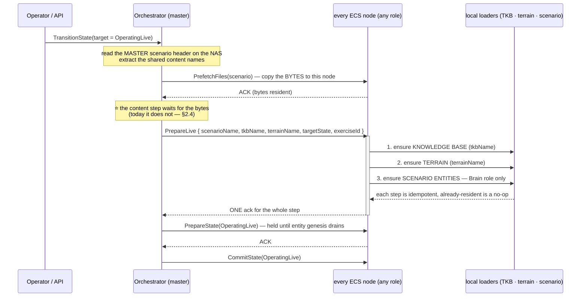
```mermaid
sequenceDiagram
  participant OP as Operator / API
  participant OR as Orchestrator (master)
  participant N as every ECS node (any role)
  participant SVC as local loaders (TKB · terrain · scenario)

  OP->>OR: TransitionState(target = OperatingLive)
  Note over OR: read the MASTER scenario header on the NAS<br/>extract the shared content names
  OR->>N: PrefetchFiles(scenario) — copy the BYTES to this node
  N-->>OR: ACK (bytes resident)
  Note over OR: ⭐ the content step waits for the bytes<br/>(today it does not — §2.4)
  OR->>N: PrepareLive { scenarioName, tkbName, terrainName, targetState, exerciseId }
  activate N
  N->>SVC: 1. ensure KNOWLEDGE BASE (tkbName)
  N->>SVC: 2. ensure TERRAIN (terrainName)
  N->>SVC: 3. ensure SCENARIO ENTITIES — Brain role only
  SVC-->>N: each step is idempotent, already-resident is a no-op
  N-->>OR: ONE ack for the whole step
  deactivate N
  OR->>N: PrepareState(OperatingLive) — held until entity genesis drains
  N-->>OR: ACK
  OR->>N: CommitState(OperatingLive)
```

*What the picture shows that the prose hid: the node answers **once** for a step that has **three**
participants. That is the difference from today, where three handlers compete for one ACK and two lose
silently — and it is why this cannot be fixed by reordering the list.*

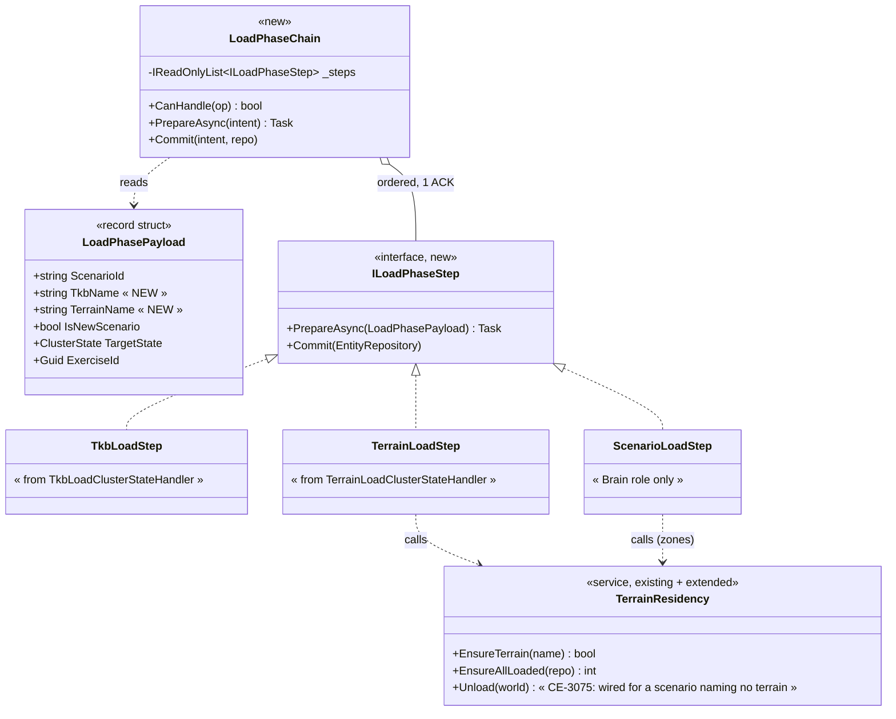
```mermaid
classDiagram
  class LoadPhasePayload {
    <<record struct>>
    +string ScenarioId
    +string TkbName      « NEW »
    +string TerrainName  « NEW »
    +bool IsNewScenario
    +ClusterState TargetState
    +Guid ExerciseId
  }
  class LoadPhaseChain {
    <<new>>
    +CanHandle(op) bool
    +PrepareAsync(intent) Task
    +Commit(intent, repo)
    -IReadOnlyList~ILoadPhaseStep~ _steps
  }
  class ILoadPhaseStep {
    <<interface, new>>
    +PrepareAsync(LoadPhasePayload) Task
    +Commit(EntityRepository)
  }
  class TkbLoadStep {
    « from TkbLoadClusterStateHandler »
  }
  class TerrainLoadStep {
    « from TerrainLoadClusterStateHandler »
  }
  class ScenarioLoadStep {
    « Brain role only »
  }
  class TerrainResidency {
    <<service, existing + extended>>
    +EnsureTerrain(name) bool
    +EnsureAllLoaded(repo) int
    +Unload(world) « CE-3075: wired for a scenario naming no terrain »
  }

  LoadPhaseChain o-- ILoadPhaseStep : ordered, 1 ACK
  ILoadPhaseStep <|.. TkbLoadStep
  ILoadPhaseStep <|.. TerrainLoadStep
  ILoadPhaseStep <|.. ScenarioLoadStep
  TerrainLoadStep ..> TerrainResidency : calls
  ScenarioLoadStep ..> TerrainResidency : calls (zones)
  LoadPhaseChain ..> LoadPhasePayload : reads
```

*What the picture shows that the prose hid: terrain residency is a **service with several callers**, not a
cluster step. The step is one caller; the future operator-driven preload is another; a standby unload is a
third. *(⚠ `2026-10-05`: `Unload` now also has a load-path caller — a scenario naming no terrain, §10.)* That is what makes "callable from multiple places" structural rather than a promise.*

---

## 4. THE PER-ROLE CONTRACT

### 4.1 What each role does in the `Loading*` phase

> ⛔⛔ **CORRECTED `2026-09-18`, before any of this was built.** The first version of this table gave
> **every** role a ✅ for terrain, with reasons like *"line of sight and broadphase are terrain-dependent"*
> and *"draws the map background and road graphics"*. 🔴 **Those were written from a principle, not from a
> measurement** — the precise failure mode `R-139` exists to prevent. 📐 Measured (`search_code` + grep
> agree): the only production consumers of the road graph are `CarKinematicsSystem` and the pathfinding
> solver. The rows below are by CONSUMER.

⭐⭐ **The per-role requirement table is owned by
[`DESIGN_Node_Roles_And_Policies.md`](DESIGN_Node_Roles_And_Policies.md) §3.2** — that document owns what a
role *is*, so it owns what a role *needs*. ⛔ It is not restated here.

⇒ ⭐ The asymmetry is exactly why the shared content names must ride the **message**: four of five roles
never open the scenario file, so they cannot read the names out of it.

#### ⭐⭐⭐ The two parts are derived DIFFERENTLY — and the knowledge base is NOT role-derived

> 🔒 **User, `2026-09-18`, on the `Map2D` row:** *"every ECS enable node should be able to create
> entities so every needs the TKB loaded."*

⛔⛔ **Do not read the requirement table as "three columns of the same kind."** It has two derivations, and
conflating them is how `Map2D` ended up with no knowledge base at all:

| part | derived from | the basis |
|---|---|---|
| ⭐⭐⭐ **knowledge base (TKB)** | 🔴 **NOT the role. Being an ECS node at all.** ⇒ **unconditional on every host that holds a world**, `Map2D` and every future role included | 🔒 `R-138` + `Q65-A′` — *"the shared code for entity creation support should not restrict any ECS enabled node from creating own networked entities"*, and `DESIGN_Node_Roles_And_Policies.md` §3.1: **every ECS node composes the FULL genesis pipeline**. ⇒ ⭐ **a node that can create an entity must be able to resolve its template**, so a node without the scenario's knowledge base holds a genesis pipeline it cannot actually use |
| ⭐ **terrain world + road graph** | ⭐⭐ **UNIVERSAL — every ECS node** *(since `2026-10-03`; the navmesh BAKE alone stays role-derived: `NavigationSolver`)* | ⭐ the consumer the 2026-09-18 ruling waited for appeared: the map on every host, LOS, movement Z (R-181/R-182, [`DESIGN_Terrain_World.md`](DESIGN_Terrain_World.md) §5). ⛔ *(was: the ROLE — `MuscleGround` and `NavigationSolver` only, "load nothing where nothing reads it", accepted `2026-09-18` — still true, the readers now exist)* |
| ⭐ **scenario entities** | ⭐ **the ROLE** — `Brain` only | only `Brain` also edits and saves the scenario |

🔴 **What that makes of §2.2's measured picture:** *"IG: no TKB loader"* and *"CGF: no TKB loader"* are not
neutral facts about hosts that happen not to need one — they are **violations of `Q65-A′`**. Both compose
the full genesis pipeline and both would **ignore a scenario's `TkbName` entirely**, falling back to the
hard-coded catalogue. ⇒ an entity created on IG or CGF from a scenario-supplied template would resolve
against the **wrong knowledge base**, silently. ⭐ `L4` must therefore give the knowledge-base step to
**every** ECS host, unconditionally — ⛔ not "to the roles that asked for it".

⚠ **And note the asymmetry is not a special case for terrain:** it is the general shape. *"Can this node
be asked to create an entity?"* is answered by **being an ECS node**; *"does this node read the road
graph?"* is answered by **its role**. A future part belongs to whichever question it answers.

### 4.1a ✅ RULED `2026-09-18` — **a role with no consumer does NOT load terrain**

> 🔒 **User, verbatim:** *"'load nothing where nothing reads it' … for sure, accepted."*

⇒ ⭐ `MuscleGround` and `NavigationSolver` make terrain resident; `Brain`, `Perception` and `Map2D` do not,
and [`DESIGN_Terrain_Zones_And_Assets.md`](DESIGN_Terrain_Zones_And_Assets.md) §8.3 N4's loud failure
narrows to the roles that declare the requirement. ⚠ **What would reopen it:** a measured consumer
appearing on `Map2D` or `Perception` — then the requirement table (roles §3.2) is the single place that
moves. ⛔ **This does not touch the knowledge base**, which is unconditional for a different reason (§4.1).

⛔ **HISTORY — the tie-break as it stood before the ruling:**

| ⭐ load it anyway | ⛔ do not load it |
|---|---|
| [`DESIGN_Terrain_Zones_And_Assets.md`](DESIGN_Terrain_Zones_And_Assets.md) §8.3 N4 — a zone operation is **cluster-wide**, and a node that does not hold the named terrain must **fail loudly** rather than silently pass | 🔒 the user's own framing: *"each node must be able to load those scenario parts **it needs**"*. Nothing on `Brain`, `Perception` or `Map2D` reads the road graph — ⭐ `Map2D` even holds a `RoadNetworkHolder` (`IgNodeBootstrapper.cs:80`) that **nothing on that host reads**. And memory held for no reader is the opposite of §5.1's future standby mode |

⭐ **Lean: do NOT load it where no consumer exists**, and narrow §8.3 N4's loud failure to roles that
declare the requirement. ⚠ **What would change the lean:** a measured consumer appearing on `Map2D` (a map
that actually draws the road graph) or on `Perception` (line of sight against terrain obstacles) — both are
plausible and neither exists today. ⇒ the requirement table is the single place that would change.

### 4.1b ⭐⭐⭐ THE ROLE DECLARES THE *WHAT*; THE HOST SUPPLIES THE *HOW* *(user, `2026-09-18`)*

> 🔒 **User, verbatim:** *"the goal is to unify the handling of the loading phase across host by binding
> it to the host role, not to the host bootstrap code, while keeping the possibility for each host to
> override the HOW the handling is done (like stride-simhost loads different data than SimHost because
> they implement their muscle/perception/navigation/etc… role differently)."*

⭐⭐ **This is what makes the chain in §3 uniform rather than three parallel chains.** The host bootstrap
stops deciding *whether* a part loads; it only registers *how*.

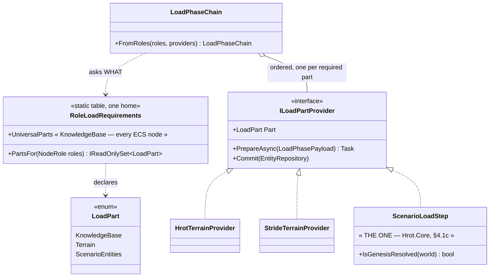
```mermaid
classDiagram
  class RoleLoadRequirements {
    <<static table, one home>>
    +PartsFor(NodeRole roles) IReadOnlySet~LoadPart~
    +UniversalParts « KnowledgeBase — every ECS node »
  }
  class LoadPart {
    <<enum>>
    KnowledgeBase
    Terrain
    ScenarioEntities
  }
  class ILoadPartProvider {
    <<interface>>
    +LoadPart Part
    +PrepareAsync(LoadPhasePayload) Task
    +Commit(EntityRepository)
  }
  class LoadPhaseChain {
    +FromRoles(roles, providers) LoadPhaseChain
  }
  class HrotTerrainProvider
  class StrideTerrainProvider
  class ScenarioLoadStep {
    « THE ONE — Hrot.Core, §4.1c »
    +IsGenesisResolved(world) bool
  }

  RoleLoadRequirements ..> LoadPart : declares
  LoadPhaseChain ..> RoleLoadRequirements : asks WHAT
  LoadPhaseChain o-- ILoadPartProvider : ordered, one per required part
  ILoadPartProvider <|.. HrotTerrainProvider
  ILoadPartProvider <|.. StrideTerrainProvider
  ILoadPartProvider <|.. ScenarioLoadStep
```

*What the picture shows that the prose hid: `HrotTerrainProvider` and `StrideTerrainProvider` satisfy the
**same** requirement with **different** data, and the chain cannot tell them apart — that is the override
point, and it is the only one. ⭐ Beside them, `ScenarioLoadStep` has **no** sibling: it is deliberately
the ONE implementation (§4.1c), because its readiness predicate is the thing no host may restate.*

| ⭐ the rules that fall out | |
|---|---|
| ⭐⭐⭐ **a host may not require LESS than its roles do** | ⛔ composing the chain from the role set makes "forgot to register the terrain step on this host" unrepresentable — which is precisely the defect class in §2.2 |
| ⭐⭐⭐ **the UNIVERSAL parts are not role-keyed at all** | ⭐ the knowledge base is required by **every ECS node** because every ECS node composes the genesis pipeline (§4.1). ⛔ `PartsFor` must never be able to return a set without it for a host that holds a world — the union with `UniversalParts` is unconditional |
| ⭐⭐ **a host MAY satisfy a part differently** | `HrotStrideApp` and `Hrot.SimHost` both carry `MuscleGround`; both must make terrain resident; they load different data |
| ⛔ **a missing provider for a required part is a STARTUP failure, loud** | ⚠ not a silent skip — that is the whole disease this replaces |
| ⛔ **this is NOT a permission gate** | 📄 `DESIGN_Node_Roles_And_Policies.md` §3.1 — a role never denies a capability. A host that composes a scenario reader may run that step whatever its role says; the table is the default, not a prohibition |

⇒ ⭐ **`L2`/`L4` in §5 are restated by this:** the chain is built from `roles × providers`, not from a
hand-written registration order in each bootstrapper.

### 4.1c ⭐⭐⭐ ONE SCENARIO-LOAD STEP — **what is already shared, what is triplicated, and what FORCES the rules**

⭐⭐ **The seam law first: the LOADING is already unified.** One `ScenarioEntityCreationRequestSource` →
`CreateEntityRequestSystem` → `NetworkSpawningSystem`, one `IScenarioEntityExtractor`, one
`ScenarioSerializer`, and **every ECS node composes the whole pipeline with no opt-out** — 📄
[`DESIGN_Entity_Creation_Unification.md`](DESIGN_Entity_Creation_Unification.md) invariants ⑥ and ⑨,
railed. ⛔ **So this is NOT "extract a shared loader".**

🔴 **What IS triplicated is the cluster-step ADAPTER** — parse, enqueue, then hold the state transition
until genesis has provably finished. 📐 **Measured `2026-09-18`, complete set (three implementations of
`ITickableClusterStateHandler` that load a scenario), and TWO have already DRIFTED:**

| readiness condition | `HrotScenarioLoadHandler` (SimHost) | `CgfScenarioLoadHandler` (CGF) | `HrotEditLoadHandler` (editor + CGF edit) |
|---|---|---|---|
| ① request queue drained | ✅ | ✅ | ✅ |
| ② nothing still `Constructing` | ✅ | ✅ | ✅ |
| ③ the **six** cross-reference Intent DTOs resolved | ✅ | ✅ | 🔴 **ABSENT** |
| ④ terrain made resident at the one valid moment *(§10.1's finding — the first frame the entities are real)* | ✅ | 🔴 **ABSENT** | 🔴 absent |

⇒ 🔴 **Two live defects fall straight out of the table:** an **edit** load can reach `OperatingEdit` while
passengers, vehicles, hierarchy, targets, routes and subordinates are still unresolved; and **CGF never
makes its zones' terrain resident**, though the design says that call belongs exactly there. ⛔ Neither is
a new decision — both are one copy having lost a line the others kept.

#### ⭐ The decision — **ONE step in `Hrot.Core`, the three handlers deleted**

⭐ `Hrot.Core` because it is reachable from CGF, SimHost **and** the editor presentation assembly — the
same reason `TerrainLoadClusterStateHandler` already lives there. ⛔ Not `Fdp.Toolkits`: the readiness
predicate names Hrot Intent DTO types, and pushing it down would need a registration seam invented for one
caller.

#### ⭐⭐⭐ What makes it FORCE the rules rather than merely state them

| # | mechanism | the defect class it makes unrepresentable |
|---|---|---|
| **①** | ⭐⭐⭐ **ONE readiness predicate**, owned by the step. There is no second place to write it | 🔴 exactly the ③/④ drift above — a host cannot express a subset of a predicate it does not own |
| **②** | ⭐⭐ **the chain is built from the ROLE SET** (§4.1b), never hand-registered; a required part with no provider **throws at startup** | 🔴 §2.2's whole family — "this host forgot to register a step", silently |
| **③** | ⭐⭐⭐ **required collaborators are NON-OPTIONAL constructor arguments** | 🔴 the id authority — `HN-037`: CGF constructed its own allocator seeded at 1 and produced ids **2–9** where the editor produced **1000–1007** (📄 `DESIGN_Deterministic_Network_Ids.md` §11d ②). 🔴 and the world — `ClusterSlave` commits with `repo: null` (§10.3), so a step publishing only through that parameter publishes **nothing**; each of the three copies had to rediscover this |
| **④** | ⭐⭐ **host differences are INJECTION POINTS, not classes** — edit vs live is an argument; terrain residency, behaviour remapping and recording are collaborators | ⛔ a host needing different behaviour supplies a different collaborator and **never writes a second handler**, so there is nothing left to drift |

⚠ **It stays a DEFAULT, not a permission gate** (📄 `DESIGN_Node_Roles_And_Policies.md` §3.1): the step
exists on every host; only `Brain`'s requirement pulls it into that host's chain.

#### ⛔ Rejected — one line each

| alternative | the one fact that ruled it out |
|---|---|
| a shared **abstract base** with virtual hooks | a host could override the readiness predicate — the single thing that must not be overridable |
| keep three handlers, add a **rail asserting they agree** | a rail over copies must be updated per copy, and it cannot see a fourth copy added later |
| push the step into **`Fdp.Toolkits`** | the predicate names Hrot Intent DTO types; it would need a generic registration seam invented for one caller |
| let `ClusterSlave` **run every matching handler** | breaks the exclusivity other handlers depend on (§5.1) |

### 4.2 Where the parts come from

| part | carried by | consumed by |
|---|---|---|
| **which** TKB / terrain / scenario | ⭐ the **load message** (§3's payload) — the orchestrator extracts the names from the master scenario on the NAS | every node, per its role |
| **the bytes** (TKB archive, terrain definition, scenario file) | ⭐ the **staging copy** — NAS → per-node directory, before the content step | the loaders |
| **what this node needs** | ⭐ **the node's own role** — never on the wire | the chain, locally |

### 4.3 ⛔ SUPERSEDES `DESIGN_Terrain_Zones_And_Assets.md` §2.1e ④

That section ruled *"the terrain loader must NOT ride the scenario-load handler"*, on the measured ground
that a muscle node has no scenario-load handler (§2.3 — **the premise is correct and still holds**). Its
remedy was *"register it unconditionally on every ECS host, like the TKB loader"* — and that is exactly
what produced the shadowing in §2.2, because registering unconditionally means **competing**
unconditionally.

⇒ The premise survives; the conclusion is replaced. Terrain is neither a competitor nor a passenger on the
scenario load: it is an **ordered step in one composed chain** that every ECS host runs, and on the Brain
role the scenario step simply comes after it — which satisfies *"scenario load does the terrain load
first"* without hanging terrain off a handler four roles do not have.

---

## 5. THE PLAN

| # | item | owner surface |
|---|---|---|
| **L1** | Add `TkbName` and `TerrainName` to the load payload; the orchestrator fills them from the master scenario header it already reads. ⭐ The payload crosses the wire as **JSON**, so this is purely additive — no wire id, no compatibility break (`R-42` does not bite) | `ReferenceEditLoadHandler.cs` payload · `StorageGatewayModule` / the transition fan-out |
| **L2** | Introduce the ordered **load-phase chain**: one registered handler per ECS host claiming `PrepareLive`/`PrepareEdit`, running its steps in order and ACKing once. ⭐ Composed from **`roles × providers`** (§4.1b), never from a per-bootstrapper registration order; a required part with no provider fails **loudly at startup** | new, beside `SerializeLocalRegistrar` |
| **L3** | Re-home `TkbLoadClusterStateHandler` and `TerrainLoadClusterStateHandler` as **steps**, reading their name from the payload, falling back to the staged header only when the payload is silent (one release of tolerance) | both handlers |
| **L4** | Register the chain on **every ECS host** — CGF, SimHost, IG, editor. ⭐⭐⭐ The **knowledge-base step is unconditional** on all of them (§4.1 — `Q65-A′`; today only SimHost has one, so CGF and IG silently ignore a scenario's `TkbName`); the **terrain step** goes only to `MuscleGround`/`NavigationSolver` (§4.1a); the **scenario step** only where `Brain` is composed | the three bootstrappers + the editor |
| **L4a** | ⭐⭐⭐ **Collapse the THREE scenario-load adapters into ONE shared `ScenarioLoadStep` in `Hrot.Core`** (§4.1c) and delete `CgfScenarioLoadHandler`, `HrotScenarioLoadHandler` and `HrotEditLoadHandler`. ⭐ One readiness predicate · required collaborators non-optional (the id authority and the world) · edit-vs-live an argument · terrain residency, behaviour remapping and recording injected. ⚠ **Fixes two live defects the drift table measured**: the edit path is missing readiness condition ③, and CGF never makes its zones' terrain resident | `Hrot.Core` + the three deleted handlers and their suites |
| **L5** | Terrain residency becomes a service with a stable entry point: `EnsureTerrain(name)` idempotent (already-resident ⇒ no-op), plus an `UnloadAll()` seam left **unwired** for the future standby mode. ⚠ **SUPERSEDED `2026-10-05` (§10, `CE-3075`)**: `TerrainResidency.Unload` is now called when a scenario names NO terrain | `TerrainLoadService` |
| **L6** | Ensure the content step runs **after** the staging ACKs, closing the race in §2.4 — and remove the two-second retry that papers over it today | the orchestrator's transition sequencing |
| **L8** | ⭐⭐⭐ **The deterministic staging wait** — PARK a load transition until the file copy has completed AND every node has acknowledged it, then DELETE every wait-on-a-clock in the load path. 📄 Designed in **§7**; ⛔ not built | `ClusterMaster` (park + resume) · `AssetPrefetchProcessManager` (carry the request id) |
| **L7** | Rails: the chain runs **all** its steps and ACKs once · a shadowed step is impossible by construction · ⭐⭐ **every ECS host resolves the scenario's named knowledge base** — the `Q65-A′` rail, and the one that would have caught the IG/CGF gap · a host with no terrain consumer makes **no** terrain resident · a `Brain` host loads entities and a non-`Brain` host loads **none** · the payload names beat the sidecar · an absent name is legal and silent, an absent **artifact** is loud · ⭐⭐ **the readiness predicate has exactly ONE implementation** — the rail that replaces the three-copy drift, asserting an edit load also waits for the six cross-reference intents and that a Brain host makes terrain resident. ⚠ **`HN-037`'s test surface applies**: three handlers and their suites are deleted, so the claims each asserted must be **re-homed onto the one step**, not dropped | `Hrot.SimHost.Tests`, `Hrot.CGF` tests, `Hrot.Editor.Tests`, and the existing cluster conformance rails |

### 5.1 Deliberately NOT in this plan

| | |
|---|---|
| ⛔ a separate terrain **preload** cluster step | 🔒 user: *"no separate terrain-preload step is needed at the moment (although it could happen later — but that would likely require new cluster node operation)"*. `L5`'s service is the seam it would call |
| ⛔ ~~terrain **unload** wired to anything~~ — ⚠ **SUPERSEDED `2026-10-05` (§10)** | 🔒 user: *"we might need to support terrain unloading as well if we wanted (in the future) the hosts to go to some kind of clean low-memory standby mode"*. The STANDBY unload is still unwired; a scenario naming no terrain now unloads (`CE-3075`) |
| ⛔ changing `ClusterSlave` to run every matching handler | ⚠ several handlers depend on first-wins exclusivity — `ReferenceLiveLoadHandler` claims cold `PrepareLive` *only if* a scenario handler did not, and running both would double the recording preparation. The chain gets the ordering without touching the dispatcher |
| ⛔ giving non-Brain roles a scenario reader | §4.1 — the role model says the Brain owns the file; the others receive a replicated world |

### 5.2 Acceptance — ✅ **MET `2026-09-18`, stock build, no probe**

📐 `--mode all`, `hill-attack-close`, measured end to end:

```
[LoadPhase] SimHost composed for roles [MuscleGround, Perception, NavigationSolver]: KnowledgeBase -> Terrain.
[LoadPhase] IG      composed for roles [Map2D]:                                      KnowledgeBase.
[LoadPhase] CGF     composed for roles [Brain]:                                      KnowledgeBase -> ScenarioEntities.

POST /scenario/load/live → { entityCount: 8, sawWorldChange: true }
Scenario 8 · SimHost 8 · IG 9 (incl. the id-0 placeholder)
```

| at `simTime ≈ 106` | force | HP | `LocomotionChannel.Status` | ammo | distance to its OWN `FinalDestination` |
|---|---|---|---|---|---|
| 1006 · 1007 M1 Abrams | Hostile | **0/50** *(both by t≈46)* | Failure | 42 | — |
| 1001–1004 Tank Platoon | Friend | 50/50 | **Success** | 41 | **0.8 – 1.5 m** |

⭐⭐ **The composition lines are themselves a deliverable**: a node now says, at boot, which parts its roles
require. ⛔ The defect this replaces was invisible precisely because nothing said anything.

---

## 6. ⭐⭐⭐ AS-BUILT — **what the build changed, and why** *(batch load-phase, `2026-09-18`)*

⚠ Obligation ⑤: the deviations live here, not only in the batch report.

### 6.1 ⭐⭐ TWO ENABLING MOVES THE PLAN DID NOT FORESEE

| what | why it was forced |
|---|---|
| ⭐⭐⭐ **`GenesisIntentComponents` moved from `Hrot.Common` down to `Hrot.Core`** *(namespace unchanged, so no call site moved)* | 🔴 **This is WHY the editor's readiness predicate was missing condition ③.** `Hrot.Presentation` does not reference `Hrot.Common`, so the editor's handler **could not see the intent DTO types** — it was an ASSEMBLY WALL, not carelessness. §4.1c called that drift "one copy having lost a line"; the truer statement is that one copy was never able to have it |
| ⭐ **`IScenarioEntityExtractor` gained a remapper-aware overload** with a default implementation | before it, passing a behaviour remapper required depending on the CONCRETE CGF extractor — a large part of why CGF needed a handler of its own at all. The default keeps every existing implementor unchanged. ⛔⛔ **CORRECTED `2026-10-01` — and that sentence WAS the defect:** the default IGNORES the remapper, and the ONE implementor that remaps (`StagingEntityExtractor`) was among the "unchanged" — it implemented only the three-argument member. ⇒ from L4a on, every live load reached the default and **CGF's remapper was dropped**: entity references in mission parameters (`[RemapNetworkId]`) kept their staging ids. ⚠ Invisible because staging and live ids both start at 1000. 📐 Measured by `DistributedScenarioLoadTests` once its offline ids were moved off the live range; fixed by implementing the member explicitly in `StagingEntityExtractor`; railed by `StagingEntityExtractorTests.Extract_ThroughTheInterface_StillAppliesTheBehaviorRemapper` (red-proved). ⭐ Lesson for this seam: **a default interface member that drops an argument is a silent default** — an implementor that HAS the capability must implement it |

### 6.2 ⚠ THE KNOWLEDGE-BASE PROVIDER IS SUPPLIED BY THE HOST, NOT DEMANDED OF THE CALLER

📐 Measured: making it conditional on a caller-supplied database broke five call sites that legitimately
pass none (replay tests, a bootstrap with no TKB configured). ⇒ each host now **supplies the hard-coded
catalogue when no database was composed**. ⭐ That is the host supplying a *HOW*, not the requirement being
relaxed — a node with no named TKB starts from that catalogue anyway, and the chain still throws when a
part is genuinely unsatisfiable (asserted in `LoadPhaseChainTests`).

### 6.3 🔴 A BEHAVIOUR CHANGE THAT IS NOW LOUD

⛔ **An unreadable scenario on a `Brain` node THROWS.** The former CGF handler logged an error and enqueued
nothing — a node silently contributing an empty world, which is the exact failure this design removes. ⚠ It
is asserted rather than left implicit (`ScenarioLoadStepTests`).

### 6.4 ⛔ `L6` IS PARTIAL, DELIBERATELY

⭐ The **names** no longer race — `L1` moved them to the message, which removes the silent failure that was
actually measured. ⭐ The knowledge-base and terrain steps gained the bounded artifact wait the scenario step
always had, so the newly-loud *"artifact not found"* cannot fire while the copy is still in flight.
⛔ **The complete fix — ordering the content step after the staging acknowledgements — was NOT done.** It
restructures the two-phase trajectory that *every* transition shares (live, edit, preview, replay, idle),
and doing it in the same batch as a node-side refactor would have made a failure impossible to attribute.
⚠ Recorded as outstanding, not as finished. ✅ **CLOSED `2026-09-18` by `L8` — §7, `build-state: BUILT`; the three waits and `StagedArtifactWait` are DELETED and §7.7 carries the as-built.** ⭐ **DESIGNED `2026-09-18` in §7** — 🔒 user: *"it cannot
depend on timeouts where can easily wait deterministically."* 📐 And the design got SMALLER once measured:
the signal it needs is already computed and published by the prefetch saga, so the gate defers ONE intent
rather than restructuring the trajectory this section feared.

### 6.5 ⚠ RAILS THAT WERE WRONG, NOT JUST STALE

⛔ `TerrainLoaderIsComposedOnEveryEcsHostRails` asserted *"register the terrain loader BEFORE every
`PrepareLive` claimant"* — the remedy `C8` chose. 🔴 **It was GREEN throughout the defect**, because it
asserted the ordering it had been written to defend rather than what a node ends up running. ⇒ replaced by
`EveryEcsHostComposesTheLoadPhaseChainRails`, which asserts composition through the chain and that **no host
hand-registers a retired prerequisite loader**. ⭐ The lesson generalises: *a rail that encodes a remedy
cannot catch that remedy being wrong.*

---

## 7. ⭐⭐⭐ `L8` — **THE DETERMINISTIC STAGING WAIT** *(design `2026-09-18`; `build-state: BUILT`)*

> 🔒 **User, `2026-09-18`:** *"it cannot depend on timeouts where can easily wait deterministically."*

⚠ This section owns the half of `L6` that §6.4 records as deliberately deferred. It replaces every
wait-on-a-clock in the load path with a wait on a fact that is **already computed and already published**.

### 7.0 ⛔⛔ THE MEASUREMENT THAT CHOSE THE MECHANISM — **the bus is a BROADCAST**

📐 Measured `2026-09-18`: `FdpEventBus` managed streams are **double-buffered and broadcast**.
`ManagedEventStream.Write` appends to a back buffer, `Read()` returns the front, and `Swap()` runs at end
of frame. ⇒ **two consequences, and both decide the design:**

| ⭐ | |
|---|---|
| ⛔⛔ **reading does NOT consume** | every reader in a frame sees every event. ⇒ **an external gate CANNOT withhold an intent** from `ClusterMaster` — it would read the same one in the same frame and fan out anyway |
| ⚠ **an event is readable one frame AFTER it is published** | so any resumption is frame-quantised whatever we do. ⭐ One extra frame against a copy of hundreds of milliseconds is nothing, and there is no same-frame ordering subtlety to get wrong |

⇒ ⭐⭐⭐ **The wait lives INSIDE `ClusterMaster`, as a PARKED transition** — not in a gate in front of it.
📄 The rejected external-gate shape, and why, is §7.6.

### 7.1 The sequence — **parked, then resumed**

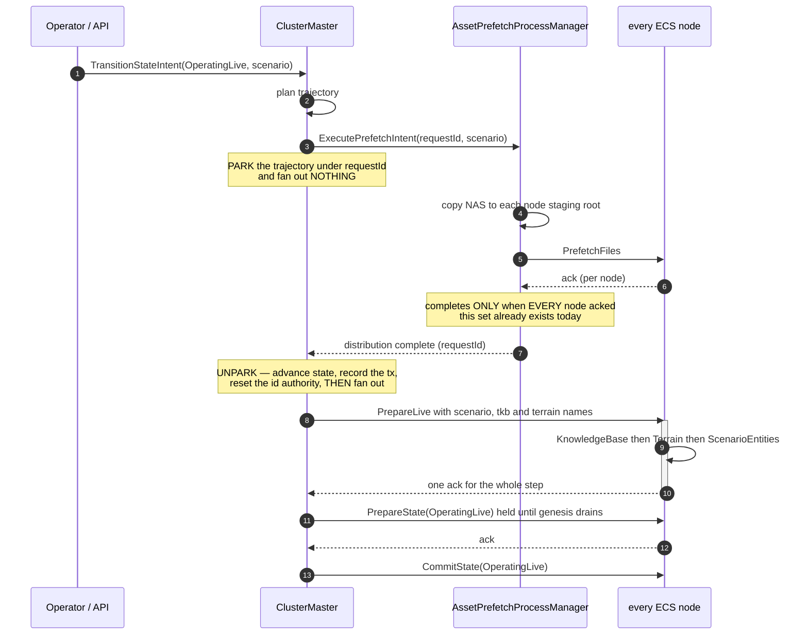
```mermaid
sequenceDiagram
  autonumber
  participant OP as Operator / API
  participant CM as ClusterMaster
  participant PF as AssetPrefetchProcessManager
  participant N as every ECS node

  OP->>CM: TransitionStateIntent(OperatingLive, scenario)
  CM->>CM: plan trajectory
  CM->>PF: ExecutePrefetchIntent(requestId, scenario)
  Note over CM: PARK the trajectory under requestId<br/>and fan out NOTHING
  PF->>PF: copy NAS to each node staging root
  PF->>N: PrefetchFiles
  N-->>PF: ack (per node)
  Note over PF: completes ONLY when EVERY node acked<br/>this set already exists today
  PF-->>CM: distribution complete (requestId)
  Note over CM: UNPARK — advance state, record the tx,<br/>reset the id authority, THEN fan out
  CM->>N: PrepareLive with scenario, tkb and terrain names
  activate N
  N->>N: KnowledgeBase then Terrain then ScenarioEntities
  N-->>CM: one ack for the whole step
  deactivate N
  CM->>N: PrepareState(OperatingLive) held until genesis drains
  N-->>CM: ack
  CM->>N: CommitState(OperatingLive)
```

*⭐ What the picture shows that the prose hid: **the fan-out is not restructured — it is the same pass, run
later.** Everything from `PrepareLive` down is byte-for-byte today's flow, which is why two-phase commit,
ack accounting, replay and preview are untouched. ⛔ And the defect, stated as a picture: **today steps 3
and 9 happen in the SAME pass** — the copy is started and the trajectory fanned out together.*

### 7.2 What is parked, and where the method splits

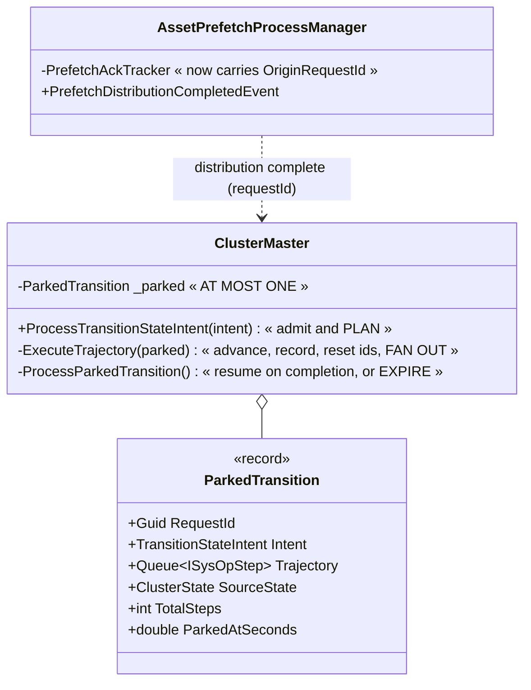
```mermaid
classDiagram
  class ClusterMaster {
    -ParkedTransition _parked  « AT MOST ONE »
    +ProcessTransitionStateIntent(intent) « admit and PLAN »
    -ExecuteTrajectory(parked)            « advance, record, reset ids, FAN OUT »
    -ProcessParkedTransition()            « resume on completion, or EXPIRE »
  }
  class ParkedTransition {
    <<record>>
    +Guid RequestId
    +TransitionStateIntent Intent
    +Queue~ISysOpStep~ Trajectory
    +ClusterState SourceState
    +int TotalSteps
    +double ParkedAtSeconds
  }
  class AssetPrefetchProcessManager {
    -PrefetchAckTracker « now carries OriginRequestId »
    +PrefetchDistributionCompletedEvent
  }
  ClusterMaster o-- ParkedTransition
  AssetPrefetchProcessManager ..> ClusterMaster : distribution complete (requestId)
```

*⭐ What the picture shows that the prose hid: **nothing new is computed.** Every field of
`ParkedTransition` is a LOCAL the transition method already builds and throws away a few lines later. The
change is that those locals live for a few frames instead of a few statements.*

| ⭐ the seam | |
|---|---|
| **admit and PLAN** | plan the trajectory · resolve the target · exercise bookkeeping · publish "start copying" · **park and return** |
| **EXECUTE** | ⭐⭐⭐ the optimistic state advance · the transaction record · the id-authority reset · the fan-out · the ack accounting |
| ⭐ **no copy needed** | admit-and-plan calls EXECUTE straight away — same frame, identical to today |

### 7.2a 🔴 THE THREE THINGS THAT MUST MOVE WITH *EXECUTE* — **and why each bites**

| what | if it stayed in the planning half |
|---|---|
| ⭐⭐ the **optimistic state advance** | the cluster would report itself in the TARGET state while still waiting for files |
| ⭐ the **transaction record** beside it | history would show a transaction that had sent nothing |
| ⭐⭐⭐ the **id-authority reset** | it fires so authored ids start at 1000. Left behind, it resets while nothing has been sent — and a second request arriving in between sees a sequence already reset. 📄 This is the exact area `HN-037` came from |

### 7.2b ⛔⛔ TWO MASTERS — **and the editor parks through the SAME path, safely** *(CORRECTED at build time, `2026-09-18`)*

📐 Measured: `new ClusterMaster(...)` has **two** production call sites — `OrchestratorSubsystem.cs:134`
(the real cluster) and `EditorSubsystem.cs:2117`, an **offline master** with `Mandatory = []` so the editor
can list and load scenarios with no cluster at all.

⭐⭐⭐ **The rule is a DERIVATION, not a wait:** a transition parks **only if a copy was started for it** —
that is, only when the planner put a `PrefetchScenario` step in the trajectory, which happens only when the
intent names a scenario. ⚠ Replay, preview, idle and every unload carry no scenario, so they keep their
current latency exactly.

> ⛔⛔ **CORRECTION — the first version of this section said the editor *"starts no copy, so it never
> parks."* 🔴 THAT WAS FALSE, and it was the one claim that could have turned this design into a deadlock
> on every scenario open.** 📐 Measured while building: the editor **does** stage. It constructs an
> `AssetPrefetchProcessManager` over the real NAS root (`EditorSubsystem.cs:2150`) and ticks it every frame
> (`:2661`); it registers `ReferencePrefetchHandler` on its **own** one-node `ClusterSlave` (`:1422`); and it
> heartbeats as node `0` (`:1035`), so its roster is not empty.
>
> ⇒ ⭐⭐ **The editor parks and unparks on exactly the same path as the cluster, and that is why it is safe** —
> not because it is exempt. The saga that answers a parked transition is present, ticked and acked on both
> masters. ⭐ A one-node copy of a local scenario is the cheapest case there is, so the added latency is a
> frame or two.
>
> ⚠ **What the false claim cost, stated plainly:** nothing, because it was measured before the rail was
> written — but it is a textbook instance of a lean resting on a principle (*"the editor is offline, so it
> stages nothing"*) instead of a `file:line`. The rail in §7.5 pins the measurement so the claim cannot
> silently revert.

### 7.2c ⭐ AT MOST ONE PARKED TRANSITION — **decided, not inherited**

⛔ A table keyed by request id would make several simultaneous parked transitions *representable*, and the
master today tracks a single in-flight transition. ⇒ ⭐ **park at most one**, and reject a second transition
while one is parked with the rejection status the master already issues for other busy conditions.
⚠ Permitting several would be a new concurrency property nobody asked for, arriving because a dictionary
allowed it.

### 7.3 What actually changes

| # | change | why |
|---|---|---|
| **①** | ⭐⭐⭐ **`ClusterMaster` parks instead of fanning out** when a copy was started for the transition, and fans out on the completion event | the whole of `L8`. ⛔ The fan-out itself is unchanged |
| **②** | ⭐⭐ **The three items of §7.2a move to the execute half** | each is silently wrong if left behind |
| **③** | ⭐ **The prefetch saga carries the originating request id** through its ack tracker and publishes a distribution-complete event | today the tracker forgets it, so nothing can be correlated back |
| **④** | ⭐⭐⭐ **DELETE all three waits** — the two added for the knowledge base and terrain, and the scenario step's pre-existing retry, plus `StagedArtifactWait` itself | 🔒 *"it cannot depend on timeouts."* After ① nothing in the load path waits on a clock |
| **⑤** | ⭐⭐ **One liveness bound remains, on the PARKED entry** — *"staging never completed"* fails the request | ⚠ a deterministic wait still needs a bound. ⛔ The difference from a timeout is that it FAILS and never silently proceeds |

### 7.4 ⭐⭐ A SECOND DEFECT THE SAME CHANGE CLOSES

🔴 **Measured today:** when the copy FAILS, the saga reports a timeout to the requester — but the transition
has **already been fanned out**, so the cluster proceeds to build a world from files that never arrived.
⇒ ⭐ Parking removes that path by construction: a failed copy drops the parked entry and nothing is sent.

### 7.5 What must be PROVEN, not assumed

| | |
|---|---|
| ⛔ a transition with **no scenario** is not delayed at all | idle, replay, preview and every unload keep their current latency |
| 🔴 **the EDITOR's offline master never parks** | §7.2b — it stages nothing. ⚠ This is the path that would turn a wait into a deadlock, and it is not hypothetical: it is every scenario open in the editor |
| ⛔ a **second** transition arriving while one is parked is REJECTED | §7.2c — and rejected, not queued |
| ⛔ a **failed** copy fails the request and fans out nothing | §7.4 |
| ⛔ the state reported **while parked** is the loading state, not the target | §7.2a row 1 |
| ⛔ the **id authority** is reset on the execute side | §7.2a row 3 — assert the authored ids still start at 1000 |

### 7.6 ⛔ Rejected — one line each

| alternative | the one fact that ruled it out |
|---|---|
| ⭐ **an external `LoadPrerequisiteGate` in front of `ClusterMaster`** *(the shape this section carried until `2026-09-18`)* | 🔴 **the bus is a BROADCAST (§7.0)** — a gate cannot withhold what the master reads in the same frame |
| the same gate plus an **admission flag** on the intent | it works, and it buys a **composition landmine**: a host that forgets the gate ignores every scenario transition and loads stop silently — a fresh instance of the failure class this programme exists to remove |
| a **pre-master tick phase** to make the ordering structural | ⚠ its main new member was the gate. Without one, only the pre-existing three-comment convention remains — worth doing, ⛔ but not smuggled into this batch |
| make the trajectory itself suspend and resume mid-flight | restructures machinery EVERY transition shares, for no gain once the fan-out can simply run later |
| poll harder, or lengthen the wait | the same race, later — and it is the thing the user ruled out |
| keep the waits as a safety net beside the parking | ⚠ a fallback that hides a broken wait is how the original silence was built |

### 7.7 ⭐⭐⭐ AS-BUILT — **`L8`, built `2026-09-18`** *(obligation ⑤)*

⭐ **The design above is what was built**, with the corrections already folded into §7.2b. What follows is
the shape on disk plus the three things the build learned.

| design element (§7.2) | built as |
|---|---|
| `ClusterMaster._parked`, at most one | `private ParkedTransition? _parked;` + `public Guid? ParkedRequestId` (a read-only seam for the rails) |
| `ParkedTransition` record | same fields, `private sealed record` nested in `ClusterMaster` |
| the plan/execute seam | `ProcessTransitionStateIntent` (admit + plan + park) → `ExecuteTransitionTrajectory(parked)` (advance, record, reset ids, fan out) |
| the resume/expire pump | `ProcessParkedTransition()`, called from `Tick()` **before** the intent drain |
| the saga carries the origin | `PrefetchAckTracker.OriginRequestId` + `PrefetchDistributionCompletedEvent` |
| ④ delete all three waits | ✅ `StagedArtifactWait.cs` **deleted**; the knowledge-base and terrain waits and the scenario step's 100×20 ms retry are **gone**. `PrepareAsync` on all three steps is now genuinely synchronous (`Task.CompletedTask`) |

#### ⭐⭐ ① MEASURED ON THE REAL CLUSTER — the wait costs ~210 ms and is deterministic

📐 Stock `--mode all`, `hill-attack-close`, no probe:

```
19:07:37.4153  ClusterMaster  L8: transition 86ba65c9… PARKED until the staging of 'hill-attack-close' is on every node.
19:07:37.6259  AssetPrefetch  L8: distribution of 'hill-attack-close' for request 86ba65c9… completed (success).
19:07:37.6539  ClusterMaster  L8: the staging of 'hill-attack-close' is on every node — transition 86ba65c9… resumes.
```

⇒ **210 ms parked, then the ordinary fan-out** — against the 2 s of bounded retries the node steps used to
budget for the same race. ⭐ The three log lines are the whole feature, and they are the cheapest possible
proof that the ordering is real rather than lucky.

#### ⛔⛔ ② THE CORRECTION THAT MATTERED — §7.2b's editor claim was FALSE

🔴 The design said the editor *"starts no copy, so it never parks."* **Measured: it does both.** The full
correction, with its four `file:line`s, is in §7.2b; it is repeated here only as the pointer, because it is
the one claim that could have deadlocked every scenario open in the editor. ⚠ It was caught by opening
`EditorSubsystem.cs`, not by a rail — which is why `A_distribution_that_never_completes_expires…` now pins
the fact that **no production master is shaped like the deadlocking one**.

#### ⚠ ③ THE RAILS — six, in the two suites that already own these features *(`T-1` ④)*

| rail | suite | §7.5 row |
|---|---|---|
| `A_transition_with_no_scenario_fans_out_in_the_same_tick` | `ClusterMasterPrefetchTests` | 1 |
| `A_scenario_transition_parks_until_every_node_has_acknowledged_its_files` *(also asserts the reported state is the SOURCE while parked, and that a second transition is REJECTED)* | `ClusterMasterPrefetchTests` | 3 + 5 |
| `A_failed_distribution_fails_the_request_and_fans_out_nothing` | `ClusterMasterPrefetchTests` | 4 |
| `A_distribution_that_never_completes_expires_and_fans_out_nothing` | `ClusterMasterPrefetchTests` | ⑤'s bound |
| `A_parked_transition_can_be_cancelled_and_fans_out_nothing` | `ClusterMasterPrefetchTests` | ④'s cancel *(added after §7.5 was written)* |
| `A_parked_transition_does_not_reset_the_authority` | `TheWorldBoundaryResetsTheIdAuthorityTests` | 6 |

⛔ **No new test class was created** — both suites already own the feature under test (the prefetch barrier,
and the `HN-037` id-authority guard). ⭐ The positive half of row 6 needed no new case: every other rail in
that file carries no scenario, so it plans no copy, never parks, and proves the reset still fires on the
execute side.

⚠ **What a reader should NOT conclude from these rails:** they exercise `ClusterMaster` + the saga over a
real event bus, **not** a real node. The node-side proof is the measured cluster run in ① — and it is the
one that matters, because it is the only one where the files actually have to arrive.

#### ⚠ ④ TWO HONEST LIMITATIONS OF THE BUILT SHAPE

| | |
|---|---|
| ✅ **a `CancelOperation` now clears a parked entry** *(built `2026-09-18`, after the section below was first written)* | ⭐ **Parking created the first transition state that CAN be cancelled cleanly** — nothing has been sent, so there is nothing to undo, and the branch returns before the `AbortTransaction` fan-out for exactly that reason. 📐 Why it was absent rather than broken: `ProcessCancelOperationIntent` resolves its target through `_activeCancellations`, which **only** the ExportArchive and ImportArchive branches ever write *(`ClusterMaster.cs:1472`, `:1506`; specified that way in `.dev/_DONE/cgf-1/batches/CGF-1-BATCH-28-INSTRUCTIONS.md` §C.4)* — a transition was never a cancel target, and before parking there was no window in which it could have been one. ⚠ **It abandons the TRANSITION, not the copy**: the gateway registers no cancellation source, so the bytes finish landing in the node staging roots. Harmless — nothing loads them — but it is why the log says *"abandoned"*, not *"stopped"*. Pinned by `A_parked_transition_can_be_cancelled_and_fans_out_nothing`, which also asserts the single parked slot is RELEASED, so the next transition is admitted rather than rejected as busy |
| ⚠ **the bound is wall-clock, and it is the only clock left** | `ParkedTransitionExpirySeconds`, default 300 s. ⛔ It is not a retry and it never proceeds — it fails the request. ⭐ It exists because a distribution that never reports at all *(a node ejected mid-copy, a saga that was never constructed)* must not hang the master forever |

## 8. ⭐⭐⭐ `CE-2101` — **THE WORLD BOUNDARY CLEARS EVERY HOST** *(AS-BUILT `2026-10-05`, backend)*

🔒 User, `2026-10-05`: *"the play is assumed to be a 'dry run', not a real production run, that one is started from scenario
file always, never from memory."* ⭐ Play from Edit is PREVIEW (snapshot + rewind, `EditorTimeTransportFacade.cs:105`) and is
untouched; this section is the PRODUCTION load.

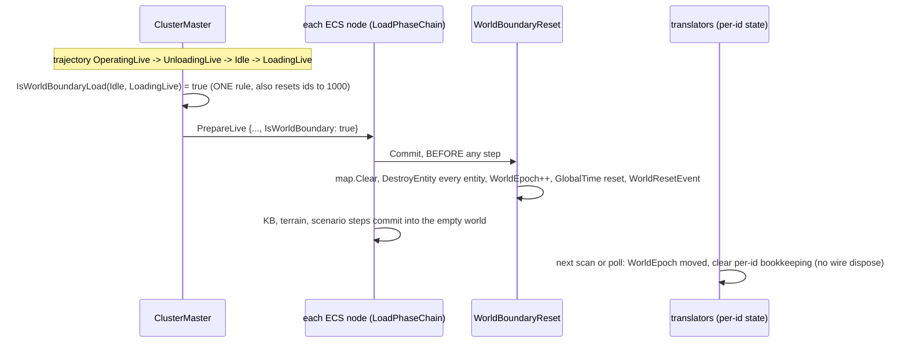
```mermaid
sequenceDiagram
  participant M as ClusterMaster
  participant N as each ECS node (LoadPhaseChain)
  participant W as WorldBoundaryReset
  participant T as translators (per-id state)
  Note over M: trajectory OperatingLive -> UnloadingLive -> Idle -> LoadingLive
  M->>M: IsWorldBoundaryLoad(Idle, LoadingLive) = true (ONE rule, also resets ids to 1000)
  M->>N: PrepareLive {..., IsWorldBoundary: true}
  N->>W: Commit, BEFORE any step
  W->>W: map.Clear, DestroyEntity every entity, WorldEpoch++, GlobalTime reset, WorldResetEvent
  N->>N: KB, terrain, scenario steps commit into the empty world
  T->>T: next scan or poll: WorldEpoch moved, clear per-id bookkeeping (no wire dispose)
```

*What the picture shows that prose hid:* the clear is a NODE-local step every host runs at the same message, decided ONCE on
the master by the rule that already resets the ids — so a node never has to know the trajectory, and live-from-replay
(`OperatingReplay → LoadingLive`, never marked) keeps its world by construction.

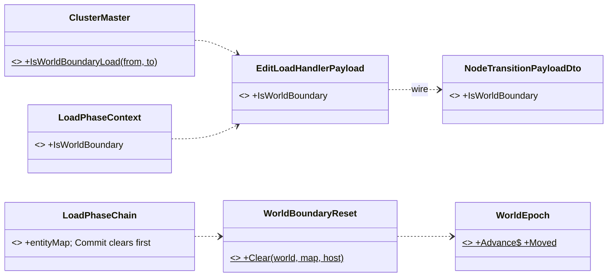
```mermaid
classDiagram
  direction LR
  class ClusterMaster { <<existing>> +IsWorldBoundaryLoad(from, to)$ }
  class EditLoadHandlerPayload { <<existing, grows>> +IsWorldBoundary }
  class NodeTransitionPayloadDto { <<existing, grows>> +IsWorldBoundary }
  class LoadPhaseContext { <<existing, grows>> +IsWorldBoundary }
  class LoadPhaseChain { <<existing, grows>> +entityMap; Commit clears first }
  class WorldBoundaryReset { <<NEW>> +Clear(world, map, host)$ }
  class WorldEpoch { <<NEW managed singleton, id 332>> +Advance$ +Moved$ }
  ClusterMaster ..> EditLoadHandlerPayload
  EditLoadHandlerPayload ..> NodeTransitionPayloadDto : wire
  LoadPhaseContext ..> EditLoadHandlerPayload
  LoadPhaseChain ..> WorldBoundaryReset
  WorldBoundaryReset ..> WorldEpoch
```

| ⭐ as built | why |
|---|---|
| **DESTROY every entity, not `SoftClear`** | `SoftClear` wipes the entity index, so generations restart at 1 (`EntityIndex.Clear`) and a handle cached before the wipe ALIASES the new entity at the same index; destroying bumps generations (`EntityIndex.cs:164`), so stale handles go DEAD. 📐 Measured safe: SimHost and CGF hold **0** entities at boot, so nothing but scenario content is destroyed |
| **`WorldEpoch` clears translator per-id bookkeeping** | 🔴 measured: `EntityMasterEgressTranslator._publishedNetIds` ("exactly once per net id") outlived the wipe ⇒ the reused id 1000 never re-published its master ⇒ SimHost's ghost had no `TkbIdentity`, was never promoted, built no TKB sensors ⇒ the unit perceived nothing. Guarded the same way: BDC master egress, brain-intent send-on-change + held, master-ingress owner retries, route-ingress deferrals, `CycloneNetworkCleanupSystem._trackedEntities`. ⛔ NOT `Dispose(id)`: that writes "entity deleted" on the wire, and a late dispose of a REUSED id could destroy the new run's ghost |
| the map is passed per host | IG, CGF, editor pass theirs; SimHost resolves the world singleton late (it is set after composition) |
| the editor's own edit-path pre-wipe (`ScenarioFileService.NewScenario`) stays | it now also advances `WorldEpoch`; ⚠ it still uses `SoftClear` (generation reset) — a follow-up could route it through `WorldBoundaryReset` |

Rails: `TakeCoverScenarioTests.CE2101_ASecondLiveLoad_StartsFromTheFile_OnEveryHost` (cluster: once per host, at the authored
position, perceiving again — red before on position, then on perception), `LoadPhaseChainTests.TheWorldBoundary_ClearsTheWorldBeforeAnyStepCommits_CE2101`
(boundary clears and kills stale handles; non-boundary keeps the world), `TheWorldBoundaryResetsTheIdAuthorityTests.The_world_boundary_is_a_load_entered_from_Idle_CE2101`.

### 8.1 ✅ AS-BUILT `2026-10-06` — `CE-3076`: the `WorldEpoch` list was not complete

📐 **Measured:** `hill-attack-close` loaded after `ua-posture` in one `--mode all` process never engaged — the commander's
area query (`IsAreaQueryResolved`) got no answer, the 5 s `NoAnswerTimeout` faulted the mission, hostiles stayed at 50 HP.
The reused id (the commander is 1000, as `ua-posture`'s rifleman was) met per-id state the 8 guards above did not cover.
⭐ **The rule is unchanged — the list grew.** Every holder of PER-WORLD state keyed by net id, (net id, part) or entity
INDEX now drops it on `WorldEpoch.Moved` (classified field by field; the rest are wire truth, type data, `Entity`-keyed or
scratch):

| holder | dropped | what a stale entry did |
|---|---|---|
| `EqsSensorConfigEgressTranslator` / `…IngressTranslator` | solver records, solver picks, suspended set / pending samples, awaiting-playback | ⭐ the "already recorded" memory skipped the result-owner record for the new parent ⇒ no owner for the answer |
| `EntityDamageEgressTranslator` | send-on-change values | a reused id whose health equals the last world's was never published |
| `PeerLifecycleStatusEgressSystem` | reported sets | a reused id never reported Constructing/Active |
| `EntityInfoIngressTranslator` | deferred subordinate assignments | a dead handle, or a unit under the wrong commander |
| `MissionControlExecutionSystem` | versions, task order, retry queue | a draft passed the version check against the last world's mission |
| `BrainTickSystem` | finished-run and blueprint-layout records (entity INDEX) | a new unit on a finished unit's index never ticked |
| the five dispatchers (`DispatcherSystemBase.ForgetLastWorld`) | `_previousAction` (entity INDEX) | the last world's action's `OnExit` ran on the new entity |

⛔ **Deliberately NOT cleared:** `_onWire` (what DDS holds is the wire, across worlds — the orphan sweep ends the last world's
instances), the EQS ingress source-time order (a late last-world sample is still stale), and
`EntityRequestFinalizationSystem._tracked` — its entries are written by `Track()` from OUTSIDE the system during the same load
commit, so a clear on its next `Execute` would drop the NEW world's creates; a stale entry only acks a requester that no
longer exists. Measured after: 2/2 second-load runs engage and kill both hostiles (EQS fix alone: 1/2). Rail:
`EqsDistributedTests.CE3076_AfterTheWorldBoundary_AReusedParentId_GetsItsResultOwnerRecorded`.

✅ **`2026-10-07` — FIXED by [`Q86`](blueprints/Architect_Question_86_Editor_Runs_The_Orchestrator_Core.md) (`CE-122`):** the load request now jumps every node's clock to the loaded time (`SnapTo` → `SnapTimeIntent`) BEFORE the world boundary runs; measured live, `RunSince` = 0 after a reload. ⛔ HISTORY below. ⚠ **Found on the way, NOT fixed here — `CE-3093`:** the diagram above says the boundary resets `GlobalTime`; measured, after
the load both CGF and SimHost still read the LAST world's time (14.9 s) until Play, which then restarts it near 0. Anything
stamped during the load carries the old clock — the commander's `BehaviorState.RunSince` = 14.9 s, so
`SopConditions.SensedFresh` ignores senses from the new world's first ~15 s.

## 9. ⭐⭐⭐ `CE-295` — **A LOAD OVER A LOADED CLUSTER UNLOADS FIRST — the caller asks** *(AS-BUILT `2026-10-05`, backend)*

🔒 **User, `2026-10-05`:** *"the planner is correct, empty path if we already are in the target state is fine"* ·
*"Isn't the OpenForEdit style cleaner?"* · *"Ok shared helper. No refusal to load when not in idle. If load is possible
because there is valid way (unload first etc), no reason to refuse the order."* (R-210)

📐 **The defect.** A load is a state-change request — `TransitionStateIntent { TargetState, ScenarioId }`. From `Idle`
the path is `Idle → LoadingLive → OperatingLive`, and the `PrepareLive` step carries the scenario to every node. From
`OperatingLive` to `OperatingLive` the planner (rightly) plans an EMPTY path, so only the `PrefetchScenario` copy ran:
files staged on every node, no node unloaded or loaded — and the HTTP route answered `ok:true` on its grace timer.
Every later live load in one process was a silent no-op. Only `EditorScenarioSession.OpenForEdit` asked for `Idle`
first; `LoadForLive`, the panel's two buttons and the two HTTP routes sent one request.

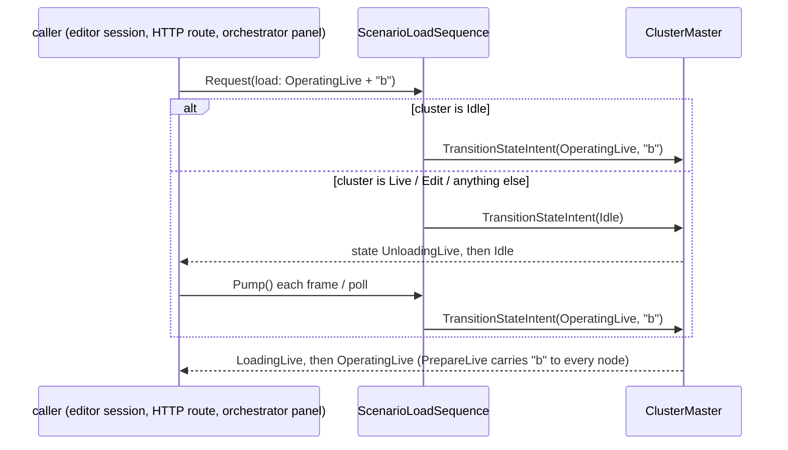
```mermaid
sequenceDiagram
  participant C as caller (editor session, HTTP route, orchestrator panel)
  participant Q as ScenarioLoadSequence
  participant M as ClusterMaster
  C->>Q: Request(load: OperatingLive + "b")
  alt cluster is Idle
    Q->>M: TransitionStateIntent(OperatingLive, "b")
  else cluster is Live / Edit / anything else
    Q->>M: TransitionStateIntent(Idle)
    M-->>C: state UnloadingLive, then Idle
    C->>Q: Pump() each frame / poll
    Q->>M: TransitionStateIntent(OperatingLive, "b")
  end
  M-->>C: LoadingLive, then OperatingLive (PrepareLive carries "b" to every node)
```

*What the picture shows that prose hid: the master and the planner are untouched — the unload is an ordinary request the
CALLER makes, exactly the two requests an operator would click; the sequence only holds the load until `Idle`.*

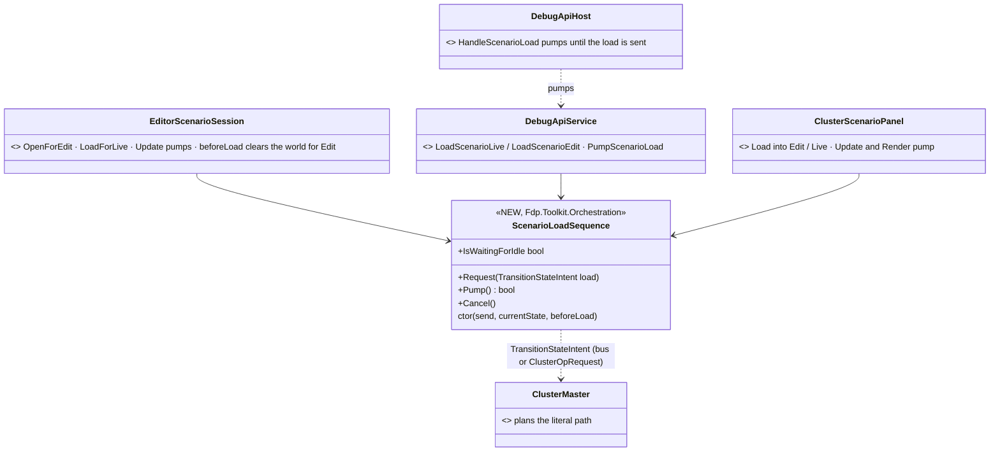
```mermaid
classDiagram
  class ScenarioLoadSequence {
    <<NEW, Fdp.Toolkit.Orchestration>>
    +Request(TransitionStateIntent load)
    +Pump() bool
    +Cancel()
    +IsWaitingForIdle bool
    ctor(send, currentState, beforeLoad)
  }
  class EditorScenarioSession { <<existing>> OpenForEdit · LoadForLive · Update pumps · beforeLoad clears the world for Edit }
  class DebugApiService { <<existing>> LoadScenarioLive / LoadScenarioEdit · PumpScenarioLoad }
  class DebugApiHost { <<existing>> HandleScenarioLoad pumps until the load is sent }
  class ClusterScenarioPanel { <<existing>> Load into Edit / Live · Update and Render pump }
  class ClusterMaster { <<existing, UNCHANGED>> plans the literal path }
  EditorScenarioSession --> ScenarioLoadSequence
  DebugApiService --> ScenarioLoadSequence
  DebugApiHost ..> DebugApiService : pumps
  ClusterScenarioPanel --> ScenarioLoadSequence
  ScenarioLoadSequence ..> ClusterMaster : TransitionStateIntent (bus or ClusterOpRequest)
```

| decision | rejected |
|---|---|
| ⭐ the CALLER asks for `Idle` first, through ONE transport-free helper (`send` + `currentState`), pumped by each caller's own loop | a master-side rule "a named scenario from a non-Idle state goes via Idle" — 🔒 rejected by the user as a hidden shortcut · a planner change — the empty path is correct · a refusal to load when not Idle — 🔒 rejected: a valid way exists, so the order is honoured |

Rails: `ScenarioLoadSequenceTests` (6) · `EditorScenarioSessionLoadTests` (4, red-proved on the old session) — live:
`scripts/utility-demo-check.py` loads scenarios one after another in ONE `--mode all` process.

## 10. ⭐⭐ `CE-3075` — **A SCENARIO NAMING NO TERRAIN UNLOADS THE RESIDENT ONE** *(AS-BUILT `2026-10-05`, backend)*

🔒 **User, `2026-10-05`:** *"unload terrain when scenario names none. the terrain only stays untouched if scenario load
requests same terrain as already loaded."* (R-211)

📐 **The defect** (found once §9 made a second load in one process real): `TerrainResidency.Prepare(null)` answered
"nothing to do", so a terrain-less scenario INHERITED the previous one — `hill-attack-close` after `test-town` ran its
platoon on test-town's buildings and the mission halted.

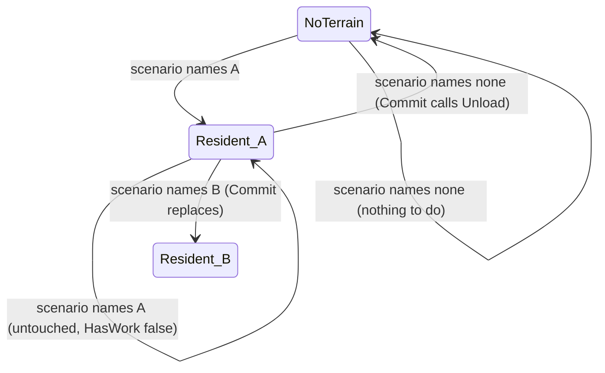
```mermaid
stateDiagram-v2
  NoTerrain --> Resident_A : scenario names A
  Resident_A --> Resident_A : scenario names A (untouched, HasWork false)
  Resident_A --> Resident_B : scenario names B (Commit replaces)
  Resident_A --> NoTerrain : scenario names none (Commit calls Unload)
  NoTerrain --> NoTerrain : scenario names none (nothing to do)
```

*What the picture shows that prose hid: "names none" is a TRANSITION when a terrain is resident, not a no-op; only the
self-loop on the SAME name leaves the world untouched.*

| decision | rejected |
|---|---|
| ⭐ `Prepare(null)` stages `UnloadResident`; `Commit` calls the existing `Unload` (ECS work stays on the main thread at commit). `Unload` also clears the `TerrainDefinition` singleton, so a save stamps no stale name; the world becomes an EMPTY `TerrainWorld` (flat ground), cover and navmesh empty | keep the old terrain — 🔒 rejected by the user · unload-then-load for a DIFFERENT terrain — `Commit` already replaces, and unloading first would drop a graph a background solver may hold |

⚠ Scope: the terrain step is universal (every ECS node, §4.1a), so every node unloads; `/world/info` reports `terrain: null` for the
unloaded (unnamed) world. Rails: `TerrainLoadStepTests.AScenarioNamingNoTerrain_UnloadsTheResidentOne_CE3075`,
`TheSameTerrainStaysUntouched_ADifferentOneReplacesIt_CE3075` (red-proved on the old residency).

📐 **Live (`2026-10-05`) found a second half:** SimHost and IG unloaded, CGF did not — its step fell back to a STALE staged
header (the gateway wrote none for a scenario naming nothing, so the previous one stayed). Fixed in the writer:
[`DESIGN_Artifact_Staging.md`](DESIGN_Artifact_Staging.md) §9.7.

