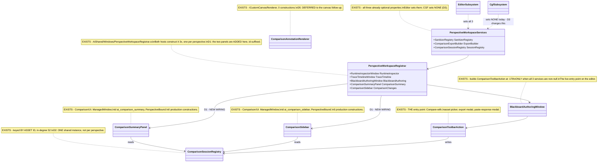
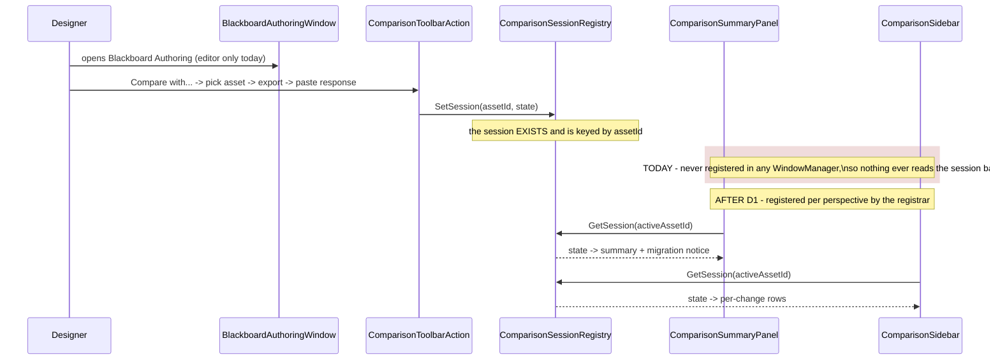

<!--STATUS
state: LIVE
updated: 2026-08-27
current-answer: §4 (the decisions, with leans) and §5 (the items). §3 is the measurement they rest on.
stale-below: nothing.
build-state: DESIGN
known-rot: nothing yet.
known-conflict: docs/designs/visual-asset-comparison/Visual_Asset_Comparison_Detailed_Design.md:1082-1083
  states that ComparisonSummaryPanel and ComparisonSidebar ARE registered as docked windows. §3 measures
  that they are registered NOWHERE, on either host. That document describes intent; this one describes the
  gap and how to close it. Neither is wrong about its own subject — but a reader must not quote :1082-1083
  as a statement of what the code does.
-->
# ⭐⭐ DESIGN — **Mounting the visual-asset-comparison UI** *(`CE-071`)*

> ⭐⭐⭐ **The one-line finding:** the comparison feature's **entry point is live on the editor and absent on
> CGF**, and its **result surfaces — the two docked panels and the canvas annotations — are mounted on
> NEITHER host.** ⛔ So a designer on the editor can export a comparison and paste a response back, and then
> **cannot see the result anywhere except the blackboard's own row decorations.**

📄 **Owning feature design:** [`docs/designs/visual-asset-comparison/Visual_Asset_Comparison_Detailed_Design.md`](designs/visual-asset-comparison/Visual_Asset_Comparison_Detailed_Design.md)
*(the intent — §6 re-import/visualisation, §7.1 the toolbar action, `:1081-1083` the three UI surfaces)*.
📄 **Found by:** [`DESIGN_Subsystem_Composition_Unification.md`](DESIGN_Subsystem_Composition_Unification.md) §5b.6 *(`CE-070`'s deletion sweep)*.

---

## 1. ⭐ WHY THIS EXISTS AS ITS OWN DESIGN

⛔ `CE-070` deleted `SharedAiWindowRegistrar`, the only class that **named** the two comparison panels. ⚠ That
deletion changed nothing at runtime *(the class had zero constructions)*, ⭐ but it removed the last thing that
made the gap **look** closed. ⇒ this design closes it for real.

⛔⛔ **It is not a mechanical route.** 📐 The measurement in §3 shows the missing pieces are spread across
**three canvases, two hosts and one shared registrar**, and mounting them requires deciding *which
perspectives get which surface* — ⭐ a **capability decision**, which is why it gets a design and a user nod
rather than riding along in a deletion diff.

---

## 2. 🔴 INVENTORY — **the queries actually run** *(`2026-08-27`)*

⭐ Mandated by the INVENTORY-before-design rule. ⚠ `search_graph` for the set, `grep` to confirm call sites —
⛔ neither alone for an exhaustive claim.

```
search_graph(project="home-user-HROT", name_pattern=".*Comparison.*", label="Class")   -> total 46
search_graph(project="home-user-HROT", name_pattern=".*(PerspectiveWorkspace|PerspectiveRegistr|WorkspaceRegistrar).*") -> total 38
grep: new <Type>( production sites for each UI class, excluding *.Tests
grep: AddBTreeEditorComparison | AddHsmEditorComparison | AddBlueprintEditorComparison
grep: SanitizerRegistry= | ExportBuilder= | SessionRegistry= in CgfSubsystem.cs
```

**46 comparison classes.** ⭐ The **sanitize/export/session core is live**; the inventory below is only the
**UI mount surface**, which is what is missing.

| # | class | production constructions | ⇒ state |
|---|---|---|---|
| ① | `ComparisonToolbarAction` *(the ENTRY POINT — "Compare with…", asset picker, export modal, paste-response modal)* | ⭐ **`BlackboardAuthoringWindow:179`** *(guarded on all 3 services)* · `BTreeComparisonToolbar:20` · `HsmComparisonToolbar:20` | ⭐ **LIVE on the editor**, via the blackboard window only |
| ② | `BTreeComparisonToolbar` · `HsmComparisonToolbar` | ⛔ **0** | ⛔ the BTree and HSM **canvases** have no compare entry |
| ③ | `ComparisonSummaryPanel` *(`ai_comparison_summary`, `PerspectiveBound`)* | ⛔ **0** | ⛔⛔ **never rendered, either host** |
| ④ | `ComparisonSidebar` *(`ai_comparison_sidebar`, `PerspectiveBound`)* | ⛔ **0** | ⛔⛔ **never rendered, either host** |
| ⑤ | `ComparisonAnnotationRenderer` *(`ICustomCanvasRenderer`, the on-canvas outlines/badges — design §6)* | ⛔ **0** | ⛔⛔ **never rendered, either host** |
| ⑥ | `AddBTreeEditorComparison` · `AddHsmEditorComparison` · `AddBlueprintEditorComparison` | ⛔ **0 callers** | ⛔ three DI extensions nothing calls |
| ⑦ | `ExitComparisonAction` | `ComparisonToolbarAction:36` | ⭐ live wherever ① is |
| ⑧ | `BlackboardComparisonDecorator` *(row decorations)* | `BlackboardAuthoringWindow:580` | ⭐ **LIVE** — the one result surface that works |

### ⭐⭐ The core, for contrast — **this part is wired, by hand, on the editor**
📐 `EditorSubsystem:2679-2687` constructs `SanitizerRegistry` *(registering `BTreeComparisonSanitizer`,
`HsmComparisonSanitizer`, `BlueprintComparisonSanitizer`)*, `ComparisonExportBuilder` and
`ComparisonSessionRegistry`, and hands all three to `PerspectiveWorkspaceServices` at `:2851-2853`
⇒ `PerspectiveWorkspaceRegistrar:350-352` ⇒ `BlackboardAuthoringWindow`.
⚠ **Two sanitizers are NOT registered:** `BlackboardComparisonSanitizer` and `UtilityComparisonSanitizer`.
⛔ **`AddSharedAiEditor` has no production caller at all** — the DI container is a test-only path, so ⑥'s
three extensions could not have run even if something called them.

### 🔴 And CGF sets **none** of the three
📐 Confirmed by grep: no `SanitizerRegistry=` / `ExportBuilder=` / `SessionRegistry=` in `CgfSubsystem.cs`.
⇒ `BlackboardAuthoringWindow:178`'s guard fails ⇒ `_comparisonToolbar` is **null** ⇒ ⛔ **CGF has no compare
entry point anywhere.**

⚠⚠ **This is NOT trap ①** *(the caller HAS it and does not pass it)*. 📐 CGF never **constructs** the three
services, so there is nothing it is failing to forward. ⛔ **It is a capability CGF was never given** —
which is why it needs a decision, not a one-line fix. ⭐ **But it IS a silent absence in a file that
explains every other one:** `CgfSubsystem:1468+` documents *why* `EntityPicker` and `StagedWrites` are
absent, in measured detail. ⇒ ⭐⭐ **whatever §4 decides, CGF's three must end up either PASSED or
ABSENT-AND-EXPLAINED** — ⛔ never left silently unset.

---

## 3. 📐 THE GAP, STATED AS A USER-VISIBLE SENTENCE

| host | can start a comparison? | can see the summary? | can see changes on the canvas? |
|---|---|---|---|
| **Editor** | ⭐ yes — but **only from the Blackboard Authoring window** | ⛔ **no** | ⛔ **no** |
| **CGF** | ⛔ **no** | ⛔ **no** | ⛔ **no** |

⇒ ⭐⭐⭐ **On the editor the round-trip completes and the result is invisible** except `BlackboardComparisonDecorator`'s
per-row marks inside that same window. 📄 The feature design's §6 *"re-import and visualization"* is the half
that was never mounted.

---

## 4. ⭐⭐⭐ THE DECISIONS — **each with a recommended lean; the user approves**

> ⭐ Per the architect-question discipline: ⛔ options without a recommendation are work handed back to the
> user. ⚠ Large-blast-radius calls are named as such.

### `D1` — **Where do the two panels mount?**
| option | |
|---|---|
| ⭐⭐ **(a) `PerspectiveWorkspaceRegistrar`, one pair per perspective** — ⭐ **RECOMMENDED** | 🔒 The panels declare `WindowScope.PerspectiveBound`; this registrar is the **only** per-perspective home, and both hosts already construct it 3× each. ⭐ Ids follow the established `$"…_{suffix}"` convention *(as `ai_trace_timeline_{suffix}` does)* ⇒ **9 window ids** *(3 perspectives × 2 panels, +1 pair per host share)*. ⚠ The panels' hard-coded ids become `idOverride`s — the same treatment every sibling window already gets |
| ⛔ (b) a host-level bundle *(`IUiBundle`)* | ⛔ **this is the `CE-070` mistake again**: a flat host-level registrar for `PerspectiveBound` windows. ⚠ Named here only so nobody re-proposes it |
| ⚪ (c) one shared pair, not per-perspective | ⛔ contradicts their declared scope; ⚠ and a comparison is *of an asset*, which belongs to a perspective |

### `D2` — **One `ComparisonSessionRegistry`, or one per perspective?**
| option | |
|---|---|
| ⭐⭐ **(a) ONE shared instance — ⭐ RECOMMENDED** | 📐 Measured in-degree **52**; `EditorSubsystem:2687` already constructs exactly one and shares it across all three perspectives. ⭐ A comparison session is keyed **by `AssetId`** *(`GetSession(assetId)`)*, so one registry cannot confuse two perspectives. ⛔ Splitting it would be a second implementation of one concept *(ruling 9)* |
| ⛔ (b) one per perspective | ⛔ no measured need, and it would break `BlackboardComparisonDecorator`'s existing lookup |

### `D3` — **Does CGF get the comparison capability?**
| option | |
|---|---|
| ⭐⭐ **(a) YES — CGF constructs the three services, same as the editor. ⭐ RECOMMENDED** | 🔒 **`cgf==editor` is the programme's goal**, and the user reaffirmed it on `2026-08-27`. 📐 The cost is **low and measured**: the three ctors take a catalog CGF already has *(it passes `catalog` to `PerspectiveWorkspaceServices` today)*. ⚠ **Which sanitizers** CGF registers is the only real question — see `D4` |
| ⚪ (b) NO — ABSENT-AND-EXPLAINED, like `EntityPicker` | ⭐ legitimate **only** if a measured capability is missing. ⛔ None found: sanitizers need a catalog, and CGF has one ⇒ this would be absence by omission dressed as a decision |

### `D4` — **Which sanitizers does each host register?**
| option | |
|---|---|
| ⭐⭐ **(a) BOTH hosts register all sanitizers their assemblies can reach — ⭐ RECOMMENDED** | ⭐ Ruling 58: **one registration list, no host conditionals.** 📐 The editor registers 3 of 5 today; ⚠ `BlackboardComparisonSanitizer` and `UtilityComparisonSanitizer` are **unregistered on both** ⇒ two asset kinds silently cannot be compared. ⇒ ⭐ fix that in the same pass, in ONE shared helper both hosts call |
| ⛔ (b) leave the editor's 3-sanitizer list as-is | ⛔ it is not a decision, it is the current accident |

### `D5` — **Do the BTree/HSM canvases get their compare entry?**
| option | |
|---|---|
| ⭐ **(a) DEFER to a follow-up — ⭐ RECOMMENDED for this item** | 📐 `BTreeComparisonToolbar`/`HsmComparisonToolbar` need a **canvas toolbar host** and the annotation renderer needs registering as an `ICustomCanvasRenderer` at the `AfterNodes` pass ⇒ ⛔ that is NodeEditor-host work, a different surface from window registration. ⭐ Splitting keeps this item reviewable; ⚠ **and it must be FILED, not dropped** — an unmounted renderer is exactly the class of thing this programme keeps rediscovering |
| ⚪ (b) all in one item | ⛔ two unrelated mount mechanisms in one diff |

### `D6` — **The three dead DI extensions** *(inventory ⑥)*
⭐ **RECOMMENDED: leave them, and say why.** ⛔ **Not a rush removal:** they are the DI path for a container
whose entry point *(`AddSharedAiEditor`)* has no production caller either — ⇒ ⭐ the honest fix is *"adopt the
container or delete both"*, a separate question about the DI story, **not** about comparison. ⚠ File it;
⛔ do not delete them in a mount diff.

---

## 5. ⭐⭐ THE UML — **drawn AFTER the enumeration; existing boxes marked EXISTS**

> ⭐ Obligation ②: every box that already exists is drawn as existing, **with its file**, so a proposed class
> that duplicates one is visible on the same canvas. ⛔⛔ **Note what that reveals here: there are NO new
> classes.** ⭐⭐⭐ **Every box below already exists** — this design adds *wiring*, not types. ⇒ the seam law
> again: the thing was built and never adopted.



⭐⭐ **The sequence — and the point it makes is that the WRITE and the READ already share a registry; only the
readers are unregistered.**



---

## 6. ⭐ THE ITEMS *(pending `D1`–`D6` approval)*

| # | item | proof |
|---|---|---|
| **①a** | 🔴 **the two panels take `idOverride` + `owningPerspective`** *(`B1`+`B2`)* — ⛔ **do this FIRST**; without it ①b registers three colliding, invisible windows | ⭐ the existing `…_RegistersWindows_WithOwningPerspectiveAndDistinctIds_{BTree,HSM,Blueprint}` trio extends to cover them |
| **①b** | `PerspectiveWorkspaceRegistrar` constructs + exposes the two panels, id-suffixed per perspective, **only when `SessionRegistry` is non-null** | ⭐ same trio; ⛔ distinct ids per perspective, as those rails already assert for siblings |
| **①c** | 🔴 **asset activation drives `SetActiveAsset`** on both panels *(`B3`)* — ⭐⭐ **this is the item that makes the feature work**; without it the panels render the empty state forever | ⭐ rail: after activating an asset with a live session, `PanelSnapshot.TryGet(summaryId)` reports `HasSession: true` — ⛔ **not merely that the panel is registered** |
| **②** | one shared helper registers **all reachable sanitizers**; both hosts call it *(`D4`)* | ⭐ rail: the registry answers for all 5 asset kinds on **both** hosts |
| **③** | CGF constructs the three services and passes them *(`D3`)* | ⭐⭐ **the two-host conformance rail** — `_comparisonToolbar` non-null on both, and the panel ids present on both |
| **④** | ⚠ **anti-vacuity**: a rail that the panels **read a session back** — ⛔ not merely that they are registered | 🔒 `CE-049`/`CE-064`'s lesson: presence is not substance. ⭐ `PanelSnapshot.TryGet("ai_comparison_summary_…")` must carry the session's content |
| **⑤** | file the deferrals: the canvas entry + annotation renderer *(`D5`)*, the dead DI extensions *(`D6`)* | ⛔ **filed as tracker rows, not comments** — 📌 `BP-355` was named in a report and never became an item |

⛔⛔ **NOT in scope:** the `Utility` perspective *(no `PerspectiveWorkspaceRegistrar` instance today)* · the
NodeEditor canvas mount *(`D5`)* · the DI-container adoption question *(`D6`)*.

---

## 7. 🔴🔴 THE THREE BLOCKERS — **measured, and they change item ① from "register two windows" to real work**

> ⚠ These began as *"what this design might have wrong"*. ⭐⭐ **All three were then MEASURED, and all three are
> real.** ⛔⛔ **Mounting the panels is NOT a two-line registration** — each blocker below would make the mount
> compose perfectly and render nothing, which is this programme's signature failure.

### 🔴 `B1` — **both panels are bound to a perspective THAT DOES NOT EXIST**
📐 `ComparisonSummaryPanel.cs:91` and `ComparisonSidebar.cs:55` pass **`"Analysis"`** as `ManagedWindow`'s
**`owningPerspective`** *(the 3rd ctor arg — it is not a category label)*, and 📐 **`grep` finds `"Analysis"`
in production ONLY in those two lines.** ⇒ ⛔⛔ they are `WindowScope.PerspectiveBound` to a perspective
**nothing registers** ⇒ ⭐⭐⭐ **even correctly registered, they could never be shown.**
📌 Exactly the hazard `SharedAiEditorServiceCollectionExtensions:84-85` already documents for `"Authoring"`
— *"NOT a live perspective: no production registration claims it"*. ⚠ **Second instance of the same bug, in
a second file.** ⇒ ⭐ item ① must take `owningPerspective` per instance, as every sibling window does.

### 🔴 `B2` — **the ids are hard-coded, so three instances collide**
📐 `ManagedWindow`'s ctor is `(id, title, owningPerspective, scope)` and **neither panel exposes an
`idOverride`** — both pass a literal. ⇒ ⛔ three per-perspective instances would share one `Id`, and
📌 `ComparisonSummaryPanel:~96` calls **`PanelSnapshot.DeclareInstrumented(Id)`** at construction ⇒ ⚠ three
instances would declare the **same panel id** to the observability surface. ⇒ ⭐ item ① adds
`idOverride`/`owningPerspective` params, mirroring `TraceTimelineWindow`'s `$"ai_trace_timeline_{suffix}"`.

### 🔴 `B3` — **`SetActiveAsset` has ZERO callers, on all three surfaces**
📐 `ComparisonSummaryPanel.cs:100` · `ComparisonSidebar.cs:61` · `ComparisonAnnotationRenderer.cs:63` each
expose `SetActiveAsset(...)`, and **nothing in production calls any of them.**
⇒ ⛔⛔ **a registered panel with no asset set renders the empty state forever** — `HasSession: false`, which is
indistinguishable from *"no comparison running"*. ⇒ ⭐⭐ **item ① is not done until asset activation drives
`SetActiveAsset`**, and that is the real work: the summary panel needs `(assetId, assetName)`, so it needs the
same activation signal the Asset Browser already routes.

⇒ ⭐⭐⭐ **REVISED ESTIMATE.** ⛔ §6 item ① read as *"construct two windows in the registrar"*; with `B1`–`B3` it
is **two small signature changes + one activation wiring**, and ⭐ **`B3` is the part that decides whether the
feature actually works.** ⚠ **I am flagging my own §6 as having under-scoped this** — the same error pattern
the resume doc records twice already *(a size quoted before the surface was measured)*.

### ⚠ And one thing still genuinely unverified
⛔ **I have not run the editor.** The claim *"the entry point is live on the editor"* is measured from
**construction** *(`BlackboardAuthoringWindow:179`, guarded on all three services being non-null, which
`EditorSubsystem:2851-2853` satisfies)*; `:473` renders it under a condition I read but did not exercise.
⇒ ⭐ a `T3` check belongs in the implementing batch — ⚠ and note `B3` means the *result* surfaces are known
broken regardless of what that check shows.

---

## 8. 🔒 USER RULING `2026-08-27` — **the MCP obsoletes the EXPORT half, not the VISUAL half**

> 🔒 **User:** *"the graph comparison stuff — it is designed to be processed by an AI model; does it still
> make sense now when we have the mcp server that can read the stuff directly? Or does the comparison
> feature work with different version of the same file that can not be loaded at the same time?"*
> …and, on the answer: *"If the visual part of the comparison haven't been built yet, the whole feature is
> useless. If it is easy to add, then ok."*

### ⭐ THE SECOND HYPOTHESIS IS THE CORRECT ONE — and the feature design says so
📄 `Visual_Asset_Comparison_Detailed_Design.md` §1.5: *"**Phase 1 is historical-diff only. Both versions are
presumed to be the same asset at different points in time. VisualIds correlate.**"* · §1.3 defers git
integration: *"user obtains the old version externally (git checkout, file copy) and feeds the file path to
the editor."*
⇒ ⭐⭐ **two revisions of ONE file, and the editor can only ever hold one of them as a document.**

### 📐 WHY THE MCP CANNOT SUBSTITUTE — measured against the SKILL, not the engine
⭐ `read_asset_graph` requires the asset **OPEN**; `open_asset` / `open_asset_by_path` resolve only inside
the **indexed catalog** *(a relative-path suffix match)*. ⇒ ⛔ an old revision in `/tmp` or extracted from git
is not addressable. ⚠ And a copy dropped into the asset tree would **collide on C# type names** for
BTree/HSM assets, which emit classes.

### ⛔⛔ BUT THE MCP IS THE WRONG COMPARISON — an AGENT needs no editor to read the old version
⭐ `git show HEAD~5:path` plus a file read gets both texts. ⇒ for **agent-driven** review the round-trip is
largely redundant: ⚠ the **sanitizer** is a token/noise optimisation rather than an enabler, and the
**LLM contract** *(instruction block + JSON response schema)* is scaffolding for a human shuttling text into
a chat window.

### ⭐⭐⭐ WHAT THE AGENT PATH CANNOT REPLACE — and it inverts the priorities
📐 **There is NO MCP tool that annotates a graph node.** `add_annotation` writes world-space debug primitives
*(sphere/anchor/line)* into the gizmo buffer — **the map, not the graph canvas**; `diff_state` is runtime
entity state. ⇒ ⛔ an agent can determine what changed and has **no way to show a designer which nodes
changed.** ⭐ The vendor-neutral no-agent designer workflow *(design goal §1.5: "no editor-side LLM calls;
the user picks the LLM")* also stands on its own.

⇒ ⭐⭐⭐ **THE INVERSION: the half the MCP obsoletes is the half that was BUILT AND LIVE; the half that becomes
MORE valuable is exactly the half nobody wired.** ⇒ 🔒 **so `D5` is FLIPPED** *(see §9)*, and the manual
export path is **kept as-is with no further investment** — ⛔ specifically, the per-canvas *toolbar* entries
for the manual flow are **dropped from scope**, not deferred.

### ⭐ THE OPTION THIS OPENS — **an MCP tool that PUSHES a comparison session** *(filed, not built)*
⭐⭐ The same JSON the paste-response modal already parses, pushed into `ComparisonSessionRegistry`: the agent
diffs from git *(no sanitizer)*, the editor renders it through the now-mounted panels, decorator and canvas
renderer. ⛔ **No new format to design** — the paste-modal's parser IS the contract.
⚠ **Unmeasured:** whether `ComparisonResponse`'s schema is expressive enough for what an agent naturally
produces. ⇒ measure before committing.

---

## 9. ✅ AS-BUILT *(`2026-08-27`, `CE-071`)* — **`D5` FLIPPED; all three blockers fixed**

<!-- build-state: BUILT -->

| # | shipped | where |
|---|---|---|
| **①a** | both panels take `store` *(`EditorSelectionStore`)*, `idOverride` and `owningPerspective` | `ComparisonSummaryPanel`, `ComparisonSidebar` |
| **①b** | the two panels are constructed **and registered** per perspective, guarded on `sessionRegistry != null` | `PerspectiveWorkspaceRegistrar` *(+ `RegisterWindows`)* |
| **①c** | `B3` solved by the **established pattern**: the panel reads `store.ActiveAsset` every build, exactly as `BlackboardAuthoringWindow:576` does. ⭐ `SetActiveAsset` survives as the store-less/rail seam | both panels |
| **②** | one shared sanitizer list on CGF, **including `BlackboardComparisonSanitizer`** — ⚠ which **NEITHER host registered before**, so blackboard assets silently could not be compared anywhere | `CgfSubsystem` |
| **③** | CGF constructs all three services and **passes** them ⇒ its `_comparisonToolbar` is real and it gets the panels | `CgfSubsystem` |
| ⭐⭐ **`D5`, FLIPPED** | `ComparisonCanvasRenderers.For(registry, assetId)` — **one shared helper**, wired at all **six** `Build` sites *(3 kinds × 2 hosts)* | new file + `EditorSubsystem`, `CgfSubsystem` |

#### ⛔ WHY `D5` WAS WRONG, stated plainly
§4 `D5` deferred the annotation renderer as *"NodeEditor-host work, a different surface from window
registration"*. 📐 **Measured: every document factory already composes "built-in set + caller extras"
through its own `BuildRenderers`, and each kind ships 4–6 LIVE renderers** *(BTree: heatmap · subtree
boundary · observer-guard badge · variable-binding badge · breakpoint gutter · runtime overlay)*.
⇒ ⭐⭐⭐ **the renderer joins an exercised list with NO factory signature change — the cheapest piece of the
mount, not the one to defer.** ⚠ 📌 **Third estimate this programme got wrong by not measuring the surface
first** *(after the "24-site rename" and "the cheapest adopter")*.

#### ⭐ NOT DONE, deliberately
⛔ **`D5`'s per-canvas toolbar entries** *(`BTreeComparisonToolbar` / `HsmComparisonToolbar`, still 0
constructions)* — **dropped**, per §8: they are entry points for the manual flow the MCP largely obsoletes.
⛔ **`D6`'s three never-called `Add*EditorComparison` DI extensions** — left, with the reason recorded: their
container `AddSharedAiEditor` has no production caller either, so the honest question is *"adopt the
container or delete both"*, which is about the DI story and not about comparison.

#### 📐 GATES
`Hrot.Editor.AiShared.Tests` **2033/0**, 1 skipped *(pre-existing)* — **+6** = the new rails ·
`Hrot.Editor.Tests` **338/0** · `Hrot.Editor.AiShared`, `Hrot.Editor`, `Hrot.CGF` build clean.
⭐⭐ **Each blocker inverse-edit red-proved and reverted:** `B1` re-bind to `"Analysis"` ⇒ 1 failed ·
`B2` drop `idOverride` ⇒ 1 failed · `B3` stop passing `store` ⇒ **2** failed ⇒ then 6/0.
⚠ **`comparison-summary` is now a SHARED panel kind** *(both hosts publish it)* ⇒ ⭐ no `EditorOnlyKinds`
entry needed, which is the `cgf==editor` outcome. ⛔ **T3 not run** *(async lane)*: the two-host capability
diff should confirm the new kind appears on both — ⚠ and note goldens are per-panel-id files, so nothing
existing is invalidated.
