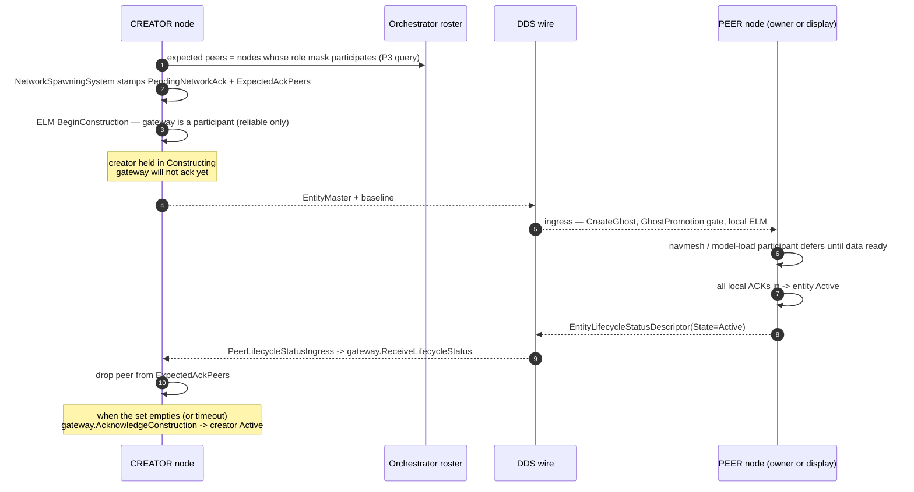
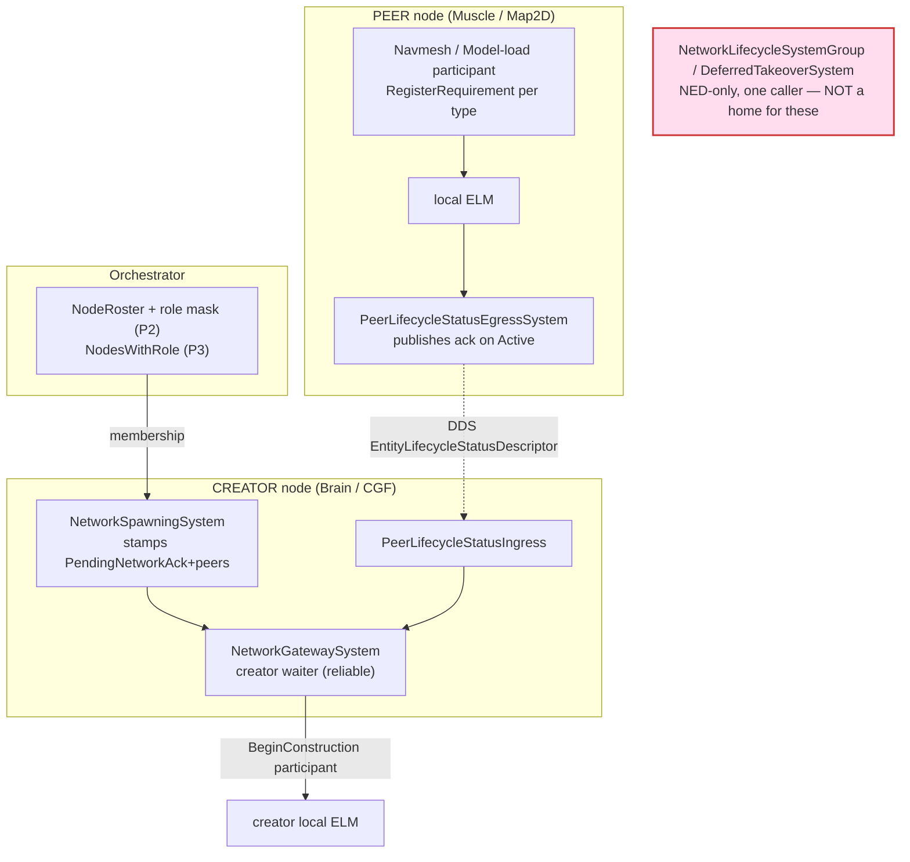

<!--STATUS
state: LIVE
build-state: DESIGN — the barrier itself (pieces A–C) NOT yet READY-TO-BUILD. ✅ Prerequisites P1–P3
  (role propagation, §5) are BUILT `2026-09-15` — see §5 "P1–P3 AS-BUILT". Still gated on a user nod on the
  fast/reliable default before the barrier is built. The reliable path is OPT-IN; fast stays default.
updated: 2026-09-15
current-answer: §1 IS THE DESIGN — the three diagrams (1.1 sequence, 1.2 classes, 1.3 module map).
  §2 says only WHY — incl. §2a late-joiner durability, §2b node-id consistency, §2c generic NED/BDC
  protocol (all user hard-requirements `2026-09-15`). §3 is NEW vs EXISTS vs CHANGE. §4 the receiver gate
  (reuse). §5 the prerequisites and their order (P1–P3 BUILT). §6 acceptance.
known-rot: nothing yet — new document.
related-designs:
  - docs/DESIGN_Entity_Genesis_End_To_End.md — the landing page; this design is stage ⑨'s reliable variant. It owns the end-to-end sequence; this owns the cross-node WAIT.
  - docs/designs/others/DESIGN-NetworkSpawning.md — owns ReliableInitType / PendingNetworkAck (the dormant handshake this design revives and reshapes).
  - docs/reference/BDC_NED_SST_Descriptor_Rules.md — owns the BDC/NED wire contract; §2a/§2b/§2c fold the durable EntityLifecycleStatusDescriptor + EntityMaster.Flags reliable bit into it as OPTIONAL generic descriptors (reciprocal link to add when that spec is edited for piece A).
  - docs/DESIGN_Role_Affinity_Ownership.md — owns WHO OWNS WHAT (the grant node-set = the owner subset of the peer set) and the role tables.
  - FDP/Docs/projects/toolkits/FDP.Toolkit.Lifecycle.md — owns the ELM participant/ack mechanism this builds on.
  - docs/designs/replay-and-modules/DESIGN.md — §2.1m the ELM rewind boundary (OnWorldReplaced/ResumeFromRestoredWorld) that new participants inherit.
  - docs/blueprints/batches/FRAME_Construction_Barrier_Participants.md — the frame that scoped this (pieces A–D, prerequisites P1–P3).
  - docs/blueprints/Architect_Question_69_Construction_Barrier_And_Rewind_Contract.md — the asks + §9 reconciliation this design answers.
-->
# DESIGN — the cross-node construction barrier *(reliable distributed init)*

> 🎯 **What this owns:** how a creating node holds an entity in `Constructing` until the **peer nodes that
> must initialise a copy have reported `Active`** — decentralised, **no master controller**. Opt-in per
> entity (`ReliableInitType.AllPeers`); fast mode (each node independent) stays the default.
> ⛔ **What it does NOT own:** the genesis sequence *(the landing page)*, ownership grants *(role-affinity)*,
> the mandatory-components gate *(tkb-1)*, replay suppression *(mgmt-1)*.

## 0. 📐 INVENTORY — the enumerations the diagrams rest on *(measured `2026-09-15`)*
⚠ `check_index_coverage` is not reachable via the CLI, so no coverage attestation; every row is
`search_graph` + grep agreeing, `file:line` inline.

| query | result |
|---|---|
| `search_graph name_pattern=".*(NetworkTopology\|ExpectedPeers\|RoleShard\|ClusterStateCache\|OwnershipStrategy).*"` | 65 nodes — the seams below; `INetworkTopology` has **no production impl** *(tests only)* |
| ELM public API | `EntityLifecycleModule.cs`: `RegisterModule(int):148` · `RegisterRequirement(long,int):158` · `BeginConstruction:182` *(`RemainingAcks = _globalParticipants ∪ _blueprintRequirements[tkbType]` :190)* · `AcknowledgeConstruction:168` · `ProcessConstructionAck:283` *(sets `Active` :305, publishes NOTHING)* · `OnWorldReplaced(bool):465` |
| the deferring-participant pattern | `NetworkGatewaySystem.cs` — `_pendingPeerAcks:47` · `ReceiveLifecycleStatus:167` · timeout `:189`; ⛔ **never constructed in production** |
| the peer-ack wire type | `EntityLifecycleStatusDescriptor.cs` *(Cyclone topic: `EntityId, NodeId, State, Timestamp`)* — **designed for exactly this, ZERO producer/consumer** |
| the creator's reliable stamp | `NetworkSpawningSystem.cs:175` `if (InitType != None) AddComponent(PendingNetworkAck{ExpectedType})` — stamped, unread |
| the owner subset of the peer set | `DeferredTakeOwnershipCommand.Grants[].NodeId` — `CreateEntityRequestSystem:363` + `CgfSubsystem:544` |
| cluster membership | orchestrator `ClusterMaster._roster` → `NodeRoster.ActiveNodes` *(`NodeHealthProfile`: NodeId, SubsystemName, ClusterState, LastHeartbeat, Cpu, Ram — **no role**)*; `NodeHeartbeatEvent` *(NodeId, LocalStateId, WallTicksUtc, SubsystemName — **no role mask**)*; role re-derived lossily at `NedNetworkFactory.MapSubsystemNameToRole:422` |
| role type | `NodeRole` `[Flags]` in `Fdp.Core` *(`Brain=1<<0 … NavigationSolver=1<<4`)* |
| heartbeat producers | `ClusterSlave.cs:153` · `OrchestrationObserverTranslator.cs:86` · `NedOrchestrationTranslator.cs:58` |

---

## 1. ⭐⭐⭐ THE DIAGRAMS — *this is the design; §2 onward only says why*

### 1.1 The reliable-init sequence across the wire
*What the picture shows that prose hides: the creator's `Active` is gated on a **count-down of peer acks it
resolved at spawn from the roster**, and each peer's ack fires only after **its own** local barrier cleared —
so the cross-node wait is a composition of local waits, never a central controller.*

### 1.2 The classes — *existing on the same canvas as new, so duplicates are visible*
*What it shows: the peer-ack carrier and the participant mechanism ALREADY EXIST; the new work is one base
class, its subclasses, one egress producer, and one field on the membership records.*

```mermaid
classDiagram
    class EntityLifecycleModule {
        <<EXISTS>>
        +RegisterModule(int)
        +RegisterRequirement(long tkbType, int moduleId)
        +BeginConstruction(...)
        +AcknowledgeConstruction(entity, moduleId, ...)
    }
    class DeferredConstructionParticipant {
        <<NEW abstract>>
        #TryComplete(entity) bool
        +Execute(view, dt)
    }
    class NetworkGatewaySystem {
        <<CHANGE: construct in prod; subclass the base>>
        +ReceiveLifecycleStatus(entity, nodeId, state)
    }
    class NavmeshReadinessParticipant {
        <<NEW>>
    }
    class ModelLoadReadinessParticipant {
        <<NEW>>
    }
    class PeerLifecycleStatusEgressSystem {
        <<NEW>>
        +publishes EntityLifecycleStatusDescriptor on Constructing to Active
    }
    class EntityLifecycleStatusDescriptor {
        <<EXISTS orphan - revive as DURABLE descriptor>>
        +long EntityId DdsKey
        +int NodeId DdsKey - SAME id as OwnershipUpdate
        +EntityLifecycle State
        +long Timestamp
    }
    note for EntityLifecycleStatusDescriptor "DdsQos Reliable + TransientLocal + KeepLast 1 -- owner-instance authoritative; late joiner reads it"
    class PendingNetworkAck {
        <<CHANGE: add expected peer set>>
        +ReliableInitType ExpectedType
        +int[] ExpectedAckPeers
    }
    class NodeHeartbeatEvent {
        <<CHANGE: P1>>
        +int NodeId
        +NodeRole Roles
    }
    class NodeHealthProfile {
        <<CHANGE: P2>>
        +NodeRole Roles
    }
    class NodeRoster {
        <<CHANGE: P3>>
        +NodesWithRole(NodeRole) IEnumerable~int~
    }

    DeferredConstructionParticipant <|-- NetworkGatewaySystem
    DeferredConstructionParticipant <|-- NavmeshReadinessParticipant
    DeferredConstructionParticipant <|-- ModelLoadReadinessParticipant
    DeferredConstructionParticipant ..> EntityLifecycleModule : RegisterRequirement + AcknowledgeConstruction
    PeerLifecycleStatusEgressSystem ..> EntityLifecycleStatusDescriptor : publishes on Active
    NetworkGatewaySystem ..> EntityLifecycleStatusDescriptor : consumes (peer ack)
    NetworkGatewaySystem ..> PendingNetworkAck : reads ExpectedAckPeers
    NodeRoster ..> NodeHealthProfile : holds
    NodeHealthProfile ..> NodeHeartbeatEvent : filled from
```

### 1.3 Who registers what, on which node — ⚠ *and what never ticks*
*What it shows that neither of the above can: the creator waiter runs on Brain/CGF, the readiness
participants run on the peers, and the dead NED-only group is NOT the home for any of them.*

---

## 2. ⭐ WHY — the rationale the diagrams cannot carry

- **Why revive `EntityLifecycleStatusDescriptor` rather than invent an ack.** It is a DDS topic already
  designed for exactly this *("published by peer nodes to confirm entity activation in reliable init mode")*
  with no producer/consumer — the seam law: adopt the under-adopted seam, do not add a parallel one.
- **Why a new `PeerLifecycleStatusEgressSystem`.** `ProcessConstructionAck` sets `Active` but **publishes no
  event** *(measured, `:305`)*, so nothing today can react to "my copy became `Active`". The producer must
  OBSERVE the `Constructing → Active` transition for reliable entities and publish the ack. ⚠ It emits only
  for entities the local node treats as reliable, never for every activation.
- **Where `EntityLifecycleStatusDescriptor` is filled from — measured `2026-09-15`.** The four fields are all
  **local peer state** at the moment the copy reaches `Active`:
  | field | source |
  |---|---|
  | `EntityId` | the peer entity's `NetworkIdentity.Value` *(written at ghost creation from `EntityMaster.EntityId`)* |
  | `NodeId` | the reporting node's own local id |
  | `State` | `Active` — the observed transition |
  | `Timestamp` | wall clock *(same `WallTicksUtc` source as the heartbeat)* or the frame `GlobalVersion` |
  ⛔⛔ **BUT the ELIGIBILITY — "which entities publish at all" — is NOT sourced on the peer today.** Reliability
  *(`ReliableInitType`)* is a CREATE-time fact that lives only on the creator *(`SpawnEntityCommand.InitType`,
  the creator's `PendingNetworkAck`)*; it never travels. `EntityMaster` *(the wire descriptor that makes the
  peer's ghost)* has a general `ulong Flags` field, but the sole egress producer writes **`Flags = 0`**
  *(`EntityMasterEgressTranslator.cs:103`)*. ⇒ **the reliable bit must ride `EntityMaster.Flags`** *(exactly
  the design-talk's `Flags = WaitForAcks`)*: the peer reads it at ghost creation, tags the ghost
  *"report-on-Active"*, and the producer publishes for tagged, not-yet-reported entities. **This wire-plumbing
  is a dependency of piece A and does not exist yet.**

### 2a. ⭐⭐ LATE JOINERS — the status descriptor is DURABLE, not fire-and-forget *(user hard requirement, `2026-09-15`)*
> 🔒 **User:** *"Late joiners must get complete information about entity state to avoid using half-baked entity.
> So if reliable-init flag is set, they need to check the state of `EntityLifecycleStatusDescriptor`."*

⛔ **The barrier as drawn in §1.1 only helps nodes that were PRESENT for the `Constructing → Active` transition.**
A node that joins *after* an entity was created would see the durable `EntityMaster` *(TransientLocal → it gets
the last sample)* and build a ghost, **with no idea the entity is still mid-init on a peer** — the exact
"half-baked entity" the user forbids.

⇒ ⭐⭐⭐ **`EntityLifecycleStatusDescriptor` must be a FIRST-CLASS DURABLE DESCRIPTOR, not an event.** Measured
today it is a plain Cyclone topic type with **no `[DdsStruct]`, no `[DdsKey]`, no `[DdsQos]`** — so this is real
work, not a flag flip.

| what it must become | why |
|---|---|
| ⭐⭐ **`[DdsQos(Reliable, TransientLocal, KeepLast 1)]`** | ⛔ so the LAST status per instance is retained and delivered to late joiners — the SST convention for critical descriptors *(`docs/reference/BDC_NED_SST_Descriptor_Rules.md`)*. A `Volatile` sample is gone before the joiner subscribes |
| ⭐⭐⭐ **`[DdsKey]` on `(EntityId, NodeId)`** | one retained instance **per (entity, reporting node)** — a joiner reads every peer's latest status for an entity, so it can tell "all required peers `Active`" from "one still `Constructing`" |
| ⭐⭐ **owner-instance authoritative for the entity's overall readiness** | the joiner correlates the descriptor's `NodeId` with the entity's OWNER *(from `EntityMaster` / `OwnershipUpdate`)*: the **owner's** status instance is the one that says "the entity is fully live". Peer instances say "this peer's copy is ready" |
| ⭐ **the late-joiner READ path** | on ghost creation, if the ghost's `EntityMaster.Flags` has the reliable bit, the joiner does NOT treat the entity as usable until it has read a `State = Active` status instance for the **owner** node *(and, if it is itself a required participant, until its OWN local init acks)* — same "hold until Active" the live barrier enforces, sourced from durable state instead of a live ack |

⚠ **This makes the wire self-describing and removes any need for a joiner to replay history:** the retained
`EntityMaster.Flags` says *"this entity uses reliable init"*, and the retained `EntityLifecycleStatusDescriptor`
instances say *"and here is each node's current readiness"*. A late joiner needs nothing else.

### 2b. ⛔⛔ NODE-ID CONSISTENCY — the descriptor's `NodeId` IS the ownership node-id *(user hard requirement, `2026-09-15`)*
> 🔒 **User:** *"Node id in the `EntityLifecycleStatusDescriptor` must be the same as used for ownership update
> message."*

📌 **Why this is load-bearing, not cosmetic.** §2a's late-joiner correlation — *"is the OWNER's status
instance `Active`?"* — only works if the joiner can match the owner it learns from ownership against the
`NodeId` on the status instance. If the two used different id spaces *(e.g. an orchestrator roster id vs a
NED wire node id)* the join would silently never match and the entity would be treated as forever-unready.

**Measured `2026-09-15` — the ownership node-id in each representation:**
| representation | file | the node-id field |
|---|---|---|
| NED wire *(the one that crosses BDC/NED)* | `Hrot/Network/Hrot.Network.NED/GenericMessages.cs` | `OwnershipUpdate { … NodeId NewOwner }` — a **`NodeId` struct** |
| Cyclone topic | `FDP/Network/Fdp.Network.Cyclone/Topics/OwnershipUpdate.cs` | `int NewOwner` + `int OriginNodeId` |
| ECS event | `FDP/Toolkits/Fdp.Toolkits/Replication/Messages/OwnershipMessages.cs` | `int NewOwnerNodeId` + `int OriginNodeId` |
| the authority test | `OwnershipIngressSystem.cs:67` | `update.NewOwnerNodeId == localNodeId` |

⇒ ⭐⭐⭐ **`EntityLifecycleStatusDescriptor.NodeId` uses the SAME node-id as `OwnershipUpdate`** — the `NodeId`
struct at the NED/BDC wire, projected to the same `int` the ownership ingress compares against `localNodeId`
at the ECS layer. ⛔ **NOT** the orchestrator roster id, **NOT** the lossy subsystem name. The producer stamps
its own local node id *(the identity it also claims ownership with)*; the consumer compares against the owner
learned from `OwnershipUpdate` and against its own `localNodeId` — one id space end to end.

⚠ **This also fixes the §2 "filled from" table's `NodeId` row:** it is not merely "the reporting node's own
local id" — it is *"the reporting node's OWNERSHIP node-id, the same value it puts in `OwnershipUpdate.NewOwner`
when it owns"*.

### 2c. ⭐ GENERIC NED/BDC PROTOCOL — reliable init leaks no Hrot specifics *(user check, `2026-09-15`; confirmed viable)*
Both new wire pieces sit in the **generic** layer and carry no engine-specific meaning, so any external BDC/NED
host can implement them:
- **The reliable bit rides `EntityMaster.Flags`** *(`ulong`, already documented "entity type specific flags")* —
  one reserved bit `WaitForAcks`. A host that ignores it simply behaves as fast-mode; the field already exists on
  the generic descriptor.
- **`EntityLifecycleStatusDescriptor` is already in the generic `Fdp.Network.Cyclone` layer** and its
  `EntityLifecycle` enum *(`Fdp.Core`: `Constructing/Active/TearDown/Ghost`)* is a generic lifecycle vocabulary —
  no Hrot type names. The SST rules doc *(`BDC_NED_SST_Descriptor_Rules.md`)* already contemplates *"the app may
  wait before considering the entity completely created"*; this makes that concept a concrete, optional descriptor.
⇒ ⭐ **Fold into the SST spec as an OPTIONAL descriptor + one reserved `EntityMaster.Flags` bit** — a host that
implements neither is a valid fast-mode-only host. *(Spec edit is its own small task, tracked with piece A.)*

- **Why the participant base is one class.** `NetworkGatewaySystem` already hand-rolls pending-set +
  defer-ack + timeout + destruction-cleanup; navmesh and model-load need the identical shape. One
  `DeferredConstructionParticipant` (hook `TryComplete(entity)`) or the gateway becomes three copies *(ruling 9)*.
- **Why membership comes from the orchestrator role mask, not the grant.** The grant covers only *owners*;
  a display replica *(Map2D/IG)* owns nothing yet must still be waited for. The roster knows every present
  node; filtering by role mask against "roles that register a participant for this type" yields the full set.
  📄 frame §4a.
- **Why fast stays default.** The design-talk's latency argument holds: cross-node waiting is opt-in per
  entity; `ReliableInitType.None` skips the gateway participant entirely.
- **Why rewind needs nothing here.** Replay does not run the ELM *(mgmt-1 §8.10)*; the participants inherit
  `OnWorldReplaced`/`ResumeFromRestoredWorld` *(replay-and-modules §2.1m, BUILT)* — on resume a still-`Constructing`
  entity re-publishes `ConstructionOrder` and the participant re-blocks. No new rewind code.

## 3. NEW vs EXISTS vs CHANGE
| element | status |
|---|---|
| `EntityLifecycleModule` participant/ack API | ✅ EXISTS — used as-is |
| `EntityLifecycleStatusDescriptor` (peer-ack topic) | ⚠ CHANGE — EXISTS but ORPHAN and untyped: add `[DdsStruct]`, `[DdsKey]` on `(EntityId, NodeId)`, `[DdsQos(Reliable, TransientLocal, KeepLast 1)]` so it is DURABLE for late joiners (§2a); `NodeId` = the OwnershipUpdate node-id (§2b); then a producer + a consumer (live + late-joiner read) |
| `NetworkGatewaySystem` (creator waiter) | ⚠ CHANGE — construct in production; reslot onto the base; consume the ack topic; read `ExpectedAckPeers` |
| `DeferredConstructionParticipant` | 🆕 NEW abstract base |
| `NavmeshReadinessParticipant` / `ModelLoadReadinessParticipant` | 🆕 NEW — `RegisterRequirement` per type |
| `PeerLifecycleStatusEgressSystem` | 🆕 NEW — observe `Constructing→Active`, publish the ack |
| `PendingNetworkAck` | ⚠ CHANGE — carry `ExpectedAckPeers` *(or a sibling component)* |
| `EntityMaster.Flags` + `EntityMasterEgressTranslator` | ⚠ CHANGE — carry the reliable bit on the wire *(the egress writes `Flags=0` today)* so the peer knows to report-on-`Active`; the peer tags its ghost from it. **Dependency of piece A** |
| heartbeat/roster role mask | ⚠ CHANGE — P1/P2/P3 *(§5)* |
| `INetworkTopology.GetExpectedPeers(tkbType)` | ⛔ RETIRE as the peer source — type-only, no prod impl |

## 4. ✅ THE RECEIVER-SIDE GATE IS REUSE
The peer's "is my data ready?" gate already exists: `GhostPromotionSystem`'s mandatory-components gate *(HARD,
no timeout)* + the receiver's local ELM. The navmesh/model participants are **additional local participants
on that existing gate**, not a new pipeline. A peer reaches `Active` only after they ack — which is precisely
the moment `PeerLifecycleStatusEgressSystem` publishes.

## 5. ⛔ PREREQUISITES — order before READY-TO-BUILD
1. **P1** — carry `NodeRole` mask on `NodeHeartbeatEvent` *(the 3 producers know the node's boot role)*;
   **retire `NedNetworkFactory.MapSubsystemNameToRole`** *(lossy name→single-role switch)*.
2. **P2** — store the mask on `NodeHealthProfile` *(and `NodeCapability`)*.
3. **P3** — add `NodeRoster.NodesWithRole(NodeRole)` *(and a cache equivalent)*.
4. **User nod:** confirm reliable is opt-in and that display replicas are in scope of the wait *(both are the
   current rulings)*.

### ✅ P1–P3 AS-BUILT (`2026-09-15`) — role propagation done; the barrier itself is still DESIGN
> The §0 INVENTORY sites were accurate and unchanged; the §1.2 class diagram's P1/P2/P3 boxes are the
> as-built shape. The wire gained one field (a field, not a new shape) → no new diagram.

- **P1 — role on the heartbeat + wire; switch retired.** `NodeHeartbeatEvent` gained `NodeRole Roles`
  (`ClusterCqrsEvents.cs`); the DDS `NodeHeartbeat` topic gained `int RolesMask` (`OrchestrationMessages.cs`
  — carried as the `[Flags]` int to keep the wire free of a cross-assembly enum codegen dep). `ClusterSlave`
  takes the mask (`_roles`, both ctors default `None`) and stamps it on every heartbeat; the egress
  (`NodeOpSlaveTranslator`) writes `RolesMask`, both ingress bridges (`OrchestrationObserverTranslator`,
  `NedOrchestrationTranslator`) read it back. **`NedNetworkFactory.MapSubsystemNameToRole` is DELETED** —
  `PollNetwork` reads `(NodeRole)sample.Data.RolesMask` into `NodeCapability.Role` (seam law; an un-set/foreign
  node reads `None`, the correct "unknown role", so no name fallback). ⭐ The 4 role-bearing producers are
  wired at their `ClusterSlave` sites: CGF `DefaultRole`(Brain) · SimHost `role` (the full mask, multi-role
  preserved) · IG `Map2D` · `HrotNodeBuilder._role`. The orchestrator stays `None`.
  ⚠ **Latent bug fixed in passing:** `HrotNodeBuilder.WithRole` **silently discarded** its `role` arg — the
  same "role dropped" disease one level up; it now retains `_role` and publishes it.
- **P2 — roster stores the mask.** `NodeHealthProfile` gained `NodeRole Roles`; `ClusterMaster.IngestHeartbeats`
  sets it from `hb.Roles`. `NodeCapability.Role` is populated from the real mask via P1's factory change.
- **P3 — membership query.** `NodeRoster.NodesWithRole(NodeRole)` yields active ids where `mask & role != 0`
  (`[Flags]` intersect, so a multi-role node matches EITHER role). No cache accessor added — the roster is the
  orchestrator's membership authority for this slice; a `SimpleClusterStateCache` equivalent lands with the
  barrier consumer that needs it.
- **Rails:** `NodeRosterTests` (new — P2/P3, incl. a multi-role `&`-vs-`==` red-proof); `ClusterSlaveHeartbeatTests`
  extended to assert a `MuscleGround|Perception` mask survives the heartbeat un-collapsed (P1).
- ⛔ **Stopped at the P1–P3 boundary** — the barrier / gateway / participants (pieces A–C) are untouched, still DESIGN.

## 6. ⭐ ACCEPTANCE — the proof, not a green gate
`--mode all`, reliable entity: spawn a spatial type in an **uncached** area on a Muscle peer → the CREATOR
stays `Constructing` → the Muscle navmesh participant acks when the tile loads → the peer goes `Active`,
publishes the status → the creator goes `Active`. Then: a display-only Map2D peer with a slow model-load
holds the creator too; and the **timeout** path force-activates. T-1: extend `EntityLifecycleModuleTests` +
`NetworkGatewaySystemTests`; add an integration rail. Fast mode unchanged (a regression rail).

**Late-joiner case (§2a):** a node joins the cluster AFTER a reliable entity was created and is still
`Constructing` on a peer → it reads the retained `EntityMaster.Flags(WaitForAcks)` + the retained
`EntityLifecycleStatusDescriptor` instances → it holds the entity unusable until the OWNER's status instance
reads `Active` → when the peer finishes and re-publishes `Active`, the joiner releases it. Prove the durability
path directly: subscribe late, assert the retained samples arrive with no live transition. **Node-id (§2b):**
assert the `NodeId` on a status instance equals the `NewOwner` the same node stamps on `OwnershipUpdate`.
