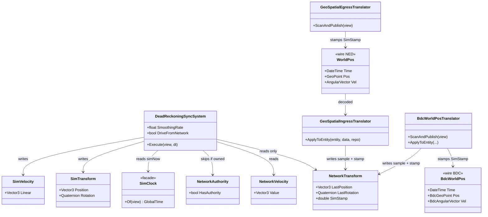
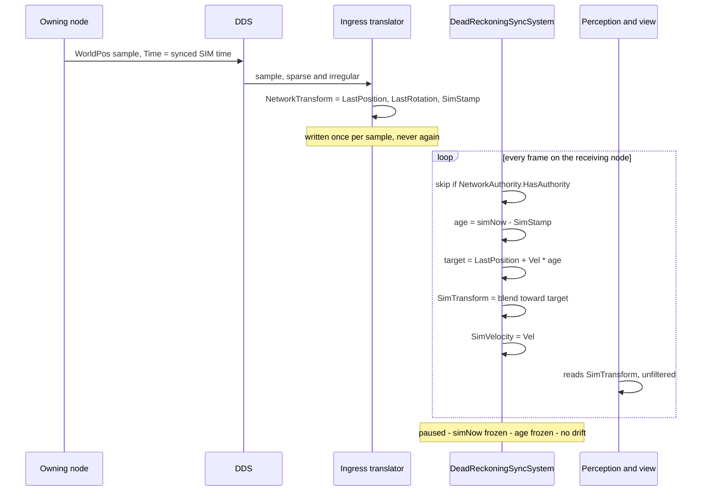

<!--STATUS
state: LIVE
build-state: DESIGN
updated: 2026-09-07
current-answer: the whole file. It is the ONE owning design for dead reckoning / remote-entity
  smoothing across every node and BOTH replication stacks (NED and BDC). CE-211 is its implementation.
design-basis: user rulings 2026-09-05/06/07 (quoted verbatim in §2) · measured against
  DeadReckoningSyncSystem.cs, NedReplicationModule.cs, BdcReplicationModule.cs, SimDescriptors.cs,
  BdcEntityMessages.cs, GeoSpatialEgress/IngressTranslator.cs, EqsResultUpdateSystem.cs ·
  NotebookLM architect input on the clock domain (job 20260907T055024Z-b217f7b7), verified in
  Blueprint_Issues_Tracker CE-211.
known-rot: none yet — this document is new.
known-conflict: it SUPERSEDES three places that frame DR as an IG-only presentation feature —
  docs/designs/dds-to-ecs/DESIGN.md §6.3 (the birth design, which specifies the accumulator this
  removes), docs/designs/IG/DESIGN-IG.md, and docs/projects/relationships/FDP-Network-Stack.md §12.6.
  Each is marked at the site.
-->

# DESIGN — dead reckoning: every node, both stacks, from the sample and its stamp

## Headline

⭐⭐⭐ **Dead reckoning is not a rendering feature.** It is how a node holds a usable position for an
entity it does **not** own, between the sparse samples the owner sends — which is what lets the network
send sparsely at all. ⇒ **every node owes it**, and the extrapolation must be a **pure function of
replicated data** so that time-synced nodes agree by construction.

| | before | after |
|---|---|---|
| who runs it | ⛔ NED: only roles containing `ImageGenerator`. ✅ BDC: **already everyone** | ⭐ **every node, both stacks** |
| the anchor | ⛔ `NetworkTransform` advanced by `Vel × frameDt` — an **accumulator** that extrapolates from its own previous guess | ⭐ **read-only: the last received sample** |
| the target | `Lerp(sim, anchor, frameDt × rate)` — frame-rate shaped, per-node | ⭐ `LastPosition + Vel × (simNow − stamp)` — **recomputed fresh** |
| the clock | wall (`DateTime.UtcNow`) | ⭐⭐ **cluster-synced SIMULATION time**, for the stamp **and** the target |
| pause | needs a guard | ⭐ **none** — the input stops, so extrapolation stops |

---

## 1. INVENTORY

⭐ `search_graph` + grep, `2026-09-06/07`, branch `claude/reset-working-branch-qd1qpv`.
⚠ `check_index_coverage` is not reachable from this session, so no count is a completeness proof.

| query | result | what it settled |
|---|---|---|
| `grep -rliE "dead.?reckon" docs/` | **20 files, 0 owning designs** | ⭐ **this document is the first** — §7 lists the three that touched it |
| `grep "DeadReckoningSyncSystem"` | **3 production registrations** | `NedReplicationModule:333/339` *(both behind `_roleHasIG`)* · `BdcReplicationModule:87` *(unconditional)* |
| `grep "class GeoSpatialDRTranslator"` | **test class only** | ⛔ there is **no second DR implementation** — one system, two registration sites |
| `grep "new WorldPos"` production | **1** — `GeoSpatialEgressTranslator:211` | the only NED producer, and it stamps |
| readers of `WorldPos.Time` | 🔴 **zero** | ⇒ re-pointing the field breaks no consumer |
| perception queries | `LocalGridBuilderSystem:94` = `Query().With<SimTransform>()`, no authority/lifecycle filter; `VisionBroadphaseSystem`, `LosRequestBatchingSystem` alike | ⭐⭐ **ghost `SimTransform` IS simulation input** — DR is not cosmetic |

---

## 2. THE RULINGS — user, verbatim

| # | ruling |
|---|---|
| **D1** `2026-09-05` | *"dead reckoning (and maybe also related smooth inter/extrapolation) of remote entities is basically something that every node needs to be doing for remote entities (for which the node does not own the simTransform) as dead reckoning is used to reduce network traffic. So likely not specific to IG nodes, they might just do smoothing on higher rate as they are usually running on higher fps … in general DR/smoothing is nothing special to IG role only."* |
| **D2** `2026-09-06` | *"dr writes simtransform. networktransform stays the last received sample. extrapolate dt = current time on node minus nettransform.timestamp"* |
| **D3** `2026-09-06` | *"there should be no unstamped mode"* |
| **D4** `2026-09-07` | *"stamping with wall time is wrong, synced sim time is what should be used for stamping and for target extrapolation time on unowning nodes. no special pause guard should be needed then, sim time does not advance when paused/stepped clusterwide."* |
| **D5** `2026-09-07` | *"bdc stack uses same principles so it needs same treatment as ned."* |

---

## 3. THE MODEL

⭐ **Existing** — everything except `NetworkTransform.SimStamp`, which is the one added field.

### The per-frame contract

---

## 4. THE RULES

| # | rule | why |
|---|---|---|
| **R1** | ⭐⭐⭐ **Every node registers it.** The drive flag is derived from **ownership**, not from a presentation role: `driveFromNetwork = !roleHasMuscle && !roleHasBrain` — *"this node owns nothing"* | 🔒 `D1`. ⭐ **This predicate is BDC's, at `BdcReplicationModule:58` — NED adopts it rather than inventing one** |
| **R2** | ⭐⭐ **`NetworkTransform` is READ-ONLY on the receiving side** — the last received sample and its stamp, written by ingress and by nothing else | 🔒 `D2`. ⛔ Advancing it makes the anchor an accumulator that drifts with frame rate and extrapolates from its own guess |
| **R3** | ⭐⭐ **The target is recomputed FRESH EVERY FRAME** from `LastPosition + Vel × (simNow − SimStamp)` | ⇒ a **pure function of replicated data** — time-synced nodes agree by construction, with no accumulator to diverge |
| **R4** | ⭐⭐⭐ **Both the stamp and `simNow` are cluster-synced SIMULATION time** | 🔒 `D4`. ⭐ Matches the codebase's only prior art for cross-node sample age — EQS `BecomesStale` ages over `view.Time` *(`EqsResultUpdateSystem.cs:65`)*, chosen so Brain/Muscle clock skew cannot corrupt the delta |
| **R5** | ⭐⭐ **No pause guard.** Extrapolation freezes because `simNow` stops | 🔒 `D4`. ⛔ This deliberately avoids the `IsPaused`/`IsAdvancing` landmine *(`M-42`: `IsPaused` is **false** while paused — pause switches to `Stepping` with `DeltaTime → 0`)* |
| **R6** | ⭐⭐ **No unstamped mode.** An unstamped sample is a **defect, logged loudly** | 🔒 `D3`. ⛔ Not a silent degraded path — the "make an omission loud" habit |
| **R7** | ⭐ **Smoothing RATE is per-host, not per-role** — a constructor parameter | 🔒 `D1`: renderers *"might just do smoothing on higher rate as they are usually running on higher fps"* |
| **R8** | ⭐⭐ **Both stacks, identically** | 🔒 `D5` |

### Encoding

⭐ **`SimStamp` is carried in the existing `DateTime Time` field on both wire types**, as **ticks from the
exercise epoch**. ⛔ **No IDL change** — both `WorldPos` *(`[DdsIdlFile("hrot-sim-desc")]`)* and
`BdcWorldPos` *(`[DdsIdlFile("bdc-entity-msgs")]`)* are IDL-backed, so a **type** change would touch every
node. ⭐⭐ **And this restores the field's documented intent**: its own declaration reads
`public DateTime Time; // Sync timestamp (exercise FILETIME)` — **exercise** time. ⇒ the `DateTime.UtcNow`
stamp at `GeoSpatialEgressTranslator:214` is the drift, not the field.

---

## 5. THE TWO STACKS

| | **NED** | **BDC** |
|---|---|---|
| wire type · IDL | `WorldPos` · `hrot-sim-desc` | `BdcWorldPos` · `bdc-entity-msgs`, topic `BDC_WorldPos` |
| timestamp field | `public DateTime Time` | ⭐ **the same field, same type** |
| velocity | `Vel` *(+ `Acc`, unused)* | `Vel` |
| DR registration | ⛔ `NedReplicationModule:333/339` — **gated on `_roleHasIG`** | ✅✅ **`:87` — UNCONDITIONAL** |
| drive predicate | hard-coded per arm | ⭐⭐ **`!roleHasMuscle && !roleHasBrain`** *(`:58`)* |

⇒ ⭐⭐⭐ **The stacks already disagreed and BDC is the one that matches the rulings.** ⛔ **NED is the
outlier.** ⚠ `Acc` is on the NED wire and unused — second-order DR is available later, and is **not** part
of this design.

---

## 6. WHY IT IS NOT COSMETIC

📐 `LocalGridBuilderSystem.cs:94` queries `view.Query().With<SimTransform>().Build()` — **no authority or
lifecycle filter** — and `VisionBroadphaseSystem` and `LosRequestBatchingSystem` are the same shape.
⇒ ⭐⭐ **a ghost's `SimTransform` is an input to perception, LOS and AI.** Freezing it between packets is a
*simulation* inaccuracy, not a visual one; and extrapolating it with a per-node frame delta would make
nodes **disagree about what they can see**. ⭐ `R3` + `R4` are what prevent that.

---

## 7. WHAT THIS SUPERSEDES

| document | status |
|---|---|
| `docs/designs/dds-to-ecs/DESIGN.md` **§6.3** *("Deviation 3 — Hard-Snapping vs. Dead Reckoning")* | ⭐ **the birth design — still correct about the PROBLEM** *(hard-snapping, irregular packets)*. ⛔ **Its Part B mechanism is SUPERSEDED**: *"Advance `NetworkPosition` by `NetworkVelocity * deltaTime` each frame"* is precisely `R2`'s accumulator |
| `docs/designs/IG/DESIGN-IG.md` | ⛔ **its IG-only framing is SUPERSEDED by `D1`.** ⭐ Still correct that IG *wants* smoothing; wrong that IG is *where it belongs* |
| `docs/projects/relationships/FDP-Network-Stack.md` **§12.6** *("Dead Reckoning for IG Nodes")* | ⛔ **SUPERSEDED** — role-scoped, and it claims velocity **and acceleration** are used; ⚠ `Acc` is on the wire and **not read** |

---

## 8. IMPLEMENTATION AND GATE

⭐ **`CE-211` is the implementation** — 📄 [`Blueprint_Issues_Tracker.md`](blueprints/Blueprint_Issues_Tracker.md).
⛔ **`CE-211` is a hard prerequisite of `CE-207`** *(Stride mode 2)*: it is what lets Stride drop the
`ImageGenerator` flag without losing smoothing — 📄 [`DESIGN_Stride_Node_Modes.md` §6](DESIGN_Stride_Node_Modes.md).

| ⚠ blast radius | |
|---|---|
| ⭐⭐ **ghost positions on SimHost and CGF will start moving between packets** | that is the intent — ⛔ **and it will move test expectations that assert a frozen ghost.** Expectations get **reviewed**, never silently adjusted |
| ⭐ **`R-142` — the feature's own suites** | `SplitAuthoritySpawnTests` · `Hrot.ClusterRunner.Integration.Tests`, **baselined BEFORE any change** |
| ⭐ a rail worth having | two nodes at different frame rates must compute the **same** ghost position for the same `simNow` — the property `R3`+`R4` exist to guarantee |
