<!--STATUS
state: LIVE
updated: 2026-10-06
build-state: READY-TO-BUILD §3.3c (CE-3082, G4: CombatPostureHsm + HSM exits run deactivators). BUILDING §4 — BUILT: SOP orders in an HSM state and as a blueprint node (CE-2083, §4.10), ROE + RecentSenses (CE-2074/2076, §4.4), reactions in the gate (CE-2078, §4.1), the two SOP actions (CE-2079, §4.6), the shipped SOP (CE-2080, §4.7), the demo scenario (CE-2082, §4.8); next CE-3043 (editor AI section). READY-TO-BUILD for §3.3 (one scoring step, combat posture; approved 2026-10-04, not started); G3 open; G1, G2b approved; the mission stays unchanged.
current-answer: §1 (decided), §2 (the mission stays), §3.3 (the approved build design and its tasks); §3.1–§3.2 are its reasoning.
stale-below: nothing — new document.
known-rot: none.
known-conflict:
  - docs/DESIGN_Sensors_And_Doctrine.md §11.2b G2 ("a mission PHASE may name a doctrine") — superseded by §2 here: the mission is NOT changed (user, 2026-10-04).
related-designs:
  - docs/DESIGN_Utility_AI_Demo_Scenarios.md — OWNS the utility demo scenarios (U1–U7) that exercise §3.3 live over HTTP, and the measured findings F1–F9 (F1: ThreatRanking scores every contact 0 — DistanceToContext reads an unregistered component).
  - docs/DESIGN_Eqs_Consuming_Behaviours.md — OWNS the CE-3031 children (TakeCoverBp, FallBackBp) that CombatPosture picks between and that replace the SOP stand-ins.
  - docs/DESIGN_Sensors_And_Doctrine.md — OWNS the SOP slot (its text still says "doctrine" — renamed by R-198), the origin gate (R-188, R-189, R-193) and the sensor side; this document owns what decides inside the slot (missions, threat, intent, utility).
  - docs/blueprints/batches/FRAME_Decision_Layer.md — the frame this answers (G1–G11).
  - docs/blueprints/DESIGN_Unified_Behaviour_Run.md — §6 "the mission plan as a blueprint" (the user's earlier direction) and §7 Demo_MissionPlan, the concept this generalises; U-10/U-11 the Behaviour Task node.
  - docs/designs/utility-ai/Utility_AI_Design_v1_1.md — OWNS scoring; an SOP calls it (§7), never a host.
  - docs/designs/brain-death/BD1-DESIGN.md — OWNS what a unit does with no behaviour.
  - docs/blueprints/batches/HANDOFF_Utility_Demo_P2_Behaviors.md — the P2 frame (G4–G6) §3.3c answers for G4.
  - docs/blueprints/DESIGN_Behavior_Action_Binding.md — OWNS the HSM binding sites and the CE-388 OnExit auto-bind that §3.3c D2 extends with deactivators.
  - docs/designs/brain-split/BS-1-DESIGN.md — §5.1a OWNS the fire executor's guard order, where ROE `Fire` is enforced (CE-2075, backend).
-->

# The decision layer — missions, SOP, threat, intent

> 🔒 **User, `2026-10-04`:** *"G1: approved"* · *"G2b: wake on event is good."* · on G2: *"What is a phase? A mission
> task? Task is just a behavior. What is your idea a doctrine will do for that task (that single behavior)? My idea was
> that a doctrine comes one per mission to replace the triggers (same concept like the blueprint defined sequence of
> behaviors we made recently)"*

## 1. Decided

| # | ruling | consequence |
|---|---|---|
| **G1** ✅ | a remembered contact keeps WHAT it is (its danger does not fade) apart from HOW FRESH my knowledge of it is (fades) — *"hidden does not mean harmless"* | danger is judged at read time in one place — an input to the existing `ThreatRankingDecision` fed by the TKB (target class, weapons vs my armour, range); the memory entry stores identity + freshness, never a danger score. The backend's memory stage (S4) keeps the freshness field |
| **G2b** ✅ | an SOP running below frame rate wakes on events | a sensor change, a finished behaviour or a refused assignment for the unit ⇒ its SOP ticks the next frame (bus events live one frame, `FdpEventBus.cs:30`); HSM events already wait in their queue |

## 2. The mission stays as it is *(user, `2026-10-04`)*

> 🔒 *"our existing mission is not a blueprint. Mission is a sequence of behaviors (called tasks), executed one by one with
> optional skipping defined by triggers. We are not going to change this, this an ordinary end-user-facing surface which
> they can grasp well. We are looking for alternative ways of defining similar concept, or maybe a bit different concept
> that is better suited for game AI, to be authored by more skilled game logic personnel. I did not understand why there is
> anything to be changed in the demo mission plan, it was just a demo … What i wanted to discuss was how to integrate the
> utility ai into how we build the game ai, how can it help or make that easier"*

| | |
|---|---|
| ✅ the mission | unchanged: tasks (behaviours) in sequence, triggers to advance / skip — the END-USER surface |
| ✅ `Demo_MissionPlan` | unchanged — a demo of a mission built as a blueprint, nothing to migrate |
| ⏳ the open question | a concept for SKILLED game-logic authors, beside the mission — and how utility AI serves it (§3) |

## 3. Utility AI — what exists, and where it can help *(under discussion)*

### INVENTORY *(`search_graph` via the codebase-memory CLI, `2026-10-04`; `check_index_coverage` is not available through the CLI, so absence claims are grep-corroborated)*

| query | total (production, tests excluded) |
|---|---|
| `search_graph name_pattern=.*Utility.* label=Class` | ~40 — core, inputs, starter pack, integration helpers, editor, analyzers |
| `search_graph .*TacticalIntent.*` | 14 — the existing "tactical intent" is a NAMED ORDER mapped to a behaviour (`TacticalIntentResolutionSystem`), not unit state |
| `search_graph .*MissionDirector.*\|.*MissionTrigger.*\|.*MissionPhase.*` | 10 — `MissionTrigger` exists three times (Hrot.Core class, NED struct, Toolkits enum) |
| `search_graph .*Goal.*` | 0 |
| `search_graph .*ThreatEval.*\|.*ThreatMatrix.*\|.*ThreatRank.*` | 5 |
| grep `ScoreDecision\|ReadRankedResult` over shipped assets and scenarios | 0 — no consumer |

📐 **Measured `2026-10-04`:** the engine is BUILT and has NO consumer.

| piece | state |
|---|---|
| scorer (weighted product / sum, hysteresis), curves, `UtilityResultBuffer` (top-N + trace) | ✅ built (`Fdp.Toolkits/Utility/Core`) |
| 26 input readers — self (health, ammo), contact (threat, distance, LOS), weapon (range band, effectiveness), EQS (`EqsTopScore`, count), squad (assigned target / role / slot, strength) | ✅ built (`Utility/Inputs`) |
| 5 decisions, authored in C# (fluent builder + generator): `CombatPosture`, `ThreatRanking`, `WeaponSelection`, `LeaderAssignment`, `ManeuverSelect` | ✅ built; registered at CGF start (`CgfLogicPack.cs:185`) — ⚠ **corrected `2026-10-05`: FOUR are registered** (`ManeuverSelect` has no `[UtilityDecision]`), and **ThreatRanking scores every contact 0 live** because `DistanceToContext` reads the geographic `Position` no node registers ([`DESIGN_Utility_AI_Demo_Scenarios.md`](DESIGN_Utility_AI_Demo_Scenarios.md) §2.2 F1) |
| editor | ⛔ **not usable** (corrected `2026-10-04`): `UtilityDecisionWindow` draws only *"Card-table UI coming in a later batch"* (`UtilityDecisionWindow.cs:78`) and `Hrot.Utility.Editor` is referenced by no app project — its model, C# emitter, curve widget and preview runner exist as library code with tests only. Decisions are authored in C# (fluent builder). An overlay source exists (`UtilityDecisionOverlaySource`) |
| blueprint `ScoreDecision` / `ReadRankedResult` nodes | ✅ compiled, in the palette (`BlueprintNodePaletteEntries.cs:333`) — ⛔ no Details drawer for the decision id (only `ReadRankedResult` has one, `BlueprintEditorBootstrap.cs:81`); ⛔ `ScoreDecision` always runs posture-select (`UtilityBlueprintBridge.ScoreDecision` → `SelectPosture`), so a ranking decision cannot be run from a blueprint; ⛔ both need a `UtilityResultBuffer` on the unit and no production code adds one ⇒ on a real unit they return 0; ⚠ one buffer per unit holds the hysteresis memory, so two decisions on one unit overwrite each other. No shipped asset uses them |
| BTree `UtilitySelectorNode`, HSM `UtilityTransitionArbiter` | ⚠ C# helpers, not authorable nodes, no callers. Intended as authored nodes (utility design §7.1 a scoring selector, §7.2 a transition guard). 📐 the HSM guard LOST its `[HsmGuard]` attribute in a compile fix — FastHSM wants an unmanaged function-pointer signature (`.dev/_DONE/utility-ai/reports/BATCH-06-REPORT.md:226`) — and was never re-made; the BTree helper keeps its "last branch" on the C# object (`UtilitySelectorNode._activeBranch`), so one instance cannot serve many units, and a `[BTreeCondition]` is a static method with nowhere to hold one |
| squad tick (`CommanderUtilityTickSystem`), fire assignment (`ThreatMatrixAssignmentSystem`) | ⛔ deliberately not run — no danger-area provider (`SquadCoordinationSystem.cs:18`, Squad Wiring §5 D3) · ⚠ *corrected `2026-10-06` (backend): D3 covers the squad TICK only — Squad Wiring never names the threat matrix, and `SquadCoordinationSystem.cs:18-21` lists only D2/D3/D5; the fire assignment was simply never wired. `CE-3088` wires it — [Utility demo §11](DESIGN_Utility_AI_Demo_Scenarios.md)* |

### 3.1 The utility behaviour — combat posture as the first one *(PROPOSAL, under discussion — nothing built)*

A **utility behaviour** = a decision whose options are **behaviours (+ params)**. It scores, runs the winner as a hosted
child, re-scores on events, switches with hysteresis. Combat posture is the first instance.

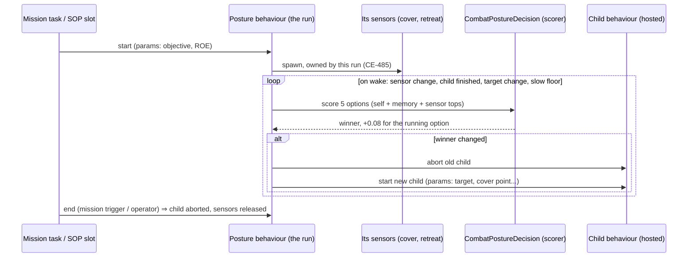

*What the picture shows that prose hid: the sensors are spawned by the POSTURE run, before any child runs — an option
is scored from a sensor that its own child behaviour would otherwise only start once it had already won.*

| option | inputs it scores on (as built) | child behaviour | exists? |
|---|---|---|---|
| AdvanceAndAttack | health, ammo, enemy strength (inverse), have target | advance to objective + fire at target | ⚠ `MoveToLocation` + `FireAtTarget` exist separately; one move-and-shoot child is needed (G9: one behaviour owns every channel) |
| TakeCover | health (inverse), cover sensor top score, enemy strength | move to the cover point, fire from it | ⛔ no cover behaviour; template `FindCoverFromTarget` exists |
| Suppress | ammo, have target, ally advancing nearby | fire at target from here | ✅ `FireAtTarget`; ⛔ `AllyAdvancingNearby` is a stub returning 0 (`StandardInputs.cs` §D) ⇒ weighted product ⇒ **Suppress always scores 0** |
| Flee (fall back) | health (inverse quadratic), retreat sensor top score, enemy strength | move to the retreat point | ⛔ no fall-back behaviour; template `FindSafeRetreatPoint` exists (`StarterTemplates.cs`) — the `CE-2051` remark in `CombatPostureDecision.cs` is stale |
| Hold | health, constant 0.2 (weighted sum — the floor) | hold position | ✅ `HoldPosition` |

📐 **Measured against the decided rulings:**

| fact | source | consequence |
|---|---|---|
| `EnemyStrengthRatio` sums `TargetMemory.ThreatScores`, which DECAY over time | `StandardInputs.cs` `EnemyStrengthRatio`; `ThreatEvaluationSystem.cs:57` | ⛔ contradicts **G1** (`R-194`: danger does not fade). Three of five options read it ⇒ a hidden enemy makes the unit braver ✅ **FIXED by `CE-3054` (`2026-10-05`)**: Σ danger ÷ (Σ danger + own), no freshness ([Sensors §7.8a](DESIGN_Sensors_And_Doctrine.md)) |
| `HaveLiveTarget` = memory count > 0, no freshness | `StandardInputs.cs` `HaveLiveTarget` | a contact seen once long ago keeps `AdvanceAndAttack`/`Suppress` alive — needs the memory stage's freshness ✅ **FIXED by `CE-3054`**: a contact tracked now or with freshness ≥ 0.25 |
| `EqsTopScore` finds ANY EQS child of the unit with the template id | `StandardInputs.cs` `TryFindEqsChild` | a sensor only scores while something has spawned it ⇒ the posture run must own it |
| behaviour-owned sensors are stamped with the ROOT run and keyed by (site, key, run) | `EqsChildSensor.cs:30–37` | a child switch does not release them (good); a child spawning the same template at its own site makes a SECOND sensor — ⭐ ACCEPTED `2026-10-04`: each behaviour owns its own sensor, the solver solves identical queries once (`CE-3056`, `DESIGN_Sensors_And_Doctrine.md` §5.6) |
| an SOP cannot replace a mission task | `R-188` (`Operator > Superior > SOP`) | a posture SOP never interrupts a running mission task — see the open questions |

#### Which asset type hosts it *(lean, under discussion — user `2026-10-04`: "ok with using the combat posture as a mission task")*

The utility design gives each tier its own way to use a decision (`Utility_AI_Design_v1_1.md` §7.1–§7.3); none needs the
decision itself to know about behaviours ⇒ ⛔ the earlier idea of binding options to behaviours inside the decision asset
is dropped: the HOST's structure is the binding.

| host | what exists | what is missing |
|---|---|---|
| ⭐ **Behavior-kind blueprint** *(lean)* | `ScoreDecision` (hysteresis inside), `SpawnEqsSensor` / `ReadEqsResult`, the Behaviour Task node with Start / Abort (S7, `CE-2019`/`CE-2020`), any tier as the child (S5a) | the unit's `UtilityResultBuffer`; a decision picker in Details; hysteresis memory per call site, not per unit; one Behaviour Task node per option (the author wires the switch) |
| HSM | states host any-tier children; guards read live (`R-155`); `UtilityTransitionArbiter` (C# helper) | the arbiter as an authorable guard; something that scores each tick; sensor spawning from an HSM |
| BTree | `Subtree` hosts any tier; `ObserverSelector` in the vocabulary | ⛔ the interpreter runs `ObserverSelector` as a plain selector (`Interpreter.cs:267`) — no abort until `CE-3041`; ⛔ `Service` has no interpreter case; `UtilitySelectorNode` is a C# helper, not a node |

### 3.2 One scoring step for all three hosts *(PROPOSAL — lean awaiting approval)*

> 🔒 **User, `2026-10-04`:** *"if UtilityTransitionArbiter got forgotten because of refactor, shouldn't we re-make it as now
> it is just a dead and wrong code? seems like an omission. Same with the btree - there are no reall assets that can need
> them. We are building infrastructure so such assets can be created at all."*

📐 **Corrected `2026-10-04`:** a BTree condition CAN keep per-unit state. Since `CE-504` (one C# node signature for BTree
and HSM) a `[SharedAiCondition]` takes `(Entity, EntityRepository)`, `(ref P, Entity, EntityRepository)` or the STATEFUL
`(ref P, ref WS, Entity, EntityRepository)` — the working state lives per unit in the behaviour's block
(`DESIGN_BTree_Node_Call_Shapes.md` §4 C-2, slices 1–4 built), and the same method binds as an HSM transition guard
(`DESIGN_Behavior_Action_Binding.md` §5.3b `S8`, built; `ActionSchemaExporter.cs` gives a shared condition the guard bit).
Actions and conditions read their bound host variables live (`R-155`).

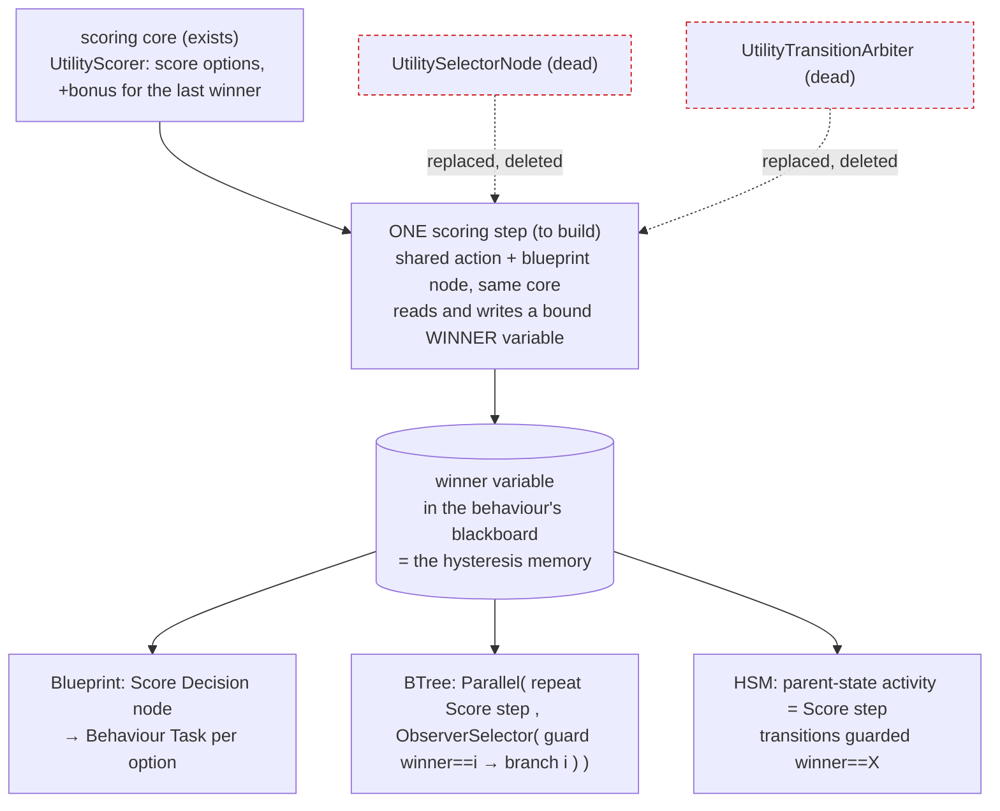

*What the picture shows that prose hid: the three hosts differ only in HOW they switch; WHAT wins is one step, and the
memory of the last winner is an ordinary variable — so two decisions on one unit no longer share one buffer, and the
debugger's Watch shows the current posture.*

| | |
|---|---|
| ⭐ lean | one scoring step (a `[SharedAiAction]` for BTree/HSM, and the existing blueprint node, both calling one core) that writes the winner into a bound variable; branches and transitions only compare that variable. The two dead helpers are deleted, not re-made |
| still needed for the BTree | `CE-3041` (`ObserverSelector` aborts the running lower branch) — today it runs as a plain selector (`Interpreter.cs:267`) |
| rejected | re-make the two helpers 1:1 — two implementations of one concept, and each guard would score separately (five scorings a tick, five memories) · keep the per-unit `UtilityResultBuffer` as the memory — two decisions on one unit overwrite each other |

### 3.3 The build design — one scoring step, three hosts, combat posture first *(build-state: BUILDING — approved by the user `2026-10-04`; tasks `CE-2067`–`CE-2073`; `CE-2067` BUILT `2026-10-05`, as-built at the end of the section)*

> 🔒 **User, `2026-10-04`:** *"approved. pls write the design diagrams. record tasks. do not start building yet."*

**Basis:** §3.1 (posture composition), §3.2 (one scoring step, approved), `R-197` (infrastructure for all three tiers),
`R-194` (danger at read time), `R-155` (actions / conditions read bound host variables live), `R-184` (the TYPE makes a
field pickable), `CE-504` / S8 (one shared C# node signature; stateful form on BTree and HSM).

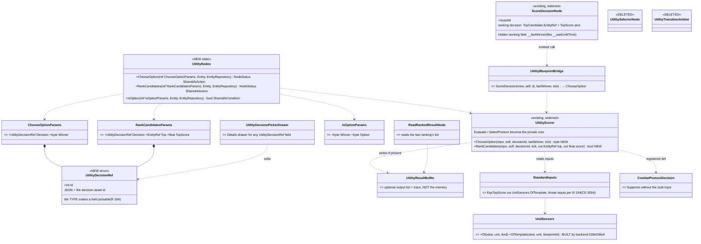

*What the picture shows that prose hid: there is ONE scorer entry per mode, and three thin callers; the memory of the
last winner moved off the unit (`UtilityResultBuffer`) into the CALLER's own storage — a bound variable for BTree/HSM, a
hidden node field for the blueprint — so two decisions on one unit cannot collide and the scorer needs no component.*

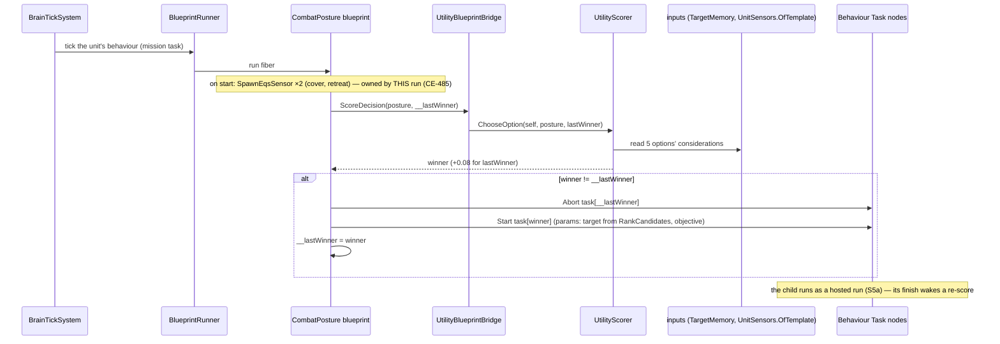

*What the picture shows that prose hid: the posture never moves the unit itself — every frame it only decides; the
moving and firing is always one hosted child at a time (G9).*

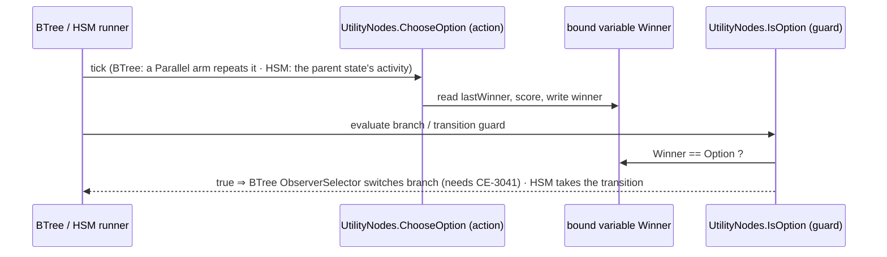

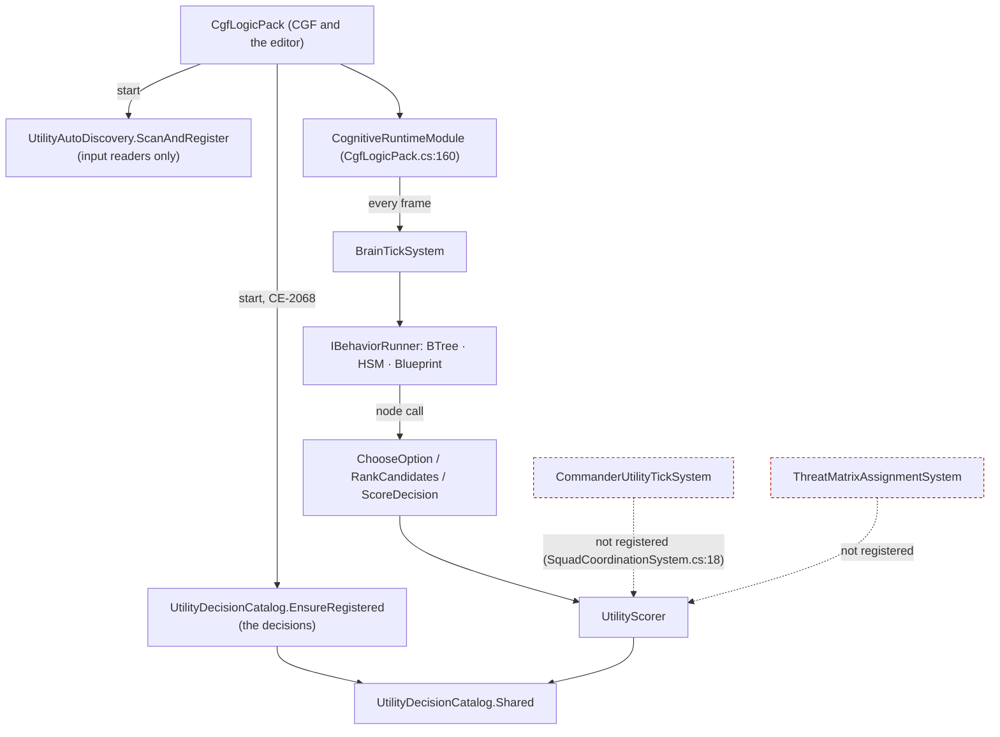

*What the picture shows that prose hid: nothing new is scheduled — the scorer only ever runs inside a behaviour's own
tick, on the editor and CGF alike (both build `CgfLogicPack`); the two squad systems (red) stay unregistered and are not
part of this plan.*

| task | what | depends on | touches the backend lane? |
|---|---|---|---|
| `CE-2067` | scorer core without the unit buffer: `ChooseOption`, `RankCandidates` | — | no |
| `CE-2068` | `UtilityDecisionRef` + its Details picker (the type makes the field pickable) | — | no |
| `CE-2069` | `UtilityNodes` (shared action ×2 + condition) for BTree and HSM; rails: a BTree and an HSM switch on the winner; measure the BTree Parallel-repeat shape first (§3.2's assumed row); delete `UtilitySelectorNode` / `UtilityTransitionArbiter`; mark utility design §7.1–7.2 superseded | `CE-2067`, `CE-2068`, `CE-3041` for the BTree rail | no |
| `CE-2070` | `ScoreDecision` node rerouted: hidden `__lastWinner`, ranking pins, no unit buffer needed | `CE-2067`, `CE-2068` | no |
| `CE-2071` | ⚠ **SHRUNK `2026-10-04`** (user: *"backend builds sensor lookup"*; FRAME_Decision_Layer Addendum 3): `OfTemplate` is BUILT by backend; ours is only rerouting `EqsTopScore` / `EqsResultCount` onto it. ⛔ *"children reuse the posture's sensor"* is SUPERSEDED: every behaviour that needs a query spawns its OWN sensor (no borrowing) and the solver answers identical queries once (`CE-3056`, backend) | — | no (backend part done) |
| `CE-2072` | `CombatPostureDecision` tuning: Suppress without the stub input; the stale `CE-2051` remark | — | no |
| `CE-2073` | the `CombatPosture` blueprint behaviour + acceptance in `tt-nav-los` as a mission task | `CE-2067`–`CE-2072`, `CE-3031` children, `CE-3054` | no |
| `CE-3054` *(existing, ours)* | threat inputs to `R-194`: danger from the TKB judged at read time × freshness | the backend's memory stage (`CE-3037`) | ⚠ **yes — joint freshness design** |
| `CE-3031` *(existing, ours)* | the children: take cover, fall back, advance-and-fire | `CE-2071` | no |
| `CE-3041` *(existing, ours)* | `ObserverSelector` aborts the running lower branch | — | no |

⭐ **As-built `CE-2067` (`2026-10-05`):** `UtilityScorer.ChooseOption(repo, self, decisionId, lastWinner, tick)` and
`RankCandidates(repo, self, decisionId, tick, out EntityRef top, out float topScore)`, as in the class diagram. The unit's
`UtilityResultBuffer` is still filled when present, but never required. Two details the diagram left open: ① a
`lastWinner` of 0 gets NO hysteresis (option ids start at 1, and 0 means "no previous winner"); ② a winner with no
network id comes back as `EntityRef.None` with `true` (an all-in-one world). `Evaluate` / `SelectPosture` stay public
until `CE-2070` reroutes the bridge. Rails: `UtilityScorerTests.CE2067_*` (3), red-proved (no caller hysteresis ⇒ red).
Toolkits 2673/0.

⭐ **As-built `CE-2068` (`2026-10-05`):** `UtilityDecisionRef` (`Fdp.Toolkit.Utility`, the decision id; JSON = the
decision's ASSET id, a bare number and null still read), `UtilityDecisionDef.AssetId` (set by the builder from
`[UtilityDecision]`), `UtilityRegistry.Entries`. The "Details drawer" is the ONE params / component drawer
(`ComponentEditDrawer`): the type is registered as a leaf (`PickableLeafFieldEditor`) and drawn as a combo of the
catalog, so every surface that edits a params struct offers it. 🔴 **Measured while building it: nothing in production
filled `UtilityDecisionCatalog.Shared`.** The module diagram above said `ScanAndRegister` fills it, but that call
registers the INPUT readers only (CE-454 W1), so every production `ScoreDecision` found no decision. Fixed:
`CgfLogicPack` now also calls `UtilityDecisionCatalog.EnsureRegistered()` (idempotent), and the diagram is corrected.
⚠ `ScoreDecision`'s own `AssetId` field moves to the type with `CE-2070`, which reroutes that node.

⭐ **As-built `CE-2070` (`2026-10-05`):** the blueprint `ScoreDecision` node calls ONE bridge entry,
`UtilityBlueprintBridge.Decide(view, self, decisionId, lastWinner, tick, out winner, out topCandidate, out topScore)`.
An option decision goes to `ChooseOption`, a ranking decision to `RankCandidates`. The node's memory is a hidden
per-node byte field `_score_<id8>_last`, added by Stage 6 exactly as the `When` node's `_when_<id8>_prev` is (an
instance keeps it in its payload, a behaviour in its brain state). Its pins grow `TopCandidate` (`EntityRef`) and
`TopScore`. The node no longer needs a `UtilityResultBuffer` on the unit. `ReadRankedResult` is kept, and it still
reads the unit buffer when one exists. ⚠ The design said the precedent was `__waitUntilTime`; the `When` field is the
closer one (a per-NODE field, in both dispatch kinds). No corpus asset uses the node, so no golden moved. Rails:
`UtilityNodeRuntimeTests.CE2070_*` (2: no buffer + the memory written · a ranking's top candidate), red-proved.

⭐ **As-built `CE-2072` (`2026-10-05`):** `Suppress` = ammo^0.9 × target (step) × health × EnemyStrengthRatio^0.6
(Logistic). The stub `AllyAdvancingNearby` (returns 0, so Suppress was ALWAYS 0) is dropped. ⚠ Dropping the stub ALONE
was measured wrong before building: Suppress = ammo × target scores 1.0 with a full magazine and beats a healthy
Advance (≈0.91 at an enemy-strength ratio of 0.25), and at health 0.35 with cover it beats TakeCover (0.82 vs 0.67).
Hence the health and enemy-strength factors. The result: a healthy armed unit ADVANCES on a weaker enemy and
SUPPRESSES a matched or stronger one (ratio 0.8: Suppress 0.92 vs Advance 0.43); hurt units still take cover or flee.
Every existing posture rail keeps its winner. The stale `CE-2051` remark is fixed (`FindSafeRetreatPoint` IS built).
Rail: `StarterPackIntegrationTests.CE2072_*`, red-proved. Toolkits 2676/0.

⭐ **As-built `CE-2071` (`2026-10-05`):** `EqsTopScore` / `EqsResultCount` read through
`UnitSensors.OfTemplate` (built by backend). The private scan took the FIRST matching child in query order, so with two
sensors on one template it could read another run's stale results. Rail
`StandardInputReaderTests.CE2071_*`, red-proved against the old scan.

⛔ **`CE-2069` STOPPED `2026-10-05` — a premise of the third sequence diagram fails (`R-106`: stop the item, not the
batch).** The diagram has the guard read *"the bound variable `Winner`"* that `ChooseOption` wrote. Measured:

| claim | code |
|---|---|
| a BTree / HSM node binds ONE host variable to its params (`ExpressionTargetField`) | ✅ `BehaviorActionBindingDto.cs:35-37` |
| a second variable (`WorkingStateTargetField`) exists, but for STATEFUL ACTIONS only: there is no stateful condition | ✅ `SharedNodeBinder.cs:17-20` (`SharedNodeCondition<P>` has one `ref P`) |
| each branch's guard needs its OWN option constant, while all guards read ONE winner | ✅ by construction (N branches, 1 decision) |

⇒ `IsOption(ref IsOptionParams { Winner, Option })` cannot read the winner `ChooseOption` wrote into a different variable.

| lean | what | cost |
|---|---|---|
| ⭐ **A — a stateful CONDITION form** `(ref P, ref WS, Entity, EntityRepository) → bool` | `IsOption(ref OptionParams { Option }, ref ChooseOptionParams ws)`: each branch's own constant + the ONE decision variable as working state. It mirrors the existing stateful action (`SharedNodeStatefulAction`), so the binder, both emitters and the shape classifier gain the twin. `WorkingStateTargetField` is already in the DTO | moderate; infrastructure for every future "compare my constant with a shared variable" guard |
| B — a per-node constant on condition nodes (like a decorator's `IntParam`) | editor + DTO + emitter + runtime payload | larger; a new authoring concept |
| C — one condition per option (`IsOption1` … `IsOption8`) | zero infrastructure | ugly, capped, and every decision re-learns the numbering |

✅ **APPROVED `2026-10-05`: A** (R-202). 🔒 **User:** *"2069 approved, pls file option (B) as potential improvement."* ⇒ B is filed as `CE-2098` (a per-node constant on condition nodes), not scheduled. `CE-2069` is unblocked and builds with A.

#### `CE-2069` build design — the stateful condition and the utility nodes *(build-state: BUILT `2026-10-05` — as-built after the claim table)*

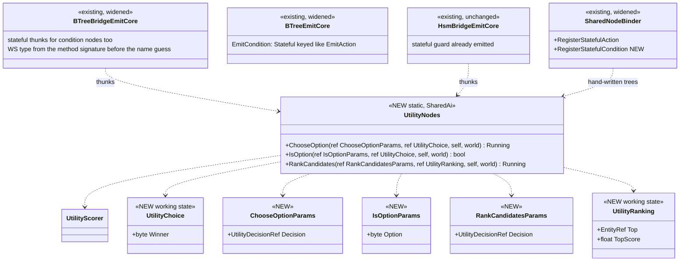

*What the picture shows that prose hid: the winner is NOT in `ChooseOption`'s params. A node's params variable lives at a
blackboard offset; its working state lives in a slot keyed by the state variable's NAME (BTree) or in the block's `St`
(HSM). So `ChooseOption` keeps the winner in its working state `UtilityChoice`, and every `IsOption` binds the SAME
`Role=State` variable as its working state — one shared slot, the mechanism `T35_SharedWorkingState` proves. Lean A's
wording ("`ref ChooseOptionParams ws`") would have read a different memory.*

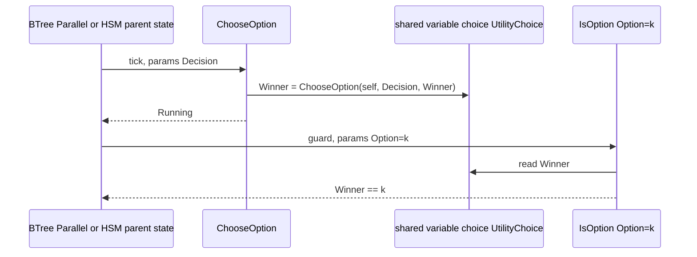

*What the picture shows that prose hid: the guard reads, never writes — the HSM kernel may evaluate a guard more than once
per event (`HsmKernelCore.cs:681,725`), so a writing guard would be a design question; this one is not.*

| claim | code |
|---|---|
| shape rules already classify `(ref P, ref WS, Entity, EntityRepository) → bool` as Stateful for a condition | ✅ `BTreeCallShapes.cs:46-47` (by parameter list), `SharedAiMethodResolver.cs:46-59`, `SharedAiBindings.cs:85-86` |
| the BTree topology throws for a Stateful condition today (`BTREE0002`, asset skipped) | ✅ `BTreeEmitCore.cs:999` (AiPrimitive-only arm), throw at `:1040-1046` |
| the BTree bridge emits stateful thunks for ACTION nodes only | ✅ `BTreeBridgeEmitCore.cs:641` (node filter); the `ReturnsBool` arm already exists (`:680-682`) |
| the HSM side already binds a stateful guard (block `St`, `HSM0003` on a wrong variable) | ✅ `SharedAiBindings.cs:100-105,184-191,243-287` |
| the hand-written builder has no stateful condition | ✅ `SharedNodeBinder.cs:20` (action only), `SharedNodeBuilderExtensions.cs:40-46` |

⭐ **As-built `CE-2069` (`2026-10-05`)** — as the two diagrams draw it: `UtilityNodes` (`Fdp.Toolkits/Utility/Integration`)
with `ChooseOptionParams`, `UtilityChoice`, `IsOptionParams`, `RankCandidatesParams`, `UtilityRanking`;
`SharedNodeStatefulCondition` + `SharedNodeBinder.RegisterStatefulCondition` + the builder verb `StatefulCondition`;
`BTreeEmitCore.EmitCondition` keys a Stateful condition like an action; `BTreeBridgeEmitCore`'s stateful thunks cover
condition nodes and take the working-state type from the method's signature before the old name guess (`CE-2099`). ⛔
`UtilitySelectorNode` / `UtilityTransitionArbiter` DELETED (referenced only by their own tests; utility design §7.1–§7.2
marked superseded). What the build found:

| # | as built | ⛔ the design above said |
|---|---|---|
| D1 | `IsOption` is false while `Winner == 0` (nothing decided yet), so no branch runs before the first decision | — |
| D2 | the HSM side needed NO code: a stateful guard over the block's `St` member was already emitted; a compile rail now pins it | "both emitters gain the twin" |
| D3 | ⚠ the HSM RUNTIME switch (a parent activity + guarded transitions actually changing state) is railed at compile level only; the BTree switch is railed at runtime | "rails: a BTree and an HSM switch on the winner" |

**Rails:** `SharedAiBindingCompilesTests.CE2069_*` (2: a BTree binds a stateful condition sharing the action's working
state — one slot key, compiles, no name-guessed type · an HSM binds a stateful guard over the activity's `St` member,
compiles) · `UtilityScorerTests.CE2069_UtilityNodes_SwitchTheBranch_WhenTheWinnerChanges` (a code-built `Parallel[
ChooseOption, ObserverSelector[ IsOption(1) → one, IsOption(2) → two ] ]`: runs option 1, holds inside the hysteresis,
switches to option 2 past it — the §3.2 Parallel-repeat shape, measured).


Awaiting the user. `CE-2070` (blueprint, a hidden field, no binding issue), `CE-2072` and the scorer core are not blocked.

### 3.3b `CE-2073` — CombatPosture, the build design *(behaviors, `2026-10-05`; build-state: BUILT)*

⚠ **A HOST CHANGE, argued here and reported (lean, reversible):** §3.3 drew CombatPosture as a BLUEPRINT that spawns its two
sensors and Starts / Aborts one hosted child per winner. Since then `CE-2069` built the utility step as shared BTree / HSM
nodes, and `CE-2069`'s own rail proves the exact shape `Parallel[ChooseOption, ObserverSelector[IsOption(n) → child]]`
switching in both directions (`UtilityScorerTests.CE2069_UtilityNodes_SwitchTheBranch_WhenTheWinnerChanges`). The user
chose BTree for the same reason on `CE-3031` (R-204 (behaviors)).

| host | what it takes | verdict |
|---|---|---|
| **BTree** | one asset; every step a shared C# node; the branch switch is `ObserverSelector` (`CE-3041`) | ⭐ **lean** — the fewest new parts |
| HSM | five states + five global transitions guarded by `IsOption`; activities = the children | works, but more wiring for the same behaviour |
| blueprint | `ScoreDecision` + five Behaviour Tasks + Abort / Start per change + two `SpawnEqsSensor` | the most parts; the children (`TakeCover`, `FallBack`) are BTree assets the blueprint would have to host |

**INVENTORY** *(grep + reading, `2026-10-05`)*: `UtilityNodes.ChooseOption` / `IsOption` (`CE-2069`) ·
`EqsTacticsNodes.TakeCover` / `FallBack` (`CE-2092` / `CE-2093`) · `CgfNodes.Action_FireAtTarget` (a FIXED target param — not
usable for "the top threat") · `CgfNodes.Action_HoldPosition` (a raw BTree action, not a shared node) · `LocomotionMoveTo`
(`CE-2092`) · `CombatPostureDecision` (5 options; inputs `EqsTopScore(FindCoverFromTarget / FindSafeRetreatPoint)` read the
unit's sensor through `UnitSensors.OfTemplate`) · `ObserverSelector` · `Parallel` — ⚠ the asset format cannot set its policy
(`BTreeEmitCore.cs:702` always emits 0 = RequireAll) · `Repeater(-1)` — ⛔ loops inside one tick while its child succeeds at
once (`Interpreter.cs` `ExecuteRepeater`), so it cannot keep a branch alive.

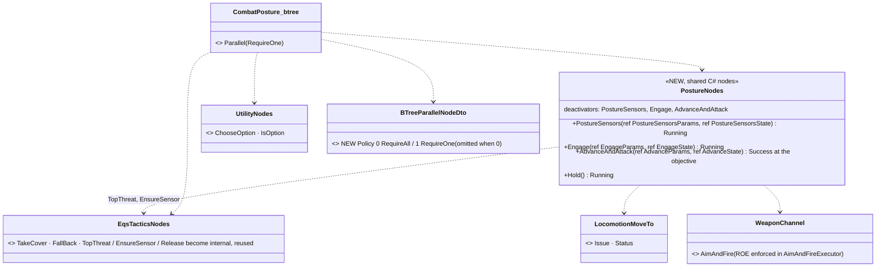

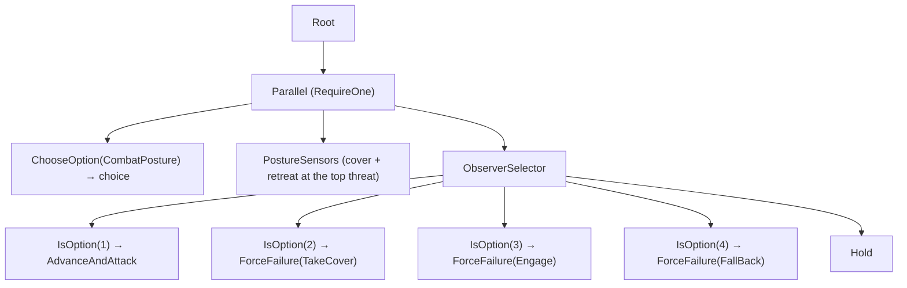

*What the picture shows that prose hid:* the posture FINISHES only when AdvanceAndAttack reaches the objective (RequireOne:
the first child to succeed ends the Parallel). Every other child is wrapped in ForceFailure, so "nothing to hide from"
falls through to Hold instead of ending the mission task. `ChooseOption` and the sensors run beside the branch the whole time.

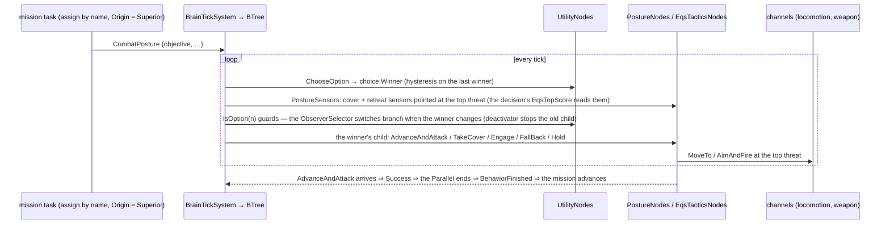

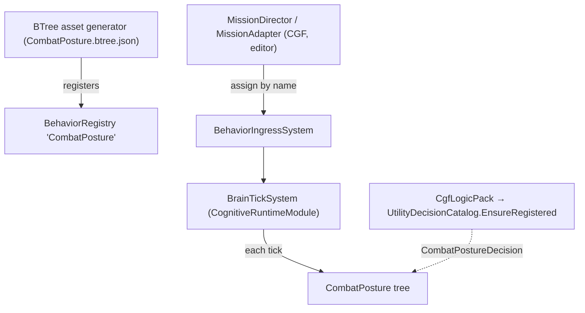

| decision | why | rejected |
|---|---|---|
| Suppress = a NEW `Engage` node (fire at the top threat, retarget when it changes) | `Action_FireAtTarget` takes a fixed target | a second fixed-target copy |
| AdvanceAndAttack = ONE node that moves AND fires | G9: one behaviour owns every channel; one node keeps the two commands in one run | two nodes in a Parallel (two writers of one run's channels) |
| `Hold` = a NoParams shared node that stops the move it may have issued | `Action_HoldPosition` is a raw BTree action, not bindable from an asset | — |
| the posture's two sensors are its OWN (sites `0x20730001` / `0x20730002`), and TakeCover keeps its own | `CE-2071` (SUPERSEDED reuse): every behaviour owns the sensors it needs; `OfTemplate` reads the current run's own first | sharing one sensor between scoring and moving |
| `Parallel` gets an authorable `Policy` (DTO + emitter + editor field) | RequireAll never finishes while ChooseOption runs; the asset format could not say RequireOne | a Repeater (spins inside one tick) |
| ⛔ SUPERSEDED by the as-built below — acceptance on a NEW recipe `tt-posture` (a copy of `tt-nav-los` with the posture as the mission task) | `tt-nav-los` is a terrain-EQS fixture other rails read | editing `tt-nav-los` in place |

⭐ **AS-BUILT (`2026-10-05`)** — the tree, nodes and sequence above are built as drawn. Where the build differs:

| as built | where | differs from the design because |
|---|---|---|
| the editor's projection of a COMPILED tree also carries the policy | `BehaviorTreeAssetProjector` (`case NodeType.Parallel` ← `blob.IntParams`, as `TreeCompiler` stores it) | the design named DTO + emitter + editor field and missed this fourth reader: a tree loaded from the assembly showed RequireAll |
| the acceptance recipe copies `tt-take-cover`, not `tt-nav-los` | `Recipes/Scenarios/tt-posture` | `tt-nav-los` is a TANK on a road net; the posture is infantry. The rifleman is TKB 2002 (armed) ordered `CombatPosture` by its `Behavior` component, with no SOP (so nothing pauses it); the hostile is TKB 1001 (no weapon mount ⇒ unarmed, `ThreatDanger` 0.3), so the weaker-enemy branch wins |
| a `Vector3` in the params JSON is an ARRAY `[x, y, z]` | `CombatPosture.btree.json`, the recipe | the registered converter rejects the object form; a wrong form starts nothing |
| rounds are spent on CGF | `AimAndFireExecutor` (registered in `CgfLogicPack`) decrements CGF's `WeaponState`; SimHost's copy is not the counter | — (the acceptance reads CGF's ammo) |

Rails: `TacticsTreesTests.CE2073_*` (4: compiled + registered · a weak enemy ⇒ advances firing, ends at the objective · nothing
to fight ⇒ holds, does not end · hurt with cover ⇒ switches to TakeCover; red-proved by authoring the Parallel back to
RequireAll — the posture then never ends) · `BTreeJsonGeneratorTests.CE2073_TheParallelPolicy_RoundTrips_AndIsEmitted` (JSON,
mapper both ways, the compiled-tree projection; red before the projector case) · the generated-source golden
(`CombatPosture.g.cs.txt` emits `.Parallel(1, …)`) · live: `PostureScenarioTests.CE2073_*` on `tt-posture` (posture starts,
rounds spent, ends within the arrival radius of the objective).

⭐ **`CE-2105` — RULED and BUILT (R-208):** with nothing left to fight (the enemy killed or lost) `CombatPostureDecision` used to
score Advance 0 (`HaveLiveTarget` was a Step) and Hold won and stayed put ⇒ an advance whose enemy fell short of the objective
never reached it. 🔒 **User, `2026-10-05`:**
*"'hold' branch walking to objective seems weird, unintuitive. I would like the alternative - advance without enemy."* ⇒ AdvanceAndAttack drops its `HaveLiveTarget` consideration: a healthy, armed unit with
nothing to fight advances (`AdvanceAndAttack` moves on and fires only when there is something to fire at); Suppress still needs a
live target. ⚠ The aggregator's compensation factor (`1 − 1/n`) moved the AdvanceAndAttack / Suppress boundary from health ~0.19
to ~0.235 with an enemy present (re-pinned in `StarterPackIntegrationTests`, measured). ⛔ Rejected (my lean): the Hold leaf
walking to the objective. Rails: `TacticsTreesTests.CE2105_WithNothingToFight_ThePostureAdvancesToTheObjective_WithoutFiring`,
`StarterPackIntegrationTests.CombatPosture_NoContacts_SelectsAdvanceAndAttack`.

### 3.3c `CE-3082` (G4) — CombatPostureHsm, the build design *(behaviors, `2026-10-06`; build-state: READY-TO-BUILD)*

**Frame:** [P2 handoff](blueprints/batches/HANDOFF_Utility_Demo_P2_Behaviors.md) G4 — the SAME decision as §3.3b hosted as an
HSM, reusing the BTree's option children (ruling 9), and closing **D3** (the HSM switch railed at runtime, not only at compile).
Programme: [Utility demo](DESIGN_Utility_AI_Demo_Scenarios.md) §6 G4, U3.

**INVENTORY** *(codebase-memory CLI `search_graph`, `2026-10-06`: `.*Utility.*Decision.*` Class → 16, `ChooseOption|IsOption|ScoreDecision|RankCandidates` Method → 19, `.*(Posture|…).*` Class → 11; ⚠ `check_index_coverage` is not available through the CLI, so absence claims below are grep-corroborated)*:
`UtilityNodes.ChooseOption` / `IsOption` (stateful, shared) · `PostureNodes` {`PostureSensors`, `Engage`, `AdvanceAndAttack`, `Hold`} +
three `[BTreeDeactivator]`s · `EqsTacticsNodes` {`TakeCover`, `FallBack`} + deactivators · the HSM stateful binding (S8; a guard
binding ETF + WS, compile-railed by `SharedAiBindingCompilesTests.CE2069_AnHsmBindsAStatefulGuard…`) · polled transitions
(CE-381/382) · Final ⇒ `HsmRunner` Success ⇒ `BehaviorFinishedEvent` (rail ⑨, `BrainTickSystemHsmArmTests.CE398_R1`).

⚠ **Two measured differences from the BTree host — each one decides a part of this design:**

| the BTree gets it for free | the HSM, measured | ⇒ |
|---|---|---|
| a leaf's `Success` ends the posture (AdvanceAndAttack arrives) | a state's activity is a `void` kernel action — its `NodeStatus` is discarded (`HsmActionDispatcher.cs:20`, `SharedAiBindings.cs:283`); the only finish is a **Final** state (`HsmKernelCore.cs:357`, `HsmRunner.cs:205`) | **D1** a polled guard `PostureNodes.Arrived` → Final |
| leaving a branch runs its node's `[BTreeDeactivator]` (stops the move / fire, drops the sensor, resets its working state) | ⛔ **no HSM path calls a deactivator** (`BTreeBridgeEmitCore.cs:1957` only); the CE-388 auto-bind fills an empty OnExit with a CHANNEL release, only for a blueprint / `[WritesChannel]` activity; and the resolver refuses a non-`[SharedAi*]` method on OnExit (`SharedAiMethodResolver.cs:40`) | **D2** an HSM state's empty OnExit runs its activity's deactivator |

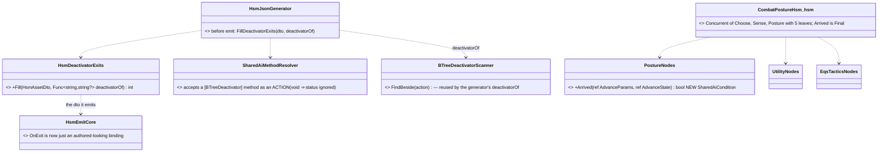

*What the picture shows that prose hid:* D2 is a DTO rewrite in front of an UNCHANGED emitter — the filled OnExit is an ordinary
binding, so the namer, the thunk collector (`SharedAiBindings.Collect`) and the emitter need no new arm; only the resolver learns
that a deactivator is callable.

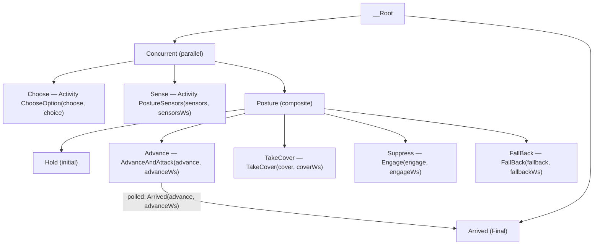

*What the picture shows that prose hid:* the five posture leaves are joined by **20 leaf-to-leaf polled transitions**, each
guarded `IsOption(target)` over the shared `choice` — ⛔ NOT a parent→child transition (selection walks leaf→ancestors, so a
transition on `Posture` would exit and re-enter the active child every tick) and ⛔ NOT a global (globals ignore regions and
re-enter the target every tick, `HsmKernelCore.cs:675`). Activities sit on leaves only (an activity on `Concurrent` would run once
per region). 1 root + 3 regions = 4 slots — inside the 128 tier.

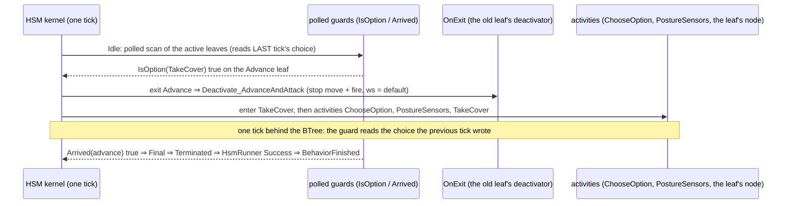

| decision | why | ⛔ rejected |
|---|---|---|
| **D1** finish = a polled transition Advance → Final guarded by a NEW `[SharedAiCondition] PostureNodes.Arrived` (ws `AdvanceState`: our move issued AND the channel reports Success) | the HSM has no other finish; the condition reads the SAME working state the activity writes, so it means "THIS advance arrived", not "some move finished" | an "activity Success completes the state" kernel feature — the kernel's action ABI is `void` (a cross-ExtDep change for one asset); the blueprint `MoveArrived` (a blueprint library call, not a shared node) |
| **D2** the generator fills an EMPTY OnExit with the activity's `[BTreeDeactivator]`, bound to the activity's own ETF / WS (fill-an-empty-slot, as CE-388) | parity with the BTree host: switching away stops the old branch and resets its working state (re-entry starts clean); every shared node with a deactivator gains it on HSM, not just these | per-node `[SharedAiAction]` exit wrappers (a second entry point per node, ruling 9); asking authors to bind it (they would bind the wrong method or forget — the CE-388 argument) |
| D2 precedence: an AUTHORED OnExit wins; the deactivator wins over the CE-388 `[WritesChannel]` channel release | the deactivator is the node's own cleanup (it stops what it started); measured: no shipped node has both, and **no shipped HSM asset binds an activity with a deactivator** (21 deactivators × 10 HSM assets, grep) ⇒ zero golden movement | running both (a second OnExit slot does not exist) |
| **D3** each node's working state gets its own Behavior-scoped `St` variable (`sensorsWs`, `advanceWs`, `coverWs`, `engageWs`, `fallbackWs`) | the BTree binds them implicitly; on HSM the WS falls back to the ETF variable (the params type ⇒ HSM0003) | — |
| **D4** the rail host is `TacticsTreesTests.World` (production registry, StandardInputs, ingress, BrainTickSystem); the active leaf read through `RootHsmAccess` + `HsmKernel.GetActiveLeafIds` | the BTree posture's own suite (T-1) — the HSM rails sit beside `CE2073_*` | a new harness |

**Acceptance (a rail each, red-proved):** ① registered by name · ② a weak enemy ⇒ the `Advance` leaf, moving to the objective
firing; arrival ⇒ the run finishes (Final) and its sensors go · ③ ⭐ **D3 closed — the RUNTIME switch both ways:** hurt +
outnumbered + cover ⇒ `TakeCover`; health restored ⇒ back to `Advance`, and the TakeCover sensor is gone (the deactivator ran on
exit) · ④ the same winner sequence as the BTree for the same inputs (U3's premise) · ⑤ generator: an HSM activity with a
deactivator gets it as OnExit; an authored OnExit is kept; a node without one is untouched (golden byte-identical).

## 4. Standing orders and drills — reacting without embedding it in every behaviour *(PROPOSAL, under discussion)*

> 🔒 **User, `2026-10-04`:** *"Standing orders sound good."* (the name for what the corpus calls the DOCTRINE — rename
> sweep deferred until this section settles) · *"if a unit is directly ordered to patrol or something that does not
> involve combat directly, i do not want to embed in each behavior that when fired upon, the unit should take cover, and
> maybe return fire or whatever which is ok with the rules of engagement."*

📐 **The gap, measured `2026-10-04`:** an order outranks standing orders (`R-188`), so a patrol ordered at `Superior`
cannot be interrupted by them; the only built interrupt is `CognitiveInterruptType.MobilityLost`, which each HSM must
handle itself (`CognitiveInterruptType.cs`); no reaction, battle-drill or suspend/resume concept exists (grep
`ReactToContact|battle drill|Reaction(Layer|System)`: none); ROE exists nowhere in code (G7). ⚠ A behaviour that is
REPLACED publishes no finish (the only publisher is `BrainTickSystem.cs:298`), but a behaviour that ENDS does, and
`MissionDirectorSystem` advances on any `BehaviorFinishedEvent` for the entity ⇒ a drill ending would advance the
mission unless the finish says whose run ended.

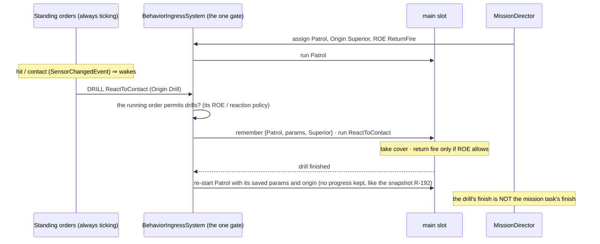

*What the picture shows that prose hid: the reaction lives once, in the unit's standing orders, not in Patrol; the order
decides whether it may be interrupted; and the gate — not the drill author — remembers and restores the task.*


### 4.1 Refined with the user — the SOP, reactions, and what RESUME would take *(PROPOSAL v2)*

> 🔒 **User, `2026-10-04`:** *"drill interrupts, task restarts afterwards is acceptable for now, resume would be better"* ·
> *"isnt SOP - standard operation procedure - closer in the meaning to what we need?"* · *"the doctrine keeps running also
> while the 'interrupt handler' is running so no further interrupt of same or lower priority should be allowed"* · *"it
> should stay relatively simple otherwise no one would understand it"*

| word | means |
|---|---|
| **task** | what the unit was told to do (operator, superior, mission) — one at a time |
| **SOP** | the unit's own logic, always ticking: what to do when idle + how to react to events |
| **reaction** | a behaviour the SOP starts to answer an event; it PAUSES the task, the task continues after |

| rule (enforced by the one gate, `BehaviorIngressSystem`) |
|---|
| ① a task beats the SOP's idle choice |
| ② a reaction pauses the task — unless the order forbids reactions — and the task continues when the reaction ends |
| ③ a running reaction yields only to a MORE urgent reaction or a new order; same or lower urgency is refused |
| ④ at most ONE thing is paused: the task (a more urgent reaction replaces a less urgent one, it is not stacked) |

⭐ **AS-BUILT `CE-2078` (`2026-10-04`) — the four rules are in the gate.** `BehaviorIngressSystem.AdmitsWithReactions`
applies them; a reaction is an assignment with `Origin = Reaction` and an `Urgency` (`Alert < Contact < UnderFire < Hit`;
none given ⇒ `Alert`), both stored on `BehaviorState`.

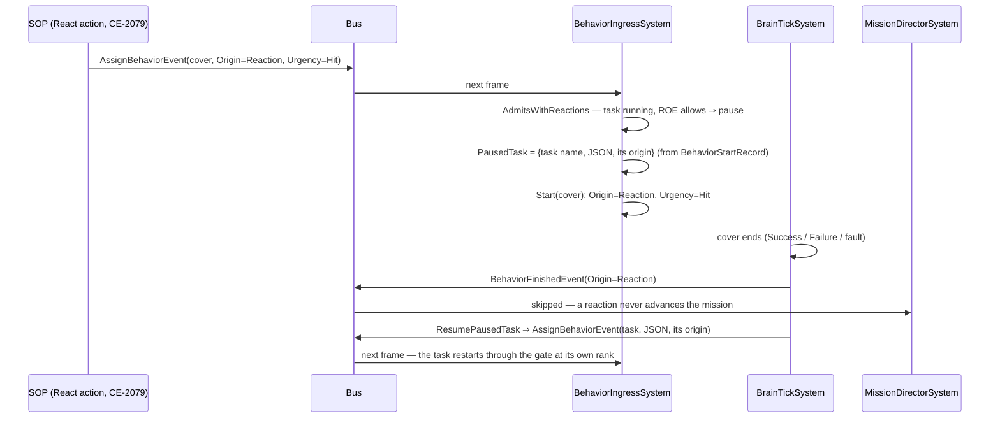

*What the picture shows that the rules table cannot: the paused task is never held in the slot — it is a RECORD
(`PausedTask`, managed, transient) and comes back as an ordinary assignment through the same gate, one frame after the
reaction ends. ⇒ restart, not resume (`CE-2081`).*

| incoming ↓ · running → | empty / SOP idle choice | a task (Superior / Operator) | a reaction (urgency r) |
|---|---|---|---|
| **reaction, urgency u** | start, pause nothing | ROE `StayOnTask` ⇒ refuse · else **pause the task**, start | u > r ⇒ replace (the paused task stays) · else refuse |
| **SOP idle choice** | rank rule | rank rule (refused) | refuse (and wake the SOP) |
| **an order** (assign or clear) | rank rule | rank rule | weighed against the PAUSED task's origin; admitted ⇒ the paused task is dropped |
| **Self** | admit | admit | admit — a reaction restarting itself stays a reaction; a reaction clearing itself **restarts the task** |

| as built | where |
|---|---|
| a reaction ENDS three ways, each restarts the paused task: finish, self-clear, a failed hot-reload restart | `BrainTickSystem.Finish` · `ClearResumingAPausedTask` · the ingress clear path |
| a task stamped directly (no `BehaviorStartRecord`) cannot be restarted ⇒ the reaction simply replaces it | `PauseRecord` |
| the hash path (`AssignBehaviorHashEvent`, mission phase advance) is gated the same; it carries no urgency | `Execute` |
| ⚠ not built: a reaction published to the SOP slot (`AssignSopEvent`) is ranked as an order — the React action never does that | follow-up, with `CE-2079` |

Rails: `SopSlotTests.CE2078_*` (6) · `MissionDirectorSystemTests.CE2078_AReactionsFinish_DoesNotAdvanceTheMission`.

⭐ **Planned demo (`CE-2082`, user `2026-10-04`):** a recipe scenario `Recipes/Scenarios/sop-demo` that exercises exactly
this table — a squad fired upon on a move task (reaction, pause, restart), a squad under ROE `StayOnTask` (refused), an
idle unit whose idle choice yields to an order — with a headless rail asserting the sequence. Built after the recipe
(`CE-2080`).

📐 **What resume would take — measured `2026-10-04`:**

| run state | where it lives | on pause / resume |
|---|---|---|
| hash, preemption token, tier | `BehaviorState` (`BehaviorComponents.cs:44`) | save on a one-deep stack, restore |
| params, variables, tree cursor, HSM instance | the entity's block, keyed by behaviour hash (`OccurrenceSlotKey.ComputeRootStateKey`) | today REPLACING a behaviour detaches its slots (`DetachHostedOccurrenceSlots`, `BehaviorIngressSystem.cs:546`) ⇒ pause must SKIP that detach; the store must hold task + reaction together |
| owned sensors | stamped with the run's token, released on the three token sites (`BehaviorIngressSystem.cs:163, :295`) | pause must not release them |
| in-flight channel commands (a move under way) | cancelled once the token changes (`ChannelArbitrationSystem.cs:44`) | ⚠ THE DEVIL: the paused task's running leaf waits for a command that no longer exists ⇒ resume must RE-ENTER the running leaf (BTree deactivator + reactivate, HSM re-enter the current state, blueprint latent re-issue) — progress kept, only the leaf restarts |
| timers | absolute sim time (`__waitUntilTime`) | expire during the pause — acceptable |
| same asset as task and reaction | one hash ⇒ one block key | collision — refuse, or key by slot |


### 4.2 How an SOP is authored — a table first, a smarter tier when the table is not enough *(⛔ SUPERSEDED by §4.3 the same day — the "table" is a BTree; kept for its two-actions diagram)*

> 🔒 **User, `2026-10-04`:** *"SOP name accepted. 3 words and 4 rules accepted. Urgency accepted. Restart with resume as
> followup accepted."* (`R-198`, `R-199`) · *"could there be such a table (replacable by blueprint if table is not
> sufficient?) Or BTree/HSM as smarter version of the table … SOP should also be possible to program as c# hardcoded - so
> it should likely have a behavior shape."*

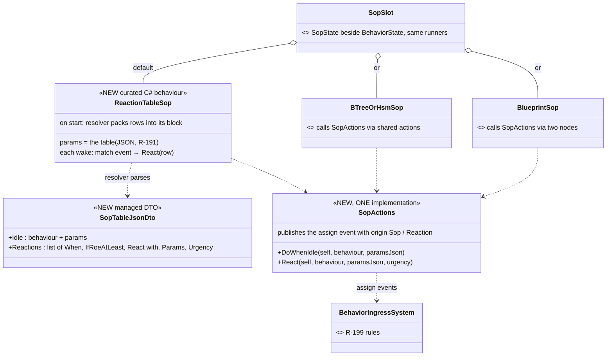

*What the picture shows that prose hid: the table is not a new asset kind — it is one built-in C# behaviour whose params
are the table, so it proves the "C# SOP" path, is edited by the one params form (`CE-3043`), saved like any params
(`R-191`/`R-192`) and named per unit type by the TKB; every richer SOP is just another behaviour in the same slot calling
the same two actions.*

| level | when to use it | what it adds over the table |
|---|---|---|
| ① **reaction table** (default) | most units | — *idle behaviour + rows "when ⟨Hit / FirstThreat / Acquired / AllClear⟩, if ROE ≥ x, react with ⟨behaviour, params⟩ at ⟨urgency⟩"* |
| ② **HSM SOP** | the reaction depends on a MODE (relaxed / alert / engaged) | per-state rows, transitions on sensor events (`CE-3040`), the mode visible in the debugger |
| ③ **BTree SOP** | the reaction depends on CONDITIONS polled each wake (danger, ammo, distance) | a priority list re-evaluated from the root |
| ④ **blueprint SOP** | anything else — utility scoring, timers, custom events | full flexibility |
| C# | hard-coded logic | any curated behaviour calling `SopActions` — the table itself is one |


### 4.3 Feasibility — the BTree IS the table *(PROPOSAL, supersedes §4.2's separate table)*

> 🔒 **User, `2026-10-04`:** *"the trigger would need to be a condition like in BTree, not just event, it must be more
> flexible; Isn't the btree exceptionally well suited for replacing the table? … just not sure about the urgency
> priorities … The SOP should still come from TKB and still should be replacable at runtime"*

📐 **Measured:**

| question | answer | where |
|---|---|---|
| can params hold an array of structs? | ✅ yes — a fixed-capacity list of any type, parsed / formatted by name | `BlueprintTypeRef.Capacity` (`Declarations.cs:43-60`), `InstanceEmitter.EmitParamsDefaults` |
| can a table row hold a flexible condition? | ⛔ only by inventing an expression language inside params | — ⇒ a BTree condition node already IS that, with an editor |
| how does a BTree hand params to a sub-behaviour? | a node names a host variable (`ParamsVariable`) holding the child's typed params DTO | `BehaviorTreeAssetDto.cs:220`, `DESIGN_Parameter_Model` §P |
| can a condition read "was hit recently"? | ⛔ no readable state — `SensorChangedEvent` lives one frame and the SOP wakes the NEXT frame | `SensorChangedEvent.cs`, `R-195`; grep `LastHit\|LastDamage`: none |
| can the TKB name an SOP with params? | ⛔ the profile holds a behaviour HASH only | `BehaviorProfileDto.DefaultBehaviorHash` |

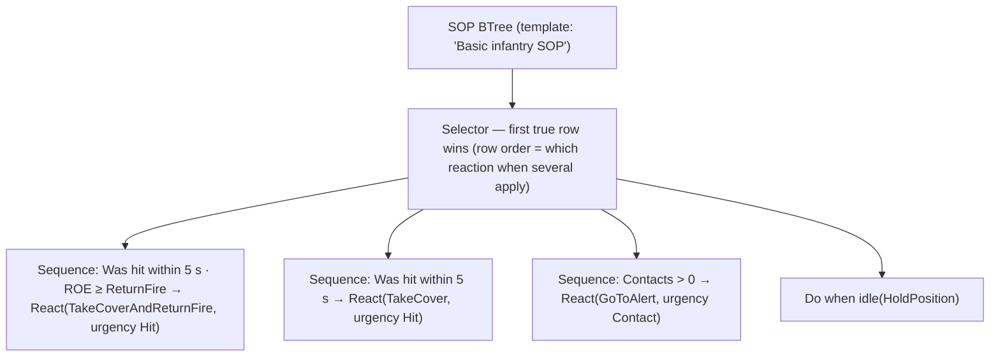

*What the picture shows that prose hid: a reaction table is exactly a Selector of condition → action rows, read top to
bottom; every leaf is INSTANT (React and Do-when-idle only publish an assignment — the reaction runs in the main slot), so
the SOP tree finishes every wake and is re-read from the root next time — no running branch to abort (no dependency on
`CE-3041`).*

| | |
|---|---|
| ⭐ row order vs urgency | **row order** decides WHICH reaction when several conditions are true at once; **urgency** (a field on React) decides whether it may interrupt what is ALREADY running (`R-199` ③) — two different questions, both needed |
| ⭐ conditions read STATE | a small per-unit `RecentSenses` (last tick of each `SensorChange` kind), written by one system from `SensorChangedEvent` ⇒ *"was hit within N s"*, *"contact within N s"*; plus existing state (contacts now, health) and the new ROE |
| ⭐ React = the Subtree node's shape | behaviour picker + `ParamsVariable` (typed params, edited as defaults in the BTree editor) + urgency; at fire the params are formatted to JSON for the assignment (blueprints: `FormatParams`, CE-3044; curated: their JSON DTO; ⚠ BTree/HSM asset params — to measure) |
| ⭐ TKB + runtime replace | the TKB profile gains `DefaultSop {Name, ParamsJson}`; replacing at runtime = an SOP assign at Operator / Superior (`CE-3035`); saved by the snapshot (`CE-3042`) |
| ⭐ C# | a curated BTree built in C# (how `MoveToLocation` is made), or any curated behaviour calling the two actions |


### 4.4 Params to JSON, the recipe, and the ROE *(✅ ROE approved `2026-10-04`, R-200 — 🔒 *"ROE shape ok."*)*

> 🔒 **User, `2026-10-04`:** *"yes it is OK."* (§4.3) · *"I would guess that by simple serializing of the behavior param
> dto"* · *"Shipped template = recipe (existing concept)"* · *"What the ROE would look like?"*

📐 **Params → JSON, measured:** every behaviour declares its authored params type, `BehaviorDefinition.JsonParamsDtoType`
(`BehaviorRegistry.cs:289`) — the "editor fields + JSON schema" type the intent JSON deserialises into. It is a STRUCT for
all three kinds: curated (`MoveToLocationParamsJsonDto` is a struct, `MoveToLocationParamsJsonDto.cs:27`), generated
BTree/HSM (the emitted `*_Blackboard`), blueprint (its `Params`, with an emitted `FormatParams`, CE-3044). A struct can be
a blackboard variable (`Demo_MissionPlan` holds one) ⇒ **React binds a variable of the reaction's authored DTO type; at
fire it is serialised with the same options the parse side uses** (`IncludeFields`, case-insensitive names, the
`EntityRef` bare-number converter) — the exact inverse of the intent path. ⚠ One shared options object and a round-trip
rail per kind, so the two directions cannot drift.

📐 **Recipe:** recipes are the shipped-template concept and already know BTrees — `AssetRoots` names `Recipes/BTrees`
(`AssetRoots.cs:207-215`); the folder does not exist yet in `Hrot.AI.Behaviors/Recipes` (only Blueprints, Scenarios,
Terrain). ⇒ the SOP template ships as `Recipes/BTrees/BasicInfantrySop`.

**ROE — the lean:** one small per-unit component, two fields, the military "weapons control" axis plus the "may I
deviate from my task" axis (the shape many simulators use — e.g. hold fire / defend only / fire at will):

| field | values | read by |
|---|---|---|
| `Fire` | `HoldFire` (never) · `ReturnFire` (only when fired upon — was hit / shot at within N s) · `FireAtWill` | SOP conditions; ⭐ ENFORCED once in the fire executor (`AimAndFireExecutor`, the only weapon-channel executor) so no behaviour can forget it |
| `Reactions` | `StayOnTask` (the order forbids reactions — R-199 ②) · `React` | the gate (`BehaviorIngressSystem`) |

| rule | |
|---|---|
| set by | an order (Operator / Superior) — with the assignment or on its own; the TKB gives the default per unit type |
| lifetime | unit state, persists across tasks until changed (ROE are set by command, not per task); a mission task MAY set it |
| saved | in the scenario snapshot when it differs from the TKB default (`R-192`) |
| edited | a row in the editor AI section (`CE-3043`) |
| later | `WeaponsTight` (identified hostiles only) needs identification (G11) — not now |

> ⭐ **AS-BUILT `CE-2074` + `CE-2076` (`2026-10-04`).** `Roe {Fire, Reactions, SetBy}` (`Behavior/Components/Roe.cs`),
> changed only by `SetRoeEvent` through `RoeSystem` (gated like a behaviour: a lower origin than `SetBy` is refused; the TKB
> default has `SetBy = Unmarked` and yields to anyone); TKB `DefaultRoeFire` / `DefaultRoeReactions`; reads go through
> `RoeOf` (no component / zero ⇒ `FireAtWill` / `React`). ⚠ Deviation: the zero members are `FireUnset` /
> `ReactionsUnset`, not `Unset` — the DDS code generator emits IDL for every component and IDL puts every enum member of
> a module in one scope. `RecentSenses` (`Behavior/Components/RecentSenses.cs`) is written by `RecentSensesSystem`, the
> Input-phase system of `CognitiveRuntimeModule` (⛔ first drafted as the first SIMULATION system — that shifted the
> rails that index the simulation list, so it moved, `2026-10-04`); conditions read `RecentSensesOf.Within(view, unit, kind, seconds)`.
> Not yet: the fire guard (`CE-2075`, backend's executor), saving (`CE-3042`), the editor row (`CE-3043`).

> ⭐ **AS-BUILT `CE-2095` (`2026-10-05`, behaviors; mirror of the `Fire` / `Reactions` plumbing above, FRAME Addendum 7).**
> `Roe.ReturnFireWindowSeconds` (float, LAST so the earlier fields keep their offsets; `0` = unset ⇒
> `RoeOf.DefaultReturnFireWindowSeconds` = 5 s, so nothing changes until something sets it) · `SetRoeEvent.ReturnFireWindowSeconds`
> (`0` keeps, as `Unset` does) applied by `RoeSystem.Apply` under the same origin gate · TKB
> `BehaviorProfileDto.DefaultRoeReturnFireWindowSeconds` · `SavedRoe.ReturnFireWindowSeconds`, carried by the scenario save, the
> replicated brain intent (JSON — no wire change; the egress `Signature` includes it so a change re-publishes), the hand-over
> and the materialisation. ⚠ Cross-lane, named: `AimAndFireExecutor.RoePermitsFire` reads `RoeOf.ReturnFireWindowSeconds`
> (the backend's "one line"); its constant stays as the default's alias. Rails: `RoeAndRecentSensesTests.CE2095_*`,
> `AimAndFireExecutorTests.AimAndFire_ReturnFire_UsesTheUnitsOwnWindow_CE2095`.


### 4.5 Keeping the SOP off the channels — measured *(PROPOSAL)*

> 🔒 **User, `2026-10-04`:** *"How can be calling actions touching various channel avoided from SOP btree? Isn't SOP just a
> behavior that naturally can call action nodes? Is it necessary to prevent it? Maybe the roslyn analyzers can just warn?"*

📐 **What already knows which channels a behaviour drives:** C# actions declare `[WritesChannel(Locomotion | Weapon |
Interaction)]` (`SharedAiAttributes.cs:89`, 20 production methods; the BTree/HSM generators already use it for cleanup
wrappers) · a blueprint's channels are DERIVED by the compiler, nothing authored (`BlueprintChannelDerivation`, CE-388 —
"an empty list means commands no channel") · at runtime an SOP's channel command is cancelled by construction
(`ChannelArbitrationSystem.cs:44`, the SOP token space is disjoint — §6 of the sensors design).

| layer | lean |
|---|---|
| why prevent at all | ⭐ yes, semantically: one owner per channel (G9). An SOP that moves the unit fights the task it is supposed to sit beside — exactly what the gate and the pause exist to prevent; anything that must move the body goes through React |
| ① assign time | ⭐ the SOP slot REFUSES (visibly, like an origin refusal) a behaviour whose channel set is non-empty — the union of its bound actions' `[WritesChannel]` (BTree/HSM, stored at registration — small new work) or its derived blueprint channels |
| ② editor | the AI section's SOP row offers only channel-free behaviours; the BTree editor warns on a channel-writing node in an asset tagged as an SOP (the recipe carries the tag) |
| ③ C# | an analyzer WARNING when a curated SOP binds a `[WritesChannel]` method |
| ④ runtime backstop | the first cancelled SOP channel command per run is logged loudly, never silent |

### 4.6 The two SOP actions — `CE-2079` *(build-state: BUILT, `2026-10-04` — as-built below the rules table)*

> 🔒 Approved with §4.3–§4.5 (*"ok approved. start building"*, `2026-10-04`). This section is the build design.

**INVENTORY** *(the code-graph index could not be built this session — a run aborted on files changing under a build —
so this is `grep` over `*.cs`, `2026-10-04`, stated as such)*: `SopActions|DoWhenIdle|SopOrder|ReactNode` → **0** hits.
No BTree action publishes `AssignBehaviorEvent`; two publish `AssignTacticalIntentEvent` (`CommanderNodes.cs:67`,
`HillAttackCommanderNodes.cs:125` — the latter serialises its DTO with `FdpJsonOptionsRegistry.DefaultRelaxed`). The ONE
params options object already exists: `BehaviorParams.JsonOptions` ⇒ `DefaultRelaxed` (`BehaviorParams.cs:72`); every
parse path aliases it (curated `FromBlockResolver`, generated BTree/HSM `__paramJsonOpts`, blueprint `__ParamJsonOptions`).

📐 **The measurement that decides the node's shape:** a BTree action node carries NO constants — everything reaches the
method through ONE host variable (`BehaviorActionBindingDto.ExpressionTargetField`; the delegate's `int` is the payload
index, not a parameter). ⇒ a node that names a behaviour, an urgency AND a typed params variable cannot be an action
binding; it needs a payload, exactly as `Subtree` has (`BTreeSubtreePayloadDto {SubtreeName, ParamsVariable}`) — which
§4.3 already said (*"React = the Subtree node's shape"*). ⭐ **As built it is a payload ON THE ACTION NODE, not a new node
kind** (`BTreeActionNodeDto.SopOrder`): the editor's node model is keyed by the KERNEL's `Fbt.NodeType`, so a new kind
would have meant a kernel node type that never executes — while an action node already is an instant leaf with pills,
and the order lowers to an action key anyway.

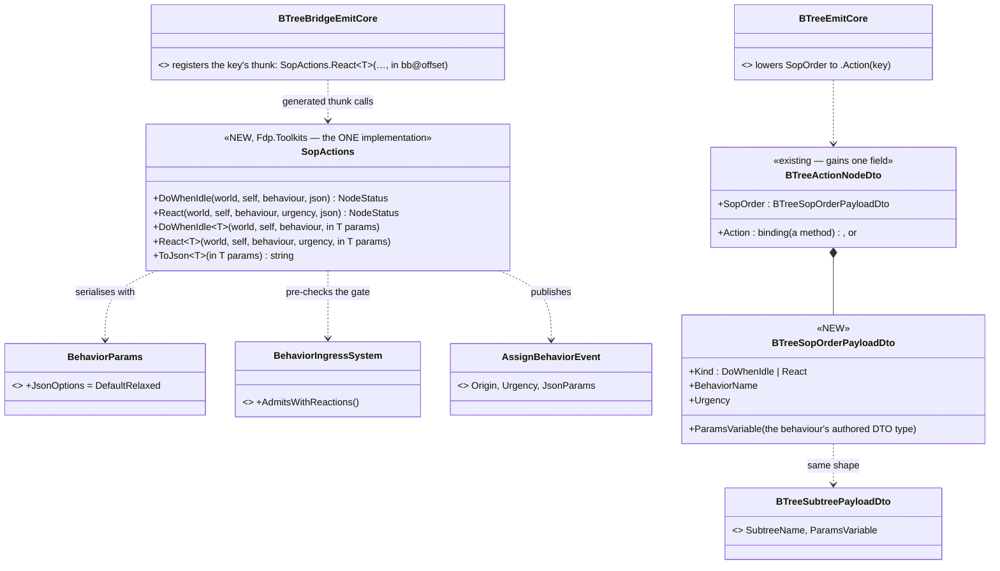

*What the picture shows that prose hid: there is ONE implementation (`SopActions`) and every authoring surface — C#, the
BTree node, later the blueprint node — only calls it; the BTree node needs no runtime node type at all, it lowers to an
ordinary action key whose generated thunk calls `SopActions` with the variable projected at its baked offset.*

```mermaid
sequenceDiagram
  participant BT as BrainTickSystem.TickSopSlots
  participant Tree as SOP tree (in BrainSlotScope)
  participant SA as SopActions
  participant Gate as BehaviorIngressSystem (static pre-check)
  participant Bus
  BT->>Tree: tick (woken, or every 0.2 s)
  Tree->>SA: React(self, "TakeCover", Hit, in coverParams)
  SA->>SA: already running this as a reaction? ⇒ Success, publish nothing
  SA->>Gate: AdmitsWithReactions(Reaction, Hit, task slot)?
  alt refused (StayOnTask, a more urgent reaction, …)
    SA-->>Tree: Failure — the Selector tries the next row
  else admitted
    SA->>Bus: AssignBehaviorEvent(TakeCover, JSON, Reaction, Hit)
    SA-->>Tree: Success — instant, the reaction runs in the TASK slot next frame
  end
```

*What the picture shows: the action never publishes something the gate will refuse. ⚠ That matters beyond tidiness — a
refused Sop-origin assignment WAKES the SOP (R-195), so a `DoWhenIdle` that published blindly under a running order would
wake itself every frame.*

| rule | why |
|---|---|
| both actions are INSTANT (Success / Failure, never Running) | §4.3: the SOP tree finishes every wake, no running branch to abort |
| `DoWhenIdle` publishes only when the task slot is empty or runs ANOTHER Sop-origin choice (or the same one with different params) | re-publishing the running idle choice every 0.2 s would restart it; publishing under an order is refused and wakes the SOP |
| `React` returns Success without publishing when that behaviour already runs as a reaction | the condition stays true for seconds after a hit; the reaction must not restart on every wake |
| params serialise with `BehaviorParams.JsonOptions`; no params variable ⇒ `"{}"` (authored defaults) | one options object both ways; a round-trip rail per kind (curated, generated BTree, blueprint) pins it |
| the editor surface (palette entries "Do when idle" / "React", the behaviour picker, the variable + urgency fields) | follows the node — mirrors the Subtree node's inspector |
| ⚠ the analyzer warning (§4.5 ③) | the BTree generator warns when an SOP tree binds a `[WritesChannel]` method; ⭐ as built NO flag: a tree that carries SOP orders IS an SOP (`BTREE0004`) |

⭐ **AS-BUILT `CE-2079` (`2026-10-04`).**

| piece | where |
|---|---|
| the ONE implementation | `Fdp.Toolkits/Behavior/SopActions.cs` — `DoWhenIdle` / `React` (by JSON or by typed params), `ToJson`; pre-checks `BehaviorIngressSystem.AdmitsWithReactions` |
| the BTree node | `BTreeActionNodeDto.SopOrder` (`BTreeSopOrderPayloadDto {Kind, BehaviorName, ParamsVariable, Urgency}`; `SopUrgencyDto` mirrors `ReactionUrgency` because the persistence assembly is netstandard2.0) · topology `BTreeEmitCore.EmitAction` → `.Action(key)` · bridge `BTreeBridgeEmitCore.EmitSopOrderThunks` → one `SopActions` call, params projected at the HOST offset · ONE key spelling `BTreeSopOrderPayloadDto.ActionKey` |
| the editor | palette group "SOP" — "Do when idle" / "React" (`BTreeKinds.SopDoWhenIdle` / `SopReact` → an action node with the order) · `BTreeSopOrderFacet`: behaviour (`[AiBehaviorPicker]` — every registered behaviour, any tier, hand-written included), params variable (COMPOSED on pick, typed as the behaviour's authored params — `ChildInputTypes.ParamsDtoLookup`; a class DTO binds nothing ⇒ defaults), urgency · validator `SopOrderIncomplete` · mapper both ways |
| the warning | `BTREE0004` (`BTreeJsonGenerator.ReportSopChannelWrites`) — once per channel-writing method in a tree that carries SOP orders; a warning, the asset still builds |
| rails | `SopSlotTests.CE2079_*` (5, incl. the curated round-trip) · `SopParamsRoundTripTests` (EVERY production behaviour of every kind reads what an order sends — two values, two blocks) · `SharedAiBindingCompilesTests.CE2079_*` (2, compiled) · `BTreeFacetMapperTests.CE2079_*` (2) · `BTreeValidationTests.CE2079_*` · `BTreeCommandSinkTests.CE2079_*` |
| ⚠ not built | an SOP order in an HSM state or a blueprint node (an HSM / blueprint SOP calls `SopActions` from C# today) — follow-up; the C# SOP path needs nothing more |

⭐ **As-built `CE-2083` (refusal half, `2026-10-05`):** an SOP assignment carrying origin `Reaction` is refused in
`StartSop` (counted, warned). A reaction is a task-slot concept that pauses the task (R-199); in the SOP slot it would
rank as an arbitrary order. Rail `SopSlotTests.CE2083_*`. The HSM state action and the blueprint node for SOP orders
remain open.

### 4.7 The shipped SOP — `CE-2080` *(build-state: BUILT, `2026-10-04`)*

`BasicInfantrySop` — ONE file, two roles: compiled from `Hrot.AI.Behaviors/Assets/BTrees/Sop/` (so a TKB template can name it
as `DefaultSop`, `CE-2077`) and published as the BTree recipe at `Recipes/BTrees/` (a `Content` link in the `.csproj` — a
copy would drift). It is §4.3's reaction table, built only from the pieces §4.4–§4.6 added:

```mermaid
graph TD
  ROOT["Root"] --> SEL["Selector — first true row wins"]
  SEL --> R1["Hit, fresh (3 s) → React(Demo_TakeCover, Hit)"]
  SEL --> R2["First threat, fresh (3 s) · ROE ≤ HoldFire → React(Demo_Retreat, Contact)"]
  SEL --> R3["First threat, fresh (3 s) → React(Demo_TakeCover, Contact)"]
  SEL --> IDLE["Do when idle(Idle)"]
```

*What the picture shows that prose hid: the ROE row sits ABOVE the general contact row — row order is how "a unit that must
hold fire withdraws instead of taking up a firing position" is expressed, with no special rule anywhere.*

| decision | why |
|---|---|
| ⭐ rows ask **SensedFresh**, not "sensed within N s" | 📐 measured on this recipe: the stand-in cover lasts 1 s, so a plain 3-second window re-fired the same hit's reaction after the task restarted (rail red-proved). ⭐ Fresh = within N s **and** since the task slot's current run began (`BehaviorState.RunSince`, set by every start and clear) — an event that already caused a reaction is older than the restarted task |
| conditions are shared C# (`Fdp.Toolkits/Behavior/SopConditions.cs`: `SensedWithin`, `SensedFresh`, `RoeFireAtLeast`, `RoeFireAtMost`) | any BTree / HSM asset binds them; params `SopSenseParams {Kind, Seconds}`, `SopRoeParams {Fire}` |
| ⭐ **`InContact`** *(`CE-2104`, `2026-10-05`)* — the ALERTED mode of any SOP: threat memory non-empty (seen OR heard), or `AllClear` less than `SopContactParams.LingerSeconds` ago | ⭐ DERIVED, not latched: on with `FirstThreat`, off with `AllClear` (+ linger) ⇒ nothing extra to save or replay. A HSM SOP may instead transition on `Sensor.FirstThreat` / `Sensor.AllClear` (`CE-3040`). Rail `RoeAndRecentSensesTests.CE2104_*` |
| ⛔ ~~the reactions are the existing `Demo_TakeCover` / `Demo_Retreat` stand-ins (a 1 s / 0.5 s delay)~~ SUPERSEDED `2026-10-05` (`CE-2094`, D6): the reactions are the REAL `TakeCover` / `FallBack` trees (`DESIGN_Eqs_Consuming_Behaviours.md` §6) — cover lasts while the unit remembers a threat, and the paused task restarts when it is forgotten | the stand-in assets stay (other rails and demos name them); only the shipped SOP's React rows moved |
| ⚠ not built | edge-latching for conditions that are not sensing changes (e.g. "health below 30 %" stays true) — a row on such a condition re-fires after each reaction; the fresh rule covers sensed EVENTS only |

Rails: `BasicInfantrySopTests` (SimHost, the production registry through the real ingress + brain: idles with no order; a
hit pauses the task with cover, the task restarts, the same hit does not fire again; HoldFire withdraws, otherwise cover).

### 4.8 The demo scenario — `CE-2082` *(build-state: BUILT, `2026-10-04`; user: "pls add the demo SOP scenario to the plan")*

`Hrot.AI.Behaviors/Recipes/Scenarios/sop-demo/scenario.json` — a shipped scenario recipe (offered by the editor's New
Scenario picker like `basic-desert`). Five `InfantrySoldier` (TKB 2002) units; every unit's task, SOP and ROE come from the
scenario's snapshot keys (`CE-3042`), nothing from new templates:

```mermaid
graph LR
  HA["Hostile A — mission: FireAtTarget(Squad A)"] -- real fire --> SA["Squad A — task MoveToLocation · SOP BasicInfantrySop"]
  HB["Hostile B — mission: FireAtTarget(Squad B)"] -- real fire --> SB["Squad B — same + ROE Reactions = StayOnTask"]
  C["Unit C — SOP only"]
  SA -. "hit ⇒ React(cover) pauses the move, the move restarts" .-> SA
  SB -. "hit ⇒ refused by the gate, keeps moving" .-> SB
  C -. "no order ⇒ Do when idle(Idle)" .-> C
```

*What the picture shows that prose hid: the two squads are IDENTICAL except for one ROE field — the demo isolates the one
rule (R-199 ②) that decides whether a reaction may pause a task.*

| | |
|---|---|
| ⭐ sequenced AFTER `CE-3042`, not before (the plan had it first) | the demo needs per-unit task, SOP and ROE in the file, and only the snapshot carries them (all three components are `NoScenario`) |
| ⭐ the hit is REAL | `FireAtTarget` → SimHost ballistics + damage → CGF health → `ThreatEvaluationSystem` publishes `SensorChangedEvent{Hit}` → `RecentSenses` → the SOP row (`SensedFresh`) |
| ⚠ measured: entity names must be short ASCII | names with an em dash overflowed a fixed-size string encoder on the live load (`ArgumentException … output byte buffer is too small`) |

Rail: `SopDemoScenarioTests` (live cluster `simhost,ig,excon,cgf`, DDS domain 227): C idles via its SOP · A takes cover with
the move paused · B is hit and never reacts — red-proved (B without its ROE reacts; A without its SOP never covers).

### 4.9 RESUME instead of restart — `CE-2081` *(DESIGN `2026-10-05`; A–D approved, E changed — build design §4.9a)*

⭐ Basis: §4.1 (*"Restart with resume as followup accepted"*, R-199) and its measured table *"what resume would take"*.
This section turns that table into a buildable shape.

```mermaid
classDiagram
  direction LR
  class PausedTask { <<existing, grows>> +BehaviorName +JsonParams +Origin ; NEW +Hash +InstanceId +BrainTier +RunSince +HeldKeys int[] }
  class BehaviorIngressSystem { <<existing>> PauseRecord (grows: snapshot + held keys) · Start · Clear · ResumePausedTask (becomes RESUME) · DropPausedTask (detaches HeldKeys) }
  class OccurrenceStore { <<existing>> slot table: params / state / HSM roots + manifest + lazily attached }
  class BehaviorOwnedParts { <<existing>> Release(instanceId) — skipped for the paused run }
  class ChannelArbitrationSystem { <<existing, unchanged>> resets a channel whose BehaviorInstanceId is not the current one }
  class Runners { <<existing>> BTree action re-activates on ActiveAction != its own · HSM activity ticks · blueprint latent: ⛔ to measure }
  BehaviorIngressSystem ..> PausedTask : pause / resume / drop
  BehaviorIngressSystem ..> OccurrenceStore : skips HeldKeys while paused
  BehaviorIngressSystem ..> BehaviorOwnedParts : not released on pause
  PausedTask ..> OccurrenceStore : HeldKeys
```

```mermaid
sequenceDiagram
  participant G as gate (reaction admitted)
  participant I as BehaviorIngressSystem
  participant S as store + owned parts
  participant C as ChannelArbitrationSystem
  participant R as runner (task)
  G->>I: reaction pauses the task
  I->>I: PauseRecord: name, params, origin + hash, InstanceId, tier + HeldKeys (every slot key present now)
  I->>S: start the reaction — sweeps and releases SKIP HeldKeys and the paused run's parts
  Note over C: the reaction's token ⇒ the task's channel commands are reset (as today)
  I->>I: reaction ends ⇒ RESUME: restore hash, InstanceId, tier, origin · drop the record (the keys are the task's again)
  C->>C: the channel holds the reaction's token ≠ the restored one ⇒ reset
  R->>R: the running leaf re-activates (ActiveAction ≠ its own) — progress kept, only the leaf re-issues
```

*What the pictures show that the prose hid:* resume needs NO new mechanism for the channels. The existing token rule
resets them a second time when the old token comes back, and the BTree channel actions already re-activate on that
(`CgfNodes.cs:257`, `needsActivation`). The new work is three things: keeping storage, keeping owned parts, and
restoring four `BehaviorState` fields.

| claim | code | design |
|---|---|---|
| a BTree channel action re-issues when its channel was reset | ✅ `CgfNodes.cs:257-268` | ✅ §4.1 table, row "in-flight channel commands" |
| restoring the old `InstanceId` resets the reaction's channel commands | ✅ `ChannelArbitrationSystem.cs:44-48` (`BehaviorInstanceId != InstanceId`) | ✅ same row |
| owned parts are released by run id on a switch | ✅ `BehaviorIngressSystem.cs:163, :295` (§4.1) | ✅ §4.1 |
| an HSM resumes in its current state: its instance stays, activities tick each frame | ✅ measured `2026-10-05`: activities run EVERY tick in steady state (`HsmKernelCore.cs:120-155`, CE-334), and a channel activity is the same shared node as the BTree's ⇒ it re-activates | §4.1 *"HSM re-enter the state"* |
| a blueprint latent wait survives a channel reset | 🔴 measured `2026-10-05`: **it does NOT.** The wait checks only `Status == Running` (`WaitLowering_Instance.cs:398-404`); a reset runs the old executor's `OnExit` and stops executing (`LocomotionDispatcherSystem.cs:62-90`) but leaves `Status` as it was ⇒ a resumed blueprint waits on a cancelled command, likely forever | §4.1 *"blueprint latent re-issue"* |

**Leans:**

| # | question | lean |
|---|---|---|
| **A** | what is kept | ⭐ every slot key present at pause (`HeldKeys`) and the paused run's owned parts. Simpler and safer than recomputing ownership: the reaction is short |
| **B** | same asset as task and reaction | ⭐ refuse the reaction (it would share one block key), as the tracker row says |
| **C** | a more urgent reaction pre-empts the running one | ⭐ the paused task stays as it is (one deep, R-199). The pre-empted reaction is ended normally |
| **D** | an order replaces the paused task | ⭐ `DropPausedTask` detaches `HeldKeys` and releases the paused run's parts: no leak |
| **E** | the blueprint tier | ⭐ **BTree and HSM resume; a blueprint task keeps RESTART** (today's behaviour) until a latent wait can re-issue its command (a cursor that re-runs the issuing statement when the channel's `ActionInstanceId` moved under it — a separate item). Both rows are now measured |

✅ **APPROVED `2026-10-05`: A–D as written; E CHANGED** (R-203). 🔒 **User:** *"2081 is ok but either all resumes or none, blueprint must be part of resume."*
⇒ ⛔ the E lean above (blueprint keeps restart) is **SUPERSEDED**: all three tiers resume, or none does. The blueprint
half — a latent wait that re-issues its channel command when the channel's `ActionInstanceId` moved under it — becomes
part of `CE-2081`, designed before the BTree/HSM half ships, so resume lands for all tiers together.

⛔ **Rejected:** a stack of paused tasks (R-199: one deep). · Re-running the task from its root (that is today's restart).
· Copying the task's storage aside (the store has no room to spare, and keeping it in place costs nothing).

### 4.9a `CE-2081` — the build design, all three tiers *(behaviors, `2026-10-05`; build-state: BUILT — as-built at the end)*

**INVENTORY** *(measured `2026-10-05`, grep + reading; the graph was not consulted for this list — every site is a call of
a named helper inside `BehaviorIngressSystem.cs`)*: the places that end a task-slot run's storage — `Start` (prev manifest
`DetachStatefulSlots`, `DetachHostedOccurrenceSlots`, prev `RootParams/RootState.DetachRoot`, `BehaviorOwnedParts.Release`),
`Clear` (the same four, plus `RootStateAccess.ResetState`), the unhosted hash assign. The token readers: `ChannelArbitrationSystem`
(`!=`), `BehaviorOwnedParts` (`==`), `BehaviorFault` (`==`), `BrainTickSystem._publishedTerminalForInstanceId` (`==`, finish
de-dup), the blueprint cursor `InstanceVersion` (`!=` ⇒ restart from entry, `StatementEmitter.cs:844`). No reader orders
tokens (`<`/`>`): searched, none found.

```mermaid
classDiagram
  class PausedTask { <<existing, grows>> BehaviorName · JsonParams · Origin · NEW Hash · InstanceId · BrainTier · HeldKeys int[] · Restart bool }
  class BehaviorIngressSystem { <<existing>> PauseRecord: + HeldKeys (store keys at pause, minus the SOP's) · Start(pausing): skips the prev run's sweeps, sizes by FREE space · IsHeldByPausedTask (beside IsHeldBySop) · ResumePausedTask: RESTORES · DropPausedTask(release) }
  class RunTokens { <<NEW, the SopTokens allocator generalised>> +Next() high-bit, process-unique }
  class BehaviorOwnedParts { <<existing>> Release(run) · NEW Restamp is NOT needed (the task keeps its token) }
  class WaitLowering_Instance { <<existing>> channel wait: NEW "cancelled" check (ActiveAction == 0) ⇒ re-run the ChannelCommand + its pure inputs }
  class ChannelArbitrationSystem { <<existing, unchanged>> resets a channel whose BehaviorInstanceId != InstanceId }
  BehaviorIngressSystem ..> PausedTask
  BehaviorIngressSystem ..> RunTokens : a run started while a task is paused
  WaitLowering_Instance ..> ChannelArbitrationSystem : detects its reset
```

*What the picture shows that prose hid:* the task KEEPS its token. Everything that would otherwise need re-keying — owned parts,
the blueprint cursor version, the channel stamp — matches again the moment the token comes back, so nothing is re-stamped.

```mermaid
sequenceDiagram
  participant G as gate
  participant I as BehaviorIngressSystem
  participant S as store + owned parts
  participant C as ChannelArbitrationSystem
  participant R as task runner (BTree / HSM / blueprint)
  G->>I: reaction admitted, pause = true
  I->>I: PauseRecord: name, json, origin, Hash, InstanceId T, tier, HeldKeys
  alt the reaction's keys overlap HeldKeys (same curated node, same offset) or its asset = the task's
    I->>I: overlap ⇒ Restart = true, HeldKeys = [] (today's restart) · same asset ⇒ refused (lean B)
  end
  I->>S: Start(reaction, pausing): token = RunTokens.Next() · prev sweeps skipped · sized by free space
  Note over C: channel stamp T ≠ reaction token ⇒ the task's command is reset
  I->>I: reaction ends (finish / self-clear) ⇒ Clear sweeps skip HeldKeys
  I->>I: ResumePausedTask: hash, InstanceId = T, tier, origin restored · RunSince = now · start record = T · record dropped
  C->>C: channel stamp (reaction token) ≠ T ⇒ reset, ActiveAction = 0
  R->>R: BTree / HSM: the running leaf re-activates (ActiveAction ≠ its own) · blueprint: the channel wait sees ActiveAction = 0 ⇒ re-runs its command
```

```mermaid
graph TD
  ING["BehaviorIngressSystem (Brain; CGF / editor)"] -->|"assign / clear / hash handlers"| PR["PauseRecord + Start(pausing)"]
  BT["BrainTickSystem.Finish / ClearResumingAPausedTask"] -->|"a reaction ends"| RES["ResumePausedTask (restore)"]
  ING -->|"self-clear of a reaction"| RES
  ING -->|"an order replaces the task"| DROP["DropPausedTask(release: detach HeldKeys, Release(T))"]
  HO["BrainHandOverSystem (authority moved)"] --> DROP
  RES --> RUN["runners tick the task next frame"]
```

*Caption:* the three entries into the paused record — pause, resume, drop — and every caller of each. A hand-over drops (the
new Brain restarts from the published intent, `CE-3048`); ⛔ there is no path that leaves the held keys attached without a record.

| claim | code (how it IS) | design (how it was MEANT) |
|---|---|---|
| a task keeps its token ⇒ the blueprint cursor resumes | ✅ cursor checks `InstanceVersion != instanceVersion` (`StatementEmitter.cs:844`), fed `ctx.InstanceId` (`BlueprintRunner.cs:54`) | ✅ §4.9 *"restoring four BehaviorState fields"* |
| restoring T with plain `++` tokens would REUSE the reaction's token for the next run ⇒ `Finish`'s de-dup would swallow that run's end | ✅ `BrainTickSystem.cs:409` (`prev == InstanceId` ⇒ return) | ⛔ not in §4.9 — found while building ⇒ runs started while a task is paused take `RunTokens.Next()` (high bit, as the SOP's) |
| curated stateful slots are NOT keyed by behaviour ⇒ a reaction can share a key with the task | ✅ `OccurrenceSlotKey.cs` P2: `CompoundKeyName(fqn, offset)` with an EMPTY asset id | ⛔ §4.9 lean A assumed disjoint keys ⇒ overlap falls back to RESTART for that pause |
| a blueprint channel wait never learns its command was cancelled | ✅ `WaitLowering_Instance.cs:398-404` checks only `Status`; the dispatcher never clears `ActiveAction` on completion (`LocomotionDispatcherSystem.cs:62-90`), arbitration sets it to 0 on reset (`ChannelArbitrationSystem.cs:44-48`) | ✅ §4.9 row 5 ⇒ `ActiveAction == 0` while waiting = cancelled |
| the blueprint command re-activates on `ActiveAction` change and stamps the current token | ✅ `ChannelCommandLowering.cs:60-130` (mirrors `CgfNodes.cs:257`) | ✅ §4.9 *"blueprint re-issue the latent"* |

| decision | why | rejected |
|---|---|---|
| **RunSince = now on resume**, not the task's old value | `SopConditions.SensedFresh` keys "fresh" on `RunSince` (CE-2080): the old value would make the sense that caused the reaction fresh again ⇒ the SOP would react again, forever | restoring it (§4.9's "four fields" listed it) |
| re-issue = the `ChannelCommand` statement of the SAME block plus the PURE statements its inputs come from | they re-evaluate to the current values, which is what the BTree's re-activation does | re-running the whole block (would repeat earlier side effects) |
| a cancelled wait with no re-issuable command (command in another block, impure inputs, or none) **fails** the wait | honest: the author's `OnFailure` runs instead of waiting forever | waiting forever (today) |
| the paused task's own EQS sensors keep running while paused | lean A (keep owned parts); a reaction is short | suspending them (a second state to restore) |
| a `WaitForEvent` that fires during the reaction is missed | the task was not running; the same as an HSM state that was not active | buffering events for a paused run |

⭐ **As-built `CE-2081` (`2026-10-05`)** — matches the diagrams, with these precisions:
- **ingress** (`BehaviorIngressSystem`): `PauseRecord(incoming)` captures hash / token / tier / `HeldKeys` (the store's keys
  minus the SOP's) and marks `Restart` when the incoming run's keys (`KeysOf`: three roots + manifest) overlap. `Start(…, pausing)`
  skips the paused run's `Release`, manifest detach and root detaches, and provisions through the free-space path
  (as the SOP slot does). `IsHeldByPausedTask` sits beside `IsHeldBySop` in `DetachHostedOccurrenceSlots`.
  `ReconcileHeldTask` turns an existing pause into a restart when a reaction replacing a reaction would overlap it.
  `NextRunToken` replaces every task-slot `InstanceId++` (start, clear, the unhosted hash assign).
  `DropPausedTask(registry)` detaches the held keys (except those the running behaviour now uses) and releases the paused run's parts.
- **lean B** is in `Admit`: a reaction whose behaviour is the running task (when it would pause it) or the paused task is refused.
- **tokens:** `RunTokens` (in `SopState.cs`) is the one high-bit allocator; `SopTokens.Next` delegates to it.
- **blueprint:** `WaitLowering_Instance` adds the cancelled check only to a channel wait whose own block issues a command on
  that channel (`IssuesOn`) — ⚠ a wait on a channel commanded elsewhere keeps the old status-only check (rail
  `S1_AfterAChannelWaitSucceeds_*` waits on an uncommanded channel). Re-entry target = the issuing block when `CanReissue`
  (a whitelist of re-runnable ops), else the wait's failure block.
- **rails:** `SopSlotTests.CE2081_*` (5: resume where it was on its own token · the token is never reused · same asset refused ·
  an order releases the paused storage and parts · an overlapping reaction falls back to restart),
  `BlueprintBehaviourTests.CE2081_*` (2: re-issue · a non-re-issuable block fails the wait). Red-proofs: resume forced to restart
  ⇒ the progress rail red; tokens forced to `++` ⇒ the de-dup rail red.

### 4.10 `CE-2083` — SOP orders in an HSM state and as a blueprint node *(behaviors, `2026-10-05`; build-state: BUILT — as-built at the end)*

> 🔒 Scope approved with §4.3–§4.6 (*"ok approved. start building"*, `2026-10-04`: "BTree/HSM shared actions, blueprint
> nodes"); 🔒 *"Yes pls do them, autonomously move to next"* (`2026-10-05`). §4.6 built the C# core and the BTree node; this
> section is the other two authoring surfaces. ⛔ Nothing at runtime changes: both lower to the ONE `SopActions` call.

**INVENTORY** *(`2026-10-05`: codebase-memory CLI `search_graph` `.*Sop.*` / `.*RunBehavior.*` — the index predated the
morning's merge and was rebuilt mid-pass — plus grep; ⚠ `check_index_coverage` is not reachable through the CLI)*:

| exists | where | reused how |
|---|---|---|
| `SopActions.DoWhenIdle` / `React` (string JSON or typed `in T`) | `Fdp.Toolkits/Behavior/SopActions.cs` | ⭐ the only call either surface makes |
| `BTreeSopOrderPayloadDto {Kind, BehaviorAssetId, BehaviorName, ParamsVariable, Urgency}` + `ActionKey(offset)` | `AiEditor.Persistence/BTree/BehaviorTreeAssetDto.cs:250` | ⭐ the HSM state carries the SAME payload (renamed host-neutral, Roslyn) |
| `BTreeBridgeEmitCore.EmitSopOrderThunks` — one thunk per key, params projected at the host offset | `Emit/BTreeBridgeEmitCore.cs:737` | ⭐ its call expression moves into one helper both bridges call |
| HSM slot thunks: `delegate*<void*, void*, HsmCommandWriter*, void>`, `HsmKernelBridge` → world + self, `RootParamsAccess.RequireRootBytes` | `Emit/SharedAiBindings.cs:243` | ⭐ the HSM SOP thunk is this shape |
| HSM state slots (`OnEntry` / `OnExit` / `Activity` / `Timer`) addressed by NAME → `HsmActionKey.ForCompoundKey` | `Emit/HsmEmitCore.cs:776`, `HsmBridgeEmitCore.cs:207` | the SOP order is the state's Activity name |
| `ChildInputTypes.ParamsDtoLookup` — a behaviour's AUTHORED params type | `Editor.AiComposition/ChildInputTypes.cs` | ⭐ types the HSM params variable AND the blueprint `Params` pin |
| `RunBehaviorNode.ParamsTypeId` + typed `Params` pin (`CE-2022`) | `Blueprints.Compiler/Assets/Nodes.cs` | ⭐ the blueprint node's pin is the same shape |
| `EmissionContext.WorldVar` (an `EntityRepository` in every dispatch with a self) | `Emit/EmissionContext.cs:255` | the blueprint call's `world` |
| `SendIntentNode` (`CE-472`) — the nearest blueprint precedent (a DTO → JSON → `PublishManaged`) | `Stage5_Schedule.cs:2075` | ⛔ not reused: it builds per-member pins; the lean here is the Behaviour Task's ONE typed pin |

```mermaid
classDiagram
  class SopActions { <<existing — the ONE implementation>> DoWhenIdle(world, self, name, json) · React(…, urgency, json) · DoWhenIdle~T~ · React~T~ }
  class SopOrderPayloadDto {
    <<existing, RENAMED from BTreeSopOrderPayloadDto>>
    Kind · BehaviorAssetId · BehaviorName · ParamsVariable · Urgency
    ActionKey(offset)
  }
  class BTreeActionNodeDto { <<existing>> SopOrder }
  class StateNodeDto { <<existing — gains one field>> +SopOrder : SopOrderPayloadDto NEW }
  class SopOrderEmit { <<NEW, AiEditor.Persistence/Emit>> +Call(order, world, self, paramsExpr) string }
  class BTreeBridgeEmitCore { <<existing>> EmitSopOrderThunks → SopOrderEmit.Call }
  class HsmEmitCore { <<existing>> a state's SopOrder ⇒ .Activity(order.ActionKey(offset)) }
  class HsmBridgeEmitCore { <<existing — grows>> EmitSopOrderThunks NEW → SopOrderEmit.Call · RegisterAction(ForCompoundKey(key)) }
  class SopOrderNode {
    <<NEW, Blueprints.Compiler/Assets>>
    Kind · BehaviorName · ParamsTypeId · Urgency
    pins: In, Out, Params (typed), Accepted (bool)
  }
  class IrOp_SopOrder { <<NEW>> Kind · BehaviorName · Urgency · Params IrValue? }
  class StatementEmitter { <<existing>> IrOp_SopOrder → SopActions call on WorldVar }
  BTreeActionNodeDto *-- SopOrderPayloadDto
  StateNodeDto *-- SopOrderPayloadDto
  BTreeBridgeEmitCore ..> SopOrderEmit
  HsmBridgeEmitCore ..> SopOrderEmit
  SopOrderNode ..> IrOp_SopOrder : Stage 5
  IrOp_SopOrder ..> StatementEmitter
  SopOrderEmit ..> SopActions : generated call
  StatementEmitter ..> SopActions : generated call
```

*What the picture shows that prose hid:* three authoring surfaces, ONE payload shape for the two asset hosts, and every arrow
ends at `SopActions` — no runtime type, no kernel node, no new event.

```mermaid
sequenceDiagram
  participant BT as BrainTickSystem (SOP slot, wake or 0.2 s)
  participant K as HSM kernel
  participant Th as generated SOP thunk (HSM bridge)
  participant G as blueprint Tick (SopOrderNode)
  participant SA as SopActions
  BT->>K: tick the SOP HSM
  K->>Th: the current state's Activity (its SopOrder key)
  Th->>SA: React~T~(world, self, "TakeCover", Hit, in bb@offset)
  SA-->>Th: Success or Failure (instant, a refusal is retried next tick)
  BT->>G: tick the SOP blueprint
  G->>SA: DoWhenIdle~T~(world, self, "Patrol", in params)
  SA-->>G: Accepted = (status == Success) ⇒ Out
```

```mermaid
graph TD
  REG["HSM bridge Register() — generated per asset"] -->|"RegisterAction(id of SopOrder key)"| DISP["HsmActionDispatcher"]
  BTS["BrainTickSystem — task slot AND SOP slot"] -->|ticks| K["HSM kernel"] -->|"Activity id"| DISP
  BTS -->|ticks| BP["blueprint Tick / Event graphs"] -->|"inline call"| SA["SopActions"]
  DISP --> SA
```

| decision *(lean = built unless the user changes it)* | why | rejected |
|---|---|---|
| **D1** an HSM state's order runs as its **Activity** (every tick of the state) | `SopActions` dedupes (already running ⇒ Success, nothing published) and a refused order is retried on the next tick — the SOP re-reads itself at every wake (§4.3) | ⛔ OnEntry: issued once, so an order refused on entry is never retried |
| **D2** the state carries the BTree's payload, **renamed `SopOrderPayloadDto`** (Roslyn, JSON unchanged) | one shape, one `ActionKey` spelling for both asset hosts | ⛔ a second HSM payload type (two producers of one key) |
| **D3** a state with an `SopOrder` and an `Activity` binding is a validator error | the order IS the activity; one slot, one owner (§9 ③'s method XOR blueprint) | silently preferring one |
| **D4** the blueprint node has **one typed `Params` pin** (the behaviour's authored params type, `ParamsDtoLookup`) and an **`Accepted` bool** beside one exec `Out` | mirrors the Behaviour Task (`CE-2022`); a Branch on `Accepted` gives the Selector's "try the next row" | ⛔ `Accepted`/`Refused` exec outs (a new two-way shape in the scheduler for what a Branch already does) · ⛔ per-member pins (`SendIntentNode`'s shape — a second way to pass behaviour params) |
| **D5** the pin's type is the AUTHORED params DTO, not the hosted input | what `SopActions` serialises (§4.6 as-built: a curated behaviour hosts one type and parses another) | `TryGetHostedInputType` |
| **D6** compile error when the node sits where there is no self (Library) or in a resolver graph | an order is a side effect on the unit | — |

**Slices** (one commit each, green at each): **H1** HSM emit + validator + generated-compile rail · **H2** HSM editor (state
facet "SOP order", compose the params variable on pick) · **B1** blueprint compiler (node, IR, emit, diagnostics, coverage +
purity) + a run-through rail · **B2** blueprint editor (palette "SOP: Do when idle" / "SOP: React", picker, typed pin).

⭐ **AS-BUILT (`2026-10-05`)** — D1–D6 built as drawn. Where the build differs, and why:

| as built | where | differs because |
|---|---|---|
| the rename went through Roslyn's PREVIEW; its apply step reported success and wrote nothing, so its five computed hunks were applied verbatim | `BehaviorTreeAssetDto.cs`, `BTreeEmitCore.cs`, `BehaviorTreeAssetMapper.cs` | the semantic set is Roslyn's; only the write was manual |
| ⭐ ONE offset rule too: `SopOrderEmit.Offset` (the BTree's `SopOrderOffset` now delegates) and `BindingNamer.SopOrderName` | `Emit/SopOrderEmit.cs`, `SharedAiBindings.cs` | the HSM topology and its bridge must key the same — the BTree already had this pair |
| ⚠ the BLUEPRINT call is spelled in `StatementEmitter` (`IrOp_SopOrder`), not by `SopOrderEmit` | `Blueprints.Compiler/…/StatementEmitter.cs` | the blueprint compiler is netstandard2.0 and references no `AiEditor.Persistence`; both spellings end at `SopActions` and each has a run-or-compile rail |
| `SopOrderUrgency` — a third mirror of `ReactionUrgency` (beside `SopUrgencyDto`) | `Blueprints.Compiler/Assets/Nodes.cs` | same netstandard2.0 wall; `CE2083_SopOrderUrgency_MirrorsReactionUrgency` pins names AND values |
| the HSM editor model holds the persisted payload itself (`StateNode.SopOrder`); the mapper deep-copies both ways | `Hsm.Editor/Model/HsmAsset.cs`, `HsmAssetMapper.cs` | the BTree's editor-side copy (`BTreeSopOrderPayload`) lives in `BTree.Editor`, which the HSM editor does not reference |
| editor rule `HsmDiagnosticCode.SopOrderInvalid` beside the generator's HSM0001 | `HsmValidator.CheckSopOrders` | the author sees it on the canvas before a build |
| `HsmPickerDrawerFactory.BuildDrawers(…, behaviourNames)`; both production hosts pass `ChildInputTypes.ParamsDtoLookup` as the new `SopParamsType` (⚠ cross-lane, named: `CgfSubsystem.cs`, `EditorSubsystem.cs`) | `AiFacetPickerBinder.cs`, `AiBlueprintNodeAuthoringBinder.cs` | the silent-default rule: a host that has the registry passes it |

Rails (each feature's suite; red-proved): H1 `SharedAiBindingCompilesTests.CE2083_*` (thunk collection off ⇒ red; XOR guard
off ⇒ red) · H2 `HsmSubtreeAuthoringTests.CE2083_*` (apply removed ⇒ 3 red) · B1 `CE2083_SopOrderNodeTests` (React publishes
the reaction with its params and is Accepted; Do when idle under an order publishes nothing and is not Accepted; BP1688; the
urgency mirror) + `NodeCoverageTests` `Inline/SopOrder` · B2 `BehaviorTaskNodeDrawerTests.CE2083_*`.

## ⛔ HISTORY

*Superseded `2026-10-04` the same day:* a §2 "the mission as a doctrine" with leans M1–M6 (a mission graph in the
doctrine slot, triggers retired). ⛔ WITHDRAWN — it misread the user's G2 remark; the mission is not changed (§2).
